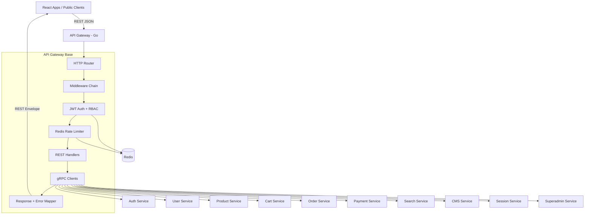
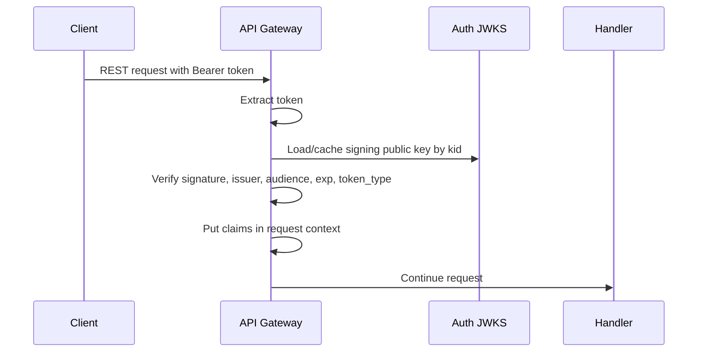
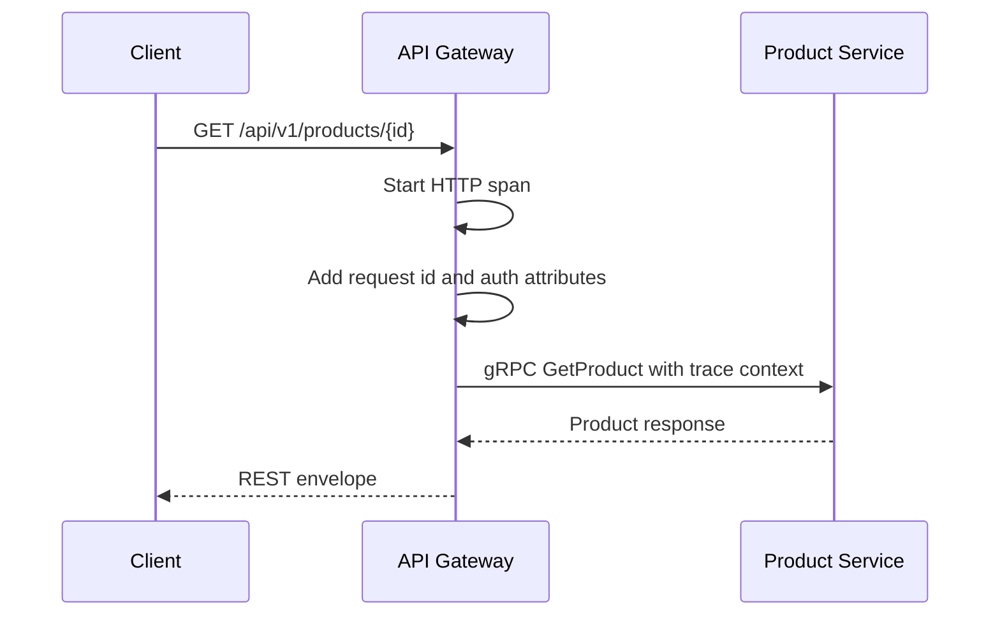
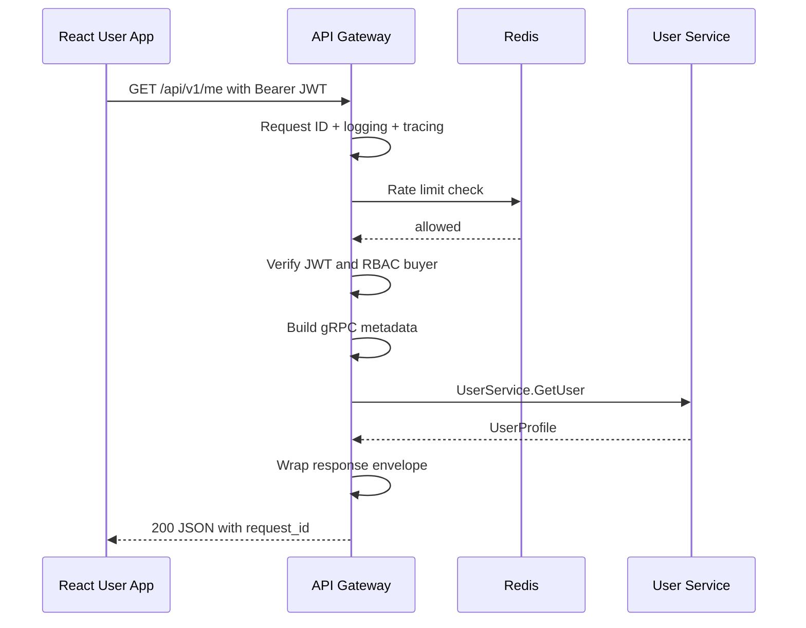
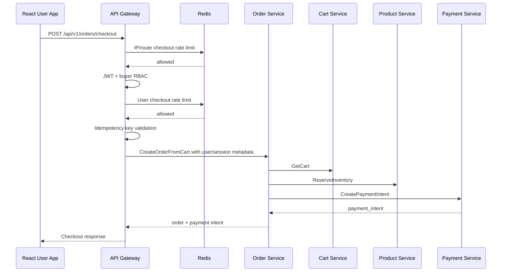

# 🚪 Platform Foundation - Task 5: API Gateway Base


## 📌 Task Summary

| Field | Detail |
|---|---|
| Task Name | API gateway base |
| Source | `docs/01-micro-tasks.md` → `Platform Foundation` → Task 5 |
| Priority | `P0` foundation/blocker |
| Dependency | Platform Foundation Task 2: Create proto strategy |
| Main Goal | Gateway REST request receive karega, auth check karega, gRPC service call karega |
| Output Type | Structured implementation guide |
| Not Included | Full business service implementation, real proto files, database migrations, Kubernetes manifests, CI pipeline |

> **Simple Hinglish goal:** API Gateway public clients ka entry point hoga. Frontend REST JSON request bhejega, Gateway request validate/authenticate karega, phir generated gRPC client se correct backend service ko call karega, aur final response common REST envelope me browser ko return karega.

---

## ✅ Final Output Created

```text
TaskImplementation/
└── Platform Foundation/
    ├── task1.md
    ├── task2.md
    ├── task3.md
    ├── task4.md
    └── task5.md
```

### Why this structure?

- `TaskImplementation/` task-wise implementation guides ke liye central folder hai.
- `Platform Foundation/` folder already present tha, isliye usko keep kiya gaya.
- `task5.md` sirf **Platform Foundation - Task 5** ka guide hai.
- Actual `backend/services/api-gateway/` files create nahi kiye gaye, kyunki requested output sirf folder structure aur `task5.md` content generate karna tha.

---

## 🧭 Implementation Approach

Is guide ko banate time project ke existing documentation ko base banaya gaya:

| Document | Kya use kiya gaya |
|---|---|
| `docs/01-micro-tasks.md` | Task 5 ka exact scope: REST receive, auth check, gRPC service call |
| `docs/02-system-architecture.md` | API Gateway responsibilities, REST → gRPC flow, request id, rate limiting, observability |
| `docs/03-folder-structure.md` | `backend/services/api-gateway/` ka recommended folder layout and middleware order |
| `docs/04-microservice-design.md` | Gateway purpose, clients list, no primary DB rule |
| `docs/06-auth-security.md` | JWT claims, RBAC roles, rate limits, security headers |
| `docs/12-logging-monitoring-scalability.md` | Structured logs, Prometheus metrics, OpenTelemetry traces |
| `docs/13-developer-guide.md` | REST response convention, service coding flow, production readiness checklist |
| `api/master-api.json` | Public route → service → gRPC method → auth mapping |
| `TaskImplementation/Platform Foundation/task2.md` | Proto strategy and generated gRPC client dependency |
| `TaskImplementation/Platform Foundation/task3.md` | Shared Go libs for config, logger, errors, middleware, grpcclient, validation |
| `TaskImplementation/Platform Foundation/task4.md` | Local Redis/service targets from Docker Compose stack |

---

## 🧱 Task Boundary

### Included in Task 5

- API Gateway service ka target folder structure
- REST router base design
- Middleware chain order
- JWT auth and RBAC middleware strategy
- gRPC client setup strategy
- REST handler → gRPC client call examples
- Common response envelope and error mapping
- Redis-backed rate limiting plan
- Health, metrics, tracing, and security headers baseline
- Mermaid architecture and request flow diagrams
- External libraries/tools ka explanation with install commands

### Not Included in Task 5

- Auth Service, User Service, Product Service, ya kisi business service ka real implementation
- Actual generated proto code
- Full `api/master-api.json` route implementation
- Payment webhook provider signature logic details
- Database queries or migrations
- Kubernetes manifests
- CI/CD pipeline
- gRPC-Web bridge, kyunki wo API Gateway task list me later P2 item hai

> 🟢 **Rule:** Gateway business rules ka owner nahi hoga. Gateway edge concerns handle karega: routing, auth, validation, rate limiting, error mapping, and response shaping. Real domain decisions backend services me rahenge.

---

## 🗂️ Target API Gateway Folder Structure

Task 5 ke liye recommended implementation structure:

```text
backend/
├── go.work
├── shared/
│   ├── authctx/
│   ├── config/
│   ├── errors/
│   ├── grpcclient/
│   ├── logger/
│   ├── middleware/
│   ├── tracing/
│   └── validation/
└── services/
    └── api-gateway/
        ├── go.mod
        ├── cmd/
        │   └── server/
        │       └── main.go
        ├── internal/
        │   ├── config/
        │   │   └── config.go
        │   ├── clients/
        │   │   ├── clients.go
        │   │   ├── auth_client.go
        │   │   ├── user_client.go
        │   │   ├── product_client.go
        │   │   ├── cart_client.go
        │   │   ├── order_client.go
        │   │   └── payment_client.go
        │   ├── routes/
        │   │   ├── router.go
        │   │   ├── public.go
        │   │   ├── buyer.go
        │   │   ├── seller.go
        │   │   └── admin.go
        │   ├── handlers/
        │   │   ├── auth_handler.go
        │   │   ├── user_handler.go
        │   │   ├── product_handler.go
        │   │   ├── cart_handler.go
        │   │   ├── order_handler.go
        │   │   └── response.go
        │   ├── middleware/
        │   │   ├── auth.go
        │   │   ├── rbac.go
        │   │   ├── rate_limit.go
        │   │   ├── security_headers.go
        │   │   └── validation.go
        │   └── server/
        │       └── http_server.go
        └── deploy/
            └── Dockerfile
```

### Folder Responsibility

| Path | Responsibility |
|---|---|
| `cmd/server/main.go` | App bootstrap: config load, logger, clients, router, HTTP server |
| `internal/config/` | Gateway-specific env config and required service targets |
| `internal/clients/` | Generated gRPC clients ko initialize and expose karna |
| `internal/routes/` | REST route groups define karna |
| `internal/handlers/` | HTTP request parse karke gRPC client call karna |
| `internal/middleware/` | Gateway-specific auth, RBAC, rate limiting, security headers |
| `internal/server/` | HTTP server timeouts and graceful shutdown |
| `deploy/Dockerfile` | Future container build ke liye service image |

> 🟡 **Note:** Task 5 me ye target structure document kiya gaya hai. Actual backend files tab create honge jab implementation phase start hoga.

---

## 🧩 API Gateway Architecture



**Hinglish explanation:**  
Client ko sirf Gateway ka REST API pata hota hai. Gateway ke andar route match hota hai, middleware request ko secure and observe karta hai, handler request DTO banata hai, gRPC client internal service ko call karta hai, aur response mapper final JSON envelope return karta hai.

---

## 🔌 External Libraries and Tools Used

| Tool/Library | What it is | Why used | Install/Use |
|---|---|---|---|
| Go 1.24+ | Backend programming language/runtime | Gateway Go me lightweight, concurrent, and production-friendly banega | `go version` se verify karo |
| `net/http` | Go standard HTTP server | Stable HTTP server, timeouts, graceful shutdown support | Built-in, extra install nahi |
| `github.com/go-chi/chi/v5` | Lightweight HTTP router | REST route groups, params, middleware chain clean banane ke liye | `go get github.com/go-chi/chi/v5` |
| `google.golang.org/grpc` | gRPC client framework | Gateway se internal services ko typed RPC call karne ke liye | `go get google.golang.org/grpc` |
| Generated proto clients | Buf/protoc output | `AuthServiceClient`, `ProductServiceClient` jaise typed clients milte hain | `buf generate` |
| `github.com/golang-jwt/jwt/v5` | JWT parsing/validation library | Access token validate, claims parse, `kid` header support ke liye | `go get github.com/golang-jwt/jwt/v5` |
| `github.com/redis/go-redis/v9` | Redis client | Rate limiting, temporary request metadata, token/session checks ke liye | `go get github.com/redis/go-redis/v9` |
| `github.com/go-playground/validator/v10` | DTO validation library | Request body/query validation centralized karne ke liye | `go get github.com/go-playground/validator/v10` |
| `go.uber.org/zap` | Structured logger | Fast JSON logs with request id, route, status, latency | `go get go.uber.org/zap` |
| OpenTelemetry Go | Tracing instrumentation | Request trace propagate karne ke liye | `go get go.opentelemetry.io/otel` |
| Prometheus client | Metrics exporter | `/metrics` endpoint and request metrics expose karne ke liye | `go get github.com/prometheus/client_golang/prometheus/promhttp` |
| Docker Compose | Local infra runtime | Redis and future services local run karne ke liye | `docker compose -f infra/compose/docker-compose.local.yml up -d` |

### Install commands

```bash
cd backend/services/api-gateway

go get github.com/go-chi/chi/v5
go get google.golang.org/grpc
go get github.com/golang-jwt/jwt/v5
go get github.com/redis/go-redis/v9
go get github.com/go-playground/validator/v10
go get go.uber.org/zap
go get go.opentelemetry.io/otel
go get github.com/prometheus/client_golang/prometheus/promhttp
```

### Basic usage commands

```bash
# proto clients generate
buf generate

# gateway tests
go test ./...

# gateway run
go run ./cmd/server
```

> 🟡 **Important:** Ye commands recommended implementation ke liye hain. Is task me actual dependency install run nahi kiya gaya, kyunki requested output documentation file hai.

---

## 🪜 Step-by-Step Implementation

## Step 1: Gateway Scope Clear Karo

Gateway ka kaam edge concerns handle karna hai.

### Gateway karega

| Concern | Explanation |
|---|---|
| REST routing | `/api/v1/products`, `/api/v1/cart`, `/api/v1/orders/checkout` jaise routes expose karega |
| Auth check | JWT validate karega and claims context me inject karega |
| RBAC | Route-level role check karega: buyer, seller, admin, superadmin |
| Rate limiting | Redis se per IP/user/route limits enforce karega |
| Validation | Body, query params, path params, content type, body size validate karega |
| gRPC call | Generated client se internal service method call karega |
| Error mapping | gRPC errors ko REST JSON errors me convert karega |
| Observability | Logs, metrics, traces, request id |

### Gateway nahi karega

| Not Gateway Job | Kyu nahi |
|---|---|
| Product publish business rule | Product Service own karega |
| Inventory reserve logic | Product/Order Service own karega |
| Payment capture/refund rules | Payment Service own karega |
| User profile persistence | User Service own karega |
| Direct DB read/write | Har service apni DB own karti hai |

---

## Step 2: Config Define Karo

Gateway ko environment se HTTP port, Redis address, JWT settings, and gRPC service targets milne chahiye.

### Example `.env`

```bash
APP_ENV=local
SERVICE_NAME=api-gateway
HTTP_ADDR=:8080
LOG_LEVEL=info

REDIS_ADDR=localhost:6379

JWT_ISSUER=ecommerce-auth
JWT_AUDIENCE=ecommerce-api
JWT_JWKS_URL=http://localhost:8081/.well-known/jwks.json

AUTH_GRPC_ADDR=localhost:9091
USER_GRPC_ADDR=localhost:9092
PRODUCT_GRPC_ADDR=localhost:9093
CART_GRPC_ADDR=localhost:9094
ORDER_GRPC_ADDR=localhost:9095
PAYMENT_GRPC_ADDR=localhost:9096
SEARCH_GRPC_ADDR=localhost:9097
CMS_GRPC_ADDR=localhost:9098
SESSION_GRPC_ADDR=localhost:9099
SUPERADMIN_GRPC_ADDR=localhost:9100
NOTIFICATION_GRPC_ADDR=localhost:9101
```

### `internal/config/config.go` example

```go
package config

type Config struct {
    ServiceName string
    Env         string
    HTTPAddr    string
    LogLevel    string

    RedisAddr string

    JWTIssuer   string
    JWTAudience string
    JWKSURL     string

    AuthGRPCAddr         string
    UserGRPCAddr         string
    ProductGRPCAddr      string
    CartGRPCAddr         string
    OrderGRPCAddr        string
    PaymentGRPCAddr      string
    SearchGRPCAddr       string
    CMSGRPCAddr          string
    SessionGRPCAddr      string
    SuperadminGRPCAddr   string
    NotificationGRPCAddr string
}
```

**Explanation:**  
Gateway stateless rahega, isliye runtime behavior env config se control hoga. Local me `localhost:*`, Docker Compose me `auth-service:9090`, Kubernetes me `auth-service.core.svc.cluster.local:9090` use hoga.

---

## Step 3: Main Bootstrap Banao

`main.go` ka goal wiring hai: config load, logger create, tracing setup, Redis connect, gRPC clients connect, router create, HTTP server start.

```go
package main

import (
    "context"
    "log"
    "os/signal"
    "syscall"
    "time"

    "github.com/example/ecommerce-platform/backend/services/api-gateway/internal/clients"
    "github.com/example/ecommerce-platform/backend/services/api-gateway/internal/config"
    "github.com/example/ecommerce-platform/backend/services/api-gateway/internal/routes"
)

func main() {
    ctx, stop := signal.NotifyContext(context.Background(), syscall.SIGINT, syscall.SIGTERM)
    defer stop()

    cfg, err := config.Load()
    if err != nil {
        log.Fatal(err)
    }

    grpcClients, err := clients.New(ctx, cfg)
    if err != nil {
        log.Fatal(err)
    }
    defer grpcClients.Close()

    router := routes.NewRouter(cfg, grpcClients)

    srv := NewHTTPServer(cfg.HTTPAddr, router)
    go func() {
        if err := srv.ListenAndServe(); err != nil {
            log.Println(err)
        }
    }()

    <-ctx.Done()

    shutdownCtx, cancel := context.WithTimeout(context.Background(), 10*time.Second)
    defer cancel()
    _ = srv.Shutdown(shutdownCtx)
}
```

**Explanation:**  
Gateway graceful shutdown support karega. Jab container stop signal receive karega, server new requests accept karna band karega and existing requests ko short timeout ke andar complete karne dega.

---

## Step 4: gRPC Clients Setup Karo

Gateway generated proto clients ko wrap karega, taaki handlers directly service address/dialing details na jaane.

### Client registry

```go
package clients

import (
    "context"

    "google.golang.org/grpc"
)

type Clients struct {
    Auth    AuthClient
    User    UserClient
    Product ProductClient
    Cart    CartClient
    Order   OrderClient
    Payment PaymentClient

    conns []*grpc.ClientConn
}

func New(ctx context.Context, cfg Config) (*Clients, error) {
    authConn, err := dial(ctx, cfg.AuthGRPCAddr)
    if err != nil {
        return nil, err
    }

    userConn, err := dial(ctx, cfg.UserGRPCAddr)
    if err != nil {
        _ = authConn.Close()
        return nil, err
    }

    return &Clients{
        Auth:  NewAuthClient(authConn),
        User:  NewUserClient(userConn),
        conns: []*grpc.ClientConn{authConn, userConn},
    }, nil
}

func (c *Clients) Close() {
    for _, conn := range c.conns {
        _ = conn.Close()
    }
}
```

### Dial helper

```go
func dial(ctx context.Context, addr string) (*grpc.ClientConn, error) {
    ctx, cancel := context.WithTimeout(ctx, 5*time.Second)
    defer cancel()

    return grpc.DialContext(
        ctx,
        addr,
        grpc.WithTransportCredentials(insecure.NewCredentials()),
        grpc.WithBlock(),
        grpc.WithUnaryInterceptor(outboundUnaryInterceptor()),
    )
}
```

**Explanation:**  
`grpc.WithBlock()` startup pe connection verify karta hai. Local dev me insecure credentials okay hain. Production me TLS/mTLS ya service mesh use hoga.

---

## Step 5: Middleware Chain Define Karo

Docs ke according Gateway HTTP middleware order:

1. Request ID
2. Real IP / forwarded headers
3. Panic recovery
4. Structured logging
5. Metrics
6. Tracing
7. CORS
8. Rate limiting
9. Authentication
10. RBAC
11. Request validation

### Router example

```go
package routes

import (
    "net/http"

    "github.com/go-chi/chi/v5"
    "github.com/prometheus/client_golang/prometheus/promhttp"
)

func NewRouter(cfg Config, clients *Clients) http.Handler {
    r := chi.NewRouter()

    r.Use(RequestID)
    r.Use(RealIP)
    r.Use(Recoverer)
    r.Use(StructuredLogger)
    r.Use(Metrics)
    r.Use(Tracing)
    r.Use(CORS)
    r.Use(SecurityHeaders)
    r.Use(RateLimit)

    r.Get("/health/live", live)
    r.Get("/health/ready", ready(clients))
    r.Handle("/metrics", promhttp.Handler())

    r.Route("/api/v1", func(api chi.Router) {
        registerPublicRoutes(api, clients)
        registerBuyerRoutes(api, clients)
        registerSellerRoutes(api, clients)
        registerAdminRoutes(api, clients)
    })

    return r
}
```

**Explanation:**  
Health and metrics endpoints public but controlled hone chahiye. `/api/v1` ke andar route groups auth requirement ke basis pe split kiye gaye hain.

---

## Step 6: Public, Buyer, Seller, Admin Route Groups Banao

`api/master-api.json` me auth levels already defined hain. Gateway route groups same levels follow karenge.

### Auth level mapping

| Auth Level | Required? | Allowed roles |
|---|---:|---|
| `public` | No JWT | No role needed |
| `buyer` | JWT required | `buyer`, `seller`, `admin`, `superadmin` |
| `seller` | JWT required | `seller`, `seller_manager`, `seller_catalog_editor`, `seller_order_manager`, `superadmin` |
| `admin` | JWT required | `admin`, `operations_admin`, `finance_admin`, `catalog_admin`, `superadmin` |
| `superadmin` | JWT required | `superadmin` |
| `webhook` | Signature required | Provider signature, not JWT |

### Representative route mapping

| REST Route | Auth | Internal gRPC |
|---|---|---|
| `POST /api/v1/auth/signup` | public | `AuthService.Register` |
| `POST /api/v1/auth/login` | public | `AuthService.Login` |
| `GET /api/v1/products` | public | `ProductService.ListProducts` |
| `GET /api/v1/search` | public | `SearchService.SearchProducts` |
| `GET /api/v1/me` | buyer | `UserService.GetUser` |
| `GET /api/v1/cart` | buyer | `CartService.GetCart` |
| `POST /api/v1/orders/checkout` | buyer | `OrderService.CreateOrderFromCart` |
| `POST /api/v1/seller/products` | seller | `ProductService.CreateProduct` |
| `GET /api/v1/analytics/live` | admin | `SessionService.GetLiveMetrics` |
| `PATCH /api/v1/admin/settings/{key}` | superadmin | `SuperadminService.UpdatePlatformSetting` |

### Route group code example

```go
func registerBuyerRoutes(r chi.Router, clients *Clients) {
    h := handlers.NewUserHandler(clients.User)

    r.Group(func(protected chi.Router) {
        protected.Use(AuthRequired)
        protected.Use(RequireRoles("buyer", "seller", "admin", "superadmin"))

        protected.Get("/me", h.GetMe)
        protected.Patch("/me", h.UpdateMe)
    })
}
```

**Explanation:**  
Buyer route group ke andar JWT mandatory hai. `RequireRoles` middleware route-level guard hai. Service-level authorization still backend service ke andar rahegi.

---

## Step 7: JWT Auth Middleware Banao

Gateway incoming request ke `Authorization: Bearer <token>` header ko validate karega.

### Validation strategy

| Option | Use case |
|---|---|
| Local JWT verification with JWKS cache | Normal high-traffic API calls ke liye fast validation |
| `AuthService.VerifyAccessToken` introspection | Sensitive flows, revoked-token check, ya JWKS unavailable fallback |

**Recommended base:** Gateway local JWT verification karega using Auth Service JWKS/public keys. Sensitive actions me Auth Service introspection add kiya ja sakta hai.

### Expected JWT claims

```json
{
  "sub": "user_123",
  "sid": "sess_123",
  "roles": ["buyer"],
  "seller_id": "seller_456",
  "token_type": "access",
  "iss": "ecommerce-auth",
  "aud": "ecommerce-api",
  "exp": 1760000900
}
```

### Middleware flow



### Code example

```go
func AuthRequired(next http.Handler) http.Handler {
    return http.HandlerFunc(func(w http.ResponseWriter, r *http.Request) {
        token := bearerToken(r.Header.Get("Authorization"))
        if token == "" {
            WriteError(w, r, ErrUnauthorized("missing access token"))
            return
        }

        claims, err := verifier.Verify(r.Context(), token)
        if err != nil {
            WriteError(w, r, ErrUnauthorized("invalid access token"))
            return
        }

        if claims.TokenType != "access" {
            WriteError(w, r, ErrUnauthorized("invalid token type"))
            return
        }

        ctx := authctx.WithClaims(r.Context(), claims)
        next.ServeHTTP(w, r.WithContext(ctx))
    })
}
```

**Explanation:**  
Gateway full JWT downstream services ko forward nahi karega. Gateway validated claims se safe metadata banayega, jaise `x-user-id`, `x-session-id`, `x-roles`, `x-request-id`.

---

## Step 8: RBAC Middleware Banao

JWT valid hone ke baad route-level role check hota hai.

```go
func RequireRoles(allowed ...string) func(http.Handler) http.Handler {
    allowedSet := make(map[string]struct{}, len(allowed))
    for _, role := range allowed {
        allowedSet[role] = struct{}{}
    }

    return func(next http.Handler) http.Handler {
        return http.HandlerFunc(func(w http.ResponseWriter, r *http.Request) {
            claims, ok := authctx.ClaimsFromContext(r.Context())
            if !ok {
                WriteError(w, r, ErrUnauthorized("missing auth context"))
                return
            }

            for _, role := range claims.Roles {
                if _, exists := allowedSet[role]; exists {
                    next.ServeHTTP(w, r)
                    return
                }
            }

            WriteError(w, r, ErrForbidden("insufficient role"))
        })
    }
}
```

**Hinglish explanation:**  
Auth middleware answer deta hai: "ye user kaun hai?" RBAC middleware answer deta hai: "is user ko ye route access karne ki permission hai ya nahi?"

---

## Step 9: Redis Rate Limiting Add Karo

Rate limit API abuse, brute force, and accidental overload se protect karta hai.

Gateway me rate limiting 2 layers me socha ja sakta hai:

| Layer | Runs when | Key type |
|---|---|---|
| Edge rate limit | Auth se pehle | IP + route |
| User rate limit | Auth ke baad protected route group me | user id + route |

### Suggested route limits

| Route Group | Limit Example |
|---|---:|
| Login | 5 attempts per IP per 10 min |
| OTP send | 3 per target per 15 min |
| Product search | 120 per IP per min |
| Cart mutations | 60 per user per min |
| Checkout | 10 per user per 10 min |
| Admin mutations | 30 per admin per min |

### Key strategy

```text
rl:ip:{ip}:route:{route}
rl:user:{user_id}:route:{route}
rl:target:{email_or_phone_hash}:otp
```

### Middleware sketch

```go
func RateLimit(next http.Handler) http.Handler {
    return http.HandlerFunc(func(w http.ResponseWriter, r *http.Request) {
        key := rateLimitKey(r)
        allowed, retryAfter, err := limiter.Allow(r.Context(), key)
        if err != nil {
            WriteError(w, r, ErrUnavailable("rate limiter unavailable"))
            return
        }

        if !allowed {
            w.Header().Set("Retry-After", retryAfter.String())
            WriteError(w, r, ErrTooManyRequests("too many requests"))
            return
        }

        next.ServeHTTP(w, r)
    })
}
```

**Explanation:**  
Public routes mostly IP-based limit use karenge. Protected routes pe pehle IP limit chalega, phir JWT validate hone ke baad optional user-id based limit chalega. OTP/password routes target hash based limit bhi use karenge.

---

## Step 10: Request Validation Add Karo

Validation 4 layers me hogi:

1. Frontend form validation for UX
2. API Gateway request DTO validation
3. Service usecase validation
4. Database constraints

### DTO example

```go
type LoginRequest struct {
    Email    string `json:"email" validate:"required,email"`
    Password string `json:"password" validate:"required,min=8,max=128"`
}
```

### Decode helper

```go
func DecodeJSON(r *http.Request, dst any) error {
    if r.Header.Get("Content-Type") != "application/json" {
        return ErrUnsupportedMediaType("content-type must be application/json")
    }

    r.Body = http.MaxBytesReader(nil, r.Body, 1<<20)
    dec := json.NewDecoder(r.Body)
    dec.DisallowUnknownFields()

    if err := dec.Decode(dst); err != nil {
        return ErrValidation("invalid JSON body")
    }

    return validator.Struct(dst)
}
```

**Explanation:**  
Gateway invalid request ko service tak nahi bhejega. Isse service clean input receive karegi and frontend ko fast feedback milega.

---

## Step 11: Handler REST → gRPC Mapping Banao

Handler ka kaam simple hona chahiye:

1. Request body/path/query parse karo
2. Auth context lo
3. Proto request banao
4. gRPC client call karo
5. REST response envelope return karo

### Login handler example

```go
func (h *AuthHandler) Login(w http.ResponseWriter, r *http.Request) {
    var req LoginRequest
    if err := DecodeJSON(r, &req); err != nil {
        WriteError(w, r, err)
        return
    }

    ctx, cancel := context.WithTimeout(r.Context(), 1500*time.Millisecond)
    defer cancel()

    resp, err := h.auth.Login(ctx, &authv1.LoginRequest{
        Email:    req.Email,
        Password: req.Password,
    })
    if err != nil {
        WriteError(w, r, MapGRPCError(err))
        return
    }

    WriteJSON(w, r, http.StatusOK, AuthSessionResponse{
        AccessToken:  resp.AccessToken,
        RefreshToken: resp.RefreshToken,
        ExpiresIn:    resp.ExpiresIn,
    })
}
```

### Product list handler example

```go
func (h *ProductHandler) ListProducts(w http.ResponseWriter, r *http.Request) {
    query := r.URL.Query()

    ctx, cancel := context.WithTimeout(r.Context(), 300*time.Millisecond)
    defer cancel()

    resp, err := h.product.ListProducts(ctx, &productv1.ListProductsRequest{
        Query:    query.Get("q"),
        Category: query.Get("category"),
        Page:     parseInt(query.Get("page"), 1),
        PageSize: parseInt(query.Get("page_size"), 20),
    })
    if err != nil {
        WriteError(w, r, MapGRPCError(err))
        return
    }

    WriteJSON(w, r, http.StatusOK, resp)
}
```

**Hinglish explanation:**  
Handler me heavy business logic nahi. Handler sirf protocol translation karta hai: HTTP JSON ko proto request me convert karna, and proto response ko frontend-friendly JSON me return karna.

---

## Step 12: Common Response Envelope Banao

Docs ke according REST response convention:

### Success

```json
{
  "data": {},
  "request_id": "req_123",
  "error": null
}
```

### Error

```json
{
  "data": null,
  "request_id": "req_123",
  "error": {
    "code": "VALIDATION_ERROR",
    "message": "Invalid request",
    "details": []
  }
}
```

### Go response helper

```go
type Envelope struct {
    Data      any        `json:"data"`
    RequestID string     `json:"request_id"`
    Error     *APIError  `json:"error"`
}

type APIError struct {
    Code    string `json:"code"`
    Message string `json:"message"`
    Details any    `json:"details,omitempty"`
}

func WriteJSON(w http.ResponseWriter, r *http.Request, status int, data any) {
    w.Header().Set("Content-Type", "application/json")
    w.WriteHeader(status)

    _ = json.NewEncoder(w).Encode(Envelope{
        Data:      data,
        RequestID: RequestIDFromContext(r.Context()),
        Error:     nil,
    })
}
```

**Explanation:**  
Frontend ko har endpoint se predictable shape milegi. Success aur error dono me `request_id` rahega, debugging easy hogi.

---

## Step 13: gRPC Error Mapping Karo

gRPC service errors ko frontend-friendly HTTP status and error code me convert karna Gateway ka important kaam hai.

| gRPC Code | HTTP Status | REST Error Code |
|---|---:|---|
| `InvalidArgument` | `400` | `VALIDATION_ERROR` |
| `Unauthenticated` | `401` | `UNAUTHORIZED` |
| `PermissionDenied` | `403` | `FORBIDDEN` |
| `NotFound` | `404` | `NOT_FOUND` |
| `AlreadyExists` | `409` | `CONFLICT` |
| `ResourceExhausted` | `429` | `RATE_LIMITED` |
| `FailedPrecondition` | `422` | `FAILED_PRECONDITION` |
| `Unavailable` | `503` | `SERVICE_UNAVAILABLE` |
| `DeadlineExceeded` | `504` | `TIMEOUT` |
| `Internal` | `500` | `INTERNAL_ERROR` |

```go
func MapGRPCError(err error) error {
    st, ok := status.FromError(err)
    if !ok {
        return ErrInternal("unexpected error")
    }

    switch st.Code() {
    case codes.InvalidArgument:
        return ErrValidation(st.Message())
    case codes.Unauthenticated:
        return ErrUnauthorized(st.Message())
    case codes.PermissionDenied:
        return ErrForbidden(st.Message())
    case codes.NotFound:
        return ErrNotFound(st.Message())
    case codes.DeadlineExceeded:
        return ErrTimeout(st.Message())
    default:
        return ErrInternal("internal server error")
    }
}
```

**Security note:**  
Internal service errors ka raw stack trace ya DB details frontend ko return nahi karna. Logs me request id ke saath detailed error safe redaction ke baad store hoga.

---

## Step 14: Auth Context gRPC Metadata Me Propagate Karo

Gateway token validate karega, phir selected safe claims metadata me downstream service ko bhejega.

### Metadata keys

| Key | Value |
|---|---|
| `x-request-id` | Request correlation id |
| `x-user-id` | JWT `sub` |
| `x-session-id` | JWT `sid` |
| `x-roles` | Comma-separated roles |
| `x-seller-id` | Seller context if present |
| `traceparent` | W3C trace propagation |

### gRPC call context example

```go
func ContextWithAuthMetadata(ctx context.Context, claims Claims) context.Context {
    md := metadata.Pairs(
        "x-user-id", claims.Subject,
        "x-session-id", claims.SessionID,
        "x-roles", strings.Join(claims.Roles, ","),
    )

    if claims.SellerID != "" {
        md.Append("x-seller-id", claims.SellerID)
    }

    return metadata.NewOutgoingContext(ctx, md)
}
```

**Explanation:**  
Services ko user context chahiye, lekin full JWT forward karna avoid karna better hai. Gateway trusted edge validation karega and minimal context pass karega.

---

## Step 15: Security Headers Add Karo

Gateway browser-facing hai, isliye common security headers yahi se add honge.

```go
func SecurityHeaders(next http.Handler) http.Handler {
    return http.HandlerFunc(func(w http.ResponseWriter, r *http.Request) {
        w.Header().Set("X-Content-Type-Options", "nosniff")
        w.Header().Set("X-Frame-Options", "DENY")
        w.Header().Set("Referrer-Policy", "strict-origin-when-cross-origin")
        w.Header().Set("Strict-Transport-Security", "max-age=31536000; includeSubDomains")

        next.ServeHTTP(w, r)
    })
}
```

### CORS baseline

| Environment | Allowed origins |
|---|---|
| Local | `http://localhost:5173`, seller/admin local URLs |
| Staging | Staging frontend domains |
| Production | Real production domains only |

> 🔴 **Avoid:** `Access-Control-Allow-Origin: *` with credentials. Ye secure nahi hota.

---

## Step 16: Health and Readiness Endpoints Add Karo

### Endpoints

| Endpoint | Purpose |
|---|---|
| `GET /health/live` | Process alive hai ya nahi |
| `GET /health/ready` | Gateway dependencies ready hain ya nahi |
| `GET /metrics` | Prometheus metrics scrape |

### Readiness checks

| Dependency | Check |
|---|---|
| Redis | `PING` |
| Auth gRPC | `grpc.health.v1.Health/Check` |
| User gRPC | Health check |
| Product gRPC | Health check |
| Required configs | Startup validation |

```go
func ready(clients *Clients) http.HandlerFunc {
    return func(w http.ResponseWriter, r *http.Request) {
        if err := clients.Ping(r.Context()); err != nil {
            WriteError(w, r, ErrUnavailable("gateway dependencies not ready"))
            return
        }

        WriteJSON(w, r, http.StatusOK, map[string]string{
            "status": "ready",
        })
    }
}
```

**Explanation:**  
Liveness simple hona chahiye. Readiness dependencies check karega, taaki load balancer unhealthy pod ko traffic na bheje.

---

## Step 17: Observability Baseline Add Karo

Gateway pe har request observable honi chahiye.

### Logs

Required fields:

| Field | Example |
|---|---|
| `service` | `api-gateway` |
| `environment` | `local` |
| `request_id` | `req_123` |
| `trace_id` | `4bf92f...` |
| `route` | `GET /api/v1/products` |
| `status` | `200` |
| `latency_ms` | `42` |
| `user_id_hash` | hashed user id |
| `error_code` | `VALIDATION_ERROR` |

### Metrics

| Metric | Purpose |
|---|---|
| `http_requests_total` | Request count by method, route, status |
| `http_request_duration_seconds` | Latency p50/p95/p99 |
| `gateway_grpc_client_duration_seconds` | Downstream gRPC latency |
| `gateway_rate_limited_total` | Blocked requests count |
| `gateway_auth_failures_total` | Auth failures count |

### Traces



**Explanation:**  
Request id logs ke liye useful hai. Trace id distributed flow ke liye useful hai. Dono response headers me bhi return kiye ja sakte hain.

---

## Step 18: Full Protected Request Flow



**Hinglish explanation:**  
User profile request me Gateway pehle edge checks karta hai. Agar token valid hai and buyer role allowed hai, tabhi User Service call hota hai. User Service ko direct browser traffic nahi milta.

---

## Step 19: Checkout Request Flow



**Important detail:**  
Gateway idempotency header require kar sakta hai, but duplicate checkout prevent karna Order Service ka core responsibility rahega.

---

## Step 20: Webhook Route Boundary Define Karo

Payment webhook route `api/master-api.json` me defined hai:

```text
POST /api/v1/webhooks/payments/{provider}
```

Webhook auth JWT nahi use karega. Is route pe provider signature verify hoga.

### Webhook base rule

| Rule | Explanation |
|---|---|
| Raw body preserve | Signature verification ke liye raw body needed hota hai |
| Provider-specific signature | Stripe/Razorpay-like provider ke header validate honge |
| No user JWT | Provider server call karta hai, user browser nahi |
| Forward to Payment Service | Gateway verified request Payment Service ko pass karega |

> 🟡 **Task 5 boundary:** Webhook route ka base pattern define hua. Exact provider signature implementation Payment Service provider abstraction task me detail hogi.

---

## Step 21: API Gateway Local Run Flow

Recommended local flow:

```bash
# 1. Local dependencies start
docker compose -f infra/compose/docker-compose.local.yml up -d

# 2. Proto clients generate
buf generate

# 3. Gateway tests
cd backend/services/api-gateway
go test ./...

# 4. Gateway run
go run ./cmd/server
```

### Smoke test examples

```bash
curl http://localhost:8080/health/live
curl http://localhost:8080/health/ready
curl http://localhost:8080/api/v1/products
```

### Protected route smoke test

```bash
curl \
  -H "Authorization: Bearer $ACCESS_TOKEN" \
  http://localhost:8080/api/v1/me
```

---

## 🧪 Testing Strategy

### Unit tests

| Area | Test |
|---|---|
| Auth middleware | missing token, expired token, invalid issuer, valid token |
| RBAC middleware | allowed role, denied role, missing claims |
| Rate limiter | allowed request, blocked request, Redis error behavior |
| Validation | invalid JSON, unknown field, missing required fields |
| Error mapper | gRPC code → HTTP status/code |
| Response envelope | success and error shape |

### Handler tests

Use fake gRPC clients:

```go
type fakeUserClient struct {
    resp *userv1.GetUserResponse
    err  error
}

func (f fakeUserClient) GetUser(ctx context.Context, req *userv1.GetUserRequest, opts ...grpc.CallOption) (*userv1.GetUserResponse, error) {
    return f.resp, f.err
}
```

### Integration tests

| Flow | Expected |
|---|---|
| Public product list | No JWT required |
| Protected profile route | JWT required |
| Seller product create | Seller role required |
| Admin analytics | Admin role required |
| Downstream service unavailable | Gateway returns `503 SERVICE_UNAVAILABLE` envelope |

---

## 🧾 Route Coverage From `api/master-api.json`

Gateway base should be ready to support these service groups:

| Service | REST endpoints count |
|---|---:|
| `auth-service` | 8 |
| `user-service` | 8 |
| `product-service` | 6 |
| `search-service` | 2 |
| `cart-service` | 6 |
| `wishlist-service` | 4 |
| `order-service` | 7 |
| `payment-service` | 4 |
| `cms-service` | 6 |
| `session-service` | 6 |
| `notification-service` | 2 |
| `superadmin-service` | 8 |

> 🟢 **Task 5 focus:** Base structure and patterns define karna. Har endpoint ka full handler implementation later service-specific/API Gateway micro-tasks me complete hoga.

---

## 🛡️ Security Checklist

| Check | Status |
|---|---|
| JWT signature, issuer, audience, expiry validate | ✅ Required |
| `token_type=access` enforce | ✅ Required |
| Route-level RBAC | ✅ Required |
| Full JWT logs me print nahi karna | ✅ Required |
| Password/OTP/refresh token logs me print nahi karna | ✅ Required |
| Security headers | ✅ Required |
| Request body size limit | ✅ Required |
| Content-Type validation | ✅ Required |
| Redis rate limiting | ✅ Required |
| Provider webhook signature route separated | ✅ Required |
| Downstream gRPC deadlines | ✅ Required |

---

## 🚦 Production Readiness Checklist

| Area | Requirement |
|---|---|
| Startup | Config validation and dependency connection checks |
| HTTP server | Read/write/idle timeouts |
| Shutdown | Graceful shutdown on `SIGTERM` |
| Health | `/health/live`, `/health/ready` |
| Metrics | `/metrics` Prometheus endpoint |
| Logs | Structured JSON logs with request id |
| Tracing | OpenTelemetry trace propagation |
| Auth | JWKS cache and key rotation via `kid` |
| Rate limit | Redis-backed route/user/IP limits |
| Error handling | Common REST envelope |
| Security | Redaction, CORS, security headers |
| Scaling | Stateless pods, horizontal scaling by CPU/RPS/latency |

---

## 🧯 Troubleshooting Guide

| Problem | Likely Cause | Fix |
|---|---|---|
| `401 UNAUTHORIZED` | Missing/expired/invalid JWT | Login again, check issuer/audience/expiry |
| `403 FORBIDDEN` | Role not allowed | Check route auth level and JWT roles |
| `429 RATE_LIMITED` | Redis limiter blocked request | Wait for `Retry-After`, inspect limiter key |
| `503 SERVICE_UNAVAILABLE` | Downstream gRPC service down | Check service health and gRPC address config |
| `504 TIMEOUT` | gRPC deadline exceeded | Check downstream latency and deadline settings |
| CORS error | Origin not allowed | Add correct frontend origin in gateway config |
| Empty `request_id` | Request ID middleware missing/wrong order | Put Request ID middleware first |

---

## ✅ Implementation Checklist

| Requirement | Status |
|---|---|
| `TaskImplementation/` folder exists | ✅ Done |
| `TaskImplementation/Platform Foundation/` folder kept | ✅ Done |
| `task5.md` created | ✅ Done |
| Step-by-step implementation in Hinglish | ✅ Done |
| Clear explanation of each part | ✅ Done |
| External libraries/tools explained | ✅ Done |
| Install and usage commands included | ✅ Done |
| Clean folder structure included | ✅ Done |
| Code examples included | ✅ Done |
| Mermaid diagrams included | ✅ Done |
| Scope limited to Platform Foundation Task 5 | ✅ Done |

---

## 🎯 Final Summary

Platform Foundation Task 5 ke liye API Gateway base define ho gaya:

- Gateway public REST entry point hoga.
- Internal communication generated gRPC clients se hoga.
- JWT auth, RBAC, rate limiting, validation, error mapping, and response envelope Gateway me standard honge.
- Redis rate limiting and request metadata ke liye use hoga.
- Observability baseline logs, metrics, and traces ke through ready rahegi.
- Gateway stateless rahega, isliye horizontal scaling easy hogi.

> ✅ **Task 5 complete:** Documentation-level implementation guide ready hai. Actual backend service files intentionally create nahi kiye gaye, kyunki current requested output sirf required folder structure aur `task5.md` content hai.
