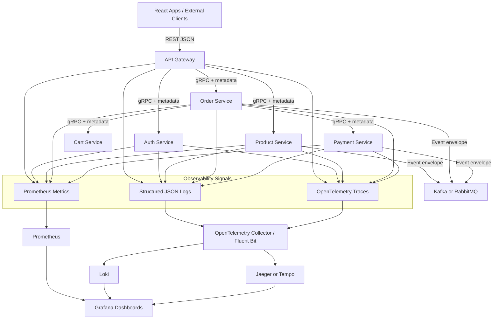
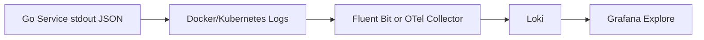
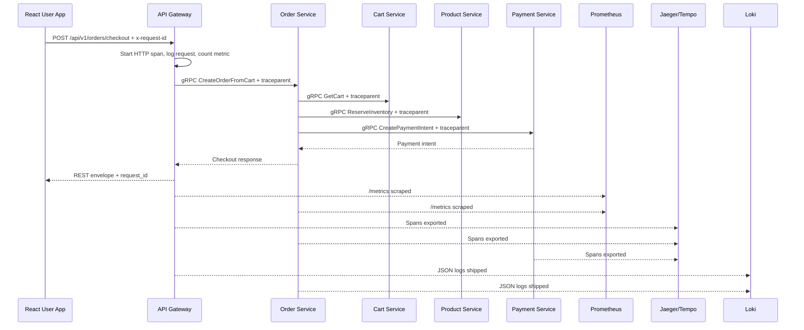
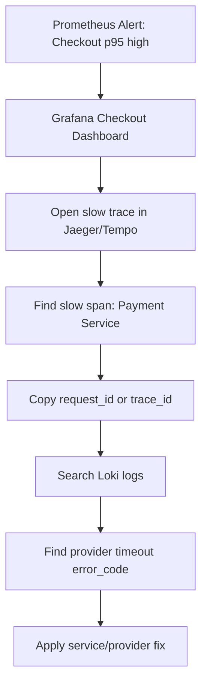

# 📡 Platform Foundation - Task 6: Observability Baseline


## 📌 Task Summary

| Field | Detail |
|---|---|
| Task Name | Observability baseline |
| Source | `docs/01-micro-tasks.md` → `Platform Foundation` → Task 6 |
| Priority | `P1` core platform reliability |
| Dependency | Platform Foundation Task 3: Create shared Go libs |
| Main Goal | Logs, metrics, traces ka format decide karo. Pehle din se monitoring ready rahegi. |
| Output Type | Structured implementation guide |
| Not Included | Full Grafana dashboards, production alert manager setup, Kubernetes manifests, CI pipeline, real service code implementation |

> **Simple Hinglish goal:** Har service same style me logs, metrics, aur traces emit karegi. Jab bug, latency spike, ya checkout failure aaye, team ko ye quickly pata chale: request kahan se aayi, kaunsi service slow thi, kaunsa error code aaya, aur impact kitna tha.

---

## ✅ Final Output Created

```text
TaskImplementation/
└── Platform Foundation/
    ├── task1.md
    ├── task2.md
    ├── task3.md
    ├── task4.md
    ├── task5.md
    └── task6.md
```

### Why this structure?

- `TaskImplementation/` task-wise implementation guides ke liye central folder hai.
- `Platform Foundation/` folder already present tha, isliye usko keep kiya gaya.
- `task6.md` sirf **Platform Foundation - Task 6** ka guide hai.
- Actual `backend/shared/metrics`, `infra/monitoring`, ya service code files create nahi kiye gaye, kyunki requested output sirf required folder structure aur `task6.md` content generate karna tha.

---

## 🧭 Implementation Approach

Is guide ko banate time project ke existing documentation ko base banaya gaya:

| Document | Kya use kiya gaya |
|---|---|
| `docs/01-micro-tasks.md` | Task 6 ka exact scope: logs, metrics, traces ka format decide karna |
| `docs/02-system-architecture.md` | API Gateway, gRPC, Redis, MQ, observability namespace, production principles |
| `docs/03-folder-structure.md` | `backend/shared/`, middleware stack, config env examples, tracing endpoint |
| `docs/04-microservice-design.md` | Service boundaries and communication patterns |
| `docs/11-devops-external-services.md` | Docker, Prometheus, Jaeger/Tempo, Grafana, service ports, event envelope |
| `docs/12-logging-monitoring-scalability.md` | Required log fields, Prometheus metrics, OpenTelemetry traces, alerts |
| `docs/13-developer-guide.md` | Production readiness checklist, coding rules, response convention |
| `TaskImplementation/Platform Foundation/task3.md` | Shared logger, middleware, tracing, errors, health package dependency |
| `TaskImplementation/Platform Foundation/task4.md` | Local Jaeger and Prometheus dependency stack |
| `TaskImplementation/Platform Foundation/task5.md` | Gateway observability usage: request id, metrics endpoint, trace propagation |

---

## 🧱 Task Boundary

### Included in Task 6

- Common observability vocabulary define karna
- JSON log schema and redaction rules
- Prometheus metric naming, labels, and endpoint standard
- OpenTelemetry trace propagation standard
- HTTP middleware and gRPC interceptor observability order
- Event envelope observability fields
- Health, readiness, and metrics endpoint expectations
- Local Prometheus, Jaeger/Tempo, Grafana, Loki/OpenTelemetry Collector usage plan
- Alert rules and dashboard starter panels
- Code examples for logs, metrics, traces, middleware, and event propagation
- Mermaid architecture and request flow diagrams
- Testing and troubleshooting checklist

### Not Included in Task 6

- Business service implementation
- API Gateway route implementation beyond observability examples
- Full Grafana dashboard JSON files
- Production Alertmanager receivers
- Kubernetes `ServiceMonitor`, HPA, or namespace manifests
- CI pipeline checks
- Cloud vendor monitoring setup
- Payment, order, product, auth business metrics implementation details

> 🟢 **Rule:** Task 6 baseline define karta hai. Actual service-specific instrumentation later service tasks me apply hogi.

---

## 🧩 Observability Signals

Observability ka baseline 3 primary signals pe based hoga:

| Signal | Purpose | Example Question |
|---|---|---|
| Logs | Event-level debugging | "Is request me exact error kya aaya?" |
| Metrics | Aggregated health and alerting | "Last 5 min me 5xx rate kitna hai?" |
| Traces | End-to-end request journey | "Checkout flow me kaunsi service slow thi?" |

### Golden IDs

Har request/event me ye identifiers propagate hone chahiye:

| Field | Meaning | Source |
|---|---|---|
| `request_id` | Single external request tracking id | Gateway creates or accepts `x-request-id` |
| `trace_id` | Distributed trace id | OpenTelemetry creates/propagates |
| `span_id` | Current operation span id | OpenTelemetry span |
| `user_id_hash` | PII-safe user reference | Gateway/Auth context |
| `session_id` | User session reference | Auth/Session context where allowed |
| `service` | Current service name | `SERVICE_NAME` env |
| `environment` | `local`, `dev`, `staging`, `prod` | `APP_ENV` env |

---

## 🗂️ Target Observability Folder Structure

Task 6 ke liye recommended future implementation structure:

```text
backend/
├── shared/
│   ├── logger/
│   │   ├── logger.go
│   │   └── zap.go
│   ├── tracing/
│   │   ├── provider.go
│   │   ├── propagation.go
│   │   └── attributes.go
│   ├── metrics/
│   │   ├── registry.go
│   │   ├── http.go
│   │   ├── grpc.go
│   │   └── runtime.go
│   ├── middleware/
│   │   ├── request_id.go
│   │   ├── recovery.go
│   │   ├── logging.go
│   │   ├── metrics.go
│   │   └── tracing.go
│   ├── grpcclient/
│   │   └── interceptors.go
│   ├── events/
│   │   └── envelope.go
│   └── health/
│       └── health.go
└── services/
    ├── api-gateway/
    ├── auth-service/
    ├── product-service/
    └── order-service/

infra/
└── monitoring/
    ├── prometheus/
    │   ├── prometheus.yml
    │   └── alert-rules.yml
    ├── otel-collector/
    │   └── otel-collector.yml
    ├── loki/
    │   └── loki.yml
    └── grafana/
        ├── dashboards/
        │   ├── gateway-overview.json
        │   ├── service-overview.json
        │   └── checkout-flow.json
        └── provisioning/
```

### Folder Responsibility

| Path | Responsibility |
|---|---|
| `backend/shared/logger/` | Structured JSON logger and safe fields |
| `backend/shared/tracing/` | OpenTelemetry setup, propagation, trace attributes |
| `backend/shared/metrics/` | Prometheus collectors, HTTP/gRPC metrics helpers |
| `backend/shared/middleware/` | HTTP request id, logging, metrics, tracing wrappers |
| `backend/shared/grpcclient/` | gRPC metadata propagation and client-side metrics/traces |
| `backend/shared/events/` | Event envelope with trace and request metadata |
| `backend/shared/health/` | Liveness/readiness contracts |
| `infra/monitoring/prometheus/` | Scrape config and alert rules |
| `infra/monitoring/otel-collector/` | Logs/traces/metrics collection pipeline |
| `infra/monitoring/loki/` | Central log storage config |
| `infra/monitoring/grafana/` | Dashboards and datasource provisioning |

> 🟡 **Note:** Ye target structure hai. Is task me actual files create nahi kiye gaye except `task6.md`.

---

## 🏗️ Observability Architecture



**Hinglish explanation:**  
Services apne andar logs, metrics, aur traces generate karengi. Prometheus `/metrics` scrape karega. Traces OpenTelemetry Collector ke through Jaeger/Tempo me jayenge. Logs Loki me store honge. Grafana ek common UI hoga jahan logs, metrics, traces correlate honge.

---

## 🔌 External Libraries and Tools Used

| Tool/Library | What it is | Why used | Install/Use |
|---|---|---|---|
| `go.uber.org/zap` | Fast structured logger | JSON logs with low overhead | `go get go.uber.org/zap` |
| `github.com/prometheus/client_golang` | Prometheus Go client | `/metrics` endpoint and custom metrics expose karne ke liye | `go get github.com/prometheus/client_golang/prometheus` |
| `promhttp` | Prometheus HTTP handler | Metrics endpoint serve karne ke liye | `go get github.com/prometheus/client_golang/prometheus/promhttp` |
| `go.opentelemetry.io/otel` | OpenTelemetry API | Traces and context propagation ke liye | `go get go.opentelemetry.io/otel` |
| `go.opentelemetry.io/otel/sdk` | OpenTelemetry SDK | Tracer provider setup ke liye | `go get go.opentelemetry.io/otel/sdk` |
| `go.opentelemetry.io/otel/exporters/otlp/otlptrace` | OTLP trace exporter | Collector/Jaeger/Tempo ko traces bhejne ke liye | `go get go.opentelemetry.io/otel/exporters/otlp/otlptrace` |
| Prometheus | Metrics scraper and time-series DB | Service health, latency, error rate monitor karne ke liye | Docker Compose service or binary |
| Grafana | Dashboard UI | Metrics, logs, traces visualize karne ke liye | Docker Compose service |
| Loki | Log storage/query engine | Structured logs centralize karne ke liye | Docker Compose service |
| Jaeger/Tempo | Trace backend | Distributed traces inspect karne ke liye | Docker Compose service |
| OpenTelemetry Collector | Telemetry pipeline | Logs/traces/metrics receive, enrich, export karne ke liye | Docker Compose service |
| Fluent Bit | Lightweight log shipper | Container logs Loki/Collector tak ship karne ke liye | Optional local/prod agent |

### Go install commands

```bash
cd backend

go get go.uber.org/zap
go get github.com/prometheus/client_golang/prometheus
go get github.com/prometheus/client_golang/prometheus/promhttp
go get go.opentelemetry.io/otel
go get go.opentelemetry.io/otel/sdk
go get go.opentelemetry.io/otel/exporters/otlp/otlptrace
```

### Local observability tools usage

```bash
# Local dependency stack start
docker compose -f infra/compose/docker-compose.local.yml up -d

# Prometheus UI
open http://localhost:9090

# Jaeger UI
open http://localhost:16686

# Future Grafana UI, if added in compose
open http://localhost:3000
```

> 🟡 **Current task boundary:** Commands future implementation ke liye reference hain. Is guide ne dependencies explain ki hain, install/run execute nahi kiya.

---

## 🪜 Step-by-Step Implementation

## Step 1: Observability Contract Define Karo

Sabse pehle platform-level contract define hota hai:

| Contract | Decision |
|---|---|
| Log format | JSON only |
| Metrics format | Prometheus exposition format |
| Trace format | OpenTelemetry with W3C `traceparent` |
| Request id header | `x-request-id` |
| Trace header | `traceparent` |
| Metrics endpoint | `GET /metrics` |
| Liveness endpoint | `GET /health/live` |
| Readiness endpoint | `GET /health/ready` |
| Environment field | `local`, `dev`, `staging`, `prod` |

**Explanation:**  
Contract pehle fix karne se har service same style follow karti hai. Debugging time pe team ko service-by-service custom format samajhne ki zarurat nahi padti.

---

## Step 2: Environment Config Standard Karo

Har service observability ke liye common env vars read karegi.

```text
SERVICE_NAME=api-gateway
APP_ENV=local
LOG_LEVEL=info
LOG_FORMAT=json
METRICS_ENABLED=true
METRICS_PORT=9090
TRACE_ENABLED=true
TRACE_SAMPLE_RATIO=1.0
TRACE_EXPORTER_OTLP_ENDPOINT=http://otel-collector:4317
```

### Config rules

| Env | Required | Default | Use |
|---|---|---|---|
| `SERVICE_NAME` | Yes | None | Logs, metrics labels, trace resource |
| `APP_ENV` | Yes | `local` | Environment tagging |
| `LOG_LEVEL` | No | `info` | Log verbosity |
| `LOG_FORMAT` | No | `json` | Production parser compatibility |
| `METRICS_ENABLED` | No | `true` | Metrics endpoint toggle |
| `METRICS_PORT` | No | `9090` | Separate metrics port optional |
| `TRACE_ENABLED` | No | `true` | Tracing toggle |
| `TRACE_SAMPLE_RATIO` | No | `1.0` local, lower in prod | Sampling control |
| `TRACE_EXPORTER_OTLP_ENDPOINT` | No | Empty | Collector target |

**Explanation:**  
Config env se aayega, hardcoded nahi. Same binary local, staging, production me run ho sakti hai.

---

## Step 3: Structured Log Schema Banao

Docs ke according structured JSON logs required hain.

### Required log fields

| Field | Type | Example |
|---|---|---|
| `timestamp` | string | `2026-05-19T12:30:00Z` |
| `level` | string | `info` |
| `service` | string | `api-gateway` |
| `environment` | string | `local` |
| `request_id` | string | `req_01HXYZ` |
| `trace_id` | string | `4bf92f3577b34da6a3ce929d0e0e4736` |
| `span_id` | string | `00f067aa0ba902b7` |
| `user_id_hash` | string | `usr_hash_8f2a` |
| `route` | string | `GET /api/v1/products/{id}` |
| `grpc_method` | string | `/ecommerce.product.v1.ProductService/GetProduct` |
| `message` | string | `request completed` |
| `error_code` | string | `VALIDATION_ERROR` |
| `latency_ms` | number | `42` |

### Success log example

```json
{
  "timestamp": "2026-05-19T12:30:00Z",
  "level": "info",
  "service": "api-gateway",
  "environment": "local",
  "request_id": "req_01HXYZ",
  "trace_id": "4bf92f3577b34da6a3ce929d0e0e4736",
  "span_id": "00f067aa0ba902b7",
  "user_id_hash": "usr_hash_8f2a",
  "route": "GET /api/v1/products/{id}",
  "status": 200,
  "latency_ms": 42,
  "message": "request completed"
}
```

### Error log example

```json
{
  "timestamp": "2026-05-19T12:31:04Z",
  "level": "error",
  "service": "order-service",
  "environment": "local",
  "request_id": "req_01HABC",
  "trace_id": "9bd2f67a7fd34d8ba2c911c6f3e33391",
  "span_id": "a3312f4be9aa1234",
  "user_id_hash": "usr_hash_4c91",
  "grpc_method": "/ecommerce.order.v1.OrderService/CreateOrderFromCart",
  "error_code": "PAYMENT_PROVIDER_TIMEOUT",
  "latency_ms": 1510,
  "message": "checkout payment intent failed"
}
```

### Redaction rule

Kabhi log nahi karna:

- Password
- OTP
- Full JWT
- Refresh token
- Card data
- CVV
- Secret keys
- Database password
- Raw webhook signature secret
- Full address or phone number unless explicitly masked

---

## Step 4: Logger Interface Use Karo

Shared logger Task 3 me define hua tha. Task 6 uske fields and behavior ko observability contract ke according standardize karta hai.

```go
package logger

import "context"

type Field struct {
    Key   string
    Value any
}

type Logger interface {
    Debug(ctx context.Context, msg string, fields ...Field)
    Info(ctx context.Context, msg string, fields ...Field)
    Warn(ctx context.Context, msg string, fields ...Field)
    Error(ctx context.Context, msg string, fields ...Field)
}
```

### Usage example

```go
log.Info(ctx, "request completed",
    logger.Field{Key: "route", Value: "GET /api/v1/products/{id}"},
    logger.Field{Key: "status", Value: 200},
    logger.Field{Key: "latency_ms", Value: 42},
)
```

**Explanation:**  
Logger `context.Context` se `request_id`, `trace_id`, `span_id`, aur auth-safe fields automatically attach karega. Developer ko har log line me manually same metadata pass nahi karna padega.

---

## Step 5: Prometheus Metrics Standard Define Karo

Metrics ka goal aggregate health measure karna hai. Labels controlled hone chahiye, warna cardinality problem aa sakti hai.

### Metric naming rules

| Rule | Good |
|---|---|
| Prefix service or domain clearly | `http_requests_total` |
| Unit suffix use karo | `_seconds`, `_bytes`, `_total` |
| Dynamic IDs label me mat daalo | No `user_id`, `order_id`, `product_id` |
| Route template use karo | `/api/v1/products/{id}` |
| Status code group useful hai | `2xx`, `4xx`, `5xx` |

### Core service metrics

| Metric | Type | Labels | Purpose |
|---|---|---|---|
| `http_requests_total` | Counter | `service`, `method`, `route`, `status_code` | HTTP request count |
| `http_request_duration_seconds` | Histogram | `service`, `method`, `route` | HTTP latency p50/p95/p99 |
| `grpc_server_requests_total` | Counter | `service`, `grpc_method`, `grpc_code` | Incoming gRPC calls |
| `grpc_server_duration_seconds` | Histogram | `service`, `grpc_method` | gRPC server latency |
| `grpc_client_requests_total` | Counter | `service`, `target_service`, `grpc_method`, `grpc_code` | Outbound gRPC calls |
| `grpc_client_duration_seconds` | Histogram | `service`, `target_service`, `grpc_method` | Downstream latency |
| `db_query_duration_seconds` | Histogram | `service`, `db_system`, `operation` | DB latency |
| `redis_command_duration_seconds` | Histogram | `service`, `command` | Redis latency |
| `queue_messages_published_total` | Counter | `service`, `topic`, `event_type` | Event publish count |
| `queue_messages_consumed_total` | Counter | `service`, `topic`, `event_type`, `result` | Event consume count |
| `queue_consumer_lag` | Gauge | `service`, `topic`, `consumer_group` | Consumer lag |

### Business metrics

| Metric | Owner | Purpose |
|---|---|---|
| `auth_signup_total` | Auth Service | Signup rate |
| `auth_login_failures_total` | Auth Service | Login attack/spike detection |
| `product_views_total` | Product/Session Service | Product engagement |
| `cart_add_item_total` | Cart Service | Add-to-cart rate |
| `checkout_started_total` | Order Service | Checkout funnel |
| `payment_success_total` | Payment Service | Payment success rate |
| `order_cancelled_total` | Order Service | Cancellation monitoring |
| `refund_created_total` | Payment Service | Refund volume |

---

## Step 6: Metrics Code Example

```go
package metrics

import (
    "net/http"
    "strconv"
    "time"

    "github.com/prometheus/client_golang/prometheus"
    "github.com/prometheus/client_golang/prometheus/promhttp"
)

var HTTPRequestsTotal = prometheus.NewCounterVec(
    prometheus.CounterOpts{
        Name: "http_requests_total",
        Help: "Total HTTP requests.",
    },
    []string{"service", "method", "route", "status_code"},
)

var HTTPRequestDuration = prometheus.NewHistogramVec(
    prometheus.HistogramOpts{
        Name:    "http_request_duration_seconds",
        Help:    "HTTP request duration in seconds.",
        Buckets: prometheus.DefBuckets,
    },
    []string{"service", "method", "route"},
)

func Register(reg *prometheus.Registry) {
    reg.MustRegister(HTTPRequestsTotal, HTTPRequestDuration)
}

func Handler(reg *prometheus.Registry) http.Handler {
    return promhttp.HandlerFor(reg, promhttp.HandlerOpts{})
}

func ObserveHTTP(service, method, route string, status int, started time.Time) {
    statusCode := strconv.Itoa(status)
    HTTPRequestsTotal.WithLabelValues(service, method, route, statusCode).Inc()
    HTTPRequestDuration.WithLabelValues(service, method, route).Observe(time.Since(started).Seconds())
}
```

**Explanation:**  
Metrics helper common rahega. Har service same metric names expose karegi, isliye dashboard reusable banega.

---

## Step 7: OpenTelemetry Trace Standard Banao

Tracing ka goal ek request ki full journey dekhna hai.

### Trace propagation headers

| Header | Purpose |
|---|---|
| `traceparent` | W3C trace context propagation |
| `tracestate` | Vendor-specific trace state |
| `x-request-id` | Human-friendly request correlation |

### Required span attributes

| Attribute | Example |
|---|---|
| `service.name` | `api-gateway` |
| `deployment.environment` | `local` |
| `http.method` | `GET` |
| `http.route` | `/api/v1/products/{id}` |
| `http.status_code` | `200` |
| `rpc.system` | `grpc` |
| `rpc.service` | `ecommerce.product.v1.ProductService` |
| `rpc.method` | `GetProduct` |
| `db.system` | `mysql`, `mongodb`, `redis` |
| `messaging.system` | `kafka`, `rabbitmq` |
| `messaging.destination.name` | `order.events` |
| `enduser.id` | Hashed user id only |

### Tracing setup example

```go
package tracing

import (
    "context"

    "go.opentelemetry.io/otel"
    "go.opentelemetry.io/otel/exporters/otlp/otlptrace/otlptracegrpc"
    "go.opentelemetry.io/otel/propagation"
    "go.opentelemetry.io/otel/sdk/resource"
    sdktrace "go.opentelemetry.io/otel/sdk/trace"
    semconv "go.opentelemetry.io/otel/semconv/v1.26.0"
)

func Init(ctx context.Context, serviceName, environment, endpoint string, sampleRatio float64) (*sdktrace.TracerProvider, error) {
    exporter, err := otlptracegrpc.New(ctx, otlptracegrpc.WithEndpoint(endpoint), otlptracegrpc.WithInsecure())
    if err != nil {
        return nil, err
    }

    res, err := resource.New(ctx,
        resource.WithAttributes(
            semconv.ServiceName(serviceName),
            semconv.DeploymentEnvironment(environment),
        ),
    )
    if err != nil {
        return nil, err
    }

    provider := sdktrace.NewTracerProvider(
        sdktrace.WithResource(res),
        sdktrace.WithSampler(sdktrace.ParentBased(sdktrace.TraceIDRatioBased(sampleRatio))),
        sdktrace.WithBatcher(exporter),
    )

    otel.SetTracerProvider(provider)
    otel.SetTextMapPropagator(propagation.NewCompositeTextMapPropagator(
        propagation.TraceContext{},
        propagation.Baggage{},
    ))

    return provider, nil
}
```

**Explanation:**  
OpenTelemetry provider service name and environment attach karta hai. `TraceContext` headers HTTP/gRPC boundaries cross karte hain. Sampling ratio production me control kiya ja sakta hai.

---

## Step 8: HTTP Middleware Order Standard Karo

`docs/03-folder-structure.md` ke middleware order ko follow karna hai.

| Order | Middleware | Why |
|---:|---|---|
| 1 | Request ID | Sab later logs/metrics me ID available ho |
| 2 | Real IP / forwarded headers | Correct client IP rate limit/security ke liye |
| 3 | Panic recovery | Unexpected panic ko safe error me convert kare |
| 4 | Structured logging | Request start/end log kare |
| 5 | Metrics | Request count/latency capture kare |
| 6 | Tracing | HTTP span create/propagate kare |
| 7 | CORS | Browser requests handle kare |
| 8 | Rate limiting | Abuse block kare |
| 9 | Authentication | JWT validate kare |
| 10 | RBAC | Role permission enforce kare |
| 11 | Request validation | Clean request handler tak pahunchaye |

### HTTP observability middleware example

```go
func Observability(next http.Handler, service string, log logger.Logger) http.Handler {
    return http.HandlerFunc(func(w http.ResponseWriter, r *http.Request) {
        started := time.Now()
        rec := newStatusRecorder(w)

        ctx, span := otel.Tracer(service).Start(r.Context(), r.Method+" "+routeTemplate(r))
        defer span.End()

        next.ServeHTTP(rec, r.WithContext(ctx))

        route := routeTemplate(r)
        metrics.ObserveHTTP(service, r.Method, route, rec.statusCode, started)

        log.Info(ctx, "request completed",
            logger.Field{Key: "route", Value: route},
            logger.Field{Key: "method", Value: r.Method},
            logger.Field{Key: "status", Value: rec.statusCode},
            logger.Field{Key: "latency_ms", Value: time.Since(started).Milliseconds()},
        )
    })
}
```

**Explanation:**  
Same middleware request latency metric, trace span, and completion log generate karta hai. Handler ko business logic pe focus karne diya jata hai.

---

## Step 9: gRPC Interceptor Order Standard Karo

Service gRPC interceptor order:

| Order | Interceptor | Why |
|---:|---|---|
| 1 | Request ID propagation | Gateway se request id service tak aaye |
| 2 | Deadline enforcement | Slow downstream calls hang na kare |
| 3 | Panic recovery | Service crash avoid ho |
| 4 | Structured logging | gRPC method log ho |
| 5 | Metrics | gRPC status and latency capture ho |
| 6 | Tracing | Span create/propagate ho |
| 7 | Auth context extraction | User/session/roles context me aaye |
| 8 | Validation | Invalid request early reject ho |

### gRPC unary interceptor example

```go
func UnaryObservability(service string, log logger.Logger) grpc.UnaryServerInterceptor {
    return func(
        ctx context.Context,
        req any,
        info *grpc.UnaryServerInfo,
        handler grpc.UnaryHandler,
    ) (any, error) {
        started := time.Now()
        ctx, span := otel.Tracer(service).Start(ctx, info.FullMethod)
        defer span.End()

        resp, err := handler(ctx, req)
        code := status.Code(err)

        metrics.ObserveGRPCServer(service, info.FullMethod, code.String(), started)

        fields := []logger.Field{
            {Key: "grpc_method", Value: info.FullMethod},
            {Key: "grpc_code", Value: code.String()},
            {Key: "latency_ms", Value: time.Since(started).Milliseconds()},
        }

        if err != nil {
            log.Error(ctx, "grpc request failed", fields...)
            span.RecordError(err)
            return resp, err
        }

        log.Info(ctx, "grpc request completed", fields...)
        return resp, nil
    }
}
```

**Explanation:**  
gRPC interceptor HTTP middleware ka internal equivalent hai. Har service method automatically observable ho jata hai.

---

## Step 10: Request Metadata Propagation Karo

Gateway se gRPC service tak request metadata pass hona zaruri hai.

```go
func OutgoingContext(ctx context.Context, requestID string, claims authctx.Claims) context.Context {
    md := metadata.Pairs(
        "x-request-id", requestID,
        "x-user-id-hash", hashUserID(claims.UserID),
        "x-session-id", claims.SessionID,
    )

    otel.GetTextMapPropagator().Inject(ctx, metadataCarrier{md: md})
    return metadata.NewOutgoingContext(ctx, md)
}
```

### Propagation rules

| Data | Propagate? | Rule |
|---|---|---|
| `x-request-id` | Yes | All HTTP, gRPC, events |
| `traceparent` | Yes | All HTTP, gRPC, events |
| `x-user-id-hash` | Yes | PII-safe hash only |
| Raw `user_id` | Limited | Internal auth context only where needed |
| Full JWT | No | Never pass to logs/events |
| Refresh token | No | Never propagate |

---

## Step 11: Event Envelope Observability Add Karo

Async events bhi traceable hone chahiye.

```json
{
  "event_id": "evt_123",
  "event_type": "OrderPaid",
  "version": 1,
  "occurred_at": "2026-05-19T12:45:00Z",
  "producer": "order-service",
  "request_id": "req_01HXYZ",
  "trace_id": "4bf92f3577b34da6a3ce929d0e0e4736",
  "correlation_id": "order_987",
  "payload": {}
}
```

### Event observability rules

| Rule | Explanation |
|---|---|
| `event_id` required | Consumer idempotency and debugging |
| `event_type` required | Dashboard and routing |
| `producer` required | Source service identify karna |
| `trace_id` required if available | Sync-to-async trace connect karna |
| `request_id` required if available | Logs correlation |
| `correlation_id` recommended | Order/payment/user journey grouping |
| Payload safe rakho | PII and secrets avoid karo |

---

## Step 12: Health and Metrics Endpoints Standard Karo

Har service common endpoints expose karegi.

| Endpoint | Purpose | Behavior |
|---|---|---|
| `GET /health/live` | Process alive check | DB dependency check nahi |
| `GET /health/ready` | Traffic receive karne ke liye ready | DB/Redis/MQ/gRPC dependency check |
| `GET /metrics` | Prometheus scrape | Prometheus format |

### Health response example

```json
{
  "status": "ready",
  "service": "api-gateway",
  "environment": "local",
  "checks": {
    "redis": "ok",
    "auth_service": "ok",
    "product_service": "ok"
  }
}
```

**Explanation:**  
Liveness ka goal process restart decision hai. Readiness ka goal traffic routing decision hai. Dono same nahi hone chahiye.

---

## Step 13: Prometheus Scrape Config Define Karo

Local Prometheus config ka sample:

```yaml
global:
  scrape_interval: 15s
  evaluation_interval: 15s

scrape_configs:
  - job_name: "api-gateway"
    metrics_path: "/metrics"
    static_configs:
      - targets: ["api-gateway:9090"]

  - job_name: "auth-service"
    metrics_path: "/metrics"
    static_configs:
      - targets: ["auth-service:9090"]

  - job_name: "product-service"
    metrics_path: "/metrics"
    static_configs:
      - targets: ["product-service:9090"]

  - job_name: "order-service"
    metrics_path: "/metrics"
    static_configs:
      - targets: ["order-service:9090"]
```

**Explanation:**  
Prometheus services ke `/metrics` endpoints scrape karega. Production Kubernetes me ye later `ServiceMonitor` se automate ho sakta hai, but wo Task 8/Kubernetes scope me aayega.

---

## Step 14: OpenTelemetry Collector Pipeline Define Karo

Collector traces receive karke Jaeger/Tempo ko bhej sakta hai.

```yaml
receivers:
  otlp:
    protocols:
      grpc:
        endpoint: 0.0.0.0:4317
      http:
        endpoint: 0.0.0.0:4318

processors:
  batch:
  memory_limiter:
    check_interval: 1s
    limit_mib: 512

exporters:
  otlp/tempo:
    endpoint: tempo:4317
    tls:
      insecure: true
  jaeger:
    endpoint: jaeger:14250
    tls:
      insecure: true

service:
  pipelines:
    traces:
      receivers: [otlp]
      processors: [memory_limiter, batch]
      exporters: [jaeger]
```

**Explanation:**  
Services directly Jaeger pe depend nahi karengi. Collector beech me rahega, taaki future me backend Jaeger se Tempo ya cloud tracing pe switch karna easy ho.

---

## Step 15: Logs Shipping Plan Define Karo

Local and production me services stdout pe JSON logs likhenge.



### Log shipping rules

| Rule | Why |
|---|---|
| App file logs nahi likhegi | Container stdout standard follow hoga |
| JSON one line per event | Loki/collector parsing easy |
| Request id and trace id always attach | Correlation easy |
| Secrets redact before output | Security |
| Log level env controlled | Production noise control |

---

## Step 16: Dashboard Starter Panels Define Karo

Task 6 me dashboard JSON create nahi karna, but dashboard panels define karna useful hai.

### Gateway overview dashboard

| Panel | Query idea |
|---|---|
| RPS by route | `sum(rate(http_requests_total{service="api-gateway"}[5m])) by (route)` |
| 5xx rate | `sum(rate(http_requests_total{status_code=~"5.."}[5m])) / sum(rate(http_requests_total[5m]))` |
| p95 latency | `histogram_quantile(0.95, sum(rate(http_request_duration_seconds_bucket[5m])) by (le, route))` |
| Rate limited requests | `sum(rate(gateway_rate_limited_total[5m]))` |
| Auth failures | `sum(rate(gateway_auth_failures_total[5m]))` |

### Service overview dashboard

| Panel | Query idea |
|---|---|
| gRPC error rate | `sum(rate(grpc_server_requests_total{grpc_code!="OK"}[5m])) by (service)` |
| gRPC p95 latency | `histogram_quantile(0.95, sum(rate(grpc_server_duration_seconds_bucket[5m])) by (le, service, grpc_method))` |
| DB p95 latency | `histogram_quantile(0.95, sum(rate(db_query_duration_seconds_bucket[5m])) by (le, service, db_system))` |
| Redis latency | `histogram_quantile(0.95, sum(rate(redis_command_duration_seconds_bucket[5m])) by (le, service, command))` |
| Consumer lag | `max(queue_consumer_lag) by (service, topic)` |

### Checkout flow dashboard

| Panel | Signal |
|---|---|
| Checkout started | `checkout_started_total` |
| Payment success rate | `payment_success_total / checkout_started_total` |
| Order create p95 latency | `grpc_server_duration_seconds` for Order Service |
| Payment provider timeout count | Error logs and payment metrics |
| Trace examples | Jaeger/Tempo filtered by route `/api/v1/orders/checkout` |

---

## Step 17: Alert Rules Define Karo

### Platform alerts

| Alert | Example Threshold | Severity |
|---|---|---|
| Gateway 5xx high | `> 2% for 5 min` | Critical |
| Checkout p95 latency high | `> 2s for 5 min` | Critical |
| Payment webhook failures | `> 1% for 10 min` | Critical |
| Queue lag growing | `> 10000 messages or growing for 15 min` | Warning/Critical |
| DB latency high | p95 `> 300ms for 10 min` | Warning |
| Redis memory high | `> 85%` | Warning |
| Typesense latency high | p95 `> 500ms` | Warning |
| Auth login failures spike | Sudden spike by IP/region | Warning/Critical |

### Prometheus alert sample

```yaml
groups:
  - name: gateway.rules
    rules:
      - alert: GatewayHigh5xxRate
        expr: |
          sum(rate(http_requests_total{service="api-gateway",status_code=~"5.."}[5m]))
          /
          sum(rate(http_requests_total{service="api-gateway"}[5m]))
          > 0.02
        for: 5m
        labels:
          severity: critical
        annotations:
          summary: "API Gateway 5xx rate is above 2%"
          description: "Check gateway logs and traces using request_id and trace_id."
```

**Explanation:**  
Alert action me hamesha next debugging direction mention karo: logs, traces, dashboard, dependency health.

---

## Step 18: End-to-End Request Flow



**Hinglish explanation:**  
Ek checkout request me request id same rahega, trace id distributed journey ko join karega, metrics aggregate health dikhayengi, aur logs exact error detail dikhayenge.

---

## Step 19: Error Correlation Flow



**Explanation:**  
Alert se dashboard, dashboard se trace, trace se logs, logs se root cause. Ye flow baseline ka main benefit hai.

---

## Step 20: API Response Correlation Karo

Frontend ko every response me `request_id` milna chahiye.

### Success response

```json
{
  "data": {
    "order_id": "ord_123"
  },
  "request_id": "req_01HXYZ",
  "error": null
}
```

### Error response

```json
{
  "data": null,
  "request_id": "req_01HXYZ",
  "error": {
    "code": "SERVICE_UNAVAILABLE",
    "message": "Payment service temporarily unavailable",
    "details": []
  }
}
```

**Explanation:**  
User support ticket me request id share kar sakta hai. Team logs/traces me same request id search karke issue debug karegi.

---

## Step 21: Sampling Strategy Define Karo

Tracing sab requests ke liye local me helpful hai, production me volume control chahiye.

| Environment | Suggested Sampling |
|---|---:|
| `local` | `1.0` or 100% |
| `dev` | `1.0` or 100% |
| `staging` | `0.5` or 50% |
| `prod` normal traffic | `0.05` to `0.20` |
| `prod` errors | Always sample errors if possible |
| Critical flows | Higher sampling for checkout/payment |

**Explanation:**  
Sampling cost control karta hai. Critical flows like checkout, payment webhook, seller publish, admin refund review high-value traces hote hain.

---

## Step 22: Security and Privacy Rules Apply Karo

### Safe logging checklist

| Data | Log Allowed? | Format |
|---|---|---|
| User id | Limited | Hash only |
| Email | Avoid | Masked if required |
| Phone | Avoid | Masked if required |
| JWT | No | Never |
| Refresh token | No | Never |
| OTP | No | Never |
| Password | No | Never |
| Card data | No | Never |
| Address | Avoid | City/state only if needed |
| IP address | Yes with policy | Consider masking for privacy |

### Redaction helper example

```go
func RedactField(key string, value any) any {
    switch strings.ToLower(key) {
    case "password", "otp", "token", "refresh_token", "authorization", "card_number", "cvv":
        return "[REDACTED]"
    default:
        return value
    }
}
```

**Explanation:**  
Observability debugging ke liye hai, sensitive data storage ke liye nahi. Logs long-lived ho sakte hain, isliye redaction mandatory hai.

---

## Step 23: Service Startup Wiring Karo

Har service `main.go` me same startup pattern follow karegi.

```go
func main() {
    ctx := context.Background()

    cfg := config.Load()

    log, err := logger.NewZapLogger(cfg.ServiceName, cfg.Environment, cfg.LogLevel)
    if err != nil {
        panic(err)
    }

    tracerProvider, err := tracing.Init(
        ctx,
        cfg.ServiceName,
        cfg.Environment,
        cfg.TraceExporterOTLPEndpoint,
        cfg.TraceSampleRatio,
    )
    if err != nil {
        log.Error(ctx, "failed to initialize tracing")
    }
    if tracerProvider != nil {
        defer tracerProvider.Shutdown(ctx)
    }

    registry := prometheus.NewRegistry()
    metrics.Register(registry)

    router := routes.New(routes.Dependencies{
        Logger:   log,
        Registry: registry,
    })

    log.Info(ctx, "service started")
    server.Start(ctx, cfg, router)
}
```

**Explanation:**  
Startup me config, logger, tracing, metrics sab initialize honge. Service start hone se pehle config validate hona chahiye.

---

## Step 24: Local Verification Flow

Recommended future verification:

```bash
# 1. Local stack start
docker compose -f infra/compose/docker-compose.local.yml up -d

# 2. Service run
cd backend/services/api-gateway
go run ./cmd/server

# 3. Health check
curl http://localhost:8080/health/live
curl http://localhost:8080/health/ready

# 4. Metrics check
curl http://localhost:9090/metrics

# 5. Sample request
curl -H "x-request-id: req_local_123" http://localhost:8080/api/v1/products

# 6. Prometheus target check
open http://localhost:9090/targets

# 7. Jaeger trace check
open http://localhost:16686
```

### Expected results

| Check | Expected |
|---|---|
| `/health/live` | `status=live` |
| `/health/ready` | `status=ready` or dependency-specific failure |
| `/metrics` | Prometheus text format |
| Service logs | JSON logs with `request_id` and `trace_id` |
| Jaeger UI | Trace visible for sample request |
| Prometheus UI | Service target `UP` |

---

## 🧪 Testing Strategy

### Unit tests

| Area | Test |
|---|---|
| Logger | Required fields present, redaction works |
| Request ID middleware | Existing id preserved, missing id generated |
| Metrics middleware | Counter increments, latency observes |
| Tracing middleware | Span created and context propagated |
| gRPC interceptor | Code and latency recorded |
| Event envelope | `trace_id`, `request_id`, `event_id` present |
| Health handlers | Live vs ready behavior separate |

### Integration tests

| Flow | Expected |
|---|---|
| HTTP request through Gateway | Log, metric, trace generated |
| Gateway to Product gRPC | Trace continues across gRPC |
| Order event publish | Event envelope includes `trace_id` |
| Downstream timeout | Error metric and error log generated |
| Panic in handler | Recovery log, 500 response, no process crash |

### Example test idea

```go
func TestRequestIDMiddlewareAddsHeader(t *testing.T) {
    handler := middleware.RequestID(
        http.HandlerFunc(func(w http.ResponseWriter, r *http.Request) {
            got := middleware.RequestIDFromContext(r.Context())
            require.NotEmpty(t, got)
            w.WriteHeader(http.StatusOK)
        }),
        func() string { return "req_test_123" },
    )

    req := httptest.NewRequest(http.MethodGet, "/health/live", nil)
    rec := httptest.NewRecorder()

    handler.ServeHTTP(rec, req)

    require.Equal(t, "req_test_123", rec.Header().Get("x-request-id"))
}
```

---

## 🚦 Production Readiness Checklist

| Requirement | Status |
|---|---|
| JSON logs standard defined | ✅ Required |
| Required log fields listed | ✅ Required |
| Sensitive data redaction rules defined | ✅ Required |
| Prometheus metric names defined | ✅ Required |
| Low-cardinality label rules defined | ✅ Required |
| `/metrics` endpoint standard defined | ✅ Required |
| OpenTelemetry trace setup defined | ✅ Required |
| `traceparent` propagation defined | ✅ Required |
| `x-request-id` propagation defined | ✅ Required |
| HTTP middleware order aligned with docs | ✅ Required |
| gRPC interceptor order aligned with docs | ✅ Required |
| Event envelope observability fields defined | ✅ Required |
| Health endpoint behavior defined | ✅ Required |
| Dashboard starter panels listed | ✅ Required |
| Alert rule examples included | ✅ Required |
| Scope limited to Platform Foundation Task 6 | ✅ Done |

---

## 🧯 Troubleshooting Guide

| Problem | Likely Cause | Fix |
|---|---|---|
| Logs missing `request_id` | Request ID middleware order wrong | Put Request ID middleware first |
| Logs missing `trace_id` | Tracing middleware not initialized | Initialize OpenTelemetry before router |
| Prometheus target down | `/metrics` not exposed or wrong port | Check service metrics port and scrape config |
| Too many Prometheus series | High-cardinality labels | Remove IDs like `user_id`, `order_id`, `product_id` |
| Jaeger trace incomplete | gRPC metadata propagation missing | Inject/extract `traceparent` across gRPC |
| Error visible in logs but not metrics | Error counter not incremented | Record metrics in middleware/interceptor |
| Sensitive value in log | Redaction missing | Add field key to redaction helper |
| Readiness failing locally | Dependency container not up | Check Docker Compose services |
| Alert too noisy | Threshold too low or no `for` duration | Add sensible `for` window and severity |

---

## 🎯 Final Summary

Platform Foundation Task 6 ke liye observability baseline define ho gaya:

- Logs JSON format me honge with `request_id`, `trace_id`, service, environment, route/method, status, latency, and error code.
- Metrics Prometheus format me expose honge via `/metrics`.
- Traces OpenTelemetry se propagate honge using W3C `traceparent`.
- HTTP middleware and gRPC interceptors ka order fixed rahega.
- Event envelope async flows me `request_id` and `trace_id` carry karega.
- Prometheus, Grafana, Loki, Jaeger/Tempo, and OpenTelemetry Collector ka role clearly defined hai.
- Alert rules and dashboard starter panels production debugging ke liye ready hain.

> ✅ **Task 6 complete:** Documentation-level implementation guide ready hai. Actual backend, infra, dashboard, CI, ya Kubernetes files intentionally create nahi kiye gaye, kyunki current requested output sirf required folder structure aur `task6.md` content hai.
