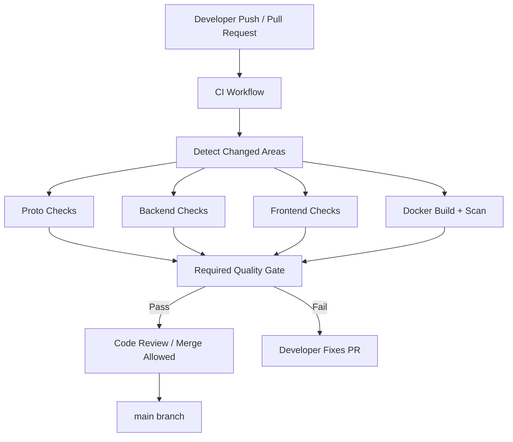
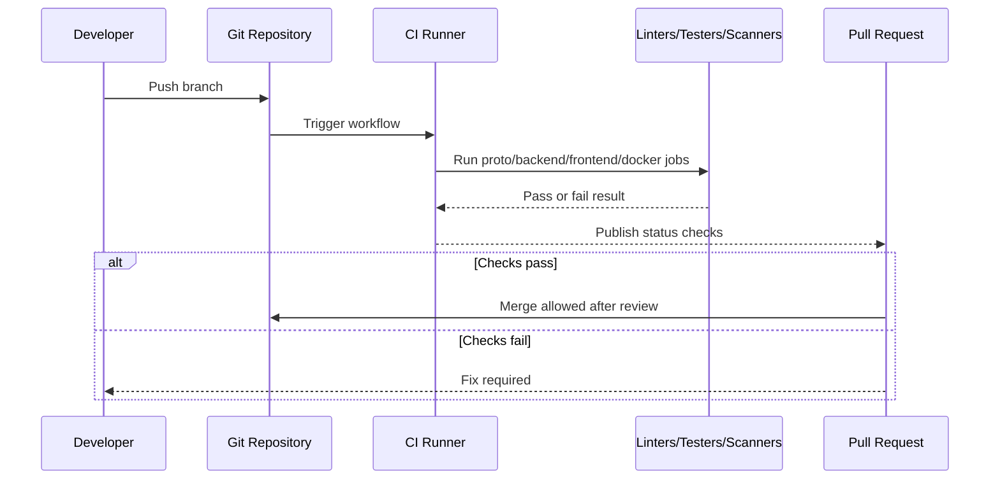
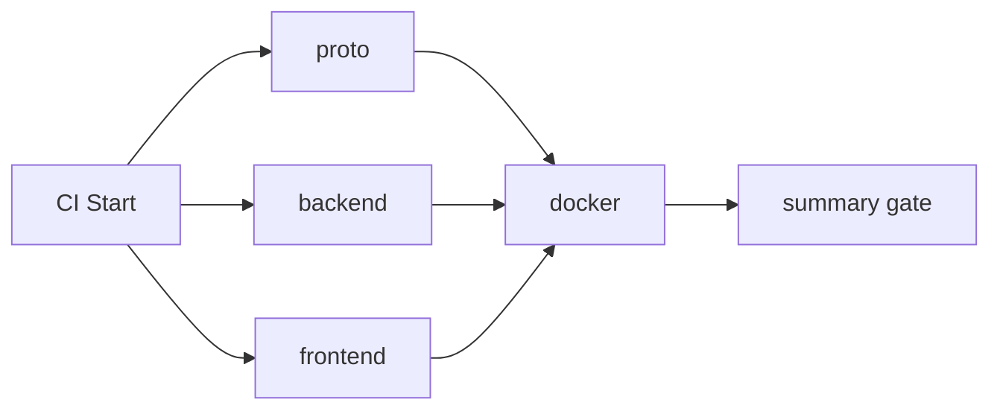
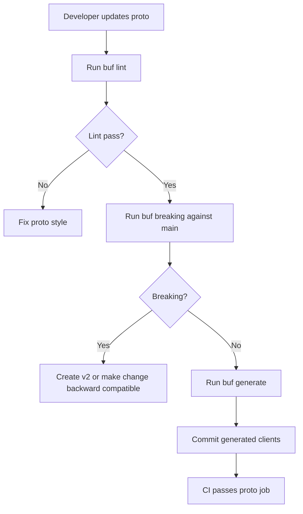
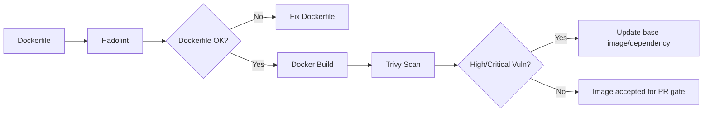

# 🔁 Platform Foundation - Task 7: CI Pipeline Skeleton


## 📌 Task Summary

| Field | Detail |
|---|---|
| Task Name | CI pipeline skeleton |
| Source | `docs/01-micro-tasks.md` → `Platform Foundation` → Task 7 |
| Priority | `P1` core platform quality |
| Dependency | Platform Foundation Task 1: Define repo standards |
| Main Goal | Lint, test, build, Docker image scan automatic banana |
| Output Type | Structured implementation guide |
| Not Included | Kubernetes deploy, registry push, staging/prod release, canary deploy, production secrets |

> **Simple Hinglish goal:** Jab developer Pull Request open kare ya code push kare, CI automatically check karega ki code format/lint pass hai, tests pass hain, proto contracts safe hain, app build ho rahi hai, Docker image ban sakti hai, aur image me obvious vulnerabilities nahi hain. Isse merge se pehle quality gate ready rahega.

---

## ✅ Final Output Created

```text
TaskImplementation/
└── Platform Foundation/
    ├── task1.md
    ├── task2.md
    ├── task3.md
    ├── task4.md
    ├── task5.md
    ├── task6.md
    └── task7.md
```

### Why this structure?

- `TaskImplementation/` task-wise implementation guides ke liye central folder hai.
- `Platform Foundation/` folder already present tha, isliye usko keep kiya gaya.
- `task7.md` sirf **Platform Foundation - Task 7** ka guide hai.
- Actual `.github/workflows/ci.yml`, `infra/ci/`, ya Docker image publish setup create nahi kiya gaya, kyunki user ne output me specifically required folder structure aur `task7.md` content manga hai.

---

## 🧭 Implementation Approach

Is guide ko banate time project ke existing documentation ko base banaya gaya:

| Document | Kya use kiya gaya |
|---|---|
| `docs/01-micro-tasks.md` | Task 7 ka exact scope: lint, test, build, Docker image scan |
| `docs/02-system-architecture.md` | CI/CD flow: PR → lint/test/contract/build/image/scan |
| `docs/03-folder-structure.md` | `infra/ci/`, `backend/`, `frontend/`, `proto/`, service Dockerfile conventions |
| `docs/11-devops-external-services.md` | Recommended CI/CD stages and Docker build expectations |
| `docs/12-logging-monitoring-scalability.md` | Release version and observability readiness expectations |
| `docs/13-developer-guide.md` | Developer setup commands, test strategy, branch/release rules |
| `TaskImplementation/Platform Foundation/task1.md` | Branching, commit, PR checklist standards |
| `TaskImplementation/Platform Foundation/task2.md` | Buf proto lint/breaking/generate strategy |
| `TaskImplementation/Platform Foundation/task3.md` | Shared Go libs expected to compile/test across services |
| `TaskImplementation/Platform Foundation/task4.md` | Docker Compose dependency stack for future integration tests |
| `TaskImplementation/Platform Foundation/task5.md` | API Gateway build/test target expectation |
| `TaskImplementation/Platform Foundation/task6.md` | Health/metrics/tracing endpoints that future smoke checks can verify |

---

## 🧱 Task Boundary

### Included in Task 7

- CI pipeline skeleton design
- Pull Request quality gates
- Backend lint and tests
- Frontend lint, typecheck, tests, and build
- Proto lint, breaking-change check, and generation check
- Docker image build check
- Dockerfile/image security scan
- Cache strategy for faster CI
- Branch and PR trigger strategy
- Example GitHub Actions workflow YAML
- External tools/libraries explanation with install/use commands
- Mermaid architecture and flow diagrams
- Verification checklist and troubleshooting guide

### Not Included in Task 7

- Kubernetes manifests
- Helm charts
- Deploy to dev/staging/prod
- Docker image push to registry
- Manual production approval flow
- Canary rollout
- Database migration runner
- Full integration/E2E test implementation
- Cloud secret manager integration

> 🟢 **Rule:** Task 7 ka kaam merge se pehle automated quality checks banana hai. Deployment lifecycle Platform Foundation Task 8 aur future DevOps tasks me handle hoga.

---

## 🗂️ Target CI Folder Structure

Task 7 ke liye recommended future implementation structure:

```text
.
├── .github/
│   └── workflows/
│       └── ci.yml
├── infra/
│   └── ci/
│       ├── README.md
│       ├── scripts/
│       │   ├── check-generated.sh
│       │   ├── list-go-modules.sh
│       │   └── docker-build-all.sh
│       └── policies/
│           ├── trivy.yaml
│           └── hadolint.yaml
├── backend/
│   ├── go.work
│   ├── shared/
│   └── services/
├── frontend/
│   ├── package.json
│   ├── pnpm-lock.yaml
│   └── pnpm-workspace.yaml
├── proto/
│   ├── buf.yaml
│   └── buf.gen.yaml
└── TaskImplementation/
    └── Platform Foundation/
        └── task7.md
```

### Folder Responsibility

| Path | Responsibility |
|---|---|
| `.github/workflows/ci.yml` | Main CI pipeline trigger and jobs |
| `infra/ci/README.md` | CI commands, local verification, troubleshooting |
| `infra/ci/scripts/check-generated.sh` | Generated proto/client files stale hain ya nahi check karega |
| `infra/ci/scripts/list-go-modules.sh` | Monorepo ke Go modules discover karega |
| `infra/ci/scripts/docker-build-all.sh` | Service Docker images build check karega |
| `infra/ci/policies/trivy.yaml` | Vulnerability scan config |
| `infra/ci/policies/hadolint.yaml` | Dockerfile lint rules |
| `backend/go.work` | Multiple Go modules ko CI me workspace ke through test karne ke liye |
| `frontend/pnpm-workspace.yaml` | Frontend apps/packages ko workspace commands se run karne ke liye |
| `proto/buf.yaml` | Proto lint and breaking checks |

> 🟡 **Note:** Ye target structure hai. Is task me actual CI files create nahi kiye gaye except ye documentation guide.

---

## 🏗️ CI Architecture



### Hinglish Explanation

CI ek automated reviewer ki tarah kaam karega. Developer PR banata hai, CI parallel jobs chala deta hai. Agar lint/test/build/scan pass ho jaye, PR review ke liye safe hai. Agar koi job fail ho, merge block rahega jab tak developer issue fix nahi karta.

---

## 🔁 Pipeline Flow



---

## 🪜 Step-by-Step Implementation

## Step 1: CI Trigger Strategy Define Kiya

CI kab run hoga ye pehle decide karna zaruri hai. Recommended triggers:

| Trigger | Reason |
|---|---|
| `pull_request` to `main` | Merge se pehle quality gate |
| `pull_request` to `develop` | Agar team integration branch use kare |
| `push` to `main` | Merge ke baad final verification |
| `workflow_dispatch` | Manual run for debugging |

### Example

```yaml
name: ci

on:
  pull_request:
    branches:
      - main
      - develop
  push:
    branches:
      - main
  workflow_dispatch:
```

**Explanation:**  
PR pe CI run hone se broken code main branch me merge nahi hota. `workflow_dispatch` developer ko manually pipeline rerun karne ka option deta hai.

---

## Step 2: Required Jobs Decide Kiye

Task 7 ka exact scope `lint`, `test`, `build`, aur `Docker image scan` hai. Isliye CI skeleton me ye jobs honge:

| Job | Purpose | Required? |
|---|---|---:|
| `proto` | Proto lint, breaking check, generate check | ✅ |
| `backend` | Go fmt/vet/lint/test/build | ✅ |
| `frontend` | pnpm install, lint, typecheck, test, build | ✅ |
| `docker` | Dockerfile lint, image build, image scan | ✅ |
| `summary` | Required jobs ka final gate | ✅ |

### Job dependency design



**Why this order?**  
Docker build se pehle code/proto/frontend checks pass hone chahiye. Agar source hi invalid hai to image build karna time waste karega.

---

## Step 3: Backend CI Checks Define Kiye

Backend Go services ke liye CI me ye checks honge:

| Check | Command | Why |
|---|---|---|
| Format check | `gofmt -w` locally, CI me diff check | Consistent Go formatting |
| Vet | `go vet ./...` | Common Go mistakes catch |
| Lint | `golangci-lint run` | Static analysis and style checks |
| Unit tests | `go test ./...` | Business logic safe |
| Race tests | `go test -race ./...` selective | Concurrency bugs catch |
| Build | `go build ./...` | Compile guarantee |

### Example backend job

```yaml
backend:
  name: Backend checks
  runs-on: ubuntu-latest
  steps:
    - name: Checkout
      uses: actions/checkout@v4

    - name: Setup Go
      uses: actions/setup-go@v5
      with:
        go-version: "1.24"
        cache: true

    - name: Verify formatting
      working-directory: backend
      run: |
        test -z "$(gofmt -l .)"

    - name: Go vet
      working-directory: backend
      run: go vet ./...

    - name: Go tests
      working-directory: backend
      run: go test ./...

    - name: Go build
      working-directory: backend
      run: go build ./...
```

### Hinglish Explanation

- `gofmt` ensure karega ki har Go file same format me ho.
- `go vet` logical mistakes catch karta hai jo compiler kabhi-kabhi miss kar sakta hai.
- `go test ./...` saare packages ke tests run karta hai.
- `go build ./...` ensure karta hai ki service compile ho rahi hai.

> 🔵 **Note:** Jab monorepo me multiple Go modules honge, `backend/go.work` ke through ya script ke through per-module commands run karne pad sakte hain.

---

## Step 4: Go Lint Config Strategy Define Kiya

`golangci-lint` Go projects ke liye standard aggregator hai. Ye multiple linters ko ek command me run karta hai.

### Recommended `.golangci.yml`

```yaml
run:
  timeout: 5m
  tests: true

linters:
  enable:
    - govet
    - staticcheck
    - ineffassign
    - unused
    - misspell
    - gofmt
    - goimports

issues:
  exclude-use-default: false
```

### CI usage

```yaml
- name: GolangCI-Lint
  uses: golangci/golangci-lint-action@v6
  with:
    version: latest
    working-directory: backend
```

**Explanation:**  
Manual `go vet`, `staticcheck`, `gofmt`, `goimports` alag-alag run karne ke bajay `golangci-lint` centralized lint gate deta hai.

---

## Step 5: Proto CI Checks Define Kiye

Task 2 me proto strategy define ho chuki hai, isliye CI me proto contracts mandatory check honge.

| Check | Command | Why |
|---|---|---|
| Proto lint | `buf lint` | Naming/style consistent |
| Breaking check | `buf breaking --against ".git#branch=main"` | Existing clients break na hon |
| Generate check | `buf generate` + git diff check | Generated Go/TS clients stale na hon |

### Example proto job

```yaml
proto:
  name: Proto checks
  runs-on: ubuntu-latest
  steps:
    - name: Checkout
      uses: actions/checkout@v4
      with:
        fetch-depth: 0

    - name: Setup Buf
      uses: bufbuild/buf-setup-action@v1

    - name: Proto lint
      run: buf lint

    - name: Proto breaking check
      run: buf breaking --against ".git#branch=main"

    - name: Generate proto clients
      run: buf generate

    - name: Ensure generated code is committed
      run: git diff --exit-code
```

### Hinglish Explanation

`fetch-depth: 0` important hai kyunki `buf breaking` ko `main` branch ke history/reference se compare karna hota hai. `git diff --exit-code` ensure karta hai ki developer ne generated clients commit kiye hain.

---

## Step 6: Frontend CI Checks Define Kiye

Frontend apps React + TypeScript + pnpm workspace pattern follow karenge. CI me fast feedback ke liye ye checks honge:

| Check | Command | Why |
|---|---|---|
| Install | `pnpm install --frozen-lockfile` | Lockfile repeatable install |
| Lint | `pnpm lint` | UI/TS style issues catch |
| Typecheck | `pnpm typecheck` | TypeScript errors catch |
| Unit tests | `pnpm test` | Components/helpers validate |
| Build | `pnpm build` | Production bundle compile |

### Example frontend job

```yaml
frontend:
  name: Frontend checks
  runs-on: ubuntu-latest
  steps:
    - name: Checkout
      uses: actions/checkout@v4

    - name: Setup pnpm
      uses: pnpm/action-setup@v4
      with:
        version: 9

    - name: Setup Node.js
      uses: actions/setup-node@v4
      with:
        node-version: "22"
        cache: pnpm
        cache-dependency-path: frontend/pnpm-lock.yaml

    - name: Install dependencies
      working-directory: frontend
      run: pnpm install --frozen-lockfile

    - name: Lint
      working-directory: frontend
      run: pnpm lint

    - name: Typecheck
      working-directory: frontend
      run: pnpm typecheck

    - name: Test
      working-directory: frontend
      run: pnpm test

    - name: Build
      working-directory: frontend
      run: pnpm build
```

### Hinglish Explanation

`--frozen-lockfile` CI me dependency drift prevent karta hai. Agar `package.json` update hua but lockfile update nahi hua, CI fail karega. Ye good failure hai because team ko deterministic build chahiye.

---

## Step 7: Docker Build Check Define Kiya

Docker build CI me isliye run karna zaruri hai taaki Dockerfile broken na rahe. Build pass ka matlab image deploy-ready hai, lekin Task 7 me push/deploy nahi hoga.

### Example Docker build job

```yaml
docker:
  name: Docker build and scan
  runs-on: ubuntu-latest
  needs:
    - proto
    - backend
    - frontend
  steps:
    - name: Checkout
      uses: actions/checkout@v4

    - name: Setup Docker Buildx
      uses: docker/setup-buildx-action@v3

    - name: Build API Gateway image
      uses: docker/build-push-action@v6
      with:
        context: .
        file: backend/services/api-gateway/deploy/Dockerfile
        tags: ecommerce/api-gateway:${{ github.sha }}
        push: false
        load: true
```

### Hinglish Explanation

- `push: false` ka matlab CI sirf build validate karega, registry me image push nahi karega.
- `load: true` image ko runner ke local Docker daemon me load karta hai, taaki next scan step image scan kar sake.
- `${{ github.sha }}` unique image tag deta hai.

---

## Step 8: Dockerfile Lint Add Kiya

Dockerfile linting se common mistakes catch hoti hain, jaise unpinned base image, bad layer ordering, ya unsafe shell usage.

### Example Hadolint step

```yaml
- name: Lint Dockerfile
  uses: hadolint/hadolint-action@v3.1.0
  with:
    dockerfile: backend/services/api-gateway/deploy/Dockerfile
```

### Hinglish Explanation

`hadolint` Dockerfile ke liye static analyzer hai. Ye Docker best practices enforce karta hai before image build.

---

## Step 9: Docker Image Scan Add Kiya

Docker image scan security gate hai. Is project ke liye Trivy simple aur popular choice hai.

### Example Trivy scan step

```yaml
- name: Scan Docker image
  uses: aquasecurity/trivy-action@0.24.0
  with:
    image-ref: ecommerce/api-gateway:${{ github.sha }}
    format: table
    severity: CRITICAL,HIGH
    exit-code: "1"
    ignore-unfixed: true
```

### Hinglish Explanation

- `severity: CRITICAL,HIGH` serious vulnerabilities pe CI fail karega.
- `ignore-unfixed: true` un vulnerabilities ko ignore karta hai jinka upstream fix available nahi hai.
- Future me policy stricter ho sakti hai, but skeleton ke liye ye practical start hai.

---

## Step 10: Generated Code Staleness Check Define Kiya

Generated code stale hone ka common issue hota hai. Developer proto update karta hai but generated clients commit nahi karta. CI isko catch karega.

### Example script

```bash
#!/usr/bin/env bash
set -euo pipefail

buf generate

if ! git diff --exit-code; then
  echo "Generated files are stale. Run 'buf generate' and commit the output."
  exit 1
fi
```

### Hinglish Explanation

Script pehle generation run karega. Agar generation ke baad repo me diff aata hai, iska matlab committed generated files latest nahi hain. CI fail hoga with clear message.

---

## Step 11: Cache Strategy Define Ki

CI fast rakhne ke liye dependency cache zaruri hai.

| Ecosystem | Cache | Reason |
|---|---|---|
| Go | `actions/setup-go` cache | Module download time kam |
| pnpm | `actions/setup-node` with pnpm cache | Frontend install fast |
| Docker | Buildx cache | Docker layers reuse |
| Trivy | Vulnerability DB cache | Scan startup fast |

### Docker cache example

```yaml
- name: Build API Gateway image
  uses: docker/build-push-action@v6
  with:
    context: .
    file: backend/services/api-gateway/deploy/Dockerfile
    tags: ecommerce/api-gateway:${{ github.sha }}
    push: false
    load: true
    cache-from: type=gha
    cache-to: type=gha,mode=max
```

**Explanation:**  
Docker layers cache hone se repeated CI runs faster honge. Lekin cache ko correctness ke upar priority nahi deni hai.

---

## Step 12: CI Permissions Minimal Rakhe

CI workflow ko least privilege principle follow karna chahiye.

### Recommended permissions

```yaml
permissions:
  contents: read
  pull-requests: read
  security-events: write
```

### Hinglish Explanation

- `contents: read` repo checkout ke liye enough hai.
- `pull-requests: read` PR metadata read karne ke liye.
- `security-events: write` tab chahiye jab Trivy SARIF GitHub Security tab me upload kare.
- Registry push/deploy nahi hai, isliye packages/secrets write permission Task 7 me nahi chahiye.

---

## Step 13: Required Status Checks Define Kiye

Repository settings me branch protection ke under ye checks required hone chahiye:

| Required Check | Meaning |
|---|---|
| `Proto checks` | Proto lint/breaking/generation pass |
| `Backend checks` | Go lint/test/build pass |
| `Frontend checks` | TS lint/typecheck/test/build pass |
| `Docker build and scan` | Dockerfile lint, image build, Trivy scan pass |
| `CI summary` | All required jobs completed |

### Branch protection rule

```text
main branch:
- Require pull request before merging
- Require status checks to pass
- Require branches to be up to date before merging
- Require conversation resolution before merging
- Restrict direct pushes
```

**Hinglish Explanation:**  
CI tabhi useful hai jab branch protection usko enforce kare. Warna developer failing checks ke bawajood direct push/merge kar sakta hai.

---

## Step 14: Complete CI Skeleton Example

Ye ek beginner-friendly GitHub Actions skeleton hai. Real repo me paths aur commands actual modules ke according adjust karne honge.

```yaml
name: ci

on:
  pull_request:
    branches:
      - main
      - develop
  push:
    branches:
      - main
  workflow_dispatch:

permissions:
  contents: read
  pull-requests: read
  security-events: write

concurrency:
  group: ci-${{ github.workflow }}-${{ github.ref }}
  cancel-in-progress: true

jobs:
  proto:
    name: Proto checks
    runs-on: ubuntu-latest
    steps:
      - name: Checkout
        uses: actions/checkout@v4
        with:
          fetch-depth: 0

      - name: Setup Buf
        uses: bufbuild/buf-setup-action@v1

      - name: Proto lint
        run: buf lint

      - name: Proto breaking check
        run: buf breaking --against ".git#branch=main"

      - name: Generate proto clients
        run: buf generate

      - name: Ensure generated code is committed
        run: git diff --exit-code

  backend:
    name: Backend checks
    runs-on: ubuntu-latest
    steps:
      - name: Checkout
        uses: actions/checkout@v4

      - name: Setup Go
        uses: actions/setup-go@v5
        with:
          go-version: "1.24"
          cache: true

      - name: Verify Go formatting
        working-directory: backend
        run: test -z "$(gofmt -l .)"

      - name: Go vet
        working-directory: backend
        run: go vet ./...

      - name: Go tests
        working-directory: backend
        run: go test ./...

      - name: Go build
        working-directory: backend
        run: go build ./...

      - name: GolangCI-Lint
        uses: golangci/golangci-lint-action@v6
        with:
          version: latest
          working-directory: backend

  frontend:
    name: Frontend checks
    runs-on: ubuntu-latest
    steps:
      - name: Checkout
        uses: actions/checkout@v4

      - name: Setup pnpm
        uses: pnpm/action-setup@v4
        with:
          version: 9

      - name: Setup Node.js
        uses: actions/setup-node@v4
        with:
          node-version: "22"
          cache: pnpm
          cache-dependency-path: frontend/pnpm-lock.yaml

      - name: Install dependencies
        working-directory: frontend
        run: pnpm install --frozen-lockfile

      - name: Lint
        working-directory: frontend
        run: pnpm lint

      - name: Typecheck
        working-directory: frontend
        run: pnpm typecheck

      - name: Test
        working-directory: frontend
        run: pnpm test

      - name: Build
        working-directory: frontend
        run: pnpm build

  docker:
    name: Docker build and scan
    runs-on: ubuntu-latest
    needs:
      - proto
      - backend
      - frontend
    steps:
      - name: Checkout
        uses: actions/checkout@v4

      - name: Setup Docker Buildx
        uses: docker/setup-buildx-action@v3

      - name: Lint API Gateway Dockerfile
        uses: hadolint/hadolint-action@v3.1.0
        with:
          dockerfile: backend/services/api-gateway/deploy/Dockerfile

      - name: Build API Gateway image
        uses: docker/build-push-action@v6
        with:
          context: .
          file: backend/services/api-gateway/deploy/Dockerfile
          tags: ecommerce/api-gateway:${{ github.sha }}
          push: false
          load: true
          cache-from: type=gha
          cache-to: type=gha,mode=max

      - name: Scan API Gateway image
        uses: aquasecurity/trivy-action@0.24.0
        with:
          image-ref: ecommerce/api-gateway:${{ github.sha }}
          format: table
          severity: CRITICAL,HIGH
          exit-code: "1"
          ignore-unfixed: true

  summary:
    name: CI summary
    runs-on: ubuntu-latest
    needs:
      - proto
      - backend
      - frontend
      - docker
    if: always()
    steps:
      - name: Check required jobs
        run: |
          if [ "${{ needs.proto.result }}" != "success" ]; then exit 1; fi
          if [ "${{ needs.backend.result }}" != "success" ]; then exit 1; fi
          if [ "${{ needs.frontend.result }}" != "success" ]; then exit 1; fi
          if [ "${{ needs.docker.result }}" != "success" ]; then exit 1; fi
          echo "All CI checks passed."
```

### Important adjustment for current repo stage

Current repo blueprint stage me `proto/`, Go modules, frontend package files, aur service Dockerfiles fully created nahi hain. Isliye real workflow add karte time jobs ko either:

| Option | Behavior |
|---|---|
| Strict from day one | Missing folders fail CI, good for active implementation repo |
| Path-aware skeleton | Job only runs when relevant folder/config exists |

Recommended start: **path-aware skeleton** during early foundation, then strict mode once modules are present.

---

## Step 15: Path-Aware Early Skeleton

Early repo me kuch folders empty/missing ho sakte hain. CI ko beginner-friendly banane ke liye first version me existence checks use kar sakte hain.

### Example path-aware backend step

```yaml
- name: Backend checks
  run: |
    if [ ! -f backend/go.work ] && [ ! -f backend/go.mod ]; then
      echo "No backend Go workspace/module found yet. Skipping backend checks."
      exit 0
    fi

    cd backend
    test -z "$(gofmt -l .)"
    go vet ./...
    go test ./...
    go build ./...
```

### Example path-aware frontend step

```yaml
- name: Frontend checks
  run: |
    if [ ! -f frontend/package.json ]; then
      echo "No frontend package.json found yet. Skipping frontend checks."
      exit 0
    fi

    cd frontend
    pnpm install --frozen-lockfile
    pnpm lint
    pnpm typecheck
    pnpm test
    pnpm build
```

### Hinglish Explanation

Path-aware skeleton early repo ke liye helpful hota hai. Jaise-jaise backend/frontend/proto actual implementation aayegi, skip logic remove karke strict gates enable karne chahiye.

---

## Step 16: Local Verification Commands Define Kiye

Developer ko PR banane se pehle same commands local run karne chahiye.

```bash
# Proto checks
buf lint
buf breaking --against ".git#branch=main"
buf generate

# Backend checks
cd backend
gofmt -w .
go vet ./...
go test ./...
go build ./...
golangci-lint run

# Frontend checks
cd ../frontend
pnpm install --frozen-lockfile
pnpm lint
pnpm typecheck
pnpm test
pnpm build

# Docker checks
docker build -f backend/services/api-gateway/deploy/Dockerfile -t ecommerce/api-gateway:local .
trivy image --severity HIGH,CRITICAL --exit-code 1 ecommerce/api-gateway:local
```

### Hinglish Explanation

Local commands CI ke same hone chahiye. Agar local pass hai to CI fail hone ke chances kam ho jate hain. CI surprises avoid karne ke liye `Makefile` ya `justfile` later add kiya ja sakta hai.

---

## Step 17: Optional Makefile Interface Define Kiya

CI commands ko readable banane ke liye future me root `Makefile` use ho sakta hai.

### Example

```makefile
.PHONY: ci proto backend frontend docker-scan

ci: proto backend frontend docker-scan

proto:
	buf lint
	buf breaking --against ".git#branch=main"
	buf generate
	git diff --exit-code

backend:
	cd backend && test -z "$$(gofmt -l .)"
	cd backend && go vet ./...
	cd backend && go test ./...
	cd backend && go build ./...
	cd backend && golangci-lint run

frontend:
	cd frontend && pnpm install --frozen-lockfile
	cd frontend && pnpm lint
	cd frontend && pnpm typecheck
	cd frontend && pnpm test
	cd frontend && pnpm build

docker-scan:
	docker build -f backend/services/api-gateway/deploy/Dockerfile -t ecommerce/api-gateway:local .
	trivy image --severity HIGH,CRITICAL --exit-code 1 ecommerce/api-gateway:local
```

### Hinglish Explanation

Makefile se developer and CI dono same commands use kar sakte hain. Commands duplicate kam hote hain and onboarding easy hoti hai.

---

## 🛠️ External Libraries / Tools Used

Task 7 me actual tools install nahi kiye gaye; ye CI skeleton guide me recommended tools define kiye gaye hain.

| Tool | What it is | Why used | Install / Use |
|---|---|---|---|
| GitHub Actions | Hosted CI automation | PR/push pe jobs automatic run karne ke liye | `.github/workflows/ci.yml` add karke use hota hai |
| `actions/checkout` | GitHub Action | Repo code runner me checkout karne ke liye | `uses: actions/checkout@v4` |
| `actions/setup-go` | GitHub Action | Go version and cache setup | `uses: actions/setup-go@v5` |
| `golangci-lint` | Go linter aggregator | Go static checks centralize karne ke liye | `brew install golangci-lint` or CI action |
| Buf CLI | Proto tooling | Proto lint, breaking, generate checks | `brew install bufbuild/buf/buf` |
| Node.js | JS runtime | Frontend build/test ke liye | `actions/setup-node@v4`, local Node 22+ |
| pnpm | Package manager | Fast workspace installs | `corepack enable` or `npm i -g pnpm` |
| Docker Buildx | Docker builder | Multi-platform/cache-friendly image build | `docker/setup-buildx-action@v3` |
| Hadolint | Dockerfile linter | Dockerfile best-practice check | `hadolint/hadolint-action@v3.1.0` |
| Trivy | Vulnerability scanner | Docker image dependency/OS vulnerability scan | `aquasecurity/trivy-action` or `brew install trivy` |
| Mermaid | Markdown diagrams | CI flow visually explain karne ke liye | GitHub Markdown supports it |
| Shields.io | Markdown badges | Status/priority/scope visually show karne ke liye | Badge URLs directly Markdown me use hote hain |

### Local install examples

```bash
# Go lint
brew install golangci-lint

# Proto tooling
brew install bufbuild/buf/buf

# Frontend package manager
corepack enable
corepack prepare pnpm@9 --activate

# Docker scanner
brew install trivy
```

### Linux alternative examples

```bash
# pnpm
corepack enable
corepack prepare pnpm@9 --activate

# golangci-lint
curl -sSfL https://raw.githubusercontent.com/golangci/golangci-lint/master/install.sh \
  | sh -s -- -b "$(go env GOPATH)/bin" latest

# Trivy
sudo apt-get update
sudo apt-get install -y wget apt-transport-https gnupg lsb-release
```

> 🟡 **Security note:** CI tools ka version pin karna production-grade setup me important hai. Skeleton me readable examples diye gaye hain; hardened setup me exact versions and dependency review enable karna chahiye.

---

## 🔐 CI Security Rules

| Rule | Hinglish Explanation |
|---|---|
| Secrets PR jobs me expose mat karo | Forked PR malicious code run kar sakta hai |
| `pull_request_target` avoid karo | Galat use se secrets leak ho sakte hain |
| Minimal permissions rakho | CI token ko unnecessary write access mat do |
| Image push Task 7 me mat karo | Push/deploy future task ka scope hai |
| Vulnerability scan fail-on-high rakho | Serious issues merge se pehle catch hon |
| Generated files verify karo | Hidden generated-code drift avoid hota hai |
| Branch protection enable karo | CI checks bypass nahi hone chahiye |

### Secret handling example

```yaml
permissions:
  contents: read

jobs:
  backend:
    runs-on: ubuntu-latest
    steps:
      - uses: actions/checkout@v4
```

**Explanation:**  
Task 7 CI me registry credentials, cloud keys, database passwords, ya deploy tokens ki need nahi hai. Agar koi test secret chahiye, local fake/test-only value use karo.

---

## 🧪 Test Strategy in CI

Task 7 skeleton me tests ko layers me organize karna chahiye.

| Layer | Run in Task 7 CI? | Detail |
|---|---:|---|
| Go unit tests | ✅ | Domain/usecase/shared libs |
| Go integration tests | 🟡 Later gated | Docker Compose/Testcontainers ready hone ke baad |
| Proto contract tests | ✅ | `buf lint`, `buf breaking` |
| Frontend unit/component tests | ✅ | Vitest/RTL future setup |
| Frontend E2E tests | ❌ Not Task 7 | Later app/service readiness ke baad |
| Smoke tests | ❌ Not Task 7 | Deploy pipeline ke baad |
| Load tests | ❌ Not Task 7 | Production hardening phase |

> 🟢 **Rule:** Task 7 CI fast hona chahiye. Heavy E2E/load tests separate scheduled or pre-release workflows me better rahenge.

---

## 🧾 PR Quality Gate

CI checks ke saath PR template bhi quality maintain karega.

```markdown
## Summary
- What changed?

## Scope
- Included:
- Not included:

## Verification
- [ ] Proto checks pass
- [ ] Backend checks pass
- [ ] Frontend checks pass
- [ ] Docker build/scan pass

## Risk
- Low / Medium / High

## Notes
- Any migration, secret, or deployment impact?
```

### Hinglish Explanation

PR template developer ko force karta hai ki wo bataye kya change hua, kya verify kiya, aur kya risk hai. CI machine checks karta hai; PR description human context deta hai.

---

## 📊 CI Status Badge

README me later CI badge add kiya ja sakta hai:

```markdown

```

### Hinglish Explanation

Badge se repo open karte hi pata chal jata hai ki `main` branch healthy hai ya broken.

---

## 🧩 Multi-Service Docker Strategy

Future me har service ka Dockerfile hoga:

```text
backend/services/
├── api-gateway/deploy/Dockerfile
├── auth-service/deploy/Dockerfile
├── user-service/deploy/Dockerfile
├── product-service/deploy/Dockerfile
├── cart-service/deploy/Dockerfile
└── order-service/deploy/Dockerfile
```

### Matrix build example

```yaml
docker:
  name: Docker build and scan
  runs-on: ubuntu-latest
  strategy:
    fail-fast: false
    matrix:
      service:
        - api-gateway
        - auth-service
        - user-service
        - product-service
  steps:
    - uses: actions/checkout@v4

    - uses: docker/setup-buildx-action@v3

    - name: Build image
      uses: docker/build-push-action@v6
      with:
        context: .
        file: backend/services/${{ matrix.service }}/deploy/Dockerfile
        tags: ecommerce/${{ matrix.service }}:${{ github.sha }}
        push: false
        load: true

    - name: Scan image
      uses: aquasecurity/trivy-action@0.24.0
      with:
        image-ref: ecommerce/${{ matrix.service }}:${{ github.sha }}
        severity: CRITICAL,HIGH
        exit-code: "1"
```

### Hinglish Explanation

Matrix strategy same job ko multiple services ke liye run karta hai. `fail-fast: false` se ek service fail hone par baaki services ka result bhi mil jata hai.

---

## 🧬 Proto Change Safety Flow



### Hinglish Explanation

Proto public internal contract hai. Agar breaking change accidentally merge ho gaya to existing services fail ho sakti hain. `buf breaking` isliye mandatory gate hai.

---

## 🐳 Docker Scan Flow



### Hinglish Explanation

Docker check do layers me hoga: pehle Dockerfile best practices, phir built image vulnerabilities. Dono pass hone ke baad hi PR quality gate pass hona chahiye.

---

## 📦 Build Artifact Strategy

Task 7 me artifacts optional hain, kyunki deploy/push scope me nahi hai.

| Artifact | Task 7 Status | Reason |
|---|---|---|
| Go binaries | Optional | Build verification enough hai |
| Frontend dist | Optional | Build pass enough hai |
| Docker image tar | Optional | Scan local image enough hai |
| Test coverage report | Recommended later | Quality trend tracking ke liye |
| SBOM | Recommended later | Supply chain visibility ke liye |

### Optional coverage upload

```yaml
- name: Go tests with coverage
  working-directory: backend
  run: go test ./... -coverprofile=coverage.out

- name: Upload coverage artifact
  uses: actions/upload-artifact@v4
  with:
    name: backend-coverage
    path: backend/coverage.out
```

**Hinglish Explanation:**  
Coverage artifact future me useful hai, but Task 7 ka must-have lint/test/build/scan hai. Coverage threshold later add karna better hoga jab real tests enough hon.

---

## 🚦 Failure Handling

| Failure | Common Reason | Fix |
|---|---|---|
| `buf breaking` fail | Existing proto contract broken | Backward-compatible field add karo ya `v2` banao |
| `git diff --exit-code` fail | Generated clients stale | Local `buf generate` run karke output commit karo |
| `go test ./...` fail | Unit test or compile error | Failing package ka error fix karo |
| `golangci-lint` fail | Static analysis/style issue | Linter output follow karo |
| `pnpm install --frozen-lockfile` fail | Lockfile outdated | Local `pnpm install` run karke lockfile commit karo |
| `pnpm typecheck` fail | TypeScript mismatch | Types/interfaces update karo |
| Docker build fail | Dockerfile path/build context issue | Dockerfile and COPY paths align karo |
| Trivy fail | High/critical vulnerability | Base image/dependency update karo or justified ignore policy add karo |

---

## 🧰 Monorepo Command Strategy

Monorepo me direct `go test ./...` root se hamesha kaam nahi karta, especially multiple modules me. Isliye future helper script useful hoga.

### Example `list-go-modules.sh`

```bash
#!/usr/bin/env bash
set -euo pipefail

find backend -name go.mod -not -path "*/vendor/*" -exec dirname {} \; | sort
```

### Example per-module test runner

```bash
#!/usr/bin/env bash
set -euo pipefail

while IFS= read -r module; do
  echo "Testing ${module}"
  (cd "${module}" && go test ./...)
done < <(find backend -name go.mod -not -path "*/vendor/*" -exec dirname {} \; | sort)
```

### Hinglish Explanation

Jab services independent modules honge, script har module me jaake tests run karega. Isse CI root assumptions pe depend nahi karega.

---

## 🟣 CI Observability

CI khud bhi observable hona chahiye:

| Metric | Why Important |
|---|---|
| Pipeline duration | Slow CI developer productivity reduce karta hai |
| Failure rate by job | Kis area me most failures aa rahe hain pata chalega |
| Flaky tests count | Unreliable tests trust kam karte hain |
| Vulnerability trend | Dependency hygiene improve hoti hai |
| Cache hit rate | CI optimization ka signal |

### Basic GitHub Actions summary

```yaml
- name: Write job summary
  run: |
    echo "## CI Result" >> "$GITHUB_STEP_SUMMARY"
    echo "- Commit: $GITHUB_SHA" >> "$GITHUB_STEP_SUMMARY"
    echo "- Branch: $GITHUB_REF_NAME" >> "$GITHUB_STEP_SUMMARY"
```

**Hinglish Explanation:**  
Job summary PR me readable output deta hai. Developer ko logs me deep dive karne se pehle high-level result dikh jata hai.

---

## 🧱 CI vs CD Boundary

| Area | Task 7 CI Skeleton | Future CD / Task 8+ |
|---|---|---|
| Lint | ✅ Included | ✅ Reused |
| Unit tests | ✅ Included | ✅ Reused |
| Proto checks | ✅ Included | ✅ Reused |
| Docker build | ✅ Included | ✅ Reused |
| Image scan | ✅ Included | ✅ Reused |
| Image push | ❌ Not included | ✅ Later |
| Kubernetes manifests | ❌ Not included | ✅ Task 8 |
| Deploy dev/staging | ❌ Not included | ✅ Later |
| Smoke tests after deploy | ❌ Not included | ✅ Later |
| Production approval | ❌ Not included | ✅ Later |
| Canary rollout | ❌ Not included | ✅ Later |

> 🔴 **Important:** Task 7 ko CD pipeline me expand nahi karna. Is task ka output merge quality gate hai, deployment pipeline nahi.

---

## 🧪 Verification Checklist for This Task

| Verification | Status |
|---|---|
| `TaskImplementation/` folder exists | ✅ Done |
| `TaskImplementation/Platform Foundation/` folder kept | ✅ Done |
| `task7.md` created | ✅ Done |
| Guide Hinglish me likha gaya | ✅ Done |
| Step-by-step implementation included | ✅ Done |
| Clean folder structure included | ✅ Done |
| CI architecture diagram included | ✅ Done |
| Pipeline flow diagram included | ✅ Done |
| Proto flow diagram included | ✅ Done |
| Docker scan flow diagram included | ✅ Done |
| External tools/libraries explained | ✅ Done |
| Install/use commands included | ✅ Done |
| Code examples included | ✅ Done |
| Scope limited to Platform Foundation Task 7 | ✅ Done |
| No Kubernetes manifests created | ✅ Done |
| No deployment pipeline created | ✅ Done |

---

## 🚫 Out of Scope for Task 7

Ye items intentionally implement nahi kiye gaye:

- `.github/workflows/ci.yml` actual file create karna
- `infra/ci/` scripts actual create karna
- Docker image registry push
- Kubernetes deployment manifests
- Helm chart setup
- Dev/staging/prod deploy jobs
- Cloud credentials or secrets setup
- Database migration automation
- Full E2E and load test workflows

> 🔴 **Reason:** User ne specifically required folder structure aur `task7.md` content generate karne ko bola. Platform Foundation Task 7 ka documentation scope CI skeleton tak limited rakha gaya.

---

## ✅ Final Task 7 Standard

```text
CI pipeline skeleton = PR trigger + proto checks + backend checks + frontend checks + Docker build + image scan + required status gate
```

**Final Hinglish conclusion:**  
Platform Foundation Task 7 ke liye CI pipeline skeleton define ho gaya. Ab team ke paas clear blueprint hai ki Pull Request merge se pehle kaunse automated checks mandatory honge, kaunse tools use honge, aur CI/CD boundary kahan stop hoti hai. Deployment aur Kubernetes ka kaam intentionally Task 7 ke bahar rakha gaya hai.
