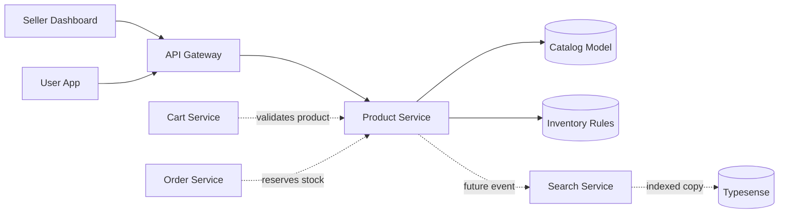
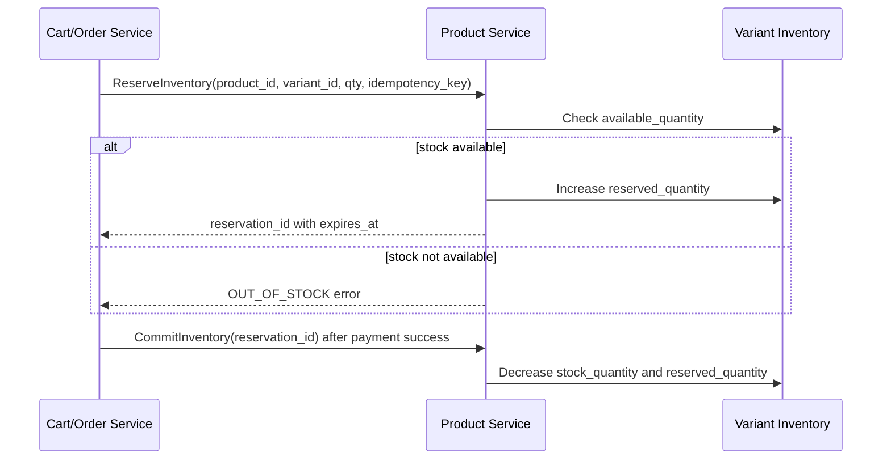
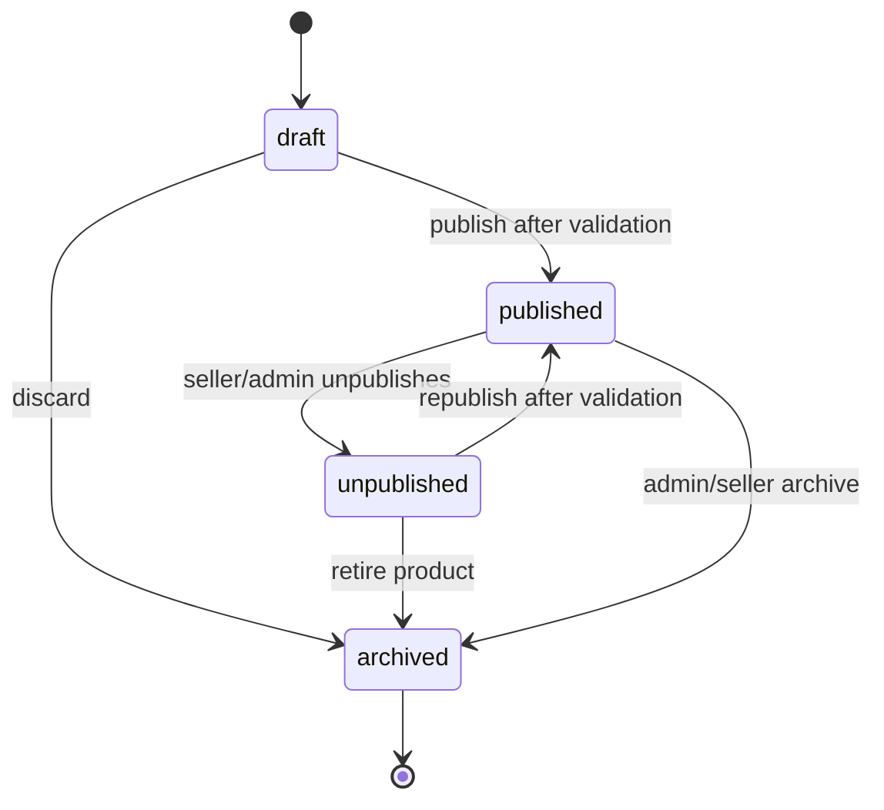
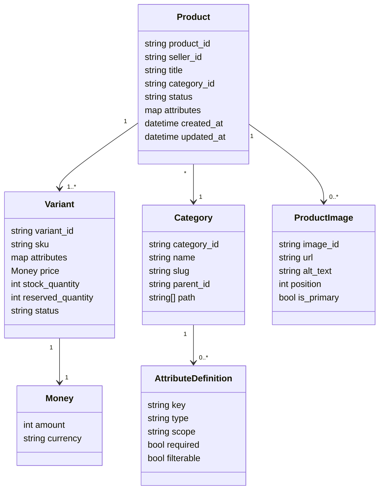
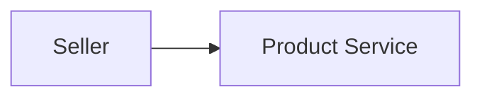

# 🛍️ Product Service - Task 1: Define Catalog Model


## 📌 Task Summary

| Field | Detail |
|---|---|
| Service | Product Service |
| Task No. | 1 |
| Task Name | Define catalog model |
| Source | `docs/01-micro-tasks.md` → `Product Service` → Task 1 |
| Goal | Product, variant, category, attribute, image, aur inventory rules finalize karna |
| Dependency | Platform foundation |
| Priority | P0 |
| Output Type | Documentation-only implementation guide |
| Not Included | MongoDB selection, collection creation, seller CRUD, read APIs, real inventory operations, events, search indexing |

> 🟢 **Simple Hinglish goal:** Is task me Product Service ka core catalog model define kiya gaya hai. Matlab product kya hota hai, variants kaise represent honge, category/attribute rules kya honge, images ka metadata kaise rakhenge, aur inventory ke basic business rules kya rahenge. Abhi koi backend code, database collection, API, ya event publish implement nahi kiya gaya.

---

## ✅ Final Output Created

```text
TaskImplementation/
└── Product Service/
    └── task1.md
```

### Why this structure?

| Path | Purpose |
|---|---|
| `TaskImplementation/` | Saare task-wise implementation guides ka central folder |
| `TaskImplementation/Product Service/` | Product Service ke tasks ko group karne ke liye |
| `task1.md` | Sirf Product Service Task 1 ka detailed guide |

> 🔵 **Important:** Is task me sirf documentation guide create hua hai. Product Service ka actual Go service folder, MongoDB collection, API endpoint, ya Docker config create nahi kiya gaya.

---

## 🧭 Docs Studied Before Implementation

| Document | Kya use kiya gaya |
|---|---|
| `docs/01-micro-tasks.md` | Task name, dependency, priority, aur exact scope identify kiya |
| `docs/02-system-architecture.md` | Product browse flow, Search Service relation, aur service ownership samjha |
| `docs/03-folder-structure.md` | Future Product Service folder shape align kiya |
| `docs/04-microservice-design.md` | Product Service responsibilities, gRPC methods, REST APIs, aur MongoDB direction samjhi |
| `docs/05-database-design.md` | Search schema aur product-related indexing needs samjhi |
| `database/mongodb-schema-design.md` | Product document ka reference model study kiya |
| `api/master-api.json` | Product input/output schemas aur gateway routes validate kiye |

---

## 🧱 Task Boundary

### ✅ Task 1 me kya define kiya gaya

- Product aggregate model
- Variant and SKU model
- Category tree model
- Dynamic attribute model
- Product image/media metadata model
- Price and money representation rules
- Inventory business rules
- Product status/lifecycle rules
- Validation rules
- Future service folder suggestion
- Architecture and flow diagrams

### ❌ Task 1 me kya implement nahi kiya gaya

| Item | Reason |
|---|---|
| MongoDB choose/setup | Product Service Task 2 ka scope hai |
| MongoDB collections create karna | Product Service Task 3 ka scope hai |
| Seller CRUD APIs | Product Service Task 4 ka scope hai |
| Product listing/detail APIs | Product Service Task 5 ka scope hai |
| Reserve/release/commit inventory code | Product Service Task 6 ka scope hai |
| Product search events | Product Service Task 7 ka scope hai |
| CDN/media upload implementation | Product Service Task 8 ka scope hai |

> 🔴 **Golden rule:** Task 1 sirf model finalize karta hai. Is guide ke examples future implementation ko clear karne ke liye hain, actual runtime code nahi.

---

## 🧩 High-Level Product Service Ownership

Product Service platform ka **catalog source of truth** hoga. Iska matlab:

- Product ka title, description, category, brand, variants, prices, images, status Product Service own karega.
- Inventory quantity Product Service ke under model hogi.
- Search Service product ka indexed copy rakhega, but canonical data Product Service se aayega.
- Cart/Order services product snapshot use karenge, but product ownership Product Service ke paas rahegi.



**Explanation:**  
Seller Product Service me product create/update karega. Buyer product read/search flow me Gateway ke through product data consume karega. Search Service fast searching ke liye copy rakhega, lekin real catalog truth Product Service hi rahega.

---

## 🪜 Step-by-Step Implementation

## Step 1: Task scope identify kiya

`docs/01-micro-tasks.md` me Product Service Task 1 ye hai:

```text
Define catalog model:
Product, variant, category, attribute, image, inventory rules finalize karo.
E-commerce catalog flexible hona chahiye.
```

Iska matlab Task 1 ka output ek clear **domain model decision document** hai. Yeh document future backend, database, API, search, cart, order, aur frontend teams ke liye base banega.

---

## Step 2: Catalog aggregate boundary define ki

Product Service me primary aggregate **Product** hoga. Product ke andar variants, images, rating summary, aur product-level attributes embedded ho sakte hain.

### Product aggregate responsibilities

| Responsibility | Detail |
|---|---|
| Identity | Product ka stable `product_id` maintain karna |
| Ownership | Product kis `seller_id` ka hai ye store karna |
| Catalog content | Title, description, brand, category, attributes |
| Variant grouping | Size/color/SKU jaise sellable options group karna |
| Images | Product gallery ka metadata maintain karna |
| Status | Draft/published/unpublished/archived state track karna |
| Inventory view | Variant-level stock and reserved quantity rules define karna |

### Product model

```text
Product
├── product_id
├── seller_id
├── title
├── slug
├── description
├── brand
├── category_id
├── category_path
├── status
├── attributes
├── images[]
├── variants[]
├── rating_summary
├── audit fields
└── timestamps
```

**Hinglish explanation:**  
Product ek container hai. Agar ek shoe product hai, to product-level details me title, description, brand, category aayenge. Uske andar variants honge jaise black-size-9, black-size-10, white-size-9. Actual sellable unit variant/SKU hota hai.

---

## Step 3: Product fields finalize kiye

| Field | Type | Required | Rule |
|---|---:|---:|---|
| `product_id` | string | yes | Stable unique id, example `prod_123` |
| `seller_id` | string | yes | Product owner seller |
| `title` | string | yes | Buyer-facing product name |
| `slug` | string | no | SEO-friendly URL key, title se generate ho sakta hai |
| `description` | string | no | Long product detail |
| `brand` | string/object | no | Brand name ya future `brand_id` |
| `category_id` | string | yes | Leaf ya valid category id |
| `category_path` | string[] | no | Parent se leaf tak category chain |
| `status` | enum | yes | `draft`, `published`, `unpublished`, `archived` |
| `attributes` | object | no | Dynamic product-level specs |
| `images` | array | no | Product gallery metadata |
| `variants` | array | yes | At least one sellable variant |
| `rating_summary` | object | no | Average rating and count |
| `created_at` | timestamp | yes | Creation time |
| `updated_at` | timestamp | yes | Last update time |
| `published_at` | timestamp | no | First/current publish time |

### Product JSON example

```json
{
  "product_id": "prod_123",
  "seller_id": "seller_456",
  "title": "Running Shoes",
  "slug": "running-shoes",
  "description": "Lightweight running shoes for daily training",
  "brand": "Acme",
  "category_id": "cat_shoes_running",
  "category_path": ["cat_fashion", "cat_footwear", "cat_shoes_running"],
  "status": "draft",
  "attributes": {
    "gender": "men",
    "material": "mesh",
    "sport_type": "running"
  },
  "images": [],
  "variants": [],
  "rating_summary": {
    "average": 0,
    "count": 0
  },
  "created_at": "2026-05-23T00:00:00Z",
  "updated_at": "2026-05-23T00:00:00Z"
}
```

**How this part was built:**  
Existing docs me Product Service ko catalog, variants, pricing snapshot, inventory, aur publication manage karna hai. Isliye model me seller ownership, category, dynamic attributes, variant list, status, aur timestamps include kiye gaye.

---

## Step 4: Variant and SKU model finalize kiya

E-commerce me buyer usually product nahi, **variant** buy karta hai. Example: "Running Shoes" product hai, but "Black / Size 9" ek specific variant hai.

### Variant rules

| Rule | Detail |
|---|---|
| Variant sellable unit hai | Cart/order me `product_id + variant_id` use hoga |
| SKU unique hona chahiye | `sku` platform-wide unique rahega |
| Price variant-level pe rahegi | Same product ke sizes/colors ka price different ho sakta hai |
| Stock variant-level pe rahega | Inventory product-level nahi, variant-level count karega |
| Attributes variation-specific honge | Example: `size`, `color`, `storage`, `flavor` |

### Variant model

| Field | Type | Required | Rule |
|---|---:|---:|---|
| `variant_id` | string | yes | Stable unique id inside product |
| `sku` | string | yes | Unique seller/platform SKU |
| `title` | string | no | Optional variant display name |
| `attributes` | object | yes | Variation axis values |
| `price` | money | yes | Sale price in minor units |
| `mrp` | money | no | Maximum/list price |
| `stock_quantity` | integer | yes | Total physical/available stock basis |
| `reserved_quantity` | integer | yes | Checkout reservation hold count |
| `safety_stock` | integer | no | Oversell buffer |
| `status` | enum | yes | `active`, `inactive`, `out_of_stock` |
| `barcode` | string | no | Optional EAN/UPC/ISBN |

### Variant JSON example

```json
{
  "variant_id": "var_black_9",
  "sku": "ACME-RUN-BLK-9",
  "title": "Black / Size 9",
  "attributes": {
    "color": "black",
    "size": "9"
  },
  "price": {
    "amount": 299900,
    "currency": "INR"
  },
  "mrp": {
    "amount": 399900,
    "currency": "INR"
  },
  "stock_quantity": 120,
  "reserved_quantity": 5,
  "safety_stock": 2,
  "status": "active",
  "barcode": "8900000000012"
}
```

### Money rule

Money ko floating point me store nahi karna chahiye. Amount **minor unit** me rahega:

```text
₹2,999.00 = 299900 paise
```

```json
{
  "amount": 299900,
  "currency": "INR"
}
```

**Why:**  
Float se rounding issues aa sakte hain. Integer minor units financial calculations ke liye safer hote hain.

---

## Step 5: Category model finalize kiya

Category product discovery, filters, SEO, aur attribute validation ke liye important hai.

### Category tree example

```text
Fashion
└── Footwear
    └── Running Shoes
```

### Category model

| Field | Type | Required | Rule |
|---|---:|---:|---|
| `category_id` | string | yes | Stable category id |
| `name` | string | yes | Display name |
| `slug` | string | yes | URL-friendly unique slug |
| `parent_id` | string/null | no | Root category me null |
| `path` | string[] | yes | Root se current category tak ids |
| `level` | integer | yes | Root = 0 |
| `sort_order` | integer | no | UI ordering |
| `is_active` | boolean | yes | Inactive category me new product block |
| `attribute_schema` | array | no | Category-specific allowed attributes |

### Category JSON example

```json
{
  "category_id": "cat_shoes_running",
  "name": "Running Shoes",
  "slug": "running-shoes",
  "parent_id": "cat_footwear",
  "path": ["cat_fashion", "cat_footwear", "cat_shoes_running"],
  "level": 2,
  "sort_order": 10,
  "is_active": true,
  "attribute_schema": []
}
```

**How this part was built:**  
Docs me Product Service category tree own karta hai. Search and frontend dono category filters use karenge, isliye model me `parent_id`, `path`, `slug`, aur `attribute_schema` include kiye gaye.

---

## Step 6: Dynamic attribute model finalize kiya

Product attributes category-wise dynamic hote hain. Shoes me `size`, `color`, `material` useful hai. Electronics me `ram`, `storage`, `processor` useful hai.

### Attribute definition model

| Field | Type | Required | Example |
|---|---:|---:|---|
| `key` | string | yes | `size`, `color`, `material` |
| `label` | string | yes | `Size`, `Color`, `Material` |
| `type` | enum | yes | `text`, `number`, `boolean`, `enum`, `multi_enum` |
| `scope` | enum | yes | `product`, `variant` |
| `required` | boolean | yes | `true` |
| `filterable` | boolean | yes | `true` |
| `searchable` | boolean | yes | `false` |
| `values` | array | no | `["black", "white"]` |
| `unit` | string | no | `GB`, `kg`, `inch` |

### Attribute schema example

```json
[
  {
    "key": "material",
    "label": "Material",
    "type": "enum",
    "scope": "product",
    "required": true,
    "filterable": true,
    "searchable": false,
    "values": ["mesh", "leather", "synthetic"]
  },
  {
    "key": "size",
    "label": "Size",
    "type": "enum",
    "scope": "variant",
    "required": true,
    "filterable": true,
    "searchable": false,
    "values": ["7", "8", "9", "10", "11"]
  }
]
```

### Attribute validation rules

| Rule | Reason |
|---|---|
| Unknown attribute keys allow nahi karne chahiye if category schema strict hai | Dirty catalog avoid hota hai |
| Required attributes missing nahi hone chahiye | Product quality maintain hoti hai |
| Variant attributes SKU combination unique banayenge | Duplicate variants avoid honge |
| Filterable attributes normalized values use karenge | Search facets clean rahenge |
| Free-text attributes limited rakhne chahiye | Search/filter quality improve hoti hai |

---

## Step 7: Image/media metadata model finalize kiya

Task 1 me media upload implement nahi karna, but product image metadata model define karna zaruri hai.

### Image model

| Field | Type | Required | Rule |
|---|---:|---:|---|
| `image_id` | string | yes | Stable image id |
| `url` | string | yes | CDN/public image URL |
| `alt_text` | string | no | Accessibility and SEO |
| `position` | integer | yes | Gallery order |
| `is_primary` | boolean | yes | Product card image |
| `variant_ids` | string[] | no | Image specific variants se linked ho sakti hai |
| `width` | integer | no | Pixel width |
| `height` | integer | no | Pixel height |
| `status` | enum | yes | `active`, `hidden`, `processing`, `failed` |

### Image JSON example

```json
{
  "image_id": "img_1",
  "url": "https://cdn.example.com/products/prod_123/main.jpg",
  "alt_text": "Black running shoes side view",
  "position": 1,
  "is_primary": true,
  "variant_ids": ["var_black_9", "var_black_10"],
  "width": 1200,
  "height": 1200,
  "status": "active"
}
```

### Image rules

- Published product ke liye at least one active primary image recommended hai.
- `position` duplicate nahi hona chahiye within product.
- `alt_text` optional hai but seller dashboard me encourage karna chahiye.
- Image upload/CDN processing future Task 8 me handle hoga.

---

## Step 8: Inventory rules finalize kiye

Inventory Product Service ka sensitive part hai because checkout race conditions yahin se aati hain.

### Inventory core formula

```text
available_quantity = stock_quantity - reserved_quantity - safety_stock
```

### Inventory field meaning

| Field | Meaning |
|---|---|
| `stock_quantity` | Seller/system ke according total sellable stock basis |
| `reserved_quantity` | Checkout in-progress orders ke liye temporary hold |
| `safety_stock` | Oversell avoid karne ke liye hidden buffer |
| `available_quantity` | Buyer ko sell karne layak quantity |

### Inventory business rules

| Rule | Detail |
|---|---|
| Stock variant-level pe maintain hoga | Same product ke different sizes/colors ka stock different hota hai |
| Negative available stock allow nahi hoga | Overselling avoid karna hai |
| Reservation short TTL ke saath hogi | Payment fail/drop hone par stock release ho sake |
| Reserve operation idempotent hogi | Checkout retry duplicate stock hold na kare |
| Commit reservation payment success ke baad hoga | Final stock decrement tabhi hoga |
| Release reservation payment fail/cancel pe hoga | Held stock wapas available hoga |

### Inventory flow



> 🟡 **Note:** Diagram future Task 6 ke logic ko explain karta hai. Task 1 me sirf rules finalize huye hain, code implement nahi hua.

---

## Step 9: Product lifecycle/status model finalize kiya

Product publication status future seller CRUD and CMS moderation flows ke liye base hai.



### Status definitions

| Status | Meaning | Buyer visible? |
|---|---|---:|
| `draft` | Seller edit kar raha hai | No |
| `published` | Product live catalog me visible hai | Yes |
| `unpublished` | Temporarily hidden | No |
| `archived` | Retired/deleted-like state | No |

### Publish readiness checklist

Product publish hone se pehle:

- `title` present ho
- `category_id` valid ho
- At least one active variant ho
- Every active variant ka SKU unique ho
- Every active variant ka valid price ho
- At least one active image recommended ho
- Required category attributes present ho
- Available stock zero ho sakta hai, but status clearly out-of-stock handle hona chahiye

---

## Step 10: Domain relationship diagram banaya



**Explanation:**  
Product ke andar multiple variants and images ho sakte hain. Category attribute schema define karti hai. Variant ke paas Money and inventory fields hote hain.

---

## Step 11: Future Go domain shape define kiya

Ye code example future Product Service implementation ko guide karta hai. Is task me file create nahi ki gayi.

```go
package domain

import "time"

type ProductStatus string

const (
    ProductStatusDraft       ProductStatus = "draft"
    ProductStatusPublished   ProductStatus = "published"
    ProductStatusUnpublished ProductStatus = "unpublished"
    ProductStatusArchived    ProductStatus = "archived"
)

type Money struct {
    Amount   int64
    Currency string
}

type Product struct {
    ID            string
    SellerID      string
    Title         string
    Slug          string
    Description   string
    Brand         string
    CategoryID    string
    CategoryPath  []string
    Status        ProductStatus
    Attributes    map[string]any
    Images        []ProductImage
    Variants      []Variant
    RatingSummary RatingSummary
    CreatedAt     time.Time
    UpdatedAt     time.Time
    PublishedAt   *time.Time
}

type Variant struct {
    ID               string
    SKU              string
    Title            string
    Attributes       map[string]any
    Price            Money
    MRP              *Money
    StockQuantity    int64
    ReservedQuantity int64
    SafetyStock      int64
    Status           string
}

type ProductImage struct {
    ID         string
    URL        string
    AltText    string
    Position   int
    IsPrimary  bool
    VariantIDs []string
    Status     string
}

type RatingSummary struct {
    Average float64
    Count   int64
}
```

**Code explanation:**  
`Product` aggregate ke andar variants and images embedded hain. `Money.Amount` integer hai, float nahi. `ProductStatus` enum-like type hai taaki invalid strings avoid kar sakein. Future me validation methods add kiye ja sakte hain.

---

## Step 12: Validation rules define kiye

### Product validation

| Rule | Error Example |
|---|---|
| Title empty nahi ho sakta | `TITLE_REQUIRED` |
| Category required hai | `CATEGORY_REQUIRED` |
| Seller id required hai | `SELLER_REQUIRED` |
| At least one variant required hai | `VARIANT_REQUIRED` |
| Product status known enum hona chahiye | `INVALID_PRODUCT_STATUS` |

### Variant validation

| Rule | Error Example |
|---|---|
| SKU required hai | `SKU_REQUIRED` |
| SKU duplicate nahi ho sakta | `DUPLICATE_SKU` |
| Price amount zero se greater hona chahiye | `INVALID_PRICE` |
| Currency valid ISO code honi chahiye | `INVALID_CURRENCY` |
| Stock negative nahi ho sakta | `INVALID_STOCK` |
| Reserved quantity stock se zyada nahi honi chahiye | `INVALID_RESERVED_QUANTITY` |

### Image validation

| Rule | Error Example |
|---|---|
| URL required hai | `IMAGE_URL_REQUIRED` |
| Position positive integer hona chahiye | `INVALID_IMAGE_POSITION` |
| Sirf one primary image recommended hai | `MULTIPLE_PRIMARY_IMAGES` |

### Attribute validation

| Rule | Error Example |
|---|---|
| Required category attributes missing nahi hone chahiye | `REQUIRED_ATTRIBUTE_MISSING` |
| Attribute type schema ke according hona chahiye | `INVALID_ATTRIBUTE_TYPE` |
| Enum attribute allowed values me se hona chahiye | `INVALID_ATTRIBUTE_VALUE` |

---

## 🗂️ Clean Future Folder Structure

Task 1 ne actual service files create nahi kiye, but future Product Service implementation ke liye docs ke according clean structure ye rahega:

```text
backend/
└── services/
    └── product-service/
        ├── cmd/
        │   └── server/
        │       └── main.go
        ├── internal/
        │   ├── domain/
        │   │   ├── product.go
        │   │   ├── variant.go
        │   │   ├── category.go
        │   │   ├── attribute.go
        │   │   ├── image.go
        │   │   └── inventory.go
        │   ├── usecase/
        │   │   ├── create_product.go
        │   │   ├── publish_product.go
        │   │   ├── reserve_inventory.go
        │   │   └── list_products.go
        │   ├── repository/
        │   │   ├── mongo_product_repository.go
        │   │   └── mongo_inventory_repository.go
        │   ├── transport/
        │   │   └── grpc/
        │   │       └── server.go
        │   └── events/
        │       └── product_events.go
        └── deploy/
```

> 🔵 **Reminder:** Upar wala folder structure future reference hai. Is task ka real created output sirf `TaskImplementation/Product Service/task1.md` hai.

---

## 🔌 External Libraries / Tools Used

### Installed in this task

| Library/Tool | Installed? | Why |
|---|---:|---|
| Go package | No | Runtime code implement nahi hua |
| MongoDB driver | No | MongoDB Task 2/3 ka scope hai |
| Typesense client | No | Search Service tasks ka scope hai |
| Kafka/RabbitMQ client | No | Product events Task 7 ka scope hai |
| NPM package | No | Frontend work nahi hua |

### Documentation tools used

| Tool | What it is | Why used | Install/use |
|---|---|---|---|
| Markdown | Lightweight documentation format | `task1.md` readable and repo-friendly banane ke liye | Install nahi chahiye; GitHub/VS Code directly render karte hain |
| Mermaid | Markdown-friendly diagram syntax | Architecture, lifecycle, inventory flow diagrams ke liye | GitHub/VS Code Mermaid preview me render hota hai |
| Shields.io badges | Badge image service | Status/priority/scope visually clear dikhane ke liye | Install nahi chahiye; markdown image URL se use hota hai |

### Mermaid usage example

````markdown

````

VS Code me Mermaid preview ke liye optional extension use kar sakte ho, but repo me koi dependency add karna zaruri nahi hai.

---

## 🧪 Beginner-Friendly Test Checklist

Task 1 documentation complete hai agar:

| Check | Status |
|---|---:|
| Product model fields clear hain | ✅ |
| Variant/SKU rules clear hain | ✅ |
| Category tree model clear hai | ✅ |
| Dynamic attribute rules clear hain | ✅ |
| Image metadata model clear hai | ✅ |
| Inventory reservation rules defined hain | ✅ |
| Status lifecycle documented hai | ✅ |
| External tools/libraries mention hain | ✅ |
| Mermaid diagrams included hain | ✅ |
| Task 2+ implementation avoid kiya gaya | ✅ |

---

## 🚫 Out of Scope for Product Service Task 1

```text
Do not create:
- MongoDB database
- MongoDB collections
- Product Service Go files
- gRPC proto files
- REST endpoints
- Seller CRUD implementation
- Search index events
- Inventory reservation code
- CDN/image upload pipeline
```

**Reason:** Ye sab Product Service ke later tasks ya Platform Foundation ke related tasks me aayega. Task 1 ka purpose sirf catalog model ko final and understandable banana hai.

---

## ✅ Final Catalog Model Decision

Product Service ka Task 1 complete hai as a **domain model guide**:

- Product aggregate source of truth hoga.
- Product ke andar variants and images rahenge.
- Variant actual sellable SKU hoga.
- Category tree attribute validation drive karegi.
- Dynamic attributes category-wise model honge.
- Money integer minor units me store hoga.
- Inventory variant-level stock, reserved quantity, safety stock ke basis pe model hogi.
- Product lifecycle draft → published → unpublished/archived pattern follow karega.

> 🟢 **Final note:** Ab Product Service Task 2 me MongoDB choice formally document/implement ki ja sakti hai, kyunki Task 1 ne clear kar diya hai ki catalog data flexible, nested, aur category-specific attributes wala hoga.
