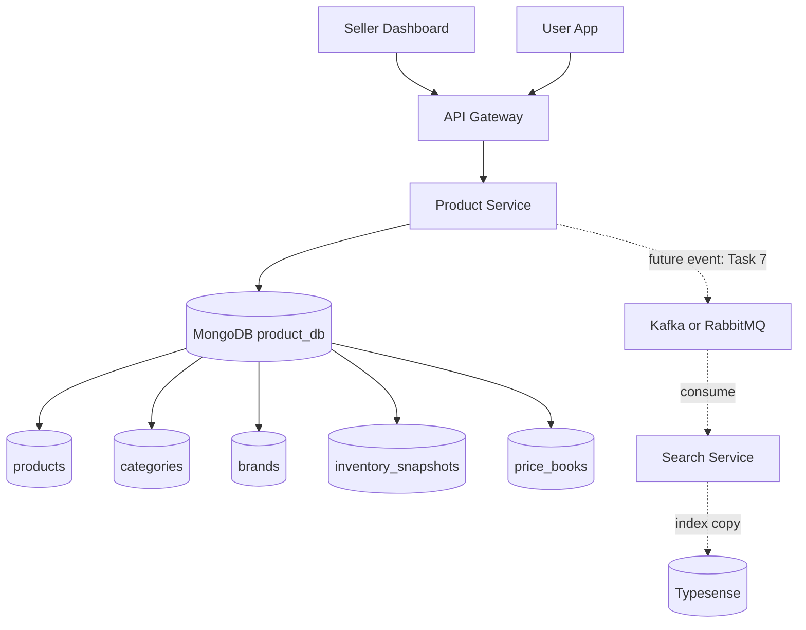
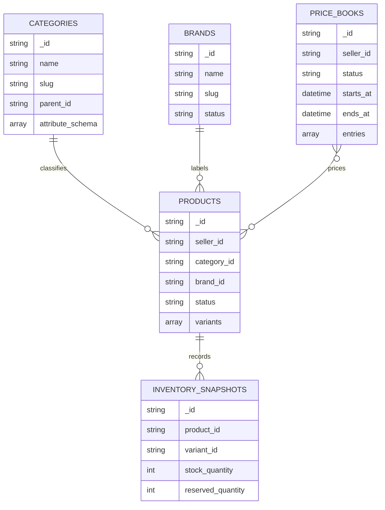
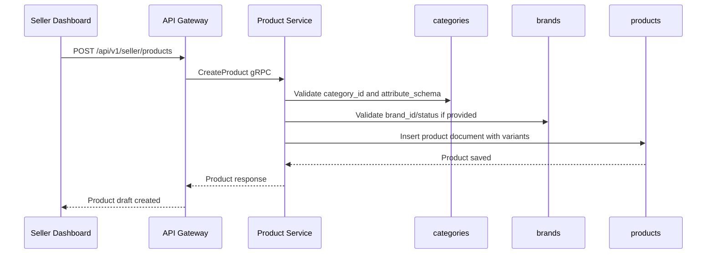

# 🛍️ Product Service - Task 3: Create Collections


## 📌 Task Summary

| Field | Detail |
|---|---|
| Service | Product Service |
| Task No. | 3 |
| Task Name | Create collections |
| Source | `docs/01-micro-tasks.md` -> `Product Service` -> Task 3 |
| Goal | `products`, `categories`, `brands`, `inventory_snapshots`, `price_books` collections design karna |
| Dependency | Product Service Task 2: Choose MongoDB |
| Priority | P0 |
| Database | `product_db` |
| Output Type | Documentation-only implementation guide |
| Not Included | Seller CRUD, read APIs, live MongoDB execution, inventory reserve/release code, search events |

> 🟢 **Simple Hinglish goal:** Is task me Product Service ke MongoDB collections ka proper design banaya gaya hai. Matlab kaunsi collection kis data ko store karegi, fields kya honge, indexes kaise honge, aur future Product Service code in collections ko kaise use karega.

---

## ✅ Final Output Created

```text
TaskImplementation/
└── Product Service/
    ├── task1.md
    ├── task2.md
    └── task3.md
```

### Why this structure?

| Path | Purpose |
|---|---|
| `TaskImplementation/` | Saare task-wise implementation guides ka central folder |
| `TaskImplementation/Product Service/` | Product Service ke implementation guides ko group karne ke liye |
| `task1.md` | Catalog model decision guide |
| `task2.md` | MongoDB database choice guide |
| `task3.md` | MongoDB collection design guide |

> 🔵 **Important:** Is task me sirf `task3.md` create kiya gaya hai. Actual MongoDB server par collections run/create nahi kiye gaye, aur Product Service ka Go code bhi create nahi kiya gaya.

---

## 🧭 Docs Studied Before Implementation

| Document | Kya use kiya gaya |
|---|---|
| `docs/01-micro-tasks.md` | Product Service Task 3 ka exact scope identify kiya |
| `TaskImplementation/Product Service/task1.md` | Product, variant, category, attribute, image, inventory rules ka base model samjha |
| `TaskImplementation/Product Service/task2.md` | MongoDB as primary Product DB, `product_db`, aur collection naming rules confirm kiye |
| `docs/03-folder-structure.md` | Future Product Service clean architecture folder shape align kiya |
| `docs/04-microservice-design.md` | Product Service collections list, responsibilities, APIs, and gRPC methods validate kiye |
| `docs/05-database-design.md` | Service-wise database ownership and indexing strategy align ki |
| `database/mongodb-schema-design.md` | Existing MongoDB schema examples and indexes ko base banaya |
| `api/master-api.json` | Product, ProductInput, ProductListRequest, CategoryListResponse schemas se API needs verify ki |

---

## 🧱 Task Boundary

### ✅ Task 3 me kya design kiya gaya

- `product_db` ke andar required 5 collections
- Har collection ka purpose and ownership
- Document fields and sample JSON
- MongoDB validation schema examples
- Recommended indexes and query patterns
- Collection relationships and data flow diagrams
- External tools/libraries guidance
- Future Product Service folder structure reference

### ❌ Task 3 me kya implement nahi kiya gaya

| Item | Reason |
|---|---|
| Seller product create/update/publish APIs | Product Service Task 4 ka scope hai |
| Public product listing/detail APIs | Product Service Task 5 ka scope hai |
| Inventory reserve/release/decrement methods | Product Service Task 6 ka scope hai |
| Product search events | Product Service Task 7 ka scope hai |
| CDN/media upload implementation | Product Service Task 8 ka scope hai |
| Live MongoDB container start karna | Platform Foundation Docker Compose/local stack ka scope hai |
| Product Service Go repository code | Later implementation task me actual code create hoga |

> 🔴 **Golden rule:** Task 3 ka focus collection design hai. Ye guide future implementation ke liye executable commands and examples deti hai, but current repo me runtime DB/code changes nahi karti.

---

## 🏁 Final Collection Set

Product Service ka owned database:

```text
Database: product_db
Owner: product-service
Access: Product Service ke through only
```

Required collections:

| Collection | Purpose | Main Owner Data |
|---|---|---|
| `products` | Canonical product catalog, variants, media metadata, active stock fields | Product + variant aggregate |
| `categories` | Category tree and category-wise attribute schema | Navigation + validation rules |
| `brands` | Brand master data | Brand name, slug, status, logo metadata |
| `inventory_snapshots` | Stock audit and periodic stock history | Stock snapshots per product variant |
| `price_books` | Scheduled/current price rules and campaign-style price sets | Price changes and effective windows |

---

## 🧩 High-Level Architecture



**Explanation:**  
Buyer aur seller dono direct MongoDB ko touch nahi karenge. Request API Gateway se Product Service tak jayegi. Product Service hi `product_db` collections ko read/write karega. Search Service future me events consume karega, but canonical data yahi rahega.

---

## 🗺️ Collection Relationship Diagram



**Hinglish explanation:**  
Category aur Brand product ko context dete hain. Product ke variants actual sellable units hain. Inventory snapshots audit/history ke liye hain. Price books scheduled ya campaign-based price updates ko manage karne ke liye hain.

---

## 🪜 Step-by-Step Implementation

## Step 1: Task requirement identify kiya

`docs/01-micro-tasks.md` me Product Service Task 3 ye define hai:

```text
Create collections:
products, categories, brands, inventory_snapshots, price_books collections design karo.
```

**How this part was built:**  
Task source se clear hua ki database technology already Task 2 me choose ho chuki hai. Ab kaam MongoDB ke actual collection design ko finalize karna hai.

---

## Step 2: Database and naming rules confirm kiye

Task 2 ke according Product Service ka database:

```text
product_db
```

Naming rules:

| Item | Rule | Example |
|---|---|---|
| Database | snake_case | `product_db` |
| Collection | lowercase plural noun | `products` |
| Document `_id` | stable domain id | `prod_123`, `cat_123`, `brand_123` |
| Timestamp | UTC ISO date | `created_at`, `updated_at` |
| Money | minor unit integer | `299900` paise for INR 2999.00 |
| Status | lowercase enum | `draft`, `published`, `archived` |

**Beginner note:**  
MongoDB me `_id` primary identifier hota hai. API layer me ise `product_id`, `category_id`, ya `brand_id` ke naam se expose kiya ja sakta hai, but DB me `_id` stable string rakhna simple and readable rahega.

---

## Step 3: `products` collection design ki

### Purpose

`products` collection Product Service ka main catalog source of truth hai.

Ye store karega:

- Product title, description, status
- Seller ownership
- Category and brand reference
- Dynamic attributes
- Product images metadata
- Variants/SKUs
- Variant-level price and inventory fields
- Rating summary
- Audit timestamps

### Product document shape

```json
{
  "_id": "prod_123",
  "seller_id": "seller_456",
  "title": "Running Shoes",
  "slug": "running-shoes",
  "description": "Lightweight running shoes for daily training",
  "brand_id": "brand_acme",
  "brand_name": "Acme",
  "category_id": "cat_running_shoes",
  "category_path": [
    {
      "category_id": "cat_fashion",
      "name": "Fashion",
      "slug": "fashion"
    },
    {
      "category_id": "cat_footwear",
      "name": "Footwear",
      "slug": "footwear"
    },
    {
      "category_id": "cat_running_shoes",
      "name": "Running Shoes",
      "slug": "running-shoes"
    }
  ],
  "status": "draft",
  "attributes": {
    "gender": "men",
    "material": "mesh",
    "sport_type": "running"
  },
  "images": [
    {
      "url": "https://cdn.example.com/products/prod_123/main.jpg",
      "alt": "Running shoes side view",
      "position": 1,
      "is_primary": true,
      "status": "active"
    }
  ],
  "variants": [
    {
      "variant_id": "var_1",
      "sku": "ACME-SHOE-9-BLK",
      "title": "Black / Size 9",
      "attributes": {
        "size": "9",
        "color": "black"
      },
      "price": {
        "amount": 299900,
        "currency": "INR"
      },
      "mrp": {
        "amount": 399900,
        "currency": "INR"
      },
      "stock_quantity": 120,
      "reserved_quantity": 5,
      "safety_stock": 2,
      "status": "active",
      "created_at": "2026-05-23T00:00:00Z",
      "updated_at": "2026-05-23T00:00:00Z"
    }
  ],
  "rating_summary": {
    "average": 4.4,
    "count": 120
  },
  "created_by": "seller_456",
  "updated_by": "seller_456",
  "created_at": "2026-05-23T00:00:00Z",
  "updated_at": "2026-05-23T00:00:00Z",
  "published_at": null
}
```

### Important field decisions

| Field | Why needed |
|---|---|
| `_id` | Stable product identity, API me `product_id` ban sakta hai |
| `seller_id` | Seller ownership validation ke liye |
| `brand_id` + `brand_name` | Brand master reference plus fast product read |
| `category_id` | Listing and category filter ke liye |
| `category_path` | Parent category browse without extra joins |
| `attributes` | Category-wise dynamic specs ke liye |
| `variants` | SKU, variant price, and stock product ke saath embedded |
| `stock_quantity` | Physical/current stock count |
| `reserved_quantity` | Checkout hold count |
| `rating_summary` | Product detail/listing me fast display |

### `products` validation example

```javascript
db.createCollection("products", {
  validator: {
    $jsonSchema: {
      bsonType: "object",
      required: ["_id", "seller_id", "title", "category_id", "status", "variants", "created_at", "updated_at"],
      properties: {
        _id: {
          bsonType: "string",
          description: "Product id, example prod_123"
        },
        seller_id: {
          bsonType: "string"
        },
        title: {
          bsonType: "string",
          minLength: 1,
          maxLength: 200
        },
        slug: {
          bsonType: "string"
        },
        description: {
          bsonType: ["string", "null"]
        },
        brand_id: {
          bsonType: ["string", "null"]
        },
        brand_name: {
          bsonType: ["string", "null"]
        },
        category_id: {
          bsonType: "string"
        },
        status: {
          enum: ["draft", "submitted", "published", "unpublished", "archived"]
        },
        attributes: {
          bsonType: "object"
        },
        images: {
          bsonType: "array"
        },
        variants: {
          bsonType: "array",
          minItems: 1,
          items: {
            bsonType: "object",
            required: ["variant_id", "sku", "price", "stock_quantity", "reserved_quantity", "status"],
            properties: {
              variant_id: { bsonType: "string" },
              sku: { bsonType: "string" },
              attributes: { bsonType: "object" },
              price: {
                bsonType: "object",
                required: ["amount", "currency"],
                properties: {
                  amount: { bsonType: "long" },
                  currency: { bsonType: "string" }
                }
              },
              mrp: {
                bsonType: ["object", "null"]
              },
              stock_quantity: { bsonType: "int", minimum: 0 },
              reserved_quantity: { bsonType: "int", minimum: 0 },
              safety_stock: { bsonType: ["int", "null"], minimum: 0 },
              status: { enum: ["active", "inactive", "deleted"] }
            }
          }
        },
        created_at: { bsonType: "date" },
        updated_at: { bsonType: "date" },
        published_at: { bsonType: ["date", "null"] }
      }
    }
  },
  validationLevel: "moderate",
  validationAction: "error"
})
```

### `products` indexes

```javascript
db.products.createIndex(
  { seller_id: 1, status: 1, updated_at: -1 },
  { name: "idx_products_seller_status_updated" }
)

db.products.createIndex(
  { category_id: 1, status: 1, updated_at: -1 },
  { name: "idx_products_category_status_updated" }
)

db.products.createIndex(
  { "category_path.category_id": 1, status: 1, updated_at: -1 },
  { name: "idx_products_category_path_status_updated" }
)

db.products.createIndex(
  { brand_id: 1, status: 1, updated_at: -1 },
  { name: "idx_products_brand_status_updated" }
)

db.products.createIndex(
  { "variants.sku": 1 },
  { unique: true, name: "uniq_products_variant_sku" }
)

db.products.createIndex(
  { slug: 1 },
  { unique: true, sparse: true, name: "uniq_products_slug" }
)

db.products.createIndex(
  { title: "text", description: "text", brand_name: "text" },
  { name: "idx_products_dev_text_search" }
)
```

### Query examples

Public category browse:

```javascript
db.products
  .find({ category_id: "cat_running_shoes", status: "published" })
  .sort({ updated_at: -1 })
  .limit(20)
```

Seller dashboard product list:

```javascript
db.products
  .find({ seller_id: "seller_456", status: "draft" })
  .sort({ updated_at: -1 })
```

Find product by SKU:

```javascript
db.products.findOne({ "variants.sku": "ACME-SHOE-9-BLK" })
```

> 🟡 **Important:** MongoDB unique multikey index helps SKU uniqueness across product documents, but service-level validation should still check duplicate SKU inside the same product variants array.

---

## Step 4: `categories` collection design ki

### Purpose

`categories` collection product navigation, category tree, and category-wise attribute validation ke liye use hogi.

Ye store karega:

- Parent-child category tree
- Slugs for URL and filters
- Sort order
- Active/inactive state
- Category-specific attribute schema
- SEO metadata

### Category document shape

```json
{
  "_id": "cat_running_shoes",
  "name": "Running Shoes",
  "slug": "running-shoes",
  "parent_id": "cat_footwear",
  "path": ["cat_fashion", "cat_footwear", "cat_running_shoes"],
  "depth": 2,
  "sort_order": 10,
  "is_active": true,
  "attribute_schema": [
    {
      "key": "size",
      "label": "Size",
      "type": "string",
      "required": true,
      "filterable": true,
      "variant_axis": true,
      "allowed_values": ["7", "8", "9", "10", "11"],
      "unit": null
    },
    {
      "key": "material",
      "label": "Material",
      "type": "string",
      "required": false,
      "filterable": true,
      "variant_axis": false,
      "allowed_values": ["mesh", "leather", "synthetic"],
      "unit": null
    }
  ],
  "seo": {
    "title": "Running Shoes",
    "description": "Shop running shoes for daily training"
  },
  "created_at": "2026-05-23T00:00:00Z",
  "updated_at": "2026-05-23T00:00:00Z"
}
```

### Important field decisions

| Field | Why needed |
|---|---|
| `_id` | Stable category id |
| `parent_id` | Category tree build karne ke liye |
| `path` | Breadcrumb and ancestor category filters ke liye |
| `sort_order` | Frontend category ordering ke liye |
| `attribute_schema` | Product attributes validate karne ke liye |
| `variant_axis` | Variant options jaise size/color identify karne ke liye |

### `categories` validation example

```javascript
db.createCollection("categories", {
  validator: {
    $jsonSchema: {
      bsonType: "object",
      required: ["_id", "name", "slug", "path", "depth", "sort_order", "is_active", "created_at", "updated_at"],
      properties: {
        _id: { bsonType: "string" },
        name: { bsonType: "string", minLength: 1, maxLength: 120 },
        slug: { bsonType: "string" },
        parent_id: { bsonType: ["string", "null"] },
        path: {
          bsonType: "array",
          items: { bsonType: "string" }
        },
        depth: { bsonType: "int", minimum: 0 },
        sort_order: { bsonType: "int" },
        is_active: { bsonType: "bool" },
        attribute_schema: { bsonType: "array" },
        seo: { bsonType: ["object", "null"] },
        created_at: { bsonType: "date" },
        updated_at: { bsonType: "date" }
      }
    }
  },
  validationLevel: "moderate",
  validationAction: "error"
})
```

### `categories` indexes

```javascript
db.categories.createIndex(
  { parent_id: 1, sort_order: 1 },
  { name: "idx_categories_parent_sort" }
)

db.categories.createIndex(
  { slug: 1 },
  { unique: true, name: "uniq_categories_slug" }
)

db.categories.createIndex(
  { path: 1 },
  { name: "idx_categories_path" }
)

db.categories.createIndex(
  { is_active: 1, sort_order: 1 },
  { name: "idx_categories_active_sort" }
)
```

### Query examples

List root categories:

```javascript
db.categories
  .find({ parent_id: null, is_active: true })
  .sort({ sort_order: 1 })
```

List child categories:

```javascript
db.categories
  .find({ parent_id: "cat_footwear", is_active: true })
  .sort({ sort_order: 1 })
```

Get attribute rules before product create:

```javascript
db.categories.findOne(
  { _id: "cat_running_shoes", is_active: true },
  { attribute_schema: 1 }
)
```

---

## Step 5: `brands` collection design ki

### Purpose

`brands` collection brand master data store karegi. Product me `brand_id` reference rahega and `brand_name` denormalized display ke liye rahega.

Ye store karega:

- Brand name and slug
- Logo and website metadata
- Active/inactive status
- Optional seller ownership/approval metadata

### Brand document shape

```json
{
  "_id": "brand_acme",
  "name": "Acme",
  "slug": "acme",
  "description": "Acme sports and lifestyle products",
  "logo_url": "https://cdn.example.com/brands/acme/logo.png",
  "website_url": "https://www.example.com/acme",
  "status": "active",
  "created_by": "admin_123",
  "created_at": "2026-05-23T00:00:00Z",
  "updated_at": "2026-05-23T00:00:00Z"
}
```

### Important field decisions

| Field | Why needed |
|---|---|
| `_id` | Stable brand id |
| `name` | Buyer-facing display name |
| `slug` | URL/filter friendly key |
| `logo_url` | Frontend brand page or filter UI ke liye |
| `status` | Inactive brand ko new products me block karne ke liye |

### `brands` validation example

```javascript
db.createCollection("brands", {
  validator: {
    $jsonSchema: {
      bsonType: "object",
      required: ["_id", "name", "slug", "status", "created_at", "updated_at"],
      properties: {
        _id: { bsonType: "string" },
        name: { bsonType: "string", minLength: 1, maxLength: 120 },
        slug: { bsonType: "string" },
        description: { bsonType: ["string", "null"] },
        logo_url: { bsonType: ["string", "null"] },
        website_url: { bsonType: ["string", "null"] },
        status: { enum: ["active", "inactive", "archived"] },
        created_by: { bsonType: ["string", "null"] },
        created_at: { bsonType: "date" },
        updated_at: { bsonType: "date" }
      }
    }
  },
  validationLevel: "moderate",
  validationAction: "error"
})
```

### `brands` indexes

```javascript
db.brands.createIndex(
  { slug: 1 },
  { unique: true, name: "uniq_brands_slug" }
)

db.brands.createIndex(
  { status: 1, name: 1 },
  { name: "idx_brands_status_name" }
)

db.brands.createIndex(
  { name: "text" },
  { name: "idx_brands_name_text" }
)
```

### Query examples

List active brands:

```javascript
db.brands
  .find({ status: "active" })
  .sort({ name: 1 })
```

Validate brand before assigning to product:

```javascript
db.brands.findOne({ _id: "brand_acme", status: "active" })
```

---

## Step 6: `inventory_snapshots` collection design ki

### Purpose

`inventory_snapshots` active stock ka primary source nahi hai. Active stock `products.variants` me rahega because product detail and checkout validation ko current stock fast chahiye.

Ye collection audit/history ke liye use hogi:

- Periodic stock snapshot
- Manual stock adjustment snapshot
- Order reserve/release/commit ke baad snapshot
- Debugging and reconciliation

### Inventory snapshot document shape

```json
{
  "_id": "inv_snap_123",
  "product_id": "prod_123",
  "variant_id": "var_1",
  "sku": "ACME-SHOE-9-BLK",
  "seller_id": "seller_456",
  "snapshot_type": "manual_adjustment",
  "stock_quantity": 120,
  "reserved_quantity": 5,
  "available_quantity": 113,
  "reason": "Seller updated warehouse stock",
  "reference": {
    "type": "seller_action",
    "id": "action_789"
  },
  "created_at": "2026-05-23T00:00:00Z"
}
```

### Available quantity formula

```text
available_quantity = stock_quantity - reserved_quantity - safety_stock
```

Example:

```text
stock_quantity = 120
reserved_quantity = 5
safety_stock = 2
available_quantity = 113
```

### Important field decisions

| Field | Why needed |
|---|---|
| `product_id` + `variant_id` | Exact sellable item identify karne ke liye |
| `sku` | Human/debug friendly lookup ke liye |
| `seller_id` | Seller stock history filter ke liye |
| `snapshot_type` | Snapshot reason categorize karne ke liye |
| `reference` | Order/action/job se traceability ke liye |
| `created_at` | Timeline and audit query ke liye |

### `inventory_snapshots` validation example

```javascript
db.createCollection("inventory_snapshots", {
  validator: {
    $jsonSchema: {
      bsonType: "object",
      required: [
        "_id",
        "product_id",
        "variant_id",
        "sku",
        "seller_id",
        "snapshot_type",
        "stock_quantity",
        "reserved_quantity",
        "available_quantity",
        "created_at"
      ],
      properties: {
        _id: { bsonType: "string" },
        product_id: { bsonType: "string" },
        variant_id: { bsonType: "string" },
        sku: { bsonType: "string" },
        seller_id: { bsonType: "string" },
        snapshot_type: {
          enum: ["periodic", "manual_adjustment", "reservation", "release", "order_commit", "correction"]
        },
        stock_quantity: { bsonType: "int", minimum: 0 },
        reserved_quantity: { bsonType: "int", minimum: 0 },
        available_quantity: { bsonType: "int" },
        reason: { bsonType: ["string", "null"] },
        reference: { bsonType: ["object", "null"] },
        created_at: { bsonType: "date" }
      }
    }
  },
  validationLevel: "moderate",
  validationAction: "error"
})
```

### `inventory_snapshots` indexes

```javascript
db.inventory_snapshots.createIndex(
  { product_id: 1, variant_id: 1, created_at: -1 },
  { name: "idx_inventory_product_variant_created" }
)

db.inventory_snapshots.createIndex(
  { seller_id: 1, created_at: -1 },
  { name: "idx_inventory_seller_created" }
)

db.inventory_snapshots.createIndex(
  { sku: 1, created_at: -1 },
  { name: "idx_inventory_sku_created" }
)

db.inventory_snapshots.createIndex(
  { snapshot_type: 1, created_at: -1 },
  { name: "idx_inventory_type_created" }
)
```

### Query examples

Latest snapshot for one variant:

```javascript
db.inventory_snapshots
  .find({ product_id: "prod_123", variant_id: "var_1" })
  .sort({ created_at: -1 })
  .limit(1)
```

Seller inventory audit:

```javascript
db.inventory_snapshots
  .find({ seller_id: "seller_456" })
  .sort({ created_at: -1 })
  .limit(50)
```

> 🟡 **Retention note:** Inventory snapshots audit useful hote hain. Isliye TTL index default me avoid kiya gaya hai. Future me storage cost high ho to retention policy separately define karni chahiye.

---

## Step 7: `price_books` collection design ki

### Purpose

`price_books` current and scheduled pricing rules ko store karegi. Product variants ke andar current `price` and `mrp` fast read ke liye embedded rahenge, but price changes and campaigns ko trace karne ke liye price book useful hai.

Ye store karega:

- Seller-specific price book
- Campaign/scheduled price windows
- Variant-level price entries
- Status and priority
- Audit metadata

### Price book document shape

```json
{
  "_id": "pb_summer_sale_2026",
  "seller_id": "seller_456",
  "name": "Summer Sale 2026",
  "currency": "INR",
  "status": "active",
  "priority": 10,
  "starts_at": "2026-06-01T00:00:00Z",
  "ends_at": "2026-06-15T23:59:59Z",
  "entries": [
    {
      "entry_id": "pbe_1",
      "product_id": "prod_123",
      "variant_id": "var_1",
      "sku": "ACME-SHOE-9-BLK",
      "price": {
        "amount": 249900,
        "currency": "INR"
      },
      "mrp": {
        "amount": 399900,
        "currency": "INR"
      },
      "min_quantity": 1
    }
  ],
  "created_by": "seller_456",
  "updated_by": "seller_456",
  "created_at": "2026-05-23T00:00:00Z",
  "updated_at": "2026-05-23T00:00:00Z"
}
```

### Important field decisions

| Field | Why needed |
|---|---|
| `seller_id` | Seller-specific pricing ownership ke liye |
| `status` | Draft/active/expired price books separate karne ke liye |
| `priority` | Multiple active price rules me winner decide karne ke liye |
| `starts_at` / `ends_at` | Scheduled sale windows ke liye |
| `entries.product_id` + `entries.variant_id` | Specific variant price target karne ke liye |
| `min_quantity` | Future bulk pricing support ke liye |

### `price_books` validation example

```javascript
db.createCollection("price_books", {
  validator: {
    $jsonSchema: {
      bsonType: "object",
      required: ["_id", "seller_id", "name", "currency", "status", "priority", "entries", "created_at", "updated_at"],
      properties: {
        _id: { bsonType: "string" },
        seller_id: { bsonType: "string" },
        name: { bsonType: "string", minLength: 1, maxLength: 160 },
        currency: { bsonType: "string" },
        status: { enum: ["draft", "active", "expired", "archived"] },
        priority: { bsonType: "int" },
        starts_at: { bsonType: ["date", "null"] },
        ends_at: { bsonType: ["date", "null"] },
        entries: {
          bsonType: "array",
          items: {
            bsonType: "object",
            required: ["entry_id", "product_id", "variant_id", "sku", "price"],
            properties: {
              entry_id: { bsonType: "string" },
              product_id: { bsonType: "string" },
              variant_id: { bsonType: "string" },
              sku: { bsonType: "string" },
              price: {
                bsonType: "object",
                required: ["amount", "currency"],
                properties: {
                  amount: { bsonType: "long" },
                  currency: { bsonType: "string" }
                }
              },
              mrp: { bsonType: ["object", "null"] },
              min_quantity: { bsonType: ["int", "null"], minimum: 1 }
            }
          }
        },
        created_by: { bsonType: ["string", "null"] },
        updated_by: { bsonType: ["string", "null"] },
        created_at: { bsonType: "date" },
        updated_at: { bsonType: "date" }
      }
    }
  },
  validationLevel: "moderate",
  validationAction: "error"
})
```

### `price_books` indexes

```javascript
db.price_books.createIndex(
  { seller_id: 1, status: 1, starts_at: -1 },
  { name: "idx_price_books_seller_status_starts" }
)

db.price_books.createIndex(
  { status: 1, starts_at: 1, ends_at: 1, priority: -1 },
  { name: "idx_price_books_active_window_priority" }
)

db.price_books.createIndex(
  { "entries.product_id": 1, "entries.variant_id": 1, status: 1 },
  { name: "idx_price_books_entry_product_variant_status" }
)

db.price_books.createIndex(
  { "entries.sku": 1, status: 1 },
  { name: "idx_price_books_entry_sku_status" }
)
```

### Query examples

Find active price books for a seller:

```javascript
db.price_books
  .find({
    seller_id: "seller_456",
    status: "active",
    starts_at: { $lte: new Date() },
    $or: [
      { ends_at: null },
      { ends_at: { $gte: new Date() } }
    ]
  })
  .sort({ priority: -1, starts_at: -1 })
```

Find price rule for a variant:

```javascript
db.price_books.find({
  status: "active",
  "entries.product_id": "prod_123",
  "entries.variant_id": "var_1"
})
```

> 🟡 **Document size note:** Agar ek price book me bahut zyada entries aane lagen, MongoDB 16 MB document limit hit ho sakti hai. Future scale par `price_book_items` separate collection add ki ja sakti hai, but Task 3 docs me required collection list ke andar hi design rakha gaya hai.

---

## Step 8: Collection creation script assemble kiya

Future me local MongoDB ready hone ke baad developer `mongosh` me ye sequence run kar sakta hai:

```javascript
use product_db

db.createCollection("products")
db.createCollection("categories")
db.createCollection("brands")
db.createCollection("inventory_snapshots")
db.createCollection("price_books")
```

Production-ready setup me simple `createCollection` ke badle validators wale commands use karne chahiye jo upar har collection ke section me diye gaye hain.

### Index creation sequence

```javascript
use product_db

db.products.createIndex({ seller_id: 1, status: 1, updated_at: -1 }, { name: "idx_products_seller_status_updated" })
db.products.createIndex({ category_id: 1, status: 1, updated_at: -1 }, { name: "idx_products_category_status_updated" })
db.products.createIndex({ "category_path.category_id": 1, status: 1, updated_at: -1 }, { name: "idx_products_category_path_status_updated" })
db.products.createIndex({ brand_id: 1, status: 1, updated_at: -1 }, { name: "idx_products_brand_status_updated" })
db.products.createIndex({ "variants.sku": 1 }, { unique: true, name: "uniq_products_variant_sku" })
db.products.createIndex({ slug: 1 }, { unique: true, sparse: true, name: "uniq_products_slug" })
db.products.createIndex({ title: "text", description: "text", brand_name: "text" }, { name: "idx_products_dev_text_search" })

db.categories.createIndex({ parent_id: 1, sort_order: 1 }, { name: "idx_categories_parent_sort" })
db.categories.createIndex({ slug: 1 }, { unique: true, name: "uniq_categories_slug" })
db.categories.createIndex({ path: 1 }, { name: "idx_categories_path" })
db.categories.createIndex({ is_active: 1, sort_order: 1 }, { name: "idx_categories_active_sort" })

db.brands.createIndex({ slug: 1 }, { unique: true, name: "uniq_brands_slug" })
db.brands.createIndex({ status: 1, name: 1 }, { name: "idx_brands_status_name" })
db.brands.createIndex({ name: "text" }, { name: "idx_brands_name_text" })

db.inventory_snapshots.createIndex({ product_id: 1, variant_id: 1, created_at: -1 }, { name: "idx_inventory_product_variant_created" })
db.inventory_snapshots.createIndex({ seller_id: 1, created_at: -1 }, { name: "idx_inventory_seller_created" })
db.inventory_snapshots.createIndex({ sku: 1, created_at: -1 }, { name: "idx_inventory_sku_created" })
db.inventory_snapshots.createIndex({ snapshot_type: 1, created_at: -1 }, { name: "idx_inventory_type_created" })

db.price_books.createIndex({ seller_id: 1, status: 1, starts_at: -1 }, { name: "idx_price_books_seller_status_starts" })
db.price_books.createIndex({ status: 1, starts_at: 1, ends_at: 1, priority: -1 }, { name: "idx_price_books_active_window_priority" })
db.price_books.createIndex({ "entries.product_id": 1, "entries.variant_id": 1, status: 1 }, { name: "idx_price_books_entry_product_variant_status" })
db.price_books.createIndex({ "entries.sku": 1, status: 1 }, { name: "idx_price_books_entry_sku_status" })
```

---

## Step 9: Data flow for future product create design kiya



**Hinglish explanation:**  
Ye flow Task 4 me actual seller CRUD banate waqt useful hoga. Task 3 me sirf collections ready design ho rahi hain, lekin design is tarah rakha gaya hai ki CreateProduct cleanly category/brand validation karke product insert kar sake.

---

## Step 10: Future repository folder structure align ki

Task 3 me actual Go files create nahi kiye gaye. Future Product Service implementation docs ke according structure aisa rahega:

```text
backend/
└── services/
    └── product-service/
        ├── cmd/
        │   └── server/
        │       └── main.go
        └── internal/
            ├── domain/
            │   ├── product.go
            │   ├── variant.go
            │   ├── category.go
            │   ├── brand.go
            │   ├── inventory.go
            │   └── price_book.go
            ├── repository/
            │   ├── mongo_product_repository.go
            │   ├── mongo_category_repository.go
            │   ├── mongo_brand_repository.go
            │   ├── mongo_inventory_snapshot_repository.go
            │   └── mongo_price_book_repository.go
            ├── usecase/
            │   ├── create_product.go
            │   ├── publish_product.go
            │   ├── list_products.go
            │   └── reserve_inventory.go
            └── transport/
                └── grpc/
                    └── server.go
```

### Future Go collection constants example

```go
package repository

const (
	CollectionProducts           = "products"
	CollectionCategories         = "categories"
	CollectionBrands             = "brands"
	CollectionInventorySnapshots = "inventory_snapshots"
	CollectionPriceBooks         = "price_books"
)
```

**How this part was built:**  
`docs/03-folder-structure.md` clean architecture follow karta hai. Domain layer business model rakhegi, repository layer MongoDB collection access rakhegi, aur usecase layer workflows handle karegi.

---

## 🧰 External Libraries / Tools Used or Recommended

Task 3 me koi external dependency install nahi ki gayi. Ye documentation-only output hai. Future implementation ke liye ye tools use honge:

| Tool/Library | What it is | Why used | Install / Use |
|---|---|---|---|
| MongoDB | Document database | Product catalog, variants, dynamic attributes, category tree, price books store karne ke liye | Local Docker ya managed MongoDB |
| `mongosh` | MongoDB shell | Collections, validators, indexes create/test karne ke liye | MongoDB tools ke saath install hota hai ya Docker container me available hota hai |
| Docker | Container runtime | Local MongoDB quickly run karne ke liye | `docker compose up -d product-mongo` |
| Official MongoDB Go Driver | Go MongoDB client | Future Product Service repository implementation ke liye | `go get go.mongodb.org/mongo-driver/v2/mongo` |

### Local MongoDB example

```bash
docker compose -f infra/compose/docker-compose.local.yml up -d product-mongo
```

### Open Mongo shell

```bash
docker exec -it ecommerce-product-mongo mongosh product_db
```

### Future Go driver install

```bash
cd backend/services/product-service
go get go.mongodb.org/mongo-driver/v2/mongo
```

> 🔵 **Note:** Upar wale commands future execution ke liye hain. Is task me repo ke andar dependency install ya service scaffold create nahi kiya gaya.

---

## 🧪 Verification Checklist

| Check | Status |
|---|---:|
| `TaskImplementation/Product Service/task3.md` created | ✅ |
| Required 5 collections documented | ✅ |
| `products` document shape included | ✅ |
| `categories` document shape included | ✅ |
| `brands` document shape included | ✅ |
| `inventory_snapshots` document shape included | ✅ |
| `price_books` document shape included | ✅ |
| Validation examples included | ✅ |
| Index examples included | ✅ |
| Query examples included | ✅ |
| Mermaid diagrams included | ✅ |
| External tools/libraries explained | ✅ |
| No Product Service runtime code created | ✅ |
| No work beyond Product Service Task 3 | ✅ |

---

## 🚫 Out of Scope for Product Service Task 3

These were intentionally not created:

```text
backend/services/product-service/
proto/ecommerce/product/v1/
infra/compose/docker-compose.local.yml
actual MongoDB collections on a running server
seller CRUD handlers
product read APIs
inventory reservation logic
search event publisher
media upload pipeline
```

**Reason:**  
Ye sab later Product Service tasks ya Platform Foundation tasks me covered honge. Task 3 ka purpose Product Service ke MongoDB collections ko cleanly design karna hai.

---

## ✅ Final Summary

Product Service Task 3 complete hai as a **MongoDB collection design guide**:

- `product_db` ke andar 5 required collections define ki gayi.
- `products`, `categories`, `brands`, `inventory_snapshots`, and `price_books` ke fields, examples, validations, indexes, and query patterns document kiye gaye.
- Collection relationships and future data flow Mermaid diagrams se explain kiye gaye.
- External tools/libraries ka purpose, install, and usage guide diya gaya.
- Scope strictly Product Service Task 3 tak limited rakha gaya.

> 🟢 **Final note:** Ab Product Service Task 4 me seller CRUD implement karne ke liye ye collections ready reference ke tarah use ho sakti hain.
