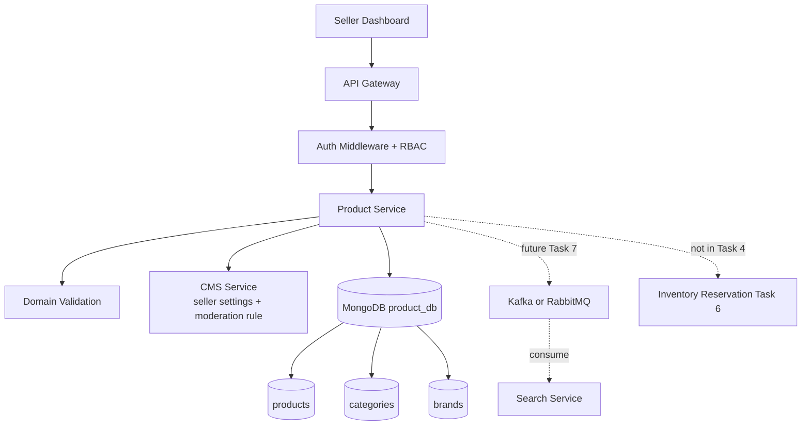
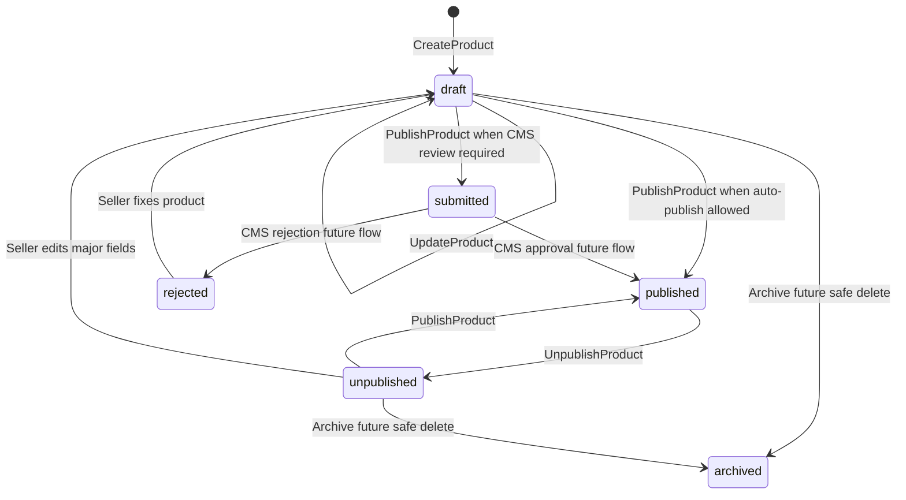
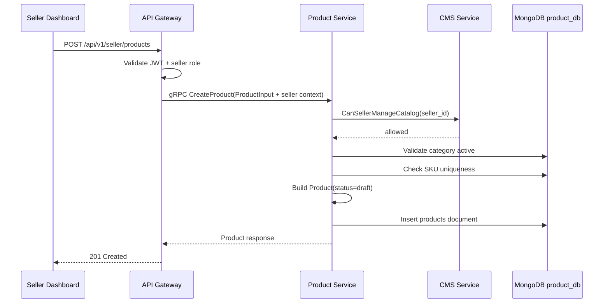
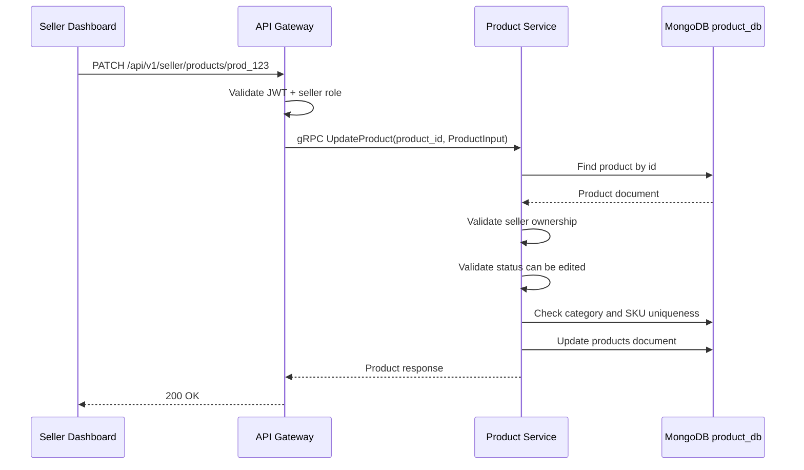
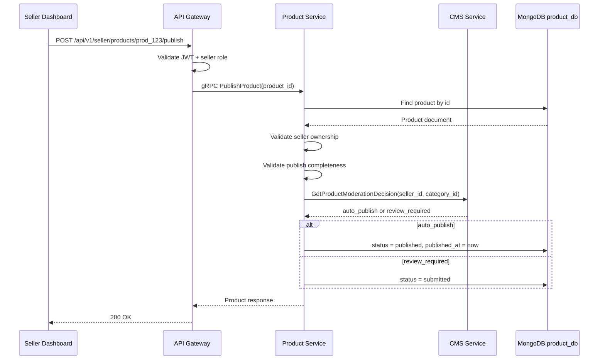
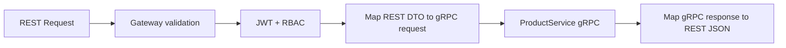
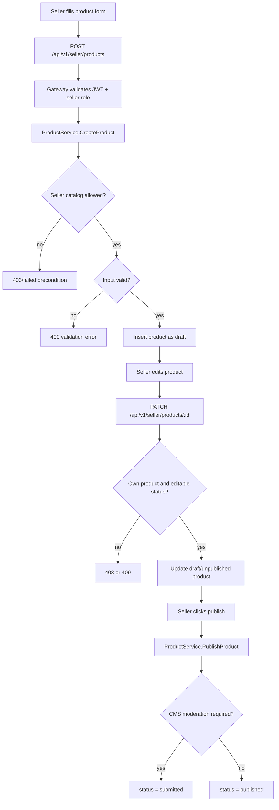

# 🛍️ Product Service - Task 4: Implement Seller CRUD


## 📌 Task Summary

| Field | Detail |
|---|---|
| Service | Product Service |
| Task No. | 4 |
| Task Name | Implement seller CRUD |
| Source | `docs/01-micro-tasks.md` -> `Product Service` -> Task 4 |
| Goal | Seller apne products create/update/publish kar sake. Draft and published workflow banana |
| Dependency | CMS Service |
| Priority | P1 |
| Database | MongoDB `product_db` |
| Main Collection | `products` |
| Output Type | Documentation-only implementation guide |
| Not Included | Public product listing/detail APIs, category browse, seller catalog read APIs, inventory reservation, search events, media upload |

> 🟢 **Simple Hinglish goal:** Is task me seller ke product write workflow ka design implement-ready banaya gaya hai. Seller product create karega to product `draft` status me banega. Seller update kar sakta hai. Jab product complete and valid ho jaye, seller publish command chalayega. Publish ke time ownership, role, category, variants, price, stock, CMS moderation rule, aur product completeness validate hogi.

---

## ✅ Final Output Created

```text
TaskImplementation/
└── Product Service/
    ├── task1.md
    ├── task2.md
    ├── task3.md
    └── task4.md
```

### Why this structure?

| Path | Purpose |
|---|---|
| `TaskImplementation/` | Saare task-wise implementation guides ka central folder |
| `TaskImplementation/Product Service/` | Product Service ke implementation guides ko group karne ke liye |
| `task1.md` | Catalog model guide |
| `task2.md` | MongoDB database choice guide |
| `task3.md` | MongoDB collection design guide |
| `task4.md` | Seller product CRUD and draft/publish workflow guide |

> 🔵 **Important:** Is task me sirf `task4.md` create kiya gaya hai. Actual Go service code, proto file, gateway route, MongoDB write, Docker config, ya test file repo me create nahi ki gayi. Code examples implementation ko explain karne ke liye hain.

---

## 🧭 Docs Studied Before Implementation

| Document | Kya use kiya gaya |
|---|---|
| `docs/01-micro-tasks.md` | Product Service Task 4 ka exact scope identify kiya |
| `TaskImplementation/Product Service/task1.md` | Product, variant, image, inventory, lifecycle model ka base liya |
| `TaskImplementation/Product Service/task2.md` | MongoDB `product_db` and driver direction confirm ki |
| `TaskImplementation/Product Service/task3.md` | `products`, `categories`, `brands`, `inventory_snapshots`, `price_books` collection design use kiya |
| `docs/02-system-architecture.md` | API Gateway -> Product Service -> MongoDB ownership flow align kiya |
| `docs/03-folder-structure.md` | Future Go service clean architecture folder shape align ki |
| `docs/04-microservice-design.md` | Product Service responsibilities, REST APIs, and gRPC methods validate kiye |
| `docs/05-database-design.md` | Product DB ownership and high-value indexes confirm kiye |
| `docs/06-auth-security.md` | Seller roles and `product:write:own_seller` permission align ki |
| `docs/09-cms-superadmin.md` | CMS product management and moderation flow use kiya |
| `docs/13-developer-guide.md` | Backend coding flow, validation, tests, observability rules align kiye |
| `api/master-api.json` | Seller product create/update/publish REST and gRPC mapping validate ki |

---

## 🧱 Task Boundary

### ✅ Task 4 me kya design/document kiya gaya

- Seller product create workflow
- Seller product update workflow
- Seller product publish workflow
- Draft and published lifecycle
- Seller ownership validation
- Seller role/RBAC validation
- Product input validation
- Category and brand validation
- Variant SKU uniqueness rule
- CMS moderation dependency
- MongoDB repository write patterns
- gRPC service method shape
- API Gateway route mapping
- Error handling and audit fields
- Testing strategy
- Mermaid architecture, sequence, and state diagrams

### ❌ Task 4 me kya implement nahi kiya gaya

| Item | Reason |
|---|---|
| Public `GET /api/v1/products` listing | Product Service Task 5 ka scope hai |
| Public `GET /api/v1/products/{product_id}` detail | Product Service Task 5 ka scope hai |
| Category browse APIs | Product Service Task 5 ka scope hai |
| Seller catalog read/list APIs | Product Service Task 5 me read API scope ke saath aayega |
| Inventory reserve/release/decrement | Product Service Task 6 ka scope hai |
| Product search/index events | Product Service Task 7 ka scope hai |
| CDN upload or media processing | Product Service Task 8 ka scope hai |
| CMS Service actual implementation | CMS Service ke apne tasks ka scope hai |
| Hard delete product | Seller CRUD me safe lifecycle ke liye archive/unpublish prefer hoga; hard delete risky hai |

> 🔴 **Golden rule:** Task 4 seller write-side workflow banata hai. Public read path, search indexing, checkout inventory reservation, and media upload ko yahan implement nahi karna.

---

## 🏁 Final Decision

Product Service Task 4 ke liye seller CRUD ka MVP scope:

```text
CreateProduct  -> seller product draft banata hai
UpdateProduct  -> seller apne draft/unpublished product ko update karta hai
PublishProduct -> seller complete product ko published/submitted state me move karta hai
UnpublishProduct -> gRPC contract me supported seller lifecycle command
```

### REST routes from `api/master-api.json`

| Action | Method | Path | gRPC Method | Auth |
|---|---|---|---|---|
| Create product | `POST` | `/api/v1/seller/products` | `ProductService.CreateProduct` | `seller` |
| Update product | `PATCH` | `/api/v1/seller/products/{product_id}` | `ProductService.UpdateProduct` | `seller` |
| Publish product | `POST` | `/api/v1/seller/products/{product_id}/publish` | `ProductService.PublishProduct` | `seller` |

### Internal gRPC methods from `api/master-api.json`

| Method | Input | Output | Auth |
|---|---|---|---|
| `CreateProduct` | `ProductInput` | `Product` | seller |
| `UpdateProduct` | `ProductInput` | `Product` | seller |
| `PublishProduct` | `IdPathRequest` | `Product` | seller |
| `UnpublishProduct` | `IdPathRequest` | `Product` | seller |

> 🟡 **Note:** `UnpublishProduct` gRPC method master API me listed hai. REST route docs me publish route explicitly present hai. Unpublish can be exposed later through gateway if seller dashboard needs it, but public read APIs still Task 5 me hi rahenge.

---

## 🧩 High-Level Architecture



**Explanation:**  
Seller Dashboard REST call API Gateway pe bhejega. Gateway JWT verify karega, seller role check karega, and request ko Product Service ke gRPC method me map karega. Product Service ownership, validation, CMS moderation rule, and MongoDB write handle karega.

---

## 🔐 Seller Authorization Rules

Seller CRUD me do level pe security lagegi:

| Layer | Responsibility |
|---|---|
| API Gateway | JWT verify, seller role check, request body validate |
| Product Service | Seller ownership check, domain rules, status transition validate |

Allowed roles:

```text
seller
seller_manager
seller_catalog_editor
superadmin
```

Required permission:

```text
product:write:own_seller
```

### Ownership rule

```text
Seller sirf wahi product update/publish kar sakta hai jiska product.seller_id uske token ke seller_id ke equal ho.
```

Example:

| Token seller_id | Product seller_id | Allowed? |
|---|---|---:|
| `seller_456` | `seller_456` | ✅ yes |
| `seller_456` | `seller_999` | ❌ no |
| `superadmin` | any seller | ✅ yes, with audit |

---

## 🧾 API Contract

### ProductInput schema

`api/master-api.json` ke according product create/update input:

```json
{
  "title": "Running Shoes",
  "description": "Lightweight running shoes for daily training",
  "brand": "Acme",
  "category_id": "cat_running_shoes",
  "attributes": {
    "gender": "men",
    "material": "mesh"
  },
  "images": [
    "https://cdn.example.com/products/prod_123/main.jpg"
  ],
  "variants": [
    {
      "sku": "ACME-SHOE-9-BLK",
      "attributes": {
        "size": "9",
        "color": "black"
      },
      "price": {
        "amount": 299900,
        "currency": "INR"
      },
      "stock_quantity": 120
    }
  ]
}
```

### Product response

```json
{
  "product_id": "prod_123",
  "seller_id": "seller_456",
  "title": "Running Shoes",
  "description": "Lightweight running shoes for daily training",
  "brand": "Acme",
  "category_id": "cat_running_shoes",
  "status": "draft",
  "variants": [
    {
      "sku": "ACME-SHOE-9-BLK",
      "attributes": {
        "size": "9",
        "color": "black"
      },
      "price": {
        "amount": 299900,
        "currency": "INR"
      },
      "stock_quantity": 120
    }
  ]
}
```

**Hinglish explanation:**  
Create request me seller id body se nahi aana chahiye. Seller id authenticated token/context se aayega. Isse seller kisi aur seller ke naam pe product create nahi kar sakta.

---

## 🔄 Product Lifecycle

Task 4 ke liye practical lifecycle:



### Status meaning

| Status | Meaning | Seller allowed action |
|---|---|---|
| `draft` | Product incomplete ya not public | update, publish |
| `submitted` | CMS moderation pending | limited update or wait |
| `rejected` | CMS ne reject kiya | update, resubmit/publish |
| `published` | Buyer-facing live product | minor update, unpublish |
| `unpublished` | Seller ne live product hide kiya | update, publish |
| `archived` | Safe deleted/retired | no normal update |

> 🟡 **MVP simplification:** Agar CMS moderation service abhi ready nahi hai, Product Service config me `AUTO_PUBLISH=true` rakha ja sakta hai. Tab `PublishProduct` directly `published` karega. CMS ready hone par same usecase `submitted` flow follow karega.

---

## 🪜 Step-by-Step Implementation

## Step 1: Task requirement identify kiya

`docs/01-micro-tasks.md` me Product Service Task 4 ye define hai:

```text
Implement seller CRUD:
Seller apne products create/update/publish kar sake.
Draft and published workflow banao.
Dependency: CMS Service
Priority: P1
```

**How this part was built:**  
Task source se clear hua ki ye product read/listing ka task nahi hai. Ye seller dashboard ke write actions ka task hai. Isliye focus create, update, publish, unpublish, validation, status transition, and ownership pe rakha gaya.

---

## Step 2: Seller command boundary define ki

Seller CRUD ko commands me tod diya gaya:

| Command | Purpose | Writes MongoDB? |
|---|---|---:|
| `CreateProduct` | New product draft create karna | ✅ |
| `UpdateProduct` | Existing seller-owned product edit karna | ✅ |
| `PublishProduct` | Valid draft/unpublished product ko live/submitted karna | ✅ |
| `UnpublishProduct` | Published product ko buyer-facing surface se remove karna | ✅ |

### Why commands?

Commands clear business intent batate hain. `PublishProduct` simple update nahi hai, kyunki publish ke time extra checks chahiye:

- Product seller-owned hai?
- Product required fields complete hain?
- Category active hai?
- At least one active variant hai?
- Price valid hai?
- Stock non-negative hai?
- SKU duplicate nahi hai?
- CMS moderation required hai ya direct publish allowed hai?

---

## Step 3: Future folder structure align ki

Task 4 ke actual code implementation ke liye recommended structure:

```text
backend/
└── services/
    └── product-service/
        ├── cmd/
        │   └── server/
        │       └── main.go
        └── internal/
            ├── config/
            │   └── config.go
            ├── domain/
            │   ├── product.go
            │   ├── variant.go
            │   ├── product_status.go
            │   └── seller_permission.go
            ├── usecase/
            │   ├── create_product.go
            │   ├── update_product.go
            │   ├── publish_product.go
            │   └── unpublish_product.go
            ├── repository/
            │   ├── product_repository.go
            │   └── mongo_product_repository.go
            ├── client/
            │   └── cms_client.go
            ├── transport/
            │   └── grpc/
            │       ├── server.go
            │       └── product_handler.go
            └── events/
                └── product_events.go
```

### Folder responsibility

| Folder | Responsibility |
|---|---|
| `domain` | Product entity, variant entity, status rules |
| `usecase` | Create/update/publish workflows |
| `repository` | MongoDB read/write implementation |
| `client` | CMS Service gRPC client abstraction |
| `transport/grpc` | Proto request/response mapping |
| `events` | Future ProductUpdated/ProductPublished events for Task 7 |

> 🔵 **Important:** Ye future Product Service folder structure ka guide hai. Current task me repo ke backend folder me product-service files create nahi ki gayi.

---

## Step 4: Domain model implement-ready banaya

### Product status enum

```go
package domain

type ProductStatus string

const (
    ProductStatusDraft       ProductStatus = "draft"
    ProductStatusSubmitted   ProductStatus = "submitted"
    ProductStatusRejected    ProductStatus = "rejected"
    ProductStatusPublished   ProductStatus = "published"
    ProductStatusUnpublished ProductStatus = "unpublished"
    ProductStatusArchived    ProductStatus = "archived"
)
```

### Product entity

```go
package domain

import "time"

type Money struct {
    Amount   int64
    Currency string
}

type Product struct {
    ID          string
    SellerID    string
    Title       string
    Description string
    Brand       string
    CategoryID  string
    Status      ProductStatus
    Attributes  map[string]any
    Images      []ProductImage
    Variants    []ProductVariant
    CreatedBy   string
    UpdatedBy   string
    CreatedAt   time.Time
    UpdatedAt   time.Time
    PublishedAt *time.Time
}

type ProductImage struct {
    URL       string
    Alt       string
    Position  int
    IsPrimary bool
    Status    string
}

type ProductVariant struct {
    VariantID        string
    SKU              string
    Attributes       map[string]any
    Price            Money
    MRP              *Money
    StockQuantity    int
    ReservedQuantity int
    SafetyStock      int
    Status           string
}
```

**How this part was built:**  
Task 1 ne product/variant model define kiya tha. Task 3 ne MongoDB `products` document shape finalize ki. Task 4 me same model ko seller command workflow ke liye usecase-friendly Go structs me map kiya gaya.

---

## Step 5: Repository interface define ki

Usecase ko MongoDB details directly nahi pata honi chahiye. Isliye repository interface use hoga.

```go
package repository

import (
    "context"

    "product-service/internal/domain"
)

type ProductRepository interface {
    Insert(ctx context.Context, product *domain.Product) error
    FindByID(ctx context.Context, productID string) (*domain.Product, error)
    Update(ctx context.Context, product *domain.Product) error
    ExistsSKU(ctx context.Context, sellerID string, sku string, excludeProductID string) (bool, error)
    CategoryIsActive(ctx context.Context, categoryID string) (bool, error)
}
```

### Why these methods?

| Method | Why needed |
|---|---|
| `Insert` | CreateProduct draft save karega |
| `FindByID` | Update/Publish se pehle product load hoga |
| `Update` | Product changes persist honge |
| `ExistsSKU` | Duplicate SKU block karne ke liye |
| `CategoryIsActive` | Inactive category me product publish/create block karne ke liye |

---

## Step 6: CMS client dependency define ki

Task 4 ka dependency CMS Service hai. Product Service ko CMS se seller settings/moderation rule check karna hoga.

```go
package client

import "context"

type ModerationDecision string

const (
    ModerationAutoPublish ModerationDecision = "auto_publish"
    ModerationReview      ModerationDecision = "review_required"
)

type CMSClient interface {
    GetProductModerationDecision(ctx context.Context, sellerID string, categoryID string) (ModerationDecision, error)
    CanSellerManageCatalog(ctx context.Context, sellerID string) (bool, error)
}
```

### CMS use cases

| CMS check | Why needed |
|---|---|
| `CanSellerManageCatalog` | Seller suspended ya catalog disabled ho to writes block hongi |
| `GetProductModerationDecision` | Publish direct hoga ya `submitted` status me jayega ye decide hoga |

> 🟡 **Fallback rule:** Agar CMS unavailable ho, create/update draft allow kiya ja sakta hai, but publish fail-safe hona chahiye. Matlab publish direct live nahi jana chahiye jab moderation rule verify na ho.

---

## Step 7: CreateProduct workflow implement kiya

### Create flow



### CreateProduct rules

| Rule | Detail |
|---|---|
| Seller id source | Auth context se aayega, request body se nahi |
| Initial status | Always `draft` |
| Category | Active category required |
| Title | Required, trimmed, max length enforced |
| Variants | At least one variant required |
| SKU | Required and unique |
| Price | `amount > 0`, currency required |
| Stock | `stock_quantity >= 0` |
| Reserved quantity | New product me `0` |
| Audit | `created_by`, `updated_by`, timestamps set |

### CreateProduct usecase example

```go
package usecase

import (
    "context"
    "time"

    "product-service/internal/client"
    "product-service/internal/domain"
    "product-service/internal/repository"
)

type CreateProductInput struct {
    SellerID    string
    ActorID     string
    Title       string
    Description string
    Brand       string
    CategoryID  string
    Attributes  map[string]any
    Images      []domain.ProductImage
    Variants    []domain.ProductVariant
}

type CreateProductUsecase struct {
    repo ProductRepository
    cms  client.CMSClient
    ids  IDGenerator
}

type ProductRepository interface {
    repository.ProductRepository
}

type IDGenerator interface {
    NewProductID() string
    NewVariantID() string
}

func (uc *CreateProductUsecase) Execute(ctx context.Context, in CreateProductInput) (*domain.Product, error) {
    if err := validateCreateInput(in); err != nil {
        return nil, err
    }

    allowed, err := uc.cms.CanSellerManageCatalog(ctx, in.SellerID)
    if err != nil {
        return nil, err
    }
    if !allowed {
        return nil, ErrSellerCatalogDisabled
    }

    categoryOK, err := uc.repo.CategoryIsActive(ctx, in.CategoryID)
    if err != nil {
        return nil, err
    }
    if !categoryOK {
        return nil, ErrCategoryInactive
    }

    for i := range in.Variants {
        exists, err := uc.repo.ExistsSKU(ctx, in.SellerID, in.Variants[i].SKU, "")
        if err != nil {
            return nil, err
        }
        if exists {
            return nil, ErrDuplicateSKU
        }
        in.Variants[i].VariantID = uc.ids.NewVariantID()
        in.Variants[i].ReservedQuantity = 0
        in.Variants[i].Status = "active"
    }

    now := time.Now().UTC()
    product := &domain.Product{
        ID:          uc.ids.NewProductID(),
        SellerID:    in.SellerID,
        Title:       in.Title,
        Description: in.Description,
        Brand:       in.Brand,
        CategoryID:  in.CategoryID,
        Status:      domain.ProductStatusDraft,
        Attributes:  in.Attributes,
        Images:      in.Images,
        Variants:    in.Variants,
        CreatedBy:   in.ActorID,
        UpdatedBy:   in.ActorID,
        CreatedAt:   now,
        UpdatedAt:   now,
    }

    if err := uc.repo.Insert(ctx, product); err != nil {
        return nil, err
    }

    return product, nil
}
```

**Hinglish explanation:**  
CreateProduct request directly published product nahi banata. Pehle draft banta hai. Draft seller ko safe editing space deta hai jahan title, images, variants, price, stock sab complete kiya ja sakta hai.

---

## Step 8: UpdateProduct workflow implement kiya

### Update flow



### UpdateProduct rules

| Rule | Detail |
|---|---|
| Ownership | `product.seller_id == auth.seller_id` required |
| Editable statuses | `draft`, `rejected`, `unpublished` |
| Published update | Minor updates may be allowed later with versioning; MVP me direct major edit avoid karo |
| Archived update | Not allowed |
| SKU update | New SKU duplicate nahi hona chahiye |
| Existing variants | Variant ID preserve karo where possible |
| Stock update | Seller stock update allowed, but reservation math Task 6 me detailed hoga |
| Audit | `updated_by`, `updated_at` set |

### Editable status check

```go
func CanSellerEdit(status domain.ProductStatus) bool {
    switch status {
    case domain.ProductStatusDraft,
        domain.ProductStatusRejected,
        domain.ProductStatusUnpublished:
        return true
    default:
        return false
    }
}
```

### Ownership check

```go
func EnsureSellerOwnsProduct(product *domain.Product, sellerID string, isSuperadmin bool) error {
    if isSuperadmin {
        return nil
    }
    if product.SellerID != sellerID {
        return ErrProductOwnershipMismatch
    }
    return nil
}
```

### UpdateProduct usecase example

```go
func (uc *UpdateProductUsecase) Execute(ctx context.Context, productID string, in UpdateProductInput) (*domain.Product, error) {
    product, err := uc.repo.FindByID(ctx, productID)
    if err != nil {
        return nil, err
    }

    if err := EnsureSellerOwnsProduct(product, in.SellerID, in.IsSuperadmin); err != nil {
        return nil, err
    }

    if !CanSellerEdit(product.Status) {
        return nil, ErrProductStatusNotEditable
    }

    if err := validateUpdateInput(in); err != nil {
        return nil, err
    }

    categoryOK, err := uc.repo.CategoryIsActive(ctx, in.CategoryID)
    if err != nil {
        return nil, err
    }
    if !categoryOK {
        return nil, ErrCategoryInactive
    }

    if err := uc.ensureVariantSKUsAreUnique(ctx, product.ID, in.SellerID, in.Variants); err != nil {
        return nil, err
    }

    product.Title = in.Title
    product.Description = in.Description
    product.Brand = in.Brand
    product.CategoryID = in.CategoryID
    product.Attributes = in.Attributes
    product.Images = in.Images
    product.Variants = mergeVariantIDs(product.Variants, in.Variants)
    product.UpdatedBy = in.ActorID
    product.UpdatedAt = time.Now().UTC()

    if err := uc.repo.Update(ctx, product); err != nil {
        return nil, err
    }

    return product, nil
}
```

**Hinglish explanation:**  
UpdateProduct pehle product load karta hai, phir seller ownership check karta hai. Agar product kisi aur seller ka hai to update block hoga. Agar product `published` hai to MVP me major edit block rakha gaya hai, taaki live catalog accidentally break na ho.

---

## Step 9: PublishProduct workflow implement kiya

Publish sabse important command hai because yahi product ko buyer-facing bana sakta hai.

### Publish flow



### Publish validation checklist

| Check | Required rule |
|---|---|
| Product exists | Product id valid hona chahiye |
| Ownership | Seller owns product |
| Status | `draft`, `rejected`, or `unpublished` se publish allowed |
| Title | Non-empty and buyer-safe |
| Category | Active category |
| Variants | At least one active variant |
| SKU | Every variant has unique SKU |
| Price | `amount > 0`, currency valid |
| Stock | `stock_quantity >= 0` |
| Images | At least one image recommended; strict required product category rule pe depend karega |
| CMS | Seller/catalog moderation rule checked |

### Publish status transition logic

```go
func NextPublishStatus(decision client.ModerationDecision) domain.ProductStatus {
    if decision == client.ModerationReview {
        return domain.ProductStatusSubmitted
    }
    return domain.ProductStatusPublished
}
```

### PublishProduct usecase example

```go
func (uc *PublishProductUsecase) Execute(ctx context.Context, productID string, in PublishProductInput) (*domain.Product, error) {
    product, err := uc.repo.FindByID(ctx, productID)
    if err != nil {
        return nil, err
    }

    if err := EnsureSellerOwnsProduct(product, in.SellerID, in.IsSuperadmin); err != nil {
        return nil, err
    }

    if !CanSellerPublish(product.Status) {
        return nil, ErrInvalidProductStatusTransition
    }

    if err := ValidateProductReadyForPublish(product); err != nil {
        return nil, err
    }

    decision, err := uc.cms.GetProductModerationDecision(ctx, product.SellerID, product.CategoryID)
    if err != nil {
        return nil, ErrCMSModerationUnavailable
    }

    now := time.Now().UTC()
    product.Status = NextPublishStatus(decision)
    product.UpdatedAt = now
    product.UpdatedBy = in.ActorID

    if product.Status == domain.ProductStatusPublished {
        product.PublishedAt = &now
    }

    if err := uc.repo.Update(ctx, product); err != nil {
        return nil, err
    }

    return product, nil
}

func CanSellerPublish(status domain.ProductStatus) bool {
    switch status {
    case domain.ProductStatusDraft,
        domain.ProductStatusRejected,
        domain.ProductStatusUnpublished:
        return true
    default:
        return false
    }
}
```

**Hinglish explanation:**  
Publish ke time Product Service CMS se poochta hai ki product direct live karna hai ya moderation queue me bhejna hai. Agar seller trusted hai ya category safe hai, direct `published`. Agar review required hai, product `submitted` banega and buyer-facing nahi hoga jab tak CMS approve na kare.

---

## Step 10: UnpublishProduct workflow design kiya

`api/master-api.json` me `UnpublishProduct` gRPC method present hai. Seller dashboard ke liye useful command:

```text
published -> unpublished
```

### Unpublish rules

| Rule | Detail |
|---|---|
| Product must exist | Invalid product id pe not found |
| Ownership required | Seller sirf own product unpublish kare |
| Current status | Only `published` allowed |
| Buyer visibility | Unpublished product public listing/detail me hidden rahega |
| Orders impact | Existing orders unaffected rahenge |
| Search impact | Search index update Task 7 me event se hoga |

### Unpublish example

```go
func (uc *UnpublishProductUsecase) Execute(ctx context.Context, productID string, in UnpublishProductInput) (*domain.Product, error) {
    product, err := uc.repo.FindByID(ctx, productID)
    if err != nil {
        return nil, err
    }

    if err := EnsureSellerOwnsProduct(product, in.SellerID, in.IsSuperadmin); err != nil {
        return nil, err
    }

    if product.Status != domain.ProductStatusPublished {
        return nil, ErrInvalidProductStatusTransition
    }

    product.Status = domain.ProductStatusUnpublished
    product.UpdatedAt = time.Now().UTC()
    product.UpdatedBy = in.ActorID

    if err := uc.repo.Update(ctx, product); err != nil {
        return nil, err
    }

    return product, nil
}
```

---

## Step 11: MongoDB write patterns define kiye

### Insert product draft

```javascript
db.products.insertOne({
  _id: "prod_123",
  seller_id: "seller_456",
  title: "Running Shoes",
  description: "Lightweight running shoes for daily training",
  brand: "Acme",
  category_id: "cat_running_shoes",
  status: "draft",
  attributes: {
    gender: "men",
    material: "mesh"
  },
  images: [
    {
      url: "https://cdn.example.com/products/prod_123/main.jpg",
      alt: "Running shoes side view",
      position: 1,
      is_primary: true,
      status: "active"
    }
  ],
  variants: [
    {
      variant_id: "var_1",
      sku: "ACME-SHOE-9-BLK",
      attributes: {
        size: "9",
        color: "black"
      },
      price: {
        amount: NumberLong(299900),
        currency: "INR"
      },
      stock_quantity: 120,
      reserved_quantity: 0,
      status: "active"
    }
  ],
  created_by: "seller_456",
  updated_by: "seller_456",
  created_at: new Date(),
  updated_at: new Date(),
  published_at: null
})
```

### Update product with ownership guard

```javascript
db.products.updateOne(
  {
    _id: "prod_123",
    seller_id: "seller_456",
    status: { $in: ["draft", "rejected", "unpublished"] }
  },
  {
    $set: {
      title: "Running Shoes V2",
      description: "Updated running shoes description",
      updated_by: "seller_456",
      updated_at: new Date()
    }
  }
)
```

### Publish product with status transition guard

```javascript
db.products.updateOne(
  {
    _id: "prod_123",
    seller_id: "seller_456",
    status: { $in: ["draft", "rejected", "unpublished"] }
  },
  {
    $set: {
      status: "published",
      published_at: new Date(),
      updated_by: "seller_456",
      updated_at: new Date()
    }
  }
)
```

**Why guarded update?**  
Filter me `seller_id` and `status` add karne se accidental cross-seller update and invalid lifecycle transition dono block hote hain.

---

## Step 12: Required indexes confirm kiye

Task 3 ke indexes seller CRUD ke liye important hain:

```javascript
db.products.createIndex(
  { seller_id: 1, status: 1, updated_at: -1 },
  { name: "idx_products_seller_status_updated" }
)

db.products.createIndex(
  { "variants.sku": 1 },
  { unique: true, name: "uniq_products_variant_sku" }
)

db.products.createIndex(
  { category_id: 1, status: 1, updated_at: -1 },
  { name: "idx_products_category_status_updated" }
)
```

### Index usage

| Index | Used by |
|---|---|
| `seller_id + status + updated_at` | Seller dashboard write lookup and future seller product list |
| `variants.sku` unique | Duplicate SKU prevention |
| `category_id + status + updated_at` | Category validation/read path later Task 5 |

> 🟡 **Note:** Seller catalog listing is Task 5, but `seller_id + status` index already supports ownership guarded update and future seller dashboard read.

---

## Step 13: gRPC service shape define ki

Future proto shape:

```proto
syntax = "proto3";

package ecommerce.product.v1;

service ProductService {
  rpc CreateProduct(CreateProductRequest) returns (Product);
  rpc UpdateProduct(UpdateProductRequest) returns (Product);
  rpc PublishProduct(ProductIdRequest) returns (Product);
  rpc UnpublishProduct(ProductIdRequest) returns (Product);
}

message CreateProductRequest {
  ProductInput product = 1;
}

message UpdateProductRequest {
  string product_id = 1;
  ProductInput product = 2;
}

message ProductIdRequest {
  string product_id = 1;
}
```

### Seller context

Seller id should come from authenticated metadata/context:

```text
x-user-id: user_123
x-seller-id: seller_456
x-roles: seller,seller_catalog_editor
x-request-id: req_123
```

**Hinglish explanation:**  
Proto body me seller id rakhna avoid karna chahiye. Gateway Auth middleware token se seller id nikaal kar gRPC metadata/context me inject karega. Service wahi trusted context use karegi.

---

## Step 14: API Gateway mapping define ki



### Gateway route mapping

| REST | Gateway action |
|---|---|
| `POST /api/v1/seller/products` | Validate `ProductInput`, call `CreateProduct` |
| `PATCH /api/v1/seller/products/{product_id}` | Validate path id + body, call `UpdateProduct` |
| `POST /api/v1/seller/products/{product_id}/publish` | Validate path id, call `PublishProduct` |

### Response convention

```json
{
  "data": {
    "product_id": "prod_123",
    "status": "draft"
  },
  "request_id": "req_123",
  "error": null
}
```

### Error convention

```json
{
  "data": null,
  "request_id": "req_123",
  "error": {
    "code": "PRODUCT_NOT_EDITABLE",
    "message": "Product cannot be edited in current status",
    "details": []
  }
}
```

---

## Step 15: Validation rules implement kiye

### Product-level validation

| Field | Rule |
|---|---|
| `title` | required, trim, 1-200 chars |
| `description` | optional, max length controlled |
| `brand` | optional string or valid brand reference |
| `category_id` | required, active category |
| `attributes` | object, category schema ke against validate |
| `images` | valid URL strings for MVP |
| `variants` | min 1 |

### Variant-level validation

| Field | Rule |
|---|---|
| `sku` | required, unique, normalized uppercase recommended |
| `attributes` | object |
| `price.amount` | required, `> 0` |
| `price.currency` | required, example `INR` |
| `stock_quantity` | required, `>= 0` |
| `reserved_quantity` | create pe always `0` |

### Validation example

```go
func ValidateProductReadyForPublish(product *domain.Product) error {
    if product.Title == "" {
        return ErrTitleRequired
    }
    if product.CategoryID == "" {
        return ErrCategoryRequired
    }
    if len(product.Variants) == 0 {
        return ErrVariantRequired
    }

    seenSKU := map[string]bool{}
    for _, variant := range product.Variants {
        if variant.SKU == "" {
            return ErrSKURequired
        }
        if seenSKU[variant.SKU] {
            return ErrDuplicateSKU
        }
        seenSKU[variant.SKU] = true

        if variant.Price.Amount <= 0 {
            return ErrInvalidPrice
        }
        if variant.Price.Currency == "" {
            return ErrCurrencyRequired
        }
        if variant.StockQuantity < 0 {
            return ErrInvalidStock
        }
    }

    return nil
}
```

**How this part was built:**  
Task 1 product model, Task 3 MongoDB schema, and `api/master-api.json` ProductInput required fields ko combine karke validation checklist banayi gayi.

---

## Step 16: Error handling define kiya

| Error Code | HTTP | gRPC | Meaning |
|---|---:|---|---|
| `UNAUTHENTICATED` | 401 | `Unauthenticated` | Token missing/invalid |
| `PERMISSION_DENIED` | 403 | `PermissionDenied` | Seller role/permission missing |
| `PRODUCT_NOT_FOUND` | 404 | `NotFound` | Product id invalid |
| `PRODUCT_OWNERSHIP_MISMATCH` | 403 | `PermissionDenied` | Product kisi aur seller ka hai |
| `VALIDATION_ERROR` | 400 | `InvalidArgument` | Input invalid |
| `DUPLICATE_SKU` | 409 | `AlreadyExists` | SKU already exists |
| `CATEGORY_INACTIVE` | 400 | `FailedPrecondition` | Category inactive/missing |
| `PRODUCT_NOT_EDITABLE` | 409 | `FailedPrecondition` | Current status me update allowed nahi |
| `INVALID_STATUS_TRANSITION` | 409 | `FailedPrecondition` | Publish/unpublish transition invalid |
| `CMS_UNAVAILABLE` | 503 | `Unavailable` | Moderation rule verify nahi hua |

### Domain error example

```go
var (
    ErrProductNotFound           = NewDomainError("PRODUCT_NOT_FOUND", "product not found")
    ErrProductOwnershipMismatch  = NewDomainError("PRODUCT_OWNERSHIP_MISMATCH", "product does not belong to seller")
    ErrDuplicateSKU              = NewDomainError("DUPLICATE_SKU", "variant sku already exists")
    ErrProductStatusNotEditable  = NewDomainError("PRODUCT_NOT_EDITABLE", "product cannot be edited in current status")
    ErrInvalidProductTransition  = NewDomainError("INVALID_STATUS_TRANSITION", "invalid product status transition")
    ErrCMSModerationUnavailable  = NewDomainError("CMS_UNAVAILABLE", "cms moderation decision unavailable")
)
```

---

## Step 17: Audit and observability add kiya

Seller product writes production me sensitive hain. Har write traceable hona chahiye.

### Audit fields in `products`

| Field | Purpose |
|---|---|
| `created_by` | Kis actor ne product create kiya |
| `updated_by` | Last update kis actor ne ki |
| `created_at` | Creation time |
| `updated_at` | Last update time |
| `published_at` | Product live kab hua |

### Logs

```json
{
  "level": "info",
  "service": "product-service",
  "event": "product_publish_requested",
  "request_id": "req_123",
  "actor_id": "user_123",
  "seller_id": "seller_456",
  "product_id": "prod_123"
}
```

### Metrics

| Metric | Type | Why |
|---|---|---|
| `product_create_total` | counter | Seller creation volume |
| `product_update_total` | counter | Product edit activity |
| `product_publish_total` | counter | Publish attempts |
| `product_publish_failed_total` | counter | Validation/moderation failures |
| `product_write_duration_ms` | histogram | Latency monitoring |

### Tracing

```text
Gateway request span
└── ProductService.CreateProduct span
    ├── CMS.CanSellerManageCatalog span
    ├── Mongo.CategoryIsActive span
    ├── Mongo.ExistsSKU span
    └── Mongo.InsertProduct span
```

---

## Step 18: Events boundary define ki

Product events useful honge, but Product Service Task 7 ka scope hai.

Task 4 me kya karna hai:

```text
Product create/update/publish ke points identify karo.
Actual Kafka/RabbitMQ publishing Task 7 me implement hoga.
```

Future events:

| Event | Trigger |
|---|---|
| `ProductCreated` | Draft created |
| `ProductUpdated` | Product edited |
| `ProductPublished` | Product published |
| `ProductUnpublished` | Product hidden |

> 🔵 **Scope note:** Is task me event names and trigger points document kiye gaye. Actual event producer and Search Service sync Task 7 me implement hoga.

---

## Step 19: Testing strategy banayi

### Unit tests

| Test | Expected |
|---|---|
| Create product with valid input | product draft created |
| Create product with duplicate SKU | `DUPLICATE_SKU` |
| Create product with inactive category | `CATEGORY_INACTIVE` |
| Update own draft product | success |
| Update other seller product | `PRODUCT_OWNERSHIP_MISMATCH` |
| Update published product in MVP | `PRODUCT_NOT_EDITABLE` |
| Publish incomplete product | `VALIDATION_ERROR` |
| Publish with CMS auto-publish | status `published` |
| Publish with CMS review required | status `submitted` |
| Unpublish published product | status `unpublished` |

### Repository tests

| Test | Expected |
|---|---|
| Insert product creates document | document exists in `products` |
| SKU unique index blocks duplicate | duplicate write fails |
| Ownership guarded update works | matched count 1 for owner |
| Ownership guarded update blocks other seller | matched count 0 |

### gRPC handler tests

| Test | Expected |
|---|---|
| Missing seller metadata | unauthenticated/permission denied |
| Invalid ProductInput | invalid argument |
| Valid CreateProduct request | Product response |

### Example unit test

```go
func TestPublishProduct_AutoPublish(t *testing.T) {
    repo := newFakeProductRepo()
    cms := &fakeCMSClient{decision: client.ModerationAutoPublish}

    product := validDraftProduct("prod_123", "seller_456")
    repo.save(product)

    uc := NewPublishProductUsecase(repo, cms)

    got, err := uc.Execute(context.Background(), "prod_123", PublishProductInput{
        SellerID: "seller_456",
        ActorID:  "user_123",
    })

    require.NoError(t, err)
    require.Equal(t, domain.ProductStatusPublished, got.Status)
    require.NotNil(t, got.PublishedAt)
}
```

---

## 🧰 External Libraries and Tools

### What was actually used in this task?

| Tool/Library | Used now? | Why |
|---|---:|---|
| Markdown | ✅ yes | `task4.md` guide likhne ke liye |
| Mermaid | ✅ yes | Architecture, sequence, and state diagrams ke liye |
| Shields.io badges | ✅ yes | Visual status/metadata badges ke liye |

### Future implementation tools

| Tool/Library | What it is | Why used | Install |
|---|---|---|---|
| Go | Backend language | Product Service microservice implement karne ke liye | Go 1.24+ install |
| gRPC | Internal RPC framework | Gateway/Product/CMS typed communication ke liye | Usually proto generated packages ke through |
| Protocol Buffers | API contract format | ProductService methods strongly typed banane ke liye | `buf generate` |
| Buf CLI | Proto generation/lint tool | Go/TS clients generate karne ke liye | `brew install bufbuild/buf/buf` or official install |
| MongoDB | Document database | Product catalog source of truth ke liye | Docker/managed MongoDB |
| MongoDB Go Driver | Official Go Mongo client | `products` collection read/write ke liye | `go get go.mongodb.org/mongo-driver/v2/mongo` |
| Testify | Go test helper | Assertions/mocks readable banane ke liye | `go get github.com/stretchr/testify` |

### Future install commands

```bash
cd backend/services/product-service
go get go.mongodb.org/mongo-driver/v2/mongo
go get github.com/stretchr/testify
```

### Future proto generation command

```bash
buf generate
```

### Future MongoDB local run

```bash
docker compose -f infra/compose/docker-compose.local.yml up -d product-mongo
```

> 🔵 **Note:** Current documentation task me koi dependency install nahi ki gayi. Commands future implementation ke liye hain.

---

## 📦 Clean Implementation Folder Structure

### Documentation output created now

```text
TaskImplementation/
└── Product Service/
    ├── task1.md
    ├── task2.md
    ├── task3.md
    └── task4.md
```

### Future backend implementation structure

```text
backend/services/product-service/
├── cmd/
│   └── server/
│       └── main.go
├── internal/
│   ├── config/
│   │   └── config.go
│   ├── domain/
│   │   ├── product.go
│   │   ├── product_status.go
│   │   ├── variant.go
│   │   └── validation.go
│   ├── usecase/
│   │   ├── create_product.go
│   │   ├── update_product.go
│   │   ├── publish_product.go
│   │   └── unpublish_product.go
│   ├── repository/
│   │   ├── product_repository.go
│   │   └── mongo_product_repository.go
│   ├── client/
│   │   └── cms_client.go
│   ├── transport/
│   │   └── grpc/
│   │       ├── server.go
│   │       └── product_handler.go
│   └── events/
│       └── product_events.go
└── deploy/
    ├── Dockerfile
    └── k8s.yaml
```

---

## 🗺️ End-to-End Flow Diagram



---

## ✅ Acceptance Criteria

Task 4 complete tab maana jayega jab implementation guide clearly define kare:

| Criteria | Status |
|---|---|
| Seller create product flow documented | ✅ |
| Seller update product flow documented | ✅ |
| Seller publish product flow documented | ✅ |
| Draft/published lifecycle documented | ✅ |
| Ownership validation documented | ✅ |
| RBAC and seller permission documented | ✅ |
| CMS dependency documented | ✅ |
| MongoDB write patterns documented | ✅ |
| gRPC and REST mapping documented | ✅ |
| Error handling documented | ✅ |
| External libraries/tools documented | ✅ |
| Diagrams included | ✅ |
| Scope boundaries clear | ✅ |

---

## 🧠 Beginner-Friendly Mental Model

Socho seller product banana ek form save karne jaisa hai:

```text
Create = draft save
Update = draft edit
Publish = buyer ke liye visible karne ki request
Unpublish = buyer ke liye hide karna
```

Product Service ka kaam:

- Seller trusted hai ya nahi check karna
- Product seller ka hi hai ya nahi check karna
- Product data complete hai ya nahi check karna
- MongoDB me clean document save karna
- Status transition galat na ho isko enforce karna

CMS ka kaam:

- Seller/category ke basis pe decide karna ki product direct publish hoga ya review me jayega

---

## 🚫 Out-of-Scope Reminder

```text
Task 4 = seller product write workflow
Task 5 = product read/list/detail/category/seller catalog APIs
Task 6 = inventory reserve/release/decrement
Task 7 = product search events
Task 8 = media metadata/CDN workflow
```

> 🟢 **Final Hinglish summary:** Product Service Task 4 seller ke product management ka write-side foundation hai. Isme product draft create hota hai, seller apna product update karta hai, publish pe validation and CMS moderation check hota hai, and product proper lifecycle status me move hota hai. Public browsing, search indexing, and checkout inventory abhi intentionally out of scope rakhe gaye hain.
