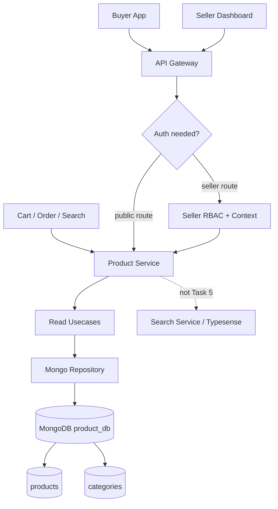
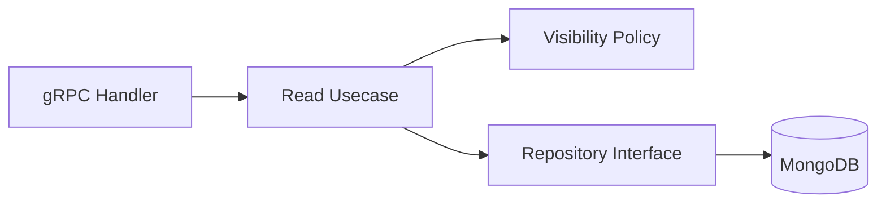
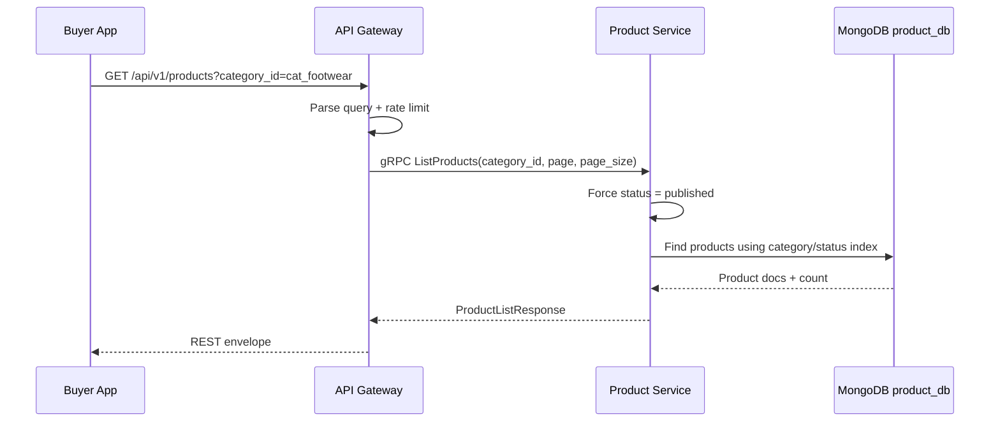
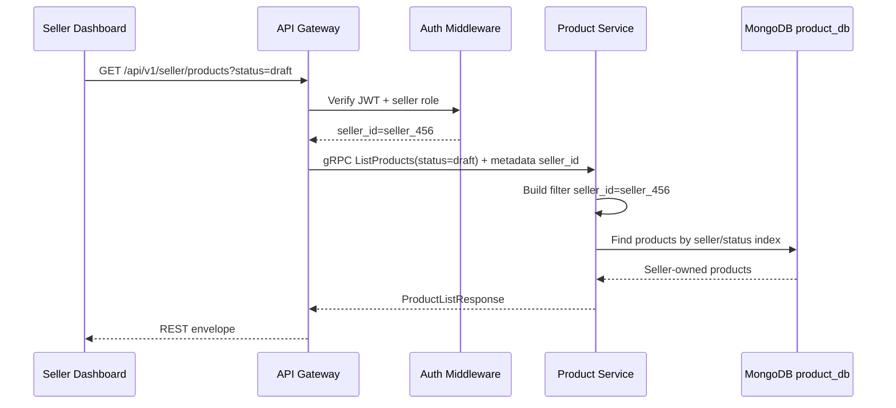
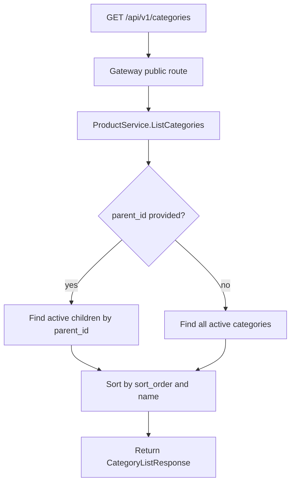
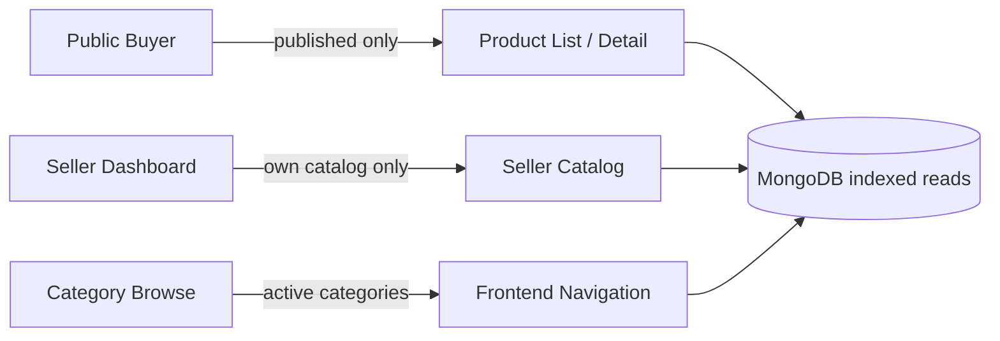

# 🛍️ Product Service - Task 5: Implement Read APIs


## 📌 Task Summary

| Field | Detail |
|---|---|
| Service | Product Service |
| Task No. | 5 |
| Task Name | Implement read APIs |
| Source | `docs/01-micro-tasks.md` -> `Product Service` -> Task 5 |
| Goal | Product listing, product detail, category browse, aur seller catalog read APIs banana |
| Dependency | Product Service Task 3: Create collections |
| Priority | P1 |
| Database | MongoDB `product_db` |
| Main Collections | `products`, `categories` |
| Output Type | Documentation-only implementation guide |
| Not Included | Seller create/update/publish writes, inventory reservation, search event publishing, media upload, full-text Search Service implementation |

> 🟢 **Simple Hinglish goal:** Is task me Product Service ka read side design implement-ready banaya gaya hai. Buyer public products list/detail dekh sakta hai, category tree browse kar sakta hai, aur seller apna catalog dashboard me list/detail dekh sakta hai. Fast read path ke liye MongoDB indexes, filters, pagination, projections, aur visibility rules carefully define kiye gaye hain.

---

## ✅ Final Output Created

```text
TaskImplementation/
└── Product Service/
    ├── task1.md
    ├── task2.md
    ├── task3.md
    ├── task4.md
    └── task5.md
```

### Why this structure?

| Path | Purpose |
|---|---|
| `TaskImplementation/` | Saare task-wise implementation guides ka central folder |
| `TaskImplementation/Product Service/` | Product Service ke implementation guides ko group karne ke liye |
| `task5.md` | Product read APIs and fast read path implementation guide |

> 🔵 **Important:** Is task me sirf `task5.md` create kiya gaya hai. Actual Go service code, proto file, gateway route, MongoDB index execution, Docker config, ya tests repo me create nahi kiye gaye. Code examples implementation ko explain karne ke liye hain.

---

## 🧭 Docs Studied Before Implementation

| Document | Kya use kiya gaya |
|---|---|
| `docs/01-micro-tasks.md` | Product Service Task 5 ka exact scope identify kiya |
| `TaskImplementation/Product Service/task1.md` | Product, variant, category, attributes, image, inventory model ka base liya |
| `TaskImplementation/Product Service/task2.md` | MongoDB `product_db` as Product Service primary DB confirm kiya |
| `TaskImplementation/Product Service/task3.md` | `products`, `categories`, indexes, document fields, and query patterns use kiye |
| `TaskImplementation/Product Service/task4.md` | Product lifecycle, published/unpublished visibility, seller ownership rules reuse kiye |
| `docs/02-system-architecture.md` | API Gateway -> Product Service -> MongoDB read flow align kiya |
| `docs/03-folder-structure.md` | Future Product Service clean architecture folder shape align ki |
| `docs/04-microservice-design.md` | Product Service responsibilities, REST APIs, and gRPC methods validate kiye |
| `docs/05-database-design.md` | Product indexes and Typesense/Search Service boundary samjhi |
| `docs/13-developer-guide.md` | Backend coding flow, REST envelope, tests, and observability rules align kiye |
| `api/master-api.json` | Public product list/detail/category routes and ProductService gRPC methods validate kiye |
| `database/mongodb-schema-design.md` | Product/category documents and existing index recommendations validate kiye |

---

## 🧱 Task Boundary

### ✅ Task 5 me kya design/document kiya gaya

- Public product listing API
- Public product detail API
- Public category browse API
- Seller catalog listing API
- Seller catalog detail API
- Internal batch product read pattern
- MongoDB read filters
- Pagination and sorting rules
- Product visibility rules
- Category tree read rules
- Seller ownership read rules
- Fast read indexes
- Response shape examples
- gRPC usecase and repository examples
- API Gateway route mapping
- Error handling and testing strategy
- Mermaid architecture, sequence, and flow diagrams

### ❌ Task 5 me kya implement nahi kiya gaya

| Item | Reason |
|---|---|
| Seller product create/update/publish | Product Service Task 4 ka scope tha |
| Inventory reserve/release/decrement | Product Service Task 6 ka scope hai |
| Product search indexing/events | Product Service Task 7 ka scope hai |
| CDN image upload/media processing | Product Service Task 8 ka scope hai |
| Search Service `/api/v1/search` full-text implementation | Search Service ke apne tasks ka scope hai |
| Recommendation APIs | Recommendation Service ka scope hai |
| Price campaign engine | CMS/price book later task me detail hoga |

> 🔴 **Golden rule:** Task 5 read side hai. Ye public aur seller dashboard ko catalog read data dega, but write workflows, checkout stock locking, async events, aur search engine indexing yahan implement nahi karna.

---

## 🏁 Final API Decision

Task 5 ke read APIs ko 3 audience ke liye design kiya gaya:

| Audience | API Type | Data Visibility |
|---|---|---|
| Public buyer | Product list/detail/category | Sirf `published` and active products/categories |
| Seller dashboard | Seller catalog list/detail | Seller ke own `draft`, `submitted`, `published`, `unpublished`, `rejected` products |
| Internal services | Batch product reads | Service-specific visibility with explicit purpose |

### REST routes

| Action | Method | Path | gRPC Method | Auth | Source |
|---|---|---|---|---|---|
| Public product list | `GET` | `/api/v1/products` | `ProductService.ListProducts` | public | `api/master-api.json` |
| Public product detail | `GET` | `/api/v1/products/{product_id}` | `ProductService.GetProduct` | public | `api/master-api.json` |
| Category browse | `GET` | `/api/v1/categories` | `ProductService.ListCategories` | public | `api/master-api.json` route mapping |
| Seller catalog list | `GET` | `/api/v1/seller/products` | `ProductService.ListProducts` | seller | Task 5 requirement |
| Seller catalog detail | `GET` | `/api/v1/seller/products/{product_id}` | `ProductService.GetProduct` | seller | Task 5 requirement |

> 🟡 **Contract note:** `api/master-api.json` REST endpoint list already maps `GET /api/v1/categories` to `ProductService.ListCategories`, but the `grpc_services.ProductService.methods` list currently does not show `ListCategories`. During actual proto implementation, `ListCategories` should be added to ProductService proto so REST and gRPC contract fully match.

### gRPC methods used in Task 5

| Method | Purpose | Auth |
|---|---|---|
| `ListProducts` | Public listing and seller catalog listing | public/seller context |
| `GetProduct` | Public detail and seller detail | public/seller context |
| `BatchGetProducts` | Cart/Order/Search/Recommendation internal read needs | internal |
| `ListCategories` | Category tree browse | public |

---

## 🧩 High-Level Architecture



**Explanation:**  
Buyer aur seller dono REST call API Gateway pe bhejte hain. Gateway public routes ko without JWT allow karta hai, seller routes me JWT + seller role validate karta hai. Product Service MongoDB se indexed queries chalata hai. Search Service full-text/faceted search ka owner hai, but Task 5 basic product listing/detail directly Product Service se dega.

---

## 🔐 Read Visibility Rules

| Flow | Allowed statuses | Seller filter | Notes |
|---|---|---|---|
| Public list | `published` only | Optional public `seller_id` store page ke liye | Draft/submitted/unpublished hidden |
| Public detail | `published` only | N/A | Product not published ho to `NOT_FOUND` return karo |
| Category browse | Active categories only | N/A | `is_active=true` categories show karo |
| Seller catalog list | Own products, all editable/readable statuses | Required from token | Seller body/query se seller_id trust nahi karna |
| Seller catalog detail | Own product only | Required from token | Product seller-owned nahi hai to `NOT_FOUND` or `PERMISSION_DENIED` |
| Internal batch read | Explicit caller purpose ke according | Optional | Checkout ko published + stock data chahiye |

### Why unpublished product ko public `404` dena better hai?

Public detail API me agar product exists but unpublished hai, `403` dene se attacker ko product id existence ka signal milta hai. Isliye public read ke liye:

```text
Product missing OR not published -> NOT_FOUND
```

Seller dashboard me authenticated seller own product ka actual status dekh sakta hai.

---

## 🪜 Step-by-Step Implementation

## Step 1: Task requirement identify kiya

`docs/01-micro-tasks.md` me Product Service Task 5 ye define hai:

```text
Implement read APIs:
Product listing, detail, category browse, seller catalog APIs banao.
Fast read path ke liye indexes zaruri hain.
```

**How this part was built:**  
Task source se clear hua ki Task 5 ka focus read endpoints hai. Task 4 write workflows define kar chuka hai, aur Task 6 inventory operations karega. Isliye Task 5 me query design, visibility, response shape, pagination, category tree, and indexes pe focus rakha gaya.

---

## Step 2: Previous Product Service tasks ko base banaya

Task 5 directly pehle ke Product Service tasks pe depend karta hai:

| Previous Task | Reused Decision |
|---|---|
| Task 1 | Product aggregate, variants, category, attributes, images |
| Task 2 | MongoDB as primary Product Service database |
| Task 3 | Collections and indexes: `products`, `categories`, `brands`, `inventory_snapshots`, `price_books` |
| Task 4 | Product lifecycle: `draft`, `submitted`, `published`, `unpublished`, `rejected`, `archived` |

### Read side ka base model

```text
Product
├── product_id
├── seller_id
├── title
├── slug
├── description
├── brand_id / brand_name
├── category_id
├── category_path
├── status
├── images[]
├── variants[]
├── rating
├── created_at
├── updated_at
└── published_at
```

**Hinglish explanation:**  
Public listing me hume lightweight product card data chahiye. Product detail me full document chahiye. Seller catalog me status, draft completeness, stock, and updated time important hain. Same `products` collection se different projections use karke ye reads efficient banenge.

---

## Step 3: Read usecases define kiye

Product Service Task 5 ke core usecases:

| Usecase | Input | Output |
|---|---|---|
| `ListProducts` | category, seller, status, page, page_size, sort | paginated products |
| `GetProduct` | product_id + viewer context | product detail |
| `BatchGetProducts` | product_ids + caller context | product list |
| `ListCategories` | optional parent_id | category tree/list |
| `ListSellerProducts` | seller_id from auth + filters | seller-owned catalog list |
| `GetSellerProduct` | seller_id from auth + product_id | seller-owned product detail |

### Usecase boundary



**How this part was built:**  
Developer guide ke layer rules ke according transport sirf request/response mapping karega. Visibility rules usecase/policy layer me rahenge. Repository sirf MongoDB query execute karegi.

---

## Step 4: Public product listing API design ki

### Endpoint

```http
GET /api/v1/products?category_id=cat_running_shoes&page=1&page_size=20
```

### Query params

| Param | Type | Required | Rule |
|---|---:|---:|---|
| `category_id` | string | no | Direct category or ancestor category browse |
| `seller_id` | string | no | Public seller store page ke liye |
| `page` | integer | no | Default `1`, minimum `1` |
| `page_size` | integer | no | Default `20`, max `100` |
| `sort` | string | no | `newest`, `price_asc`, `price_desc`, `rating_desc` |

> 🟡 **MVP note:** `api/master-api.json` me `ProductListRequest` currently `category_id`, `seller_id`, `status`, `page`, `page_size` define karta hai. `sort` useful extension hai; agar proto strict MVP rakha jaye to default `updated_at desc` sort use karo.

### Public listing response

```json
{
  "products": [
    {
      "product_id": "prod_123",
      "seller_id": "seller_456",
      "title": "Running Shoes",
      "description": "Lightweight running shoes",
      "brand": "Acme",
      "category_id": "cat_running_shoes",
      "status": "published",
      "variants": [
        {
          "sku": "ACME-SHOE-9-BLK",
          "price": {
            "amount": 299900,
            "currency": "INR"
          },
          "stock_quantity": 120
        }
      ]
    }
  ],
  "total": 1
}
```

### Public list visibility filter

```javascript
{
  status: "published"
}
```

If category filter is present:

```javascript
{
  status: "published",
  $or: [
    { category_id: "cat_footwear" },
    { "category_path.category_id": "cat_footwear" }
  ]
}
```

**Hinglish explanation:**  
Public list me status hamesha service-side `published` force hoga. Agar frontend query me `status=draft` bhej bhi de, public API ignore/block karegi. Buyer ko only live catalog dikhna chahiye.

---

## Step 5: Public product detail API design ki

### Endpoint

```http
GET /api/v1/products/prod_123
```

### MongoDB filter

```javascript
{
  _id: "prod_123",
  status: "published"
}
```

### Detail response example

```json
{
  "product_id": "prod_123",
  "seller_id": "seller_456",
  "title": "Running Shoes",
  "description": "Lightweight running shoes for daily training",
  "brand": "Acme",
  "category_id": "cat_running_shoes",
  "status": "published",
  "variants": [
    {
      "sku": "ACME-SHOE-9-BLK",
      "attributes": {
        "size": "9",
        "color": "black"
      },
      "price": {
        "amount": 299900,
        "currency": "INR"
      },
      "stock_quantity": 120
    }
  ]
}
```

### Detail read rules

| Rule | Why |
|---|---|
| Only `published` products public detail me visible | Draft/unpublished leakage avoid karne ke liye |
| Full product document return ho sakta hai | PDP ko variants/images/attributes chahiye |
| Internal DB fields expose mat karo | `_id`, internal audit fields, moderation notes hide karo |
| Missing/unpublished product -> `NOT_FOUND` | Resource enumeration avoid karne ke liye |

---

## Step 6: Category browse API design ki

### Endpoint

```http
GET /api/v1/categories
```

Optional future parent filter:

```http
GET /api/v1/categories?parent_id=cat_footwear
```

### Category response

`api/master-api.json` ke according:

```json
{
  "categories": [
    {
      "category_id": "cat_fashion",
      "name": "Fashion",
      "parent_id": ""
    },
    {
      "category_id": "cat_footwear",
      "name": "Footwear",
      "parent_id": "cat_fashion"
    }
  ]
}
```

### MongoDB query

List all active categories:

```javascript
db.categories
  .find({ is_active: true })
  .sort({ sort_order: 1 })
```

List child categories:

```javascript
db.categories
  .find({ parent_id: "cat_footwear", is_active: true })
  .sort({ sort_order: 1 })
```

### Category browse behavior

| Behavior | Detail |
|---|---|
| Active only | `is_active=true` categories show hongi |
| Stable order | `sort_order asc`, then `name asc` |
| Tree support | `parent_id` and `path` fields use honge |
| Attribute schema hidden in public list | Public category nav ko heavy validation schema nahi chahiye |

**How this part was built:**  
Task 3 ne `categories` collection me `parent_id`, `path`, `sort_order`, `is_active`, and `attribute_schema` define kiya. Task 5 me buyer-facing browse ke liye lightweight category response use kiya gaya.

---

## Step 7: Seller catalog list API design ki

### Endpoint

```http
GET /api/v1/seller/products?status=draft&page=1&page_size=20
```

### Auth

```text
Required role: seller, seller_manager, seller_catalog_editor, superadmin
Seller id source: JWT/auth context
Do not trust seller_id from query/body
```

### Seller catalog query params

| Param | Type | Required | Rule |
|---|---:|---:|---|
| `status` | string | no | `draft`, `submitted`, `published`, `unpublished`, `rejected`, `archived` |
| `category_id` | string | no | Seller dashboard filter |
| `page` | integer | no | Default `1` |
| `page_size` | integer | no | Default `20`, max `100` |
| `sort` | string | no | Default `updated_at_desc` |

### MongoDB filter

```javascript
{
  seller_id: "seller_456"
}
```

With status:

```javascript
{
  seller_id: "seller_456",
  status: "draft"
}
```

With category:

```javascript
{
  seller_id: "seller_456",
  status: { $in: ["draft", "submitted", "published", "unpublished", "rejected"] },
  $or: [
    { category_id: "cat_footwear" },
    { "category_path.category_id": "cat_footwear" }
  ]
}
```

**Hinglish explanation:**  
Seller catalog public listing jaisa nahi hai. Seller ko apne drafts, rejected products, unpublished products, and published products sab dikhne chahiye. Lekin ownership mandatory hai, warna seller dusre seller ka catalog read kar sakta hai.

---

## Step 8: Seller catalog detail API design ki

### Endpoint

```http
GET /api/v1/seller/products/prod_123
```

### MongoDB filter

```javascript
{
  _id: "prod_123",
  seller_id: "seller_456"
}
```

### Seller detail response

Seller detail response public detail se thoda richer ho sakta hai:

```json
{
  "product_id": "prod_123",
  "seller_id": "seller_456",
  "title": "Running Shoes",
  "description": "Lightweight running shoes for daily training",
  "brand": "Acme",
  "category_id": "cat_running_shoes",
  "status": "draft",
  "variants": [
    {
      "sku": "ACME-SHOE-9-BLK",
      "attributes": {
        "size": "9",
        "color": "black"
      },
      "price": {
        "amount": 299900,
        "currency": "INR"
      },
      "stock_quantity": 120
    }
  ]
}
```

### Seller detail rules

| Rule | Why |
|---|---|
| `seller_id` from auth context required | Ownership enforce karne ke liye |
| Draft/unpublished visible | Seller dashboard edit/review ke liye |
| Other seller product hidden | Data isolation ke liye |
| Superadmin exception auditable | Support/moderation flow ke liye |

---

## Step 9: Internal batch product read design ki

### Method

```text
ProductService.BatchGetProducts
```

### Use cases

| Caller | Why needed |
|---|---|
| Cart Service | Cart items validate karne ke liye |
| Order Service | Checkout price/stock snapshot refresh ke liye |
| Search Service | Search result product IDs hydrate/verify karne ke liye |
| Recommendation Service | Recommended IDs ko current product summaries me convert karne ke liye |

### Batch request example

```json
{
  "ids": ["prod_123", "prod_456"]
}
```

### MongoDB filter

```javascript
{
  _id: { $in: ["prod_123", "prod_456"] },
  status: "published"
}
```

> 🟡 **Internal visibility note:** Internal callers ko bhi default published products hi milne chahiye. Agar kisi internal admin/moderation flow ko drafts chahiye, uske liye explicit auth purpose and separate method/context use karo.

---

## Step 10: Pagination and sorting rules define kiye

### Offset pagination MVP

`api/master-api.json` me `page` and `page_size` fields already hain, isliye MVP offset pagination use karega:

```text
skip = (page - 1) * page_size
limit = page_size
```

### Pagination validation

| Field | Default | Min | Max |
|---|---:|---:|---:|
| `page` | `1` | `1` | no hard max, but large pages discourage karo |
| `page_size` | `20` | `1` | `100` |

### Sort options

| Sort | Mongo sort | Use case |
|---|---|---|
| `newest` | `{ published_at: -1, _id: 1 }` | New arrivals |
| `updated_at_desc` | `{ updated_at: -1, _id: 1 }` | Seller dashboard default |
| `price_asc` | `{ min_price.amount: 1, _id: 1 }` | Public listing low to high |
| `price_desc` | `{ min_price.amount: -1, _id: 1 }` | Public listing high to low |
| `rating_desc` | `{ "rating.average": -1, _id: 1 }` | Popular/high rated |

> 🔵 **Index note:** Task 3 base indexes cover `seller_id/status/updated_at` and `category_id/status/updated_at`. If price/rating sort becomes public MVP requirement, add dedicated read-model fields like `min_price.amount` and matching indexes before exposing those sorts heavily.

### Cursor pagination future

High scale par deep pages slow ho sakte hain. Future me cursor pagination better hoga:

```text
GET /api/v1/products?page_size=20&cursor=published_at:prod_123
```

But Task 5 MVP existing contract ke saath offset pagination rakhta hai.

---

## Step 11: MongoDB indexes validate kiye

Task 3 me read path ke liye ye high-value indexes already define hue:

```javascript
db.products.createIndex(
  { seller_id: 1, status: 1, updated_at: -1 },
  { name: "idx_products_seller_status_updated" }
)

db.products.createIndex(
  { category_id: 1, status: 1, updated_at: -1 },
  { name: "idx_products_category_status_updated" }
)

db.products.createIndex(
  { "category_path.category_id": 1, status: 1, updated_at: -1 },
  { name: "idx_products_category_path_status_updated" }
)

db.products.createIndex(
  { brand_id: 1, status: 1, updated_at: -1 },
  { name: "idx_products_brand_status_updated" }
)

db.products.createIndex(
  { slug: 1 },
  { unique: true, sparse: true, name: "uniq_products_slug" }
)

db.categories.createIndex(
  { parent_id: 1, sort_order: 1 },
  { name: "idx_categories_parent_sort" }
)

db.categories.createIndex(
  { is_active: 1, sort_order: 1 },
  { name: "idx_categories_active_sort" }
)
```

### Index to API mapping

| API | Main filter | Index |
|---|---|---|
| Public list by category | `category_id + status + updated_at` | `idx_products_category_status_updated` |
| Public list by ancestor category | `category_path.category_id + status + updated_at` | `idx_products_category_path_status_updated` |
| Seller catalog | `seller_id + status + updated_at` | `idx_products_seller_status_updated` |
| Public product detail | `_id + status` | MongoDB `_id` index plus status check |
| Category children | `parent_id + sort_order` | `idx_categories_parent_sort` |
| All active categories | `is_active + sort_order` | `idx_categories_active_sort` |

**How this part was built:**  
Task source explicitly bolta hai fast read path ke liye indexes zaruri hain. Isliye Task 3 ke index design ko Task 5 APIs ke exact filters ke saath map kiya gaya.

---

## Step 12: Repository interface design ki

Future Product Service implementation me usecase MongoDB details directly nahi jaane ga. Repository interface aisa ho sakta hai:

```go
package repository

import (
    "context"

    "product-service/internal/domain"
)

type ProductReadFilter struct {
    ProductID  string
    ProductIDs []string
    SellerID   string
    CategoryID string
    Statuses   []domain.ProductStatus
    Page       int
    PageSize   int
    Sort       string
}

type ProductReadRepository interface {
    FindProduct(ctx context.Context, filter ProductReadFilter) (*domain.Product, error)
    ListProducts(ctx context.Context, filter ProductReadFilter) ([]domain.Product, int64, error)
    BatchGetProducts(ctx context.Context, filter ProductReadFilter) ([]domain.Product, error)
}

type CategoryRepository interface {
    ListCategories(ctx context.Context, parentID *string, activeOnly bool) ([]domain.Category, error)
}
```

**Hinglish explanation:**  
Usecase ko sirf "mujhe published products list do" bolna chahiye. MongoDB me filter ka exact BSON kaise banega, projection kaise lagega, count kaise hoga, ye repository layer handle karegi.

---

## Step 13: Visibility policy implement ki

Visibility policy ko small helper me rakhna clean rahega:

```go
package usecase

import "product-service/internal/domain"

type ViewerType string

const (
    ViewerPublic ViewerType = "public"
    ViewerSeller ViewerType = "seller"
    ViewerInternal ViewerType = "internal"
)

type ViewerContext struct {
    Type         ViewerType
    SellerID     string
    IsSuperadmin bool
}

func statusesForList(viewer ViewerContext, requested domain.ProductStatus) []domain.ProductStatus {
    if viewer.Type == ViewerPublic {
        return []domain.ProductStatus{domain.ProductStatusPublished}
    }

    if requested != "" {
        return []domain.ProductStatus{requested}
    }

    return []domain.ProductStatus{
        domain.ProductStatusDraft,
        domain.ProductStatusSubmitted,
        domain.ProductStatusPublished,
        domain.ProductStatusUnpublished,
        domain.ProductStatusRejected,
    }
}
```

**How this part was built:**  
Task 4 ne lifecycle define kiya tha. Task 5 me same statuses ko read visibility ke according split kiya gaya: public = published only, seller = own products with dashboard statuses.

---

## Step 14: Public `ListProducts` usecase example

```go
package usecase

import (
    "context"

    "product-service/internal/domain"
    "product-service/internal/repository"
)

type ListProductsInput struct {
    CategoryID string
    SellerID   string
    Page       int
    PageSize   int
    Sort       string
}

type ListProductsUsecase struct {
    repo repository.ProductReadRepository
}

func (uc *ListProductsUsecase) ExecutePublic(ctx context.Context, in ListProductsInput) ([]domain.Product, int64, error) {
    page, pageSize := normalizePagination(in.Page, in.PageSize)

    filter := repository.ProductReadFilter{
        SellerID:   in.SellerID,
        CategoryID: in.CategoryID,
        Statuses:   []domain.ProductStatus{domain.ProductStatusPublished},
        Page:       page,
        PageSize:   pageSize,
        Sort:       normalizePublicSort(in.Sort),
    }

    return uc.repo.ListProducts(ctx, filter)
}
```

### Pagination helper

```go
func normalizePagination(page, pageSize int) (int, int) {
    if page < 1 {
        page = 1
    }
    if pageSize < 1 {
        pageSize = 20
    }
    if pageSize > 100 {
        pageSize = 100
    }
    return page, pageSize
}
```

**Hinglish explanation:**  
Public usecase me status user input se nahi liya. Service hard-code karta hai `published`, taaki frontend ya attacker query param se drafts fetch na kar sake.

---

## Step 15: Seller `ListProducts` usecase example

```go
func (uc *ListProductsUsecase) ExecuteForSeller(ctx context.Context, sellerID string, in ListProductsInput, requestedStatus domain.ProductStatus) ([]domain.Product, int64, error) {
    if sellerID == "" {
        return nil, 0, domain.ErrPermissionDenied
    }

    page, pageSize := normalizePagination(in.Page, in.PageSize)

    filter := repository.ProductReadFilter{
        SellerID:   sellerID,
        CategoryID: in.CategoryID,
        Statuses: statusesForList(ViewerContext{
            Type:     ViewerSeller,
            SellerID: sellerID,
        }, requestedStatus),
        Page:     page,
        PageSize: pageSize,
        Sort:     "updated_at_desc",
    }

    return uc.repo.ListProducts(ctx, filter)
}
```

**Hinglish explanation:**  
Seller catalog me `sellerID` query se nahi, auth context se aayega. Agar seller `?seller_id=seller_999` bhejta hai, service ignore karegi. Ye ownership boundary ka important part hai.

---

## Step 16: Public `GetProduct` usecase example

```go
type GetProductUsecase struct {
    repo repository.ProductReadRepository
}

func (uc *GetProductUsecase) ExecutePublic(ctx context.Context, productID string) (*domain.Product, error) {
    if productID == "" {
        return nil, domain.ErrValidation
    }

    product, err := uc.repo.FindProduct(ctx, repository.ProductReadFilter{
        ProductID: productID,
        Statuses:  []domain.ProductStatus{domain.ProductStatusPublished},
    })
    if err != nil {
        return nil, err
    }

    return product, nil
}
```

### Seller detail variant

```go
func (uc *GetProductUsecase) ExecuteForSeller(ctx context.Context, sellerID, productID string) (*domain.Product, error) {
    if sellerID == "" || productID == "" {
        return nil, domain.ErrValidation
    }

    return uc.repo.FindProduct(ctx, repository.ProductReadFilter{
        ProductID: productID,
        SellerID:  sellerID,
    })
}
```

**Hinglish explanation:**  
Public detail me `status=published` filter mandatory hai. Seller detail me `seller_id` mandatory hai. Dono alag usecase methods rakhenge to accidental leakage ka risk kam hota hai.

---

## Step 17: MongoDB repository query example

Future repository implementation ka shape:

```go
package repository

import (
    "context"

    "go.mongodb.org/mongo-driver/v2/bson"
    "go.mongodb.org/mongo-driver/v2/mongo"
    "go.mongodb.org/mongo-driver/v2/mongo/options"
)

type MongoProductReadRepository struct {
    products *mongo.Collection
}

func (r *MongoProductReadRepository) ListProducts(ctx context.Context, f ProductReadFilter) ([]ProductDocument, int64, error) {
    filter := bson.M{}

    if len(f.Statuses) > 0 {
        filter["status"] = bson.M{"$in": f.Statuses}
    }
    if f.SellerID != "" {
        filter["seller_id"] = f.SellerID
    }
    if f.CategoryID != "" {
        filter["$or"] = bson.A{
            bson.M{"category_id": f.CategoryID},
            bson.M{"category_path.category_id": f.CategoryID},
        }
    }

    sort := bson.D{{Key: "updated_at", Value: -1}, {Key: "_id", Value: 1}}
    skip := int64((f.Page - 1) * f.PageSize)
    limit := int64(f.PageSize)

    projection := bson.M{
        "_id":         1,
        "seller_id":   1,
        "title":       1,
        "description": 1,
        "brand_name":  1,
        "category_id": 1,
        "status":      1,
        "images":      1,
        "variants":    1,
        "rating":      1,
        "updated_at":  1,
    }

    total, err := r.products.CountDocuments(ctx, filter)
    if err != nil {
        return nil, 0, err
    }

    cursor, err := r.products.Find(ctx, filter,
        options.Find().
            SetSort(sort).
            SetSkip(skip).
            SetLimit(limit).
            SetProjection(projection),
    )
    if err != nil {
        return nil, 0, err
    }
    defer cursor.Close(ctx)

    var docs []ProductDocument
    if err := cursor.All(ctx, &docs); err != nil {
        return nil, 0, err
    }

    return docs, total, nil
}
```

> 🔵 **Projection note:** Listing APIs me full internal fields return nahi karne. Projection response ko lightweight banati hai and network/CPU cost reduce karti hai.

---

## Step 18: Category repository query example

```go
type MongoCategoryRepository struct {
    categories *mongo.Collection
}

func (r *MongoCategoryRepository) ListCategories(ctx context.Context, parentID *string, activeOnly bool) ([]CategoryDocument, error) {
    filter := bson.M{}

    if activeOnly {
        filter["is_active"] = true
    }
    if parentID != nil {
        filter["parent_id"] = *parentID
    }

    cursor, err := r.categories.Find(ctx, filter,
        options.Find().
            SetSort(bson.D{
                {Key: "sort_order", Value: 1},
                {Key: "name", Value: 1},
            }).
            SetProjection(bson.M{
                "_id":        1,
                "name":       1,
                "parent_id":  1,
                "slug":       1,
                "path":       1,
                "sort_order": 1,
            }),
    )
    if err != nil {
        return nil, err
    }
    defer cursor.Close(ctx)

    var docs []CategoryDocument
    if err := cursor.All(ctx, &docs); err != nil {
        return nil, err
    }

    return docs, nil
}
```

**Hinglish explanation:**  
Category browse me `attribute_schema` usually public navigation ke liye nahi chahiye. Product creation/update validation ke time attribute schema read hoga, but public category list lightweight rakhenge.

---

## Step 19: gRPC handler mapping design ki

Transport layer generated proto request ko usecase input me convert karega:

```go
func (s *ProductServer) ListProducts(ctx context.Context, req *productv1.ProductListRequest) (*productv1.ProductListResponse, error) {
    viewer := viewerFromContext(ctx)

    if viewer.Type == usecase.ViewerSeller {
        products, total, err := s.listProducts.ExecuteForSeller(ctx, viewer.SellerID, usecase.ListProductsInput{
            CategoryID: req.CategoryId,
            Page:       int(req.Page),
            PageSize:   int(req.PageSize),
        }, domain.ProductStatus(req.Status))
        if err != nil {
            return nil, mapDomainError(err)
        }

        return mapProductListResponse(products, total), nil
    }

    products, total, err := s.listProducts.ExecutePublic(ctx, usecase.ListProductsInput{
        CategoryID: req.CategoryId,
        SellerID:   req.SellerId,
        Page:       int(req.Page),
        PageSize:   int(req.PageSize),
    })
    if err != nil {
        return nil, mapDomainError(err)
    }

    return mapProductListResponse(products, total), nil
}
```

**How this part was built:**  
Platform foundation ke gateway design me REST handler gRPC call karega. Product Service gRPC handler usecase ko call karega. Business visibility logic gateway me nahi, Product Service me rahegi.

---

## Step 20: API Gateway route mapping design ki

### Public routes

```go
r.Get("/api/v1/products", productHandler.ListProducts)
r.Get("/api/v1/products/{product_id}", productHandler.GetProduct)
r.Get("/api/v1/categories", productHandler.ListCategories)
```

### Seller routes

```go
r.Group(func(r chi.Router) {
    r.Use(AuthMiddleware)
    r.Use(RequireRole("seller", "seller_manager", "seller_catalog_editor", "superadmin"))

    r.Get("/api/v1/seller/products", productHandler.ListSellerProducts)
    r.Get("/api/v1/seller/products/{product_id}", productHandler.GetSellerProduct)
})
```

### Gateway handler example

```go
func (h *ProductHandler) ListProducts(w http.ResponseWriter, r *http.Request) {
    q := r.URL.Query()

    ctx, cancel := context.WithTimeout(r.Context(), 300*time.Millisecond)
    defer cancel()

    resp, err := h.product.ListProducts(ctx, &productv1.ProductListRequest{
        CategoryId: q.Get("category_id"),
        SellerId:   q.Get("seller_id"),
        Page:       int32(parseInt(q.Get("page"), 1)),
        PageSize:   int32(parseInt(q.Get("page_size"), 20)),
    })
    if err != nil {
        WriteError(w, r, MapGRPCError(err))
        return
    }

    WriteJSON(w, r, http.StatusOK, resp)
}
```

**Hinglish explanation:**  
Gateway sirf query params parse karega, deadline lagayega, Product Service gRPC call karega, aur REST envelope return karega. Product visible hai ya nahi, seller owns product ya nahi - ye Product Service decide karega.

---

## Step 21: REST response envelope align ki

`docs/13-developer-guide.md` ke according Gateway response envelope:

### Success

```json
{
  "data": {
    "products": [],
    "total": 0
  },
  "request_id": "req_123",
  "error": null
}
```

### Error

```json
{
  "data": null,
  "request_id": "req_123",
  "error": {
    "code": "PRODUCT_NOT_FOUND",
    "message": "Product not found",
    "details": []
  }
}
```

### Error mapping

| Case | gRPC code | HTTP status | Error code |
|---|---|---:|---|
| Invalid page/page_size | `InvalidArgument` | `400` | `VALIDATION_ERROR` |
| Public product missing/unpublished | `NotFound` | `404` | `PRODUCT_NOT_FOUND` |
| Seller missing auth | `Unauthenticated` | `401` | `UNAUTHENTICATED` |
| Seller role missing | `PermissionDenied` | `403` | `FORBIDDEN` |
| Seller product owned by another seller | `NotFound` or `PermissionDenied` | `404` or `403` | `PRODUCT_NOT_FOUND` or `FORBIDDEN` |
| MongoDB timeout | `DeadlineExceeded` | `504` | `TIMEOUT` |
| MongoDB unavailable | `Unavailable` | `503` | `SERVICE_UNAVAILABLE` |

> 🟡 **Security choice:** Public APIs should prefer `404` for missing/unpublished products. Seller APIs can use `403` for clear RBAC failures, but ownership misses can still be `404` to avoid leaking other seller resources.

---

## Step 22: Product summary projection define ki

Public listing cards ko full product detail ki zarurat nahi hoti. Recommended summary projection:

```json
{
  "product_id": "prod_123",
  "title": "Running Shoes",
  "brand": "Acme",
  "category_id": "cat_running_shoes",
  "image_url": "https://cdn.example.com/prod_123/main.jpg",
  "min_price": {
    "amount": 299900,
    "currency": "INR"
  },
  "rating": {
    "average": 4.4,
    "count": 120
  },
  "in_stock": true
}
```

### Why summary model useful hai?

| Benefit | Explanation |
|---|---|
| Faster response | Listing me heavy description/attributes/variants avoid honge |
| Cleaner frontend | Product cards ko direct display fields milenge |
| Better cacheability | Summary response stable and small hota hai |
| Lower bandwidth | Mobile users ke liye lighter payload |

> 🔵 **MVP compatibility:** `api/master-api.json` ka `Product` schema simple hai. Summary projection internally use ho sakti hai, lekin public contract me breaking change avoid karna. Future me `ProductSummary` schema add kiya ja sakta hai.

---

## Step 23: Product detail projection define ki

Product detail page ko richer data chahiye:

```javascript
{
  _id: 1,
  seller_id: 1,
  title: 1,
  slug: 1,
  description: 1,
  brand_id: 1,
  brand_name: 1,
  category_id: 1,
  category_path: 1,
  status: 1,
  attributes: 1,
  images: 1,
  variants: 1,
  rating: 1,
  published_at: 1,
  updated_at: 1
}
```

Fields to hide from public detail:

| Field | Why hide |
|---|---|
| moderation notes | Internal CMS data |
| audit actor ids | Internal security/audit data |
| internal cost price | Business confidential |
| reserved quantity details | Checkout internals |
| deleted/archive metadata | Not buyer-facing |

---

## Step 24: Query performance flow



**Explanation:**  
Fast path me Product Service category/status index use karta hai. Public route me JWT validation nahi hoti, but rate limit and observability Gateway pe still apply hoti hai.

---

## Step 25: Seller catalog flow



**Explanation:**  
Seller dashboard ke liye seller id auth metadata se aati hai. Query param se seller id accept karna unsafe hota. Product Service final ownership filter lagata hai.

---

## Step 26: Category browse flow



**Hinglish explanation:**  
Category browse independent read hai. Product count aggregation optional hai and MVP me include karna zaruri nahi. Category list fast rahegi because `is_active/sort_order` and `parent_id/sort_order` indexes already planned hain.

---

## Step 27: Read API security checklist

| Security Rule | Public APIs | Seller APIs |
|---|---:|---:|
| JWT required | ❌ | ✅ |
| Rate limiting | ✅ | ✅ |
| Status visibility enforced in Product Service | ✅ | ✅ |
| Seller ownership enforced | N/A | ✅ |
| Body/query seller_id trusted | ❌ | ❌ |
| Internal fields hidden | ✅ | ✅ |
| Request id logged | ✅ | ✅ |

### Common mistakes avoid karo

| Mistake | Problem |
|---|---|
| Public list me query `status` directly use karna | Draft products leak ho sakte hain |
| Seller route me query `seller_id` trust karna | Cross-seller data exposure |
| Full product document listing me return karna | Slow API and data leakage |
| Large `page_size` allow karna | DB and network overload |
| Category tree without index query karna | Navigation slow ho sakti hai |

---

## Step 28: Observability design

Product read APIs high traffic hoti hain, isliye logs/metrics/traces important hain.

### Structured log fields

| Field | Example |
|---|---|
| `service` | `product-service` |
| `grpc_method` | `ProductService.ListProducts` |
| `request_id` | `req_123` |
| `viewer_type` | `public` |
| `seller_id` | `seller_456` |
| `category_id` | `cat_footwear` |
| `page_size` | `20` |
| `result_count` | `20` |
| `duration_ms` | `42` |

### Metrics

| Metric | Purpose |
|---|---|
| `product_read_requests_total` | Read API traffic count |
| `product_read_duration_seconds` | Read latency histogram |
| `product_read_errors_total` | Error count by code |
| `product_list_result_count` | Result size distribution |
| `mongo_product_query_duration_seconds` | MongoDB query latency |

### Trace spans

```text
HTTP GET /api/v1/products
└── gRPC ProductService.ListProducts
    └── MongoDB products.find
```

> 🔵 **Debugging tip:** Slow public listing usually index mismatch, too large page size, heavy projection, or MongoDB cold cache ki wajah se hota hai.

---

## Step 29: Testing strategy

### Unit tests

| Test | Expected |
|---|---|
| Public list ignores requested draft status | Only `published` filter used |
| Public detail unpublished product | `PRODUCT_NOT_FOUND` |
| Seller list without seller id | permission/validation error |
| Seller list with status filter | Filter includes auth seller id + status |
| Pagination default | page `1`, page_size `20` |
| Pagination max clamp | page_size over `100` becomes `100` |
| Category list active only | `is_active=true` filter |

### Repository tests

| Test | Expected |
|---|---|
| List by category uses category/status filter | Correct products returned |
| List by ancestor category uses category_path filter | Child category products returned |
| Seller catalog query | Only seller-owned products returned |
| Product projection | Internal fields not returned |
| Count + page data | Total and products consistent |

### Handler tests

Use fake gRPC/usecase clients:

```go
type fakeProductReadUsecase struct {
    products []domain.Product
    total    int64
    err      error
}

func (f fakeProductReadUsecase) ExecutePublic(ctx context.Context, in usecase.ListProductsInput) ([]domain.Product, int64, error) {
    return f.products, f.total, f.err
}
```

### Integration tests

| Flow | Expected |
|---|---|
| `GET /api/v1/products` | 200 without JWT |
| `GET /api/v1/products/{id}` published | 200 |
| `GET /api/v1/products/{id}` draft | 404 |
| `GET /api/v1/categories` | Active categories sorted |
| `GET /api/v1/seller/products` without JWT | 401 |
| `GET /api/v1/seller/products` with seller JWT | Only own products |
| Mongo timeout | Gateway returns 504 envelope |

---

## Step 30: External libraries and tools

### What was actually used in this task?

| Tool/Library | Used now? | Why |
|---|---:|---|
| Markdown | ✅ yes | `task5.md` guide likhne ke liye |
| Mermaid | ✅ yes | Architecture, sequence, and flow diagrams ke liye |
| Shields.io badges | ✅ yes | Visual metadata badges ke liye |

### Future implementation tools

| Tool/Library | What it is | Why used | Install / Use |
|---|---|---|---|
| Go | Backend language/runtime | Product Service microservice implement karne ke liye | Go 1.24+ install |
| gRPC | Internal RPC framework | Gateway se Product Service ko typed calls ke liye | `go get google.golang.org/grpc` |
| Protocol Buffers | Contract format | `ProductService` request/response schemas define karne ke liye | Proto files + generated code |
| Buf CLI | Proto lint/generation tool | Go/TS clients generate karne ke liye | `brew install bufbuild/buf/buf` or official install |
| MongoDB | Document database | `products` and `categories` read source of truth | Docker/managed MongoDB |
| `mongosh` | MongoDB shell | Indexes and queries validate karne ke liye | MongoDB tools/Docker image |
| MongoDB Go Driver | Official Go MongoDB client | Repository layer me MongoDB queries chalane ke liye | `go get go.mongodb.org/mongo-driver/v2/mongo` |
| Testify | Go test helper | Assertions/mocks readable banane ke liye | `go get github.com/stretchr/testify` |

### Future install commands

```bash
cd backend/services/product-service
go get go.mongodb.org/mongo-driver/v2/mongo
go get google.golang.org/grpc
go get github.com/stretchr/testify
```

### Future proto generation command

```bash
buf generate
```

### Future MongoDB local run

```bash
docker compose -f infra/compose/docker-compose.local.yml up -d product-mongo
```

### Future MongoDB index check

```bash
docker exec -it ecommerce-product-mongo mongosh product_db
db.products.getIndexes()
db.categories.getIndexes()
```

> 🔵 **Note:** Current documentation task me koi dependency install nahi ki gayi. Commands future implementation ke liye hain.

---

## 📦 Clean Implementation Folder Structure

### Documentation output created now

```text
TaskImplementation/
└── Product Service/
    ├── task1.md
    ├── task2.md
    ├── task3.md
    ├── task4.md
    └── task5.md
```

### Future backend implementation structure

```text
backend/services/product-service/
├── cmd/
│   └── server/
│       └── main.go
├── internal/
│   ├── config/
│   │   └── config.go
│   ├── domain/
│   │   ├── product.go
│   │   ├── product_status.go
│   │   ├── category.go
│   │   └── read_policy.go
│   ├── usecase/
│   │   ├── get_product.go
│   │   ├── list_products.go
│   │   ├── batch_get_products.go
│   │   └── list_categories.go
│   ├── repository/
│   │   ├── product_read_repository.go
│   │   ├── category_repository.go
│   │   ├── mongo_product_read_repository.go
│   │   └── mongo_category_repository.go
│   ├── transport/
│   │   └── grpc/
│   │       ├── server.go
│   │       ├── product_read_handler.go
│   │       └── category_handler.go
│   └── mapper/
│       └── product_mapper.go
└── deploy/
    ├── Dockerfile
    └── k8s.yaml
```

### Future API Gateway route structure

```text
backend/services/api-gateway/
└── internal/
    ├── handlers/
    │   └── product_handler.go
    └── routes/
        └── product_routes.go
```

> 🟡 **Important:** Ye future implementation folder structure guide hai. Current task me backend folders/files create nahi kiye gaye.

---

## 🧾 API Contract Summary

### Public `GET /api/v1/products`

```http
GET /api/v1/products?category_id=cat_running_shoes&page=1&page_size=20
```

```json
{
  "data": {
    "products": [],
    "total": 0
  },
  "request_id": "req_123",
  "error": null
}
```

### Public `GET /api/v1/products/{product_id}`

```http
GET /api/v1/products/prod_123
```

```json
{
  "data": {
    "product_id": "prod_123",
    "title": "Running Shoes",
    "status": "published"
  },
  "request_id": "req_123",
  "error": null
}
```

### Public `GET /api/v1/categories`

```http
GET /api/v1/categories
```

```json
{
  "data": {
    "categories": [
      {
        "category_id": "cat_footwear",
        "name": "Footwear",
        "parent_id": "cat_fashion"
      }
    ]
  },
  "request_id": "req_123",
  "error": null
}
```

### Seller `GET /api/v1/seller/products`

```http
GET /api/v1/seller/products?status=draft&page=1&page_size=20
Authorization: Bearer <seller_access_token>
```

```json
{
  "data": {
    "products": [],
    "total": 0
  },
  "request_id": "req_123",
  "error": null
}
```

---

## 🧪 Verification Checklist

| Check | Status |
|---|---:|
| `TaskImplementation/Product Service/task5.md` created | ✅ |
| Step-by-step implementation in Hinglish included | ✅ |
| Public product listing documented | ✅ |
| Public product detail documented | ✅ |
| Category browse documented | ✅ |
| Seller catalog APIs documented | ✅ |
| MongoDB indexes mapped to APIs | ✅ |
| Code examples included | ✅ |
| Mermaid architecture/sequence/flow diagrams included | ✅ |
| External libraries/tools explained | ✅ |
| Install/use commands included for future implementation | ✅ |
| Clean folder structure included | ✅ |
| Task scope limited to Product Service Task 5 | ✅ |
| No backend runtime code created | ✅ |
| No work beyond Task 5 implemented | ✅ |

---

## 🧠 Final Beginner-Friendly Recap

Product Service Task 5 ka kaam read APIs ko safe and fast banana hai:

- Buyer ko sirf `published` products dikhne chahiye.
- Seller ko sirf apne products dikhne chahiye, including drafts.
- Category browse active categories se build hoga.
- MongoDB indexes read performance ka main base hain.
- Gateway auth/routing karega, Product Service final visibility enforce karega.
- Search Service full-text search ka owner hai; Task 5 basic catalog reads ka owner hai.



> ✅ **Task 5 complete:** Documentation-level implementation guide ready hai. Actual backend service files intentionally create nahi kiye gaye, kyunki current requested output sirf required folder structure aur `task5.md` content hai.
