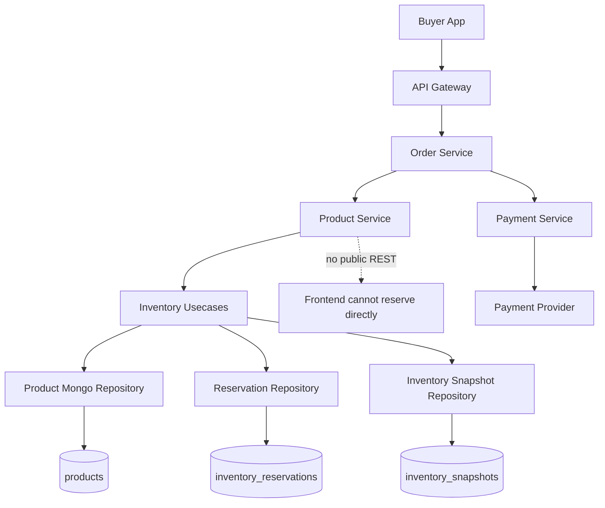
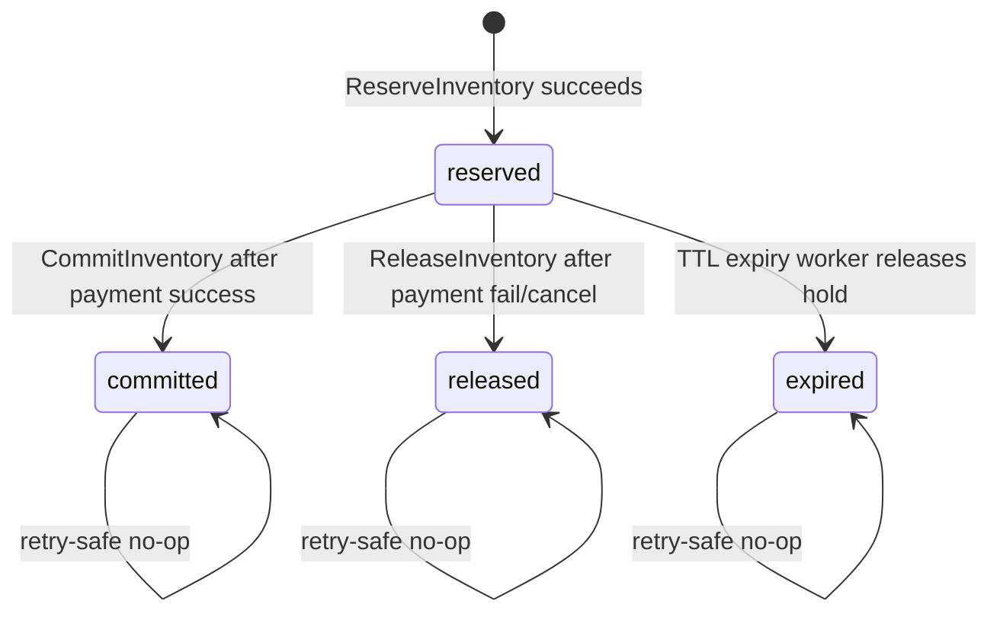
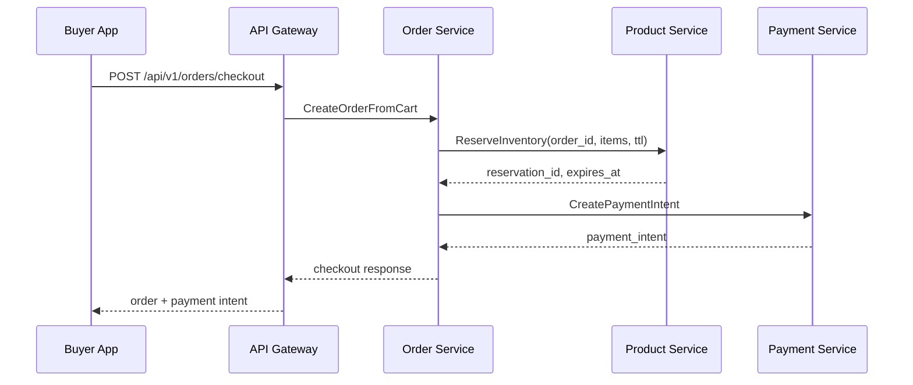
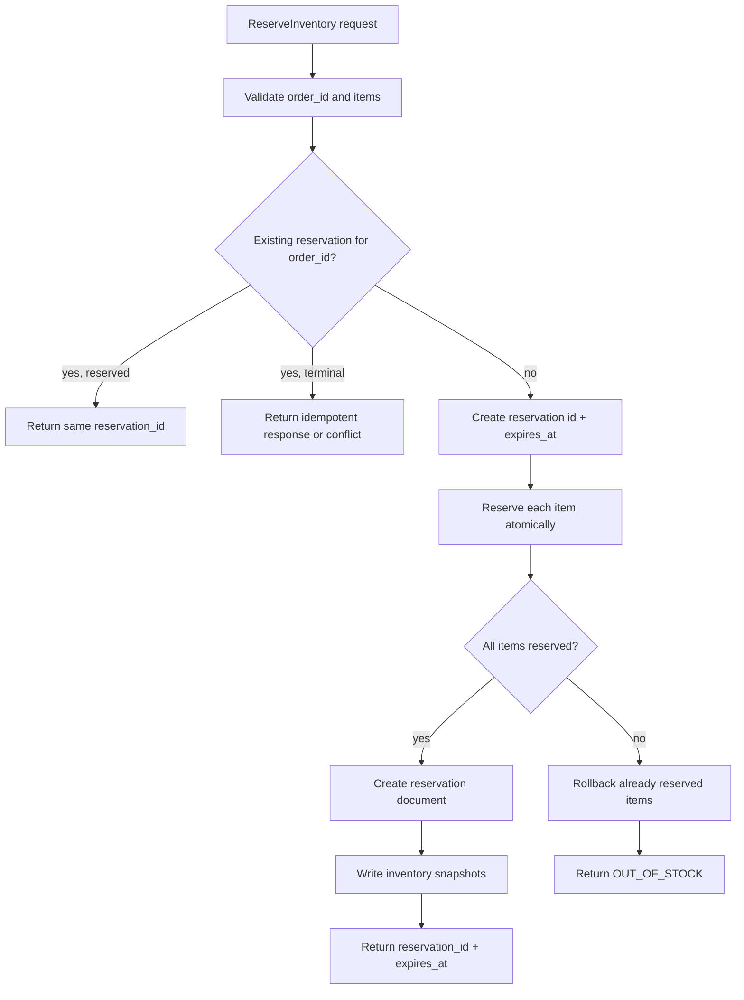
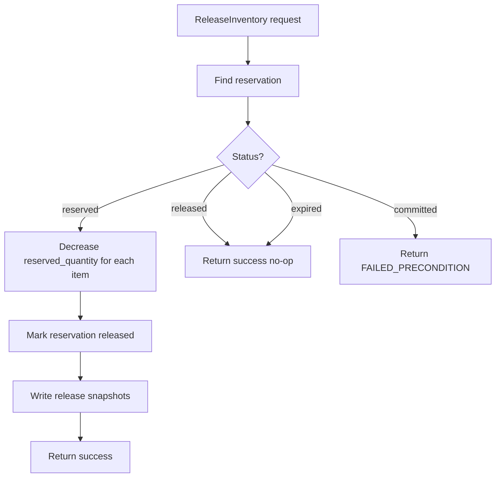
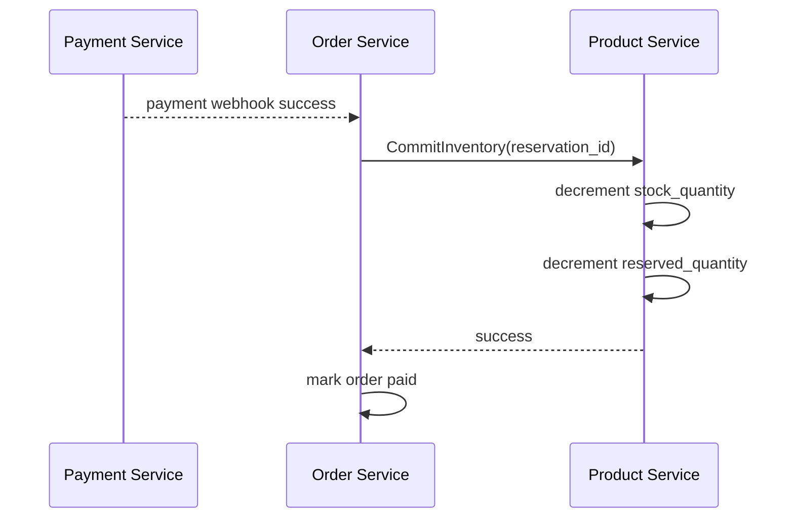
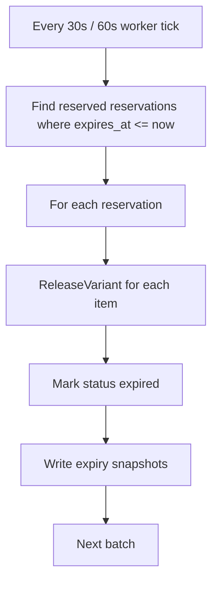

# 🛍️ Product Service - Task 6: Inventory Operations


## 📌 Task Summary

| Field | Detail |
|---|---|
| Service | Product Service |
| Task No. | 6 |
| Task Name | Inventory operations |
| Source | `docs/01-micro-tasks.md` -> `Product Service` -> Task 6 |
| Goal | Reserve, release, aur decrement stock methods implement-ready design karna |
| Dependency | Order Service |
| Priority | P0 |
| Database | MongoDB `product_db` |
| Main Collections | `products`, `inventory_reservations`, `inventory_snapshots` |
| Main gRPC Methods | `ReserveInventory`, `ReleaseInventory`, `CommitInventory` |
| Output Type | Documentation-only implementation guide |
| Not Included | Order creation, payment processing, public REST inventory APIs, search events, media metadata |

> 🟢 **Simple Hinglish goal:** Is task me Product Service ke inventory operations ka complete implementation plan banaya gaya hai. Checkout ke time Order Service Product Service ko stock reserve karne ke liye call karega. Payment fail/cancel ho to stock release hoga. Payment success ho to reservation commit hoga aur actual stock decrement hoga. Main focus race condition avoid karna, retry-safe idempotency rakhna, aur stock audit maintain karna hai.

---

## ✅ Final Output Created

```text
TaskImplementation/
└── Product Service/
    ├── task1.md
    ├── task2.md
    ├── task3.md
    ├── task4.md
    ├── task5.md
    └── task6.md
```

### Why this structure?

| Path | Purpose |
|---|---|
| `TaskImplementation/` | Saare task-wise implementation guides ka central folder |
| `TaskImplementation/Product Service/` | Product Service ke implementation guides ko group karne ke liye |
| `task6.md` | Inventory reserve, release, and stock decrement implementation guide |

> 🔵 **Important:** Is task me sirf `task6.md` create kiya gaya hai. Actual Go service code, proto file, MongoDB collection execution, Docker config, ya tests repo me create nahi kiye gaye. Code examples beginner-friendly implementation explanation ke liye hain.

---

## 🧭 Docs Studied Before Implementation

| Document | Kya use kiya gaya |
|---|---|
| `docs/01-micro-tasks.md` | Product Service Task 6 ka exact scope identify kiya |
| `TaskImplementation/Product Service/task1.md` | Inventory formula, variant-level stock, reservation TTL, idempotency rules reuse kiye |
| `TaskImplementation/Product Service/task2.md` | MongoDB atomic update approach and Product Service DB ownership confirm kiya |
| `TaskImplementation/Product Service/task3.md` | `products` and `inventory_snapshots` collection design base liya |
| `TaskImplementation/Product Service/task4.md` | Seller product lifecycle and stock field creation rules align kiye |
| `TaskImplementation/Product Service/task5.md` | Read API boundary confirm ki, inventory operations ko separate rakha |
| `docs/02-system-architecture.md` | Checkout flow: Order -> Product `ReserveInventory` -> Payment align kiya |
| `docs/04-microservice-design.md` | Product Service gRPC methods and responsibility validate ki |
| `docs/05-database-design.md` | Saga-style checkout consistency and failure handling use kiya |
| `docs/12-logging-monitoring-scalability.md` | Inventory reservation TTL and observability expectations align kiye |
| `api/master-api.json` | `ReserveInventory`, `ReleaseInventory`, `CommitInventory` schemas validate kiye |
| `database/mongodb-schema-design.md` | Product variant stock fields and inventory snapshot indexes validate kiye |

---

## 🧱 Task Boundary

### ✅ Task 6 me kya design/document kiya gaya

- `ReserveInventory` internal gRPC method
- `ReleaseInventory` internal gRPC method
- `CommitInventory` internal gRPC method
- Stock decrement ko commit flow ke andar define kiya
- Checkout race condition avoid karne ke atomic MongoDB update patterns
- Reservation TTL and expiry worker strategy
- Idempotency using `order_id` and optional idempotency key
- Multi-item reservation rollback strategy
- `inventory_reservations` supporting collection
- `inventory_snapshots` audit writes
- Reservation state machine
- Error handling and gRPC status mapping
- Observability, metrics, traces, and logs
- Testing strategy for race conditions and retries
- Mermaid architecture, sequence, and state diagrams
- Beginner-friendly code examples

### ❌ Task 6 me kya implement nahi kiya gaya

| Item | Reason |
|---|---|
| Order create/checkout endpoint | Order Service ka scope hai |
| Payment intent/webhook handling | Payment Service ka scope hai |
| Product listing/detail APIs | Product Service Task 5 ka scope tha |
| Seller product CRUD | Product Service Task 4 ka scope tha |
| Product search events | Product Service Task 7 ka scope hai |
| Media/CDN metadata | Product Service Task 8 ka scope hai |
| Public REST stock endpoint | Inventory operations internal checkout flow ke liye hain |
| Warehouse management system | Future operational module ho sakta hai, Task 6 ka scope nahi |

> 🔴 **Golden rule:** Task 6 inventory correctness ka task hai. Isme checkout ke liye stock hold, release, aur final decrement implement hoga. Public catalog read, order lifecycle, payment, search indexing, and seller UI yahan implement nahi karna.

---

## 🏁 Final API Decision

Task 6 ke operations internal-only rahenge. Browser ya frontend directly inventory reserve nahi karega.

| Method | Existing Contract Name | Purpose | Caller | Auth |
|---|---|---|---|---|
| Reserve stock | `ReserveInventory` | Checkout start pe stock temporarily hold karna | Order Service | internal |
| Release stock | `ReleaseInventory` | Payment fail, order cancel, timeout pe hold wapas karna | Order Service / expiry worker | internal |
| Decrement stock | `CommitInventory` | Payment success ke baad final stock reduce karna | Order Service | internal |

### Why `CommitInventory` means decrement?

`docs/01-micro-tasks.md` me Task 6 wording hai:

```text
Reserve, release, decrement stock methods implement karo.
```

`api/master-api.json` me decrement method ka existing gRPC naam:

```text
CommitInventory
```

Isliye Task 6 me:

```text
decrement stock = CommitInventory(reservation_id)
```

Commit ke time Product Service:

```text
stock_quantity = stock_quantity - reserved_quantity_for_order
reserved_quantity = reserved_quantity - reserved_quantity_for_order
reservation.status = committed
```

---

## 🧩 High-Level Architecture



**Explanation:**  
Buyer checkout API call API Gateway se Order Service tak jaati hai. Order Service cart validate karta hai aur Product Service ko internal gRPC se inventory reserve karne ke liye call karta hai. Product Service MongoDB me atomic inventory update karta hai, reservation record banata hai, aur reservation id return karta hai. Payment success ke baad Order Service `CommitInventory` call karta hai. Payment fail/cancel/timeout pe `ReleaseInventory` call hota hai.

---

## 📦 Inventory Data Ownership

| Data | Owner | Storage |
|---|---|---|
| Product and variants | Product Service | `products` |
| Current stock fields | Product Service | `products.variants[]` |
| Active reservation state | Product Service | `inventory_reservations` |
| Stock audit history | Product Service | `inventory_snapshots` |
| Order lifecycle | Order Service | Order DB |
| Payment lifecycle | Payment Service | Payment DB |

### Current stock fields

Variant-level inventory fields from previous tasks:

```json
{
  "variant_id": "var_1",
  "sku": "ACME-SHOE-9-BLK",
  "stock_quantity": 120,
  "reserved_quantity": 5,
  "safety_stock": 2,
  "status": "active"
}
```

### Inventory formula

```text
available_quantity = stock_quantity - reserved_quantity - safety_stock
```

Example:

```text
stock_quantity = 120
reserved_quantity = 5
safety_stock = 2

available_quantity = 120 - 5 - 2 = 113
```

> 🟡 **Important:** Buyer ko sell karne layak quantity `available_quantity` hai, raw `stock_quantity` nahi.

---

## 🔄 Reservation State Machine



### State meaning

| Status | Meaning | Stock impact |
|---|---|---|
| `reserved` | Stock hold active hai | `reserved_quantity` increased |
| `committed` | Order paid/confirmed hai | `stock_quantity` decreased, `reserved_quantity` decreased |
| `released` | Hold manually released hai | `reserved_quantity` decreased |
| `expired` | TTL ke baad hold auto-released hai | `reserved_quantity` decreased |

### Allowed transitions

| From | To | Allowed? | Trigger |
|---|---|---:|---|
| none | `reserved` | ✅ | `ReserveInventory` |
| `reserved` | `committed` | ✅ | `CommitInventory` |
| `reserved` | `released` | ✅ | `ReleaseInventory` |
| `reserved` | `expired` | ✅ | expiry worker |
| `committed` | `released` | ❌ | Paid stock already consumed |
| `released` | `committed` | ❌ | Hold no longer exists |
| `expired` | `committed` | ❌ | Buyer must checkout again |

---

## 🧾 gRPC Contract Shape

`api/master-api.json` already defines these methods:

```text
ProductService.ReserveInventory
ProductService.ReleaseInventory
ProductService.CommitInventory
```

### Suggested proto shape

```proto
syntax = "proto3";

package ecommerce.product.v1;

service ProductService {
  rpc ReserveInventory(InventoryReservationRequest)
      returns (InventoryReservationResponse);

  rpc ReleaseInventory(InventoryReservationActionRequest)
      returns (SuccessResponse);

  rpc CommitInventory(InventoryReservationActionRequest)
      returns (SuccessResponse);
}

message InventoryReservationRequest {
  string order_id = 1;
  repeated InventoryReservationItem items = 2;
  int32 ttl_seconds = 3;
  string idempotency_key = 4; // optional, order_id can be fallback
}

message InventoryReservationItem {
  string product_id = 1;
  string variant_id = 2;
  int32 quantity = 3;
}

message InventoryReservationResponse {
  string reservation_id = 1;
  string expires_at = 2;
}

message InventoryReservationActionRequest {
  string reservation_id = 1;
  string reason = 2;
}

message SuccessResponse {
  bool success = 1;
}
```

> 🟡 **Contract note:** `api/master-api.json` currently has `order_id`, `items`, and `ttl_seconds`. `idempotency_key` optional field add karna backward-compatible proto change ho sakta hai. Agar field add nahi karna, to one-order-one-reservation rule ke saath `order_id` ko idempotency key ki tarah use karo.

---

## 🗃️ Supporting Collection: `inventory_reservations`

Task 3 me active stock `products.variants` me rakha gaya tha and audit ke liye `inventory_snapshots` collection define thi. Task 6 reservation lifecycle ke liye ek focused operational collection add karta hai:

```text
inventory_reservations
```

### Why new collection needed?

| Need | Reason |
|---|---|
| Reservation id return karna | Order/Payment flow ko stable reference chahiye |
| Idempotency | Retry pe duplicate hold nahi hona chahiye |
| TTL expiry | Payment incomplete ho to hold auto-release hona chahiye |
| Multi-item checkout | Ek order ke multiple variants track karne hain |
| Audit/debug | Kaunsa order ne kitna stock hold kiya trace karna hai |

### Reservation document shape

```json
{
  "_id": "res_123",
  "order_id": "ord_123",
  "idempotency_key": "ord_123",
  "status": "reserved",
  "items": [
    {
      "product_id": "prod_123",
      "variant_id": "var_1",
      "sku": "ACME-SHOE-9-BLK",
      "seller_id": "seller_456",
      "quantity": 2
    }
  ],
  "expires_at": "2026-05-23T00:15:00Z",
  "created_at": "2026-05-23T00:00:00Z",
  "updated_at": "2026-05-23T00:00:00Z",
  "committed_at": null,
  "released_at": null,
  "reason": null
}
```

### Indexes

```javascript
db.inventory_reservations.createIndex(
  { order_id: 1 },
  { unique: true, name: "uq_inventory_reservations_order" }
)

db.inventory_reservations.createIndex(
  { idempotency_key: 1 },
  { unique: true, sparse: true, name: "uq_inventory_reservations_idempotency" }
)

db.inventory_reservations.createIndex(
  { status: 1, expires_at: 1 },
  { name: "idx_inventory_reservations_status_expires" }
)

db.inventory_reservations.createIndex(
  { expires_at: 1 },
  { expireAfterSeconds: 86400, name: "ttl_inventory_reservations_cleanup" }
)
```

> 🟡 **TTL note:** MongoDB TTL index document delete karta hai, business release nahi karta. Isliye actual release ke liye expiry worker chahiye. TTL index sirf old terminal records cleanup ke liye use karo, for example committed/released/expired records ko 24 hours later delete/archive karna.

---

## 🪜 Step-by-Step Implementation

## Step 1: Task requirement identify kiya

`docs/01-micro-tasks.md` me Product Service Task 6 ye define hai:

```text
Inventory operations:
Reserve, release, decrement stock methods implement karo.
Checkout race condition avoid hogi.
```

**How this part was built:**  
Task source se clear hua ki ye checkout-critical P0 task hai. Product Service Task 1 ne inventory rules define kiye, Task 3 ne stock fields and snapshots design kiye, Task 5 ne read APIs ko separate rakha. Task 6 ka focus sirf internal inventory mutation operations hai.

---

## Step 2: Checkout flow me Product Service role define kiya



**Hinglish explanation:**  
Checkout start hote hi Product Service stock temporarily hold karega. Isse do users same last item ko simultaneously buy nahi kar paayenge. Payment successful hone tak stock hold rahega.

---

## Step 3: Inventory operation rules finalize kiye

| Rule | Detail |
|---|---|
| Variant-level stock | Stock always `product_id + variant_id` level pe update hoga |
| Published product only | Checkout me sirf `status=published` product reserve hoga |
| Active variant only | Variant `active` hona chahiye |
| Quantity positive | `quantity > 0` mandatory |
| Atomic update | Stock check and reserved increment ek atomic DB update me hona chahiye |
| Idempotent reserve | Same `order_id` retry pe same reservation return ho |
| Idempotent release | Already released reservation pe success no-op |
| Idempotent commit | Already committed reservation pe success no-op |
| TTL required | Payment complete na ho to hold auto-release ho |
| No negative stock | `reserved_quantity` and `stock_quantity` kabhi negative nahi honge |

---

## Step 4: Future Product Service folder structure align ki

Actual code later implementation me clean architecture ke according aise organize hoga:

```text
backend/
└── services/
    └── product-service/
        ├── cmd/
        │   └── server/
        │       └── main.go
        └── internal/
            ├── domain/
            │   ├── product.go
            │   ├── variant.go
            │   └── inventory.go
            ├── usecase/
            │   ├── reserve_inventory.go
            │   ├── release_inventory.go
            │   └── commit_inventory.go
            ├── repository/
            │   ├── mongo_product_repository.go
            │   ├── mongo_inventory_reservation_repository.go
            │   └── mongo_inventory_snapshot_repository.go
            ├── transport/
            │   └── grpc/
            │       ├── server.go
            │       └── inventory_handler.go
            ├── events/
            │   └── product_events.go
            └── config/
                └── config.go
```

**How this part was built:**  
`docs/03-folder-structure.md` already Product Service ke liye `domain`, `usecase`, `repository`, `transport/grpc`, and `events` pattern define karta hai. Task 6 inventory files same pattern me fit honge.

---

## Step 5: Domain model define kiya

```go
package domain

import "time"

type InventoryReservationStatus string

const (
	ReservationStatusReserved  InventoryReservationStatus = "reserved"
	ReservationStatusCommitted InventoryReservationStatus = "committed"
	ReservationStatusReleased  InventoryReservationStatus = "released"
	ReservationStatusExpired   InventoryReservationStatus = "expired"
)

type InventoryReservationItem struct {
	ProductID string
	VariantID string
	SKU       string
	SellerID  string
	Quantity  int32
}

type InventoryReservation struct {
	ID             string
	OrderID        string
	IdempotencyKey string
	Status         InventoryReservationStatus
	Items          []InventoryReservationItem
	ExpiresAt      time.Time
	CreatedAt      time.Time
	UpdatedAt      time.Time
	CommittedAt    *time.Time
	ReleasedAt     *time.Time
	Reason         string
}
```

**Hinglish explanation:**  
Reservation ek order ke stock hold ko represent karta hai. Isme items list hai kyunki ek order multiple products/variants reserve kar sakta hai. Status lifecycle batata hai ki hold active hai, committed hai, released hai, ya expired.

---

## Step 6: Repository interfaces define kiye

```go
package usecase

import (
	"context"
	"time"

	"product-service/internal/domain"
)

type InventoryRepository interface {
	ReserveVariant(ctx context.Context, productID, variantID string, quantity int32) (*domain.InventoryReservationItem, error)
	ReleaseVariant(ctx context.Context, productID, variantID string, quantity int32) error
	CommitVariant(ctx context.Context, productID, variantID string, quantity int32) error
}

type ReservationRepository interface {
	FindByOrderID(ctx context.Context, orderID string) (*domain.InventoryReservation, error)
	Create(ctx context.Context, reservation *domain.InventoryReservation) error
	MarkReleased(ctx context.Context, reservationID, reason string, releasedAt time.Time) error
	MarkCommitted(ctx context.Context, reservationID string, committedAt time.Time) error
	FindExpired(ctx context.Context, now time.Time, limit int64) ([]domain.InventoryReservation, error)
}

type InventorySnapshotRepository interface {
	Create(ctx context.Context, snapshot domain.InventorySnapshot) error
}
```

**How this part was built:**  
Usecase layer business flow own karega. Repository layer MongoDB details hide karegi. Isse unit tests me repository mock karke race conditions and idempotency flows test kiye ja sakte hain.

---

## Step 7: Atomic reserve query design ki

Reserve operation ka most important part:

```text
Check available quantity and increase reserved_quantity atomically.
```

### MongoDB reserve example

```javascript
const qty = 2
const productId = "prod_123"
const variantId = "var_1"

db.products.updateOne(
  {
    _id: productId,
    status: "published",
    variants: {
      $elemMatch: {
        variant_id: variantId,
        status: "active"
      }
    },
    $expr: {
      $gte: [
        {
          $let: {
            vars: {
              selected_variant: {
                $first: {
                  $filter: {
                    input: "$variants",
                    as: "variant",
                    cond: { $eq: ["$$variant.variant_id", variantId] }
                  }
                }
              }
            },
            in: {
              $subtract: [
                {
                  $subtract: [
                    "$$selected_variant.stock_quantity",
                    "$$selected_variant.reserved_quantity"
                  ]
                },
                { $ifNull: ["$$selected_variant.safety_stock", 0] }
              ]
            }
          }
        },
        qty
      ]
    }
  },
  {
    $inc: {
      "variants.$.reserved_quantity": qty
    },
    $set: {
      updated_at: new Date()
    }
  }
)
```

### Why this avoids race condition?

| Part | Why important |
|---|---|
| Same DB update checks and increments | Read-then-write race avoid hoti hai |
| `$expr` available stock calculate karta hai | Raw stock pe blind reserve nahi hota |
| `$inc` reserved quantity badhata hai | Concurrent checkout properly serialized hota hai |
| `matchedCount=0` | Out of stock, inactive variant, unpublished product, ya missing item signal |

> 🟡 **Beginner note:** Race condition tab hoti hai jab do requests same stock ko read karke dono reserve kar dete hain. Atomic update me MongoDB check and update ek operation me karta hai, isliye second request fail ho sakti hai if stock already reserved ho gaya.

---

## Step 8: `ReserveInventory` flow implement kiya



### Reserve usecase pseudocode

```go
func (uc *InventoryUsecase) ReserveInventory(ctx context.Context, req ReserveInventoryRequest) (*ReserveInventoryResult, error) {
	if err := validateReserveRequest(req); err != nil {
		return nil, err
	}

	existing, err := uc.reservations.FindByOrderID(ctx, req.OrderID)
	if err == nil && existing.Status == domain.ReservationStatusReserved {
		return &ReserveInventoryResult{
			ReservationID: existing.ID,
			ExpiresAt:     existing.ExpiresAt,
		}, nil
	}

	reservedItems := make([]domain.InventoryReservationItem, 0, len(req.Items))

	for _, item := range req.Items {
		reservedItem, err := uc.inventory.ReserveVariant(ctx, item.ProductID, item.VariantID, item.Quantity)
		if err != nil {
			uc.rollbackReservedItems(ctx, reservedItems, "reserve_failed")
			return nil, err
		}

		reservedItems = append(reservedItems, *reservedItem)
	}

	reservation := domain.InventoryReservation{
		ID:             newReservationID(),
		OrderID:        req.OrderID,
		IdempotencyKey: req.IdempotencyKey,
		Status:         domain.ReservationStatusReserved,
		Items:          reservedItems,
		ExpiresAt:      time.Now().UTC().Add(resolveTTL(req.TTLSeconds)),
		CreatedAt:      time.Now().UTC(),
		UpdatedAt:      time.Now().UTC(),
	}

	if err := uc.reservations.Create(ctx, &reservation); err != nil {
		uc.rollbackReservedItems(ctx, reservedItems, "reservation_create_failed")
		return nil, err
	}

	uc.writeReservationSnapshots(ctx, reservation)

	return &ReserveInventoryResult{
		ReservationID: reservation.ID,
		ExpiresAt:     reservation.ExpiresAt,
	}, nil
}
```

### Multi-item rollback rule

If order me 3 items hain and 2 reserve ho gaye but 3rd out-of-stock hai:

```text
Already reserved 2 items -> release immediately -> return OUT_OF_STOCK
```

This keeps reservation all-or-nothing.

> 🟢 **Production option:** MongoDB replica set available ho to product updates + reservation insert ko multi-document transaction me wrap kar sakte hain. Local dev me transactions ke liye MongoDB replica set mode required hota hai.

---

## Step 9: `ReleaseInventory` flow implement kiya

Release tab hota hai jab:

- Payment intent create fail ho jaye
- Buyer checkout cancel kar de
- Order cancel ho before payment success
- Reservation TTL expire ho jaye
- Order Service retry cleanup kare



### MongoDB release example

```javascript
db.products.updateOne(
  {
    _id: "prod_123",
    "variants.variant_id": "var_1",
    "variants.reserved_quantity": { $gte: 2 }
  },
  {
    $inc: {
      "variants.$.reserved_quantity": -2
    },
    $set: {
      updated_at: new Date()
    }
  }
)
```

### Release usecase pseudocode

```go
func (uc *InventoryUsecase) ReleaseInventory(ctx context.Context, reservationID, reason string) error {
	reservation, err := uc.reservations.FindByID(ctx, reservationID)
	if err != nil {
		return err
	}

	switch reservation.Status {
	case domain.ReservationStatusReleased, domain.ReservationStatusExpired:
		return nil
	case domain.ReservationStatusCommitted:
		return ErrReservationAlreadyCommitted
	}

	for _, item := range reservation.Items {
		if err := uc.inventory.ReleaseVariant(ctx, item.ProductID, item.VariantID, item.Quantity); err != nil {
			return err
		}
	}

	now := time.Now().UTC()
	if err := uc.reservations.MarkReleased(ctx, reservationID, reason, now); err != nil {
		return err
	}

	uc.writeReleaseSnapshots(ctx, reservation, reason)
	return nil
}
```

**Hinglish explanation:**  
Release me actual stock quantity change nahi hoti. Sirf `reserved_quantity` kam hoti hai, jisse stock buyer ke liye phir available ho jata hai.

---

## Step 10: `CommitInventory` / decrement flow implement kiya

Commit tab hota hai jab payment success final ho jaye and Order Service order ko paid mark karne ja raha ho.



### MongoDB commit/decrement example

```javascript
db.products.updateOne(
  {
    _id: "prod_123",
    "variants.variant_id": "var_1",
    "variants.stock_quantity": { $gte: 2 },
    "variants.reserved_quantity": { $gte: 2 }
  },
  {
    $inc: {
      "variants.$.stock_quantity": -2,
      "variants.$.reserved_quantity": -2
    },
    $set: {
      updated_at: new Date()
    }
  }
)
```

### Commit usecase pseudocode

```go
func (uc *InventoryUsecase) CommitInventory(ctx context.Context, reservationID string) error {
	reservation, err := uc.reservations.FindByID(ctx, reservationID)
	if err != nil {
		return err
	}

	switch reservation.Status {
	case domain.ReservationStatusCommitted:
		return nil
	case domain.ReservationStatusReleased, domain.ReservationStatusExpired:
		return ErrReservationNotActive
	}

	if time.Now().UTC().After(reservation.ExpiresAt) {
		return ErrReservationExpired
	}

	for _, item := range reservation.Items {
		if err := uc.inventory.CommitVariant(ctx, item.ProductID, item.VariantID, item.Quantity); err != nil {
			return err
		}
	}

	now := time.Now().UTC()
	if err := uc.reservations.MarkCommitted(ctx, reservationID, now); err != nil {
		return err
	}

	uc.writeCommitSnapshots(ctx, reservation)
	return nil
}
```

**Hinglish explanation:**  
Commit final sale confirmation hai. Yahan stock permanently reduce hota hai. Isliye committed reservation ko release nahi karna chahiye. Refund ka flow Payment/Order side se alag handle hoga; stock restock policy future business rule ho sakti hai.

---

## Step 11: Expiry worker design kiya

Reservation TTL ka purpose:

```text
Buyer payment complete nahi karta -> stock forever hold nahi rehna chahiye.
```

### Expiry worker flow



### Expired reservation query

```javascript
db.inventory_reservations.find({
  status: "reserved",
  expires_at: { $lte: new Date() }
}).sort({ expires_at: 1 }).limit(100)
```

### Worker safety rules

| Rule | Why |
|---|---|
| Batch limit use karo | Ek tick me huge load avoid hota hai |
| Status filter `reserved` | Terminal reservations touch nahi honge |
| Idempotent release | Worker retry safe rahega |
| Lock/claim pattern future me add karo | Multiple worker instances duplicate work avoid karenge |

> 🟡 **Beginner note:** MongoDB TTL index alone business release nahi karega. Agar document delete ho gaya but `reserved_quantity` release nahi hua, stock permanently stuck ho sakta hai. Isliye expiry worker mandatory hai.

---

## Step 12: Inventory snapshots write kiye

`inventory_snapshots` audit ke liye use hogi. Har important stock mutation ke baad snapshot write karo.

| Operation | `snapshot_type` |
|---|---|
| Reserve | `reservation` |
| Release | `release` |
| Commit/decrement | `order_commit` |
| Expiry release | `release` or `correction` with reason `reservation_expired` |

### Snapshot example after reserve

```json
{
  "_id": "inv_snap_123",
  "product_id": "prod_123",
  "variant_id": "var_1",
  "sku": "ACME-SHOE-9-BLK",
  "seller_id": "seller_456",
  "snapshot_type": "reservation",
  "stock_quantity": 120,
  "reserved_quantity": 7,
  "available_quantity": 111,
  "reason": "checkout_reservation",
  "reference": {
    "type": "reservation",
    "id": "res_123",
    "order_id": "ord_123"
  },
  "created_at": "2026-05-23T00:00:02Z"
}
```

**How this part was built:**  
Task 3 already `inventory_snapshots` collection define kar chuka hai. Task 6 us collection ko live stock operations ke audit trail ke liye use karta hai.

---

## Step 13: Error handling define ki

| Condition | gRPC Code | Error Code | Frontend/Caller Meaning |
|---|---|---|---|
| Missing `order_id` | `INVALID_ARGUMENT` | `ORDER_ID_REQUIRED` | Bad request |
| Empty items | `INVALID_ARGUMENT` | `RESERVATION_ITEMS_REQUIRED` | Bad request |
| Quantity <= 0 | `INVALID_ARGUMENT` | `INVALID_QUANTITY` | Bad request |
| Product missing/unpublished | `FAILED_PRECONDITION` | `PRODUCT_NOT_AVAILABLE` | Cannot checkout |
| Variant inactive/missing | `FAILED_PRECONDITION` | `VARIANT_NOT_AVAILABLE` | Cannot checkout |
| Available stock insufficient | `FAILED_PRECONDITION` | `OUT_OF_STOCK` | Show stock issue |
| Reservation not found | `NOT_FOUND` | `RESERVATION_NOT_FOUND` | Invalid reservation id |
| Already committed then release | `FAILED_PRECONDITION` | `RESERVATION_ALREADY_COMMITTED` | Cannot release |
| Released/expired then commit | `FAILED_PRECONDITION` | `RESERVATION_NOT_ACTIVE` | Checkout expired |
| DB write conflict | `ABORTED` | `INVENTORY_WRITE_CONFLICT` | Caller can retry |
| Internal DB error | `INTERNAL` | `INVENTORY_INTERNAL_ERROR` | Retry/report |

### Error response principle

```text
Inventory errors should be precise for internal caller,
but public buyer message should stay simple:
"Some items are no longer available. Please review your cart."
```

---

## Step 14: Idempotency design ki

Checkout me network retry common hai. Agar Order Service same reserve call retry kare, duplicate stock hold nahi hona chahiye.

### Reserve idempotency

| Input | Behavior |
|---|---|
| Same `order_id`, status `reserved` | Same `reservation_id` return |
| Same `order_id`, status `committed` | Existing reservation return or conflict based caller flow |
| Same `order_id`, status `released/expired` | Return `FAILED_PRECONDITION`, checkout must restart |

### Release idempotency

```text
ReleaseInventory(reservation_id) called twice:
first call -> reserved_quantity decrease, status released
second call -> success no-op
```

### Commit idempotency

```text
CommitInventory(reservation_id) called twice:
first call -> stock_quantity and reserved_quantity decrease, status committed
second call -> success no-op
```

### Idempotency index

```javascript
db.inventory_reservations.createIndex(
  { order_id: 1 },
  { unique: true }
)
```

**Hinglish explanation:**  
Unique `order_id` ensure karta hai ki ek order ke liye ek hi reservation bane. Agar retry aata hai to duplicate document create nahi hoga aur duplicate stock hold avoid hoga.

---

## Step 15: MongoDB transaction strategy decide ki

Task 6 ke liye do valid implementation paths hain.

### Option A: MongoDB transaction

Use when:

- MongoDB replica set configured hai
- Multi-item order ko all-or-nothing guarantee chahiye
- Reservation document and product stock update same transaction me chahiye

Pros:

- Strong consistency
- Rollback automatic
- Clean multi-item checkout

Cons:

- Local MongoDB single standalone mode me transaction nahi chalega
- Slightly more operational setup

### Option B: Atomic updates + manual rollback

Use when:

- Local MVP standalone MongoDB se start karna hai
- Har variant update atomic hai
- Multi-item failure pe already reserved items release kar sakte hain

Pros:

- Simpler local setup
- Still race-safe per variant
- Good MVP path

Cons:

- Manual rollback code carefully test karna padega
- Reservation insert failure ke rollback path important hai

### Recommended path

```text
MVP: Atomic updates + manual rollback
Production: MongoDB replica set + transaction for reserve/commit/release
```

---

## Step 16: External libraries/tools used

| Tool / Library | What it is | Why used | Install / Use |
|---|---|---|---|
| MongoDB | Document database | Product variants and inventory fields store karne ke liye | Docker/local stack me MongoDB run hoga |
| MongoDB Go Driver | Official Go MongoDB driver | Atomic update, transactions, indexes, CRUD operations ke liye | `go get go.mongodb.org/mongo-driver/mongo` |
| gRPC | Internal service-to-service RPC | Order Service -> Product Service inventory calls ke liye | `go get google.golang.org/grpc` |
| Protocol Buffers | Typed service contracts | `ReserveInventory`, `ReleaseInventory`, `CommitInventory` messages define karne ke liye | `go get google.golang.org/protobuf` |
| Mermaid | Markdown-friendly diagrams | Architecture, sequence, and state diagrams ke liye | GitHub/VS Code markdown preview me render hota hai |
| mongosh | MongoDB shell | Indexes/queries manually verify karne ke liye | MongoDB tools install, then `mongosh` use karo |

### Example install commands

```bash
go get go.mongodb.org/mongo-driver/mongo
go get google.golang.org/grpc
go get google.golang.org/protobuf
```

### Example MongoDB usage

```bash
mongosh "mongodb://localhost:27017/product_db"
```

> 🔵 **Note:** Is documentation task me commands run nahi kiye gaye. Ye future implementation ke liye install/use guidance hai.

---

## Step 17: Observability add ki

Inventory failures checkout conversion ko directly impact karte hain. Isliye logs, metrics, and traces important hain.

### Logs

Each operation me structured log fields:

```json
{
  "service": "product-service",
  "operation": "ReserveInventory",
  "order_id": "ord_123",
  "reservation_id": "res_123",
  "product_id": "prod_123",
  "variant_id": "var_1",
  "quantity": 2,
  "status": "reserved",
  "request_id": "req_123"
}
```

### Metrics

| Metric | Type | Labels |
|---|---|---|
| `inventory_reserve_total` | counter | `result`, `reason` |
| `inventory_release_total` | counter | `result`, `reason` |
| `inventory_commit_total` | counter | `result`, `reason` |
| `inventory_out_of_stock_total` | counter | `product_id`, `variant_id` optional/cardinality controlled |
| `inventory_reservation_expired_total` | counter | `service` |
| `inventory_operation_duration_ms` | histogram | `operation` |

### Traces

```text
Order checkout trace
└── OrderService.CreateOrderFromCart
    └── ProductService.ReserveInventory
        ├── MongoDB products.updateOne
        ├── MongoDB inventory_reservations.insertOne
        └── MongoDB inventory_snapshots.insertOne
```

---

## Step 18: Testing strategy define ki

### Unit tests

| Test | Expected result |
|---|---|
| Reserve with valid stock | Reservation created, `reserved_quantity` increased |
| Reserve with insufficient stock | `OUT_OF_STOCK`, no reservation |
| Reserve same order twice | Same reservation returned, quantity not double-held |
| Release active reservation | `reserved_quantity` decreased, status `released` |
| Release already released | Success no-op |
| Commit active reservation | `stock_quantity` and `reserved_quantity` decreased, status `committed` |
| Commit already committed | Success no-op |
| Commit expired reservation | `RESERVATION_NOT_ACTIVE` |
| Multi-item reserve partial failure | Already reserved items rolled back |

### Concurrency tests

```text
Initial available stock = 5
Run 10 concurrent ReserveInventory calls, each quantity = 1
Expected:
  exactly 5 success
  exactly 5 OUT_OF_STOCK
  final reserved_quantity = 5
  stock_quantity unchanged until commit
```

### Integration tests

| Flow | Expected result |
|---|---|
| Checkout reserve -> payment success -> commit | Final stock decremented |
| Checkout reserve -> payment fail -> release | Final stock unchanged, reserved 0 |
| Checkout reserve -> no payment -> expiry worker | Final stock unchanged, reservation expired |
| Payment webhook retry -> commit twice | Stock decremented only once |

---

## Step 19: Clean implementation checklist

| Checklist Item | Status |
|---|---:|
| Product Service Task 6 source identified | ✅ |
| Internal gRPC method names confirmed | ✅ |
| `ReserveInventory` flow documented | ✅ |
| `ReleaseInventory` flow documented | ✅ |
| `CommitInventory` decrement flow documented | ✅ |
| Race condition prevention strategy documented | ✅ |
| Idempotency strategy documented | ✅ |
| Reservation TTL/expiry strategy documented | ✅ |
| Supporting reservation collection documented | ✅ |
| Inventory snapshot audit usage documented | ✅ |
| Error mapping documented | ✅ |
| External libraries/tools documented | ✅ |
| Folder structure documented | ✅ |
| Diagrams added | ✅ |
| Task boundary respected | ✅ |

---

## 🧠 Beginner-Friendly Mental Model

Think of inventory like a movie ticket seat:

| Checkout step | Inventory meaning |
|---|---|
| User clicks checkout | Seat/product temporarily held |
| User pays successfully | Seat/product permanently sold |
| User cancels or payment fails | Seat/product released for others |
| User abandons checkout | Hold expires automatically |

Product Service is responsible for making sure:

```text
One physical item cannot be sold to two orders.
```

---

## 🔚 Final Hinglish Summary

Product Service Task 6 inventory correctness ka core task hai. Is guide me `ReserveInventory`, `ReleaseInventory`, and `CommitInventory` ka full implementation approach define kiya gaya hai. Reserve checkout start pe `reserved_quantity` badhata hai, release failed/cancelled/expired checkout pe `reserved_quantity` kam karta hai, and commit payment success ke baad actual `stock_quantity` decrement karta hai. Atomic MongoDB updates, idempotency, TTL expiry worker, and inventory snapshots milke checkout race conditions aur duplicate stock hold ko prevent karte hain.
