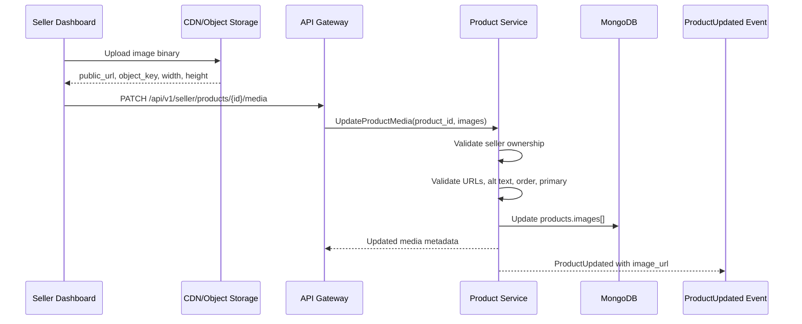
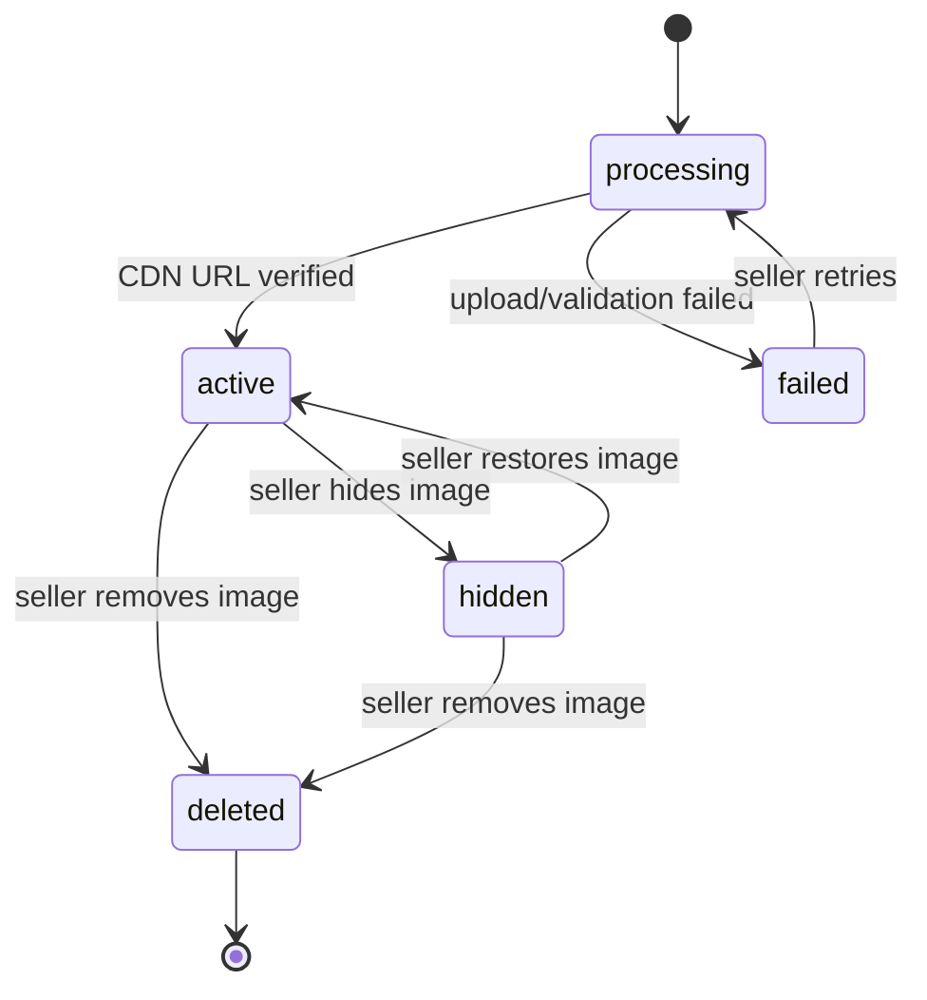

# 🖼️ Product Service - Task 8: Add Media Metadata


## 📌 Task Summary

| Field | Detail |
|---|---|
| Service | Product Service |
| Task No. | 8 |
| Task Name | Add media metadata |
| Source | `docs/01-micro-tasks.md` -> `Product Service` -> Task 8 |
| Goal | Product images ke CDN URLs, alt text, order, primary image, variant link, dimensions, aur status maintain karna |
| Dependency | Collections |
| Priority | P2 |
| Database | MongoDB `product_db` |
| Main Collection | `products.images[]` embedded media metadata |
| Main Actors | Seller Dashboard, API Gateway, Product Service |
| Output Type | Documentation-only implementation guide |
| Not Included | Binary file upload engine, image resizing/transcoding worker, CDN provisioning, storage bucket creation |

> 🟢 **Simple Hinglish goal:** Is task me Product Service ke andar product gallery metadata ko properly maintain karne ka implementation plan banaya gaya hai. Image ka actual binary file MongoDB me store nahi hoga. Product Service sirf image ka public CDN URL, alt text, display order, primary flag, linked variants, dimensions, and status rakhega. Isse frontend clean gallery render karega, SEO/accessibility better hogi, aur seller dashboard images ko reorder/update/hide kar paayega.

---

## ✅ Final Output Created

```text
TaskImplementation/
└── Product Service/
    ├── task1.md
    ├── task2.md
    ├── task3.md
    ├── task4.md
    ├── task5.md
    ├── task6.md
    ├── task7.md
    └── task8.md
```

### Why this structure?

| Path | Purpose |
|---|---|
| `TaskImplementation/` | Saare task-wise implementation guides ka central folder |
| `TaskImplementation/Product Service/` | Product Service ke implementation guides ko group karne ke liye |
| `task8.md` | Product media metadata implementation guide |

> 🔵 **Important:** Is task me sirf `task8.md` create kiya gaya hai. Actual Go service code, proto file, upload endpoint, object-storage bucket, CDN config, image worker, ya tests repo me create nahi kiye gaye. Code examples implementation samjhane ke liye hain.

---

## 🧭 Docs Studied Before Implementation

| Document | Kya use kiya gaya |
|---|---|
| `docs/01-micro-tasks.md` | Product Service Task 8 ka exact scope identify kiya |
| `docs/02-system-architecture.md` | CDN static assets/product images direction align ki |
| `docs/03-folder-structure.md` | Future Seller Dashboard `image-uploader.tsx` and Product Service clean folder style align kiya |
| `docs/04-microservice-design.md` | Product Service responsibilities and MongoDB ownership confirm kiya |
| `docs/05-database-design.md` | Product catalog MongoDB ownership and read/search boundaries samjhe |
| `docs/06-auth-security.md` | File upload type/size validation security note reuse kiya |
| `docs/12-logging-monitoring-scalability.md` | Product images ke liye CDN/caching principle align kiya |
| `database/mongodb-schema-design.md` | `products.images[]` existing example ko base banaya |
| `api/master-api.json` | Current `ProductInput.images` string array limitation identify ki |
| `TaskImplementation/Product Service/task1.md` | `ProductImage` fields, alt text, order, primary, status rules reuse kiye |
| `TaskImplementation/Product Service/task3.md` | `products` collection embedded image metadata design reuse ki |
| `TaskImplementation/Product Service/task4.md` | Seller product create/update workflow ke saath media metadata align ki |
| `TaskImplementation/Product Service/task5.md` | Product list/detail read response me image projection need samjhi |
| `TaskImplementation/Product Service/task7.md` | Image metadata change ke baad `ProductUpdated` event trigger boundary reuse ki |

---

## 🧱 Task Boundary

### ✅ Task 8 me kya design/document kiya gaya

- Product image/media metadata schema
- CDN/public URL store karne ka rule
- Alt text, position/order, primary image, status fields
- Variant-specific images mapping
- Product publish readiness media checks
- Seller-owned media update flow
- Product read/list response me primary image behavior
- MongoDB update patterns for embedded `images[]`
- Validation rules for URL, alt text, position, status, dimensions
- Error handling and gRPC/REST error mapping
- Observability and audit expectations
- External tools/libraries explanation
- Mermaid architecture, sequence, and lifecycle diagrams
- Beginner-friendly Go and MongoDB examples

### ❌ Task 8 me kya implement nahi kiya gaya

| Item | Reason |
|---|---|
| Actual image binary upload | Storage/CDN integration ka separate infra concern hai |
| Image resize/compression/transcoding worker | Media processing pipeline future task ho sakta hai |
| CDN distribution creation | DevOps/external services scope hai |
| S3/MinIO bucket provisioning | Platform/DevOps setup ka part hoga |
| Search Service consumer/index update | Search Service ka scope hai |
| Product CRUD base workflow | Product Service Task 4 ka scope tha |
| Product listing/detail read APIs | Product Service Task 5 ka scope tha |
| Product event publisher implementation | Product Service Task 7 ka scope tha |

> 🔴 **Golden rule:** Task 8 ka kaam product image metadata maintain karna hai. Binary image upload aur CDN infrastructure ko yahan implement nahi karna.

---

## 🏁 Final Media Metadata Decision

Product Service image file bytes store nahi karega. Product Service sirf metadata store karega.

| Concern | Owner |
|---|---|
| Product image metadata | Product Service |
| Product document and image ordering | Product Service MongoDB |
| Actual image binary/object | Object storage/CDN layer |
| Seller access validation | API Gateway + Product Service |
| Product gallery rendering | Frontend |
| Search thumbnail update | Task 7 event -> Search Service |

### Metadata-only approach kyun?

| Bad approach | Better approach |
|---|---|
| Image binary MongoDB me store karna | MongoDB me sirf metadata store karna |
| Frontend random URL strings bheje | Structured `ProductImage` object validate karna |
| Multiple primary images allow karna | Exactly one active primary image maintain karna |
| Gallery order frontend pe guess karna | `position` field se deterministic order |
| Alt text ignore karna | Accessibility and SEO ke liye `alt_text` support |

---

## 🧩 High-Level Architecture

```mermaid
flowchart TB
    Seller[Seller Dashboard] --> Gateway[API Gateway]
    Gateway --> Product[Product Service]

    Product --> Authz[Seller Ownership Check]
    Authz --> MediaUsecase[Media Metadata Usecases]
    MediaUsecase --> Repo[Product Repository]
    Repo --> Mongo[(MongoDB product_db)]
    Mongo --> Products[(products.images[])]

    Seller -. image binary already uploaded .-> CDN[CDN / Object Storage]
    CDN -. returns public URL .-> Seller

    MediaUsecase -. product image changed .-> Events[Task 7 ProductUpdated Event]
    Events -. async .-> Search[Search Service]
```

**Explanation:**  
Seller Dashboard pe image uploader actual image file ko storage/CDN layer me upload karega. CDN se public URL milne ke baad Seller Dashboard Product Service ko metadata bhejega. Product Service seller ownership validate karega, `products.images[]` update karega, and product read APIs ke liye clean gallery ready rakhega.

---

## 🔄 Metadata Update Flow



**How this part was built:**  
Existing docs me Product Service product catalog source of truth hai, but CDN static assets/product images serve karega. Isliye Task 8 me Product Service ko upload server nahi banaya gaya. Product Service sirf CDN se mil chuka URL and metadata validate/store karega.

---

## 🖼️ Product Image Metadata Model

Task 1 me image model already define hua tha. Task 8 me usko implementation-ready shape diya gaya.

### Final `ProductImage` fields

| Field | Type | Required | Rule |
|---|---:|---:|---|
| `image_id` | string | yes | Stable unique image id, example `img_123` |
| `url` | string | yes | Public CDN URL, HTTPS recommended |
| `object_key` | string | no | Storage object path, debugging/delete future use ke liye |
| `alt_text` | string | no | Accessibility/SEO text, max 160 chars recommended |
| `position` | int | yes | Gallery order, starts from `1` |
| `is_primary` | bool | yes | Product card/listing thumbnail ke liye |
| `variant_ids` | string[] | no | Specific variants se image link karne ke liye |
| `width` | int | no | Pixel width |
| `height` | int | no | Pixel height |
| `content_type` | string | no | `image/jpeg`, `image/png`, `image/webp` |
| `size_bytes` | int | no | File size metadata |
| `status` | enum | yes | `processing`, `active`, `hidden`, `failed`, `deleted` |
| `created_at` | datetime | yes | Metadata create time |
| `updated_at` | datetime | yes | Metadata update time |

### JSON example

```json
{
  "image_id": "img_001",
  "url": "https://cdn.example.com/products/prod_123/main.webp",
  "object_key": "products/prod_123/main.webp",
  "alt_text": "Black running shoes side view",
  "position": 1,
  "is_primary": true,
  "variant_ids": ["var_black_9", "var_black_10"],
  "width": 1200,
  "height": 1200,
  "content_type": "image/webp",
  "size_bytes": 184522,
  "status": "active",
  "created_at": "2026-05-23T00:00:00Z",
  "updated_at": "2026-05-23T00:00:00Z"
}
```

### DB compatibility note

Previous docs me kabhi `alt` aur kabhi `alt_text` use hua hai. Task 8 ke final implementation me Product Service internal model `alt_text` use karega. Agar old API payload me `alt` aaye, mapper usko normalize karega:

```text
payload.alt -> ProductImage.alt_text
payload.url -> ProductImage.url
```

---

## 📦 Product Document Shape After Task 8

```json
{
  "_id": "prod_123",
  "seller_id": "seller_456",
  "title": "Running Shoes",
  "status": "draft",
  "images": [
    {
      "image_id": "img_001",
      "url": "https://cdn.example.com/products/prod_123/main.webp",
      "object_key": "products/prod_123/main.webp",
      "alt_text": "Black running shoes side view",
      "position": 1,
      "is_primary": true,
      "variant_ids": ["var_black_9"],
      "width": 1200,
      "height": 1200,
      "content_type": "image/webp",
      "size_bytes": 184522,
      "status": "active",
      "created_at": "2026-05-23T00:00:00Z",
      "updated_at": "2026-05-23T00:00:00Z"
    }
  ],
  "updated_at": "2026-05-23T00:00:00Z"
}
```

**How this part was built:**  
`products` collection already Product Service Task 3 me canonical catalog document hai. Product images product ke saath tightly related hain, isliye embedded array simple and fast hai. Product detail read ko extra query nahi chahiye.

---

## 🧬 Image Status Lifecycle



### Status meaning

| Status | Meaning | Frontend behavior |
|---|---|---|
| `processing` | Image upload/processing complete nahi hua | Seller dashboard me pending dikhao, public gallery me hide |
| `active` | Image public gallery me usable hai | Product card/detail me render karo |
| `hidden` | Seller ne image temporarily hide ki | Public gallery me hide, seller dashboard me show |
| `failed` | Image invalid ya processing failed | Public gallery me hide, seller ko retry option |
| `deleted` | Soft deleted metadata | Public gallery me hide, normal reads me exclude |

---

## 🧮 Core Business Rules

| Rule | Reason |
|---|---|
| Active image ka `url` valid HTTPS CDN URL hona chahiye | Browser safe rendering and mixed-content issues avoid |
| Ek product me exactly one active primary image recommended hai | Product cards stable thumbnail dikhayenge |
| `position` active/hidden images me duplicate nahi hona chahiye | Gallery deterministic order me render hogi |
| `position` 1 se start hoga | Seller dashboard drag-drop ordering simple rahegi |
| `alt_text` max 160 chars recommended | SEO/accessibility me useful and concise |
| `variant_ids` product ke existing variants me se hone chahiye | Broken variant-image links avoid |
| `deleted` images normal read responses me exclude hongi | Frontend ko cleanup logic nahi chahiye |
| Published product ke liye at least one active image recommended hai | Buyer experience better rahega |

### Primary image correction rule

```text
If seller marks one image as primary:
    set that image is_primary = true
    set all other images is_primary = false

If no active primary image exists:
    make lowest-position active image primary
```

---

## 🪜 Step-by-Step Implementation

## Step 1: Task requirement identify kiya

`docs/01-micro-tasks.md` me Product Service Task 8 ye define hai:

```text
Add media metadata:
Images CDN URLs, alt text, order, status maintain karo.
Frontend clean gallery render karega.
```

**How this part was built:**  
Requirement se clear hua ki Task 8 ka scope product gallery metadata hai. Isme CDN URL, alt text, position/order, status, and frontend-friendly rendering important hain.

---

## Step 2: Existing product model ko extend kiya

Task 1 and Task 3 me `images` array already introduce hua tha. Task 8 me usko final structured metadata object banaya gaya.

### Before Task 8 MVP style

```json
{
  "images": [
    "https://cdn.example.com/products/prod_123/main.jpg"
  ]
}
```

### After Task 8 structured style

```json
{
  "images": [
    {
      "image_id": "img_001",
      "url": "https://cdn.example.com/products/prod_123/main.webp",
      "alt_text": "Black running shoes side view",
      "position": 1,
      "is_primary": true,
      "status": "active"
    }
  ]
}
```

**Why structured object?**  
String URL se sirf image dikh sakti hai. Structured metadata se gallery order, accessibility text, primary thumbnail, status, dimensions, and variant-specific image support possible hota hai.

---

## Step 3: Future folder structure align ki

Task 8 documentation-only hai, but actual Product Service implementation me files roughly is structure me fit hongi:

```text
backend/services/product/
├── cmd/
│   └── product-service/
│       └── main.go
├── internal/
│   ├── domain/
│   │   ├── product.go
│   │   └── image.go
│   ├── usecase/
│   │   └── media/
│   │       ├── add_product_image.go
│   │       ├── update_product_image.go
│   │       ├── reorder_product_images.go
│   │       ├── set_primary_image.go
│   │       └── remove_product_image.go
│   ├── repository/
│   │   └── mongo/
│   │       └── product_media_repository.go
│   ├── transport/
│   │   └── grpc/
│   │       └── product_media_handler.go
│   └── mapper/
│       └── media_mapper.go
└── tests/
    └── media_metadata_test.go
```

> 🔵 **Reminder:** Upar wala folder structure future implementation reference hai. Is task ka real created output sirf `TaskImplementation/Product Service/task8.md` hai.

---

## Step 4: Domain model define kiya

```go
package domain

import "time"

type ImageStatus string

const (
    ImageStatusProcessing ImageStatus = "processing"
    ImageStatusActive     ImageStatus = "active"
    ImageStatusHidden     ImageStatus = "hidden"
    ImageStatusFailed     ImageStatus = "failed"
    ImageStatusDeleted    ImageStatus = "deleted"
)

type ProductImage struct {
    ImageID     string
    URL         string
    ObjectKey   string
    AltText     string
    Position    int
    IsPrimary   bool
    VariantIDs  []string
    Width       int
    Height      int
    ContentType string
    SizeBytes   int64
    Status      ImageStatus
    CreatedAt   time.Time
    UpdatedAt   time.Time
}
```

**How this part was built:**  
Domain model me sirf business-relevant fields rakhe gaye. CDN provider-specific details minimal rakhe gaye taaki future me S3, Cloudflare R2, GCS, ya kisi aur CDN pe switch karna easy rahe.

---

## Step 5: Validation rules implement-ready banaye

### Image validation checklist

| Validation | Error Code |
|---|---|
| `image_id` empty nahi hona chahiye | `IMAGE_ID_REQUIRED` |
| `url` valid absolute URL hona chahiye | `INVALID_IMAGE_URL` |
| Active image ke liye HTTPS URL required | `IMAGE_URL_MUST_BE_HTTPS` |
| `alt_text` 160 chars se zyada nahi | `ALT_TEXT_TOO_LONG` |
| `position` `>= 1` hona chahiye | `INVALID_IMAGE_POSITION` |
| Duplicate position nahi honi chahiye | `DUPLICATE_IMAGE_POSITION` |
| Status known enum hona chahiye | `INVALID_IMAGE_STATUS` |
| `variant_ids` existing variants se match hone chahiye | `UNKNOWN_VARIANT_ID` |
| More than one active primary image nahi honi chahiye | `MULTIPLE_PRIMARY_IMAGES` |

### Validation example

```go
func ValidateProductImage(img ProductImage, existingVariantIDs map[string]bool) error {
    if img.ImageID == "" {
        return ErrImageIDRequired
    }
    if img.URL == "" {
        return ErrInvalidImageURL
    }
    if img.Position < 1 {
        return ErrInvalidImagePosition
    }
    if len(img.AltText) > 160 {
        return ErrAltTextTooLong
    }
    if !IsKnownImageStatus(img.Status) {
        return ErrInvalidImageStatus
    }
    for _, variantID := range img.VariantIDs {
        if !existingVariantIDs[variantID] {
            return ErrUnknownVariantID
        }
    }
    return nil
}
```

**Beginner note:**  
Validation usecase layer me hogi, sirf frontend pe nahi. Frontend validation UX improve karta hai, but backend validation data integrity protect karta hai.

---

## Step 6: API contract shape plan kiya

Existing `api/master-api.json` me `ProductInput.images` currently string array hai:

```json
{
  "images": ["https://cdn.example.com/products/prod_123/main.jpg"]
}
```

Task 8 ke baad implementation-ready contract structured object use karega:

```json
{
  "images": [
    {
      "image_id": "img_001",
      "url": "https://cdn.example.com/products/prod_123/main.webp",
      "alt_text": "Black running shoes side view",
      "position": 1,
      "is_primary": true,
      "variant_ids": ["var_black_9"],
      "width": 1200,
      "height": 1200,
      "content_type": "image/webp",
      "size_bytes": 184522,
      "status": "active"
    }
  ]
}
```

### Suggested seller REST endpoints

| Method | Path | Purpose |
|---|---|---|
| `PUT` | `/api/v1/seller/products/{product_id}/media` | Full gallery replace/reorder |
| `POST` | `/api/v1/seller/products/{product_id}/media` | Add one image metadata |
| `PATCH` | `/api/v1/seller/products/{product_id}/media/{image_id}` | Update alt text/status/variant links |
| `POST` | `/api/v1/seller/products/{product_id}/media/{image_id}/primary` | Set primary image |
| `DELETE` | `/api/v1/seller/products/{product_id}/media/{image_id}` | Soft delete image metadata |

> 🟡 **Contract note:** Existing docs do not yet define dedicated media endpoints. Product Service Task 8 can be implemented either as dedicated media endpoints or inside `UpdateProduct`. Dedicated endpoints are cleaner for seller dashboard image editor.

---

## Step 7: Usecases define kiye

| Usecase | Input | Output | Responsibility |
|---|---|---|---|
| `AddProductImage` | product id, seller id, image metadata | updated image | Add image and normalize position |
| `UpdateProductImage` | product id, image id, patch | updated image | Alt/status/variant metadata update |
| `ReorderProductImages` | ordered image ids | updated gallery | Position values rewrite |
| `SetPrimaryImage` | product id, image id | updated gallery | One primary rule enforce |
| `RemoveProductImage` | product id, image id | success | Soft delete image |
| `ReplaceProductGallery` | full image array | updated gallery | Bulk replace and validate |

### Usecase example

```go
type AddProductImageCommand struct {
    ProductID string
    SellerID  string
    Image     domain.ProductImage
}

type AddProductImageUsecase struct {
    products ProductMediaRepository
    clock    Clock
}

func (uc *AddProductImageUsecase) Execute(ctx context.Context, cmd AddProductImageCommand) (*domain.ProductImage, error) {
    product, err := uc.products.FindByID(ctx, cmd.ProductID)
    if err != nil {
        return nil, err
    }
    if product.SellerID != cmd.SellerID {
        return nil, ErrProductNotFound
    }

    cmd.Image.CreatedAt = uc.clock.Now()
    cmd.Image.UpdatedAt = uc.clock.Now()

    if err := product.AddImage(cmd.Image); err != nil {
        return nil, err
    }
    if err := uc.products.UpdateImages(ctx, product.ID, product.Images); err != nil {
        return nil, err
    }
    return product.ImageByID(cmd.Image.ImageID), nil
}
```

**How this part was built:**  
Seller ownership check Product Service me bhi rakha gaya. Gateway auth useful hai, but service-level ownership validation important hai because internal calls ya future admin tools bhi service ko call kar sakte hain.

---

## Step 8: Aggregate methods banaye

Product aggregate ke andar image rules centralize honge. Isse repository ya handler me scattered logic nahi rahegi.

```go
func (p *Product) AddImage(img ProductImage) error {
    if err := ValidateProductImage(img, p.variantIDSet()); err != nil {
        return err
    }
    if p.hasImage(img.ImageID) {
        return ErrDuplicateImageID
    }

    if img.Position == 0 {
        img.Position = p.nextImagePosition()
    }
    p.Images = append(p.Images, img)
    p.normalizeImagePositions()
    p.ensureSinglePrimaryImage()
    return nil
}

func (p *Product) SetPrimaryImage(imageID string) error {
    found := false
    for i := range p.Images {
        isTarget := p.Images[i].ImageID == imageID && p.Images[i].Status == ImageStatusActive
        p.Images[i].IsPrimary = isTarget
        found = found || isTarget
    }
    if !found {
        return ErrImageNotFound
    }
    return nil
}
```

**Why aggregate method?**  
Product image rules product ke context me depend karte hain: variants, status, active images, primary image. Isliye rules domain aggregate me rehna clean hai.

---

## Step 9: MongoDB update pattern define kiya

### Full gallery replace

```javascript
db.products.updateOne(
  {
    _id: "prod_123",
    seller_id: "seller_456",
    status: { $in: ["draft", "submitted", "unpublished"] }
  },
  {
    $set: {
      images: [
        {
          image_id: "img_001",
          url: "https://cdn.example.com/products/prod_123/main.webp",
          alt_text: "Black running shoes side view",
          position: 1,
          is_primary: true,
          status: "active",
          updated_at: new Date()
        }
      ],
      updated_at: new Date(),
      updated_by: "seller_456"
    }
  }
)
```

### Update one image metadata

```javascript
db.products.updateOne(
  {
    _id: "prod_123",
    seller_id: "seller_456",
    "images.image_id": "img_001"
  },
  {
    $set: {
      "images.$.alt_text": "Black running shoes front view",
      "images.$.status": "active",
      "images.$.updated_at": new Date(),
      updated_at: new Date()
    }
  }
)
```

### Soft delete one image

```javascript
db.products.updateOne(
  {
    _id: "prod_123",
    seller_id: "seller_456",
    "images.image_id": "img_001"
  },
  {
    $set: {
      "images.$.status": "deleted",
      "images.$.is_primary": false,
      "images.$.updated_at": new Date(),
      updated_at: new Date()
    }
  }
)
```

**Important:**  
Soft delete ke baad application ko ensure karna hoga ki koi aur active image primary ban jaye. Ye correction aggregate/usecase layer me hoga.

---

## Step 10: MongoDB schema validation update plan kiya

```javascript
db.runCommand({
  collMod: "products",
  validator: {
    $jsonSchema: {
      bsonType: "object",
      required: ["_id", "seller_id", "title", "category_id", "status", "variants", "created_at", "updated_at"],
      properties: {
        images: {
          bsonType: "array",
          items: {
            bsonType: "object",
            required: ["image_id", "url", "position", "is_primary", "status"],
            properties: {
              image_id: { bsonType: "string" },
              url: { bsonType: "string" },
              object_key: { bsonType: ["string", "null"] },
              alt_text: { bsonType: ["string", "null"] },
              position: { bsonType: "int", minimum: 1 },
              is_primary: { bsonType: "bool" },
              variant_ids: {
                bsonType: "array",
                items: { bsonType: "string" }
              },
              width: { bsonType: ["int", "null"], minimum: 1 },
              height: { bsonType: ["int", "null"], minimum: 1 },
              content_type: { bsonType: ["string", "null"] },
              size_bytes: { bsonType: ["long", "int", "null"], minimum: 0 },
              status: {
                enum: ["processing", "active", "hidden", "failed", "deleted"]
              },
              created_at: { bsonType: ["date", "null"] },
              updated_at: { bsonType: ["date", "null"] }
            }
          }
        }
      }
    }
  }
})
```

**How this part was built:**  
MongoDB schema validation basic shape protect karega. Complex rules like exactly one primary image, duplicate position, and variant id existence app-level validation me better handle honge.

---

## Step 11: Read response behavior define kiya

### Product list/card response

Product list me full gallery ki zarurat nahi hoti. Sirf primary active image enough hai.

```json
{
  "product_id": "prod_123",
  "title": "Running Shoes",
  "primary_image": {
    "url": "https://cdn.example.com/products/prod_123/main.webp",
    "alt_text": "Black running shoes side view"
  }
}
```

### Product detail response

Product detail page full active gallery use karega.

```json
{
  "product_id": "prod_123",
  "title": "Running Shoes",
  "images": [
    {
      "image_id": "img_001",
      "url": "https://cdn.example.com/products/prod_123/main.webp",
      "alt_text": "Black running shoes side view",
      "position": 1,
      "is_primary": true,
      "variant_ids": ["var_black_9"],
      "width": 1200,
      "height": 1200
    }
  ]
}
```

### Public read filtering

```text
Public product response:
    include only images where status == "active"
    sort by position ascending
    expose url, alt_text, position, is_primary, variant_ids, width, height
    hide object_key, size_bytes if not needed

Seller product response:
    include active, hidden, processing, failed images
    exclude deleted by default unless audit/debug view
```

---

## Step 12: Publish readiness checks update kiye

Product Service Task 4 me publish workflow define hua tha. Task 8 ke baad publish validation me media checks add honge.

| Check | Required for publish? | Reason |
|---|---:|---|
| At least one active image | Recommended / category-configurable | Buyer trust and product display |
| One active primary image | Yes if active images exist | Product card thumbnail |
| No duplicate active positions | Yes | Gallery order clean |
| Active image URL valid | Yes | Broken image avoid |
| Alt text present | Recommended | Accessibility/SEO |

### Publish validation example

```go
func ValidateImagesForPublish(product *Product) error {
    active := product.ActiveImages()
    if len(active) == 0 {
        return ErrProductImageRequired
    }
    if product.PrimaryImage() == nil {
        return ErrPrimaryImageRequired
    }
    if hasDuplicatePositions(active) {
        return ErrDuplicateImagePosition
    }
    return nil
}
```

> 🟡 **MVP note:** Some categories may not strictly require images during early development. But production e-commerce catalog should require at least one active image before publish.

---

## Step 13: Search event integration boundary define ki

Task 7 already Product Service events define karta hai. Task 8 me image metadata change hone ke baad Product Service ko same event system use karna chahiye.

```text
Image added/updated/reordered/hidden/deleted
    -> product.updated_at changes
    -> ProductUpdated event created by Task 7 pattern
    -> Search Service updates thumbnail/image_url
```

### Event payload image part

```json
{
  "event_type": "ProductUpdated",
  "payload": {
    "product_id": "prod_123",
    "image_url": "https://cdn.example.com/products/prod_123/main.webp",
    "updated_at": "2026-05-23T00:00:00Z"
  }
}
```

> 🔵 **Scope note:** Task 8 event trigger point document karta hai. Actual outbox relay and broker publisher Task 7 ka scope hai.

---

## Step 14: Error handling define kiya

| Situation | gRPC Code | App Error Code |
|---|---|---|
| Product not found or seller-owned nahi | `NOT_FOUND` | `PRODUCT_NOT_FOUND` |
| Product current state me editable nahi | `FAILED_PRECONDITION` | `PRODUCT_NOT_EDITABLE` |
| Image id missing | `INVALID_ARGUMENT` | `IMAGE_ID_REQUIRED` |
| Image URL invalid | `INVALID_ARGUMENT` | `INVALID_IMAGE_URL` |
| Image URL HTTPS nahi | `INVALID_ARGUMENT` | `IMAGE_URL_MUST_BE_HTTPS` |
| Duplicate position | `INVALID_ARGUMENT` | `DUPLICATE_IMAGE_POSITION` |
| Multiple primary images | `INVALID_ARGUMENT` | `MULTIPLE_PRIMARY_IMAGES` |
| Unknown variant id | `INVALID_ARGUMENT` | `UNKNOWN_VARIANT_ID` |
| Image not found | `NOT_FOUND` | `IMAGE_NOT_FOUND` |

### REST error example

```json
{
  "data": null,
  "request_id": "req_123",
  "error": {
    "code": "DUPLICATE_IMAGE_POSITION",
    "message": "Two active images cannot have the same gallery position.",
    "details": [
      {
        "field": "images[1].position",
        "reason": "Position 1 is already used."
      }
    ]
  }
}
```

---

## Step 15: Security rules define kiye

| Security Rule | Why |
|---|---|
| Seller can update only own product images | Cross-seller data tampering avoid |
| Only trusted CDN domains allowlist karo | Malicious/unsafe image sources avoid |
| HTTPS image URLs require karo | Browser mixed content and MITM risk reduce |
| File metadata size/type validate karo | Bad upload metadata avoid |
| HTML sanitize karo if alt text rendered near HTML | XSS risk reduce |
| Object key public response me expose na karo unless needed | Storage internals leak avoid |

### CDN allowlist example

```go
var allowedCDNHosts = map[string]bool{
    "cdn.example.com": true,
    "images.example.com": true,
}

func IsAllowedImageURL(raw string) bool {
    u, err := url.Parse(raw)
    if err != nil {
        return false
    }
    return u.Scheme == "https" && allowedCDNHosts[u.Host]
}
```

**Beginner note:**  
Image URL string harmless lag sakta hai, but frontend browser me render hota hai. Isliye allowed domain and HTTPS validation important hai.

---

## Step 16: Observability define ki

### Logs

| Log Field | Example |
|---|---|
| `service` | `product-service` |
| `operation` | `UpdateProductMedia` |
| `product_id` | `prod_123` |
| `seller_id` | `seller_456` |
| `image_count` | `5` |
| `primary_image_id` | `img_001` |
| `error_code` | `INVALID_IMAGE_URL` |

### Metrics

| Metric | Type | Meaning |
|---|---|---|
| `product_media_update_total` | counter | Media metadata update attempts |
| `product_media_update_failed_total` | counter | Failed media metadata updates |
| `product_images_per_product` | histogram | Product gallery size distribution |
| `product_media_missing_alt_total` | counter | Active images without alt text |
| `product_media_invalid_url_total` | counter | Invalid URL validation failures |

### Trace spans

```text
ProductService.UpdateProductMedia
├── ProductRepository.FindByID
├── MediaValidator.ValidateGallery
├── ProductRepository.UpdateImages
└── ProductEventOutbox.CreateProductUpdated
```

---

## 🧰 External Libraries / Tools Used

Task 8 actual repo code create nahi karta, but implementation ke time ye tools useful honge:

| Tool / Library | What it is | Why used | Install / Use |
|---|---|---|---|
| MongoDB | Document database | `products.images[]` embedded metadata store karne ke liye | Local stack/Docker se run hoga |
| Go MongoDB Driver | Official Go client for MongoDB | Product document read/update karne ke liye | `go get go.mongodb.org/mongo-driver/mongo` |
| Go `net/url` | Standard library URL parser | Image URL validate karne ke liye | Install nahi chahiye |
| `go-playground/validator` | Go validation library | DTO validation tags ke liye optional useful | `go get github.com/go-playground/validator/v10` |
| CDN/Object Storage | S3/Cloudflare R2/GCS style storage + CDN | Image binary serve karne ke liye | Provider-specific setup; Product Service sirf URL store karega |
| Mermaid | Markdown diagram syntax | Architecture/flow diagrams readable banane ke liye | Markdown renderer support kare to install nahi chahiye |
| Shields.io | Badge image service | Docs me colored badges dikhane ke liye | Install nahi chahiye; markdown image URL se use hota hai |

### Example install commands

```bash
go get go.mongodb.org/mongo-driver/mongo
go get github.com/go-playground/validator/v10
```

### Example use

```go
import (
    "net/url"

    "github.com/go-playground/validator/v10"
    "go.mongodb.org/mongo-driver/mongo"
)
```

> 🟡 **Note:** `go-playground/validator` optional hai. Agar project shared validation package already provide karta hai, wahi use karna better hoga.

---

## 🧪 Testing Strategy

### Unit tests

| Test Case | Expected Result |
|---|---|
| Add valid image | Image added with correct position |
| Add duplicate image id | `DUPLICATE_IMAGE_ID` |
| Invalid URL | `INVALID_IMAGE_URL` |
| HTTP URL for active image | `IMAGE_URL_MUST_BE_HTTPS` |
| Duplicate positions | `DUPLICATE_IMAGE_POSITION` |
| Set primary image | Only target image primary remains |
| Delete primary image | Next active image becomes primary |
| Unknown variant id | `UNKNOWN_VARIANT_ID` |

### Repository tests

| Test Case | Expected Result |
|---|---|
| Update full gallery | `products.images[]` replaced |
| Update one image alt text | Only matching image updated |
| Soft delete image | Status becomes `deleted` |
| Seller mismatch | No document updated |

### API tests

| Test Case | Expected Result |
|---|---|
| Seller updates own product media | `200 OK` |
| Seller updates another seller product | `404` or `403` based policy |
| Public product detail | Only active images returned |
| Seller product detail | Hidden/failed/processing visible to seller |

---

## 🧾 Clean Implementation Checklist

| Check | Status |
|---|---|
| Scope sirf Product Service Task 8 tak limited hai | ✅ |
| `TaskImplementation/Product Service/task8.md` created | ✅ |
| Hinglish step-by-step implementation included | ✅ |
| Media metadata schema documented | ✅ |
| CDN URL, alt text, order, status rules documented | ✅ |
| Primary image rule documented | ✅ |
| Variant image mapping documented | ✅ |
| MongoDB update examples added | ✅ |
| External libraries/tools install/use documented | ✅ |
| Clean folder structure included | ✅ |
| Mermaid diagrams included | ✅ |
| Upload/CDN infrastructure out of scope rakha | ✅ |

---

## 🚫 Out of Scope for Task 8

```text
Task 8 = Product Service media metadata

Not Task 8:
- Image binary upload server
- Image resize/compression worker
- CDN distribution setup
- Storage bucket provisioning
- Product CRUD base implementation
- Search Service indexing implementation
- Seller Dashboard UI implementation
```

> 🔴 **Reason:** User ne specifically Product Service Task 8 ka implementation guide generate karne ko bola hai. Isliye yahan sirf product image metadata design documented hai.

---

## ✅ Final Summary

Product Service Task 8 complete hai as a **documentation-only implementation guide**. Is design me Product Service product images ka structured metadata maintain karega: CDN URL, alt text, position/order, primary flag, variant links, dimensions, content type, size, and status. Actual image file CDN/object storage me rahegi, MongoDB me nahi. Public reads sirf active images sorted by position return karenge, seller reads extra statuses bhi dikha sakenge. Image metadata change hone par Task 7 ke existing event pattern se `ProductUpdated` event trigger hoga, taaki Search Service thumbnail/index update kar sake.
