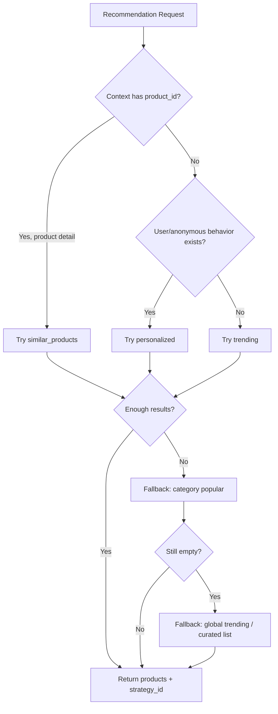
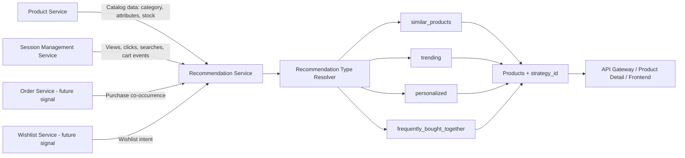
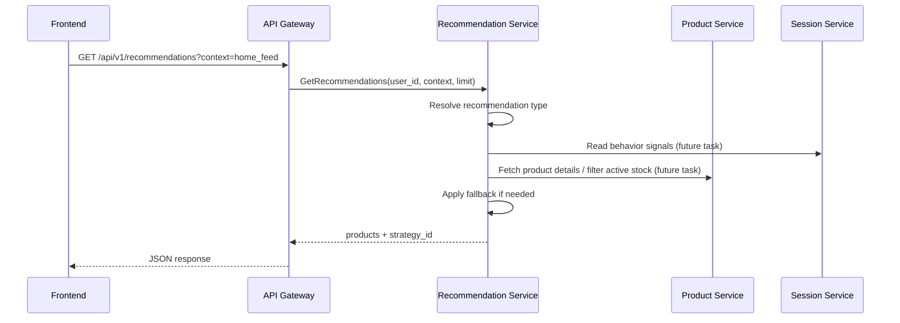
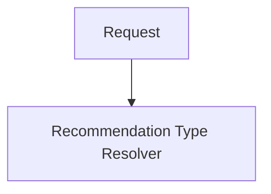

# 🧠 Recommendation Service - Task 1: Define Recommendation Types


## 📌 Task Summary

| Field | Detail |
|---|---|
| Task Name | Define recommendation types |
| Source | `docs/01-micro-tasks.md` → `Recommendation Service` → Task 1 |
| Priority | `P2` optimization / advanced capability |
| Dependencies | Product Service and Session Management Service |
| Main Goal | Similar products, trending, personalized, aur frequently bought together recommendation types define karna |
| Output Type | Structured implementation guide |
| Not Included | MongoDB/Redis setup, event ingestion, feature store schema, ranking engine, gRPC endpoint, A/B testing hooks |

> **Simple Hinglish goal:** Is task ka kaam hai Recommendation Service ke recommendation types clearly define karna. Matlab service future me kaun-kaun se recommendation modes support karegi, unka input kya hoga, output kya hoga, fallback kya hoga, aur strategy naming kaise hogi.

---

## ✅ Final Output Created

```text
TaskImplementation/
└── Recommendation Service/
    └── task1.md
```

### Why this structure?

- `TaskImplementation/` project ke task-wise implementation guides ka central folder hai.
- `Recommendation Service/` folder recommendation-service related tasks ko group karta hai.
- `task1.md` sirf **Recommendation Service - Task 1** ka guide hai.
- Actual backend code, database migrations, Redis cache, ya gRPC files create nahi kiye gaye, kyunki Task 1 sirf recommendation types define karta hai.

---

## 🧭 Implementation Approach

Is guide ko banate time project ke existing documentation ko base banaya gaya:

| Document | Kya use kiya gaya |
|---|---|
| `docs/01-micro-tasks.md` | Task 1 ka exact scope: recommendation types define karna |
| `docs/04-microservice-design.md` | Recommendation Service purpose, responsibilities, APIs, internal logic |
| `docs/03-folder-structure.md` | Future `backend/services/recommendation-service/` structure |
| `database/mongodb-schema-design.md` | Future `user_interactions` and `recommendation_sets` collection ideas |
| `api/master-api.json` | Future request/response contract: `RecommendationRequest`, `RecommendationResponse`, `strategy_id` |
| `docs/12-logging-monitoring-scalability.md` | Recommendation failure should gracefully degrade |

---

## 🧱 Task Boundary

### ✅ Included in Task 1

- Recommendation type taxonomy define karna
- Contexts define karna: home, product detail, category listing, cart, checkout
- Product Service aur Session Service se required signals identify karna
- Har recommendation type ka input, scoring idea, output, aur fallback explain karna
- `strategy_id` naming convention define karna
- Beginner-friendly code examples dena
- Architecture and flow diagrams add karna
- External tools/libraries ka clear note dena

### ❌ Not Included in Task 1

- MongoDB plus Redis choose/setup karna, kyunki wo Task 2 hai
- Product views, add-to-cart, wishlist, purchase events consume karna, kyunki wo Task 3 hai
- Feature store schema banana, kyunki wo Task 4 hai
- Rule-based MVP ranking implement karna, kyunki wo Task 5 hai
- Personalized ranking algorithm implement karna, kyunki wo Task 6 hai
- `GetRecommendations(user_id, context)` gRPC endpoint banana, kyunki wo Task 7 hai
- A/B testing hooks implement karna, kyunki wo Task 8 hai

> 🟢 **Rule:** Task 1 me service ka "vocabulary and contract thinking" ready hota hai. Actual storage, queues, ranking jobs, aur APIs later tasks me aayenge.

---

## 🧩 Recommendation Types Overview

| Type | Hinglish Meaning | Best Context | Main Dependency | Cold-Start Fallback |
|---|---|---|---|---|
| `similar_products` | Current product ke jaise products dikhana | Product detail page | Product catalog attributes | Same category popular products |
| `trending` | Abhi popular chal rahe products dikhana | Home, category, search landing | Session events + product data | Global curated/top products |
| `personalized` | User ke behavior ke hisaab se products dikhana | Home feed, recommended for you | User/session interactions | Category popular + trending |
| `frequently_bought_together` | Saath me kharide jaane wale products dikhana | Product detail, cart, checkout | Order/cart co-occurrence | Similar products or category popular |

---

## 🪜 Step-by-Step Implementation

### Step 1: Recommendation Service ka purpose clear kiya

Recommendation Service ka goal hai product discovery improve karna. User ko relevant products dikhne chahiye without manually searching too much.

Project docs ke according service future me ye kaam karegi:

- Trending lists serve karna
- Similar product suggestions dena
- Personalized product ranking karna
- Recommendation impression/click track karna
- Cold-start fallback provide karna

Task 1 me inme se sirf recommendation **types** define kiye gaye hain.

---

### Step 2: Source signals identify kiye

Recommendation type define karne se pehle ye samajhna zaruri hai ki service ko data kahan se milega.

### Product Service se signals

| Signal | Example | Use |
|---|---|---|
| `product_id` | `prod_123` | Base product identify karne ke liye |
| `category_id` | `cat_shoes` | Category-level recommendations ke liye |
| `brand_id` | `brand_nike` | Similar brand products ke liye |
| `seller_id` | `seller_456` | Seller popular recommendations ke liye |
| `attributes` | size, color, material | Similarity scoring ke liye |
| `price` | `2499` | Same price range suggestions ke liye |
| `stock_status` | `in_stock` | Out-of-stock products avoid karne ke liye |

### Session Service se signals

| Signal | Example | Use |
|---|---|---|
| `product_view` | User ne product detail dekha | Interest detect karne ke liye |
| `product_click` | Listing se product click hua | Trending/click popularity ke liye |
| `add_to_cart` | Product cart me add hua | Strong purchase intent signal |
| `wishlist_add` | Product wishlist me gaya | Personal preference signal |
| `search_query` | User searched `running shoes` | Intent and category interest |
| `anonymous_id` | Guest browser identity | Guest personalization ke liye |

> 🟡 **Important:** Task 1 me hum events consume nahi kar rahe. Sirf ye define kar rahe hain ki future recommendation logic ko kaunse signals chahiye honge.

---

### Step 3: Recommendation contexts define kiye

Context batata hai ki recommendation kis screen ya user journey point par dikhaya ja raha hai.

| Context | Page / Place | Preferred Recommendation Type |
|---|---|---|
| `home_feed` | Homepage | `personalized`, fallback `trending` |
| `product_detail` | Product detail page | `similar_products`, `frequently_bought_together` |
| `category_listing` | Category page | `trending` within category |
| `cart` | Cart page | `frequently_bought_together` |
| `checkout` | Checkout page | Low-risk `frequently_bought_together` add-ons |
| `search_results` | Search page | Query/category based `trending` |
| `seller_store` | Seller storefront | Seller popular `trending` |

### Context decision rule

```text
Context decides recommendation intent.
Intent decides recommendation type.
Recommendation type decides data signals and fallback.
```

---

### Step 4: `similar_products` type define kiya

### ✅ Purpose

`similar_products` ka kaam hai ek current product ke jaise products show karna. Ye mostly product detail page pe useful hota hai.

### Input

| Field | Required | Why |
|---|---:|---|
| `product_id` | Yes | Base product identify karne ke liye |
| `category_id` | Recommended | Same category me similarity better hoti hai |
| `limit` | Optional | Kitne products return karne hain |
| `user_id` | Optional | User preference se tie-break karne ke liye |

### Scoring idea

Similarity score future me in factors se calculate ho sakta hai:

| Factor | Weight Idea | Example |
|---|---:|---|
| Same category | High | Shoes with shoes |
| Shared attributes | High | color, material, size group |
| Same brand | Medium | Same brand alternatives |
| Similar price range | Medium | ±20 percent price bucket |
| In stock | Mandatory filter | Out-of-stock remove |
| Active product status | Mandatory filter | Draft/deleted products remove |

### Example strategy id

```text
similar_v1_attributes
```

### Example result reason

```json
{
  "product_id": "prod_456",
  "score": 0.87,
  "reason": "same_category_shared_attributes"
}
```

### Fallback

Agar enough similar products nahi milte:

1. Same category popular products
2. Same seller popular products
3. Global trending products

---

### Step 5: `trending` type define kiya

### ✅ Purpose

`trending` ka kaam hai currently popular products dikhana. Ye anonymous users ke liye bhi useful hai, kyunki personalization ke liye user history required nahi hoti.

### Input

| Field | Required | Why |
|---|---:|---|
| `context` | Yes | Home/category/search context decide karne ke liye |
| `category_id` | Optional | Category-specific trending ke liye |
| `seller_id` | Optional | Seller storefront trending ke liye |
| `limit` | Optional | Result count control karne ke liye |

### Scoring idea

Trending score future me recent activity se ban sakta hai:

```text
trending_score =
  product_views * 1
+ product_clicks * 2
+ wishlist_adds * 3
+ add_to_cart * 5
+ purchases * 8
- negative_signals
```

> 🟡 **Note:** Ye final algorithm nahi hai. Ye Task 1 ke liye conceptual scoring example hai. Actual rule-based MVP Task 5 me implement hoga.

### Example strategy id

```text
trending_v1_recent_activity
```

### Fallback

Agar real-time event data available nahi hai:

1. Category popular products
2. Global popular products
3. Manually curated default list

---

### Step 6: `personalized` type define kiya

### ✅ Purpose

`personalized` recommendations user ke behavior ke basis par products rank karti hain. Ye homepage, "Recommended for you", aur logged-in experience ke liye useful hai.

### Input

| Field | Required | Why |
|---|---:|---|
| `user_id` | Preferred | Logged-in personalization ke liye |
| `anonymous_id` | Optional | Guest personalization ke liye |
| `context` | Yes | Page-specific ranking ke liye |
| `category_id` | Optional | Current browse category ko boost karne ke liye |
| `limit` | Optional | Result count control |

### Behavior signals

| Event | Strength | Why |
|---|---:|---|
| `product_view` | Low | User ne interest show kiya |
| `product_click` | Medium | Listing me product choose kiya |
| `wishlist_add` | High | Future buying intent |
| `add_to_cart` | Very high | Strong purchase intent |
| `purchase` | Very high | Real conversion signal |

### Example strategy id

```text
personalized_v1_behavior
```

### Cold-start fallback

Agar user new hai aur behavior data nahi hai:

1. Current category popular products
2. Recent trending products
3. Homepage curated products

### Privacy boundary

Personalized recommendations me raw sensitive data use nahi hona chahiye. Service ko product interactions, anonymous id, user id reference, aur aggregated preference signals tak limited rehna chahiye.

---

### Step 7: `frequently_bought_together` type define kiya

### ✅ Purpose

`frequently_bought_together` ka kaam hai complementary products suggest karna. Example: phone ke saath case, laptop ke saath bag, shoes ke saath socks.

### Input

| Field | Required | Why |
|---|---:|---|
| `product_id` | Product page ke liye required | Single product ke add-ons find karne ke liye |
| `cart_product_ids` | Cart/checkout ke liye required | Current cart ke basis pe combos find karne ke liye |
| `category_id` | Optional | Complement category filter |
| `limit` | Optional | Result count control |

### Scoring idea

Frequently bought together future me order/cart co-occurrence se calculate hoga:

```text
fbt_score =
  times_bought_with_base_product
  / total_orders_with_base_product
```

### Example strategy id

```text
fbt_v1_order_cooccurrence
```

### Fallback

Agar co-occurrence data nahi hai:

1. Same category accessories
2. Similar products
3. Category popular low-price add-ons

---

### Step 8: Strategy ID convention define kiya

`strategy_id` response me return hoga taaki analytics future me compare kar sake ki kaunsi strategy better conversion de rahi hai.

### Naming format

```text
<type>_v<version>_<main_logic>
```

### Examples

| Type | Strategy ID |
|---|---|
| Similar products | `similar_v1_attributes` |
| Trending | `trending_v1_recent_activity` |
| Personalized | `personalized_v1_behavior` |
| Frequently bought together | `fbt_v1_order_cooccurrence` |
| Fallback trending | `trending_v1_fallback_global` |

### Why strategy id important hai?

- Analytics team impressions/clicks/conversions compare kar sakti hai.
- A/B testing future me easy hoga.
- Debugging me pata chalega ki user ko list kis logic se mili.
- Model/rule upgrade ke baad old vs new performance compare ho payegi.

---

### Step 9: Recommendation response shape define kiya

`api/master-api.json` ke according future response me products aur `strategy_id` return hoga.

### Simple response shape

```json
{
  "products": [
    {
      "product_id": "prod_456",
      "name": "Running Shoes",
      "category_id": "cat_shoes"
    }
  ],
  "strategy_id": "similar_v1_attributes"
}
```

### Internal enriched result shape

Service internally extra fields maintain kar sakti hai, jaise score and reason:

```json
{
  "recommendation_id": "reco_20260527_abc123",
  "type": "similar_products",
  "strategy_id": "similar_v1_attributes",
  "items": [
    {
      "product_id": "prod_456",
      "score": 0.87,
      "reason": "same_category_shared_attributes"
    }
  ],
  "generated_at": "2026-05-27T00:00:00Z"
}
```

> 🟢 **Rule:** Public response simple rahega. Internal response debug, ranking, aur analytics ke liye richer ho sakta hai.

---

### Step 10: Fallback chain define kiya

Recommendation Service user experience block nahi karegi. Agar personalized ya similar data missing hai, service graceful fallback degi.



### Fallback priority

| Priority | Fallback |
|---:|---|
| 1 | Same context recommendation |
| 2 | Same category popular |
| 3 | Seller popular |
| 4 | Global trending |
| 5 | Curated default list |

---

## 🗂️ Clean Folder Structure

### Documentation output created in this task

```text
TaskImplementation/
└── Recommendation Service/
    └── task1.md
```

### Future target service structure

Task 1 ke concepts future backend implementation me roughly is structure me map honge:

```text
backend/
└── services/
    └── recommendation-service/
        ├── cmd/
        │   └── server/
        │       └── main.go
        ├── internal/
        │   ├── domain/
        │   │   ├── recommendation.go
        │   │   ├── recommendation_type.go
        │   │   └── strategy.go
        │   ├── usecase/
        │   │   ├── resolve_recommendations.go
        │   │   ├── similar_products.go
        │   │   ├── trending.go
        │   │   ├── personalized.go
        │   │   └── frequently_bought_together.go
        │   ├── repository/
        │   │   ├── mongo_feature_repository.go
        │   │   └── redis_recommendation_cache.go
        │   ├── events/
        │   │   └── interaction_consumer.go
        │   └── transport/
        │       └── grpc/
        └── deploy/
```

### Folder responsibility

| Path | Responsibility |
|---|---|
| `domain/` | Recommendation types, contexts, strategy IDs, core entities |
| `usecase/` | Type-specific recommendation resolution flows |
| `repository/` | Future MongoDB/Redis data access |
| `events/` | Future event ingestion from session/product/order/wishlist |
| `transport/grpc/` | Future `GetRecommendations` endpoint |
| `deploy/` | Future Docker/Kubernetes deployment files |

> 🟡 **Note:** Ye future service structure documentation hai. Task 1 me actual backend files create nahi kiye gaye.

---

## 🧬 Domain Model Example

Future Go implementation me recommendation types kuch is tarah define kiye ja sakte hain:

```go
package domain

type RecommendationType string

const (
    RecommendationTypeSimilarProducts           RecommendationType = "similar_products"
    RecommendationTypeTrending                  RecommendationType = "trending"
    RecommendationTypePersonalized              RecommendationType = "personalized"
    RecommendationTypeFrequentlyBoughtTogether  RecommendationType = "frequently_bought_together"
)

type RecommendationContext string

const (
    ContextHomeFeed        RecommendationContext = "home_feed"
    ContextProductDetail   RecommendationContext = "product_detail"
    ContextCategoryListing RecommendationContext = "category_listing"
    ContextCart            RecommendationContext = "cart"
    ContextCheckout        RecommendationContext = "checkout"
    ContextSearchResults   RecommendationContext = "search_results"
    ContextSellerStore     RecommendationContext = "seller_store"
)

type RecommendationRequest struct {
    UserID         string
    AnonymousID    string
    ProductID      string
    CategoryID     string
    SellerID       string
    CartProductIDs []string
    Context        RecommendationContext
    Limit          int
}

type RecommendationItem struct {
    ProductID string
    Score     float64
    Reason    string
}

type RecommendationResult struct {
    RecommendationID string
    Type             RecommendationType
    StrategyID       string
    Items            []RecommendationItem
}
```

### Explanation

- `RecommendationType` fixed supported recommendation modes define karta hai.
- `RecommendationContext` batata hai request kis page/screen se aa rahi hai.
- `RecommendationRequest` flexible rakha gaya hai, taaki product page, cart page, homepage sab support ho sake.
- `RecommendationItem` internal scoring/debugging ke liye useful hai.
- `RecommendationResult` me `strategy_id` mandatory hai, taaki analytics future me strategy performance track kar sake.

---

## 🧠 Type Resolver Example

Recommendation type context ke basis pe resolve ho sakta hai:

```go
package domain

func ResolveRecommendationType(req RecommendationRequest) RecommendationType {
    if req.Context == ContextCart || req.Context == ContextCheckout {
        return RecommendationTypeFrequentlyBoughtTogether
    }

    if req.Context == ContextProductDetail && req.ProductID != "" {
        return RecommendationTypeSimilarProducts
    }

    if req.UserID != "" || req.AnonymousID != "" {
        return RecommendationTypePersonalized
    }

    return RecommendationTypeTrending
}
```

### Explanation

- Cart/checkout me complementary products zyada useful hote hain, isliye FBT choose hota hai.
- Product detail page pe base product available hota hai, isliye similar products best fit hai.
- User ya anonymous behavior available ho to personalized recommendation try hoti hai.
- Agar kuch bhi user-specific nahi hai, trending safe default hai.

---

## 🔌 Future API Contract Preview

Task 7 me actual gRPC endpoint banega. Task 1 ke liye sirf conceptual contract define kiya gaya hai.

### Future request example

```json
{
  "user_id": "user_123",
  "context": "home_feed",
  "category_id": "cat_shoes",
  "limit": 12
}
```

### Future response example

```json
{
  "products": [
    {
      "product_id": "prod_456",
      "name": "Lightweight Running Shoes"
    },
    {
      "product_id": "prod_789",
      "name": "Breathable Training Shoes"
    }
  ],
  "strategy_id": "personalized_v1_behavior"
}
```

### Proto-style preview

```proto
enum RecommendationType {
  RECOMMENDATION_TYPE_UNSPECIFIED = 0;
  RECOMMENDATION_TYPE_SIMILAR_PRODUCTS = 1;
  RECOMMENDATION_TYPE_TRENDING = 2;
  RECOMMENDATION_TYPE_PERSONALIZED = 3;
  RECOMMENDATION_TYPE_FREQUENTLY_BOUGHT_TOGETHER = 4;
}
```

> 🟡 **Boundary:** Proto file create karna Task 7 ya proto strategy implementation ka part hoga. Yahan sirf type vocabulary preview hai.

---

## 🏗️ Architecture Diagram



---

## 🔁 Request Flow Diagram



> 🟢 **Task 1 view:** Is flow me sirf `Resolve recommendation type` ka design define hua hai. Data fetch, ranking, cache, aur gRPC implementation later tasks me aayenge.

---

## 🧪 Beginner-Friendly Test Scenarios

Task 1 ke type definitions validate karne ke liye future unit tests ye scenarios cover kar sakte hain:

| Scenario | Input | Expected Type |
|---|---|---|
| Product detail page | `context=product_detail`, `product_id=prod_123` | `similar_products` |
| Cart page | `context=cart`, `cart_product_ids=[prod_1]` | `frequently_bought_together` |
| Logged-in homepage | `context=home_feed`, `user_id=user_123` | `personalized` |
| Guest homepage with anonymous id | `context=home_feed`, `anonymous_id=anon_123` | `personalized` |
| Category page without user | `context=category_listing`, `category_id=cat_shoes` | `trending` |
| Search page without user | `context=search_results` | `trending` |

### Example Go table test idea

```go
tests := []struct {
    name string
    req  RecommendationRequest
    want RecommendationType
}{
    {
        name: "product detail uses similar products",
        req: RecommendationRequest{
            Context:   ContextProductDetail,
            ProductID: "prod_123",
        },
        want: RecommendationTypeSimilarProducts,
    },
    {
        name: "cart uses frequently bought together",
        req: RecommendationRequest{
            Context:        ContextCart,
            CartProductIDs: []string{"prod_1"},
        },
        want: RecommendationTypeFrequentlyBoughtTogether,
    },
}
```

---

## 🧰 External Libraries / Tools Used

### Runtime external libraries

| Library | Used in Task 1? | Why |
|---|---:|---|
| MongoDB Go Driver | No | Database choice/setup Task 2 me aayega |
| Redis Go Client | No | Cache implementation Task 2/5 me aayega |
| Kafka/RabbitMQ Client | No | Event ingestion Task 3 me aayega |
| ML/Vector Search Library | No | Advanced ranking later phase me aayega |

> ✅ **Task 1 me runtime external library install nahi ki gayi.** Ye task documentation and domain-definition focused hai.

### Documentation tools

| Tool | What | Why Used | Install / Use |
|---|---|---|---|
| Markdown | Documentation format | Beginner-friendly guide likhne ke liye | `.md` file directly repo me use hoti hai |
| Mermaid | Markdown-friendly diagrams | Architecture and flow diagrams render karne ke liye | GitHub/GitLab me usually auto-render hota hai |
| Shields.io badges | Colored status badges | Task metadata visually clear karne ke liye | Markdown image URL se use hota hai, install required nahi |

### Optional local Mermaid preview

Agar local VS Code me Mermaid render preview chahiye:

```bash
code --install-extension bierner.markdown-mermaid
```

Usage:

````markdown

````

> 🟡 **Note:** Extension optional hai. Repo ke task output ke liye install mandatory nahi hai.

---

## 🚦 Rules Finalized in Task 1

| Rule | Decision |
|---|---|
| Supported initial types | `similar_products`, `trending`, `personalized`, `frequently_bought_together` |
| Required response metadata | `strategy_id` |
| Safe default | `trending` |
| Cold-start behavior | Category popular → global trending → curated list |
| Product availability | Out-of-stock/inactive products final response me avoid honge |
| Personal data boundary | Raw sensitive user data recommendation logic me use nahi hoga |
| Analytics readiness | Recommendation ID and strategy ID future tracking ke liye ready rahenge |

---

## ✅ Task 1 Completion Checklist

| Item | Status |
|---|---|
| Recommendation types defined | ✅ Done |
| Contexts defined | ✅ Done |
| Product and session signals identified | ✅ Done |
| Fallback strategy documented | ✅ Done |
| Strategy ID convention documented | ✅ Done |
| Folder structure documented | ✅ Done |
| Code examples added | ✅ Done |
| Mermaid diagrams added | ✅ Done |
| External tools/libraries explained | ✅ Done |
| Out-of-scope future tasks clearly separated | ✅ Done |

---

## 🧾 Final Notes

Recommendation Service Task 1 ka final result ek clear type-definition foundation hai. Ab future tasks me team confidently storage, event ingestion, feature store, rule-based MVP, personalization ranking, gRPC endpoint, aur A/B hooks implement kar sakti hai without recommendation vocabulary confuse kiye.

**Next task after this:** Recommendation Service - Task 2: Choose MongoDB plus Redis.
