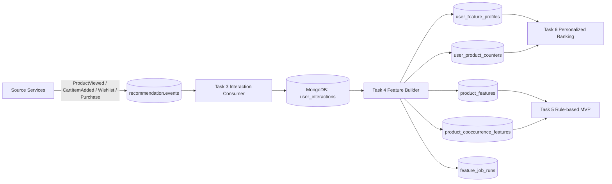
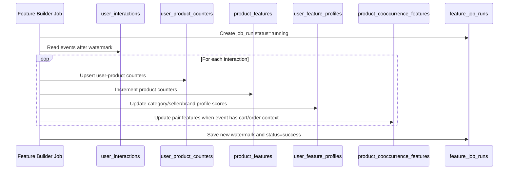
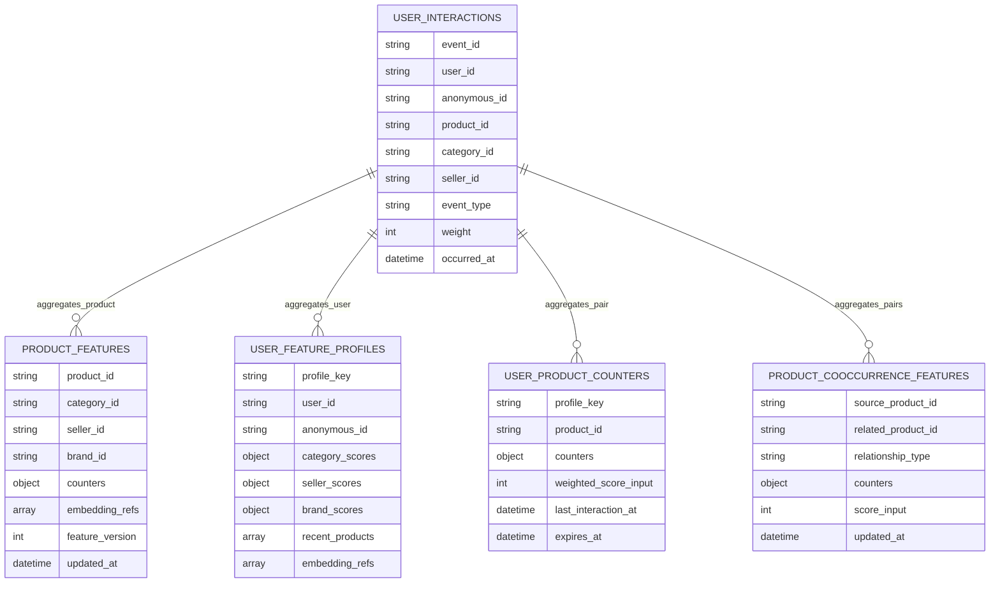
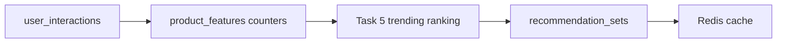
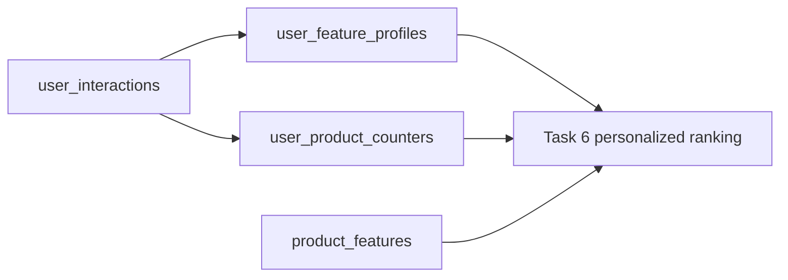
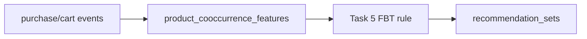
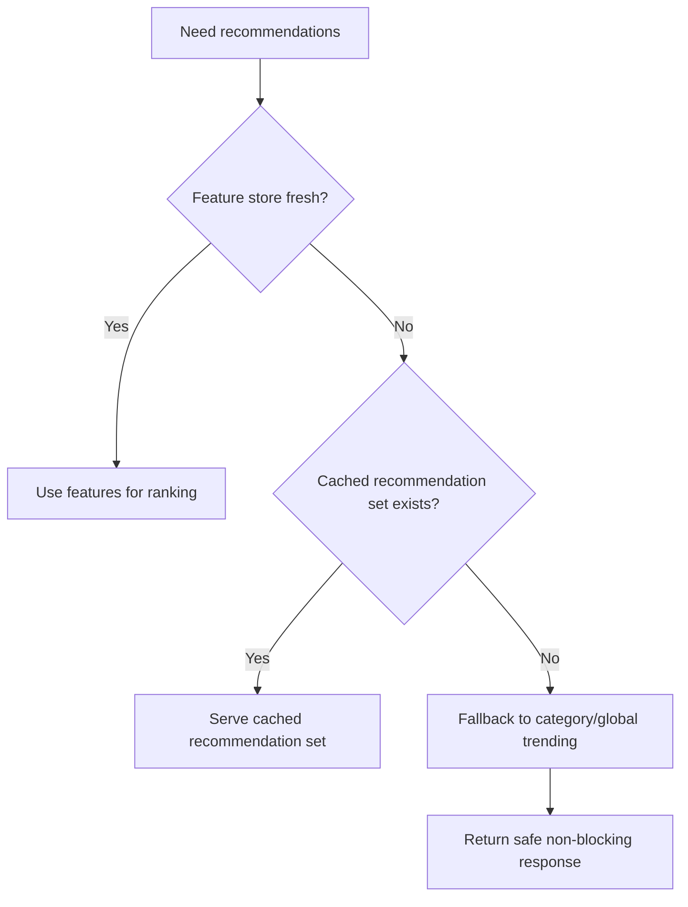

# 🧠 Recommendation Service - Task 4: Feature Store Schema


## 📌 Task Summary

| Field | Detail |
|---|---|
| Task Name | Feature store schema |
| Source | `docs/01-micro-tasks.md` → `Recommendation Service` → Task 4 |
| Priority | `P2` optimization / recommendation quality foundation |
| Dependency | Recommendation Service Task 3: Event ingestion |
| Main Goal | `user_interactions` raw events ko compact user/product features, counters, aur embedding/reference IDs me convert karne ke liye schema define karna |
| Output Type | Structured implementation guide |
| Not Included | Rule-based ranking engine, personalized ranking algorithm, gRPC endpoint, A/B testing hooks, ML/vector search implementation |

> **Simple Hinglish goal:** Task 4 ka kaam hai Recommendation Service ke liye feature store ka design banana. Task 3 me raw events MongoDB me aa gaye. Ab un events se reusable counters/features banenge, jaise product popularity, user interest profile, user-product affinity, aur future embeddings ke reference IDs.

---

## ✅ Final Output Created

```text
TaskImplementation/
└── Recommendation Service/
    ├── task1.md
    ├── task2.md
    ├── task3.md
    └── task4.md
```

### Why this structure?

- `TaskImplementation/` project ke task-wise implementation guides ka central folder hai.
- `Recommendation Service/` folder already exist karta tha, isliye usko preserve kiya gaya.
- `task1.md` recommendation types define karta hai.
- `task2.md` MongoDB plus Redis storage decision define karta hai.
- `task3.md` raw event ingestion pipeline define karta hai.
- `task4.md` sirf **Recommendation Service - Task 4** ka feature-store schema guide hai.
- `backend/services/recommendation-service/` me koi actual code create nahi kiya gaya, kyunki requested output documentation artifact hai.

---

## 🧭 Documents Studied

| Document | Kya use kiya gaya |
|---|---|
| `docs/01-micro-tasks.md` | Task 4 ka exact scope: user-product interaction counters and embeddings/reference IDs store karna |
| `docs/04-microservice-design.md` | Recommendation Service responsibilities: interaction scoring, trending, similar, personalized ranking |
| `docs/05-database-design.md` | Recommendation DB choice: MongoDB plus Redis and service database ownership |
| `docs/03-folder-structure.md` | Future `mongo_feature_repository.go` placement |
| `docs/11-devops-external-services.md` | Event envelope, retry/DLQ, idempotent consumer rules |
| `docs/12-logging-monitoring-scalability.md` | Redis recommendation cache TTL, graceful degradation, queue lag scaling |
| `database/mongodb-schema-design.md` | Existing `recommendation_db.user_interactions` and `recommendation_sets` base indexes |
| `TaskImplementation/Recommendation Service/task1.md` | Recommendation types and contexts |
| `TaskImplementation/Recommendation Service/task2.md` | MongoDB/Redis storage decision and cache strategy |
| `TaskImplementation/Recommendation Service/task3.md` | Event ingestion and normalized interaction shape |

---

## 🧱 Task Boundary

### ✅ Included in Task 4

- Feature store ka MongoDB schema define karna
- Raw `user_interactions` se derived feature collections define karna
- User-product interaction counters design karna
- Product-level popularity and metadata features design karna
- User/anonymous profile features design karna
- Product-product co-occurrence features design karna
- Future embeddings ke liye reference ID schema define karna
- Indexes, TTL, uniqueness, aur update patterns explain karna
- External tools/libraries ka purpose and install notes document karna
- Architecture, flow, and logical schema diagrams add karna
- Beginner-friendly Hinglish explanation and code examples dena

### ❌ Not Included in Task 4

- Actual Go service files create karna
- MongoDB migration files create/run karna
- Ranking score calculate karke recommendations return karna, kyunki wo Task 5/6 hai
- `GetRecommendations(user_id, context)` gRPC endpoint banana, kyunki wo Task 7 hai
- A/B testing assignment/strategy hooks implement karna, kyunki wo Task 8 hai
- ML model training, embedding generation, vector database, ya vector search implement karna
- Frontend recommendation UI banana

> 🟢 **Rule:** Task 4 schema foundation hai. Isme features store karne ka structure ready hota hai. Ranking logic later tasks me is feature store ko read karegi.

---

## 🏗️ High-Level Architecture



### Hinglish explanation

- Task 3 events ko raw form me `user_interactions` me store karta hai.
- Task 4 raw events ko reusable features me aggregate karta hai.
- Feature store read-optimized hota hai, taaki future ranking jobs har request par raw events scan na karein.
- Task 5/6 feature store se data read karke recommendations generate karenge.

---

## 🧩 Feature Store Mental Model

```text
Raw events = detailed history
Features   = compressed signals
Ranking    = features ka use karke product list banana
```

Example:

```text
5 product views + 1 wishlist + 1 cart event
→ user_product_counters me compact affinity signal
→ personalized ranking me useful score input
```

---

## 🗂️ Recommended Feature Store Collections

Task 4 me `recommendation_db` ke andar ye feature collections define honge:

```text
recommendation_db
├── user_interactions              # Task 3 raw event log
├── product_features               # Product-level features and embedding refs
├── user_feature_profiles          # User/anonymous preference profile
├── user_product_counters          # User-product pair counters
├── product_cooccurrence_features  # Frequently bought/viewed/carted together
├── feature_job_runs               # Batch/incremental builder metadata
├── recommendation_sets            # Task 5/6 generated result sets
└── ab_test_assignments            # Task 8 future scope
```

### Collection responsibility

| Collection | Purpose | Primary Reader |
|---|---|---|
| `user_interactions` | Raw normalized events from Task 3 | Feature builder |
| `product_features` | Product popularity, category/seller metadata, stock-safe feature snapshot, embedding refs | Trending/similar ranking |
| `user_feature_profiles` | User or guest preferences by category, seller, brand, price range | Personalized ranking |
| `user_product_counters` | Per user-product interaction counters and last seen timestamps | Personalized ranking |
| `product_cooccurrence_features` | Product-to-product pair signals for frequently bought together | FBT/similar ranking |
| `feature_job_runs` | Watermark, status, counts, errors for feature-building jobs | Ops/debugging |

> 🟡 **Important:** Existing docs list `product_features` as a Recommendation collection. Task 4 expands that idea into a complete feature-store schema, because user-product counters and user profiles need separate high-cardinality collections.

---

## 🪜 Step-by-Step Implementation Guide

## Step 1: Task 3 ke raw events ko input maana

Task 3 ke baad normalized interactions ka shape roughly aisa hai:

```json
{
  "_id": "interaction_123",
  "event_id": "evt_view_001",
  "user_id": "user_123",
  "anonymous_id": "anon_456",
  "product_id": "prod_123",
  "variant_id": "var_1",
  "category_id": "cat_shoes",
  "seller_id": "seller_456",
  "event_type": "product_view",
  "weight": 1,
  "occurred_at": "2026-05-27T10:30:00Z",
  "created_at": "2026-05-27T10:30:05Z"
}
```

Task 4 ka feature builder in raw events ko read karega aur derived collections update karega.

### Event weight mapping

| Event Type | Counter Field | Default Weight | Meaning |
|---|---|---:|---|
| `product_view` | `views` | `1` | Light interest |
| `wishlist_add` | `wishlist_adds` | `3` | Medium preference |
| `wishlist_remove` | `wishlist_removes` | `-2` | Preference reduced |
| `add_to_cart` | `cart_adds` | `4` | Strong purchase intent |
| `purchase` | `purchases` | `8` | Strong conversion signal |

> 🟣 **Note:** Ye weights final ranking score nahi hain. Ye feature values hain. Actual scoring Task 5/6 me tune hoga.

---

## Step 2: Feature windows decide kiye

Recommendation me recent behavior important hota hai. Isliye feature store me multiple time windows useful rahengi.

| Window | Field Suffix | Use Case |
|---|---|---|
| Lifetime | `_all` | Long-term product/user history |
| 30 days | `_30d` | Stable popularity and preferences |
| 7 days | `_7d` | Recent trending |
| 24 hours | `_24h` | Fast-moving trends |

### Beginner-friendly rule

```text
Long-term features = personalization stable rakho
Short-term features = trending fresh rakho
```

### Example counter fields

```json
{
  "views_24h": 18,
  "views_7d": 132,
  "views_30d": 920,
  "views_all": 4130,
  "purchases_7d": 12,
  "purchases_30d": 47
}
```

> 🟡 **Implementation note:** Windowed counters exact real-time update karna complex ho sakta hai. Beginner-friendly approach: lifetime counters incremental update karo, aur 24h/7d/30d counters periodic batch job se rebuild karo.

---

## Step 3: `product_features` schema define kiya

`product_features` product-level recommendation snapshot hai. Ye Product Service ke source DB ka replacement nahi hai. Ye sirf recommendation-friendly projection hai.

### Example document

```json
{
  "_id": "prod_123",
  "product_id": "prod_123",
  "category_id": "cat_shoes",
  "seller_id": "seller_456",
  "brand_id": "brand_789",
  "status": "active",
  "stock_status": "in_stock",
  "price": {
    "amount": 2499,
    "currency": "INR",
    "bucket": "2000_2999"
  },
  "attributes": {
    "color": "black",
    "material": "mesh",
    "gender": "men"
  },
  "counters": {
    "views_24h": 18,
    "views_7d": 132,
    "views_30d": 920,
    "views_all": 4130,
    "cart_adds_7d": 21,
    "wishlist_adds_7d": 34,
    "purchases_7d": 12,
    "purchases_30d": 47
  },
  "quality_flags": {
    "is_recommendable": true,
    "is_adult": false,
    "is_deleted": false
  },
  "embedding_refs": [
    {
      "type": "product_text_v1",
      "vector_id": "vec_product_text_v1_prod_123",
      "provider": "future-vector-store",
      "model": "future-product-embedding-model",
      "dimension": 1536,
      "version": 1,
      "status": "pending",
      "generated_at": null
    }
  ],
  "feature_version": 1,
  "last_event_at": "2026-05-27T10:35:00Z",
  "updated_at": "2026-05-27T10:36:00Z"
}
```

### Field explanation

| Field | Why Needed |
|---|---|
| `product_id` | Product identify karne ke liye |
| `category_id`, `seller_id`, `brand_id` | Category/seller/brand popular recommendations ke liye |
| `status`, `stock_status` | Out-of-stock/deleted products filter karne ke liye |
| `price.bucket` | Similar price range and personalization ke liye |
| `attributes` | Similar products matching ke liye |
| `counters` | Trending and popularity features ke liye |
| `quality_flags.is_recommendable` | Unsafe/unavailable products avoid karne ke liye |
| `embedding_refs` | Future ML/vector similarity ke reference IDs |
| `feature_version` | Schema evolution safe rakhne ke liye |

### Recommended indexes

```javascript
use recommendation_db

db.product_features.createIndex(
  { product_id: 1 },
  { unique: true }
)

db.product_features.createIndex(
  { category_id: 1, "quality_flags.is_recommendable": 1, "counters.purchases_7d": -1 }
)

db.product_features.createIndex(
  { seller_id: 1, "quality_flags.is_recommendable": 1, "counters.purchases_7d": -1 }
)

db.product_features.createIndex(
  { brand_id: 1, "quality_flags.is_recommendable": 1 }
)

db.product_features.createIndex(
  { "embedding_refs.vector_id": 1 },
  { sparse: true }
)
```

### Why these indexes?

| Index | Use |
|---|---|
| `{ product_id }` unique | Product feature upsert fast and duplicate safe |
| `{ category_id, recommendable, purchases_7d }` | Category popular products read fast |
| `{ seller_id, recommendable, purchases_7d }` | Seller popular products read fast |
| `{ brand_id, recommendable }` | Similar/brand-based candidates |
| `{ embedding_refs.vector_id }` sparse | Future embedding lookup/debug |

---

## Step 4: `user_feature_profiles` schema define kiya

`user_feature_profiles` user ya guest ke interest summary ko store karta hai. Raw click history store karne ke bajay compact preferences store hoti hain.

### Identity model

| User Type | Key |
|---|---|
| Logged-in user | `user:user_123` |
| Guest user | `anon:anon_456` |

### Example document

```json
{
  "_id": "user:user_123",
  "profile_key": "user:user_123",
  "user_id": "user_123",
  "anonymous_id": null,
  "category_scores": {
    "cat_shoes": 42.5,
    "cat_sports": 18.0,
    "cat_bags": 6.0
  },
  "seller_scores": {
    "seller_456": 21.0
  },
  "brand_scores": {
    "brand_789": 15.5
  },
  "price_affinity": {
    "currency": "INR",
    "preferred_buckets": ["2000_2999", "3000_4999"],
    "min_seen": 799,
    "max_seen": 5999
  },
  "recent_products": [
    {
      "product_id": "prod_123",
      "event_type": "add_to_cart",
      "occurred_at": "2026-05-27T10:35:00Z"
    }
  ],
  "embedding_refs": [
    {
      "type": "user_interest_v1",
      "vector_id": "vec_user_interest_v1_user_123",
      "provider": "future-vector-store",
      "model": "future-user-embedding-model",
      "dimension": 1536,
      "version": 1,
      "status": "pending",
      "generated_at": null
    }
  ],
  "last_event_at": "2026-05-27T10:35:00Z",
  "expires_at": null,
  "feature_version": 1,
  "updated_at": "2026-05-27T10:36:00Z"
}
```

### Guest profile example

```json
{
  "_id": "anon:anon_456",
  "profile_key": "anon:anon_456",
  "user_id": null,
  "anonymous_id": "anon_456",
  "category_scores": {
    "cat_shoes": 8.0
  },
  "recent_products": [
    {
      "product_id": "prod_123",
      "event_type": "product_view",
      "occurred_at": "2026-05-27T10:30:00Z"
    }
  ],
  "expires_at": "2026-06-26T10:30:00Z",
  "feature_version": 1,
  "updated_at": "2026-05-27T10:36:00Z"
}
```

### Recommended indexes

```javascript
use recommendation_db

db.user_feature_profiles.createIndex(
  { profile_key: 1 },
  { unique: true }
)

db.user_feature_profiles.createIndex(
  { user_id: 1 },
  { sparse: true }
)

db.user_feature_profiles.createIndex(
  { anonymous_id: 1 },
  { sparse: true }
)

db.user_feature_profiles.createIndex(
  { expires_at: 1 },
  { expireAfterSeconds: 0 }
)
```

### TTL rule

| Profile Type | TTL |
|---|---:|
| Logged-in user profile | No automatic TTL by default |
| Guest profile | 30 days from last interaction |

> 🔒 **Privacy note:** User deletion/privacy request ke time `user:user_id` profile delete karna easy hona chahiye. Email, phone, address, ya raw PII yahan store nahi hoga.

---

## Step 5: `user_product_counters` schema define kiya

Ye collection user-product pair ke compact counters store karti hai. Personalized ranking ke liye ye bahut useful hoga.

### Example document

```json
{
  "_id": "user:user_123:prod_123",
  "profile_key": "user:user_123",
  "user_id": "user_123",
  "anonymous_id": null,
  "product_id": "prod_123",
  "category_id": "cat_shoes",
  "seller_id": "seller_456",
  "counters": {
    "views": 5,
    "cart_adds": 1,
    "wishlist_adds": 1,
    "wishlist_removes": 0,
    "purchases": 0
  },
  "weighted_score_input": 12,
  "first_interaction_at": "2026-05-25T09:00:00Z",
  "last_interaction_at": "2026-05-27T10:35:00Z",
  "last_event_id": "evt_cart_001",
  "expires_at": "2026-11-23T10:35:00Z",
  "feature_version": 1,
  "updated_at": "2026-05-27T10:36:00Z"
}
```

### Why separate collection?

| Reason | Explanation |
|---|---|
| High cardinality | Ek user bahut products interact kar sakta hai |
| Fast lookup | Personalized ranking ko user ke recent product affinities chahiye |
| TTL control | Old weak signals automatically expire ho sakte hain |
| Idempotent updates | Same event duplicate aaye to controlled update possible hai |

### Recommended indexes

```javascript
use recommendation_db

db.user_product_counters.createIndex(
  { profile_key: 1, product_id: 1 },
  { unique: true }
)

db.user_product_counters.createIndex(
  { profile_key: 1, last_interaction_at: -1 }
)

db.user_product_counters.createIndex(
  { product_id: 1, weighted_score_input: -1 }
)

db.user_product_counters.createIndex(
  { category_id: 1, last_interaction_at: -1 }
)

db.user_product_counters.createIndex(
  { expires_at: 1 },
  { expireAfterSeconds: 0 }
)
```

### TTL rule

```text
user_product_counters expires_at = last_interaction_at + 180 days
```

> 🟡 **Why TTL?** Raw events already long-term history ke liye `user_interactions` me limited time ke liye rahenge. Pair counters ko bhi infinite grow nahi karna chahiye.

---

## Step 6: `product_cooccurrence_features` schema define kiya

Ye collection `frequently_bought_together` aur similar product candidates ke liye product pair features store karegi.

### Example document

```json
{
  "_id": "prod_123:prod_456",
  "source_product_id": "prod_123",
  "related_product_id": "prod_456",
  "category_id": "cat_shoes",
  "relationship_type": "bought_together",
  "counters": {
    "viewed_together_30d": 18,
    "carted_together_30d": 7,
    "bought_together_30d": 4,
    "bought_together_all": 39
  },
  "score_input": 67,
  "last_seen_at": "2026-05-27T10:35:00Z",
  "feature_version": 1,
  "updated_at": "2026-05-27T10:36:00Z"
}
```

### Pair key rule

Product pair duplicate avoid karne ke liye stable ordering use karo:

```text
pair_key = min(product_id_a, product_id_b) + ":" + max(product_id_a, product_id_b)
```

### Recommended indexes

```javascript
use recommendation_db

db.product_cooccurrence_features.createIndex(
  { source_product_id: 1, relationship_type: 1, score_input: -1 }
)

db.product_cooccurrence_features.createIndex(
  { related_product_id: 1 }
)

db.product_cooccurrence_features.createIndex(
  { category_id: 1, score_input: -1 }
)

db.product_cooccurrence_features.createIndex(
  { last_seen_at: -1 }
)
```

### Use cases

| Relationship Type | Future Use |
|---|---|
| `viewed_together` | Similar discovery candidates |
| `carted_together` | Cart add-on recommendations |
| `bought_together` | Frequently bought together |

---

## Step 7: `feature_job_runs` schema define kiya

Feature builder ko reliable banane ke liye job metadata store karna useful hai. Isse pata chalega ki last processed event ka watermark kya tha.

### Example document

```json
{
  "_id": "feature_job_20260527_103600",
  "job_type": "incremental_interaction_features",
  "status": "success",
  "started_at": "2026-05-27T10:36:00Z",
  "finished_at": "2026-05-27T10:36:08Z",
  "watermark": {
    "last_occurred_at": "2026-05-27T10:35:00Z",
    "last_event_id": "evt_cart_001"
  },
  "stats": {
    "events_read": 1200,
    "product_features_updated": 340,
    "user_profiles_updated": 260,
    "user_product_counters_updated": 530,
    "cooccurrence_pairs_updated": 70
  },
  "error": null,
  "created_at": "2026-05-27T10:36:00Z"
}
```

### Recommended indexes

```javascript
use recommendation_db

db.feature_job_runs.createIndex(
  { job_type: 1, started_at: -1 }
)

db.feature_job_runs.createIndex(
  { status: 1, started_at: -1 }
)
```

### Why job metadata matters?

| Benefit | Explanation |
|---|---|
| Resume support | Job crash ke baad last watermark se continue kar sakte hain |
| Debugging | Kaunse batch me kitne docs update hue, easily inspect hota hai |
| Monitoring | Failed/stuck jobs detect karna easy hota hai |
| Idempotency support | Same batch replay karne par duplicate counters avoid strategy define hoti hai |

---

## Step 8: Embedding reference schema define kiya

Task 4 me actual ML embedding generate nahi karna hai. Sirf schema future-ready banana hai.

### Recommended embedding reference object

```json
{
  "type": "product_text_v1",
  "vector_id": "vec_product_text_v1_prod_123",
  "provider": "future-vector-store",
  "model": "future-product-embedding-model",
  "dimension": 1536,
  "version": 1,
  "status": "pending",
  "generated_at": null,
  "expires_at": null
}
```

### Field explanation

| Field | Why Needed |
|---|---|
| `type` | Product text, image, user interest, ya blended embedding identify karne ke liye |
| `vector_id` | Future vector DB/object store me vector lookup ID |
| `provider` | Vector storage provider ya ML pipeline ka source |
| `model` | Kaunse model/version se embedding bani |
| `dimension` | Vector dimension compatibility check |
| `version` | Recompute/version migration ke liye |
| `status` | `pending`, `ready`, `failed`, `expired` |
| `generated_at` | Freshness track karne ke liye |

### Why store reference IDs, not large vectors?

| Option | Decision |
|---|---|
| Store full vector arrays in MongoDB | Avoid by default. Documents heavy ho sakte hain |
| Store reference IDs in MongoDB | Recommended. Feature docs lightweight rahenge |
| Use vector DB later | Future ML task me possible |

> 🟢 **Task 4 decision:** Embeddings ke liye `embedding_refs` field ready rahega, but actual embeddings/vector search later scope hai.

---

## Step 9: Feature update flow define kiya



### Hinglish explanation

- Job last processed watermark se new events read karega.
- Har event se multiple feature docs update ho sakte hain.
- MongoDB upsert use hoga taaki first event par document create ho aur later events par update ho.
- Job successful hone ke baad watermark update hoga.
- Fail hone par same event range replay ho sakti hai, isliye idempotency strategy zaruri hai.

---

## Step 10: Idempotency strategy define kiya

Feature builder duplicate events se counters double increment na kare, ye important hai.

### Recommended approach

```text
Raw event ingestion already unique event_id enforce kare.
Feature builder watermark based processing kare.
For stronger safety, processed feature event IDs short TTL collection me store kiye ja sakte hain.
```

### Optional collection: `feature_processed_events`

High reliability chahiye ho to ye helper collection use ho sakti hai:

```json
{
  "_id": "evt_cart_001",
  "event_id": "evt_cart_001",
  "processed_by": "feature_builder_v1",
  "processed_at": "2026-05-27T10:36:00Z",
  "expires_at": "2026-06-26T10:36:00Z"
}
```

Recommended indexes:

```javascript
db.feature_processed_events.createIndex(
  { event_id: 1 },
  { unique: true }
)

db.feature_processed_events.createIndex(
  { expires_at: 1 },
  { expireAfterSeconds: 0 }
)
```

> 🟡 **Scope note:** Ye optional helper collection hai. Task 4 ka core schema `product_features`, `user_feature_profiles`, `user_product_counters`, `product_cooccurrence_features`, aur `feature_job_runs` hai.

---

## Step 11: MongoDB upsert examples

### Product feature counter update

```javascript
db.product_features.updateOne(
  { product_id: "prod_123" },
  {
    $inc: {
      "counters.views_all": 1,
      "counters.views_7d": 1,
      "counters.views_30d": 1
    },
    $set: {
      category_id: "cat_shoes",
      seller_id: "seller_456",
      last_event_at: ISODate("2026-05-27T10:30:00Z"),
      updated_at: ISODate("2026-05-27T10:36:00Z")
    },
    $setOnInsert: {
      product_id: "prod_123",
      feature_version: 1,
      "quality_flags.is_recommendable": true,
      created_at: ISODate("2026-05-27T10:36:00Z")
    }
  },
  { upsert: true }
)
```

### User-product counter update

```javascript
db.user_product_counters.updateOne(
  { profile_key: "user:user_123", product_id: "prod_123" },
  {
    $inc: {
      "counters.views": 1,
      weighted_score_input: 1
    },
    $set: {
      user_id: "user_123",
      anonymous_id: null,
      category_id: "cat_shoes",
      seller_id: "seller_456",
      last_interaction_at: ISODate("2026-05-27T10:30:00Z"),
      expires_at: ISODate("2026-11-23T10:30:00Z"),
      updated_at: ISODate("2026-05-27T10:36:00Z")
    },
    $setOnInsert: {
      profile_key: "user:user_123",
      product_id: "prod_123",
      first_interaction_at: ISODate("2026-05-27T10:30:00Z"),
      feature_version: 1,
      created_at: ISODate("2026-05-27T10:36:00Z")
    }
  },
  { upsert: true }
)
```

---

## Step 12: Future Go domain models

> Ye code examples future implementation ke liye hain. Is task me actual `.go` files create nahi kiye gaye.

### Product feature model

```go
package domain

import "time"

type EmbeddingRef struct {
    Type        string     `bson:"type" json:"type"`
    VectorID    string     `bson:"vector_id" json:"vector_id"`
    Provider    string     `bson:"provider" json:"provider"`
    Model       string     `bson:"model" json:"model"`
    Dimension   int        `bson:"dimension" json:"dimension"`
    Version     int        `bson:"version" json:"version"`
    Status      string     `bson:"status" json:"status"`
    GeneratedAt *time.Time `bson:"generated_at,omitempty" json:"generated_at,omitempty"`
}

type ProductCounters struct {
    Views24h       int64 `bson:"views_24h" json:"views_24h"`
    Views7d        int64 `bson:"views_7d" json:"views_7d"`
    Views30d       int64 `bson:"views_30d" json:"views_30d"`
    ViewsAll       int64 `bson:"views_all" json:"views_all"`
    CartAdds7d     int64 `bson:"cart_adds_7d" json:"cart_adds_7d"`
    WishlistAdds7d int64 `bson:"wishlist_adds_7d" json:"wishlist_adds_7d"`
    Purchases7d    int64 `bson:"purchases_7d" json:"purchases_7d"`
    Purchases30d   int64 `bson:"purchases_30d" json:"purchases_30d"`
}

type ProductFeature struct {
    ProductID     string          `bson:"product_id" json:"product_id"`
    CategoryID    string          `bson:"category_id" json:"category_id"`
    SellerID      string          `bson:"seller_id" json:"seller_id"`
    BrandID       string          `bson:"brand_id,omitempty" json:"brand_id,omitempty"`
    Status        string          `bson:"status" json:"status"`
    StockStatus   string          `bson:"stock_status" json:"stock_status"`
    Counters      ProductCounters `bson:"counters" json:"counters"`
    EmbeddingRefs []EmbeddingRef  `bson:"embedding_refs,omitempty" json:"embedding_refs,omitempty"`
    FeatureVersion int            `bson:"feature_version" json:"feature_version"`
    LastEventAt   time.Time       `bson:"last_event_at" json:"last_event_at"`
    UpdatedAt     time.Time       `bson:"updated_at" json:"updated_at"`
}
```

### User-product counter model

```go
package domain

import "time"

type InteractionCounters struct {
    Views           int64 `bson:"views" json:"views"`
    CartAdds        int64 `bson:"cart_adds" json:"cart_adds"`
    WishlistAdds    int64 `bson:"wishlist_adds" json:"wishlist_adds"`
    WishlistRemoves int64 `bson:"wishlist_removes" json:"wishlist_removes"`
    Purchases       int64 `bson:"purchases" json:"purchases"`
}

type UserProductCounters struct {
    ProfileKey         string              `bson:"profile_key" json:"profile_key"`
    UserID             string              `bson:"user_id,omitempty" json:"user_id,omitempty"`
    AnonymousID        string              `bson:"anonymous_id,omitempty" json:"anonymous_id,omitempty"`
    ProductID          string              `bson:"product_id" json:"product_id"`
    CategoryID         string              `bson:"category_id" json:"category_id"`
    SellerID           string              `bson:"seller_id" json:"seller_id"`
    Counters           InteractionCounters `bson:"counters" json:"counters"`
    WeightedScoreInput int64               `bson:"weighted_score_input" json:"weighted_score_input"`
    FirstInteractionAt time.Time           `bson:"first_interaction_at" json:"first_interaction_at"`
    LastInteractionAt  time.Time           `bson:"last_interaction_at" json:"last_interaction_at"`
    ExpiresAt          time.Time           `bson:"expires_at" json:"expires_at"`
    FeatureVersion     int                 `bson:"feature_version" json:"feature_version"`
    UpdatedAt          time.Time           `bson:"updated_at" json:"updated_at"`
}
```

---

## Step 13: Future repository layout

Actual files create nahi kiye gaye, but Task 4 ke future implementation ke liye clean layout ye hoga:

```text
backend/
└── services/
    └── recommendation-service/
        ├── cmd/
        │   └── server/
        │       └── main.go
        └── internal/
            ├── domain/
            │   ├── recommendation.go
            │   └── feature.go
            ├── events/
            │   └── interaction_consumer.go
            ├── repository/
            │   ├── mongo_feature_repository.go
            │   └── redis_recommendation_cache.go
            ├── usecase/
            │   ├── feature_builder.go
            │   ├── trending.go
            │   └── personalized.go
            └── transport/
                └── grpc/
```

### File responsibilities

| File | Responsibility |
|---|---|
| `internal/domain/feature.go` | Feature store domain models |
| `internal/repository/mongo_feature_repository.go` | MongoDB feature upserts and queries |
| `internal/usecase/feature_builder.go` | Raw interactions ko features me aggregate karna |
| `internal/events/interaction_consumer.go` | Task 3 consumer, feature update trigger optional |
| `internal/usecase/trending.go` | Task 5 future scope |
| `internal/usecase/personalized.go` | Task 6 future scope |

---

## Step 14: External Libraries / Tools

### 1. MongoDB

| Detail | Value |
|---|---|
| What | Document database |
| Why used | Flexible feature docs, counters, embedding refs, TTL indexes |
| Used in Task 4 | Primary feature store schema |
| Install | Local Docker stack ya managed MongoDB |

Example local shell:

```bash
mongosh "mongodb://localhost:27017/recommendation_db"
```

### 2. Go MongoDB Driver

| Detail | Value |
|---|---|
| Package | `go.mongodb.org/mongo-driver/mongo` |
| Why used | Future Go service se MongoDB collections read/write karne ke liye |
| Install | `go get go.mongodb.org/mongo-driver/mongo` |

Example future usage:

```bash
go get go.mongodb.org/mongo-driver/mongo
```

### 3. Redis

| Detail | Value |
|---|---|
| What | In-memory cache |
| Why used | Feature-derived hot lists/cache invalidation, Task 2 recommendation cache |
| Used in Task 4 | Optional, feature store ka source of truth nahi |
| TTL | Recommendation cache ke liye docs me 15 minutes |

### 4. Go Redis Client

| Detail | Value |
|---|---|
| Package | `github.com/redis/go-redis/v9` |
| Why used | Future cache warm/invalidate logic |
| Install | `go get github.com/redis/go-redis/v9` |

Example future usage:

```bash
go get github.com/redis/go-redis/v9
```

### 5. Kafka / RabbitMQ

| Detail | Value |
|---|---|
| What | Message queue/event streaming |
| Why used | Task 3 events source, feature builder can consume or batch-read ingested events |
| Task 4 role | Input data already arrives through `user_interactions` |

> 🟢 **No new library installed in this task:** Ye documentation-only task hai. Commands future implementation reference ke liye diye gaye hain.

---

## Step 15: Feature builder modes

Feature store update karne ke do practical modes ho sakte hain:

| Mode | How | Pros | Cons |
|---|---|---|---|
| Incremental consumer | Event aate hi feature docs update | Fresh features | Idempotency harder |
| Batch builder | `user_interactions` scan karke periodic aggregate | Simple and replay-friendly | Slightly stale features |

### Recommended MVP mode

```text
Start with batch/incremental hybrid:
1. Task 3 writes raw interactions.
2. Feature builder every few minutes new interactions reads.
3. Lifetime counters incremental update.
4. Windowed counters periodic rebuild.
```

### Why this is beginner-friendly?

- Debug karna easy hai.
- Raw events source of truth rehte hain.
- Feature schema evolve hone par rebuild possible hai.
- Ranking jobs ko compact data milta hai.

---

## Step 16: Logical schema diagram



---

## Step 17: Data flow by recommendation type

### Trending



Feature fields used:

| Feature | Use |
|---|---|
| `counters.views_24h` | Recent attention |
| `counters.cart_adds_7d` | Intent |
| `counters.purchases_7d` | Conversion |
| `category_id` | Category trending |
| `seller_id` | Seller popular |

### Personalized



Feature fields used:

| Feature | Use |
|---|---|
| `category_scores` | User category preference |
| `brand_scores` | Brand affinity |
| `price_affinity` | Price preference |
| `user_product_counters.weighted_score_input` | Direct product affinity |
| `recent_products` | Avoid duplicates or boost similar |

### Frequently Bought Together



Feature fields used:

| Feature | Use |
|---|---|
| `bought_together_30d` | Pair conversion |
| `carted_together_30d` | Bundle intent |
| `score_input` | Simple pair ranking input |

---

## Step 18: Privacy and security rules

| Rule | Explanation |
|---|---|
| Store IDs only | Email, phone, address, payment info feature store me nahi aayega |
| Guest TTL | Anonymous profiles automatically expire hon |
| User deletion support | `user_feature_profiles` and `user_product_counters` user_id se delete ho sake |
| Raw events TTL | Detailed behavior forever store nahi karna |
| Access control | Recommendation Service sirf apne `recommendation_db` ko access kare |
| Embedding refs only | Vector payloads ya sensitive text blobs Mongo feature docs me avoid karo |

### Delete user feature data example

```javascript
use recommendation_db

db.user_feature_profiles.deleteMany({ user_id: "user_123" })
db.user_product_counters.deleteMany({ user_id: "user_123" })
```

---

## Step 19: Observability points

Future implementation me ye metrics useful rahenge:

| Metric | Type | Why |
|---|---|---|
| `recommendation_feature_events_processed_total` | Counter | Kitne raw events features me convert hue |
| `recommendation_feature_update_errors_total` | Counter | Mongo update failures detect karna |
| `recommendation_feature_job_duration_ms` | Histogram | Feature builder latency |
| `recommendation_feature_job_lag_seconds` | Gauge | Latest event aur processed watermark ka gap |
| `recommendation_feature_docs_updated_total` | Counter | Collection-wise updates measure karna |
| `recommendation_feature_duplicate_events_total` | Counter | Idempotency issues detect karna |

### Log example

```json
{
  "level": "info",
  "service": "recommendation-service",
  "event": "feature_builder_completed",
  "job_type": "incremental_interaction_features",
  "events_read": 1200,
  "product_features_updated": 340,
  "user_profiles_updated": 260,
  "watermark_event_id": "evt_cart_001",
  "duration_ms": 8042
}
```

---

## Step 20: Failure handling

| Failure | Expected Behavior |
|---|---|
| Feature builder fails | Job status `failed`, retry from last safe watermark |
| MongoDB transient error | Retry with backoff |
| Duplicate event replay | Idempotency strategy prevents double count where configured |
| Embedding pipeline unavailable | `embedding_refs.status = pending` or `failed`; rule-based features still work |
| Feature docs stale | Task 5/6 can fallback to trending/cache |
| Redis unavailable | Feature store MongoDB remains source of truth |

### Graceful degradation



> 🟢 **Important:** Recommendation failure product page, cart, checkout, ya order flow ko block nahi karegi.

---

## ✅ Validation Checklist

| Check | Status |
|---|---|
| `TaskImplementation/Recommendation Service/` folder preserved | ✅ Done |
| `task4.md` created | ✅ Done |
| Scope limited to Recommendation Service Task 4 | ✅ Done |
| Raw event input from Task 3 documented | ✅ Done |
| Feature store collections defined | ✅ Done |
| User-product counters schema defined | ✅ Done |
| Product features schema defined | ✅ Done |
| User profile features schema defined | ✅ Done |
| Co-occurrence feature schema defined | ✅ Done |
| Embedding reference schema defined | ✅ Done |
| MongoDB indexes and TTL rules documented | ✅ Done |
| External tools/libraries documented | ✅ Done |
| Diagrams added using Mermaid | ✅ Done |
| No ranking/API/ML implementation added | ✅ Done |

---

## 🧾 Final Task 4 Summary

Recommendation Service Task 4 ka final result ek clear feature-store schema hai:

```text
Input:
  recommendation_db.user_interactions

Derived feature collections:
  product_features
  user_feature_profiles
  user_product_counters
  product_cooccurrence_features
  feature_job_runs

Future consumers:
  Task 5 Rule-based MVP
  Task 6 Personalized ranking
  Task 7 gRPC endpoint
```

### Key decisions

- MongoDB feature store source of truth rahega.
- Redis sirf hot cache/read optimization ke liye use hoga.
- User-product counters high-cardinality collection me separately rahenge.
- Guest profiles TTL ke saath expire honge.
- Embeddings ke liye full vectors nahi, reference IDs store honge.
- Ranking logic Task 5/6 me implement hoga, Task 4 me nahi.

**Next task after this:** Recommendation Service - Task 5: Rule-based MVP.
