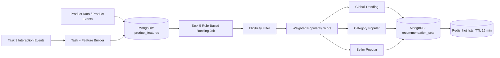
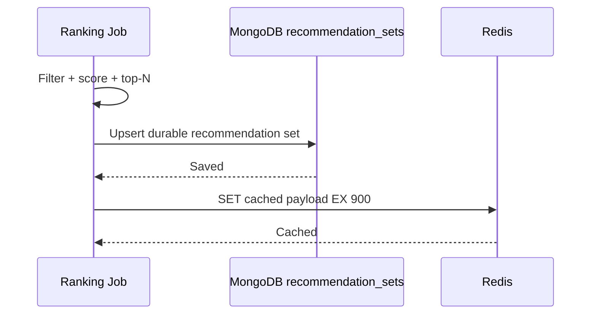
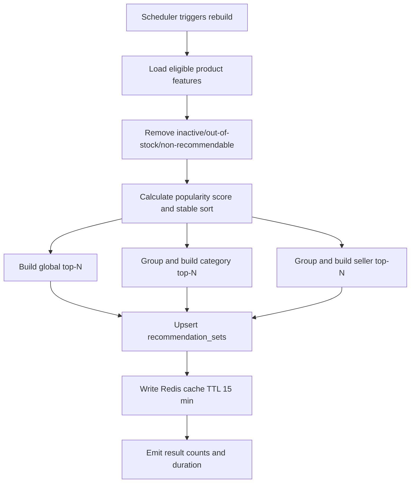
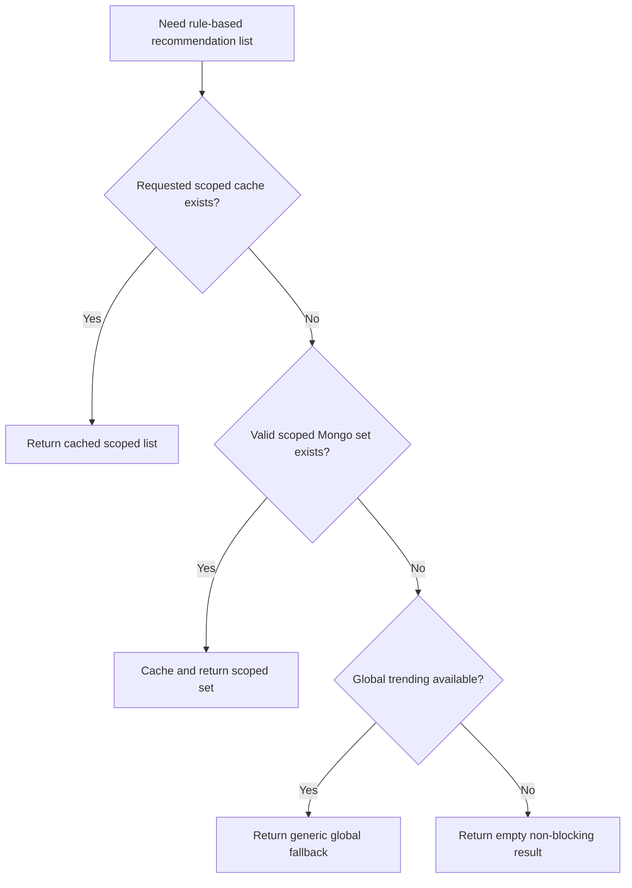
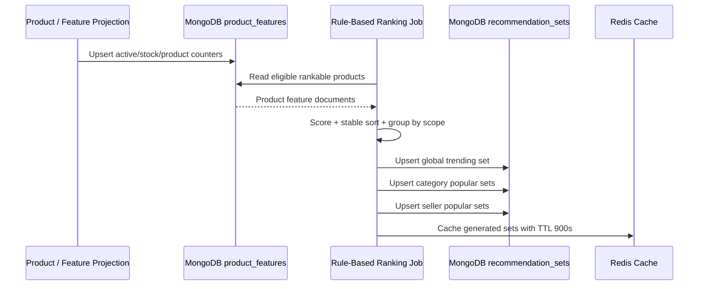

# 🧠 Recommendation Service - Task 5: Rule-Based MVP


## 📌 Task Summary

| Field | Detail |
|---|---|
| Task Name | Rule-based MVP |
| Source | `docs/01-micro-tasks.md` → `Recommendation Service` → Task 5 |
| Priority | `P1` core recommendation capability |
| Dependency | Product data; Task 4 ka `product_features` projection/counters isko ranking-friendly input deta hai |
| Main Goal | ML ke bina deterministic rules se `trending`, `category popular`, aur `seller popular` product lists generate karna |
| Durable Output | MongoDB `recommendation_db.recommendation_sets` |
| Fast Output | Redis cached top lists with default `15 min` TTL |
| Output Type | Structured implementation guide |
| Not Included | Personalized ranking, similar-product engine, frequently-bought-together logic, gRPC API, A/B testing hooks, ML/vector scoring |

> **Simple Hinglish goal:** Pehle ek predictable aur debuggable recommendation engine banao. Product ka stock/status safe ho, recent user activity se score nikle, phir global, category, aur seller scope me top products save aur cache ho jayein. ML baad me add ki ja sakti hai; Task 5 me uski zarurat nahi hai.

---

## ✅ Required Output Created

```text
TaskImplementation/
└── Recommendation Service/
    ├── task1.md
    ├── task2.md
    ├── task3.md
    ├── task4.md
    └── task5.md
```

### Why this structure?

- `TaskImplementation/` project ke service-wise implementation guides ka central folder hai.
- `Recommendation Service/` folder already available tha, isliye usko preserve kiya gaya.
- `task1.md` recommendation types, `task2.md` storage/cache, `task3.md` events, aur `task4.md` feature schema define karte hain.
- `task5.md` sirf **Recommendation Service - Task 5: Rule-based MVP** ka guide hai.
- Is output me backend service code, migration, API, ya ML implementation add nahi ki gayi; requested deliverable documentation file hi hai.

---

## 🧭 Documents and Existing Contracts Studied

| Source | Task 5 me kya use hua |
|---|---|
| `docs/01-micro-tasks.md` | Exact Task 5 boundary: trending, category popular, seller popular recommendations |
| `docs/04-microservice-design.md` | Recommendation responsibilities, MongoDB plus Redis choice, cold-start fallback |
| `docs/03-folder-structure.md` | Future Go placement: `internal/usecase/trending.go`, repositories, cache |
| `docs/12-logging-monitoring-scalability.md` | Redis recommendation TTL `15 min` and graceful degradation rule |
| `database/mongodb-schema-design.md` | `recommendation_sets` indexes and expiry model |
| `TaskImplementation/Recommendation Service/task4.md` | `product_features` counters/status flags as ranking inputs |
| `backend/services/recommendation-service/internal/domain/storage.go` | Existing `RecommendationSet`, Redis key builder, default cache TTL |
| `backend/services/recommendation-service/internal/domain/strategy.go` | Existing strategy ID convention and trending strategy IDs |
| `backend/services/recommendation-service/internal/repository/mongo_feature_repository.go` | Existing Mongo ownership and recommendation-set upsert/read pattern |

---

## 🧱 Task Boundary

### ✅ Included in Task 5

- Rule-based popularity score define karna
- Sirf recommendable, active, in-stock product candidates rank karna
- Global `trending` list generate karna
- `category popular` list generate karna
- `seller popular` list generate karna
- Stable ordering and deterministic tie-break rule define karna
- Generated results ko `recommendation_sets` me upsert karne ka design
- Redis hot cache keys aur `15 min` TTL ka use
- Fallback chain: scoped list → global trending → empty non-blocking response
- Suggested Go components, MongoDB queries, Redis usage, tests, metrics, aur run steps

### ❌ Not Included in Task 5

- User behavior profile based personalized ranking: **Task 6**
- `GetRecommendations(user_id, context)` gRPC/public serving contract: **Task 7**
- Strategy experiment assignment or conversion comparison hooks: **Task 8**
- Similar attributes ranking implementation
- Frequently bought together/co-occurrence ranking implementation
- Embedding generation, vector database, machine learning model, campaign boosting
- Product Service me CRUD ya event publisher implementation
- Frontend recommendation carousel/UI

> 🟢 **Scope rule:** Is MVP ka result teen generic top-list strategies tak limited rahega: global, category, aur seller popularity. Ye future recommendation modes ke fallback ke roop me useful ho sakta hai, lekin un modes ko yahan implement nahi kiya jayega.

---

## 🧩 Foundation From Previous Tasks

| Previous Task | Task 5 ko kya milta hai |
|---|---|
| Task 1: Types | `trending` type, contexts, strategy naming convention |
| Task 2: MongoDB + Redis | Durable result store aur low-latency cache strategy |
| Task 3: Event ingestion | View/cart/wishlist/purchase signals ka raw interaction source |
| Task 4: Feature store schema | Product-wise counters and eligibility/product metadata projection |

### Task 5 ka data contract

```text
Input:
  recommendation_db.product_features
  - product_id
  - category_id
  - seller_id
  - active / in-stock / recommendable status
  - recent counters: views, wishlist adds, cart adds, purchases

Output:
  recommendation_db.recommendation_sets
  Redis keys:
  - reco:v1:trending:global
  - reco:v1:trending:category:{category_id}
  - reco:v1:trending:seller:{seller_id}
```

---

## 🏗️ Architecture



### Hinglish explanation

1. Product projection se pata chalta hai kaunsa item active aur stock me hai.
2. Feature counters batate hain recent demand kitni hai.
3. Ranking job unsafe/out-of-stock candidates hata kar simple score calculate karta hai.
4. Same scored products ko teen scopes me top-N kiya jata hai: global, category, seller.
5. Result MongoDB me durable set ke roop me aur Redis me fast cached list ke roop me store hota hai.

---

## 🎯 MVP Strategies

| Strategy | Context Key Example | Redis Key | Use Case | Strategy ID |
|---|---|---|---|---|
| Global trending | `home:global` | `reco:v1:trending:global` | Homepage/cold start par currently popular products | `trending_v1_recent_activity` |
| Category popular | `category:cat_shoes` | `reco:v1:trending:category:cat_shoes` | Category listing me same category ke popular products | `trending_v1_fallback_category` |
| Seller popular | `seller:seller_456` | `reco:v1:trending:seller:seller_456` | Seller storefront me seller ke top products | `trending_v1_recent_activity` |

> 🟡 **Why seller strategy same ID use kar sakti hai?** Existing repository strategy IDs me seller-specific constant define nahi hai. Seller list bhi recent activity scoring ka scoped form hai, isliye `trending_v1_recent_activity` consistent choice hai. Metadata me `scope=seller` record kiya ja sakta hai.

---

## 🪜 Step-by-Step Implementation Guide

## Step 1: MVP inputs lock karo

Task 5 ko full user history ya ML features nahi chahiye. Isko product-level projection and aggregate counters chahiye.

### Required candidate fields

| Field | Required | Purpose |
|---|---:|---|
| `product_id` | Yes | Ranked item identity |
| `category_id` | Category strategy ke liye | Category list grouping |
| `seller_id` | Seller strategy ke liye | Seller list grouping |
| `status` | Yes | Published/active item hi recommend karna |
| `in_stock` or `stock_status` | Yes | Unavailable product serve na ho |
| `quality_flags.is_recommendable` | Recommended | Moderated/deleted/blocked product filter |
| `counters.views_24h` | Yes for activity score | Fresh attention signal |
| `counters.wishlist_adds_7d` | Recommended | Preference signal |
| `counters.cart_adds_7d` | Recommended | Strong intent signal |
| `counters.purchases_7d` | Yes for quality | Conversion signal |

### Example rankable feature document

```json
{
  "product_id": "prod_123",
  "category_id": "cat_shoes",
  "seller_id": "seller_456",
  "status": "active",
  "in_stock": true,
  "quality_flags": {
    "is_recommendable": true
  },
  "counters": {
    "views_24h": 180,
    "wishlist_adds_7d": 22,
    "cart_adds_7d": 31,
    "purchases_7d": 14
  },
  "updated_at": "2026-05-27T12:00:00Z"
}
```

### Kaise build hua?

- Task 4 ke `product_features` document ko ranking input maana gaya.
- Ranking job raw `user_interactions` ko har run me scan nahi karega; derived counters use karega.
- Product data dependency fulfill karne ke liye status, stock, category, aur seller projection mandatory rakhe gaye.

---

## Step 2: Eligibility filter pehle lagao

Popular product hona enough nahi hai. Deleted, inactive, hidden, ya out-of-stock item recommend karna bad UX aur business bug hoga.

### Eligibility rule

```text
eligible =
  status == "active"
  AND in_stock == true
  AND quality_flags.is_recommendable != false
  AND product_id is present
```

### MongoDB filter example

```javascript
db.product_features.find({
  status: "active",
  in_stock: true,
  "quality_flags.is_recommendable": { $ne: false }
})
```

### Go predicate example

```go
type RankableProduct struct {
	ProductID       string
	CategoryID      string
	SellerID        string
	Status          string
	InStock         bool
	IsRecommendable bool
	Views24h        int64
	WishlistAdds7d  int64
	CartAdds7d      int64
	Purchases7d     int64
}

func eligible(p RankableProduct) bool {
	return p.ProductID != "" &&
		p.Status == "active" &&
		p.InStock &&
		p.IsRecommendable
}
```

### Kaise build hua?

- Ranking ke before hard filters rakhe gaye, scoring ke after nahi.
- Isse high-score but unavailable product list me kabhi enter nahi karega.
- Product stock/status update hone par next rebuild fresh safe list generate karega; cached affected list ko invalidate bhi kiya ja sakta hai.

---

## Step 3: Simple weighted popularity score define karo

MVP scoring explainable honi chahiye. Strong purchase intent ko view se zyada weight diya jayega.

### Rule-based formula

```text
popularity_score =
    (views_24h        * 1)
  + (wishlist_adds_7d * 3)
  + (cart_adds_7d     * 4)
  + (purchases_7d     * 8)
```

| Signal | Weight | Hinglish Reason |
|---|---:|---|
| View in last 24h | `1` | Attention hai, lekin weak intent |
| Wishlist add in last 7d | `3` | Product pasand aaya, medium intent |
| Cart add in last 7d | `4` | Buy karne ke close signal |
| Purchase in last 7d | `8` | Real conversion, strongest signal |

### Example score calculation

```text
Product: prod_123
views_24h        = 180 * 1 = 180
wishlist_adds_7d =  22 * 3 =  66
cart_adds_7d     =  31 * 4 = 124
purchases_7d     =  14 * 8 = 112
--------------------------------
popularity_score           = 482
```

### Go scoring example

```go
func popularityScore(p RankableProduct) float64 {
	return float64(
		p.Views24h*1 +
			p.WishlistAdds7d*3 +
			p.CartAdds7d*4 +
			p.Purchases7d*8,
	)
}
```

### Kaise build hua?

- Task 3/4 me described signals ko only product-level recent counters ke form me use kiya gaya.
- Formula deterministic hai: same features ka same score aayega.
- Weight constants easy tuning ke liye future config me move ho sakte hain, par ML training/task expansion ki zarurat nahi.

---

## Step 4: Stable ranking and tie-break rule banao

Do products ka score same ho sakta hai. Random order UI flicker aur cache churn create karega.

### Sorting rule

```text
1. popularity_score descending
2. purchases_7d descending
3. product_id ascending
```

### Go ranking example

```go
type ScoredProduct struct {
	ProductID   string
	CategoryID  string
	SellerID    string
	Score       float64
	Purchases7d int64
}

func scoreAndSort(products []RankableProduct) []ScoredProduct {
	items := make([]ScoredProduct, 0, len(products))
	for _, product := range products {
		if !eligible(product) {
			continue
		}
		items = append(items, ScoredProduct{
			ProductID:   product.ProductID,
			CategoryID:  product.CategoryID,
			SellerID:    product.SellerID,
			Score:       popularityScore(product),
			Purchases7d: product.Purchases7d,
		})
	}

	sort.SliceStable(items, func(i, j int) bool {
		if items[i].Score != items[j].Score {
			return items[i].Score > items[j].Score
		}
		if items[i].Purchases7d != items[j].Purchases7d {
			return items[i].Purchases7d > items[j].Purchases7d
		}
		return items[i].ProductID < items[j].ProductID
	})
	return items
}
```

> Code file me use karte waqt `sort` standard library import karna hoga: `import "sort"`.

### Kaise build hua?

- First ordering score quality ko represent karta hai.
- Second ordering equal-score products me actual conversion favor karta hai.
- Final alphabetical ID tie-break stable aur reproducible output deta hai.

---

## Step 5: Global trending list generate karo

Global list homepage, anonymous visitor, ya scoped data missing hone par default safe result hai.

### Input and output

| Item | Value |
|---|---|
| Input candidates | All eligible `product_features` |
| Group filter | None |
| Result size | Example `12` products |
| Context key | `home:global` |
| Strategy ID | `trending_v1_recent_activity` |
| Cache key | `reco:v1:trending:global` |

### Pseudocode

```text
eligibleProducts = repository.ListEligibleProducts()
ranked = scoreAndSort(eligibleProducts)
topItems = first 12 ranked items
save RecommendationSet(context_key="home:global", items=topItems)
cache topItems at reco:v1:trending:global for 15 minutes
```

### Recommendation item reason

```json
{
  "product_id": "prod_123",
  "score": 482,
  "rank": 1,
  "reason": "global_recent_activity"
}
```

### Kaise build hua?

- Ye broadest list hai; category/seller field missing ho tab bhi candidate eligible ho sakta hai.
- Is list ko scoped strategy empty hone par fallback ke roop me reuse kiya ja sakta hai.

---

## Step 6: Category popular list generate karo

Category page par user ko unrelated global products dikhane ke bajay same category ke popular active items dikhne chahiye.

### Input and output

| Item | Value |
|---|---|
| Input candidates | Eligible products with matching `category_id` |
| Group key | `category_id` |
| Context key example | `category:cat_shoes` |
| Strategy ID | `trending_v1_fallback_category` |
| Cache key example | `reco:v1:trending:category:cat_shoes` |

### Go scope helper example

```go
func categoryCandidates(all []RankableProduct, categoryID string) []RankableProduct {
	candidates := make([]RankableProduct, 0)
	for _, product := range all {
		if product.CategoryID == categoryID && eligible(product) {
			candidates = append(candidates, product)
		}
	}
	return candidates
}
```

### Result example

```json
{
  "context_key": "category:cat_shoes",
  "recommendation_type": "trending",
  "strategy_id": "trending_v1_fallback_category",
  "items": [
    {
      "product_id": "prod_123",
      "score": 482,
      "rank": 1,
      "reason": "category_recent_activity"
    }
  ]
}
```

### Kaise build hua?

- Same popularity formula reuse hota hai; sirf candidates category scope se restricted hote hain.
- New scoring engine create nahi hota, isliye implementation small aur consistent rehti hai.
- Category me enough candidates na hon to global trending fallback use hota hai.

---

## Step 7: Seller popular list generate karo

Seller storefront par sirf us seller ke active, in-stock popular products return hone chahiye.

### Input and output

| Item | Value |
|---|---|
| Input candidates | Eligible products with matching `seller_id` |
| Group key | `seller_id` |
| Context key example | `seller:seller_456` |
| Strategy ID | `trending_v1_recent_activity` |
| Cache key example | `reco:v1:trending:seller:seller_456` |

### Go scope helper example

```go
func sellerCandidates(all []RankableProduct, sellerID string) []RankableProduct {
	candidates := make([]RankableProduct, 0)
	for _, product := range all {
		if product.SellerID == sellerID && eligible(product) {
			candidates = append(candidates, product)
		}
	}
	return candidates
}
```

### Result reason example

```json
{
  "product_id": "prod_789",
  "score": 230,
  "rank": 1,
  "reason": "seller_recent_activity"
}
```

### Kaise build hua?

- Seller scope Product data dependency ka direct use hai.
- Seller ka product out-of-stock ho to usko score high hone ke bawajood exclude kiya jata hai.
- Seller list empty hone par global trending safe fallback hai; dusre seller ke product ko seller-specific set me silently mix nahi karna.

---

## Step 8: Reusable ranker design rakho

Teen strategies ke liye duplicate logic avoid karne ke liye ek simple scope-driven ranker enough hai.

### Suggested domain types

```go
type Scope string

const (
	ScopeGlobal   Scope = "global"
	ScopeCategory Scope = "category"
	ScopeSeller   Scope = "seller"
)

type RankRequest struct {
	Scope    Scope
	ScopeID  string
	Limit    int
	Now      time.Time
}
```

### Suggested use-case shape

```go
type FeatureReader interface {
	ListEligibleProducts(ctx context.Context) ([]RankableProduct, error)
}

type RecommendationSetWriter interface {
	UpsertRecommendationSet(ctx context.Context, set domain.RecommendationSet) error
}

type ResultCache interface {
	Set(ctx context.Context, key string, value domain.CachedRecommendation, ttl time.Duration) error
}

type TrendingService struct {
	features FeatureReader
	sets     RecommendationSetWriter
	cache    ResultCache
	ttl      time.Duration
	limit    int
}
```

### Kaise build hua?

- Score function common hai.
- `Scope` only filtering, keys, aur reason metadata decide karta hai.
- Storage and cache interfaces test me fake implementations allow karte hain.
- Ye design Task 5 tak limited rehta hai; user-specific request/transport add nahi karta.

---

## Step 9: `recommendation_sets` me durable result upsert karo

Generated list MongoDB me store karne se Redis miss ya restart ke baad bhi last valid result recover ho sakta hai.

### Existing-compatible recommendation set document

```json
{
  "_id": "reco_trending_global_20260527T120000Z",
  "context_key": "home:global",
  "recommendation_type": "trending",
  "strategy_id": "trending_v1_recent_activity",
  "items": [
    {
      "product_id": "prod_123",
      "score": 482,
      "rank": 1,
      "reason": "global_recent_activity"
    }
  ],
  "metadata": {
    "scope": "global",
    "formula_version": "popularity_v1",
    "limit": "12"
  },
  "generated_at": "2026-05-27T12:00:00Z",
  "expires_at": "2026-05-27T12:15:00Z"
}
```

### Required MongoDB indexes

```javascript
db.recommendation_sets.createIndex(
  { context_key: 1, strategy_id: 1 },
  { unique: true }
)

db.recommendation_sets.createIndex(
  { expires_at: 1 },
  { expireAfterSeconds: 0 }
)
```

### Upsert concept

```javascript
db.recommendation_sets.updateOne(
  {
    context_key: "home:global",
    strategy_id: "trending_v1_recent_activity"
  },
  {
    $set: {
      recommendation_type: "trending",
      items: [],
      metadata: { scope: "global", formula_version: "popularity_v1" },
      generated_at: ISODate("2026-05-27T12:00:00Z"),
      expires_at: ISODate("2026-05-27T12:15:00Z")
    },
    $setOnInsert: {
      _id: "reco_trending_global_20260527T120000Z"
    }
  },
  { upsert: true }
)
```

### Kaise build hua?

- `context_key + strategy_id` unique identity banata hai: current list replace hoti hai, duplicate active sets nahi bante.
- `expires_at` stale generated lists ko automatically clean karne me help karta hai.
- Metadata debugging ke liye formula aur scope batata hai; user personal data store nahi hota.

---

## Step 10: Redis me hot lists cache karo

MongoDB durable hai, par page-load recommendation reads ke liye Redis faster serving layer hai.

### Cache design

| List | Redis Key | TTL |
|---|---|---:|
| Global trending | `reco:v1:trending:global` | `900 sec` / 15 min |
| Category popular | `reco:v1:trending:category:{category_id}` | `900 sec` / 15 min |
| Seller popular | `reco:v1:trending:seller:{seller_id}` | `900 sec` / 15 min |

### Go cache-key usage example

```go
builder, err := domain.NewCacheKeyBuilder("reco:v1", 128)
if err != nil {
	return err
}

globalKey := builder.TrendingGlobalKey()
categoryKey, err := builder.TrendingCategoryKey("cat_shoes")
sellerKey, err := builder.TrendingSellerKey("seller_456")
```

### Write flow



### Kaise build hua?

- Durable write pehle hoti hai, taaki Redis cached result source-of-truth se ahead na chale.
- Redis write fail ho jaye to MongoDB set valid rehta hai; error metric/log record karo.
- TTL docs ke recommended `15 min` cache policy ko follow karta hai.

---

## Step 11: Generation schedule and refresh flow define karo

MVP ke liye request ke time full ranking calculate karna avoid karo. Periodic generation predictable aur cheap hai.

### Recommended beginner-friendly schedule

| Work | Frequency | Why |
|---|---:|---|
| Global trending rebuild | Every `15 min` | Homepage list fresh rahe |
| Active category lists rebuild | Every `15 min` | Category browsing fresh rahe |
| Active seller lists rebuild | Every `15 min` | Seller storefront fresh rahe |
| Stock/status change invalidation | Event-driven best effort | Unavailable item jaldi remove ho |

### Refresh flow



### Kaise build hua?

- Ranking computation write-time par hoti hai, read-time par nahi.
- TTL aur rebuild frequency same rakhne se expired cache ke long gaps reduce hote hain.
- Very large catalog me sab categories/sellers ke bajay recently active scopes rebuild kiye ja sakte hain.

---

## Step 12: Fallback and failure behavior define karo

Recommendation service customer journey ko block nahi karegi.

### Fallback chain

| Request Intent | Primary List | Primary Empty/Expired Ho To | Final Safe Behavior |
|---|---|---|---|
| Homepage / cold start | Global trending | Last valid cached global set | Empty result / section hide |
| Category browse | Category popular | Global trending | Empty result / section hide |
| Seller store | Seller popular | Global trending displayed as generic fallback only | Empty result / section hide |

### Fallback diagram



### Kaise build hua?

- Category/seller candidates unavailable hone par product page ya storefront fail nahi hota.
- Generic fallback ko metadata/reason se identify karna useful hai, taaki UI/analytics usko wrong seller list na samjhein.
- Checkout/order/payment flow recommendation failure se kabhi block nahi hona chahiye.

---

## Step 13: Suggested implementation folder structure

Ye **Task 5 code implement karne ke time** focused folder structure hogi. Is guide ke output me ye code files create nahi kiye gaye.

```text
backend/
└── services/
    └── recommendation-service/
        ├── cmd/
        │   └── server/
        │       └── main.go                       # Existing wiring; ranking job register later
        ├── internal/
        │   ├── domain/
        │   │   ├── recommendation.go             # Existing output models/types
        │   │   ├── storage.go                    # Existing set/cache models and keys
        │   │   └── ranking.go                    # Task 5 scoring/scope models
        │   ├── usecase/
        │   │   ├── contracts.go                  # Feature reader/set writer/cache interfaces
        │   │   ├── trending.go                   # Task 5 global/category/seller generation
        │   │   └── trending_test.go              # Scoring, eligibility, fallback tests
        │   └── repository/
        │       ├── mongo_feature_repository.go   # Candidate reads and set upsert
        │       └── redis_recommendation_cache.go # Existing hot-cache adapter
        └── migrations/
            └── 00x_task5_ranking_indexes.up.js   # Only if counter query indexes are missing
```

### File responsibility

| File | Task 5 Responsibility |
|---|---|
| `domain/ranking.go` | Scope, weights, rank candidate/result domain values |
| `usecase/trending.go` | Eligibility, scoring, grouping, sorting, saving, caching orchestration |
| `usecase/trending_test.go` | Rule correctness and no-unavailable-products tests |
| `repository/mongo_feature_repository.go` | Eligible `product_features` queries and `recommendation_sets` writes |
| `repository/redis_recommendation_cache.go` | Top-list cache write/read with TTL |

---

## Step 14: Repository query strategy

Small MVP catalog me eligible products fetch karke Go me score/sort karna simple hota hai. Catalog grow hone par Mongo aggregation se top-N pre-filter kar sakte hain.

### Option A: Beginner-friendly Go ranking

```text
Mongo reads eligible product feature documents
→ Go calculates score
→ Go groups and sorts
→ Top-N sets stored
```

### Option B: Larger catalog MongoDB aggregation

```javascript
db.product_features.aggregate([
  {
    $match: {
      status: "active",
      in_stock: true,
      "quality_flags.is_recommendable": { $ne: false }
    }
  },
  {
    $set: {
      popularity_score: {
        $add: [
          { $multiply: [{ $ifNull: ["$counters.views_24h", 0] }, 1] },
          { $multiply: [{ $ifNull: ["$counters.wishlist_adds_7d", 0] }, 3] },
          { $multiply: [{ $ifNull: ["$counters.cart_adds_7d", 0] }, 4] },
          { $multiply: [{ $ifNull: ["$counters.purchases_7d", 0] }, 8] }
        ]
      }
    }
  },
  { $sort: { popularity_score: -1, "counters.purchases_7d": -1, product_id: 1 } },
  { $limit: 12 }
])
```

### Kaise build hua?

- Start simple: Go logic unit-test friendly hai.
- Same formula Mongo aggregation me translate ho sakti hai jab catalog volume demand kare.
- Aggregation me bhi exact eligibility and tie-break same rehna chahiye, warna result inconsistency hogi.

---

## Step 15: Unit tests and validation cases likho

Rule-based MVP ka biggest advantage hai ki expected outcomes easily test ho sakte hain.

### Required test cases

| Test | Expected Result |
|---|---|
| Purchase-heavy item vs view-only item | Purchase-heavy item higher rank par aaye |
| Inactive high-score product | Result me na aaye |
| Out-of-stock high-score product | Result me na aaye |
| Non-recommendable product | Result me na aaye |
| Same score, different purchases | Higher purchases first |
| Same score and purchases | Lexicographic `product_id` stable order |
| Category scope | Other category product exclude ho |
| Seller scope | Other seller product exclude ho |
| Fewer than requested items | Available items safely return hon |
| No scoped candidates | Global fallback attempt ho |
| Mongo save fails | Cache stale/new result publish na ho; error return/log ho |
| Redis write fails after Mongo save | Durable set remains; best-effort cache error measured ho |

### Go unit test example

```go
func TestScoreAndSortExcludesUnavailableAndRanksPurchaseSignal(t *testing.T) {
	products := []RankableProduct{
		{ProductID: "views", Status: "active", InStock: true, IsRecommendable: true, Views24h: 100},
		{ProductID: "paid", Status: "active", InStock: true, IsRecommendable: true, Purchases7d: 20},
		{ProductID: "sold-out", Status: "active", InStock: false, IsRecommendable: true, Purchases7d: 1000},
	}

	got := scoreAndSort(products)

	if len(got) != 2 {
		t.Fatalf("got %d items, want 2", len(got))
	}
	if got[0].ProductID != "paid" {
		t.Fatalf("rank 1 = %q, want paid", got[0].ProductID)
	}
}
```

### Kaise build hua?

- Tests formula ko validate karte hain, sirf happy path ko nahi.
- Eligibility tests revenue-impacting stale-stock issue catch karte hain.
- Failure tests ensure karte hain ki cache/durable store order safe hai.

---

## Step 16: Observability add karo

Simple rules bhi monitor hone chahiye; warna empty/stale lists unnoticed rahengi.

### Useful metrics

| Metric | Type | Purpose |
|---|---|---|
| `recommendation_ranking_job_runs_total` | Counter | Kitne rebuild runs complete/failed hue |
| `recommendation_ranking_job_duration_ms` | Histogram | Generation latency |
| `recommendation_ranking_candidates_total` | Gauge | Eligible candidate volume by scope |
| `recommendation_ranking_items_generated_total` | Counter | Generated items by scope |
| `recommendation_empty_set_total` | Counter | Category/seller/global list empty detection |
| `recommendation_set_upsert_errors_total` | Counter | Durable store write failure |
| `recommendation_cache_set_errors_total` | Counter | Redis cache publish failure |
| `recommendation_fallback_total` | Counter | Scoped list se global fallback frequency |

### Structured log example

```json
{
  "level": "info",
  "service": "recommendation-service",
  "event": "rule_based_set_generated",
  "scope": "category",
  "scope_id": "cat_shoes",
  "strategy_id": "trending_v1_fallback_category",
  "formula_version": "popularity_v1",
  "candidate_count": 84,
  "result_count": 12,
  "ttl_seconds": 900,
  "duration_ms": 24
}
```

### Kaise build hua?

- Logs me IDs/scopes hote hain, email/phone/address jaise sensitive user fields nahi.
- Empty-set and fallback metrics product projection/counter gaps quickly expose karte hain.
- Duration aur cache failure metrics scaling/availability decisions me useful hain.

---

## Step 17: Privacy, safety, and reliability rules

| Rule | Why |
|---|---|
| Only product aggregate signals rank karo | Task 5 generic popular lists hai; personal data required nahi |
| No raw PII in results/cache | Redis/Mongo sets me product IDs and score metadata enough hain |
| Stock/status filter mandatory | Out-of-stock/deleted recommendations prevent hoti hain |
| Stable ranking | UI flicker and unnecessary cache change reduce hota hai |
| Mongo save before Redis cache | Durable truth cache se consistent rahe |
| Recommendation failure non-blocking | Product/order/checkout journey available rahe |
| Formula version metadata store karo | Score rules change hone par debugging possible ho |

---

## 🧰 External Libraries and Tools

Task 5 me **koi ML library required nahi hai**. Existing Go service stack ke compatible tools enough hain.

### 1. Go Standard Library

| Detail | Value |
|---|---|
| What | `sort`, `context`, `time`, `testing` packages |
| Why used | Stable sort, cancellation/timeouts, TTL timestamps, unit testing |
| Install | Go ke saath included; separate install nahi |
| Use | `sort.SliceStable(...)`, `go test ./...` |

### 2. MongoDB

| Detail | Value |
|---|---|
| What | Document database; `recommendation_db.product_features` aur `recommendation_sets` store |
| Why used | Feature docs flexible hain aur generated sets durable chahiye |
| Install locally | Docker example: `docker run -d --name recommendation-mongo -p 27017:27017 mongo:7` |
| Use | `mongosh "mongodb://localhost:27017/recommendation_db"` |

### 3. Official MongoDB Go Driver v2

| Detail | Value |
|---|---|
| What | Go se MongoDB query/upsert karne ki official library |
| Why used | Eligible feature reads aur recommendation set upsert ke liye typed client |
| Install | `go get go.mongodb.org/mongo-driver/v2/mongo` |
| Existing module version | `go.mongodb.org/mongo-driver/v2 v2.6.0` |
| Use | `collection.Find(...)`, `collection.UpdateOne(..., options.UpdateOne().SetUpsert(true))` |

### 4. Redis

| Detail | Value |
|---|---|
| What | In-memory cache store |
| Why used | Generated top lists ko low-latency serving ke liye cache karna |
| Install locally | Docker example: `docker run -d --name recommendation-redis -p 6379:6379 redis:7-alpine` |
| Use | `redis-cli GET reco:v1:trending:global` |

### 5. `go-redis/v9`

| Detail | Value |
|---|---|
| What | Go Redis client library |
| Why used | JSON cached recommendations ko `SET` with TTL aur `GET` se handle karne ke liye |
| Install | `go get github.com/redis/go-redis/v9` |
| Existing module version | `github.com/redis/go-redis/v9 v9.19.0` |
| Use | `client.Set(ctx, key, payload, 15*time.Minute).Err()` |

### Optional local command flow

```bash
cd backend/services/recommendation-service
go mod tidy
go test ./...
```

> 🟣 **Note:** Commands yahan implementation guide ke liye diye gaye hain. Task 5 documentation output create karte waqt dependencies install ya service code modify nahi kiya gaya.

---

## ⚙️ Suggested Configuration

Existing cache settings ko Task 5 generation me reuse kiya ja sakta hai:

```dotenv
RECOMMENDATION_MONGO_DATABASE=recommendation_db
RECOMMENDATION_CACHE_KEY_PREFIX=reco:v1
RECOMMENDATION_CACHE_TTL_SECONDS=900
RECOMMENDATION_DEFAULT_LIMIT=12

# Task 5 implementation ke time add kiye ja sakne wale ranking settings
RECOMMENDATION_RANKING_REBUILD_INTERVAL=15m
RECOMMENDATION_RANKING_VIEW_24H_WEIGHT=1
RECOMMENDATION_RANKING_WISHLIST_7D_WEIGHT=3
RECOMMENDATION_RANKING_CART_7D_WEIGHT=4
RECOMMENDATION_RANKING_PURCHASE_7D_WEIGHT=8
```

### Configuration rule

```text
Default formula code/constants me understandable rakho.
Tuning required ho tab controlled config add karo.
Formula version metadata update kiye bina weights silently change mat karo.
```

---

## 🔄 End-to-End MVP Flow



### Beginner-friendly summary

```text
Product available hai?
  nahi  → exclude
  haan  → recent activity score nikalo

Score ready hai?
  global list me rank karo
  matching category list me rank karo
  matching seller list me rank karo

Top list ready hai?
  MongoDB me save karo
  Redis me 15 minute cache karo
```

---

## ✅ Validation Checklist

| Check | Status |
|---|---|
| `TaskImplementation/Recommendation Service/` folder preserved | ✅ Done |
| `task5.md` created | ✅ Done |
| Scope limited to Task 5 rule-based MVP | ✅ Done |
| Global trending strategy documented | ✅ Done |
| Category popular strategy documented | ✅ Done |
| Seller popular strategy documented | ✅ Done |
| Product eligibility filtering documented | ✅ Done |
| Weighted score and stable ordering explained | ✅ Done |
| MongoDB result persistence documented | ✅ Done |
| Redis keys and 15-minute TTL documented | ✅ Done |
| Failure/fallback behavior documented | ✅ Done |
| External libraries/tools with installation/use documented | ✅ Done |
| Suggested code structure and examples documented | ✅ Done |
| Architecture and flow diagrams added in Mermaid | ✅ Done |
| Personalized/API/A-B/ML implementation excluded | ✅ Done |

---

## 🧾 Final Task 5 Summary

Recommendation Service Task 5 ke rule-based MVP ka focused design ye hai:

```text
Eligible active + in-stock product features
        ↓
Explainable recent-activity popularity score
        ↓
Three generated lists only:
  1. Global trending
  2. Category popular
  3. Seller popular
        ↓
MongoDB recommendation_sets + Redis 15-minute cache
```

### Key decisions

- `product_features` ranking input hai; Product Service DB ko direct cross-service query nahi karna.
- Formula `views`, `wishlist`, `cart`, aur `purchase` counters ka simple weighted sum hai.
- Every list availability-safe filter aur deterministic tie-break use karegi.
- MongoDB durable generated result store hai; Redis fast cache layer hai.
- Scoped list empty hone par global trending fallback use ho sakta hai.
- Task 5 me personalization, gRPC endpoint, A/B testing, ya ML add nahi kiya jata.

**Next planned task, is scope ke baad:** Recommendation Service - Task 6: Personalized ranking.
