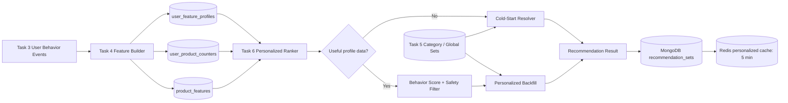
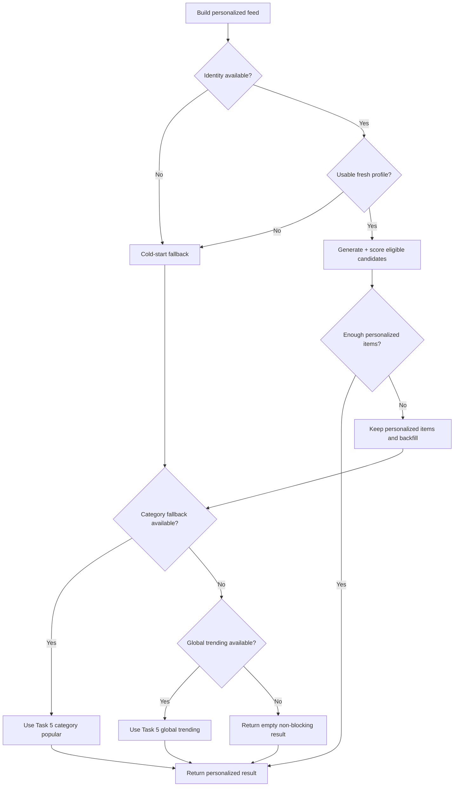
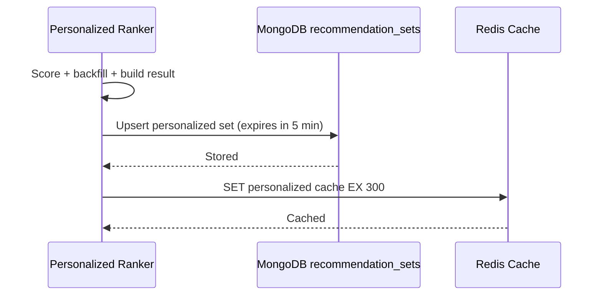
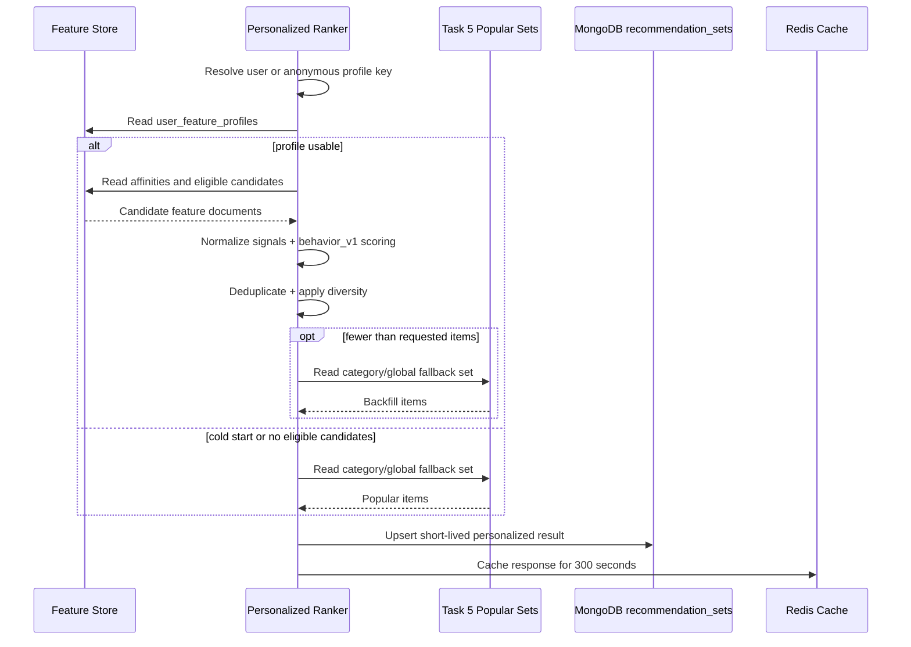

# 🧠 Recommendation Service - Task 6: Personalized Ranking


## 📌 Task Summary

| Field | Detail |
|---|---|
| Task Name | Personalized ranking |
| Source | `docs/01-micro-tasks.md` → `Recommendation Service` → Task 6 |
| Priority | `P2` personalization capability |
| Dependency | Task 4 feature store schema; Task 5 generic trending/category/seller lists fallback provide karte hain |
| Main Goal | User ya anonymous visitor ke behavior features se products score aur rank karna |
| Mandatory Rule | Profile/history missing ya weak ho to cold-start fallback return karna |
| Default Strategy ID | `personalized_v1_behavior` |
| Durable Output | MongoDB `recommendation_db.recommendation_sets` me short-lived generated personalized set |
| Fast Output | Redis personalized cache, existing policy ke mutabik default `5 min` TTL |
| Output Type | Structured implementation guide |
| Not Included | gRPC/public endpoint, A/B assignment hooks, ML embeddings/vector ranking, frontend UI |

> **Simple Hinglish goal:** Har user ko same products dikhane ke bajay uske recent interest signals, jaise category, seller, brand, price range, view, wishlist aur cart behavior, use karke relevant products upar rank karo. Agar user naya hai ya useful history available nahi hai, to recommendation empty ya random nahi honi chahiye; Task 5 ke safe popular lists par fallback mandatory hai.

---

## ✅ Required Output Created

```text
TaskImplementation/
└── Recommendation Service/
    ├── task1.md
    ├── task2.md
    ├── task3.md
    ├── task4.md
    ├── task5.md
    └── task6.md
```

### Why this structure?

- `TaskImplementation/` service-wise implementation guides ka central folder hai.
- `Recommendation Service/` folder already available tha, isliye preserve kiya gaya.
- `task1.md` types, `task2.md` storage/cache, `task3.md` event ingestion, `task4.md` features, aur `task5.md` generic fallback lists define karte hain.
- `task6.md` sirf **Recommendation Service - Task 6: Personalized Ranking** ka implementation guide hai.
- Is deliverable me backend source code, migration, API route, ya ML model create nahi kiya gaya; requested output documentation file hi hai.

---

## 🧭 Documents and Contracts Studied

| Source | Task 6 me kya use hua |
|---|---|
| `docs/01-micro-tasks.md` | Exact boundary: user behavior based scoring aur mandatory cold-start fallback |
| `docs/04-microservice-design.md` | Recommendation responsibilities, MongoDB + Redis, cold-start fallback direction |
| `docs/03-folder-structure.md` | Proposed `internal/usecase/personalized.go` placement |
| `docs/05-database-design.md` | Recommendation database ownership: MongoDB + Redis |
| `docs/12-logging-monitoring-scalability.md` | Recommendations non-blocking hain; cached trending/hide-section degradation |
| `database/mongodb-schema-design.md` | Base `recommendation_db` and `recommendation_sets` indexes |
| `TaskImplementation/Recommendation Service/task1.md` | `personalized` type, home-feed context, strategy naming, fallback idea |
| `TaskImplementation/Recommendation Service/task2.md` | Redis personalized keys and shorter dynamic-list TTL idea |
| `TaskImplementation/Recommendation Service/task3.md` | View/cart/wishlist/purchase behavior events and signal weights |
| `TaskImplementation/Recommendation Service/task4.md` | `user_feature_profiles`, `user_product_counters`, `product_features` input schemas |
| `TaskImplementation/Recommendation Service/task5.md` | Global/category/seller popular generated sets used as fallback |
| `backend/services/recommendation-service/internal/domain/strategy.go` | Existing `StrategyPersonalizedBehavior = "personalized_v1_behavior"` |
| `backend/services/recommendation-service/internal/domain/storage.go` | Existing personalized cache key builders and `5 min` TTL policy |

---

## 🧱 Task Boundary

### ✅ Included in Task 6

- Logged-in user aur anonymous visitor ke liye profile identity rule define karna
- Task 4 feature-store inputs se behavior signals read karna
- Personalized candidate generation design karna
- Candidate ke liye active/in-stock/recommendable eligibility enforce karna
- Behavior-based explainable scoring formula define karna
- Negative behavior aur duplicate-product handling define karna
- Stable rank ordering and reason strings define karna
- Cold-start detection and mandatory fallback chain implement karne ka design
- Partially filled personalized feed ko safe popular products se backfill karna
- MongoDB generated set and Redis short-lived cache usage define karna
- Suggested Go files, interfaces, examples, tests, metrics, security and configuration explain karna

### ❌ Not Included in Task 6

- `GetRecommendations(user_id, context)` gRPC/public endpoint banana: **Task 7**
- Analytics strategy assignment ya conversion experiment compare karna: **Task 8**
- `similar_products` ya `frequently_bought_together` algorithm banana
- ML model train karna, embedding generate karna, ya vector database query karna
- Feature ingestion/build job ko implement karna: **Task 3/4 foundation**
- Task 5 ke trending/category/seller calculation ko re-implement karna
- Product, Order, Wishlist, Session, ya frontend service me changes karna

> 🟢 **Scope rule:** Task 6 ek explainable behavior-based personalized ranker hai. Iska fallback Task 5 ke already-defined popular sets ko consume karega; naya generic ranking engine, transport layer, ya experiment system nahi banayega.

---

## 🧩 Foundation From Previous Tasks

| Previous Task | Task 6 ko kya milta hai |
|---|---|
| Task 1: Recommendation types | `personalized` mode, `home_feed` intent, `personalized_v1_behavior` strategy |
| Task 2: MongoDB + Redis | Durable recommendation set aur personalized Redis key pattern |
| Task 3: Event ingestion | `product_view`, `wishlist_add/remove`, `add_to_cart`, `purchase` signals |
| Task 4: Feature store | User profile affinity, user-product counters, eligible product features |
| Task 5: Rule-based MVP | Cold-start ke liye category/global trending result sets |

### Task 6 data contract

```text
Primary inputs:
  recommendation_db.user_feature_profiles
  - profile_key: user:{user_id} or anon:{anonymous_id}
  - category_scores, seller_scores, brand_scores, price_affinity
  - recent_products, last_event_at

  recommendation_db.user_product_counters
  - profile_key + product_id
  - weighted_score_input
  - counters.views / wishlist_adds / wishlist_removes / cart_adds / purchases

  recommendation_db.product_features
  - product_id, category_id, seller_id, brand_id, price.bucket
  - status / stock / quality_flags.is_recommendable
  - product popularity counters

Fallback inputs from Task 5:
  recommendation_db.recommendation_sets
  - category popular set, where context has category
  - global trending set

Outputs:
  recommendation_db.recommendation_sets
  - context_key: home:user:{user_id} or home:anon:{anonymous_id}
  - recommendation_type: personalized
  - strategy_id: personalized_v1_behavior

  Redis cache:
  - reco:v1:personalized:user:{user_id}
  - reco:v1:personalized:anon:{anonymous_id}
  - default personalized/guest TTL: 5 minutes
```

> 🟡 **Implementation note:** `user_feature_profiles` aur `user_product_counters` Task 4 ke feature-store design ka hissa hain. Existing codebase me base recommendation set/cache contract available hai; Task 6 code implement karte waqt repository ko in feature collections ke reads ke liye extend karna hoga.

---

## 🏗️ High-Level Architecture



### Hinglish explanation

1. Event ingestion se user actions collect hote hain.
2. Feature store raw actions ko compact user preferences aur product counters me convert karta hai.
3. Personalized ranker profile ke liked categories/sellers/brands ke eligible products laata hai.
4. Ranker behavior score calculate karke best products choose karta hai.
5. History weak ho ya personalized items kam hon, Task 5 popular lists se fallback/backfill hota hai.
6. Generated list MongoDB me short-lived durable form me aur Redis me fast read ke liye cache hoti hai.

---

## 🎯 Personalization Decisions

| Decision | Choice | Reason |
|---|---|---|
| Initial algorithm | Rule-based behavioral score | Beginner-friendly, explainable, ML dependency nahi |
| Primary context | `home_feed` / "Recommended for you" | Task 1 me personalized ka strongest use case |
| Identity | Logged-in: `user:{id}`; guest: `anon:{id}` | Task 4 feature keys ke compatible |
| Candidates | User preference matched eligible products + fallback popular items | Relevant aur always-safe feed |
| Availability rule | Active, in-stock, recommendable products only | Sold-out/blocked item recommend na ho |
| Strategy ID | `personalized_v1_behavior` | Existing domain strategy contract |
| Personalized cache TTL | `5 min` | Behavior fast change kar sakta hai; existing policy available hai |
| Cold-start | Category popular → global trending → empty non-blocking result | Requirement mandatory; Task 5 lists reusable hain |
| ML/vector scoring | Excluded | Task requirement behavior scoring hai, advanced ML nahi |

---

## 🪜 Step-by-Step Implementation Guide

## Step 1: Personalized request intent aur output lock karo

Task 6 transport endpoint create nahi karta. Is stage par internal ranker ka input/output contract define karo, jise Task 7 later gRPC method se call kar sakega.

### Internal input

| Field | Required | Why |
|---|---:|---|
| `user_id` or `anonymous_id` | Personalized attempt ke liye at least one | Kis profile ko read karna hai |
| `context` | Yes | Initially `home_feed` personalize karna |
| `category_id` | Optional | Cold-start/category-aware fallback ke liye |
| `limit` | Yes/defaultable | Top-N products return karne ke liye |
| `now` | Internal/testable | Freshness, expiry, deterministic testing ke liye |

### Output

```json
{
  "context_key": "home:user:user_123",
  "recommendation_type": "personalized",
  "strategy_id": "personalized_v1_behavior",
  "items": [
    {
      "product_id": "prod_987",
      "score": 82.4,
      "rank": 1,
      "reason": "preferred_category_and_cart_affinity"
    }
  ],
  "metadata": {
    "profile_key": "user:user_123",
    "formula_version": "behavior_v1",
    "fallback_used": "false"
  }
}
```

### Kaise build hua?

- Existing `RecommendationSet` output model product IDs, scores, ranks and reasons already support karta hai.
- Strategy existing constant se compatible rakhi gayi: `personalized_v1_behavior`.
- Public HTTP/gRPC request shape yahan implement nahi hoti, kyunki wo Task 7 ka scope hai.

---

## Step 2: Profile identity resolve karo

Feature store ko stable identity key chahiye. Logged-in user ke liye account-level history guest cookie se stronger hoti hai.

### Identity priority

| Condition | `profile_key` | Cache key |
|---|---|---|
| `user_id` present | `user:user_123` | `reco:v1:personalized:user:user_123` |
| No `user_id`, `anonymous_id` present | `anon:anon_456` | `reco:v1:personalized:anon:anon_456` |
| Dono missing | No personalized profile | Cold-start fallback |

### Proposed Go helper

```go
type ProfileIdentity struct {
	ProfileKey string
	UserID     string
	AnonymousID string
	IsGuest    bool
}

func resolveProfileIdentity(userID, anonymousID string) (ProfileIdentity, bool) {
	userID = strings.TrimSpace(userID)
	anonymousID = strings.TrimSpace(anonymousID)

	if userID != "" {
		return ProfileIdentity{
			ProfileKey: "user:" + userID,
			UserID:     userID,
		}, true
	}
	if anonymousID != "" {
		return ProfileIdentity{
			ProfileKey:  "anon:" + anonymousID,
			AnonymousID: anonymousID,
			IsGuest:     true,
		}, true
	}
	return ProfileIdentity{}, false
}
```

### Kaise build hua?

- `profile_key` Task 4 ke user/guest feature documents ke convention ko reuse karta hai.
- Login ke baad guest history merge karna useful future enhancement ho sakta hai, par Task 6 MVP ka mandatory hissa nahi hai.
- Email, phone, address ya koi raw PII profile identity me use nahi hoti.

---

## Step 3: Useful behavior history check karo

Identity available hona aur meaningful personalization available hona same baat nahi hai. New user ka profile empty ho sakta hai; stale history irrelevant ho sakti hai.

### Recommended MVP readiness rule

```text
profile is usable when:
  profile exists
  AND last_event_at is not stale
  AND (
    at least one positive category/seller/brand score exists
    OR at least 3 positive recent interactions exist
  )
```

### Example configuration

| Setting | Suggested Default | Why |
|---|---:|---|
| `MIN_POSITIVE_INTERACTIONS` | `3` | Ek accidental click par over-personalization avoid hoti hai |
| `PROFILE_MAX_AGE_DAYS` | `30` | Bahut purani preference ko blindly trust na karo |
| Positive actions | View, wishlist add, cart add, purchase | User interest signals |
| Negative action | Wishlist remove | Score reduce karna |

### Cold-start triggers

| Situation | Behavior |
|---|---|
| User/anonymous ID missing | Direct fallback |
| Feature profile not found | Direct fallback |
| Profile empty or only negative signals | Direct fallback |
| Profile older than acceptable freshness window | Direct fallback or backfill-first mode |
| Candidate query returns no eligible products | Fallback |

### Kaise build hua?

- Requirement specifically cold-start fallback mandatory bolta hai; isliye "identity exists" ko success assume nahi kiya gaya.
- Threshold configuration me rakhne se production behavior tune ho sakta hai without formula rewrite.

---

## Step 4: Behavior feature inputs read karo

Ranker raw event history ko request-by-request scan nahi karega. Task 4 ke aggregated features read karega.

### Profile-level features

```json
{
  "profile_key": "user:user_123",
  "category_scores": {
    "cat_shoes": 42.5,
    "cat_sports": 18.0
  },
  "seller_scores": {
    "seller_456": 21.0
  },
  "brand_scores": {
    "brand_789": 15.5
  },
  "price_affinity": {
    "preferred_buckets": ["2000_2999", "3000_4999"]
  },
  "last_event_at": "2026-05-27T10:35:00Z"
}
```

### Direct user-product features

```json
{
  "profile_key": "user:user_123",
  "product_id": "prod_987",
  "weighted_score_input": 12,
  "counters": {
    "views": 5,
    "wishlist_adds": 1,
    "wishlist_removes": 0,
    "cart_adds": 1,
    "purchases": 0
  },
  "last_interaction_at": "2026-05-27T10:35:00Z"
}
```

### Product candidate features

| Field | Use |
|---|---|
| `product_id` | Result item identity |
| `category_id` | Category affinity lookup |
| `seller_id` | Seller affinity lookup |
| `brand_id` | Brand affinity lookup |
| `price.bucket` | Preferred price match |
| `status`, `stock_status`, `quality_flags.is_recommendable` | Safety filter |
| Product popularity counters | Unknown products ko sensible baseline dena |

### Kaise build hua?

- Profile tells **kis tarah ke products** user prefer karta hai.
- Pair counter tells **kisi exact product** ke saath direct engagement kitna hai.
- Product feature tells product serve karna safe hai ya nahi, aur generic quality baseline deta hai.

---

## Step 5: Candidate pool generate karo

Personalized scoring tab useful hoti hai jab ranker relevant products evaluate kare. Poore catalog ko har user ke liye score karna MVP me unnecessary expensive hoga.

### Candidate sources

| Source | Candidate Meaning | Example Limit |
|---|---|---:|
| Top preferred categories | User ko pasand category ke products | Top `3` categories, each `50` products |
| Top preferred sellers | User ke engaged sellers ke products | Top `2` sellers, each `30` products |
| Top preferred brands | Brand preference matching products | Top `2` brands, each `30` products |
| Direct recent products | Viewed/wishlist/cart products still available | Last `20` |
| Task 5 trending backfill | Discovery + empty gap fill | Until response limit |

### Candidate set rule

```text
candidates =
  distinct(
    products from top categories
    + products from top sellers
    + products from top brands
    + directly engaged products
  )

then:
  apply eligibility filter
  score personalized candidates
  backfill from popular lists when top-N is incomplete
```

### MongoDB query idea

```javascript
db.product_features.find({
  $or: [
    { category_id: { $in: ["cat_shoes", "cat_sports"] } },
    { seller_id: { $in: ["seller_456"] } },
    { brand_id: { $in: ["brand_789"] } },
    { product_id: { $in: ["prod_987", "prod_654"] } }
  ],
  status: "active",
  stock_status: "in_stock",
  "quality_flags.is_recommendable": { $ne: false }
}).limit(250)
```

> 🟣 **Schema compatibility note:** Existing base Go projection uses `InStock bool`; Task 4 document illustrates `stock_status`. Actual code implementation me one canonical availability representation choose karke repository query uske according use karo.

### Kaise build hua?

- Preferred buckets candidates ko relevant banate hain.
- `distinct` same product ko category plus seller query se duplicate rank hone se bachata hai.
- Maximum candidate count request latency aur Mongo load ko bounded rakhta hai.

---

## Step 6: Eligibility filter mandatory rakho

Behavior match chahe kitna bhi high ho, unavailable product recommendation result me nahi aayega.

### Eligibility rule

```text
eligible =
  product_id is present
  AND product status is active/published
  AND product is in stock
  AND quality_flags.is_recommendable != false
```

### Proposed Go predicate

```go
type PersonalizedCandidate struct {
	ProductID       string
	CategoryID      string
	SellerID        string
	BrandID         string
	PriceBucket     string
	Status          string
	InStock         bool
	IsRecommendable bool
}

func eligibleForPersonalization(item PersonalizedCandidate) bool {
	return item.ProductID != "" &&
		item.Status == "active" &&
		item.InStock &&
		item.IsRecommendable
}
```

### Why first, not after ranking?

| Reason | Explanation |
|---|---|
| User trust | Click karke unavailable product dekhna poor UX hai |
| Efficiency | Unsafe candidates ko score karne me compute waste nahi hota |
| Consistency | Task 5 popular fallback bhi same safety expectation follow karta hai |

---

## Step 7: Signals normalize karo

Ek user ke `category_scores` me values `42.5` tak ho sakti hain, while price match sirf yes/no ho sakta hai. Raw values directly add karoge to large field formula dominate karega.

### Normalization helper

```text
normalized(value, maxValue) =
  if maxValue <= 0 then 0
  else clamp(value / maxValue, 0, 1)
```

### Feature normalization mapping

| Signal | Range after normalization | Method |
|---|---:|---|
| Category affinity | `0.0 - 1.0` | Candidate category score / user's highest category score |
| Seller affinity | `0.0 - 1.0` | Candidate seller score / user's highest seller score |
| Brand affinity | `0.0 - 1.0` | Candidate brand score / user's highest brand score |
| Price match | `0.0` or `1.0` | Bucket in preferred bucket list |
| Direct product affinity | `0.0 - 1.0` | Pair `weighted_score_input` / highest pair score in candidate pool |
| Popularity baseline | `0.0 - 1.0` | Product popularity / highest eligible candidate popularity |

### Go example

```go
func normalize(value, max float64) float64 {
	if max <= 0 || value <= 0 {
		return 0
	}
	score := value / max
	if score > 1 {
		return 1
	}
	return score
}
```

### Kaise build hua?

- Normalized signals formula ko understandable `0..1` range dete hain.
- Behavior data volumes different users ke liye different hote hain; normalization heavy shopper aur light shopper dono ko usable score deta hai.

---

## Step 8: Personalized score calculate karo

Task 6 ka MVP score explainable weighted formula hoga. Isme user behavior primary signal hai aur generic popularity small discovery baseline hai.

### `behavior_v1` formula

```text
personalized_score =
  100 * (
      0.35 * category_affinity
    + 0.15 * seller_affinity
    + 0.10 * brand_affinity
    + 0.10 * price_match
    + 0.20 * direct_product_affinity
    + 0.10 * popularity_baseline
  )
  - negative_feedback_penalty
```

### Weight reasoning

| Feature | Weight | Why |
|---|---:|---|
| Category affinity | `35%` | Browse intent ka broad aur reliable preference signal |
| Direct product affinity | `20%` | Wishlist/cart/repeated views strong relevance dikhate hain |
| Seller affinity | `15%` | Marketplace me trusted seller preference matter kar sakti hai |
| Brand affinity | `10%` | Product taste improve hota hai |
| Price bucket match | `10%` | Affordable/relevant products dikhte hain |
| Popularity baseline | `10%` | New-but-relevant candidates ko sensible quality baseline |

### Negative feedback penalty

| Condition | Penalty | Meaning |
|---|---:|---|
| `wishlist_removes > wishlist_adds` for product | `20` | User ne interest undo kiya |
| Recently purchased non-repeatable product, if known | `30` | Same item immediately push karna avoid karo |
| No negative signal | `0` | Normal rank |

> 🟡 **MVP guidance:** Purchase penalty tabhi apply karo jab product type/recent-purchase feature reliably available ho. Grocery/replenishable item ko permanently suppress karna galat ho sakta hai.

### Worked example

| Signal | Normalized Value | Weight | Contribution |
|---|---:|---:|---:|
| Category affinity | `1.00` | `0.35` | `0.350` |
| Seller affinity | `0.60` | `0.15` | `0.090` |
| Brand affinity | `0.40` | `0.10` | `0.040` |
| Price match | `1.00` | `0.10` | `0.100` |
| Direct affinity | `0.70` | `0.20` | `0.140` |
| Popularity | `0.50` | `0.10` | `0.050` |
| Total before penalty |  |  | `0.770 × 100 = 77.0` |
| Negative penalty |  |  | `0` |
| **Final score** |  |  | **`77.0`** |

### Proposed Go scoring example

```go
type PersonalizedSignals struct {
	CategoryAffinity      float64
	SellerAffinity        float64
	BrandAffinity         float64
	PriceMatch            float64
	DirectProductAffinity float64
	PopularityBaseline    float64
	NegativePenalty       float64
}

func behaviorV1Score(s PersonalizedSignals) float64 {
	base := 100 * (
		0.35*s.CategoryAffinity +
			0.15*s.SellerAffinity +
			0.10*s.BrandAffinity +
			0.10*s.PriceMatch +
			0.20*s.DirectProductAffinity +
			0.10*s.PopularityBaseline)

	score := base - s.NegativePenalty
	if score < 0 {
		return 0
	}
	return score
}
```

### Kaise build hua?

- Formula me majority weight (`90%`) user preference/direct behavior ko milta hai.
- Generic popularity only `10%` hai, isliye feed Task 5 trending list ka duplicate nahi ban jata.
- `formula_version=behavior_v1` metadata future tuning ko debuggable banata hai.

---

## Step 9: Rank, deduplicate aur diversity guard apply karo

Top score nikalna enough nahi hai. Same product repeat ya ek hi seller ke bahut products feed ko monotonous bana sakte hain.

### Stable ordering rule

```text
Order by:
  1. final personalized_score descending
  2. direct_product_affinity descending
  3. popularity_baseline descending
  4. product_id ascending
```

### Simple diversity guard

| Guard | Suggested Default | Why |
|---|---:|---|
| Duplicate product IDs | Never allow | Same item repeat na ho |
| Maximum products per seller in top-N | `3` | Feed me variety aaye |
| Previously rejected product | Penalty or exclude while negative signal fresh | Bad recommendation repeat reduce ho |
| Result limit | Existing service default `12` | UI and existing config compatible |

### Pseudocode

```text
sortedCandidates = stableSortByScore(candidates)
selected = []
sellerCounts = {}

for item in sortedCandidates:
  if item.product_id already selected:
    continue
  if sellerCounts[item.seller_id] >= 3:
    continue
  selected.append(item)
  sellerCounts[item.seller_id] += 1
  if len(selected) == limit:
    break
```

### Result reason strings

| Primary signal | `reason` example |
|---|---|
| Category plus cart/direct engagement | `preferred_category_and_cart_affinity` |
| Seller affinity | `preferred_seller` |
| Brand affinity | `preferred_brand` |
| Price preference | `preferred_price_range` |
| Backfilled item | `fallback_category_popular` or `fallback_global_trending` |

### Kaise build hua?

- Deterministic tie-break cache stability aur predictable tests improve karta hai.
- Reason strings internal debugging/observability ke liye hain; sensitive behavior details public response me expose karna required nahi hai.

---

## Step 10: Cold-start fallback mandatory implement karo

Cold-start ka matlab: ranker ke paas enough personalized evidence nahi hai. Is condition me blank feed immediately return karna acceptable first choice nahi hai, kyunki Task 5 safe popular lists already define karta hai.

### Fallback chain

| Situation | Primary Attempt | Fallback 1 | Fallback 2 | Final Behavior |
|---|---|---|---|---|
| New user on category-aware context | Personalized unavailable | Category popular | Global trending | Empty non-blocking result |
| New user on homepage | Personalized unavailable | Global trending | None | Empty non-blocking result |
| Guest with weak history | Personalized unavailable | Category popular if category exists | Global trending | Empty non-blocking result |
| Valid profile but only 4 items for limit `12` | Return 4 personalized | Backfill category/global without duplicates | - | Up to 12 mixed items |
| Product availability removes all candidates | Personalized empty | Category/global trending | - | Empty non-blocking result |

### Fallback flow



### Backfill rule

```text
personalized items preserve their rank first
then append fallback products that are:
  eligible
  not already in personalized items
  not above diversity cap
until requested limit is reached
```

### Metadata example when backfill occurs

```json
{
  "formula_version": "behavior_v1",
  "fallback_used": "true",
  "fallback_source": "trending_v1_fallback_category",
  "personalized_item_count": "4",
  "backfill_item_count": "8"
}
```

### Kaise build hua?

- Requirement ka mandatory cold-start condition explicit decision tree me represent hua.
- Fallback Task 5 ke generated sets ko reuse karta hai, isliye scope Task 6 ke andar rehta hai.
- Empty response final safety option hai; recommendation outage product/cart/checkout flow ko block nahi karti.

---

## Step 11: Personalized result persistence define karo

Personalized list user-specific aur fast-changing hoti hai. Isliye isko short expiry ke saath store/cache karo.

### Context key design

| Identity | Context Key | Strategy |
|---|---|---|
| Logged-in home feed | `home:user:user_123` | `personalized_v1_behavior` |
| Guest home feed | `home:anon:anon_456` | `personalized_v1_behavior` |

### MongoDB recommendation set example

```json
{
  "_id": "reco_personalized_user_123_20260527T120000Z",
  "context_key": "home:user:user_123",
  "recommendation_type": "personalized",
  "strategy_id": "personalized_v1_behavior",
  "items": [
    {
      "product_id": "prod_987",
      "score": 82.4,
      "rank": 1,
      "reason": "preferred_category_and_cart_affinity"
    },
    {
      "product_id": "prod_321",
      "score": 44.0,
      "rank": 2,
      "reason": "fallback_global_trending"
    }
  ],
  "metadata": {
    "formula_version": "behavior_v1",
    "profile_key": "user:user_123",
    "fallback_used": "true"
  },
  "generated_at": "2026-05-27T12:00:00Z",
  "expires_at": "2026-05-27T12:05:00Z"
}
```

### Existing-compatible index usage

```javascript
db.recommendation_sets.createIndex(
  { context_key: 1, strategy_id: 1 },
  { unique: true }
)

db.recommendation_sets.createIndex(
  { expires_at: 1 },
  { expireAfterSeconds: 0 }
)
```

### Why short-lived durable result?

| Reason | Explanation |
|---|---|
| Redis miss recovery | Cache clear/restart ke baad latest non-expired set read ho sakta hai |
| Behavior freshness | Five-minute expiry stale preference ko long time serve nahi karti |
| Debugging | Generated formula/reason/fallback inspect ho sakta hai |
| Cleanup | TTL index old user-specific results remove karta hai |

> 🔒 **Privacy note:** `profile_key` identifier hai, PII nahi. Logs and public response me profile key expose na karna preferred hai. User deletion request par related personalized sets and caches clear karne ka operational path hona chahiye.

---

## Step 12: Redis personalized cache use karo

Existing domain contract personalized keys aur shorter TTL already define karta hai:

| Feed Type | Redis Key | Existing Default TTL |
|---|---|---:|
| Logged-in personalized | `reco:v1:personalized:user:{user_id}` | `5 min` |
| Guest personalized | `reco:v1:personalized:anon:{anonymous_id}` | `5 min` |
| Generic fallback global | `reco:v1:trending:global` | `15 min` |
| Generic fallback category | `reco:v1:trending:category:{category_id}` | `15 min` |

### Existing key-builder usage example

```go
builder, err := domain.NewCacheKeyBuilder("reco:v1", 128)
if err != nil {
	return err
}

userKey, err := builder.PersonalizedUserKey("user_123")
guestKey, err := builder.PersonalizedAnonymousKey("anon_456")
```

### Cache write order



### Invalidation idea

| Event | Cache Action |
|---|---|
| New view/wishlist/cart/purchase for `user_id` | Delete/mark dirty `personalized:user:{user_id}` |
| New guest interaction | Delete/mark dirty `personalized:anon:{anonymous_id}` |
| Product unavailable/moderated | Invalidate impacted generated/cache result best effort |
| Redis unavailable | Serve valid Mongo generated set or regenerate/fallback later |

### Kaise build hua?

- Mongo write before Redis keeps cache from publishing data not stored durably.
- Five-minute TTL dynamic behavior ke liye existing storage policy ka use karta hai.
- Cache invalidation Task 3 ke best-effort dirty/cache behavior ke compatible hai.

---

## Step 13: Proposed Go domain models

> Ye code examples Task 6 implement karne ke blueprint hain. Is documentation deliverable me actual `.go` files create nahi kiye gaye.

```go
package domain

import "time"

type UserFeatureProfile struct {
	ProfileKey      string             `bson:"profile_key" json:"profile_key"`
	UserID          string             `bson:"user_id,omitempty" json:"user_id,omitempty"`
	AnonymousID     string             `bson:"anonymous_id,omitempty" json:"anonymous_id,omitempty"`
	CategoryScores  map[string]float64 `bson:"category_scores" json:"category_scores"`
	SellerScores    map[string]float64 `bson:"seller_scores" json:"seller_scores"`
	BrandScores     map[string]float64 `bson:"brand_scores" json:"brand_scores"`
	PreferredPrices []string           `bson:"price_affinity.preferred_buckets" json:"preferred_price_buckets"`
	LastEventAt     time.Time          `bson:"last_event_at" json:"last_event_at"`
}

type UserProductAffinity struct {
	ProfileKey         string    `bson:"profile_key" json:"profile_key"`
	ProductID          string    `bson:"product_id" json:"product_id"`
	WeightedScoreInput float64   `bson:"weighted_score_input" json:"weighted_score_input"`
	WishlistAdds       int64     `bson:"counters.wishlist_adds" json:"wishlist_adds"`
	WishlistRemoves    int64     `bson:"counters.wishlist_removes" json:"wishlist_removes"`
	Purchases          int64     `bson:"counters.purchases" json:"purchases"`
	LastInteractionAt  time.Time `bson:"last_interaction_at" json:"last_interaction_at"`
}

type RankedPersonalizedItem struct {
	ProductID string
	SellerID  string
	Score     float64
	Reason    string
}
```

### Domain responsibility

| Model | Responsibility |
|---|---|
| `UserFeatureProfile` | Broad user preferences read karna |
| `UserProductAffinity` | Direct product behavior and negative signal read karna |
| Existing `ProductFeature` / Task 4 extension | Candidate eligibility and metadata |
| Existing `RecommendationSet` | Ranked output persist karna |

---

## Step 14: Proposed use-case orchestration

### Interfaces

```go
package usecase

type PersonalizedFeatureReader interface {
	GetUserProfile(ctx context.Context, profileKey string) (domain.UserFeatureProfile, error)
	ListUserProductAffinities(ctx context.Context, profileKey string, limit int) ([]domain.UserProductAffinity, error)
	ListPersonalizedCandidates(ctx context.Context, query CandidateQuery) ([]domain.PersonalizedCandidate, error)
}

type FallbackSetReader interface {
	GetCategoryPopular(ctx context.Context, categoryID string) (domain.RecommendationSet, error)
	GetGlobalTrending(ctx context.Context) (domain.RecommendationSet, error)
}

type PersonalizedSetWriter interface {
	UpsertRecommendationSet(ctx context.Context, set domain.RecommendationSet) error
}

type PersonalizedCache interface {
	Set(ctx context.Context, key string, value domain.CachedRecommendation, ttl time.Duration) error
}
```

### Orchestration pseudocode

```go
func (s *PersonalizedService) Build(ctx context.Context, input BuildInput) (domain.RecommendationSet, error) {
	identity, ok := resolveProfileIdentity(input.UserID, input.AnonymousID)
	if !ok {
		return s.buildColdStart(ctx, input)
	}

	profile, err := s.features.GetUserProfile(ctx, identity.ProfileKey)
	if err != nil || !usableProfile(profile, s.cfg) {
		return s.buildColdStart(ctx, input)
	}

	affinities, err := s.features.ListUserProductAffinities(ctx, identity.ProfileKey, s.cfg.AffinityLimit)
	if err != nil {
		return s.buildColdStart(ctx, input)
	}

	candidates, err := s.features.ListPersonalizedCandidates(ctx, candidateQuery(profile, affinities))
	if err != nil {
		return s.buildColdStart(ctx, input)
	}

	items := rankBehaviorV1(profile, affinities, candidates, input.Limit)
	items = s.backfillIfNeeded(ctx, input, items)

	set := newPersonalizedSet(identity, items, s.ttlFor(identity), input.Now)
	if err := s.sets.UpsertRecommendationSet(ctx, set); err != nil {
		return domain.RecommendationSet{}, err
	}
	s.cacheBestEffort(ctx, identity, set)
	return set, nil
}
```

### Kaise build hua?

- Use case feature reads, scoring, fallback, persistence, aur caching coordinate karta hai.
- Interfaces unit tests me fake repository/cache use karne dete hain.
- Cold-start same method ke controlled branch me mandatory rahta hai.
- API/proto concerns is code path me add nahi kiye jate.

---

## Step 15: Repository reads and indexes

Task 6 implement karne par Task 4 feature collections read karne ke repository methods chahiye honge.

### Required read operations

| Repository Operation | Query Purpose |
|---|---|
| `GetUserProfile(profileKey)` | Personalized readiness and affinity maps |
| `ListUserProductAffinities(profileKey)` | Direct behavior/negative feedback |
| `ListCandidates(categories, sellers, brands, productIDs)` | Relevant eligible products |
| `GetRecommendationSet(contextKey, strategyID)` | Durable generated set/fallback retrieval |

### Task 4 indexes used

```javascript
db.user_feature_profiles.createIndex(
  { profile_key: 1 },
  { unique: true }
)

db.user_product_counters.createIndex(
  { profile_key: 1, product_id: 1 },
  { unique: true }
)

db.user_product_counters.createIndex(
  { profile_key: 1, last_interaction_at: -1 }
)

db.product_features.createIndex(
  { category_id: 1, "quality_flags.is_recommendable": 1, "counters.purchases_7d": -1 }
)
```

### Suggested additional candidate filter indexes, if canonical fields require them

```javascript
db.product_features.createIndex(
  { category_id: 1, status: 1, in_stock: 1 }
)

db.product_features.createIndex(
  { seller_id: 1, status: 1, in_stock: 1 }
)
```

### Repository strategy

| Catalog Size | Approach |
|---|---|
| MVP/small catalog | Mongo se bounded candidate pool read karo; Go me normalize, score, stable sort karo |
| Larger catalog | Mongo aggregation me eligible/pre-filtered candidates nikalo; Go me final personalized weighting/diversity apply karo |

### Kaise build hua?

- User-specific scoring ko raw full-catalog scan se isolate kiya gaya.
- Existing product-feature status/stock indexes safe candidate fetch ko support karte hain.
- No direct Product Service database query required; service ownership boundary maintain hoti hai.

---

## Step 16: Suggested implementation folder structure

Ye **Task 6 backend implement karne ke waqt** focused code placement hai. Current requested output me sirf `task6.md` create hoti hai.

```text
backend/
└── services/
    └── recommendation-service/
        ├── cmd/
        │   └── server/
        │       └── main.go                         # Existing wiring; Task 6 service wiring later
        ├── internal/
        │   ├── domain/
        │   │   ├── recommendation.go               # Existing type/result model
        │   │   ├── strategy.go                     # Existing personalized_v1_behavior
        │   │   ├── storage.go                      # Existing sets/cache keys/TTL
        │   │   └── personalization.go              # Proposed profile and scoring values
        │   ├── repository/
        │   │   ├── mongo_feature_repository.go     # Extend with profile/candidate reads
        │   │   └── redis_recommendation_cache.go   # Existing personalized key caching
        │   └── usecase/
        │       ├── personalized.go                 # Build, score, fallback, persist, cache
        │       └── personalized_test.go            # Score and cold-start tests
        └── migrations/
            └── 003_add_personalized_feature_indexes.up.js  # Only if Task 4 indexes are absent
```

### File responsibility

| File | Task 6 Responsibility |
|---|---|
| `domain/personalization.go` | Profile, candidate, normalized signal and scoring config values |
| `usecase/personalized.go` | Identity resolution, profile check, scoring, backfill, write/cache orchestration |
| `usecase/personalized_test.go` | Behavior ranking, cold-start, availability and failure test cases |
| `repository/mongo_feature_repository.go` | Task 4 feature reads and existing recommendation-set upsert reuse |
| `repository/redis_recommendation_cache.go` | Personalized user/guest response cache |
| Optional migration | Required indexes create kare, only if feature-store migration already nahi karti |

> 🟡 **Do not duplicate ownership:** Agar Task 4 implementation already collections/indexes create kar chuki ho, Task 6 migration unhe recreate karne ke bajay sirf genuinely missing indexes add kare.

---

## Step 17: Cold-start and behavior tests likho

Task 6 ke liye fallback tests score formula jitne important hain.

### Minimum unit test matrix

| Test Case | Expected Result |
|---|---|
| Category preference strongest hai | Same category eligible product rank higher |
| Direct cart/wishlist affinity high hai | Matching product ko behavior boost mile |
| Wishlist remove dominant hai | Product score penalize ho |
| Out-of-stock product ka score high hai | Result me exclude ho |
| Non-recommendable product high affinity hai | Result me exclude ho |
| Same scores hain | Deterministic tie-break stable output de |
| Same seller ke too many products hain | Diversity cap apply ho |
| User ID/profile missing hai | Category/global cold-start fallback call ho |
| Empty profile hai | Fallback return ho |
| Personalized products limit se kam hain | Non-duplicate fallback backfill ho |
| Personalized Mongo save fails | New cache publish na ho; error visible ho |
| Redis cache set fails after Mongo save | Result durable rahe; cache error logged/measured ho |

### Go unit test example: personalized score

```go
func TestBehaviorV1ScoreRewardsCategoryAndDirectAffinity(t *testing.T) {
	preferred := behaviorV1Score(PersonalizedSignals{
		CategoryAffinity:      1,
		DirectProductAffinity: 1,
		PopularityBaseline:    0.2,
	})
	unrelated := behaviorV1Score(PersonalizedSignals{
		CategoryAffinity:      0,
		DirectProductAffinity: 0,
		PopularityBaseline:    1,
	})

	if preferred <= unrelated {
		t.Fatalf("preferred score = %v, unrelated score = %v", preferred, unrelated)
	}
}
```

### Go unit test example: cold-start

```go
func TestBuildUsesGlobalTrendingWhenProfileMissing(t *testing.T) {
	features := fakeFeatures{profileMissing: true}
	fallback := fakeFallback{globalItems: []domain.RecommendationSetItem{
		{ProductID: "popular_1", Score: 50, Rank: 1},
	}}
	service := newTestPersonalizedService(features, fallback)

	got, err := service.Build(context.Background(), BuildInput{UserID: "new_user", Limit: 12})
	if err != nil {
		t.Fatal(err)
	}
	if got.Items[0].ProductID != "popular_1" {
		t.Fatalf("got %q, want global fallback product", got.Items[0].ProductID)
	}
}
```

### Kaise build hua?

- Ranking tests ensure user behavior actually result order change karta hai.
- Cold-start tests exact task requirement ko regression se protect karte hain.
- Availability tests customer-facing bad recommendations prevent karte hain.

---

## Step 18: Observability define karo

Personalized ranker ka success sirf "request succeeded" nahi hai. Profile coverage, fallback rate aur empty result rate monitor karna zaruri hai.

### Useful metrics

| Metric | Type | Purpose |
|---|---|---|
| `recommendation_personalized_build_total{outcome}` | Counter | Successful/failed build count |
| `recommendation_personalized_profile_miss_total` | Counter | No/weak profile frequency |
| `recommendation_personalized_candidates_total` | Histogram | Candidate pool size |
| `recommendation_personalized_result_items_total` | Histogram | Final personalized item count |
| `recommendation_personalized_fallback_total{source}` | Counter | Category/global fallback usage |
| `recommendation_personalized_backfill_total{source}` | Counter | Partial personalized list fill frequency |
| `recommendation_personalized_build_duration_ms` | Histogram | Scoring latency |
| `recommendation_personalized_cache_hit_total` | Counter | Fast-serving effectiveness |
| `recommendation_personalized_cache_error_total` | Counter | Redis issue detection |
| `recommendation_personalized_empty_result_total` | Counter | Bad coverage/outage warning |

### Structured log example

```json
{
  "level": "info",
  "service": "recommendation-service",
  "event": "personalized_set_generated",
  "identity_type": "user",
  "strategy_id": "personalized_v1_behavior",
  "formula_version": "behavior_v1",
  "candidate_count": 87,
  "personalized_item_count": 8,
  "backfill_item_count": 4,
  "fallback_source": "trending_v1_fallback_global",
  "ttl_seconds": 300,
  "duration_ms": 31
}
```

### Logging safety rule

```text
Log identity_type and aggregate counts.
Do not log email, phone, address, payment data, or full behavior histories.
Avoid logging raw user_id unless debugging policy explicitly allows protected identifiers.
```

---

## Step 19: Privacy, safety and reliability rules

| Rule | Why |
|---|---|
| IDs and aggregated behavior only | Recommendation scoring ko PII ki need nahi |
| Guest feature TTL retain karo | Anonymous tracking indefinite nahi hona chahiye |
| User deletion path support karo | User profile, pair counters, sets, and cache removable hone chahiye |
| Availability filter before scoring | Sold-out/deleted product return na ho |
| Negative signals respect karo | Removed/disliked product baar-baar push na ho |
| Mongo write before Redis publish | Durable/cache consistency maintain ho |
| Personalized cache short rakho | New actions rapidly reflect hon |
| Fallback non-blocking rakho | Recommendation issue checkout/product journey ko fail na kare |
| No cross-service DB reads | Product/user data events or owned projections se aaye |

### User feature deletion concept

```javascript
db.user_feature_profiles.deleteMany({ user_id: "user_123" })
db.user_product_counters.deleteMany({ user_id: "user_123" })
db.recommendation_sets.deleteMany({ context_key: "home:user:user_123" })
```

```bash
redis-cli DEL reco:v1:personalized:user:user_123
```

> 🔒 Deletion commands operational design examples hain; Task 6 documentation create karte waqt database/cache mutation execute nahi ki gayi.

---

## 🧰 External Libraries and Tools

Task 6 ke behavior-based MVP ko **ML framework, vector database, ya embedding provider ki zarurat nahi hai**. Existing Go/MongoDB/Redis stack enough hai.

### 1. Go Standard Library

| Detail | Value |
|---|---|
| What | `context`, `sort`, `strings`, `time`, `testing` packages |
| Why used | Cancellation, deterministic ranking, identity normalization, TTL/freshness, tests |
| Install | Go ke saath included; separate install nahi |
| Use | `sort.SliceStable(...)`, `time.Now().UTC()`, `go test ./...` |

### 2. MongoDB

| Detail | Value |
|---|---|
| What | Document database for features and generated recommendation sets |
| Why used | User affinity maps/counters flexible documents hain; TTL-generated results persist karne hain |
| Collections | `user_feature_profiles`, `user_product_counters`, `product_features`, `recommendation_sets` |
| Local install example | Docker container below |
| Use | `mongosh` se index/document validation |

```bash
docker run -d --name recommendation-mongo -p 27017:27017 mongo:7
mongosh "mongodb://localhost:27017/recommendation_db"
```

### 3. Official MongoDB Go Driver v2

| Detail | Value |
|---|---|
| What | Go application se MongoDB query/upsert karne ki official library |
| Why used | Profiles/candidates read aur personalized result upsert |
| Existing module version | `go.mongodb.org/mongo-driver/v2 v2.6.0` |
| Install | `go get go.mongodb.org/mongo-driver/v2@v2.6.0` |
| Use | `FindOne`, `Find`, `UpdateOne(...SetUpsert(true))` |

```bash
cd backend/services/recommendation-service
go get go.mongodb.org/mongo-driver/v2@v2.6.0
```

### 4. Redis

| Detail | Value |
|---|---|
| What | In-memory cache |
| Why used | User-specific feed low latency se serve karna; short TTL freshness maintain karta hai |
| Key examples | `reco:v1:personalized:user:user_123`, `reco:v1:personalized:anon:anon_456` |
| TTL | Existing default personalized/guest policy: `300 sec` / `5 min` |
| Local install example | Docker container below |

```bash
docker run -d --name recommendation-redis -p 6379:6379 redis:7-alpine
redis-cli GET reco:v1:personalized:user:user_123
```

### 5. `go-redis/v9`

| Detail | Value |
|---|---|
| What | Go Redis client |
| Why used | Personalized JSON response `GET` / `SET` with TTL / `DEL` invalidation |
| Existing module version | `github.com/redis/go-redis/v9 v9.19.0` |
| Install | `go get github.com/redis/go-redis/v9@v9.19.0` |
| Use | `client.Set(ctx, key, payload, 5*time.Minute).Err()` |

```bash
cd backend/services/recommendation-service
go get github.com/redis/go-redis/v9@v9.19.0
```

### 6. Prometheus Go Client

| Detail | Value |
|---|---|
| What | Metrics instrumentation library |
| Why used | Profile miss, fallback, latency, empty result, cache error monitor karne ke liye |
| Existing module version | `github.com/prometheus/client_golang v1.23.2` |
| Install | `go get github.com/prometheus/client_golang@v1.23.2` |
| Use | Counter/Histogram collectors register karke build events record karo |

```bash
cd backend/services/recommendation-service
go get github.com/prometheus/client_golang@v1.23.2
go test ./...
```

### Not required for Task 6

| Tool | Why not used now |
|---|---|
| Python ML libraries / TensorFlow / PyTorch | Requirement explainable behavior scoring hai, trained model nahi |
| Vector database | Embedding/vector retrieval future capability hai |
| New Kafka consumer work | Raw behavior ingestion Task 3 ki responsibility hai |
| gRPC generator/protobuf change | Serving endpoint Task 7 ka scope hai |

> 🟣 **Documentation note:** Commands usage/setup reference ke liye diye gaye hain. Is Task 6 output me dependencies install, containers start, ya source code change nahi kiya gaya.

---

## ⚙️ Suggested Configuration

Existing storage settings ko reuse karte hue Task 6-specific knobs later implementation me add kiye ja sakte hain.

```dotenv
# Existing-compatible values
RECOMMENDATION_MONGO_DATABASE=recommendation_db
RECOMMENDATION_CACHE_KEY_PREFIX=reco:v1
RECOMMENDATION_PERSONALIZED_CACHE_TTL_SECONDS=300
RECOMMENDATION_GUEST_CACHE_TTL_SECONDS=300
RECOMMENDATION_DEFAULT_LIMIT=12

# Suggested Task 6 behavioral settings
RECOMMENDATION_PERSONALIZED_MIN_POSITIVE_INTERACTIONS=3
RECOMMENDATION_PERSONALIZED_PROFILE_MAX_AGE_DAYS=30
RECOMMENDATION_PERSONALIZED_MAX_CANDIDATES=250
RECOMMENDATION_PERSONALIZED_MAX_ITEMS_PER_SELLER=3
RECOMMENDATION_PERSONALIZED_CATEGORY_WEIGHT=0.35
RECOMMENDATION_PERSONALIZED_SELLER_WEIGHT=0.15
RECOMMENDATION_PERSONALIZED_BRAND_WEIGHT=0.10
RECOMMENDATION_PERSONALIZED_PRICE_WEIGHT=0.10
RECOMMENDATION_PERSONALIZED_DIRECT_AFFINITY_WEIGHT=0.20
RECOMMENDATION_PERSONALIZED_POPULARITY_WEIGHT=0.10
```

### Configuration validation rules

```text
weights total must equal 1.00
min interactions must be >= 0
profile max age must be > 0 days
candidate maximum must be >= response limit
seller diversity cap must be >= 1
personalized TTL must be > 0
```

---

## 🔄 End-to-End Personalized Flow



### Beginner-friendly summary

```text
User ka profile mil gaya?
  nahi  → popular fallback dikhao
  haan  → uski preferences read karo

Relevant and available products mile?
  nahi  → popular fallback dikhao
  haan  → behavior score calculate karo

Top 12 pure ho gaye?
  nahi  → safe trending products se backfill karo
  haan  → result ready

Result ready?
  MongoDB me short-lived set save karo
  Redis me 5 minute cache karo
```

---

## 📊 Personalization Versus Cold-Start Example

### Known user

```text
Behavior:
  sports shoes dekhe
  same category ka product wishlist kiya
  preferred price bucket INR 2000-4999

Result:
  eligible sports shoes first
  preferred seller/brand matches boosted
  gaps only trending backfill se fill
```

### New visitor

```text
Behavior:
  no profile or only one weak view

Result:
  category available hai to category popular
  warna global trending
  recommendation section failure se page block nahi hota
```

---

## ✅ Validation Checklist

| Check | Status |
|---|---|
| `TaskImplementation/Recommendation Service/` folder preserved | ✅ Done |
| `task6.md` created | ✅ Done |
| Scope limited to Recommendation Service Task 6 | ✅ Done |
| Behavior-based personalized scoring documented | ✅ Done |
| Feature-store dependency and data inputs explained | ✅ Done |
| Logged-in and anonymous profile identity defined | ✅ Done |
| Candidate generation and eligibility safety documented | ✅ Done |
| Explainable weighted formula and code example included | ✅ Done |
| Negative behavior, deduplication, diversity described | ✅ Done |
| Mandatory cold-start fallback and backfill documented | ✅ Done |
| MongoDB result and Redis 5-minute cache design explained | ✅ Done |
| Suggested code folder structure included | ✅ Done |
| Unit test scenarios and observability included | ✅ Done |
| External libraries/tools, installation and use included | ✅ Done |
| Mermaid architecture/flow diagrams included | ✅ Done |
| gRPC, A/B testing, ML/vector implementation excluded | ✅ Done |

---

## 🧾 Final Task 6 Summary

Recommendation Service Task 6 ka focused implementation design:

```text
user_feature_profiles + user_product_counters + eligible product_features
        ↓
Identity and usable-history check
        ↓
Candidate generation from preferred category/seller/brand/direct behavior
        ↓
behavior_v1 normalized, explainable personalized score
        ↓
Availability filter + stable ranking + diversity
        ↓
Mandatory cold-start/backfill from Task 5 category/global trending
        ↓
MongoDB recommendation_sets + Redis personalized cache (5 min)
```

### Key decisions

- Personalization ML ke bina behavior-based weighted score se start hoti hai.
- `personalized_v1_behavior` existing strategy convention reuse hota hai.
- Task 4 feature collections ranking inputs hain; raw events directly score path me scan nahi hote.
- Product availability and recommendability filtering mandatory hai.
- Missing/weak history ke liye cold-start fallback optional nahi, required behavior hai.
- Personalized results dynamic hain, isliye user/guest cache TTL `5 min` rakha gaya.
- Task 6 me API endpoint, A/B assignment, embedding/vector scoring, ya frontend implementation add nahi hoti.

**Next planned task, is scope ke baad:** Recommendation Service - Task 7: gRPC endpoint.
