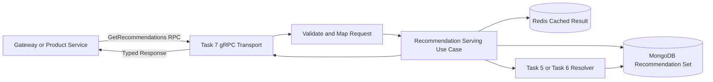
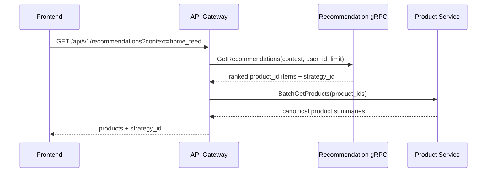
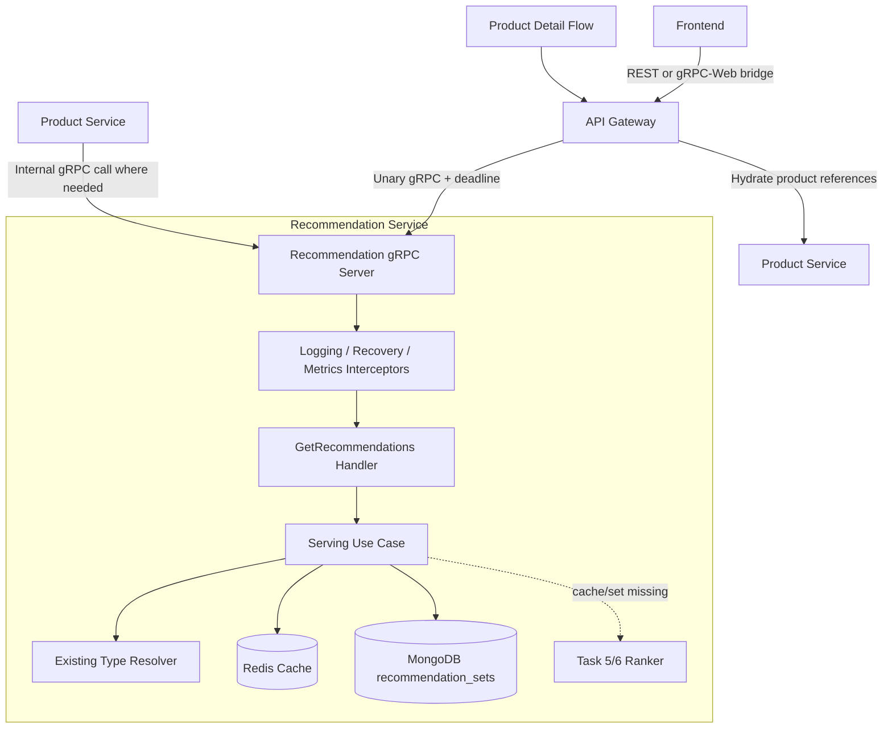
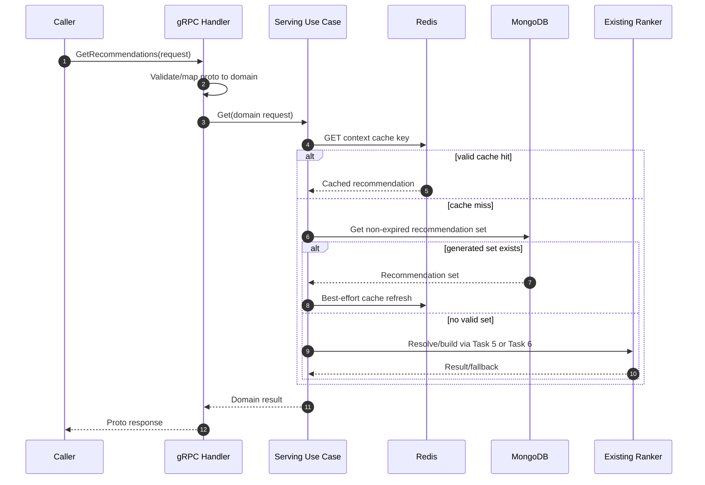
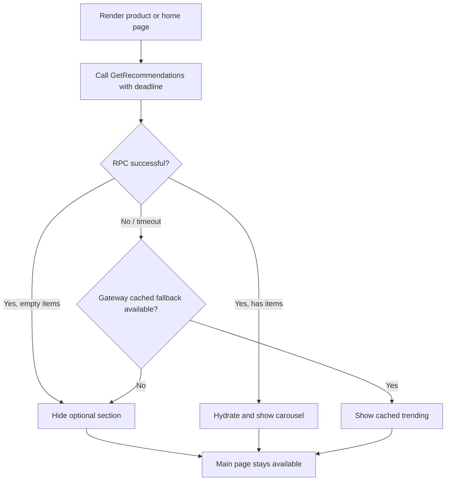

# 🧠 Recommendation Service - Task 7: gRPC Endpoint


## 📌 Task Summary

| Field | Detail |
|---|---|
| Task Name | gRPC endpoint |
| Source | `docs/01-micro-tasks.md` → `Recommendation Service` → Task 7 |
| Exact Requirement | `GetRecommendations(user_id, context)` method banao |
| Priority | `P1` core serving capability |
| Dependency | Platform proto strategy; Task 1 type contract; Task 2 storage/cache; Task 5/6 generated recommendation logic |
| Primary Consumers | API Gateway / Frontend read flow and Product Service |
| Main Goal | Typed, low-latency internal gRPC API se context-aware recommendations serve karna |
| Package Name | `ecommerce.recommendation.v1` |
| Output Type | Structured step-by-step implementation guide |
| Not Included | New ranking algorithm, A/B assignment engine, tracking endpoints, frontend carousel, REST gateway implementation |

> **Simple Hinglish goal:** Task 1-6 ne recommendation vocabulary, storage, events aur ranking ka foundation define kiya. Task 7 ka kaam un results ko ek typed gRPC method `GetRecommendations` ke through consumers tak safely pahunchana hai. Is task me ranking dubara build nahi hogi; endpoint validate karega, correct recommendation flow call karega, aur structured response return karega.

---

## ✅ Required Output Created

```text
TaskImplementation/
└── Recommendation Service/
    ├── task1.md
    ├── task2.md
    ├── task3.md
    ├── task4.md
    ├── task5.md
    ├── task6.md
    └── task7.md
```

### Why this structure?

| Item | Explanation |
|---|---|
| `TaskImplementation/` | Service-wise implementation guides ka central folder hai |
| `Recommendation Service/` | Folder already exist karta tha, isliye preserve kiya gaya |
| `task1.md` to `task6.md` | Types, storage, ingestion, feature-store, MVP ranking aur personalization foundation document karte hain |
| `task7.md` | Sirf **Recommendation Service - Task 7: gRPC Endpoint** ka guide hai |

> 🟢 **Deliverable boundary:** User ne required folder structure aur `task7.md` content manga hai. Is output me actual `.proto`, generated Go code, backend handler, gateway route, dependency installation, ya running service create/change nahi ki gayi.

---

## 🧭 Documents and Existing Contracts Studied

| Source | Task 7 me kya use hua |
|---|---|
| `docs/01-micro-tasks.md` | Exact scope: `GetRecommendations(user_id, context)`; consumer Frontend/Product Service; priority `P1` |
| `docs/02-system-architecture.md` | Browser ke liye Gateway REST, internal synchronous calls ke liye gRPC, versioned proto aur mandatory deadlines |
| `docs/03-folder-structure.md` | `proto/ecommerce/.../v1` convention aur recommendation service me `transport/grpc/` placement |
| `docs/04-microservice-design.md` | Recommendation gRPC service list aur public `GET /api/v1/recommendations`; Gateway simple aggregation kar sakta hai |
| `docs/05-database-design.md` | Recommendation ownership: MongoDB plus Redis |
| `docs/12-logging-monitoring-scalability.md` | Redis recommendation cache default `15 min`; recommendation failure product/checkout journey ko block nahi kare |
| `api/master-api.json` | Package `ecommerce.recommendation.v1`; method and public-facing `strategy_id` intent |
| `TaskImplementation/Recommendation Service/task1.md` | Request context/types, `RecommendationResult`, fallback and gRPC preview |
| `TaskImplementation/Recommendation Service/task2.md` | MongoDB/Redis and cache behavior |
| `TaskImplementation/Recommendation Service/task5.md` | Rule-based generated sets served by endpoint |
| `TaskImplementation/Recommendation Service/task6.md` | Personalized ranking and cold-start result served by endpoint |
| `backend/services/recommendation-service/internal/domain/recommendation.go` | Existing request fields, contexts, result items, normalize/validate and type resolution |
| `backend/services/recommendation-service/internal/domain/strategy.go` | Existing `strategy_id` constants and format validation |
| `backend/services/recommendation-service/internal/domain/storage.go` | Existing recommendation set model, Redis key builder and TTL policy |
| `backend/services/recommendation-service/internal/repository/*` | Existing Mongo set read/upsert and Redis cache adapter foundation |
| `backend/services/recommendation-service/internal/transport/http/*` | Current internal HTTP definition/storage endpoints; gRPC serving layer abhi add nahi hui |

### Current repository reality

| Already available in backend | Task 7 implementation ke waqt add/extend karna hoga |
|---|---|
| Domain `RecommendationRequest`, `RecommendationResult`, supported contexts/types | Versioned recommendation `.proto` contract |
| Strategy IDs including `personalized_v1_behavior` and trending fallback IDs | Generated protobuf Go stubs |
| Mongo `GetRecommendationSet` / `UpsertRecommendationSet` support | `internal/transport/grpc` `GetRecommendations` handler |
| Redis recommendation cache methods and keys | Recommendation-serving use case interface/wiring |
| HTTP internal definition/storage endpoints | gRPC server lifecycle, interceptor and health wiring |

> 🟡 **Important:** Existing backend recommendation results ka storage/cache foundation rakhta hai, lekin public-serving gRPC method abhi source tree me nahi hai. Neeche ka code Task 7 implement karne ka focused blueprint hai.

---

## 🧱 Task Boundary

### ✅ Included in Task 7

| Capability | Detail |
|---|---|
| Proto service contract | Versioned `RecommendationService.GetRecommendations` define karna |
| Request mapping | `user_id`, `context` plus context-supporting optional identifiers map karna |
| Response mapping | Recommendation reference items, `recommendation_id`, resolved type and `strategy_id` return karna |
| gRPC handler | Generated server interface implement karke use case call karna |
| Validation | Context, identifier length, limit and context-specific inputs reject/accept karna |
| Error mapping | Domain errors ko appropriate gRPC status codes me translate karna |
| Deadline and resilience | Caller deadline propagate karna; recommendation unavailable ho to graceful client behavior document karna |
| Server wiring | Proposed gRPC listener, interceptors and shutdown path define karna |
| Consumer usage | Gateway/Product Service client call example document karna |
| Tests and observability | Contract, handler, failure and metrics test strategy define karna |

### ❌ Not Included in Task 7

| Excluded Work | Owner / Reason |
|---|---|
| Trending/category/seller scoring algorithm | Task 5 |
| Personalized scoring or cold-start algorithm | Task 6 |
| Similar-products or frequently-bought-together algorithm | Separate ranking capability, not endpoint task |
| Strategy assignment, experiment bucketing or conversion comparison | Task 8 A/B testing hooks |
| `TrackRecommendationImpression` or `TrackRecommendationClick` endpoint | Separate future endpoint work |
| `GetSimilarProducts` / `GetTrendingProducts` extra RPCs | `GetRecommendations` ke exact Task 7 scope se outside |
| Public REST Gateway route implementation | Gateway responsibility; sirf integration shape explain ki gayi hai |
| Product document hydration/UI rendering | Product Service/Gateway/Frontend responsibility |
| Backend source code or generated proto files create karna | Requested deliverable sirf documentation file hai |

> 🔴 **Scope rule:** Task 7 ek transport/serving contract hai. Endpoint existing or future Task 5/6 result resolver ko call karega; is guide me naya recommender algorithm ya experiment system sneak-in nahi kiya jayega.

---

## 🧩 Previous Tasks Se Milne Wala Foundation

| Previous Task | `GetRecommendations` ko kya milta hai |
|---|---|
| Task 1: Types | Context, recommendation type resolution, result items and strategy vocabulary |
| Task 2: Storage/cache | Redis fast reads, Mongo durable generated sets, TTL and degradation policy |
| Task 3: Event ingestion | User activity data jo ranking refresh/invalidation drive kar sakta hai |
| Task 4: Feature store | Rankers ke input features; endpoint directly features calculate nahi karta |
| Task 5: Rule-based MVP | Trending/category/seller popular results for generic requests and fallback |
| Task 6: Personalized ranking | Identified visitor ke liye personalized result and cold-start fallback |

### Serving responsibility versus ranking responsibility



**Hinglish explanation:**

1. Caller endpoint ko context aur identity deta hai.
2. gRPC layer request parse/validate karke domain request banati hai.
3. Serving use case pehle fast cached result try karta hai.
4. Cache miss par valid generated set ya corresponding ranker result use hota hai.
5. Handler sirf domain result ko protobuf response me map karke return karta hai.

---

## 🎯 Key Design Decisions

| Decision | Choice | Why |
|---|---|---|
| RPC style | Unary `GetRecommendations` | Ek request ka ek ranked response; stream ki zarurat nahi |
| Versioning | `ecommerce.recommendation.v1` | Existing architecture/API master convention |
| Required request intent | `context` | Placement ke bina recommendation mode safely resolve nahi hota |
| Identity | `user_id` optional, `anonymous_id` optional extension | Public/trending feed identity ke bina chal sakta hai; personalized ko one identity chahiye |
| Supporting fields | `product_id`, `category_id`, `seller_id`, `cart_product_ids`, `limit`, optional `type` | Existing domain ko gRPC layer se lose nahi karna; multiple contexts serve karna |
| Internal item response | `product_id`, `score`, `reason`, `rank` | Recommendation Service product references/ranking own karti hai, canonical Product entity nahi |
| Product hydration | Gateway or Product Service | Cross-service DB ownership violate nahi hota |
| `strategy_id` response | Return selected existing strategy ID | API/master and existing domain contract compatible; experiment assignment Task 8 ke bahar |
| Default limit | Existing config default `12`, maximum `100` | Backend domain/config ke aligned guardrails |
| Cache | Existing Redis/Mongo adapters reuse | Task 2 boundary preserve aur low latency |
| Failure behavior | gRPC error; caller hides section or cached fallback use karta hai | Recommendations primary product/checkout flow ko block na kare |

### Product response boundary

`api/master-api.json` public response ko product objects ke form me describe karta hai, lekin Recommendation Service ke existing domain result items `product_id` based hain. Dono ko cleanly align karne ka flow:



> 🟢 Recommendation Service ranking/reference return karegi; Gateway canonical product cards hydrate kar sakta hai. Isse Recommendation Service Product Service ki database owner nahi banti.

---

## 🏗️ Target Architecture



### Request-to-response flow



---

## 🪜 Step-by-Step Implementation Guide

## Step 1: Endpoint ka exact contract freeze karo

Task requirement minimum form `GetRecommendations(user_id, context)` hai. Existing domain multiple recommendation placements support karta hai, isliye proto minimum ko todhe bina optional request fields include karna practical hai.

### Request fields

| Field | Required? | Use |
|---|---:|---|
| `context` | Yes | `home_feed`, `product_detail`, `category_listing`, `cart`, `checkout`, `search_results`, `seller_store` |
| `user_id` | Personalized user feed ke liye | Trusted caller/auth context se logged-in identity |
| `anonymous_id` | Guest personalized attempt ke liye optional | Non-PII visitor reference |
| `product_id` | Similar/product-detail flow ke liye | Product anchor |
| `category_id` | Optional | Category popular/fallback scope |
| `seller_id` | Optional | Seller-store scope |
| `cart_product_ids` | Cart/checkout flow ke liye | Basket anchor IDs |
| `limit` | Optional | `0` par configured default, max guardrail apply |
| `type` | Optional | Trusted internal override; otherwise context resolver decides |

### Response fields

| Field | Why return karna hai |
|---|---|
| `recommendation_id` | Impression/click correlation ke future flows ke liye result identity |
| `type` | Caller ko resolved recommendation type samajh aaye |
| `strategy_id` | Existing strategy transparency; Task 8 later experimentation consume kar sakta hai |
| `items` | Ordered product references with rank/optional reason |
| `generated_at` | Freshness/debugging |
| `cache_ttl_seconds` | Optional operational hint, client business rule nahi |

### Context-to-input validation

| Context / Resolved Type | Minimum valid input | Example result |
|---|---|---|
| `home_feed` with identity | `user_id` or `anonymous_id` | Personalized, fallback allowed |
| `home_feed` without identity | Context only | Trending |
| `product_detail` / similar | `product_id` | Similar product references |
| `category_listing` | `category_id` recommended | Category trending or global fallback |
| `seller_store` | `seller_id` recommended | Seller popular or fallback |
| `cart` / `checkout` | `product_id` or `cart_product_ids` | Frequently bought together when implemented |

### Kaise build hua?

- Requirement ke `user_id` and `context` primary inputs remain karte hain.
- Optional fields existing [`RecommendationRequest`] domain shape se match hote hain.
- Type-specific validation already existing domain design se reuse hoti hai; transport me duplicate business decisions nahi banaye jaate.

---

## Step 2: Versioned Protobuf contract define karo

Architecture docs versioned proto path recommend karte hain. Task 7 implement karte waqt recommended file:

```text
proto/ecommerce/recommendation/v1/recommendation.proto
```

### Proposed `recommendation.proto`

```proto
syntax = "proto3";

package ecommerce.recommendation.v1;

option go_package = "github.com/example/ecommerce-platform/backend/proto-gen/go/ecommerce/recommendation/v1;recommendationv1";

import "google/protobuf/timestamp.proto";

service RecommendationService {
  rpc GetRecommendations(GetRecommendationsRequest) returns (GetRecommendationsResponse);
}

enum RecommendationType {
  RECOMMENDATION_TYPE_UNSPECIFIED = 0;
  RECOMMENDATION_TYPE_SIMILAR_PRODUCTS = 1;
  RECOMMENDATION_TYPE_TRENDING = 2;
  RECOMMENDATION_TYPE_PERSONALIZED = 3;
  RECOMMENDATION_TYPE_FREQUENTLY_BOUGHT_TOGETHER = 4;
}

enum RecommendationContext {
  RECOMMENDATION_CONTEXT_UNSPECIFIED = 0;
  RECOMMENDATION_CONTEXT_HOME_FEED = 1;
  RECOMMENDATION_CONTEXT_PRODUCT_DETAIL = 2;
  RECOMMENDATION_CONTEXT_CATEGORY_LISTING = 3;
  RECOMMENDATION_CONTEXT_CART = 4;
  RECOMMENDATION_CONTEXT_CHECKOUT = 5;
  RECOMMENDATION_CONTEXT_SEARCH_RESULTS = 6;
  RECOMMENDATION_CONTEXT_SELLER_STORE = 7;
}

message GetRecommendationsRequest {
  string user_id = 1;
  RecommendationContext context = 2;
  string anonymous_id = 3;
  string product_id = 4;
  string category_id = 5;
  string seller_id = 6;
  repeated string cart_product_ids = 7;
  int32 limit = 8;
  RecommendationType type = 9;
}

message RecommendationItem {
  string product_id = 1;
  int32 rank = 2;
  double score = 3;
  string reason = 4;
}

message GetRecommendationsResponse {
  string recommendation_id = 1;
  RecommendationType type = 2;
  string strategy_id = 3;
  repeated RecommendationItem items = 4;
  google.protobuf.Timestamp generated_at = 5;
  int64 cache_ttl_seconds = 6;
}
```

### Contract decisions

| Proto Choice | Explanation |
|---|---|
| Enums instead of free-text context/type | Client typo avoid; API evolvable and discoverable rahe |
| Field numbers stable | Future changes me existing numbers rename/reuse na karo |
| `items.product_id` | Ranked recommendation ownership clean; caller Product Service se hydrate kare |
| `reason` | Explainability/debugging useful; sensitive data include na karo |
| `strategy_id` | Existing domain/API contract ka selected strategy identifier; A/B assignment nahi |
| Timestamp well-known type | Language-independent generated time |

### Future-safe proto rules

```text
Existing field number ko kabhi reuse mat karo.
Removed fields ko reserved declare karo.
New optional fields backward-compatible tarike se append karo.
v1 me method behavior break karna ho to v2 package create karo.
```

---

## Step 3: Proto generation setup karo

Repo docs proto clients generate karne ka workflow expect karte hain. Do common options hain: raw `protoc` commands ya Buf-managed generation. Beginner-friendly aur repeatable option Buf hai.

### Suggested proto folders

```text
proto/
├── buf.yaml
├── buf.gen.yaml
└── ecommerce/
    └── recommendation/
        └── v1/
            └── recommendation.proto

backend/
└── proto-gen/
    └── go/
        └── ecommerce/
            └── recommendation/
                └── v1/
                    ├── recommendation.pb.go
                    └── recommendation_grpc.pb.go
```

### Suggested `buf.gen.yaml`

```yaml
version: v2
plugins:
  - remote: buf.build/protocolbuffers/go
    out: backend/proto-gen/go
    opt: paths=source_relative
  - remote: buf.build/grpc/go
    out: backend/proto-gen/go
    opt: paths=source_relative
```

### Generate commands

```bash
buf lint
buf generate
```

### Without Buf

```bash
protoc \
  --proto_path=proto \
  --go_out=backend/proto-gen/go --go_opt=paths=source_relative \
  --go-grpc_out=backend/proto-gen/go --go-grpc_opt=paths=source_relative \
  proto/ecommerce/recommendation/v1/recommendation.proto
```

### Kaise build hua?

- Generated code ko manually edit nahi karna hota; contract source `.proto` hota hai.
- Versioned package consumer aur service deploys ko independently evolve karne deta hai.
- Task 7 me sirf recommendation RPC generate karni hai, doosri services ke contracts add nahi karne.

---

## Step 4: Domain-serving interface add karo

gRPC handler ko Redis/Mongo/ranking details directly own nahi karne chahiye. Handler ko ek small use-case interface call karna chahiye.

### Proposed serving contract

```go
package usecase

import (
	"context"
	"time"

	"github.com/example/ecommerce-platform/backend/services/recommendation-service/internal/domain"
)

type GetRecommendationsInput struct {
	RequestID      string
	UserID         string
	AnonymousID    string
	ProductID      string
	CategoryID     string
	SellerID       string
	CartProductIDs []string
	Context        domain.RecommendationContext
	Type           domain.RecommendationType
	Limit          int
}

type GetRecommendationsOutput struct {
	Result   domain.RecommendationResult
	CacheTTL time.Duration
}

type RecommendationReader interface {
	GetRecommendations(ctx context.Context, in GetRecommendationsInput) (GetRecommendationsOutput, error)
}
```

### Use case ki responsibility

| Use Case Does | Use Case Does Not Do |
|---|---|
| Request normalize and domain validation call karta hai | Proto enum mapping nahi karta |
| Context se recommendation type resolve/reuse karta hai | HTTP/REST response nahi banata |
| Cache/generated-result/ranker path coordinate karta hai | Product card details own nahi karta |
| Domain result return karta hai | Caller authentication blindly trust nahi karta; identity policy upstream bhi enforce hogi |

### Existing model reuse

```go
req := domain.RecommendationRequest{
	UserID:         in.UserID,
	AnonymousID:    in.AnonymousID,
	ProductID:      in.ProductID,
	CategoryID:     in.CategoryID,
	SellerID:       in.SellerID,
	CartProductIDs: in.CartProductIDs,
	Context:        in.Context,
	Limit:          in.Limit,
	Type:           in.Type,
}.Normalize()

if err := req.Validate(maxIdentifierLength); err != nil {
	return GetRecommendationsOutput{}, err
}
```

> 🟡 Existing `DefinitionService.Resolve` input validation/type resolution foundation provide karta hai. Actual serving implementation us contract ko reuse/compose kare aur Task 5/6 resolver se result laaye; validation ka second conflicting version mat banao.

---

## Step 5: Cache aur generated-set serving path connect karo

Endpoint ko low-latency response ke liye existing storage policy consume karni hai, nayi storage design introduce nahi karni.

### Cache key examples already supported by domain

| Request Intent | Key |
|---|---|
| Global trending | `reco:v1:trending:global` |
| Category trending | `reco:v1:trending:category:{category_id}` |
| Seller trending | `reco:v1:trending:seller:{seller_id}` |
| Logged-in personalized | `reco:v1:personalized:user:{user_id}` |
| Guest personalized | `reco:v1:personalized:anon:{anonymous_id}` |
| Similar product | `reco:v1:similar:product:{product_id}` |
| Frequently bought together | `reco:v1:fbt:product:{product_id}` |

### Existing TTL policy

| Result Type | Existing Default TTL |
|---|---:|
| Generic recommendation cache | `15 min` |
| Personalized user result | `5 min` |
| Personalized guest result | `5 min` |

### Suggested serving pseudocode

```go
func (s *Service) GetRecommendations(ctx context.Context, in GetRecommendationsInput) (GetRecommendationsOutput, error) {
	resolution, err := s.definitions.Resolve(ctx, resolveInputFromGet(in))
	if err != nil {
		return GetRecommendationsOutput{}, err
	}

	key, err := s.cacheKeyFor(resolution.Request)
	if err != nil {
		return GetRecommendationsOutput{}, err
	}

	if cached, ttl, err := s.cache.Get(ctx, key); err == nil {
		return outputFromCached(cached, ttl), nil
	}

	if set, err := s.sets.GetCurrent(ctx, resolution.Request, resolution.StrategyID); err == nil {
		s.writeCacheBestEffort(ctx, key, set)
		return outputFromSet(set), nil
	}

	result, err := s.resolver.Resolve(ctx, resolution.Request)
	if err != nil {
		return GetRecommendationsOutput{}, err
	}
	return outputFromResult(result), nil
}
```

### Kaise build hua?

- Handler latency optimization ka implementation detail nahi jaanta.
- Existing Redis `Get`/`Set` and Mongo set lookup adapters serve path ke reusable blocks hain.
- Task 5/6 ka output missing ho to resolver call hoga; endpoint scoring formula implement nahi karega.

---

## Step 6: gRPC transport mapping likho

Recommended target package:

```text
backend/services/recommendation-service/internal/transport/grpc/
├── handler.go
├── mapper.go
├── errors.go
└── handler_test.go
```

### Proposed handler skeleton

```go
package grpctransport

import (
	"context"

	recommendationv1 "github.com/example/ecommerce-platform/backend/proto-gen/go/ecommerce/recommendation/v1"
	"github.com/example/ecommerce-platform/backend/services/recommendation-service/internal/usecase"
)

type Handler struct {
	recommendationv1.UnimplementedRecommendationServiceServer
	reader usecase.RecommendationReader
}

func NewHandler(reader usecase.RecommendationReader) *Handler {
	return &Handler{reader: reader}
}

func (h *Handler) GetRecommendations(
	ctx context.Context,
	req *recommendationv1.GetRecommendationsRequest,
) (*recommendationv1.GetRecommendationsResponse, error) {
	in, err := inputFromProto(req)
	if err != nil {
		return nil, grpcError(err)
	}

	out, err := h.reader.GetRecommendations(ctx, in)
	if err != nil {
		return nil, grpcError(err)
	}

	return responseFromDomain(out), nil
}
```

### Mapping rule

| Transport Value | Domain Value |
|---|---|
| `RECOMMENDATION_CONTEXT_HOME_FEED` | `domain.ContextHomeFeed` |
| `RECOMMENDATION_CONTEXT_PRODUCT_DETAIL` | `domain.ContextProductDetail` |
| `RECOMMENDATION_TYPE_PERSONALIZED` | `domain.RecommendationTypePersonalized` |
| Unspecified `type` | Empty domain type; existing resolver chooses by context/inputs |
| Unspecified `context` | Validation error |
| `limit` | Checked before conversion to `int`, then existing configured range applied |

### Mapper example

```go
func inputFromProto(req *recommendationv1.GetRecommendationsRequest) (usecase.GetRecommendationsInput, error) {
	if req == nil {
		return usecase.GetRecommendationsInput{}, domain.ErrInvalidRecommendationRequest
	}

	contextValue, err := contextFromProto(req.GetContext())
	if err != nil {
		return usecase.GetRecommendationsInput{}, err
	}
	typeValue, err := typeFromProto(req.GetType())
	if err != nil {
		return usecase.GetRecommendationsInput{}, err
	}

	return usecase.GetRecommendationsInput{
		UserID:         req.GetUserId(),
		AnonymousID:    req.GetAnonymousId(),
		ProductID:      req.GetProductId(),
		CategoryID:     req.GetCategoryId(),
		SellerID:       req.GetSellerId(),
		CartProductIDs: append([]string(nil), req.GetCartProductIds()...),
		Context:        contextValue,
		Type:           typeValue,
		Limit:          int(req.GetLimit()),
	}, nil
}
```

### Response mapper example

```go
func responseFromDomain(out usecase.GetRecommendationsOutput) *recommendationv1.GetRecommendationsResponse {
	result := out.Result
	items := make([]*recommendationv1.RecommendationItem, 0, len(result.Items))
	for index, item := range result.Items {
		items = append(items, &recommendationv1.RecommendationItem{
			ProductId: item.ProductID,
			Rank:      int32(index + 1),
			Score:     item.Score,
			Reason:    item.Reason,
		})
	}
	return &recommendationv1.GetRecommendationsResponse{
		RecommendationId: result.RecommendationID,
		Type:             typeToProto(result.Type),
		StrategyId:       string(result.StrategyID),
		Items:            items,
		GeneratedAt:      timestamppb.New(result.GeneratedAt),
		CacheTtlSeconds:  int64(out.CacheTTL.Seconds()),
	}
}
```

### Kaise build hua?

- Generated protobuf models transport package tak limited hain.
- Domain package protobuf dependency se clean rehta hai.
- Handler thin rehne se unit test aur future transport changes easy hote hain.

---

## Step 7: Domain errors ko gRPC status codes me map karo

Clients ko string parse karke error samajhna nahi chahiye. Standard gRPC status codes use karo.

### Error mapping table

| Domain / Situation | gRPC Code | Caller behavior |
|---|---|---|
| Missing/invalid context or invalid identifiers | `InvalidArgument` | Request correct kare |
| Invalid/too large limit | `InvalidArgument` | Allowed limit send kare |
| Unsupported recommendation type/strategy | `InvalidArgument` | Supported contract use kare |
| Valid request but no optional recommendation items | Successful empty response preferred | UI section hide kar sakti hai |
| Recommendation storage/cache/ranker unavailable | `Unavailable` | Gateway fallback/hide section kare |
| Context deadline exceeded | `DeadlineExceeded` | Caller page render continue rakhe |
| Caller cancels request | `Canceled` | Work stop ho |
| Unexpected internal failure | `Internal` | Correlation ID se investigate karo |

### Proposed `grpcError` mapper

```go
func grpcError(err error) error {
	switch {
	case errors.Is(err, domain.ErrInvalidRecommendationRequest),
		errors.Is(err, domain.ErrInvalidLimit),
		errors.Is(err, domain.ErrUnsupportedContext),
		errors.Is(err, domain.ErrUnsupportedRecommendationType),
		errors.Is(err, domain.ErrUnsupportedStrategy):
		return status.Error(codes.InvalidArgument, err.Error())
	case errors.Is(err, domain.ErrRecommendationStorage):
		return status.Error(codes.Unavailable, "recommendations temporarily unavailable")
	case errors.Is(err, context.DeadlineExceeded):
		return status.Error(codes.DeadlineExceeded, "recommendation deadline exceeded")
	case errors.Is(err, context.Canceled):
		return status.Error(codes.Canceled, "recommendation request canceled")
	default:
		return status.Error(codes.Internal, "internal recommendation error")
	}
}
```

> 🔒 Internal Mongo/Redis connection strings ya raw infrastructure errors client ko expose nahi hone chahiye. Detailed error structured logs me rahe, RPC response sanitized rahe.

---

## Step 8: Server wiring aur graceful shutdown add karo

Existing service HTTP server chalata hai. Task 7 implementation me gRPC listener ko same process me additional server ke roop me ya dedicated binary ke roop me run kiya ja sakta hai. Existing service pattern ke saath simplest approach same application lifecycle me separate gRPC port hai.

### Suggested configuration

```dotenv
# Existing service settings
SERVICE_NAME=recommendation-service
RECOMMENDATION_HTTP_ADDR=:8088

# Task 7 proposed gRPC setting
RECOMMENDATION_GRPC_ADDR=:9088
RECOMMENDATION_GRPC_MAX_RECV_BYTES=65536
RECOMMENDATION_GRPC_MAX_SEND_BYTES=262144
RECOMMENDATION_GRPC_DEFAULT_DEADLINE=500ms
```

### Server wiring example

```go
grpcListener, err := net.Listen("tcp", cfg.GRPC.Address)
if err != nil {
	logger.Error("recommendation.grpc.listen_failed", slog.String("error", err.Error()))
	os.Exit(1)
}

grpcServer := grpc.NewServer(
	grpc.ChainUnaryInterceptor(
		recoveryUnaryInterceptor(logger),
		requestIDUnaryInterceptor(),
		loggingUnaryInterceptor(logger),
		metricsUnaryInterceptor(metrics),
	),
	grpc.MaxRecvMsgSize(cfg.GRPC.MaxRecvBytes),
	grpc.MaxSendMsgSize(cfg.GRPC.MaxSendBytes),
)

recommendationv1.RegisterRecommendationServiceServer(
	grpcServer,
	grpctransport.NewHandler(recommendationReader),
)

go func() {
	if err := grpcServer.Serve(grpcListener); err != nil {
		logger.Error("recommendation.grpc.serve_failed", slog.String("error", err.Error()))
		stop()
	}
}()

<-ctx.Done()
grpcServer.GracefulStop()
```

### Interceptor order

| Interceptor | Why |
|---|---|
| Recovery | Panic ko process crash banne se rokta aur sanitized `Internal` response deta hai |
| Request ID / trace propagation | Gateway se correlation maintain hota hai |
| Logging | Method, status and duration visible hote hain |
| Metrics | Latency/error/cache-result monitoring hoti hai |

### Deadline rule

Caller should set deadline:

```go
ctx, cancel := context.WithTimeout(parentCtx, 500*time.Millisecond)
defer cancel()

response, err := client.GetRecommendations(ctx, request)
```

Service caller deadline ko propagate karega. Endpoint deadline ke baad background ranking work continue karke resources waste nahi karega.

---

## Step 9: Gateway aur Product Service integration samjho

Task 7 service method provide karta hai; public REST implementation ya UI is file ka implementation scope nahi hai. Integration expectation clear rehni chahiye.

### API Gateway call example

```go
resp, err := recommendationClient.GetRecommendations(ctx, &recommendationv1.GetRecommendationsRequest{
	UserId:  authenticatedUserID,
	Context: recommendationv1.RecommendationContext_RECOMMENDATION_CONTEXT_HOME_FEED,
	Limit:   12,
})
if status.Code(err) == codes.Unavailable || status.Code(err) == codes.DeadlineExceeded {
	// Recommendation section optional hai: page response continue karo.
	return emptyRecommendationSection(), nil
}
```

### Product-detail integration example

```go
resp, err := recommendationClient.GetRecommendations(ctx, &recommendationv1.GetRecommendationsRequest{
	Context:   recommendationv1.RecommendationContext_RECOMMENDATION_CONTEXT_PRODUCT_DETAIL,
	ProductId: productID,
	Limit:     8,
})
```

### Identity safety

| Caller | Safe identity behavior |
|---|---|
| API Gateway for logged-in visitor | JWT/session se verified `user_id` inject kare; browser query parameter ko trusted user identity na maane |
| API Gateway for guest | Sanitized, bounded `anonymous_id` forward kar sakta hai |
| Product Service server-side | Userless product-detail recommendation ke liye product/context send kare |
| Recommendation Service | Raw email, phone, address ya JWT store/return na kare |

### Consumer fallback



---

## Step 10: Response aur strategy semantics lock karo

### Example gRPC JSON representation

```json
{
  "recommendationId": "reco_home_user_123_20260527T120000Z",
  "type": "RECOMMENDATION_TYPE_PERSONALIZED",
  "strategyId": "personalized_v1_behavior",
  "items": [
    {
      "productId": "prod_987",
      "rank": 1,
      "score": 82.4,
      "reason": "preferred_category_and_cart_affinity"
    },
    {
      "productId": "prod_321",
      "rank": 2,
      "score": 44.0,
      "reason": "fallback_global_trending"
    }
  ],
  "generatedAt": "2026-05-27T12:00:00Z",
  "cacheTtlSeconds": "300"
}
```

### `strategy_id` boundary

| Task 7 Allowed | Task 8 Reserved |
|---|---|
| Ranker/result me already selected `strategy_id` response me expose karna | User ko experiment variant assign karna |
| `personalized_v1_behavior`, `trending_v1_recent_activity` jaise existing IDs pass through karna | Control/treatment bucketing |
| Logs/metrics me selected ID record karna | Conversion lift comparison and experiment analytics |

> 🟣 `strategy_id` return karna endpoint response contract ka part hai; A/B testing hooks tabhi implement honge jab Task 8 me assignment/analysis logic add ki jayegi.

---

## Step 11: Folder structure for actual implementation

Niche ka tree **Task 7 ko backend me implement karne par recommended placement** dikhata hai. Current documentation deliverable me in source files ko create nahi kiya gaya.

```text
proto/
└── ecommerce/
    └── recommendation/
        └── v1/
            └── recommendation.proto                 # GetRecommendations contract

backend/
├── proto-gen/
│   └── go/
│       └── ecommerce/recommendation/v1/
│           ├── recommendation.pb.go                 # Generated messages
│           └── recommendation_grpc.pb.go            # Generated service stubs
└── services/
    └── recommendation-service/
        ├── cmd/
        │   └── server/
        │       └── main.go                          # Existing bootstrap; gRPC wiring extend
        ├── internal/
        │   ├── config/
        │   │   └── config.go                        # Proposed GRPCConfig add
        │   ├── domain/
        │   │   ├── recommendation.go                # Existing request/result contract
        │   │   ├── strategy.go                      # Existing strategy IDs
        │   │   └── storage.go                       # Existing cache/set types
        │   ├── repository/
        │   │   ├── mongo_feature_repository.go      # Existing set access reused
        │   │   └── redis_recommendation_cache.go    # Existing cache access reused
        │   ├── usecase/
        │   │   ├── get_recommendations.go           # Proposed serving orchestration
        │   │   └── get_recommendations_test.go
        │   └── transport/
        │       ├── http/                            # Existing internal endpoints preserved
        │       └── grpc/
        │           ├── handler.go                   # Proposed RPC method
        │           ├── mapper.go                    # Proto <-> domain conversion
        │           ├── errors.go                    # gRPC status conversion
        │           └── handler_test.go
        └── go.mod                                   # grpc/protobuf dependencies when implemented
```

### File responsibility table

| File | Responsibility |
|---|---|
| `recommendation.proto` | Client/server wire contract |
| Generated `.pb.go` files | Protobuf model and gRPC interfaces; manual editing forbidden |
| `usecase/get_recommendations.go` | Read orchestration, cache/set/ranker selection |
| `transport/grpc/handler.go` | RPC receive/call/respond |
| `transport/grpc/mapper.go` | Enum/message-domain mapping |
| `transport/grpc/errors.go` | Safe status-code mapping |
| `config/config.go` | Port/message-size/deadline configuration |
| `cmd/server/main.go` | Server register, lifecycle and shutdown |

---

## Step 12: Tests likho

Task 7 transport layer hai, isliye testing ka focus contract, mapping, status behavior aur consumer-safe failure par hona chahiye.

### Minimum test matrix

| Test Case | Expected Result |
|---|---|
| Valid `home_feed` + user identity | `OK`, personalized/fallback result mapped |
| Valid anonymous home request | `OK`, guest-compatible result |
| Valid anonymous-free home request | `OK`, trending flow allowed |
| Product detail without `product_id` when similar forced | `InvalidArgument` |
| Cart/checkout FBT request without anchor products when type forced | `InvalidArgument` |
| Unspecified/unsupported context | `InvalidArgument` |
| Negative or over-maximum limit | `InvalidArgument` |
| Nil request | `InvalidArgument` |
| Domain returns empty valid result | `OK` with zero items |
| Storage/ranker unavailable | `Unavailable` without internal details |
| Deadline expires | `DeadlineExceeded` |
| Result contains strategy ID | Response pass-through, no experiment allocation |
| Item ordering | Rank preserves domain result ordering |

### Handler unit test example

```go
func TestGetRecommendationsMapsDomainResult(t *testing.T) {
	reader := fakeReader{
		out: usecase.GetRecommendationsOutput{
			Result: domain.RecommendationResult{
				RecommendationID: "reco_123",
				Type:             domain.RecommendationTypeTrending,
				StrategyID:       domain.StrategyTrendingRecentActivity,
				GeneratedAt:      time.Date(2026, 5, 27, 12, 0, 0, 0, time.UTC),
				Items: []domain.RecommendationItem{
					{ProductID: "prod_1", Score: 42, Reason: "trending_recent_activity"},
				},
			},
		},
	}
	handler := NewHandler(reader)

	got, err := handler.GetRecommendations(context.Background(), &recommendationv1.GetRecommendationsRequest{
		Context: recommendationv1.RecommendationContext_RECOMMENDATION_CONTEXT_HOME_FEED,
	})
	if err != nil {
		t.Fatal(err)
	}
	if got.GetItems()[0].GetProductId() != "prod_1" || got.GetStrategyId() != "trending_v1_recent_activity" {
		t.Fatalf("unexpected response: %+v", got)
	}
}
```

### gRPC in-memory integration test (`bufconn`) idea

```go
listener := bufconn.Listen(1024 * 1024)
server := grpc.NewServer()
recommendationv1.RegisterRecommendationServiceServer(server, NewHandler(fakeReader{}))
go server.Serve(listener)
defer server.Stop()

conn, err := grpc.NewClient(
	"passthrough:///bufconn",
	grpc.WithContextDialer(func(context.Context, string) (net.Conn, error) {
		return listener.Dial()
	}),
	grpc.WithTransportCredentials(insecure.NewCredentials()),
)
```

### Contract checks

```bash
buf lint
buf breaking --against '.git#branch=main'
go test ./...
```

### Kaise build hua?

- Unit tests mapper/status behavior ko quickly protect karte hain.
- `bufconn` real network port ke bina generated client/server compatibility prove karta hai.
- Proto breaking check existing consumers ko accidental field/method break se bachata hai.

---

## Step 13: Observability aur reliability add karo

### Recommended gRPC metrics

| Metric | Type | Purpose |
|---|---|---|
| `recommendation_grpc_requests_total{method,code}` | Counter | Success/failure traffic |
| `recommendation_grpc_duration_seconds{method}` | Histogram | Endpoint latency/SLO |
| `recommendation_grpc_inflight_requests{method}` | Gauge | Concurrent pressure |
| `recommendation_serve_source_total{source}` | Counter | `redis`, `mongo`, `ranker`, `empty` usage |
| `recommendation_serve_fallback_total{type}` | Counter | Graceful fallback frequency |
| `recommendation_serve_empty_total{context}` | Counter | UI coverage issues |

### Structured log example

```json
{
  "level": "info",
  "service": "recommendation-service",
  "grpc_method": "GetRecommendations",
  "request_id": "req_f42a",
  "context": "home_feed",
  "recommendation_type": "personalized",
  "strategy_id": "personalized_v1_behavior",
  "source": "redis",
  "item_count": 12,
  "grpc_code": "OK",
  "duration_ms": 9
}
```

### Never log

```text
JWT tokens
email / phone / address
raw browsing history
Redis or Mongo credentials
complete user-specific response payload at normal log levels
```

### Reliability rules

| Rule | Reason |
|---|---|
| Deadline mandatory from callers | Page render ko slow optional dependency se protect karta hai |
| Cache hit path fast rakho | Carousel latency low rahe |
| Empty successful response allowed | Optional recommendation unavailable ho to page break na ho |
| `Unavailable` sanitized rakho | Client fallback kar sake; internals leak na hon |
| Graceful shutdown | In-flight unary requests safely finish hon |

---

## Step 14: Security and privacy controls

| Concern | Implementation Rule |
|---|---|
| User identity spoofing | Gateway verified auth identity se `user_id` attach kare; arbitrary public input ko personalized authority na do |
| Guest ID abuse | Length/format validate karo; raw fingerprint or PII avoid karo |
| Data minimization | RPC me product references and recommendation metadata hi return karo |
| Cross-service ownership | Recommendation Service Product DB directly query nahi kare; Product hydration Product Service/Gateway kare |
| Error leakage | Storage stack trace/connection details gRPC message me na bhejo |
| Resource abuse | `limit <= 100`, request/message size cap, deadline, optional rate limiting at Gateway |
| Authorization | Public/trending call allow ho sakta hai; personalized `user_id` caller identity rules ke according enforce ho |

### Request validation checklist

```text
[ ] context unspecified nahi hai
[ ] type unspecified ho to resolver choose kare; specified ho to supported ho
[ ] identifiers trim aur configured max length ke andar hain
[ ] cart product IDs normalize/deduplicate hote hain
[ ] limit zero ho to default 12; negative ya >100 reject hota hai
[ ] type-specific anchor requirements enforce hoti hain
[ ] caller deadline context propagate hota hai
```

---

## 🧰 External Libraries and Tools

Task 7 gRPC serving layer ke liye following tooling relevant hai. Existing MongoDB/Redis libraries ranking data serving foundation se already related hain; naya ML/vector tool required nahi hai.

### 1. Protocol Buffers (`protoc`)

| Detail | Value |
|---|---|
| What | Language-neutral interface definition compiler |
| Why used | `.proto` contract ko generated Go messages/stubs me convert karna |
| Install (Ubuntu/Debian example) | `sudo apt-get install -y protobuf-compiler` |
| Verify | `protoc --version` |
| Use | `protoc --proto_path=proto --go_out=... --go-grpc_out=... recommendation.proto` |

```bash
protoc --version
```

### 2. Go protobuf plugin

| Detail | Value |
|---|---|
| What | `protoc-gen-go` generated message code banata hai |
| Why used | Go request/response types produce karna |
| Install | `go install google.golang.org/protobuf/cmd/protoc-gen-go@latest` |
| Use | `protoc --go_out=...` plugin automatically call karta hai |

```bash
go install google.golang.org/protobuf/cmd/protoc-gen-go@latest
```

### 3. Go gRPC protobuf plugin

| Detail | Value |
|---|---|
| What | `protoc-gen-go-grpc` service client/server interface generate karta hai |
| Why used | `RecommendationServiceServer` aur typed client stubs |
| Install | `go install google.golang.org/grpc/cmd/protoc-gen-go-grpc@latest` |
| Use | `protoc --go-grpc_out=...` |

```bash
go install google.golang.org/grpc/cmd/protoc-gen-go-grpc@latest
```

### 4. `google.golang.org/grpc`

| Detail | Value |
|---|---|
| What | Official Go gRPC runtime library |
| Why used | Server, client, status codes, interceptors, health checks and `bufconn` testing |
| Current service state | Recommendation `go.mod` me gRPC runtime abhi direct dependency listed nahi hai |
| Install when implementing | `go get google.golang.org/grpc` |
| Use | `grpc.NewServer(...)`, `RegisterRecommendationServiceServer(...)` |

```bash
cd backend/services/recommendation-service
go get google.golang.org/grpc
```

### 5. `google.golang.org/protobuf`

| Detail | Value |
|---|---|
| What | Go Protocol Buffers runtime and well-known timestamp utilities |
| Why used | Generated messages and `timestamppb.New(...)` |
| Current service state | Present indirectly in existing `go.mod` dependency graph |
| Install as direct implementation dependency | `go get google.golang.org/protobuf` |

```bash
cd backend/services/recommendation-service
go get google.golang.org/protobuf
```

### 6. Buf (recommended contract workflow tool)

| Detail | Value |
|---|---|
| What | Protobuf lint, generation and breaking-change checker |
| Why used | Team ke liye reproducible proto quality and compatibility checks |
| Required? | Optional but recommended; raw `protoc` bhi valid hai |
| Install | Official installation method use karo, phir `buf --version` verify karo |
| Use | `buf lint`, `buf generate`, `buf breaking --against ...` |

```bash
buf lint
buf generate
```

### 7. `grpcurl` (manual verification tool)

| Detail | Value |
|---|---|
| What | Command-line gRPC client |
| Why used | Local server response manually inspect karna |
| Required? | Runtime dependency nahi; developer tool only |
| Use | Reflection enabled test environment me RPC invoke karo, ya proto file specify karo |

```bash
grpcurl -plaintext \
  -import-path proto \
  -proto ecommerce/recommendation/v1/recommendation.proto \
  -d '{"context":"RECOMMENDATION_CONTEXT_HOME_FEED","user_id":"user_123","limit":12}' \
  localhost:9088 ecommerce.recommendation.v1.RecommendationService/GetRecommendations
```

### 8. Existing storage tooling reused by endpoint

| Tool / Library | Why endpoint indirectly uses it | Existing Status |
|---|---|---|
| MongoDB | Non-expired `recommendation_sets` read/fallback storage | Designed and adapter present |
| `go.mongodb.org/mongo-driver/v2` | Typed Go Mongo access | Existing direct dependency `v2.6.0` |
| Redis | Low-latency cached recommendation result | Designed and adapter present |
| `github.com/redis/go-redis/v9` | Cache reads and TTL | Existing direct dependency `v9.19.0` |
| Prometheus Go client | Endpoint metrics | Existing direct dependency `v1.23.2` |

### Not required for Task 7

| Tool | Why not |
|---|---|
| TensorFlow/PyTorch/vector database | Endpoint transport ban raha hai, ML ranker nahi |
| Kafka consumer changes | Event ingestion Task 3 ka kaam hai |
| New A/B testing library | Experiment assignment Task 8 ka kaam hai |
| Frontend React library | Endpoint guide UI implement nahi karta |

> 🟣 **Documentation note:** Upar ke commands implementation setup/reference ke liye hain. Is Task 7 output me packages download/install ya generators execute nahi kiye gaye.

---

## ⚙️ Configuration Reference

### Existing-compatible values

```dotenv
RECOMMENDATION_DEFAULT_LIMIT=12
RECOMMENDATION_MAX_LIMIT=100
RECOMMENDATION_MAX_IDENTIFIER_LENGTH=128
RECOMMENDATION_CACHE_KEY_PREFIX=reco:v1
RECOMMENDATION_CACHE_TTL_SECONDS=900
RECOMMENDATION_PERSONALIZED_CACHE_TTL_SECONDS=300
RECOMMENDATION_GUEST_CACHE_TTL_SECONDS=300
```

### Proposed Task 7 transport values

```dotenv
RECOMMENDATION_GRPC_ADDR=:9088
RECOMMENDATION_GRPC_MAX_RECV_BYTES=65536
RECOMMENDATION_GRPC_MAX_SEND_BYTES=262144
RECOMMENDATION_GRPC_DEFAULT_DEADLINE=500ms
```

### Validation rules

| Setting | Rule |
|---|---|
| `RECOMMENDATION_GRPC_ADDR` | Empty nahi hona chahiye |
| Message bytes | Greater than zero; huge payload avoid karo |
| Default deadline | Greater than zero; caller deadline still authoritative |
| Default/max limits | Existing validation preserve karo |
| Cache TTL | Existing storage policy preserve karo |

---

## 🚦 End-to-End Acceptance Checklist

| Check | Task 7 Standard |
|---|---|
| Correct task source identified | ✅ `GetRecommendations(user_id, context)` only |
| Existing `Recommendation Service/` folder preserved | ✅ |
| `task7.md` created | ✅ |
| Proto package versioned | ✅ Proposed `ecommerce.recommendation.v1` |
| Unary gRPC request/response documented | ✅ |
| Optional fields aligned with existing domain | ✅ |
| Product ownership boundary documented | ✅ Product hydration outside Recommendation Service |
| Error/status mapping documented | ✅ |
| Deadline/failure isolation documented | ✅ |
| Folder structure shown | ✅ |
| Code examples included | ✅ |
| Mermaid architecture/flow diagrams included | ✅ |
| Libraries/tools install and usage documented | ✅ |
| Tests and metrics documented | ✅ |
| No ranking algorithm added under Task 7 | ✅ |
| No A/B assignment added under Task 7 | ✅ |
| No backend/proto/runtime files changed by this deliverable | ✅ |

---

## 🚫 Out of Scope for Task 7

```text
Do not add:
  - new recommendation scoring formulas
  - personalized feature builders
  - event ingestion changes
  - experiment assignment or analytics conversion comparison
  - impression/click RPC implementation
  - public frontend UI
  - Gateway REST implementation
  - canonical Product Service data duplication in recommendation storage
```

### Why?

Task 7 ka acceptance target ek stable gRPC serving endpoint hai. Ranking behavior earlier task boundaries ka concern hai aur A/B assignment next task ka concern hai. Narrow boundary rakhne se endpoint contract testable, predictable aur safely adoptable rehta hai.

---

## ✅ Final Task 7 Standard

Recommendation Service Task 7 ka recommended implementation ye hai:

```text
Caller
  -> ecommerce.recommendation.v1.RecommendationService/GetRecommendations
  -> validate + proto-to-domain mapping
  -> existing recommendation serving/cache/generated-result path
  -> domain-to-proto ranked product references + strategy_id
  -> Gateway/Product Service hydration where product cards needed
```

Endpoint `context` aur supported identity/anchor inputs leta hai, existing recommendation result ko low-latency gRPC contract me return karta hai, safe status/deadline behavior follow karta hai, aur optional recommendation failures ko core shopping experience se isolate karta hai. `strategy_id` response me available rahega for traceability, lekin experiment assignment aur A/B comparison intentionally **Recommendation Service - Task 8** ke liye reserved hain.

**Next planned task, is scope ke baad:** Recommendation Service - Task 8: A/B testing hooks.
