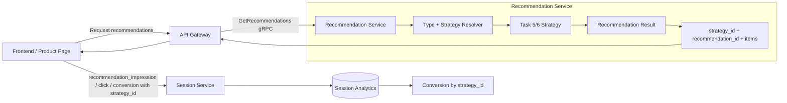
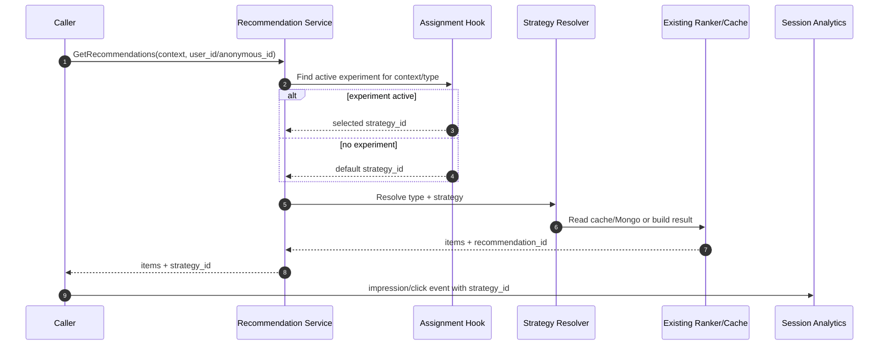
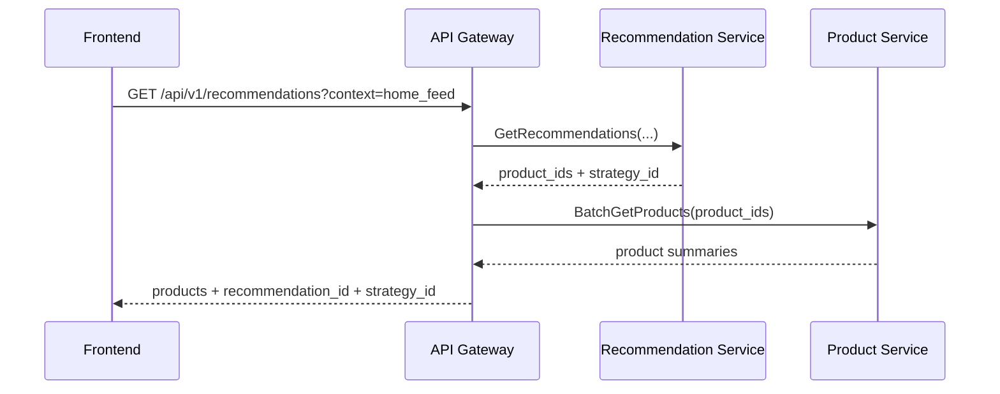
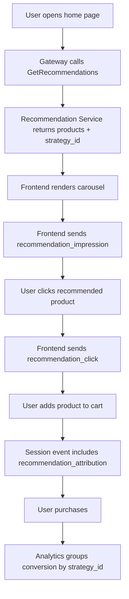

# 🧠 Recommendation Service - Task 8: A/B Testing Hooks


## 📌 Task Summary

| Field | Detail |
|---|---|
| Task Name | A/B testing hooks |
| Source | `docs/01-micro-tasks.md` → `Recommendation Service` → Task 8 |
| Exact Requirement | `strategy_id` return karo so analytics conversion compare kar sake |
| Priority | `P2` optimization / analytics capability |
| Dependency | Session analytics, Task 7 gRPC endpoint, Task 5/6 ranking strategies |
| Main Goal | Recommendation response me selected strategy ka stable identifier return/propagate karna, taaki impressions, clicks, add-to-cart aur purchases ko strategy-wise compare kiya ja sake |
| Primary Output | Structured implementation guide |
| Not Included | Full A/B dashboard, statistical significance engine, new ML model, frontend carousel UI, new ranking algorithm |

> **Simple Hinglish goal:** User ko recommendation list milti hai, but analytics ko ye bhi pata hona chahiye ki list kis strategy se bani thi. Task 8 ka kaam hai `strategy_id` ko response, logs, events aur analytics attribution me consistently carry karna. Isse team compare kar sakti hai ki `personalized_v1_behavior` better convert kar raha hai ya `trending_v1_recent_activity`.

---

## ✅ Required Output Created

```text
TaskImplementation/
└── Recommendation Service/
    ├── task1.md
    ├── task2.md
    ├── task3.md
    ├── task4.md
    ├── task5.md
    ├── task6.md
    ├── task7.md
    └── task8.md
```

### Why this structure?

| Item | Explanation |
|---|---|
| `TaskImplementation/` | Project ke task-wise implementation guides ka central folder hai |
| `Recommendation Service/` | Folder already exist karta tha, isliye preserve kiya gaya |
| `task1.md` to `task7.md` | Recommendation types, storage, ingestion, feature store, ranking, personalization aur gRPC serving ka foundation define karte hain |
| `task8.md` | Sirf **Recommendation Service - Task 8: A/B Testing Hooks** ka guide hai |

> 🟢 **Deliverable boundary:** Is task me requested output documentation artifact hai. Backend source code, proto file, migration, analytics dashboard, ya frontend code create/change nahi kiya gaya.

---

## 🧭 Documents and Existing Contracts Studied

| Source | Task 8 me kya use hua |
|---|---|
| `docs/01-micro-tasks.md` | Exact scope: strategy id return so analytics conversion compare kar sake |
| `docs/04-microservice-design.md` | Service communication rule: gRPC internal, events async, har service apna DB own kare |
| `docs/08-session-management-system.md` | Session events, anonymous id, user id, journey tracking aur conversion analytics foundation |
| `docs/12-logging-monitoring-scalability.md` | Recommendations/analytics failure product or checkout flow ko block nahi kare |
| `database/mongodb-schema-design.md` | `recommendation_db.recommendation_sets` already `strategy_id` indexed shape use karta hai |
| `api/master-api.json` | Public `RecommendationResponse` me `strategy_id`; future tracking methods listed |
| `proto/ecommerce/recommendation/v1/recommendation.proto` | `GetRecommendationsResponse.strategy_id` already defined hai |
| `backend/services/recommendation-service/internal/domain/strategy.go` | Existing strategy constants and validation pattern |
| `backend/services/recommendation-service/internal/domain/storage.go` | `RecommendationSet`, `CachedRecommendation`, `ab_test_assignments` collection name |
| `backend/services/recommendation-service/internal/usecase/get_recommendations.go` | Serving path already result me `strategy_id` log/return karta hai |
| `TaskImplementation/Recommendation Service/task7.md` | gRPC endpoint response boundary and product hydration flow |

### Current repository reality

| Already available | Task 8 hook ke liye meaning |
|---|---|
| `GetRecommendationsResponse.strategy_id` | Client/Gateway ko selected strategy mil sakti hai |
| `domain.StrategyID` constants | Stable algorithm IDs already standardized hain |
| `recommendation_sets.strategy_id` | Mongo generated sets strategy-wise store/read ho sakte hain |
| `CachedRecommendation.strategy_id` | Redis cached response me bhi strategy metadata preserved hai |
| `recommendation.served` logs include `strategy_id` | Debugging and observability me strategy visible hai |
| API schema has `RecommendationResponse.strategy_id` | Public REST response me strategy expose karne ka intent documented hai |
| Session event schema has flexible `properties` object | Impression/click/conversion events me `strategy_id` attach kiya ja sakta hai |

### Missing for a full future A/B platform

| Missing Piece | Why not added in this task |
|---|---|
| Experiment dashboard | CMS/Superadmin future scope |
| Statistical significance calculator | Analytics/reporting future scope |
| New ranking variants | Task 8 hook hai; ranking algorithm Task 5/6/future ML tasks ka kaam hai |
| Dedicated tracking RPC implementation | API master me listed hai, but Task 8 exact requirement `strategy_id` propagation tak limited hai |
| Frontend UI changes | User ne documentation artifact request kiya, app implementation nahi |

---

## 🧱 Task Boundary

### ✅ Included in Task 8

| Capability | Detail |
|---|---|
| Strategy ID contract | Har recommendation response me selected `strategy_id` return/propagate karna |
| Analytics attribution | Impression, click, add-to-cart, checkout, purchase events me `strategy_id` attach karne ka contract |
| Optional assignment model | Future A/B bucket assignment ke liye minimal schema and deterministic design |
| MongoDB assignment schema | `ab_test_assignments` collection ka recommended document and indexes |
| Gateway/frontend flow | Response se `strategy_id` read karke Session Service event properties me pass karna |
| Metrics/logs | Low-cardinality labels and structured logs ka design |
| Tests | Strategy propagation, fallback strategy, deterministic assignment, analytics event contract test cases |
| External tools | Existing Go/Mongo/Redis/gRPC/Kafka/Prometheus usage and install commands document karna |

### ❌ Not Included in Task 8

| Excluded Work | Reason |
|---|---|
| New recommendation algorithm | Task 5/6 or future ML task ka scope |
| Full experiment management UI | CMS/Superadmin future scope |
| Conversion report dashboard | Session Analytics Dashboard future scope |
| Statistical significance / p-value engine | Analytics data science layer ka scope |
| Real-time feature flag platform | Later platform capability |
| Product card UI changes | Frontend task ka scope |
| Checkout behavior change | Recommendation/analytics failure checkout ko block nahi karega |

> 🔴 **Scope rule:** Task 8 ka real output metadata hook hai. Recommendation serving same rahegi; sirf strategy identity ko analytics tak reliably pahunchaya jayega.

---

## 🧩 Foundation From Previous Tasks

| Previous Task | Task 8 ko kya milta hai |
|---|---|
| Task 1: Recommendation types | Strategy naming pattern and type/context vocabulary |
| Task 2: MongoDB + Redis | `recommendation_sets` and cache me `strategy_id` store karne ka base |
| Task 3: Event ingestion | Product/user behavior signals; later conversion attribution events consume ho sakte hain |
| Task 4: Feature store | Derived features strategy variants compare karne ka input foundation |
| Task 5: Rule-based MVP | `trending_v1_recent_activity` jaise stable strategy IDs |
| Task 6: Personalized ranking | `personalized_v1_behavior` strategy ID |
| Task 7: gRPC endpoint | `GetRecommendations` response path jahan `strategy_id` return hota hai |

---

## 🏗️ High-Level Architecture



### Hinglish flow

1. Frontend/Gateway recommendation request bhejta hai.
2. Recommendation Service context ke hisaab se type and strategy resolve karta hai.
3. Result me `recommendation_id`, `strategy_id`, products and generated time return hote hain.
4. UI same `strategy_id` ko impression/click/add-to-cart/purchase events ke saath Session Service ko bhejta hai.
5. Analytics dashboard strategy-wise conversion compare kar sakta hai.

---

## 🎯 Key Concepts

| Concept | Meaning | Example |
|---|---|---|
| `strategy_id` | Recommendation algorithm/config ka stable ID | `personalized_v1_behavior` |
| `recommendation_id` | Ek generated recommendation set/result ka unique ID | `reco_20260527_home_user_123` |
| `experiment_id` | Optional A/B experiment name | `reco_home_strategy_2026_05` |
| `variant_id` | Optional bucket label | `control`, `treatment` |
| `assignment_key` | Stable identity used for bucketing | `user:user_123` or `anon:anon_123` |
| Impression | Recommendation list user ko dikh gayi | `recommendation_impression` |
| Click | User recommended product pe click karta hai | `recommendation_click` |
| Conversion | Add-to-cart, checkout, purchase | `add_to_cart`, `checkout_step`, `payment_result` |

> 🟡 **Important:** Task 8 ke exact requirement ke liye `strategy_id` enough hai. `experiment_id` and `variant_id` future A/B platform ko clean banane ke optional hooks hain.

---

## 🧪 Strategy ID Standard

Existing code me strategy ID format:

```text
<type>_v<version>_<main_logic>
```

### Existing examples

| Strategy ID | Meaning |
|---|---|
| `similar_v1_attributes` | Similar products by attributes |
| `trending_v1_recent_activity` | Recent activity based trending |
| `personalized_v1_behavior` | User behavior based personalized ranking |
| `fbt_v1_order_cooccurrence` | Frequently bought together via order co-occurrence |
| `trending_v1_fallback_global` | Global fallback trending |
| `trending_v1_fallback_category` | Category fallback trending |

### Naming rules

```text
Allowed:
  personalized_v1_behavior
  trending_v2_purchase_heavy
  similar_v1_attributes

Avoid:
  PersonalizedV1
  strategy-a
  test
  exp_123
```

**Hinglish reason:** `strategy_id` analytics grouping key hai. Agar naming unstable hogi to conversion reports split/dirty ho jayenge.

---

## 🪜 Step-by-Step Implementation Guide

## Step 1: Response contract me `strategy_id` mandatory rakho

Task 7 ke proto me response already ready hai:

```proto
message GetRecommendationsResponse {
  string recommendation_id = 1;
  RecommendationType type = 2;
  string strategy_id = 3;
  repeated RecommendationItem items = 4;
  google.protobuf.Timestamp generated_at = 5;
  int64 cache_ttl_seconds = 6;
}
```

### Build explanation

- `recommendation_id` exact generated list identify karta hai.
- `type` broad recommendation category batata hai.
- `strategy_id` exact algorithm/config variant identify karta hai.
- Analytics ko product IDs ke saath `strategy_id` milta hai, so conversion comparison possible hota hai.

### Response example

```json
{
  "recommendation_id": "reco_home_user_123_20260527",
  "type": "RECOMMENDATION_TYPE_PERSONALIZED",
  "strategy_id": "personalized_v1_behavior",
  "items": [
    {
      "product_id": "prod_101",
      "rank": 1,
      "score": 98.4,
      "reason": "category_affinity"
    }
  ],
  "generated_at": "2026-05-27T12:00:00Z",
  "cache_ttl_seconds": 300
}
```

> 🟢 Rule: Empty/fallback response bhi `strategy_id` return kare. Warna analytics me missing group banega.

---

## Step 2: Domain layer me strategy ID validate karo

Existing domain code already ye idea follow karta hai. Task 8 ke liye rule same rehna chahiye:

```go
func ValidateStrategyID(strategyID StrategyID) error {
    value := strings.TrimSpace(string(strategyID))
    if value == "" {
        return fmt.Errorf("%w: strategy_id is required", ErrUnsupportedStrategy)
    }
    if !strategyIDPattern.MatchString(value) {
        return fmt.Errorf("%w: strategy_id must match %s", ErrUnsupportedStrategy, StrategyIDPattern)
    }
    return nil
}
```

### Build explanation

- Validation bad strategy names ko storage/analytics me jane se rokta hai.
- `strategy_id` low-cardinality hona chahiye; user/product IDs ko kabhi strategy ID me include nahi karna.
- Version bump tab karo jab scoring logic, weights, candidate generation, ya fallback behavior materially change ho.

---

## Step 3: Recommendation set and cache me strategy preserve karo

Task 2/5/6 storage model me strategy already part of generated set hai:

```go
type RecommendationSet struct {
    ID          string
    ContextKey  string
    Type        RecommendationType
    StrategyID  StrategyID
    Items       []RecommendationSetItem
    GeneratedAt time.Time
    ExpiresAt   time.Time
}
```

Mongo unique index:

```javascript
db.recommendation_sets.createIndex(
  { context_key: 1, strategy_id: 1 },
  { name: "ux_recommendation_sets_context_strategy", unique: true }
)
```

### Build explanation

- Same context ke multiple strategy variants safely coexist kar sakte hain.
- Example: `home:global + trending_v1_recent_activity` and `home:global + trending_v2_purchase_heavy`.
- Redis cached payload me bhi `strategy_id` store hoga, so cache hit par analytics metadata lose nahi hota.

---

## Step 4: Optional experiment assignment model define karo

Task 8 ka minimum requirement `strategy_id` return hai. Future A/B test ke liye assignment model ye ho sakta hai:

```go
type ExperimentStatus string

const (
    ExperimentDraft   ExperimentStatus = "draft"
    ExperimentActive  ExperimentStatus = "active"
    ExperimentPaused  ExperimentStatus = "paused"
    ExperimentStopped ExperimentStatus = "stopped"
)

type ExperimentVariant struct {
    VariantID  string
    StrategyID domain.StrategyID
    Weight     int
}

type ExperimentDefinition struct {
    ExperimentID string
    Context      domain.RecommendationContext
    Type         domain.RecommendationType
    Status       ExperimentStatus
    Salt         string
    Variants     []ExperimentVariant
    StartsAt     time.Time
    EndsAt       time.Time
}
```

### Example experiment

```json
{
  "experiment_id": "reco_home_strategy_2026_05",
  "context": "home_feed",
  "type": "personalized",
  "status": "active",
  "salt": "reco-home-v1",
  "variants": [
    {
      "variant_id": "control",
      "strategy_id": "trending_v1_recent_activity",
      "weight": 50
    },
    {
      "variant_id": "treatment",
      "strategy_id": "personalized_v1_behavior",
      "weight": 50
    }
  ]
}
```

### Build explanation

- `control` and `treatment` dono existing strategies use kar sakte hain.
- Naya algorithm banana Task 8 ka scope nahi hai.
- Assignment service sirf decide karega ki identity ko kaunsa strategy group mila.

---

## Step 5: Stable assignment key choose karo

Bucket assignment ke liye identity stable honi chahiye:

| Available Identity | Assignment Key |
|---|---|
| Logged-in user | `user:{user_id}` |
| Guest visitor | `anon:{anonymous_id}` |
| Only session available | `session:{session_id}` |

Priority:

```text
user_id > anonymous_id > session_id
```

### Build explanation

- Logged-in user ko har device pe same experiment bucket mil sakta hai.
- Guest visitor ke liye anonymous ID stable browser-level identity deta hai.
- Session ID last fallback hai; next session me bucket change ho sakta hai.

---

## Step 6: Deterministic bucketing implement karo

External library ki zarurat nahi. Go standard library ka `crypto/sha256` enough hai:

```go
func bucketPercent(experimentID string, assignmentKey string, salt string) int {
    raw := experimentID + ":" + assignmentKey + ":" + salt
    sum := sha256.Sum256([]byte(raw))
    value := binary.BigEndian.Uint32(sum[:4])
    return int(value % 100)
}

func chooseVariant(bucket int, variants []ExperimentVariant) (ExperimentVariant, error) {
    cursor := 0
    for _, variant := range variants {
        cursor += variant.Weight
        if bucket < cursor {
            return variant, nil
        }
    }
    return ExperimentVariant{}, errors.New("no variant selected")
}
```

### Build explanation

- Same `experiment_id + assignment_key + salt` same bucket return karega.
- Random number generator use nahi hota, so assignment stable and repeatable hota hai.
- Weights se traffic split control hota hai: 50/50, 90/10, etc.

---

## Step 7: Assignment Mongo schema define karo

Collection: `recommendation_db.ab_test_assignments`

```json
{
  "_id": "reco_home_strategy_2026_05:user:user_123",
  "experiment_id": "reco_home_strategy_2026_05",
  "assignment_key": "user:user_123",
  "user_id": "user_123",
  "anonymous_id": "",
  "session_id": "sess_123",
  "context": "home_feed",
  "recommendation_type": "personalized",
  "variant_id": "treatment",
  "strategy_id": "personalized_v1_behavior",
  "assigned_at": "2026-05-27T12:00:00Z",
  "expires_at": "2026-08-25T12:00:00Z"
}
```

Recommended indexes:

```javascript
use recommendation_db

db.ab_test_assignments.createIndex(
  { experiment_id: 1, assignment_key: 1 },
  { name: "ux_ab_assignment_experiment_identity", unique: true }
)

db.ab_test_assignments.createIndex(
  { user_id: 1, experiment_id: 1 },
  { name: "idx_ab_assignment_user_experiment" }
)

db.ab_test_assignments.createIndex(
  { anonymous_id: 1, experiment_id: 1 },
  { name: "idx_ab_assignment_anon_experiment" }
)

db.ab_test_assignments.createIndex(
  { experiment_id: 1, variant_id: 1, assigned_at: -1 },
  { name: "idx_ab_assignment_variant_recent" }
)

db.ab_test_assignments.createIndex(
  { expires_at: 1 },
  { name: "idx_ab_assignment_ttl", expireAfterSeconds: 0 }
)
```

### Build explanation

- Unique index duplicate assignment prevent karta hai.
- TTL old assignments cleanup karta hai.
- Variant index experiment health/debugging me useful hai.
- Raw conversion analytics Session Service me rahegi; Recommendation Service sirf assignment ownership rakhega.

---

## Step 8: Serving flow me strategy hook add karo

Task 8 ka safe serving order:



### Minimal implementation logic

```go
type StrategyAssignment struct {
    ExperimentID string
    VariantID    string
    StrategyID   domain.StrategyID
    Assigned     bool
}

type StrategyAssigner interface {
    Assign(ctx context.Context, req domain.RecommendationRequest) (StrategyAssignment, error)
}
```

If assignment service unavailable:

```go
assignment, err := assigner.Assign(ctx, req)
if err != nil {
    logger.WarnContext(ctx, "recommendation.ab.assignment_failed",
        slog.String("error", err.Error()),
        slog.String("context", string(req.Context)),
    )
    assignment = StrategyAssignment{
        StrategyID: defaultStrategyID,
        Assigned: false,
    }
}
```

### Build explanation

- Assignment failure recommendation response ko block nahi karega.
- Default strategy fallback always available rahega.
- Analytics me missing assignment avoid karne ke liye response me default `strategy_id` still return hoga.

---

## Step 9: Response mapping me `strategy_id` preserve karo

gRPC mapper ka expected behavior:

```go
func responseFromDomain(output usecase.GetRecommendationsOutput) *recommendationv1.GetRecommendationsResponse {
    result := output.Result

    return &recommendationv1.GetRecommendationsResponse{
        RecommendationId: result.RecommendationID,
        Type:             typeToProto(result.Type),
        StrategyId:       string(result.StrategyID),
        Items:            items,
        GeneratedAt:      generatedAt,
        CacheTtlSeconds:  int64(output.CacheTTL.Seconds()),
    }
}
```

### Build explanation

- Mapper strategy ko rename/drop nahi karega.
- Cache hit, Mongo hit, ranker build, fallback, empty response sab me same response shape rahegi.
- Client ko analytics ke liye alag metadata endpoint call nahi karna padega.

---

## Step 10: Gateway REST response me strategy expose karo

API master already public response me `strategy_id` document karta hai:

```json
{
  "products": [
    {
      "product_id": "prod_101",
      "title": "Running Shoes"
    }
  ],
  "strategy_id": "personalized_v1_behavior"
}
```

Gateway flow:



### Build explanation

- Recommendation Service product references return karta hai.
- Gateway Product Service se product summaries hydrate karta hai.
- `strategy_id` response ke top-level field me preserve hota hai.

---

## Step 11: Frontend analytics event me `strategy_id` attach karo

### Impression event

```json
{
  "event_type": "recommendation_impression",
  "anonymous_id": "anon_123",
  "session_id": "sess_123",
  "user_id": "user_123",
  "occurred_at": "2026-05-27T12:00:03Z",
  "path": "/",
  "properties": {
    "recommendation_id": "reco_home_user_123_20260527",
    "strategy_id": "personalized_v1_behavior",
    "context": "home_feed",
    "product_ids": ["prod_101", "prod_102", "prod_103"]
  }
}
```

### Click event

```json
{
  "event_type": "recommendation_click",
  "anonymous_id": "anon_123",
  "session_id": "sess_123",
  "user_id": "user_123",
  "occurred_at": "2026-05-27T12:00:10Z",
  "path": "/",
  "properties": {
    "recommendation_id": "reco_home_user_123_20260527",
    "strategy_id": "personalized_v1_behavior",
    "product_id": "prod_101",
    "rank": 1
  }
}
```

### Conversion event attribution

```json
{
  "event_type": "add_to_cart",
  "anonymous_id": "anon_123",
  "session_id": "sess_123",
  "user_id": "user_123",
  "occurred_at": "2026-05-27T12:01:20Z",
  "path": "/products/prod_101",
  "properties": {
    "product_id": "prod_101",
    "recommendation_attribution": {
      "recommendation_id": "reco_home_user_123_20260527",
      "strategy_id": "personalized_v1_behavior",
      "rank": 1,
      "clicked_at": "2026-05-27T12:00:10Z"
    }
  }
}
```

### Build explanation

- Impression tells: recommendation dikhi.
- Click tells: user interested hua.
- Conversion tells: recommendation ne cart/order journey influence ki.
- Same `strategy_id` teeno event types me hone se conversion funnel compare hota hai.

---

## Step 12: Session analytics comparison define karo

Session Service aggregation strategy:

```text
Group by:
  strategy_id
  context
  day/hour bucket

Metrics:
  impressions
  clicks
  click_through_rate = clicks / impressions
  add_to_cart_count
  add_to_cart_rate = add_to_cart_count / impressions
  purchases
  purchase_rate = purchases / impressions
  revenue
```

Example aggregate:

```json
{
  "metric": "recommendation_conversion",
  "bucket": "2026-05-27T12:00:00Z",
  "segment": {
    "strategy_id": "personalized_v1_behavior",
    "context": "home_feed"
  },
  "values": {
    "impressions": 10000,
    "clicks": 820,
    "add_to_cart": 310,
    "purchases": 74,
    "revenue_amount": 12490000
  }
}
```

### Build explanation

- Recommendation Service analytics database own nahi karega.
- Session Service events/aggregates own karega.
- `strategy_id` join key nahi, grouping key hai; isliye simple and scalable.

---

## Step 13: Logging and metrics add karo

Existing serving log pattern already good hai:

```json
{
  "message": "recommendation.served",
  "request_id": "req_123",
  "context": "home_feed",
  "recommendation_type": "personalized",
  "strategy_id": "personalized_v1_behavior",
  "source": "ranker",
  "fallback": false,
  "item_count": 12,
  "cache_ttl_seconds": 300
}
```

Recommended Task 8 metrics:

| Metric | Type | Labels | Why |
|---|---|---|---|
| `recommendation_strategy_served_total` | Counter | `strategy_id`, `context`, `source` | Strategy traffic split verify karna |
| `recommendation_ab_assignment_total` | Counter | `experiment_id`, `variant_id`, `strategy_id` | Assignment distribution observe karna |
| `recommendation_ab_assignment_error_total` | Counter | `reason` | Assignment hook failures detect karna |
| `recommendation_impression_events_total` | Counter | `strategy_id`, `context` | Session ingestion confirmation |
| `recommendation_click_events_total` | Counter | `strategy_id`, `context` | CTR analysis support |

> 🟡 **Cardinality rule:** Metrics labels me `user_id`, `anonymous_id`, `session_id`, `recommendation_id`, `product_id` mat daalo. Ye high-cardinality labels Prometheus ko heavy bana denge.

---

## Step 14: Privacy and safety rules

| Rule | Reason |
|---|---|
| Do not log raw user profile details | PII exposure avoid karna |
| Do not put user/session IDs in metric labels | High cardinality and privacy risk |
| Keep `strategy_id` non-sensitive | Public response me expose hota hai |
| Respect analytics consent | Session SDK event send tabhi kare jab policy allow kare |
| Recommendation/analytics failure non-blocking | Product browse/checkout experience safe rahe |
| Use TTL for assignments | Old experiment data automatically cleanup ho |

---

## Step 15: Clean folder structure for future code implementation

> This task output me actual backend files create nahi kiye gaye. Agar Task 8 code implementation later ki jaye, recommended structure ye rahega:

```text
backend/
└── services/
    └── recommendation-service/
        ├── migrations/
        │   ├── 006_add_ab_test_assignment_indexes.up.js
        │   └── 006_add_ab_test_assignment_indexes.down.js
        ├── internal/
        │   ├── domain/
        │   │   ├── strategy.go
        │   │   └── experiment.go
        │   ├── repository/
        │   │   └── mongo_ab_assignment_repository.go
        │   ├── usecase/
        │   │   ├── experiment_assignment.go
        │   │   └── get_recommendations.go
        │   ├── observability/
        │   │   └── consumer_metrics.go
        │   └── transport/
        │       └── grpc/
        │           └── mapper.go
        └── .env.example

TaskImplementation/
└── Recommendation Service/
    └── task8.md
```

### File responsibilities

| File | Responsibility |
|---|---|
| `domain/experiment.go` | Experiment, variant, assignment domain models |
| `repository/mongo_ab_assignment_repository.go` | Assignment get/upsert in MongoDB |
| `usecase/experiment_assignment.go` | Deterministic bucket and fallback-to-default logic |
| `usecase/get_recommendations.go` | Serving path me selected strategy attach/serve |
| `transport/grpc/mapper.go` | `strategy_id` response me preserve |
| `observability/consumer_metrics.go` | Assignment/strategy metrics |
| `.env.example` | Experiment hook enable/disable config |

---

## Step 16: Environment variables

Recommended future config:

```env
# Task 8 A/B testing hooks
RECOMMENDATION_AB_TESTING_ENABLED=false
RECOMMENDATION_AB_ASSIGNMENT_TTL_DAYS=90
RECOMMENDATION_AB_DEFAULT_SALT=reco-ab-v1
RECOMMENDATION_AB_FAIL_OPEN=true
```

### Meaning

| Variable | Meaning |
|---|---|
| `RECOMMENDATION_AB_TESTING_ENABLED` | Assignment hook enable/disable |
| `RECOMMENDATION_AB_ASSIGNMENT_TTL_DAYS` | Assignment documents kitne din retain karne hain |
| `RECOMMENDATION_AB_DEFAULT_SALT` | Hash bucketing me use hone wala salt |
| `RECOMMENDATION_AB_FAIL_OPEN` | Assignment error par default strategy serve karni hai |

> 🟢 Recommended default: A/B disabled, but `strategy_id` response always enabled.

---

## Step 17: External Libraries and Tools Used

Task 8 metadata hook ke liye koi new external library strictly required nahi hai. Existing service dependencies enough hain.

| Tool / Library | Already in project? | Why used | Install command |
|---|---:|---|---|
| Go standard library `crypto/sha256` | ✅ Built-in | Deterministic A/B bucket hashing | No install needed |
| `google.golang.org/grpc` | ✅ | `GetRecommendations` internal RPC | `go get google.golang.org/grpc` |
| `google.golang.org/protobuf` | ✅ | Protobuf timestamp and generated messages | `go get google.golang.org/protobuf` |
| `go.mongodb.org/mongo-driver/v2` | ✅ | `ab_test_assignments` and recommendation sets storage | `go get go.mongodb.org/mongo-driver/v2` |
| `github.com/redis/go-redis/v9` | ✅ | Optional hot assignment/recommendation cache | `go get github.com/redis/go-redis/v9` |
| `github.com/prometheus/client_golang` | ✅ | Strategy/assignment metrics | `go get github.com/prometheus/client_golang` |
| `github.com/segmentio/kafka-go` | ✅ | Existing recommendation events; future tracking event pipeline | `go get github.com/segmentio/kafka-go` |
| `mongosh` | External CLI | Mongo indexes/migrations verify karna | Install from MongoDB tools package |
| `buf` | Project proto tool | Proto lint/generate if contract changes later | Install via official Buf release/package manager |

### Install/use example

```bash
cd backend/services/recommendation-service
go get google.golang.org/grpc google.golang.org/protobuf
go get go.mongodb.org/mongo-driver/v2 github.com/redis/go-redis/v9
go get github.com/prometheus/client_golang github.com/segmentio/kafka-go
go mod tidy
```

### Mongo index apply example

```bash
mongosh "mongodb://localhost:27017/recommendation_db" \
  backend/services/recommendation-service/migrations/006_add_ab_test_assignment_indexes.up.js
```

> 🟡 Note: Current deliverable documentation hai, so install commands run karna required nahi tha.

---

## Step 18: Testing strategy

### Unit tests

| Test | Expected |
|---|---|
| `ValidateStrategyID` accepts valid IDs | `personalized_v1_behavior` pass |
| Invalid strategy ID rejected | `PersonalizedV1` fail |
| Bucket assignment stable | Same identity same variant |
| Weight split works | 0-49 control, 50-99 treatment for 50/50 |
| Assignment unavailable | Default strategy returned |
| Empty recommendation response | Still has `strategy_id` |
| Cached response | Preserves cached `strategy_id` |
| Fallback response | Returns fallback strategy ID |
| gRPC mapper | Maps domain `StrategyID` to proto `strategy_id` |

### Example test snippet

```go
func TestBucketPercentIsStable(t *testing.T) {
    got1 := bucketPercent("reco_home_strategy_2026_05", "user:user_123", "salt")
    got2 := bucketPercent("reco_home_strategy_2026_05", "user:user_123", "salt")

    if got1 != got2 {
        t.Fatalf("bucket changed: %d != %d", got1, got2)
    }
}
```

### Contract tests

```go
func TestGetRecommendationsReturnsStrategyID(t *testing.T) {
    got, err := client.GetRecommendations(ctx, &recommendationv1.GetRecommendationsRequest{
        UserId:  "user_123",
        Context: recommendationv1.RecommendationContext_RECOMMENDATION_CONTEXT_HOME_FEED,
        Limit:   12,
    })
    if err != nil {
        t.Fatal(err)
    }
    if got.GetStrategyId() == "" {
        t.Fatal("strategy_id is required for analytics attribution")
    }
}
```

### Suggested verification commands

```bash
cd backend/services/recommendation-service
go test ./...
go vet ./...
```

---

## Step 19: Failure behavior

| Failure | Behavior |
|---|---|
| Assignment repository down | Log warning, serve default strategy |
| Redis cache miss | Continue Mongo/ranker path |
| Mongo recommendation set missing | Existing fallback/empty behavior |
| Session Service down | UI buffers/drops analytics event based on SDK policy |
| Analytics event missing `strategy_id` | Event accepted only if schema allows; dashboard counts as `unknown` or drops from strategy report |
| Unknown strategy configured | Reject experiment at config validation time |

> 🟢 User experience rule: Recommendation A/B hook kabhi product page, cart, checkout ya payment ko block nahi karega.

---

## Step 20: End-to-end attribution flow



### Conversion comparison example

| Strategy ID | Impressions | Clicks | CTR | Purchases | Purchase Rate |
|---|---:|---:|---:|---:|---:|
| `trending_v1_recent_activity` | 10,000 | 640 | 6.4% | 51 | 0.51% |
| `personalized_v1_behavior` | 10,000 | 820 | 8.2% | 74 | 0.74% |

**Interpretation:** Personalized strategy ka purchase rate higher hai. Actual production decision se pehle sample size, segment quality, seasonality, and statistical confidence future analytics layer me evaluate karna hoga.

---

## ✅ Completion Checklist

| Requirement | Status |
|---|---|
| `TaskImplementation/` folder exists | ✅ Done |
| `TaskImplementation/Recommendation Service/` folder kept | ✅ Done |
| `task8.md` created | ✅ Done |
| Step-by-step Hinglish guide included | ✅ Done |
| Clear explanation of each part included | ✅ Done |
| External libraries/tools documented | ✅ Done |
| Clean folder structure included | ✅ Done |
| Code examples included | ✅ Done |
| Mermaid diagrams included | ✅ Done |
| Scope limited to Recommendation Service Task 8 | ✅ Done |
| No backend code implemented beyond requested output | ✅ Done |

---

## 🚫 Out of Scope for Task 8

- New recommendation algorithms
- ML model training
- Experiment dashboard
- A/B statistical engine
- Frontend carousel implementation
- Gateway route implementation
- Session Service implementation
- Order/revenue attribution implementation
- Production rollout/canary automation

---

## ✅ Final Task 8 Standard

Recommendation Service Task 8 ka final standard ye hai:

```text
Every recommendation response must carry a stable strategy_id.
Every recommendation analytics event should copy that strategy_id.
Every conversion report can then group by strategy_id.
A/B assignment can be added safely using deterministic bucketing,
but missing assignment must fall back to default strategy.
```

Task 8 se Recommendation Service analytics-ready ho jata hai: `strategy_id` response se UI tak, UI se Session Service events tak, aur Session Analytics se conversion comparison tak clean metadata flow ban jata hai.
