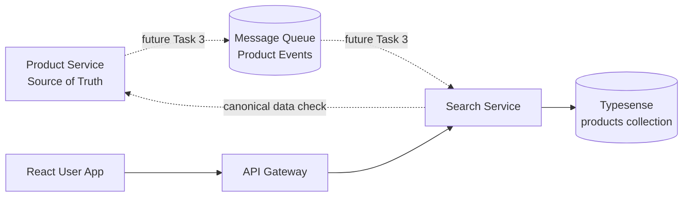
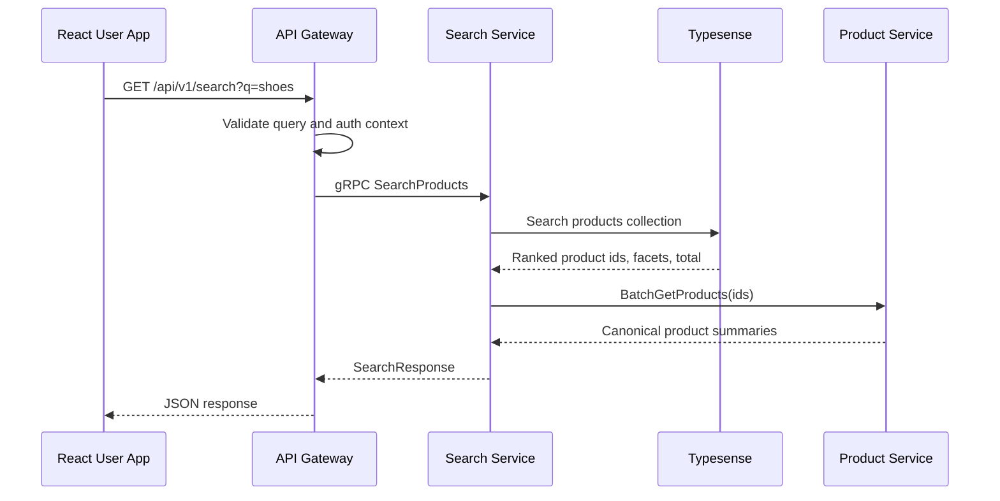
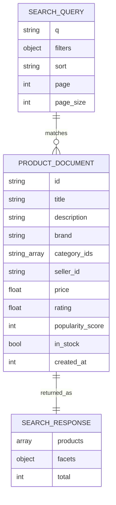

# 🔎 Search Service - Task 1: Define Search Schema


## 📌 Task Summary

| Field | Detail |
|---|---|
| Service | Search Service |
| Task | Task 1 - Define search schema |
| Source | `docs/01-micro-tasks.md` -> `Search Service (Typesense)` -> Task 1 |
| Priority | `P0` |
| Dependency | Product catalog |
| Main Goal | Product searchable fields, facets, sorting, typo tolerance, aur synonyms define karna |
| Output Type | Documentation-only schema guide |

> **Simple Hinglish goal:** Is task ka purpose hai Search Service ke liye clear schema contract banana. Product data Product Service me source of truth rahega, aur Search Service Typesense me sirf searchable/indexed copy rakhega.

---

## ✅ Final Output Created

```text
TaskImplementation/
└── Search Service/
    └── task1.md
```

### Why this structure?

| Path | Purpose |
|---|---|
| `TaskImplementation/` | Saare task-wise implementation guides ka central folder |
| `TaskImplementation/Search Service/` | Search Service ke implementation guides ka group |
| `task1.md` | Sirf Search Service - Task 1 ka detailed guide |

> 🟢 **Boundary:** Is task me actual Search Service code, Typesense cluster setup, product event consumer, API endpoint, autocomplete endpoint, ya reindex job implement nahi kiya gaya. Wo later tasks ka scope hai.

---

## 🧭 Requirement Sources Studied

| Document | Kya use kiya gaya |
|---|---|
| `docs/01-micro-tasks.md` | Task name, scope, dependency, priority |
| `docs/04-microservice-design.md` | Search Service purpose, responsibilities, gRPC methods, REST routes |
| `docs/05-database-design.md` | Typesense `products` collection fields |
| `docs/02-system-architecture.md` | Product browse request flow |
| `docs/03-folder-structure.md` | Expected `search-service` code layout |
| `api/master-api.json` | Search API request/response contracts |

---

## 🧱 Scope of Task 1

### ✅ Included

- Product search document shape define karna
- Typesense `products` collection schema define karna
- Searchable fields define karna
- Facets and filters define karna
- Sorting strategy define karna
- Typo tolerance strategy define karna
- Synonym model define karna
- Example schema snippets and request examples dena
- Architecture and flow diagrams add karna

### 🚫 Not Included

| Not Included | Reason |
|---|---|
| Typesense Docker/Kubernetes setup | Task 2 ka scope |
| Product event consumer/indexer | Task 3 ka scope |
| Search API implementation | Task 4 ka scope |
| Autocomplete API | Task 5 ka scope |
| CMS synonym CRUD | Task 6 ka scope |
| Zero-result analytics | Task 7 ka scope |
| Full reindex job | Task 8 ka scope |

---

## 🧩 High-Level Architecture



### Hinglish explanation

- **Product Service** canonical product data own karta hai.
- **Search Service** fast search ke liye optimized indexed copy rakhta hai.
- **Typesense** full-text search, filters, facets, typo tolerance, aur sorting ke liye use hoga.
- Product changes future me events ke through Search Service tak aayenge.
- User search request gateway se Search Service tak jayegi.

---

## 🪜 Step-by-Step Implementation Guide

### Step 1: Search Service ka ownership clear kiya

Search Service ka kaam product data own karna nahi hai. Ye sirf searchable projection own karega.

| Data Type | Owner |
|---|---|
| Product title, description, brand, category, variants | Product Service |
| Search index document | Search Service |
| Search query response ranking | Typesense/Search Service |
| Final product summary | Product Service se verify ho sakta hai |

> 🟡 **Rule:** Search index stale ho sakta hai because product events async honge. Final checkout ya product detail ke liye Product Service hi trusted source rahega.

---

### Step 2: Typesense collection decide kiya

Docs ke according Search Service primary collection:

```text
products
```

### Collection purpose

`products` collection me har published product ka searchable document store hoga.

Example:

```json
{
  "id": "prod_123",
  "title": "Nike Running Shoes",
  "description": "Lightweight running shoes for daily training",
  "brand": "Nike",
  "category_ids": ["cat_shoes", "cat_running"],
  "seller_id": "seller_456",
  "price": 2499.0,
  "rating": 4.5,
  "popularity_score": 982,
  "in_stock": true,
  "created_at": 1735689600
}
```

### Why only published products?

Search results me draft, rejected, blocked, deleted, ya unpublished products nahi dikhne chahiye. Isliye indexer future Task 3 me sirf searchable/published products ko index karega.

---

### Step 3: Product document fields define kiye

Ye fields `docs/05-database-design.md` ke Typesense schema se align hain.

| Field | Type | Required | Searchable | Facet | Sort | Why needed |
|---|---|---:|---:|---:|---:|---|
| `id` | `string` | ✅ | ❌ | ❌ | ❌ | Product id, Typesense document id |
| `title` | `string` | ✅ | ✅ | ❌ | ❌ | Main keyword search |
| `description` | `string` | ❌ | ✅ | ❌ | ❌ | Long-tail search terms |
| `brand` | `string` | ❌ | ✅ | ✅ | ❌ | Brand search and filter |
| `category_ids` | `string[]` | ✅ | ❌ | ✅ | ❌ | Category filter/browse |
| `seller_id` | `string` | ✅ | ❌ | ✅ | ❌ | Seller catalog filter |
| `price` | `float` | ✅ | ❌ | ✅ | ✅ | Price filter and sort |
| `rating` | `float` | ❌ | ❌ | ✅ | ✅ | Rating filter and sort |
| `popularity_score` | `int32` | ✅ | ❌ | ✅ | ✅ | Default ranking signal |
| `in_stock` | `bool` | ✅ | ❌ | ✅ | ❌ | Out-of-stock filtering |
| `created_at` | `int64` | ✅ | ❌ | ❌ | ✅ | New arrivals sort |

### Field design explanation

- `title` highest weight lega because users usually product name search karte hain.
- `brand` searchable bhi hai aur facet bhi, because user "nike shoes" search bhi karega aur brand filter bhi lagayega.
- `category_ids` array hai because product category tree me parent and child dono useful ho sakte hain.
- `price`, `rating`, `popularity_score`, `created_at` sorting ke liye important hain.
- `in_stock` default filter me use ho sakta hai taaki unavailable products avoid ho.

---

### Step 4: Typesense schema contract define kiya

> This is the planned schema contract. Actual Typesense setup Task 2 me hoga.

```json
{
  "name": "products",
  "fields": [
    { "name": "id", "type": "string" },
    { "name": "title", "type": "string" },
    { "name": "description", "type": "string", "optional": true },
    { "name": "brand", "type": "string", "facet": true, "optional": true },
    { "name": "category_ids", "type": "string[]", "facet": true },
    { "name": "seller_id", "type": "string", "facet": true },
    { "name": "price", "type": "float", "facet": true, "sort": true },
    { "name": "rating", "type": "float", "facet": true, "sort": true, "optional": true },
    { "name": "popularity_score", "type": "int32", "facet": true, "sort": true },
    { "name": "in_stock", "type": "bool", "facet": true },
    { "name": "created_at", "type": "int64", "sort": true }
  ],
  "default_sorting_field": "popularity_score"
}
```

### Why `default_sorting_field = popularity_score`?

Default search me user usually best/relevant products dekhna chahta hai. `popularity_score` clicks, purchases, wishlist, cart activity, aur manual merchandising signals se future me calculate ho sakta hai.

---

### Step 5: Searchable fields strategy define ki

Search query ke liye primary fields:

```text
title, brand, description
```

Recommended query weights:

```text
title: 5
brand: 3
description: 1
```

### Why weights?

| Field | Weight | Reason |
|---|---:|---|
| `title` | 5 | Product name exact match most important hai |
| `brand` | 3 | Brand intent strong hota hai, jaise "nike shoes" |
| `description` | 1 | Helpful hai, but noisy ho sakta hai |

Example search params:

```json
{
  "q": "nike running shoes",
  "query_by": "title,brand,description",
  "query_by_weights": "5,3,1"
}
```

---

### Step 6: Facets and filters define kiye

Facets user ko filters dikhane ke kaam aate hain.

### Supported facets

| Facet | Example UI Use |
|---|---|
| `brand` | Brand checkbox filter |
| `category_ids` | Category navigation/filter |
| `seller_id` | Seller/store filter |
| `price` | Price range filter |
| `rating` | Rating filter |
| `popularity_score` | Merchandising/ranking bucket |
| `in_stock` | Availability toggle |

### Recommended `facet_by`

```text
brand,category_ids,seller_id,price,rating,in_stock
```

### Filter examples

Search only in-stock Nike products:

```text
brand:=Nike && in_stock:=true
```

Search shoes category under price range:

```text
category_ids:=[cat_shoes] && price:>=1000 && price:<=5000
```

Search by seller:

```text
seller_id:=seller_456
```

---

### Step 7: Sorting strategy define ki

### Supported sort options

| Public Sort Key | Typesense Sort | User Meaning |
|---|---|---|
| `relevance` | Default ranking + `popularity_score:desc` | Best match |
| `price_low_to_high` | `price:asc` | Cheapest first |
| `price_high_to_low` | `price:desc` | Expensive first |
| `rating_high_to_low` | `rating:desc` | Best rated first |
| `newest` | `created_at:desc` | New arrivals |
| `popular` | `popularity_score:desc` | Trending/popular |

### API-level sort mapping

```go
var SearchSortMapping = map[string]string{
    "relevance":          "popularity_score:desc",
    "price_low_to_high":  "price:asc",
    "price_high_to_low":  "price:desc",
    "rating_high_to_low": "rating:desc",
    "newest":             "created_at:desc",
    "popular":            "popularity_score:desc",
}
```

### Hinglish explanation

Frontend readable sort keys bhejega, jaise `price_low_to_high`. Search Service internally usko Typesense sort string me convert karega. Isse frontend ko Typesense-specific syntax samajhne ki zarurat nahi padegi.

---

### Step 8: Typo tolerance define ki

E-commerce search me typo tolerance important hota hai. User "snikers" likhe to "sneakers" results milne chahiye.

### Recommended typo policy

| Field | Typo Tolerance | Reason |
|---|---|---|
| `title` | High | Product name typo common hota hai |
| `brand` | Medium | Brand typo possible hai, but overmatch avoid karna hai |
| `description` | Low | Description broad hota hai, zyada typo tolerance noisy result de sakti hai |

Example search params:

```json
{
  "q": "nik runing shos",
  "query_by": "title,brand,description",
  "query_by_weights": "5,3,1",
  "num_typos": "2,1,1",
  "prefix": "true,true,false"
}
```

### Why `prefix`?

- `title` and `brand` prefix search helpful hai for partial terms.
- `description` prefix search broad ho sakta hai, isliye false rakha gaya.

---

### Step 9: Synonym strategy define ki

Synonyms users ke different words ko same intent se connect karte hain.

### Project-level synonym shape

`api/master-api.json` me synonym input:

```json
{
  "root": "mobile",
  "synonyms": ["phone", "smartphone", "cellphone"]
}
```

### Example synonyms

| Root | Synonyms | Why useful |
|---|---|---|
| `mobile` | `phone`, `smartphone`, `cellphone` | Common electronics terms |
| `shoes` | `sneakers`, `footwear`, `trainers` | Fashion search variations |
| `tv` | `television`, `smart tv`, `led tv` | Category term variations |
| `laptop` | `notebook`, `ultrabook` | Electronics alternate names |

### Synonym boundary

| Item | Scope |
|---|---|
| Synonym model definition | Task 1 |
| Synonym CRUD API | Task 6 |
| CMS/Superadmin UI for synonyms | Superadmin/CMS later tasks |

---

### Step 10: Search request contract align kiya

`api/master-api.json` ke according public search endpoint:

```text
GET /api/v1/search
```

Internal gRPC method:

```text
SearchService.SearchProducts
```

Request schema:

```json
{
  "q": "string",
  "filters": {},
  "sort": "string",
  "page": 1,
  "page_size": 20
}
```

Response schema:

```json
{
  "products": [],
  "facets": {},
  "total": 0
}
```

### Example REST request

```http
GET /api/v1/search?q=running%20shoes&filters[brand]=Nike&filters[in_stock]=true&sort=popular&page=1&page_size=20
```

### Example internal normalized search input

```json
{
  "q": "running shoes",
  "filter_by": "brand:=Nike && in_stock:=true",
  "sort_by": "popularity_score:desc",
  "facet_by": "brand,category_ids,seller_id,price,rating,in_stock",
  "page": 1,
  "per_page": 20
}
```

---

## 🔄 Product Browse Flow



### Hinglish explanation

Search Service pehle Typesense se ranked ids aur facets leta hai. Phir Product Service se canonical product summary verify kar sakta hai, taaki stale ya hidden product frontend me na dikhe.

---

## 🧬 Schema Diagram



---

## 🧪 Validation Checklist

Task 1 complete tab maana jayega jab ye questions ka answer clear ho:

| Check | Expected Answer |
|---|---|
| Search collection ka naam clear hai? | `products` |
| Product fields defined hain? | Yes |
| Searchable fields clear hain? | `title`, `brand`, `description` |
| Facet fields clear hain? | `brand`, `category_ids`, `seller_id`, `price`, `rating`, `in_stock` |
| Sort keys clear hain? | relevance, price, rating, newest, popular |
| Typo tolerance policy clear hai? | Field-wise defined |
| Synonym shape clear hai? | `root` + `synonyms` |
| Product Service ownership respected hai? | Yes |
| Task 2+ implementation avoid hua? | Yes |

---

## 🧰 External Libraries / Tools

### 1. Typesense

| Field | Detail |
|---|---|
| What | Open-source search engine |
| Why | Fast product search, typo tolerance, facets, filters, sorting, synonyms |
| Used in this task? | Schema target define kiya gaya, server setup nahi kiya |
| Actual setup task | Search Service - Task 2 |

#### Install/use reference for later task

> ⚠️ Ye command Task 2 ke liye reference hai. Task 1 me repo me koi Typesense setup file add nahi ki gayi.

```bash
TYPESENSE_VERSION="<pinned-version>"

docker run \
  -p 8108:8108 \
  -v /tmp/typesense-data:/data \
  "typesense/typesense:${TYPESENSE_VERSION}" \
  --data-dir /data \
  --api-key=local-dev-key \
  --enable-cors
```

`<pinned-version>` ko Task 2 me project-approved Typesense version se replace karna hai. Production aur team development ke liye floating `latest` tag avoid karna better hota hai.

Create collection example:

```bash
curl -X POST "http://localhost:8108/collections" \
  -H "X-TYPESENSE-API-KEY: local-dev-key" \
  -H "Content-Type: application/json" \
  -d '{
    "name": "products",
    "fields": [
      { "name": "id", "type": "string" },
      { "name": "title", "type": "string" },
      { "name": "description", "type": "string", "optional": true },
      { "name": "brand", "type": "string", "facet": true, "optional": true },
      { "name": "category_ids", "type": "string[]", "facet": true },
      { "name": "seller_id", "type": "string", "facet": true },
      { "name": "price", "type": "float", "facet": true, "sort": true },
      { "name": "rating", "type": "float", "facet": true, "sort": true, "optional": true },
      { "name": "popularity_score", "type": "int32", "facet": true, "sort": true },
      { "name": "in_stock", "type": "bool", "facet": true },
      { "name": "created_at", "type": "int64", "sort": true }
    ],
    "default_sorting_field": "popularity_score"
  }'
```

### 2. Typesense Go Client

| Field | Detail |
|---|---|
| What | Go client for Typesense API interaction |
| Why | Future Search Service code se collection create, documents upsert, search execute karne ke liye |
| Used in this task? | No package installed |
| Future use | Task 2/3/4 me service implementation ke time |

Install reference:

```bash
go get github.com/typesense/typesense-go/typesense
```

Example future usage:

```go
package schema

var ProductsCollectionSchema = map[string]any{
    "name": "products",
    "fields": []map[string]any{
        {"name": "id", "type": "string"},
        {"name": "title", "type": "string"},
        {"name": "description", "type": "string", "optional": true},
        {"name": "brand", "type": "string", "facet": true, "optional": true},
        {"name": "category_ids", "type": "string[]", "facet": true},
        {"name": "seller_id", "type": "string", "facet": true},
        {"name": "price", "type": "float", "facet": true, "sort": true},
        {"name": "rating", "type": "float", "facet": true, "sort": true, "optional": true},
        {"name": "popularity_score", "type": "int32", "facet": true, "sort": true},
        {"name": "in_stock", "type": "bool", "facet": true},
        {"name": "created_at", "type": "int64", "sort": true},
    },
    "default_sorting_field": "popularity_score",
}
```

### 3. Mermaid

| Field | Detail |
|---|---|
| What | Markdown-friendly diagram syntax |
| Why | Architecture and flow diagrams readable banane ke liye |
| Install needed? | Usually no, GitHub/GitLab/Markdown tools render kar dete hain |
| Used here? | Yes, diagrams in this markdown file |

---

## 🗂️ Expected Future Search Service Folder Structure

`docs/03-folder-structure.md` ke according future implementation roughly aisi hogi:

```text
backend/
└── services/
    └── search-service/
        ├── cmd/
        │   └── server/
        │       └── main.go
        ├── internal/
        │   ├── schema/
        │   │   └── typesense_schema.go
        │   ├── indexer/
        │   │   └── product_indexer.go
        │   ├── usecase/
        │   │   └── search_products.go
        │   ├── repository/
        │   │   └── typesense_repository.go
        │   ├── transport/
        │   │   └── grpc/
        │   └── events/
        │       └── product_consumer.go
        └── deploy/
```

### Task 1 file responsibility in future code

| Future File | Task 1 relation |
|---|---|
| `internal/schema/typesense_schema.go` | Is guide ka schema code me convert hoga |
| `internal/repository/typesense_repository.go` | Typesense collection/search calls implement karega |
| `internal/indexer/product_indexer.go` | Product events ko schema document me map karega |
| `internal/usecase/search_products.go` | Query, filters, sort mapping use karega |

> 🔵 **Note:** Ye folder structure sirf planned implementation guide hai. Is task me ye code files create nahi ki gayi.

---

## 🧾 Final Schema Contract

### Collection

```text
products
```

### Searchable fields

```text
title, brand, description
```

### Facet fields

```text
brand, category_ids, seller_id, price, rating, in_stock
```

### Sort fields

```text
price, rating, popularity_score, created_at
```

### Default sort

```text
popularity_score:desc
```

### Synonym model

```json
{
  "root": "mobile",
  "synonyms": ["phone", "smartphone", "cellphone"]
}
```

---

## ✅ Task 1 Completion Summary

| Item | Status |
|---|---|
| `TaskImplementation/Search Service/` folder created | ✅ Done |
| `task1.md` created | ✅ Done |
| Search schema documented | ✅ Done |
| Searchable fields documented | ✅ Done |
| Facets documented | ✅ Done |
| Sorting documented | ✅ Done |
| Typo tolerance documented | ✅ Done |
| Synonyms documented | ✅ Done |
| External tools explained | ✅ Done |
| Diagrams added | ✅ Done |
| No beyond-scope implementation | ✅ Confirmed |

> 🟢 **Final note:** Search Service - Task 1 ka output ek clear schema blueprint hai. Is blueprint ko next tasks me Typesense setup, product indexer, Search API, autocomplete, synonyms management, analytics, aur reindex job ke base ke roop me use kiya jayega.
