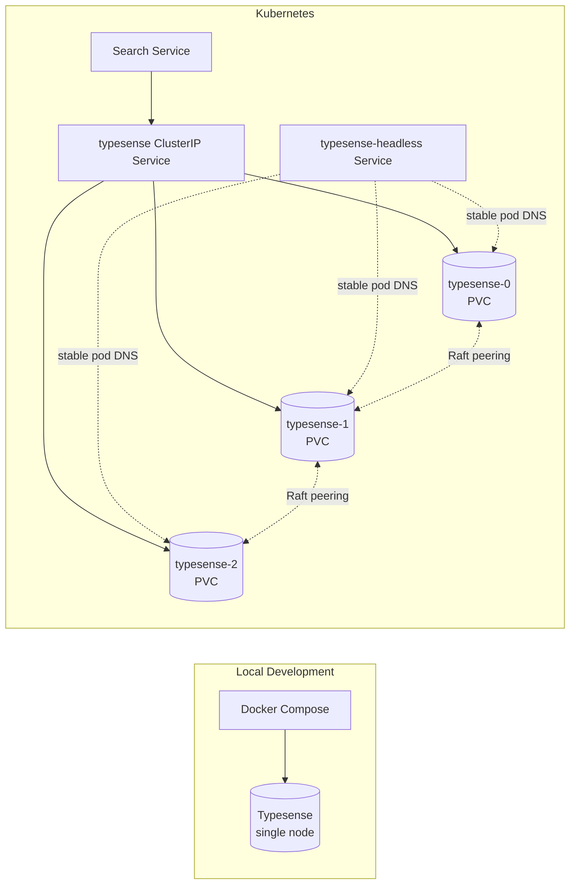
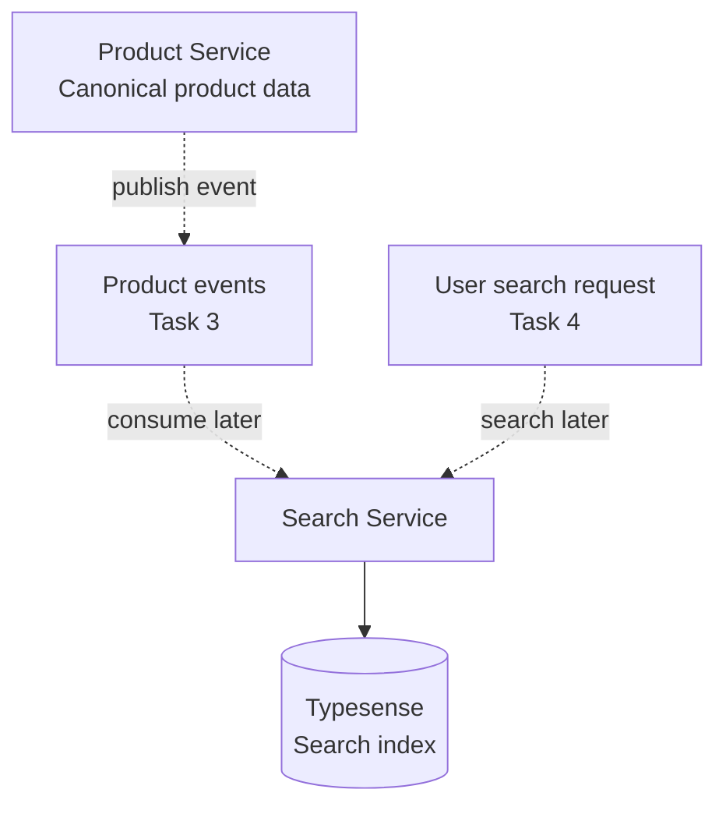

# 🔎 Search Service - Task 2: Setup Typesense


## 📌 Task Summary

| Field | Detail |
|---|---|
| Service | Search Service |
| Task | Task 2 - Setup Typesense |
| Source | `docs/01-micro-tasks.md` -> `Search Service (Typesense)` -> Task 2 |
| Priority | `P0` |
| Dependency | External services |
| Main Goal | Local and Kubernetes Typesense cluster configure karna |
| Output Type | Documentation-only implementation guide |

> **Simple Hinglish goal:** Is task ka purpose hai Search Service ke liye Typesense ko local development aur Kubernetes environment me ready karna. Search data yahi index hoga. Product indexing, Search API, autocomplete, synonyms CRUD, aur reindex job later tasks me aayenge.

---

## ✅ Final Output Created

```text
TaskImplementation/
└── Search Service/
    ├── task1.md
    └── task2.md
```

### Why this structure?

| Path | Purpose |
|---|---|
| `TaskImplementation/` | Saare task-wise implementation guides ka central folder |
| `TaskImplementation/Search Service/` | Search Service ke implementation guides ka group |
| `task2.md` | Sirf Search Service - Task 2 ka detailed guide |

> 🟢 **Boundary:** Is request me sirf `task2.md` guide create ki gayi hai. Actual `infra/compose`, `infra/k8s`, ya service code files add nahi kiye gaye, kyunki user output ne required folder structure aur markdown content hi manga hai.

---

## 🧭 Requirement Sources Studied

| Document | Kya use kiya gaya |
|---|---|
| `docs/01-micro-tasks.md` | Task 2 ka exact scope: `Setup Typesense` |
| `docs/04-microservice-design.md` | Search Service purpose, Typesense collections, REST/gRPC routes |
| `docs/03-folder-structure.md` | Expected `search-service` layout |
| `docs/11-devops-external-services.md` | Local Docker Compose and Kubernetes external service expectations |
| `TaskImplementation/Platform Foundation/task4.md` | Local Typesense image/version/env patterns |
| `TaskImplementation/Platform Foundation/task8.md` | Kubernetes ConfigMap/Secret style |
| `TaskImplementation/Search Service/task1.md` | Search schema boundary and `products` collection contract |
| [Typesense install docs](https://typesense.org/docs/guide/install-typesense.html) | Official Docker/self-hosting install reference |
| [Typesense server config docs](https://typesense.org/docs/27.0/api/server-configuration.html) | Official flags: `--api-key`, `--data-dir`, `--nodes`, ports |
| [Typesense high availability docs](https://typesense.org/docs/guide/high-availability.html) | Cluster nodes file and `/debug` verification |
| [Kubernetes StatefulSet docs](https://kubernetes.io/docs/concepts/workloads/controllers/statefulset/) | Stateful identity, storage, headless service behavior |

---

## 🧱 Scope of Task 2

### ✅ Included

- Typesense version pinning strategy
- Local Docker Compose Typesense service design
- Local `.env` values for Search Service connectivity
- Local health check and smoke test commands
- Kubernetes namespace, Secret, ConfigMap, Services, StatefulSet, PVC, probes, and PDB design
- Search Service connection configuration
- Security rules for API keys
- Operations checklist for health, debug, logs, backup, and upgrades
- Beginner-friendly diagrams and code snippets

### 🚫 Not Included

| Not Included | Reason |
|---|---|
| Product schema design | Already covered in Search Service Task 1 |
| Product event consumer/indexer | Task 3 ka scope |
| Public Search API | Task 4 ka scope |
| Autocomplete API | Task 5 ka scope |
| Synonym management API | Task 6 ka scope |
| Zero-result tracking | Task 7 ka scope |
| Full catalog reindex job | Task 8 ka scope |
| Frontend search UI | Frontend App Shell/Search tasks ka scope |

---

## 🧩 High-Level Architecture



### Hinglish explanation

- **Local dev** me single-node Typesense enough hai because developer ko fast setup chahiye.
- **Kubernetes** me StatefulSet use hoga because Typesense ko stable pod identity aur persistent disk chahiye.
- **Search Service** Typesense ko internal service DNS se call karega.
- **Product indexer** Task 3 me product events consume karke Typesense me documents upsert/delete karega.

---

## 🧠 Key Decisions

| Decision | Value | Why |
|---|---|---|
| Search engine | Typesense | Project docs me selected hai; typo tolerance, facets, filters, sorting ke liye suitable |
| Local topology | Single node | Beginner-friendly, fast, low resource |
| Kubernetes topology | 3-node StatefulSet example | HA cluster ke liye quorum-friendly starting point |
| Image version | `typesense/typesense:27.1` | Platform Foundation guide me pinned version use hua hai |
| API port | `8108` | Typesense default API port |
| Peering port | `8107` | Typesense default peering port |
| Data directory | `/data` | Docker volume/PVC mount path simple rakha gaya |
| API key storage | Secret/env | API key sensitive hai; git me real value nahi aani chahiye |
| Browser access | Not direct | Frontend Gateway/Search Service ko call karega, Typesense admin key browser me expose nahi hogi |

---

## 🗂️ Recommended Implementation Folder Structure

> Ye structure Task 2 ke actual infra implementation ke liye recommended hai. Is request me sirf `TaskImplementation/Search Service/task2.md` create hua hai.

```text
ecommerce-platform/
├── TaskImplementation/
│   └── Search Service/
│       ├── task1.md
│       └── task2.md
├── infra/
│   ├── compose/
│   │   ├── docker-compose.local.yml
│   │   └── .env.local.example
│   └── k8s/
│       └── data/
│           └── typesense/
│               ├── namespace.yaml
│               ├── secret.example.yaml
│               ├── configmap.yaml
│               ├── service-headless.yaml
│               ├── service.yaml
│               ├── statefulset.yaml
│               └── pdb.yaml
└── backend/
    └── services/
        └── search-service/
            └── .env.example
```

### Folder responsibility

| Folder/File | Responsibility |
|---|---|
| `infra/compose/docker-compose.local.yml` | Local Typesense container define karega |
| `infra/compose/.env.local.example` | Local non-secret sample env values |
| `infra/k8s/data/typesense/` | Kubernetes Typesense manifests |
| `secret.example.yaml` | Secret shape, placeholder values only |
| `configmap.yaml` | Cluster nodes file and non-secret config |
| `statefulset.yaml` | Stateful Typesense pods and PVCs |
| `backend/services/search-service/.env.example` | Search Service Typesense connection variables |

---

## 🪜 Step-by-Step Implementation Guide

## Step 1: Task boundary clear karo

Task 2 ka kaam Typesense runtime setup karna hai. Iska matlab:

- Typesense container local machine pe run ho sake.
- Kubernetes me Typesense durable storage ke saath run ho sake.
- Search Service ke paas connection env variables clear hon.
- Health/debug commands documented hon.

Task 2 me product documents index nahi honge. Wo Task 3 me hoga.

---

## Step 2: Typesense version pin karo

Local docs me `typesense/typesense:latest` example milta hai, but project implementation guide me pinned version better hai.

```text
typesense/typesense:27.1
```

### Why pinned version?

| Reason | Explanation |
|---|---|
| Predictable builds | Team ke sab developers same Typesense behavior dekhenge |
| Safer upgrades | Version change intentional PR me review hoga |
| Production stability | `latest` tag se surprise breaking changes avoid honge |

### Upgrade rule

```text
27.1 -> 27.x patch -> staging smoke test -> production rollout
```

> 🟡 **Rule:** Typesense image version bump karne se pehle staging index backup/snapshot plan ready rakho.

---

## Step 3: Local env variables define karo

Local Docker Compose ke liye sample env:

```dotenv
TYPESENSE_HOST=typesense
TYPESENSE_PORT=8108
TYPESENSE_PROTOCOL=http
TYPESENSE_API_KEY=dev-typesense-key
```

Host machine se direct test karna ho to:

```dotenv
TYPESENSE_HOST=localhost
TYPESENSE_PORT=8108
TYPESENSE_PROTOCOL=http
TYPESENSE_API_KEY=dev-typesense-key
```

### Hinglish explanation

- Agar **Search Service bhi Docker Compose network ke andar** run ho raha hai, host `typesense` hoga.
- Agar **Search Service host machine pe direct** run ho raha hai, host `localhost` hoga.
- API key local dev me simple ho sakti hai, but production me strong random secret use karna mandatory hai.

---

## Step 4: Local Docker Compose service add karo

Recommended Compose snippet:

```yaml
services:
  typesense:
    image: typesense/typesense:27.1
    container_name: ecommerce-typesense
    restart: unless-stopped
    command:
      - "--data-dir=/data"
      - "--api-key=${TYPESENSE_API_KEY}"
      - "--enable-cors"
    ports:
      - "8108:8108"
    volumes:
      - typesense_data:/data
    healthcheck:
      test: ["CMD-SHELL", "wget -q -O - http://localhost:8108/health | grep true"]
      interval: 10s
      timeout: 5s
      retries: 10
    networks:
      - ecommerce-local

volumes:
  typesense_data:

networks:
  ecommerce-local:
    driver: bridge
```

### How this part was built

- `image` project guide ke pinned version se liya gaya.
- `--data-dir=/data` Typesense disk data ke liye hai.
- `--api-key=${TYPESENSE_API_KEY}` hardcoded key avoid karta hai.
- `--enable-cors` local debugging ke liye helpful hai.
- `typesense_data:/data` container recreate ke baad index data preserve karta hai.
- Healthcheck `/health` endpoint use karta hai.

> 🔴 **Production note:** Browser ko Typesense direct call nahi karna chahiye. Production me CORS disabled ya restricted hona better hai, kyunki Search Service hi Typesense ka server-side client hoga.

---

## Step 5: Local startup commands run karo

```bash
docker compose -f infra/compose/docker-compose.local.yml --env-file infra/compose/.env.local up -d typesense
```

Status check:

```bash
docker compose -f infra/compose/docker-compose.local.yml ps typesense
```

Logs check:

```bash
docker compose -f infra/compose/docker-compose.local.yml logs -f typesense
```

Health check:

```bash
curl http://localhost:8108/health
```

Expected response:

```json
{
  "ok": true
}
```

API key check:

```bash
curl "http://localhost:8108/collections" \
  -H "X-TYPESENSE-API-KEY: dev-typesense-key"
```

Expected first-run response:

```json
[]
```

### Hinglish explanation

Fresh Typesense me collections empty rahengi. `products` collection Task 1 schema ke basis pe service startup/migration step me create hogi, but actual schema creation code Task 3/4 ke around implement hoga.

---

## Step 6: Search Service connection config define karo

Search Service ko Typesense ke saath connect karne ke liye config keys predictable honi chahiye.

```dotenv
TYPESENSE_HOST=typesense
TYPESENSE_PORT=8108
TYPESENSE_PROTOCOL=http
TYPESENSE_API_KEY=dev-typesense-key
```

Example Go config shape:

```go
package config

type TypesenseConfig struct {
    Host     string
    Port     string
    Protocol string
    APIKey   string
}

func (c TypesenseConfig) Endpoint() string {
    return c.Protocol + "://" + c.Host + ":" + c.Port
}
```

### How this part was built

Search Service code ko Typesense-specific values hardcode nahi karni chahiye. Env-driven config se local, staging, production sab same binary use kar sakte hain.

> 🟡 **Task boundary:** Typesense Go client install/use Task 3 ya Task 4 me hoga. Task 2 me sirf runtime and connection contract ready kiya ja raha hai.

---

## Step 7: Kubernetes namespace create karo

Typesense platform dependency hai, isliye `data` namespace me rakhna clean rahega.

```yaml
apiVersion: v1
kind: Namespace
metadata:
  name: data
  labels:
    app.kubernetes.io/part-of: ecommerce-platform
    app.kubernetes.io/component: data-platform
```

Apply command:

```bash
kubectl apply -f infra/k8s/data/typesense/namespace.yaml
```

### Hinglish explanation

`data` namespace me MySQL, MongoDB, Redis, Typesense, RabbitMQ/Kafka jaise infra components grouped reh sakte hain. Backend services `core` namespace me rahenge aur DNS se `typesense.data.svc.cluster.local` call karenge.

---

## Step 8: Kubernetes Secret define karo

Typesense admin API key secret hai. Real value git me commit nahi karni.

```yaml
apiVersion: v1
kind: Secret
metadata:
  name: typesense-secret
  namespace: data
  labels:
    app.kubernetes.io/name: typesense
    app.kubernetes.io/part-of: ecommerce-platform
type: Opaque
stringData:
  TYPESENSE_API_KEY: "change-me"
```

Safer real-environment command:

```bash
kubectl create secret generic typesense-secret \
  --namespace data \
  --from-literal=TYPESENSE_API_KEY='replace-with-strong-random-key'
```

### How this part was built

Typesense bootstrap admin key all operations allow kar sakti hai. Isliye:

- Secret Kubernetes Secret/secret manager se inject hoga.
- Frontend app ko ye key kabhi nahi milegi.
- Later production me Search-only scoped API key create kar sakte hain, but admin key server-side restricted rahegi.

---

## Step 9: Kubernetes cluster nodes ConfigMap banao

Typesense HA mode me nodes file use karta hai. 3-node StatefulSet ke liye stable pod DNS names predictable hote hain.

```yaml
apiVersion: v1
kind: ConfigMap
metadata:
  name: typesense-nodes
  namespace: data
  labels:
    app.kubernetes.io/name: typesense
    app.kubernetes.io/part-of: ecommerce-platform
data:
  nodes: |
    typesense-0.typesense-headless.data.svc.cluster.local:8107:8108,typesense-1.typesense-headless.data.svc.cluster.local:8107:8108,typesense-2.typesense-headless.data.svc.cluster.local:8107:8108
```

### How this part was built

Official Typesense HA docs define nodes file format as:

```text
<peering_address>:<peering_port>:<api_port>
```

Kubernetes StatefulSet pods stable names use karte hain:

```text
typesense-0
typesense-1
typesense-2
```

Headless service ke through full DNS names ban jaate hain:

```text
typesense-0.typesense-headless.data.svc.cluster.local
```

---

## Step 10: Kubernetes Services define karo

### Headless service for pod identity

```yaml
apiVersion: v1
kind: Service
metadata:
  name: typesense-headless
  namespace: data
  labels:
    app.kubernetes.io/name: typesense
    app.kubernetes.io/part-of: ecommerce-platform
spec:
  clusterIP: None
  selector:
    app.kubernetes.io/name: typesense
  ports:
    - name: api
      port: 8108
      targetPort: api
    - name: peering
      port: 8107
      targetPort: peering
```

### Client service for Search Service

```yaml
apiVersion: v1
kind: Service
metadata:
  name: typesense
  namespace: data
  labels:
    app.kubernetes.io/name: typesense
    app.kubernetes.io/part-of: ecommerce-platform
spec:
  type: ClusterIP
  selector:
    app.kubernetes.io/name: typesense
  ports:
    - name: api
      port: 8108
      targetPort: api
```

### Hinglish explanation

- `typesense-headless` cluster ke andar pod-to-pod peering ke liye hai.
- `typesense` normal ClusterIP service Search Service ke liye hai.
- Search Service ko individual pods nahi pata hone chahiye; wo `typesense.data.svc.cluster.local:8108` use karega.

---

## Step 11: Kubernetes StatefulSet define karo

```yaml
apiVersion: apps/v1
kind: StatefulSet
metadata:
  name: typesense
  namespace: data
  labels:
    app.kubernetes.io/name: typesense
    app.kubernetes.io/part-of: ecommerce-platform
spec:
  serviceName: typesense-headless
  replicas: 3
  selector:
    matchLabels:
      app.kubernetes.io/name: typesense
  template:
    metadata:
      labels:
        app.kubernetes.io/name: typesense
        app.kubernetes.io/part-of: ecommerce-platform
    spec:
      terminationGracePeriodSeconds: 60
      containers:
        - name: typesense
          image: typesense/typesense:27.1
          imagePullPolicy: IfNotPresent
          args:
            - "--data-dir=/data"
            - "--api-key=$(TYPESENSE_API_KEY)"
            - "--api-port=8108"
            - "--peering-port=8107"
            - "--peering-address=$(POD_NAME).typesense-headless.$(POD_NAMESPACE).svc.cluster.local"
            - "--nodes=/etc/typesense/nodes"
          env:
            - name: POD_NAME
              valueFrom:
                fieldRef:
                  fieldPath: metadata.name
            - name: POD_NAMESPACE
              valueFrom:
                fieldRef:
                  fieldPath: metadata.namespace
            - name: TYPESENSE_API_KEY
              valueFrom:
                secretKeyRef:
                  name: typesense-secret
                  key: TYPESENSE_API_KEY
          ports:
            - name: api
              containerPort: 8108
            - name: peering
              containerPort: 8107
          volumeMounts:
            - name: data
              mountPath: /data
            - name: nodes
              mountPath: /etc/typesense
              readOnly: true
          startupProbe:
            httpGet:
              path: /health
              port: api
            failureThreshold: 30
            periodSeconds: 10
          readinessProbe:
            httpGet:
              path: /health
              port: api
            initialDelaySeconds: 10
            periodSeconds: 10
            timeoutSeconds: 5
          livenessProbe:
            httpGet:
              path: /health
              port: api
            initialDelaySeconds: 30
            periodSeconds: 20
            timeoutSeconds: 5
          resources:
            requests:
              cpu: "500m"
              memory: "1Gi"
            limits:
              cpu: "2"
              memory: "4Gi"
      volumes:
        - name: nodes
          configMap:
            name: typesense-nodes
            items:
              - key: nodes
                path: nodes
  volumeClaimTemplates:
    - metadata:
        name: data
      spec:
        accessModes:
          - ReadWriteOnce
        resources:
          requests:
            storage: 20Gi
```

### How this part was built

| Part | Why |
|---|---|
| `StatefulSet` | Stable pod identity and stable storage ke liye |
| `replicas: 3` | HA cluster ke liye odd-number quorum-friendly setup |
| `serviceName: typesense-headless` | Stable DNS identity generate karne ke liye |
| `volumeClaimTemplates` | Har pod ko apna persistent disk milta hai |
| `--nodes=/etc/typesense/nodes` | Typesense peers ko discover karne ke liye |
| `--peering-address=$(POD_NAME)...` | Har pod apna stable DNS address advertise kare |
| `startupProbe` | Initial boot/index load slow ho to Kubernetes jaldi kill na kare |
| `readinessProbe` | Unready pod pe service traffic avoid ho |
| `livenessProbe` | Stuck process restart ho sake |

> 🟡 **Storage note:** Production me `storageClassName`, disk type, IOPS, backup policy, aur volume expansion policy platform team ke cluster standard ke hisaab se set honge.

---

## Step 12: PodDisruptionBudget add karo

Maintenance ke time ek saath zyada Typesense pods down na ho, iske liye PDB add karo.

```yaml
apiVersion: policy/v1
kind: PodDisruptionBudget
metadata:
  name: typesense-pdb
  namespace: data
  labels:
    app.kubernetes.io/name: typesense
    app.kubernetes.io/part-of: ecommerce-platform
spec:
  minAvailable: 2
  selector:
    matchLabels:
      app.kubernetes.io/name: typesense
```

### Hinglish explanation

3-node cluster me at least 2 pods available rakhna healthy default hai. Node maintenance ya voluntary disruption ke time Kubernetes ko signal milta hai ki ek saath cluster ko weak mat karo.

---

## Step 13: Kubernetes apply order follow karo

Recommended order:

```bash
kubectl apply -f infra/k8s/data/typesense/namespace.yaml
kubectl apply -f infra/k8s/data/typesense/secret.example.yaml
kubectl apply -f infra/k8s/data/typesense/configmap.yaml
kubectl apply -f infra/k8s/data/typesense/service-headless.yaml
kubectl apply -f infra/k8s/data/typesense/service.yaml
kubectl apply -f infra/k8s/data/typesense/statefulset.yaml
kubectl apply -f infra/k8s/data/typesense/pdb.yaml
```

Rollout status:

```bash
kubectl rollout status statefulset/typesense -n data
```

Pods check:

```bash
kubectl get pods -n data -l app.kubernetes.io/name=typesense -o wide
```

Services check:

```bash
kubectl get svc -n data typesense typesense-headless
```

PVC check:

```bash
kubectl get pvc -n data -l app.kubernetes.io/name=typesense
```

---

## Step 14: Kubernetes health and cluster verification karo

Port-forward one pod:

```bash
kubectl port-forward pod/typesense-0 8108:8108 -n data
```

Health:

```bash
curl http://localhost:8108/health
```

Debug:

```bash
curl "http://localhost:8108/debug" \
  -H "X-TYPESENSE-API-KEY: replace-with-strong-random-key"
```

Expected debug shape:

```json
{
  "state": 1,
  "version": "27.1"
}
```

### Cluster state meaning

| `state` | Meaning |
|---:|---|
| `1` | Leader node |
| `4` | Follower node |
| Other value | Logs/debug check karo |

Official HA guidance ke according one leader and remaining followers expected hain. Agar multiple leaders dikhe, cluster formation issue ho sakta hai.

---

## Step 15: Search Service Kubernetes config set karo

Search Service ke ConfigMap me non-secret values:

```yaml
apiVersion: v1
kind: ConfigMap
metadata:
  name: search-service-config
  namespace: core
  labels:
    app.kubernetes.io/name: search-service
    app.kubernetes.io/part-of: ecommerce-platform
data:
  SERVICE_NAME: "search-service"
  ENVIRONMENT: "dev"
  TYPESENSE_HOST: "typesense.data.svc.cluster.local"
  TYPESENSE_PORT: "8108"
  TYPESENSE_PROTOCOL: "http"
```

Search Service Secret me API key:

```yaml
apiVersion: v1
kind: Secret
metadata:
  name: search-service-secret
  namespace: core
  labels:
    app.kubernetes.io/name: search-service
    app.kubernetes.io/part-of: ecommerce-platform
type: Opaque
stringData:
  TYPESENSE_API_KEY: "change-me"
```

### Hinglish explanation

Search Service aur Typesense dono same API key value use karenge, but Search Service ke namespace me bhi secret inject karna padega. Real production me secret manager se dono namespaces me synced secret aa sakta hai.

---

## Step 16: Local and Kubernetes data ownership clear rakho



### Ownership table

| Data | Owner | Task |
|---|---|---|
| Product truth | Product Service | Product Service tasks |
| Search schema | Search Service | Task 1 |
| Typesense runtime | Search Service/Platform infra | Task 2 |
| Product index updates | Search Service indexer | Task 3 |
| Query execution | Search Service API | Task 4 |

> 🟢 **Rule:** Typesense is a searchable projection, not product source of truth.

---

## 📦 External Tools / Libraries Used

## 1. Typesense

| Field | Detail |
|---|---|
| What | Open-source search engine |
| Why used | Product search, typo tolerance, filters, facets, sorting, synonyms |
| Where used | Local Docker Compose and Kubernetes StatefulSet |
| Install/run | Docker image `typesense/typesense:27.1` |

### Local use

```bash
docker run --rm \
  -p 8108:8108 \
  -v typesense_data:/data \
  typesense/typesense:27.1 \
  --data-dir=/data \
  --api-key=dev-typesense-key \
  --enable-cors
```

### Verify

```bash
curl http://localhost:8108/health
```

---

## 2. Docker Compose

| Field | Detail |
|---|---|
| What | Local multi-container runtime |
| Why used | MySQL, MongoDB, Redis, Typesense, RabbitMQ, observability ko local network me run karne ke liye |
| Install | Docker Desktop ya Docker Engine with Compose plugin |
| Use | `docker compose -f infra/compose/docker-compose.local.yml up -d typesense` |

### Common commands

```bash
docker compose -f infra/compose/docker-compose.local.yml ps
docker compose -f infra/compose/docker-compose.local.yml logs -f typesense
docker compose -f infra/compose/docker-compose.local.yml down
```

---

## 3. Kubernetes + kubectl

| Field | Detail |
|---|---|
| What | Container orchestration platform and CLI |
| Why used | Stateful, durable, production-like Typesense deployment ke liye |
| Install | Cloud provider docs, `kind`, `minikube`, or official Kubernetes tooling |
| Use | `kubectl apply -f infra/k8s/data/typesense/` |

### Common commands

```bash
kubectl get pods -n data
kubectl logs -f statefulset/typesense -n data
kubectl describe pod typesense-0 -n data
kubectl port-forward svc/typesense 8108:8108 -n data
```

---

## 4. curl

| Field | Detail |
|---|---|
| What | HTTP CLI client |
| Why used | Health, debug, collection list smoke tests |
| Install | Usually preinstalled on Linux/macOS; otherwise install via OS package manager |
| Use | `curl http://localhost:8108/health` |

---

## 🧪 Smoke Test Checklist

| Check | Command | Expected |
|---|---|---|
| Compose config valid | `docker compose -f infra/compose/docker-compose.local.yml config` | No YAML error |
| Typesense container up | `docker compose -f infra/compose/docker-compose.local.yml ps typesense` | `running` / healthy |
| Local health | `curl http://localhost:8108/health` | `{ "ok": true }` |
| Local API key | `curl -H "X-TYPESENSE-API-KEY: dev-typesense-key" http://localhost:8108/collections` | `[]` on first run |
| Kubernetes pods | `kubectl get pods -n data -l app.kubernetes.io/name=typesense` | 3 pods `Running` |
| Kubernetes PVCs | `kubectl get pvc -n data` | PVCs `Bound` |
| Kubernetes service DNS | Search Service env uses `typesense.data.svc.cluster.local` | Internal connection works |
| Cluster debug | `curl /debug` with API key | One leader, followers healthy |

---

## 🛡️ Security Checklist

| Item | Rule |
|---|---|
| Admin API key | Never expose in frontend or public logs |
| Secret storage | Use Kubernetes Secret/secret manager, not ConfigMap |
| Local dev key | Simple key ok for local only |
| Production key | Strong random key mandatory |
| Network exposure | Keep Typesense internal; do not expose public LoadBalancer by default |
| CORS | Local debugging ok; production me disable/restrict |
| Search-only key | Future scoped key use kar sakte hain, but Task 2 me required nahi |

---

## 🧯 Troubleshooting

| Problem | Likely Reason | Fix |
|---|---|---|
| `curl /health` fail | Container/pod not ready | Logs check karo |
| `401 Unauthorized` | Wrong API key | Secret/env values match karo |
| Compose container restarts | Missing `TYPESENSE_API_KEY` | `.env.local` load ho raha hai ya nahi check karo |
| Kubernetes pod Pending | PVC/storage class issue | `kubectl describe pod` and `kubectl get pvc` |
| Multiple leaders in `/debug` | Cluster peering issue | Nodes ConfigMap, headless service DNS, peering port check karo |
| Follower stuck unhealthy | Recovery lag or bad disk | Logs check karo, PVC health verify karo |
| Search Service cannot connect | Wrong host/namespace DNS | `typesense.data.svc.cluster.local:8108` use karo |
| Data missing after restart | Volume/PVC not mounted | Compose volume/PVC config check karo |

### Useful debug commands

```bash
kubectl describe statefulset typesense -n data
kubectl describe pod typesense-0 -n data
kubectl logs typesense-0 -n data
kubectl get endpoints typesense -n data
kubectl get endpoints typesense-headless -n data
```

---

## 🔄 Backup and Upgrade Notes

### Backup

Typesense data `/data` me store hota hai.

Local:

```bash
docker run --rm \
  -v ecommerce_typesense_data:/data \
  -v "$PWD/backups:/backup" \
  alpine tar czf /backup/typesense-data.tgz -C /data .
```

Kubernetes:

```bash
kubectl get pvc -n data
```

Production me storage provider snapshots use karo:

```text
PVC snapshot -> verify restore in staging -> upgrade/change rollout
```

### Upgrade

Recommended safe order:

```text
1. Read Typesense release notes
2. Snapshot/backup data
3. Upgrade staging image tag
4. Run health + debug + collection smoke tests
5. Run search/indexer integration tests
6. Roll production during low-traffic window
```

> 🔴 **Do not:** `docker compose down -v` ya PVC delete production/staging me casually mat chalana. Isse index data delete ho sakta hai.

---

## ✅ Definition of Done

| Requirement | Status |
|---|---|
| `TaskImplementation/` folder exists | ✅ Done |
| `TaskImplementation/Search Service/` folder exists | ✅ Done |
| `task2.md` created | ✅ Done |
| Step-by-step Hinglish implementation added | ✅ Done |
| Local Typesense setup explained | ✅ Done |
| Kubernetes Typesense cluster setup explained | ✅ Done |
| External tools/libraries documented | ✅ Done |
| Folder structure included | ✅ Done |
| Code examples included | ✅ Done |
| Mermaid diagrams included | ✅ Done |
| Task 3+ implementation avoided | ✅ Done |

---

## 🧾 Final Notes

Search Service - Task 2 ka output Typesense runtime setup ka clear blueprint hai:

- Local dev ke liye single-node Docker Compose setup.
- Kubernetes ke liye 3-node StatefulSet cluster design.
- API key, storage, health checks, DNS, and troubleshooting documented.
- Product indexing/Search API implementation intentionally skip kiya gaya because wo next Search Service tasks ka scope hai.

> 🟢 **Next task:** Search Service - Task 3 me Product events consume karke Typesense `products` collection me documents upsert/delete honge.
