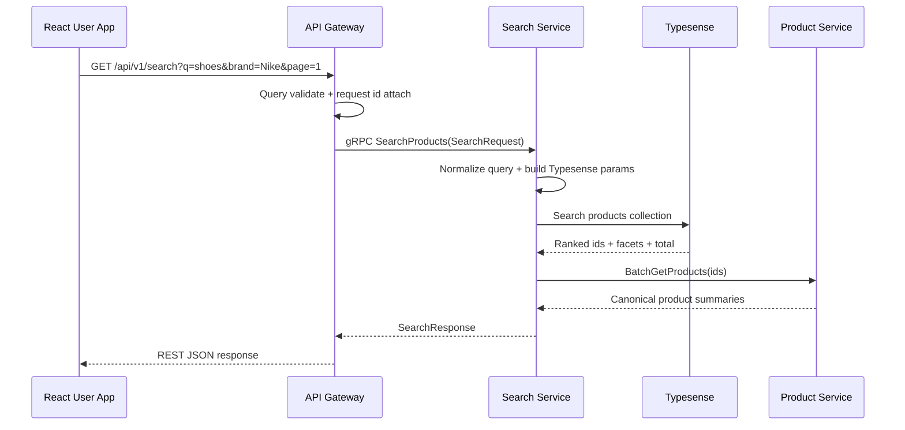
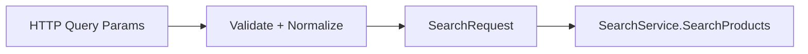
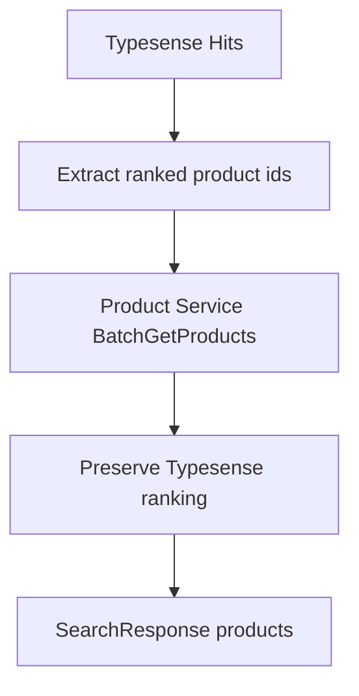
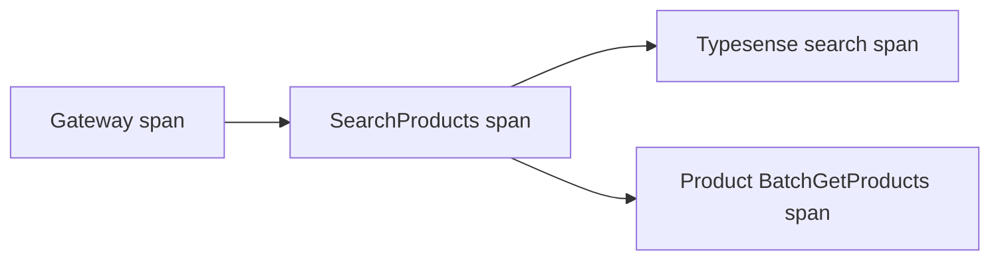
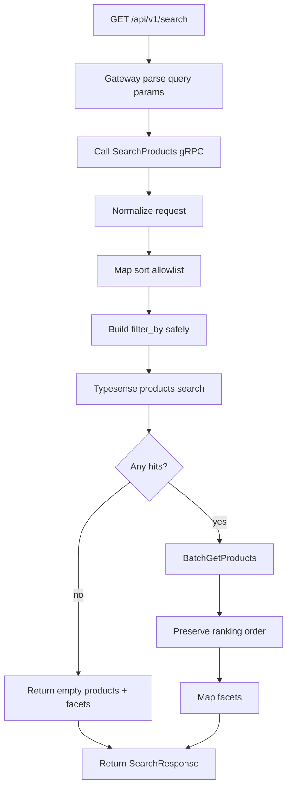

# 🔎 Search Service - Task 4: Search API


## 📌 Task Summary

| Field | Detail |
|---|---|
| Service | Search Service |
| Task | Task 4 - Search API |
| Source | `docs/01-micro-tasks.md` -> `Search Service (Typesense)` -> Task 4 |
| Priority | `P1` |
| Dependency | Typesense setup |
| Main Goal | Query, filter, facet, sort, pagination endpoint banana |
| Output Type | Documentation-only implementation guide |

> **Simple Hinglish goal:** User app se jab buyer search karega, request `GET /api/v1/search` par aayegi. API Gateway usko internal gRPC `SearchService.SearchProducts` me convert karega. Search Service Typesense se ranked product ids, facets, total count lega, Product Service se canonical product summaries hydrate karega, aur frontend ko clean JSON response return karega.

---

## ✅ Final Output Created

```text
TaskImplementation/
└── Search Service/
    ├── task1.md
    ├── task2.md
    ├── task3.md
    └── task4.md
```

### Why this structure?

| Path | Purpose |
|---|---|
| `TaskImplementation/` | Saare task-wise implementation guides ka central folder |
| `TaskImplementation/Search Service/` | Search Service ke implementation guides ka group |
| `task4.md` | Sirf Search Service - Task 4 ka detailed Search API guide |

> 🟢 **Boundary:** Is task me sirf Search API guide define ki gayi hai. Autocomplete API, synonym management, zero-result analytics event publishing, aur full reindex job is task ke scope me nahi hain.

---

## 🧭 Requirement Sources Studied

| Document | Kya use kiya gaya |
|---|---|
| `docs/01-micro-tasks.md` | Task 4 ka exact scope: `Search API` |
| `docs/04-microservice-design.md` | Search Service responsibilities, gRPC methods, REST routes |
| `docs/02-system-architecture.md` | Browser -> Gateway -> Search -> Typesense -> Product request flow |
| `docs/05-database-design.md` | Typesense `products` collection fields, facets, sort fields |
| `docs/03-folder-structure.md` | Expected `backend/services/search-service` layout |
| `api/master-api.json` | Public endpoint, `SearchRequest`, `SearchResponse`, `SearchService.SearchProducts` contract |
| `TaskImplementation/Search Service/task1.md` | Search schema, searchable fields, facets, sorting strategy |
| `TaskImplementation/Search Service/task2.md` | Typesense runtime and connection config |
| `TaskImplementation/Search Service/task3.md` | Product indexer and indexed document assumptions |

---

## 🧱 Scope of Task 4

### ✅ Included

- Public REST endpoint contract: `GET /api/v1/search`
- Internal gRPC method contract: `SearchService.SearchProducts`
- Query normalization: `q`, `page`, `page_size`
- Filter handling: brand, category, seller, price, rating, stock
- Sort handling: relevance, popularity, price, rating, newest
- Typesense query parameter builder
- Facet response mapping
- Pagination response behavior
- Product Service hydration using ranked product ids
- Error handling and validation rules
- Observability and test checklist
- Beginner-friendly code examples and Mermaid diagrams

### 🚫 Not Included

| Not Included | Reason |
|---|---|
| Typesense collection setup | Already covered in Task 2 |
| Product event indexing | Already covered in Task 3 |
| Autocomplete endpoint | Task 5 ka scope |
| Synonym CRUD/admin APIs | Task 6 ka scope |
| Zero-result analytics event publishing | Task 7 ka scope |
| Full catalog reindex command/job | Task 8 ka scope |
| Frontend search UI | User App Frontend task ka scope |

---

## 🧩 High-Level Architecture



### Hinglish explanation

- **Browser** simple REST call karta hai because frontend ke liye REST easy hai.
- **API Gateway** public endpoint own karta hai, validation/rate limiting apply karta hai, phir gRPC call karta hai.
- **Search Service** Typesense query banata hai aur search result ranking preserve karta hai.
- **Typesense** fast text search, facets, filters, sort, pagination handle karta hai.
- **Product Service** canonical product summaries return karta hai, kyunki product source of truth wahi hai.

---

## 🧠 Key Decisions

| Decision | Value | Why |
|---|---|---|
| Public route | `GET /api/v1/search` | `api/master-api.json` me defined public search endpoint |
| Internal method | `SearchService.SearchProducts` | Gateway se Search Service tak typed gRPC call |
| Collection | `products` | Task 1 schema contract |
| Query fields | `title,brand,description` | Product title highest intent, brand strong signal, description long-tail help |
| Query weights | `5,3,1` | Title ko highest ranking weight milega |
| Default page | `1` | Human-friendly pagination |
| Default page size | `20` | Product grid ke liye balanced default |
| Max page size | `100` | Abuse and heavy Typesense queries avoid karne ke liye |
| Auth | Public | Product search logged-out buyer ke liye bhi available hai |
| Hydration | Product Service `BatchGetProducts` | Typesense projection stale ho sakti hai; canonical summary Product Service se aayega |
| Direct Typesense exposure | Never browser-side | Typesense API key frontend me expose nahi karni |

---

## 🗂️ Recommended Implementation Folder Structure

> Ye actual code implementation ke liye recommended structure hai. Is request me sirf `TaskImplementation/Search Service/task4.md` create hua hai.

```text
ecommerce-platform/
├── TaskImplementation/
│   └── Search Service/
│       ├── task1.md
│       ├── task2.md
│       ├── task3.md
│       └── task4.md
├── proto/
│   └── ecommerce/
│       └── search/
│           └── v1/
│               └── search.proto
├── backend/
│   └── services/
│       ├── api-gateway/
│       │   └── internal/
│       │       ├── handlers/
│       │       │   └── search_handler.go
│       │       ├── routes/
│       │       │   └── routes.go
│       │       └── clients/
│       │           └── search_client.go
│       └── search-service/
│           ├── cmd/
│           │   └── server/
│           │       └── main.go
│           └── internal/
│               ├── clients/
│               │   └── product_client.go
│               ├── config/
│               │   └── config.go
│               ├── domain/
│               │   └── search.go
│               ├── repository/
│               │   └── typesense_repository.go
│               ├── transport/
│               │   └── grpc/
│               │       └── search_handler.go
│               └── usecase/
│                   └── search_products.go
└── infra/
    └── compose/
        └── docker-compose.local.yml
```

### Folder responsibility

| Folder/File | Responsibility |
|---|---|
| `proto/ecommerce/search/v1/search.proto` | `SearchProducts` request/response contract define karega |
| `api-gateway/internal/handlers/search_handler.go` | REST query params parse karke gRPC request banayega |
| `api-gateway/internal/clients/search_client.go` | Search Service gRPC client setup karega |
| `search-service/internal/domain/search.go` | Search request, filter, result, facet domain models |
| `search-service/internal/usecase/search_products.go` | Main workflow: validate -> Typesense -> hydrate -> response |
| `search-service/internal/repository/typesense_repository.go` | Typesense client calls wrap karega |
| `search-service/internal/clients/product_client.go` | Product Service `BatchGetProducts` call karega |
| `search-service/internal/transport/grpc/search_handler.go` | gRPC request ko usecase me pass karega |

---

## 🧰 External Libraries / Tools Used

| Tool/Library | Type | Why used | Install / Use |
|---|---|---|---|
| Typesense | Search engine | Fast full-text search, typo tolerance, facets, filters, sorting | Task 2 ke Docker/Kubernetes setup se run hoga |
| `github.com/typesense/typesense-go/v2` | Go client | Search Service se Typesense API ko typed client ke through call karne ke liye | `go get github.com/typesense/typesense-go/v2` |
| gRPC + Protobuf | Internal API contract | Gateway -> Search Service typed communication ke liye | Platform proto strategy ke through generated clients |
| Standard Go `net/http`, `context`, `time`, `strings`, `strconv` | Standard library | Gateway parsing, timeout, normalization, validation | Go ke saath built-in |

### Why extra search tool like Elasticsearch/Algolia use nahi kiya?

Project docs already Typesense choose karte hain. Typesense typo tolerance, facets, simple operations, aur e-commerce search MVP ke liye enough hai. Isliye Task 4 me new search platform introduce nahi kiya gaya.

---

## 🪜 Step-by-Step Implementation Guide

## Step 1: Public API contract define karo

Public endpoint:

```http
GET /api/v1/search
```

Example request:

```http
GET /api/v1/search?q=running%20shoes&brand=Nike&category_id=cat_shoes&min_price=1000&max_price=5000&sort=price_asc&page=1&page_size=20
```

### Supported query params

| Query Param | Type | Example | Purpose |
|---|---|---|---|
| `q` | string | `running shoes` | User search text |
| `brand` | string or comma-separated | `Nike,Puma` | Brand filter |
| `category_id` | string | `cat_shoes` | Category filter |
| `seller_id` | string | `seller_123` | Seller catalog filter |
| `min_price` | number | `1000` | Minimum price filter |
| `max_price` | number | `5000` | Maximum price filter |
| `min_rating` | number | `4` | Minimum rating filter |
| `in_stock` | boolean | `true` | Stock availability filter |
| `sort` | string | `price_asc` | Sort mode |
| `page` | integer | `1` | Page number |
| `page_size` | integer | `20` | Results per page |

### Response example

```json
{
  "products": [
    {
      "product_id": "prod_123",
      "seller_id": "seller_456",
      "title": "Nike Running Shoes",
      "description": "Lightweight running shoes for daily training",
      "brand": "Nike",
      "category_id": "cat_shoes",
      "status": "published",
      "variants": []
    }
  ],
  "facets": {
    "brand": [
      { "value": "Nike", "count": 18 },
      { "value": "Puma", "count": 9 }
    ],
    "category_ids": [
      { "value": "cat_shoes", "count": 32 }
    ],
    "in_stock": [
      { "value": "true", "count": 28 },
      { "value": "false", "count": 4 }
    ]
  },
  "total": 32
}
```

### How this part was built

- `api/master-api.json` already `search.products` endpoint define karta hai.
- REST endpoint public hai, but Gateway rate limit apply karega.
- Query params beginner-friendly rakhe gaye hain; raw Typesense `filter_by` browser se accept nahi hota.
- Response `SearchResponse` schema follow karta hai: `products`, `facets`, `total`.

---

## Step 2: gRPC contract define karo

Gateway internal call:

```text
SearchService.SearchProducts(SearchRequest) returns (SearchResponse)
```

Recommended proto sketch:

```proto
syntax = "proto3";

package ecommerce.search.v1;

service SearchService {
  rpc SearchProducts(SearchRequest) returns (SearchResponse);
}

message SearchRequest {
  string q = 1;
  map<string, string> filters = 2;
  string sort = 3;
  int32 page = 4;
  int32 page_size = 5;
}

message SearchResponse {
  repeated Product products = 1;
  map<string, FacetList> facets = 2;
  int32 total = 3;
}

message FacetList {
  repeated FacetValue values = 1;
}

message FacetValue {
  string value = 1;
  int32 count = 2;
}

message Product {
  string product_id = 1;
  string seller_id = 2;
  string title = 3;
  string description = 4;
  string brand = 5;
  string category_id = 6;
  string status = 7;
}
```

### How this part was built

- REST me query params hote hain, gRPC me structured request.
- `filters` map flexible rakha gaya because filters category-wise future me expand ho sakte hain.
- Product message ideally Product Service proto se reuse/import ho sakta hai. Agar proto import complex ho, to Search Service response ke liye lightweight product summary define kiya ja sakta hai.

> 🟡 **Rule:** Proto field names stable rakho. Frontend and Gateway generated clients break na hon, isliye rename/delete carefully karo.

---

## Step 3: API Gateway request mapping banao

Gateway ka kaam browser-friendly query params ko Search Service gRPC request me map karna hai.



Example Gateway handler sketch:

```go
func (h *SearchHandler) SearchProducts(w http.ResponseWriter, r *http.Request) {
	ctx := r.Context()
	q := strings.TrimSpace(r.URL.Query().Get("q"))

	page := parseIntDefault(r.URL.Query().Get("page"), 1)
	pageSize := parseIntDefault(r.URL.Query().Get("page_size"), 20)

	req := &searchv1.SearchRequest{
		Q:        q,
		Sort:     r.URL.Query().Get("sort"),
		Page:     int32(page),
		PageSize: int32(pageSize),
		Filters: map[string]string{
			"brand":       r.URL.Query().Get("brand"),
			"category_id": r.URL.Query().Get("category_id"),
			"seller_id":   r.URL.Query().Get("seller_id"),
			"min_price":   r.URL.Query().Get("min_price"),
			"max_price":   r.URL.Query().Get("max_price"),
			"min_rating":  r.URL.Query().Get("min_rating"),
			"in_stock":    r.URL.Query().Get("in_stock"),
		},
	}

	resp, err := h.searchClient.SearchProducts(ctx, req)
	if err != nil {
		writeGatewayError(w, err)
		return
	}

	writeJSON(w, http.StatusOK, resp)
}
```

### How this part was built

- Gateway user input ko direct Typesense syntax me pass nahi karta.
- Gateway only known filters pass karta hai.
- Actual strict validation Search Service me bhi repeat hogi, because services apni boundary validate karte hain.

---

## Step 4: Request validation and normalization karo

Search Service ke andar request ko normalize karo:

| Field | Rule |
|---|---|
| `q` | Trim karo; empty ho to `*` use karo for browse mode |
| `q` max length | 120 characters |
| `page` | Default `1`, minimum `1` |
| `page_size` | Default `20`, min `1`, max `100` |
| `sort` | Allowlist me hona chahiye |
| filters | Sirf allowed filter keys accept karo |
| price/rating | Numeric and non-negative hona chahiye |
| ids | Expected id/slug format validate karo |

Domain model example:

```go
type SearchInput struct {
	Query    string
	Filters  SearchFilters
	Sort     string
	Page     int
	PageSize int
}

type SearchFilters struct {
	Brands     []string
	CategoryID string
	SellerID   string
	MinPrice   *float64
	MaxPrice   *float64
	MinRating  *float64
	InStock    *bool
}
```

Validation sketch:

```go
func NormalizeSearchRequest(req *searchv1.SearchRequest) (SearchInput, error) {
	input := SearchInput{
		Query:    strings.TrimSpace(req.GetQ()),
		Sort:     strings.TrimSpace(req.GetSort()),
		Page:     int(req.GetPage()),
		PageSize: int(req.GetPageSize()),
	}

	if input.Query == "" {
		input.Query = "*"
	}
	if len(input.Query) > 120 {
		return SearchInput{}, ErrInvalidQuery
	}
	if input.Page <= 0 {
		input.Page = 1
	}
	if input.PageSize <= 0 {
		input.PageSize = 20
	}
	if input.PageSize > 100 {
		return SearchInput{}, ErrPageSizeTooLarge
	}
	if input.Sort == "" {
		input.Sort = "relevance"
	}
	if !isAllowedSort(input.Sort) {
		return SearchInput{}, ErrUnsupportedSort
	}

	filters, err := parseFilters(req.GetFilters())
	if err != nil {
		return SearchInput{}, err
	}
	input.Filters = filters

	return input, nil
}
```

### How this part was built

- Search endpoint public hai, isliye validation strict hona chahiye.
- Empty `q` browse/category page ke liye useful hai.
- Raw filter expression block karke Typesense filter injection risk reduce hota hai.
- Pagination limits Typesense and Product Service dono ko overload se bachate hain.

---

## Step 5: Sort mapping define karo

Frontend simple sort names bhejega. Search Service unko Typesense `sort_by` me convert karega.

| Public sort | Typesense sort | Use case |
|---|---|---|
| `relevance` | `_text_match:desc,popularity_score:desc` | Default keyword search |
| `popular` | `popularity_score:desc` | Trending/high activity products |
| `price_asc` | `price:asc` | Low to high |
| `price_desc` | `price:desc` | High to low |
| `rating_desc` | `rating:desc,popularity_score:desc` | Best rated |
| `newest` | `created_at:desc` | New arrivals |

Code sketch:

```go
var sortMap = map[string]string{
	"relevance":  "_text_match:desc,popularity_score:desc",
	"popular":    "popularity_score:desc",
	"price_asc":  "price:asc",
	"price_desc": "price:desc",
	"rating_desc": "rating:desc,popularity_score:desc",
	"newest":     "created_at:desc",
}

func mapSort(sort string) (string, error) {
	value, ok := sortMap[sort]
	if !ok {
		return "", ErrUnsupportedSort
	}
	return value, nil
}
```

### How this part was built

- Public API ko stable simple names milte hain.
- Typesense-specific syntax service ke andar hidden rehti hai.
- Future me ranking change karna ho to frontend contract break nahi hoga.

---

## Step 6: Filter builder banao

Typesense filter syntax service ke andar generate honi chahiye.

Example filters:

```text
brand:=[Nike,Puma] && category_ids:=cat_shoes && price:>=1000 && price:<=5000 && rating:>=4 && in_stock:=true
```

Builder sketch:

```go
func BuildFilterBy(f SearchFilters) (string, error) {
	parts := make([]string, 0)

	if len(f.Brands) > 0 {
		parts = append(parts, "brand:=["+joinEscaped(f.Brands)+"]")
	}
	if f.CategoryID != "" {
		parts = append(parts, "category_ids:="+escapeFilterValue(f.CategoryID))
	}
	if f.SellerID != "" {
		parts = append(parts, "seller_id:="+escapeFilterValue(f.SellerID))
	}
	if f.MinPrice != nil {
		parts = append(parts, fmt.Sprintf("price:>=%.2f", *f.MinPrice))
	}
	if f.MaxPrice != nil {
		parts = append(parts, fmt.Sprintf("price:<=%.2f", *f.MaxPrice))
	}
	if f.MinRating != nil {
		parts = append(parts, fmt.Sprintf("rating:>=%.1f", *f.MinRating))
	}
	if f.InStock != nil {
		parts = append(parts, fmt.Sprintf("in_stock:=%t", *f.InStock))
	}

	return strings.Join(parts, " && "), nil
}
```

### Filter allowlist

| Public filter | Typesense field | Rule |
|---|---|---|
| `brand` | `brand` | Comma-separated exact values |
| `category_id` | `category_ids` | Single category id |
| `seller_id` | `seller_id` | Single seller id |
| `min_price` | `price` | Range lower bound |
| `max_price` | `price` | Range upper bound |
| `min_rating` | `rating` | Range lower bound |
| `in_stock` | `in_stock` | Boolean exact value |

### How this part was built

- Browser ko raw `filter_by` nahi diya gaya because user arbitrary Typesense expression inject kar sakta hai.
- Har public filter ka ek allowed Typesense field hai.
- Multi-brand filtering supported hai because e-commerce facets me user multiple brands select kar sakta hai.
- Escaping helper mandatory hai, especially brand names with spaces or special characters ke liye.

> 🔴 **Security note:** `escapeFilterValue` and `joinEscaped` ko Typesense filter value escaping rules ke according implement karo. User input ko direct string concatenate mat karo.

---

## Step 7: Typesense search params banao

Typesense query fields Task 1 schema se:

```text
title,brand,description
```

Recommended params:

```json
{
  "q": "running shoes",
  "query_by": "title,brand,description",
  "query_by_weights": "5,3,1",
  "filter_by": "brand:=Nike && category_ids:=cat_shoes",
  "facet_by": "brand,category_ids,seller_id,price,rating,in_stock",
  "sort_by": "_text_match:desc,popularity_score:desc",
  "page": 1,
  "per_page": 20
}
```

Repository sketch:

```go
type TypesenseRepository interface {
	SearchProducts(ctx context.Context, query TypesenseProductQuery) (TypesenseProductResult, error)
}

type TypesenseProductQuery struct {
	Q        string
	FilterBy string
	SortBy   string
	Page     int
	PerPage  int
}

type TypesenseProductResult struct {
	IDs    []string
	Total  int
	Facets map[string][]FacetValue
}
```

Typesense client sketch:

```go
func NewTypesenseClient(cfg Config) *typesense.Client {
	return typesense.NewClient(
		typesense.WithServer(cfg.TypesenseURL),
		typesense.WithAPIKey(cfg.TypesenseAPIKey),
		typesense.WithConnectionTimeout(2*time.Second),
	)
}
```

Search call sketch:

```go
func (r *TypesenseProductRepository) SearchProducts(ctx context.Context, q TypesenseProductQuery) (TypesenseProductResult, error) {
	params := &api.SearchCollectionParams{
		Q:              q.Q,
		QueryBy:        "title,brand,description",
		QueryByWeights: ptr("5,3,1"),
		FacetBy:        ptr("brand,category_ids,seller_id,price,rating,in_stock"),
		Page:           ptr(q.Page),
		PerPage:        ptr(q.PerPage),
		SortBy:         ptr(q.SortBy),
	}
	if q.FilterBy != "" {
		params.FilterBy = ptr(q.FilterBy)
	}

	result, err := r.client.Collection("products").Documents().Search(ctx, params)
	if err != nil {
		return TypesenseProductResult{}, err
	}

	return mapTypesenseResult(result), nil
}
```

### How this part was built

- `products` collection Task 1 se aligned hai.
- `query_by_weights` title matches ko stronger banata hai.
- `facet_by` response me filter sidebar counts dene ke liye use hota hai.
- Repository interface use karne se unit tests me fake Typesense easily inject ho sakta hai.

> 🟡 **Implementation note:** `typesense-go` generated API signatures version ke hisaab se thodi vary kar sakti hain. Real code me installed package ke exact structs/functions check karke names adjust karo, but architecture same rahegi.

---

## Step 8: Product hydration implement karo

Typesense se ranked product ids milenge. Final response ke liye Product Service se canonical product summaries lena better hai.



Usecase sketch:

```go
func (u *SearchProductsUsecase) Execute(ctx context.Context, req *searchv1.SearchRequest) (*searchv1.SearchResponse, error) {
	input, err := NormalizeSearchRequest(req)
	if err != nil {
		return nil, err
	}

	sortBy, err := mapSort(input.Sort)
	if err != nil {
		return nil, err
	}

	filterBy, err := BuildFilterBy(input.Filters)
	if err != nil {
		return nil, err
	}

	searchResult, err := u.typesense.SearchProducts(ctx, TypesenseProductQuery{
		Q:        input.Query,
		FilterBy: filterBy,
		SortBy:   sortBy,
		Page:     input.Page,
		PerPage:  input.PageSize,
	})
	if err != nil {
		return nil, ErrSearchBackendUnavailable
	}

	if len(searchResult.IDs) == 0 {
		return &searchv1.SearchResponse{
			Products: nil,
			Facets:   mapFacets(searchResult.Facets),
			Total:    int32(searchResult.Total),
		}, nil
	}

	products, err := u.productClient.BatchGetProducts(ctx, searchResult.IDs)
	if err != nil {
		return nil, ErrProductHydrationUnavailable
	}

	orderedProducts := orderProductsByIDs(products, searchResult.IDs)

	return &searchv1.SearchResponse{
		Products: orderedProducts,
		Facets:   mapFacets(searchResult.Facets),
		Total:    int32(searchResult.Total),
	}, nil
}
```

### How this part was built

- Typesense ranking important hai, so Product Service response ko ids ke original order me reorder karna mandatory hai.
- Missing/deleted products ko response se drop kar sakte hain, because Product Service source of truth hai.
- MVP me Product hydration fail hone par `503 Service Unavailable` return karo. Later fallback indexed summary se possible hai, but wo separate resilience decision hai.

---

## Step 9: Facets response map karo

Typesense facet counts ko frontend-friendly object me convert karo.

Internal shape:

```go
type FacetValue struct {
	Value string
	Count int
}
```

Example mapped response:

```json
{
  "facets": {
    "brand": [
      { "value": "Nike", "count": 18 },
      { "value": "Puma", "count": 9 }
    ],
    "category_ids": [
      { "value": "cat_running", "count": 12 },
      { "value": "cat_sneakers", "count": 7 }
    ],
    "in_stock": [
      { "value": "true", "count": 25 }
    ]
  }
}
```

### Facet rules

| Rule | Explanation |
|---|---|
| Return only allowed facets | Internal fields accidentally expose na hon |
| Keep counts from Typesense | Counts current query + filters ke context me useful hote hain |
| Keep empty facets as empty arrays or omit | Frontend convention decide karke consistent rakho |
| Do not hydrate facet labels here | Category/brand display labels later Product/CMS read model se improve ho sakte hain |

### How this part was built

- Facets Search API ka core part hain because listing page filters isi se render honge.
- Search Service raw Typesense response expose nahi karta; stable API object return karta hai.

---

## Step 10: Pagination behavior define karo

| Case | Behavior |
|---|---|
| `page` missing | Use `1` |
| `page_size` missing | Use `20` |
| `page_size > 100` | Return `400 Bad Request` |
| Page has no hits | Return `200 OK` with empty `products` |
| `total = 0` | Return empty products and facets if Typesense provides any |

Example:

```http
GET /api/v1/search?q=shoes&page=2&page_size=20
```

Typesense params:

```json
{
  "page": 2,
  "per_page": 20
}
```

### How this part was built

- Typesense already page/per_page support karta hai.
- Gateway and Search Service dono pagination values validate karenge.
- Offset-based pagination MVP ke liye enough hai. Cursor pagination search ranking ke saath later evaluate ho sakta hai.

---

## Step 11: Error handling define karo

| Situation | HTTP Status | gRPC Code | Message |
|---|---:|---|---|
| Invalid query length | `400` | `InvalidArgument` | `query is too long` |
| Invalid page/page size | `400` | `InvalidArgument` | `invalid pagination` |
| Unsupported sort | `400` | `InvalidArgument` | `unsupported sort` |
| Invalid filter value | `400` | `InvalidArgument` | `invalid filter` |
| Typesense timeout/error | `503` | `Unavailable` | `search backend unavailable` |
| Product hydration timeout/error | `503` | `Unavailable` | `product service unavailable` |
| Unexpected error | `500` | `Internal` | `internal search error` |
| No results | `200` | `OK` | Empty product list |

### How this part was built

- User input problems `400` hone chahiye.
- Dependency failures `503` hone chahiye.
- Empty search result error nahi hai, valid successful response hai.
- Gateway gRPC errors ko REST error format me convert karega.

---

## Step 12: Config and timeouts add karo

Recommended Search Service env:

```dotenv
SEARCH_GRPC_PORT=50054

TYPESENSE_URL=http://typesense:8108
TYPESENSE_API_KEY=dev-typesense-key
TYPESENSE_COLLECTION_PRODUCTS=products
TYPESENSE_TIMEOUT_MS=300

PRODUCT_SERVICE_GRPC_ADDR=product-service:50052
PRODUCT_SERVICE_TIMEOUT_MS=300

SEARCH_DEFAULT_PAGE_SIZE=20
SEARCH_MAX_PAGE_SIZE=100
```

### Timeout rule

| Call | Suggested timeout |
|---|---:|
| Gateway -> Search Service | `500ms` |
| Search Service -> Typesense | `300ms` |
| Search Service -> Product Service | `300ms` |

### How this part was built

- Search UX latency-sensitive hot path hai.
- Timeout values short rakhe gaye because search page slow hoga to frontend poor feel karega.
- Config env-based rakha gaya so local, staging, production me values change ho sakein.

---

## Step 13: Observability add karo

### Logs

Search request logs me ye fields useful hain:

```json
{
  "event": "search.products",
  "request_id": "req_123",
  "query": "running shoes",
  "sort": "relevance",
  "page": 1,
  "page_size": 20,
  "total": 32,
  "typesense_ms": 42,
  "hydration_ms": 58
}
```

### Metrics

| Metric | Type | Why |
|---|---|---|
| `search_requests_total` | Counter | Total search traffic |
| `search_errors_total` | Counter | Error rate |
| `search_latency_ms` | Histogram | Overall API latency |
| `typesense_search_latency_ms` | Histogram | Search backend latency |
| `product_hydration_latency_ms` | Histogram | Product Service latency |
| `search_zero_results_total` | Counter | Zero-result volume |

### Tracing



### How this part was built

- Search is high-traffic, so latency and error metrics critical hain.
- Zero-result count local metric/log ke form me allowed hai, but analytics event publishing Task 7 ka scope hai.
- Request id and trace id Gateway se Search Service tak propagate hone chahiye.

---

## Step 14: Security and abuse protection add karo

| Control | Where | Why |
|---|---|---|
| Public route rate limit | API Gateway | Bots/heavy scraping reduce karne ke liye |
| Max query length | Gateway + Search Service | Expensive/abusive queries avoid |
| Max page size | Gateway + Search Service | Large response and backend pressure avoid |
| Sort allowlist | Search Service | Raw Typesense syntax expose na ho |
| Filter allowlist | Search Service | Filter injection avoid |
| Typesense API key secret | Search Service env/secret | Browser me key expose na ho |
| Timeout and circuit breaker | Gateway/Search Service | Dependency failure blast radius kam |

Recommended public search rate limit from security docs:

```text
Product search: 120 requests per IP per minute
```

### How this part was built

- Search route public hai, so JWT required nahi.
- Public does not mean unrestricted. Gateway-level IP rate limiting important hai.
- Search Service bhi defensive validation karega because internal callers bhi bug introduce kar sakte hain.

---

## Step 15: Test plan banao

### Unit tests

| Test | Expected |
|---|---|
| Empty `q` | Converts to `*` |
| `page=0` | Normalizes to `1` |
| `page_size=101` | Validation error |
| Unknown sort | Validation error |
| Brand comma list | Builds multi-brand Typesense filter |
| Price range | Builds `price:>=x && price:<=y` |
| Ranked ids | Product response order matches Typesense ids |
| Empty hits | Returns `200` style response with empty products |
| Typesense error | Maps to unavailable error |
| Product hydration error | Maps to unavailable error |

### Integration tests

| Test | Setup | Expected |
|---|---|---|
| Search by title | Seed Typesense with products | Matching product returned |
| Filter by brand | Seed multiple brands | Only selected brand returned |
| Sort by price | Seed different prices | Correct price order |
| Facets | Seed brands/categories | Facet counts returned |
| Pagination | Seed 30 products | Page 2 returns next set |

### Example commands

```bash
go test ./backend/services/search-service/...
```

```bash
curl "http://localhost:8080/api/v1/search?q=shoes&brand=Nike&page=1&page_size=20"
```

### How this part was built

- Unit tests business rules ko fast verify karenge.
- Integration tests Typesense query behavior verify karenge.
- Gateway contract test ensure karega ki REST query params gRPC request me correctly map ho rahe hain.

---

## 🔄 Complete Search Flow



---

## ✅ Definition of Done

Task 4 complete tab mana jayega jab:

- `GET /api/v1/search` route API Gateway me defined ho.
- Gateway request ko `SearchService.SearchProducts` gRPC call me map kare.
- Search Service request validation and normalization kare.
- Typesense `products` collection query ho.
- Filters, facets, sort, and pagination working hon.
- Product Service se ranked product summaries hydrate hon.
- Empty results `200` with empty list return karein.
- Invalid input clean `400` error de.
- Typesense/Product dependency failures `503` map hon.
- Unit tests filter/sort/pagination/ranking order cover karein.
- Integration test seeded Typesense ke against pass ho.
- Metrics, logs, request id, trace propagation available ho.

---

## 🚫 Strict Task Boundary Reminder

| Feature | Status in Task 4 |
|---|---|
| Search products API | ✅ Included |
| Query/filter/facet/sort/pagination | ✅ Included |
| Product result hydration | ✅ Included |
| Autocomplete | 🚫 Task 5 |
| Synonym admin management | 🚫 Task 6 |
| Zero-result analytics event publishing | 🚫 Task 7 |
| Full reindex job | 🚫 Task 8 |
| Frontend search page UI | 🚫 Frontend task |

> 🟢 **Final Hinglish summary:** Task 4 ka Search API buyer-facing search ka main read path hai. Gateway REST request receive karta hai, Search Service Typesense se fast ranked ids/facets nikalta hai, Product Service se trusted product summaries leta hai, aur frontend ko paginated searchable result return karta hai.
