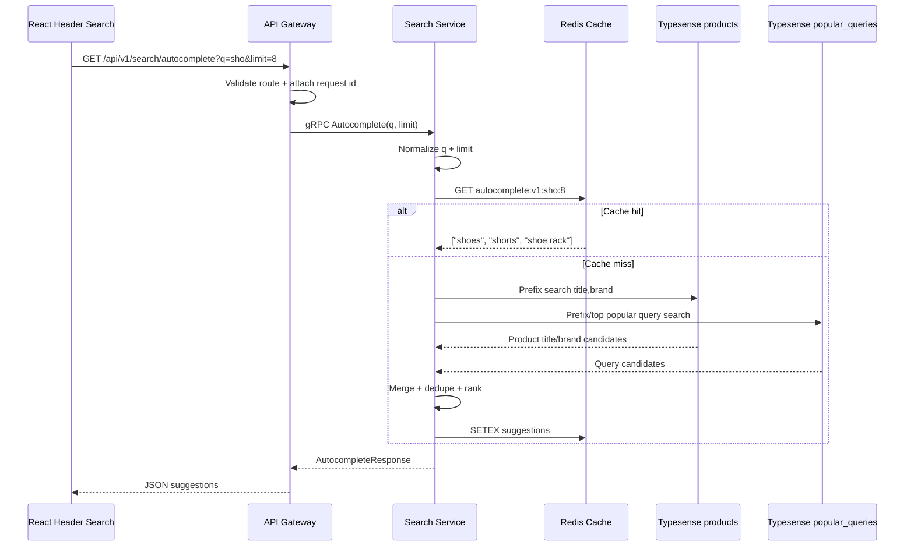
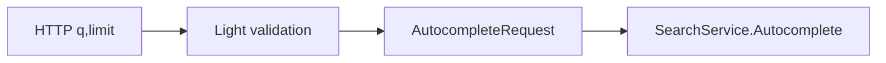
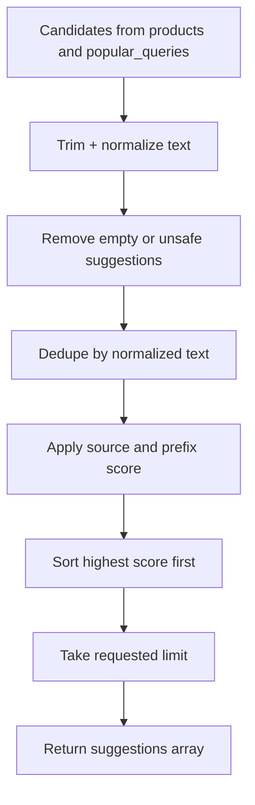
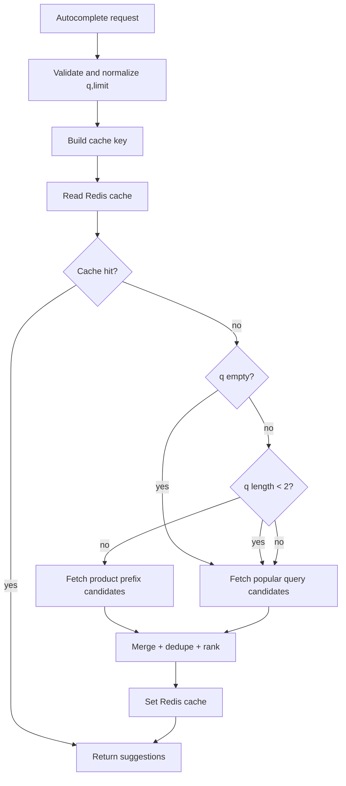
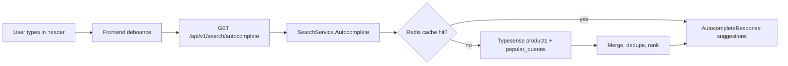

# 🔎 Search Service - Task 5: Autocomplete API


## 📌 Task Summary

| Field | Detail |
|---|---|
| Service | Search Service |
| Task | Task 5 - Autocomplete API |
| Source | `docs/01-micro-tasks.md` -> `Search Service (Typesense)` -> Task 5 |
| Priority | `P1` |
| Dependency | Search schema |
| Main Goal | Prefix search and popular queries return karna taaki header search fast feel kare |
| Output Type | Documentation-only implementation guide |

> **Simple Hinglish goal:** Buyer jab header search box me `sho`, `nik`, ya `iph` type karega, frontend `GET /api/v1/search/autocomplete` call karega. API Gateway request ko internal gRPC `SearchService.Autocomplete` me convert karega. Search Service Redis cache check karega, Typesense ke `products` aur `popular_queries` sources se suggestions nikalega, duplicates remove karega, ranking apply karega, aur fast string suggestions return karega.

---

## ✅ Final Output Created

```text
TaskImplementation/
└── Search Service/
    ├── task1.md
    ├── task2.md
    ├── task3.md
    ├── task4.md
    └── task5.md
```

### Why this structure?

| Path | Purpose |
|---|---|
| `TaskImplementation/` | Saare task-wise implementation guides ka central folder |
| `TaskImplementation/Search Service/` | Search Service ke implementation guides ka group |
| `task5.md` | Sirf Search Service - Task 5 ka detailed Autocomplete API guide |

> 🟢 **Boundary:** Is request me sirf `task5.md` guide create ki gayi hai. Actual backend, proto, infra, ya frontend code files add nahi kiye gaye. Synonym admin, zero-result analytics, aur full reindex later Search Service tasks ka scope hai.

---

## 🧭 Requirement Sources Studied

| Document | Kya use kiya gaya |
|---|---|
| `docs/01-micro-tasks.md` | Task 5 ka exact scope: `Autocomplete API` |
| `docs/04-microservice-design.md` | Search Service responsibilities, `popular_queries` collection, `Autocomplete` gRPC method, REST route |
| `api/master-api.json` | Public endpoint, `AutocompleteRequest`, `AutocompleteResponse`, `SearchService.Autocomplete` contract |
| `docs/12-logging-monitoring-scalability.md` | Search autocomplete Redis cache TTL: 1 to 5 min |
| `docs/06-auth-security.md` | Product search route group rate limiting expectation |
| `docs/03-folder-structure.md` | Expected `backend/services/search-service` layout |
| `TaskImplementation/Search Service/task1.md` | Search schema, searchable fields, prefix strategy |
| `TaskImplementation/Search Service/task2.md` | Typesense runtime and connection config |
| `TaskImplementation/Search Service/task3.md` | Indexed product document assumptions |
| `TaskImplementation/Search Service/task4.md` | Gateway -> Search Service -> Typesense patterns |

---

## 🧱 Scope of Task 5

### ✅ Included

- Public REST endpoint contract: `GET /api/v1/search/autocomplete`
- Internal gRPC method contract: `SearchService.Autocomplete`
- Request validation for `q` and `limit`
- Prefix suggestions from Typesense `products` collection
- Popular query suggestions from Typesense `popular_queries` collection
- Merge, dedupe, normalize, and rank logic
- Redis cache strategy with 1 to 5 minute TTL
- Error handling, rate limiting, observability, and tests checklist
- Beginner-friendly code examples and Mermaid diagrams

### 🚫 Not Included

| Not Included | Reason |
|---|---|
| Main product search results | Already covered in Task 4 |
| Product Service hydration | Autocomplete response sirf strings return karta hai |
| Popular query analytics ingestion/write path | Task 7 zero-result/session analytics ke saath evolve hoga |
| Synonym CRUD/admin APIs | Task 6 ka scope |
| Full catalog reindex | Task 8 ka scope |
| Header search frontend UI | Frontend app shell/search task ka scope |
| Typesense cluster setup | Already covered in Task 2 |
| Product event indexing | Already covered in Task 3 |

---

## 🧩 High-Level Architecture



### Hinglish explanation

- **Browser/Header** user ke typing ke saath debounced autocomplete request bhejta hai.
- **API Gateway** public route handle karta hai aur internal gRPC call banata hai.
- **Search Service** business logic own karta hai: normalize, cache, Typesense query, merge, ranking.
- **Redis** repeated header keystrokes ko fast banata hai.
- **Typesense `products`** real catalog titles/brands se prefix suggestions deta hai.
- **Typesense `popular_queries`** trending/common search terms return karta hai.

---

## 🧠 Key Decisions

| Decision | Value | Why |
|---|---|---|
| Public route | `GET /api/v1/search/autocomplete` | `api/master-api.json` me defined route |
| Internal method | `SearchService.Autocomplete` | Gateway se Search Service tak typed gRPC |
| Auth | Public | Logged-out buyer ko bhi header search suggestions chahiye |
| Response shape | `{"suggestions": ["..."]}` | Master API contract simple string list define karta hai |
| Default limit | `8` | Header dropdown ke liye compact and useful |
| Max limit | `10` | Public endpoint abuse and UI overflow avoid karne ke liye |
| Minimum prefix for product lookup | `2` characters | Single-character search noisy and expensive hota hai |
| Empty query behavior | Popular queries only | Header focus pe trending/common suggestions dikh sakte hain |
| Product prefix fields | `title,brand` | Task 1 schema me user-readable searchable fields |
| Popular source | `popular_queries` | Microservice design me Search Service collection listed hai |
| Cache | Redis, 1 to 5 min | Scalability docs me autocomplete cache recommended hai |
| Product hydration | Not needed | Response me product objects nahi, sirf suggestion strings |
| Direct Typesense exposure | Never browser-side | Typesense API key frontend me expose nahi hogi |

---

## 🗂️ Recommended Implementation Folder Structure

> Ye actual code implementation ke liye recommended structure hai. Is request me sirf `TaskImplementation/Search Service/task5.md` create hua hai.

```text
ecommerce-platform/
├── TaskImplementation/
│   └── Search Service/
│       ├── task1.md
│       ├── task2.md
│       ├── task3.md
│       ├── task4.md
│       └── task5.md
├── api/
│   └── master-api.json
├── proto/
│   └── ecommerce/
│       └── search/
│           └── v1/
│               └── search.proto
├── backend/
│   └── services/
│       ├── api-gateway/
│       │   └── internal/
│       │       ├── handlers/
│       │       │   └── search_handler.go
│       │       ├── routes/
│       │       │   └── routes.go
│       │       └── clients/
│       │           └── search_client.go
│       └── search-service/
│           ├── cmd/
│           │   └── server/
│           │       └── main.go
│           └── internal/
│               ├── config/
│               │   └── config.go
│               ├── domain/
│               │   └── autocomplete.go
│               ├── repository/
│               │   ├── autocomplete_cache.go
│               │   └── typesense_repository.go
│               ├── schema/
│               │   └── popular_queries_schema.go
│               ├── transport/
│               │   └── grpc/
│               │       └── search_handler.go
│               └── usecase/
│                   └── autocomplete.go
└── infra/
    └── compose/
        └── docker-compose.local.yml
```

### Folder responsibility

| Folder/File | Responsibility |
|---|---|
| `proto/ecommerce/search/v1/search.proto` | `AutocompleteRequest` and `AutocompleteResponse` typed contract |
| `api-gateway/internal/handlers/search_handler.go` | HTTP query params parse karke gRPC request banayega |
| `api-gateway/internal/routes/routes.go` | `GET /api/v1/search/autocomplete` route register karega |
| `search-service/internal/domain/autocomplete.go` | Input, candidate, and response domain models |
| `search-service/internal/usecase/autocomplete.go` | Normalize -> cache -> Typesense -> merge -> response workflow |
| `search-service/internal/repository/typesense_repository.go` | Products and popular queries Typesense calls wrap karega |
| `search-service/internal/repository/autocomplete_cache.go` | Redis cache get/set logic |
| `search-service/internal/schema/popular_queries_schema.go` | `popular_queries` collection schema bootstrap reference |
| `search-service/internal/transport/grpc/search_handler.go` | gRPC request ko usecase me pass karega |

---

## 🧰 External Libraries / Tools Used

| Tool/Library | Type | Why used | Install / Use |
|---|---|---|---|
| Typesense | Search engine | Prefix search, typo tolerance, product title/brand suggestions, popular query lookup | Task 2 Docker/Kubernetes setup se run hoga |
| `github.com/typesense/typesense-go/v2` | Go client | Search Service se Typesense API ko typed client ke through call karne ke liye | `go get github.com/typesense/typesense-go/v2` |
| Redis | Cache | Autocomplete ke repeated keystroke requests ko low latency banana | Platform Foundation Docker Compose me `redis` service |
| `github.com/redis/go-redis/v9` | Go Redis client | Search Service autocomplete cache read/write ke liye | `go get github.com/redis/go-redis/v9` |
| gRPC + Protobuf | Internal API contract | API Gateway -> Search Service typed communication | `go get google.golang.org/grpc google.golang.org/protobuf` |
| Go standard library | Built-in | `context`, `time`, `strings`, `net/http`, validation helpers | Extra install nahi chahiye |

### Install commands reference

> 🟡 **Note:** Ye commands actual implementation phase ke liye hain. Current task me sirf documentation file create hui hai.

```bash
go get github.com/typesense/typesense-go/v2
go get github.com/redis/go-redis/v9
go get google.golang.org/grpc
go get google.golang.org/protobuf
```

### Local tool usage reference

```bash
docker compose -f infra/compose/docker-compose.local.yml up -d redis typesense
```

Typesense health check:

```bash
curl "http://localhost:8108/health"
```

Redis health check:

```bash
docker exec ecommerce-redis redis-cli -a dev_redis_password ping
```

---

## 🪜 Step-by-Step Implementation Guide

## Step 1: Public API contract define karo

Public endpoint:

```http
GET /api/v1/search/autocomplete
```

Example request:

```http
GET /api/v1/search/autocomplete?q=sho&limit=8
```

### Supported query params

| Query Param | Type | Required | Default | Example | Purpose |
|---|---|---:|---|---|---|
| `q` | string | No | empty | `sho` | User ka typed prefix |
| `limit` | integer | No | `8` | `8` | Max suggestions count |

### Response example

```json
{
  "suggestions": [
    "shoes",
    "shoe rack",
    "shorts",
    "running shoes",
    "Nike shoes"
  ]
}
```

### How this part was built

- `api/master-api.json` me endpoint already `search.autocomplete` ke naam se defined hai.
- Request schema simple hai: `q` and `limit`.
- Response schema sirf `suggestions` array return karta hai, isliye product cards, ids, facets, ya price data include nahi honge.
- Public route hone ke bawajood Gateway rate limit apply karega.

---

## Step 2: gRPC contract define karo

Gateway internal call:

```text
SearchService.Autocomplete(AutocompleteRequest) returns (AutocompleteResponse)
```

Recommended proto sketch:

```proto
syntax = "proto3";

package ecommerce.search.v1;

service SearchService {
  rpc SearchProducts(SearchRequest) returns (SearchResponse);
  rpc Autocomplete(AutocompleteRequest) returns (AutocompleteResponse);
}

message AutocompleteRequest {
  string q = 1;
  int32 limit = 2;
}

message AutocompleteResponse {
  repeated string suggestions = 1;
}
```

### How this part was built

- REST endpoint browser-friendly hai; gRPC internal service-to-service contract hai.
- `q` raw user prefix carry karta hai.
- `limit` Gateway se Search Service tak pass hota hai, but Search Service final max limit enforce karega.
- Public response me source/type expose nahi kiya gaya because `api/master-api.json` simple string suggestions define karta hai.

> 🟡 **Proto rule:** Existing generated clients break na hon, isliye field numbers stable rakho. Future me metadata chahiye to new response message version ya extra fields additive style me add karo.

---

## Step 3: API Gateway route mapping banao

Gateway ka kaam HTTP query params ko gRPC request me map karna hai.



Example Gateway handler sketch:

```go
func (h *SearchHandler) Autocomplete(w http.ResponseWriter, r *http.Request) {
	ctx := r.Context()

	q := strings.TrimSpace(r.URL.Query().Get("q"))
	limit := parseIntDefault(r.URL.Query().Get("limit"), 8)

	req := &searchv1.AutocompleteRequest{
		Q:     q,
		Limit: int32(limit),
	}

	resp, err := h.searchClient.Autocomplete(ctx, req)
	if err != nil {
		writeGatewayError(w, err)
		return
	}

	writeJSON(w, http.StatusOK, resp)
}
```

Route registration sketch:

```go
router.HandleFunc("/api/v1/search/autocomplete", searchHandler.Autocomplete).Methods(http.MethodGet)
```

### How this part was built

- Gateway raw Typesense params accept nahi karta.
- Gateway `q` and `limit` parse karta hai, but strict business validation Search Service me hoti hai.
- Existing Task 4 search handler pattern reuse hota hai, so route style consistent rahega.

---

## Step 4: Request validation and normalization karo

Autocomplete public endpoint hai, isliye input small, predictable, and cheap hona chahiye.

### Validation rules

| Field | Rule | Why |
|---|---|---|
| `q` | Trim spaces | User accidental spaces type kar sakta hai |
| `q` empty | Allowed, popular queries return karo | Header focus pe trending suggestions useful hain |
| `q` length | Max `80` characters | Abuse and unnecessary search avoid karne ke liye |
| `q` normalization | Collapse repeated spaces, lowercase cache key ke liye | Dedupe and cache hit rate improve hoti hai |
| `limit` | Default `8` | Header dropdown compact rahega |
| `limit` min/max | `1` to `10` | Public endpoint expensive na ho |
| product prefix lookup | Only if normalized `q` length >= `2` | Single-character suggestions noisy hote hain |

Domain model example:

```go
type AutocompleteInput struct {
	Query           string
	NormalizedQuery string
	Limit           int
}
```

Validation sketch:

```go
func NormalizeAutocompleteRequest(req *searchv1.AutocompleteRequest) (AutocompleteInput, error) {
	rawQuery := strings.TrimSpace(req.GetQ())
	if len(rawQuery) > 80 {
		return AutocompleteInput{}, ErrAutocompleteQueryTooLong
	}

	normalized := normalizeAutocompleteText(rawQuery)

	limit := int(req.GetLimit())
	if limit <= 0 {
		limit = 8
	}
	if limit > 10 {
		return AutocompleteInput{}, ErrAutocompleteLimitTooLarge
	}

	return AutocompleteInput{
		Query:           rawQuery,
		NormalizedQuery: normalized,
		Limit:           limit,
	}, nil
}

func normalizeAutocompleteText(value string) string {
	fields := strings.Fields(strings.ToLower(strings.TrimSpace(value)))
	return strings.Join(fields, " ")
}
```

### How this part was built

- Autocomplete har keystroke pe call ho sakta hai, isliye limit tight rakha gaya.
- Empty query ko error nahi banaya, kyunki popular queries header UX me useful hain.
- Cache key lowercase normalized query se banega, but display suggestions original readable casing preserve kar sakte hain.

---

## Step 5: `popular_queries` collection define karo

`docs/04-microservice-design.md` Search Service ke Typesense collections me `popular_queries` list karta hai. Task 5 autocomplete ko popular queries read karne ke liye ye collection chahiye.

Recommended collection schema:

```json
{
  "name": "popular_queries",
  "fields": [
    { "name": "id", "type": "string" },
    { "name": "query", "type": "string" },
    { "name": "normalized_query", "type": "string" },
    { "name": "score", "type": "int32", "sort": true },
    { "name": "count", "type": "int32", "sort": true },
    { "name": "last_seen_at", "type": "int64", "sort": true },
    { "name": "is_active", "type": "bool", "facet": true },
    { "name": "locale", "type": "string", "facet": true, "optional": true }
  ],
  "default_sorting_field": "score"
}
```

Example document:

```json
{
  "id": "query_shoes",
  "query": "shoes",
  "normalized_query": "shoes",
  "score": 982,
  "count": 421,
  "last_seen_at": 1763769600,
  "is_active": true,
  "locale": "en-US"
}
```

### How this part was built

- `query` display value hai jo response me ja sakta hai.
- `normalized_query` matching and dedupe ke liye useful hai.
- `score` ranking ke liye primary signal hai.
- `count` analytics-based popularity count store kar sakta hai.
- `last_seen_at` stale popular terms ko downrank/remove karne me help karta hai.
- `is_active` se bad/spam/blocked queries hide ki ja sakti hain.

> 🟡 **Boundary note:** Popular query **read path** Task 5 me hai. Popular query **write/analytics ingestion** Task 7 ke saath evolve hoga. MVP me collection manually seeded, admin seeded, ya batch job seeded ho sakti hai.

---

## Step 6: Product prefix suggestions implement karo

Product prefix source real catalog se suggestions deta hai.

### Recommended Typesense params

```json
{
  "q": "sho",
  "query_by": "title,brand",
  "query_by_weights": "5,3",
  "prefix": "true,true",
  "filter_by": "in_stock:=true",
  "sort_by": "_text_match:desc,popularity_score:desc",
  "page": 1,
  "per_page": 16,
  "include_fields": "title,brand"
}
```

### Why `title,brand` only?

| Field | Include? | Reason |
|---|---:|---|
| `title` | ✅ | User product names type karta hai |
| `brand` | ✅ | Brand autocomplete useful hota hai |
| `description` | 🚫 | Description broad hai; noisy suggestions ban sakti hain |
| `category_ids` | 🚫 | IDs user-readable nahi hain |

Repository interface sketch:

```go
type AutocompleteSearchRepository interface {
	ProductPrefixCandidates(ctx context.Context, query string, limit int) ([]SuggestionCandidate, error)
	PopularQueryCandidates(ctx context.Context, query string, limit int) ([]SuggestionCandidate, error)
}

type SuggestionCandidate struct {
	Text   string
	Source string
	Score  int
}
```

Typesense product prefix sketch:

```go
func (r *TypesenseRepository) ProductPrefixCandidates(ctx context.Context, query string, limit int) ([]SuggestionCandidate, error) {
	params := &api.SearchCollectionParams{
		Q:              query,
		QueryBy:        "title,brand",
		QueryByWeights: ptr("5,3"),
		Prefix:         ptr("true,true"),
		FilterBy:       ptr("in_stock:=true"),
		SortBy:         ptr("_text_match:desc,popularity_score:desc"),
		Page:           ptr(1),
		PerPage:        ptr(limit * 2),
		IncludeFields:  ptr("title,brand"),
	}

	result, err := r.client.Collection("products").Documents().Search(ctx, params)
	if err != nil {
		return nil, err
	}

	return mapProductHitsToCandidates(result), nil
}
```

### How this part was built

- Task 1 already `title` and `brand` ko searchable fields define karta hai.
- Prefix search partial typing ke liye important hai: `sho` -> `shoes`.
- `in_stock:=true` unavailable product titles ko suggest karne se bachata hai.
- `per_page` limit se thoda zyada rakha gaya because dedupe ke baad final suggestions kam ho sakte hain.

> 🟡 **Implementation note:** `typesense-go` generated API signatures version ke hisaab se thodi vary kar sakti hain. Real code me installed package ke exact structs/functions check karke names adjust karo, but architecture same rahegi.

---

## Step 7: Popular query suggestions implement karo

Popular query source search intent based suggestions deta hai.

### Query behavior

| User `q` | Popular query behavior |
|---|---|
| empty | Top active popular queries return karo |
| 1 char | Top active popular queries matching prefix return kar sakte ho, but product lookup skip karo |
| 2+ chars | Prefix-matching popular queries return karo |

Recommended Typesense params for non-empty prefix:

```json
{
  "q": "sho",
  "query_by": "query",
  "prefix": "true",
  "filter_by": "is_active:=true",
  "sort_by": "score:desc,last_seen_at:desc",
  "page": 1,
  "per_page": 8,
  "include_fields": "query,score"
}
```

Recommended Typesense params for empty query:

```json
{
  "q": "*",
  "query_by": "query",
  "filter_by": "is_active:=true",
  "sort_by": "score:desc,last_seen_at:desc",
  "page": 1,
  "per_page": 8,
  "include_fields": "query,score"
}
```

Repository sketch:

```go
func (r *TypesenseRepository) PopularQueryCandidates(ctx context.Context, query string, limit int) ([]SuggestionCandidate, error) {
	searchQuery := query
	prefix := "true"
	if searchQuery == "" {
		searchQuery = "*"
		prefix = "false"
	}

	params := &api.SearchCollectionParams{
		Q:             searchQuery,
		QueryBy:       "query",
		Prefix:        ptr(prefix),
		FilterBy:      ptr("is_active:=true"),
		SortBy:        ptr("score:desc,last_seen_at:desc"),
		Page:          ptr(1),
		PerPage:       ptr(limit),
		IncludeFields: ptr("query,score"),
	}

	result, err := r.client.Collection("popular_queries").Documents().Search(ctx, params)
	if err != nil {
		return nil, err
	}

	return mapPopularHitsToCandidates(result), nil
}
```

### How this part was built

- `popular_queries` collection docs me Search Service ke collection ke roop me listed hai.
- Empty `q` ke case me product collection query karna avoid kiya gaya.
- `is_active:=true` spam or blocked query suggestions hide karta hai.
- `score` and `last_seen_at` popular and fresh queries ko top me rakhte hain.

---

## Step 8: Merge, dedupe, and rank suggestions banao

Autocomplete multiple sources se candidates laata hai:

- Product titles
- Product brands
- Popular queries

Final response me duplicate strings nahi hone chahiye.



Recommended ranking priority:

| Signal | Boost | Why |
|---|---:|---|
| Exact prefix match | High | User typed prefix se directly match karta hai |
| Popular query score | High | Real user intent indicate karta hai |
| Product title match | Medium | Catalog-backed suggestion useful hai |
| Brand match | Medium | Brand search common hai |
| Short clean phrase | Small | Header suggestions readable rehte hain |

Merge sketch:

```go
func MergeAutocompleteCandidates(query string, limit int, groups ...[]SuggestionCandidate) []string {
	byKey := make(map[string]SuggestionCandidate)

	for _, group := range groups {
		for _, candidate := range group {
			text := strings.TrimSpace(candidate.Text)
			if text == "" {
				continue
			}

			key := normalizeAutocompleteText(text)
			if key == "" {
				continue
			}

			candidate.Text = text
			candidate.Score += scorePrefixBoost(query, key)

			existing, found := byKey[key]
			if !found || candidate.Score > existing.Score {
				byKey[key] = candidate
			}
		}
	}

	merged := make([]SuggestionCandidate, 0, len(byKey))
	for _, candidate := range byKey {
		merged = append(merged, candidate)
	}

	sort.SliceStable(merged, func(i, j int) bool {
		return merged[i].Score > merged[j].Score
	})

	suggestions := make([]string, 0, limit)
	for _, candidate := range merged {
		if len(suggestions) == limit {
			break
		}
		suggestions = append(suggestions, candidate.Text)
	}

	return suggestions
}
```

### How this part was built

- Public contract string list hai, so internal source metadata response me expose nahi hota.
- Dedupe case-insensitive key se hota hai: `Nike Shoes` and `nike shoes` same suggestion hain.
- Best scoring duplicate preserve hota hai, taaki popular query product title se better score le sake.
- Sorting stable hai, so equal score cases deterministic rahenge.

---

## Step 9: Redis cache add karo

Autocomplete high-frequency endpoint hai. User type karega `s`, `sh`, `sho`, `shoe`; same query bahut users repeat karenge. Redis cache latency and Typesense load dono reduce karega.

### Cache key

```text
autocomplete:v1:{normalized_query}:{limit}
```

Examples:

```text
autocomplete:v1::8
autocomplete:v1:sho:8
autocomplete:v1:nike shoes:10
```

### TTL strategy

| Query Type | TTL | Why |
|---|---:|---|
| Empty query popular suggestions | 5 min | Trending list frequent but not per-keystroke exact |
| Non-empty prefix | 1 min | Catalog and popularity changes reflect reasonably fast |
| Redis failure | No hard failure | Autocomplete should still work through Typesense |

Cache repository sketch:

```go
type AutocompleteCache interface {
	Get(ctx context.Context, key string) ([]string, bool, error)
	Set(ctx context.Context, key string, suggestions []string, ttl time.Duration) error
}
```

Redis implementation sketch:

```go
func (c *RedisAutocompleteCache) Get(ctx context.Context, key string) ([]string, bool, error) {
	raw, err := c.client.Get(ctx, key).Result()
	if errors.Is(err, redis.Nil) {
		return nil, false, nil
	}
	if err != nil {
		return nil, false, err
	}

	var suggestions []string
	if err := json.Unmarshal([]byte(raw), &suggestions); err != nil {
		return nil, false, err
	}

	return suggestions, true, nil
}

func (c *RedisAutocompleteCache) Set(ctx context.Context, key string, suggestions []string, ttl time.Duration) error {
	payload, err := json.Marshal(suggestions)
	if err != nil {
		return err
	}
	return c.client.Set(ctx, key, payload, ttl).Err()
}
```

### How this part was built

- `docs/12-logging-monitoring-scalability.md` autocomplete ke liye Redis cache TTL `1 to 5 min` recommend karta hai.
- Cache miss pe Typesense query hoti hai.
- Cache write fail ho to request fail nahi honi chahiye; warning log enough hai.
- Cache version `v1` future ranking changes ke time old keys separate rakhta hai.

---

## Step 10: Autocomplete usecase workflow implement karo

Usecase complete flow:



Usecase sketch:

```go
type AutocompleteUsecase struct {
	repo  AutocompleteSearchRepository
	cache AutocompleteCache
}

func (u *AutocompleteUsecase) Autocomplete(ctx context.Context, req *searchv1.AutocompleteRequest) (*searchv1.AutocompleteResponse, error) {
	input, err := NormalizeAutocompleteRequest(req)
	if err != nil {
		return nil, err
	}

	cacheKey := buildAutocompleteCacheKey(input.NormalizedQuery, input.Limit)
	if suggestions, ok, err := u.cache.Get(ctx, cacheKey); err == nil && ok {
		return &searchv1.AutocompleteResponse{Suggestions: suggestions}, nil
	}

	popular, err := u.repo.PopularQueryCandidates(ctx, input.NormalizedQuery, input.Limit)
	if err != nil {
		return nil, mapAutocompleteDependencyError(err)
	}

	productCandidates := []SuggestionCandidate{}
	if len(input.NormalizedQuery) >= 2 {
		productCandidates, err = u.repo.ProductPrefixCandidates(ctx, input.NormalizedQuery, input.Limit)
		if err != nil {
			return nil, mapAutocompleteDependencyError(err)
		}
	}

	suggestions := MergeAutocompleteCandidates(
		input.NormalizedQuery,
		input.Limit,
		popular,
		productCandidates,
	)

	ttl := autocompleteCacheTTL(input.NormalizedQuery)
	_ = u.cache.Set(ctx, cacheKey, suggestions, ttl)

	return &searchv1.AutocompleteResponse{Suggestions: suggestions}, nil
}
```

### How this part was built

- Cache first design latency reduce karta hai.
- Popular queries har request me useful source hain.
- Product prefix lookup short query pe skip hota hai, because `a` jaise prefixes noisy hote hain.
- Merge function final response contract ko simple strings me convert karta hai.

---

## Step 11: Error handling define karo

### Error mapping

| Case | HTTP Status | gRPC Code | Behavior |
|---|---:|---|---|
| `q` too long | `400` | `InvalidArgument` | Clear validation error |
| `limit` too large | `400` | `InvalidArgument` | Client ko max limit follow karna hoga |
| Redis down | `200` if Typesense works | None/warn log | Cache optional hai |
| Typesense timeout | `503` | `Unavailable` | Dependency failure |
| Context deadline | `504` or `503` | `DeadlineExceeded` | Gateway timeout policy ke according |
| Unknown server error | `500` | `Internal` | Request id ke saath log |

### Timeout recommendation

| Layer | Timeout |
|---|---:|
| Browser debounce | `250ms` to `350ms` |
| Gateway -> Search gRPC deadline | `200ms` to `300ms` |
| Search -> Redis | `20ms` to `50ms` |
| Search -> Typesense | `100ms` to `150ms` |

### How this part was built

- Autocomplete UX fast hona chahiye; slow suggestions se better empty suggestions ya retry behavior hai.
- Redis cache optional dependency hai, Typesense required read dependency hai.
- Public route validation errors clean `400` me map hone chahiye.

---

## Step 12: Rate limiting and frontend behavior align karo

`docs/06-auth-security.md` product search route group ke liye `120 per IP per min` limit mention karta hai. Autocomplete same public search group me aayega.

### Recommended behavior

| Layer | Rule |
|---|---|
| Frontend | Input debounce `250ms` to `350ms` |
| Frontend | Empty/short query ke liye request reduce kar sakta hai, but focus popular suggestions allowed hain |
| Gateway | IP-based public search rate limit |
| Search Service | Max `limit=10`, max `q=80` |
| Redis | Cache repeated prefixes |

### How this part was built

- Autocomplete ke requests naturally frequent hote hain.
- Frontend debounce and backend cache dono necessary hain.
- Gateway rate limit abuse control karta hai; Search Service validation resource cost control karti hai.

---

## Step 13: Observability add karo

### Logs

Autocomplete logs structured hone chahiye:

```json
{
  "level": "info",
  "service": "search-service",
  "operation": "autocomplete",
  "request_id": "req_123",
  "query_length": 3,
  "limit": 8,
  "cache_hit": false,
  "suggestion_count": 5,
  "duration_ms": 42
}
```

> 🔴 **Privacy note:** Raw search query logs me store karna avoid karo ya sampling/redaction apply karo. Query user intent reveal kar sakti hai.

### Metrics

| Metric | Type | Labels | Purpose |
|---|---|---|---|
| `search_autocomplete_requests_total` | Counter | `result` | Request volume |
| `search_autocomplete_duration_ms` | Histogram | `cache_hit` | Latency monitoring |
| `search_autocomplete_cache_hits_total` | Counter | none | Cache effectiveness |
| `search_autocomplete_typesense_errors_total` | Counter | `collection` | Dependency alerting |
| `search_autocomplete_suggestions_count` | Histogram | none | Empty/low suggestion debugging |

### Tracing spans

```text
HTTP GET /api/v1/search/autocomplete
└── gRPC SearchService.Autocomplete
    ├── Redis GET autocomplete key
    ├── Typesense search products
    ├── Typesense search popular_queries
    └── Redis SET autocomplete key
```

### How this part was built

- Cache hit label se latency difference visible hota hai.
- Suggestion count histogram se empty autocomplete quality detect hoti hai.
- Raw query logging privacy risk hai, isliye query length or normalized hash safer hai.

---

## Step 14: Tests likho

### Unit tests

| Test | Expected |
|---|---|
| Empty `q` normalize | Allowed, normalized query empty |
| `q` with extra spaces | Spaces collapse |
| Too long `q` | Validation error |
| Missing limit | Default `8` |
| Limit `11` | Validation error |
| Duplicate candidates | One suggestion only |
| Popular higher score duplicate | Popular candidate wins |
| Query length `1` | Product prefix repository skip |
| Cache hit | Typesense repositories not called |
| Redis error | Typesense still called |

### Integration tests

| Test | Setup | Expected |
|---|---|---|
| Product prefix | Seed `products` with `Nike Running Shoes` | `nik` returns Nike suggestion |
| Popular empty query | Seed `popular_queries` | empty `q` returns top popular queries |
| Merge behavior | Same suggestion in products and popular | Duplicate removed |
| Cache behavior | Call same query twice | Second call reads cache |
| Typesense down | Stop Typesense and cache miss | `503` dependency error |

### Example test sketch

```go
func TestMergeAutocompleteCandidates_DedupesCaseInsensitive(t *testing.T) {
	got := MergeAutocompleteCandidates("nike", 5,
		[]SuggestionCandidate{{Text: "Nike Shoes", Source: "product", Score: 20}},
		[]SuggestionCandidate{{Text: "nike shoes", Source: "popular", Score: 50}},
	)

	require.Equal(t, []string{"nike shoes"}, got)
}
```

### How this part was built

- Unit tests business rules fast validate karte hain.
- Integration tests Typesense/Redis behavior verify karte hain.
- Cache test ensures performance path accidentally break na ho.

---

## 🔐 Security and Data Safety

| Concern | Rule |
|---|---|
| Typesense API key | Browser me expose nahi hogi |
| Query length abuse | Max `80` chars |
| Limit abuse | Max `10` suggestions |
| Raw query logs | Avoid or redact |
| Spam popular queries | `is_active` filter use karo |
| Cache poisoning | Suggestions service-side sources se bante hain, raw user input directly cache response nahi banta |
| Public route abuse | Gateway IP rate limit |

---

## 🚀 Manual Smoke Test Plan

### 1. Seed product examples

```json
[
  {
    "id": "prod_001",
    "title": "Nike Running Shoes",
    "description": "Lightweight shoes for daily running",
    "brand": "Nike",
    "category_ids": ["cat_shoes"],
    "seller_id": "seller_1",
    "price": 2999,
    "rating": 4.5,
    "popularity_score": 95,
    "in_stock": true,
    "created_at": 1763769600
  },
  {
    "id": "prod_002",
    "title": "Shoe Rack Organizer",
    "description": "Home storage rack",
    "brand": "HomePro",
    "category_ids": ["cat_home"],
    "seller_id": "seller_2",
    "price": 999,
    "rating": 4.2,
    "popularity_score": 76,
    "in_stock": true,
    "created_at": 1763769600
  }
]
```

### 2. Seed popular query examples

```json
[
  {
    "id": "query_shoes",
    "query": "shoes",
    "normalized_query": "shoes",
    "score": 982,
    "count": 421,
    "last_seen_at": 1763769600,
    "is_active": true,
    "locale": "en-US"
  },
  {
    "id": "query_shoe_rack",
    "query": "shoe rack",
    "normalized_query": "shoe rack",
    "score": 611,
    "count": 188,
    "last_seen_at": 1763769600,
    "is_active": true,
    "locale": "en-US"
  }
]
```

### 3. Call autocomplete endpoint

```bash
curl "http://localhost:8080/api/v1/search/autocomplete?q=sho&limit=8"
```

Expected response:

```json
{
  "suggestions": [
    "shoes",
    "shoe rack",
    "Nike Running Shoes",
    "Shoe Rack Organizer"
  ]
}
```

### 4. Validate empty query behavior

```bash
curl "http://localhost:8080/api/v1/search/autocomplete?limit=5"
```

Expected: top active popular queries.

### 5. Validate cache behavior

Same request do baar call karo. Second request logs/metrics me `cache_hit=true` hona chahiye.

---

## 📊 End-to-End Flow Summary



---

## ✅ Definition of Done

Task 5 complete tab maana jayega jab:

- `GET /api/v1/search/autocomplete` route API Gateway me defined ho.
- Gateway request ko `SearchService.Autocomplete` gRPC call me map kare.
- `AutocompleteRequest` and `AutocompleteResponse` proto contract available ho.
- Search Service `q` and `limit` validation kare.
- Empty `q` active popular queries return kare.
- `q` length `1` product prefix lookup skip kare ya carefully limited popular suggestions return kare.
- `q` length `2+` products and popular queries dono se candidates laaye.
- Typesense `products` collection prefix search use ho.
- Typesense `popular_queries` collection read path use ho.
- Suggestions merge, dedupe, rank, and limit hon.
- Redis cache `1 to 5 min` TTL ke saath work kare.
- Redis failure request fail na kare.
- Typesense dependency failure clean `503` me map ho.
- Unit tests normalization, merge, cache, and short-query behavior cover karein.
- Integration tests seeded Typesense/Redis ke against pass hon.
- Logs, metrics, request id, and trace propagation available ho.

---

## 🚫 Strict Task Boundary Reminder

| Feature | Status in Task 5 |
|---|---|
| Autocomplete REST API | ✅ Included |
| `SearchService.Autocomplete` gRPC method | ✅ Included |
| Prefix suggestions | ✅ Included |
| Popular query suggestions | ✅ Included |
| Redis autocomplete cache | ✅ Included |
| Product search page/results | 🚫 Task 4 / frontend task |
| Product Service hydration | 🚫 Not needed for string suggestions |
| Synonym admin management | 🚫 Task 6 |
| Zero-result analytics ingestion | 🚫 Task 7 |
| Popular query write pipeline | 🚫 Task 7 / analytics pipeline |
| Full reindex job | 🚫 Task 8 |
| Header UI implementation | 🚫 Frontend task |

> 🟢 **Final Hinglish summary:** Task 5 ka Autocomplete API header search ko fast and helpful banata hai. Gateway public REST request receive karta hai, Search Service cache check karta hai, Typesense ke `products` aur `popular_queries` se suggestions leta hai, duplicates remove karke ranked string list return karta hai. Scope intentionally read-only autocomplete tak limited hai.
