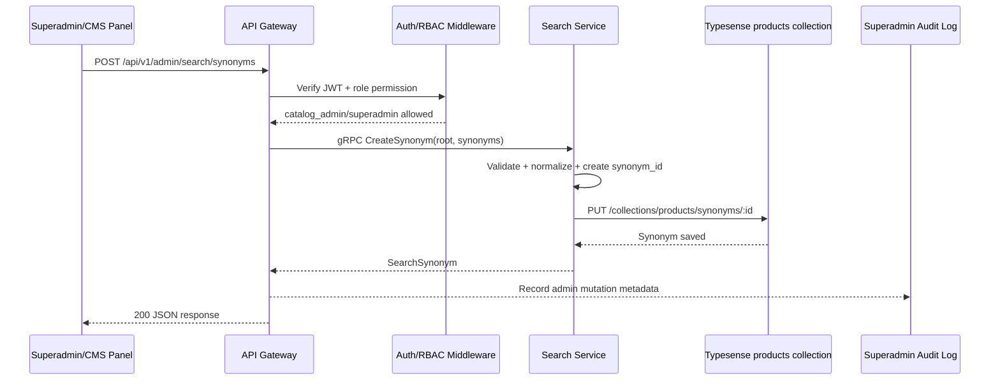
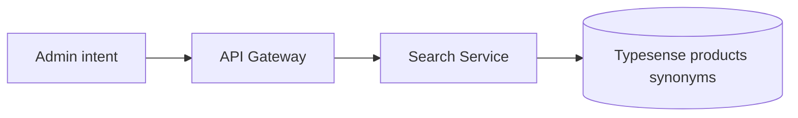
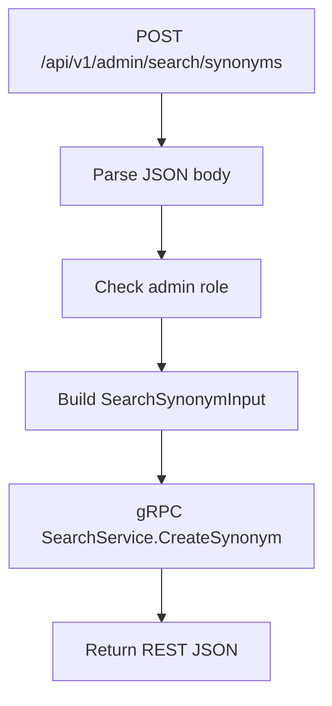
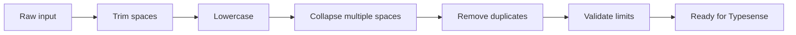
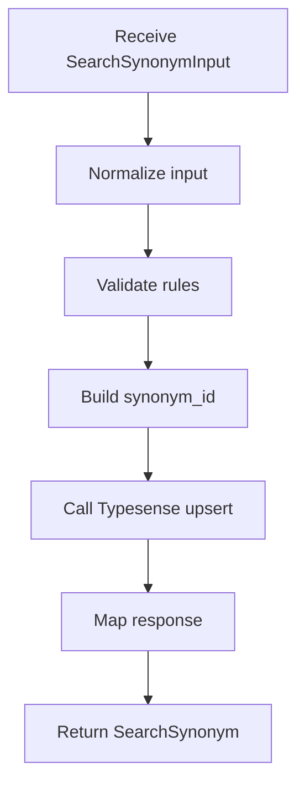
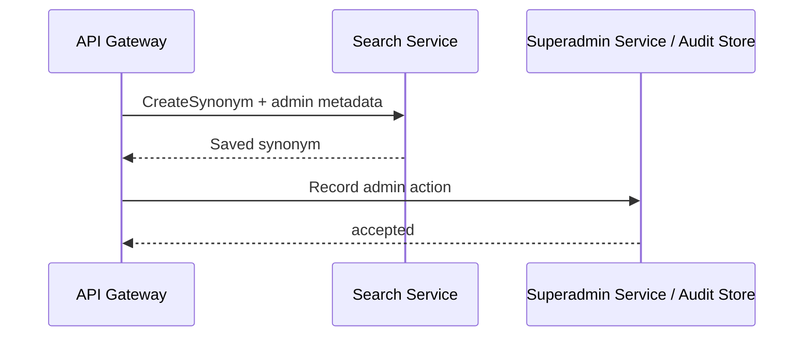
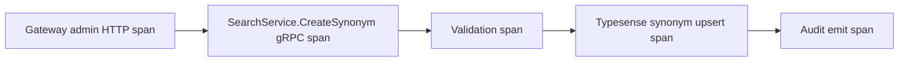
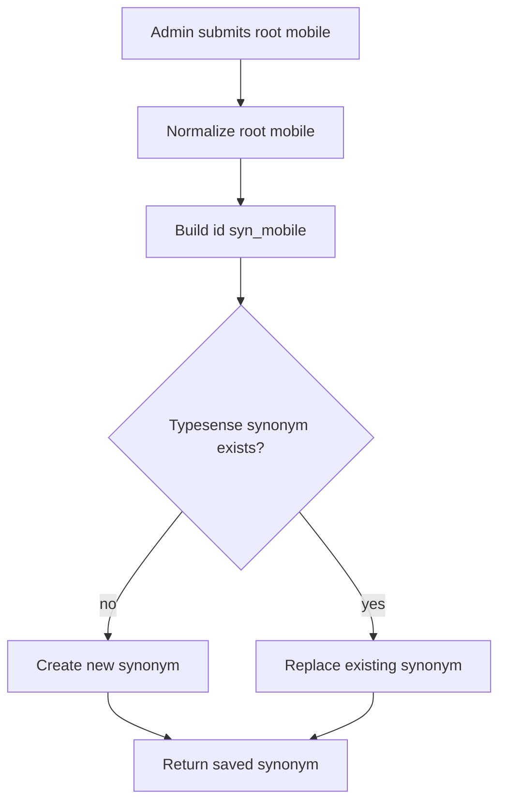
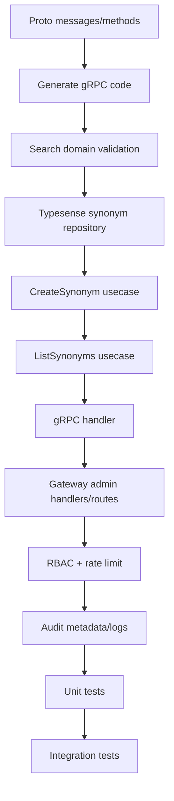
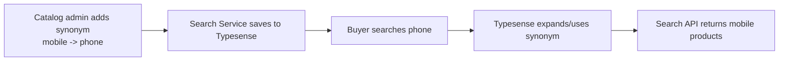

# 🔎 Search Service - Task 6: Synonym Management


## 📌 Task Summary

| Field | Detail |
|---|---|
| Service | Search Service |
| Task | Task 6 - Synonym Management |
| Source | `docs/01-micro-tasks.md` -> `Search Service (Typesense)` -> Task 6 |
| Priority | `P2` |
| Dependency | CMS/Superadmin |
| Main Goal | CMS/Superadmin se synonyms add/update karna, taaki search merchandising improve ho |
| Output Type | Documentation-only implementation guide |

> **Simple Hinglish goal:** Superadmin ya catalog admin search synonyms manage karega. Example: admin `mobile -> phone, smartphone, cellphone` add karega. Search Service validation karega, deterministic synonym id banayega, Typesense ke `products` collection me synonym upsert karega, aur future buyer searches me alternate terms same intent ke saath match honge.

---

## ✅ Final Output Created

```text
TaskImplementation/
└── Search Service/
    ├── task1.md
    ├── task2.md
    ├── task3.md
    ├── task4.md
    ├── task5.md
    └── task6.md
```

### Why this structure?

| Path | Purpose |
|---|---|
| `TaskImplementation/` | Saare task-wise implementation guides ka central folder |
| `TaskImplementation/Search Service/` | Search Service ke implementation guides ka group |
| `task6.md` | Sirf Search Service - Task 6 ka detailed Synonym Management guide |

> 🟢 **Boundary:** Is request me sirf `task6.md` guide create ki gayi hai. Actual backend, proto, infra, frontend, migration, ya Kubernetes files modify nahi kiye gaye. Zero-result tracking aur full reindex later Search Service tasks ka scope hai.

---

## 🧭 Requirement Sources Studied

| Document | Kya use kiya gaya |
|---|---|
| `docs/01-micro-tasks.md` | Task 6 ka exact scope: `Synonym management` |
| `docs/04-microservice-design.md` | Search Service responsibilities, `CreateSynonym`, `ListSynonyms`, admin REST route |
| `docs/05-database-design.md` | Typesense `products` collection and indexing strategy me synonyms |
| `docs/06-auth-security.md` | Admin RBAC, admin mutation rate limit, audit requirement |
| `docs/09-cms-superadmin.md` | Superadmin Search module: synonyms, reindex, zero-result queries |
| `docs/12-logging-monitoring-scalability.md` | Platform settings/admin cache and observability expectations |
| `docs/03-folder-structure.md` | Expected `backend/services/search-service` layout |
| `api/master-api.json` | `SearchService.CreateSynonym`, `SearchService.ListSynonyms`, `SearchSynonymInput`, `SearchSynonymListResponse` |
| `TaskImplementation/Search Service/task1.md` | Synonym shape: `root` + `synonyms` |
| `TaskImplementation/Search Service/task4.md` | Buyer-facing search route and Typesense query flow |
| `TaskImplementation/Search Service/task5.md` | Autocomplete boundary and Search Service patterns |
| [Typesense v27.1 Synonyms API](https://typesense.org/docs/27.1/api/synonyms.html) | Collection-level synonym create/list/retrieve/delete behavior |
| [Typesense Go client](https://github.com/typesense/typesense-go) | Go client methods for synonym upsert/list/delete |

---

## 🧱 Scope of Task 6

### ✅ Included

- Admin synonym create/update flow
- Admin synonym list flow
- Gateway route design for CMS/Superadmin
- Internal gRPC contract alignment:
  - `SearchService.CreateSynonym`
  - `SearchService.ListSynonyms`
- Request validation and normalization
- Deterministic `synonym_id` generation
- Typesense `products` collection synonym upsert
- Typesense synonym list mapping
- RBAC, rate limiting, and audit metadata guidance
- Error handling, observability, and testing checklist
- Beginner-friendly code examples and Mermaid diagrams

### 🚫 Not Included

| Not Included | Reason |
|---|---|
| Buyer-facing Search API | Already covered in Task 4 |
| Autocomplete API | Already covered in Task 5 |
| Delete synonym endpoint | `api/master-api.json` only defines `CreateSynonym` and `ListSynonyms` |
| Bulk synonym import/export | Not required in Task 6 MVP |
| Zero-result tracking | Task 7 ka scope |
| Full catalog reindex | Task 8 ka scope |
| Superadmin React UI implementation | Superadmin Panel frontend task ka scope |
| Superadmin audit log viewer | Superadmin task ka scope |
| Product data indexing | Already covered in Task 3 |

---

## 🧩 High-Level Architecture



### Hinglish explanation

- **Superadmin/CMS Panel** admin ko synonym form deta hai.
- **API Gateway** public internet se admin route receive karta hai.
- **Auth/RBAC** ensure karta hai ki sirf `catalog_admin` ya `superadmin` synonyms change kar sake.
- **Search Service** actual business validation and Typesense write own karta hai.
- **Typesense** `products` collection ke synonyms store karta hai, jisse buyer search improved relevance de sakta hai.
- **Audit Log** admin mutation ka trail rakhta hai: kisne kya change kiya, kab, aur kis request id ke saath.

---

## 🧠 Key Decisions

| Decision | Value | Why |
|---|---|---|
| Owner service | Search Service | Synonyms search relevance ka part hain, Product Service data ownership ka part nahi |
| Runtime store | Typesense collection synonyms | Search engine ko query time pe synonyms chahiye |
| Collection | `products` | Product search synonyms product index par apply honge |
| MVP synonym type | One-way using `root` + `synonyms` | Project API shape `SearchSynonymInput` me `root` defined hai |
| Upsert behavior | Same `root` same `synonym_id` | Admin same root submit kare to synonym update ho jaye |
| Public buyer exposure | None | Synonym management admin-only operation hai |
| Admin roles | `catalog_admin`, `superadmin` | Search merchandising catalog/platform control hai |
| Direct Typesense access | Never from frontend | Typesense API key browser me expose nahi hogi |
| Audit | Required metadata | Admin mutations compliance/debugging ke liye traceable honi chahiye |
| Delete | Not included | Current master API contract delete method define nahi karta |

---

## 🗂️ Recommended Implementation Folder Structure

> Ye actual code implementation ke liye recommended structure hai. Is request me sirf `TaskImplementation/Search Service/task6.md` create hua hai.

```text
ecommerce-platform/
├── TaskImplementation/
│   └── Search Service/
│       ├── task1.md
│       ├── task2.md
│       ├── task3.md
│       ├── task4.md
│       ├── task5.md
│       └── task6.md
├── api/
│   └── master-api.json
├── proto/
│   └── ecommerce/
│       └── search/
│           └── v1/
│               └── search.proto
├── backend/
│   └── services/
│       ├── api-gateway/
│       │   └── internal/
│       │       ├── clients/
│       │       │   └── search_client.go
│       │       ├── handlers/
│       │       │   └── admin_search_handler.go
│       │       ├── middleware/
│       │       │   ├── jwt.go
│       │       │   ├── rbac.go
│       │       │   └── rate_limit.go
│       │       └── routes/
│       │           └── routes.go
│       └── search-service/
│           ├── cmd/
│           │   └── server/
│           │       └── main.go
│           └── internal/
│               ├── config/
│               │   └── config.go
│               ├── domain/
│               │   └── synonym.go
│               ├── repository/
│               │   └── typesense_synonym_repository.go
│               ├── transport/
│               │   └── grpc/
│               │       └── synonym_handler.go
│               └── usecase/
│                   ├── create_synonym.go
│                   └── list_synonyms.go
└── infra/
    └── compose/
        └── docker-compose.local.yml
```

### Folder responsibility

| Folder/File | Responsibility |
|---|---|
| `proto/ecommerce/search/v1/search.proto` | `CreateSynonym` and `ListSynonyms` typed contract |
| `api-gateway/internal/handlers/admin_search_handler.go` | Admin REST request parse karke Search Service gRPC call karega |
| `api-gateway/internal/middleware/rbac.go` | `catalog_admin` / `superadmin` permission enforce karega |
| `search-service/internal/domain/synonym.go` | Synonym domain model and validation rules |
| `search-service/internal/usecase/create_synonym.go` | Normalize -> validate -> id generate -> Typesense upsert |
| `search-service/internal/usecase/list_synonyms.go` | Pagination sanitize -> Typesense list -> response mapping |
| `search-service/internal/repository/typesense_synonym_repository.go` | Typesense synonym API wrap karega |
| `search-service/internal/transport/grpc/synonym_handler.go` | gRPC methods ko usecases se connect karega |

---

## 🧰 External Libraries / Tools Used

| Tool/Library | Type | Why used | Install / Use |
|---|---|---|---|
| Typesense | Search engine | Product search synonyms ko runtime search engine me store/apply karne ke liye | Task 2 ke Docker/Kubernetes setup se run hoga |
| `github.com/typesense/typesense-go/v2` | Go client | Search Service se Typesense synonym API ko typed Go client ke through call karne ke liye | `go get github.com/typesense/typesense-go/v2` |
| gRPC + Protobuf | Internal API contract | API Gateway -> Search Service admin calls typed and versioned rahenge | `go get google.golang.org/grpc google.golang.org/protobuf` |
| Mermaid | Markdown diagram syntax | Architecture and flow diagrams readable banane ke liye | GitHub/GitLab/Markdown renderer me built-in support hota hai |

### Typesense synonym API reference

Typesense v27.1 collection synonyms ke liye ye endpoints use karta hai:

| Operation | Typesense endpoint |
|---|---|
| Create/update synonym | `PUT /collections/:collection/synonyms/:id` |
| Retrieve one synonym | `GET /collections/:collection/synonyms/:id` |
| List synonyms | `GET /collections/:collection/synonyms` |
| Delete synonym | `DELETE /collections/:collection/synonyms/:id` |

> 🟡 **Task 6 note:** Typesense delete support karta hai, but project master API me delete synonym method abhi defined nahi hai. Isliye Task 6 MVP me delete implement nahi karna.

### Install commands

```bash
cd backend/services/search-service
go get github.com/typesense/typesense-go/v2
go get google.golang.org/grpc google.golang.org/protobuf
```

### Local Typesense check

```bash
curl "http://localhost:8108/health"
```

Expected:

```json
{
  "ok": true
}
```

---

## 🔐 Admin API Contract

`docs/04-microservice-design.md` already admin route mention karta hai:

```text
POST /api/v1/admin/search/synonyms
```

`api/master-api.json` gRPC methods define karta hai:

```text
SearchService.CreateSynonym(SearchSynonymInput) returns (SearchSynonym)
SearchService.ListSynonyms(PaginationRequest) returns (SearchSynonymListResponse)
```

### Recommended admin REST routes

| Method | Path | Auth | gRPC | Purpose |
|---|---|---|---|---|
| `POST` | `/api/v1/admin/search/synonyms` | Admin | `SearchService.CreateSynonym` | Create/update synonym by root |
| `GET` | `/api/v1/admin/search/synonyms` | Admin | `SearchService.ListSynonyms` | Existing synonyms list karna |

> 🟢 `GET` route beginner/admin UI ke liye practical hai because `ListSynonyms` gRPC contract already available hai. Ye delete/update separate endpoint add nahi karta; create endpoint hi deterministic id ke through upsert karega.

### Create/update request

```json
{
  "root": "mobile",
  "synonyms": ["phone", "smartphone", "cellphone"]
}
```

### Create/update response

```json
{
  "synonym_id": "syn_mobile",
  "root": "mobile",
  "synonyms": ["phone", "smartphone", "cellphone"]
}
```

### List response

```json
{
  "synonyms": [
    {
      "synonym_id": "syn_mobile",
      "root": "mobile",
      "synonyms": ["phone", "smartphone", "cellphone"]
    },
    {
      "synonym_id": "syn_shoes",
      "root": "shoes",
      "synonyms": ["sneakers", "footwear", "trainers"]
    }
  ]
}
```

---

## 🧪 Example Synonyms

| Root | Synonyms | Business reason |
|---|---|---|
| `mobile` | `phone`, `smartphone`, `cellphone` | Electronics me buyers different words use karte hain |
| `shoes` | `sneakers`, `footwear`, `trainers` | Fashion category me regional terms common hain |
| `tv` | `television`, `smart tv`, `led tv` | Short and long product terms connect karne ke liye |
| `laptop` | `notebook`, `ultrabook` | Electronics alternate names support karne ke liye |
| `earbuds` | `earphones`, `wireless earphones` | Accessory intent improve karne ke liye |

---

## 🏗️ Step-by-Step Implementation

## Step 1: Synonym ownership clear karo

Search synonyms Product Service ya CMS Service ke DB me directly store nahi honge. Runtime search behavior Search Service own karta hai, isliye Search Service Typesense synonym API call karega.



### Why?

| Reason | Explanation |
|---|---|
| Search relevance ownership | Synonyms ranking/search behavior ko affect karte hain |
| No Product coupling | Product Service catalog source of truth hai, synonym rules nahi |
| No frontend secret exposure | Typesense admin key browser me nahi jayegi |
| Fast effect | Typesense synonym upsert ke baad search behavior quickly update ho sakta hai |

---

## Step 2: RBAC permission define karo

Synonym update admin-only mutation hai. Gateway route par JWT validate hoga, phir role permission check hoga.

### Allowed roles

| Role | Allowed? | Reason |
|---|---:|---|
| `superadmin` | ✅ | Full platform access |
| `catalog_admin` | ✅ | Catalog/search merchandising responsibility |
| `operations_admin` | ❌ | User/order operations, search tuning nahi |
| `finance_admin` | ❌ | Payment/refund domain |
| `seller` | ❌ | Platform-wide search synonyms seller-controlled nahi hone chahiye |
| `buyer` | ❌ | Public user |

### Permission name

```text
search:synonyms:write
search:synonyms:read
```

### Gateway rule sketch

```go
admin := routes.Group("/api/v1/admin")
admin.Use(jwtMiddleware)
admin.Use(requireAnyRole("catalog_admin", "superadmin"))
admin.Use(rateLimit("admin_mutations"))

admin.POST("/search/synonyms", h.CreateSynonym)
admin.GET("/search/synonyms", h.ListSynonyms)
```

### Hinglish explanation

- `POST` mutation hai, isliye strict admin role chahiye.
- `GET` bhi admin route hai, because synonyms platform merchandising rules expose karte hain.
- Gateway ke baad Search Service bhi auth context validate karega, kyunki service boundary pe trust blindly nahi karna.

---

## Step 3: Protobuf contract align karo

`api/master-api.json` ke schema ko proto me represent karo.

```proto
syntax = "proto3";

package ecommerce.search.v1;

import "ecommerce/common/v1/pagination.proto";

service SearchService {
  rpc CreateSynonym(SearchSynonymInput) returns (SearchSynonym);
  rpc ListSynonyms(ecommerce.common.v1.PaginationRequest) returns (SearchSynonymListResponse);
}

message SearchSynonymInput {
  string root = 1;
  repeated string synonyms = 2;
}

message SearchSynonym {
  string synonym_id = 1;
  string root = 2;
  repeated string synonyms = 3;
}

message SearchSynonymListResponse {
  repeated SearchSynonym synonyms = 1;
}
```

### Why proto?

| Point | Benefit |
|---|---|
| Typed internal API | Gateway aur Search Service same request/response contract use karte hain |
| Versioning | Future me `UpdateSynonym`, `DeleteSynonym`, `locale` add karna easier hoga |
| Generated clients | Manual JSON parsing internal services ke beech avoid hota hai |

---

## Step 4: REST request ko gRPC me map karo

Gateway browser-friendly admin route expose karega, lekin internal call gRPC rahegi.



### Gateway handler sketch

```go
type CreateSynonymHTTPInput struct {
	Root     string   `json:"root"`
	Synonyms []string `json:"synonyms"`
}

func (h *AdminSearchHandler) CreateSynonym(w http.ResponseWriter, r *http.Request) {
	var input CreateSynonymHTTPInput
	if err := json.NewDecoder(r.Body).Decode(&input); err != nil {
		writeError(w, http.StatusBadRequest, "invalid_json", "Invalid request body")
		return
	}

	resp, err := h.searchClient.CreateSynonym(r.Context(), &searchv1.SearchSynonymInput{
		Root:     input.Root,
		Synonyms: input.Synonyms,
	})
	if err != nil {
		writeMappedGRPCError(w, err)
		return
	}

	writeJSON(w, http.StatusOK, resp)
}
```

### List handler sketch

```go
func (h *AdminSearchHandler) ListSynonyms(w http.ResponseWriter, r *http.Request) {
	page := parseIntDefault(r.URL.Query().Get("page"), 1)
	pageSize := parseIntDefault(r.URL.Query().Get("page_size"), 50)

	resp, err := h.searchClient.ListSynonyms(r.Context(), &commonv1.PaginationRequest{
		Page:     int32(page),
		PageSize: int32(pageSize),
	})
	if err != nil {
		writeMappedGRPCError(w, err)
		return
	}

	writeJSON(w, http.StatusOK, resp)
}
```

### Hinglish explanation

- Gateway body parse karta hai, lekin business validation Search Service me repeat hoti hai.
- Gateway admin route pe rate limiting apply karta hai.
- Gateway raw Typesense endpoint expose nahi karta.

---

## Step 5: Domain model banao

Search Service ke andar clean domain model use karo.

```go
package domain

type SearchSynonymInput struct {
	Root     string
	Synonyms []string
}

type SearchSynonym struct {
	ID       string
	Root     string
	Synonyms []string
}
```

### Domain rules

| Rule | Value | Why |
|---|---|---|
| `root` required | Yes | Project synonym model root-based hai |
| Root min length | `2` | Single-character synonyms noisy hote hain |
| Root max length | `50` | Abusive/accidental long terms block karna |
| Synonyms min count | `1` | Empty synonym set useless hai |
| Synonyms max count | `20` | Huge synonym set relevance harm kar sakta hai |
| Synonym term max length | `50` | Search terms concise hone chahiye |
| Duplicate terms | Remove/block | Typesense me clean set rakho |
| Root inside synonyms | Block | Redundant mapping avoid karo |
| Case | Lowercase normalized | `Phone` and `phone` duplicate na bane |
| Whitespace | Trim + collapse | `smart   phone` -> `smart phone` |

---

## Step 6: Normalization and validation implement karo

Synonym input admin se aata hai, phir bhi validate karna mandatory hai. Admin UI bug ya copy-paste bad data ko Search Service block karega.

### Normalization flow



### Go validation sketch

```go
var allowedTerm = regexp.MustCompile(`^[a-z0-9][a-z0-9 +&.-]{0,49}$`)

func NormalizeTerm(term string) string {
	term = strings.TrimSpace(strings.ToLower(term))
	return strings.Join(strings.Fields(term), " ")
}

func NormalizeSynonymInput(input domain.SearchSynonymInput) (domain.SearchSynonymInput, error) {
	root := NormalizeTerm(input.Root)
	if len(root) < 2 || len(root) > 50 || !allowedTerm.MatchString(root) {
		return domain.SearchSynonymInput{}, ErrInvalidRoot
	}

	seen := map[string]struct{}{root: {}}
	synonyms := make([]string, 0, len(input.Synonyms))

	for _, raw := range input.Synonyms {
		term := NormalizeTerm(raw)
		if term == "" {
			continue
		}
		if len(term) < 2 || len(term) > 50 || !allowedTerm.MatchString(term) {
			return domain.SearchSynonymInput{}, ErrInvalidSynonym
		}
		if _, exists := seen[term]; exists {
			return domain.SearchSynonymInput{}, ErrDuplicateSynonym
		}
		seen[term] = struct{}{}
		synonyms = append(synonyms, term)
	}

	if len(synonyms) == 0 || len(synonyms) > 20 {
		return domain.SearchSynonymInput{}, ErrInvalidSynonymCount
	}

	return domain.SearchSynonymInput{
		Root:     root,
		Synonyms: synonyms,
	}, nil
}
```

### Hinglish explanation

- `NormalizeTerm` user/admin input ko consistent format me laata hai.
- `allowedTerm` sirf expected search-term characters allow karta hai.
- Root ko synonyms list me allow nahi karte because mapping redundant ho jaati hai.
- Duplicate synonym submit hote hi clear validation error return hota hai.

---

## Step 7: Deterministic `synonym_id` banao

Typesense synonym upsert ke liye id required hoti hai:

```text
PUT /collections/products/synonyms/:id
```

MVP me `root` se deterministic id banao:

```text
mobile       -> syn_mobile
smart phone  -> syn_smart_phone
t-shirt      -> syn_t_shirt
```

### Go id generator sketch

```go
func BuildSynonymID(root string) string {
	root = NormalizeTerm(root)

	var b strings.Builder
	for _, r := range root {
		switch {
		case r >= 'a' && r <= 'z':
			b.WriteRune(r)
		case r >= '0' && r <= '9':
			b.WriteRune(r)
		default:
			b.WriteRune('_')
		}
	}

	slug := strings.Trim(b.String(), "_")
	slug = regexp.MustCompile(`_+`).ReplaceAllString(slug, "_")
	return "syn_" + slug
}
```

### Why deterministic id?

| Without deterministic id | With deterministic id |
|---|---|
| Same root duplicate records ban sakte hain | Same root update/upsert ho jata hai |
| Admin list messy ho sakti hai | Admin ko one synonym per root dikhta hai |
| Manual update hard hota hai | Root submit karna enough hai |

---

## Step 8: Typesense repository banao

Search Service repository Typesense-specific code hide karega. Usecase ko direct Typesense client details nahi pata honi chahiye.

### Repository interface

```go
type SynonymRepository interface {
	UpsertSynonym(ctx context.Context, synonym domain.SearchSynonym) (domain.SearchSynonym, error)
	ListSynonyms(ctx context.Context, page PageRequest) ([]domain.SearchSynonym, error)
}

type PageRequest struct {
	Page     int
	PageSize int
}
```

### Typesense payload

Task 6 MVP one-way synonym use karega:

```json
{
  "root": "mobile",
  "synonyms": ["phone", "smartphone", "cellphone"]
}
```

Typesense multi-way synonym bhi support karta hai:

```json
{
  "synonyms": ["blazer", "coat", "jacket"]
}
```

> 🟡 **MVP choice:** Project contract `root` + `synonyms` define karta hai, isliye one-way root mapping use karo. Multi-way synonyms future enhancement me add ho sakte hain with explicit `type` field.

### Typesense Go client sketch

```go
type TypesenseSynonymRepository struct {
	client     *typesense.Client
	collection string
}

func (r *TypesenseSynonymRepository) UpsertSynonym(ctx context.Context, synonym domain.SearchSynonym) (domain.SearchSynonym, error) {
	payload := &api.SearchSynonymSchema{
		Root:     &synonym.Root,
		Synonyms: synonym.Synonyms,
	}

	saved, err := r.client.
		Collection(r.collection).
		Synonyms().
		Upsert(ctx, synonym.ID, payload)
	if err != nil {
		return domain.SearchSynonym{}, mapTypesenseError(err)
	}

	return domain.SearchSynonym{
		ID:       saved.Id,
		Root:     valueOrEmpty(saved.Root),
		Synonyms: saved.Synonyms,
	}, nil
}
```

### List synonyms sketch

```go
func (r *TypesenseSynonymRepository) ListSynonyms(ctx context.Context, page PageRequest) ([]domain.SearchSynonym, error) {
	offset := (page.Page - 1) * page.PageSize

	result, err := r.client.
		Collection(r.collection).
		Synonyms().
		Retrieve(ctx, &api.GetSynonymsParams{
			Offset: &offset,
			Limit:  &page.PageSize,
		})
	if err != nil {
		return nil, mapTypesenseError(err)
	}

	synonyms := make([]domain.SearchSynonym, 0, len(result.Synonyms))
	for _, item := range result.Synonyms {
		synonyms = append(synonyms, domain.SearchSynonym{
			ID:       item.Id,
			Root:     valueOrEmpty(item.Root),
			Synonyms: item.Synonyms,
		})
	}

	return synonyms, nil
}
```

### Raw cURL equivalent

```bash
curl -X PUT "http://localhost:8108/collections/products/synonyms/syn_mobile" \
  -H "X-TYPESENSE-API-KEY: dev-typesense-key" \
  -H "Content-Type: application/json" \
  -d '{
    "root": "mobile",
    "synonyms": ["phone", "smartphone", "cellphone"]
  }'
```

List:

```bash
curl "http://localhost:8108/collections/products/synonyms?offset=0&limit=50" \
  -H "X-TYPESENSE-API-KEY: dev-typesense-key"
```

---

## Step 9: Create synonym usecase implement karo

Usecase clean workflow follow karega:



### Usecase sketch

```go
type CreateSynonymUsecase struct {
	repo SynonymRepository
}

func (u *CreateSynonymUsecase) Execute(ctx context.Context, input domain.SearchSynonymInput) (domain.SearchSynonym, error) {
	normalized, err := NormalizeSynonymInput(input)
	if err != nil {
		return domain.SearchSynonym{}, err
	}

	synonym := domain.SearchSynonym{
		ID:       BuildSynonymID(normalized.Root),
		Root:     normalized.Root,
		Synonyms: normalized.Synonyms,
	}

	return u.repo.UpsertSynonym(ctx, synonym)
}
```

### Hinglish explanation

- Usecase external HTTP/gRPC details se independent rahega.
- Same root repeat submit hota hai to `BuildSynonymID` same id banata hai.
- Repository Typesense me create/update kar deta hai.

---

## Step 10: List synonyms usecase implement karo

Admin UI ko existing synonyms dikhane ke liye list method chahiye.

### Pagination rules

| Field | Default | Max |
|---|---:|---:|
| `page` | `1` | - |
| `page_size` | `50` | `100` |

### Usecase sketch

```go
type ListSynonymsUsecase struct {
	repo SynonymRepository
}

func (u *ListSynonymsUsecase) Execute(ctx context.Context, page PageRequest) ([]domain.SearchSynonym, error) {
	if page.Page <= 0 {
		page.Page = 1
	}
	if page.PageSize <= 0 {
		page.PageSize = 50
	}
	if page.PageSize > 100 {
		page.PageSize = 100
	}

	return u.repo.ListSynonyms(ctx, page)
}
```

### Why pagination?

- Typesense docs list endpoint all synonyms return kar sakta hai by default.
- Admin UI me large response avoid karne ke liye pagination enforce karna better hai.
- Gateway and Search Service dono limits apply karenge.

---

## Step 11: gRPC handler connect karo

Transport layer request ko usecase call me map karega.

```go
type SearchGRPCHandler struct {
	searchv1.UnimplementedSearchServiceServer
	createSynonym *CreateSynonymUsecase
	listSynonyms  *ListSynonymsUsecase
}

func (h *SearchGRPCHandler) CreateSynonym(ctx context.Context, req *searchv1.SearchSynonymInput) (*searchv1.SearchSynonym, error) {
	result, err := h.createSynonym.Execute(ctx, domain.SearchSynonymInput{
		Root:     req.GetRoot(),
		Synonyms: req.GetSynonyms(),
	})
	if err != nil {
		return nil, mapDomainErrorToGRPC(err)
	}

	return &searchv1.SearchSynonym{
		SynonymId: result.ID,
		Root:      result.Root,
		Synonyms:  result.Synonyms,
	}, nil
}

func (h *SearchGRPCHandler) ListSynonyms(ctx context.Context, req *commonv1.PaginationRequest) (*searchv1.SearchSynonymListResponse, error) {
	items, err := h.listSynonyms.Execute(ctx, PageRequest{
		Page:     int(req.GetPage()),
		PageSize: int(req.GetPageSize()),
	})
	if err != nil {
		return nil, mapDomainErrorToGRPC(err)
	}

	resp := &searchv1.SearchSynonymListResponse{}
	for _, item := range items {
		resp.Synonyms = append(resp.Synonyms, &searchv1.SearchSynonym{
			SynonymId: item.ID,
			Root:      item.Root,
			Synonyms:  item.Synonyms,
		})
	}

	return resp, nil
}
```

### Service-level auth check

Even Gateway RBAC ke baad bhi Search Service admin method me auth context verify kare:

```go
func requireSearchSynonymAdmin(ctx context.Context) error {
	claims := authctx.FromContext(ctx)
	if claims.HasRole("superadmin") || claims.HasRole("catalog_admin") {
		return nil
	}
	return ErrPermissionDenied
}
```

---

## Step 12: Error handling define karo

### Validation errors

| Case | HTTP | gRPC | Message |
|---|---:|---|---|
| Empty root | `400` | `InvalidArgument` | `root is required` |
| Root too short/long | `400` | `InvalidArgument` | `root length must be between 2 and 50` |
| Empty synonyms | `400` | `InvalidArgument` | `at least one synonym is required` |
| Duplicate synonym | `400` | `InvalidArgument` | `duplicate synonym term` |
| Root repeated in synonyms | `400` | `InvalidArgument` | `synonym cannot equal root` |
| Too many synonyms | `400` | `InvalidArgument` | `maximum 20 synonyms allowed` |
| Missing admin role | `403` | `PermissionDenied` | `admin permission required` |

### Dependency errors

| Case | HTTP | gRPC | Message |
|---|---:|---|---|
| Typesense timeout | `503` | `Unavailable` | `search backend unavailable` |
| Typesense unauthorized | `503` | `Unavailable` | `search backend credentials invalid` |
| Typesense collection missing | `503` | `FailedPrecondition` | `products search collection missing` |
| Unknown server error | `500` | `Internal` | `failed to save synonym` |

### Hinglish rule

Admin ko clear validation message do, but internal secrets expose mat karo. Example: API key invalid hai to response me key details nahi aayengi.

---

## Step 13: Audit logging add karo

Synonym update search relevance ko directly affect karta hai. Isliye admin mutation audit mandatory hai.

### Audit fields

| Field | Example |
|---|---|
| `actor_admin_id` | `admin_123` |
| `actor_role` | `catalog_admin` |
| `action` | `search.synonym.upsert` |
| `resource_type` | `search_synonym` |
| `resource_id` | `syn_mobile` |
| `request_id` | `req_abc123` |
| `ip_hash` | `sha256(...)` |
| `before_summary` | Previous synonym snapshot if available |
| `after_summary` | New root + synonyms |
| `reason` | Admin note if UI collects it |
| `created_at` | Server timestamp |

### Audit flow



### Scope note

Task 6 me audit metadata requirement document hoti hai. Actual `admin_audit_logs` storage and audit viewer Superadmin Service tasks me implement honge. Gateway/Search Service ko request id, actor id, resource id emit/forward karna chahiye.

---

## Step 14: Observability add karo

### Logs

Structured JSON logs use karo.

```json
{
  "level": "info",
  "service": "search-service",
  "grpc_method": "SearchService.CreateSynonym",
  "request_id": "req_123",
  "actor_role": "catalog_admin",
  "synonym_id": "syn_mobile",
  "root": "mobile",
  "synonym_count": 3,
  "latency_ms": 42,
  "message": "search synonym upserted"
}
```

### Do not log

- Full JWT
- Raw authorization header
- Typesense API key
- Admin IP raw value
- Any secret or token

### Metrics

| Metric | Type | Labels |
|---|---|---|
| `search_synonym_create_total` | Counter | `status` |
| `search_synonym_list_total` | Counter | `status` |
| `search_synonym_create_latency_ms` | Histogram | `status` |
| `typesense_synonym_upsert_latency_ms` | Histogram | `collection` |
| `typesense_synonym_errors_total` | Counter | `operation`, `code` |

### Tracing



---

## Step 15: Config and secrets set karo

Search Service ko Typesense connection env vars chahiye.

```env
TYPESENSE_URL=http://typesense:8108
TYPESENSE_API_KEY=dev-typesense-key
TYPESENSE_PRODUCTS_COLLECTION=products
SEARCH_ADMIN_TIMEOUT_MS=500
```

### Config rules

| Config | Rule |
|---|---|
| `TYPESENSE_URL` | Internal service URL use karo |
| `TYPESENSE_API_KEY` | Secret manager/Kubernetes Secret me rakho |
| `TYPESENSE_PRODUCTS_COLLECTION` | Default `products` |
| `SEARCH_ADMIN_TIMEOUT_MS` | Admin write timeout bounded rakho |

### Timeout guidance

| Call | Timeout |
|---|---:|
| Gateway -> Search Service | `700ms` |
| Search Service -> Typesense synonym upsert | `500ms` |
| Search Service -> Typesense synonym list | `500ms` |

---

## Step 16: Synonym effect verify karo

Synonym create ke baad buyer search behavior validate karo.

### Seed synonym

```bash
curl -X POST "http://localhost:8080/api/v1/admin/search/synonyms" \
  -H "Authorization: Bearer <admin-access-token>" \
  -H "Content-Type: application/json" \
  -d '{
    "root": "mobile",
    "synonyms": ["phone", "smartphone", "cellphone"]
  }'
```

Expected:

```json
{
  "synonym_id": "syn_mobile",
  "root": "mobile",
  "synonyms": ["phone", "smartphone", "cellphone"]
}
```

### List synonyms

```bash
curl "http://localhost:8080/api/v1/admin/search/synonyms?page=1&page_size=50" \
  -H "Authorization: Bearer <admin-access-token>"
```

Expected:

```json
{
  "synonyms": [
    {
      "synonym_id": "syn_mobile",
      "root": "mobile",
      "synonyms": ["phone", "smartphone", "cellphone"]
    }
  ]
}
```

### Search effect check

```bash
curl "http://localhost:8080/api/v1/search?q=phone"
curl "http://localhost:8080/api/v1/search?q=mobile"
```

Expected behavior:

- `phone` query mobile-related products discover kar sake.
- `mobile` query phone/smartphone-related products discover kar sake, depending Typesense synonym behavior and indexed product terms.
- Product ranking still Typesense scoring, filters, and Task 4 search logic follow karegi.

---

## 🧾 Typesense Synonym Behavior Notes

Typesense supports two synonym shapes:

| Type | Shape | Meaning |
|---|---|---|
| One-way | `{"root": "smart phone", "synonyms": ["iphone", "android"]}` | Root query alternatives include karega |
| Multi-way | `{"synonyms": ["blazer", "coat", "jacket"]}` | Har term dusre terms ke equivalent treat ho sakta hai |

### Project MVP behavior

Task 6 me one-way root mapping use karo:

```json
{
  "root": "mobile",
  "synonyms": ["phone", "smartphone", "cellphone"]
}
```

### Why not multi-way by default?

- Existing `api/master-api.json` `SearchSynonymInput` me `root` field hai.
- Admin UI beginner-friendly rahega: "main term" + "alternate terms".
- Later version me `synonym_type = one_way | multi_way` add kiya ja sakta hai.

---

## 🔄 Create vs Update Behavior

Same endpoint create and update dono karega.



### Example update

First request:

```json
{
  "root": "mobile",
  "synonyms": ["phone", "smartphone"]
}
```

Second request:

```json
{
  "root": "mobile",
  "synonyms": ["phone", "smartphone", "cellphone"]
}
```

Both use:

```text
synonym_id = syn_mobile
```

Second request existing synonym replace/update karega.

---

## 🧯 Safety and Security

| Risk | Control |
|---|---|
| Bad synonym hurts relevance | Admin-only RBAC + audit trail |
| Huge synonym payload | Max `20` synonyms, max term length `50` |
| Typesense key leak | Key only Search Service secret me |
| Unauthorized seller updates | Gateway and service-level role checks |
| Abuse through repeated admin calls | Admin mutation rate limit |
| Search syntax injection | Raw Typesense syntax accept nahi karna |
| Sensitive logs | Tokens/API keys never log |

### Recommended rate limit

`docs/06-auth-security.md` admin mutations ke liye example deta hai:

```text
30 admin mutations per admin per minute
```

Task 6 route pe apply karo:

```text
POST /api/v1/admin/search/synonyms
```

---

## 🧪 Testing Strategy

## Unit tests

| Test | Expected |
|---|---|
| Normalize root spaces | `"  Smart   Phone "` -> `"smart phone"` |
| Normalize synonym case | `"Phone"` -> `"phone"` |
| Empty root | Validation error |
| Root too short | Validation error |
| Empty synonyms array | Validation error |
| Duplicate synonym | Validation error |
| Root repeated in synonyms | Validation error |
| More than 20 synonyms | Validation error |
| Deterministic id | `"smart phone"` -> `syn_smart_phone` |
| Create usecase success | Repository `UpsertSynonym` called with normalized model |
| Typesense error | Usecase returns dependency error |
| List default pagination | `page=1`, `page_size=50` |
| List max page size | `page_size=100` max enforced |

### Unit test sketch

```go
func TestNormalizeSynonymInput(t *testing.T) {
	input := domain.SearchSynonymInput{
		Root:     "  Mobile ",
		Synonyms: []string{" Phone ", "SMARTPHONE"},
	}

	got, err := NormalizeSynonymInput(input)

	require.NoError(t, err)
	require.Equal(t, "mobile", got.Root)
	require.Equal(t, []string{"phone", "smartphone"}, got.Synonyms)
}
```

## Integration tests

| Test | Setup | Expected |
|---|---|---|
| Upsert synonym | Running Typesense + `products` collection | Synonym saved |
| List synonyms | Seed two synonyms | Both returned with ids |
| Update same root | Upsert same root twice | One synonym id, updated list |
| Missing Typesense | Stop Typesense | `503` / `Unavailable` |
| Unauthorized admin route | No token/buyer token | `401` or `403` |
| Catalog admin route | Valid `catalog_admin` token | Success |

## Manual QA checklist

1. Typesense health check pass ho.
2. `products` collection exist kare.
3. Admin token generate ho with `catalog_admin` or `superadmin`.
4. `POST /api/v1/admin/search/synonyms` valid payload se success de.
5. `GET /api/v1/admin/search/synonyms` saved synonym dikhaye.
6. Duplicate synonym payload validation error de.
7. Buyer token admin route pe fail ho.
8. Search query synonym effect show kare.
9. Logs me request id and synonym id visible ho.
10. Typesense API key logs me appear na ho.

---

## 🚀 Implementation Order



### Beginner-friendly sequence

| Step | Kya banana hai | Kaise verify karna hai |
|---:|---|---|
| 1 | Proto contract | Generated Go files compile hon |
| 2 | Domain validation | Unit tests pass hon |
| 3 | Synonym id builder | Known examples pass hon |
| 4 | Typesense repository | Direct integration test saved synonym list kare |
| 5 | Usecases | Fake repository unit tests pass hon |
| 6 | gRPC handler | gRPC request response mapping pass ho |
| 7 | Gateway route | cURL admin endpoint success de |
| 8 | RBAC | Buyer/seller token reject ho |
| 9 | Observability | Logs/metrics/traces include request id |
| 10 | Search effect | Synonym query expected products discover kare |

---

## 🧪 Sample End-to-End Flow



### Hinglish summary

- Admin synonym add karta hai.
- Search Service Typesense me synonym save karta hai.
- Buyer alternate term se search karta hai.
- Typesense synonym use karke relevant indexed documents match karta hai.
- Search API same Task 4 response structure me products return karta hai.

---

## 🧯 Rollback Plan

Task 6 MVP delete endpoint expose nahi karta, but operational rollback ke liye Typesense admin/API se manual delete possible hai.

### Manual rollback command

```bash
curl -X DELETE "http://localhost:8108/collections/products/synonyms/syn_mobile" \
  -H "X-TYPESENSE-API-KEY: dev-typesense-key"
```

### Safer admin workaround without delete endpoint

If delete not available in product API:

1. Admin previous synonym value find kare.
2. Same root ke saath previous synonyms submit kare.
3. Audit log me rollback reason mention kare.

> 🟡 Future enhancement: `DeleteSynonym` gRPC + `DELETE /api/v1/admin/search/synonyms/{synonym_id}` add kiya ja sakta hai, but Task 6 current contract ke bahar hai.

---

## 📊 Definition of Done

Task 6 complete tab maana jayega jab:

- `SearchService.CreateSynonym` proto/gRPC method available ho.
- `SearchService.ListSynonyms` proto/gRPC method available ho.
- Gateway admin route `POST /api/v1/admin/search/synonyms` configured ho.
- Gateway admin route `GET /api/v1/admin/search/synonyms` configured ho.
- Route JWT authentication require kare.
- Route `catalog_admin` or `superadmin` role require kare.
- Search Service service-level admin auth context verify kare.
- `root` and `synonyms` validation implemented ho.
- Terms trim/lowercase/collapse whitespace normalize hon.
- Duplicate synonyms blocked hon.
- Deterministic synonym id generated ho.
- Typesense `products` collection synonym upsert call ho.
- Typesense synonym list call pagination ke saath ho.
- Typesense dependency errors cleanly `503` / `Unavailable` me map hon.
- Admin mutation audit metadata produce/forward ho.
- Structured logs request id, actor role, and synonym id include karein.
- Unit tests validation/id/usecase behavior cover karein.
- Integration test running Typesense ke against upsert/list verify kare.
- Buyer-facing search route unchanged rahe.
- Delete/bulk import/zero-result/reindex implement na kiya gaya ho.

---

## 🚫 Strict Task Boundary Reminder

| Feature | Status in Task 6 |
|---|---|
| Admin create/update synonym | ✅ Included |
| Admin list synonyms | ✅ Included |
| `SearchService.CreateSynonym` | ✅ Included |
| `SearchService.ListSynonyms` | ✅ Included |
| Typesense synonym upsert | ✅ Included |
| RBAC and audit guidance | ✅ Included |
| Buyer Search API | 🚫 Task 4 |
| Autocomplete API | 🚫 Task 5 |
| Delete synonym API | 🚫 Future contract |
| Bulk synonym import/export | 🚫 Future enhancement |
| Zero-result tracking | 🚫 Task 7 |
| Full reindex job | 🚫 Task 8 |
| Superadmin React UI | 🚫 Superadmin Panel task |

> 🟢 **Final Hinglish summary:** Task 6 ka Synonym Management admin-controlled search relevance feature hai. Superadmin/Catalog admin synonym create/update karta hai, Gateway RBAC enforce karta hai, Search Service validation + deterministic id generation karta hai, Typesense `products` collection me synonym upsert hota hai, aur buyer search alternate terms ko better match kar pata hai. Scope intentionally synonym create/update/list tak limited hai.
