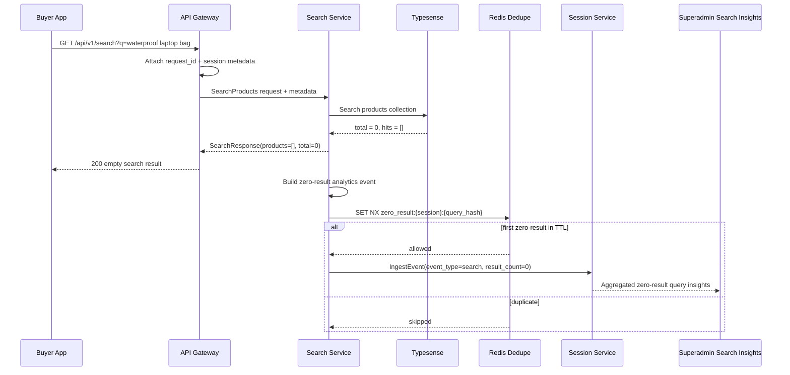
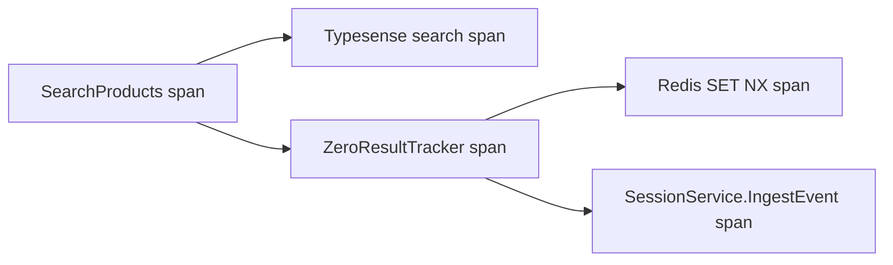
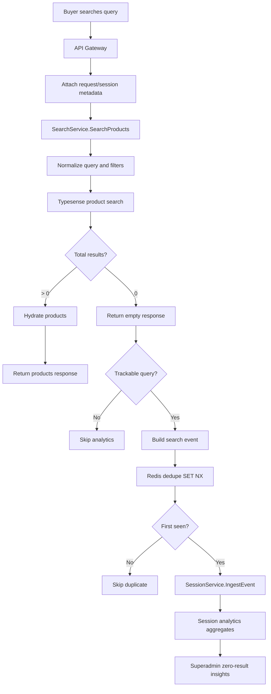

# 🔎 Search Service - Task 7: Zero-Result Tracking


## 📌 Task Summary

| Field | Detail |
|---|---|
| Service | Search Service |
| Task | Task 7 - Zero-Result Tracking |
| Source | `docs/01-micro-tasks.md` -> `Search Service (Typesense)` -> Task 7 |
| Priority | `P2` |
| Dependency | Session Service |
| Main Goal | No-result search queries ko analytics me bhejna, taaki catalog gaps aur missing synonyms improve ho sake |
| Output Type | Documentation-only implementation guide |

> **Simple Hinglish goal:** Buyer jab koi search kare aur `total = 0` aaye, to Search Service us query ka safe analytics event Session Service ko bhejega. Isse Superadmin/Catalog team dekh payegi ki users kya dhoondh rahe hain jo catalog me nahi mil raha, aur phir products, categories, synonyms, ya autocomplete improve kar sakti hai.

---

## ✅ Final Output Created

```text
TaskImplementation/
└── Search Service/
    ├── task1.md
    ├── task2.md
    ├── task3.md
    ├── task4.md
    ├── task5.md
    ├── task6.md
    └── task7.md
```

### Why this structure?

| Path | Purpose |
|---|---|
| `TaskImplementation/` | Saare task-wise implementation guides ka central folder |
| `TaskImplementation/Search Service/` | Search Service ke implementation guides ka group |
| `task7.md` | Sirf Search Service - Task 7 ka detailed Zero-Result Tracking guide |

> 🟢 **Boundary:** Is request me sirf `task7.md` guide create ki gayi hai. Actual backend, proto, infra, frontend, migration, ya Kubernetes files modify nahi kiye gaye. Full reindex Task 8 ka scope hai.

---

## 🧭 Requirement Sources Studied

| Document | Kya use kiya gaya |
|---|---|
| `docs/01-micro-tasks.md` | Task 7 ka exact scope: `Zero-result tracking` |
| `docs/04-microservice-design.md` | Search Service zero-result analytics responsibility and Session Service analytics ownership |
| `docs/05-database-design.md` | Search index strategy me zero-result query tracking mention |
| `docs/08-session-management-system.md` | `search` event type, SessionEventInput, analytics ingestion flow |
| `docs/09-cms-superadmin.md` | Superadmin Search module me zero-result queries view |
| `docs/12-logging-monitoring-scalability.md` | Analytics failure must not block core UX, structured logs, metrics, traces |
| `api/master-api.json` | `SearchService.SearchProducts`, `SessionService.IngestEvent`, `SessionEventInput` schema |
| `TaskImplementation/Search Service/task4.md` | Search API flow jahan `total = 0` detect hoga |
| `TaskImplementation/Search Service/task5.md` | Popular query analytics boundary and Redis cache pattern |
| `TaskImplementation/Search Service/task6.md` | Synonym improvement flow jisme zero-result insights useful honge |

---

## 🧱 Scope of Task 7

### ✅ Included

- Search response ke baad `total == 0` detect karna
- Empty/browse query `*` ko zero-result analytics se exclude karna
- Session context capture karna:
  - `anonymous_id`
  - `session_id`
  - optional `user_id`
  - `request_id`
- Session Service ko `search` event bhejna with `result_count = 0`
- Redis based dedupe/throttle strategy so same session same query spam na kare
- Analytics delivery ko non-blocking rakhna
- Logging, metrics, tracing, privacy, and testing checklist
- Beginner-friendly code examples and Mermaid diagrams

### 🚫 Not Included

| Not Included | Reason |
|---|---|
| Search API implementation from scratch | Already covered in Task 4 |
| Autocomplete API | Already covered in Task 5 |
| Synonym create/list APIs | Already covered in Task 6 |
| Superadmin zero-result dashboard UI | Superadmin Panel frontend task ka scope |
| Session Service storage implementation | Session Service tasks ka scope |
| Full catalog reindex | Task 8 ka scope |
| ML ranking or auto-synonym generation | Future advanced relevance scope |
| Product catalog creation | Product Service ownership |

---

## 🧩 High-Level Architecture



### Hinglish explanation

- **Buyer App** normal search request bhejta hai.
- **API Gateway** request id aur session metadata forward karta hai.
- **Search Service** Typesense se result count nikalta hai.
- Agar `total = 0`, Search Service response delay kiye bina zero-result event prepare karta hai.
- **Redis** duplicate events ko reduce karta hai, jaise same user same query baar-baar refresh kare.
- **Session Service** event store karta hai and analytics aggregates bana sakta hai.
- **Superadmin/Catalog team** zero-result queries dekhkar catalog, synonyms, aur merchandising improve kar sakti hai.

---

## 🧠 Key Decisions

| Decision | Value | Why |
|---|---|---|
| Trigger point | `SearchProducts` result ke baad | Typesense `total` yahin available hota hai |
| Event type | `search` | Session docs me existing event type hai; `result_count=0` se zero-result derive ho jayega |
| Track condition | `total == 0` and normalized query != `*` | Empty browse/listing ko false positive nahi banana |
| Delivery style | Non-blocking best effort | Search UX analytics dependency se slow/fail nahi honi chahiye |
| Failure behavior | Log + metric, but response still success | Docs ke hisaab se analytics failure core UX block nahi karega |
| Dedupe | Redis `SET NX` with TTL | Same session/query spam avoid hota hai |
| Session identity | Frontend SDK/Gateway owned | Search Service session ids generate nahi karega |
| PII policy | Query sanitized, user id hashed/masked where possible | Search terms sensitive ho sakte hain |
| Dashboard source | Session analytics aggregates | Superadmin zero-result queries Session Service data se read karega |
| Direct Typesense write | No | Zero-result event analytics hai, search index mutation nahi |

---

## 🗂️ Recommended Implementation Folder Structure

> Ye actual code implementation ke liye recommended structure hai. Is request me sirf `TaskImplementation/Search Service/task7.md` create hua hai.

```text
ecommerce-platform/
├── TaskImplementation/
│   └── Search Service/
│       ├── task1.md
│       ├── task2.md
│       ├── task3.md
│       ├── task4.md
│       ├── task5.md
│       ├── task6.md
│       └── task7.md
├── api/
│   └── master-api.json
├── proto/
│   └── ecommerce/
│       ├── search/
│       │   └── v1/
│       │       └── search.proto
│       └── session/
│           └── v1/
│               └── session.proto
├── backend/
│   └── services/
│       ├── api-gateway/
│       │   └── internal/
│       │       ├── middleware/
│       │       │   └── session_context.go
│       │       └── clients/
│       │           └── search_client.go
│       └── search-service/
│           ├── cmd/
│           │   └── server/
│           │       └── main.go
│           └── internal/
│               ├── clients/
│               │   └── session_client.go
│               ├── domain/
│               │   ├── search.go
│               │   └── zero_result.go
│               ├── repository/
│               │   └── redis_zero_result_dedupe.go
│               ├── requestctx/
│               │   └── analytics_context.go
│               └── usecase/
│                   ├── contracts.go
│                   ├── search_products.go
│                   └── zero_result_tracker.go
└── infra/
    └── compose/
        └── docker-compose.local.yml
```

### Folder responsibility

| Folder/File | Responsibility |
|---|---|
| `requestctx/analytics_context.go` | Request se `anonymous_id`, `session_id`, `user_id`, `request_id` carry karega |
| `domain/zero_result.go` | Zero-result event model, validation, dedupe key helper |
| `usecase/zero_result_tracker.go` | Non-blocking zero-result analytics publish workflow |
| `usecase/search_products.go` | Search result ke baad tracker call karega |
| `repository/redis_zero_result_dedupe.go` | Same session/query duplicate events throttle karega |
| `clients/session_client.go` | Session Service `IngestEvent` call wrap karega |
| `cmd/server/main.go` | Tracker, dedupe store, and Session client wire karega |

---

## 🧰 External Libraries / Tools Used

| Tool/Library | Type | Why used | Install / Use |
|---|---|---|---|
| Typesense | Search engine | Search result count determine karne ke liye existing search backend | Task 2 setup se already available |
| Redis | Cache/dedupe store | Same query/session duplicate analytics event avoid karne ke liye | Platform Docker Compose Redis service |
| Session Service | Internal analytics service | Search event ingest and aggregate karne ke liye | `SessionService.IngestEvent` contract use hoga |
| gRPC + Protobuf | Internal API contract | Search Service -> Session Service typed event call ke liye recommended | `go get google.golang.org/grpc google.golang.org/protobuf` |
| Go standard library | Built-in | `context`, `time`, `crypto/sha256`, `encoding/json`, `log/slog` | Extra install nahi chahiye |

### Important note

Current Search Service already Typesense, Redis-style helpers, and structured logging patterns use karta hai. Task 7 ke liye **new external Go package mandatory nahi hai** agar repo ke existing Redis helper aur generated Session client available hain.

If gRPC/proto client abhi project me generated nahi hai, temporary adapter same `SessionEventInput` JSON schema ke saath internal HTTP client se ban sakta hai, but final design internal `SessionService.IngestEvent` gRPC method ke saath align hona chahiye.

### Install commands reference

> 🟡 **Note:** Ye commands actual implementation phase ke liye hain. Current task me sirf documentation file create hui hai.

```bash
go get google.golang.org/grpc
go get google.golang.org/protobuf
```

Local dependencies:

```bash
docker compose -f infra/compose/docker-compose.local.yml up -d redis typesense
```

---

## 🧾 Event Contract

Session Service docs me `search` event already defined hai:

```json
{
  "event_type": "search",
  "anonymous_id": "anon_abc123",
  "session_id": "sess_abc123",
  "user_id": "user_123",
  "occurred_at": "2026-05-24T10:30:00Z",
  "path": "/search",
  "properties": {
    "query": "waterproof laptop bag",
    "normalized_query": "waterproof laptop bag",
    "result_count": 0,
    "zero_result": true,
    "filters": {
      "brand": "Acme",
      "min_price": "500"
    },
    "sort": "relevance",
    "page": 1,
    "page_size": 20,
    "source": "search-service",
    "request_id": "req_123"
  }
}
```

### Why `event_type = search`?

- Session Management docs already `search` event define karte hain.
- Zero-result ek separate behavior hai, separate event type zaruri nahi.
- Analytics query simple ho jayegi:
  - `event_type = search`
  - `properties.zero_result = true`
  - `properties.result_count = 0`

---

## 🛣️ Step-by-Step Implementation

## Step 1: Session metadata Gateway se forward karo

Frontend Analytics SDK already `anonymous_id` and `session_id` own karega. Gateway ka kaam hai in identifiers ko Search Service tak safe headers/gRPC metadata me pass karna.

Recommended metadata:

| Metadata | Required | Source |
|---|---:|---|
| `x-request-id` | ✅ | Gateway request middleware |
| `x-anonymous-id` | ✅ | Frontend analytics SDK cookie/local storage |
| `x-session-id` | ✅ | Frontend analytics SDK |
| `x-user-id` | Optional | Auth token claims, agar user logged-in hai |
| `x-client-path` | Optional | Browser route, default `/search` |

Example Gateway forwarding sketch:

```go
func forwardSearchMetadata(ctx context.Context, r *http.Request) context.Context {
	md := metadata.Pairs(
		"x-request-id", requestIDFrom(r),
		"x-anonymous-id", r.Header.Get("X-Anonymous-ID"),
		"x-session-id", r.Header.Get("X-Session-ID"),
		"x-client-path", r.URL.Path,
	)

	if userID := userIDFromAuthContext(r.Context()); userID != "" {
		md.Append("x-user-id", userID)
	}

	return metadata.NewOutgoingContext(ctx, md)
}
```

### Hinglish explanation

- Search Service ko session id generate nahi karni chahiye.
- Buyer app/session SDK identity banata hai.
- Gateway identity ko service metadata me carry karta hai.
- Agar metadata missing hai, search still chalega; analytics event skip hoga.

---

## Step 2: Search Service me analytics context model banao

Search Service ke andar request metadata ko typed context me convert karo.

```go
package requestctx

import "context"

type AnalyticsContext struct {
	RequestID   string
	AnonymousID string
	SessionID   string
	UserID      string
	ClientPath  string
}

type analyticsContextKey struct{}

func WithAnalyticsContext(ctx context.Context, value AnalyticsContext) context.Context {
	return context.WithValue(ctx, analyticsContextKey{}, value)
}

func Analytics(ctx context.Context) AnalyticsContext {
	value, _ := ctx.Value(analyticsContextKey{}).(AnalyticsContext)
	return value
}
```

### Validation rule

```go
func (a AnalyticsContext) CanIngestSessionEvent() bool {
	return strings.TrimSpace(a.AnonymousID) != "" &&
		strings.TrimSpace(a.SessionID) != ""
}
```

### Hinglish explanation

- `SessionEventInput` me `anonymous_id` and `session_id` required hain.
- Agar dono absent hain, event incomplete hoga.
- Isliye Search Service incomplete analytics call nahi bhejega.

---

## Step 3: Zero-result domain model define karo

```go
package domain

import (
	"crypto/sha256"
	"encoding/hex"
	"encoding/json"
	"strings"
	"time"
)

type ZeroResultSearchEvent struct {
	Query           string
	NormalizedQuery string
	Filters         map[string]string
	Sort            string
	Page            int
	PageSize        int
	RequestID       string
	AnonymousID     string
	SessionID       string
	UserID          string
	Path            string
	OccurredAt      time.Time
}

func (e ZeroResultSearchEvent) ShouldTrack() bool {
	query := strings.TrimSpace(e.NormalizedQuery)
	return query != "" &&
		query != DefaultSearchQuery &&
		e.AnonymousID != "" &&
		e.SessionID != ""
}

func (e ZeroResultSearchEvent) DedupeKey() string {
	filtersJSON, _ := json.Marshal(e.Filters)
	sum := sha256.Sum256([]byte(strings.Join([]string{
		e.SessionID,
		strings.ToLower(strings.TrimSpace(e.NormalizedQuery)),
		string(filtersJSON),
	}, "|")))

	return "search:zero_result:v1:" + hex.EncodeToString(sum[:])
}
```

### Hinglish explanation

- `ShouldTrack()` false positives rokta hai.
- `DefaultSearchQuery` yani `*` browse/listing query hai, user intent search nahi.
- `DedupeKey()` same session + same query + same filters ko ek TTL window me once track karega.

---

## Step 4: Search request filters ko analytics-safe map me convert karo

Search filters domain structs me parsed hote hain. Analytics ke liye raw unsafe string expose karne ke bajay allowed filters ka clean map bhejo.

```go
func AnalyticsFilters(input SearchInput) map[string]string {
	filters := map[string]string{}

	if len(input.Filters.Brands) > 0 {
		filters["brand"] = strings.Join(input.Filters.Brands, ",")
	}
	if input.Filters.CategoryID != "" {
		filters["category_id"] = input.Filters.CategoryID
	}
	if input.Filters.SellerID != "" {
		filters["seller_id"] = input.Filters.SellerID
	}
	if input.Filters.MinPrice != nil {
		filters["min_price"] = fmt.Sprintf("%.2f", *input.Filters.MinPrice)
	}
	if input.Filters.MaxPrice != nil {
		filters["max_price"] = fmt.Sprintf("%.2f", *input.Filters.MaxPrice)
	}
	if input.Filters.MinRating != nil {
		filters["min_rating"] = fmt.Sprintf("%.1f", *input.Filters.MinRating)
	}
	if input.Filters.InStock != nil {
		filters["in_stock"] = strconv.FormatBool(*input.Filters.InStock)
	}

	return filters
}
```

### Why this is important?

- Sirf allowlisted filters analytics me jayenge.
- Unknown query params ya raw Typesense syntax leak nahi hoga.
- Dashboard filters consistent format me dikhenge.

---

## Step 5: Dedupe repository banao

Redis ka `SET key value NX EX ttl` perfect fit hai. Existing repo me Redis helper already `SetNX` pattern support kar sakta hai.

```go
type ZeroResultDedupeStore interface {
	MarkFirstSeen(ctx context.Context, key string, ttl time.Duration) (bool, error)
}

type RedisZeroResultDedupeStore struct {
	client *repository.RedisClient
}

func (s *RedisZeroResultDedupeStore) MarkFirstSeen(ctx context.Context, key string, ttl time.Duration) (bool, error) {
	return s.client.SetNX(ctx, key, "1", ttl)
}
```

Recommended TTL:

| TTL | Use |
|---:|---|
| `10m` | Aggressive tracking, more detail |
| `30m` | Balanced default |
| `24h` | Daily unique query/session tracking |

> 🟢 Recommended MVP: `30m`, because repeated refresh/back button duplicate events kam ho jate hain without losing useful demand signals.

---

## Step 6: Session event sink/client create karo

Search Service ko transport details hide karne ke liye interface use karna chahiye.

```go
type SessionEventSink interface {
	IngestSearchEvent(ctx context.Context, event domain.ZeroResultSearchEvent) error
}
```

gRPC-style mapping:

```go
func (c *GRPCSessionEventClient) IngestSearchEvent(ctx context.Context, event domain.ZeroResultSearchEvent) error {
	req := &sessionv1.SessionEventInput{
		EventType:   "search",
		AnonymousId: event.AnonymousID,
		SessionId:   event.SessionID,
		UserId:      event.UserID,
		OccurredAt:  timestamppb.New(event.OccurredAt),
		Path:        event.Path,
		Properties: map[string]*structpb.Value{
			"query":            structpb.NewStringValue(event.Query),
			"normalized_query": structpb.NewStringValue(event.NormalizedQuery),
			"result_count":     structpb.NewNumberValue(0),
			"zero_result":      structpb.NewBoolValue(true),
			"sort":             structpb.NewStringValue(event.Sort),
			"page":             structpb.NewNumberValue(float64(event.Page)),
			"page_size":        structpb.NewNumberValue(float64(event.PageSize)),
			"request_id":       structpb.NewStringValue(event.RequestID),
			"source":           structpb.NewStringValue("search-service"),
		},
	}

	_, err := c.client.IngestEvent(ctx, req)
	return err
}
```

### Hinglish explanation

- Search Service `SessionEventInput` ke exact schema ke according event banata hai.
- `result_count` always `0` rahega.
- `zero_result=true` dashboard queries ko easy banata hai.
- `source=search-service` later debugging me useful hai.

---

## Step 7: Non-blocking tracker usecase banao

Analytics call fail hone par buyer search response fail nahi hona chahiye. Tracker best-effort async behavior rakhega.

```go
type ZeroResultTracker struct {
	dedupe      ZeroResultDedupeStore
	sink        SessionEventSink
	logger      *slog.Logger
	dedupeTTL   time.Duration
	sendTimeout time.Duration
}

func (t *ZeroResultTracker) Track(ctx context.Context, event domain.ZeroResultSearchEvent) {
	if t == nil || !event.ShouldTrack() {
		return
	}

	requestID := event.RequestID

	go func() {
		sendCtx, cancel := context.WithTimeout(context.Background(), t.sendTimeout)
		defer cancel()

		firstSeen, err := t.dedupe.MarkFirstSeen(sendCtx, event.DedupeKey(), t.dedupeTTL)
		if err != nil {
			t.logger.Warn("search.zero_result.dedupe_failed",
				slog.String("request_id", requestID),
				slog.String("error", err.Error()),
			)
			return
		}
		if !firstSeen {
			t.logger.Debug("search.zero_result.duplicate_skipped",
				slog.String("request_id", requestID),
			)
			return
		}

		if err := t.sink.IngestSearchEvent(sendCtx, event); err != nil {
			t.logger.Warn("search.zero_result.ingest_failed",
				slog.String("request_id", requestID),
				slog.String("error", err.Error()),
			)
			return
		}

		t.logger.Info("search.zero_result.tracked",
			slog.String("request_id", requestID),
			slog.String("query", event.NormalizedQuery),
		)
	}()
}
```

### Why async?

- Search route latency-sensitive hot path hai.
- Session Service down ho to search page still work kare.
- Docs explicitly analytics failure ko core UX blocker nahi banate.

### Production improvement

High traffic production me unbounded goroutine ke bajay bounded queue worker use karo:

```text
SearchProducts -> channel buffer -> N workers -> Redis dedupe -> Session Service
```

MVP me simple async tracker enough hai, but channel worker safer for very high traffic.

---

## Step 8: SearchProducts usecase me tracker inject karo

Current Search flow already `metrics.ZeroResults` derive kar sakta hai. Task 7 me actual Session Service event publish add hoga.

```go
type SearchProductsOptions struct {
	Limits            domain.SearchLimits
	TypesenseTimeout  time.Duration
	HydrationTimeout  time.Duration
	Metrics           SearchMetricsRecorder
	ZeroResultTracker *ZeroResultTracker
}
```

When Typesense result is empty:

```go
metrics.Total = searchResult.Total

if searchResult.Total == 0 {
	analyticsCtx := requestctx.Analytics(ctx)

	event := domain.ZeroResultSearchEvent{
		Query:           input.Query,
		NormalizedQuery: strings.ToLower(strings.TrimSpace(input.Query)),
		Filters:         domain.AnalyticsFilters(input),
		Sort:            input.Sort,
		Page:            input.Page,
		PageSize:        input.PageSize,
		RequestID:       analyticsCtx.RequestID,
		AnonymousID:     analyticsCtx.AnonymousID,
		SessionID:       analyticsCtx.SessionID,
		UserID:          analyticsCtx.UserID,
		Path:            analyticsCtx.ClientPath,
		OccurredAt:      time.Now().UTC(),
	}

	u.options.ZeroResultTracker.Track(ctx, event)
}
```

### Important trigger rule

Use `searchResult.Total == 0`, not only `len(searchResult.IDs) == 0`.

Why?

- `len(IDs) == 0` can happen on page beyond available result window.
- `Total == 0` means actual query has no matching products.

---

## Step 9: HTTP/gRPC handler me analytics context attach karo

If Search Service currently HTTP route expose karta hai, headers se context attach karo:

```go
func (h *Handler) handleSearchProducts(w http.ResponseWriter, r *http.Request) {
	requestID := requestIDFrom(r)
	w.Header().Set("X-Request-ID", requestID)

	analytics := requestctx.AnalyticsContext{
		RequestID:   requestID,
		AnonymousID: r.Header.Get("X-Anonymous-ID"),
		SessionID:   r.Header.Get("X-Session-ID"),
		UserID:      r.Header.Get("X-User-ID"),
		ClientPath:  defaultString(r.Header.Get("X-Client-Path"), "/search"),
	}

	ctx := requestctx.WithRequestID(r.Context(), requestID)
	ctx = requestctx.WithAnalyticsContext(ctx, analytics)

	req, err := parseSearchRequest(r.URL.Query())
	if err != nil {
		writeAPIError(w, http.StatusBadRequest, "INVALID_SEARCH_REQUEST", "invalid search request")
		return
	}

	resp, err := h.searchUsecase.Execute(ctx, req)
	if err != nil {
		h.writeUsecaseError(w, r.WithContext(ctx), err)
		return
	}

	writeJSON(w, http.StatusOK, searchResponseDTO(resp))
}
```

### gRPC version

If final service boundary is gRPC, same values gRPC metadata se read honge:

```go
func analyticsContextFromIncomingMetadata(ctx context.Context) requestctx.AnalyticsContext {
	md, _ := metadata.FromIncomingContext(ctx)

	return requestctx.AnalyticsContext{
		RequestID:   firstMD(md, "x-request-id"),
		AnonymousID: firstMD(md, "x-anonymous-id"),
		SessionID:   firstMD(md, "x-session-id"),
		UserID:      firstMD(md, "x-user-id"),
		ClientPath:  defaultString(firstMD(md, "x-client-path"), "/search"),
	}
}
```

---

## Step 10: Config values add karo

Recommended environment variables:

```env
SEARCH_ZERO_RESULT_TRACKING_ENABLED=true
SEARCH_ZERO_RESULT_DEDUPE_TTL=30m
SEARCH_ZERO_RESULT_SEND_TIMEOUT_MS=150
SESSION_SERVICE_GRPC_ADDR=localhost:8090
```

Config validation:

| Env | Default | Validation |
|---|---:|---|
| `SEARCH_ZERO_RESULT_TRACKING_ENABLED` | `true` | bool |
| `SEARCH_ZERO_RESULT_DEDUPE_TTL` | `30m` | must be > 0 |
| `SEARCH_ZERO_RESULT_SEND_TIMEOUT_MS` | `150` | must be > 0 |
| `SESSION_SERVICE_GRPC_ADDR` | none | required when tracking enabled |

### Hinglish explanation

- Feature flag se production rollout controlled rahega.
- Timeout small rakho because analytics hot path nahi.
- Session Service address required hai only when tracking enabled.

---

## Step 11: Application wiring karo

`cmd/server/main.go` me tracker wire hoga:

```go
sessionClient, err := clients.NewSessionEventClient(cfg.Session.GRPCAddr)
if err != nil {
	logger.Error("search.session_client.init_failed", slog.String("error", err.Error()))
	os.Exit(1)
}

zeroResultDedupe := repository.NewRedisZeroResultDedupeStore(redisClient)

zeroResultTracker := usecase.NewZeroResultTracker(
	zeroResultDedupe,
	sessionClient,
	usecase.ZeroResultTrackerOptions{
		Enabled:     cfg.Search.ZeroResultTrackingEnabled,
		DedupeTTL:   cfg.Search.ZeroResultDedupeTTL,
		SendTimeout: cfg.Search.ZeroResultSendTimeout,
	},
	logger,
)

searchUsecase, err := usecase.NewSearchProductsUsecase(
	schemaRepo,
	productSearchRepo,
	productClient,
	usecase.SearchProductsOptions{
		Limits: domain.SearchLimits{
			DefaultPage:     domain.DefaultSearchPage,
			DefaultPageSize: cfg.Search.DefaultPageSize,
			MaxPageSize:     cfg.Search.MaxPageSize,
		},
		TypesenseTimeout:  cfg.Typesense.RequestTimeout,
		HydrationTimeout:  cfg.Product.Timeout,
		ZeroResultTracker: zeroResultTracker,
	},
	logger,
)
```

### Graceful behavior

| Condition | Behavior |
|---|---|
| Tracking disabled | Search response normal, no event |
| Session metadata missing | Search response normal, event skipped |
| Redis down | Search response normal, warning log |
| Session Service down | Search response normal, warning log |
| Typesense down | Search API error, no analytics event |

---

## Step 12: Observability add karo

### Structured logs

Success:

```json
{
  "level": "INFO",
  "service": "search-service",
  "message": "search.zero_result.tracked",
  "request_id": "req_123",
  "query": "waterproof laptop bag",
  "session_id_hash": "hash_only",
  "latency_ms": 42
}
```

Skip:

```json
{
  "level": "DEBUG",
  "service": "search-service",
  "message": "search.zero_result.skipped",
  "reason": "missing_session_context",
  "request_id": "req_123"
}
```

Failure:

```json
{
  "level": "WARN",
  "service": "search-service",
  "message": "search.zero_result.ingest_failed",
  "request_id": "req_123",
  "error_code": "SESSION_SERVICE_UNAVAILABLE"
}
```

### Metrics

| Metric | Type | Labels |
|---|---|---|
| `search_zero_result_total` | Counter | `tracked`, `skipped`, `duplicate`, `failed` |
| `search_zero_result_ingest_latency_ms` | Histogram | `session_service` |
| `search_zero_result_dedupe_total` | Counter | `first_seen`, `duplicate`, `error` |
| `search_products_zero_result_ratio` | Gauge/derived | `route` |

### Tracing



---

## 🔐 Privacy and Security

| Risk | Control |
|---|---|
| User searches may contain PII | Limit retention, mask/hide sensitive terms in admin UI where needed |
| User id exposure | Prefer hashed/masked user id in logs |
| Query injection in dashboard | Treat query as text only, escape in UI |
| Session spoofing | Gateway should validate reasonable id format and rate limit public APIs |
| Analytics flooding | Redis dedupe plus API Gateway rate limits |
| Secrets leak | Session Service credentials only backend env/secret me |

### Query sanitization rules

```go
func NormalizeAnalyticsQuery(q string) string {
	q = strings.TrimSpace(q)
	q = strings.Join(strings.Fields(q), " ")
	if utf8.RuneCountInString(q) > 120 {
		q = string([]rune(q)[:120])
	}
	return q
}
```

Do not log:

- full JWT
- refresh tokens
- passwords
- OTP
- payment/card data
- raw IP

---

## 🧪 Testing Plan

### Unit tests

| Test | Expected |
|---|---|
| `total > 0` | No zero-result event |
| `total == 0` and query `*` | No event |
| `total == 0` and text query | Event built |
| Missing `session_id` | Event skipped |
| Missing `anonymous_id` | Event skipped |
| Same session/query/filter within TTL | First event sent, duplicate skipped |
| Redis dedupe error | Search response still succeeds |
| Session ingest error | Search response still succeeds |
| Filters conversion | Only allowlisted filters included |

Example test sketch:

```go
func TestSearchProductsTracksZeroResult(t *testing.T) {
	tracker := &fakeZeroResultTracker{}
	uc := newSearchProductsUsecaseWithTracker(t, tracker)

	ctx := requestctx.WithAnalyticsContext(context.Background(), requestctx.AnalyticsContext{
		RequestID:   "req_1",
		AnonymousID: "anon_1",
		SessionID:   "sess_1",
		ClientPath:  "/search",
	})

	resp, err := uc.Execute(ctx, domain.SearchRequest{
		Query: "waterproof laptop bag",
		Page:  1,
	})

	if err != nil {
		t.Fatal(err)
	}
	if resp.Total != 0 {
		t.Fatalf("total = %d", resp.Total)
	}
	if tracker.calls != 1 {
		t.Fatalf("tracker calls = %d", tracker.calls)
	}
}
```

### Integration tests

| Scenario | Expected |
|---|---|
| Typesense returns zero hits | Session Service receives `search` event |
| Redis available | Duplicate query skipped |
| Redis unavailable | Warning logged, search response unchanged |
| Session Service unavailable | Warning logged, search response unchanged |
| Gateway passes metadata | Search Service event has same session id |

### Manual cURL check

```bash
curl -i "http://localhost:8085/api/v1/search?q=zzzz-no-product" \
  -H "X-Request-ID: req_zero_1" \
  -H "X-Anonymous-ID: anon_zero_1" \
  -H "X-Session-ID: sess_zero_1" \
  -H "X-Client-Path: /search"
```

Expected Search response:

```json
{
  "products": [],
  "facets": {},
  "total": 0
}
```

Expected analytics event in Session Service:

```json
{
  "event_type": "search",
  "anonymous_id": "anon_zero_1",
  "session_id": "sess_zero_1",
  "properties": {
    "query": "zzzz-no-product",
    "result_count": 0,
    "zero_result": true
  }
}
```

---

## 📊 Admin Analytics Usage

Zero-result analytics ka end goal Superadmin/Catalog team ko actionable insight dena hai.

### Example dashboard columns

| Column | Meaning |
|---|---|
| Query | User ne kya search kiya |
| Count | Kitni baar zero-result aaya |
| Unique sessions | Kitne sessions impacted hue |
| Top filters | Kaunse filters ke saath issue aaya |
| Last seen | Latest occurrence |
| Suggested action | Add product, add synonym, rename category, improve title |

### Example aggregation logic

```text
Group by normalized_query
Filter: event_type = search AND properties.zero_result = true
Metrics:
  count(*)
  count_distinct(session_id)
  max(occurred_at)
  top filters
```

### Catalog action examples

| Zero-result query | Possible action |
|---|---|
| `cellphone cover` | Add synonym `mobile cover -> cellphone cover` |
| `waterproof laptop bag` | Add missing product/category or improve product title |
| `kid school shoes` | Add category synonym or merchandising tag |
| `iphone charger original` | Add brand/accessory filters and product metadata |

---

## 🔄 Complete Flow Diagram



---

## ✅ Acceptance Criteria

| # | Criteria | Status |
|---:|---|---|
| 1 | Search Service detects `total == 0` after Typesense search | ✅ Defined |
| 2 | Empty query/default `*` is not tracked as zero-result | ✅ Defined |
| 3 | Event uses Session Service `search` event shape | ✅ Defined |
| 4 | Event includes query, filters, sort, page, result_count, request id | ✅ Defined |
| 5 | Missing session context skips analytics safely | ✅ Defined |
| 6 | Redis dedupe prevents same session/query spam | ✅ Defined |
| 7 | Session Service failure does not fail Search API | ✅ Defined |
| 8 | Logs/metrics/traces added for tracked/skipped/failed outcomes | ✅ Defined |
| 9 | No PII/secrets logged | ✅ Defined |
| 10 | Tests cover success, skip, duplicate, and dependency failure cases | ✅ Defined |

---

## 🚦 Implementation Checklist

| Step | Work Item | Done When |
|---:|---|---|
| 1 | Gateway session metadata forwarding | Search Service receives request/session metadata |
| 2 | Request analytics context | `requestctx.Analytics(ctx)` returns typed values |
| 3 | Zero-result domain model | Event validation and dedupe key helper tested |
| 4 | Analytics-safe filters | Only allowlisted filters are emitted |
| 5 | Redis dedupe store | Same session/query/filter duplicate skipped |
| 6 | Session event client | `SessionService.IngestEvent` receives `search` event |
| 7 | Non-blocking tracker | Tracking failure does not affect search response |
| 8 | SearchProducts integration | `total == 0` triggers tracker |
| 9 | Config/env | Feature flag, TTL, timeout, Session address available |
| 10 | Observability | Logs and metrics for tracked/skipped/failed |
| 11 | Tests | Unit and integration cases pass |

---

## 🧾 Final Scope Confirmation

| Feature | Included in Task 7? |
|---|---:|
| Zero-result query detection | ✅ Yes |
| Session analytics event publish | ✅ Yes |
| Redis duplicate suppression | ✅ Yes |
| PII-safe logging guidance | ✅ Yes |
| Superadmin dashboard design notes | ✅ Notes only |
| Search API product retrieval | 🚫 Task 4 |
| Autocomplete popular query ranking | 🚫 Task 5 |
| Synonym management | 🚫 Task 6 |
| Full reindex job | 🚫 Task 8 |
| Session Service database implementation | 🚫 Session Service tasks |

> 🟢 **Final Hinglish summary:** Task 7 ka kaam Search Service ko smarter feedback loop dena hai. Jab buyer ki real search query par `total = 0` aata hai, Search Service safe, deduped, non-blocking analytics event Session Service ko bhejta hai. Search response fast aur reliable rehta hai, aur admin team ko clear signal milta hai ki catalog, synonyms, category naming, ya product titles kaha improve karne hain.
