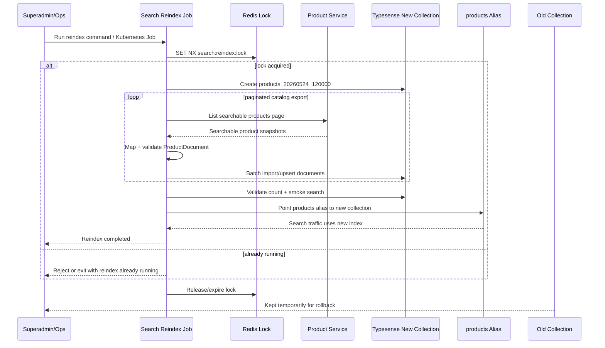
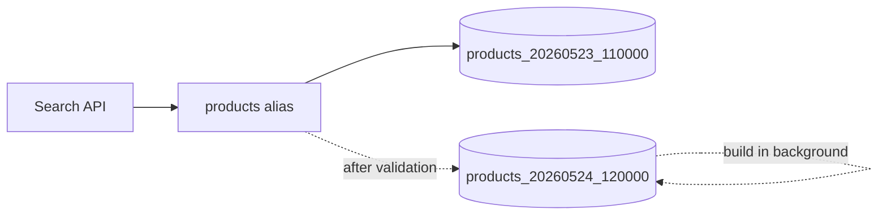
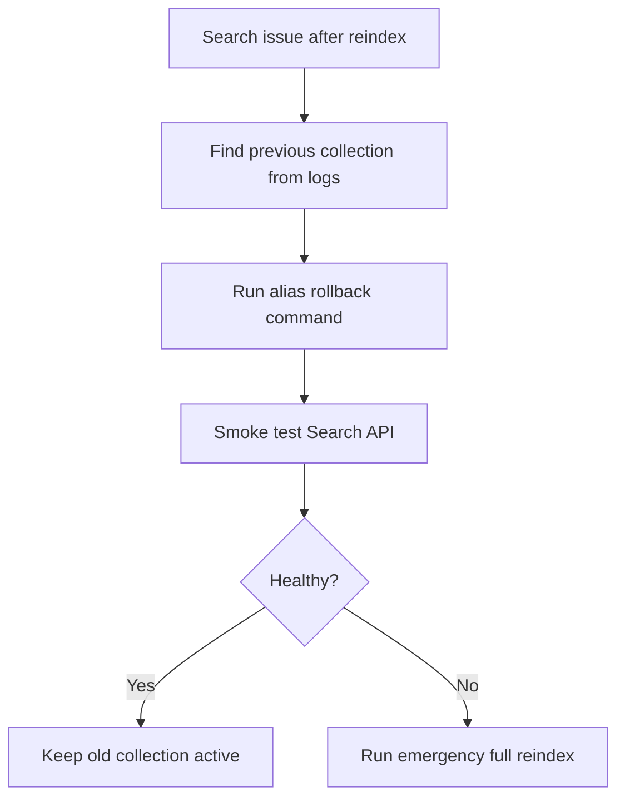

# 🔎 Search Service - Task 8: Reindex Job


## 📌 Task Summary

| Field | Detail |
|---|---|
| Service | Search Service |
| Task | Task 8 - Reindex job |
| Source | `docs/01-micro-tasks.md` -> `Search Service (Typesense)` -> Task 8 |
| Priority | `P1` |
| Dependency | Product Service |
| Main Goal | Full catalog reindex command and Kubernetes Job banana, taaki schema change, drift recovery, aur bulk rebuild safely ho sake |
| Output Type | Documentation-only implementation guide |

> **Simple Hinglish goal:** Search index kabhi stale ho sakta hai, ya schema change ke baad purana Typesense collection compatible nahi rahega. Task 8 ka kaam hai ek controlled **full catalog reindex** flow define karna: Product Service se saare searchable products pages me read karo, Typesense me clean/indexed copy rebuild karo, validate karo, aur safe mode me `products` alias swap karo.

---

## ✅ Final Output Created

```text
TaskImplementation/
└── Search Service/
    ├── task1.md
    ├── task2.md
    ├── task3.md
    ├── task4.md
    ├── task5.md
    ├── task6.md
    ├── task7.md
    └── task8.md
```

### Why this structure?

| Path | Purpose |
|---|---|
| `TaskImplementation/` | Saare task-wise implementation guides ka central folder |
| `TaskImplementation/Search Service/` | Search Service ke implementation guides ka group |
| `task8.md` | Sirf Search Service - Task 8 ka detailed Reindex Job guide |

> 🟢 **Boundary:** Is request me sirf `task8.md` guide create ki gayi hai. Actual backend Go files, Product Service APIs, Kubernetes manifests, infra config, ya frontend/admin UI modify nahi kiye gaye. Task 8 ka scope full catalog reindex command/job tak limited hai.

---

## 🧭 Requirement Sources Studied

| Document/File | Kya use kiya gaya |
|---|---|
| `docs/01-micro-tasks.md` | Task 8 ka exact scope: `Reindex job`, dependency Product Service, priority P1 |
| `docs/04-microservice-design.md` | Search Service responsibility: full reindex, Product Service source of truth, admin reindex route |
| `docs/05-database-design.md` | Typesense `products` collection fields and indexing strategy |
| `docs/02-system-architecture.md` | `jobs` namespace and batch/reindex job placement |
| `docs/03-folder-structure.md` | Clean architecture folders for Go services |
| `docs/11-devops-external-services.md` | Full reindex reads Product Service pages and upserts to Typesense |
| `docs/09-cms-superadmin.md` | Superadmin Search module includes synonyms, reindex, zero-result queries |
| `docs/12-logging-monitoring-scalability.md` | Logs, metrics, tracing, alerts, Typesense latency, failure isolation |
| `docs/13-developer-guide.md` | Layer rules: domain -> usecase -> repository/clients -> transport |
| `api/master-api.json` | `SearchService.ReindexProduct`, Product `ListProducts`, Product `BatchGetProducts` contract references |
| `TaskImplementation/Search Service/task1.md` | Product search schema contract |
| `TaskImplementation/Search Service/task2.md` | Typesense runtime setup |
| `TaskImplementation/Search Service/task3.md` | Product indexer, event payload, mapper, idempotent write behavior |
| `TaskImplementation/Search Service/task4.md` | Search API depends on `products` index and Product Service hydration |
| `TaskImplementation/Search Service/task6.md` | Admin Search area and RBAC expectations |
| `TaskImplementation/Search Service/task7.md` | Analytics boundary, full reindex is next task |
| `backend/services/search-service/` | Existing Go package layout, config, Typesense repository, Product client, indexer mapper |
| `infra/k8s/core/search-service/configmap.yaml` | Current Search Service env and Kubernetes naming patterns |

---

## 🧱 Scope of Task 8

### ✅ Included

- Full catalog reindex command design
- Kubernetes `Job` design for running full reindex
- Product Service paginated export contract
- Typesense versioned collection strategy
- Safe alias swap strategy for schema changes
- In-place reindex fallback for simple drift recovery
- Batch processing, validation, progress logs, and metrics
- Redis lock strategy to avoid two full reindexes at same time
- Admin trigger guidance for `POST /api/v1/admin/search/reindex`
- Rollback and cleanup runbook
- Beginner-friendly code examples and Mermaid diagrams

### 🚫 Not Included

| Not Included | Reason |
|---|---|
| Product Service catalog implementation | Product Service ownership hai |
| Product event consumer/indexer from scratch | Already covered in Task 3 |
| Search API query behavior | Already covered in Task 4 |
| Autocomplete | Already covered in Task 5 |
| Synonym management | Already covered in Task 6 |
| Zero-result analytics | Already covered in Task 7 |
| Superadmin React UI button/page | Superadmin Panel frontend task ka scope |
| ML ranking or merchandising rules | Future relevance enhancement |
| Deleting old collections immediately | Rollback safety ke liye retention window recommended hai |

---

## 🧩 High-Level Architecture



### Hinglish explanation

- **Superadmin/Ops** reindex start karta hai, ya Kubernetes Job manually run hota hai.
- **Search Reindex Job** ek standalone command hai, normal HTTP server ke andar long-running process nahi.
- **Redis Lock** ensure karta hai ki ek time pe sirf ek full reindex chale.
- **Product Service** source of truth hai, isliye job direct Product DB read nahi karega.
- **Typesense New Collection** versioned naam se banegi, jaise `products_20260524_120000`.
- **Alias `products`** stable naam rahega jise Search API use karegi.
- **Old Collection** rollback ke liye kuch time retain hogi.

---

## 🧠 Key Decisions

| Decision | Value | Why |
|---|---|---|
| Reindex owner | Search Service | Search projection and Typesense schema Search Service own karta hai |
| Source of truth | Product Service | Product DB direct read karna microservice boundary break karega |
| Default mode | Versioned collection + alias swap | Schema change ke time safest approach |
| Alias name | `products` | Existing config `TYPESENSE_PRODUCTS_COLLECTION=products` stable logical name reh sakta hai |
| Physical collection | `products_YYYYMMDD_HHMMSS` | Har rebuild isolated and rollback-friendly hota hai |
| Lock | Redis `SET NX` with TTL | Duplicate heavy jobs prevent hote hain |
| Batch size | `250` to `1000` | Product Service and Typesense load balanced rahega |
| Failure behavior | Fail fast, keep old alias | Buyer search existing index pe continue karega |
| Cleanup | Retain last 2 to 3 old collections | Rollback ke liye useful, storage control me rahega |
| Admin API | Trigger job, not do full work inline | HTTP request timeout aur gateway overload avoid hota hai |
| Direct DB access | Never | Service ownership rule follow hota hai |

---

## 🗂️ Recommended Implementation Folder Structure

> Ye actual code implementation ke liye recommended structure hai. Is request me sirf `TaskImplementation/Search Service/task8.md` create hua hai.

```text
ecommerce-platform/
├── TaskImplementation/
│   └── Search Service/
│       ├── task1.md
│       ├── task2.md
│       ├── task3.md
│       ├── task4.md
│       ├── task5.md
│       ├── task6.md
│       ├── task7.md
│       └── task8.md
├── backend/
│   └── services/
│       └── search-service/
│           ├── cmd/
│           │   ├── server/
│           │   │   └── main.go
│           │   └── reindex/
│           │       └── main.go
│           └── internal/
│               ├── clients/
│               │   ├── http_product_client.go
│               │   └── product_export_client.go
│               ├── config/
│               │   └── config.go
│               ├── domain/
│               │   ├── product_document.go
│               │   └── reindex.go
│               ├── indexer/
│               │   └── mapper.go
│               ├── repository/
│               │   ├── redis_reindex_lock.go
│               │   ├── typesense_collection_repository.go
│               │   ├── typesense_product_repository.go
│               │   └── typesense_reindex_repository.go
│               ├── transport/
│               │   └── http/
│               │       └── handler.go
│               └── usecase/
│                   ├── contracts.go
│                   └── reindex_catalog.go
└── infra/
    └── k8s/
        └── jobs/
            └── search-reindex/
                ├── job.yaml
                └── README.md
```

### Folder responsibility

| Folder/File | Responsibility |
|---|---|
| `cmd/reindex/main.go` | CLI entrypoint: config load, clients wire, usecase execute |
| `internal/domain/reindex.go` | Reindex request, progress, result, mode constants |
| `internal/usecase/reindex_catalog.go` | Main workflow: lock -> create collection -> export pages -> import -> validate -> alias swap |
| `internal/clients/product_export_client.go` | Product Service se paginated searchable snapshots read karega |
| `internal/repository/typesense_reindex_repository.go` | Versioned collection create, bulk import, alias swap, count, cleanup |
| `internal/repository/redis_reindex_lock.go` | Redis distributed lock wrapper |
| `transport/http/handler.go` | Optional admin trigger route: enqueue/start job, inline heavy work nahi |
| `infra/k8s/jobs/search-reindex/job.yaml` | Kubernetes manual Job for full reindex |

---

## 🧰 External Libraries / Tools Used

| Tool/Library | Type | Why used | Install / Use |
|---|---|---|---|
| Typesense | Search engine | Product search index rebuild karne ke liye | Task 2 setup se available |
| `github.com/typesense/typesense-go/v2` | Go client | Collection create, document upsert/import, alias management, search validation | Already in `backend/services/search-service/go.mod`; install with `go get github.com/typesense/typesense-go/v2` if missing |
| Redis | Lock store | Ek time pe multiple full reindex jobs avoid karne ke liye | Existing platform Redis; Search Service me simple Redis client already present |
| Kubernetes `Job` | Ops runtime | Full reindex long-running batch process ko controlled pod me run karne ke liye | Kubernetes cluster and `kubectl` |
| Docker | Container packaging | Same Search Service image se `reindex` command run karne ke liye | Existing Docker build pipeline |
| Product Service internal API/gRPC | Data source | Full catalog source of truth Product Service se paginated read ke liye | Product Service contract implement hona chahiye |
| Go standard library | Built-in | `context`, `time`, `log/slog`, `flag`, `errors`, `fmt` | Extra install nahi chahiye |

### Important note

Task 8 ke liye **new third-party Go package mandatory nahi hai**. Existing service already Typesense client and custom Redis client pattern use karta hai. Reindex job ko same packages reuse karne chahiye.

### Install commands reference

> 🟡 Ye commands actual implementation phase ke liye hain. Current task me sirf documentation file create hui hai.

```bash
go get github.com/typesense/typesense-go/v2
```

Local dependencies:

```bash
docker compose -f infra/compose/docker-compose.local.yml up -d typesense redis
```

Kubernetes Job run:

```bash
kubectl apply -f infra/k8s/jobs/search-reindex/job.yaml
```

---

## 🪜 Step-by-Step Implementation Guide

## Step 1: Task boundary clear karo

Task 8 ka kaam **full catalog rebuild** hai.

Iska matlab:

- Product Service se saare searchable products read karo.
- Har product ko Search Service ke `ProductDocument` schema me map karo.
- Typesense me new or existing index update karo.
- Schema change ke case me new versioned collection banao.
- Successful validation ke baad alias swap karo.
- Failure ke case me old working index untouched rakho.

Task 8 me buyer search UI, synonyms UI, Product Service CRUD, ya analytics dashboard nahi banega.

### How this part was built

- `docs/01-micro-tasks.md` ne exact line di: full catalog reindex command and job.
- `docs/11-devops-external-services.md` ne clarify kiya ki full reindex Product Service pages read karke Typesense me upsert karega.
- Existing `backend/services/search-service` me already mapper, Product index repository, Typesense schema, Redis client, and config patterns hain. Task 8 unhi ko extend karega.

---

## Step 2: Reindex modes define karo

Do practical modes chahiye:

| Mode | Use Case | Behavior |
|---|---|---|
| `alias` | Schema change, major rebuild, safest production path | New collection create -> import -> validate -> alias swap |
| `in_place` | Minor drift repair, local/dev quick fix | Existing `products` collection me upsert/delete |

Recommended default:

```text
alias
```

### Why alias mode better hai?



- Buyer search old index pe chalta rahega.
- New index background me build hota hai.
- Validation fail hui to alias swap nahi hoga.
- Swap ke baad rollback possible hai by alias old collection pe point karke.

---

## Step 3: Reindex config add karo

Implementation phase me Search Service config me ye env variables add karo:

```dotenv
SEARCH_REINDEX_MODE=alias
SEARCH_REINDEX_BATCH_SIZE=500
SEARCH_REINDEX_LOCK_TTL=3h
SEARCH_REINDEX_JOB_TIMEOUT=2h
SEARCH_REINDEX_COLLECTION_PREFIX=products
SEARCH_REINDEX_OLD_COLLECTION_RETENTION=72h
PRODUCT_SERVICE_SEARCH_EXPORT_PATH=/internal/v1/products/search-export
PRODUCT_SERVICE_SEARCH_EXPORT_TIMEOUT_MS=2000
TYPESENSE_REINDEX_IMPORT_TIMEOUT_MS=5000
```

### Config explanation

| Env | Meaning |
|---|---|
| `SEARCH_REINDEX_MODE` | `alias` or `in_place` |
| `SEARCH_REINDEX_BATCH_SIZE` | Per Product Service page kitne products read honge |
| `SEARCH_REINDEX_LOCK_TTL` | Running job lock expiry |
| `SEARCH_REINDEX_JOB_TIMEOUT` | Complete job max time |
| `SEARCH_REINDEX_COLLECTION_PREFIX` | Physical collection prefix, usually `products` |
| `SEARCH_REINDEX_OLD_COLLECTION_RETENTION` | Old collections cleanup retention |
| `PRODUCT_SERVICE_SEARCH_EXPORT_PATH` | Product Service paginated search snapshot endpoint |
| `PRODUCT_SERVICE_SEARCH_EXPORT_TIMEOUT_MS` | Product page fetch deadline |
| `TYPESENSE_REINDEX_IMPORT_TIMEOUT_MS` | Typesense batch import/upsert deadline |

### How this part was built

Existing `config.Config` already groups `Typesense`, `Product`, `Indexer`, `Queue`, `Redis`, `Admin`. Task 8 should add a small `ReindexConfig` instead of mixing reindex-specific settings into unrelated structs.

Recommended shape:

```go
type ReindexConfig struct {
    Mode                   string
    BatchSize              int
    LockTTL                time.Duration
    JobTimeout             time.Duration
    CollectionPrefix       string
    OldCollectionRetention time.Duration
    ImportTimeout          time.Duration
}
```

---

## Step 4: Domain model banao

Reindex job ko progress and result structured form me track karna chahiye.

```go
package domain

import "time"

const (
    ReindexModeAlias   = "alias"
    ReindexModeInPlace = "in_place"
)

type ReindexRequest struct {
    Mode      string
    BatchSize int
    Reason    string
    ActorID   string
    DryRun    bool
}

type ReindexProgress struct {
    JobID              string
    Mode               string
    TargetCollection   string
    SourceCursor       string
    ProductsRead       int
    ProductsIndexed    int
    ProductsSkipped    int
    FailedDocuments    int
    StartedAt          time.Time
    LastProgressAt     time.Time
}

type ReindexResult struct {
    JobID              string
    Mode               string
    TargetCollection   string
    PreviousCollection string
    ProductsRead       int
    ProductsIndexed    int
    ProductsSkipped    int
    Duration           time.Duration
    AliasSwapped       bool
}
```

### Why domain model useful hai?

- Logs me same fields consistently aayenge.
- Tests me expected counters verify karna easy hoga.
- Admin response or future dashboard ke liye result reusable rahega.

---

## Step 5: Product Service export contract define karo

Full reindex ko normal product list DTO se better **search snapshot DTO** chahiye, because search index fields specific hain:

- `category_ids`
- `price`
- `rating`
- `popularity_score`
- `in_stock`
- `status`
- `is_deleted`
- timestamps

Recommended internal endpoint:

```http
GET /internal/v1/products/search-export?cursor=abc&limit=500
```

Response example:

```json
{
  "items": [
    {
      "product_id": "prod_123",
      "title": "Nike Running Shoes",
      "description": "Lightweight running shoes",
      "brand": "Nike",
      "category_ids": ["cat_shoes", "cat_running"],
      "seller_id": "seller_456",
      "price": 2499.0,
      "rating": 4.5,
      "popularity_score": 982,
      "in_stock": true,
      "status": "published",
      "is_deleted": false,
      "created_at": "2026-05-01T10:00:00Z",
      "updated_at": "2026-05-24T10:00:00Z"
    }
  ],
  "next_cursor": "next_abc",
  "has_more": true
}
```

### Client interface

```go
type ProductCatalogReader interface {
    ListSearchableProducts(ctx context.Context, req ProductExportRequest) (ProductExportPage, error)
}

type ProductExportRequest struct {
    Cursor string
    Limit  int
}

type ProductExportPage struct {
    Items      []events.ProductIndexPayload
    NextCursor string
    HasMore    bool
}
```

### How this part was built

- Existing Task 3 already defines `events.ProductIndexPayload`.
- Full reindex can reuse the same payload shape as product events.
- Isse event-driven indexing and full reindex dono same mapper use karenge.

> 🟡 **Rule:** Search Service Product DB direct read nahi karega. Product Service hi published/searchable catalog export karega.

---

## Step 6: Existing mapper reuse karo

Task 3 me existing mapper pattern:

```go
document := indexer.MapProductToDocument(payload, occurredAt)
```

Full reindex me bhi same mapper use karo:

```go
func mapExportPayload(payload events.ProductIndexPayload, now time.Time) (domain.ProductDocument, bool, error) {
    normalized := payload.Normalized()
    if !normalized.IsSearchable() {
        return domain.ProductDocument{}, false, nil
    }

    doc := indexer.MapProductToDocument(normalized, now)
    if err := doc.Validate(); err != nil {
        return domain.ProductDocument{}, false, err
    }
    return doc, true, nil
}
```

### Why mapper reuse important hai?

| Reason | Benefit |
|---|---|
| Same document shape | Event updates and full rebuild consistent rahenge |
| Fewer bugs | Mapping logic duplicate nahi hoga |
| Easier testing | Existing mapper tests expand kiye ja sakte hain |
| Safer schema changes | One place update karna hoga |

---

## Step 7: Redis lock implement karo

Full catalog reindex expensive hota hai. Same time pe two jobs chale to Typesense, Product Service, and aliases conflict kar sakte hain.

Recommended lock key:

```text
search:reindex:products:lock
```

Interface:

```go
type ReindexLock interface {
    Acquire(ctx context.Context, jobID string, ttl time.Duration) (bool, error)
}
```

Implementation sketch:

```go
func (l *RedisReindexLock) Acquire(ctx context.Context, jobID string, ttl time.Duration) (bool, error) {
    return l.redis.SetNX(ctx, "search:reindex:products:lock", jobID, ttl)
}
```

### Lock behavior

| Case | Behavior |
|---|---|
| Lock acquired | Job starts |
| Lock already exists | Job exits with clear error |
| Job crashes | TTL eventually expires |
| Long job | Refresh/extend lock heartbeat recommended for production |

---

## Step 8: Typesense reindex repository define karo

Task 8 needs operations beyond normal search/upsert:

- Create versioned collection
- Bulk import/upsert documents
- Count indexed documents
- Smoke search target collection
- Swap alias
- Optional old collection cleanup

Recommended interface:

```go
type ReindexRepository interface {
    EnsureCollection(ctx context.Context, collection domain.CollectionSchema) error
    ImportProducts(ctx context.Context, collection string, docs []domain.ProductDocument) error
    CountDocuments(ctx context.Context, collection string) (int, error)
    SwapAlias(ctx context.Context, alias string, collection string) error
    ResolveAlias(ctx context.Context, alias string) (string, error)
}
```

### Import strategy

For MVP, existing `UpsertProduct` loop works:

```go
for _, doc := range docs {
    if err := productRepo.UpsertProduct(ctx, doc); err != nil {
        return err
    }
}
```

For production, prefer Typesense bulk import when available:

```text
documents/import?action=upsert
```

### How this part was built

- Existing `TypesenseProductRepository.UpsertProduct` already validates and writes one product.
- Reindex job can first ship with simple per-document upsert for correctness.
- Bulk import can be added behind the same `ImportProducts` interface without changing usecase.

---

## Step 9: Versioned collection naming strategy banao

Use UTC timestamp:

```text
products_20260524_120000
```

Go helper:

```go
func versionedCollectionName(prefix string, now time.Time) string {
    return fmt.Sprintf("%s_%s", prefix, now.UTC().Format("20060102_150405"))
}
```

### Naming rules

| Rule | Example |
|---|---|
| Prefix stable rakho | `products` |
| Timestamp UTC use karo | `20260524_120000` |
| No spaces | Typesense collection names clean rahenge |
| Keep old collection | `products_20260523_110000` rollback ke liye |

---

## Step 10: Main reindex workflow implement karo

Usecase pseudo-code:

```go
func (u *ReindexCatalogUsecase) Execute(ctx context.Context, req domain.ReindexRequest) (domain.ReindexResult, error) {
    startedAt := time.Now().UTC()
    jobID := newReindexJobID(startedAt)

    locked, err := u.lock.Acquire(ctx, jobID, u.options.LockTTL)
    if err != nil {
        return domain.ReindexResult{}, err
    }
    if !locked {
        return domain.ReindexResult{}, domain.ErrReindexAlreadyRunning
    }

    targetCollection := u.collectionName(req.Mode, startedAt)
    previousCollection := ""

    if req.Mode == domain.ReindexModeAlias {
        previousCollection, _ = u.repo.ResolveAlias(ctx, u.options.ProductsAlias)
        if err := u.repo.EnsureCollection(ctx, u.collectionSchema(targetCollection)); err != nil {
            return domain.ReindexResult{}, err
        }
    }

    result, err := u.indexAllPages(ctx, targetCollection, req.BatchSize)
    if err != nil {
        return domain.ReindexResult{}, err
    }

    if err := u.validateTarget(ctx, targetCollection, result.ProductsIndexed); err != nil {
        return domain.ReindexResult{}, err
    }

    if req.Mode == domain.ReindexModeAlias && !req.DryRun {
        if err := u.repo.SwapAlias(ctx, u.options.ProductsAlias, targetCollection); err != nil {
            return domain.ReindexResult{}, err
        }
        result.AliasSwapped = true
    }

    result.JobID = jobID
    result.TargetCollection = targetCollection
    result.PreviousCollection = previousCollection
    result.Duration = time.Since(startedAt)
    return result, nil
}
```

### How this part was built

Workflow ko small steps me divide kiya gaya:

- Lock
- Prepare target collection
- Read Product pages
- Map and validate
- Import
- Validate target
- Swap alias
- Report result

Isse failure point easily visible hota hai and tests straightforward bante hain.

---

## Step 11: Product pages read karo

Paginated loop:

```go
func (u *ReindexCatalogUsecase) indexAllPages(ctx context.Context, collection string, batchSize int) (domain.ReindexResult, error) {
    cursor := ""
    result := domain.ReindexResult{}

    for {
        page, err := u.products.ListSearchableProducts(ctx, ProductExportRequest{
            Cursor: cursor,
            Limit:  batchSize,
        })
        if err != nil {
            return result, err
        }

        docs := make([]domain.ProductDocument, 0, len(page.Items))
        now := time.Now().UTC()

        for _, item := range page.Items {
            result.ProductsRead++
            doc, ok, err := mapExportPayload(item, now)
            if err != nil {
                result.ProductsSkipped++
                continue
            }
            if !ok {
                result.ProductsSkipped++
                continue
            }
            docs = append(docs, doc)
        }

        if len(docs) > 0 {
            if err := u.index.ImportProducts(ctx, collection, docs); err != nil {
                return result, err
            }
            result.ProductsIndexed += len(docs)
        }

        u.logProgress(ctx, result, cursor)

        if !page.HasMore {
            break
        }
        cursor = page.NextCursor
    }

    return result, nil
}
```

### Important pagination rules

| Rule | Why |
|---|---|
| Cursor-based pagination preferred | Product inserts/updates ke beech stable traversal |
| Batch size bounded | Product Service overload avoid hota hai |
| Empty page with `has_more=true` invalid | Infinite loop prevent karo |
| Deadline per page | Hung Product Service call job block nahi karega |

---

## Step 12: Validation gates add karo

Alias swap se pehle validation mandatory hai.

### Minimum validation checklist

| Check | Required | Why |
|---|---:|---|
| Indexed count > 0 | ✅ | Empty catalog accidentally activate na ho |
| Indexed count close to Product Service count | ✅ | Partial imports catch hon |
| Smoke search `q=*` returns docs | ✅ | Typesense read path works |
| Facet fields present | ✅ | Filters broken na hon |
| Random product ids searchable by exact title | Recommended | Mapping quality check |
| Alias currently resolves | Recommended | Rollback metadata ready |

Code sketch:

```go
func (u *ReindexCatalogUsecase) validateTarget(ctx context.Context, collection string, expectedMin int) error {
    count, err := u.index.CountDocuments(ctx, collection)
    if err != nil {
        return err
    }
    if expectedMin > 0 && count == 0 {
        return fmt.Errorf("%w: target collection is empty", domain.ErrReindexValidationFailed)
    }
    if count < expectedMin {
        return fmt.Errorf("%w: indexed count %d is below expected %d", domain.ErrReindexValidationFailed, count, expectedMin)
    }
    return nil
}
```

---

## Step 13: Alias swap safely karo

Alias swap should happen only after validation.

```go
if err := repo.SwapAlias(ctx, "products", targetCollection); err != nil {
    return err
}
```

### Rollback command

Agar swap ke baad issue dikhe:

```bash
search-service reindex-alias --alias products --target products_20260523_110000
```

### Rollback rule

| Situation | Action |
|---|---|
| New index validation fail | Do not swap alias |
| Search errors after swap | Swap alias back to previous collection |
| Old collection missing | Emergency full reindex from Product Service |

> 🔴 **Important:** Old collection ko immediately delete mat karo. At least 24 to 72 hours retain karo.

---

## Step 14: CLI command banao

Recommended command:

```bash
go run ./cmd/reindex --mode=alias --batch-size=500 --reason=schema_change
```

Built binary usage:

```bash
./search-reindex --mode=alias --batch-size=500 --reason=manual_rebuild
```

CLI flags:

| Flag | Default | Purpose |
|---|---|---|
| `--mode` | `alias` | `alias` or `in_place` |
| `--batch-size` | env value | Product export page size |
| `--reason` | `manual` | Audit/log context |
| `--dry-run` | `false` | Read/map/validate without alias swap |
| `--target` | auto | Optional target collection for advanced ops |

`cmd/reindex/main.go` skeleton:

```go
package main

func main() {
    cfg := mustLoadConfig()
    logger := slog.New(slog.NewJSONHandler(os.Stdout, nil))

    req := parseFlags(cfg.Reindex)
    ctx, cancel := context.WithTimeout(context.Background(), cfg.Reindex.JobTimeout)
    defer cancel()

    usecase := buildReindexUsecase(cfg, logger)
    result, err := usecase.Execute(ctx, req)
    if err != nil {
        logger.Error("search.reindex.failed", slog.String("error", err.Error()))
        os.Exit(1)
    }

    logger.Info("search.reindex.completed",
        slog.String("job_id", result.JobID),
        slog.String("target_collection", result.TargetCollection),
        slog.Int("products_indexed", result.ProductsIndexed),
        slog.Bool("alias_swapped", result.AliasSwapped),
    )
}
```

### How this part was built

Long-running reindex ko HTTP server process se alag CLI me rakha gaya. Isse Kubernetes Job, local ops, and CI smoke reindex all same command use kar sakte hain.

---

## Step 15: Admin trigger route design karo

Docs me admin route mentioned hai:

```http
POST /api/v1/admin/search/reindex
```

Recommended behavior:

- Admin route request validate kare.
- RBAC permission check kare, for example `search.reindex.write`.
- Full reindex work inline na kare.
- Kubernetes Job create kare, ya internal job queue me command enqueue kare.
- Response `202 Accepted` return kare.

Request:

```json
{
  "mode": "alias",
  "batch_size": 500,
  "reason": "schema_change_2026_05_24",
  "dry_run": false
}
```

Response:

```json
{
  "job_id": "search_reindex_20260524_120000",
  "status": "accepted"
}
```

### Why inline HTTP reindex avoid karna hai?

| Problem | Impact |
|---|---|
| Long runtime | Gateway/proxy timeout |
| Large memory/CPU | Search API latency affect ho sakti hai |
| Retry ambiguity | Admin refresh duplicate job start kar sakta hai |
| Logs split | Job lifecycle hard to track |

---

## Step 16: Kubernetes Job manifest banao

Recommended manual Job:

```yaml
apiVersion: batch/v1
kind: Job
metadata:
  name: search-reindex-products
  namespace: jobs
  labels:
    app.kubernetes.io/name: search-reindex
    app.kubernetes.io/part-of: ecommerce-platform
    app.kubernetes.io/component: batch-job
spec:
  backoffLimit: 1
  activeDeadlineSeconds: 7200
  template:
    metadata:
      labels:
        app.kubernetes.io/name: search-reindex
    spec:
      restartPolicy: Never
      containers:
        - name: reindex
          image: registry.example.com/search-service:latest
          command: ["/search-reindex"]
          args:
            - "--mode=alias"
            - "--batch-size=500"
            - "--reason=k8s_manual"
          envFrom:
            - configMapRef:
                name: search-service-config
            - secretRef:
                name: search-service-secret
          resources:
            requests:
              cpu: "250m"
              memory: "256Mi"
            limits:
              cpu: "1"
              memory: "1Gi"
```

### Namespace note

`docs/02-system-architecture.md` jobs namespace recommend karta hai:

```text
jobs: cron jobs, batch workers, reindex jobs
```

Isliye reindex job ko `jobs` namespace me run karna clean hai. Agar cluster me `jobs` namespace abhi nahi hai, Platform Foundation Kubernetes base manifests me add karo.

---

## Step 17: Observability add karo

Structured logs:

```json
{
  "level": "INFO",
  "msg": "search.reindex.progress",
  "job_id": "search_reindex_20260524_120000",
  "mode": "alias",
  "target_collection": "products_20260524_120000",
  "products_read": 10000,
  "products_indexed": 9980,
  "products_skipped": 20,
  "cursor": "cursor_10"
}
```

Metrics:

| Metric | Type | Labels |
|---|---|---|
| `search_reindex_runs_total` | Counter | `mode`, `status` |
| `search_reindex_duration_seconds` | Histogram | `mode` |
| `search_reindex_products_read_total` | Counter | `mode` |
| `search_reindex_products_indexed_total` | Counter | `mode` |
| `search_reindex_failures_total` | Counter | `stage`, `error_code` |
| `search_reindex_alias_swap_total` | Counter | `status` |

Alerts:

| Alert | Example Threshold |
|---|---|
| Reindex failed | Any production job exits non-zero |
| Reindex too slow | Duration > expected window |
| Indexed count mismatch | Indexed < 95 percent of Product Service searchable count |
| Alias swap failed | Any alias swap error |
| Typesense import errors | Error rate > 1 percent |

---

## Step 18: Testing plan banao

### Unit tests

| Test | Expected |
|---|---|
| `versionedCollectionName` | Stable UTC name |
| Reindex request validation | Invalid mode/batch rejected |
| Mapper skips unpublished/deleted products | Not indexed |
| Mapper validates published products | Valid `ProductDocument` |
| Lock already acquired | Job exits cleanly |
| Product page loop | Reads until `has_more=false` |
| Partial page import failure | Job returns error and no alias swap |
| Validation failure | Alias swap not called |

### Integration tests

| Test | Setup | Expected |
|---|---|---|
| Full alias reindex | Fake Product Service + live Typesense | New collection created and alias swapped |
| Product Service timeout | Fake slow Product Service | Job fails with clear error |
| Typesense unavailable | Stop Typesense | Job fails and old alias remains |
| Redis lock duplicate | Two jobs start | One runs, one exits |

### Smoke test after reindex

```bash
curl -H "X-TYPESENSE-API-KEY: dev-typesense-key" \
  "http://localhost:8108/collections/products/documents/search?q=*&query_by=title"
```

Expected:

```text
found > 0
```

---

## Step 19: Failure and rollback runbook

### Common failures

| Failure | Cause | Fix |
|---|---|---|
| Lock already exists | Another job running or crashed recently | Check job logs, wait TTL, then rerun |
| Product export timeout | Product Service slow/down | Retry after Product Service healthy |
| Invalid product document | Bad source data | Log product id, skip or fix Product Service data |
| Typesense import failed | Typesense unavailable or schema mismatch | Check Typesense health and schema |
| Validation count mismatch | Partial export/import | Do not swap alias, rerun after fixing |
| Alias swap failed | Typesense alias API failure | Keep old alias, retry swap |

### Rollback flow



Rollback command:

```bash
./search-reindex-alias --alias=products --target=products_20260523_110000
```

---

## Step 20: Security and RBAC

| Area | Rule |
|---|---|
| Admin trigger | Only `superadmin` or `catalog_admin` |
| Reason field | Required for production reindex |
| Audit log | Actor, reason, target collection, previous collection, request id |
| Typesense API key | Secret only, never frontend |
| Product export endpoint | Internal-only, service-to-service auth |
| Logs | Do not log full secrets, tokens, or sensitive headers |

Admin audit log example:

```json
{
  "action": "search.reindex.requested",
  "actor_admin_id": "admin_123",
  "reason": "schema_change_2026_05_24",
  "mode": "alias",
  "request_id": "req_abc",
  "created_at": "2026-05-24T12:00:00Z"
}
```

---

## ✅ Acceptance Criteria

Task 8 implementation complete tab maana jayega jab:

- `cmd/reindex` command full catalog reindex run kar sake.
- Product Service paginated search export client implemented ho.
- Reindex usecase Product pages read karke `ProductDocument` map/validate kare.
- Typesense versioned collection create ho.
- Documents batch import/upsert ho.
- Validation fail hone par alias swap na ho.
- Validation success hone par `products` alias target collection pe swap ho.
- Redis lock duplicate full reindexes prevent kare.
- Kubernetes `Job` manifest reindex command run kare.
- Structured logs and basic metrics available hon.
- Unit tests domain/usecase/mapper/lock scenarios cover karein.
- Integration smoke test live Typesense ke against pass ho.

---

## 🧾 Final Hinglish Summary

Search Service - Task 8 ka output ek safe full catalog reindex blueprint hai. Normal product events day-to-day index fresh rakhte hain, but schema change, drift recovery, ya disaster recovery ke liye full rebuild zaruri hota hai. Best approach hai Product Service se paginated searchable snapshots read karna, new versioned Typesense collection build karna, validation pass hone ke baad `products` alias swap karna, aur old collection rollback ke liye temporarily retain karna.

> 🟢 **Final boundary reminder:** Ye guide sirf Task 8 ke liye hai. Product Service implementation, frontend admin UI, zero-result analytics, synonyms, autocomplete, aur normal Search API behavior is task me change nahi hote.
