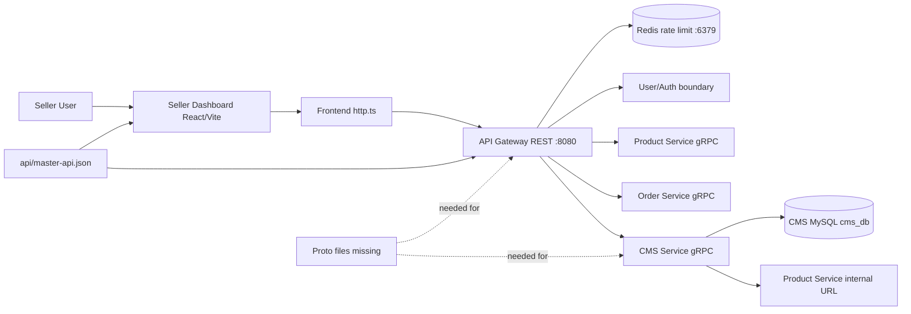
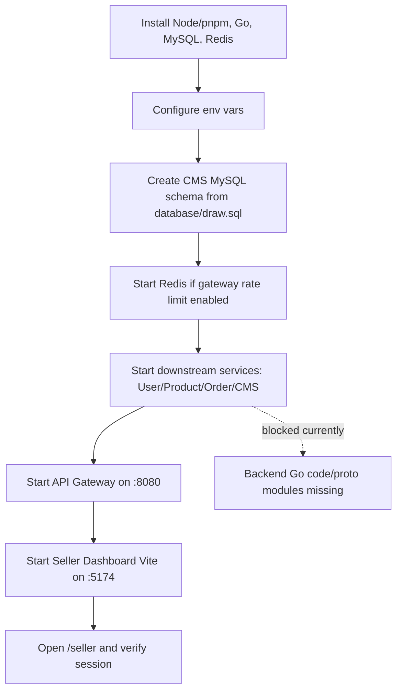
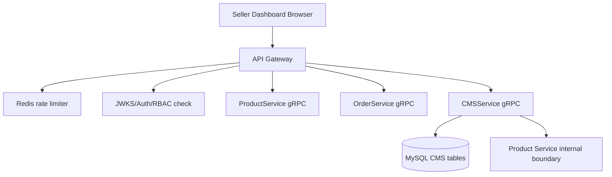

# Seller Dashboard (CMS) - Main Dependency Documentation

## 1. Service overview

Seller Dashboard (CMS) seller ke liye operational control panel hai. Isme seller product manage karta hai, orders dekhkar fulfillment update karta hai, coupons/campaigns banata hai, revenue analytics dekhta hai, team roles manage karta hai, aur audit activity inspect karta hai.

Current project files me frontend implementation clearly available hai:

- `frontend/seller-dashboard/`
- `frontend/seller-dashboard/src/routes/seller-routes.tsx`
- `frontend/seller-dashboard/src/features/*`

Backend side me `backend/services/cms-service/.env` aur `backend/services/api-gateway/.env` available hain, lekin actual Go source code, service `go.mod`, migrations folder, proto files, Dockerfile, and docker-compose files clearly found nahi hue.

Important boundary: Ye document dependencies/setup audit hai. Isme koi new feature, route, backend logic, ya business implementation add nahi kiya gaya.

## 2. All detected dependencies

| Dependency | Required/Optional | Evidence in project | Current status |
|---|---|---|---|
| Frontend React/Vite app | Required | `frontend/seller-dashboard/package.json`, `vite.config.ts`, `src/` | Completed |
| API Gateway REST boundary | Required | `frontend/seller-dashboard/src/lib/http.ts`, `backend/services/api-gateway/.env`, `api/master-api.json` | Partial |
| CMS Service backend config | Required for CMS APIs | `backend/services/cms-service/.env`, docs CMS service design | Partial |
| MySQL | Required for CMS DB | `database/draw.sql`, `CMS_DB_*` env vars | Partial |
| Redis | Required if gateway rate limiting stays enabled | `backend/services/api-gateway/.env` has `RATE_LIMIT_ENABLED=true` and `REDIS_*` | Partial |
| gRPC | Required for gateway-to-service calls | `api/master-api.json`, `*_GRPC_ADDR` env vars | Partial |
| Protobuf | Required for gRPC code generation | Docs mention `proto/ecommerce/cms/v1/cms.proto`; actual proto files missing | Missing |
| Go modules/workspace | Required for backend services | `backend/go.work`, `backend/go.work.sum` | Missing/Partial |
| Environment variables | Required | CMS, gateway, frontend Vite env definitions | Partial |
| Database schema/migrations | Required for CMS DB | `database/draw.sql` has CMS DDL; no migration folder found | Partial |

Docker/Docker Compose is not treated as a created dependency file because no service-specific Dockerfile or docker-compose file was clearly found in project files. It is still audited below as missing/incomplete setup.

## 3. Setup order

1. Install local toolchain.
   - Node.js 22+ and pnpm for frontend.
   - Go toolchain for backend work. `backend/go.work` currently says `go 1.26.3`.
   - MySQL 8+ for CMS database.
   - Redis if API Gateway rate limiting is enabled.

2. Prepare frontend workspace.

```bash
cd frontend
pnpm install
```

3. Prepare environment files.
   - Frontend: create local Vite env values if defaults are not enough.
   - API Gateway: align gRPC target addresses.
   - CMS Service: set MySQL DSN or `CMS_DB_*` values.
   - Do not commit real secrets.

4. Prepare CMS MySQL database.

```bash
# Suggested command based on project structure
mysql -u root -p < database/draw.sql
```

5. Start Redis if gateway rate limiting remains enabled.

```bash
# Suggested command based on project structure
redis-server
```

6. Start backend dependencies.
   - Product Service for product manager APIs.
   - Order Service for seller order APIs.
   - CMS Service for coupons/campaigns/analytics.
   - User/Auth related service for seller session/profile.
   - API Gateway for frontend REST calls.

7. Start Seller Dashboard frontend.

```bash
cd frontend
pnpm --filter seller-dashboard dev
```

## 4. Backend start process

Backend start process is currently incomplete because no Go source entrypoints were clearly found under `backend/services/cms-service/` or `backend/services/api-gateway/`.

Suggested command based on project structure, after backend code and module files exist:

```bash
cd backend/services/cms-service
go run ./cmd/server
```

Suggested command based on project structure, after API Gateway code and module files exist:

```bash
cd backend/services/api-gateway
go run ./cmd/server
```

Required backend checks before these commands can work:

- `backend/services/cms-service/go.mod` exists.
- `backend/services/cms-service/cmd/server/main.go` exists.
- `backend/services/api-gateway/go.mod` exists.
- `backend/services/api-gateway/cmd/server/main.go` exists.
- `backend/go.work` includes real service modules.
- Proto generated code exists or manually written service interfaces exist.
- CMS MySQL schema exists.
- Gateway gRPC target ports match service ports.

## 5. Frontend start process

Frontend app is present and runnable from the project structure.

```bash
cd frontend
pnpm install
pnpm --filter seller-dashboard dev
```

Other available commands:

```bash
cd frontend
pnpm --filter seller-dashboard typecheck
pnpm --filter seller-dashboard test
pnpm --filter seller-dashboard build
pnpm --filter seller-dashboard preview
```

Frontend default behavior:

- Dev server port: `5174`
- Preview port: `4174`
- API base default: `http://localhost:8080`
- API timeout default: `15000` ms
- Request credentials: `include`
- Headers include `x-client-app=seller-dashboard` and generated `x-request-id`

## 6. gRPC/proto setup

gRPC is part of the intended backend dependency chain:

- API Gateway env has downstream gRPC addresses.
- `api/master-api.json` maps Seller Dashboard REST routes to `ProductService`, `OrderService`, `CMSService`, and `UserService` methods.
- Docs expect `proto/ecommerce/cms/v1/cms.proto`.

Current issue:

- No `proto/` directory clearly found.
- No generated protobuf Go or TypeScript code clearly found.
- No gRPC server registration code clearly found.

Suggested command based on project structure:

```bash
# Suggested command based on project structure
buf generate
```

Use this only after `buf.yaml`, `buf.gen.yaml`, and proto files are added.

## 7. Docker setup

Docker setup is not currently available for this service.

Not clearly found in project files:

- `backend/services/cms-service/deploy/Dockerfile`
- `frontend/seller-dashboard/Dockerfile`
- `infra/compose/docker-compose.local.yml`
- docker-compose service entries for MySQL, Redis, API Gateway, CMS Service, and Seller Dashboard

Suggested fix:

- Add service Dockerfiles under each service deploy folder.
- Add a local compose file under `infra/compose/`.
- Keep secrets in env files or Docker secrets, not in committed compose values.

## 8. Database setup

CMS database is MySQL-based.

DDL source:

- `database/draw.sql`

CMS tables found:

- `seller_settings`
- `seller_staff`
- `coupons`
- `coupon_rules`
- `coupon_redemptions`
- `campaigns`
- `cms_audit_logs`

Suggested setup:

```bash
# Suggested command based on project structure
mysql -u root -p < database/draw.sql
```

Current gap:

- No dedicated `database/migrations/` or `backend/services/cms-service/migrations/` folder found.
- No up/down migration pair found.
- Rollback migration not found.

## 9. Environment variables

### Frontend

| Variable | Purpose | Required |
|---|---|---|
| `VITE_API_BASE_URL` | API Gateway base URL | Optional, default `http://localhost:8080` |
| `VITE_API_TIMEOUT_MS` | Frontend request timeout | Optional, default `15000` |
| `VITE_LOGIN_URL` | Redirect target for login | Optional |

### CMS Service

| Variable | Purpose | Required |
|---|---|---|
| `CMS_HTTP_ADDR` | CMS HTTP listen address | Required if HTTP server exists |
| `CMS_GRPC_ADDR` | CMS gRPC listen address | Required |
| `CMS_MYSQL_DSN` | Full MySQL DSN override | Optional if `CMS_DB_*` used |
| `CMS_DB_HOST` | MySQL host | Required |
| `CMS_DB_PORT` | MySQL port | Required |
| `CMS_DB_NAME` | MySQL DB name | Required |
| `CMS_DB_USER` | MySQL user | Required |
| `CMS_DB_PASSWORD` | MySQL password | Required secret |
| `CMS_PRODUCT_SERVICE_BASE_URL` | Internal Product Service boundary | Required for CMS product integration |
| `CMS_INTERNAL_AUTH_TOKEN` | Internal auth token | Required secret |

### API Gateway

| Variable | Purpose | Required |
|---|---|---|
| `HTTP_ADDR` | Gateway HTTP address | Required |
| `API_BASE_PATH` | REST base path | Required |
| `CMS_GRPC_ADDR` | CMS gRPC target | Required |
| `PRODUCT_GRPC_ADDR` | Product gRPC target | Required for products |
| `ORDER_GRPC_ADDR` | Order gRPC target | Required for orders |
| `USER_GRPC_ADDR` | User gRPC target | Required for seller profile/session |
| `REDIS_ADDR` | Redis target for rate limiting | Required if rate limiting enabled |
| `JWT_JWKS_URL` | JWKS URL for auth validation | Required |

Important mismatch found:

| Area | Finding | Suggested Fix |
|---|---|---|
| CMS gRPC port | `cms-service/.env` has `CMS_GRPC_ADDR=:9098`, but `api-gateway/.env` has `CMS_GRPC_ADDR=localhost:50059` | Align gateway and CMS service to the same host/port |

## 10. Ports table

| Component | Port/Address | Source | Notes |
|---|---:|---|---|
| Seller Dashboard dev server | `5174` | `frontend/seller-dashboard/vite.config.ts` | Vite dev |
| Seller Dashboard preview | `4174` | `frontend/seller-dashboard/vite.config.ts` | Vite preview |
| API Gateway HTTP | `8080` | `backend/services/api-gateway/.env` | Frontend default API base |
| CMS Service HTTP | `8087` | `backend/services/cms-service/.env` | CMS HTTP if implemented |
| CMS Service gRPC | `9098` | `backend/services/cms-service/.env` | Conflicts with gateway CMS target |
| API Gateway CMS target | `50059` | `backend/services/api-gateway/.env` | Should be aligned |
| Product gRPC target | `50053` | `backend/services/api-gateway/.env` | Required for product APIs |
| Order gRPC target | `50056` | `backend/services/api-gateway/.env` | Required for seller orders |
| User gRPC target | `50052` | `backend/services/api-gateway/.env` | Required for seller profile/session |
| Redis | `6379` | `backend/services/api-gateway/.env` | Rate limiting |
| MySQL | `3306` | `backend/services/cms-service/.env` | CMS DB |

## 11. Mermaid diagrams

### Dependency flow



### Service startup flow



### Backend to DB/gRPC/Redis flow



## 12. Missing/incomplete implementation audit

| Area | Status | Finding | Suggested Fix |
|------|--------|---------|---------------|
| Task implementation incomplete | Partial | Seller Dashboard frontend exists, but backend service implementation is not clearly found. | Complete backend service source, contracts, and wiring. |
| Dependency not installed | Partial | Frontend dependencies exist in package files and `node_modules`; backend dependencies not clearly found because no service `go.mod` exists. | Add backend module files and install required Go deps. |
| go.mod dependency missing | Missing | `backend/services/cms-service/go.mod` and API Gateway `go.mod` not found. | Create service modules or shared workspace modules. |
| go.sum not updated | Missing | No service-level `go.sum` found for CMS/Gateway. | Run `go mod tidy` after adding modules. |
| Service not registered in go.work | Missing | `backend/go.work` only references `./services/auth-service`, while that folder was not found and CMS/Gateway are not registered. | Add real service module paths to `go.work`. |
| Dockerfile missing | Missing | No Dockerfile found for CMS Service or Seller Dashboard. | Add service-specific Dockerfiles after code is complete. |
| docker-compose service missing | Missing | No docker-compose file found. | Add local compose stack for MySQL, Redis, services, gateway, frontend. |
| .env.example missing | Missing | Real `.env` files exist, but `.env.example` files not found. | Add sanitized examples without secrets. |
| Environment variables missing | Partial | CMS/Gateway env files exist; frontend env type exists; frontend `.env.example` missing. CMS gRPC port mismatch found. | Add frontend env sample and align CMS gRPC ports. |
| Config not loaded | Missing | No backend config loader code found for CMS/Gateway. | Implement config loader and validation in backend. |
| Migration missing | Partial | `database/draw.sql` has CMS schema, but no migration folder or migration files found. | Split CMS DDL into up/down migrations. |
| Migration rollback missing | Missing | No `.down.sql` rollback files found. | Add rollback migrations for CMS schema changes. |
| MySQL table/index/foreign key missing | Partial | CMS tables and indexes exist in `draw.sql`; cross-service `seller_id/user_id` foreign keys are intentionally not present, and rollback is missing. | Keep cross-service IDs without FK if service boundary demands it; add migration tests and rollback. |
| Repository not wired | Missing | No CMS repository implementation file found. | Add `internal/repository/mysql_cms_repository.go`. |
| Usecase/service not wired | Missing | No CMS usecase implementation found. | Add usecases for coupons, campaigns, analytics, staff, audit. |
| Handler/controller not wired | Missing | No CMS transport handler found. | Add gRPC/HTTP handlers after proto contract exists. |
| Routes not registered | Partial | Frontend routes are registered. Master API has product/order/coupon/campaign/analytics routes, but seller session/team/audit routes are not clearly listed. | Update API contract and gateway route registration. |
| gRPC proto missing | Missing | No `proto/` directory or `cms.proto` found. | Add versioned proto contracts. |
| Generated protobuf code missing | Missing | No generated Go/TS protobuf code found. | Generate code with Buf/protoc after proto files exist. |
| gRPC server not registered | Missing | No CMS gRPC server code found. | Register CMSService server in backend entrypoint. |
| gRPC client not configured | Partial | Gateway `.env` has gRPC addresses, but client code not found. | Implement gateway gRPC clients and align ports. |
| Frontend API integration missing | Partial | Frontend API clients exist. Some frontend-used endpoints are missing from `api/master-api.json`: `/api/v1/seller/session`, `/api/v1/seller/team...`, `/api/v1/seller/audit-logs`. | Add or confirm backend contracts for these endpoints. |
| Frontend env missing | Partial | Vite env types/defaults exist, but `.env.example` not found. | Add sanitized `frontend/seller-dashboard/.env.example`. |
| Health check missing | Missing | No backend health endpoints found. | Add `/health/live` and `/health/ready` or equivalent. |
| Logging missing | Partial | Gateway env has `LOG_LEVEL`; frontend sends request id; backend logging code not clearly found. | Add structured logging and request id propagation. |
| Validation missing | Partial | Frontend has validation libraries and module validators; backend validation code not clearly found. | Add request validation in gateway and service handlers. |

## 13. Final checklist

- [x] Seller Dashboard frontend dependency files inspected.
- [x] API Gateway env inspected.
- [x] CMS Service env inspected.
- [x] `api/master-api.json` checked for seller routes.
- [x] `database/draw.sql` checked for CMS schema.
- [x] `backend/go.work` checked.
- [x] Docker/Docker Compose searched.
- [x] Proto files searched.
- [x] Missing backend implementation clearly marked.
- [x] No business logic modified.
- [x] Only `TaskImplementation/Dependency/` documentation files created/updated.
