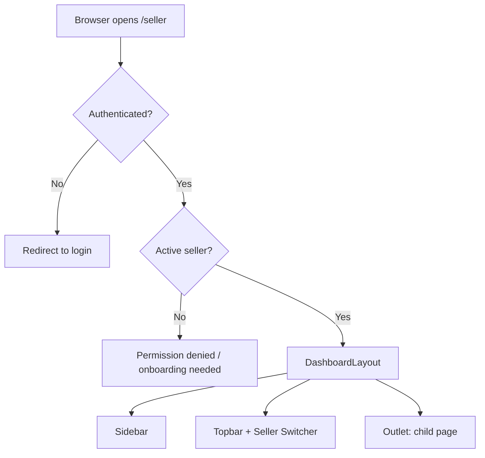
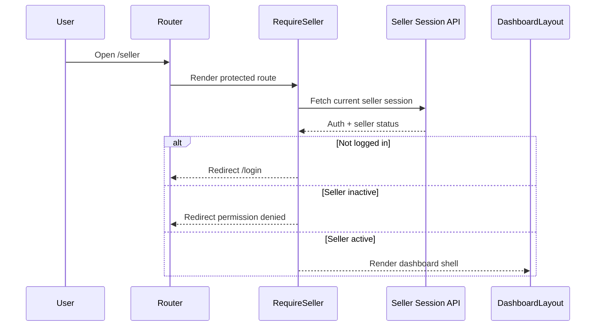
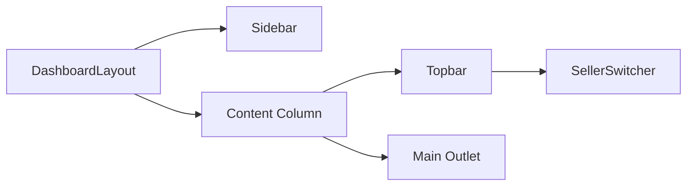
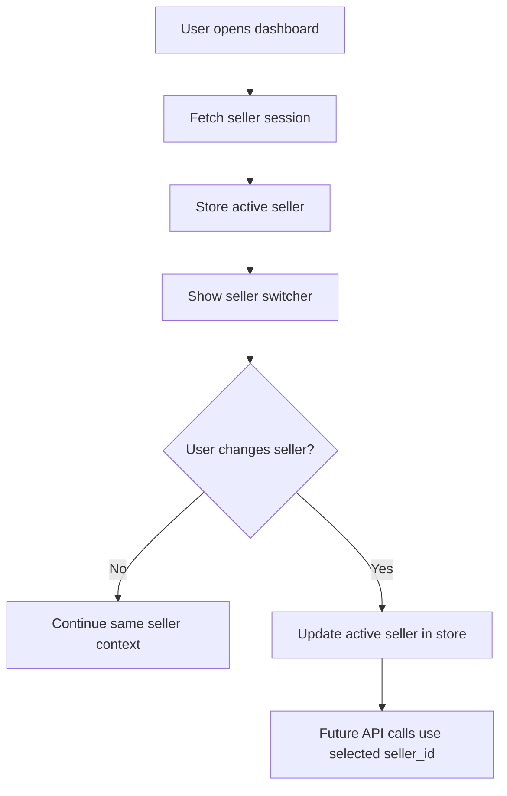
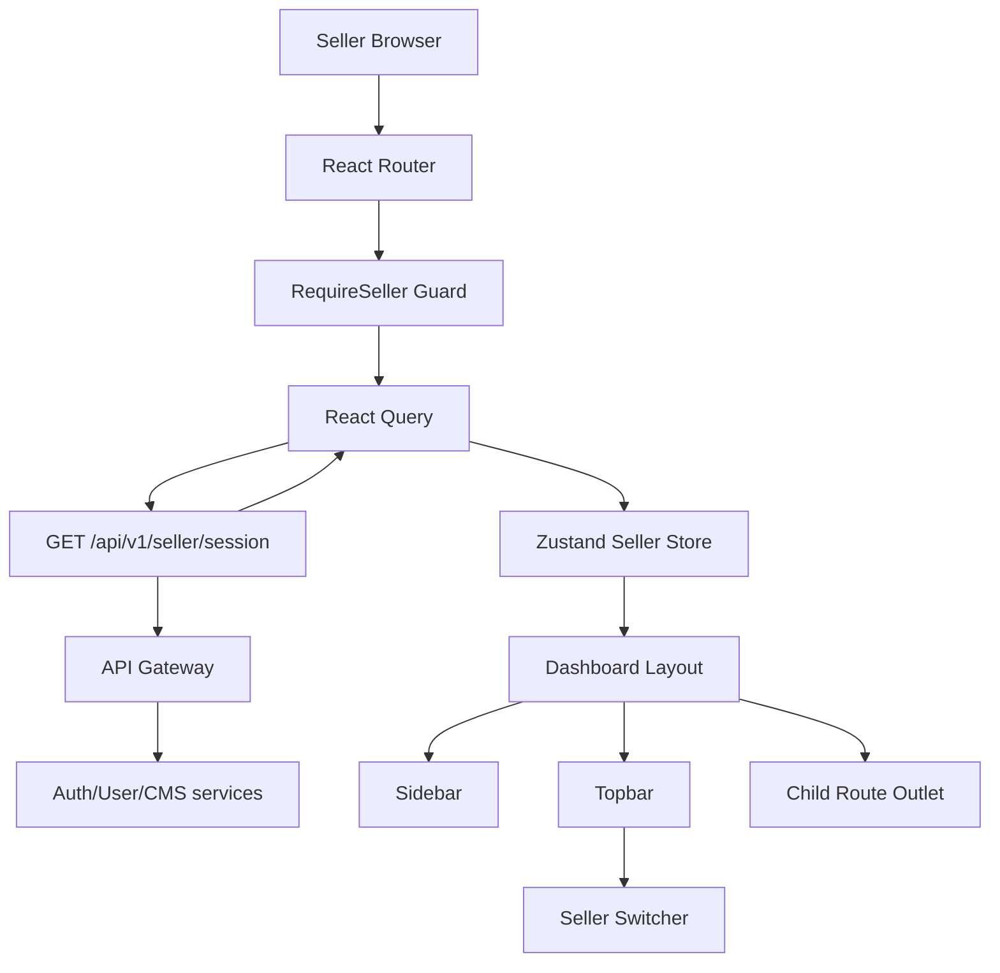

# 🧭 Seller Dashboard (CMS) - Task 1: Dashboard Shell


## 📌 Task Summary

| Field | Detail |
|---|---|
| Module | Seller Dashboard (CMS) |
| Task No. | 1 |
| Task Name | Dashboard shell |
| Source | `docs/01-micro-tasks.md` → `Seller Dashboard (CMS)` → Task 1 |
| Requirement | Sidebar, topbar, seller switcher, protected layout banao. Operational UI compact rakho. |
| Dependency | React setup |
| Priority | P1 |
| Status | Documentation guide ready |

> 🟢 **Simple Hinglish goal:** Is task ka kaam seller dashboard ka base frame banana hai. Seller login ke baad ek protected dashboard layout dikhega jisme left sidebar, topbar, seller switcher, aur content area hoga. Product manager, order manager, coupons, analytics, team, audit jaise modules sirf future navigation entries rahenge; unka actual implementation Task 2 se Task 7 me hoga.

---

## ✅ Final Output Created

```text
TaskImplementation/
└── Seller Dashboard (CMS)/
    └── task1.md
```

### Why this structure?

- `TaskImplementation/` project ke task-wise implementation guides ka central folder hai.
- `Seller Dashboard (CMS)/` seller dashboard ke implementation docs ko group karta hai.
- `task1.md` sirf **Seller Dashboard (CMS) - Task 1** ka step-by-step guide hai.

---

## 🧭 Docs Study Summary

Is guide ko banane se pehle project ke existing docs study kiye gaye:

| Document | Kya samjha |
|---|---|
| `docs/01-micro-tasks.md` | Seller Dashboard Task 1 ka exact scope: shell, protected layout, sidebar, topbar, seller switcher |
| `docs/03-folder-structure.md` | `frontend/seller-dashboard/` ka recommended folder structure |
| `docs/09-cms-superadmin.md` | Seller CMS ka purpose: seller ka mini control center |
| `docs/10-frontend-implementation.md` | React + TypeScript + Tailwind, React Query, Zustand, protected route rules |

---

## 🟣 Task 1 Scope

### Included in Task 1

| Area | Included? | Explanation |
|---|---:|---|
| Protected seller route | ✅ | Seller dashboard sirf authenticated active seller ko open hona chahiye |
| Dashboard layout | ✅ | Sidebar + topbar + main content shell |
| Sidebar navigation | ✅ | Future modules ke nav links, compact operational style |
| Topbar | ✅ | Page title, seller switcher, profile/action area |
| Seller switcher | ✅ | Multi-seller account ke liye active seller choose karna |
| Compact UI style | ✅ | Data-heavy dashboard ke liye dense spacing, clear status badges |
| Placeholder outlet | ✅ | Child route render karne ke liye `Outlet` area |

### Not Included in Task 1

| Future Task | Not Included Feature |
|---|---|
| Task 2 | Product list, product editor, variants, image upload |
| Task 3 | Seller order list, shipment update, refunds view |
| Task 4 | Coupon create/edit, campaign calendar |
| Task 5 | Revenue analytics charts |
| Task 6 | Team invite, staff roles, permissions UI |
| Task 7 | Audit activity timeline |
| Task 8 | Full empty/loading/failed state polish for all modules |

> 🔴 **Important:** Task 1 me sirf shell ready hota hai. Business modules ka internal UI ya API workflow yahan implement nahi karna.

---

## 🧱 Intended Frontend Folder Structure

Task 1 ke liye expected implementation structure ye rahega:

```text
frontend/
└── seller-dashboard/
    ├── vite.config.ts
    ├── tailwind.config.ts
    ├── package.json
    └── src/
        ├── main.tsx
        ├── app.tsx
        ├── layout/
        │   ├── dashboard-layout.tsx
        │   ├── sidebar.tsx
        │   ├── topbar.tsx
        │   └── seller-switcher.tsx
        ├── routes/
        │   ├── seller-routes.tsx
        │   └── require-seller.tsx
        ├── pages/
        │   ├── dashboard-home-page.tsx
        │   ├── permission-denied-page.tsx
        │   └── login-redirect-page.tsx
        ├── api/
        │   └── seller-session-api.ts
        ├── stores/
        │   └── seller-store.ts
        ├── components/
        │   └── ui/
        │       ├── status-badge.tsx
        │       └── icon-button.tsx
        └── lib/
            └── http.ts
```

### Folder responsibility

| Folder/File | Responsibility |
|---|---|
| `layout/` | Dashboard frame: sidebar, topbar, seller switcher |
| `routes/` | Protected route and dashboard route hierarchy |
| `pages/` | Task 1 ke minimal shell pages: home, permission denied, login redirect |
| `api/` | Current seller/session related API calls |
| `stores/` | Active seller, sidebar collapsed state jaise UI state |
| `components/ui/` | Small reusable UI pieces |
| `lib/http.ts` | Gateway ke saath HTTP helper |

---

## 🧩 External Libraries / Tools Used

> Note: Is documentation task me koi package install nahi kiya gaya. Actual frontend app me Task 1 implement karte time ye libraries use hongi.

| Library/Tool | What it is | Why used | Install |
|---|---|---|---|
| React | UI library | Dashboard components build karne ke liye | React setup dependency me already |
| TypeScript | Typed JavaScript | Props, seller object, route config safe banane ke liye | React setup dependency me already |
| Vite | Frontend build tool | Fast local dev server and build | React setup dependency me already |
| Tailwind CSS | Utility-first CSS | Compact dashboard layout fast style karne ke liye | `pnpm add -D tailwindcss postcss autoprefixer` |
| React Router | Client routing | Protected layout, nested routes, redirects | `pnpm add react-router-dom` |
| Zustand | Lightweight state | Active seller and sidebar collapse state store karne ke liye | `pnpm add zustand` |
| React Query | Server state cache | Seller list/current profile fetch aur cache karne ke liye | `pnpm add @tanstack/react-query` |
| Lucide React | Icon set | Sidebar/topbar icons ke liye clean consistent icons | `pnpm add lucide-react` |
| clsx | Class helper | Conditional class names clean rakhne ke liye | `pnpm add clsx` |

### Install command

```bash
pnpm add react-router-dom zustand @tanstack/react-query lucide-react clsx
pnpm add -D tailwindcss postcss autoprefixer
```

### Tailwind setup command

```bash
pnpm tailwindcss init -p
```

### Why these are enough for Task 1?

- **React Router** protected dashboard route banata hai.
- **Zustand** active seller selection ko globally available rakhta hai.
- **React Query** seller list ko repeatedly fetch karne se bachata hai.
- **Tailwind** compact UI spacing, grid, colors, hover states easily handle karta hai.
- **Lucide** sidebar icons ke liye lightweight aur readable option hai.

---

## 🪜 Step-by-Step Implementation

## Step 1: React app base confirm karo

Task 1 ka dependency `React setup` hai. Iska matlab seller dashboard app already Vite + React + TypeScript ke saath ready hona chahiye.

Expected base:

```text
frontend/seller-dashboard/
├── package.json
├── vite.config.ts
├── index.html
└── src/
    ├── main.tsx
    └── app.tsx
```

### Explanation

Yahan se Task 1 start hota hai. Hum build tool, TypeScript config, aur basic React entrypoint ko repeat nahi karte, kyunki wo React setup task ka kaam hai.

---

## Step 2: Route hierarchy define karo

Seller dashboard protected area ke andar nested routes rahenge. Parent route dashboard shell render karega, aur child route content area me render hoga.



### Code example: `routes/seller-routes.tsx`

```tsx
import { Navigate, RouteObject } from "react-router-dom";
import { DashboardLayout } from "../layout/dashboard-layout";
import { RequireSeller } from "./require-seller";
import { DashboardHomePage } from "../pages/dashboard-home-page";
import { PermissionDeniedPage } from "../pages/permission-denied-page";

export const sellerRoutes: RouteObject[] = [
  {
    path: "/seller",
    element: (
      <RequireSeller>
        <DashboardLayout />
      </RequireSeller>
    ),
    children: [
      { index: true, element: <DashboardHomePage /> },
      { path: "products", element: <Navigate to="/seller" replace /> },
      { path: "orders", element: <Navigate to="/seller" replace /> },
      { path: "offers", element: <Navigate to="/seller" replace /> },
      { path: "analytics", element: <Navigate to="/seller" replace /> },
      { path: "team", element: <Navigate to="/seller" replace /> },
      { path: "audit", element: <Navigate to="/seller" replace /> },
    ],
  },
  {
    path: "/seller/permission-denied",
    element: <PermissionDeniedPage />,
  },
];
```

### Explanation

- `/seller` parent route dashboard shell render karta hai.
- `RequireSeller` route guard seller access validate karta hai.
- `DashboardLayout` shell render karta hai.
- Child routes future modules ke liye reserved hain.
- Task 1 me future module pages implement nahi kiye, isliye unko dashboard home pe redirect kiya gaya.

---

## Step 3: Protected seller route banao

Protected route ka kaam hai:

1. Access token/session check karna.
2. User ke paas seller role hai ya nahi check karna.
3. Seller profile active hai ya nahi check karna.
4. Valid seller ko dashboard layout dikhana.



### Code example: `routes/require-seller.tsx`

```tsx
import { ReactNode } from "react";
import { Navigate } from "react-router-dom";
import { useQuery } from "@tanstack/react-query";
import { getSellerSession } from "../api/seller-session-api";
import { useSellerStore } from "../stores/seller-store";

type RequireSellerProps = {
  children: ReactNode;
};

export function RequireSeller({ children }: RequireSellerProps) {
  const setActiveSeller = useSellerStore((state) => state.setActiveSeller);

  const sessionQuery = useQuery({
    queryKey: ["seller-session"],
    queryFn: getSellerSession,
  });

  if (sessionQuery.isLoading) {
    return <div className="p-6 text-sm text-slate-500">Dashboard loading...</div>;
  }

  if (sessionQuery.isError || !sessionQuery.data?.authenticated) {
    return <Navigate to="/login" replace />;
  }

  if (!sessionQuery.data.active_seller) {
    return <Navigate to="/seller/permission-denied" replace />;
  }

  setActiveSeller(sessionQuery.data.active_seller);
  return <>{children}</>;
}
```

### Explanation

- `useQuery` seller session ko API se load karta hai.
- Agar user logged in nahi hai to login route pe redirect hota hai.
- Agar seller profile active nahi hai to permission denied page dikhta hai.
- Agar seller valid hai to selected seller store me save hota hai.

> 🟡 Production note: Store update ko `useEffect` me shift karna better hota hai, taaki render ke andar state update avoid ho. Beginner explanation ke liye yahan flow simple rakha gaya hai.

---

## Step 4: Seller session API helper banao

Seller dashboard shell ko minimal data chahiye:

- User authenticated hai ya nahi
- Active seller profile
- Available seller accounts
- Seller status

### Code example: `api/seller-session-api.ts`

```ts
import { http } from "../lib/http";

export type SellerSummary = {
  seller_id: string;
  display_name: string;
  status: "active" | "pending" | "suspended";
};

export type SellerSessionResponse = {
  authenticated: boolean;
  active_seller: SellerSummary | null;
  sellers: SellerSummary[];
};

export async function getSellerSession(): Promise<SellerSessionResponse> {
  return http<SellerSessionResponse>("/api/v1/seller/session");
}
```

### Code example: `lib/http.ts`

```ts
const API_BASE_URL = import.meta.env.VITE_API_BASE_URL ?? "http://localhost:8080";

export async function http<T>(path: string): Promise<T> {
  const response = await fetch(`${API_BASE_URL}${path}`, {
    credentials: "include",
    headers: {
      "content-type": "application/json",
      "x-client-app": "seller-dashboard",
    },
  });

  if (!response.ok) {
    throw new Error(`Request failed with status ${response.status}`);
  }

  const body = await response.json();
  return body.data as T;
}
```

### Explanation

- `seller-session-api.ts` shell ke liye required seller data type-safe banata hai.
- `http.ts` API Gateway ke base URL, credentials, headers handle karta hai.
- `credentials: "include"` cookie-based auth ke liye useful hai.
- `x-client-app` backend logs me request source identify karne me help karta hai.

---

## Step 5: Seller store banao

Seller switcher aur layout ko active seller data chahiye. Ye pure dashboard me shared state hai, isliye Zustand store use karna simple hai.

### Code example: `stores/seller-store.ts`

```ts
import { create } from "zustand";
import { SellerSummary } from "../api/seller-session-api";

type SellerStore = {
  activeSeller: SellerSummary | null;
  sidebarCollapsed: boolean;
  setActiveSeller: (seller: SellerSummary) => void;
  toggleSidebar: () => void;
};

export const useSellerStore = create<SellerStore>((set) => ({
  activeSeller: null,
  sidebarCollapsed: false,
  setActiveSeller: (seller) => set({ activeSeller: seller }),
  toggleSidebar: () =>
    set((state) => ({ sidebarCollapsed: !state.sidebarCollapsed })),
}));
```

### Explanation

- `activeSeller` current selected seller ko store karta hai.
- `sidebarCollapsed` compact layout ke liye sidebar open/collapse state rakhta hai.
- Zustand ka boilerplate kam hai, isliye Task 1 shell state ke liye perfect fit hai.

---

## Step 6: Dashboard layout banao

Dashboard layout shell ka core component hai. Ye sidebar, topbar, aur main content area ko arrange karta hai.



### Code example: `layout/dashboard-layout.tsx`

```tsx
import { Outlet } from "react-router-dom";
import { Sidebar } from "./sidebar";
import { Topbar } from "./topbar";
import { useSellerStore } from "../stores/seller-store";
import clsx from "clsx";

export function DashboardLayout() {
  const sidebarCollapsed = useSellerStore((state) => state.sidebarCollapsed);

  return (
    <div className="min-h-screen bg-slate-100 text-slate-900">
      <Sidebar />

      <div
        className={clsx(
          "min-h-screen transition-[padding] duration-200",
          sidebarCollapsed ? "pl-16" : "pl-64"
        )}
      >
        <Topbar />

        <main className="px-4 py-4 lg:px-6">
          <Outlet />
        </main>
      </div>
    </div>
  );
}
```

### Explanation

- Outer `div` full screen dashboard background set karta hai.
- `Sidebar` fixed left navigation deta hai.
- Content column sidebar width ke according left padding adjust karta hai.
- `Topbar` top actions aur seller switcher show karta hai.
- `Outlet` child page render karta hai.

> 🟢 Compact operational UI rule: Padding intentionally small rakha gaya hai (`px-4 py-4`), kyunki dashboard data-heavy hoga. Marketing landing page jaisi large spacing yahan avoid karni hai.

---

## Step 7: Sidebar navigation banao

Sidebar seller dashboard ka primary navigation hai. Task 1 me links future modules ke liye ready honge, but actual module implementation nahi hogi.

### Code example: `layout/sidebar.tsx`

```tsx
import {
  BarChart3,
  ClipboardList,
  LayoutDashboard,
  Megaphone,
  Package,
  ShieldCheck,
  Users,
} from "lucide-react";
import { NavLink } from "react-router-dom";
import clsx from "clsx";
import { useSellerStore } from "../stores/seller-store";

const navItems = [
  { label: "Overview", to: "/seller", icon: LayoutDashboard },
  { label: "Products", to: "/seller/products", icon: Package },
  { label: "Orders", to: "/seller/orders", icon: ClipboardList },
  { label: "Offers", to: "/seller/offers", icon: Megaphone },
  { label: "Analytics", to: "/seller/analytics", icon: BarChart3 },
  { label: "Team", to: "/seller/team", icon: Users },
  { label: "Audit", to: "/seller/audit", icon: ShieldCheck },
];

export function Sidebar() {
  const collapsed = useSellerStore((state) => state.sidebarCollapsed);

  return (
    <aside
      className={clsx(
        "fixed inset-y-0 left-0 z-30 border-r border-slate-200 bg-white",
        "transition-[width] duration-200",
        collapsed ? "w-16" : "w-64"
      )}
    >
      <div className="flex h-14 items-center border-b border-slate-200 px-4">
        <span className="text-sm font-semibold text-slate-950">
          {collapsed ? "CMS" : "Seller CMS"}
        </span>
      </div>

      <nav className="space-y-1 p-2">
        {navItems.map((item) => {
          const Icon = item.icon;

          return (
            <NavLink
              key={item.to}
              to={item.to}
              end={item.to === "/seller"}
              className={({ isActive }) =>
                clsx(
                  "flex h-9 items-center gap-3 rounded-md px-3 text-sm",
                  "text-slate-600 hover:bg-slate-100 hover:text-slate-950",
                  isActive && "bg-blue-50 text-blue-700"
                )
              }
            >
              <Icon className="h-4 w-4 shrink-0" />
              {!collapsed && <span>{item.label}</span>}
            </NavLink>
          );
        })}
      </nav>
    </aside>
  );
}
```

### Explanation

- `navItems` array se sidebar maintainable banta hai.
- `NavLink` active route highlight karta hai.
- `collapsed` true hone par labels hide hote hain, icons visible rehte hain.
- Product/order/offers links future tasks ke liye placeholders hain.

---

## Step 8: Topbar banao

Topbar me page context, sidebar toggle, seller switcher, aur account action area rahega.

### Code example: `layout/topbar.tsx`

```tsx
import { Menu, UserCircle } from "lucide-react";
import { SellerSwitcher } from "./seller-switcher";
import { useSellerStore } from "../stores/seller-store";

export function Topbar() {
  const toggleSidebar = useSellerStore((state) => state.toggleSidebar);

  return (
    <header className="sticky top-0 z-20 flex h-14 items-center justify-between border-b border-slate-200 bg-white px-4 lg:px-6">
      <div className="flex items-center gap-3">
        <button
          type="button"
          onClick={toggleSidebar}
          className="inline-flex h-8 w-8 items-center justify-center rounded-md border border-slate-200 text-slate-600 hover:bg-slate-50"
          aria-label="Toggle sidebar"
        >
          <Menu className="h-4 w-4" />
        </button>

        <div>
          <h1 className="text-sm font-semibold text-slate-950">
            Seller Dashboard
          </h1>
          <p className="text-xs text-slate-500">Manage seller operations</p>
        </div>
      </div>

      <div className="flex items-center gap-3">
        <SellerSwitcher />
        <button
          type="button"
          className="inline-flex h-8 w-8 items-center justify-center rounded-full text-slate-500 hover:bg-slate-100"
          aria-label="Open account menu"
        >
          <UserCircle className="h-5 w-5" />
        </button>
      </div>
    </header>
  );
}
```

### Explanation

- `sticky top-0` topbar ko scroll ke time visible rakhta hai.
- Toggle button sidebar compact/full mode switch karta hai.
- Seller switcher right side me placed hai, kyunki seller context dashboard-wide hai.
- Profile button future account menu ke liye placeholder hai.

---

## Step 9: Seller switcher banao

Seller switcher multi-seller users ke liye important hai. Example: ek user ke paas multiple seller stores ho sakte hain.

### Flow



### Code example: `layout/seller-switcher.tsx`

```tsx
import { useQuery } from "@tanstack/react-query";
import { getSellerSession } from "../api/seller-session-api";
import { useSellerStore } from "../stores/seller-store";

export function SellerSwitcher() {
  const activeSeller = useSellerStore((state) => state.activeSeller);
  const setActiveSeller = useSellerStore((state) => state.setActiveSeller);

  const { data } = useQuery({
    queryKey: ["seller-session"],
    queryFn: getSellerSession,
  });

  const sellers = data?.sellers ?? [];

  if (!activeSeller) {
    return (
      <span className="rounded-md bg-amber-50 px-2 py-1 text-xs text-amber-700">
        No seller selected
      </span>
    );
  }

  return (
    <label className="flex items-center gap-2 text-xs text-slate-500">
      Seller
      <select
        value={activeSeller.seller_id}
        onChange={(event) => {
          const nextSeller = sellers.find(
            (seller) => seller.seller_id === event.target.value
          );

          if (nextSeller) {
            setActiveSeller(nextSeller);
          }
        }}
        className="h-8 rounded-md border border-slate-200 bg-white px-2 text-sm text-slate-900 outline-none focus:border-blue-500"
      >
        {sellers.map((seller) => (
          <option key={seller.seller_id} value={seller.seller_id}>
            {seller.display_name}
          </option>
        ))}
      </select>
    </label>
  );
}
```

### Explanation

- Same `seller-session` query cache use hoti hai, extra API call avoid hota hai.
- Dropdown active seller ko update karta hai.
- Future Task 2+ me product/order/coupon APIs selected `seller_id` ke context me call hongi.

---

## Step 10: Minimal dashboard home page banao

Task 1 me advanced metrics nahi banane. Home page sirf shell verify karne ke liye minimal operational placeholder hoga.

### Code example: `pages/dashboard-home-page.tsx`

```tsx
import { useSellerStore } from "../stores/seller-store";

export function DashboardHomePage() {
  const activeSeller = useSellerStore((state) => state.activeSeller);

  return (
    <section className="space-y-4">
      <div className="rounded-md border border-slate-200 bg-white p-4">
        <p className="text-xs font-medium uppercase tracking-wide text-slate-500">
          Active seller
        </p>
        <h2 className="mt-1 text-lg font-semibold text-slate-950">
          {activeSeller?.display_name ?? "Seller not selected"}
        </h2>
        <p className="mt-1 text-sm text-slate-500">
          Dashboard shell ready hai. Product, orders, offers, analytics, team,
          aur audit modules future tasks me add honge.
        </p>
      </div>
    </section>
  );
}
```

### Explanation

- Page shell test karta hai ki active seller store me aa raha hai.
- Isme revenue cards/charts nahi hain, kyunki wo later task ka scope hai.
- Beginner-friendly message future implementation direction clear karta hai.

---

## Step 11: Permission denied page banao

Seller inactive, suspended, ya missing ho to dashboard access deny hona chahiye.

### Code example: `pages/permission-denied-page.tsx`

```tsx
export function PermissionDeniedPage() {
  return (
    <main className="flex min-h-screen items-center justify-center bg-slate-100 p-6">
      <section className="w-full max-w-md rounded-md border border-slate-200 bg-white p-6 text-center">
        <h1 className="text-lg font-semibold text-slate-950">
          Seller access unavailable
        </h1>
        <p className="mt-2 text-sm text-slate-500">
          Aapka seller profile active nahi hai. Approval, KYC, ya suspension
          status check karne ke liye support/admin se contact karein.
        </p>
      </section>
    </main>
  );
}
```

### Explanation

- Ye basic protected state hai.
- Full error-state polish Task 8 me hoga.
- Task 1 ke liye itna enough hai ki unauthorized seller dashboard shell access na kare.

---

## Step 12: App entry me routes attach karo

App root me React Router aur React Query provider wrap karne honge.

### Code example: `app.tsx`

```tsx
import { QueryClient, QueryClientProvider } from "@tanstack/react-query";
import { RouterProvider, createBrowserRouter } from "react-router-dom";
import { sellerRoutes } from "./routes/seller-routes";

const queryClient = new QueryClient();

const router = createBrowserRouter([
  ...sellerRoutes,
]);

export function App() {
  return (
    <QueryClientProvider client={queryClient}>
      <RouterProvider router={router} />
    </QueryClientProvider>
  );
}
```

### Code example: `main.tsx`

```tsx
import React from "react";
import ReactDOM from "react-dom/client";
import { App } from "./app";
import "./styles.css";

ReactDOM.createRoot(document.getElementById("root")!).render(
  <React.StrictMode>
    <App />
  </React.StrictMode>
);
```

### Explanation

- `QueryClientProvider` React Query cache enable karta hai.
- `RouterProvider` route config ko app me activate karta hai.
- `sellerRoutes` separate file me rakha gaya hai taaki routing clean rahe.

---

## 🎨 Compact UI Rules

Seller dashboard operational tool hai, marketing site nahi. Isliye design compact, readable, aur data-friendly hona chahiye.

| Rule | Recommended |
|---|---|
| Sidebar width | `w-64`, collapsed `w-16` |
| Topbar height | `h-14` |
| Main padding | `px-4 py-4` or `lg:px-6` |
| Cards radius | `rounded-md` |
| Font sizes | Mostly `text-sm`, labels `text-xs` |
| Colors | Neutral slate base, blue active state |
| Icons | Simple line icons from Lucide |
| Layout | Fixed sidebar + sticky topbar + scrollable content |

### Color usage

| Purpose | Tailwind classes |
|---|---|
| App background | `bg-slate-100` |
| Panels | `bg-white border-slate-200` |
| Primary active item | `bg-blue-50 text-blue-700` |
| Muted text | `text-slate-500` |
| Main text | `text-slate-950` |
| Warning badge | `bg-amber-50 text-amber-700` |

---

## 🔐 Access Control Logic

Task 1 ka protected layout basic RBAC expectation follow karega:

| State | UI Behavior |
|---|---|
| Not authenticated | Login page pe redirect |
| Authenticated but no seller profile | Permission denied |
| Seller pending approval | Permission denied / onboarding message |
| Seller suspended | Permission denied |
| Seller active | Dashboard layout render |

### Guard pseudo-code

```ts
if (!session.authenticated) {
  redirect("/login");
}

if (!session.active_seller || session.active_seller.status !== "active") {
  redirect("/seller/permission-denied");
}

renderDashboard();
```

---

## 🔄 Data Flow



### Explanation

1. Browser `/seller` route open karta hai.
2. React Router `RequireSeller` guard run karta hai.
3. Guard React Query se seller session fetch karta hai.
4. API Gateway backend services se auth + seller status resolve karta hai.
5. Active seller Zustand store me save hota hai.
6. Layout sidebar, topbar, switcher, aur outlet render karta hai.

---

## 🧪 Manual Verification Checklist

Task 1 complete tab maana jayega jab ye checks pass hon:

| Check | Expected Result |
|---|---|
| `/seller` open without login | Login redirect |
| `/seller` open with inactive seller | Permission denied page |
| `/seller` open with active seller | Dashboard shell visible |
| Sidebar visible | Overview, Products, Orders, Offers, Analytics, Team, Audit links |
| Sidebar toggle click | Sidebar collapse/expand |
| Topbar visible | Title, seller switcher, profile action |
| Seller switcher change | Active seller state update |
| Main area visible | Dashboard home placeholder render |
| Product/order links | No full module implementation yet |

---

## 🧪 Suggested Unit Tests

Task 1 ke liye focused tests enough hain:

| Test | Purpose |
|---|---|
| `RequireSeller` redirects unauthenticated user | Protected route safe hai |
| `RequireSeller` blocks inactive seller | Suspended/pending seller dashboard access nahi kar sakta |
| `DashboardLayout` renders sidebar/topbar/outlet | Shell structure stable hai |
| `SellerSwitcher` updates active seller | Multi-seller context work karta hai |
| `Sidebar` highlights active route | Navigation UX clear hai |

### Example test idea

```tsx
it("redirects unauthenticated users to login", async () => {
  mockSellerSession({ authenticated: false });
  renderSellerRoute("/seller");
  expect(await screen.findByText(/login/i)).toBeInTheDocument();
});
```

> 🟡 Testing library setup is not part of this task unless React setup already includes it.

---

## 🚫 Out of Scope Reminder

Task 1 me ye cheezein implement nahi karni:

- Product CRUD
- Variant editor
- Image uploader
- Order table
- Shipment update
- Refund view
- Coupon form
- Campaign calendar
- Revenue chart
- Team invite
- Audit timeline
- Advanced dashboard metrics

> 🔴 **Reason:** Ye sab Seller Dashboard ke later tasks me defined hain. Task 1 sirf shell and protection foundation banata hai.

---

## ✅ Final Task 1 Implementation Standard

Task 1 complete hone ke baad seller dashboard ka base experience ye hoga:

```text
Authenticated active seller
        ↓
Protected /seller route
        ↓
DashboardLayout
        ↓
Sidebar + Topbar + SellerSwitcher
        ↓
Outlet for future modules
```

### Final result

- ✅ Protected seller dashboard shell defined
- ✅ Sidebar navigation structure ready
- ✅ Topbar with seller switcher ready
- ✅ Active seller state pattern ready
- ✅ Compact operational UI rules documented
- ✅ Future modules intentionally not implemented

> 🟢 **Task 1 complete:** Seller Dashboard (CMS) ke liye dashboard shell ka beginner-friendly Hinglish implementation guide ready hai. Ye guide future Task 2-8 ke liye stable layout foundation provide karta hai.
