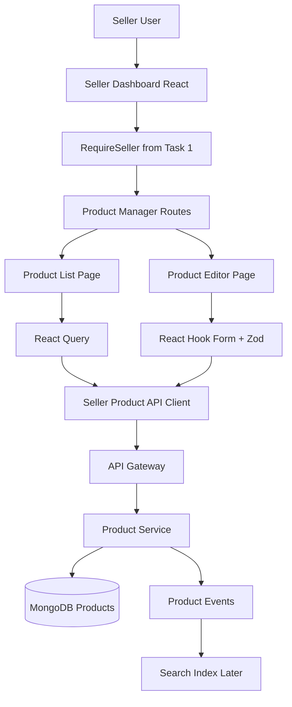
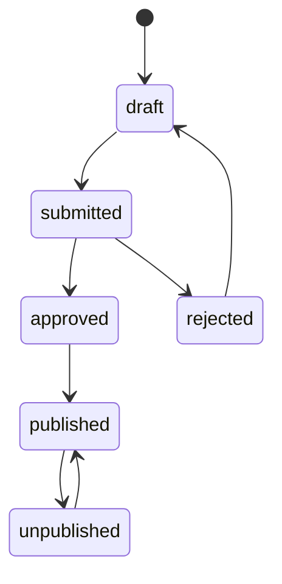
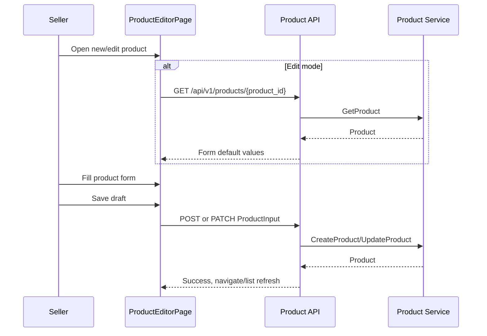
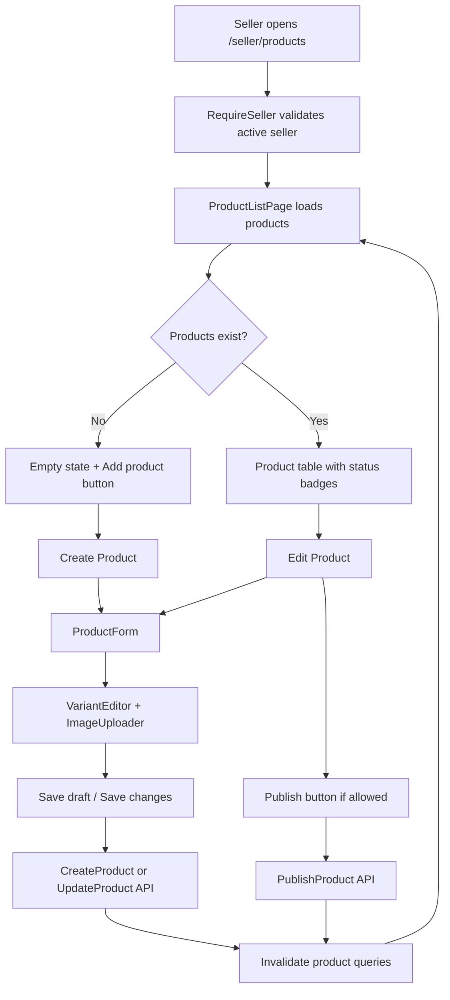

# 🛍️ Seller Dashboard (CMS) - Task 2: Product Manager


## 📌 Task Summary

| Field | Detail |
|---|---|
| Module | Seller Dashboard (CMS) |
| Task No. | 2 |
| Task Name | Product manager |
| Source | `docs/01-micro-tasks.md` → `Seller Dashboard (CMS)` → Task 2 |
| Requirement | Product list, create/edit form, variants, images, publish status banao. |
| Dependency | CMS/Product APIs |
| Priority | P1 |
| Status | Documentation guide ready |

> 🟢 **Simple Hinglish goal:** Is task me seller dashboard ke andar product management module banana hai. Seller apne products list me dekh sakega, naya product create kar sakega, existing product edit kar sakega, product variants add/update kar sakega, product images manage kar sakega, aur product ko publish karne ka clear status/action dekh sakega.

---

## ✅ Final Output Created

```text
TaskImplementation/
└── Seller Dashboard (CMS)/
    ├── task1.md
    └── task2.md
```

### Why this structure?

- `TaskImplementation/` project ke task-wise guides ka central folder hai.
- `Seller Dashboard (CMS)/` seller dashboard ke implementation docs ko group karta hai.
- `task2.md` sirf **Seller Dashboard (CMS) - Task 2** ka beginner-friendly implementation guide hai.

---

## 🧭 Docs Study Summary

Is guide ko banane se pehle project ke existing docs study kiye gaye:

| Document | Kya samjha |
|---|---|
| `docs/01-micro-tasks.md` | Task 2 ka exact scope: product list, create/edit form, variants, images, publish status |
| `docs/03-folder-structure.md` | `frontend/seller-dashboard/src/features/products/` ka recommended structure |
| `docs/04-microservice-design.md` | Product Service product CRUD, variants, category, publish workflow own karta hai |
| `docs/05-database-design.md` | Product data MongoDB me rahega because attributes and variants dynamic hain |
| `docs/09-cms-superadmin.md` | Seller CMS ka Product Management module draft/publish workflow follow karega |
| `docs/10-frontend-implementation.md` | React Query server state, React Hook Form form state, compact dashboard UI direction |
| `api/master-api.json` | Product list/create/update/publish endpoints and schemas |

---

## 🟣 Task 2 Scope

### Included in Task 2

| Area | Included? | Explanation |
|---|---:|---|
| Product list page | ✅ | Seller ke products table/list me dikhane hain |
| Filters | ✅ | Status, category, page, page size jaise basic filters |
| Create product form | ✅ | Title, description, brand, category, images, variants |
| Edit product form | ✅ | Existing product load karke update karna |
| Variant editor | ✅ | SKU, price, stock quantity, variant attributes |
| Image manager | ✅ | Product image URLs/list manage karna, upload adapter ke liye component ready |
| Publish status | ✅ | Status badge aur publish action |
| Product API wrapper | ✅ | Product endpoints ke typed client functions |
| Basic loading/error/empty states | ✅ | Module usable rahe, full polish Task 8 me hoga |

### Not Included in Task 2

| Future Task | Not Included Feature |
|---|---|
| Task 3 | Order manager, shipment, refunds |
| Task 4 | Coupons, campaigns, usage stats |
| Task 5 | Revenue analytics charts |
| Task 6 | Team permissions |
| Task 7 | Audit activity timeline |
| Task 8 | Full cross-module empty/loading/failed/permission polish |
| Backend work | New Product Service, new CMS Service, object storage service, moderation engine |

> 🔴 **Important:** Product image upload ke liye `api/master-api.json` me separate upload endpoint defined nahi hai. Product schema me `images: string[]` hai. Isliye Task 2 frontend me image manager ko URL-array based rakha jayega, aur upload adapter optional rakha jayega. Naya backend upload API invent nahi karna.

---

## 🧱 Clean Folder Structure

### Documentation folder

```text
TaskImplementation/
└── Seller Dashboard (CMS)/
    ├── task1.md
    └── task2.md
```

### Intended frontend implementation structure

```text
frontend/
└── seller-dashboard/
    └── src/
        ├── routes/
        │   └── seller-routes.tsx
        ├── features/
        │   └── products/
        │       ├── pages/
        │       │   ├── product-list-page.tsx
        │       │   └── product-editor-page.tsx
        │       ├── components/
        │       │   ├── product-table.tsx
        │       │   ├── product-status-badge.tsx
        │       │   ├── product-filters-bar.tsx
        │       │   ├── product-form.tsx
        │       │   ├── variant-editor.tsx
        │       │   ├── image-uploader.tsx
        │       │   └── category-selector.tsx
        │       ├── api/
        │       │   └── seller-product-api.ts
        │       ├── hooks/
        │       │   ├── use-seller-products.ts
        │       │   ├── use-product-mutations.ts
        │       │   └── use-categories.ts
        │       ├── utils/
        │       │   ├── product-validation.ts
        │       │   └── product-mappers.ts
        │       └── types.ts
        ├── components/
        │   └── ui/
        │       ├── button.tsx
        │       ├── input.tsx
        │       ├── select.tsx
        │       └── status-badge.tsx
        └── lib/
            └── http.ts
```

### Folder responsibility

| Folder/File | Responsibility |
|---|---|
| `pages/` | Route-level screens: list and editor |
| `components/` | Product-specific UI pieces |
| `api/` | Product Service REST calls |
| `hooks/` | React Query hooks and mutations |
| `utils/` | Validation schema and API/form mappers |
| `types.ts` | Product, variant, category, status types |
| `routes/seller-routes.tsx` | `/seller/products` routes register karna |

---

## 🧩 External Libraries / Tools Used

> Note: Is documentation task me koi package install nahi kiya gaya. Actual frontend implementation karte time ye libraries use hongi.

| Library/Tool | What it is | Why used | Install |
|---|---|---|---|
| React | UI library | Product list and editor components build karne ke liye | React setup dependency me already |
| TypeScript | Typed JavaScript | Product, variant, API response types safe rakhne ke liye | React setup dependency me already |
| React Router | Client routing | `/seller/products`, `/new`, `/:id/edit` routes ke liye | `pnpm add react-router-dom` |
| React Query | Server state | Product list, categories, mutations cache/invalidation ke liye | `pnpm add @tanstack/react-query` |
| React Hook Form | Form state | Large product form performant aur manageable rakhne ke liye | `pnpm add react-hook-form` |
| Zod | Schema validation | Product form validation rules define karne ke liye | `pnpm add zod` |
| @hookform/resolvers | RHF + Zod bridge | Zod schema ko React Hook Form me use karne ke liye | `pnpm add @hookform/resolvers` |
| Zustand | Lightweight store | Active seller Task 1 store se read karne ke liye | `pnpm add zustand` |
| Tailwind CSS | Utility-first CSS | Dense operational dashboard UI ke liye | `pnpm add -D tailwindcss postcss autoprefixer` |
| Lucide React | Icon set | Add, edit, image, publish icons ke liye | `pnpm add lucide-react` |
| Vitest + Testing Library | Test tools | Form helpers, components, mutations test karne ke liye | `pnpm add -D vitest @testing-library/react @testing-library/user-event` |
| MSW | API mocking | Product APIs mock karke tests likhne ke liye | `pnpm add -D msw` |

### Install command

```bash
pnpm add react-router-dom @tanstack/react-query react-hook-form zod @hookform/resolvers zustand lucide-react
pnpm add -D tailwindcss postcss autoprefixer vitest @testing-library/react @testing-library/user-event msw
```

### Why these tools are useful for Task 2?

- **React Query** product list ko cache karta hai aur create/update/publish ke baad list refresh karta hai.
- **React Hook Form** large product form ko re-render heavy banne se bachata hai.
- **Zod** beginner-friendly validation rules central jagah rakhta hai.
- **React Router** list, create, edit pages ko clean URL deta hai.
- **MSW** tests me real backend ke bina Product API behavior simulate karta hai.

---

## 🗺️ Architecture Diagram



### Explanation

- Seller dashboard browser se API Gateway ko call karega.
- Product writes Product Service handle karega.
- MongoDB Product Service ka source of truth rahega.
- Search indexing Product Service events se later update hoga.
- Frontend business rules sirf UX validation ke liye hain; final validation backend karega.

---

## 🔁 Product Lifecycle

Project docs ke Product Management flow ko Task 2 UI me status badges/actions ke through represent karna hai.



### UI interpretation

| Status | Badge color idea | Seller action |
|---|---|---|
| `draft` | Gray | Edit, save, publish/submit |
| `submitted` | Blue | View, wait for review |
| `approved` | Green | Publish |
| `published` | Green solid | Edit limited fields, view status |
| `rejected` | Red | Edit and resubmit |
| `unpublished` | Amber | Publish again if API allows |

> 🟡 Current REST master includes `POST /api/v1/seller/products/{product_id}/publish`. `UnpublishProduct` gRPC method exists in service design, but REST unpublish endpoint is not listed in `api/master-api.json`, so Task 2 UI should not invent an unpublish API route.

---

## 📡 Product APIs Used

From `api/master-api.json`:

| Action | Method | Path | Auth | Purpose |
|---|---|---|---|---|
| List products | `GET` | `/api/v1/products` | public/seller context | Seller products list with query filters |
| Product detail | `GET` | `/api/v1/products/{product_id}` | public/seller context | Edit page ke liye existing data load |
| List categories | `GET` | `/api/v1/categories` | public | Category selector |
| Create product | `POST` | `/api/v1/seller/products` | seller | New product draft/create |
| Update product | `PATCH` | `/api/v1/seller/products/{product_id}` | seller | Existing product update |
| Publish product | `POST` | `/api/v1/seller/products/{product_id}/publish` | seller | Product publish action |

### Product input schema

```ts
type ProductInput = {
  title: string;
  description?: string;
  brand?: string;
  category_id: string;
  attributes?: Record<string, unknown>;
  images?: string[];
  variants: ProductVariantInput[];
};

type ProductVariantInput = {
  sku: string;
  attributes?: Record<string, unknown>;
  price: {
    amount: number;
    currency: string;
  };
  stock_quantity: number;
};
```

---

## 🪜 Step-by-Step Implementation

## Step 1: Task 1 dashboard shell confirm karo

Task 2 product manager ko Task 1 ke protected seller layout ke andar render hona chahiye.

Required from Task 1:

- `RequireSeller` route guard ready ho.
- `DashboardLayout` ready ho.
- `SellerStore` me active seller available ho.
- Sidebar me Products navigation entry ho.

```tsx
// Example usage from Task 2 pages
const activeSeller = useSellerStore((state) => state.activeSeller);
```

### Explanation

Task 2 ka product data seller-specific hai. Isliye har list/create/update action active seller context me chalega. Agar active seller missing hai, product manager page permission or empty state show karega.

---

## Step 2: Product routes add karo

Seller dashboard ke andar product routes:

```text
/seller/products
/seller/products/new
/seller/products/:productId/edit
```

### Code example: `routes/seller-routes.tsx`

```tsx
import { Navigate, RouteObject } from "react-router-dom";
import { DashboardLayout } from "../layout/dashboard-layout";
import { RequireSeller } from "./require-seller";
import { DashboardHomePage } from "../pages/dashboard-home-page";
import { ProductListPage } from "../features/products/pages/product-list-page";
import { ProductEditorPage } from "../features/products/pages/product-editor-page";

export const sellerRoutes: RouteObject[] = [
  {
    path: "/seller",
    element: (
      <RequireSeller>
        <DashboardLayout />
      </RequireSeller>
    ),
    children: [
      { index: true, element: <DashboardHomePage /> },
      { path: "products", element: <ProductListPage /> },
      { path: "products/new", element: <ProductEditorPage mode="create" /> },
      { path: "products/:productId/edit", element: <ProductEditorPage mode="edit" /> },
      { path: "orders", element: <Navigate to="/seller" replace /> },
      { path: "offers", element: <Navigate to="/seller" replace /> },
      { path: "analytics", element: <Navigate to="/seller" replace /> },
      { path: "team", element: <Navigate to="/seller" replace /> },
      { path: "audit", element: <Navigate to="/seller" replace /> },
    ],
  },
];
```

### Explanation

- `/seller/products` product table dikhata hai.
- `/seller/products/new` blank create form dikhata hai.
- `/seller/products/:productId/edit` existing product edit karta hai.
- Future modules abhi redirect hi rahenge, kyunki Task 2 ka scope product manager tak limited hai.

---

## Step 3: Product TypeScript types define karo

### Code example: `features/products/types.ts`

```ts
export type Money = {
  amount: number;
  currency: "INR";
};

export type ProductStatus =
  | "draft"
  | "submitted"
  | "approved"
  | "rejected"
  | "published"
  | "unpublished";

export type ProductVariantInput = {
  sku: string;
  attributes: Record<string, string>;
  price: Money;
  stock_quantity: number;
};

export type ProductInput = {
  title: string;
  description?: string;
  brand?: string;
  category_id: string;
  attributes: Record<string, string>;
  images: string[];
  variants: ProductVariantInput[];
};

export type Product = ProductInput & {
  product_id: string;
  seller_id: string;
  status: ProductStatus;
};

export type ProductListRequest = {
  seller_id: string;
  category_id?: string;
  status?: ProductStatus | "all";
  page: number;
  page_size: number;
};

export type ProductListResponse = {
  products: Product[];
  total: number;
};

export type Category = {
  category_id: string;
  name: string;
  parent_id?: string;
};
```

### Explanation

- Types API schemas ke close rakhe gaye hain.
- `ProductStatus` frontend badges and filters ke liye useful hai.
- `Money.currency` Task 2 MVP me `INR` rakha gaya hai because project Indian ecommerce context follow karta hai.
- `attributes` flexible object hai, kyunki Product Service MongoDB use karta hai dynamic product attributes ke liye.

---

## Step 4: Product validation schema banao

### Code example: `features/products/utils/product-validation.ts`

```ts
import { z } from "zod";

export const productVariantSchema = z.object({
  sku: z.string().min(2, "SKU required hai"),
  attributes: z.record(z.string(), z.string()).default({}),
  price: z.object({
    amount: z.coerce.number().positive("Price 0 se zyada hona chahiye"),
    currency: z.literal("INR"),
  }),
  stock_quantity: z.coerce.number().int().min(0, "Stock negative nahi ho sakta"),
});

export const productFormSchema = z.object({
  title: z.string().min(3, "Product title kam se kam 3 characters ka hona chahiye"),
  description: z.string().optional(),
  brand: z.string().optional(),
  category_id: z.string().min(1, "Category select karna zaroori hai"),
  attributes: z.record(z.string(), z.string()).default({}),
  images: z.array(z.string().url("Valid image URL add karo")).default([]),
  variants: z.array(productVariantSchema).min(1, "At least 1 variant required hai"),
});

export type ProductFormValues = z.infer<typeof productFormSchema>;
```

### Explanation

- Validation UI feedback ke liye hai.
- Backend final source of truth rahega.
- `variants` minimum 1 rakha gaya hai because `ProductInput` me variants required hain.
- `images` URL array hai because API schema me images strings hain.

---

## Step 5: API client functions banao

### Code example: `features/products/api/seller-product-api.ts`

```ts
import { http } from "../../../lib/http";
import {
  Category,
  Product,
  ProductInput,
  ProductListRequest,
  ProductListResponse,
} from "../types";

type CategoryListResponse = {
  categories: Category[];
};

function toQuery(params: Record<string, string | number | undefined>) {
  const search = new URLSearchParams();

  Object.entries(params).forEach(([key, value]) => {
    if (value !== undefined && value !== "") {
      search.set(key, String(value));
    }
  });

  return search.toString();
}

export async function listSellerProducts(
  params: ProductListRequest,
): Promise<ProductListResponse> {
  const query = toQuery({
    seller_id: params.seller_id,
    category_id: params.category_id,
    status: params.status === "all" ? undefined : params.status,
    page: params.page,
    page_size: params.page_size,
  });

  return http<ProductListResponse>(`/api/v1/products?${query}`);
}

export async function getProduct(productId: string): Promise<Product> {
  return http<Product>(`/api/v1/products/${productId}`);
}

export async function listCategories(): Promise<Category[]> {
  const response = await http<CategoryListResponse>("/api/v1/categories");
  return response.categories;
}

export async function createProduct(input: ProductInput): Promise<Product> {
  return http<Product>("/api/v1/seller/products", {
    method: "POST",
    body: JSON.stringify(input),
  });
}

export async function updateProduct(
  productId: string,
  input: ProductInput,
): Promise<Product> {
  return http<Product>(`/api/v1/seller/products/${productId}`, {
    method: "PATCH",
    body: JSON.stringify(input),
  });
}

export async function publishProduct(productId: string): Promise<Product> {
  return http<Product>(`/api/v1/seller/products/${productId}/publish`, {
    method: "POST",
  });
}
```

### Explanation

- `listSellerProducts` public list endpoint ko seller filters ke saath call karta hai.
- `createProduct`, `updateProduct`, `publishProduct` seller-auth endpoints use karte hain.
- API client ke andar URL/query logic central rakha gaya hai.
- UI components direct `fetch` nahi karenge; wo hooks use karenge.

---

## Step 6: React Query hooks banao

### Code example: `features/products/hooks/use-seller-products.ts`

```ts
import { useQuery } from "@tanstack/react-query";
import { listSellerProducts } from "../api/seller-product-api";
import { ProductListRequest } from "../types";

export function useSellerProducts(params: ProductListRequest) {
  return useQuery({
    queryKey: ["seller-products", params],
    queryFn: () => listSellerProducts(params),
    enabled: Boolean(params.seller_id),
  });
}
```

### Code example: `features/products/hooks/use-categories.ts`

```ts
import { useQuery } from "@tanstack/react-query";
import { listCategories } from "../api/seller-product-api";

export function useCategories() {
  return useQuery({
    queryKey: ["categories"],
    queryFn: listCategories,
    staleTime: 10 * 60 * 1000,
  });
}
```

### Code example: `features/products/hooks/use-product-mutations.ts`

```ts
import { useMutation, useQueryClient } from "@tanstack/react-query";
import { createProduct, publishProduct, updateProduct } from "../api/seller-product-api";
import { ProductInput } from "../types";

export function useCreateProduct() {
  const queryClient = useQueryClient();

  return useMutation({
    mutationFn: (input: ProductInput) => createProduct(input),
    onSuccess: () => {
      queryClient.invalidateQueries({ queryKey: ["seller-products"] });
    },
  });
}

export function useUpdateProduct(productId: string) {
  const queryClient = useQueryClient();

  return useMutation({
    mutationFn: (input: ProductInput) => updateProduct(productId, input),
    onSuccess: (product) => {
      queryClient.invalidateQueries({ queryKey: ["seller-products"] });
      queryClient.invalidateQueries({ queryKey: ["product", product.product_id] });
    },
  });
}

export function usePublishProduct() {
  const queryClient = useQueryClient();

  return useMutation({
    mutationFn: (productId: string) => publishProduct(productId),
    onSuccess: (product) => {
      queryClient.invalidateQueries({ queryKey: ["seller-products"] });
      queryClient.invalidateQueries({ queryKey: ["product", product.product_id] });
    },
  });
}
```

### Explanation

- Query hooks server data read karte hain.
- Mutation hooks create/update/publish ke baad stale data refresh karte hain.
- Cache invalidation se table and editor dono updated data dikhate hain.

---

## Step 7: Product list page banao

Product list ka role:

- Active seller ke products fetch karna.
- Filter state URL/search params me ya local state me maintain karna.
- Table, loading, empty, error states show karna.
- Create product button dena.

### Code example: `features/products/pages/product-list-page.tsx`

```tsx
import { Link } from "react-router-dom";
import { Plus } from "lucide-react";
import { useState } from "react";
import { useSellerStore } from "../../../stores/seller-store";
import { ProductFiltersBar } from "../components/product-filters-bar";
import { ProductTable } from "../components/product-table";
import { useSellerProducts } from "../hooks/use-seller-products";
import { ProductStatus } from "../types";

export function ProductListPage() {
  const activeSeller = useSellerStore((state) => state.activeSeller);
  const [status, setStatus] = useState<ProductStatus | "all">("all");
  const [page, setPage] = useState(1);

  const productsQuery = useSellerProducts({
    seller_id: activeSeller?.seller_id ?? "",
    status,
    page,
    page_size: 20,
  });

  if (!activeSeller) {
    return <div className="p-6 text-sm text-slate-500">Active seller select karo.</div>;
  }

  return (
    <section className="space-y-4">
      <div className="flex flex-wrap items-center justify-between gap-3">
        <div>
          <h1 className="text-xl font-semibold text-slate-950">Products</h1>
          <p className="text-sm text-slate-500">
            Product catalog, variants, images aur publish status manage karo.
          </p>
        </div>

        <Link
          to="/seller/products/new"
          className="inline-flex items-center gap-2 rounded-md bg-slate-950 px-3 py-2 text-sm font-medium text-white"
        >
          <Plus className="h-4 w-4" />
          Add product
        </Link>
      </div>

      <ProductFiltersBar status={status} onStatusChange={setStatus} />

      {productsQuery.isLoading && (
        <div className="rounded-md border border-slate-200 p-4 text-sm text-slate-500">
          Products loading...
        </div>
      )}

      {productsQuery.isError && (
        <div className="rounded-md border border-red-200 bg-red-50 p-4 text-sm text-red-700">
          Product list load nahi ho paayi. Retry karo.
        </div>
      )}

      {productsQuery.data && (
        <ProductTable
          products={productsQuery.data.products}
          total={productsQuery.data.total}
          page={page}
          onPageChange={setPage}
        />
      )}
    </section>
  );
}
```

### Explanation

- Page active seller id se products fetch karta hai.
- Header compact operational style me rakha gaya hai.
- Loading/error state basic hai. Full state polish Task 8 me hoga.
- `Add product` button editor route pe bhejta hai.

---

## Step 8: Filter bar banao

### Code example: `features/products/components/product-filters-bar.tsx`

```tsx
import { ProductStatus } from "../types";

type ProductFiltersBarProps = {
  status: ProductStatus | "all";
  onStatusChange: (status: ProductStatus | "all") => void;
};

const statuses: Array<ProductStatus | "all"> = [
  "all",
  "draft",
  "submitted",
  "approved",
  "published",
  "rejected",
  "unpublished",
];

export function ProductFiltersBar({ status, onStatusChange }: ProductFiltersBarProps) {
  return (
    <div className="flex flex-wrap items-center gap-2 rounded-md border border-slate-200 bg-white p-3">
      <span className="text-xs font-medium uppercase tracking-wide text-slate-500">
        Status
      </span>

      {statuses.map((item) => (
        <button
          key={item}
          type="button"
          onClick={() => onStatusChange(item)}
          className={
            item === status
              ? "rounded-md bg-slate-950 px-3 py-1.5 text-xs font-medium text-white"
              : "rounded-md border border-slate-200 px-3 py-1.5 text-xs font-medium text-slate-600"
          }
        >
          {item}
        </button>
      ))}
    </div>
  );
}
```

### Explanation

- Status filters seller ko quickly draft/published products dekhne me help karte hain.
- Buttons compact hain because seller dashboard operational UI hai.
- Category filter bhi yahin add ho sakta hai by using `useCategories`, but MVP me status filter enough hai.

---

## Step 9: Product table banao

### Code example: `features/products/components/product-table.tsx`

```tsx
import { Link } from "react-router-dom";
import { Product } from "../types";
import { ProductStatusBadge } from "./product-status-badge";

type ProductTableProps = {
  products: Product[];
  total: number;
  page: number;
  onPageChange: (page: number) => void;
};

export function ProductTable({ products, total, page, onPageChange }: ProductTableProps) {
  if (products.length === 0) {
    return (
      <div className="rounded-md border border-dashed border-slate-300 bg-white p-8 text-center">
        <h2 className="text-sm font-semibold text-slate-950">No products yet</h2>
        <p className="mt-1 text-sm text-slate-500">
          Pehla product create karke catalog start karo.
        </p>
      </div>
    );
  }

  return (
    <div className="overflow-hidden rounded-md border border-slate-200 bg-white">
      <table className="w-full border-collapse text-left text-sm">
        <thead className="bg-slate-50 text-xs uppercase text-slate-500">
          <tr>
            <th className="px-4 py-3">Product</th>
            <th className="px-4 py-3">Category</th>
            <th className="px-4 py-3">Variants</th>
            <th className="px-4 py-3">Status</th>
            <th className="px-4 py-3 text-right">Action</th>
          </tr>
        </thead>
        <tbody className="divide-y divide-slate-100">
          {products.map((product) => (
            <tr key={product.product_id}>
              <td className="px-4 py-3">
                <div className="font-medium text-slate-950">{product.title}</div>
                <div className="text-xs text-slate-500">{product.brand || "No brand"}</div>
              </td>
              <td className="px-4 py-3 text-slate-600">{product.category_id}</td>
              <td className="px-4 py-3 text-slate-600">{product.variants.length}</td>
              <td className="px-4 py-3">
                <ProductStatusBadge status={product.status} />
              </td>
              <td className="px-4 py-3 text-right">
                <Link
                  to={`/seller/products/${product.product_id}/edit`}
                  className="text-sm font-medium text-slate-950 underline-offset-4 hover:underline"
                >
                  Edit
                </Link>
              </td>
            </tr>
          ))}
        </tbody>
      </table>

      <div className="flex items-center justify-between border-t border-slate-200 px-4 py-3 text-sm">
        <span className="text-slate-500">Total: {total}</span>
        <div className="flex gap-2">
          <button
            type="button"
            disabled={page === 1}
            onClick={() => onPageChange(page - 1)}
            className="rounded-md border border-slate-200 px-3 py-1 disabled:opacity-50"
          >
            Prev
          </button>
          <button
            type="button"
            disabled={products.length === 0}
            onClick={() => onPageChange(page + 1)}
            className="rounded-md border border-slate-200 px-3 py-1 disabled:opacity-50"
          >
            Next
          </button>
        </div>
      </div>
    </div>
  );
}
```

### Explanation

- Table seller dashboard ke dense UI direction ko follow karta hai.
- Status badge alag component hai so colors central rahen.
- Pagination simple page/page_size API shape ke saath aligned hai.
- Bulk actions intentionally add nahi kiye, kyunki Task 2 required scope me explicitly nahi hai.

---

## Step 10: Product status badge banao

### Code example: `features/products/components/product-status-badge.tsx`

```tsx
import { ProductStatus } from "../types";

const statusClasses: Record<ProductStatus, string> = {
  draft: "bg-slate-100 text-slate-700",
  submitted: "bg-blue-50 text-blue-700",
  approved: "bg-emerald-50 text-emerald-700",
  published: "bg-emerald-100 text-emerald-800",
  rejected: "bg-red-50 text-red-700",
  unpublished: "bg-amber-50 text-amber-700",
};

type ProductStatusBadgeProps = {
  status: ProductStatus;
};

export function ProductStatusBadge({ status }: ProductStatusBadgeProps) {
  return (
    <span
      className={`inline-flex rounded-full px-2 py-1 text-xs font-medium ${statusClasses[status]}`}
    >
      {status}
    </span>
  );
}
```

### Explanation

- Badge se seller quickly product state samajh sakta hai.
- Colors semantic hain: green good, red issue, amber waiting, gray draft.

---

## Step 11: Product editor page banao

Editor page create and edit dono modes handle karega.



### Code example: `features/products/pages/product-editor-page.tsx`

```tsx
import { useQuery } from "@tanstack/react-query";
import { useNavigate, useParams } from "react-router-dom";
import { getProduct } from "../api/seller-product-api";
import { ProductForm } from "../components/product-form";
import { useCreateProduct, useUpdateProduct } from "../hooks/use-product-mutations";
import { ProductInput } from "../types";

type ProductEditorPageProps = {
  mode: "create" | "edit";
};

export function ProductEditorPage({ mode }: ProductEditorPageProps) {
  const navigate = useNavigate();
  const { productId } = useParams();
  const createMutation = useCreateProduct();
  const updateMutation = useUpdateProduct(productId ?? "");

  const productQuery = useQuery({
    queryKey: ["product", productId],
    queryFn: () => getProduct(productId ?? ""),
    enabled: mode === "edit" && Boolean(productId),
  });

  async function handleSubmit(input: ProductInput) {
    if (mode === "create") {
      await createMutation.mutateAsync(input);
    } else if (productId) {
      await updateMutation.mutateAsync(input);
    }

    navigate("/seller/products");
  }

  if (mode === "edit" && productQuery.isLoading) {
    return <div className="p-6 text-sm text-slate-500">Product loading...</div>;
  }

  if (mode === "edit" && productQuery.isError) {
    return <div className="p-6 text-sm text-red-600">Product load nahi ho paaya.</div>;
  }

  return (
    <section className="space-y-4">
      <div>
        <h1 className="text-xl font-semibold text-slate-950">
          {mode === "create" ? "Create product" : "Edit product"}
        </h1>
        <p className="text-sm text-slate-500">
          Basic details, images, variants aur publish-ready information maintain karo.
        </p>
      </div>

      <ProductForm
        mode={mode}
        product={productQuery.data}
        saving={createMutation.isPending || updateMutation.isPending}
        onSubmit={handleSubmit}
      />
    </section>
  );
}
```

### Explanation

- Same page create/edit dono ke liye reusable hai.
- Edit mode me product detail load hota hai.
- Submit action mode ke hisaab se create ya update API call karta hai.

---

## Step 12: Product form banao

### Code example: `features/products/components/product-form.tsx`

```tsx
import { zodResolver } from "@hookform/resolvers/zod";
import { useForm } from "react-hook-form";
import { Product, ProductInput } from "../types";
import { ProductFormValues, productFormSchema } from "../utils/product-validation";
import { CategorySelector } from "./category-selector";
import { ImageUploader } from "./image-uploader";
import { VariantEditor } from "./variant-editor";

type ProductFormProps = {
  mode: "create" | "edit";
  product?: Product;
  saving: boolean;
  onSubmit: (input: ProductInput) => Promise<void>;
};

function getDefaultValues(product?: Product): ProductFormValues {
  return {
    title: product?.title ?? "",
    description: product?.description ?? "",
    brand: product?.brand ?? "",
    category_id: product?.category_id ?? "",
    attributes: product?.attributes ?? {},
    images: product?.images ?? [],
    variants:
      product?.variants.length
        ? product.variants
        : [
            {
              sku: "",
              attributes: {},
              price: { amount: 0, currency: "INR" },
              stock_quantity: 0,
            },
          ],
  };
}

export function ProductForm({ mode, product, saving, onSubmit }: ProductFormProps) {
  const form = useForm<ProductFormValues>({
    resolver: zodResolver(productFormSchema),
    defaultValues: getDefaultValues(product),
  });

  const images = form.watch("images");

  return (
    <form
      onSubmit={form.handleSubmit(onSubmit)}
      className="space-y-4 rounded-md border border-slate-200 bg-white p-4"
    >
      <div className="grid gap-4 md:grid-cols-2">
        <label className="space-y-1">
          <span className="text-sm font-medium text-slate-700">Title</span>
          <input
            {...form.register("title")}
            className="w-full rounded-md border border-slate-300 px-3 py-2 text-sm"
            placeholder="Cotton T-shirt"
          />
          <FormError message={form.formState.errors.title?.message} />
        </label>

        <label className="space-y-1">
          <span className="text-sm font-medium text-slate-700">Brand</span>
          <input
            {...form.register("brand")}
            className="w-full rounded-md border border-slate-300 px-3 py-2 text-sm"
            placeholder="Brand name"
          />
        </label>
      </div>

      <CategorySelector
        value={form.watch("category_id")}
        onChange={(categoryId) => form.setValue("category_id", categoryId)}
        error={form.formState.errors.category_id?.message}
      />

      <label className="space-y-1">
        <span className="text-sm font-medium text-slate-700">Description</span>
        <textarea
          {...form.register("description")}
          className="min-h-28 w-full rounded-md border border-slate-300 px-3 py-2 text-sm"
          placeholder="Product details, material, care instructions..."
        />
      </label>

      <ImageUploader
        images={images}
        onChange={(nextImages) => form.setValue("images", nextImages, { shouldValidate: true })}
      />

      <VariantEditor control={form.control} register={form.register} />

      <div className="flex items-center justify-end gap-2 border-t border-slate-100 pt-4">
        <button
          type="submit"
          disabled={saving}
          className="rounded-md bg-slate-950 px-4 py-2 text-sm font-medium text-white disabled:opacity-60"
        >
          {saving ? "Saving..." : mode === "create" ? "Save draft" : "Save changes"}
        </button>
      </div>
    </form>
  );
}

function FormError({ message }: { message?: string }) {
  if (!message) return null;
  return <p className="text-xs text-red-600">{message}</p>;
}
```

### Explanation

- `ProductForm` reusable hai.
- `Save draft` create ke liye backend default draft workflow use karega.
- `ImageUploader` images string array manage karta hai.
- `VariantEditor` nested variant list manage karta hai.

---

## Step 13: Category selector banao

### Code example: `features/products/components/category-selector.tsx`

```tsx
import { useCategories } from "../hooks/use-categories";

type CategorySelectorProps = {
  value: string;
  error?: string;
  onChange: (categoryId: string) => void;
};

export function CategorySelector({ value, error, onChange }: CategorySelectorProps) {
  const categoriesQuery = useCategories();

  return (
    <label className="space-y-1">
      <span className="text-sm font-medium text-slate-700">Category</span>
      <select
        value={value}
        onChange={(event) => onChange(event.target.value)}
        className="w-full rounded-md border border-slate-300 px-3 py-2 text-sm"
      >
        <option value="">Select category</option>
        {categoriesQuery.data?.map((category) => (
          <option key={category.category_id} value={category.category_id}>
            {category.name}
          </option>
        ))}
      </select>

      {categoriesQuery.isLoading && (
        <p className="text-xs text-slate-500">Categories loading...</p>
      )}
      {error && <p className="text-xs text-red-600">{error}</p>}
    </label>
  );
}
```

### Explanation

- Category list Product Service se fetch hoti hai.
- Product form category id save karta hai.
- Category names UI me readable dropdown ke liye use hote hain.

---

## Step 14: Variant editor banao

Variant editor ka kaam:

- Multiple SKUs manage karna.
- Har variant ka price, stock, attributes save karna.
- At least one variant force karna.

### Code example: `features/products/components/variant-editor.tsx`

```tsx
import { Control, UseFormRegister, useFieldArray } from "react-hook-form";
import { ProductFormValues } from "../utils/product-validation";

type VariantEditorProps = {
  control: Control<ProductFormValues>;
  register: UseFormRegister<ProductFormValues>;
};

export function VariantEditor({ control, register }: VariantEditorProps) {
  const { fields, append, remove } = useFieldArray({
    control,
    name: "variants",
  });

  return (
    <div className="space-y-3 rounded-md border border-slate-200 p-3">
      <div className="flex items-center justify-between">
        <div>
          <h2 className="text-sm font-semibold text-slate-950">Variants</h2>
          <p className="text-xs text-slate-500">SKU, price aur stock manage karo.</p>
        </div>
        <button
          type="button"
          onClick={() =>
            append({
              sku: "",
              attributes: {},
              price: { amount: 0, currency: "INR" },
              stock_quantity: 0,
            })
          }
          className="rounded-md border border-slate-200 px-3 py-1.5 text-xs font-medium"
        >
          Add variant
        </button>
      </div>

      <div className="space-y-3">
        {fields.map((field, index) => (
          <div key={field.id} className="grid gap-3 rounded-md bg-slate-50 p-3 md:grid-cols-4">
            <label className="space-y-1">
              <span className="text-xs font-medium text-slate-600">SKU</span>
              <input
                {...register(`variants.${index}.sku`)}
                className="w-full rounded-md border border-slate-300 px-3 py-2 text-sm"
                placeholder="TSHIRT-BLK-M"
              />
            </label>

            <label className="space-y-1">
              <span className="text-xs font-medium text-slate-600">Price</span>
              <input
                type="number"
                {...register(`variants.${index}.price.amount`)}
                className="w-full rounded-md border border-slate-300 px-3 py-2 text-sm"
                placeholder="999"
              />
            </label>

            <label className="space-y-1">
              <span className="text-xs font-medium text-slate-600">Stock</span>
              <input
                type="number"
                {...register(`variants.${index}.stock_quantity`)}
                className="w-full rounded-md border border-slate-300 px-3 py-2 text-sm"
                placeholder="25"
              />
            </label>

            <div className="flex items-end justify-end">
              <button
                type="button"
                disabled={fields.length === 1}
                onClick={() => remove(index)}
                className="rounded-md border border-red-200 px-3 py-2 text-sm text-red-700 disabled:opacity-50"
              >
                Remove
              </button>
            </div>
          </div>
        ))}
      </div>
    </div>
  );
}
```

### Explanation

- `useFieldArray` dynamic variant rows ke liye best hai.
- Remove button last variant pe disabled hai because one variant required hai.
- Variant attributes future me size/color fields ke form me expand ho sakte hain.

---

## Step 15: Image uploader/image manager banao

Current API `images: string[]` accept karta hai. Isliye UI me:

1. Image URL add karne ka input hoga.
2. Image preview list hogi.
3. Optional `onUpload` prop hoga jise future media/object-storage integration use karega.

### Code example: `features/products/components/image-uploader.tsx`

```tsx
import { ImagePlus, X } from "lucide-react";
import { useState } from "react";

type ImageUploaderProps = {
  images: string[];
  onChange: (images: string[]) => void;
  onUpload?: (file: File) => Promise<string>;
};

export function ImageUploader({ images, onChange, onUpload }: ImageUploaderProps) {
  const [imageUrl, setImageUrl] = useState("");
  const [uploading, setUploading] = useState(false);

  function addImageUrl() {
    if (!imageUrl.trim()) return;
    onChange([...images, imageUrl.trim()]);
    setImageUrl("");
  }

  async function handleFileChange(file?: File) {
    if (!file || !onUpload) return;

    setUploading(true);
    try {
      const uploadedUrl = await onUpload(file);
      onChange([...images, uploadedUrl]);
    } finally {
      setUploading(false);
    }
  }

  return (
    <div className="space-y-3 rounded-md border border-slate-200 p-3">
      <div>
        <h2 className="text-sm font-semibold text-slate-950">Images</h2>
        <p className="text-xs text-slate-500">
          Product API images ko URL list ke form me save karta hai.
        </p>
      </div>

      <div className="flex flex-wrap gap-2">
        <input
          value={imageUrl}
          onChange={(event) => setImageUrl(event.target.value)}
          className="min-w-64 flex-1 rounded-md border border-slate-300 px-3 py-2 text-sm"
          placeholder="https://cdn.example.com/product.jpg"
        />
        <button
          type="button"
          onClick={addImageUrl}
          className="rounded-md border border-slate-200 px-3 py-2 text-sm font-medium"
        >
          Add URL
        </button>

        {onUpload && (
          <label className="inline-flex cursor-pointer items-center gap-2 rounded-md border border-slate-200 px-3 py-2 text-sm font-medium">
            <ImagePlus className="h-4 w-4" />
            {uploading ? "Uploading..." : "Upload"}
            <input
              type="file"
              accept="image/*"
              className="hidden"
              onChange={(event) => handleFileChange(event.target.files?.[0])}
            />
          </label>
        )}
      </div>

      <div className="grid gap-3 sm:grid-cols-2 lg:grid-cols-4">
        {images.map((src) => (
          <div key={src} className="group relative overflow-hidden rounded-md border border-slate-200">
            
            <button
              type="button"
              onClick={() => onChange(images.filter((image) => image !== src))}
              className="absolute right-2 top-2 rounded-full bg-white p-1 text-slate-700 shadow"
              aria-label="Remove image"
            >
              <X className="h-4 w-4" />
            </button>
          </div>
        ))}
      </div>
    </div>
  );
}
```

### Explanation

- Component current API ke saath compatible hai because final form me image URLs save hote hain.
- Future me object storage/media API ready ho to parent `onUpload` pass karega.
- Task 2 me backend upload endpoint create nahi kiya gaya.

---

## Step 16: Publish action banao

Publish button edit page me product save ke baad visible hoga. Product create karte time pehle draft save karna better hai, then publish action available hoga.

### Code example: `features/products/components/publish-product-button.tsx`

```tsx
import { Send } from "lucide-react";
import { usePublishProduct } from "../hooks/use-product-mutations";
import { Product } from "../types";

type PublishProductButtonProps = {
  product: Product;
};

export function PublishProductButton({ product }: PublishProductButtonProps) {
  const publishMutation = usePublishProduct();
  const canPublish = product.status === "draft" || product.status === "approved" || product.status === "unpublished";

  if (!canPublish) return null;

  return (
    <button
      type="button"
      disabled={publishMutation.isPending}
      onClick={() => publishMutation.mutate(product.product_id)}
      className="inline-flex items-center gap-2 rounded-md bg-emerald-600 px-3 py-2 text-sm font-medium text-white disabled:opacity-60"
    >
      <Send className="h-4 w-4" />
      {publishMutation.isPending ? "Publishing..." : "Publish"}
    </button>
  );
}
```

### Explanation

- Publish API documented endpoint use karta hai.
- Button status ke hisaab se show hota hai.
- After publish, React Query cache invalidate hoga and table/status update ho jayega.

---

## Step 17: Form to API mapper banao

Form values ko API payload me clean convert karna useful hota hai.

### Code example: `features/products/utils/product-mappers.ts`

```ts
import { ProductInput } from "../types";
import { ProductFormValues } from "./product-validation";

export function toProductInput(values: ProductFormValues): ProductInput {
  return {
    title: values.title.trim(),
    description: values.description?.trim(),
    brand: values.brand?.trim(),
    category_id: values.category_id,
    attributes: values.attributes ?? {},
    images: values.images,
    variants: values.variants.map((variant) => ({
      sku: variant.sku.trim(),
      attributes: variant.attributes ?? {},
      price: {
        amount: Number(variant.price.amount),
        currency: "INR",
      },
      stock_quantity: Number(variant.stock_quantity),
    })),
  };
}
```

### Usage inside `ProductForm`

```tsx
import { toProductInput } from "../utils/product-mappers";

<form onSubmit={form.handleSubmit((values) => onSubmit(toProductInput(values)))}>
  {/* form fields */}
</form>
```

### Explanation

- UI fields strings de sakte hain; mapper number conversion and trim safely karta hai.
- API payload clean and predictable rahta hai.

---

## Step 18: Publish-ready checklist add karo

Seller ko publish se pehle missing data clearly dikhna chahiye.

```tsx
type PublishChecklistProps = {
  hasTitle: boolean;
  hasCategory: boolean;
  hasVariant: boolean;
  hasImage: boolean;
};

export function PublishChecklist({
  hasTitle,
  hasCategory,
  hasVariant,
  hasImage,
}: PublishChecklistProps) {
  const items = [
    { label: "Title added", done: hasTitle },
    { label: "Category selected", done: hasCategory },
    { label: "At least 1 variant", done: hasVariant },
    { label: "Product image added", done: hasImage },
  ];

  return (
    <div className="rounded-md border border-slate-200 bg-slate-50 p-3">
      <h3 className="text-sm font-semibold text-slate-950">Publish checklist</h3>
      <ul className="mt-2 space-y-1 text-sm">
        {items.map((item) => (
          <li key={item.label} className={item.done ? "text-emerald-700" : "text-slate-500"}>
            {item.done ? "✓" : "•"} {item.label}
          </li>
        ))}
      </ul>
    </div>
  );
}
```

### Explanation

- Checklist seller ko guide karta hai.
- Ye backend validation replace nahi karta.
- Beginner-friendly UX ke liye useful hai.

---

## Step 19: Error handling rules

Task 2 me basic states enough hain:

| State | Product list behavior | Editor behavior |
|---|---|---|
| Loading | Table ke jagah loading panel | Edit mode me loading text |
| Empty | Empty product card | Not applicable |
| API error | Retry/error message | Product load failed message |
| Validation error | Form field message | Submit block |
| Permission issue | Route guard handles | Route guard handles |

> 🟡 Full polished empty/loading/failed/permission denied states Task 8 me cover honge. Task 2 me module ko usable banana priority hai.

---

## Step 20: Testing plan

### Unit tests

| Test | Expected |
|---|---|
| `productFormSchema` valid payload accept kare | No validation errors |
| Empty title reject ho | Title error |
| Empty variants reject ho | Variant error |
| Negative stock reject ho | Stock error |
| `toProductInput` strings trim kare | Clean payload |

### Component tests

| Component | Test |
|---|---|
| `ProductTable` | Empty state and rows render |
| `ProductStatusBadge` | Correct badge text/class |
| `VariantEditor` | Add/remove variant |
| `ImageUploader` | Add/remove image URL |
| `ProductForm` | Submit valid ProductInput |

### API mock tests with MSW

| API | Test |
|---|---|
| `GET /api/v1/products` | Product list success/error |
| `POST /api/v1/seller/products` | Create product success |
| `PATCH /api/v1/seller/products/{id}` | Update product success |
| `POST /api/v1/seller/products/{id}/publish` | Publish status update |

### Commands

```bash
pnpm test
pnpm lint
pnpm build
```

---

## ✅ Acceptance Checklist

| Check | Status |
|---|---:|
| `/seller/products` route defined | ✅ |
| Product list fetches by active seller | ✅ |
| Product table has status badges | ✅ |
| Create product route defined | ✅ |
| Edit product route defined | ✅ |
| Product form has title, brand, category, description | ✅ |
| Variant editor supports add/remove | ✅ |
| Image manager supports image URL list | ✅ |
| Publish API action documented | ✅ |
| No order/coupon/analytics/team/audit implementation added | ✅ |
| No new backend upload API invented | ✅ |

---

## 🚦 End-to-End Flow



---

## 🧠 Beginner Notes

- Product manager frontend ka module hai; Product Service backend source of truth hai.
- Form validation frontend me seller ko fast feedback dene ke liye hai.
- Product write APIs seller-auth required hain, so token/session headers `http.ts` helper attach karega.
- Product listing me `seller_id` filter active seller se aayega.
- `images` abhi string URLs hain. Real file upload later media/object-storage API se connect hoga.
- Publish flow separate action hai, isliye create/update ke baad product directly published assume nahi karna.

---

## 📦 Final Result

Seller Dashboard (CMS) Task 2 ke liye Product Manager implementation guide ready hai:

- ✅ Product list page planned
- ✅ Create/edit product form planned
- ✅ Variant editor planned
- ✅ Image manager planned
- ✅ Publish status/action planned
- ✅ Product API client and hooks planned
- ✅ Diagrams, folder structure, examples, tools, and testing plan included

> 🟢 **Task 2 complete:** Seller Dashboard (CMS) ke Product Manager module ka structured Hinglish implementation guide ready hai. Ye guide Task 1 dashboard shell ke andar fit hota hai aur future Task 3-8 ke scope ko touch nahi karta.
