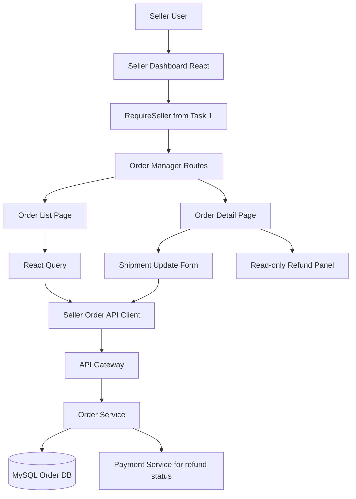
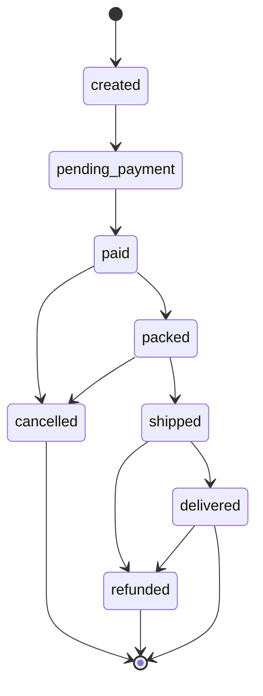
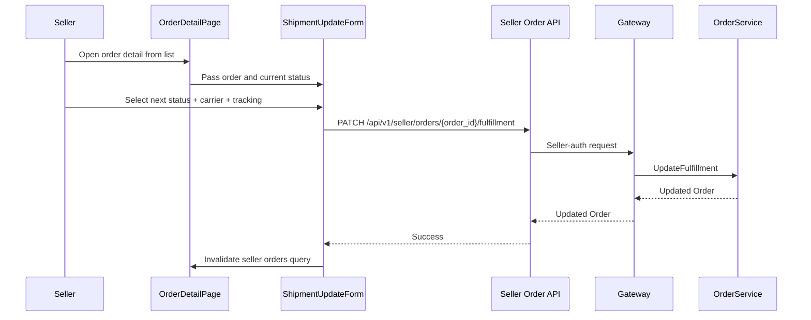
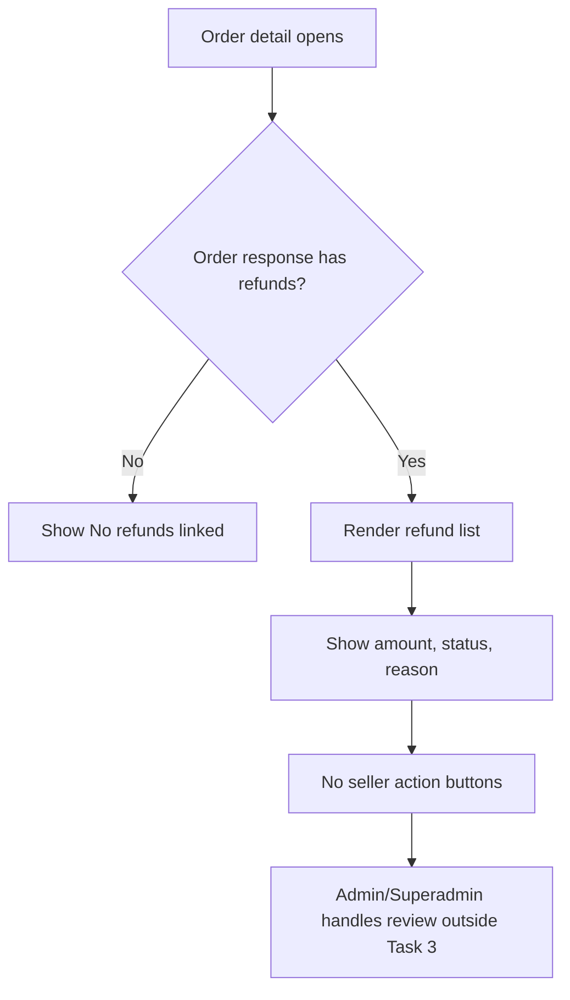
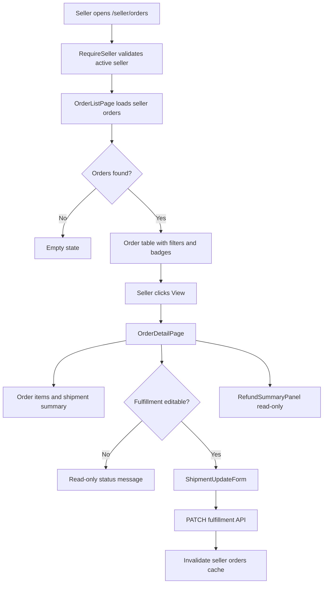

# 📦 Seller Dashboard (CMS) - Task 3: Order Manager


## 📌 Task Summary

| Field | Detail |
|---|---|
| Module | Seller Dashboard (CMS) |
| Task No. | 3 |
| Task Name | Order manager |
| Source | `docs/01-micro-tasks.md` → `Seller Dashboard (CMS)` → Task 3 |
| Requirement | Seller order list, status updates, shipment info, refunds view banao. |
| Dependency | Order APIs |
| Priority | P1 |
| Status | Documentation guide ready |

> 🟢 **Simple Hinglish goal:** Is task me seller dashboard ke andar order management module banana hai. Seller apne store ke orders list me dekh sakega, order detail inspect kar sakega, fulfillment/shipment status update kar sakega, tracking number/carrier save kar sakega, aur refund information read-only view me dekh sakega.

---

## ✅ Final Output Created

```text
TaskImplementation/
└── Seller Dashboard (CMS)/
    ├── task1.md
    ├── task2.md
    └── task3.md
```

### Why this structure?

- `TaskImplementation/` project ke task-wise guides ka central folder hai.
- `Seller Dashboard (CMS)/` seller dashboard ke implementation docs ko group karta hai.
- `task3.md` sirf **Seller Dashboard (CMS) - Task 3** ka beginner-friendly implementation guide hai.

---

## 🧭 Docs Study Summary

Is guide ko banane se pehle project ke existing docs study kiye gaye:

| Document | Kya samjha |
|---|---|
| `docs/01-micro-tasks.md` | Task 3 ka exact scope: seller order list, status updates, shipment info, refunds view |
| `docs/03-folder-structure.md` | `frontend/seller-dashboard/src/features/orders/` ka recommended structure |
| `docs/04-microservice-design.md` | Order Service lifecycle, seller order APIs, fulfillment update endpoint |
| `docs/05-database-design.md` | Orders MySQL me hain; `orders`, `order_items`, `shipments`, `order_status_history` important tables hain |
| `docs/06-auth-security.md` | Seller roles and route-level authorization rules |
| `docs/07-payment-system.md` | Refund flow Payment Service me hota hai; refund records immutable hote hain |
| `docs/09-cms-superadmin.md` | Seller CMS ka Order Management module shipment/cancellation/return visibility provide karega |
| `docs/10-frontend-implementation.md` | Quiet, dense, operational UI with tables, filters, badges |
| `api/master-api.json` | Seller order list and fulfillment endpoints available hain; payment refund endpoint admin-only hai |
| `TaskImplementation/Seller Dashboard (CMS)/task1.md` | Protected dashboard shell and active seller context reuse karna hai |
| `TaskImplementation/Seller Dashboard (CMS)/task2.md` | Product manager ke baad orders route ko same dashboard patterns follow karne hain |

---

## 🟣 Task 3 Scope

### Included in Task 3

| Area | Included? | Explanation |
|---|---:|---|
| Seller order list | ✅ | Active seller ke orders table/list me show karne hain |
| Filters and pagination | ✅ | Status, date range, page, page size, search/order id style filters |
| Order detail view | ✅ | Selected order ke items, customer/shipping summary, status history, shipment and refund panels |
| Status badges | ✅ | Order lifecycle ko readable badges me show karna |
| Shipment update form | ✅ | `status`, `tracking_number`, `carrier` submit karna |
| Fulfillment mutation | ✅ | `PATCH /api/v1/seller/orders/{order_id}/fulfillment` call karna |
| Refunds view | ✅ | Refund details read-only panel me dikhana, agar API response me available ho |
| Basic empty/loading/error states | ✅ | Module usable rahe; full polish Task 8 me hoga |
| Seller auth guard reuse | ✅ | Task 1 ka `RequireSeller` and `seller-store` reuse hoga |

### Not Included in Task 3

| Future/Other Task | Not Included Feature |
|---|---|
| Task 4 | Coupons, campaigns, usage stats |
| Task 5 | Revenue analytics charts |
| Task 6 | Team permissions and staff role screens |
| Task 7 | Audit activity timeline |
| Task 8 | Full cross-module error/empty/permission polish |
| Buyer app | Checkout, buyer order history, buyer cancellation UI |
| Superadmin panel | Admin order operations, refund approval/rejection |
| Payment backend | Refund creation, provider webhook, reconciliation |
| Backend work | New Order Service endpoints, DB migrations, payment provider integration |

> 🔴 **Important API boundary:** `api/master-api.json` me seller ke liye refund create/review endpoint nahi hai. `POST /api/v1/payments/{payment_id}/refund` admin-auth route hai. Isliye Task 3 seller dashboard me refunds **sirf read-only view** rahenge. Seller UI refund API invent nahi karega.

---

## 🧱 Clean Folder Structure

### Documentation folder

```text
TaskImplementation/
└── Seller Dashboard (CMS)/
    ├── task1.md
    ├── task2.md
    └── task3.md
```

### Intended frontend implementation structure

```text
frontend/
└── seller-dashboard/
    └── src/
        ├── routes/
        │   └── seller-routes.tsx
        ├── features/
        │   └── orders/
        │       ├── pages/
        │       │   ├── order-list-page.tsx
        │       │   └── order-detail-page.tsx
        │       ├── components/
        │       │   ├── order-table.tsx
        │       │   ├── order-filters-bar.tsx
        │       │   ├── order-status-badge.tsx
        │       │   ├── order-items-table.tsx
        │       │   ├── shipment-update-form.tsx
        │       │   ├── shipment-summary-card.tsx
        │       │   ├── refund-summary-panel.tsx
        │       │   └── money-cell.tsx
        │       ├── api/
        │       │   └── seller-order-api.ts
        │       ├── hooks/
        │       │   ├── use-seller-orders.ts
        │       │   └── use-fulfillment-update.ts
        │       ├── utils/
        │       │   ├── order-formatters.ts
        │       │   └── order-status-rules.ts
        │       └── types.ts
        ├── components/
        │   └── ui/
        │       ├── button.tsx
        │       ├── input.tsx
        │       ├── select.tsx
        │       └── status-badge.tsx
        ├── stores/
        │   └── seller-store.ts
        └── lib/
            └── http.ts
```

### Folder responsibility

| Folder/File | Responsibility |
|---|---|
| `pages/` | Route-level screens: order list and detail |
| `components/` | Order-specific UI pieces |
| `api/` | Order Service REST calls |
| `hooks/` | React Query hooks and mutations |
| `utils/` | Formatting and allowed status transition helpers |
| `types.ts` | Order, shipment, refund, filter, API input/output types |
| `routes/seller-routes.tsx` | `/seller/orders` routes register karna |

---

## 🧩 External Libraries / Tools Used

> Note: Is documentation task me koi package install nahi kiya gaya. Actual frontend implementation karte time ye libraries use hongi.

| Library/Tool | What it is | Why used | Install |
|---|---|---|---|
| React | UI library | Order list/detail components build karne ke liye | React setup dependency me already |
| TypeScript | Typed JavaScript | Order, shipment, refund, API response types safe rakhne ke liye | React setup dependency me already |
| React Router | Client routing | `/seller/orders` and `/seller/orders/:orderId` routes ke liye | `pnpm add react-router-dom` |
| React Query | Server state cache | Orders fetch, pagination cache, fulfillment mutation invalidation ke liye | `pnpm add @tanstack/react-query` |
| React Hook Form | Form state | Shipment update form lightweight and controlled rakhne ke liye | `pnpm add react-hook-form` |
| Zod | Schema validation | Shipment status/tracking/carrier validation central rakhne ke liye | `pnpm add zod` |
| @hookform/resolvers | RHF + Zod bridge | Zod schema ko React Hook Form me use karne ke liye | `pnpm add @hookform/resolvers` |
| Zustand | Lightweight store | Active seller Task 1 store se read karne ke liye | `pnpm add zustand` |
| Tailwind CSS | Utility-first CSS | Dense operational dashboard UI ke liye | `pnpm add -D tailwindcss postcss autoprefixer` |
| Lucide React | Icon set | Truck, package, refresh, filter icons ke liye | `pnpm add lucide-react` |
| Vitest + Testing Library | Test tools | Components, form, hooks test karne ke liye | `pnpm add -D vitest @testing-library/react @testing-library/user-event` |
| MSW | API mocking | Seller Order APIs mock karke tests likhne ke liye | `pnpm add -D msw` |

### Install command

```bash
pnpm add react-router-dom @tanstack/react-query react-hook-form zod @hookform/resolvers zustand lucide-react
pnpm add -D tailwindcss postcss autoprefixer vitest @testing-library/react @testing-library/user-event msw
```

### Why these tools are useful for Task 3?

- **React Query** seller orders ko cache karta hai aur shipment update ke baad list/detail refresh karta hai.
- **React Hook Form** shipment update form ko simple, fast, aur validation-friendly banata hai.
- **Zod** invalid shipment status ya missing tracking info pe clear frontend validation deta hai.
- **React Router** list and detail screens ko clean URLs deta hai.
- **MSW** backend ready na hone par bhi Order API behavior test karne me help karta hai.

---

## 🗺️ Architecture Diagram



### Explanation

- Seller dashboard browser se API Gateway ko call karega.
- `RequireSeller` Task 1 ka guard seller access validate karega.
- Order list and fulfillment update Order Service ke through jayega.
- Refund creation Payment/Admin flow ka part hai; Seller Dashboard sirf received refund data read-only show karega.
- MySQL Order DB source of truth hai because order data transactional and auditable hai.

---

## 🔁 Order Lifecycle for Seller UI

Docs me order lifecycle broadly ye hai: created, pending payment, paid, packed, shipped, delivered, cancelled, refunded.



### Seller UI interpretation

| Status | Badge color idea | Seller action |
|---|---|---|
| `created` | Gray | Read-only, payment wait |
| `pending_payment` | Amber | Read-only, payment wait |
| `paid` | Green | Mark as packed / add shipment |
| `packed` | Blue | Add tracking and mark shipped |
| `shipped` | Purple | Update tracking or mark delivered if allowed |
| `delivered` | Green solid | Read-only success state |
| `cancelled` | Red | Read-only terminal state |
| `refunded` | Red/Amber | Read-only refund state |

> 🟡 Frontend allowed transitions sirf UX guide hain. Final validation backend karega. Seller dashboard ko cancelled/refunded/payment states manually force nahi karne chahiye.

---

## 📡 Order APIs Used

From `api/master-api.json` and `docs/04-microservice-design.md`:

| Action | Method | Path | Auth | Purpose |
|---|---|---|---|---|
| List seller orders | `GET` | `/api/v1/seller/orders` | seller | Active seller ke order items/orders list karna |
| Update fulfillment | `PATCH` | `/api/v1/seller/orders/{order_id}/fulfillment` | seller | Shipment/status/tracking update karna |

### Related APIs not used by Task 3

| API | Why not used |
|---|---|
| `POST /api/v1/orders/checkout` | Buyer checkout flow hai |
| `GET /api/v1/orders` | Buyer order history flow hai |
| `GET /api/v1/orders/{order_id}` | Buyer-auth detail route hai; seller-specific detail endpoint master API me defined nahi hai |
| `POST /api/v1/orders/{order_id}/cancel` | Buyer cancellation route hai |
| `POST /api/v1/payments/{payment_id}/refund` | Admin-auth refund route hai |
| `POST /api/v1/admin/refunds/{refund_id}/review` | Superadmin/admin refund review route hai |

### API reality check

Current master API seller-specific order detail endpoint define nahi karta. Isliye Task 3 ke detail page ke liye recommended approach:

- List API response me available `Order` object ko detail page/drawer me pass karo.
- Query cache me order mil jaye to detail render karo.
- Direct refresh pe agar detail data missing ho, user ko list page pe wapas jaane ka clear state dikhao.
- Naya `/api/v1/seller/orders/{order_id}` endpoint invent mat karo.

---

## 🧾 Data Types

Master API ka `Order` schema minimal hai. Frontend types ko backend-compatible rakhte hue optional fields allow kar sakte hain, taaki richer response aaye to UI break na ho.

### Code example: `features/orders/types.ts`

```ts
export type Money = {
  amount: number;
  currency: string;
};

export type OrderStatus =
  | "created"
  | "pending_payment"
  | "paid"
  | "packed"
  | "shipped"
  | "delivered"
  | "cancelled"
  | "refunded";

export type OrderItem = {
  product_id?: string;
  variant_id?: string;
  seller_id?: string;
  title?: string;
  sku?: string;
  quantity?: number;
  unit_price?: Money;
  total?: Money;
};

export type Shipment = {
  shipment_id?: string;
  status?: OrderStatus;
  tracking_number?: string;
  carrier?: string;
  shipped_at?: string;
  delivered_at?: string;
};

export type Refund = {
  refund_id: string;
  payment_id: string;
  status: string;
  amount: Money;
  reason?: string;
};

export type Order = {
  order_id: string;
  user_id?: string;
  status: OrderStatus;
  items: OrderItem[];
  total: Money;
  created_at: string;
  shipments?: Shipment[];
  refunds?: Refund[];
  status_history?: Array<{
    status: OrderStatus;
    created_at: string;
    note?: string;
  }>;
};

export type SellerOrderFilters = {
  status?: OrderStatus | "all";
  q?: string;
  page: number;
  page_size: number;
  date_from?: string;
  date_to?: string;
};

export type OrderListResponse = {
  orders: Order[];
  total: number;
};

export type FulfillmentUpdateInput = {
  status?: OrderStatus;
  tracking_number?: string;
  carrier?: string;
};
```

### Explanation

- `Money` common amount/currency shape hai.
- `OrderStatus` UI badges and transition rules ko typed banata hai.
- `shipments`, `refunds`, `status_history` optional rakhe gaye hain because master API ka schema minimal hai.
- Optional fields se frontend future richer response ko gracefully handle karega.

---

## 🪜 Step-by-Step Implementation

## Step 1: Task 1 dashboard shell reuse karo

Order Manager ko standalone app ki tarah nahi banana. Ye Task 1 ke protected seller dashboard shell ke andar render hoga.

### Required prerequisites

- `RequireSeller` route guard ready ho.
- `DashboardLayout` shell ready ho.
- `SellerStore` me active seller available ho.
- Sidebar me `Orders` nav item already present ho.

### Explanation

Task 3 seller-specific data dikhata hai. Isliye active seller context missing ho to order manager API calls nahi chalni chahiye.

---

## Step 2: Seller routes update karo

Task 2 tak `/seller/orders` placeholder redirect ho sakta tha. Task 3 me us route ko actual order pages se replace karna hai.

### URL plan

```text
/seller/orders
/seller/orders/:orderId
```

### Code example: `routes/seller-routes.tsx`

```tsx
import { Navigate, RouteObject } from "react-router-dom";
import { DashboardLayout } from "../layout/dashboard-layout";
import { RequireSeller } from "./require-seller";
import { DashboardHomePage } from "../pages/dashboard-home-page";
import { ProductListPage } from "../features/products/pages/product-list-page";
import { ProductEditorPage } from "../features/products/pages/product-editor-page";
import { OrderListPage } from "../features/orders/pages/order-list-page";
import { OrderDetailPage } from "../features/orders/pages/order-detail-page";

export const sellerRoutes: RouteObject[] = [
  {
    path: "/seller",
    element: (
      <RequireSeller>
        <DashboardLayout />
      </RequireSeller>
    ),
    children: [
      { index: true, element: <DashboardHomePage /> },
      { path: "products", element: <ProductListPage /> },
      { path: "products/new", element: <ProductEditorPage mode="create" /> },
      { path: "products/:productId/edit", element: <ProductEditorPage mode="edit" /> },
      { path: "orders", element: <OrderListPage /> },
      { path: "orders/:orderId", element: <OrderDetailPage /> },
      { path: "offers", element: <Navigate to="/seller" replace /> },
      { path: "analytics", element: <Navigate to="/seller" replace /> },
      { path: "team", element: <Navigate to="/seller" replace /> },
      { path: "audit", element: <Navigate to="/seller" replace /> },
    ],
  },
];
```

### Explanation

- `/seller/orders` order table dikhata hai.
- `/seller/orders/:orderId` selected order detail dikhata hai.
- Offers, analytics, team, audit abhi future tasks hain, so unchanged placeholders rahenge.
- Task 3 sirf orders route ko activate karta hai.

---

## Step 3: API client banao

API client ka kaam endpoints ko typed functions me wrap karna hai.

### Code example: `features/orders/api/seller-order-api.ts`

```ts
import { http } from "../../../lib/http";
import {
  FulfillmentUpdateInput,
  Order,
  OrderListResponse,
  SellerOrderFilters,
} from "../types";

function toQueryString(filters: SellerOrderFilters) {
  const params = new URLSearchParams();

  params.set("page", String(filters.page));
  params.set("page_size", String(filters.page_size));

  if (filters.status && filters.status !== "all") {
    params.set("status", filters.status);
  }

  if (filters.q) {
    params.set("q", filters.q);
  }

  if (filters.date_from) {
    params.set("date_from", filters.date_from);
  }

  if (filters.date_to) {
    params.set("date_to", filters.date_to);
  }

  return params.toString();
}

export function listSellerOrders(filters: SellerOrderFilters) {
  const query = toQueryString(filters);
  return http<OrderListResponse>(`/api/v1/seller/orders?${query}`);
}

export function updateOrderFulfillment(
  orderId: string,
  input: FulfillmentUpdateInput,
) {
  return http<Order>(`/api/v1/seller/orders/${orderId}/fulfillment`, {
    method: "PATCH",
    body: JSON.stringify({
      order_id: orderId,
      ...input,
    }),
  });
}
```

### Explanation

- `listSellerOrders` seller-auth list endpoint call karta hai.
- `updateOrderFulfillment` shipment/status update endpoint call karta hai.
- `order_id` path and body dono me bhejna safe hai because master schema me body me `order_id` field present hai.
- Refund create/update function intentionally nahi banaya gaya.

---

## Step 4: React Query hooks banao

Hooks UI components ko API details se cleanly separate karte hain.

### Code example: `features/orders/hooks/use-seller-orders.ts`

```ts
import { useQuery } from "@tanstack/react-query";
import { listSellerOrders } from "../api/seller-order-api";
import { SellerOrderFilters } from "../types";

export function useSellerOrders(filters: SellerOrderFilters, enabled: boolean) {
  return useQuery({
    queryKey: ["seller-orders", filters],
    queryFn: () => listSellerOrders(filters),
    enabled,
    keepPreviousData: true,
  });
}
```

### Code example: `features/orders/hooks/use-fulfillment-update.ts`

```ts
import { useMutation, useQueryClient } from "@tanstack/react-query";
import { updateOrderFulfillment } from "../api/seller-order-api";
import { FulfillmentUpdateInput } from "../types";

export function useFulfillmentUpdate(orderId: string) {
  const queryClient = useQueryClient();

  return useMutation({
    mutationFn: (input: FulfillmentUpdateInput) =>
      updateOrderFulfillment(orderId, input),
    onSuccess: () => {
      queryClient.invalidateQueries({ queryKey: ["seller-orders"] });
    },
  });
}
```

### Explanation

- `useSellerOrders` pagination/filter change pe automatically refetch karta hai.
- `keepPreviousData` page switch ke time table ko flicker hone se bachata hai.
- Fulfillment update ke baad orders list invalidate hoti hai, so latest status UI me aa jata hai.

---

## Step 5: Formatting helpers banao

Money/date/status formatting scattered nahi hona chahiye.

### Code example: `features/orders/utils/order-formatters.ts`

```ts
import { Money } from "../types";

export function formatMoney(money?: Money) {
  if (!money) return "-";

  return new Intl.NumberFormat("en-IN", {
    style: "currency",
    currency: money.currency || "INR",
    maximumFractionDigits: 2,
  }).format(money.amount / 100);
}

export function formatDateTime(value?: string) {
  if (!value) return "-";

  return new Intl.DateTimeFormat("en-IN", {
    dateStyle: "medium",
    timeStyle: "short",
  }).format(new Date(value));
}
```

### Explanation

- `Intl.NumberFormat` browser built-in hai, extra date/money library ki zarurat nahi.
- Amount minor units me assume kiya gaya hai, jaise paise/cents. Agar backend rupees major units bheje, formatter ko backend contract ke according adjust karna hoga.

---

## Step 6: Status transition rules banao

Frontend seller ko obvious invalid actions disable kar sakta hai, but backend final authority hai.

### Code example: `features/orders/utils/order-status-rules.ts`

```ts
import { OrderStatus } from "../types";

const editableStatuses: OrderStatus[] = ["paid", "packed", "shipped"];

export function canUpdateFulfillment(status: OrderStatus) {
  return editableStatuses.includes(status);
}

export function nextFulfillmentStatuses(status: OrderStatus): OrderStatus[] {
  if (status === "paid") return ["packed", "shipped"];
  if (status === "packed") return ["shipped"];
  if (status === "shipped") return ["delivered"];
  return [];
}
```

### Explanation

- `created` and `pending_payment` read-only hain because payment complete nahi hua.
- `cancelled`, `refunded`, `delivered` terminal/read-only states hain.
- Seller ko refund/cancel force karne ka UI Task 3 me nahi milega.

---

## Step 7: Order list page banao

Order list page seller ka main operational screen hai.

### Code example: `features/orders/pages/order-list-page.tsx`

```tsx
import { useState } from "react";
import { useSellerStore } from "../../../stores/seller-store";
import { OrderFiltersBar } from "../components/order-filters-bar";
import { OrderTable } from "../components/order-table";
import { useSellerOrders } from "../hooks/use-seller-orders";
import { SellerOrderFilters } from "../types";

const defaultFilters: SellerOrderFilters = {
  status: "all",
  page: 1,
  page_size: 20,
};

export function OrderListPage() {
  const activeSeller = useSellerStore((state) => state.activeSeller);
  const [filters, setFilters] = useState<SellerOrderFilters>(defaultFilters);
  const ordersQuery = useSellerOrders(filters, Boolean(activeSeller?.seller_id));

  if (!activeSeller) {
    return <div className="p-6 text-sm text-slate-500">Active seller select karo.</div>;
  }

  return (
    <section className="space-y-4">
      <div className="flex flex-wrap items-center justify-between gap-3">
        <div>
          <h1 className="text-xl font-semibold text-slate-950">Orders</h1>
          <p className="text-sm text-slate-500">
            Seller orders, fulfillment status, shipment info aur refunds view.
          </p>
        </div>
      </div>

      <OrderFiltersBar filters={filters} onChange={setFilters} />

      {ordersQuery.isLoading ? (
        <div className="rounded-md border border-slate-200 p-6 text-sm text-slate-500">
          Orders loading...
        </div>
      ) : null}

      {ordersQuery.isError ? (
        <div className="rounded-md border border-red-200 bg-red-50 p-6 text-sm text-red-700">
          Orders load nahi ho paaye. Thodi der baad retry karo.
        </div>
      ) : null}

      {ordersQuery.data ? (
        <OrderTable
          orders={ordersQuery.data.orders}
          total={ordersQuery.data.total}
          filters={filters}
          onFiltersChange={setFilters}
        />
      ) : null}
    </section>
  );
}
```

### Explanation

- Active seller missing ho to API call disabled rahega.
- Filters local state me hain because ye page-specific UI state hai.
- `OrderTable` reusable component hai; list page sirf data load orchestration karta hai.

---

## Step 8: Filters bar banao

Seller orders me fast filtering important hai. UI dense and operational rakho.

### Code example: `features/orders/components/order-filters-bar.tsx`

```tsx
import { SellerOrderFilters } from "../types";

type OrderFiltersBarProps = {
  filters: SellerOrderFilters;
  onChange: (filters: SellerOrderFilters) => void;
};

const statuses = [
  "all",
  "pending_payment",
  "paid",
  "packed",
  "shipped",
  "delivered",
  "cancelled",
  "refunded",
] as const;

export function OrderFiltersBar({ filters, onChange }: OrderFiltersBarProps) {
  return (
    <div className="flex flex-wrap items-end gap-3 rounded-md border border-slate-200 bg-white p-3">
      <label className="grid gap-1 text-xs font-medium text-slate-600">
        Search
        <input
          className="h-9 w-56 rounded-md border border-slate-300 px-3 text-sm"
          placeholder="Order ID"
          value={filters.q ?? ""}
          onChange={(event) =>
            onChange({ ...filters, q: event.target.value, page: 1 })
          }
        />
      </label>

      <label className="grid gap-1 text-xs font-medium text-slate-600">
        Status
        <select
          className="h-9 rounded-md border border-slate-300 px-3 text-sm"
          value={filters.status ?? "all"}
          onChange={(event) =>
            onChange({
              ...filters,
              status: event.target.value as SellerOrderFilters["status"],
              page: 1,
            })
          }
        >
          {statuses.map((status) => (
            <option key={status} value={status}>
              {status.replace("_", " ")}
            </option>
          ))}
        </select>
      </label>

      <label className="grid gap-1 text-xs font-medium text-slate-600">
        From
        <input
          className="h-9 rounded-md border border-slate-300 px-3 text-sm"
          type="date"
          value={filters.date_from ?? ""}
          onChange={(event) =>
            onChange({ ...filters, date_from: event.target.value, page: 1 })
          }
        />
      </label>

      <label className="grid gap-1 text-xs font-medium text-slate-600">
        To
        <input
          className="h-9 rounded-md border border-slate-300 px-3 text-sm"
          type="date"
          value={filters.date_to ?? ""}
          onChange={(event) =>
            onChange({ ...filters, date_to: event.target.value, page: 1 })
          }
        />
      </label>
    </div>
  );
}
```

### Explanation

- Search order id ke liye useful hai.
- Status filter daily operations me sabse common hai.
- Date range seller ko dispatch workload isolate karne me help karta hai.
- Page reset to `1` hota hai jab filters change hote hain.

---

## Step 9: Order table banao

Table seller ko order queue quickly scan karne deta hai.

### Code example: `features/orders/components/order-table.tsx`

```tsx
import { Link } from "react-router-dom";
import { Order, SellerOrderFilters } from "../types";
import { formatDateTime, formatMoney } from "../utils/order-formatters";
import { OrderStatusBadge } from "./order-status-badge";

type OrderTableProps = {
  orders: Order[];
  total: number;
  filters: SellerOrderFilters;
  onFiltersChange: (filters: SellerOrderFilters) => void;
};

export function OrderTable({
  orders,
  total,
  filters,
  onFiltersChange,
}: OrderTableProps) {
  if (orders.length === 0) {
    return (
      <div className="rounded-md border border-slate-200 bg-white p-8 text-center">
        <p className="text-sm font-medium text-slate-800">No orders found</p>
        <p className="mt-1 text-sm text-slate-500">
          Current filters ke liye koi seller order nahi mila.
        </p>
      </div>
    );
  }

  const totalPages = Math.max(1, Math.ceil(total / filters.page_size));

  return (
    <div className="overflow-hidden rounded-md border border-slate-200 bg-white">
      <table className="min-w-full divide-y divide-slate-200 text-sm">
        <thead className="bg-slate-50 text-left text-xs font-semibold uppercase tracking-wide text-slate-500">
          <tr>
            <th className="px-4 py-3">Order</th>
            <th className="px-4 py-3">Created</th>
            <th className="px-4 py-3">Items</th>
            <th className="px-4 py-3">Total</th>
            <th className="px-4 py-3">Status</th>
            <th className="px-4 py-3 text-right">Action</th>
          </tr>
        </thead>
        <tbody className="divide-y divide-slate-100">
          {orders.map((order) => (
            <tr key={order.order_id} className="hover:bg-slate-50">
              <td className="px-4 py-3 font-medium text-slate-950">
                {order.order_id}
              </td>
              <td className="px-4 py-3 text-slate-600">
                {formatDateTime(order.created_at)}
              </td>
              <td className="px-4 py-3 text-slate-600">
                {order.items?.length ?? 0}
              </td>
              <td className="px-4 py-3 text-slate-700">
                {formatMoney(order.total)}
              </td>
              <td className="px-4 py-3">
                <OrderStatusBadge status={order.status} />
              </td>
              <td className="px-4 py-3 text-right">
                <Link
                  className="text-sm font-medium text-blue-700 hover:text-blue-900"
                  to={`/seller/orders/${order.order_id}`}
                  state={{ order }}
                >
                  View
                </Link>
              </td>
            </tr>
          ))}
        </tbody>
      </table>

      <div className="flex items-center justify-between border-t border-slate-200 px-4 py-3 text-sm">
        <span className="text-slate-500">
          Page {filters.page} of {totalPages}
        </span>
        <div className="flex gap-2">
          <button
            className="rounded-md border border-slate-300 px-3 py-1.5 disabled:opacity-50"
            disabled={filters.page <= 1}
            onClick={() => onFiltersChange({ ...filters, page: filters.page - 1 })}
          >
            Previous
          </button>
          <button
            className="rounded-md border border-slate-300 px-3 py-1.5 disabled:opacity-50"
            disabled={filters.page >= totalPages}
            onClick={() => onFiltersChange({ ...filters, page: filters.page + 1 })}
          >
            Next
          </button>
        </div>
      </div>
    </div>
  );
}
```

### Explanation

- Dense table operational dashboard pattern follow karta hai.
- `state={{ order }}` detail page ko selected order pass karta hai.
- Direct detail refresh ke liye fallback Step 12 me handle hoga.
- Pagination server-driven query ke saath align karta hai.

---

## Step 10: Status badge component banao

Status badge quickly order health show karta hai.

### Code example: `features/orders/components/order-status-badge.tsx`

```tsx
import { OrderStatus } from "../types";

const statusStyles: Record<OrderStatus, string> = {
  created: "bg-slate-100 text-slate-700",
  pending_payment: "bg-amber-100 text-amber-800",
  paid: "bg-green-100 text-green-800",
  packed: "bg-blue-100 text-blue-800",
  shipped: "bg-purple-100 text-purple-800",
  delivered: "bg-emerald-100 text-emerald-800",
  cancelled: "bg-red-100 text-red-800",
  refunded: "bg-orange-100 text-orange-800",
};

type OrderStatusBadgeProps = {
  status: OrderStatus;
};

export function OrderStatusBadge({ status }: OrderStatusBadgeProps) {
  return (
    <span
      className={`inline-flex rounded-full px-2 py-1 text-xs font-medium ${statusStyles[status]}`}
    >
      {status.replace("_", " ")}
    </span>
  );
}
```

### Explanation

- Color semantic hai: green progress/success, amber waiting, red issue, purple in-transit.
- Badge compact hai, table row me easily fit hota hai.

---

## Step 11: Order detail page banao

Order detail me items, shipment, status, refunds ek page me show honge.

### Code example: `features/orders/pages/order-detail-page.tsx`

```tsx
import { Link, useLocation, useParams } from "react-router-dom";
import { OrderItemsTable } from "../components/order-items-table";
import { OrderStatusBadge } from "../components/order-status-badge";
import { RefundSummaryPanel } from "../components/refund-summary-panel";
import { ShipmentSummaryCard } from "../components/shipment-summary-card";
import { ShipmentUpdateForm } from "../components/shipment-update-form";
import { Order } from "../types";
import { formatDateTime, formatMoney } from "../utils/order-formatters";
import { canUpdateFulfillment } from "../utils/order-status-rules";

type LocationState = {
  order?: Order;
};

export function OrderDetailPage() {
  const { orderId } = useParams();
  const location = useLocation();
  const state = location.state as LocationState | null;
  const order = state?.order;

  if (!order) {
    return (
      <div className="space-y-3 rounded-md border border-amber-200 bg-amber-50 p-6">
        <h1 className="text-base font-semibold text-amber-950">
          Order detail direct load nahi ho paaya
        </h1>
        <p className="text-sm text-amber-800">
          Current API contract me seller-specific order detail endpoint defined nahi hai.
          Orders list se order open karo.
        </p>
        <Link className="text-sm font-medium text-amber-900 underline" to="/seller/orders">
          Back to orders
        </Link>
      </div>
    );
  }

  return (
    <section className="space-y-4">
      <div className="flex flex-wrap items-start justify-between gap-3">
        <div>
          <Link className="text-sm text-slate-500 hover:text-slate-800" to="/seller/orders">
            Back to orders
          </Link>
          <h1 className="mt-1 text-xl font-semibold text-slate-950">
            Order {orderId}
          </h1>
          <p className="text-sm text-slate-500">
            Created {formatDateTime(order.created_at)}
          </p>
        </div>
        <OrderStatusBadge status={order.status} />
      </div>

      <div className="grid gap-4 lg:grid-cols-[1fr_360px]">
        <div className="space-y-4">
          <div className="rounded-md border border-slate-200 bg-white p-4">
            <div className="mb-3 flex items-center justify-between">
              <h2 className="font-semibold text-slate-950">Order items</h2>
              <span className="text-sm font-medium text-slate-700">
                {formatMoney(order.total)}
              </span>
            </div>
            <OrderItemsTable items={order.items} />
          </div>

          <RefundSummaryPanel refunds={order.refunds ?? []} />
        </div>

        <aside className="space-y-4">
          <ShipmentSummaryCard shipments={order.shipments ?? []} />
          {canUpdateFulfillment(order.status) ? (
            <ShipmentUpdateForm order={order} />
          ) : (
            <div className="rounded-md border border-slate-200 bg-slate-50 p-4 text-sm text-slate-600">
              Current status me shipment update allowed nahi hai.
            </div>
          )}
        </aside>
      </div>
    </section>
  );
}
```

### Explanation

- Detail page list se passed `order` data use karta hai.
- Direct refresh fallback honest hai because seller detail endpoint current API me defined nahi hai.
- Shipment update sirf allowed statuses me show hota hai.
- Refund panel read-only hai.

---

## Step 12: Order items table banao

Order items immutable snapshots hain. Seller ko product title, SKU, quantity, price quickly dekhna hai.

### Code example: `features/orders/components/order-items-table.tsx`

```tsx
import { OrderItem } from "../types";
import { formatMoney } from "../utils/order-formatters";

type OrderItemsTableProps = {
  items: OrderItem[];
};

export function OrderItemsTable({ items }: OrderItemsTableProps) {
  if (items.length === 0) {
    return <p className="text-sm text-slate-500">No items available.</p>;
  }

  return (
    <table className="min-w-full divide-y divide-slate-200 text-sm">
      <thead className="text-left text-xs font-semibold uppercase tracking-wide text-slate-500">
        <tr>
          <th className="py-2 pr-3">Product</th>
          <th className="px-3 py-2">SKU</th>
          <th className="px-3 py-2">Qty</th>
          <th className="px-3 py-2 text-right">Total</th>
        </tr>
      </thead>
      <tbody className="divide-y divide-slate-100">
        {items.map((item, index) => (
          <tr key={`${item.product_id ?? "item"}-${index}`}>
            <td className="py-3 pr-3">
              <p className="font-medium text-slate-950">
                {item.title ?? item.product_id ?? "Product"}
              </p>
              <p className="text-xs text-slate-500">{item.variant_id}</p>
            </td>
            <td className="px-3 py-3 text-slate-600">{item.sku ?? "-"}</td>
            <td className="px-3 py-3 text-slate-600">{item.quantity ?? 1}</td>
            <td className="px-3 py-3 text-right text-slate-700">
              {formatMoney(item.total)}
            </td>
          </tr>
        ))}
      </tbody>
    </table>
  );
}
```

### Explanation

- Order item snapshot display karta hai; Product Service se real-time product fetch nahi karta.
- Ye design DB doc ke "immutable order item snapshots" rule ko follow karta hai.

---

## Step 13: Shipment summary card banao

Shipment summary existing shipment/tracking info show karta hai.

### Code example: `features/orders/components/shipment-summary-card.tsx`

```tsx
import { Shipment } from "../types";
import { formatDateTime } from "../utils/order-formatters";

type ShipmentSummaryCardProps = {
  shipments: Shipment[];
};

export function ShipmentSummaryCard({ shipments }: ShipmentSummaryCardProps) {
  const latest = shipments[0];

  return (
    <div className="rounded-md border border-slate-200 bg-white p-4">
      <h2 className="font-semibold text-slate-950">Shipment</h2>

      {!latest ? (
        <p className="mt-3 text-sm text-slate-500">Shipment info abhi add nahi hui.</p>
      ) : (
        <dl className="mt-3 grid gap-2 text-sm">
          <div className="flex justify-between gap-3">
            <dt className="text-slate-500">Carrier</dt>
            <dd className="font-medium text-slate-800">{latest.carrier ?? "-"}</dd>
          </div>
          <div className="flex justify-between gap-3">
            <dt className="text-slate-500">Tracking</dt>
            <dd className="font-medium text-slate-800">
              {latest.tracking_number ?? "-"}
            </dd>
          </div>
          <div className="flex justify-between gap-3">
            <dt className="text-slate-500">Shipped</dt>
            <dd className="font-medium text-slate-800">
              {formatDateTime(latest.shipped_at)}
            </dd>
          </div>
        </dl>
      )}
    </div>
  );
}
```

### Explanation

- Shipment card read-only summary hai.
- Update form alag component me hai, so display and edit concerns separate rahte hain.

---

## Step 14: Shipment update form banao

Shipment update seller ka main action form hai.

### Code example: `features/orders/components/shipment-update-form.tsx`

```tsx
import { zodResolver } from "@hookform/resolvers/zod";
import { useForm } from "react-hook-form";
import { z } from "zod";
import { Order } from "../types";
import { useFulfillmentUpdate } from "../hooks/use-fulfillment-update";
import { nextFulfillmentStatuses } from "../utils/order-status-rules";

const shipmentSchema = z.object({
  status: z.enum(["packed", "shipped", "delivered"]),
  tracking_number: z.string().max(80).optional(),
  carrier: z.string().max(80).optional(),
});

type ShipmentFormValues = z.infer<typeof shipmentSchema>;

type ShipmentUpdateFormProps = {
  order: Order;
};

export function ShipmentUpdateForm({ order }: ShipmentUpdateFormProps) {
  const mutation = useFulfillmentUpdate(order.order_id);
  const allowedStatuses = nextFulfillmentStatuses(order.status);

  const form = useForm<ShipmentFormValues>({
    resolver: zodResolver(shipmentSchema),
    defaultValues: {
      status: allowedStatuses[0] as ShipmentFormValues["status"],
      tracking_number: order.shipments?.[0]?.tracking_number ?? "",
      carrier: order.shipments?.[0]?.carrier ?? "",
    },
  });

  async function handleSubmit(values: ShipmentFormValues) {
    await mutation.mutateAsync(values);
  }

  return (
    <form
      className="space-y-3 rounded-md border border-slate-200 bg-white p-4"
      onSubmit={form.handleSubmit(handleSubmit)}
    >
      <div>
        <h2 className="font-semibold text-slate-950">Update fulfillment</h2>
        <p className="text-sm text-slate-500">
          Status, carrier aur tracking info update karo.
        </p>
      </div>

      <label className="grid gap-1 text-sm font-medium text-slate-700">
        Next status
        <select
          className="h-9 rounded-md border border-slate-300 px-3 text-sm"
          {...form.register("status")}
        >
          {allowedStatuses.map((status) => (
            <option key={status} value={status}>
              {status}
            </option>
          ))}
        </select>
      </label>

      <label className="grid gap-1 text-sm font-medium text-slate-700">
        Carrier
        <input
          className="h-9 rounded-md border border-slate-300 px-3 text-sm"
          placeholder="Delhivery, Blue Dart, DTDC..."
          {...form.register("carrier")}
        />
      </label>

      <label className="grid gap-1 text-sm font-medium text-slate-700">
        Tracking number
        <input
          className="h-9 rounded-md border border-slate-300 px-3 text-sm"
          placeholder="Tracking number"
          {...form.register("tracking_number")}
        />
      </label>

      {mutation.isError ? (
        <p className="text-sm text-red-600">
          Shipment update nahi ho paaya. Details check karke retry karo.
        </p>
      ) : null}

      <button
        className="w-full rounded-md bg-slate-950 px-3 py-2 text-sm font-medium text-white disabled:opacity-50"
        disabled={mutation.isPending || allowedStatuses.length === 0}
        type="submit"
      >
        {mutation.isPending ? "Updating..." : "Update shipment"}
      </button>
    </form>
  );
}
```

### Explanation

- Form Zod validation use karta hai.
- Allowed status options current status ke basis pe restricted hain.
- `tracking_number` and `carrier` optional rakhe gaye because packed status me tracking available na ho sakti hai.
- Backend still final validation karega.

---

## Step 15: Refund summary panel banao

Seller ko refund status dekhna chahiye, lekin refund create/review action nahi dena.

### Code example: `features/orders/components/refund-summary-panel.tsx`

```tsx
import { Refund } from "../types";
import { formatMoney } from "../utils/order-formatters";

type RefundSummaryPanelProps = {
  refunds: Refund[];
};

export function RefundSummaryPanel({ refunds }: RefundSummaryPanelProps) {
  return (
    <div className="rounded-md border border-slate-200 bg-white p-4">
      <div className="flex items-center justify-between gap-3">
        <div>
          <h2 className="font-semibold text-slate-950">Refunds</h2>
          <p className="text-sm text-slate-500">
            Refund info read-only hai. Approval/rejection admin panel me hota hai.
          </p>
        </div>
      </div>

      {refunds.length === 0 ? (
        <p className="mt-3 text-sm text-slate-500">No refunds linked with this order.</p>
      ) : (
        <div className="mt-3 divide-y divide-slate-100">
          {refunds.map((refund) => (
            <div key={refund.refund_id} className="grid gap-1 py-3 text-sm">
              <div className="flex justify-between gap-3">
                <span className="font-medium text-slate-900">
                  {formatMoney(refund.amount)}
                </span>
                <span className="rounded-full bg-amber-100 px-2 py-0.5 text-xs font-medium text-amber-800">
                  {refund.status}
                </span>
              </div>
              <p className="text-slate-500">{refund.reason ?? "No reason provided"}</p>
            </div>
          ))}
        </div>
      )}
    </div>
  );
}
```

### Explanation

- Refund panel seller ko transparency deta hai.
- Button/action deliberately absent hai.
- Admin-only refund route ka misuse avoid hota hai.

---

## Step 16: Fulfillment update flow samjho



### Explanation

- Seller form submit karta hai.
- API Gateway seller JWT/role validate karta hai.
- Order Service seller ownership and valid transition validate karta hai.
- React Query cache invalidate hota hai.
- UI updated status show karta hai.

---

## Step 17: Refund view flow samjho



### Explanation

- Refunds immutable financial records hain.
- Seller ko status visibility milti hai.
- Refund approve/reject Superadmin/Admin task ka part hai.

---

## 🧪 Testing Plan

### Unit/component tests

| Test | What to verify |
|---|---|
| `OrderStatusBadge` | Har status correct label/color class render kare |
| `order-formatters` | Money/date formatting stable rahe |
| `order-status-rules` | Only paid/packed/shipped update allowed |
| `OrderFiltersBar` | Filter change page reset to 1 kare |
| `ShipmentUpdateForm` | Valid payload mutation ko call kare |
| `RefundSummaryPanel` | Refund buttons render na hon |

### API mock tests with MSW

| Endpoint | Scenario |
|---|---|
| `GET /api/v1/seller/orders` | Success with orders |
| `GET /api/v1/seller/orders` | Empty list |
| `GET /api/v1/seller/orders` | Server error |
| `PATCH /api/v1/seller/orders/{id}/fulfillment` | Success status update |
| `PATCH /api/v1/seller/orders/{id}/fulfillment` | Invalid transition error |

### Commands

```bash
pnpm test
pnpm lint
pnpm build
```

---

## 🔐 Security & Permissions

| Rule | Why important |
|---|---|
| Use `RequireSeller` | Inactive/non-seller users order manager access na karein |
| Rely on backend seller ownership check | Frontend filters bypass ho sakte hain, backend final authority hai |
| Do not expose refund create action | Refund endpoint admin-auth hai, seller panel me misuse avoid karna hai |
| Avoid unnecessary buyer PII in list | Operational table me minimum data show karo |
| Disable invalid status actions in UI | Seller mistakes kam hoti hain |
| Backend validates final transition | Race conditions and manual API tampering se protection milti hai |

---

## ✅ Acceptance Checklist

| Check | Status |
|---|---:|
| `/seller/orders` route defined | ✅ |
| `/seller/orders/:orderId` route defined | ✅ |
| Order list uses seller order API | ✅ |
| Filters and pagination documented | ✅ |
| Order status badges documented | ✅ |
| Shipment update form documented | ✅ |
| Fulfillment update API documented | ✅ |
| Refund panel is read-only | ✅ |
| Admin refund APIs not used | ✅ |
| Buyer checkout/cancel flows not implemented | ✅ |
| No coupons/analytics/team/audit scope added | ✅ |
| No new backend endpoint invented | ✅ |

---

## 🚦 End-to-End Flow



---

## 🧠 Beginner Notes

- Order manager frontend module hai; Order Service backend source of truth hai.
- Seller order list multi-seller order splitting ke backend logic par depend karti hai.
- Shipment update me status/tracking/carrier seller provide karega.
- Refund creation seller dashboard ka kaam nahi hai; seller sirf refund status dekh sakta hai.
- Direct `/seller/orders/:orderId` refresh current API contract me limited hai because seller-specific detail endpoint absent hai.
- Order item data snapshot hota hai; product title/price historical value show karna better hai.
- Frontend validation UX help karta hai, security backend me enforce hoti hai.

---

## 📦 Final Result

Seller Dashboard (CMS) Task 3 ke liye Order Manager implementation guide ready hai:

- ✅ Seller order list planned
- ✅ Filters and pagination planned
- ✅ Order detail view planned
- ✅ Shipment/status update form planned
- ✅ Fulfillment API client and hooks planned
- ✅ Refunds read-only view planned
- ✅ Diagrams, folder structure, examples, tools, testing plan, and security notes included

> 🟢 **Task 3 complete:** Seller Dashboard (CMS) ke Order Manager module ka structured Hinglish implementation guide ready hai. Ye guide Task 1 dashboard shell ke andar fit hota hai, Task 2 product routes ke saath coexist karta hai, aur Task 4-8 ya Superadmin refund workflows ka scope touch nahi karta.
