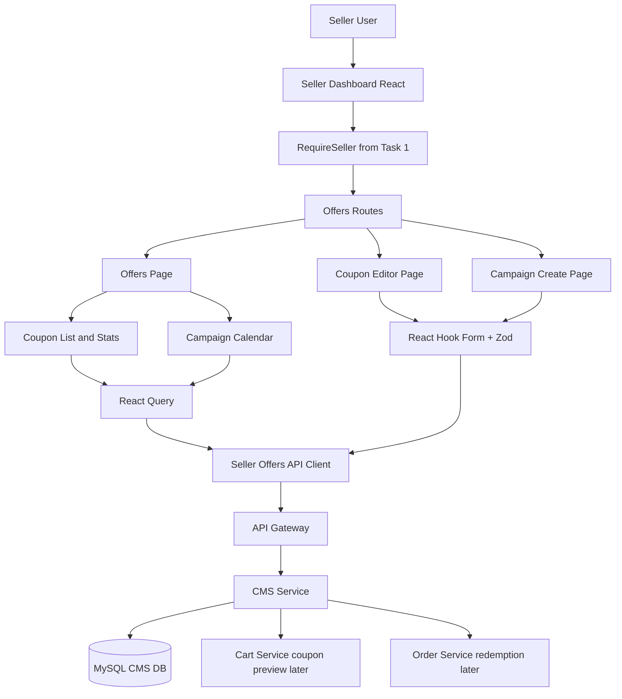
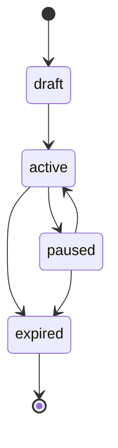
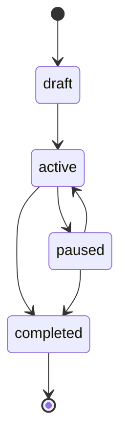
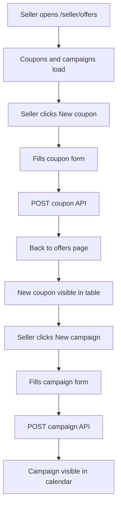
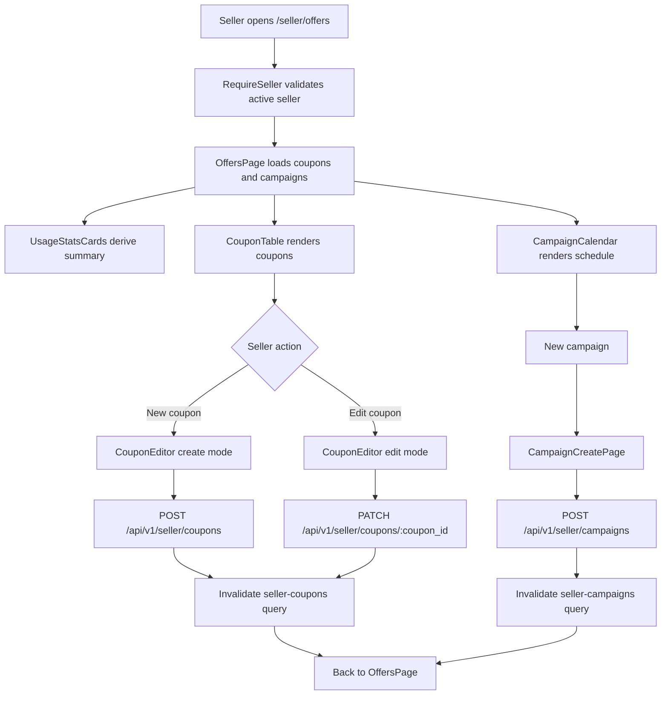

# 🎟️ Seller Dashboard (CMS) - Task 4: Offers and Coupons


## 📌 Task Summary

| Field | Detail |
|---|---|
| Module | Seller Dashboard (CMS) |
| Task No. | 4 |
| Task Name | Offers and coupons |
| Source | `docs/01-micro-tasks.md` → `Seller Dashboard (CMS)` → Task 4 |
| Requirement | Coupon create/edit, campaign calendar, usage stats UI banao. |
| Dependency | CMS APIs |
| Priority | P1 |
| Status | Documentation guide ready |

> 🟢 **Simple Hinglish goal:** Is task me seller dashboard ke andar Offers and Coupons module banana hai. Seller coupon list dekh sakega, naya coupon create karega, existing coupon edit karega, campaigns ko calendar/timeline view me dekhega, new campaign create karega, aur coupon/campaign usage summary UI me samajh payega.

---

## ✅ Final Output Created

```text
TaskImplementation/
└── Seller Dashboard (CMS)/
    ├── task1.md
    ├── task2.md
    ├── task3.md
    └── task4.md
```

### Why this structure?

- `TaskImplementation/` project ke task-wise implementation guides ka central folder hai.
- `Seller Dashboard (CMS)/` seller dashboard ke implementation docs ko group karta hai.
- `task4.md` sirf **Seller Dashboard (CMS) - Task 4** ka beginner-friendly implementation guide hai.

---

## 🧭 Docs Study Summary

Is guide ko banane se pehle project ke existing docs study kiye gaye:

| Document | Kya samjha |
|---|---|
| `docs/01-micro-tasks.md` | Task 4 ka exact scope: coupon create/edit, campaign calendar, usage stats UI |
| `docs/03-folder-structure.md` | `frontend/seller-dashboard/src/features/offers/` ka recommended structure |
| `docs/04-microservice-design.md` | CMS Service coupons, campaigns, coupon validation, seller metrics, audit logs handle karega |
| `docs/05-database-design.md` | Coupons, coupon rules, coupon redemptions, campaigns MySQL me rahenge |
| `docs/09-cms-superadmin.md` | Seller CMS me Offers and Coupons module fixed/percentage coupons, campaign scheduling, usage limits support karega |
| `docs/10-frontend-implementation.md` | React Query for server state, React Hook Form for forms, Zustand for seller context, dense operational UI |
| `api/master-api.json` | Coupon list/create/update and campaign list/create REST APIs available hain |
| `TaskImplementation/Seller Dashboard (CMS)/task1.md` | Protected dashboard shell and active seller context reuse karna hai |
| `TaskImplementation/Seller Dashboard (CMS)/task2.md` | Product manager routes ke saath offers module coexist karega |
| `TaskImplementation/Seller Dashboard (CMS)/task3.md` | Order manager ke baad offers route activate hoga, analytics/team/audit future scope me rahenge |

---

## 🟣 Task 4 Scope

### Included in Task 4

| Area | Included? | Explanation |
|---|---:|---|
| Offers route | ✅ | `/seller/offers` route dashboard shell ke andar active hoga |
| Coupon list | ✅ | Seller ke coupons table/list me show karne hain |
| Coupon filters | ✅ | Status, search/code, date window, page/page size filters |
| Coupon create form | ✅ | Code, discount type, discount value, min cart, start/end time, usage limit |
| Coupon edit form | ✅ | Existing coupon data load karke update karna |
| Coupon status badges | ✅ | Draft, active, paused, expired style status visible hoga |
| Campaign calendar | ✅ | Campaigns ko month/timeline style calendar me show karna |
| Campaign create form | ✅ | Name, start/end time, budget amount create karna |
| Usage stats UI | ✅ | Coupon and campaign summary cards, usage limit progress, optional redemption fields gracefully show karna |
| Basic loading/error/empty states | ✅ | Module usable rahe; full cross-module polish Task 8 me hoga |
| Seller auth guard reuse | ✅ | Task 1 ka `RequireSeller` and `seller-store` reuse hoga |

### Not Included in Task 4

| Future/Other Task | Not Included Feature |
|---|---|
| Task 5 | Revenue, GMV, conversion, top products analytics charts |
| Task 6 | Team invite, seller staff roles, access control UI |
| Task 7 | Audit activity timeline |
| Task 8 | Full empty/loading/failed/permission polish across all modules |
| Cart Service | Buyer coupon preview and cart discount calculation |
| Order Service | Final coupon redemption after paid order |
| Backend work | New CMS endpoints, new migrations, coupon engine implementation |
| Superadmin panel | Platform-wide campaign moderation/settings |

> 🔴 **Important API boundary:** Current `api/master-api.json` me coupon list/create/update and campaign list/create APIs available hain. Campaign update/delete, coupon delete, coupon redemption list, and dedicated coupon usage endpoint available nahi hain. Task 4 UI in routes ko invent nahi karega.

---

## 🧱 Clean Folder Structure

### Documentation folder

```text
TaskImplementation/
└── Seller Dashboard (CMS)/
    ├── task1.md
    ├── task2.md
    ├── task3.md
    └── task4.md
```

### Intended frontend implementation structure

```text
frontend/
└── seller-dashboard/
    └── src/
        ├── routes/
        │   └── seller-routes.tsx
        ├── features/
        │   └── offers/
        │       ├── pages/
        │       │   ├── offers-page.tsx
        │       │   ├── coupon-editor-page.tsx
        │       │   └── campaign-create-page.tsx
        │       ├── components/
        │       │   ├── offers-tabs.tsx
        │       │   ├── coupon-table.tsx
        │       │   ├── coupon-filters-bar.tsx
        │       │   ├── coupon-status-badge.tsx
        │       │   ├── coupon-form.tsx
        │       │   ├── discount-type-selector.tsx
        │       │   ├── usage-stats-cards.tsx
        │       │   ├── usage-progress-bar.tsx
        │       │   ├── campaign-calendar.tsx
        │       │   ├── campaign-card.tsx
        │       │   └── campaign-form.tsx
        │       ├── api/
        │       │   └── seller-offers-api.ts
        │       ├── hooks/
        │       │   ├── use-seller-coupons.ts
        │       │   ├── use-coupon-mutations.ts
        │       │   ├── use-seller-campaigns.ts
        │       │   └── use-campaign-mutations.ts
        │       ├── utils/
        │       │   ├── offer-formatters.ts
        │       │   ├── offer-date-rules.ts
        │       │   ├── usage-stats.ts
        │       │   └── offer-validation.ts
        │       └── types.ts
        ├── components/
        │   └── ui/
        │       ├── button.tsx
        │       ├── input.tsx
        │       ├── select.tsx
        │       ├── status-badge.tsx
        │       └── empty-state.tsx
        ├── stores/
        │   └── seller-store.ts
        └── lib/
            └── http.ts
```

### Folder responsibility

| Folder/File | Responsibility |
|---|---|
| `pages/` | Route-level screens: offers overview, coupon editor, campaign create |
| `components/` | Offers-specific UI pieces: tables, forms, calendar, usage cards |
| `api/` | CMS Service REST calls ko typed functions me wrap karna |
| `hooks/` | React Query hooks and mutations |
| `utils/` | Validation, date rules, display formatters, derived usage stats |
| `types.ts` | Coupon, campaign, filters, API input/output types |
| `routes/seller-routes.tsx` | `/seller/offers` and related child routes register karna |

---

## 🧩 External Libraries / Tools Used

> Note: Is documentation task me koi package install nahi kiya gaya. Actual frontend implementation karte time ye libraries use hongi.

| Library/Tool | What it is | Why used | Install |
|---|---|---|---|
| React | UI library | Coupons, forms, calendar, stats components build karne ke liye | React setup dependency me already |
| TypeScript | Typed JavaScript | Coupon/campaign/API types safe rakhne ke liye | React setup dependency me already |
| React Router | Client routing | `/seller/offers`, coupon create/edit, campaign create routes ke liye | `pnpm add react-router-dom` |
| React Query | Server state cache | Coupon/campaign list fetch, mutation, cache invalidation ke liye | `pnpm add @tanstack/react-query` |
| React Hook Form | Form state | Coupon and campaign forms ko fast and manageable rakhne ke liye | `pnpm add react-hook-form` |
| Zod | Schema validation | Coupon code, discount value, date range validation central rakhne ke liye | `pnpm add zod` |
| @hookform/resolvers | RHF + Zod bridge | Zod schema ko React Hook Form me plug karne ke liye | `pnpm add @hookform/resolvers` |
| Zustand | Lightweight store | Active seller Task 1 store se read karne ke liye | `pnpm add zustand` |
| Tailwind CSS | Utility-first CSS | Dense dashboard tables, badges, cards, calendar layout ke liye | `pnpm add -D tailwindcss postcss autoprefixer` |
| Lucide React | Icon set | Percent, tag, calendar, edit, filter icons ke liye | `pnpm add lucide-react` |
| date-fns | Date utility library | Campaign calendar dates format/group karne ke liye | `pnpm add date-fns` |
| Vitest + Testing Library | Test tools | Utils, forms, components, hooks test karne ke liye | `pnpm add -D vitest @testing-library/react @testing-library/user-event` |
| MSW | API mocking | CMS APIs mock karke tests likhne ke liye | `pnpm add -D msw` |

### Install command

```bash
pnpm add react-router-dom @tanstack/react-query react-hook-form zod @hookform/resolvers zustand lucide-react date-fns
pnpm add -D tailwindcss postcss autoprefixer vitest @testing-library/react @testing-library/user-event msw
```

### Why these tools are useful for Task 4?

- **React Query** coupon/campaign lists ko cache karta hai aur create/update ke baad list refresh karta hai.
- **React Hook Form** coupon form ko controlled inputs ke noise ke bina maintain karta hai.
- **Zod** invalid discount, invalid dates, empty coupon code jaise issues pe clear validation deta hai.
- **date-fns** campaign calendar ke liye month days, date range, formatting simple banata hai.
- **MSW** backend ready na hone par bhi CMS API behavior test karne me help karta hai.

---

## 🗺️ Architecture Diagram



### Explanation

- Seller dashboard browser se API Gateway ko call karega.
- `RequireSeller` active seller access check karega.
- CMS Service coupons and campaigns ka source of truth hai.
- Cart Service coupon preview ke liye CMS validation use karega, lekin Task 4 buyer cart flow implement nahi karta.
- Order Service final redemption record karega, lekin Task 4 order/payment flow implement nahi karta.

---

## 🔁 Coupon Lifecycle

Docs and database design ke basis par coupon status broadly ye ho sakte hain:



### UI interpretation

| Status | Badge color idea | Seller action |
|---|---|---|
| `draft` | Gray | Edit and save |
| `active` | Green | View stats, edit allowed fields if backend allows |
| `paused` | Amber | View and edit |
| `expired` | Red/Muted | Read mostly, duplicate later if API supports |

> 🟡 Current REST API has `PATCH /api/v1/seller/coupons/{coupon_id}` but no explicit activate/pause/delete endpoint. Status action buttons should appear only if backend supports status update through the same patch payload. Otherwise status remains read-only.

---

## 📆 Campaign Lifecycle



### UI interpretation

| Status | Badge color idea | Calendar behavior |
|---|---|---|
| `draft` | Gray | Muted card |
| `active` | Green | Highlighted campaign strip |
| `paused` | Amber | Dashed/muted strip |
| `completed` | Blue/Muted | Past campaign style |

> 🔴 Current API has campaign list/create only. Campaign edit, pause, resume, delete UI should not be wired unless backend contract adds those endpoints.

---

## 📡 CMS APIs Used

From `api/master-api.json` and `docs/04-microservice-design.md`:

| Action | Method | Path | Auth | Purpose |
|---|---|---|---|---|
| List coupons | `GET` | `/api/v1/seller/coupons` | seller | Seller coupons list karna |
| Create coupon | `POST` | `/api/v1/seller/coupons` | seller | Naya coupon create karna |
| Update coupon | `PATCH` | `/api/v1/seller/coupons/{coupon_id}` | seller | Existing coupon update karna |
| List campaigns | `GET` | `/api/v1/seller/campaigns` | seller | Seller campaigns list karna |
| Create campaign | `POST` | `/api/v1/seller/campaigns` | seller | Naya campaign create karna |

### Related APIs not used by Task 4

| API | Why not used |
|---|---|
| `POST /api/v1/cart/coupons/preview` | Buyer cart coupon preview flow hai, seller CMS UI nahi |
| `GET /api/v1/seller/dashboard/summary` | Task 5 revenue analytics ka main source hai; Task 4 me only lightweight usage summary from coupons/campaigns |
| `CMSService.ValidateCoupon` | Internal validation hai, browser directly call nahi karega |
| `CMSService.RecordCouponRedemption` | Internal Order Service/payment success ke baad use karega |

### API reality check

- `CouponInput` current schema me ye fields hain: `code`, `discount_type`, `discount_value`, `min_cart_amount`, `starts_at`, `ends_at`, `usage_limit`.
- `CampaignInput` current schema me ye fields hain: `name`, `starts_at`, `ends_at`, `budget`.
- Docs me advanced coupon rules mention hain: max cap, product/category/seller scope, new user only, per-user limit. Current REST schema me ye fields nahi hain, so Task 4 frontend unsupported fields submit nahi karega.
- Usage stats ke liye dedicated redemption API nahi hai. UI current list data se summary derive karega and optional stats fields available hone par render karega.

---

## 🪜 Step-by-Step Implementation

## Step 1: Offers route activate karo

Task 1 me `/seller/offers` placeholder tha. Task 4 me is route ko real Offers module se replace karna hai.

### Code example: `routes/seller-routes.tsx`

```tsx
import { RouteObject } from "react-router-dom";
import { DashboardLayout } from "../layout/dashboard-layout";
import { RequireSeller } from "./require-seller";
import { DashboardHomePage } from "../pages/dashboard-home-page";
import { ProductListPage } from "../features/products/pages/product-list-page";
import { ProductEditorPage } from "../features/products/pages/product-editor-page";
import { OrderListPage } from "../features/orders/pages/order-list-page";
import { OrderDetailPage } from "../features/orders/pages/order-detail-page";
import { OffersPage } from "../features/offers/pages/offers-page";
import { CouponEditorPage } from "../features/offers/pages/coupon-editor-page";
import { CampaignCreatePage } from "../features/offers/pages/campaign-create-page";

export const sellerRoutes: RouteObject[] = [
  {
    path: "/seller",
    element: (
      <RequireSeller>
        <DashboardLayout />
      </RequireSeller>
    ),
    children: [
      { index: true, element: <DashboardHomePage /> },
      { path: "products", element: <ProductListPage /> },
      { path: "products/new", element: <ProductEditorPage mode="create" /> },
      { path: "products/:productId/edit", element: <ProductEditorPage mode="edit" /> },
      { path: "orders", element: <OrderListPage /> },
      { path: "orders/:orderId", element: <OrderDetailPage /> },
      { path: "offers", element: <OffersPage /> },
      { path: "offers/coupons/new", element: <CouponEditorPage mode="create" /> },
      { path: "offers/coupons/:couponId/edit", element: <CouponEditorPage mode="edit" /> },
      { path: "offers/campaigns/new", element: <CampaignCreatePage /> },
    ],
  },
];
```

### Explanation

- `/seller/offers` main page hai jahan coupon list, campaign calendar, usage stats tabs/sections honge.
- `/seller/offers/coupons/new` coupon create page hai.
- `/seller/offers/coupons/:couponId/edit` coupon edit page hai.
- `/seller/offers/campaigns/new` campaign creation page hai.
- Analytics, team, audit routes Task 5-7 me handle honge, Task 4 me nahi.

---

## Step 2: Types define karo

Types se frontend code predictable hota hai. API contract ke current fields ko primary rakho, optional fields sirf graceful display ke liye rakho.

### Code example: `features/offers/types.ts`

```ts
export type DiscountType = "fixed" | "percentage";
export type CouponStatus = "draft" | "active" | "paused" | "expired";
export type CampaignStatus = "draft" | "active" | "paused" | "completed";

export type Money = {
  amount: number;
  currency: string;
};

export type CouponInput = {
  code: string;
  discount_type: DiscountType;
  discount_value: number;
  min_cart_amount?: Money;
  starts_at?: string;
  ends_at?: string;
  usage_limit?: number;
};

export type Coupon = CouponInput & {
  coupon_id: string;
  status?: CouponStatus;
  used_count?: number;
  total_discount?: Money;
};

export type CouponListResponse = {
  coupons: Coupon[];
  total?: number;
};

export type CampaignInput = {
  name: string;
  starts_at: string;
  ends_at: string;
  budget?: Money;
};

export type Campaign = CampaignInput & {
  campaign_id: string;
  status?: CampaignStatus;
};

export type CampaignListResponse = {
  campaigns: Campaign[];
  total?: number;
};

export type CouponFilters = {
  page: number;
  page_size: number;
  q?: string;
  status?: CouponStatus | "all";
  starts_from?: string;
  ends_before?: string;
};

export type CampaignFilters = {
  page: number;
  page_size: number;
  month?: string;
  status?: CampaignStatus | "all";
};
```

### Explanation

- `CouponInput` exactly current API schema ke close rakha gaya hai.
- `used_count` and `total_discount` optional hain. Agar backend later response me bhejta hai to UI show karega; nahi bhejta to fallback dikhayega.
- `CampaignInput` me required date range hai because campaign without start/end calendar me meaningful nahi hoga.
- Filters URL/search params me use honge.

---

## Step 3: API client banao

API client ka kaam endpoints ko typed functions me wrap karna hai. Isse components direct `fetch` nahi karenge.

### Code example: `features/offers/api/seller-offers-api.ts`

```ts
import { http } from "../../../lib/http";
import {
  Campaign,
  CampaignFilters,
  CampaignInput,
  CampaignListResponse,
  Coupon,
  CouponFilters,
  CouponInput,
  CouponListResponse,
} from "../types";

function buildQuery(params: Record<string, string | number | undefined>) {
  const search = new URLSearchParams();

  Object.entries(params).forEach(([key, value]) => {
    if (value !== undefined && value !== "") {
      search.set(key, String(value));
    }
  });

  return search.toString();
}

export function listSellerCoupons(filters: CouponFilters) {
  const query = buildQuery({
    page: filters.page,
    page_size: filters.page_size,
    q: filters.q,
    status: filters.status === "all" ? undefined : filters.status,
    starts_from: filters.starts_from,
    ends_before: filters.ends_before,
  });

  return http<CouponListResponse>(`/api/v1/seller/coupons?${query}`);
}

export function createSellerCoupon(input: CouponInput) {
  return http<Coupon>("/api/v1/seller/coupons", {
    method: "POST",
    body: JSON.stringify(input),
  });
}

export function updateSellerCoupon(couponId: string, input: CouponInput) {
  return http<Coupon>(`/api/v1/seller/coupons/${couponId}`, {
    method: "PATCH",
    body: JSON.stringify(input),
  });
}

export function listSellerCampaigns(filters: CampaignFilters) {
  const query = buildQuery({
    page: filters.page,
    page_size: filters.page_size,
    month: filters.month,
    status: filters.status === "all" ? undefined : filters.status,
  });

  return http<CampaignListResponse>(`/api/v1/seller/campaigns?${query}`);
}

export function createSellerCampaign(input: CampaignInput) {
  return http<Campaign>("/api/v1/seller/campaigns", {
    method: "POST",
    body: JSON.stringify(input),
  });
}
```

### Explanation

- API functions typed hain, so component ko response shape ka idea clear milega.
- Query params empty value hone par skip hote hain.
- Campaign update/delete function intentionally nahi banaya gaya because API contract me nahi hai.
- Coupon delete function bhi nahi banaya gaya because API contract me nahi hai.

---

## Step 4: Validation schemas banao

Coupon and campaign form me frontend validation UX ke liye hoti hai. Final validation backend karega.

### Code example: `features/offers/utils/offer-validation.ts`

```ts
import { z } from "zod";

const moneySchema = z.object({
  amount: z.coerce.number().int().min(0, "Amount negative nahi ho sakta"),
  currency: z.string().length(3, "Currency ISO 3-letter honi chahiye"),
});

export const couponSchema = z
  .object({
    code: z
      .string()
      .trim()
      .min(3, "Coupon code kam se kam 3 characters ka hona chahiye")
      .max(64, "Coupon code 64 characters se zyada nahi hona chahiye")
      .regex(/^[A-Z0-9_-]+$/, "Code me sirf A-Z, 0-9, _ and - allowed hain"),
    discount_type: z.enum(["fixed", "percentage"]),
    discount_value: z.coerce.number().int().positive("Discount value required hai"),
    min_cart_amount: moneySchema.optional(),
    starts_at: z.string().optional(),
    ends_at: z.string().optional(),
    usage_limit: z.coerce.number().int().positive().optional(),
  })
  .superRefine((value, ctx) => {
    if (value.discount_type === "percentage" && value.discount_value > 100) {
      ctx.addIssue({
        code: z.ZodIssueCode.custom,
        path: ["discount_value"],
        message: "Percentage discount 100 se zyada nahi ho sakta",
      });
    }

    if (value.starts_at && value.ends_at) {
      const startsAt = new Date(value.starts_at);
      const endsAt = new Date(value.ends_at);

      if (endsAt <= startsAt) {
        ctx.addIssue({
          code: z.ZodIssueCode.custom,
          path: ["ends_at"],
          message: "End time start time ke baad hona chahiye",
        });
      }
    }
  });

export const campaignSchema = z
  .object({
    name: z.string().trim().min(3, "Campaign name required hai"),
    starts_at: z.string().min(1, "Start time required hai"),
    ends_at: z.string().min(1, "End time required hai"),
    budget: moneySchema.optional(),
  })
  .superRefine((value, ctx) => {
    const startsAt = new Date(value.starts_at);
    const endsAt = new Date(value.ends_at);

    if (endsAt <= startsAt) {
      ctx.addIssue({
        code: z.ZodIssueCode.custom,
        path: ["ends_at"],
        message: "Campaign end time start time ke baad hona chahiye",
      });
    }
  });

export type CouponFormValues = z.infer<typeof couponSchema>;
export type CampaignFormValues = z.infer<typeof campaignSchema>;
```

### Explanation

- Coupon code uppercase format me validate hota hai.
- Percentage discount 100 se upar block hota hai.
- Fixed discount amount paisa/minor unit convention follow kar sakta hai if backend does that; UI label me clear mention karo.
- Date range invalid hone par form submit nahi hoga.

---

## Step 5: React Query hooks banao

Hooks API client ko components ke liye simple banate hain.

### Code example: `features/offers/hooks/use-seller-coupons.ts`

```ts
import { useQuery } from "@tanstack/react-query";
import { listSellerCoupons } from "../api/seller-offers-api";
import { CouponFilters } from "../types";

export function useSellerCoupons(filters: CouponFilters) {
  return useQuery({
    queryKey: ["seller-coupons", filters],
    queryFn: () => listSellerCoupons(filters),
    keepPreviousData: true,
  });
}
```

### Code example: `features/offers/hooks/use-coupon-mutations.ts`

```ts
import { useMutation, useQueryClient } from "@tanstack/react-query";
import { createSellerCoupon, updateSellerCoupon } from "../api/seller-offers-api";
import { CouponInput } from "../types";

export function useCreateCoupon() {
  const queryClient = useQueryClient();

  return useMutation({
    mutationFn: createSellerCoupon,
    onSuccess: () => {
      queryClient.invalidateQueries({ queryKey: ["seller-coupons"] });
    },
  });
}

export function useUpdateCoupon(couponId: string) {
  const queryClient = useQueryClient();

  return useMutation({
    mutationFn: (input: CouponInput) => updateSellerCoupon(couponId, input),
    onSuccess: () => {
      queryClient.invalidateQueries({ queryKey: ["seller-coupons"] });
    },
  });
}
```

### Code example: `features/offers/hooks/use-seller-campaigns.ts`

```ts
import { useQuery } from "@tanstack/react-query";
import { listSellerCampaigns } from "../api/seller-offers-api";
import { CampaignFilters } from "../types";

export function useSellerCampaigns(filters: CampaignFilters) {
  return useQuery({
    queryKey: ["seller-campaigns", filters],
    queryFn: () => listSellerCampaigns(filters),
    keepPreviousData: true,
  });
}
```

### Code example: `features/offers/hooks/use-campaign-mutations.ts`

```ts
import { useMutation, useQueryClient } from "@tanstack/react-query";
import { createSellerCampaign } from "../api/seller-offers-api";

export function useCreateCampaign() {
  const queryClient = useQueryClient();

  return useMutation({
    mutationFn: createSellerCampaign,
    onSuccess: () => {
      queryClient.invalidateQueries({ queryKey: ["seller-campaigns"] });
    },
  });
}
```

### Explanation

- List hooks filters ko query key me include karte hain.
- Mutation success ke baad relevant list invalidate hoti hai.
- `keepPreviousData` pagination/filter change ke time flicker kam karta hai.
- Campaign update mutation intentionally absent hai because API absent hai.

---

## Step 6: Offers page banao

Offers page ek operational dashboard section hoga jisme summary cards, coupons table, and campaign calendar ek jagah honge.

### Code example: `features/offers/pages/offers-page.tsx`

```tsx
import { Link, useSearchParams } from "react-router-dom";
import { CalendarPlus, Plus } from "lucide-react";
import { CouponFiltersBar } from "../components/coupon-filters-bar";
import { CouponTable } from "../components/coupon-table";
import { CampaignCalendar } from "../components/campaign-calendar";
import { UsageStatsCards } from "../components/usage-stats-cards";
import { useSellerCoupons } from "../hooks/use-seller-coupons";
import { useSellerCampaigns } from "../hooks/use-seller-campaigns";

export function OffersPage() {
  const [params, setParams] = useSearchParams();

  const couponFilters = {
    page: Number(params.get("page") ?? 1),
    page_size: Number(params.get("page_size") ?? 20),
    q: params.get("q") ?? undefined,
    status: (params.get("status") as "all") ?? "all",
  };

  const campaignFilters = {
    page: 1,
    page_size: 100,
    month: params.get("month") ?? undefined,
    status: "all" as const,
  };

  const couponsQuery = useSellerCoupons(couponFilters);
  const campaignsQuery = useSellerCampaigns(campaignFilters);

  return (
    <div className="space-y-5">
      <header className="flex flex-wrap items-center justify-between gap-3">
        <div>
          <h1 className="text-xl font-semibold text-slate-950">Offers and Coupons</h1>
          <p className="text-sm text-slate-500">
            Coupons create/edit karo, campaigns schedule karo, aur usage health dekho.
          </p>
        </div>

        <div className="flex items-center gap-2">
          <Link className="btn-secondary" to="/seller/offers/campaigns/new">
            <CalendarPlus className="h-4 w-4" />
            New campaign
          </Link>
          <Link className="btn-primary" to="/seller/offers/coupons/new">
            <Plus className="h-4 w-4" />
            New coupon
          </Link>
        </div>
      </header>

      <UsageStatsCards
        coupons={couponsQuery.data?.coupons ?? []}
        campaigns={campaignsQuery.data?.campaigns ?? []}
      />

      <section className="space-y-3">
        <CouponFiltersBar filters={couponFilters} onChange={setParams} />
        <CouponTable
          coupons={couponsQuery.data?.coupons ?? []}
          isLoading={couponsQuery.isLoading}
          error={couponsQuery.error}
        />
      </section>

      <section className="space-y-3">
        <div>
          <h2 className="text-base font-semibold text-slate-950">Campaign calendar</h2>
          <p className="text-sm text-slate-500">Scheduled campaigns ko date window ke hisaab se dekho.</p>
        </div>
        <CampaignCalendar
          campaigns={campaignsQuery.data?.campaigns ?? []}
          isLoading={campaignsQuery.isLoading}
          error={campaignsQuery.error}
        />
      </section>
    </div>
  );
}
```

### Explanation

- Top header me New Coupon and New Campaign actions hain.
- Usage cards coupons/campaigns list data se derived stats show karte hain.
- Coupon table filters ke saath aata hai.
- Campaign calendar campaigns ko visual schedule me show karta hai.
- Page dense operational style follow karta hai, marketing hero nahi.

---

## Step 7: Coupon filters bar banao

Seller ko coupon code/status se fast filtering chahiye.

### Code example: `features/offers/components/coupon-filters-bar.tsx`

```tsx
import { SetURLSearchParams } from "react-router-dom";
import { CouponFilters } from "../types";

type Props = {
  filters: CouponFilters;
  onChange: SetURLSearchParams;
};

export function CouponFiltersBar({ filters, onChange }: Props) {
  function updateFilter(key: string, value: string) {
    onChange((current) => {
      if (value) {
        current.set(key, value);
      } else {
        current.delete(key);
      }
      current.set("page", "1");
      return current;
    });
  }

  return (
    <div className="flex flex-wrap items-center gap-2 rounded-md border border-slate-200 bg-white p-3">
      <input
        className="input w-64"
        defaultValue={filters.q ?? ""}
        placeholder="Search coupon code"
        onBlur={(event) => updateFilter("q", event.target.value.trim())}
      />

      <select
        className="select w-40"
        value={filters.status ?? "all"}
        onChange={(event) => updateFilter("status", event.target.value)}
      >
        <option value="all">All status</option>
        <option value="draft">Draft</option>
        <option value="active">Active</option>
        <option value="paused">Paused</option>
        <option value="expired">Expired</option>
      </select>
    </div>
  );
}
```

### Explanation

- Filters URL params me save hote hain, so refresh/share par state retain hoti hai.
- `page` reset hota hai jab filter change hota hai.
- Search on blur rakha gaya hai to every keypress API call na ho. Later debounce bhi add ho sakta hai.

---

## Step 8: Coupon table banao

Coupon table seller ko code, discount, validity, limit, status, action ek compact view me dega.

### Code example: `features/offers/components/coupon-table.tsx`

```tsx
import { Link } from "react-router-dom";
import { Pencil } from "lucide-react";
import { Coupon } from "../types";
import { CouponStatusBadge } from "./coupon-status-badge";
import { formatDiscount, formatMoney, formatWindow } from "../utils/offer-formatters";
import { UsageProgressBar } from "./usage-progress-bar";

type Props = {
  coupons: Coupon[];
  isLoading: boolean;
  error: unknown;
};

export function CouponTable({ coupons, isLoading, error }: Props) {
  if (isLoading) {
    return <div className="rounded-md border border-slate-200 bg-white p-4 text-sm">Coupons load ho rahe hain...</div>;
  }

  if (error) {
    return <div className="rounded-md border border-red-200 bg-red-50 p-4 text-sm text-red-700">Coupons load nahi ho paye.</div>;
  }

  if (coupons.length === 0) {
    return <div className="rounded-md border border-slate-200 bg-white p-6 text-sm text-slate-500">Abhi koi coupon nahi hai. New coupon create karo.</div>;
  }

  return (
    <div className="overflow-hidden rounded-md border border-slate-200 bg-white">
      <table className="w-full text-left text-sm">
        <thead className="bg-slate-50 text-xs uppercase text-slate-500">
          <tr>
            <th className="px-3 py-2">Code</th>
            <th className="px-3 py-2">Discount</th>
            <th className="px-3 py-2">Min cart</th>
            <th className="px-3 py-2">Validity</th>
            <th className="px-3 py-2">Usage</th>
            <th className="px-3 py-2">Status</th>
            <th className="px-3 py-2 text-right">Action</th>
          </tr>
        </thead>
        <tbody className="divide-y divide-slate-100">
          {coupons.map((coupon) => (
            <tr key={coupon.coupon_id} className="hover:bg-slate-50">
              <td className="px-3 py-2 font-medium text-slate-950">{coupon.code}</td>
              <td className="px-3 py-2">{formatDiscount(coupon)}</td>
              <td className="px-3 py-2">
                {coupon.min_cart_amount ? formatMoney(coupon.min_cart_amount) : "No minimum"}
              </td>
              <td className="px-3 py-2">{formatWindow(coupon.starts_at, coupon.ends_at)}</td>
              <td className="px-3 py-2">
                <UsageProgressBar used={coupon.used_count} limit={coupon.usage_limit} />
              </td>
              <td className="px-3 py-2">
                <CouponStatusBadge status={coupon.status ?? "draft"} />
              </td>
              <td className="px-3 py-2 text-right">
                <Link className="icon-button" to={`/seller/offers/coupons/${coupon.coupon_id}/edit`}>
                  <Pencil className="h-4 w-4" />
                  <span className="sr-only">Edit coupon</span>
                </Link>
              </td>
            </tr>
          ))}
        </tbody>
      </table>
    </div>
  );
}
```

### Explanation

- Table compact hai because seller dashboard operational UI hai.
- `UsageProgressBar` optional `used_count` missing hone par "limit only" style show karega.
- Edit action available hai because `PATCH` endpoint defined hai.
- Delete action absent hai because delete endpoint defined nahi hai.

---

## Step 9: Status badge banao

Status badge visual clarity deta hai.

### Code example: `features/offers/components/coupon-status-badge.tsx`

```tsx
import { CouponStatus } from "../types";

const statusClassName: Record<CouponStatus, string> = {
  draft: "bg-slate-100 text-slate-700",
  active: "bg-emerald-100 text-emerald-700",
  paused: "bg-amber-100 text-amber-700",
  expired: "bg-rose-100 text-rose-700",
};

export function CouponStatusBadge({ status }: { status: CouponStatus }) {
  return (
    <span className={`inline-flex rounded-full px-2 py-1 text-xs font-medium ${statusClassName[status]}`}>
      {status}
    </span>
  );
}
```

### Explanation

- Green active coupon ko highlight karta hai.
- Amber paused coupon ko caution feel deta hai.
- Rose expired coupon ko terminal/attention state batata hai.
- Badges text + color dono use karte hain, sirf color par depend nahi.

---

## Step 10: Coupon form banao

Coupon create/edit page same `CouponForm` reuse karega.

### Code example: `features/offers/components/coupon-form.tsx`

```tsx
import { useForm } from "react-hook-form";
import { zodResolver } from "@hookform/resolvers/zod";
import { CouponInput } from "../types";
import { CouponFormValues, couponSchema } from "../utils/offer-validation";

type Props = {
  defaultValues?: Partial<CouponFormValues>;
  isSubmitting: boolean;
  onSubmit: (input: CouponInput) => void;
};

export function CouponForm({ defaultValues, isSubmitting, onSubmit }: Props) {
  const form = useForm<CouponFormValues>({
    resolver: zodResolver(couponSchema),
    defaultValues: {
      code: "",
      discount_type: "percentage",
      discount_value: 10,
      min_cart_amount: { amount: 0, currency: "INR" },
      usage_limit: undefined,
      ...defaultValues,
    },
  });

  return (
    <form className="space-y-4" onSubmit={form.handleSubmit(onSubmit)}>
      <div className="grid gap-4 md:grid-cols-2">
        <label className="field">
          <span>Coupon code</span>
          <input className="input uppercase" {...form.register("code")} placeholder="SAVE10" />
          <small>{form.formState.errors.code?.message}</small>
        </label>

        <label className="field">
          <span>Discount type</span>
          <select className="select" {...form.register("discount_type")}>
            <option value="percentage">Percentage</option>
            <option value="fixed">Fixed amount</option>
          </select>
        </label>

        <label className="field">
          <span>Discount value</span>
          <input className="input" type="number" {...form.register("discount_value")} />
          <small>{form.formState.errors.discount_value?.message}</small>
        </label>

        <label className="field">
          <span>Minimum cart amount</span>
          <input className="input" type="number" {...form.register("min_cart_amount.amount")} />
        </label>

        <label className="field">
          <span>Starts at</span>
          <input className="input" type="datetime-local" {...form.register("starts_at")} />
        </label>

        <label className="field">
          <span>Ends at</span>
          <input className="input" type="datetime-local" {...form.register("ends_at")} />
          <small>{form.formState.errors.ends_at?.message}</small>
        </label>

        <label className="field">
          <span>Usage limit</span>
          <input className="input" type="number" {...form.register("usage_limit")} />
        </label>
      </div>

      <div className="rounded-md border border-amber-200 bg-amber-50 p-3 text-sm text-amber-800">
        Advanced rules jaise product/category scope, max cap, new user only current REST schema me available nahi hain.
      </div>

      <div className="flex justify-end gap-2">
        <button className="btn-primary" disabled={isSubmitting} type="submit">
          {isSubmitting ? "Saving..." : "Save coupon"}
        </button>
      </div>
    </form>
  );
}
```

### Explanation

- Same form create and edit dono ke liye use hota hai.
- Date inputs browser native use karte hain to extra date picker dependency avoid hoti hai.
- Advanced rules clearly shown as API-limited note, submit payload me unsupported fields nahi bheje jaate.
- `uppercase` UI class coupon code ko visual uppercase dikhata hai; submit se pehle mapper me actual uppercase ensure karna chahiye.

---

## Step 11: Coupon editor page banao

Edit mode me current API me single coupon detail endpoint nahi hai. Isliye recommended approach list cache se coupon find karna hai, ya offers page se state pass karna hai.

### Code example: `features/offers/pages/coupon-editor-page.tsx`

```tsx
import { useMemo } from "react";
import { Link, useNavigate, useParams } from "react-router-dom";
import { CouponForm } from "../components/coupon-form";
import { useSellerCoupons } from "../hooks/use-seller-coupons";
import { useCreateCoupon, useUpdateCoupon } from "../hooks/use-coupon-mutations";
import { CouponInput } from "../types";

type Props = {
  mode: "create" | "edit";
};

export function CouponEditorPage({ mode }: Props) {
  const navigate = useNavigate();
  const params = useParams();
  const couponId = params.couponId;

  const couponsQuery = useSellerCoupons({ page: 1, page_size: 100, status: "all" });
  const createMutation = useCreateCoupon();
  const updateMutation = useUpdateCoupon(couponId ?? "");

  const coupon = useMemo(
    () => couponsQuery.data?.coupons.find((item) => item.coupon_id === couponId),
    [couponsQuery.data?.coupons, couponId],
  );

  function handleSubmit(input: CouponInput) {
    const payload = {
      ...input,
      code: input.code.trim().toUpperCase(),
      min_cart_amount: input.min_cart_amount?.amount
        ? input.min_cart_amount
        : undefined,
    };

    const mutation = mode === "create" ? createMutation : updateMutation;

    mutation.mutate(payload, {
      onSuccess: () => navigate("/seller/offers"),
    });
  }

  if (mode === "edit" && couponsQuery.isLoading) {
    return <div className="rounded-md border border-slate-200 bg-white p-4">Coupon load ho raha hai...</div>;
  }

  if (mode === "edit" && !coupon) {
    return (
      <div className="rounded-md border border-slate-200 bg-white p-6">
        <h1 className="text-lg font-semibold">Coupon not found</h1>
        <p className="mt-1 text-sm text-slate-500">
          Current API me direct coupon detail endpoint nahi hai. Offers list se coupon open karo.
        </p>
        <Link className="btn-secondary mt-4 inline-flex" to="/seller/offers">
          Back to offers
        </Link>
      </div>
    );
  }

  return (
    <div className="space-y-4">
      <header>
        <h1 className="text-xl font-semibold text-slate-950">
          {mode === "create" ? "Create coupon" : `Edit ${coupon?.code}`}
        </h1>
        <p className="text-sm text-slate-500">
          Coupon details carefully set karo. Cart and order flows backend validation use karenge.
        </p>
      </header>

      <div className="rounded-md border border-slate-200 bg-white p-4">
        <CouponForm
          defaultValues={coupon}
          isSubmitting={createMutation.isPending || updateMutation.isPending}
          onSubmit={handleSubmit}
        />
      </div>
    </div>
  );
}
```

### Explanation

- Create mode direct blank form render karta hai.
- Edit mode coupon list cache se coupon find karta hai.
- Direct refresh ke edge case me helpful not-found state show hota hai.
- Naya `/api/v1/seller/coupons/{coupon_id}` detail route invent nahi kiya gaya.

---

## Step 12: Campaign form banao

Campaign create form schedule and budget input capture karega.

### Code example: `features/offers/components/campaign-form.tsx`

```tsx
import { useForm } from "react-hook-form";
import { zodResolver } from "@hookform/resolvers/zod";
import { CampaignInput } from "../types";
import { CampaignFormValues, campaignSchema } from "../utils/offer-validation";

type Props = {
  isSubmitting: boolean;
  onSubmit: (input: CampaignInput) => void;
};

export function CampaignForm({ isSubmitting, onSubmit }: Props) {
  const form = useForm<CampaignFormValues>({
    resolver: zodResolver(campaignSchema),
    defaultValues: {
      name: "",
      starts_at: "",
      ends_at: "",
      budget: { amount: 0, currency: "INR" },
    },
  });

  return (
    <form className="space-y-4" onSubmit={form.handleSubmit(onSubmit)}>
      <label className="field">
        <span>Campaign name</span>
        <input className="input" {...form.register("name")} placeholder="Festive Sale" />
        <small>{form.formState.errors.name?.message}</small>
      </label>

      <div className="grid gap-4 md:grid-cols-2">
        <label className="field">
          <span>Starts at</span>
          <input className="input" type="datetime-local" {...form.register("starts_at")} />
          <small>{form.formState.errors.starts_at?.message}</small>
        </label>

        <label className="field">
          <span>Ends at</span>
          <input className="input" type="datetime-local" {...form.register("ends_at")} />
          <small>{form.formState.errors.ends_at?.message}</small>
        </label>
      </div>

      <label className="field">
        <span>Budget amount</span>
        <input className="input" type="number" {...form.register("budget.amount")} />
      </label>

      <div className="flex justify-end">
        <button className="btn-primary" disabled={isSubmitting} type="submit">
          {isSubmitting ? "Creating..." : "Create campaign"}
        </button>
      </div>
    </form>
  );
}
```

### Explanation

- Campaign name seller ko calendar me identify karne me help karta hai.
- Start/end time required hai because calendar placement isi par depend karta hai.
- Budget optional ho sakta hai, but if present then `Money` shape me submit hoga.
- Campaign edit/pause controls absent hain because API absent hai.

---

## Step 13: Campaign create page banao

### Code example: `features/offers/pages/campaign-create-page.tsx`

```tsx
import { useNavigate } from "react-router-dom";
import { CampaignForm } from "../components/campaign-form";
import { useCreateCampaign } from "../hooks/use-campaign-mutations";
import { CampaignInput } from "../types";

export function CampaignCreatePage() {
  const navigate = useNavigate();
  const createCampaign = useCreateCampaign();

  function handleSubmit(input: CampaignInput) {
    const payload = {
      ...input,
      budget: input.budget?.amount ? input.budget : undefined,
    };

    createCampaign.mutate(payload, {
      onSuccess: () => navigate("/seller/offers"),
    });
  }

  return (
    <div className="space-y-4">
      <header>
        <h1 className="text-xl font-semibold text-slate-950">Create campaign</h1>
        <p className="text-sm text-slate-500">
          Campaign window define karo taaki offers calendar me clear schedule dikhe.
        </p>
      </header>

      <div className="rounded-md border border-slate-200 bg-white p-4">
        <CampaignForm isSubmitting={createCampaign.isPending} onSubmit={handleSubmit} />
      </div>
    </div>
  );
}
```

### Explanation

- Submit ke baad seller `/seller/offers` par wapas aata hai.
- React Query invalidation campaign calendar refresh karega.
- Budget empty hone par optional field skip kiya ja sakta hai.

---

## Step 14: Campaign calendar banao

MVP me heavy calendar library ki zarurat nahi hai. `date-fns` se campaigns ko date window ke hisaab se group/show kar sakte hain.

### Code example: `features/offers/components/campaign-calendar.tsx`

```tsx
import { eachDayOfInterval, endOfMonth, format, isWithinInterval, startOfMonth } from "date-fns";
import { Campaign } from "../types";
import { CampaignCard } from "./campaign-card";

type Props = {
  campaigns: Campaign[];
  isLoading: boolean;
  error: unknown;
};

export function CampaignCalendar({ campaigns, isLoading, error }: Props) {
  const today = new Date();
  const days = eachDayOfInterval({
    start: startOfMonth(today),
    end: endOfMonth(today),
  });

  if (isLoading) {
    return <div className="rounded-md border border-slate-200 bg-white p-4 text-sm">Campaigns load ho rahe hain...</div>;
  }

  if (error) {
    return <div className="rounded-md border border-red-200 bg-red-50 p-4 text-sm text-red-700">Campaigns load nahi ho paye.</div>;
  }

  return (
    <div className="grid grid-cols-1 gap-2 md:grid-cols-7">
      {days.map((day) => {
        const dayCampaigns = campaigns.filter((campaign) =>
          isWithinInterval(day, {
            start: new Date(campaign.starts_at),
            end: new Date(campaign.ends_at),
          }),
        );

        return (
          <div key={day.toISOString()} className="min-h-28 rounded-md border border-slate-200 bg-white p-2">
            <div className="mb-2 text-xs font-medium text-slate-500">{format(day, "dd MMM")}</div>
            <div className="space-y-1">
              {dayCampaigns.map((campaign) => (
                <CampaignCard key={campaign.campaign_id} campaign={campaign} />
              ))}
            </div>
          </div>
        );
      })}
    </div>
  );
}
```

### Code example: `features/offers/components/campaign-card.tsx`

```tsx
import { Campaign } from "../types";
import { formatMoney, formatWindow } from "../utils/offer-formatters";

export function CampaignCard({ campaign }: { campaign: Campaign }) {
  return (
    <div className="rounded border border-indigo-100 bg-indigo-50 px-2 py-1">
      <div className="truncate text-xs font-medium text-indigo-950">{campaign.name}</div>
      <div className="text-[11px] text-indigo-700">{formatWindow(campaign.starts_at, campaign.ends_at)}</div>
      {campaign.budget ? (
        <div className="text-[11px] text-indigo-700">Budget {formatMoney(campaign.budget)}</div>
      ) : null}
    </div>
  );
}
```

### Explanation

- Current month calendar render hota hai.
- Each day me active campaigns show hote hain.
- Campaign date range multiple days me visible ho sakti hai.
- Large number of campaigns hone par later compact list or virtualization add ho sakti hai.
- No campaign edit action because API absent hai.

---

## Step 15: Usage stats UI banao

Dedicated usage endpoint absent hai, so Task 4 usage stats UI do levels par kaam karega:

1. **Guaranteed stats:** coupon/campaign list se derived summary.
2. **Optional stats:** agar backend response me `used_count` or `total_discount` bheje to progress and money metrics show karna.

### Code example: `features/offers/utils/usage-stats.ts`

```ts
import { Campaign, Coupon } from "../types";

export function buildUsageStats(coupons: Coupon[], campaigns: Campaign[]) {
  const activeCoupons = coupons.filter((coupon) => coupon.status === "active").length;
  const expiredCoupons = coupons.filter((coupon) => coupon.status === "expired").length;
  const scheduledCampaigns = campaigns.filter((campaign) => campaign.status !== "completed").length;

  const knownUsedCount = coupons.reduce((total, coupon) => total + (coupon.used_count ?? 0), 0);
  const totalUsageLimit = coupons.reduce((total, coupon) => total + (coupon.usage_limit ?? 0), 0);

  return {
    totalCoupons: coupons.length,
    activeCoupons,
    expiredCoupons,
    scheduledCampaigns,
    knownUsedCount,
    totalUsageLimit,
  };
}
```

### Code example: `features/offers/components/usage-stats-cards.tsx`

```tsx
import { Campaign, Coupon } from "../types";
import { buildUsageStats } from "../utils/usage-stats";

type Props = {
  coupons: Coupon[];
  campaigns: Campaign[];
};

export function UsageStatsCards({ coupons, campaigns }: Props) {
  const stats = buildUsageStats(coupons, campaigns);

  const cards = [
    { label: "Total coupons", value: stats.totalCoupons },
    { label: "Active coupons", value: stats.activeCoupons },
    { label: "Expired coupons", value: stats.expiredCoupons },
    { label: "Scheduled campaigns", value: stats.scheduledCampaigns },
    {
      label: "Known redemptions",
      value: stats.totalUsageLimit > 0 ? `${stats.knownUsedCount}/${stats.totalUsageLimit}` : "Not available",
    },
  ];

  return (
    <section className="grid gap-3 md:grid-cols-5">
      {cards.map((card) => (
        <div key={card.label} className="rounded-md border border-slate-200 bg-white p-3">
          <div className="text-xs font-medium uppercase text-slate-500">{card.label}</div>
          <div className="mt-1 text-xl font-semibold text-slate-950">{card.value}</div>
        </div>
      ))}
    </section>
  );
}
```

### Code example: `features/offers/components/usage-progress-bar.tsx`

```tsx
type Props = {
  used?: number;
  limit?: number;
};

export function UsageProgressBar({ used, limit }: Props) {
  if (!limit) {
    return <span className="text-xs text-slate-500">No limit</span>;
  }

  if (used === undefined) {
    return <span className="text-xs text-slate-500">Limit {limit}</span>;
  }

  const percentage = Math.min(100, Math.round((used / limit) * 100));

  return (
    <div className="w-32">
      <div className="mb-1 flex justify-between text-xs text-slate-500">
        <span>{used}/{limit}</span>
        <span>{percentage}%</span>
      </div>
      <div className="h-1.5 rounded-full bg-slate-100">
        <div className="h-1.5 rounded-full bg-emerald-500" style={{ width: `${percentage}%` }} />
      </div>
    </div>
  );
}
```

### Explanation

- `Total coupons`, `active coupons`, `expired coupons`, `scheduled campaigns` list data se reliable hain.
- `Known redemptions` tabhi meaningful hai jab backend `used_count` return kare.
- UI unavailable stats ko fake zero nahi dikhata; "Not available" honest state hai.
- Later CMS analytics/read model add hone par ye cards backend-driven ho sakte hain.

---

## Step 16: Formatters banao

Money, discount, date windows repeat hote hain, so utils me rakho.

### Code example: `features/offers/utils/offer-formatters.ts`

```ts
import { format } from "date-fns";
import { Coupon, Money } from "../types";

export function formatMoney(money: Money) {
  return new Intl.NumberFormat("en-IN", {
    style: "currency",
    currency: money.currency,
    maximumFractionDigits: 0,
  }).format(money.amount);
}

export function formatDiscount(coupon: Coupon) {
  if (coupon.discount_type === "percentage") {
    return `${coupon.discount_value}% off`;
  }

  return `${formatMoney({ amount: coupon.discount_value, currency: coupon.min_cart_amount?.currency ?? "INR" })} off`;
}

export function formatWindow(startsAt?: string, endsAt?: string) {
  if (!startsAt && !endsAt) {
    return "Always available";
  }

  if (startsAt && endsAt) {
    return `${format(new Date(startsAt), "dd MMM")} - ${format(new Date(endsAt), "dd MMM")}`;
  }

  if (startsAt) {
    return `From ${format(new Date(startsAt), "dd MMM")}`;
  }

  return `Until ${format(new Date(endsAt!), "dd MMM")}`;
}
```

### Explanation

- `Intl.NumberFormat` currency display ke liye browser-native reliable option hai.
- Date formatting centralized hai.
- Discount display logic table and detail dono jagah reuse ho sakta hai.

---

## Step 17: Loading, empty, and error states

Task 8 full polish karega, but Task 4 module broken feel nahi hona chahiye.

### Required states

| State | UI behavior |
|---|---|
| Coupons loading | Table area me compact skeleton/text |
| Coupons empty | "No coupons yet" state + New coupon CTA |
| Coupons error | Retry-friendly red/neutral alert |
| Campaigns loading | Calendar area me loading message |
| Campaigns empty | Empty calendar days still visible |
| Campaigns error | Calendar section error alert |
| Coupon edit not found | Back to offers link with API limitation note |
| Mutation pending | Save buttons disabled and loading text |
| Permission denied | Task 1 `RequireSeller` handles active seller check |

### Explanation

- Seller ko blank screen nahi milni chahiye.
- API limitation states clear language me batani chahiye.
- Full visual consistency Task 8 me refine hogi, but basic state handling abhi mandatory hai.

---

## Step 18: Navigation update karo

Task 1 sidebar me Offers link already placeholder tha. Task 4 ke baad link active route par point karega.

### Code example: `layout/sidebar.tsx`

```tsx
const navItems = [
  { label: "Overview", to: "/seller" },
  { label: "Products", to: "/seller/products" },
  { label: "Orders", to: "/seller/orders" },
  { label: "Offers", to: "/seller/offers" },
  { label: "Analytics", to: "/seller/analytics" },
  { label: "Team", to: "/seller/team" },
  { label: "Audit", to: "/seller/audit" },
];
```

### Explanation

- Offers route now real module hai.
- Analytics/team/audit still future routes hain, Task 4 unko implement nahi karta.

---

## 🔐 Security & Permissions

| Rule | Why important |
|---|---|
| Use `RequireSeller` | Non-seller users coupon/campaign screens access na karein |
| Backend seller ownership check mandatory | Frontend seller id spoofing possible hota hai |
| Coupon code uniqueness backend enforce kare | Race condition me duplicate code frontend se block nahi hoga |
| Unsupported advanced fields submit mat karo | API contract clean rahega and silent data loss avoid hoga |
| Coupon validation backend source of truth hai | Cart/order discount calculation frontend par trust nahi karna |
| Redemption stats fake mat dikhana | Seller business decisions wrong ho sakte hain |
| Mutation buttons pending state me disable karo | Double submit and duplicate campaign/coupon create avoid hota hai |

---

## 🧪 Testing Plan

### Unit tests

| Test | Expected |
|---|---|
| `couponSchema` valid percentage coupon accept kare | Pass |
| `couponSchema` 101% percentage reject kare | Error |
| `couponSchema` invalid date range reject kare | Error |
| `campaignSchema` missing name reject kare | Error |
| `buildUsageStats` coupons/campaigns count correctly kare | Pass |
| `formatDiscount` fixed and percentage display correct kare | Pass |

### Component tests

| Component | Scenario |
|---|---|
| `CouponTable` | Loading, empty, error, data rows |
| `CouponForm` | Validation errors and successful submit |
| `UsageStatsCards` | Optional usage fields missing hone par honest fallback |
| `CampaignCalendar` | Campaign date range correct days me visible |
| `CampaignForm` | End date before start date reject |

### API mock tests with MSW

| API | Scenario |
|---|---|
| `GET /api/v1/seller/coupons` | List render |
| `POST /api/v1/seller/coupons` | Create success and query invalidation |
| `PATCH /api/v1/seller/coupons/{coupon_id}` | Update success |
| `GET /api/v1/seller/campaigns` | Calendar render |
| `POST /api/v1/seller/campaigns` | Campaign create success |

### E2E happy path



---

## ✅ Acceptance Checklist

| Check | Status |
|---|---:|
| `TaskImplementation/Seller Dashboard (CMS)/task4.md` created | ✅ |
| `/seller/offers` route documented | ✅ |
| Coupon list UI documented | ✅ |
| Coupon filters documented | ✅ |
| Coupon create form documented | ✅ |
| Coupon edit form documented | ✅ |
| Coupon status badges documented | ✅ |
| Campaign calendar documented | ✅ |
| Campaign create form documented | ✅ |
| Usage stats UI documented | ✅ |
| CMS API client functions documented | ✅ |
| React Query hooks documented | ✅ |
| Validation schemas documented | ✅ |
| Mermaid diagrams included | ✅ |
| External libraries/tools explained | ✅ |
| Campaign update/delete not invented | ✅ |
| Coupon delete/detail endpoint not invented | ✅ |
| Cart coupon preview not implemented | ✅ |
| Revenue analytics Task 5 not implemented | ✅ |
| Team/audit future scope untouched | ✅ |

---

## 🚦 End-to-End Flow



---

## 🧠 Beginner Notes

- Coupon create/edit frontend module hai; discount calculation backend CMS/Cart/Order flows ka source of truth hai.
- Seller dashboard me coupon code pretty dikhana enough nahi hai; backend uniqueness and validation mandatory hai.
- Campaign calendar sirf schedule visibility deta hai. Campaign pause/edit/delete current API me nahi hai.
- Usage stats UI fake analytics nahi dikhata. Jitna data API se confirmed hai utna hi show karo.
- Optional response fields ke liye graceful fallback rakho, taaki backend evolve ho to UI break na ho.
- Coupon forms me advanced rules ka mention ho sakta hai, but unsupported fields submit nahi karne.
- Task 4 Task 5 analytics ka replacement nahi hai. Revenue, GMV, conversion charts baad me aayenge.

---

## 📦 Final Result

Seller Dashboard (CMS) Task 4 ke liye Offers and Coupons implementation guide ready hai:

- ✅ Coupon list planned
- ✅ Coupon create/edit forms planned
- ✅ Campaign calendar planned
- ✅ Campaign create form planned
- ✅ Usage stats UI planned with honest API boundaries
- ✅ CMS API client, hooks, validation, formatter, testing plan documented
- ✅ Diagrams, folder structure, external tools, and security notes included

> 🟢 **Task 4 complete:** Seller Dashboard (CMS) ke Offers and Coupons module ka structured Hinglish implementation guide ready hai. Ye guide Task 1 dashboard shell ke andar fit hota hai, Task 2 product and Task 3 order routes ke saath coexist karta hai, aur Task 5-8 ya backend coupon engine scope ko touch nahi karta.
