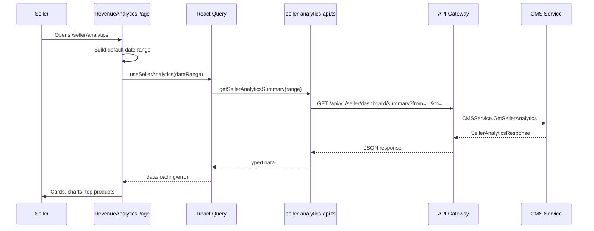
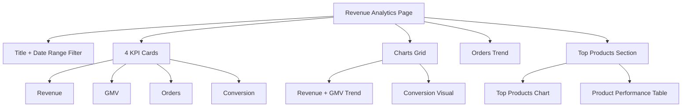

# 📊 Seller Dashboard (CMS) - Task 5: Revenue Analytics


## 📌 Task Summary

| Field | Detail |
|---|---|
| Module | Seller Dashboard (CMS) |
| Task No. | 5 |
| Task Name | Revenue analytics |
| Source | `docs/01-micro-tasks.md` → `Seller Dashboard (CMS)` → Task 5 |
| Requirement | Revenue, GMV, orders, conversion, top products charts banao. |
| Dependency | CMS analytics |
| Priority | P2 |
| Status | Documentation guide ready |

> 🟢 **Simple Hinglish goal:** Is task me seller dashboard ke andar analytics screen banana hai jahan seller revenue, GMV, order count, conversion rate, aur top products ko charts/cards ke form me dekh sake. Ye screen business performance samajhne ke liye hogi, lekin backend aggregation ya new API banana Task 5 frontend guide ke scope me nahi hai.

---

## ✅ Final Output Created

```text
TaskImplementation/
└── Seller Dashboard (CMS)/
    ├── task1.md
    ├── task2.md
    ├── task3.md
    ├── task4.md
    └── task5.md
```

### Why this structure?

- `TaskImplementation/` project ke task-wise implementation guides ka central folder hai.
- `Seller Dashboard (CMS)/` seller dashboard ke docs ko module-wise group karta hai.
- `task5.md` sirf **Seller Dashboard (CMS) - Task 5** ka beginner-friendly implementation guide hai.
- Existing `task1.md` to `task4.md` ko untouched rakha gaya hai.

---

## 🧭 Docs Study Summary

Is guide ko banane se pehle project ke existing docs and previous task guides study kiye gaye:

| Document | Kya samjha |
|---|---|
| `docs/01-micro-tasks.md` | Task 5 ka exact scope: revenue, GMV, orders, conversion, top products charts |
| `docs/03-folder-structure.md` | `frontend/seller-dashboard/src/features/analytics/pages/revenue-analytics-page.tsx` recommended hai |
| `docs/04-microservice-design.md` | CMS Service seller dashboard metrics expose karega via `GetSellerAnalytics` |
| `docs/05-database-design.md` | Analytics raw tables scan nahi karega; aggregates/read models use karne chahiye |
| `docs/09-cms-superadmin.md` | Seller analytics metrics: revenue, orders, average order value, conversion rate, refund rate, top products, low stock, coupon usage |
| `docs/10-frontend-implementation.md` | Seller dashboard quiet, dense, operational UI hona chahiye, charts readable hone chahiye |
| `api/master-api.json` | `GET /api/v1/seller/dashboard/summary` available hai |
| `TaskImplementation/Seller Dashboard (CMS)/task1.md` | Protected dashboard shell and seller context reuse karna hai |
| `TaskImplementation/Seller Dashboard (CMS)/task2.md` | Product manager already documented hai, analytics top products usse coexist karega |
| `TaskImplementation/Seller Dashboard (CMS)/task3.md` | Order manager already documented hai, order metrics analytics me read-only honge |
| `TaskImplementation/Seller Dashboard (CMS)/task4.md` | Offers module already documented hai, coupon usage advanced analytics future backend data par depend karega |

---

## 🟣 Task 5 Scope

### Included in Task 5

| Area | Included? | Explanation |
|---|---:|---|
| Analytics route | ✅ | `/seller/analytics` route dashboard shell ke andar active hoga |
| Date range filter | ✅ | Last 7 days, 30 days, 90 days, custom range |
| Revenue card | ✅ | Seller revenue money value show karna |
| GMV card | ✅ | Backend data available ho to GMV show karna, warna unavailable state |
| Orders card | ✅ | Total seller orders count show karna |
| Conversion card | ✅ | Conversion rate percentage show karna |
| Revenue/GMV chart | ✅ | Time-series available ho to line/bar chart render karna |
| Orders chart | ✅ | Period-wise orders trend render karna, data unavailable ho to empty state |
| Conversion chart | ✅ | Conversion trend or compact gauge style visual |
| Top products chart/table | ✅ | Best performing products ko chart + table me show karna |
| Loading/error/empty states | ✅ | Seller ko blank page nahi milna chahiye |
| Seller auth guard reuse | ✅ | Task 1 ka `RequireSeller` route guard reuse hoga |

### Not Included in Task 5

| Future/Other Task | Not Included Feature |
|---|---|
| Backend work | New CMS analytics aggregation API, DB migrations, scheduled jobs |
| Session Analytics Dashboard | Live sessions, funnels, heatmaps, cohorts |
| Task 6 | Team invite, staff roles, access control UI |
| Task 7 | Seller audit activity timeline |
| Task 8 | Full cross-module error state polish |
| Superadmin panel | Platform-wide seller analytics or admin finance dashboards |
| Payment operations | Refund approval, reconciliation, payment manual review |
| Fake/demo analytics | Random chart data generate karke real metrics jaisa show nahi karna |

> 🔴 **Important API boundary:** Current `api/master-api.json` me `SellerAnalyticsResponse` only `revenue`, `orders`, `conversion_rate`, and `top_products` define karta hai. GMV, revenue trend series, orders trend, refund rate, coupon usage fields explicitly defined nahi hain. Task 5 UI optional fields support karega, but missing backend data ko fake nahi karega.

---

## 🧱 Clean Folder Structure

### Documentation folder

```text
TaskImplementation/
└── Seller Dashboard (CMS)/
    ├── task1.md
    ├── task2.md
    ├── task3.md
    ├── task4.md
    └── task5.md
```

### Intended frontend implementation structure

```text
frontend/
└── seller-dashboard/
    └── src/
        ├── routes/
        │   └── seller-routes.tsx
        ├── features/
        │   └── analytics/
        │       ├── pages/
        │       │   └── revenue-analytics-page.tsx
        │       ├── components/
        │       │   ├── analytics-header.tsx
        │       │   ├── date-range-filter.tsx
        │       │   ├── metric-card.tsx
        │       │   ├── metrics-grid.tsx
        │       │   ├── revenue-gmv-chart.tsx
        │       │   ├── orders-chart.tsx
        │       │   ├── conversion-chart.tsx
        │       │   ├── top-products-chart.tsx
        │       │   ├── top-products-table.tsx
        │       │   ├── analytics-empty-state.tsx
        │       │   └── analytics-error-state.tsx
        │       ├── api/
        │       │   └── seller-analytics-api.ts
        │       ├── hooks/
        │       │   └── use-seller-analytics.ts
        │       ├── utils/
        │       │   ├── analytics-adapter.ts
        │       │   ├── analytics-formatters.ts
        │       │   ├── analytics-date-range.ts
        │       │   └── analytics-chart-data.ts
        │       └── types.ts
        ├── components/
        │   └── ui/
        │       ├── button.tsx
        │       ├── select.tsx
        │       ├── date-input.tsx
        │       ├── skeleton.tsx
        │       └── status-badge.tsx
        ├── stores/
        │   └── seller-store.ts
        └── lib/
            └── http.ts
```

### Folder responsibility

| Folder/File | Responsibility |
|---|---|
| `pages/` | Route-level analytics screen |
| `components/` | Cards, filters, charts, table, empty/error states |
| `api/` | CMS analytics REST endpoint ko typed function me wrap karna |
| `hooks/` | React Query hook for summary data |
| `utils/` | API adapter, money/date formatting, chart data normalization |
| `types.ts` | Analytics response, metrics, top product, date range types |
| `routes/seller-routes.tsx` | `/seller/analytics` route activate karna |

---

## 🧩 External Libraries / Tools Used

> Note: Is documentation task me koi package install nahi kiya gaya. Actual frontend implementation karte time ye libraries use hongi.

| Library/Tool | What it is | Why used | Install |
|---|---|---|---|
| React | UI library | Analytics page, cards, charts wrapper components banane ke liye | React setup dependency me already |
| TypeScript | Typed JavaScript | API response and chart props safe rakhne ke liye | React setup dependency me already |
| React Router | Client routing | `/seller/analytics` route activate karne ke liye | `pnpm add react-router-dom` |
| React Query | Server state cache | Analytics summary fetch, cache, refetch on date range change | `pnpm add @tanstack/react-query` |
| Zustand | Lightweight store | Active seller context Task 1 se reuse karne ke liye | `pnpm add zustand` |
| Tailwind CSS | Utility-first CSS | Dense dashboard layout, cards, grid, status states | `pnpm add -D tailwindcss postcss autoprefixer` |
| Lucide React | Icon set | Revenue, chart, orders, conversion icons | `pnpm add lucide-react` |
| Recharts | React chart library | Line, bar, area, responsive charts quickly build karne ke liye | `pnpm add recharts` |
| date-fns | Date utility library | Date range presets, formatting, ISO range build karne ke liye | `pnpm add date-fns` |
| clsx | Class helper | Conditional card colors/states clean rakhne ke liye | `pnpm add clsx` |
| Vitest + Testing Library | Test tools | Utils, cards, page states, route behavior test karne ke liye | `pnpm add -D vitest @testing-library/react @testing-library/user-event` |
| MSW | API mocking | `GET /api/v1/seller/dashboard/summary` mock karke integration tests | `pnpm add -D msw` |

### Install command

```bash
pnpm add react-router-dom @tanstack/react-query zustand lucide-react recharts date-fns clsx
pnpm add -D tailwindcss postcss autoprefixer vitest @testing-library/react @testing-library/user-event msw
```

### Why Recharts?

- React ke saath directly component style me work karta hai.
- `ResponsiveContainer` dashboard cards me charts ko auto-fit karta hai.
- Line, bar, area, tooltip, legend jaise analytics basics built-in milte hain.
- Task 5 ke liye heavy custom chart engine ki zarurat nahi hai.

---

## 🗺️ Architecture Diagram

```mermaid
flowchart TD
    Seller[Seller User] --> Browser[Seller Dashboard React]
    Browser --> Guard[RequireSeller from Task 1]
    Guard --> Route[/seller/analytics Route]
    Route --> Page[RevenueAnalyticsPage]
    Page --> Filter[DateRangeFilter]
    Page --> Cards[Metric Cards]
    Page --> Charts[Revenue, GMV, Orders, Conversion Charts]
    Page --> TopProducts[Top Products Chart and Table]
    Filter --> Query[React Query]
    Query --> API[Seller Analytics API Client]
    API --> Gateway[API Gateway]
    Gateway --> CMS[CMS Service: GetSellerAnalytics]
    CMS --> ReadModel[(Analytics Aggregates / Read Model)]
    Orders[Order Events] --> ReadModel
    Payments[Payment Events] --> ReadModel
    Products[Product Events] --> ReadModel
    Sessions[Session Events] --> ReadModel
```

### Explanation

- Seller `/seller/analytics` open karta hai.
- `RequireSeller` verify karta hai ki user active seller hai.
- Page date range ke basis par CMS analytics summary fetch karta hai.
- CMS Service ideally pre-aggregated/read model se metrics return karega.
- Frontend charts data render karega, lekin backend missing fields fake nahi karega.

---

## 🔁 Analytics Data Flow



---

## 📡 CMS API Used

| Purpose | Method | Endpoint | Auth | Source |
|---|---|---|---|---|
| Seller analytics summary | `GET` | `/api/v1/seller/dashboard/summary` | seller | `api/master-api.json` |

### Request schema

`api/master-api.json` is endpoint ke liye `DateRangeRequest` mention karta hai. Frontend query params ka clean format ye rakh sakta hai:

```text
GET /api/v1/seller/dashboard/summary?from=2026-05-01T00:00:00.000Z&to=2026-06-01T23:59:59.999Z
```

### Current response schema

```json
{
  "revenue": {
    "amount": 125000,
    "currency": "INR"
  },
  "orders": 84,
  "conversion_rate": 3.4,
  "top_products": []
}
```

### API limitation handling

| Metric/UI | Current API support | Frontend behavior |
|---|---:|---|
| Revenue total | ✅ | Show card |
| Orders total | ✅ | Show card |
| Conversion rate | ✅ | Show card/gauge |
| Top products | ✅ loose object array | Normalize safely and show chart/table |
| GMV | ⚠️ not explicit | Show if optional `gmv` exists, otherwise unavailable state |
| Revenue trend | ⚠️ not explicit | Show chart only if optional `series` exists |
| Orders trend | ⚠️ not explicit | Show chart only if optional `series` exists |
| Conversion trend | ⚠️ not explicit | Show chart only if optional `series` exists |
| Refund rate | ⚠️ not Task 5 core | Keep out or show only if backend adds it later |
| Coupon usage | ⚠️ Task 4 related | Do not include as core Task 5 chart unless API returns it |

> 🟡 **Rule:** Analytics UI me "No data available for selected range" or "Metric not available yet" dikhana allowed hai. Fake random chart points dikhana allowed nahi hai.

---

## 🪜 Step-by-Step Implementation

## Step 1: Analytics route activate karo

Task 1 me `/seller/analytics` placeholder tha. Task 5 me us route ko real page se replace karna hai.

### Code example: `routes/seller-routes.tsx`

```tsx
import { RouteObject } from "react-router-dom";
import { DashboardLayout } from "../layout/dashboard-layout";
import { RequireSeller } from "./require-seller";
import { DashboardHomePage } from "../pages/dashboard-home-page";
import { ProductListPage } from "../features/products/pages/product-list-page";
import { ProductEditorPage } from "../features/products/pages/product-editor-page";
import { OrderListPage } from "../features/orders/pages/order-list-page";
import { OrderDetailPage } from "../features/orders/pages/order-detail-page";
import { OffersPage } from "../features/offers/pages/offers-page";
import { CouponEditorPage } from "../features/offers/pages/coupon-editor-page";
import { CampaignCreatePage } from "../features/offers/pages/campaign-create-page";
import { RevenueAnalyticsPage } from "../features/analytics/pages/revenue-analytics-page";

export const sellerRoutes: RouteObject[] = [
  {
    path: "/seller",
    element: (
      <RequireSeller>
        <DashboardLayout />
      </RequireSeller>
    ),
    children: [
      { index: true, element: <DashboardHomePage /> },
      { path: "products", element: <ProductListPage /> },
      { path: "products/new", element: <ProductEditorPage mode="create" /> },
      { path: "products/:productId/edit", element: <ProductEditorPage mode="edit" /> },
      { path: "orders", element: <OrderListPage /> },
      { path: "orders/:orderId", element: <OrderDetailPage /> },
      { path: "offers", element: <OffersPage /> },
      { path: "offers/coupons/new", element: <CouponEditorPage mode="create" /> },
      { path: "offers/coupons/:couponId/edit", element: <CouponEditorPage mode="edit" /> },
      { path: "offers/campaigns/new", element: <CampaignCreatePage /> },
      { path: "analytics", element: <RevenueAnalyticsPage /> },
    ],
  },
];
```

### Explanation

- `/seller/analytics` ab actual analytics page render karega.
- Task 1 ka `RequireSeller` still parent guard hai.
- Task 2, Task 3, Task 4 routes untouched rehne chahiye.
- Team and audit routes Task 6 and Task 7 ke liye future scope me rahenge.

---

## Step 2: Analytics types define karo

Analytics response ka current schema small hai, but frontend ko future optional fields ke liye ready rakhna useful hai.

### Code example: `features/analytics/types.ts`

```ts
export type Money = {
  amount: number;
  currency: string;
};

export type AnalyticsDateRange = {
  from: string;
  to: string;
  preset: "7d" | "30d" | "90d" | "custom";
};

export type AnalyticsSeriesPoint = {
  date: string;
  revenue?: Money;
  gmv?: Money;
  orders?: number;
  conversion_rate?: number;
};

export type TopProduct = {
  product_id: string;
  name: string;
  sku?: string;
  revenue?: Money;
  gmv?: Money;
  orders?: number;
  units_sold?: number;
  conversion_rate?: number;
};

export type SellerAnalyticsResponse = {
  revenue?: Money;
  gmv?: Money;
  orders?: number;
  conversion_rate?: number;
  top_products?: unknown[];
  series?: AnalyticsSeriesPoint[];
};

export type NormalizedSellerAnalytics = {
  revenue: Money | null;
  gmv: Money | null;
  orders: number | null;
  conversionRate: number | null;
  topProducts: TopProduct[];
  series: AnalyticsSeriesPoint[];
};
```

### Explanation

- `SellerAnalyticsResponse` backend ka raw contract represent karta hai.
- `NormalizedSellerAnalytics` UI-friendly format hai.
- `top_products` current API me generic object array hai, isliye raw type `unknown[]` rakha gaya.
- Optional fields future backend expansion ko support karte hain without frontend crash.

---

## Step 3: API client banao

API client ka kaam endpoint ko typed function me wrap karna hai.

### Code example: `features/analytics/api/seller-analytics-api.ts`

```ts
import { http } from "../../../lib/http";
import { AnalyticsDateRange, SellerAnalyticsResponse } from "../types";

function buildAnalyticsQuery(range: AnalyticsDateRange) {
  const params = new URLSearchParams();
  params.set("from", range.from);
  params.set("to", range.to);
  return params.toString();
}

export async function getSellerAnalyticsSummary(
  range: AnalyticsDateRange,
): Promise<SellerAnalyticsResponse> {
  const query = buildAnalyticsQuery(range);
  return http<SellerAnalyticsResponse>(
    `/api/v1/seller/dashboard/summary?${query}`,
  );
}
```

### Explanation

- Query params `from` and `to` ISO format me bheje jate hain.
- API auth seller token/session se handle hota hai.
- Browser se trusted `seller_id` blindly send nahi karna. Agar multi-seller support me header use hota hai, backend must validate ownership.

---

## Step 4: Date range utility banao

Analytics screens me date range core filter hota hai. Default range simple and predictable honi chahiye.

### Code example: `features/analytics/utils/analytics-date-range.ts`

```ts
import { endOfDay, formatISO, startOfDay, subDays } from "date-fns";
import { AnalyticsDateRange } from "../types";

export function createPresetRange(
  preset: AnalyticsDateRange["preset"],
): AnalyticsDateRange {
  const today = new Date();

  if (preset === "7d") {
    return {
      preset,
      from: formatISO(startOfDay(subDays(today, 6))),
      to: formatISO(endOfDay(today)),
    };
  }

  if (preset === "90d") {
    return {
      preset,
      from: formatISO(startOfDay(subDays(today, 89))),
      to: formatISO(endOfDay(today)),
    };
  }

  return {
    preset: "30d",
    from: formatISO(startOfDay(subDays(today, 29))),
    to: formatISO(endOfDay(today)),
  };
}
```

### Explanation

- Default `30d` dashboard analytics ke liye practical hai.
- Last 7 days short-term performance dikhata hai.
- Last 90 days trend view ke liye helpful hai.
- `custom` range UI se set hoga.

---

## Step 5: API response adapter banao

Top products loose object array hai, so UI ko crash-proof adapter chahiye.

### Code example: `features/analytics/utils/analytics-adapter.ts`

```ts
import {
  Money,
  NormalizedSellerAnalytics,
  SellerAnalyticsResponse,
  TopProduct,
} from "../types";

function isMoney(value: unknown): value is Money {
  return (
    typeof value === "object" &&
    value !== null &&
    typeof (value as Money).amount === "number" &&
    typeof (value as Money).currency === "string"
  );
}

function normalizeTopProduct(value: unknown): TopProduct | null {
  if (typeof value !== "object" || value === null) {
    return null;
  }

  const record = value as Record<string, unknown>;
  const productId = record.product_id ?? record.id;
  const name = record.name ?? record.product_name;

  if (typeof productId !== "string" || typeof name !== "string") {
    return null;
  }

  return {
    product_id: productId,
    name,
    sku: typeof record.sku === "string" ? record.sku : undefined,
    revenue: isMoney(record.revenue) ? record.revenue : undefined,
    gmv: isMoney(record.gmv) ? record.gmv : undefined,
    orders: typeof record.orders === "number" ? record.orders : undefined,
    units_sold:
      typeof record.units_sold === "number" ? record.units_sold : undefined,
    conversion_rate:
      typeof record.conversion_rate === "number"
        ? record.conversion_rate
        : undefined,
  };
}

export function normalizeSellerAnalytics(
  response: SellerAnalyticsResponse,
): NormalizedSellerAnalytics {
  return {
    revenue: isMoney(response.revenue) ? response.revenue : null,
    gmv: isMoney(response.gmv) ? response.gmv : null,
    orders: typeof response.orders === "number" ? response.orders : null,
    conversionRate:
      typeof response.conversion_rate === "number"
        ? response.conversion_rate
        : null,
    topProducts: (response.top_products ?? [])
      .map(normalizeTopProduct)
      .filter((product): product is TopProduct => product !== null),
    series: Array.isArray(response.series) ? response.series : [],
  };
}
```

### Explanation

- Adapter UI ko backend response changes se protect karta hai.
- Invalid top product rows quietly skip ho jate hain.
- Missing GMV/trend fields `null` or empty array ban jate hain.
- Isse frontend fake values create nahi karta.

---

## Step 6: React Query hook banao

Analytics data date range par depend karta hai, so query key me range include karna zaruri hai.

### Code example: `features/analytics/hooks/use-seller-analytics.ts`

```ts
import { useQuery } from "@tanstack/react-query";
import { getSellerAnalyticsSummary } from "../api/seller-analytics-api";
import { AnalyticsDateRange } from "../types";
import { normalizeSellerAnalytics } from "../utils/analytics-adapter";

export function useSellerAnalytics(range: AnalyticsDateRange) {
  return useQuery({
    queryKey: ["seller-analytics", range.from, range.to],
    queryFn: async () => {
      const response = await getSellerAnalyticsSummary(range);
      return normalizeSellerAnalytics(response);
    },
    staleTime: 60_000,
  });
}
```

### Explanation

- Date range change hote hi new query fire hogi.
- `staleTime` 1 minute rakha gaya hai, kyunki analytics near-real-time hona zaruri nahi.
- Normalized data components ko simple props ke form me milta hai.

---

## Step 7: Money and percentage formatters banao

Analytics UI me raw paise/cents/amount ko readable format me dikhana important hai.

### Code example: `features/analytics/utils/analytics-formatters.ts`

```ts
import { Money } from "../types";

export function formatMoney(value: Money | null) {
  if (!value) {
    return "Not available";
  }

  return new Intl.NumberFormat("en-IN", {
    style: "currency",
    currency: value.currency,
    maximumFractionDigits: 0,
  }).format(value.amount / 100);
}

export function formatNumber(value: number | null) {
  if (value === null) {
    return "Not available";
  }

  return new Intl.NumberFormat("en-IN").format(value);
}

export function formatPercentage(value: number | null) {
  if (value === null) {
    return "Not available";
  }

  return `${value.toFixed(2)}%`;
}
```

### Explanation

- Money usually minor unit me hota hai, jaise paise/cents. Isliye `amount / 100`.
- Agar backend major unit return karta hai to team ko contract fix karna chahiye, formatter guess nahi karega.
- `Not available` missing backend metric ke liye clear message hai.

---

## Step 8: Date range filter component banao

Seller ko quickly period switch karna chahiye.

### Code example: `features/analytics/components/date-range-filter.tsx`

```tsx
import { AnalyticsDateRange } from "../types";
import { createPresetRange } from "../utils/analytics-date-range";

type DateRangeFilterProps = {
  value: AnalyticsDateRange;
  onChange: (range: AnalyticsDateRange) => void;
};

const presets: Array<{ label: string; value: AnalyticsDateRange["preset"] }> = [
  { label: "7D", value: "7d" },
  { label: "30D", value: "30d" },
  { label: "90D", value: "90d" },
];

export function DateRangeFilter({ value, onChange }: DateRangeFilterProps) {
  return (
    <div className="flex flex-wrap items-center gap-2">
      {presets.map((preset) => (
        <button
          key={preset.value}
          type="button"
          className={
            value.preset === preset.value
              ? "rounded-md bg-slate-900 px-3 py-2 text-sm text-white"
              : "rounded-md border border-slate-200 px-3 py-2 text-sm text-slate-700 hover:bg-slate-50"
          }
          onClick={() => onChange(createPresetRange(preset.value))}
        >
          {preset.label}
        </button>
      ))}
    </div>
  );
}
```

### Explanation

- Preset buttons compact dashboard UI ke liye best hain.
- Custom date picker later add ho sakta hai, but Task 5 ke liye presets enough hain.
- `onChange` parent page ko new range deta hai.

---

## Step 9: Metric card component banao

Revenue, GMV, orders, conversion ke liye reusable card rakho.

### Code example: `features/analytics/components/metric-card.tsx`

```tsx
import { LucideIcon } from "lucide-react";

type MetricCardProps = {
  label: string;
  value: string;
  helper?: string;
  icon: LucideIcon;
  unavailable?: boolean;
};

export function MetricCard({
  label,
  value,
  helper,
  icon: Icon,
  unavailable,
}: MetricCardProps) {
  return (
    <section className="rounded-lg border border-slate-200 bg-white p-4">
      <div className="flex items-start justify-between gap-3">
        <div>
          <p className="text-sm font-medium text-slate-500">{label}</p>
          <p
            className={
              unavailable
                ? "mt-2 text-xl font-semibold text-slate-400"
                : "mt-2 text-2xl font-semibold text-slate-950"
            }
          >
            {value}
          </p>
        </div>
        <span className="rounded-md bg-slate-100 p-2 text-slate-700">
          <Icon className="h-5 w-5" />
        </span>
      </div>
      {helper ? <p className="mt-3 text-xs text-slate-500">{helper}</p> : null}
    </section>
  );
}
```

### Explanation

- Same component all KPI cards ko consistent rakhta hai.
- `unavailable` missing backend metric ko visually muted dikhata hai.
- Card radius 8px ke under hai, existing dashboard style ke compatible.

---

## Step 10: Metrics grid banao

Task 5 ke core metrics ek row/grid me show karne hain.

### Code example: `features/analytics/components/metrics-grid.tsx`

```tsx
import { BarChart3, CircleDollarSign, PackageCheck, TrendingUp } from "lucide-react";
import { NormalizedSellerAnalytics } from "../types";
import {
  formatMoney,
  formatNumber,
  formatPercentage,
} from "../utils/analytics-formatters";
import { MetricCard } from "./metric-card";

type MetricsGridProps = {
  analytics: NormalizedSellerAnalytics;
};

export function MetricsGrid({ analytics }: MetricsGridProps) {
  return (
    <div className="grid gap-4 md:grid-cols-2 xl:grid-cols-4">
      <MetricCard
        label="Revenue"
        value={formatMoney(analytics.revenue)}
        helper="Paid seller revenue for selected range"
        icon={CircleDollarSign}
        unavailable={!analytics.revenue}
      />
      <MetricCard
        label="GMV"
        value={formatMoney(analytics.gmv)}
        helper="Gross merchandise value if backend provides it"
        icon={TrendingUp}
        unavailable={!analytics.gmv}
      />
      <MetricCard
        label="Orders"
        value={formatNumber(analytics.orders)}
        helper="Seller orders in selected range"
        icon={PackageCheck}
        unavailable={analytics.orders === null}
      />
      <MetricCard
        label="Conversion"
        value={formatPercentage(analytics.conversionRate)}
        helper="Session to order conversion if available"
        icon={BarChart3}
        unavailable={analytics.conversionRate === null}
      />
    </div>
  );
}
```

### Explanation

- Revenue, GMV, Orders, Conversion exactly Task 5 metrics hain.
- GMV backend schema me absent ho sakta hai, isliye card hidden nahi, clear unavailable state me rahega.
- Seller ko pata chalega ki feature planned hai but data source abhi available nahi.

---

## Step 11: Revenue and GMV chart banao

Revenue/GMV trend ke liye chart tabhi render karo jab series data available ho.

### Code example: `features/analytics/components/revenue-gmv-chart.tsx`

```tsx
import {
  CartesianGrid,
  Legend,
  Line,
  LineChart,
  ResponsiveContainer,
  Tooltip,
  XAxis,
  YAxis,
} from "recharts";
import { AnalyticsSeriesPoint } from "../types";

type RevenueGmvChartProps = {
  series: AnalyticsSeriesPoint[];
};

function toChartRows(series: AnalyticsSeriesPoint[]) {
  return series.map((point) => ({
    date: point.date,
    revenue: point.revenue ? point.revenue.amount / 100 : null,
    gmv: point.gmv ? point.gmv.amount / 100 : null,
  }));
}

export function RevenueGmvChart({ series }: RevenueGmvChartProps) {
  const rows = toChartRows(series);

  if (rows.length === 0) {
    return (
      <section className="rounded-lg border border-dashed border-slate-300 bg-white p-6">
        <h2 className="text-base font-semibold text-slate-950">
          Revenue and GMV trend
        </h2>
        <p className="mt-2 text-sm text-slate-500">
          Trend data backend se available nahi hai. Summary cards above current
          range ke totals show kar rahe hain.
        </p>
      </section>
    );
  }

  return (
    <section className="rounded-lg border border-slate-200 bg-white p-4">
      <h2 className="text-base font-semibold text-slate-950">
        Revenue and GMV trend
      </h2>
      <div className="mt-4 h-72">
        <ResponsiveContainer width="100%" height="100%">
          <LineChart data={rows}>
            <CartesianGrid strokeDasharray="3 3" />
            <XAxis dataKey="date" />
            <YAxis />
            <Tooltip />
            <Legend />
            <Line
              type="monotone"
              dataKey="revenue"
              stroke="#0f172a"
              strokeWidth={2}
              dot={false}
            />
            <Line
              type="monotone"
              dataKey="gmv"
              stroke="#2563eb"
              strokeWidth={2}
              dot={false}
            />
          </LineChart>
        </ResponsiveContainer>
      </div>
    </section>
  );
}
```

### Explanation

- Chart only real `series` data par render hota hai.
- Missing trend data ko dashed empty state me explain kiya gaya.
- `ResponsiveContainer` mobile/desktop width adapt karta hai.

---

## Step 12: Orders chart banao

Orders metric trend available ho to bar chart useful hota hai.

### Code example: `features/analytics/components/orders-chart.tsx`

```tsx
import {
  Bar,
  BarChart,
  CartesianGrid,
  ResponsiveContainer,
  Tooltip,
  XAxis,
  YAxis,
} from "recharts";
import { AnalyticsSeriesPoint } from "../types";

type OrdersChartProps = {
  series: AnalyticsSeriesPoint[];
};

export function OrdersChart({ series }: OrdersChartProps) {
  const rows = series
    .filter((point) => typeof point.orders === "number")
    .map((point) => ({
      date: point.date,
      orders: point.orders,
    }));

  if (rows.length === 0) {
    return (
      <section className="rounded-lg border border-dashed border-slate-300 bg-white p-6">
        <h2 className="text-base font-semibold text-slate-950">Orders trend</h2>
        <p className="mt-2 text-sm text-slate-500">
          Orders trend points API response me available nahi hain.
        </p>
      </section>
    );
  }

  return (
    <section className="rounded-lg border border-slate-200 bg-white p-4">
      <h2 className="text-base font-semibold text-slate-950">Orders trend</h2>
      <div className="mt-4 h-64">
        <ResponsiveContainer width="100%" height="100%">
          <BarChart data={rows}>
            <CartesianGrid strokeDasharray="3 3" />
            <XAxis dataKey="date" />
            <YAxis />
            <Tooltip />
            <Bar dataKey="orders" fill="#16a34a" radius={[4, 4, 0, 0]} />
          </BarChart>
        </ResponsiveContainer>
      </div>
    </section>
  );
}
```

### Explanation

- Orders count discrete metric hai, bar chart readable hota hai.
- API me total orders available hai, but trend absent ho sakta hai.
- Trend absent ho to page still useful rahega because cards render honge.

---

## Step 13: Conversion visual banao

Current conversion total available ho to compact progress/gauge style visual enough hai.

### Code example: `features/analytics/components/conversion-chart.tsx`

```tsx
import { formatPercentage } from "../utils/analytics-formatters";

type ConversionChartProps = {
  conversionRate: number | null;
};

export function ConversionChart({ conversionRate }: ConversionChartProps) {
  const safeRate = Math.max(0, Math.min(conversionRate ?? 0, 100));

  return (
    <section className="rounded-lg border border-slate-200 bg-white p-4">
      <h2 className="text-base font-semibold text-slate-950">
        Conversion rate
      </h2>
      <div className="mt-4">
        <div className="flex items-end justify-between gap-4">
          <p className="text-3xl font-semibold text-slate-950">
            {formatPercentage(conversionRate)}
          </p>
          <p className="text-xs text-slate-500">Selected range</p>
        </div>
        <div className="mt-4 h-3 rounded-full bg-slate-100">
          <div
            className="h-3 rounded-full bg-blue-600"
            style={{ width: `${safeRate}%` }}
          />
        </div>
      </div>
    </section>
  );
}
```

### Explanation

- Conversion rate ek percentage KPI hai, compact gauge enough hai.
- Agar trend data future me aaye to Recharts line chart add kar sakte hain.
- `Math.min` UI overflow prevent karta hai.

---

## Step 14: Top products chart banao

Top products seller ke liye actionable insight hota hai.

### Code example: `features/analytics/components/top-products-chart.tsx`

```tsx
import {
  Bar,
  BarChart,
  CartesianGrid,
  ResponsiveContainer,
  Tooltip,
  XAxis,
  YAxis,
} from "recharts";
import { TopProduct } from "../types";

type TopProductsChartProps = {
  products: TopProduct[];
};

export function TopProductsChart({ products }: TopProductsChartProps) {
  const rows = products.slice(0, 8).map((product) => ({
    name: product.name,
    revenue: product.revenue ? product.revenue.amount / 100 : 0,
    orders: product.orders ?? 0,
  }));

  if (rows.length === 0) {
    return (
      <section className="rounded-lg border border-dashed border-slate-300 bg-white p-6">
        <h2 className="text-base font-semibold text-slate-950">
          Top products
        </h2>
        <p className="mt-2 text-sm text-slate-500">
          Selected range me top product data available nahi hai.
        </p>
      </section>
    );
  }

  return (
    <section className="rounded-lg border border-slate-200 bg-white p-4">
      <h2 className="text-base font-semibold text-slate-950">
        Top products by revenue
      </h2>
      <div className="mt-4 h-72">
        <ResponsiveContainer width="100%" height="100%">
          <BarChart data={rows} layout="vertical">
            <CartesianGrid strokeDasharray="3 3" />
            <XAxis type="number" />
            <YAxis dataKey="name" type="category" width={120} />
            <Tooltip />
            <Bar dataKey="revenue" fill="#7c3aed" radius={[0, 4, 4, 0]} />
          </BarChart>
        </ResponsiveContainer>
      </div>
    </section>
  );
}
```

### Explanation

- Top 8 products chart me enough hain, warna chart crowded ho jayega.
- Table me full top products list show kar sakte hain.
- Revenue absent ho to bars zero honge, but table still orders/units show kar sakti hai.

---

## Step 15: Top products table banao

Chart quick comparison deta hai, table exact numbers deta hai.

### Code example: `features/analytics/components/top-products-table.tsx`

```tsx
import { TopProduct } from "../types";
import {
  formatMoney,
  formatNumber,
  formatPercentage,
} from "../utils/analytics-formatters";

type TopProductsTableProps = {
  products: TopProduct[];
};

export function TopProductsTable({ products }: TopProductsTableProps) {
  if (products.length === 0) {
    return null;
  }

  return (
    <section className="rounded-lg border border-slate-200 bg-white">
      <div className="border-b border-slate-200 p-4">
        <h2 className="text-base font-semibold text-slate-950">
          Product performance
        </h2>
      </div>
      <div className="overflow-x-auto">
        <table className="min-w-full divide-y divide-slate-200 text-sm">
          <thead className="bg-slate-50">
            <tr>
              <th className="px-4 py-3 text-left font-medium text-slate-500">
                Product
              </th>
              <th className="px-4 py-3 text-right font-medium text-slate-500">
                Revenue
              </th>
              <th className="px-4 py-3 text-right font-medium text-slate-500">
                Orders
              </th>
              <th className="px-4 py-3 text-right font-medium text-slate-500">
                Units
              </th>
              <th className="px-4 py-3 text-right font-medium text-slate-500">
                Conversion
              </th>
            </tr>
          </thead>
          <tbody className="divide-y divide-slate-100">
            {products.map((product) => (
              <tr key={product.product_id}>
                <td className="px-4 py-3">
                  <p className="font-medium text-slate-950">{product.name}</p>
                  {product.sku ? (
                    <p className="text-xs text-slate-500">SKU: {product.sku}</p>
                  ) : null}
                </td>
                <td className="px-4 py-3 text-right text-slate-700">
                  {formatMoney(product.revenue ?? null)}
                </td>
                <td className="px-4 py-3 text-right text-slate-700">
                  {formatNumber(product.orders ?? null)}
                </td>
                <td className="px-4 py-3 text-right text-slate-700">
                  {formatNumber(product.units_sold ?? null)}
                </td>
                <td className="px-4 py-3 text-right text-slate-700">
                  {formatPercentage(product.conversion_rate ?? null)}
                </td>
              </tr>
            ))}
          </tbody>
        </table>
      </div>
    </section>
  );
}
```

### Explanation

- Seller ko exact product performance numbers readable table me milte hain.
- Product name + SKU operational dashboard ke liye useful hai.
- Missing metrics clear "Not available" se show hote hain.

---

## Step 16: Revenue analytics page compose karo

Ab route page me filters, query, cards, charts, table combine karne hain.

### Code example: `features/analytics/pages/revenue-analytics-page.tsx`

```tsx
import { useState } from "react";
import { DateRangeFilter } from "../components/date-range-filter";
import { MetricsGrid } from "../components/metrics-grid";
import { RevenueGmvChart } from "../components/revenue-gmv-chart";
import { OrdersChart } from "../components/orders-chart";
import { ConversionChart } from "../components/conversion-chart";
import { TopProductsChart } from "../components/top-products-chart";
import { TopProductsTable } from "../components/top-products-table";
import { useSellerAnalytics } from "../hooks/use-seller-analytics";
import { createPresetRange } from "../utils/analytics-date-range";

export function RevenueAnalyticsPage() {
  const [range, setRange] = useState(() => createPresetRange("30d"));
  const analyticsQuery = useSellerAnalytics(range);

  if (analyticsQuery.isLoading) {
    return (
      <div className="space-y-4">
        <div className="h-10 w-64 animate-pulse rounded-md bg-slate-100" />
        <div className="grid gap-4 md:grid-cols-2 xl:grid-cols-4">
          {Array.from({ length: 4 }).map((_, index) => (
            <div
              key={index}
              className="h-32 animate-pulse rounded-lg bg-slate-100"
            />
          ))}
        </div>
      </div>
    );
  }

  if (analyticsQuery.isError) {
    return (
      <section className="rounded-lg border border-red-200 bg-red-50 p-6">
        <h1 className="text-lg font-semibold text-red-950">
          Analytics load nahi ho paya
        </h1>
        <p className="mt-2 text-sm text-red-700">
          Please retry karo. Agar issue continue ho, backend analytics endpoint
          check karna hoga.
        </p>
        <button
          type="button"
          className="mt-4 rounded-md bg-red-700 px-4 py-2 text-sm font-medium text-white"
          onClick={() => analyticsQuery.refetch()}
        >
          Retry
        </button>
      </section>
    );
  }

  const analytics = analyticsQuery.data;

  return (
    <div className="space-y-6">
      <div className="flex flex-col gap-4 md:flex-row md:items-center md:justify-between">
        <div>
          <h1 className="text-xl font-semibold text-slate-950">
            Revenue analytics
          </h1>
          <p className="mt-1 text-sm text-slate-500">
            Revenue, GMV, orders, conversion, and product performance.
          </p>
        </div>
        <DateRangeFilter value={range} onChange={setRange} />
      </div>

      <MetricsGrid analytics={analytics} />

      <div className="grid gap-4 xl:grid-cols-[2fr_1fr]">
        <RevenueGmvChart series={analytics.series} />
        <ConversionChart conversionRate={analytics.conversionRate} />
      </div>

      <OrdersChart series={analytics.series} />

      <div className="grid gap-4 xl:grid-cols-[1fr_1.2fr]">
        <TopProductsChart products={analytics.topProducts} />
        <TopProductsTable products={analytics.topProducts} />
      </div>
    </div>
  );
}
```

### Explanation

- Page ek compact operational analytics layout banata hai.
- Loading state skeleton cards show karta hai.
- Error state retry action deta hai.
- Missing chart series ke liye individual chart components empty state handle karte hain.
- Page backend se unavailable metrics ko fake nahi karta.

---

## Step 17: Navigation update karo

Task 1 sidebar me Analytics link already tha. Task 5 ke baad ye route active page par point karega.

### Code example: `layout/sidebar.tsx`

```tsx
const navItems = [
  { label: "Overview", to: "/seller" },
  { label: "Products", to: "/seller/products" },
  { label: "Orders", to: "/seller/orders" },
  { label: "Offers", to: "/seller/offers" },
  { label: "Analytics", to: "/seller/analytics" },
  { label: "Team", to: "/seller/team" },
  { label: "Audit", to: "/seller/audit" },
];
```

### Explanation

- Analytics link Task 5 me real module ban gaya.
- Team and Audit abhi future routes hain.
- Sidebar style Task 1 jaisa hi rahega.

---

## 🎨 UI Layout Plan



### Visual rules

| Rule | Reason |
|---|---|
| Compact cards | Seller dashboard data-heavy hai |
| No marketing hero | Analytics screen workflow tool hai |
| Clear unavailable state | Missing backend fields confuse nahi karenge |
| Responsive chart heights | Mobile/desktop me overlap avoid hoga |
| Tables with horizontal scroll | Product names and metrics mobile me fit rahenge |

---

## 📊 Metric Definitions

| Metric | Meaning | Data source idea | Frontend rule |
|---|---|---|---|
| Revenue | Paid seller earnings after discounts/refunds rules, depending backend definition | Order + Payment aggregates | API value as-is show karo |
| GMV | Gross merchandise value before deductions | Order item gross totals | API field missing ho to unavailable |
| Orders | Seller orders in selected range | Order aggregates | `orders` total show karo |
| Conversion rate | Sessions/orders or product view/order conversion | Session + Order aggregates | API value as-is show karo |
| Top products | Best performing seller products | Product + Order aggregates | Normalize and show chart/table |

> 🟡 **Business rule:** Frontend metric definitions invent nahi karega. Backend analytics contract final source of truth hai. Frontend sirf labels and display format handle karega.

---

## 🔐 Security & Permissions

| Rule | Why important |
|---|---|
| Use `RequireSeller` | Non-seller users analytics screen access na karein |
| Backend validates seller ownership | Browser-sent seller context spoof ho sakta hai |
| Do not expose other seller metrics | Analytics commercially sensitive data hai |
| Avoid raw PII in top products | Product metrics allowed hain, buyer identity nahi |
| Cache carefully | Shared devices par stale seller analytics leak nahi hona chahiye |
| No fake analytics | Business decisions wrong ho sakte hain |
| Query range validate | Extremely large date range backend ko stress kar sakta hai |

---

## ⚠️ Error, Empty, and Limited-Data States

| State | UI behavior |
|---|---|
| Loading | Skeleton cards and chart placeholders |
| API failed | Error panel with Retry button |
| No orders in date range | Cards show zero if API returns zero, top products empty state |
| GMV missing | GMV card shows `Not available` |
| Trend series missing | Chart section shows dashed empty state |
| Top products malformed | Adapter skips invalid rows |
| Permission denied | Task 1 `RequireSeller` handles it |
| Date range invalid | UI should prevent or show validation message |

### Explanation

- Task 8 later full polish karega, but Task 5 me basic states mandatory hain.
- Seller analytics me silent failure dangerous hai because seller revenue decisions leta hai.
- "Unavailable" and "zero" alag meanings hain. Zero means metric exists and value zero hai. Unavailable means backend ne metric nahi diya.

---

## 🧪 Testing Plan

### Unit tests

| Test | Expected |
|---|---|
| `formatMoney` INR minor units correctly format kare | `₹1,250` style output |
| `formatPercentage` two decimals show kare | `3.40%` |
| `createPresetRange("30d")` valid from/to return kare | Pass |
| `normalizeSellerAnalytics` missing GMV ko null banaye | Pass |
| `normalizeSellerAnalytics` invalid top product rows skip kare | Pass |
| `MetricCard` unavailable state render kare | Muted value |

### Integration tests

| Flow | Expected |
|---|---|
| `/seller/analytics` open with valid seller | Page title and cards visible |
| API returns summary only | Cards visible, trend empty states visible |
| API returns top products | Chart/table render |
| API fails | Error panel and Retry button visible |
| Date preset change | Query refetch with new `from/to` |

### MSW mock example

```ts
import { http, HttpResponse } from "msw";

export const sellerAnalyticsHandlers = [
  http.get("/api/v1/seller/dashboard/summary", () => {
    return HttpResponse.json({
      revenue: { amount: 125000, currency: "INR" },
      orders: 84,
      conversion_rate: 3.4,
      top_products: [
        {
          product_id: "prod_1",
          name: "Cotton Shirt",
          sku: "SHIRT-001",
          revenue: { amount: 52000, currency: "INR" },
          orders: 18,
          units_sold: 23,
          conversion_rate: 4.2,
        },
      ],
    });
  }),
];
```

### E2E checklist

| Scenario | Expected |
|---|---|
| Active seller opens analytics | Analytics page load hota hai |
| Date range switch 7D to 30D | Data refetch hota hai |
| Backend sends no trend data | No crash, empty chart message |
| Backend sends no top products | Empty top products state |
| Unauthorized user opens URL | Permission denied/login redirect |

---

## ✅ Implementation Checklist

| Item | Status |
|---|---:|
| `TaskImplementation/Seller Dashboard (CMS)/task5.md` created | ✅ |
| Task 5 scope documented | ✅ |
| Existing Task 1-4 boundaries respected | ✅ |
| `/seller/analytics` route documented | ✅ |
| CMS analytics API documented | ✅ |
| API limitation documented | ✅ |
| Folder structure documented | ✅ |
| External libraries/tools documented | ✅ |
| Step-by-step implementation documented in Hinglish | ✅ |
| Code examples added | ✅ |
| Mermaid diagrams added | ✅ |
| Testing plan added | ✅ |
| No backend implementation added | ✅ |
| No Task 6/7/8 implementation added | ✅ |

---

## 🧠 Beginner-Friendly Build Order

Agar developer is task ko actual frontend me implement kare, recommended order ye hai:

```mermaid
flowchart LR
    A[Create analytics folder] --> B[Add types]
    B --> C[Add API client]
    C --> D[Add React Query hook]
    D --> E[Add formatters and adapter]
    E --> F[Build metric cards]
    F --> G[Build chart components]
    G --> H[Build top products table]
    H --> I[Compose page]
    I --> J[Activate route]
    J --> K[Add tests]
```



### Explanation

1. Pehle types and API client banao, because data shape clear honi chahiye.
2. Phir React Query hook banao, taaki page data load kar sake.
3. Adapter and formatter banao, taaki UI clean values consume kare.
4. Cards and charts independent components me banao.
5. Last me route activate karo and tests add karo.

---

## 🚫 Do Not Do in Task 5

| Avoid | Reason |
|---|---|
| Backend aggregation service banana | CMS analytics backend separate task hai |
| Random chart data generate karna | Seller ko wrong business signal milega |
| Team permissions UI banana | Task 6 scope |
| Audit timeline banana | Task 7 scope |
| Cross-seller analytics show karna | Security issue |
| Session heatmap/funnel dashboard banana | Session Analytics Dashboard separate module hai |
| Payment refund operations add karna | Superadmin/payment task scope |
| Product/order CRUD modify karna | Task 2 and Task 3 already scoped hain |

---

## 🧾 Final Task 5 Summary

Seller Dashboard (CMS) Task 5 ke liye Revenue Analytics implementation guide ready hai:

- ✅ `/seller/analytics` route documented
- ✅ Revenue, GMV, orders, conversion, top products UI documented
- ✅ CMS analytics API usage documented
- ✅ Recharts-based chart approach explained
- ✅ Missing backend fields ke liye safe unavailable/empty states documented
- ✅ Code examples, folder structure, diagrams, testing plan included
- ✅ Task 6, Task 7, Task 8 scope intentionally untouched

> 🟢 **Task 5 complete:** Seller Dashboard (CMS) ke Revenue Analytics module ka structured Hinglish implementation guide ready hai. Ye guide existing protected seller shell ke andar fit hota hai, Task 2 products, Task 3 orders, and Task 4 offers modules ke saath coexist karta hai, aur backend analytics limitations ko honestly handle karta hai.
