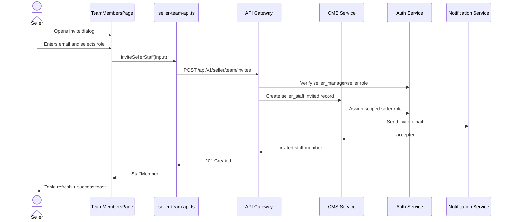
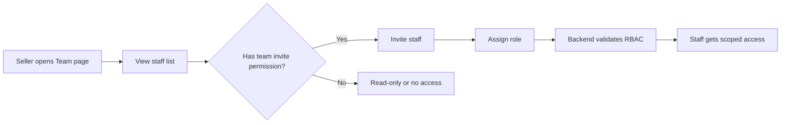

# 👥 Seller Dashboard (CMS) - Task 6: Team Permissions


## 📌 Task Summary

| Field | Detail |
|---|---|
| Module | Seller Dashboard (CMS) |
| Task No. | 6 |
| Task Name | Team permissions |
| Source | `docs/01-micro-tasks.md` → `Seller Dashboard (CMS)` → Task 6 |
| Requirement | Seller staff invite, roles, access control UI banao. |
| Dependency | Auth/CMS |
| Priority | P2 |
| Status | Documentation guide ready |

> 🟢 **Simple Hinglish goal:** Is task me seller dashboard ke andar **Team Management** screen banana hai jahan seller owner/manager staff members ko invite kar sake, unhe role assign kar sake, role update kar sake, aur disabled/invited/active status clearly dekh sake. UI ka focus access control par hoga, lekin backend Auth/CMS endpoints banana is documentation task ke scope me nahi hai.

---

## ✅ Final Output Created

```text
TaskImplementation/
└── Seller Dashboard (CMS)/
    ├── task1.md
    ├── task2.md
    ├── task3.md
    ├── task4.md
    ├── task5.md
    └── task6.md
```

### Why this structure?

- `TaskImplementation/` project ke task-wise implementation guides ka central folder hai.
- `Seller Dashboard (CMS)/` seller dashboard ke docs ko module-wise group karta hai.
- `task6.md` sirf **Seller Dashboard (CMS) - Task 6** ka beginner-friendly implementation guide hai.
- Existing `task1.md` to `task5.md` untouched rahenge.

---

## 🧭 Docs Study Summary

Is guide ko banane se pehle project ke existing docs and previous task guides study kiye gaye:

| Document | Kya samjha |
|---|---|
| `docs/01-micro-tasks.md` | Task 6 ka exact scope: seller staff invite, roles, access control UI |
| `docs/03-folder-structure.md` | Seller dashboard me `features/team/pages/team-members-page.tsx` expected hai |
| `docs/04-microservice-design.md` | CMS Service seller staff permissions own karega |
| `docs/05-database-design.md` | CMS DB me `seller_staff` table hai; one seller has many staff |
| `docs/06-auth-security.md` | RBAC roles include `seller`, `seller_manager`, `seller_catalog_editor`, `seller_order_manager` |
| `docs/09-cms-superadmin.md` | Seller CMS module me Team Management = seller staff roles and permissions |
| `docs/10-frontend-implementation.md` | Seller dashboard quiet, dense, operational UI hona chahiye |
| `database/draw.sql` | `seller_staff` table fields: `staff_id`, `seller_id`, `user_id`, `role`, `status`, `invited_by` |
| `api/master-api.json` | Seller auth roles defined hain, but dedicated seller team REST endpoints abhi listed nahi hain |
| `TaskImplementation/Seller Dashboard (CMS)/task1.md` | Protected dashboard shell, seller switcher, `/seller/team` placeholder reuse karna hai |
| `TaskImplementation/Seller Dashboard (CMS)/task2.md` | Product permissions role matrix me use honge |
| `TaskImplementation/Seller Dashboard (CMS)/task3.md` | Order permissions role matrix me use honge |
| `TaskImplementation/Seller Dashboard (CMS)/task4.md` | Offers/coupon permissions role matrix me use honge |
| `TaskImplementation/Seller Dashboard (CMS)/task5.md` | Analytics route ke baad Team route activate karna hai |

---

## 🟣 Task 6 Scope

### Included in Task 6

| Area | Included? | Explanation |
|---|---:|---|
| Team route | ✅ | `/seller/team` route dashboard shell ke andar active hoga |
| Staff list | ✅ | Seller ke team members table me show honge |
| Invite staff UI | ✅ | Email + role select ke saath invite modal/form |
| Role matrix | ✅ | Roles ke allowed modules clear table me dikhenge |
| Role update UI | ✅ | Allowed actor staff role change kar sakega |
| Disable staff UI | ✅ | Active staff ko disable karne ka action |
| Resend invite UI | ✅ | Invited user ke liye resend invite action |
| Status badges | ✅ | `invited`, `active`, `disabled` states readable badges me |
| Access control helper | ✅ | Frontend me permissions ke basis par buttons/routes hide/disable |
| Loading/error/empty states | ✅ | Page blank nahi rahega |
| Seller auth guard reuse | ✅ | Task 1 ka `RequireSeller` route guard reuse hoga |

### Not Included in Task 6

| Future/Other Task | Not Included Feature |
|---|---|
| Backend implementation | New CMS/Auth APIs, DB migrations, mail invite worker |
| Auth Service internals | Real `AssignRole`, `RevokeRole`, invite token lifecycle |
| Notification Service | Actual email/SMS invite delivery |
| Task 7 | Audit activity timeline screen |
| Task 8 | Full cross-module production error polish |
| Superadmin panel | Admin-side seller staff management |
| Product/Order/Offer features | Existing module behavior change nahi karna |
| Fake permissions | UI me hardcoded fake access grant nahi karna; backend must enforce |

> 🔴 **Important API boundary:** Current `api/master-api.json` me seller auth roles available hain, but `GET/POST/PATCH /api/v1/seller/team...` style endpoints explicitly listed nahi hain. Is guide me frontend contract propose kiya gaya hai, but actual backend route/proto implementation separate Auth/CMS task me hoga.

---

## 🧱 Clean Folder Structure

### Documentation folder

```text
TaskImplementation/
└── Seller Dashboard (CMS)/
    ├── task1.md
    ├── task2.md
    ├── task3.md
    ├── task4.md
    ├── task5.md
    └── task6.md
```

### Intended frontend implementation structure

```text
frontend/
└── seller-dashboard/
    └── src/
        ├── routes/
        │   └── seller-routes.tsx
        ├── features/
        │   └── team/
        │       ├── pages/
        │       │   └── team-members-page.tsx
        │       ├── components/
        │       │   ├── team-header.tsx
        │       │   ├── team-members-table.tsx
        │       │   ├── invite-staff-dialog.tsx
        │       │   ├── role-select.tsx
        │       │   ├── role-permission-matrix.tsx
        │       │   ├── staff-status-badge.tsx
        │       │   ├── staff-actions-menu.tsx
        │       │   ├── team-empty-state.tsx
        │       │   └── team-error-state.tsx
        │       ├── api/
        │       │   └── seller-team-api.ts
        │       ├── hooks/
        │       │   ├── use-seller-team.ts
        │       │   └── use-seller-permissions.ts
        │       ├── utils/
        │       │   ├── seller-permissions.ts
        │       │   └── team-formatters.ts
        │       └── types.ts
        ├── components/
        │   └── ui/
        │       ├── button.tsx
        │       ├── dialog.tsx
        │       ├── input.tsx
        │       ├── select.tsx
        │       ├── skeleton.tsx
        │       ├── status-badge.tsx
        │       └── dropdown-menu.tsx
        ├── stores/
        │   └── seller-store.ts
        └── lib/
            └── http.ts
```

### Folder responsibility

| Folder/File | Responsibility |
|---|---|
| `pages/` | Route-level team management screen |
| `components/` | Table, invite dialog, role select, status badge, action menu |
| `api/` | Seller team REST contract ko typed functions me wrap karna |
| `hooks/` | React Query hooks and current-user permission helper |
| `utils/` | Role → permission mapping, labels, date formatting |
| `types.ts` | Staff member, invite input, role, status, permission types |
| `routes/seller-routes.tsx` | `/seller/team` route activate karna |

---

## 🧩 External Libraries / Tools Used

> Note: Is documentation task me koi package install nahi kiya gaya. Actual frontend implementation karte time ye libraries useful hongi.

| Library/Tool | What it is | Why used | Install |
|---|---|---|---|
| React | UI library | Team page, modal, table components banane ke liye | React setup dependency me already |
| TypeScript | Typed JavaScript | Roles, staff status, API response safe rakhne ke liye | React setup dependency me already |
| React Router | Client routing | `/seller/team` route activate karne ke liye | `pnpm add react-router-dom` |
| React Query | Server state cache | Staff list fetch, invite mutation, role update mutation | `pnpm add @tanstack/react-query` |
| Zustand | Lightweight store | Active seller context Task 1 se reuse karne ke liye | `pnpm add zustand` |
| Tailwind CSS | Utility-first CSS | Dense table, badges, form layout, responsive page | `pnpm add -D tailwindcss postcss autoprefixer` |
| Lucide React | Icon set | Users, invite, shield, more-menu icons | `pnpm add lucide-react` |
| React Hook Form | Form state library | Invite staff form simple and reliable banane ke liye | `pnpm add react-hook-form` |
| Zod | Schema validation | Email and role validation ke liye | `pnpm add zod @hookform/resolvers` |
| clsx | Class helper | Badge/action disabled classes clean rakhne ke liye | `pnpm add clsx` |
| Vitest + Testing Library | Test tools | Role helpers, page states, invite form tests | `pnpm add -D vitest @testing-library/react @testing-library/user-event` |
| MSW | API mocking | Team APIs mock karke integration tests | `pnpm add -D msw` |

### Install command

```bash
pnpm add react-router-dom @tanstack/react-query zustand lucide-react react-hook-form zod @hookform/resolvers clsx
pnpm add -D tailwindcss postcss autoprefixer vitest @testing-library/react @testing-library/user-event msw
```

### Why React Hook Form + Zod?

- Invite form me email/role validation predictable ho jati hai.
- Form rerenders kam hote hain, dashboard UI fast feel karta hai.
- Zod schema same frontend contract ko tests me reuse karne deta hai.

---

## 🗺️ Architecture Diagram

```mermaid
flowchart TD
    Seller[Seller Owner or Manager] --> Browser[Seller Dashboard React]
    Browser --> Guard[RequireSeller from Task 1]
    Guard --> Route[/seller/team Route]
    Route --> TeamPage[TeamMembersPage]
    TeamPage --> Query[useSellerTeam]
    Query --> API[seller-team-api.ts]
    API --> Gateway[API Gateway]
    Gateway --> Auth[Auth Service: roles/session]
    Gateway --> CMS[CMS Service: seller_staff]
    CMS --> DB[(CMS MySQL seller_staff)]
    Auth --> RoleDB[(Auth MySQL role_assignments)]
```

### Explanation

- Seller `/seller/team` open karta hai.
- `RequireSeller` validate karta hai ki user active seller context me hai.
- Team page staff list API call karta hai.
- API Gateway token/role validate karta hai.
- CMS Service `seller_staff` records return karta hai.
- Auth Service role assignment/validation ke liye source of truth rahega.

---

## 🔁 Invite Flow Diagram



> 🟡 **Note:** Sequence me backend services dikhaye gaye hain taaki implementation clear ho. Current requested output sirf `task6.md` documentation hai; backend files create/update nahi kiye gaye.

---

## 🧾 Data Model

`database/draw.sql` ke according CMS side staff table ka core structure:

```sql
CREATE TABLE IF NOT EXISTS seller_staff (
  id BIGINT UNSIGNED NOT NULL AUTO_INCREMENT,
  staff_id VARCHAR(64) NOT NULL,
  seller_id VARCHAR(64) NOT NULL,
  user_id VARCHAR(64) NOT NULL,
  role VARCHAR(64) NOT NULL,
  status ENUM('invited', 'active', 'disabled') NOT NULL DEFAULT 'invited',
  invited_by VARCHAR(64) NULL,
  created_at TIMESTAMP NOT NULL DEFAULT CURRENT_TIMESTAMP,
  updated_at TIMESTAMP NOT NULL DEFAULT CURRENT_TIMESTAMP ON UPDATE CURRENT_TIMESTAMP,
  PRIMARY KEY (id),
  UNIQUE KEY uk_seller_staff_staff_id (staff_id),
  UNIQUE KEY uk_seller_staff_seller_user (seller_id, user_id),
  KEY idx_seller_staff_seller_status (seller_id, status)
);
```

### Frontend type mapping

| DB/API Field | Frontend Type | UI Use |
|---|---|---|
| `staff_id` | `string` | Row key, action target |
| `seller_id` | `string` | Active seller ownership context |
| `user_id` | `string` | Linked user identity |
| `email` | `string` | Staff table primary identity, invite form |
| `full_name` | `string \| null` | Display name |
| `role` | `SellerStaffRole` | Role badge/select |
| `status` | `SellerStaffStatus` | Status badge and allowed actions |
| `invited_by` | `string \| null` | Audit/help text |
| `created_at` | `string` | Joined/invited date |
| `updated_at` | `string` | Last updated date |

---

## 🛡️ Role and Permission Design

### Seller roles from project docs

| Role | Meaning |
|---|---|
| `seller` | Owner-level seller role, full seller dashboard access |
| `seller_manager` | Team/operator role, broad seller operations access |
| `seller_catalog_editor` | Product/catalog management role |
| `seller_order_manager` | Order handling role |

### Recommended permission matrix

| Permission | seller | seller_manager | seller_catalog_editor | seller_order_manager |
|---|---:|---:|---:|---:|
| `dashboard:view` | ✅ | ✅ | ✅ | ✅ |
| `products:view` | ✅ | ✅ | ✅ | ✅ |
| `products:write` | ✅ | ✅ | ✅ | ❌ |
| `orders:view` | ✅ | ✅ | ❌ | ✅ |
| `orders:update_fulfillment` | ✅ | ✅ | ❌ | ✅ |
| `offers:view` | ✅ | ✅ | ✅ | ❌ |
| `offers:write` | ✅ | ✅ | ✅ | ❌ |
| `analytics:view` | ✅ | ✅ | ❌ | ✅ |
| `team:view` | ✅ | ✅ | ❌ | ❌ |
| `team:invite` | ✅ | ✅ | ❌ | ❌ |
| `team:update_role` | ✅ | ✅ | ❌ | ❌ |
| `team:disable` | ✅ | ✅ | ❌ | ❌ |
| `audit:view` | ✅ | ✅ | ❌ | ❌ |

> 🔒 **Security rule:** Frontend permission check UX ke liye hai. Real protection API Gateway + CMS/Auth service side enforce karega.

---

## 📡 Proposed API Contract

Current `api/master-api.json` dedicated seller team endpoints expose nahi karta. Task 6 frontend ke liye recommended contract:

| Feature | Method | Path | Auth | Notes |
|---|---|---|---|---|
| List team | `GET` | `/api/v1/seller/team` | seller | Active seller ke staff members |
| Invite staff | `POST` | `/api/v1/seller/team/invites` | seller | Email + role |
| Update role | `PATCH` | `/api/v1/seller/team/{staff_id}/role` | seller | Scoped role update |
| Disable staff | `PATCH` | `/api/v1/seller/team/{staff_id}/status` | seller | `disabled` status |
| Resend invite | `POST` | `/api/v1/seller/team/{staff_id}/resend-invite` | seller | Invited user only |

### Example: invite request

```json
{
  "email": "catalog.editor@example.com",
  "role": "seller_catalog_editor"
}
```

### Example: staff list response

```json
{
  "members": [
    {
      "staff_id": "staff_123",
      "seller_id": "seller_456",
      "user_id": "user_789",
      "email": "catalog.editor@example.com",
      "full_name": "Catalog Editor",
      "role": "seller_catalog_editor",
      "status": "active",
      "invited_by": "user_owner_1",
      "created_at": "2026-06-01T10:00:00Z",
      "updated_at": "2026-06-01T10:00:00Z"
    }
  ],
  "pagination": {
    "page": 1,
    "page_size": 20,
    "total": 1
  }
}
```

---

## 🪜 Step-by-Step Implementation

## Step 1: `/seller/team` route activate karo

Task 1 me `/seller/team` placeholder route tha. Task 6 me us route ko real Team page se replace karna hai.

### Code example: `routes/seller-routes.tsx`

```tsx
import { Navigate, RouteObject } from "react-router-dom";
import { DashboardLayout } from "../layout/dashboard-layout";
import { RequireSeller } from "./require-seller";
import { OverviewPage } from "../features/overview/pages/overview-page";
import { ProductListPage } from "../features/products/pages/product-list-page";
import { OrderListPage } from "../features/orders/pages/order-list-page";
import { CouponListPage } from "../features/offers/pages/coupon-list-page";
import { RevenueAnalyticsPage } from "../features/analytics/pages/revenue-analytics-page";
import { TeamMembersPage } from "../features/team/pages/team-members-page";

export const sellerRoutes: RouteObject[] = [
  {
    path: "/seller",
    element: (
      <RequireSeller>
        <DashboardLayout />
      </RequireSeller>
    ),
    children: [
      { index: true, element: <OverviewPage /> },
      { path: "products", element: <ProductListPage /> },
      { path: "orders", element: <OrderListPage /> },
      { path: "offers", element: <CouponListPage /> },
      { path: "analytics", element: <RevenueAnalyticsPage /> },
      { path: "team", element: <TeamMembersPage /> },
      { path: "audit", element: <Navigate to="/seller" replace /> }
    ]
  }
];
```

### Explanation

- `/seller/team` ab actual team management page render karega.
- `RequireSeller` seller access pehle hi validate karta hai.
- Audit route Task 7 ke liye placeholder rahega.

---

## Step 2: Team domain types define karo

Typed roles and statuses se UI bugs kam hote hain.

### Code example: `features/team/types.ts`

```ts
export type SellerStaffRole =
  | "seller"
  | "seller_manager"
  | "seller_catalog_editor"
  | "seller_order_manager";

export type SellerStaffStatus = "invited" | "active" | "disabled";

export type SellerPermission =
  | "dashboard:view"
  | "products:view"
  | "products:write"
  | "orders:view"
  | "orders:update_fulfillment"
  | "offers:view"
  | "offers:write"
  | "analytics:view"
  | "team:view"
  | "team:invite"
  | "team:update_role"
  | "team:disable"
  | "audit:view";

export interface SellerStaffMember {
  staff_id: string;
  seller_id: string;
  user_id: string;
  email: string;
  full_name: string | null;
  role: SellerStaffRole;
  status: SellerStaffStatus;
  invited_by: string | null;
  created_at: string;
  updated_at: string;
}

export interface SellerTeamResponse {
  members: SellerStaffMember[];
  pagination: {
    page: number;
    page_size: number;
    total: number;
  };
}

export interface InviteStaffInput {
  email: string;
  role: Exclude<SellerStaffRole, "seller">;
}

export interface UpdateStaffRoleInput {
  staff_id: string;
  role: Exclude<SellerStaffRole, "seller">;
}

export interface UpdateStaffStatusInput {
  staff_id: string;
  status: Extract<SellerStaffStatus, "disabled">;
}
```

### Explanation

- `seller` owner-level role hai, invite form me normally assign nahi hona chahiye.
- Staff invite me `seller_manager`, `seller_catalog_editor`, `seller_order_manager` allowed rahenge.
- Status union table badges and action guards ko predictable banata hai.

---

## Step 3: Permission map banao

Role-based UI hide/disable karne ke liye ek central permission helper rakho.

### Code example: `features/team/utils/seller-permissions.ts`

```ts
import { SellerPermission, SellerStaffRole } from "../types";

export const ROLE_LABELS: Record<SellerStaffRole, string> = {
  seller: "Owner",
  seller_manager: "Manager",
  seller_catalog_editor: "Catalog Editor",
  seller_order_manager: "Order Manager"
};

export const ROLE_DESCRIPTIONS: Record<SellerStaffRole, string> = {
  seller: "Full seller account access including team management.",
  seller_manager: "Can manage daily seller operations and team members.",
  seller_catalog_editor: "Can manage products, catalog content, and offers.",
  seller_order_manager: "Can view orders, update fulfillment, and view analytics."
};

export const ROLE_PERMISSIONS: Record<SellerStaffRole, SellerPermission[]> = {
  seller: [
    "dashboard:view",
    "products:view",
    "products:write",
    "orders:view",
    "orders:update_fulfillment",
    "offers:view",
    "offers:write",
    "analytics:view",
    "team:view",
    "team:invite",
    "team:update_role",
    "team:disable",
    "audit:view"
  ],
  seller_manager: [
    "dashboard:view",
    "products:view",
    "products:write",
    "orders:view",
    "orders:update_fulfillment",
    "offers:view",
    "offers:write",
    "analytics:view",
    "team:view",
    "team:invite",
    "team:update_role",
    "team:disable",
    "audit:view"
  ],
  seller_catalog_editor: [
    "dashboard:view",
    "products:view",
    "products:write",
    "offers:view",
    "offers:write"
  ],
  seller_order_manager: [
    "dashboard:view",
    "orders:view",
    "orders:update_fulfillment",
    "analytics:view"
  ]
};

export function hasSellerPermission(
  roles: SellerStaffRole[],
  permission: SellerPermission
) {
  return roles.some((role) => ROLE_PERMISSIONS[role]?.includes(permission));
}
```

### Explanation

- Permission logic centralized hai, har component me duplicate checks nahi honge.
- `seller_manager` owner jaisa broad operational access rakhta hai.
- `catalog_editor` orders/team nahi dekh sakta.
- `order_manager` products/offers write nahi kar sakta.

---

## Step 4: API adapter banao

Team page ko raw `fetch` calls se couple mat karo. Ek typed API layer rakho.

### Code example: `features/team/api/seller-team-api.ts`

```ts
import { http } from "../../../lib/http";
import {
  InviteStaffInput,
  SellerStaffMember,
  SellerTeamResponse,
  UpdateStaffRoleInput,
  UpdateStaffStatusInput
} from "../types";

export interface ListSellerTeamParams {
  page?: number;
  page_size?: number;
  status?: string;
}

export function listSellerTeam(params: ListSellerTeamParams = {}) {
  const query = new URLSearchParams();

  if (params.page) query.set("page", String(params.page));
  if (params.page_size) query.set("page_size", String(params.page_size));
  if (params.status) query.set("status", params.status);

  return http<SellerTeamResponse>(`/api/v1/seller/team?${query}`);
}

export function inviteSellerStaff(input: InviteStaffInput) {
  return http<SellerStaffMember>("/api/v1/seller/team/invites", {
    method: "POST",
    body: JSON.stringify(input)
  });
}

export function updateSellerStaffRole(input: UpdateStaffRoleInput) {
  return http<SellerStaffMember>(
    `/api/v1/seller/team/${input.staff_id}/role`,
    {
      method: "PATCH",
      body: JSON.stringify({ role: input.role })
    }
  );
}

export function disableSellerStaff(input: UpdateStaffStatusInput) {
  return http<SellerStaffMember>(
    `/api/v1/seller/team/${input.staff_id}/status`,
    {
      method: "PATCH",
      body: JSON.stringify({ status: input.status })
    }
  );
}

export function resendSellerStaffInvite(staffId: string) {
  return http<SellerStaffMember>(
    `/api/v1/seller/team/${staffId}/resend-invite`,
    {
      method: "POST"
    }
  );
}
```

### Explanation

- API adapter response ko typed rakhta hai.
- Active seller context token/session se derive hoga; browser se arbitrary `seller_id` send karna avoid karo.
- Backend ownership verify karega ki current user us seller staff ko manage kar sakta hai.

---

## Step 5: React Query hooks banao

Server state ko React Query handle karega: list cache, mutation success ke baad refresh.

### Code example: `features/team/hooks/use-seller-team.ts`

```ts
import { useMutation, useQuery, useQueryClient } from "@tanstack/react-query";
import {
  disableSellerStaff,
  inviteSellerStaff,
  listSellerTeam,
  resendSellerStaffInvite,
  updateSellerStaffRole
} from "../api/seller-team-api";
import {
  InviteStaffInput,
  UpdateStaffRoleInput,
  UpdateStaffStatusInput
} from "../types";

export function useSellerTeam(page = 1) {
  return useQuery({
    queryKey: ["seller-team", page],
    queryFn: () => listSellerTeam({ page, page_size: 20 }),
    staleTime: 30_000
  });
}

export function useInviteSellerStaff() {
  const queryClient = useQueryClient();

  return useMutation({
    mutationFn: (input: InviteStaffInput) => inviteSellerStaff(input),
    onSuccess: () => {
      queryClient.invalidateQueries({ queryKey: ["seller-team"] });
    }
  });
}

export function useUpdateSellerStaffRole() {
  const queryClient = useQueryClient();

  return useMutation({
    mutationFn: (input: UpdateStaffRoleInput) => updateSellerStaffRole(input),
    onSuccess: () => {
      queryClient.invalidateQueries({ queryKey: ["seller-team"] });
    }
  });
}

export function useDisableSellerStaff() {
  const queryClient = useQueryClient();

  return useMutation({
    mutationFn: (input: UpdateStaffStatusInput) => disableSellerStaff(input),
    onSuccess: () => {
      queryClient.invalidateQueries({ queryKey: ["seller-team"] });
    }
  });
}

export function useResendSellerStaffInvite() {
  const queryClient = useQueryClient();

  return useMutation({
    mutationFn: (staffId: string) => resendSellerStaffInvite(staffId),
    onSuccess: () => {
      queryClient.invalidateQueries({ queryKey: ["seller-team"] });
    }
  });
}
```

### Explanation

- `useSellerTeam` staff list fetch karta hai.
- Invite/update/disable/resend mutations ke baad list refresh hoti hai.
- `staleTime` short rakha gaya hai because team permissions sensitive data hai.

---

## Step 6: Current user permissions hook banao

Current logged-in seller user ke roles ke basis par UI actions enable/disable karna hoga.

### Code example: `features/team/hooks/use-seller-permissions.ts`

```ts
import { useMemo } from "react";
import { useSellerStore } from "../../../stores/seller-store";
import { hasSellerPermission } from "../utils/seller-permissions";
import { SellerPermission, SellerStaffRole } from "../types";

export function useSellerPermissions() {
  const activeSeller = useSellerStore((state) => state.activeSeller);

  const roles = useMemo<SellerStaffRole[]>(() => {
    const roleAwareSeller = activeSeller as { roles?: string[] } | null;
    const rawRoles = roleAwareSeller?.roles ?? ["seller"];

    return rawRoles.filter((role): role is SellerStaffRole =>
      [
        "seller",
        "seller_manager",
        "seller_catalog_editor",
        "seller_order_manager"
      ].includes(role)
    );
  }, [activeSeller]);

  return {
    roles,
    can(permission: SellerPermission) {
      return hasSellerPermission(roles, permission);
    }
  };
}
```

### Explanation

- Hook active seller context reuse karta hai.
- `can("team:invite")` jaisa readable check components me use hoga.
- Backend enforcement still mandatory hai.

> 🟡 **Implementation note:** Agar current `SellerSummary` type me `roles` field nahi hai, to Task 6 frontend implementation me seller session response extend karna hoga. Documentation file ke scope me actual API change nahi kiya gaya.

---

## Step 7: Team page layout banao

Page compact dashboard style me hona chahiye: header, invite action, role matrix, staff table.

### Code example: `features/team/pages/team-members-page.tsx`

```tsx
import { useState } from "react";
import { ShieldCheck, UserPlus, Users } from "lucide-react";
import { Button } from "../../../components/ui/button";
import { InviteStaffDialog } from "../components/invite-staff-dialog";
import { RolePermissionMatrix } from "../components/role-permission-matrix";
import { TeamEmptyState } from "../components/team-empty-state";
import { TeamErrorState } from "../components/team-error-state";
import { TeamMembersTable } from "../components/team-members-table";
import { useSellerPermissions } from "../hooks/use-seller-permissions";
import { useSellerTeam } from "../hooks/use-seller-team";

export function TeamMembersPage() {
  const [inviteOpen, setInviteOpen] = useState(false);
  const teamQuery = useSellerTeam();
  const permissions = useSellerPermissions();

  const canInvite = permissions.can("team:invite");
  const members = teamQuery.data?.members ?? [];

  return (
    <div className="space-y-5">
      <section className="flex flex-col gap-3 border-b border-slate-200 pb-4 md:flex-row md:items-center md:justify-between">
        <div>
          <div className="flex items-center gap-2 text-sm font-medium text-slate-500">
            <Users className="h-4 w-4" />
            Team Management
          </div>
          <h1 className="mt-1 text-2xl font-semibold text-slate-950">
            Team permissions
          </h1>
          <p className="mt-1 max-w-2xl text-sm text-slate-600">
            Staff ko invite karo, roles assign karo, aur seller dashboard access
            controlled rakho.
          </p>
        </div>

        <Button
          disabled={!canInvite}
          onClick={() => setInviteOpen(true)}
          title={!canInvite ? "You do not have permission to invite staff" : ""}
        >
          <UserPlus className="mr-2 h-4 w-4" />
          Invite staff
        </Button>
      </section>

      <section className="rounded-lg border border-slate-200 bg-white p-4">
        <div className="mb-3 flex items-center gap-2">
          <ShieldCheck className="h-4 w-4 text-indigo-600" />
          <h2 className="text-sm font-semibold text-slate-950">
            Role access matrix
          </h2>
        </div>
        <RolePermissionMatrix />
      </section>

      {teamQuery.isLoading ? (
        <div className="rounded-lg border border-slate-200 bg-white p-6 text-sm text-slate-500">
          Loading team members...
        </div>
      ) : teamQuery.isError ? (
        <TeamErrorState onRetry={() => teamQuery.refetch()} />
      ) : members.length === 0 ? (
        <TeamEmptyState canInvite={canInvite} onInvite={() => setInviteOpen(true)} />
      ) : (
        <TeamMembersTable members={members} />
      )}

      <InviteStaffDialog open={inviteOpen} onOpenChange={setInviteOpen} />
    </div>
  );
}
```

### Explanation

- Header me screen purpose clear hai.
- `Invite staff` button permission ke basis par disable hota hai.
- Role matrix seller ko access meaning samjhata hai.
- Loading/error/empty/table states cleanly separated hain.

---

## Step 8: Invite staff dialog banao

Invite form me email and role select hoga. Owner role invite se assign nahi karna.

### Code example: `features/team/components/invite-staff-dialog.tsx`

```tsx
import { zodResolver } from "@hookform/resolvers/zod";
import { useForm } from "react-hook-form";
import { z } from "zod";
import { Button } from "../../../components/ui/button";
import { Dialog } from "../../../components/ui/dialog";
import { Input } from "../../../components/ui/input";
import { RoleSelect } from "./role-select";
import { useInviteSellerStaff } from "../hooks/use-seller-team";

const inviteSchema = z.object({
  email: z.string().email("Valid email enter karo"),
  role: z.enum([
    "seller_manager",
    "seller_catalog_editor",
    "seller_order_manager"
  ])
});

type InviteFormValues = z.infer<typeof inviteSchema>;

interface InviteStaffDialogProps {
  open: boolean;
  onOpenChange: (open: boolean) => void;
}

export function InviteStaffDialog({
  open,
  onOpenChange
}: InviteStaffDialogProps) {
  const inviteMutation = useInviteSellerStaff();

  const form = useForm<InviteFormValues>({
    resolver: zodResolver(inviteSchema),
    defaultValues: {
      email: "",
      role: "seller_catalog_editor"
    }
  });

  async function onSubmit(values: InviteFormValues) {
    await inviteMutation.mutateAsync(values);
    form.reset();
    onOpenChange(false);
  }

  return (
    <Dialog open={open} onOpenChange={onOpenChange} title="Invite staff">
      <form className="space-y-4" onSubmit={form.handleSubmit(onSubmit)}>
        <div>
          <label className="text-sm font-medium text-slate-700">
            Email address
          </label>
          <Input
            type="email"
            placeholder="name@example.com"
            {...form.register("email")}
          />
          {form.formState.errors.email ? (
            <p className="mt-1 text-xs text-red-600">
              {form.formState.errors.email.message}
            </p>
          ) : null}
        </div>

        <div>
          <label className="text-sm font-medium text-slate-700">Role</label>
          <RoleSelect
            value={form.watch("role")}
            onChange={(role) => form.setValue("role", role)}
          />
        </div>

        <div className="flex justify-end gap-2 border-t border-slate-200 pt-4">
          <Button
            type="button"
            variant="secondary"
            onClick={() => onOpenChange(false)}
          >
            Cancel
          </Button>
          <Button type="submit" disabled={inviteMutation.isPending}>
            {inviteMutation.isPending ? "Sending..." : "Send invite"}
          </Button>
        </div>
      </form>
    </Dialog>
  );
}
```

### Explanation

- Zod invalid email and unsupported role block karta hai.
- `seller` owner role intentionally invite options me nahi hai.
- Mutation success ke baad dialog close and form reset hota hai.

---

## Step 9: Role select component banao

Role select reusable hoga invite dialog and table role update dono me.

### Code example: `features/team/components/role-select.tsx`

```tsx
import { SellerStaffRole } from "../types";
import { ROLE_DESCRIPTIONS, ROLE_LABELS } from "../utils/seller-permissions";

const ASSIGNABLE_ROLES: Exclude<SellerStaffRole, "seller">[] = [
  "seller_manager",
  "seller_catalog_editor",
  "seller_order_manager"
];

interface RoleSelectProps {
  value: Exclude<SellerStaffRole, "seller">;
  disabled?: boolean;
  onChange: (role: Exclude<SellerStaffRole, "seller">) => void;
}

export function RoleSelect({ value, disabled, onChange }: RoleSelectProps) {
  return (
    <select
      className="mt-1 w-full rounded-md border border-slate-300 bg-white px-3 py-2 text-sm text-slate-900 shadow-sm focus:border-indigo-500 focus:outline-none focus:ring-2 focus:ring-indigo-100 disabled:bg-slate-100"
      disabled={disabled}
      value={value}
      onChange={(event) =>
        onChange(event.target.value as Exclude<SellerStaffRole, "seller">)
      }
    >
      {ASSIGNABLE_ROLES.map((role) => (
        <option key={role} value={role}>
          {ROLE_LABELS[role]} - {ROLE_DESCRIPTIONS[role]}
        </option>
      ))}
    </select>
  );
}
```

### Explanation

- Role labels human-friendly hain.
- `seller` owner role assignable nahi hai.
- Same component update-role UI me bhi reuse hoga.

---

## Step 10: Staff table banao

Team table me member identity, role, status, dates, and actions compact form me honge.

### Code example: `features/team/components/team-members-table.tsx`

```tsx
import { formatDateTime } from "../utils/team-formatters";
import { SellerStaffMember } from "../types";
import { ROLE_LABELS } from "../utils/seller-permissions";
import { StaffActionsMenu } from "./staff-actions-menu";
import { StaffStatusBadge } from "./staff-status-badge";

interface TeamMembersTableProps {
  members: SellerStaffMember[];
}

export function TeamMembersTable({ members }: TeamMembersTableProps) {
  return (
    <div className="overflow-hidden rounded-lg border border-slate-200 bg-white">
      <table className="min-w-full divide-y divide-slate-200 text-sm">
        <thead className="bg-slate-50 text-left text-xs font-semibold uppercase tracking-wide text-slate-500">
          <tr>
            <th className="px-4 py-3">Member</th>
            <th className="px-4 py-3">Role</th>
            <th className="px-4 py-3">Status</th>
            <th className="px-4 py-3">Added</th>
            <th className="px-4 py-3 text-right">Actions</th>
          </tr>
        </thead>
        <tbody className="divide-y divide-slate-100">
          {members.map((member) => (
            <tr key={member.staff_id} className="hover:bg-slate-50">
              <td className="px-4 py-3">
                <div className="font-medium text-slate-950">
                  {member.full_name || member.email}
                </div>
                <div className="text-xs text-slate-500">{member.email}</div>
              </td>
              <td className="px-4 py-3 text-slate-700">
                {ROLE_LABELS[member.role]}
              </td>
              <td className="px-4 py-3">
                <StaffStatusBadge status={member.status} />
              </td>
              <td className="px-4 py-3 text-slate-500">
                {formatDateTime(member.created_at)}
              </td>
              <td className="px-4 py-3 text-right">
                <StaffActionsMenu member={member} />
              </td>
            </tr>
          ))}
        </tbody>
      </table>
    </div>
  );
}
```

### Explanation

- Dense operational table design follow hota hai.
- Status badges quick scan me help karte hain.
- Actions menu role/status based behavior handle karega.

---

## Step 11: Status badge banao

Status visual language consistent honi chahiye.

### Code example: `features/team/components/staff-status-badge.tsx`

```tsx
import clsx from "clsx";
import { SellerStaffStatus } from "../types";

const STATUS_LABELS: Record<SellerStaffStatus, string> = {
  invited: "Invited",
  active: "Active",
  disabled: "Disabled"
};

const STATUS_CLASSES: Record<SellerStaffStatus, string> = {
  invited: "bg-amber-50 text-amber-700 ring-amber-200",
  active: "bg-emerald-50 text-emerald-700 ring-emerald-200",
  disabled: "bg-slate-100 text-slate-600 ring-slate-200"
};

interface StaffStatusBadgeProps {
  status: SellerStaffStatus;
}

export function StaffStatusBadge({ status }: StaffStatusBadgeProps) {
  return (
    <span
      className={clsx(
        "inline-flex items-center rounded-md px-2 py-1 text-xs font-medium ring-1 ring-inset",
        STATUS_CLASSES[status]
      )}
    >
      {STATUS_LABELS[status]}
    </span>
  );
}
```

### Explanation

- `invited` amber: pending action.
- `active` green: normal access.
- `disabled` grey: access removed.

---

## Step 12: Staff actions menu banao

Actions permission-aware hone chahiye.

### Code example: `features/team/components/staff-actions-menu.tsx`

```tsx
import { MoreHorizontal } from "lucide-react";
import { Button } from "../../../components/ui/button";
import { SellerStaffMember } from "../types";
import { useSellerPermissions } from "../hooks/use-seller-permissions";
import {
  useDisableSellerStaff,
  useResendSellerStaffInvite
} from "../hooks/use-seller-team";

interface StaffActionsMenuProps {
  member: SellerStaffMember;
}

export function StaffActionsMenu({ member }: StaffActionsMenuProps) {
  const permissions = useSellerPermissions();
  const disableMutation = useDisableSellerStaff();
  const resendMutation = useResendSellerStaffInvite();

  const canDisable =
    permissions.can("team:disable") &&
    member.status !== "disabled" &&
    member.role !== "seller";

  const canResend =
    permissions.can("team:invite") && member.status === "invited";

  return (
    <div className="inline-flex items-center justify-end gap-2">
      {canResend ? (
        <Button
          size="sm"
          variant="secondary"
          disabled={resendMutation.isPending}
          onClick={() => resendMutation.mutate(member.staff_id)}
        >
          Resend
        </Button>
      ) : null}

      <Button
        size="sm"
        variant="secondary"
        disabled={!canDisable || disableMutation.isPending}
        onClick={() =>
          disableMutation.mutate({
            staff_id: member.staff_id,
            status: "disabled"
          })
        }
      >
        Disable
      </Button>

      <Button size="icon" variant="ghost" aria-label="More actions">
        <MoreHorizontal className="h-4 w-4" />
      </Button>
    </div>
  );
}
```

### Explanation

- Owner role disable nahi karna chahiye from basic staff table action.
- Invited user ke liye resend action visible hai.
- Disabled/currently unauthorized states me action disabled rahega.

---

## Step 13: Role permission matrix banao

Seller ko clearly pata hona chahiye ki kis role ko kya access milta hai.

### Code example: `features/team/components/role-permission-matrix.tsx`

```tsx
import { Check, X } from "lucide-react";
import {
  ROLE_LABELS,
  ROLE_PERMISSIONS
} from "../utils/seller-permissions";
import { SellerPermission, SellerStaffRole } from "../types";

const ROLES: SellerStaffRole[] = [
  "seller",
  "seller_manager",
  "seller_catalog_editor",
  "seller_order_manager"
];

const PERMISSIONS: { key: SellerPermission; label: string }[] = [
  { key: "products:write", label: "Manage products" },
  { key: "orders:update_fulfillment", label: "Update fulfillment" },
  { key: "offers:write", label: "Manage offers" },
  { key: "analytics:view", label: "View analytics" },
  { key: "team:invite", label: "Invite staff" },
  { key: "audit:view", label: "View audit" }
];

export function RolePermissionMatrix() {
  return (
    <div className="overflow-x-auto">
      <table className="min-w-full text-sm">
        <thead>
          <tr className="border-b border-slate-200 text-left">
            <th className="py-2 pr-4 text-slate-500">Permission</th>
            {ROLES.map((role) => (
              <th key={role} className="px-4 py-2 text-slate-700">
                {ROLE_LABELS[role]}
              </th>
            ))}
          </tr>
        </thead>
        <tbody>
          {PERMISSIONS.map((permission) => (
            <tr key={permission.key} className="border-b border-slate-100">
              <td className="py-2 pr-4 text-slate-700">
                {permission.label}
              </td>
              {ROLES.map((role) => {
                const allowed = ROLE_PERMISSIONS[role].includes(permission.key);

                return (
                  <td key={role} className="px-4 py-2">
                    {allowed ? (
                      <Check className="h-4 w-4 text-emerald-600" />
                    ) : (
                      <X className="h-4 w-4 text-slate-300" />
                    )}
                  </td>
                );
              })}
            </tr>
          ))}
        </tbody>
      </table>
    </div>
  );
}
```

### Explanation

- Matrix onboarding friction reduce karta hai.
- Seller wrong role choose karne se bach sakta hai.
- Permission labels technical keys ke bajay readable hain.

---

## Step 14: Empty and error states banao

Task 8 full polish karega, but Task 6 page usable states include karega.

### Code example: `features/team/components/team-empty-state.tsx`

```tsx
import { UserPlus, Users } from "lucide-react";
import { Button } from "../../../components/ui/button";

interface TeamEmptyStateProps {
  canInvite: boolean;
  onInvite: () => void;
}

export function TeamEmptyState({ canInvite, onInvite }: TeamEmptyStateProps) {
  return (
    <div className="rounded-lg border border-dashed border-slate-300 bg-white p-8 text-center">
      <Users className="mx-auto h-8 w-8 text-slate-400" />
      <h2 className="mt-3 text-base font-semibold text-slate-950">
        No staff members yet
      </h2>
      <p className="mx-auto mt-1 max-w-md text-sm text-slate-600">
        Seller operations scale karne ke liye trusted staff ko limited roles ke
        saath invite karo.
      </p>
      <Button className="mt-4" disabled={!canInvite} onClick={onInvite}>
        <UserPlus className="mr-2 h-4 w-4" />
        Invite staff
      </Button>
    </div>
  );
}
```

### Code example: `features/team/components/team-error-state.tsx`

```tsx
import { Button } from "../../../components/ui/button";

interface TeamErrorStateProps {
  onRetry: () => void;
}

export function TeamErrorState({ onRetry }: TeamErrorStateProps) {
  return (
    <div className="rounded-lg border border-red-200 bg-red-50 p-6">
      <h2 className="text-sm font-semibold text-red-900">
        Team members load nahi ho paaye
      </h2>
      <p className="mt-1 text-sm text-red-700">
        Network, permission, ya backend issue ho sakta hai. Retry karo.
      </p>
      <Button className="mt-4" variant="secondary" onClick={onRetry}>
        Retry
      </Button>
    </div>
  );
}
```

### Explanation

- Empty state clear next action deta hai.
- Error state retry action deta hai.
- Permission missing ho to invite CTA disabled hota hai.

---

## Step 15: Sidebar navigation update verify karo

Task 1 sidebar me Team link already tha. Task 6 me ensure karo link active page pe point kare.

### Code example: `layout/sidebar.tsx`

```tsx
import {
  BarChart3,
  ClipboardList,
  LayoutDashboard,
  Megaphone,
  Package,
  ShieldCheck,
  Users
} from "lucide-react";

const sellerNavItems = [
  { label: "Overview", to: "/seller", icon: LayoutDashboard },
  { label: "Products", to: "/seller/products", icon: Package },
  { label: "Orders", to: "/seller/orders", icon: ClipboardList },
  { label: "Offers", to: "/seller/offers", icon: Megaphone },
  { label: "Analytics", to: "/seller/analytics", icon: BarChart3 },
  { label: "Team", to: "/seller/team", icon: Users },
  { label: "Audit", to: "/seller/audit", icon: ShieldCheck }
];
```

### Explanation

- `Team` nav item now real route par jaata hai.
- Audit still Task 7 scope hai.

---

## Step 16: Formatting helpers banao

Table me raw ISO timestamp mat show karo.

### Code example: `features/team/utils/team-formatters.ts`

```ts
export function formatDateTime(value: string) {
  return new Intl.DateTimeFormat("en-IN", {
    day: "2-digit",
    month: "short",
    year: "numeric",
    hour: "2-digit",
    minute: "2-digit"
  }).format(new Date(value));
}
```

### Explanation

- Seller dashboard Indian commerce context me readable date show karega.
- Backend ISO string send karega, frontend display format handle karega.

---

## 🧪 Testing Strategy

### Unit tests

| Test | Expected |
|---|---|
| `hasSellerPermission(["seller"], "team:invite")` | `true` |
| `hasSellerPermission(["seller_catalog_editor"], "team:invite")` | `false` |
| `hasSellerPermission(["seller_order_manager"], "orders:update_fulfillment")` | `true` |
| `formatDateTime(validIso)` | Human-readable date |
| Invite schema invalid email | Validation error |

### Component tests

| Scenario | Expected |
|---|---|
| Team page loading | Loading state visible |
| Empty team with invite permission | Invite CTA enabled |
| Empty team without invite permission | Invite CTA disabled |
| Invited member row | Resend action visible |
| Disabled member row | Disable action disabled |
| Catalog editor current user | Team invite action disabled |

### MSW mock example

```ts
import { http, HttpResponse } from "msw";

export const sellerTeamHandlers = [
  http.get("/api/v1/seller/team", () => {
    return HttpResponse.json({
      members: [
        {
          staff_id: "staff_123",
          seller_id: "seller_456",
          user_id: "user_789",
          email: "catalog.editor@example.com",
          full_name: "Catalog Editor",
          role: "seller_catalog_editor",
          status: "active",
          invited_by: "user_owner_1",
          created_at: "2026-06-01T10:00:00Z",
          updated_at: "2026-06-01T10:00:00Z"
        }
      ],
      pagination: {
        page: 1,
        page_size: 20,
        total: 1
      }
    });
  })
];
```

---

## 🔐 Security Checklist

| Rule | Why important |
|---|---|
| Backend validates seller ownership | Browser-sent IDs spoof ho sakte hain |
| Backend enforces RBAC | Frontend checks bypass ho sakte hain |
| Owner role invite se assign na ho | Accidental privilege escalation avoid hoti hai |
| Last owner disable na ho | Seller account lockout avoid hota hai |
| Role changes audit honi chahiye | Disputes and debugging ke liye traceability |
| Invite token short-lived ho | Email compromise risk reduce hota hai |
| Disabled staff token revoke ho | Old session se access continue na rahe |
| Staff list seller-scoped ho | Ek seller dusre seller ki team na dekh sake |
| No raw secrets/tokens in logs | Security compliance ke liye zaruri |

---

## ✅ Acceptance Checklist

| Requirement | Status |
|---|---:|
| `TaskImplementation/Seller Dashboard (CMS)/task6.md` created | ✅ |
| Hinglish step-by-step guide added | ✅ |
| Task 6 scope only documented | ✅ |
| Team route `/seller/team` documented | ✅ |
| Staff list UI documented | ✅ |
| Invite staff UI documented | ✅ |
| Role and permission matrix documented | ✅ |
| Access control helper documented | ✅ |
| External libraries/tools explained | ✅ |
| Folder structure included | ✅ |
| Code examples included | ✅ |
| Mermaid diagrams included | ✅ |
| Security checklist included | ✅ |
| No Task 7/8 implementation added | ✅ |

---

## 🚫 Explicitly Not Implemented

| Item | Reason |
|---|---|
| Backend seller team API files | Current request sirf `task6.md` guide create karne ka hai |
| Auth role assignment code | Auth Service task scope alag hai |
| Notification invite email worker | Notification Service scope alag hai |
| DB migration changes | `seller_staff` table already documented in `database/draw.sql` |
| Audit activity timeline | Seller Dashboard Task 7 scope |
| Cross-module error polish | Seller Dashboard Task 8 scope |
| Superadmin staff management | Superadmin module scope |

---

## 🧠 Beginner-Friendly Recap

Task 6 ka main idea ye hai:

1. Seller dashboard me `/seller/team` route real page banega.
2. Page seller ke staff members list karega.
3. Seller owner/manager new staff ko email se invite karega.
4. Har staff ko limited role milega: Manager, Catalog Editor, ya Order Manager.
5. UI role ke basis par actions enable/disable karega.
6. Backend Auth/CMS final permission enforcement karega.
7. Team changes future Task 7 audit timeline me visible hone chahiye.



> 🟢 **Task 6 complete:** Seller Dashboard (CMS) ke Team Permissions module ka structured Hinglish implementation guide ready hai. Ye guide existing seller shell ke andar fit hota hai, Auth/CMS RBAC boundaries respect karta hai, aur Task 7 audit activity ya Task 8 polish ko intentionally untouched rakhta hai.
