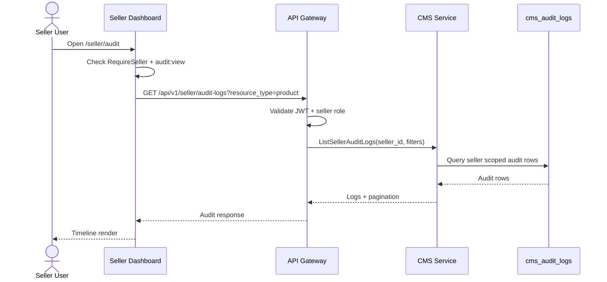
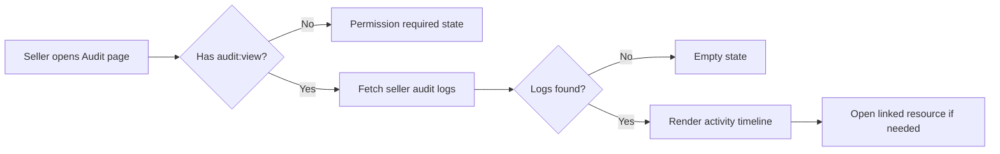

# 🧾 Seller Dashboard (CMS) - Task 7: Audit Activity


## 📌 Task Summary

| Field | Detail |
|---|---|
| Module | Seller Dashboard (CMS) |
| Task No. | 7 |
| Task Name | Audit activity |
| Source | `docs/01-micro-tasks.md` → `Seller Dashboard (CMS)` → Task 7 |
| Requirement | Recent seller actions timeline banao. Debug and trust improve hota hai. |
| Dependency | CMS audit APIs |
| Priority | P2 |
| Status | Documentation guide ready |

> 🟢 **Simple Hinglish goal:** Is task me seller dashboard ke andar **Audit Activity** screen banana hai jahan seller owner/manager recent actions timeline me dekh sake: product edits, coupon changes, campaign actions, order/shipment updates, team role changes, etc. Ye screen read-only hogi, debugging aur trust ke liye useful hogi.

---

## ✅ Final Output Created

```text
TaskImplementation/
└── Seller Dashboard (CMS)/
    ├── task1.md
    ├── task2.md
    ├── task3.md
    ├── task4.md
    ├── task5.md
    ├── task6.md
    └── task7.md
```

### Why this structure?

- `TaskImplementation/` project ke task-wise implementation guides ka central folder hai.
- `Seller Dashboard (CMS)/` seller dashboard ke docs ko module-wise group karta hai.
- `task7.md` sirf **Seller Dashboard (CMS) - Task 7** ka beginner-friendly implementation guide hai.
- Existing `task1.md` to `task6.md` untouched rahenge.

---

## 🧭 Docs Study Summary

Is guide ko banane se pehle project ke existing docs and previous task guides study kiye gaye:

| Document | Kya samjha |
|---|---|
| `docs/01-micro-tasks.md` | Task 7 ka exact scope: recent seller actions timeline |
| `docs/03-folder-structure.md` | Seller dashboard me `features/audit/pages/activity-log-page.tsx` expected hai |
| `docs/04-microservice-design.md` | CMS Service audit logs own karega |
| `docs/05-database-design.md` | CMS DB me `cms_audit_logs` table hai |
| `docs/06-auth-security.md` | Audit fields: actor, role, action, resource, request id, IP hash, before/after, created at |
| `docs/09-cms-superadmin.md` | Seller CMS Audit Activity me product edits, coupon changes, order actions show honge |
| `docs/10-frontend-implementation.md` | Seller dashboard quiet, dense, operational UI hona chahiye |
| `database/draw.sql` | `cms_audit_logs` fields: `audit_id`, `seller_id`, `actor_user_id`, `action`, `resource_type`, `resource_id`, `before_json`, `after_json`, `created_at` |
| `api/master-api.json` | Admin audit endpoint exists, but dedicated seller audit REST endpoint currently listed nahi hai |
| `TaskImplementation/Seller Dashboard (CMS)/task1.md` | Protected seller dashboard shell and sidebar reuse karna hai |
| `TaskImplementation/Seller Dashboard (CMS)/task2.md` | Product changes audit timeline me appear kar sakte hain |
| `TaskImplementation/Seller Dashboard (CMS)/task3.md` | Order status/shipment actions audit timeline me appear kar sakte hain |
| `TaskImplementation/Seller Dashboard (CMS)/task4.md` | Coupon/campaign changes audit timeline me appear kar sakte hain |
| `TaskImplementation/Seller Dashboard (CMS)/task5.md` | Analytics ke baad Audit nav item shell me available hai |
| `TaskImplementation/Seller Dashboard (CMS)/task6.md` | `audit:view` permission owner/manager ko available hai |

---

## 🟣 Task 7 Scope

### Included in Task 7

| Area | Included? | Explanation |
|---|---:|---|
| Audit route | ✅ | `/seller/audit` route dashboard shell ke andar active hoga |
| Read-only activity timeline | ✅ | Recent seller actions chronological timeline me show honge |
| Basic filters | ✅ | Action, resource type, actor, date range filters |
| Event cards | ✅ | Actor, action label, resource, timestamp, summary |
| Before/after summary | ✅ | Small diff preview for changed fields |
| Resource link | ✅ | Product/order/coupon/team resource detail page available ho to link |
| Permission check | ✅ | `audit:view` permission ke bina audit screen hide/deny |
| Loading/error/empty states | ✅ | Audit screen blank nahi rahegi |
| Pagination/load more | ✅ | Timeline long ho sakti hai, isliye cursor/page support |
| Seller auth guard reuse | ✅ | Task 1 ka `RequireSeller` route guard reuse hoga |

### Not Included in Task 7

| Future/Other Task | Not Included Feature |
|---|---|
| Backend audit writer | Product/coupon/team mutations ke audit rows write karna CMS Service Task 8/backlog ka kaam hai |
| DB migration changes | `cms_audit_logs` table already documented in `database/draw.sql` |
| Admin audit viewer | Superadmin Panel Task 8 ka separate scope hai |
| Export CSV/PDF | Admin audit logs me useful hai, but seller Task 7 MVP me nahi |
| Audit delete/edit | Audit records immutable hone chahiye, UI read-only rahegi |
| Full error polish | Cross-module production error polish Task 8 scope hai |
| Fake audit data | UI real API ya mock tests use karega, production me fake events nahi dikhayega |

> 🔴 **Important API boundary:** Current `api/master-api.json` me dedicated seller audit endpoint listed nahi hai. `cms_audit_logs` table and CMS Service audit responsibility documented hain, so Task 7 frontend ke liye recommended API contract define kiya gaya hai. Actual backend route/proto implementation CMS audit API task me hoga.

---

## 🧱 Clean Folder Structure

### Documentation folder

```text
TaskImplementation/
└── Seller Dashboard (CMS)/
    ├── task1.md
    ├── task2.md
    ├── task3.md
    ├── task4.md
    ├── task5.md
    ├── task6.md
    └── task7.md
```

### Intended frontend implementation structure

```text
frontend/
└── seller-dashboard/
    └── src/
        ├── routes/
        │   └── seller-routes.tsx
        ├── layout/
        │   └── sidebar.tsx
        ├── features/
        │   └── audit/
        │       ├── pages/
        │       │   └── activity-log-page.tsx
        │       ├── components/
        │       │   ├── audit-page-header.tsx
        │       │   ├── audit-filter-bar.tsx
        │       │   ├── activity-timeline.tsx
        │       │   ├── activity-event-card.tsx
        │       │   ├── actor-summary.tsx
        │       │   ├── resource-link.tsx
        │       │   ├── diff-summary.tsx
        │       │   ├── audit-empty-state.tsx
        │       │   └── audit-error-state.tsx
        │       ├── api/
        │       │   └── seller-audit-api.ts
        │       ├── hooks/
        │       │   └── use-seller-audit-logs.ts
        │       ├── utils/
        │       │   ├── audit-labels.ts
        │       │   └── audit-formatters.ts
        │       └── types.ts
        ├── features/
        │   └── team/
        │       └── hooks/
        │           └── use-seller-permissions.ts
        ├── components/
        │   └── ui/
        │       ├── button.tsx
        │       ├── input.tsx
        │       ├── select.tsx
        │       ├── skeleton.tsx
        │       ├── status-badge.tsx
        │       └── empty-state.tsx
        ├── stores/
        │   └── seller-store.ts
        └── lib/
            └── http.ts
```

### Folder responsibility

| Folder/File | Responsibility |
|---|---|
| `pages/` | Route-level audit activity screen |
| `components/` | Filter bar, timeline, event card, diff summary, empty/error states |
| `api/` | Seller audit REST contract ko typed functions me wrap karna |
| `hooks/` | React Query hook for list + pagination |
| `utils/` | Action labels, resource labels, date/time formatting |
| `types.ts` | Audit log, filters, resource/action enums |
| `routes/seller-routes.tsx` | `/seller/audit` route activate karna |
| `layout/sidebar.tsx` | Audit nav item real route se linked rahe |

---

## 🧩 External Libraries / Tools Used

> Note: Is documentation task me koi package install nahi kiya gaya. Actual frontend implementation karte time ye libraries useful hongi.

| Library/Tool | What it is | Why used | Install |
|---|---|---|---|
| React | UI library | Audit page, timeline, filter components banane ke liye | React setup dependency me already |
| TypeScript | Typed JavaScript | Audit event, filters, resource types safe rakhne ke liye | React setup dependency me already |
| React Router | Client routing | `/seller/audit` route activate karne ke liye | `pnpm add react-router-dom` |
| React Query | Server state cache | Audit logs fetch, pagination, refetch ke liye | `pnpm add @tanstack/react-query` |
| Zustand | Lightweight store | Active seller context Task 1 se reuse karne ke liye | `pnpm add zustand` |
| Tailwind CSS | Utility-first CSS | Dense timeline, badges, filters, responsive layout ke liye | `pnpm add -D tailwindcss postcss autoprefixer` |
| Lucide React | Icon set | Shield, clock, package, ticket, users icons ke liye | `pnpm add lucide-react` |
| date-fns | Date utility | Relative time and date range formatting ke liye | `pnpm add date-fns` |
| clsx | Class helper | Action/resource badge classes clean rakhne ke liye | `pnpm add clsx` |
| Vitest + Testing Library | Test tools | Formatter, filters, empty/error states test karne ke liye | `pnpm add -D vitest @testing-library/react @testing-library/user-event` |
| MSW | API mocking | Audit API mock karke component/integration tests | `pnpm add -D msw` |

### Install command

```bash
pnpm add react-router-dom @tanstack/react-query zustand lucide-react date-fns clsx
pnpm add -D tailwindcss postcss autoprefixer vitest @testing-library/react @testing-library/user-event msw
```

### Why date-fns?

- Timeline me `5 min ago`, `Today`, `Yesterday`, `01 Jun 2026` jaise readable timestamps chahiye.
- Native `Intl` bhi kaafi hai, but relative time and range helpers ke liye `date-fns` simple option hai.
- Agar project external dependency kam rakhna chahe, to `Intl.DateTimeFormat` and `Intl.RelativeTimeFormat` use karke `date-fns` skip kar sakte hain.

---

## 🗺️ Architecture Diagram

```mermaid
flowchart TD
    Seller[Seller Owner or Manager] --> Browser[Seller Dashboard React]
    Browser --> Guard[RequireSeller from Task 1]
    Guard --> Permission[audit:view Permission from Task 6]
    Permission --> Route[/seller/audit Route]
    Route --> Page[ActivityLogPage]
    Page --> Query[useSellerAuditLogs]
    Query --> API[seller-audit-api.ts]
    API --> Gateway[API Gateway]
    Gateway --> CMS[CMS Service: ListSellerAuditLogs]
    CMS --> DB[(CMS MySQL cms_audit_logs)]
```

### Explanation

- Seller `/seller/audit` open karta hai.
- `RequireSeller` confirm karta hai ki user seller context me hai.
- `audit:view` permission check karta hai ki user audit dekh sakta hai ya nahi.
- Page React Query se audit logs fetch karta hai.
- API Gateway auth token validate karta hai.
- CMS Service seller-scoped `cms_audit_logs` records return karta hai.

---

## 🔁 Audit Flow Diagram



---

## 🗃️ Data Model Reference

`database/draw.sql` me CMS audit table already documented hai:

```sql
CREATE TABLE IF NOT EXISTS cms_audit_logs (
  id BIGINT UNSIGNED NOT NULL AUTO_INCREMENT,
  audit_id VARCHAR(64) NOT NULL,
  seller_id VARCHAR(64) NOT NULL,
  actor_user_id VARCHAR(64) NOT NULL,
  action VARCHAR(128) NOT NULL,
  resource_type VARCHAR(64) NOT NULL,
  resource_id VARCHAR(64) NOT NULL,
  before_json JSON NULL,
  after_json JSON NULL,
  created_at TIMESTAMP NOT NULL DEFAULT CURRENT_TIMESTAMP,
  PRIMARY KEY (id),
  UNIQUE KEY uk_cms_audit_logs_audit_id (audit_id),
  KEY idx_cms_audit_seller_created (seller_id, created_at),
  KEY idx_cms_audit_resource (resource_type, resource_id)
) ENGINE=InnoDB;
```

### Field explanation

| Field | UI meaning |
|---|---|
| `audit_id` | Timeline event unique id |
| `seller_id` | Current seller scope |
| `actor_user_id` | Kis user ne action kiya |
| `action` | Kya action hua, for example `product.updated` |
| `resource_type` | Kis entity par action hua, for example `product` |
| `resource_id` | Entity id, for example product id |
| `before_json` | Change se pehle values |
| `after_json` | Change ke baad values |
| `created_at` | Action time |

> 🟡 **Nice-to-have API enrichment:** Backend response me actor name/email and resource display title include kar sakta hai, taaki frontend ko extra user/product calls na karni padein.

---

## 🧾 Audit Event Taxonomy

Timeline readable tab banegi jab actions predictable naming convention follow karenge.

| Resource | Example actions | UI label |
|---|---|---|
| `product` | `product.created`, `product.updated`, `product.submitted`, `product.published`, `product.unpublished` | Product activity |
| `variant` | `variant.created`, `variant.updated`, `variant.stock_updated` | Variant activity |
| `order` | `order.status_updated`, `order.shipment_updated`, `order.refund_viewed` | Order activity |
| `coupon` | `coupon.created`, `coupon.updated`, `coupon.paused`, `coupon.activated` | Coupon activity |
| `campaign` | `campaign.created`, `campaign.updated`, `campaign.paused` | Campaign activity |
| `team` | `team.member_invited`, `team.role_updated`, `team.member_disabled` | Team activity |
| `settings` | `settings.updated` | Store settings activity |

### Good audit action naming rules

- Action lowercase dot format me rakho: `resource.verb`.
- Same action ke liye multiple spellings avoid karo.
- Action UI label frontend map me maintain karo.
- Backend unknown action bheje to frontend fallback label show kare.

---

## 📡 Proposed API Contract

Current `api/master-api.json` dedicated seller audit endpoint expose nahi karta. Task 7 frontend ke liye recommended contract:

| Feature | Method | Path | Auth | Notes |
|---|---|---|---|---|
| List seller audit logs | `GET` | `/api/v1/seller/audit-logs` | seller | Current seller-scoped logs |
| Get resource audit logs | `GET` | `/api/v1/seller/audit-logs?resource_type=product&resource_id=prod_123` | seller | Specific resource history |

### Query params

| Param | Type | Example | Purpose |
|---|---|---|---|
| `page` | number | `1` | Pagination |
| `page_size` | number | `20` | Per page rows |
| `actor_id` | string | `user_123` | Actor filter |
| `action` | string | `product.updated` | Action filter |
| `resource_type` | string | `product` | Product/coupon/order/team filter |
| `resource_id` | string | `prod_123` | Specific resource filter |
| `from` | ISO date | `2026-06-01T00:00:00Z` | Start time |
| `to` | ISO date | `2026-06-01T23:59:59Z` | End time |

### Example: audit response

```json
{
  "logs": [
    {
      "audit_id": "audit_123",
      "seller_id": "seller_456",
      "actor_user_id": "user_789",
      "actor_name": "Catalog Manager",
      "actor_email": "catalog@example.com",
      "action": "product.updated",
      "resource_type": "product",
      "resource_id": "prod_101",
      "resource_title": "Cotton Shirt",
      "before": {
        "price": 129900,
        "status": "draft"
      },
      "after": {
        "price": 119900,
        "status": "submitted"
      },
      "created_at": "2026-06-01T10:30:00Z"
    }
  ],
  "pagination": {
    "page": 1,
    "page_size": 20,
    "total": 1,
    "has_next": false
  }
}
```

### Why seller-scoped endpoint?

- Browser ko `seller_id` manually pass karne ki zarurat nahi honi chahiye.
- API Gateway/JWT active seller context se seller scope derive karega.
- Ek seller dusre seller ke audit logs nahi dekh sakta.

---

## 🪜 Step-by-Step Implementation

## Step 1: `/seller/audit` route activate karo

Task 6 me `/seller/audit` placeholder redirect tha. Task 7 me us route ko real Audit Activity page se replace karna hai.

### Code example: `routes/seller-routes.tsx`

```tsx
import { RouteObject } from "react-router-dom";
import { DashboardLayout } from "../layout/dashboard-layout";
import { RequireSeller } from "./require-seller";
import { OverviewPage } from "../features/overview/pages/overview-page";
import { ProductListPage } from "../features/products/pages/product-list-page";
import { OrderListPage } from "../features/orders/pages/order-list-page";
import { CouponListPage } from "../features/offers/pages/coupon-list-page";
import { RevenueAnalyticsPage } from "../features/analytics/pages/revenue-analytics-page";
import { TeamMembersPage } from "../features/team/pages/team-members-page";
import { ActivityLogPage } from "../features/audit/pages/activity-log-page";

export const sellerRoutes: RouteObject[] = [
  {
    path: "/seller",
    element: (
      <RequireSeller>
        <DashboardLayout />
      </RequireSeller>
    ),
    children: [
      { index: true, element: <OverviewPage /> },
      { path: "products", element: <ProductListPage /> },
      { path: "orders", element: <OrderListPage /> },
      { path: "offers", element: <CouponListPage /> },
      { path: "analytics", element: <RevenueAnalyticsPage /> },
      { path: "team", element: <TeamMembersPage /> },
      { path: "audit", element: <ActivityLogPage /> }
    ]
  }
];
```

### Explanation

- `/seller/audit` ab real audit page render karega.
- Dashboard shell, topbar, seller switcher Task 1 se reuse honge.
- Audit screen seller dashboard ka read-only operational module rahega.

---

## Step 2: Audit domain types define karo

Typed model se UI predictable hoti hai aur backend contract change hone par TypeScript compile-time signal deta hai.

### Code example: `features/audit/types.ts`

```ts
export type AuditResourceType =
  | "product"
  | "variant"
  | "order"
  | "coupon"
  | "campaign"
  | "team"
  | "settings";

export type AuditAction =
  | "product.created"
  | "product.updated"
  | "product.submitted"
  | "product.published"
  | "product.unpublished"
  | "variant.stock_updated"
  | "order.status_updated"
  | "order.shipment_updated"
  | "coupon.created"
  | "coupon.updated"
  | "coupon.paused"
  | "coupon.activated"
  | "campaign.created"
  | "campaign.updated"
  | "team.member_invited"
  | "team.role_updated"
  | "team.member_disabled"
  | "settings.updated"
  | string;

export type AuditJson = Record<string, unknown> | null;

export type SellerAuditLog = {
  audit_id: string;
  seller_id: string;
  actor_user_id: string;
  actor_name?: string;
  actor_email?: string;
  action: AuditAction;
  resource_type: AuditResourceType | string;
  resource_id: string;
  resource_title?: string;
  before: AuditJson;
  after: AuditJson;
  created_at: string;
};

export type AuditFilters = {
  page?: number;
  page_size?: number;
  actor_id?: string;
  action?: string;
  resource_type?: string;
  resource_id?: string;
  from?: string;
  to?: string;
};

export type AuditPagination = {
  page: number;
  page_size: number;
  total?: number;
  has_next?: boolean;
};

export type SellerAuditLogResponse = {
  logs: SellerAuditLog[];
  pagination: AuditPagination;
};
```

### Explanation

- `AuditResourceType` known resources define karta hai.
- `AuditAction | string` unknown future actions ko break nahi karega.
- `before` and `after` JSON generic rakha gaya hai because different resources ke fields different honge.

---

## Step 3: Audit action labels banao

Raw action `product.updated` seller-friendly nahi lagta. UI me clean labels use karo.

### Code example: `features/audit/utils/audit-labels.ts`

```ts
import { AuditResourceType } from "../types";

export const actionLabels: Record<string, string> = {
  "product.created": "Created product",
  "product.updated": "Updated product",
  "product.submitted": "Submitted product for review",
  "product.published": "Published product",
  "product.unpublished": "Unpublished product",
  "variant.stock_updated": "Updated stock",
  "order.status_updated": "Updated order status",
  "order.shipment_updated": "Updated shipment",
  "coupon.created": "Created coupon",
  "coupon.updated": "Updated coupon",
  "coupon.paused": "Paused coupon",
  "coupon.activated": "Activated coupon",
  "campaign.created": "Created campaign",
  "campaign.updated": "Updated campaign",
  "team.member_invited": "Invited team member",
  "team.role_updated": "Updated team role",
  "team.member_disabled": "Disabled team member",
  "settings.updated": "Updated store settings"
};

export const resourceLabels: Record<AuditResourceType | string, string> = {
  product: "Product",
  variant: "Variant",
  order: "Order",
  coupon: "Coupon",
  campaign: "Campaign",
  team: "Team",
  settings: "Settings"
};

export function getActionLabel(action: string) {
  return actionLabels[action] ?? action.replaceAll(".", " ");
}

export function getResourceLabel(resourceType: string) {
  return resourceLabels[resourceType] ?? resourceType;
}
```

### Explanation

- Known actions ke clean labels predefined hain.
- Unknown action aaye to fallback readable text banega.
- Labels centralized rakhne se event card simple rahega.

---

## Step 4: Date and diff formatters banao

Audit timeline me timestamp and changed fields readable hone chahiye.

### Code example: `features/audit/utils/audit-formatters.ts`

```ts
import { formatDistanceToNowStrict, format } from "date-fns";
import { AuditJson } from "../types";

export function formatAuditTime(value: string) {
  const date = new Date(value);
  return format(date, "dd MMM yyyy, hh:mm a");
}

export function formatRelativeAuditTime(value: string) {
  const date = new Date(value);
  return `${formatDistanceToNowStrict(date)} ago`;
}

export type ChangedField = {
  field: string;
  before: unknown;
  after: unknown;
};

export function getChangedFields(before: AuditJson, after: AuditJson): ChangedField[] {
  if (!before || !after) return [];

  const keys = new Set([...Object.keys(before), ...Object.keys(after)]);

  return Array.from(keys)
    .filter((key) => JSON.stringify(before[key]) !== JSON.stringify(after[key]))
    .map((key) => ({
      field: key,
      before: before[key],
      after: after[key]
    }));
}

export function formatValue(value: unknown) {
  if (value === null || value === undefined || value === "") return "Empty";
  if (typeof value === "boolean") return value ? "Yes" : "No";
  if (typeof value === "object") return JSON.stringify(value);
  return String(value);
}
```

### Explanation

- `formatAuditTime` exact timestamp show karta hai.
- `formatRelativeAuditTime` quick scan ke liye useful hai.
- `getChangedFields` before/after JSON compare karke changed fields nikalta hai.
- Deep diff library avoid ki gayi hai because MVP me small JSON summary enough hai.

---

## Step 5: API wrapper banao

API calls ek dedicated file me rakhne se page clean rehta hai.

### Code example: `features/audit/api/seller-audit-api.ts`

```ts
import { http } from "../../../lib/http";
import { AuditFilters, SellerAuditLogResponse } from "../types";

function toQueryString(filters: AuditFilters) {
  const params = new URLSearchParams();

  Object.entries(filters).forEach(([key, value]) => {
    if (value !== undefined && value !== null && value !== "") {
      params.set(key, String(value));
    }
  });

  return params.toString();
}

export function listSellerAuditLogs(filters: AuditFilters) {
  const query = toQueryString(filters);
  const path = query ? `/api/v1/seller/audit-logs?${query}` : "/api/v1/seller/audit-logs";

  return http<SellerAuditLogResponse>(path);
}
```

### Explanation

- `toQueryString` empty filters drop karta hai.
- API path seller-scoped hai, so `seller_id` query me pass nahi hota.
- `http` client Task 1/previous frontend foundation se token and errors handle karega.

---

## Step 6: React Query hook banao

Server data React Query me rahega. Page component manually loading/error state manage nahi karega.

### Code example: `features/audit/hooks/use-seller-audit-logs.ts`

```ts
import { useQuery } from "@tanstack/react-query";
import { listSellerAuditLogs } from "../api/seller-audit-api";
import { AuditFilters } from "../types";

export function useSellerAuditLogs(filters: AuditFilters) {
  return useQuery({
    queryKey: ["seller-audit-logs", filters],
    queryFn: () => listSellerAuditLogs(filters),
    staleTime: 30_000
  });
}
```

### Explanation

- Query key filters include karta hai, so filter change par fresh data fetch hoga.
- `staleTime` 30 seconds rakha gaya hai because audit logs near-real-time useful hain but every render refetch zaruri nahi.
- Mutations nahi chahiye because audit page read-only hai.

---

## Step 7: Permission check integrate karo

Task 6 me `audit:view` permission owner/manager ko available tha. Audit page sensitive hai, isliye permission check zaruri hai.

### Code example: `features/audit/pages/activity-log-page.tsx`

```tsx
import { ShieldAlert } from "lucide-react";
import { useSellerPermissions } from "../../team/hooks/use-seller-permissions";

function AuditPermissionDenied() {
  return (
    <section className="rounded-lg border border-slate-200 bg-white p-6">
      <div className="flex items-start gap-3">
        <ShieldAlert className="mt-1 h-5 w-5 text-amber-600" />
        <div>
          <h1 className="text-base font-semibold text-slate-950">Permission required</h1>
          <p className="mt-1 text-sm text-slate-600">
            Audit activity dekhne ke liye audit:view permission chahiye.
          </p>
        </div>
      </div>
    </section>
  );
}

export function ActivityLogPage() {
  const { hasPermission } = useSellerPermissions();

  if (!hasPermission("audit:view")) {
    return <AuditPermissionDenied />;
  }

  return <ActivityLogContent />;
}
```

### Explanation

- Route accessible ho sakta hai, but content permission based render hota hai.
- Frontend check UX ke liye hai; backend ko bhi same RBAC enforce karna hoga.
- Permission denied basic state Task 7 me included hai because audit logs sensitive hain.

---

## Step 8: Page layout banao

Audit page compact operational layout follow karega: header, filters, timeline.

### Code example: `features/audit/pages/activity-log-page.tsx`

```tsx
import { useMemo, useState } from "react";
import { AuditFilterBar } from "../components/audit-filter-bar";
import { AuditPageHeader } from "../components/audit-page-header";
import { ActivityTimeline } from "../components/activity-timeline";
import { AuditEmptyState } from "../components/audit-empty-state";
import { AuditErrorState } from "../components/audit-error-state";
import { useSellerAuditLogs } from "../hooks/use-seller-audit-logs";
import { AuditFilters } from "../types";

const defaultFilters: AuditFilters = {
  page: 1,
  page_size: 20
};

function ActivityLogContent() {
  const [filters, setFilters] = useState<AuditFilters>(defaultFilters);
  const auditQuery = useSellerAuditLogs(filters);

  const logs = auditQuery.data?.logs ?? [];
  const hasFilters = useMemo(
    () => Boolean(filters.actor_id || filters.action || filters.resource_type || filters.from || filters.to),
    [filters]
  );

  return (
    <section className="space-y-4">
      <AuditPageHeader />

      <AuditFilterBar
        filters={filters}
        onChange={(nextFilters) => setFilters({ ...nextFilters, page: 1 })}
        onReset={() => setFilters(defaultFilters)}
      />

      {auditQuery.isError ? (
        <AuditErrorState onRetry={() => auditQuery.refetch()} />
      ) : logs.length === 0 && !auditQuery.isLoading ? (
        <AuditEmptyState hasFilters={hasFilters} />
      ) : (
        <ActivityTimeline
          logs={logs}
          isLoading={auditQuery.isLoading}
          pagination={auditQuery.data?.pagination}
          onLoadMore={() =>
            setFilters((current) => ({
              ...current,
              page: (current.page ?? 1) + 1
            }))
          }
        />
      )}
    </section>
  );
}
```

### Explanation

- Header seller ko page purpose batata hai.
- Filter bar logs narrow karne ke liye hai.
- Empty state filtered and unfiltered case alag explain karta hai.
- `onLoadMore` simple page increment use karta hai.

> 🟡 **Pagination note:** Real infinite timeline ke liye `useInfiniteQuery` better hota hai. MVP me page-based `useQuery` enough hai. Agar "Load more" previous pages preserve nahi karta, `useInfiniteQuery` adopt karo.

---

## Step 9: Page header banao

Header simple rahe: title, description, optional refresh.

### Code example: `features/audit/components/audit-page-header.tsx`

```tsx
import { ShieldCheck } from "lucide-react";

export function AuditPageHeader() {
  return (
    <div className="flex flex-col gap-3 border-b border-slate-200 pb-4 md:flex-row md:items-center md:justify-between">
      <div className="flex items-start gap-3">
        <div className="rounded-md bg-indigo-50 p-2 text-indigo-700">
          <ShieldCheck className="h-5 w-5" />
        </div>
        <div>
          <h1 className="text-xl font-semibold text-slate-950">Audit activity</h1>
          <p className="mt-1 text-sm text-slate-600">
            Recent seller dashboard actions, changes, aur team activity yahan track hoti hai.
          </p>
        </div>
      </div>
    </div>
  );
}
```

### Explanation

- UI dense and operational hai.
- No hero/marketing layout.
- Audit icon trust and security context communicate karta hai.

---

## Step 10: Filter bar banao

Filters seller ko specific product/order/coupon/team event quickly find karne me help karte hain.

### Code example: `features/audit/components/audit-filter-bar.tsx`

```tsx
import { AuditFilters } from "../types";

type Props = {
  filters: AuditFilters;
  onChange: (filters: AuditFilters) => void;
  onReset: () => void;
};

const resourceOptions = [
  { label: "All resources", value: "" },
  { label: "Products", value: "product" },
  { label: "Orders", value: "order" },
  { label: "Coupons", value: "coupon" },
  { label: "Campaigns", value: "campaign" },
  { label: "Team", value: "team" },
  { label: "Settings", value: "settings" }
];

export function AuditFilterBar({ filters, onChange, onReset }: Props) {
  return (
    <div className="grid gap-3 rounded-lg border border-slate-200 bg-white p-3 md:grid-cols-5">
      <input
        className="input"
        placeholder="Actor user id"
        value={filters.actor_id ?? ""}
        onChange={(event) => onChange({ ...filters, actor_id: event.target.value })}
      />

      <input
        className="input"
        placeholder="Action e.g. product.updated"
        value={filters.action ?? ""}
        onChange={(event) => onChange({ ...filters, action: event.target.value })}
      />

      <select
        className="input"
        value={filters.resource_type ?? ""}
        onChange={(event) => onChange({ ...filters, resource_type: event.target.value })}
      >
        {resourceOptions.map((option) => (
          <option key={option.value} value={option.value}>
            {option.label}
          </option>
        ))}
      </select>

      <input
        className="input"
        type="date"
        value={filters.from?.slice(0, 10) ?? ""}
        onChange={(event) =>
          onChange({
            ...filters,
            from: event.target.value ? `${event.target.value}T00:00:00Z` : undefined
          })
        }
      />

      <button className="btn-secondary" type="button" onClick={onReset}>
        Reset filters
      </button>
    </div>
  );
}
```

### Explanation

- MVP me filters simple hain.
- Actor search currently user id se hai because API actor lookup not guaranteed.
- Later actor dropdown/search add ho sakta hai if User Service search endpoint available ho.

---

## Step 11: Timeline component banao

Timeline chronological events show karegi. Loading state me skeleton cards dikhne chahiye.

### Code example: `features/audit/components/activity-timeline.tsx`

```tsx
import { SellerAuditLog, AuditPagination } from "../types";
import { ActivityEventCard } from "./activity-event-card";

type Props = {
  logs: SellerAuditLog[];
  isLoading: boolean;
  pagination?: AuditPagination;
  onLoadMore: () => void;
};

export function ActivityTimeline({ logs, isLoading, pagination, onLoadMore }: Props) {
  if (isLoading) {
    return (
      <div className="space-y-3">
        {Array.from({ length: 5 }).map((_, index) => (
          <div key={index} className="h-24 animate-pulse rounded-lg bg-slate-100" />
        ))}
      </div>
    );
  }

  return (
    <div className="space-y-3">
      <div className="relative space-y-3 before:absolute before:left-5 before:top-2 before:h-full before:w-px before:bg-slate-200">
        {logs.map((log) => (
          <ActivityEventCard key={log.audit_id} log={log} />
        ))}
      </div>

      {pagination?.has_next ? (
        <div className="flex justify-center pt-2">
          <button className="btn-secondary" type="button" onClick={onLoadMore}>
            Load more
          </button>
        </div>
      ) : null}
    </div>
  );
}
```

### Explanation

- Vertical line timeline visual clarity deti hai.
- Skeletons layout stable rakhte hain.
- `Load more` simple and predictable hai.

---

## Step 12: Activity event card banao

Card me actor, action, resource, timestamp, aur diff summary dikhana hai.

### Code example: `features/audit/components/activity-event-card.tsx`

```tsx
import { Clock } from "lucide-react";
import { SellerAuditLog } from "../types";
import { formatAuditTime, formatRelativeAuditTime } from "../utils/audit-formatters";
import { getActionLabel, getResourceLabel } from "../utils/audit-labels";
import { ActorSummary } from "./actor-summary";
import { DiffSummary } from "./diff-summary";
import { ResourceLink } from "./resource-link";

type Props = {
  log: SellerAuditLog;
};

export function ActivityEventCard({ log }: Props) {
  return (
    <article className="relative ml-10 rounded-lg border border-slate-200 bg-white p-4 shadow-sm">
      <div className="absolute -left-[2.05rem] top-4 h-3 w-3 rounded-full border-2 border-white bg-indigo-600 shadow" />

      <div className="flex flex-col gap-3 md:flex-row md:items-start md:justify-between">
        <div className="min-w-0">
          <div className="flex flex-wrap items-center gap-2">
            <span className="rounded-full bg-indigo-50 px-2 py-1 text-xs font-medium text-indigo-700">
              {getResourceLabel(log.resource_type)}
            </span>
            <h2 className="text-sm font-semibold text-slate-950">{getActionLabel(log.action)}</h2>
          </div>

          <div className="mt-2 flex flex-wrap items-center gap-2 text-sm text-slate-600">
            <ActorSummary log={log} />
            <span>on</span>
            <ResourceLink log={log} />
          </div>
        </div>

        <time className="flex shrink-0 items-center gap-1 text-xs text-slate-500" title={formatAuditTime(log.created_at)}>
          <Clock className="h-3.5 w-3.5" />
          {formatRelativeAuditTime(log.created_at)}
        </time>
      </div>

      <DiffSummary before={log.before} after={log.after} />
    </article>
  );
}
```

### Explanation

- Card scan-friendly hai: resource badge, action, actor, target, time.
- Exact time tooltip/title me available hai.
- Diff summary card ke niche compact section me show hota hai.

---

## Step 13: Actor summary banao

Backend actor name/email de to show karo, warna user id fallback.

### Code example: `features/audit/components/actor-summary.tsx`

```tsx
import { SellerAuditLog } from "../types";

type Props = {
  log: SellerAuditLog;
};

export function ActorSummary({ log }: Props) {
  const label = log.actor_name || log.actor_email || log.actor_user_id;

  return <span className="font-medium text-slate-800">{label}</span>;
}
```

### Explanation

- API enriched ho to human name show hoga.
- Enrichment absent ho to UI break nahi hogi.
- Actor details PII-sensitive ho sakti hain, so only needed display fields show karo.

---

## Step 14: Resource link banao

Audit event se related resource detail screen par jaana useful hota hai.

### Code example: `features/audit/components/resource-link.tsx`

```tsx
import { Link } from "react-router-dom";
import { SellerAuditLog } from "../types";

function getResourcePath(log: SellerAuditLog) {
  switch (log.resource_type) {
    case "product":
      return `/seller/products/${log.resource_id}/edit`;
    case "order":
      return `/seller/orders/${log.resource_id}`;
    case "coupon":
      return `/seller/offers/coupons/${log.resource_id}/edit`;
    case "campaign":
      return `/seller/offers`;
    case "team":
      return `/seller/team`;
    case "settings":
      return `/seller/settings`;
    default:
      return null;
  }
}

type Props = {
  log: SellerAuditLog;
};

export function ResourceLink({ log }: Props) {
  const label = log.resource_title || log.resource_id;
  const path = getResourcePath(log);

  if (!path) {
    return <span className="font-mono text-xs text-slate-700">{label}</span>;
  }

  return (
    <Link className="font-medium text-indigo-700 hover:text-indigo-900" to={path}>
      {label}
    </Link>
  );
}
```

### Explanation

- Resource-specific pages already Task 2-6 me documented hain.
- Unknown resource type ho to plain id show hota hai.
- `settings` route agar app me unavailable ho, link ko later remove/adjust karna hai.

---

## Step 15: Diff summary banao

Before/after JSON se changed fields seller ko quickly samajh aate hain.

### Code example: `features/audit/components/diff-summary.tsx`

```tsx
import { AuditJson } from "../types";
import { formatValue, getChangedFields } from "../utils/audit-formatters";

type Props = {
  before: AuditJson;
  after: AuditJson;
};

export function DiffSummary({ before, after }: Props) {
  const changedFields = getChangedFields(before, after).slice(0, 4);

  if (changedFields.length === 0) {
    return null;
  }

  return (
    <div className="mt-3 rounded-md bg-slate-50 p-3">
      <div className="mb-2 text-xs font-medium uppercase tracking-wide text-slate-500">
        Changed fields
      </div>

      <dl className="grid gap-2 text-sm md:grid-cols-2">
        {changedFields.map((change) => (
          <div key={change.field} className="min-w-0">
            <dt className="font-medium text-slate-700">{change.field}</dt>
            <dd className="mt-1 truncate text-slate-600">
              <span className="line-through decoration-red-400">{formatValue(change.before)}</span>
              <span className="mx-2 text-slate-400">to</span>
              <span className="font-medium text-emerald-700">{formatValue(change.after)}</span>
            </dd>
          </div>
        ))}
      </dl>
    </div>
  );
}
```

### Explanation

- Sirf first 4 changed fields show karna card ko compact rakhta hai.
- Large JSON dump avoid karo because seller dashboard operational UI hai.
- Full diff drawer later add ho sakta hai, but Task 7 MVP me zaruri nahi.

---

## Step 16: Empty and error states banao

Audit screen blank nahi honi chahiye.

### Code example: `features/audit/components/audit-empty-state.tsx`

```tsx
import { FileClock } from "lucide-react";

type Props = {
  hasFilters: boolean;
};

export function AuditEmptyState({ hasFilters }: Props) {
  return (
    <div className="rounded-lg border border-dashed border-slate-300 bg-white p-8 text-center">
      <FileClock className="mx-auto h-8 w-8 text-slate-400" />
      <h2 className="mt-3 text-base font-semibold text-slate-950">
        {hasFilters ? "No matching activity found" : "No activity yet"}
      </h2>
      <p className="mx-auto mt-1 max-w-md text-sm text-slate-600">
        {hasFilters
          ? "Filters thode broad karo ya date range change karke dobara try karo."
          : "Jab products, offers, orders ya team me actions honge, timeline yahan appear hogi."}
      </p>
    </div>
  );
}
```

### Code example: `features/audit/components/audit-error-state.tsx`

```tsx
import { AlertTriangle } from "lucide-react";

type Props = {
  onRetry: () => void;
};

export function AuditErrorState({ onRetry }: Props) {
  return (
    <div className="rounded-lg border border-red-200 bg-red-50 p-6">
      <div className="flex items-start gap-3">
        <AlertTriangle className="mt-0.5 h-5 w-5 text-red-600" />
        <div>
          <h2 className="text-sm font-semibold text-red-950">Audit activity load nahi ho paayi</h2>
          <p className="mt-1 text-sm text-red-700">
            Network ya server issue ho sakta hai. Retry karo.
          </p>
          <button className="btn-secondary mt-3" type="button" onClick={onRetry}>
            Retry
          </button>
        </div>
      </div>
    </div>
  );
}
```

### Explanation

- Empty state seller ko batata hai ki data absent hai ya filter tight hai.
- Error state retry action deta hai.
- Full cross-module error design Task 8 me polish hoga.

---

## Step 17: Sidebar navigation verify karo

Task 1 sidebar me Audit nav item already expected tha. Task 7 me ensure karo route real page pe point kare.

### Code example: `layout/sidebar.tsx`

```tsx
import {
  BarChart3,
  ClipboardList,
  LayoutDashboard,
  Megaphone,
  Package,
  ShieldCheck,
  Users
} from "lucide-react";

const sellerNavItems = [
  { label: "Overview", to: "/seller", icon: LayoutDashboard },
  { label: "Products", to: "/seller/products", icon: Package },
  { label: "Orders", to: "/seller/orders", icon: ClipboardList },
  { label: "Offers", to: "/seller/offers", icon: Megaphone },
  { label: "Analytics", to: "/seller/analytics", icon: BarChart3 },
  { label: "Team", to: "/seller/team", icon: Users },
  { label: "Audit", to: "/seller/audit", icon: ShieldCheck }
];
```

### Explanation

- Audit nav item ab placeholder nahi hai.
- `audit:view` permission missing ho to nav item hide ya disabled kiya ja sakta hai.
- Final backend still audit API authorization enforce karega.

---

## Step 18: Recommended backend behavior document karo

Task 7 frontend guide hai, but backend contract clear hona chahiye.

### Backend rules

| Rule | Why important |
|---|---|
| Seller scope token se derive karo | User manually `seller_id` spoof na kar sake |
| `audit:view` permission enforce karo | Frontend guard bypass ho sakta hai |
| Logs immutable rakho | Audit trust maintain hota hai |
| Created time descending order | Recent activity first show hoti hai |
| Pagination mandatory | Audit table large ho sakti hai |
| Sensitive fields redact karo | Password, token, secret, payment payload expose na ho |
| Actor display data enrich karo | Timeline readable hoti hai |
| Unknown action allowed but stored consistently | New modules timeline break nahi karte |

### Recommended SQL query shape

```sql
SELECT
  audit_id,
  seller_id,
  actor_user_id,
  action,
  resource_type,
  resource_id,
  before_json,
  after_json,
  created_at
FROM cms_audit_logs
WHERE seller_id = ?
  AND (? IS NULL OR actor_user_id = ?)
  AND (? IS NULL OR action = ?)
  AND (? IS NULL OR resource_type = ?)
  AND (? IS NULL OR resource_id = ?)
  AND (? IS NULL OR created_at >= ?)
  AND (? IS NULL OR created_at <= ?)
ORDER BY created_at DESC
LIMIT ? OFFSET ?;
```

### Explanation

- Query seller-scoped hai.
- Optional filters parameterized hain.
- `idx_cms_audit_seller_created` index recent seller logs fast banata hai.
- Resource-specific history ke liye `idx_cms_audit_resource` useful hai.

---

## 🎨 UI Design Notes

| UI Area | Design decision |
|---|---|
| Layout | Full-width dashboard content, no marketing hero |
| Density | Compact filters and timeline cards |
| Colors | Neutral slate base, indigo resource badges, red/green diff values |
| Timeline | Vertical line + dot for chronological scanning |
| Cards | Radius 8px or less, no nested cards |
| Text | Action labels clear, raw JSON hidden unless needed |
| Mobile | Filters stack vertically, event card wraps actor/resource text |
| Accessibility | `time` element with exact timestamp title, buttons have text labels |

---

## 🧪 Testing Guide

### Unit tests

| Test | Expected |
|---|---|
| `getActionLabel("product.updated")` | `Updated product` |
| `getActionLabel("unknown.action")` | readable fallback |
| `getResourceLabel("coupon")` | `Coupon` |
| `getChangedFields({ price: 100 }, { price: 90 })` | one changed field |
| `getChangedFields(null, { status: "active" })` | empty array |
| `formatValue(null)` | `Empty` |

### Component tests

| Scenario | Expected |
|---|---|
| Audit page loading | Skeleton cards visible |
| Audit page with logs | Timeline cards visible |
| Audit page empty without filters | `No activity yet` visible |
| Audit page empty with filters | `No matching activity found` visible |
| Audit query error | Retry button visible |
| User without `audit:view` | Permission required state visible |
| Event with unknown resource | Plain resource id rendered |

### MSW mock example

```ts
import { http, HttpResponse } from "msw";

export const sellerAuditHandlers = [
  http.get("/api/v1/seller/audit-logs", () => {
    return HttpResponse.json({
      logs: [
        {
          audit_id: "audit_123",
          seller_id: "seller_456",
          actor_user_id: "user_789",
          actor_name: "Catalog Manager",
          actor_email: "catalog@example.com",
          action: "product.updated",
          resource_type: "product",
          resource_id: "prod_101",
          resource_title: "Cotton Shirt",
          before: {
            price: 129900,
            status: "draft"
          },
          after: {
            price: 119900,
            status: "submitted"
          },
          created_at: "2026-06-01T10:30:00Z"
        }
      ],
      pagination: {
        page: 1,
        page_size: 20,
        total: 1,
        has_next: false
      }
    });
  })
];
```

---

## 🔐 Security Checklist

| Rule | Why important |
|---|---|
| Backend validates seller ownership | Ek seller dusre seller ke logs na dekh sake |
| Backend enforces `audit:view` | Frontend checks bypass ho sakte hain |
| Audit logs immutable | Trust and dispute debugging ke liye zaruri |
| Sensitive fields redacted | Secrets, tokens, payment details leak na ho |
| Before/after JSON size limited | UI and DB payload bloating avoid hota hai |
| Actor id always stored | Accountability maintain hoti hai |
| Request id store karna recommended | Logs/traces correlate karna easy hota hai |
| IP hash optional but useful | Security investigation me help hoti hai |
| Audit reads logged for high-risk exports | Future export feature me compliance useful hoga |

---

## ✅ Acceptance Checklist

| Requirement | Status |
|---|---:|
| `TaskImplementation/Seller Dashboard (CMS)/task7.md` created | ✅ |
| Hinglish step-by-step guide added | ✅ |
| Task 7 scope only documented | ✅ |
| Audit route `/seller/audit` documented | ✅ |
| Recent seller actions timeline documented | ✅ |
| Audit filters documented | ✅ |
| Event card and diff summary documented | ✅ |
| Permission check using `audit:view` documented | ✅ |
| External libraries/tools explained | ✅ |
| Folder structure included | ✅ |
| Code examples included | ✅ |
| Mermaid diagrams included | ✅ |
| Security checklist included | ✅ |
| No Task 8 error polish implementation added | ✅ |

---

## 🚫 Explicitly Not Implemented

| Item | Reason |
|---|---|
| Backend seller audit API files | Current request sirf `task7.md` guide create karne ka hai |
| CMS audit writer logic | CMS Service/backend task scope alag hai |
| Product/order/coupon mutation changes | Task 2-4 modules untouched rahenge |
| Team mutation audit writes | Task 6 UI documented tha; backend audit write separate hai |
| DB migration changes | `cms_audit_logs` already documented in `database/draw.sql` |
| Admin audit log viewer | Superadmin Panel Task 8 scope |
| CSV/PDF export | Future enhancement, MVP timeline scope nahi |
| Task 8 error states polish | Seller Dashboard Task 8 scope |

---

## 🧠 Beginner-Friendly Recap

Task 7 ka main idea ye hai:

1. Seller dashboard me `/seller/audit` route real page banega.
2. Sirf `audit:view` permission wale seller users timeline dekh sakenge.
3. Page CMS audit API se recent seller actions fetch karega.
4. Timeline me actor, action, resource, time, aur changed fields show honge.
5. Filters se seller product/order/coupon/team specific activity search kar sakega.
6. Audit records read-only and immutable rahenge.
7. Backend seller ownership and RBAC final source of truth rahega.



> 🟢 **Task 7 complete:** Seller Dashboard (CMS) ke Audit Activity module ka structured Hinglish implementation guide ready hai. Ye guide existing seller shell ke andar fit hota hai, CMS audit API boundary honestly document karta hai, aur Task 8 error-state polish ya Superadmin audit viewer ko intentionally untouched rakhta hai.
