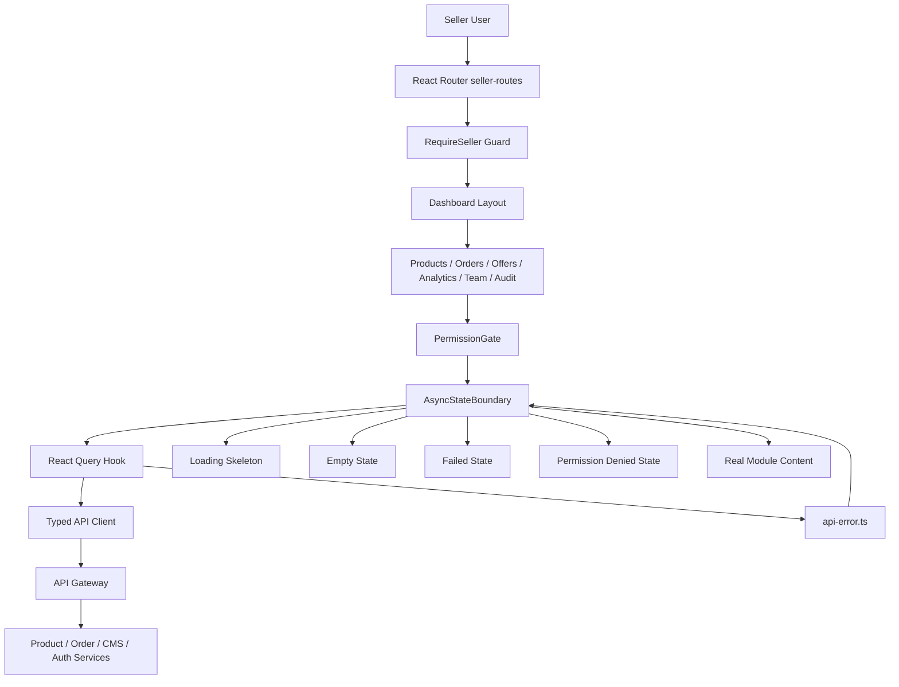
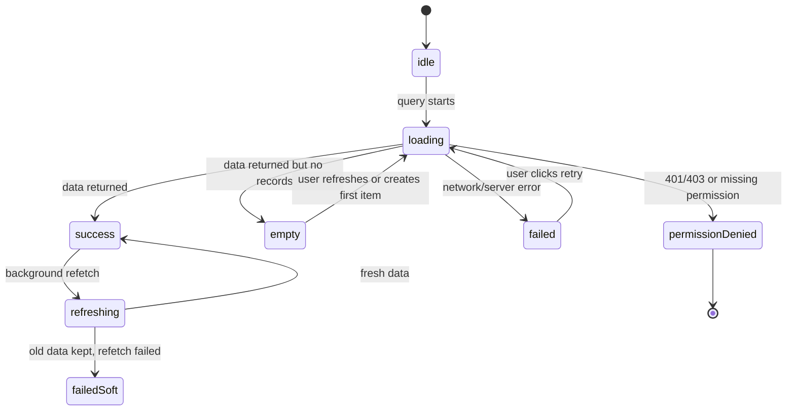
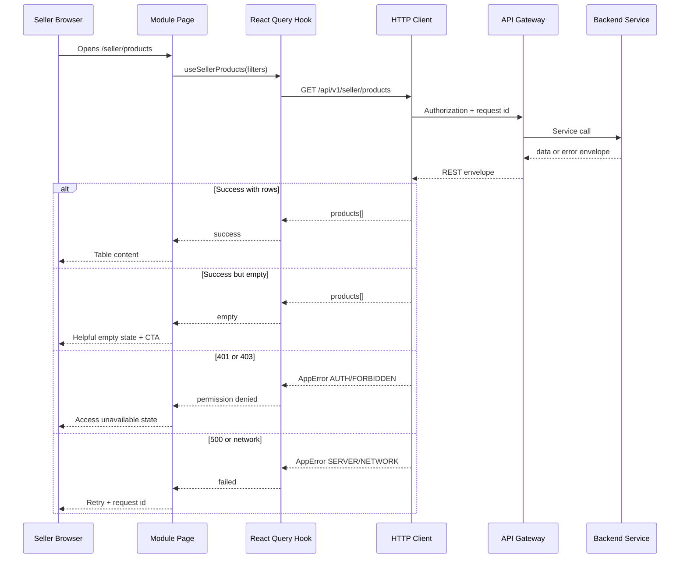
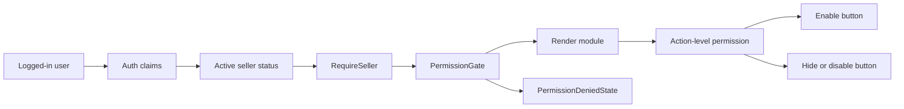

# 🛟 Seller Dashboard (CMS) - Task 8: Error States


## 📌 Task Summary

| Field | Detail |
|---|---|
| Module | Seller Dashboard (CMS) |
| Task No. | 8 |
| Task Name | Error states |
| Source | `docs/01-micro-tasks.md` → `Seller Dashboard (CMS)` → Task 8 |
| Requirement | Empty, loading, failed, permission denied states polish karo. Production UX reliable lagega. |
| Dependency | All seller dashboard modules |
| Priority | P1 |
| Status | Documentation guide ready |

> 🟢 **Simple Hinglish goal:** Is task me Seller Dashboard ke sabhi modules me consistent **empty**, **loading**, **failed**, aur **permission denied** states polish karne hain. User ko blank screen, confusing error, ya broken layout nahi dikhna chahiye. Dashboard production-ready, reliable, aur easy-to-understand feel hona chahiye.

---

## ✅ Final Output Created

```text
TaskImplementation/
└── Seller Dashboard (CMS)/
    ├── task1.md
    ├── task2.md
    ├── task3.md
    ├── task4.md
    ├── task5.md
    ├── task6.md
    ├── task7.md
    └── task8.md
```

### Why this structure?

- `TaskImplementation/` project ke task-wise implementation guides ka central folder hai.
- `Seller Dashboard (CMS)/` seller dashboard ke docs ko module-wise group karta hai.
- `task8.md` sirf **Seller Dashboard (CMS) - Task 8** ka beginner-friendly implementation guide hai.
- Existing `task1.md` to `task7.md` untouched rahenge.
- Actual frontend/backend code files create nahi kiye gaye, kyunki requested output folder structure aur `task8.md` documentation content hai.

---

## 🧭 Docs Study Summary

Is guide ko banane se pehle project ke existing docs and previous task guides study kiye gaye:

| Document | Kya samjha |
|---|---|
| `docs/01-micro-tasks.md` | Task 8 ka exact scope: empty, loading, failed, permission denied states across all modules |
| `docs/03-folder-structure.md` | Seller dashboard expected folders: overview, products, orders, offers, analytics, team, audit |
| `docs/06-auth-security.md` | RBAC roles: `seller`, `seller_manager`, `seller_catalog_editor`, `seller_order_manager`; unauthorized users ko deny karna hai |
| `docs/10-frontend-implementation.md` | Seller dashboard quiet, dense, operational UI hona chahiye; HTTP client error normalization karega |
| `docs/13-developer-guide.md` | REST response envelope and error convention: `data`, `request_id`, `error.code`, `error.message`, `details` |
| `api/master-api.json` | Seller product, order, coupon, campaign, dashboard summary APIs seller auth ke under hain |
| `TaskImplementation/Seller Dashboard (CMS)/task1.md` | Dashboard shell, `RequireSeller`, permission denied page, seller store reuse karna hai |
| `TaskImplementation/Seller Dashboard (CMS)/task2.md` | Product Manager me basic states hain, Task 8 unhe polished shared pattern me convert karega |
| `TaskImplementation/Seller Dashboard (CMS)/task3.md` | Order Manager list/detail states ko consistent banana hai |
| `TaskImplementation/Seller Dashboard (CMS)/task4.md` | Offers and Coupons me coupons/campaigns states polish karne hain |
| `TaskImplementation/Seller Dashboard (CMS)/task5.md` | Analytics me missing/partial backend data ko fake nahi karna, useful unavailable state dikhani hai |
| `TaskImplementation/Seller Dashboard (CMS)/task6.md` | Team permissions ke role checks and action-level deny states reuse karne hain |
| `TaskImplementation/Seller Dashboard (CMS)/task7.md` | Audit Activity me empty timeline, failed fetch, and permission denied states polish karne hain |

---

## 🟣 Task 8 Scope

### Included in Task 8

| Area | Included? | Explanation |
|---|---:|---|
| Shared loading states | ✅ | Page, table, card, chart, form skeletons common pattern me |
| Shared empty states | ✅ | Module-specific helpful copy and CTA |
| Shared failed states | ✅ | Retry button, request id, safe error message |
| Permission denied state | ✅ | Route-level and action-level permission UX |
| API error normalization | ✅ | HTTP/gRPC errors ko predictable frontend error shape me map karna |
| React Query defaults | ✅ | Retry policy, stale data handling, loading/refetch polish |
| Module state matrix | ✅ | Products, orders, offers, analytics, team, audit ke states define karna |
| Accessibility polish | ✅ | `aria-live`, focus handling, keyboard-friendly retry/action buttons |
| Responsive polish | ✅ | Mobile and desktop dono me no clipping/no overlap |
| Test plan | ✅ | Unit, component, MSW API mock, and E2E state tests |
| No fake data | ✅ | Missing data ke liye honest empty/unavailable state |

### Not Included in Task 8

| Future/Other Task | Not Included Feature |
|---|---|
| New business modules | Products/orders/offers/team/audit ke new features add nahi karne |
| Backend APIs | New routes, migrations, or service logic create nahi karna |
| API contract rewrite | Existing response envelope ko follow karna, contract replace nahi karna |
| Full design system package | Sirf seller dashboard state components ka guide |
| Notification system | Toast framework full setup separate concern ho sakta hai |
| Superadmin panel | Superadmin error states separate module ka scope hai |
| Session analytics dashboard | Session dashboard privacy/error states separate task ka scope hai |
| Demo/random content | Production UI me fake products, fake revenue, fake orders nahi dikhane |

> 🔴 **Important boundary:** Task 8 polish layer hai. Ye previous Task 1-7 modules ko reliable banata hai, lekin unke business logic ya backend contracts expand nahi karta.

---

## 🧱 Clean Folder Structure

### Documentation folder

```text
TaskImplementation/
└── Seller Dashboard (CMS)/
    ├── task1.md
    ├── task2.md
    ├── task3.md
    ├── task4.md
    ├── task5.md
    ├── task6.md
    ├── task7.md
    └── task8.md
```

### Intended frontend implementation structure

```text
frontend/
└── seller-dashboard/
    └── src/
        ├── app.tsx
        ├── routes/
        │   └── seller-routes.tsx
        ├── lib/
        │   ├── http.ts
        │   ├── query-client.ts
        │   └── api-error.ts
        ├── stores/
        │   └── seller-store.ts
        ├── components/
        │   ├── guards/
        │   │   ├── require-seller.tsx
        │   │   └── permission-gate.tsx
        │   └── state/
        │       ├── async-state-boundary.tsx
        │       ├── empty-state.tsx
        │       ├── failed-state.tsx
        │       ├── loading-skeleton.tsx
        │       ├── permission-denied-state.tsx
        │       ├── unavailable-state.tsx
        │       └── state-shell.tsx
        ├── components/
        │   └── ui/
        │       ├── button.tsx
        │       ├── skeleton.tsx
        │       ├── status-badge.tsx
        │       └── alert.tsx
        ├── features/
        │   ├── overview/
        │   ├── products/
        │   ├── orders/
        │   ├── offers/
        │   ├── analytics/
        │   ├── team/
        │   └── audit/
        └── test/
            ├── msw/
            │   ├── handlers.ts
            │   └── server.ts
            └── render-with-providers.tsx
```

### Folder responsibility

| Folder/File | Responsibility |
|---|---|
| `components/state/` | Shared empty/loading/failed/permission UI primitives |
| `components/guards/` | Seller route guard and permission gate |
| `lib/api-error.ts` | API error ko normalized frontend type me convert karna |
| `lib/http.ts` | Request wrapper, token attach, response envelope parse, errors throw |
| `lib/query-client.ts` | React Query retry/stale/refetch defaults |
| `features/*` | Existing Task 1-7 modules jo shared states consume karenge |
| `test/msw/` | API success/error/empty/permission mocks |
| `test/render-with-providers.tsx` | Tests me router/query/store providers reuse karna |

---

## 🧩 External Libraries / Tools Used

> Note: Is documentation task me koi package install nahi kiya gaya. Actual frontend implementation karte time ye libraries useful hongi. Project docs already React, TypeScript, Tailwind, React Query, Zustand pattern recommend karte hain.

| Library/Tool | What it is | Why used | Install |
|---|---|---|---|
| React | UI library | Shared state components and module pages render karne ke liye | React setup dependency me already |
| TypeScript | Typed JavaScript | Error/state contracts safe rakhne ke liye | React setup dependency me already |
| React Router | Client routing | `/seller/*` route guard and permission pages ke liye | `pnpm add react-router-dom` |
| TanStack React Query | Server state cache | Loading, error, retry, refetch, stale data handle karne ke liye | `pnpm add @tanstack/react-query` |
| Zustand | Lightweight store | Active seller, role, UI preferences reuse karne ke liye | `pnpm add zustand` |
| Tailwind CSS | Utility-first CSS | Dense operational UI, skeleton, alert, spacing polish ke liye | `pnpm add -D tailwindcss postcss autoprefixer` |
| Lucide React | Icon set | Alert, lock, refresh, empty-box, chart icons ke liye | `pnpm add lucide-react` |
| clsx | Class helper | State color variants cleanly compose karne ke liye | `pnpm add clsx` |
| Vitest | Test runner | Error mapper and permission helpers test karne ke liye | `pnpm add -D vitest` |
| Testing Library | Component testing | Empty/loading/failed UI behavior test karne ke liye | `pnpm add -D @testing-library/react @testing-library/user-event` |
| MSW | API mocking | 200 empty, 403, 500, timeout scenarios mock karne ke liye | `pnpm add -D msw` |
| Playwright | E2E testing | Real browser me state pages verify karne ke liye | `pnpm add -D @playwright/test` |

### Install command

```bash
pnpm add react-router-dom @tanstack/react-query zustand lucide-react clsx
pnpm add -D tailwindcss postcss autoprefixer vitest @testing-library/react @testing-library/user-event msw @playwright/test
```

### How to use these tools

```bash
# Unit and component tests
pnpm test

# MSW mocked integration tests
pnpm test -- --run

# E2E state verification
pnpm exec playwright test
```

> 🟡 **Practical note:** Agar project already in dependencies ko install kar chuka hai, command repeat karne ki zarurat nahi. Existing `package.json` verify karke missing packages hi add karne chahiye.

---

## 🏗️ State Architecture Diagram



### Explanation

- `RequireSeller` pehle check karega ki user seller dashboard access kar sakta hai ya nahi.
- `PermissionGate` module/action level permissions check karega.
- `AsyncStateBoundary` data fetching state ko UI state me map karega.
- Module pages apna real content tabhi render karenge jab data successfully available ho.
- Failed state me raw backend stack trace nahi, sirf safe message + retry + `request_id` dikhana hai.

---

## 🔁 Async State Flow



### Explanation

- Initial load me skeleton dikhega.
- Empty response ko error treat nahi karna.
- Background refetch fail ho to existing data vanish nahi karna. Small inline warning enough hai.
- 401/403 ko normal failed state nahi banana. User ko clear access message dikhana hai.

---

## 📡 Request Flow Diagram



---

## 🎨 State Design Tokens

Seller dashboard operational UI hai, isliye colors calm and readable hone chahiye.

| State | Badge color | Background | Border | Text intent |
|---|---|---|---|---|
| Loading | Slate | `bg-slate-50` | `border-slate-200` | Neutral |
| Empty | Blue | `bg-blue-50` | `border-blue-200` | Helpful |
| Failed | Red | `bg-red-50` | `border-red-200` | Recoverable problem |
| Permission denied | Amber | `bg-amber-50` | `border-amber-200` | Access/role issue |
| Unavailable | Violet | `bg-violet-50` | `border-violet-200` | Data source missing |
| Soft warning | Yellow | `bg-yellow-50` | `border-yellow-200` | Partial issue |

> ✅ **Rule:** Color alone pe depend nahi karna. Icon, heading, text, and action button bhi clear hone chahiye.

---

## 🧱 State Taxonomy

| State | Kab use hoga | UI behavior |
|---|---|---|
| `loading` | First fetch pending | Skeleton show karo, spinner-only full page avoid karo |
| `empty` | API success but records zero | Friendly explanation + primary CTA |
| `failed` | Network, timeout, 5xx, unknown API error | Retry button + request id + safe copy |
| `permissionDenied` | 401, 403, missing seller role, missing module permission | Access message + back/dashboard action |
| `unavailable` | Backend field/API not ready but page accessible | Honest "data unavailable" message, fake data nahi |
| `refreshing` | Existing data hai, background refetch chal raha hai | Small "Refreshing..." indicator, content visible rakho |
| `failedSoft` | Existing data hai, refetch fail ho gaya | Old data keep karo + inline warning |

---

## 🛠️ Step-by-Step Implementation

## Step 1: Shared state types define karo

Sab modules ko same type language use karni chahiye. Isse Products, Orders, Offers, Analytics, Team, Audit sab me states consistent rahenge.

### Code example: `components/state/state-types.ts`

```tsx
import type { ReactNode } from "react";

export type DashboardStateKind =
  | "loading"
  | "empty"
  | "failed"
  | "permissionDenied"
  | "unavailable";

export type StateAction = {
  label: string;
  onClick?: () => void;
  href?: string;
  variant?: "primary" | "secondary";
};

export type StateCopy = {
  title: string;
  description: string;
  icon?: ReactNode;
  action?: StateAction;
  secondaryAction?: StateAction;
  requestId?: string;
};
```

### Explanation

- `DashboardStateKind` app ke major UI states ko fixed names deta hai.
- `StateAction` se button/link same structure me banega.
- `requestId` failed state me debugging ke liye show hoga.

---

## Step 2: State shell component banao

State shell ek common visual wrapper hai. Empty, failed, permission denied, unavailable sab isi shell ko reuse karenge.

### Code example: `components/state/state-shell.tsx`

```tsx
import { Link } from "react-router-dom";
import { clsx } from "clsx";
import type { DashboardStateKind, StateCopy } from "./state-types";

const stateClassNames: Record<DashboardStateKind, string> = {
  loading: "border-slate-200 bg-slate-50 text-slate-700",
  empty: "border-blue-200 bg-blue-50 text-blue-950",
  failed: "border-red-200 bg-red-50 text-red-950",
  permissionDenied: "border-amber-200 bg-amber-50 text-amber-950",
  unavailable: "border-violet-200 bg-violet-50 text-violet-950",
};

type StateShellProps = StateCopy & {
  kind: DashboardStateKind;
};

export function StateShell({
  kind,
  title,
  description,
  icon,
  action,
  secondaryAction,
  requestId,
}: StateShellProps) {
  return (
    <section
      className={clsx(
        "rounded-md border p-5",
        "flex flex-col gap-4 sm:flex-row sm:items-start sm:justify-between",
        stateClassNames[kind],
      )}
      role={kind === "failed" ? "alert" : "status"}
      aria-live={kind === "failed" ? "assertive" : "polite"}
    >
      <div className="flex gap-3">
        {icon ? <div className="mt-0.5 shrink-0">{icon}</div> : null}
        <div>
          <h2 className="text-sm font-semibold">{title}</h2>
          <p className="mt-1 max-w-2xl text-sm opacity-80">{description}</p>
          {requestId ? (
            <p className="mt-2 font-mono text-xs opacity-70">
              Request ID: {requestId}
            </p>
          ) : null}
        </div>
      </div>

      <div className="flex shrink-0 gap-2">
        {secondaryAction ? <StateActionButton action={secondaryAction} /> : null}
        {action ? <StateActionButton action={action} /> : null}
      </div>
    </section>
  );
}

function StateActionButton({ action }: { action: NonNullable<StateCopy["action"]> }) {
  const className =
    action.variant === "secondary"
      ? "rounded-md border border-current px-3 py-2 text-sm font-medium"
      : "rounded-md bg-slate-950 px-3 py-2 text-sm font-medium text-white";

  if (action.href) {
    return (
      <Link to={action.href} className={className}>
        {action.label}
      </Link>
    );
  }

  return (
    <button type="button" className={className} onClick={action.onClick}>
      {action.label}
    </button>
  );
}
```

### Explanation

- Same wrapper se visual consistency maintain hoti hai.
- `role="alert"` failed state ke liye screen reader ko problem announce karne me help karta hai.
- Request id small font me dikhana debugging friendly hai, but scary technical stack trace nahi dikhana.

---

## Step 3: Empty state component banao

Empty state error nahi hota. Ye user ko batata hai ki abhi data nahi hai, aur next useful action kya hai.

### Code example: `components/state/empty-state.tsx`

```tsx
import { Inbox } from "lucide-react";
import { StateShell } from "./state-shell";
import type { StateAction } from "./state-types";

type EmptyStateProps = {
  title: string;
  description: string;
  action?: StateAction;
};

export function EmptyState({ title, description, action }: EmptyStateProps) {
  return (
    <StateShell
      kind="empty"
      title={title}
      description={description}
      icon={<Inbox className="h-5 w-5" aria-hidden="true" />}
      action={action}
    />
  );
}
```

### Explanation

- Products empty ho to "Create product" CTA ho sakta hai.
- Orders empty ho to CTA force nahi karna, kyunki orders buyer activity se aate hain.
- Analytics empty ho to "Not enough data yet" better hai.

---

## Step 4: Failed state component banao

Failed state recoverable hona chahiye. User ko retry ka option milna chahiye.

### Code example: `components/state/failed-state.tsx`

```tsx
import { AlertTriangle } from "lucide-react";
import { StateShell } from "./state-shell";

type FailedStateProps = {
  title?: string;
  description?: string;
  requestId?: string;
  onRetry?: () => void;
};

export function FailedState({
  title = "Something went wrong",
  description = "Data load nahi ho paya. Connection check karke retry karein.",
  requestId,
  onRetry,
}: FailedStateProps) {
  return (
    <StateShell
      kind="failed"
      title={title}
      description={description}
      requestId={requestId}
      icon={<AlertTriangle className="h-5 w-5" aria-hidden="true" />}
      action={onRetry ? { label: "Retry", onClick: onRetry } : undefined}
    />
  );
}
```

### Explanation

- Retry button user ko control deta hai.
- `requestId` support/debugging ke liye useful hai.
- Error copy simple rakho. "Internal server panic" ya stack trace expose nahi karna.

---

## Step 5: Permission denied component banao

Permission issue ko generic failed state me mix nahi karna chahiye. Seller ko clearly batana hai ki role/access missing hai.

### Code example: `components/state/permission-denied-state.tsx`

```tsx
import { Lock } from "lucide-react";
import { StateShell } from "./state-shell";

type PermissionDeniedStateProps = {
  title?: string;
  description?: string;
};

export function PermissionDeniedState({
  title = "Access unavailable",
  description = "Aapke current seller role ke paas is section ka permission nahi hai.",
}: PermissionDeniedStateProps) {
  return (
    <StateShell
      kind="permissionDenied"
      title={title}
      description={description}
      icon={<Lock className="h-5 w-5" aria-hidden="true" />}
      action={{ label: "Back to dashboard", href: "/seller" }}
    />
  );
}
```

### Explanation

- 403 ya missing permission ke liye ye state use hogi.
- User ko "login failed" jaisa message nahi dikhana.
- Action-level buttons disabled/hidden ho sakte hain, but full page denied tab jab route itself forbidden ho.

---

## Step 6: Loading skeletons banao

Spinner-only dashboard weak feel hota hai. Skeleton layout stable rakhta hai and page jump kam karta hai.

### Code example: `components/state/loading-skeleton.tsx`

```tsx
import { clsx } from "clsx";

export function TableSkeleton({ rows = 6, columns = 5 }) {
  return (
    <div className="rounded-md border border-slate-200 bg-white">
      <div className="border-b border-slate-200 p-4">
        <div className="h-4 w-40 animate-pulse rounded bg-slate-200" />
      </div>
      <div className="divide-y divide-slate-100">
        {Array.from({ length: rows }).map((_, rowIndex) => (
          <div key={rowIndex} className="grid gap-3 p-4" style={{ gridTemplateColumns: `repeat(${columns}, minmax(0, 1fr))` }}>
            {Array.from({ length: columns }).map((__, columnIndex) => (
              <div
                key={columnIndex}
                className={clsx(
                  "h-3 animate-pulse rounded bg-slate-200",
                  columnIndex === 0 ? "w-3/4" : "w-full",
                )}
              />
            ))}
          </div>
        ))}
      </div>
    </div>
  );
}

export function CardsSkeleton({ count = 4 }) {
  return (
    <div className="grid gap-3 sm:grid-cols-2 xl:grid-cols-4">
      {Array.from({ length: count }).map((_, index) => (
        <div key={index} className="rounded-md border border-slate-200 bg-white p-4">
          <div className="h-3 w-24 animate-pulse rounded bg-slate-200" />
          <div className="mt-3 h-7 w-32 animate-pulse rounded bg-slate-200" />
          <div className="mt-2 h-3 w-20 animate-pulse rounded bg-slate-100" />
        </div>
      ))}
    </div>
  );
}
```

### Explanation

- Table pages ko table skeleton milega.
- Analytics cards/charts ko card/chart skeleton milega.
- Skeleton count fixed rakho taaki layout jump na kare.

---

## Step 7: API error normalize karo

Backend error response docs ke according `data`, `request_id`, and `error` envelope follow karta hai. Frontend ko isko predictable `AppError` me convert karna chahiye.

### Code example: `lib/api-error.ts`

```ts
export type ApiErrorPayload = {
  code: string;
  message: string;
  details?: unknown;
};

export class AppError extends Error {
  code: string;
  status: number;
  requestId?: string;
  details?: unknown;

  constructor(input: {
    message: string;
    code: string;
    status: number;
    requestId?: string;
    details?: unknown;
  }) {
    super(input.message);
    this.name = "AppError";
    this.code = input.code;
    this.status = input.status;
    this.requestId = input.requestId;
    this.details = input.details;
  }
}

export function getSafeErrorMessage(error: unknown) {
  if (!(error instanceof AppError)) {
    return "Unexpected error aa gaya. Retry karein.";
  }

  if (error.status === 0) return "Network connection issue lag raha hai.";
  if (error.status === 401) return "Session expire ho gayi. Login dobara karein.";
  if (error.status === 403) return "Aapke role ke paas is action ka access nahi hai.";
  if (error.status === 404) return "Requested record nahi mila.";
  if (error.status === 429) return "Too many requests. Thoda wait karke retry karein.";
  if (error.status >= 500) return "Server side issue aa gaya. Retry karein.";

  return error.message || "Request complete nahi ho payi.";
}

export function isPermissionError(error: unknown) {
  return error instanceof AppError && (error.status === 401 || error.status === 403);
}
```

### Explanation

- Raw `fetch` errors and backend envelope errors ek common shape me aa jate hain.
- `getSafeErrorMessage` user-friendly message deta hai.
- Permission errors ko special path me route karna easy hota hai.

---

## Step 8: HTTP client me envelope parsing add karo

### Code example: `lib/http.ts`

```ts
import { AppError } from "./api-error";

type ApiEnvelope<T> = {
  data: T | null;
  request_id?: string;
  error?: {
    code: string;
    message: string;
    details?: unknown;
  } | null;
};

export async function http<T>(path: string, init?: RequestInit): Promise<T> {
  let response: Response;

  try {
    response = await fetch(path, {
      ...init,
      headers: {
        "Content-Type": "application/json",
        "X-Request-Source": "seller-dashboard",
        ...init?.headers,
      },
    });
  } catch (error) {
    throw new AppError({
      status: 0,
      code: "NETWORK_ERROR",
      message: "Network request failed",
      details: error,
    });
  }

  const envelope = (await response.json().catch(() => null)) as ApiEnvelope<T> | null;

  if (!response.ok || envelope?.error) {
    throw new AppError({
      status: response.status,
      code: envelope?.error?.code ?? "HTTP_ERROR",
      message: envelope?.error?.message ?? "Request failed",
      requestId: envelope?.request_id,
      details: envelope?.error?.details,
    });
  }

  return envelope?.data as T;
}
```

### Explanation

- HTTP wrapper API Gateway ke common envelope ko read karta hai.
- Network failure status `0` ke saath normalize hota hai.
- Module pages ko low-level response parsing repeat nahi karna padega.

---

## Step 9: React Query defaults configure karo

### Code example: `lib/query-client.ts`

```ts
import { QueryClient } from "@tanstack/react-query";
import { AppError } from "./api-error";

export const queryClient = new QueryClient({
  defaultOptions: {
    queries: {
      staleTime: 30_000,
      gcTime: 5 * 60_000,
      refetchOnWindowFocus: false,
      retry(failureCount, error) {
        if (error instanceof AppError) {
          if ([400, 401, 403, 404, 422].includes(error.status)) return false;
          if (error.status === 429) return failureCount < 1;
        }

        return failureCount < 2;
      },
    },
    mutations: {
      retry: false,
    },
  },
});
```

### Explanation

- 401/403 ko retry karna pointless hai, permission fix chahiye.
- 5xx/network errors ko limited retry milta hai.
- Background refetch aggressive nahi hota, dashboard stable feel karta hai.

---

## Step 10: PermissionGate banao

Task 6 ke roles ko UI me permission checks ke liye map karo. Backend enforcement still source of truth hai.

### Code example: `components/guards/permission-gate.tsx`

```tsx
import type { ReactNode } from "react";
import { PermissionDeniedState } from "../state/permission-denied-state";
import { useSellerStore } from "../../stores/seller-store";

export type SellerPermission =
  | "products:view"
  | "products:write"
  | "orders:view"
  | "orders:update"
  | "offers:view"
  | "offers:write"
  | "analytics:view"
  | "team:view"
  | "team:write"
  | "audit:view";

const permissionsByRole: Record<string, SellerPermission[]> = {
  seller: [
    "products:view",
    "products:write",
    "orders:view",
    "orders:update",
    "offers:view",
    "offers:write",
    "analytics:view",
    "team:view",
    "team:write",
    "audit:view",
  ],
  seller_manager: [
    "products:view",
    "products:write",
    "orders:view",
    "orders:update",
    "offers:view",
    "offers:write",
    "analytics:view",
    "team:view",
    "audit:view",
  ],
  seller_catalog_editor: ["products:view", "products:write", "offers:view"],
  seller_order_manager: ["orders:view", "orders:update"],
};

type PermissionGateProps = {
  permission: SellerPermission;
  children: ReactNode;
  fallback?: ReactNode;
};

export function PermissionGate({ permission, children, fallback }: PermissionGateProps) {
  const roles = useSellerStore((state) => state.roles);

  const allowed = roles.some((role) =>
    permissionsByRole[role]?.includes(permission),
  );

  if (!allowed) {
    return fallback ?? <PermissionDeniedState />;
  }

  return <>{children}</>;
}
```

### Explanation

- UI permission check user experience ke liye hai.
- Real protection API Gateway + backend services enforce karenge.
- Route-level denied page and action-level disabled button dono patterns possible hain.

---

## Step 11: AsyncStateBoundary banao

Ye component most module pages me repeat hone wale state checks centralize karega.

### Code example: `components/state/async-state-boundary.tsx`

```tsx
import type { ReactNode } from "react";
import { FailedState } from "./failed-state";
import { PermissionDeniedState } from "./permission-denied-state";
import { getSafeErrorMessage, isPermissionError, AppError } from "../../lib/api-error";

type AsyncStateBoundaryProps<TData> = {
  isLoading: boolean;
  isError: boolean;
  error: unknown;
  data: TData | undefined;
  isEmpty: (data: TData) => boolean;
  loadingFallback: ReactNode;
  emptyFallback: ReactNode;
  children: (data: TData) => ReactNode;
  onRetry?: () => void;
};

export function AsyncStateBoundary<TData>({
  isLoading,
  isError,
  error,
  data,
  isEmpty,
  loadingFallback,
  emptyFallback,
  children,
  onRetry,
}: AsyncStateBoundaryProps<TData>) {
  if (isLoading) return <>{loadingFallback}</>;

  if (isError) {
    if (isPermissionError(error)) {
      return <PermissionDeniedState description={getSafeErrorMessage(error)} />;
    }

    return (
      <FailedState
        description={getSafeErrorMessage(error)}
        requestId={error instanceof AppError ? error.requestId : undefined}
        onRetry={onRetry}
      />
    );
  }

  if (!data || isEmpty(data)) {
    return <>{emptyFallback}</>;
  }

  return <>{children(data)}</>;
}
```

### Explanation

- `isLoading`, `isError`, `empty`, and success checks ek jagah aa gaye.
- Har module apna `emptyFallback` de sakta hai.
- Permission error automatically `PermissionDeniedState` me map hota hai.

---

## Step 12: Products page me shared states use karo

### Code example: `features/products/pages/product-list-page.tsx`

```tsx
import { PermissionGate } from "../../../components/guards/permission-gate";
import { AsyncStateBoundary } from "../../../components/state/async-state-boundary";
import { EmptyState } from "../../../components/state/empty-state";
import { TableSkeleton } from "../../../components/state/loading-skeleton";
import { useSellerProducts } from "../hooks/use-seller-products";
import { ProductTable } from "../components/product-table";

export function ProductListPage() {
  const productsQuery = useSellerProducts();

  return (
    <PermissionGate permission="products:view">
      <AsyncStateBoundary
        isLoading={productsQuery.isPending}
        isError={productsQuery.isError}
        error={productsQuery.error}
        data={productsQuery.data}
        isEmpty={(data) => data.products.length === 0}
        loadingFallback={<TableSkeleton columns={6} />}
        emptyFallback={
          <EmptyState
            title="No products yet"
            description="Aapne abhi tak products add nahi kiye. Pehla draft create karke catalog start karein."
            action={{ label: "Create product", href: "/seller/products/new" }}
          />
        }
        onRetry={() => productsQuery.refetch()}
      >
        {(data) => <ProductTable products={data.products} />}
      </AsyncStateBoundary>
    </PermissionGate>
  );
}
```

### Explanation

- Product page ko same boundary milti hai.
- Empty state seller ko next action deta hai.
- Product creation permission separate action-level check me bhi verify hoga.

---

## Step 13: Orders page me correct empty state use karo

Orders seller create nahi karta. Isliye "Create order" CTA galat hoga.

### Code example

```tsx
<EmptyState
  title="No orders found"
  description="Selected filters ke liye abhi koi seller order nahi mila. Naye buyer orders aate hi yahan dikhenge."
  action={{ label: "Clear filters", onClick: clearFilters, variant: "secondary" }}
/>
```

### Explanation

- Empty state context-aware hona chahiye.
- Filtered empty aur genuinely empty alag copy use kar sakte hain.
- Orders me fake sample rows nahi dikhane.

---

## Step 14: Analytics unavailable state add karo

Task 5 me kuch metrics backend contract me optional/missing ho sakte hain. Missing analytics ko zero value treat karna misleading hoga.

### Code example: `components/state/unavailable-state.tsx`

```tsx
import { BarChart3 } from "lucide-react";
import { StateShell } from "./state-shell";

export function UnavailableState() {
  return (
    <StateShell
      kind="unavailable"
      title="Data unavailable"
      description="Is metric ke liye backend data source abhi ready nahi hai. Available metrics dashboard me shown rahenge."
      icon={<BarChart3 className="h-5 w-5" aria-hidden="true" />}
    />
  );
}
```

### Explanation

- Revenue available ho and GMV trend missing ho to whole analytics page fail nahi karna.
- Individual cards/charts unavailable state show kar sakte hain.
- Business metric me fake zero dangerous hota hai, kyunki seller wrong decision le sakta hai.

---

## Step 15: Background refresh polish karo

React Query existing data ke saath background refetch kar sakta hai. Is time full skeleton dikhana unnecessary hai.

### Code example

```tsx
export function RefreshingNotice({ show }: { show: boolean }) {
  if (!show) return null;

  return (
    <div className="rounded-md border border-slate-200 bg-white px-3 py-2 text-xs text-slate-500">
      Refreshing latest data...
    </div>
  );
}
```

### Usage

```tsx
<RefreshingNotice show={productsQuery.isFetching && !productsQuery.isPending} />
```

### Explanation

- Initial load: skeleton.
- Background refresh: small notice.
- Existing table/cards visible rahenge, flicker nahi hoga.

---

## Step 16: Form mutation failed states standardize karo

Create/update actions me page-level failed state ke bajay inline form error dikhana better hai.

### Code example

```tsx
type FormErrorProps = {
  message: string;
  requestId?: string;
};

export function FormError({ message, requestId }: FormErrorProps) {
  return (
    <div className="rounded-md border border-red-200 bg-red-50 p-3 text-sm text-red-900" role="alert">
      <p className="font-medium">{message}</p>
      {requestId ? (
        <p className="mt-1 font-mono text-xs text-red-700">Request ID: {requestId}</p>
      ) : null}
    </div>
  );
}
```

### Explanation

- Product save fail ho to editor disappear nahi hona chahiye.
- Validation errors field-level dikhne chahiye.
- Server save fail ho to form data preserve rehna chahiye.

---

## Step 17: Route-level permission denied polish karo

Task 1 ka basic permission denied page already hai. Task 8 me usko more helpful and consistent banana hai.

### Recommended behavior

| Scenario | UX |
|---|---|
| User unauthenticated | Login page redirect |
| User has no seller role | Seller access unavailable |
| Seller status pending | Approval pending message |
| Seller suspended | Suspended status + support contact copy |
| Seller role missing module permission | Permission denied state inside dashboard shell |
| Action permission missing | Button hidden or disabled with tooltip/help text |

### Code example

```tsx
export function SellerAccessState({ status }: { status?: string }) {
  if (status === "pending") {
    return (
      <PermissionDeniedState
        title="Seller approval pending"
        description="Aapka seller profile review me hai. Approval complete hote hi dashboard access enable ho jayega."
      />
    );
  }

  if (status === "suspended") {
    return (
      <PermissionDeniedState
        title="Seller account suspended"
        description="Is seller account ka dashboard access temporarily disabled hai. Support team se contact karein."
      />
    );
  }

  return <PermissionDeniedState />;
}
```

### Explanation

- Same denied state, but reason-specific copy.
- Seller ko next step clear milta hai.
- Suspended user ko business pages ka data nahi dikhna chahiye.

---

## 🧾 Module-wise State Matrix

| Module | Loading | Empty | Failed | Permission denied |
|---|---|---|---|---|
| Overview | Metric card skeletons | "No activity yet" cards | Retry dashboard summary | Seller access unavailable |
| Products list | Table skeleton | Create first product CTA | Retry product list | `products:view` missing |
| Product editor | Form skeleton | Not applicable for new form | Preserve form + inline save error | `products:write` missing |
| Orders list | Table skeleton | No orders or no filtered results | Retry orders list | `orders:view` missing |
| Order detail | Detail skeleton | Order not found | Retry detail fetch | `orders:view` missing |
| Coupons list | Table/calendar skeleton | Create first coupon CTA | Retry coupons | `offers:view` missing |
| Coupon editor | Form skeleton | Not applicable for new form | Preserve form + inline save error | `offers:write` missing |
| Campaign calendar | Calendar skeleton | No campaigns scheduled | Retry campaigns | `offers:view` missing |
| Revenue analytics | Cards/chart skeleton | Not enough data yet | Retry summary | `analytics:view` missing |
| Team members | Table skeleton | Invite first staff CTA | Retry team list | `team:view` missing |
| Audit activity | Timeline skeleton | No actions recorded yet | Retry audit logs | `audit:view` missing |

---

## 🟦 Empty State Copy Guide

| Page | Title | Description | CTA |
|---|---|---|---|
| Products | No products yet | Pehla product draft create karke catalog start karein. | Create product |
| Orders | No orders found | Selected filters ke liye orders nahi mile. Buyer orders aate hi yahan dikhenge. | Clear filters |
| Coupons | No coupons yet | First coupon create karke offers start karein. | Create coupon |
| Campaigns | No campaigns scheduled | Campaign calendar abhi empty hai. | Create campaign |
| Analytics | Not enough data yet | Metrics generate hone ke liye paid orders and traffic chahiye. | Refresh |
| Team | No staff members yet | Team invite karke access share karein. | Invite staff |
| Audit | No activity recorded | Seller actions hote hi timeline me entries dikhenge. | Refresh |

---

## 🔴 Failed State Copy Guide

| Error type | UI copy | Action |
|---|---|---|
| Network | Network connection issue lag raha hai. | Retry |
| Timeout | Request time out ho gaya. | Retry |
| 500 | Server side issue aa gaya. | Retry |
| 401 | Session expire ho gayi. | Login again |
| 403 | Is section ka access aapke role me nahi hai. | Back to dashboard |
| 404 detail page | Requested record nahi mila. | Back to list |
| 429 | Too many requests. Thoda wait karke retry karein. | Retry later |
| Validation | Kuch fields invalid hain. Highlighted fields check karein. | Fix form |

> ✅ **Rule:** Failed state me blame language avoid karo. "You did something wrong" ki jagah "Request complete nahi ho payi" better hai.

---

## 🔐 Permission Strategy



### Permission rules

- `RequireSeller` shell entry protect karega.
- `PermissionGate` module page protect karega.
- Action-level permission buttons/forms par apply hoga.
- Backend enforcement mandatory hai. Frontend check sirf UX improvement hai.

---

## 🧪 Testing Strategy

### Unit tests

| Test target | Cases |
|---|---|
| `api-error.ts` | 401, 403, 404, 429, 500, network mapping |
| `PermissionGate` helper | seller, manager, catalog editor, order manager roles |
| Empty check helpers | products empty, filters empty, analytics partial data |

### Component tests

| Component | Cases |
|---|---|
| `StateShell` | title, description, action button, request id |
| `FailedState` | retry click fires callback |
| `PermissionDeniedState` | back to dashboard link visible |
| `AsyncStateBoundary` | loading, empty, failed, permission, success render |

### MSW API mock tests

| Scenario | Mock response |
|---|---|
| Empty products | `200 { products: [] }` |
| Failed products | `500` with `request_id` |
| Forbidden analytics | `403 FORBIDDEN` |
| Network error | MSW network error |
| Background refetch failed | first `200`, second `500` |

### Code example: MSW handler

```ts
import { http, HttpResponse } from "msw";

export const handlers = [
  http.get("/api/v1/seller/products", () => {
    return HttpResponse.json({
      data: { products: [] },
      request_id: "req_products_empty",
      error: null,
    });
  }),

  http.get("/api/v1/seller/dashboard/summary", () => {
    return HttpResponse.json(
      {
        data: null,
        request_id: "req_analytics_forbidden",
        error: {
          code: "FORBIDDEN",
          message: "Missing analytics permission",
        },
      },
      { status: 403 },
    );
  }),
];
```

### E2E checks

| Flow | Expected |
|---|---|
| Seller opens products with no products | Empty state with Create product CTA |
| Seller opens orders with no orders | Empty state without fake order CTA |
| Catalog editor opens orders | Permission denied |
| Server returns 500 | Failed state with retry and request id |
| Analytics trend missing | Unavailable state, not fake chart |
| Mobile viewport | No text clipping, state cards wrap properly |

---

## ♿ Accessibility Checklist

| Area | Rule |
|---|---|
| Failed state | `role="alert"` use karo |
| Non-critical state | `role="status"` and `aria-live="polite"` use karo |
| Loading skeleton | Important controls disabled state me clear hon |
| Retry button | Keyboard focusable hona chahiye |
| Permission denied | Heading descriptive ho |
| Icons | Decorative icons `aria-hidden="true"` |
| Color | Color ke saath text/icon bhi ho |
| Focus | Route change or major error pe page heading reachable ho |

---

## 📱 Responsive Rules

| Component | Desktop | Mobile |
|---|---|---|
| State shell | Text left, actions right | Stack text/actions vertically |
| Table skeleton | Full columns | Fewer columns or card skeleton |
| Analytics skeleton | 4 cards grid | 1 card per row |
| Failed state | Request id inline | Request id wraps with `break-all` if needed |
| Permission denied | Centered compact card | Full-width within padding |

### Tailwind reminder

```tsx
<section className="rounded-md border p-4 sm:p-5">
  <div className="flex flex-col gap-3 sm:flex-row sm:items-start sm:justify-between">
    {/* Text + action layout */}
  </div>
</section>
```

---

## 🚦 Implementation Order

1. `api-error.ts` add karo.
2. `http.ts` envelope parsing and normalized errors add karo.
3. `query-client.ts` retry defaults configure karo.
4. `StateShell`, `EmptyState`, `FailedState`, `PermissionDeniedState`, `UnavailableState` components banao.
5. `TableSkeleton`, `CardsSkeleton`, chart/form skeleton variants banao.
6. `PermissionGate` add karo using Task 6 role model.
7. Products page ko shared states me migrate karo.
8. Orders page ko shared states me migrate karo.
9. Offers/coupons page ko shared states me migrate karo.
10. Analytics me partial/unavailable states add karo.
11. Team page permission/action states polish karo.
12. Audit page empty/timeline/failed states polish karo.
13. Component tests and MSW scenarios add karo.
14. Mobile and desktop visual pass karo.
15. Request id and retry behavior manually verify karo.

---

## ✅ Verification Checklist for This Task

| Verification | Status |
|---|---|
| `TaskImplementation/` folder exists | ✅ Done |
| `TaskImplementation/Seller Dashboard (CMS)/` folder kept | ✅ Done |
| `task8.md` created | ✅ Done |
| Guide Hinglish me likha gaya | ✅ Done |
| Step-by-step implementation included | ✅ Done |
| Clean folder structure included | ✅ Done |
| External libraries/tools explained | ✅ Done |
| Install/use commands included | ✅ Done |
| Code examples included | ✅ Done |
| Mermaid architecture diagram included | ✅ Done |
| Mermaid async state diagram included | ✅ Done |
| Mermaid request flow diagram included | ✅ Done |
| Module-wise state matrix included | ✅ Done |
| Empty/loading/failed/permission states covered | ✅ Done |
| Accessibility checklist included | ✅ Done |
| Testing strategy included | ✅ Done |
| Scope limited to Seller Dashboard Task 8 | ✅ Done |
| No backend code implemented | ✅ Done |
| No new business feature implemented | ✅ Done |
| No fake/demo data recommended | ✅ Done |

---

## 🚫 Out of Scope for Task 8

Ye items intentionally implement nahi kiye gaye:

- Product CRUD behavior change
- Order fulfillment workflow change
- Coupon engine or campaign logic change
- Analytics aggregation backend
- Team invite backend
- Audit log writer backend
- New database migrations
- New API Gateway routes
- Superadmin panel polish
- Session analytics dashboard polish
- Fake charts, fake orders, fake products, or fake audit rows

> 🔴 **Reason:** Task 8 ka goal cross-module state polish hai. Business workflows Task 1-7 me already documented hain, and backend/service implementation separate tasks me rahega.

---

## ✅ Final Task 8 Standard

```text
Seller Dashboard production UX = shared loading skeletons + helpful empty states + retryable failed states + clear permission denied states + honest unavailable states
```

**Final Hinglish conclusion:**  
Seller Dashboard (CMS) Task 8 ke baad dashboard blank ya broken feel nahi karega. Har module predictable state pattern follow karega: data load ho raha hai to skeleton, data nahi hai to helpful empty state, API fail ho to retry with request id, aur access missing ho to clear permission message. Ye polish seller trust improve karta hai aur production UX ko reliable banata hai, bina Task 1-7 ke business scope ko expand kiye.
