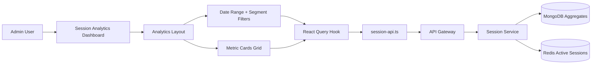
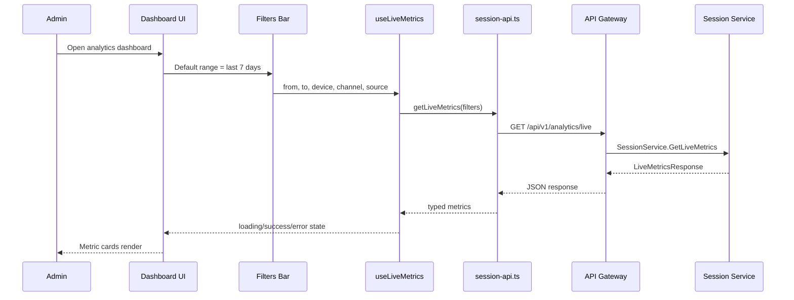
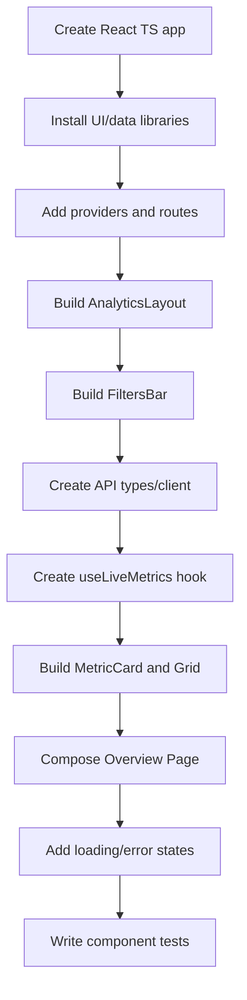

# 📊 Session Analytics Dashboard Service - Task 1: Analytics Shell


## 📌 Task Summary

| Field | Detail |
|---|---|
| Task Name | Analytics shell |
| Source | `docs/01-micro-tasks.md` → `Session Analytics Dashboard` → Task 1 |
| Priority | `P1` core dashboard capability |
| Dependency | Session APIs |
| Main Goal | Date range, segment filters, aur metric cards layout banana |
| Output Type | Structured implementation guide |
| Not Included | Active sessions page, journey explorer, funnel analysis, heatmap view, retention reports, backend Session Service implementation |

> **Simple Hinglish goal:** Is task ka kaam Session Analytics Dashboard ka base shell banana hai. Admin ko ek clean, data-heavy screen milegi jahan top par date range aur segment filters honge, aur neeche important metrics cards me scannable format me dikhengi.

---

## ✅ Final Output Created

```text
TaskImplementation/
└── Session Analytics Dashboard Service/
    └── task1.md
```

### Why this structure?

- `TaskImplementation/` task-wise implementation guides ke liye central folder hai.
- `Session Analytics Dashboard Service/` folder user requirement ke according create kiya gaya.
- `task1.md` sirf **Session Analytics Dashboard Service - Task 1** ka guide hai.
- Is task me actual frontend/backend source files create nahi kiye gaye, kyunki requested output only folder structure aur markdown guide hai.

---

## 🧭 Documentation Sources Studied

| Document | Kya use kiya gaya |
|---|---|
| `docs/01-micro-tasks.md` | Task 1 ka exact scope: date range, segment filters, metric cards layout |
| `docs/03-folder-structure.md` | `frontend/session-analytics-dashboard/` ka recommended folder layout |
| `docs/08-session-management-system.md` | Analytics metrics, dashboard views, Session API endpoints |
| `docs/10-frontend-implementation.md` | Frontend stack direction: React, TypeScript, Tailwind, data-heavy dashboard |
| `docs/04-microservice-design.md` | Session Service responsibilities and analytics API ownership |
| `api/master-api.json` | `GET /api/v1/analytics/live` route and `SessionService.GetLiveMetrics` mapping |

---

## 🧱 Task Boundary

### ✅ Included in Task 1

- Analytics dashboard shell layout
- Date range selector
- Segment filters
- Metric cards grid
- Loading, error, and empty states
- API client structure for live metrics endpoint
- Beginner-friendly React + TypeScript examples
- Mermaid architecture and flow diagrams
- External libraries/tools explanation
- Clean target folder structure

### ❌ Not Included in Task 1

- Live active sessions list/map
- Journey timeline/replay explorer
- Funnel chart implementation
- Heatmap canvas/overlay
- Cohort retention reports
- Device/browser detail reports
- Privacy controls page
- Backend Session Service code
- Database schema/migrations
- Auth/RBAC implementation internals

> 🟢 **Rule:** Task 1 sirf dashboard ka base surface banata hai. Baaki analytics pages future tasks me add honge.

---

## 🗂️ Target Folder Structure

Docs ke according Session Analytics Dashboard ka final frontend app ye shape follow karega. Task 1 ke liye highlighted files shell, filters, metric cards, aur API base ke around rahenge.

```text
frontend/session-analytics-dashboard/
├── package.json
├── vite.config.ts
├── tailwind.config.ts
├── index.html
└── src/
    ├── main.tsx
    ├── app.tsx
    ├── layout/
    │   ├── analytics-layout.tsx
    │   └── filters-bar.tsx
    ├── features/
    │   └── shell/
    │       ├── pages/
    │       │   └── analytics-overview-page.tsx
    │       ├── components/
    │       │   ├── metric-card.tsx
    │       │   ├── metric-card-grid.tsx
    │       │   └── segment-filter-panel.tsx
    │       └── hooks/
    │           └── use-live-metrics.ts
    ├── api/
    │   └── session-api.ts
    ├── lib/
    │   ├── date-range.ts
    │   └── format.ts
    └── styles/
        └── globals.css
```

### Folder Responsibility

| Path | Responsibility |
|---|---|
| `src/main.tsx` | React app bootstrap |
| `src/app.tsx` | Router, providers, and first route setup |
| `src/layout/analytics-layout.tsx` | Sidebar/topbar/content shell |
| `src/layout/filters-bar.tsx` | Date range + segment filters ka sticky control area |
| `src/features/shell/pages/analytics-overview-page.tsx` | Task 1 overview screen |
| `src/features/shell/components/metric-card.tsx` | Single metric card UI |
| `src/features/shell/components/metric-card-grid.tsx` | Metrics cards responsive grid |
| `src/features/shell/components/segment-filter-panel.tsx` | Channel, device, source, and user-type filters |
| `src/features/shell/hooks/use-live-metrics.ts` | Metrics fetch hook |
| `src/api/session-api.ts` | Session Analytics API client |
| `src/lib/date-range.ts` | Date presets and range helpers |
| `src/lib/format.ts` | Number, percent, duration formatting helpers |

---

## 🧩 High-Level Architecture



**Hinglish explanation:**  
Admin dashboard open karta hai. Dashboard shell top-level layout render karta hai. Filters date range aur segment state maintain karte hain. Metric cards same filters ke basis par Session API se metrics load karke dikhate hain.

---

## 🔄 Task 1 Data Flow



---

## 🪜 Step-by-Step Implementation

### Step 1: React + TypeScript app setup define karo

Session Analytics Dashboard frontend ek separate Vite React TypeScript app hoga.

```bash
npm create vite@latest frontend/session-analytics-dashboard -- --template react-ts
cd frontend/session-analytics-dashboard
npm install
```

**Explanation:**  
Vite fast dev server aur build tool provide karta hai. TypeScript dashboard data contracts ko typed rakhta hai, jisse API response aur UI mismatch jaldi catch hota hai.

---

### Step 2: Required libraries install karo

```bash
npm install @tanstack/react-query react-router-dom lucide-react date-fns
npm install -D tailwindcss postcss autoprefixer vitest @testing-library/react @testing-library/jest-dom jsdom msw
```

### External Libraries / Tools

| Library/Tool | What it is | Why used | How to use |
|---|---|---|---|
| Vite | Frontend build tool | Fast local dev and optimized production build | `npm run dev`, `npm run build` |
| React | UI library | Component-based dashboard UI banane ke liye | Components like `MetricCard`, `FiltersBar` |
| TypeScript | Typed JavaScript | API data aur UI props safe rakhne ke liye | `.tsx` and `.ts` files |
| Tailwind CSS | Utility-first CSS | Dense dashboard UI quickly and consistently style karne ke liye | `className` utilities |
| React Router | Client-side routing | Future pages like live, journey, funnels add karne ke liye | `<Routes>` and `<Route>` |
| TanStack Query | Server-state library | API loading, cache, refetch, error state manage karne ke liye | `useQuery` |
| lucide-react | Icon library | Metric cards and filters me consistent icons ke liye | `import { Activity } from "lucide-react"` |
| date-fns | Date utility | Presets and date formatting simple rakhne ke liye | `format`, `subDays` |
| Vitest + Testing Library | Test tools | Components and hooks verify karne ke liye | `npm run test` |
| MSW | API mocking tool | Dashboard tests me fake Session API response dene ke liye | Mock `GET /api/v1/analytics/live` |

> 🟡 **Note:** Charts library Task 1 me required nahi hai. Funnel, heatmap, cohort charts future tasks me add honge.

---

### Step 3: Global app providers setup karo

`TanStack Query` provider app root par add hota hai, taaki dashboard components API data safely fetch kar sake.

```tsx
// src/main.tsx
import React from "react";
import ReactDOM from "react-dom/client";
import { QueryClient, QueryClientProvider } from "@tanstack/react-query";
import { BrowserRouter } from "react-router-dom";
import { App } from "./app";
import "./styles/globals.css";

const queryClient = new QueryClient({
  defaultOptions: {
    queries: {
      staleTime: 30_000,
      refetchOnWindowFocus: false,
    },
  },
});

ReactDOM.createRoot(document.getElementById("root")!).render(
  <React.StrictMode>
    <QueryClientProvider client={queryClient}>
      <BrowserRouter>
        <App />
      </BrowserRouter>
    </QueryClientProvider>
  </React.StrictMode>,
);
```

**Explanation:**  
Dashboard data har filter change par reload ho sakta hai. QueryClient caching aur loading state automatic handle karta hai.

---

### Step 4: App route define karo

Task 1 me ek overview route enough hai. Future tasks isi app me nested pages add karenge.

```tsx
// src/app.tsx
import { Route, Routes } from "react-router-dom";
import { AnalyticsLayout } from "./layout/analytics-layout";
import { AnalyticsOverviewPage } from "./features/shell/pages/analytics-overview-page";

export function App() {
  return (
    <Routes>
      <Route element={<AnalyticsLayout />}>
        <Route path="/" element={<AnalyticsOverviewPage />} />
      </Route>
    </Routes>
  );
}
```

**Explanation:**  
`AnalyticsLayout` common shell hai. Iske andar overview page render hota hai. Later `live`, `journey`, `funnels`, `heatmaps` pages yahi route tree me add honge.

---

### Step 5: Analytics layout build karo

Dashboard ko marketing page jaisa nahi banana. Ye admin/data-heavy UI hai, isliye compact topbar, clear content width, aur readable spacing use karna hai.

```tsx
// src/layout/analytics-layout.tsx
import { NavLink, Outlet } from "react-router-dom";
import { Gauge } from "lucide-react";

const navItems = [
  { label: "Overview", href: "/", icon: Gauge },
];

export function AnalyticsLayout() {
  return (
    <div className="min-h-screen bg-slate-50 text-slate-950">
      <aside className="fixed inset-y-0 left-0 hidden w-64 border-r border-slate-200 bg-white lg:block">
        <div className="border-b border-slate-200 px-5 py-4">
          <p className="text-sm font-semibold text-slate-500">Analytics</p>
          <h1 className="text-lg font-semibold">Session Dashboard</h1>
        </div>

        <nav className="space-y-1 p-3">
          {navItems.map((item) => {
            const Icon = item.icon;

            return (
              <NavLink
                key={item.href}
                to={item.href}
                className={({ isActive }) =>
                  [
                    "flex items-center gap-3 rounded-md px-3 py-2 text-sm font-medium",
                    isActive
                      ? "bg-slate-900 text-white"
                      : "text-slate-700 hover:bg-slate-100",
                  ].join(" ")
                }
              >
                <Icon className="h-4 w-4" aria-hidden="true" />
                {item.label}
              </NavLink>
            );
          })}
        </nav>
      </aside>

      <main className="min-h-screen lg:pl-64">
        <Outlet />
      </main>
    </div>
  );
}
```

**Explanation:**  
Layout reusable hai. Task 1 me sirf `Overview` navigation rakha gaya hai, taaki Active Sessions, Journey, Funnels, Heatmaps jaise future tasks accidentally implement na ho jayein.

---

### Step 6: Date range model define karo

Date range dashboard ka primary control hai. API request me `from` and `to` ISO date strings jayenge.

```ts
// src/lib/date-range.ts
import { format, subDays } from "date-fns";

export type DatePreset = "today" | "7d" | "30d" | "custom";

export type DateRange = {
  preset: DatePreset;
  from: string;
  to: string;
};

const toISODate = (date: Date) => format(date, "yyyy-MM-dd");

export function getDefaultDateRange(): DateRange {
  const today = new Date();

  return {
    preset: "7d",
    from: toISODate(subDays(today, 6)),
    to: toISODate(today),
  };
}
```

**Explanation:**  
Default last 7 days rakha gaya, kyunki analytics dashboard me recent trend most useful hota hai. `custom` option future manual date picker ke liye ready hai.

---

### Step 7: Segment filters model banao

Segment filters dashboard ko powerful banate hain. Admin device, channel, source, aur user type ke basis par metrics slice kar sakta hai.

```ts
// src/features/shell/components/segment-filter-panel.tsx
export type SegmentFilters = {
  deviceType: "all" | "desktop" | "mobile" | "tablet";
  channel: "all" | "web" | "mobile_web" | "app";
  source: "all" | "direct" | "search" | "paid" | "social" | "email";
  userType: "all" | "anonymous" | "logged_in";
};

type SegmentFilterPanelProps = {
  value: SegmentFilters;
  onChange: (value: SegmentFilters) => void;
};

const deviceOptions = ["all", "desktop", "mobile", "tablet"] as const;
const channelOptions = ["all", "web", "mobile_web", "app"] as const;
const sourceOptions = ["all", "direct", "search", "paid", "social", "email"] as const;
const userTypeOptions = ["all", "anonymous", "logged_in"] as const;

export function SegmentFilterPanel({ value, onChange }: SegmentFilterPanelProps) {
  return (
    <div className="grid gap-3 md:grid-cols-4">
      <FilterSelect
        label="Device"
        value={value.deviceType}
        options={deviceOptions}
        onChange={(deviceType) => onChange({ ...value, deviceType })}
      />
      <FilterSelect
        label="Channel"
        value={value.channel}
        options={channelOptions}
        onChange={(channel) => onChange({ ...value, channel })}
      />
      <FilterSelect
        label="Source"
        value={value.source}
        options={sourceOptions}
        onChange={(source) => onChange({ ...value, source })}
      />
      <FilterSelect
        label="User Type"
        value={value.userType}
        options={userTypeOptions}
        onChange={(userType) => onChange({ ...value, userType })}
      />
    </div>
  );
}

type FilterSelectProps<T extends string> = {
  label: string;
  value: T;
  options: readonly T[];
  onChange: (value: T) => void;
};

function FilterSelect<T extends string>({
  label,
  value,
  options,
  onChange,
}: FilterSelectProps<T>) {
  return (
    <label className="block">
      <span className="mb-1 block text-xs font-medium uppercase tracking-wide text-slate-500">
        {label}
      </span>
      <select
        className="h-10 w-full rounded-md border border-slate-300 bg-white px-3 text-sm outline-none focus:border-slate-900"
        value={value}
        onChange={(event) => onChange(event.target.value as T)}
      >
        {options.map((option) => (
          <option key={option} value={option}>
            {option.replace("_", " ")}
          </option>
        ))}
      </select>
    </label>
  );
}
```

**Explanation:**  
Filters typed hain, so invalid values accidentally API me nahi jayenge. `select` controls beginner-friendly aur accessible hain.

---

### Step 8: Filters bar compose karo

Filters bar top par sticky rakho, taaki scroll karte time admin context lose na kare.

```tsx
// src/layout/filters-bar.tsx
import type { DateRange } from "../lib/date-range";
import {
  SegmentFilterPanel,
  type SegmentFilters,
} from "../features/shell/components/segment-filter-panel";

type FiltersBarProps = {
  dateRange: DateRange;
  filters: SegmentFilters;
  onDateRangeChange: (range: DateRange) => void;
  onFiltersChange: (filters: SegmentFilters) => void;
};

export function FiltersBar({
  dateRange,
  filters,
  onDateRangeChange,
  onFiltersChange,
}: FiltersBarProps) {
  return (
    <section className="sticky top-0 z-10 border-b border-slate-200 bg-white/95 px-4 py-4 backdrop-blur lg:px-6">
      <div className="mb-4 flex flex-col gap-3 md:flex-row md:items-end md:justify-between">
        <div>
          <h2 className="text-xl font-semibold">Overview</h2>
          <p className="text-sm text-slate-500">
            Session health, conversion signals, and engagement summary.
          </p>
        </div>

        <div className="grid grid-cols-2 gap-2">
          <DateInput
            label="From"
            value={dateRange.from}
            onChange={(from) => onDateRangeChange({ ...dateRange, from, preset: "custom" })}
          />
          <DateInput
            label="To"
            value={dateRange.to}
            onChange={(to) => onDateRangeChange({ ...dateRange, to, preset: "custom" })}
          />
        </div>
      </div>

      <SegmentFilterPanel value={filters} onChange={onFiltersChange} />
    </section>
  );
}

type DateInputProps = {
  label: string;
  value: string;
  onChange: (value: string) => void;
};

function DateInput({ label, value, onChange }: DateInputProps) {
  return (
    <label className="block">
      <span className="mb-1 block text-xs font-medium uppercase tracking-wide text-slate-500">
        {label}
      </span>
      <input
        type="date"
        className="h-10 rounded-md border border-slate-300 bg-white px-3 text-sm outline-none focus:border-slate-900"
        value={value}
        onChange={(event) => onChange(event.target.value)}
      />
    </label>
  );
}
```

**Explanation:**  
Date input native rakha gaya, isliye extra date picker dependency ki zarurat nahi. Shell clean aur maintainable rehta hai.

---

### Step 9: API types and client banao

Task 1 ke metric cards ke liye main endpoint:

```text
GET /api/v1/analytics/live
```

`api/master-api.json` ke according ye route `SessionService.GetLiveMetrics` se mapped hai aur admin auth required hai.

```ts
// src/api/session-api.ts
import type { DateRange } from "../lib/date-range";
import type { SegmentFilters } from "../features/shell/components/segment-filter-panel";

export type MetricTrend = {
  direction: "up" | "down" | "flat";
  percentage: number;
};

export type LiveMetricsResponse = {
  activeUsersNow: number;
  sessionsToday: number;
  conversionRate: number;
  averageSessionDurationSeconds: number;
  bounceRate: number;
  productViewToCartRate: number;
};

export type LiveMetricsRequest = {
  dateRange: DateRange;
  filters: SegmentFilters;
};

export async function getLiveMetrics(
  request: LiveMetricsRequest,
): Promise<LiveMetricsResponse> {
  const params = new URLSearchParams({
    from: request.dateRange.from,
    to: request.dateRange.to,
    device_type: request.filters.deviceType,
    channel: request.filters.channel,
    source: request.filters.source,
    user_type: request.filters.userType,
  });

  const response = await fetch(`/api/v1/analytics/live?${params.toString()}`, {
    headers: {
      Accept: "application/json",
    },
    credentials: "include",
  });

  if (!response.ok) {
    throw new Error("Analytics metrics load nahi ho paayi.");
  }

  return response.json();
}
```

**Explanation:**  
API client UI se separate hai. Component directly `fetch` call nahi karta. Isse testability better hoti hai aur future me auth headers/base URL centralize karna easy rahega.

---

### Step 10: Data hook banao

```ts
// src/features/shell/hooks/use-live-metrics.ts
import { useQuery } from "@tanstack/react-query";
import { getLiveMetrics, type LiveMetricsRequest } from "../../../api/session-api";

export function useLiveMetrics(request: LiveMetricsRequest) {
  return useQuery({
    queryKey: ["analytics", "live-metrics", request],
    queryFn: () => getLiveMetrics(request),
  });
}
```

**Explanation:**  
Query key me filters include hain. Jab date range ya segment filter change hota hai, hook automatically fresh data fetch karega.

---

### Step 11: Formatting helpers banao

```ts
// src/lib/format.ts
export function formatNumber(value: number): string {
  return new Intl.NumberFormat("en-US").format(value);
}

export function formatPercent(value: number): string {
  return `${value.toFixed(1)}%`;
}

export function formatDuration(seconds: number): string {
  const minutes = Math.floor(seconds / 60);
  const remainingSeconds = seconds % 60;

  return `${minutes}m ${remainingSeconds}s`;
}
```

**Explanation:**  
Metric card me raw number directly show karna noisy lagta hai. Format helpers UI ko consistent aur readable banate hain.

---

### Step 12: Metric card component banao

```tsx
// src/features/shell/components/metric-card.tsx
import type { LucideIcon } from "lucide-react";

type MetricCardProps = {
  label: string;
  value: string;
  helper: string;
  icon: LucideIcon;
  tone?: "neutral" | "good" | "warning";
};

const toneStyles = {
  neutral: "border-slate-200 bg-white text-slate-900",
  good: "border-emerald-200 bg-emerald-50 text-emerald-950",
  warning: "border-amber-200 bg-amber-50 text-amber-950",
};

export function MetricCard({
  label,
  value,
  helper,
  icon: Icon,
  tone = "neutral",
}: MetricCardProps) {
  return (
    <article className={`rounded-lg border p-4 shadow-sm ${toneStyles[tone]}`}>
      <div className="flex items-center justify-between gap-3">
        <p className="text-sm font-medium text-slate-600">{label}</p>
        <Icon className="h-4 w-4 text-slate-500" aria-hidden="true" />
      </div>
      <p className="mt-3 text-2xl font-semibold tracking-normal">{value}</p>
      <p className="mt-1 text-sm text-slate-500">{helper}</p>
    </article>
  );
}
```

**Explanation:**  
Metric card reusable hai. `tone` se important state highlight hoti hai without loud colors. Border radius 8px rakha gaya, dashboard UI professional aur compact lagta hai.

---

### Step 13: Metric card grid banao

```tsx
// src/features/shell/components/metric-card-grid.tsx
import { Activity, Clock3, MousePointerClick, ShoppingCart, TrendingUp, Users } from "lucide-react";
import type { LiveMetricsResponse } from "../../../api/session-api";
import { formatDuration, formatNumber, formatPercent } from "../../../lib/format";
import { MetricCard } from "./metric-card";

type MetricCardGridProps = {
  metrics: LiveMetricsResponse;
};

export function MetricCardGrid({ metrics }: MetricCardGridProps) {
  return (
    <section className="grid gap-4 sm:grid-cols-2 xl:grid-cols-3">
      <MetricCard
        label="Active Users Now"
        value={formatNumber(metrics.activeUsersNow)}
        helper="Currently active sessions"
        icon={Activity}
        tone="good"
      />
      <MetricCard
        label="Sessions Today"
        value={formatNumber(metrics.sessionsToday)}
        helper="Sessions started today"
        icon={Users}
      />
      <MetricCard
        label="Conversion Rate"
        value={formatPercent(metrics.conversionRate)}
        helper="Checkout to paid conversion"
        icon={TrendingUp}
        tone="good"
      />
      <MetricCard
        label="Avg. Session Duration"
        value={formatDuration(metrics.averageSessionDurationSeconds)}
        helper="Mean engagement time"
        icon={Clock3}
      />
      <MetricCard
        label="Bounce Rate"
        value={formatPercent(metrics.bounceRate)}
        helper="Single-page sessions"
        icon={MousePointerClick}
        tone={metrics.bounceRate > 60 ? "warning" : "neutral"}
      />
      <MetricCard
        label="View to Cart Rate"
        value={formatPercent(metrics.productViewToCartRate)}
        helper="Product views becoming carts"
        icon={ShoppingCart}
      />
    </section>
  );
}
```

**Explanation:**  
Grid responsive hai: mobile par single column, tablet par 2 columns, desktop par 3 columns. Ye data-heavy dashboard ko scannable banata hai.

---

### Step 14: Overview page compose karo

```tsx
// src/features/shell/pages/analytics-overview-page.tsx
import { useMemo, useState } from "react";
import { FiltersBar } from "../../../layout/filters-bar";
import { getDefaultDateRange } from "../../../lib/date-range";
import { MetricCardGrid } from "../components/metric-card-grid";
import type { SegmentFilters } from "../components/segment-filter-panel";
import { useLiveMetrics } from "../hooks/use-live-metrics";

const defaultFilters: SegmentFilters = {
  deviceType: "all",
  channel: "all",
  source: "all",
  userType: "all",
};

export function AnalyticsOverviewPage() {
  const [dateRange, setDateRange] = useState(getDefaultDateRange);
  const [filters, setFilters] = useState<SegmentFilters>(defaultFilters);

  const request = useMemo(
    () => ({ dateRange, filters }),
    [dateRange, filters],
  );

  const metricsQuery = useLiveMetrics(request);

  return (
    <div>
      <FiltersBar
        dateRange={dateRange}
        filters={filters}
        onDateRangeChange={setDateRange}
        onFiltersChange={setFilters}
      />

      <div className="p-4 lg:p-6">
        {metricsQuery.isLoading && <MetricsLoadingState />}
        {metricsQuery.isError && <MetricsErrorState />}
        {metricsQuery.data && <MetricCardGrid metrics={metricsQuery.data} />}
      </div>
    </div>
  );
}

function MetricsLoadingState() {
  return (
    <div className="grid gap-4 sm:grid-cols-2 xl:grid-cols-3">
      {Array.from({ length: 6 }).map((_, index) => (
        <div
          key={index}
          className="h-32 animate-pulse rounded-lg border border-slate-200 bg-white"
        />
      ))}
    </div>
  );
}

function MetricsErrorState() {
  return (
    <div className="rounded-lg border border-red-200 bg-red-50 p-4 text-sm text-red-900">
      Metrics load nahi ho paayi. Date range ya filters change karke dobara try karo.
    </div>
  );
}
```

**Explanation:**  
Overview page state owner hai. Filters update hote hi `request` update hota hai, hook refetch karta hai, aur cards updated data render karte hain.

---

## 🎨 UI/UX Guidelines for Task 1

| Area | Guideline |
|---|---|
| Layout | Dense but clean dashboard. Marketing hero ya decorative cards avoid karo. |
| Colors | Neutral base with limited semantic colors: green for healthy, amber for warning, red for error. |
| Cards | Metric cards repeated items hain, isliye cards allowed hain. Nested cards avoid karo. |
| Typography | Compact headings, readable numbers, no viewport-based font scaling. |
| Filters | Always visible/sticky so admin current segment samajh sake. |
| Mobile | Single-column cards and stacked filters. |
| Accessibility | Labels, focus styles, icons with `aria-hidden`, readable contrast. |

---

## 🔐 Security and Privacy Notes

- Dashboard endpoints admin protected hone chahiye.
- User identifiers default masked hone chahiye.
- Raw IP address UI me show nahi karna.
- Filters sensitive personal data expose nahi karenge.
- `credentials: "include"` use karte time CSRF/session policy Gateway/Auth design ke according honi chahiye.
- Error messages me internal service details leak nahi karne.

---

## 🧪 Testing Plan

### Unit/component tests

| Test | Expected |
|---|---|
| `MetricCard` renders label/value/helper | Card readable output show kare |
| `SegmentFilterPanel` select change | `onChange` correct typed value ke saath call ho |
| `formatDuration(125)` | `2m 5s` return kare |
| `getDefaultDateRange()` | `preset = 7d` aur valid `from/to` return kare |

### API mock test with MSW

```ts
// Example only: src/features/shell/pages/analytics-overview-page.test.tsx
import { http, HttpResponse } from "msw";

export const handlers = [
  http.get("/api/v1/analytics/live", () =>
    HttpResponse.json({
      activeUsersNow: 42,
      sessionsToday: 1280,
      conversionRate: 3.8,
      averageSessionDurationSeconds: 245,
      bounceRate: 41.2,
      productViewToCartRate: 12.6,
    }),
  ),
];
```

**Explanation:**  
MSW real backend ke bina API behavior mock karta hai. Isse Task 1 UI independently test ho sakta hai.

---

## ✅ Acceptance Checklist

- [ ] Dashboard shell route open hota hai
- [ ] Date range controls visible hain
- [ ] Segment filters visible hain
- [ ] Metric cards responsive grid me render hote hain
- [ ] Loading state available hai
- [ ] Error state available hai
- [ ] API client `GET /api/v1/analytics/live` ke liye ready hai
- [ ] UI data-heavy, clean, and scannable hai
- [ ] Active sessions, journey, funnel, heatmap, retention code add nahi hua

---

## 🚦 Implementation Order



---

## 📦 API Contract Used in Task 1

| Field | Detail |
|---|---|
| Route | `GET /api/v1/analytics/live` |
| Service | `session-service` |
| gRPC Mapping | `SessionService.GetLiveMetrics` |
| Auth | `admin` |
| Request | Date range + segment filters |
| Response | Live metrics summary |

### Example request

```http
GET /api/v1/analytics/live?from=2026-05-22&to=2026-05-28&device_type=all&channel=all&source=all&user_type=all
Accept: application/json
```

### Example response

```json
{
  "activeUsersNow": 42,
  "sessionsToday": 1280,
  "conversionRate": 3.8,
  "averageSessionDurationSeconds": 245,
  "bounceRate": 41.2,
  "productViewToCartRate": 12.6
}
```

---

## 🧠 Beginner-Friendly Mental Model

```text
Filters decide karte hain: "Kaunsa data dekhna hai?"
API client fetch karta hai: "Backend se metrics lao."
Hook manage karta hai: "Loading, error, cache, refetch."
Metric cards dikhate hain: "Important numbers quickly scan karo."
Layout hold karta hai: "Dashboard ko professional structure do."
```

---

## 🏁 Final Notes

Task 1 ke baad dashboard ka base ready maana jayega: layout, filters, and metric cards. Iske baad Task 2 me **Active sessions** screen add hogi, jahan live users, devices, locations, and entry pages detail me show honge.
