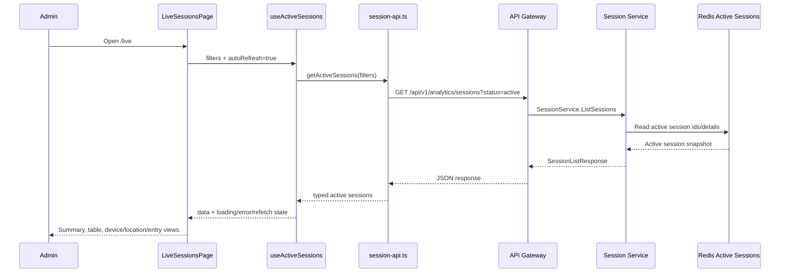
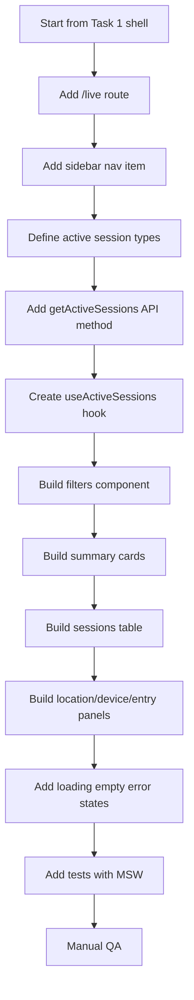

# 📊 Session Analytics Dashboard Service - Task 2: Active Sessions


## 📌 Task Summary

| Field | Detail |
|---|---|
| Task Name | Active sessions |
| Source | `docs/01-micro-tasks.md` → `Session Analytics Dashboard` → Task 2 |
| Priority | `P1` core dashboard capability |
| Dependency | Session Service |
| Main Goal | Live active users, devices, locations, aur entry pages ka view banana |
| Output Type | Structured implementation guide |
| Not Included | Journey explorer, funnel analysis, heatmap view, retention reports, export reports, privacy controls full page |

> **Simple Hinglish goal:** Is task ka kaam Session Analytics Dashboard ke andar ek **Live Active Sessions** page banana hai. Admin ko real-time style view milega jahan currently active sessions, unke devices, approximate locations, entry pages, aur last activity quickly scan ho sake.

---

## ✅ Final Output Created

```text
TaskImplementation/
└── Session Analytics Dashboard Service/
    ├── task1.md
    └── task2.md
```

### Why this structure?

- `TaskImplementation/` implementation guides ka central folder hai.
- `Session Analytics Dashboard Service/` folder already exist karta hai, isliye usko keep kiya gaya.
- `task2.md` sirf **Session Analytics Dashboard Service - Task 2** ka guide hai.
- Is file me frontend implementation steps, API contracts, components, diagrams, and examples diye gaye hain.
- Actual frontend/backend source files create nahi kiye gaye, kyunki requested output sirf folder structure aur markdown guide hai.

---

## 🧭 Documentation Sources Studied

| Document | Kya use kiya gaya |
|---|---|
| `docs/01-micro-tasks.md` | Task 2 ka exact scope: live active users, devices, locations, entry pages |
| `docs/03-folder-structure.md` | `frontend/session-analytics-dashboard/features/live/` folder recommendation |
| `docs/08-session-management-system.md` | Active session storage, dashboard APIs, device/location fields |
| `docs/10-frontend-implementation.md` | Data-heavy dashboard direction, filters visible, readable views |
| `docs/04-microservice-design.md` | Session Service ownership, Redis active sessions, REST/gRPC mapping |
| `api/master-api.json` | `GET /api/v1/analytics/sessions` and `GET /api/v1/analytics/live` contracts |

---

## 🧱 Task Boundary

### ✅ Included in Task 2

- Live active sessions page
- Active users and active sessions summary strip
- Active sessions table
- Device breakdown
- Location breakdown
- Entry pages breakdown
- Search and lightweight filters
- Auto-refresh polling
- Loading, error, and empty states
- API client examples for active sessions
- React Query hook examples
- Privacy-safe display rules
- Beginner-friendly tests with MSW

### ❌ Not Included in Task 2

- Full session journey timeline
- Click/scroll replay
- Funnel charts
- Heatmap rendering
- Cohort retention
- CSV/scheduled exports
- Backend Redis implementation
- Device parser implementation
- IP geolocation service implementation
- Suspicious activity detection page

> 🟢 **Rule:** Task 2 ka focus sirf active sessions visibility hai. Session ke andar events ki full timeline Task 3 me banegi.

---

## 🗂️ Clean Folder Structure

Task 1 ke shell ke upar Task 2 me `features/live/` module add hoga.

```text
frontend/session-analytics-dashboard/
├── package.json
├── vite.config.ts
├── tailwind.config.ts
├── index.html
└── src/
    ├── main.tsx
    ├── app.tsx
    ├── layout/
    │   ├── analytics-layout.tsx
    │   └── filters-bar.tsx
    ├── features/
    │   ├── shell/
    │   │   └── pages/
    │   │       └── analytics-overview-page.tsx
    │   └── live/
    │       ├── pages/
    │       │   └── live-sessions-page.tsx
    │       ├── components/
    │       │   ├── active-session-row.tsx
    │       │   ├── active-sessions-table.tsx
    │       │   ├── active-session-summary.tsx
    │       │   ├── active-user-map.tsx
    │       │   ├── device-breakdown-panel.tsx
    │       │   ├── entry-pages-panel.tsx
    │       │   └── live-session-filters.tsx
    │       └── hooks/
    │           └── use-active-sessions.ts
    ├── api/
    │   └── session-api.ts
    ├── lib/
    │   ├── date-range.ts
    │   ├── format.ts
    │   └── session-view.ts
    └── styles/
        └── globals.css
```

### Folder Responsibility

| Path | Responsibility |
|---|---|
| `src/features/live/pages/live-sessions-page.tsx` | Active sessions ka main page |
| `src/features/live/components/active-session-summary.tsx` | Active users, sessions, events/minute, refresh status cards |
| `src/features/live/components/live-session-filters.tsx` | Search, device, country, entry page filters |
| `src/features/live/components/active-sessions-table.tsx` | Live sessions table |
| `src/features/live/components/active-session-row.tsx` | Single session row render |
| `src/features/live/components/active-user-map.tsx` | Approx location distribution visualization |
| `src/features/live/components/device-breakdown-panel.tsx` | Device/browser count list |
| `src/features/live/components/entry-pages-panel.tsx` | Top entry pages list |
| `src/features/live/hooks/use-active-sessions.ts` | React Query based active sessions polling |
| `src/api/session-api.ts` | Session Analytics API client |
| `src/lib/session-view.ts` | UI helper functions for masking and labels |

---

## 🧩 High-Level Architecture

```mermaid
flowchart LR
    Admin[Admin User] --> Browser[Session Analytics Dashboard]
    Browser --> Route[/live route]
    Route --> Page[LiveSessionsPage]
    Page --> Filters[LiveSessionFilters]
    Page --> Summary[ActiveSessionSummary]
    Page --> Table[ActiveSessionsTable]
    Page --> Map[ActiveUserMap]
    Page --> Devices[DeviceBreakdownPanel]
    Page --> Entries[EntryPagesPanel]
    Filters --> Hook[useActiveSessions]
    Summary --> Hook
    Table --> Hook
    Map --> Hook
    Devices --> Hook
    Entries --> Hook
    Hook --> API[session-api.ts]
    API --> Gateway[API Gateway]
    Gateway --> Session[Session Service]
    Session --> Redis[(Redis Active Sessions)]
    Session --> Mongo[(MongoDB Session Summaries)]
```

**Hinglish explanation:**  
Admin `/live` page open karta hai. Page filters maintain karta hai and `useActiveSessions` hook data fetch karta hai. Session Service active sessions Redis se quickly read karta hai, aur session summary/details MongoDB se enrich ho sakte hain.

---

## 🔄 Active Sessions Data Flow



---

## 🪜 Step-by-Step Implementation

## Step 1: Task 1 shell ke upar route add karo

Task 1 me base shell, filters, metric cards, and API setup ready maana gaya hai. Task 2 me usi app ke andar `/live` route add hoga.

```tsx
// src/app.tsx
import { Navigate, Route, Routes } from "react-router-dom";
import { AnalyticsLayout } from "./layout/analytics-layout";
import { AnalyticsOverviewPage } from "./features/shell/pages/analytics-overview-page";
import { LiveSessionsPage } from "./features/live/pages/live-sessions-page";

export function App() {
  return (
    <Routes>
      <Route element={<AnalyticsLayout />}>
        <Route index element={<AnalyticsOverviewPage />} />
        <Route path="/live" element={<LiveSessionsPage />} />
        <Route path="*" element={<Navigate to="/" replace />} />
      </Route>
    </Routes>
  );
}
```

**Explanation:**  
`LiveSessionsPage` ko same dashboard shell ke andar render kiya gaya. Isse sidebar/topbar same rahega aur admin ko app ka navigation consistent feel hoga.

---

## Step 2: Sidebar navigation me Live Sessions item add karo

```tsx
// src/layout/analytics-layout.tsx
import { Activity, Gauge } from "lucide-react";
import { NavLink, Outlet } from "react-router-dom";

const navItems = [
  { label: "Overview", href: "/", icon: Gauge },
  { label: "Live Sessions", href: "/live", icon: Activity },
];

export function AnalyticsLayout() {
  return (
    <div className="min-h-screen bg-slate-950 text-slate-100">
      <aside className="fixed inset-y-0 left-0 w-64 border-r border-slate-800 bg-slate-950">
        <div className="px-5 py-4 text-sm font-semibold tracking-wide">
          Session Analytics
        </div>

        <nav className="space-y-1 px-3">
          {navItems.map((item) => {
            const Icon = item.icon;

            return (
              <NavLink
                key={item.href}
                to={item.href}
                className={({ isActive }) =>
                  [
                    "flex items-center gap-3 rounded-md px-3 py-2 text-sm",
                    isActive
                      ? "bg-cyan-500/15 text-cyan-200"
                      : "text-slate-400 hover:bg-slate-900 hover:text-slate-100",
                  ].join(" ")
                }
              >
                <Icon className="h-4 w-4" aria-hidden="true" />
                {item.label}
              </NavLink>
            );
          })}
        </nav>
      </aside>

      <main className="pl-64">
        <Outlet />
      </main>
    </div>
  );
}
```

**Explanation:**  
Task 2 ke liye navigation me sirf ek naya item add hota hai. `lucide-react` ka `Activity` icon live traffic ko represent karta hai.

---

## Step 3: API contract define karo

Docs ke according Session Service ke dashboard APIs:

| Endpoint | Purpose | Auth |
|---|---|---|
| `GET /api/v1/analytics/live` | Live counters: active users, sessions, events/minute | Admin |
| `GET /api/v1/analytics/sessions` | Session list | Admin |

Task 2 active sessions list ke liye `GET /api/v1/analytics/sessions` use karega. Backend internally active data Redis se read karega.

### Suggested query params

```text
GET /api/v1/analytics/sessions
  ?status=active
  &from=2026-05-28T00:00:00.000Z
  &to=2026-05-28T23:59:59.999Z
  &device_type=desktop
  &country=India
  &entry_page=/products
  &q=anon_123
  &limit=50
```

> 🟡 **Note:** `api/master-api.json` me base `SessionListRequest` currently `user_id`, `from`, `to` support karta hai. Task 2 frontend active sessions use-case ke liye `status=active`, `device_type`, `country`, `entry_page`, `q`, and `limit` ko frontend-friendly extension ke roop me document karta hai. Backend contract update future API alignment me ho sakta hai, but UI code ko typed and isolated rakha jayega.

---

## Step 4: TypeScript types banao

```ts
// src/api/session-api.ts
export type DeviceType = "desktop" | "mobile" | "tablet" | "unknown";

export type ActiveSessionDevice = {
  type: DeviceType;
  browser?: string;
  os?: string;
  userAgent?: string;
};

export type ActiveSessionLocation = {
  country?: string;
  region?: string;
  city?: string;
};

export type ActiveSession = {
  sessionId: string;
  anonymousId: string;
  maskedUserId?: string;
  startedAt: string;
  lastSeenAt: string;
  durationSeconds: number;
  entryPage: string;
  currentPage?: string;
  eventCount: number;
  device: ActiveSessionDevice;
  location: ActiveSessionLocation;
  channel?: string;
  source?: string;
};

export type ActiveSessionBreakdownItem = {
  label: string;
  count: number;
  percentage: number;
};

export type ActiveSessionsRequest = {
  from?: string;
  to?: string;
  q?: string;
  deviceType?: DeviceType | "all";
  country?: string;
  entryPage?: string;
  limit?: number;
};

export type ActiveSessionsResponse = {
  activeUsers: number;
  activeSessions: number;
  eventsPerMinute: number;
  refreshedAt: string;
  sessions: ActiveSession[];
  deviceBreakdown: ActiveSessionBreakdownItem[];
  locationBreakdown: ActiveSessionBreakdownItem[];
  entryPageBreakdown: ActiveSessionBreakdownItem[];
};
```

**Explanation:**  
Types ko UI ke need ke according clean rakha gaya hai. Backend snake_case response de sakta hai, lekin frontend me camelCase view model use karna readable hota hai.

---

## Step 5: API client method add karo

```ts
// src/api/session-api.ts
function appendParam(params: URLSearchParams, key: string, value?: string | number) {
  if (value === undefined || value === null || value === "" || value === "all") {
    return;
  }

  params.set(key, String(value));
}

export async function getActiveSessions(
  request: ActiveSessionsRequest,
  signal?: AbortSignal,
): Promise<ActiveSessionsResponse> {
  const params = new URLSearchParams();

  params.set("status", "active");
  appendParam(params, "from", request.from);
  appendParam(params, "to", request.to);
  appendParam(params, "q", request.q);
  appendParam(params, "device_type", request.deviceType);
  appendParam(params, "country", request.country);
  appendParam(params, "entry_page", request.entryPage);
  appendParam(params, "limit", request.limit ?? 50);

  const response = await fetch(`/api/v1/analytics/sessions?${params.toString()}`, {
    method: "GET",
    credentials: "include",
    headers: {
      Accept: "application/json",
    },
    signal,
  });

  if (!response.ok) {
    throw new Error("Active sessions load nahi ho paye.");
  }

  return response.json() as Promise<ActiveSessionsResponse>;
}
```

**Explanation:**  
API client me query param building centralize kiya gaya hai. UI components direct `fetch` nahi karte, taaki later API response mapping ya auth changes ek hi jagah handle ho.

---

## Step 6: React Query hook banao

```ts
// src/features/live/hooks/use-active-sessions.ts
import { useQuery } from "@tanstack/react-query";
import {
  getActiveSessions,
  type ActiveSessionsRequest,
} from "../../../api/session-api";

type UseActiveSessionsOptions = {
  request: ActiveSessionsRequest;
  autoRefresh: boolean;
};

export function useActiveSessions({
  request,
  autoRefresh,
}: UseActiveSessionsOptions) {
  return useQuery({
    queryKey: ["analytics", "active-sessions", request],
    queryFn: ({ signal }) => getActiveSessions(request, signal),
    refetchInterval: autoRefresh ? 15_000 : false,
    staleTime: 10_000,
  });
}
```

**Explanation:**  
Active sessions live screen hai, isliye polling useful hai. `15_000 ms` refresh interval balanced hai: data fresh rahega aur backend par unnecessary pressure nahi padega.

---

## Step 7: Live page state design karo

```tsx
// src/features/live/pages/live-sessions-page.tsx
import { useMemo, useState } from "react";
import { ActiveSessionSummary } from "../components/active-session-summary";
import { ActiveSessionsTable } from "../components/active-sessions-table";
import { ActiveUserMap } from "../components/active-user-map";
import { DeviceBreakdownPanel } from "../components/device-breakdown-panel";
import { EntryPagesPanel } from "../components/entry-pages-panel";
import { LiveSessionFilters } from "../components/live-session-filters";
import { useActiveSessions } from "../hooks/use-active-sessions";
import type { ActiveSessionsRequest, DeviceType } from "../../../api/session-api";

export function LiveSessionsPage() {
  const [query, setQuery] = useState("");
  const [deviceType, setDeviceType] = useState<DeviceType | "all">("all");
  const [country, setCountry] = useState("");
  const [entryPage, setEntryPage] = useState("");
  const [autoRefresh, setAutoRefresh] = useState(true);

  const request = useMemo<ActiveSessionsRequest>(
    () => ({
      q: query,
      deviceType,
      country,
      entryPage,
      limit: 50,
    }),
    [query, deviceType, country, entryPage],
  );

  const activeSessionsQuery = useActiveSessions({ request, autoRefresh });
  const data = activeSessionsQuery.data;

  return (
    <div className="min-h-screen bg-slate-950 px-6 py-5">
      <div className="mb-5 flex flex-wrap items-center justify-between gap-3">
        <div>
          <p className="text-xs font-medium uppercase tracking-wide text-cyan-300">
            Live traffic
          </p>
          <h1 className="text-2xl font-semibold text-slate-50">
            Active sessions
          </h1>
        </div>
      </div>

      <LiveSessionFilters
        query={query}
        deviceType={deviceType}
        country={country}
        entryPage={entryPage}
        autoRefresh={autoRefresh}
        onQueryChange={setQuery}
        onDeviceTypeChange={setDeviceType}
        onCountryChange={setCountry}
        onEntryPageChange={setEntryPage}
        onAutoRefreshChange={setAutoRefresh}
        onRefresh={() => activeSessionsQuery.refetch()}
      />

      <ActiveSessionSummary
        data={data}
        isLoading={activeSessionsQuery.isLoading}
        isFetching={activeSessionsQuery.isFetching}
      />

      <div className="mt-5 grid gap-5 xl:grid-cols-[minmax(0,1fr)_360px]">
        <ActiveSessionsTable
          sessions={data?.sessions ?? []}
          isLoading={activeSessionsQuery.isLoading}
          error={activeSessionsQuery.error}
        />

        <div className="space-y-5">
          <ActiveUserMap locations={data?.locationBreakdown ?? []} />
          <DeviceBreakdownPanel devices={data?.deviceBreakdown ?? []} />
          <EntryPagesPanel pages={data?.entryPageBreakdown ?? []} />
        </div>
      </div>
    </div>
  );
}
```

**Explanation:**  
Page state simple rakha gaya hai. Filters local state me hain, data fetching hook me hai, aur rendering child components me split hai. Isse beginner ko clear separation samajh aata hai.

---

## Step 8: Filters component banao

```tsx
// src/features/live/components/live-session-filters.tsx
import { RefreshCw, Search } from "lucide-react";
import type { DeviceType } from "../../../api/session-api";

type LiveSessionFiltersProps = {
  query: string;
  deviceType: DeviceType | "all";
  country: string;
  entryPage: string;
  autoRefresh: boolean;
  onQueryChange: (value: string) => void;
  onDeviceTypeChange: (value: DeviceType | "all") => void;
  onCountryChange: (value: string) => void;
  onEntryPageChange: (value: string) => void;
  onAutoRefreshChange: (value: boolean) => void;
  onRefresh: () => void;
};

export function LiveSessionFilters(props: LiveSessionFiltersProps) {
  return (
    <section className="rounded-lg border border-slate-800 bg-slate-900/70 p-4">
      <div className="grid gap-3 lg:grid-cols-[minmax(220px,1fr)_160px_180px_220px_auto_auto]">
        <label className="relative block">
          <Search className="pointer-events-none absolute left-3 top-1/2 h-4 w-4 -translate-y-1/2 text-slate-500" />
          <input
            value={props.query}
            onChange={(event) => props.onQueryChange(event.target.value)}
            placeholder="Search session or masked user"
            className="h-10 w-full rounded-md border border-slate-700 bg-slate-950 pl-9 pr-3 text-sm text-slate-100 outline-none focus:border-cyan-400"
          />
        </label>

        <select
          value={props.deviceType}
          onChange={(event) =>
            props.onDeviceTypeChange(event.target.value as DeviceType | "all")
          }
          className="h-10 rounded-md border border-slate-700 bg-slate-950 px-3 text-sm text-slate-100 outline-none focus:border-cyan-400"
        >
          <option value="all">All devices</option>
          <option value="desktop">Desktop</option>
          <option value="mobile">Mobile</option>
          <option value="tablet">Tablet</option>
          <option value="unknown">Unknown</option>
        </select>

        <input
          value={props.country}
          onChange={(event) => props.onCountryChange(event.target.value)}
          placeholder="Country"
          className="h-10 rounded-md border border-slate-700 bg-slate-950 px-3 text-sm text-slate-100 outline-none focus:border-cyan-400"
        />

        <input
          value={props.entryPage}
          onChange={(event) => props.onEntryPageChange(event.target.value)}
          placeholder="Entry page"
          className="h-10 rounded-md border border-slate-700 bg-slate-950 px-3 text-sm text-slate-100 outline-none focus:border-cyan-400"
        />

        <label className="flex h-10 items-center gap-2 rounded-md border border-slate-700 bg-slate-950 px-3 text-sm text-slate-200">
          <input
            type="checkbox"
            checked={props.autoRefresh}
            onChange={(event) => props.onAutoRefreshChange(event.target.checked)}
            className="h-4 w-4 accent-cyan-400"
          />
          Auto refresh
        </label>

        <button
          type="button"
          onClick={props.onRefresh}
          className="inline-flex h-10 items-center justify-center gap-2 rounded-md bg-cyan-500 px-4 text-sm font-medium text-slate-950 hover:bg-cyan-400"
        >
          <RefreshCw className="h-4 w-4" aria-hidden="true" />
          Refresh
        </button>
      </div>
    </section>
  );
}
```

**Explanation:**  
Filters ek compact operational dashboard style me hain. Search session id ya masked user id ke liye useful hai. Device, country, entry page filters support team ko live traffic quickly narrow karne me help karte hain.

---

## Step 9: Summary cards banao

```tsx
// src/features/live/components/active-session-summary.tsx
import { Activity, Clock3, Radio, Users } from "lucide-react";
import type { ActiveSessionsResponse } from "../../../api/session-api";
import { formatNumber } from "../../../lib/format";

type ActiveSessionSummaryProps = {
  data?: ActiveSessionsResponse;
  isLoading: boolean;
  isFetching: boolean;
};

export function ActiveSessionSummary({
  data,
  isLoading,
  isFetching,
}: ActiveSessionSummaryProps) {
  const items = [
    {
      label: "Active users",
      value: data?.activeUsers,
      icon: Users,
    },
    {
      label: "Active sessions",
      value: data?.activeSessions,
      icon: Activity,
    },
    {
      label: "Events/min",
      value: data?.eventsPerMinute,
      icon: Radio,
    },
    {
      label: "Refresh state",
      value: isFetching ? "Refreshing" : "Fresh",
      icon: Clock3,
    },
  ];

  return (
    <section className="mt-5 grid gap-3 md:grid-cols-2 xl:grid-cols-4">
      {items.map((item) => {
        const Icon = item.icon;
        const value =
          typeof item.value === "number"
            ? formatNumber(item.value)
            : item.value ?? "-";

        return (
          <div
            key={item.label}
            className="rounded-lg border border-slate-800 bg-slate-900 p-4"
          >
            <div className="mb-3 flex items-center justify-between">
              <span className="text-sm text-slate-400">{item.label}</span>
              <Icon className="h-4 w-4 text-cyan-300" aria-hidden="true" />
            </div>
            <div className="text-2xl font-semibold text-slate-50">
              {isLoading ? "..." : value}
            </div>
          </div>
        );
      })}
    </section>
  );
}
```

**Explanation:**  
Summary strip admin ko first glance me traffic volume batata hai. `isFetching` ko separate dikhaya gaya hai, taaki background refresh ke time table jumpy na lage.

---

## Step 10: Session table banao

```tsx
// src/features/live/components/active-sessions-table.tsx
import type { ActiveSession } from "../../../api/session-api";
import { formatDuration, formatRelativeTime } from "../../../lib/format";
import { maskAnonymousId } from "../../../lib/session-view";

type ActiveSessionsTableProps = {
  sessions: ActiveSession[];
  isLoading: boolean;
  error: unknown;
};

export function ActiveSessionsTable({
  sessions,
  isLoading,
  error,
}: ActiveSessionsTableProps) {
  if (isLoading) {
    return (
      <section className="rounded-lg border border-slate-800 bg-slate-900 p-6 text-sm text-slate-400">
        Loading active sessions...
      </section>
    );
  }

  if (error) {
    return (
      <section className="rounded-lg border border-red-900/60 bg-red-950/30 p-6 text-sm text-red-200">
        Active sessions load nahi ho paye. Refresh karke dobara try karo.
      </section>
    );
  }

  if (sessions.length === 0) {
    return (
      <section className="rounded-lg border border-slate-800 bg-slate-900 p-6 text-sm text-slate-400">
        Current filters ke liye koi active session nahi mila.
      </section>
    );
  }

  return (
    <section className="overflow-hidden rounded-lg border border-slate-800 bg-slate-900">
      <div className="border-b border-slate-800 px-4 py-3">
        <h2 className="text-sm font-semibold text-slate-100">
          Live active sessions
        </h2>
      </div>

      <div className="overflow-x-auto">
        <table className="min-w-full divide-y divide-slate-800 text-left text-sm">
          <thead className="bg-slate-950/60 text-xs uppercase text-slate-500">
            <tr>
              <th className="px-4 py-3 font-medium">Session</th>
              <th className="px-4 py-3 font-medium">Device</th>
              <th className="px-4 py-3 font-medium">Location</th>
              <th className="px-4 py-3 font-medium">Entry page</th>
              <th className="px-4 py-3 font-medium">Current page</th>
              <th className="px-4 py-3 font-medium">Duration</th>
              <th className="px-4 py-3 font-medium">Last seen</th>
            </tr>
          </thead>
          <tbody className="divide-y divide-slate-800">
            {sessions.map((session) => (
              <tr key={session.sessionId} className="hover:bg-slate-800/40">
                <td className="px-4 py-3">
                  <div className="font-medium text-slate-100">
                    {maskAnonymousId(session.anonymousId)}
                  </div>
                  <div className="text-xs text-slate-500">
                    {session.sessionId}
                  </div>
                </td>
                <td className="px-4 py-3 text-slate-300">
                  <div className="capitalize">{session.device.type}</div>
                  <div className="text-xs text-slate-500">
                    {[session.device.browser, session.device.os]
                      .filter(Boolean)
                      .join(" · ") || "Unknown"}
                  </div>
                </td>
                <td className="px-4 py-3 text-slate-300">
                  {[session.location.city, session.location.country]
                    .filter(Boolean)
                    .join(", ") || "Unknown"}
                </td>
                <td className="px-4 py-3 text-slate-300">
                  {session.entryPage}
                </td>
                <td className="px-4 py-3 text-slate-300">
                  {session.currentPage ?? "-"}
                </td>
                <td className="px-4 py-3 text-slate-300">
                  {formatDuration(session.durationSeconds)}
                </td>
                <td className="px-4 py-3 text-slate-300">
                  {formatRelativeTime(session.lastSeenAt)}
                </td>
              </tr>
            ))}
          </tbody>
        </table>
      </div>
    </section>
  );
}
```

**Explanation:**  
Table ka layout scan-friendly hai. Sensitive values like anonymous/user identifiers mask karne ke liye helper use hota hai. Journey details yahan nahi dikhaye gaye, kyunki wo Task 3 ka scope hai.

---

## Step 11: Location distribution component banao

```tsx
// src/features/live/components/active-user-map.tsx
import type { ActiveSessionBreakdownItem } from "../../../api/session-api";

type ActiveUserMapProps = {
  locations: ActiveSessionBreakdownItem[];
};

export function ActiveUserMap({ locations }: ActiveUserMapProps) {
  const topLocations = locations.slice(0, 5);

  return (
    <section className="rounded-lg border border-slate-800 bg-slate-900 p-4">
      <div className="mb-4">
        <h2 className="text-sm font-semibold text-slate-100">
          Active locations
        </h2>
        <p className="mt-1 text-xs text-slate-500">
          Approx country/city distribution
        </p>
      </div>

      <div className="space-y-3">
        {topLocations.length === 0 ? (
          <div className="text-sm text-slate-500">No location data yet.</div>
        ) : (
          topLocations.map((location) => (
            <div key={location.label}>
              <div className="mb-1 flex items-center justify-between text-sm">
                <span className="text-slate-300">{location.label}</span>
                <span className="text-slate-500">{location.count}</span>
              </div>
              <div className="h-2 rounded-full bg-slate-800">
                <div
                  className="h-2 rounded-full bg-cyan-400"
                  style={{ width: `${Math.max(location.percentage, 4)}%` }}
                />
              </div>
            </div>
          ))
        )}
      </div>
    </section>
  );
}
```

**Explanation:**  
Task 2 me location view simple breakdown hai. External map library add nahi ki gayi, kyunki requirement approximate locations dekhna hai, geographic map zoom/pan nahi.

---

## Step 12: Device breakdown component banao

```tsx
// src/features/live/components/device-breakdown-panel.tsx
import { Monitor, Smartphone, Tablet } from "lucide-react";
import type { ActiveSessionBreakdownItem } from "../../../api/session-api";

type DeviceBreakdownPanelProps = {
  devices: ActiveSessionBreakdownItem[];
};

const icons = {
  desktop: Monitor,
  mobile: Smartphone,
  tablet: Tablet,
};

export function DeviceBreakdownPanel({ devices }: DeviceBreakdownPanelProps) {
  return (
    <section className="rounded-lg border border-slate-800 bg-slate-900 p-4">
      <h2 className="mb-4 text-sm font-semibold text-slate-100">
        Device mix
      </h2>

      <div className="space-y-3">
        {devices.length === 0 ? (
          <div className="text-sm text-slate-500">No device data yet.</div>
        ) : (
          devices.map((device) => {
            const Icon = icons[device.label as keyof typeof icons] ?? Monitor;

            return (
              <div
                key={device.label}
                className="flex items-center justify-between rounded-md bg-slate-950 px-3 py-2"
              >
                <div className="flex items-center gap-2">
                  <Icon className="h-4 w-4 text-cyan-300" aria-hidden="true" />
                  <span className="text-sm capitalize text-slate-300">
                    {device.label}
                  </span>
                </div>
                <div className="text-sm text-slate-500">
                  {device.count} · {device.percentage}%
                </div>
              </div>
            );
          })
        )}
      </div>
    </section>
  );
}
```

**Explanation:**  
Device mix dashboard ke liye important hai. Agar mobile sessions spike ho rahe hain, operations team mobile checkout or performance issues quickly inspect kar sakti hai.

---

## Step 13: Entry pages panel banao

```tsx
// src/features/live/components/entry-pages-panel.tsx
import type { ActiveSessionBreakdownItem } from "../../../api/session-api";

type EntryPagesPanelProps = {
  pages: ActiveSessionBreakdownItem[];
};

export function EntryPagesPanel({ pages }: EntryPagesPanelProps) {
  return (
    <section className="rounded-lg border border-slate-800 bg-slate-900 p-4">
      <h2 className="mb-4 text-sm font-semibold text-slate-100">
        Top entry pages
      </h2>

      <div className="space-y-3">
        {pages.length === 0 ? (
          <div className="text-sm text-slate-500">No entry page data yet.</div>
        ) : (
          pages.slice(0, 6).map((page) => (
            <div key={page.label}>
              <div className="mb-1 flex items-center justify-between gap-3 text-sm">
                <span className="truncate text-slate-300">{page.label}</span>
                <span className="shrink-0 text-slate-500">{page.count}</span>
              </div>
              <div className="h-2 rounded-full bg-slate-800">
                <div
                  className="h-2 rounded-full bg-emerald-400"
                  style={{ width: `${Math.max(page.percentage, 4)}%` }}
                />
              </div>
            </div>
          ))
        )}
      </div>
    </section>
  );
}
```

**Explanation:**  
Entry pages se pata chalta hai users platform me kahan se enter kar rahe hain: homepage, product page, campaign page, search result page, etc.

---

## Step 14: Formatting and privacy helpers add karo

```ts
// src/lib/format.ts
export function formatNumber(value: number) {
  return new Intl.NumberFormat("en").format(value);
}

export function formatDuration(seconds: number) {
  const minutes = Math.floor(seconds / 60);
  const remainingSeconds = seconds % 60;

  if (minutes <= 0) {
    return `${remainingSeconds}s`;
  }

  return `${minutes}m ${remainingSeconds}s`;
}

export function formatRelativeTime(value: string) {
  const date = new Date(value);
  const diffSeconds = Math.max(0, Math.floor((Date.now() - date.getTime()) / 1000));

  if (diffSeconds < 60) {
    return `${diffSeconds}s ago`;
  }

  const diffMinutes = Math.floor(diffSeconds / 60);
  return `${diffMinutes}m ago`;
}
```

```ts
// src/lib/session-view.ts
export function maskAnonymousId(value: string) {
  if (value.length <= 8) {
    return "anon_****";
  }

  return `${value.slice(0, 6)}...${value.slice(-4)}`;
}
```

**Explanation:**  
Privacy docs ke according analytics UI me identifiers mask hone chahiye. Admin ko debugging ke liye enough context milta hai, but direct PII expose nahi hota.

---

## Step 15: Loading, empty, and error states polish karo

Task 2 page me ye states must-have hain:

| State | UI behavior |
|---|---|
| Loading | Summary skeleton/ellipsis + table loading message |
| Empty | "Current filters ke liye koi active session nahi mila" |
| Error | Red tinted error panel + manual refresh button |
| Refetching | Existing data visible rahe, summary me "Refreshing" status dikhaye |
| Slow network | Query timeout future me API client level par add ho sakta hai |

**Hinglish explanation:**  
Live dashboard me data frequently refresh hota hai. Har refresh par full-page loader dikhana distracting hota hai. Better UX ye hai ki old data visible rahe aur small refresh indicator show ho.

---

## Step 16: Responsive layout rules apply karo

| Viewport | Layout |
|---|---|
| Mobile | Filters stacked, table horizontal scroll, panels stacked |
| Tablet | Summary 2 columns, table full width, panels below |
| Desktop | Table left, location/device/entry panels right |
| Wide desktop | Same layout, content max width optional |

```tsx
<div className="mt-5 grid gap-5 xl:grid-cols-[minmax(0,1fr)_360px]">
  <ActiveSessionsTable />
  <aside className="space-y-5">
    <ActiveUserMap />
    <DeviceBreakdownPanel />
    <EntryPagesPanel />
  </aside>
</div>
```

**Explanation:**  
Operational dashboards me table primary surface hota hai. Isliye desktop par table ko wide space diya gaya, aur breakdown panels right side me rakhe gaye.

---

## Step 17: Tests add karo

Task 2 ke liye beginner-friendly tests:

- Page loading state render hota hai
- API success par sessions table rows show hote hain
- Empty response par empty state show hota hai
- Error response par error state show hota hai
- Filter change par correct query params call hote hain

```tsx
// Example only: src/features/live/pages/live-sessions-page.test.tsx
import { QueryClient, QueryClientProvider } from "@tanstack/react-query";
import { render, screen } from "@testing-library/react";
import { http, HttpResponse } from "msw";
import { setupServer } from "msw/node";
import { LiveSessionsPage } from "./live-sessions-page";

const server = setupServer(
  http.get("/api/v1/analytics/sessions", () =>
    HttpResponse.json({
      activeUsers: 2,
      activeSessions: 2,
      eventsPerMinute: 18,
      refreshedAt: "2026-05-28T10:00:00.000Z",
      sessions: [
        {
          sessionId: "sess_123",
          anonymousId: "anon_123456789",
          startedAt: "2026-05-28T09:58:00.000Z",
          lastSeenAt: new Date().toISOString(),
          durationSeconds: 120,
          entryPage: "/",
          currentPage: "/products",
          eventCount: 9,
          device: { type: "desktop", browser: "Chrome", os: "Windows" },
          location: { country: "India", city: "Delhi" },
          channel: "organic",
          source: "google",
        },
      ],
      deviceBreakdown: [{ label: "desktop", count: 1, percentage: 100 }],
      locationBreakdown: [{ label: "Delhi, India", count: 1, percentage: 100 }],
      entryPageBreakdown: [{ label: "/", count: 1, percentage: 100 }],
    }),
  ),
);

beforeAll(() => server.listen());
afterEach(() => server.resetHandlers());
afterAll(() => server.close());

function renderPage() {
  const queryClient = new QueryClient({
    defaultOptions: { queries: { retry: false } },
  });

  return render(
    <QueryClientProvider client={queryClient}>
      <LiveSessionsPage />
    </QueryClientProvider>,
  );
}

it("renders active sessions from API", async () => {
  renderPage();

  expect(await screen.findByText("Active sessions")).toBeInTheDocument();
  expect(await screen.findByText("sess_123")).toBeInTheDocument();
  expect(await screen.findByText("/products")).toBeInTheDocument();
});
```

**Explanation:**  
MSW fake API response deta hai, jisse component test real backend ke bina run ho sakta hai.

---

## 🧰 External Libraries / Tools

Task 2 mostly Task 1 wale frontend stack ko reuse karta hai.

### Install command

```bash
cd frontend/session-analytics-dashboard
npm install @tanstack/react-query react-router-dom lucide-react date-fns
npm install -D vitest @testing-library/react @testing-library/jest-dom jsdom msw
```

### Libraries table

| Library/Tool | What it is | Why used | How to use |
|---|---|---|---|
| React | UI library | Active sessions page components banane ke liye | `.tsx` components |
| TypeScript | Typed JavaScript | API response, filters, props safe rakhne ke liye | `type ActiveSession = ...` |
| Vite | Frontend build tool | Fast dashboard development and build | `npm run dev`, `npm run build` |
| Tailwind CSS | Utility CSS framework | Dense, consistent dashboard styling ke liye | `className="..."` utilities |
| React Router | Client-side routing | `/live` route add karne ke liye | `<Route path="/live" ... />` |
| TanStack Query | Server state manager | Active sessions polling, loading, error, cache ke liye | `useQuery` |
| lucide-react | Icon library | Search, refresh, activity, device icons ke liye | `import { Activity } from "lucide-react"` |
| date-fns | Date helper library | Future date filters and relative formatting me useful | `format`, `subMinutes` |
| Vitest | Test runner | Component/unit tests run karne ke liye | `npm run test` |
| Testing Library | React testing helpers | User-visible UI assertions ke liye | `screen.findByText(...)` |
| MSW | API mocking | Backend ke bina API response mock karne ke liye | `setupServer(http.get(...))` |

### No extra map library

Task 2 me `active-user-map.tsx` ek simple location distribution panel hai. Is phase me Mapbox/Leaflet jaise tools use nahi kiye gaye, kyunki requirement approximate active locations scan karna hai, exact geographic exploration nahi.

---

## 🔐 Privacy and Security Rules

| Rule | Implementation |
|---|---|
| Admin-only access | API Gateway `auth: admin` enforce karega |
| PII masking | `anonymousId`/`userId` masked display |
| Approx location only | City/country show karo, raw IP nahi |
| No keystrokes | Session analytics me private input capture nahi |
| No card/OTP/password data | Sensitive fields never track |
| Audit ready | Admin page access logs backend/gateway me track ho sakte hain |

**Hinglish explanation:**  
Active sessions powerful view hai. Isliye dashboard ko debugging information dikhani chahiye, but direct personal data expose nahi karna chahiye.

---

## 🧪 Manual QA Checklist

- [ ] `/live` route open hota hai
- [ ] Sidebar me Live Sessions active state show hoti hai
- [ ] Summary cards active users/sessions/events per minute dikhate hain
- [ ] Sessions table current active rows show karta hai
- [ ] Device filter query ko update karta hai
- [ ] Country filter query ko update karta hai
- [ ] Entry page filter query ko update karta hai
- [ ] Manual refresh button refetch trigger karta hai
- [ ] Auto refresh enabled hone par 15 seconds me refetch hota hai
- [ ] Loading state readable hai
- [ ] Empty state readable hai
- [ ] Error state readable hai
- [ ] Anonymous/user IDs masked hain
- [ ] Mobile viewport par layout overlap nahi karta
- [ ] Table horizontal scroll clean kaam karta hai

---

## 🧾 API Example

### Request

```http
GET /api/v1/analytics/sessions?status=active&device_type=mobile&country=India&limit=50
Accept: application/json
Cookie: admin_session=...
```

### Response

```json
{
  "activeUsers": 42,
  "activeSessions": 47,
  "eventsPerMinute": 126.5,
  "refreshedAt": "2026-05-28T10:00:00.000Z",
  "sessions": [
    {
      "sessionId": "sess_01HXACTIVE",
      "anonymousId": "anon_7fb133a9842",
      "maskedUserId": "usr_...91ca",
      "startedAt": "2026-05-28T09:52:10.000Z",
      "lastSeenAt": "2026-05-28T09:59:56.000Z",
      "durationSeconds": 466,
      "entryPage": "/campaign/summer-sale",
      "currentPage": "/products/sneakers-123",
      "eventCount": 18,
      "device": {
        "type": "mobile",
        "browser": "Chrome",
        "os": "Android"
      },
      "location": {
        "country": "India",
        "region": "Delhi",
        "city": "New Delhi"
      },
      "channel": "paid",
      "source": "google"
    }
  ],
  "deviceBreakdown": [
    { "label": "mobile", "count": 31, "percentage": 66 },
    { "label": "desktop", "count": 14, "percentage": 30 },
    { "label": "tablet", "count": 2, "percentage": 4 }
  ],
  "locationBreakdown": [
    { "label": "New Delhi, India", "count": 12, "percentage": 26 },
    { "label": "Mumbai, India", "count": 9, "percentage": 19 }
  ],
  "entryPageBreakdown": [
    { "label": "/", "count": 18, "percentage": 38 },
    { "label": "/campaign/summer-sale", "count": 11, "percentage": 23 }
  ]
}
```

---

## 📦 Implementation Order



---

## ✅ Completion Criteria

Task 2 complete tab maana jayega jab:

- `/live` page dashboard shell ke andar accessible ho
- Active sessions API client implemented ho
- Page auto-refresh polling support kare
- Table me live sessions visible ho
- Devices, locations, and entry pages breakdown visible ho
- Filters ka UI present ho
- Loading/error/empty states handled ho
- Identifiers masked ho
- Tests core render states cover kare
- Journey explorer/funnel/heatmap code add na ho

---

## 🏁 Final Note

Task 2 ke baad Session Analytics Dashboard ka live operations view ready ho jata hai. Admin current traffic, devices, locations, and entry pages ko quickly monitor kar sakta hai. Next logical task **Task 3: Journey Explorer** hoga, jahan selected session ke events timeline me show honge.
