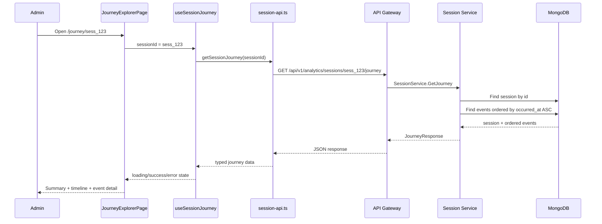
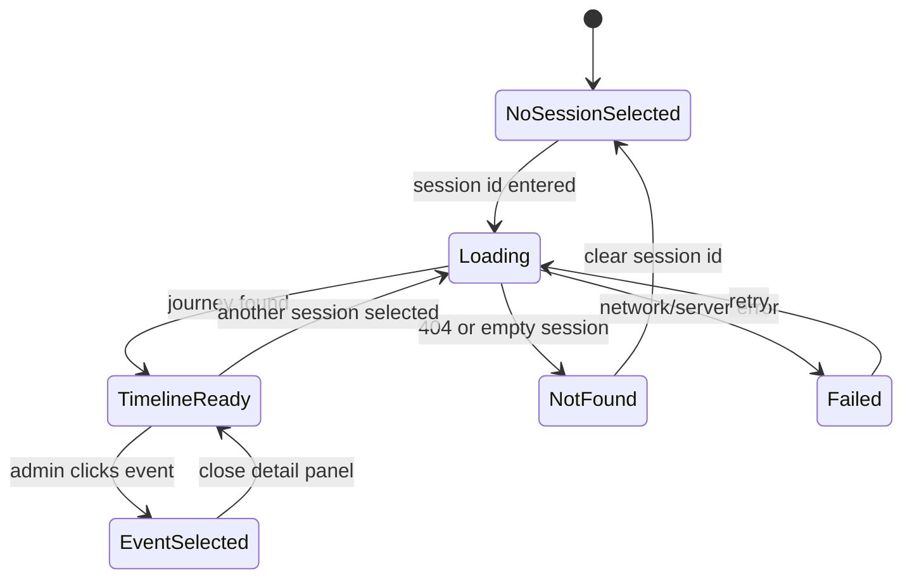
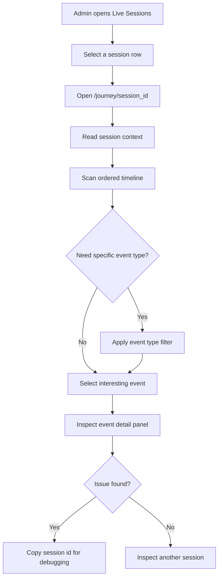

# 📊 Session Analytics Dashboard Service - Task 3: Journey Explorer


## 📌 Task Summary

| Field | Detail |
|---|---|
| Task Name | Journey explorer |
| Source | `docs/01-micro-tasks.md` → `Session Analytics Dashboard` → Task 3 |
| Priority | `P1` core dashboard capability |
| Dependency | Journey APIs |
| Main Goal | Session timeline, page views, clicks, cart events sequence display karna |
| Output Type | Structured implementation guide |
| Not Included | Funnel analysis, heatmap overlay, retention reports, export reports, privacy controls full page, backend Journey API implementation |

> **Simple Hinglish goal:** Is task ka kaam ek selected session ki complete journey ko readable timeline me dikhana hai. Admin ko samajh aana chahiye ki user kis page se aaya, kya dekha, kis element par click kiya, cart me kya add kiya, checkout start hua ya nahi, aur journey kis point par drop hui.

---

## ✅ Final Output Created

```text
TaskImplementation/
└── Session Analytics Dashboard Service/
    ├── task1.md
    ├── task2.md
    └── task3.md
```

### Why this structure?

- `TaskImplementation/` implementation guides ka central folder hai.
- `Session Analytics Dashboard Service/` folder already exist karta hai, isliye usko keep kiya gaya.
- `task3.md` sirf **Session Analytics Dashboard Service - Task 3** ka guide hai.
- Is file me frontend journey explorer ke implementation steps, API contract, components, diagrams, tests, aur privacy rules explain kiye gaye hain.
- Actual frontend/backend source files create nahi kiye gaye, kyunki requested output sirf folder structure aur markdown guide hai.

---

## 🧭 Documentation Sources Studied

| Document | Kya use kiya gaya |
|---|---|
| `docs/01-micro-tasks.md` | Task 3 ka exact scope: session timeline, page views, clicks, cart events sequence |
| `docs/03-folder-structure.md` | `frontend/session-analytics-dashboard/features/journey/` folder recommendation |
| `docs/08-session-management-system.md` | Journey concept, event types, journey summary, dashboard APIs |
| `docs/10-frontend-implementation.md` | Data-heavy dashboard design direction |
| `docs/04-microservice-design.md` | Session Service ownership and `GetJourney` gRPC method |
| `api/master-api.json` | `GET /api/v1/analytics/sessions/{session_id}/journey` route and `JourneyResponse` mapping |
| `database/mongodb-schema-design.md` | `sessions` and `session_events` collections, indexes, raw event shape |

---

## 🧱 Task Boundary

### ✅ Included in Task 3

- Journey Explorer page
- Session id input/search entry point
- Link from Active Sessions page to Journey Explorer
- Session summary panel
- Ordered session event timeline
- Page view, click, search, product view, add-to-cart, checkout, payment event display
- Event type filters
- Event detail side panel
- Privacy-safe masking for user identifiers
- Loading, error, empty, and not-found states
- React Query hook for Journey API
- API client example for `GET /api/v1/analytics/sessions/{session_id}/journey`
- Beginner-friendly test examples with MSW
- Mermaid architecture and data flow diagrams

### ❌ Not Included in Task 3

- Funnel chart calculations
- Heatmap canvas or click overlay
- Retention/cohort reports
- CSV export and scheduled report flow
- Admin privacy settings page
- Backend Session Service code
- MongoDB aggregation implementation
- Exact replay video/session recording
- Keystroke capture or sensitive form replay

> 🟢 **Rule:** Task 3 ka focus sirf selected session ki journey read karna aur display karna hai. Funnel, heatmap, export, and privacy controls future tasks me add honge.

---

## 🗂️ Clean Folder Structure

Task 1 ke shell aur Task 2 ke active sessions module ke upar Task 3 me `features/journey/` module add hoga.

```text
frontend/session-analytics-dashboard/
├── package.json
├── vite.config.ts
├── tailwind.config.ts
├── index.html
└── src/
    ├── main.tsx
    ├── app.tsx
    ├── layout/
    │   ├── analytics-layout.tsx
    │   └── filters-bar.tsx
    ├── features/
    │   ├── shell/
    │   │   └── pages/
    │   │       └── analytics-overview-page.tsx
    │   ├── live/
    │   │   ├── pages/
    │   │   │   └── live-sessions-page.tsx
    │   │   └── components/
    │   │       └── active-sessions-table.tsx
    │   └── journey/
    │       ├── pages/
    │       │   └── journey-explorer-page.tsx
    │       ├── components/
    │       │   ├── event-detail-panel.tsx
    │       │   ├── event-type-filter.tsx
    │       │   ├── journey-empty-state.tsx
    │       │   ├── journey-session-search.tsx
    │       │   ├── session-context-card.tsx
    │       │   ├── session-timeline.tsx
    │       │   └── timeline-event-item.tsx
    │       ├── hooks/
    │       │   └── use-session-journey.ts
    │       └── lib/
    │           ├── event-format.ts
    │           └── journey-filter.ts
    ├── api/
    │   └── session-api.ts
    ├── lib/
    │   ├── date-range.ts
    │   ├── format.ts
    │   └── session-view.ts
    └── styles/
        └── globals.css
```

### Folder Responsibility

| Path | Responsibility |
|---|---|
| `src/features/journey/pages/journey-explorer-page.tsx` | Journey Explorer ka main page |
| `src/features/journey/components/journey-session-search.tsx` | Session id enter/search karne ka compact control |
| `src/features/journey/components/session-context-card.tsx` | Selected session summary: masked user, device, geo, duration, entry/exit |
| `src/features/journey/components/event-type-filter.tsx` | Page view, click, cart, checkout jaise filters |
| `src/features/journey/components/session-timeline.tsx` | Ordered events ka vertical timeline |
| `src/features/journey/components/timeline-event-item.tsx` | Single event row/card |
| `src/features/journey/components/event-detail-panel.tsx` | Selected event ka JSON/detail view |
| `src/features/journey/components/journey-empty-state.tsx` | No session selected ya no events found state |
| `src/features/journey/hooks/use-session-journey.ts` | React Query based journey data fetching |
| `src/features/journey/lib/event-format.ts` | Event label, icon, tone, and property formatting helpers |
| `src/features/journey/lib/journey-filter.ts` | Event type filter logic |
| `src/api/session-api.ts` | `getSessionJourney` API client method |

---

## 🧩 High-Level Architecture

```mermaid
flowchart LR
    Admin[Admin User] --> Browser[Session Analytics Dashboard]
    Browser --> Route[/journey or /journey/:sessionId]
    Route --> Page[JourneyExplorerPage]
    Page --> Search[JourneySessionSearch]
    Page --> Summary[SessionContextCard]
    Page --> Filter[EventTypeFilter]
    Page --> Timeline[SessionTimeline]
    Timeline --> Detail[EventDetailPanel]
    Search --> Hook[useSessionJourney]
    Summary --> Hook
    Filter --> Hook
    Timeline --> Hook
    Hook --> API[session-api.ts]
    API --> Gateway[API Gateway]
    Gateway --> Session[Session Service]
    Session --> MongoSessions[(MongoDB sessions)]
    Session --> MongoEvents[(MongoDB session_events)]
```

**Hinglish explanation:**  
Admin Journey Explorer page open karta hai. Session id URL se ya search input se milti hai. UI `useSessionJourney` hook call karta hai. Hook API client ke through Gateway ko request bhejta hai. Gateway Session Service ka `GetJourney` method call karta hai. Service `sessions` aur `session_events` se ordered data laata hai. UI summary + timeline display karta hai.

---

## 🔄 Journey Data Flow



---

## 🧠 UI State Flow



**Hinglish explanation:**  
Page initially blank/helpful state me hota hai. Session id milte hi loading start hoti hai. Data milne par timeline ready hoti hai. Admin kisi event par click kare to detail panel open hota hai. Error ya not-found states separately handle hote hain.

---

## 🔌 API Contract

Task 3 ka primary endpoint docs me already defined hai:

```http
GET /api/v1/analytics/sessions/{session_id}/journey
Authorization: Bearer <admin_access_token>
```

### API Mapping

| Layer | Detail |
|---|---|
| REST Route | `GET /api/v1/analytics/sessions/{session_id}/journey` |
| Gateway Mapping | `analytics.journey` |
| Service | `session-service` |
| gRPC Method | `SessionService.GetJourney` |
| Auth | `admin` |
| Request Schema | `IdPathRequest` |
| Response Schema | `JourneyResponse` |

### Example Response Shape

```json
{
  "session": {
    "session_id": "sess_123",
    "anonymous_id": "anon_123",
    "user_id": "user_123",
    "status": "ended",
    "entry_page": "/",
    "exit_page": "/checkout",
    "started_at": "2026-05-18T00:00:00Z",
    "last_seen_at": "2026-05-18T00:22:00Z",
    "ended_at": "2026-05-18T00:22:00Z",
    "duration_seconds": 1320,
    "device": {
      "type": "mobile",
      "browser": "Chrome",
      "os": "Android"
    },
    "geo": {
      "country": "IN",
      "city": "Delhi"
    }
  },
  "summary": {
    "total_events": 8,
    "page_views": 3,
    "clicks": 2,
    "cart_actions": 1,
    "checkout_started": true,
    "payment_completed": false
  },
  "events": [
    {
      "event_id": "evt_1",
      "event_type": "page_view",
      "path": "/",
      "occurred_at": "2026-05-18T00:00:02Z",
      "properties": {
        "title": "Home",
        "referrer": "https://google.com"
      }
    },
    {
      "event_id": "evt_2",
      "event_type": "product_view",
      "path": "/products/prod_123",
      "occurred_at": "2026-05-18T00:04:10Z",
      "properties": {
        "product_id": "prod_123",
        "category_id": "cat_shoes",
        "seller_id": "seller_456"
      }
    },
    {
      "event_id": "evt_3",
      "event_type": "add_to_cart",
      "path": "/products/prod_123",
      "occurred_at": "2026-05-18T00:06:30Z",
      "properties": {
        "product_id": "prod_123",
        "variant_id": "var_1",
        "quantity": 1
      }
    }
  ]
}
```

> 🔐 **Privacy note:** UI me `user_id`, `anonymous_id`, raw IP, email, phone, OTP, password, card, address, ya private text fields directly show nahi karne. User identifiers masked format me show honge.

---

## 🪜 Step-by-Step Implementation

## Step 1: Task 1 and Task 2 foundation reuse karo

Task 3 new standalone app nahi banata. Ye existing `frontend/session-analytics-dashboard` app ke andar new Journey module add karta hai.

Expected existing foundation:

- React + TypeScript + Vite setup
- Tailwind CSS styling
- `AnalyticsLayout`
- React Router setup
- TanStack Query provider
- `src/api/session-api.ts`
- Task 2 ka Active Sessions page

**Explanation:**  
Journey Explorer ko same dashboard shell ke andar rakhna zaruri hai, taaki admin ko navigation, spacing, filters, dark/light theme, and operational layout consistent mile.

---

## Step 2: Journey route add karo

`/journey` route blank/search mode ke liye useful hai. `/journey/:sessionId` direct deep-link ke liye useful hai.

```tsx
// src/app.tsx
import { Navigate, Route, Routes } from "react-router-dom";
import { AnalyticsLayout } from "./layout/analytics-layout";
import { AnalyticsOverviewPage } from "./features/shell/pages/analytics-overview-page";
import { LiveSessionsPage } from "./features/live/pages/live-sessions-page";
import { JourneyExplorerPage } from "./features/journey/pages/journey-explorer-page";

export function App() {
  return (
    <Routes>
      <Route element={<AnalyticsLayout />}>
        <Route index element={<AnalyticsOverviewPage />} />
        <Route path="/live" element={<LiveSessionsPage />} />
        <Route path="/journey" element={<JourneyExplorerPage />} />
        <Route path="/journey/:sessionId" element={<JourneyExplorerPage />} />
        <Route path="*" element={<Navigate to="/" replace />} />
      </Route>
    </Routes>
  );
}
```

**Explanation:**  
`/journey/:sessionId` se support team kisi active session table row se direct journey view open kar sakti hai. `/journey` se admin manually session id paste karke inspect kar sakta hai.

---

## Step 3: Sidebar navigation me Journey Explorer item add karo

```tsx
// src/layout/analytics-layout.tsx
import { Activity, Gauge, Route } from "lucide-react";
import { NavLink, Outlet } from "react-router-dom";

const navItems = [
  { label: "Overview", href: "/", icon: Gauge },
  { label: "Live Sessions", href: "/live", icon: Activity },
  { label: "Journey Explorer", href: "/journey", icon: Route },
];

export function AnalyticsLayout() {
  return (
    <div className="min-h-screen bg-slate-950 text-slate-100">
      <aside className="fixed inset-y-0 left-0 w-64 border-r border-slate-800 bg-slate-950">
        <div className="px-5 py-4 text-sm font-semibold">
          Session Analytics
        </div>

        <nav className="space-y-1 px-3">
          {navItems.map((item) => {
            const Icon = item.icon;

            return (
              <NavLink
                key={item.href}
                to={item.href}
                className={({ isActive }) =>
                  [
                    "flex h-10 items-center gap-3 rounded-md px-3 text-sm",
                    isActive
                      ? "bg-cyan-500/12 text-cyan-100"
                      : "text-slate-400 hover:bg-slate-900 hover:text-slate-100",
                  ].join(" ")
                }
              >
                <Icon className="h-4 w-4" aria-hidden="true" />
                <span>{item.label}</span>
              </NavLink>
            );
          })}
        </nav>
      </aside>

      <main className="pl-64">
        <Outlet />
      </main>
    </div>
  );
}
```

**Explanation:**  
Journey Explorer dashboard ka core diagnostic page hai, isliye primary nav me visible hona chahiye. `lucide-react` ka `Route` icon journey/timeline concept ko clearly represent karta hai.

---

## Step 4: Active Sessions table se Journey link add karo

Task 2 ke active sessions table me har row par Journey button add hoga.

```tsx
// src/features/live/components/active-session-row.tsx
import { Route } from "lucide-react";
import { Link } from "react-router-dom";

type ActiveSessionRowProps = {
  session: {
    sessionId: string;
    maskedUserId: string;
    entryPage: string;
    lastSeenAt: string;
  };
};

export function ActiveSessionRow({ session }: ActiveSessionRowProps) {
  return (
    <tr className="border-b border-slate-800">
      <td className="px-4 py-3 font-mono text-xs text-slate-300">
        {session.sessionId}
      </td>
      <td className="px-4 py-3 text-sm text-slate-300">
        {session.maskedUserId}
      </td>
      <td className="px-4 py-3 text-sm text-slate-300">
        {session.entryPage}
      </td>
      <td className="px-4 py-3 text-right">
        <Link
          to={`/journey/${session.sessionId}`}
          className="inline-flex h-8 items-center gap-2 rounded-md border border-slate-700 px-3 text-xs text-slate-200 hover:bg-slate-900"
          aria-label={`Open journey for session ${session.sessionId}`}
        >
          <Route className="h-3.5 w-3.5" aria-hidden="true" />
          Journey
        </Link>
      </td>
    </tr>
  );
}
```

**Explanation:**  
Live Sessions page se Journey Explorer ka transition natural hai. Admin pehle active session identify karega, phir uski full journey inspect karega.

---

## Step 5: TypeScript API types define karo

```ts
// src/api/session-api.ts
export type JourneyEventType =
  | "page_view"
  | "product_view"
  | "search"
  | "click"
  | "scroll"
  | "add_to_cart"
  | "checkout_step"
  | "payment_result";

export type JourneySession = {
  sessionId: string;
  anonymousId?: string | null;
  userId?: string | null;
  status: "active" | "ended" | "expired";
  entryPage: string;
  exitPage?: string | null;
  startedAt: string;
  lastSeenAt: string;
  endedAt?: string | null;
  durationSeconds: number;
  device: {
    type: "desktop" | "mobile" | "tablet" | "unknown";
    browser?: string;
    os?: string;
  };
  geo?: {
    country?: string;
    city?: string;
  };
};

export type JourneySummary = {
  totalEvents: number;
  pageViews: number;
  clicks: number;
  cartActions: number;
  checkoutStarted: boolean;
  paymentCompleted: boolean;
};

export type JourneyEvent = {
  eventId: string;
  eventType: JourneyEventType;
  path: string;
  occurredAt: string;
  properties: Record<string, string | number | boolean | null>;
};

export type JourneyResponse = {
  session: JourneySession;
  summary: JourneySummary;
  events: JourneyEvent[];
};
```

**Explanation:**  
Types frontend ko contract-safe banate hain. Agar backend response me field missing ya wrong shape ho, TypeScript implementation ke time warning deta hai. Journey events flexible hote hain, isliye `properties` ko generic record rakha gaya hai.

---

## Step 6: API client method add karo

```ts
// src/api/session-api.ts
const API_BASE_URL = import.meta.env.VITE_API_BASE_URL ?? "/api/v1";

async function requestJson<T>(path: string, init?: RequestInit): Promise<T> {
  const response = await fetch(`${API_BASE_URL}${path}`, {
    ...init,
    headers: {
      "Content-Type": "application/json",
      ...init?.headers,
    },
  });

  if (!response.ok) {
    throw new Error(`Request failed with status ${response.status}`);
  }

  return response.json() as Promise<T>;
}

export async function getSessionJourney(
  sessionId: string,
): Promise<JourneyResponse> {
  const safeSessionId = encodeURIComponent(sessionId);

  return requestJson<JourneyResponse>(
    `/analytics/sessions/${safeSessionId}/journey`,
  );
}
```

**Explanation:**  
`encodeURIComponent` zaruri hai, kyunki session id path parameter me ja raha hai. Agar id me special character ho, URL break nahi hona chahiye.

---

## Step 7: React Query hook banao

```ts
// src/features/journey/hooks/use-session-journey.ts
import { useQuery } from "@tanstack/react-query";
import { getSessionJourney } from "../../../api/session-api";

export function useSessionJourney(sessionId?: string) {
  return useQuery({
    queryKey: ["session-journey", sessionId],
    queryFn: () => getSessionJourney(sessionId ?? ""),
    enabled: Boolean(sessionId),
    staleTime: 20_000,
    retry: 1,
  });
}
```

**Explanation:**  
`enabled` false hone par API call nahi chalegi. Isse `/journey` blank state me unnecessary request avoid hoti hai. `staleTime` short rakha gaya, kyunki live ya recently active sessions me events update ho sakte hain.

---

## Step 8: Journey Explorer page compose karo

```tsx
// src/features/journey/pages/journey-explorer-page.tsx
import { useMemo, useState } from "react";
import { useNavigate, useParams } from "react-router-dom";
import { EventDetailPanel } from "../components/event-detail-panel";
import { EventTypeFilter } from "../components/event-type-filter";
import { JourneyEmptyState } from "../components/journey-empty-state";
import { JourneySessionSearch } from "../components/journey-session-search";
import { SessionContextCard } from "../components/session-context-card";
import { SessionTimeline } from "../components/session-timeline";
import { useSessionJourney } from "../hooks/use-session-journey";
import { filterJourneyEvents } from "../lib/journey-filter";
import type { JourneyEvent, JourneyEventType } from "../../../api/session-api";

export function JourneyExplorerPage() {
  const navigate = useNavigate();
  const { sessionId } = useParams();
  const [selectedTypes, setSelectedTypes] = useState<JourneyEventType[]>([]);
  const [selectedEvent, setSelectedEvent] = useState<JourneyEvent | null>(null);
  const journeyQuery = useSessionJourney(sessionId);

  const filteredEvents = useMemo(() => {
    return filterJourneyEvents(journeyQuery.data?.events ?? [], selectedTypes);
  }, [journeyQuery.data?.events, selectedTypes]);

  return (
    <div className="min-h-screen bg-slate-950 px-6 py-5 text-slate-100">
      <div className="mb-5 flex flex-wrap items-center justify-between gap-3">
        <div>
          <h1 className="text-xl font-semibold tracking-normal">
            Journey Explorer
          </h1>
          <p className="mt-1 text-sm text-slate-400">
            Session events ko ordered timeline me inspect karo.
          </p>
        </div>

        <JourneySessionSearch
          initialValue={sessionId ?? ""}
          onSubmit={(nextSessionId) => navigate(`/journey/${nextSessionId}`)}
        />
      </div>

      {!sessionId ? (
        <JourneyEmptyState />
      ) : (
        <div className="grid gap-5 xl:grid-cols-[minmax(0,1fr)_360px]">
          <section className="space-y-4">
            {journeyQuery.data ? (
              <SessionContextCard
                session={journeyQuery.data.session}
                summary={journeyQuery.data.summary}
              />
            ) : null}

            <EventTypeFilter
              selectedTypes={selectedTypes}
              onChange={setSelectedTypes}
            />

            <SessionTimeline
              events={filteredEvents}
              isLoading={journeyQuery.isLoading}
              isError={journeyQuery.isError}
              onRetry={() => journeyQuery.refetch()}
              onSelectEvent={setSelectedEvent}
            />
          </section>

          <EventDetailPanel
            event={selectedEvent}
            onClose={() => setSelectedEvent(null)}
          />
        </div>
      )}
    </div>
  );
}
```

**Explanation:**  
Page ke andar 4 main zones hain: session search, session summary, event filters, and timeline. Right side panel selected event details dikhata hai. Desktop par two-column layout, mobile/tablet par stacked layout use hoga.

---

## Step 9: Session search component banao

```tsx
// src/features/journey/components/journey-session-search.tsx
import { Search } from "lucide-react";
import { FormEvent, useState } from "react";

type JourneySessionSearchProps = {
  initialValue: string;
  onSubmit: (sessionId: string) => void;
};

export function JourneySessionSearch({
  initialValue,
  onSubmit,
}: JourneySessionSearchProps) {
  const [value, setValue] = useState(initialValue);

  function handleSubmit(event: FormEvent<HTMLFormElement>) {
    event.preventDefault();
    const nextValue = value.trim();

    if (nextValue.length > 0) {
      onSubmit(nextValue);
    }
  }

  return (
    <form onSubmit={handleSubmit} className="flex items-center gap-2">
      <label className="sr-only" htmlFor="journey-session-id">
        Session id
      </label>
      <input
        id="journey-session-id"
        value={value}
        onChange={(event) => setValue(event.target.value)}
        placeholder="sess_123"
        className="h-9 w-64 rounded-md border border-slate-700 bg-slate-900 px-3 font-mono text-xs text-slate-100 outline-none focus:border-cyan-400"
      />
      <button
        type="submit"
        className="inline-flex h-9 items-center gap-2 rounded-md bg-cyan-500 px-3 text-sm font-medium text-slate-950 hover:bg-cyan-400"
      >
        <Search className="h-4 w-4" aria-hidden="true" />
        Open
      </button>
    </form>
  );
}
```

**Explanation:**  
Admin manually session id paste kar sakta hai. Form submit URL update karta hai, URL update se hook automatically new journey fetch karta hai.

---

## Step 10: Session context card banao

```tsx
// src/features/journey/components/session-context-card.tsx
import { Clock, MonitorSmartphone, MousePointerClick, ShoppingCart } from "lucide-react";
import type { JourneySession, JourneySummary } from "../../../api/session-api";
import { formatDuration, formatDateTime, maskIdentifier } from "../../../lib/format";

type SessionContextCardProps = {
  session: JourneySession;
  summary: JourneySummary;
};

export function SessionContextCard({
  session,
  summary,
}: SessionContextCardProps) {
  return (
    <div className="rounded-lg border border-slate-800 bg-slate-900/70 p-4">
      <div className="flex flex-wrap items-start justify-between gap-4">
        <div>
          <p className="font-mono text-xs text-cyan-300">{session.sessionId}</p>
          <h2 className="mt-1 text-base font-semibold text-slate-100">
            {session.entryPage} → {session.exitPage ?? "Active"}
          </h2>
          <p className="mt-1 text-sm text-slate-400">
            User {maskIdentifier(session.userId ?? session.anonymousId ?? "anonymous")}
          </p>
        </div>

        <span className="rounded-full border border-slate-700 px-2.5 py-1 text-xs text-slate-300">
          {session.status}
        </span>
      </div>

      <div className="mt-4 grid gap-3 md:grid-cols-4">
        <Metric icon={Clock} label="Duration" value={formatDuration(session.durationSeconds)} />
        <Metric icon={MonitorSmartphone} label="Device" value={`${session.device.type} · ${session.device.browser ?? "Unknown"}`} />
        <Metric icon={MousePointerClick} label="Events" value={String(summary.totalEvents)} />
        <Metric icon={ShoppingCart} label="Cart Actions" value={String(summary.cartActions)} />
      </div>

      <div className="mt-4 text-xs text-slate-500">
        Started {formatDateTime(session.startedAt)} · Last seen {formatDateTime(session.lastSeenAt)}
      </div>
    </div>
  );
}

type MetricProps = {
  icon: typeof Clock;
  label: string;
  value: string;
};

function Metric({ icon: Icon, label, value }: MetricProps) {
  return (
    <div className="rounded-md border border-slate-800 bg-slate-950 px-3 py-2">
      <div className="flex items-center gap-2 text-xs text-slate-500">
        <Icon className="h-3.5 w-3.5" aria-hidden="true" />
        {label}
      </div>
      <div className="mt-1 text-sm font-medium text-slate-100">{value}</div>
    </div>
  );
}
```

**Explanation:**  
Context card se admin ko timeline inspect karne se pehle high-level picture milti hai: session kitni der chala, user masked id kya hai, device kya hai, aur important counts kya hain.

---

## Step 11: Event type filter banao

```tsx
// src/features/journey/components/event-type-filter.tsx
import type { JourneyEventType } from "../../../api/session-api";
import { getEventLabel } from "../lib/event-format";

const eventTypes: JourneyEventType[] = [
  "page_view",
  "product_view",
  "search",
  "click",
  "scroll",
  "add_to_cart",
  "checkout_step",
  "payment_result",
];

type EventTypeFilterProps = {
  selectedTypes: JourneyEventType[];
  onChange: (types: JourneyEventType[]) => void;
};

export function EventTypeFilter({
  selectedTypes,
  onChange,
}: EventTypeFilterProps) {
  function toggleType(type: JourneyEventType) {
    if (selectedTypes.includes(type)) {
      onChange(selectedTypes.filter((item) => item !== type));
      return;
    }

    onChange([...selectedTypes, type]);
  }

  return (
    <div className="flex flex-wrap gap-2">
      {eventTypes.map((type) => {
        const selected = selectedTypes.includes(type);

        return (
          <button
            key={type}
            type="button"
            onClick={() => toggleType(type)}
            className={[
              "h-8 rounded-md border px-3 text-xs",
              selected
                ? "border-cyan-400 bg-cyan-500/15 text-cyan-100"
                : "border-slate-800 bg-slate-900 text-slate-400 hover:text-slate-100",
            ].join(" ")}
          >
            {getEventLabel(type)}
          </button>
        );
      })}
    </div>
  );
}
```

**Explanation:**  
Journey me events bahut ho sakte hain. Filters se admin sirf cart events, clicks, checkout steps, ya page views isolate kar sakta hai.

---

## Step 12: Timeline event format helpers banao

```ts
// src/features/journey/lib/event-format.ts
import {
  CreditCard,
  Eye,
  MousePointerClick,
  PackageSearch,
  ScrollText,
  Search,
  ShoppingCart,
  Split,
} from "lucide-react";
import type { JourneyEvent, JourneyEventType } from "../../../api/session-api";

export function getEventLabel(type: JourneyEventType): string {
  const labels: Record<JourneyEventType, string> = {
    page_view: "Page View",
    product_view: "Product View",
    search: "Search",
    click: "Click",
    scroll: "Scroll",
    add_to_cart: "Add to Cart",
    checkout_step: "Checkout",
    payment_result: "Payment",
  };

  return labels[type];
}

export function getEventIcon(type: JourneyEventType) {
  const icons: Record<JourneyEventType, typeof Eye> = {
    page_view: Eye,
    product_view: PackageSearch,
    search: Search,
    click: MousePointerClick,
    scroll: ScrollText,
    add_to_cart: ShoppingCart,
    checkout_step: Split,
    payment_result: CreditCard,
  };

  return icons[type];
}

export function getEventTone(type: JourneyEventType): string {
  const tones: Record<JourneyEventType, string> = {
    page_view: "border-blue-400/30 bg-blue-400/10 text-blue-100",
    product_view: "border-violet-400/30 bg-violet-400/10 text-violet-100",
    search: "border-amber-400/30 bg-amber-400/10 text-amber-100",
    click: "border-cyan-400/30 bg-cyan-400/10 text-cyan-100",
    scroll: "border-slate-500/30 bg-slate-500/10 text-slate-100",
    add_to_cart: "border-emerald-400/30 bg-emerald-400/10 text-emerald-100",
    checkout_step: "border-orange-400/30 bg-orange-400/10 text-orange-100",
    payment_result: "border-rose-400/30 bg-rose-400/10 text-rose-100",
  };

  return tones[type];
}

export function describeEvent(event: JourneyEvent): string {
  if (event.eventType === "page_view") {
    return `Visited ${event.path}`;
  }

  if (event.eventType === "product_view") {
    return `Viewed product ${event.properties.product_id ?? "unknown"}`;
  }

  if (event.eventType === "add_to_cart") {
    return `Added product ${event.properties.product_id ?? "unknown"} to cart`;
  }

  if (event.eventType === "checkout_step") {
    return `Checkout step: ${event.properties.step_name ?? "unknown"}`;
  }

  if (event.eventType === "payment_result") {
    return `Payment result: ${event.properties.status ?? "unknown"}`;
  }

  return `${getEventLabel(event.eventType)} on ${event.path}`;
}
```

**Explanation:**  
Formatting helpers timeline component ko clean rakhte hain. Har event type ka label, icon, color tone, and description centralized hota hai.

---

## Step 13: Timeline component banao

```tsx
// src/features/journey/components/session-timeline.tsx
import type { JourneyEvent } from "../../../api/session-api";
import { TimelineEventItem } from "./timeline-event-item";

type SessionTimelineProps = {
  events: JourneyEvent[];
  isLoading: boolean;
  isError: boolean;
  onRetry: () => void;
  onSelectEvent: (event: JourneyEvent) => void;
};

export function SessionTimeline({
  events,
  isLoading,
  isError,
  onRetry,
  onSelectEvent,
}: SessionTimelineProps) {
  if (isLoading) {
    return (
      <div className="rounded-lg border border-slate-800 bg-slate-900 p-6 text-sm text-slate-400">
        Journey load ho rahi hai...
      </div>
    );
  }

  if (isError) {
    return (
      <div className="rounded-lg border border-red-900/60 bg-red-950/30 p-6">
        <p className="text-sm font-medium text-red-100">
          Journey load nahi ho paayi.
        </p>
        <button
          type="button"
          onClick={onRetry}
          className="mt-3 h-8 rounded-md bg-red-500 px-3 text-xs font-medium text-white"
        >
          Retry
        </button>
      </div>
    );
  }

  if (events.length === 0) {
    return (
      <div className="rounded-lg border border-slate-800 bg-slate-900 p-6 text-sm text-slate-400">
        Is filter ke liye koi event nahi mila.
      </div>
    );
  }

  return (
    <ol className="relative space-y-3 border-l border-slate-800 pl-5">
      {events.map((event) => (
        <TimelineEventItem
          key={event.eventId}
          event={event}
          onSelect={() => onSelectEvent(event)}
        />
      ))}
    </ol>
  );
}
```

**Explanation:**  
Timeline ordered list use karti hai. Loading, error, empty, and success state same component me handle hote hain, jisse page component simple rehta hai.

---

## Step 14: Timeline event item banao

```tsx
// src/features/journey/components/timeline-event-item.tsx
import type { JourneyEvent } from "../../../api/session-api";
import { formatTime } from "../../../lib/format";
import {
  describeEvent,
  getEventIcon,
  getEventLabel,
  getEventTone,
} from "../lib/event-format";

type TimelineEventItemProps = {
  event: JourneyEvent;
  onSelect: () => void;
};

export function TimelineEventItem({ event, onSelect }: TimelineEventItemProps) {
  const Icon = getEventIcon(event.eventType);

  return (
    <li className="relative">
      <span className="absolute -left-[29px] top-4 flex h-4 w-4 items-center justify-center rounded-full border border-slate-700 bg-slate-950">
        <span className="h-1.5 w-1.5 rounded-full bg-cyan-300" />
      </span>

      <button
        type="button"
        onClick={onSelect}
        className="w-full rounded-lg border border-slate-800 bg-slate-900/70 p-4 text-left hover:border-slate-600"
      >
        <div className="flex flex-wrap items-start justify-between gap-3">
          <div className="min-w-0">
            <div className="flex items-center gap-2">
              <span
                className={[
                  "inline-flex h-7 items-center gap-1.5 rounded-md border px-2 text-xs",
                  getEventTone(event.eventType),
                ].join(" ")}
              >
                <Icon className="h-3.5 w-3.5" aria-hidden="true" />
                {getEventLabel(event.eventType)}
              </span>
              <span className="font-mono text-xs text-slate-500">
                {formatTime(event.occurredAt)}
              </span>
            </div>

            <p className="mt-2 text-sm font-medium text-slate-100">
              {describeEvent(event)}
            </p>
            <p className="mt-1 truncate font-mono text-xs text-slate-500">
              {event.path}
            </p>
          </div>
        </div>
      </button>
    </li>
  );
}
```

**Explanation:**  
Event item compact but readable hai. Badge event type batata hai, time exact sequence batata hai, and description admin ko quickly event ka meaning samjhata hai.

---

## Step 15: Event detail panel banao

```tsx
// src/features/journey/components/event-detail-panel.tsx
import { X } from "lucide-react";
import type { JourneyEvent } from "../../../api/session-api";
import { formatDateTime } from "../../../lib/format";
import { getEventLabel } from "../lib/event-format";

type EventDetailPanelProps = {
  event: JourneyEvent | null;
  onClose: () => void;
};

export function EventDetailPanel({ event, onClose }: EventDetailPanelProps) {
  if (!event) {
    return (
      <aside className="rounded-lg border border-slate-800 bg-slate-900 p-4 text-sm text-slate-500">
        Timeline me kisi event par click karo to details yahan dikhenge.
      </aside>
    );
  }

  return (
    <aside className="rounded-lg border border-slate-800 bg-slate-900">
      <div className="flex items-center justify-between border-b border-slate-800 px-4 py-3">
        <div>
          <p className="text-sm font-medium text-slate-100">
            {getEventLabel(event.eventType)}
          </p>
          <p className="font-mono text-xs text-slate-500">{event.eventId}</p>
        </div>
        <button
          type="button"
          onClick={onClose}
          className="inline-flex h-8 w-8 items-center justify-center rounded-md text-slate-400 hover:bg-slate-800 hover:text-slate-100"
          aria-label="Close event detail"
        >
          <X className="h-4 w-4" aria-hidden="true" />
        </button>
      </div>

      <dl className="space-y-3 px-4 py-4 text-sm">
        <div>
          <dt className="text-xs text-slate-500">Path</dt>
          <dd className="mt-1 font-mono text-xs text-slate-200">{event.path}</dd>
        </div>
        <div>
          <dt className="text-xs text-slate-500">Occurred At</dt>
          <dd className="mt-1 text-slate-200">{formatDateTime(event.occurredAt)}</dd>
        </div>
        <div>
          <dt className="text-xs text-slate-500">Properties</dt>
          <dd className="mt-2 rounded-md bg-slate-950 p-3">
            <pre className="overflow-auto text-xs text-slate-300">
              {JSON.stringify(event.properties, null, 2)}
            </pre>
          </dd>
        </div>
      </dl>
    </aside>
  );
}
```

**Explanation:**  
Right panel selected event ke raw-ish details dikhata hai. Isse support/debugging team exact `product_id`, `variant_id`, `step_name`, `status`, click coordinates, etc. inspect kar sakti hai.

---

## Step 16: Journey filter helper banao

```ts
// src/features/journey/lib/journey-filter.ts
import type { JourneyEvent, JourneyEventType } from "../../../api/session-api";

export function filterJourneyEvents(
  events: JourneyEvent[],
  selectedTypes: JourneyEventType[],
): JourneyEvent[] {
  if (selectedTypes.length === 0) {
    return events;
  }

  return events.filter((event) => selectedTypes.includes(event.eventType));
}
```

**Explanation:**  
Filter function pure rakhi gayi hai. Iska unit test simple hoga aur UI se independent rahega.

---

## Step 17: Formatting helpers add karo

```ts
// src/lib/format.ts
export function formatTime(value: string): string {
  return new Intl.DateTimeFormat("en-IN", {
    hour: "2-digit",
    minute: "2-digit",
    second: "2-digit",
  }).format(new Date(value));
}

export function formatDateTime(value: string): string {
  return new Intl.DateTimeFormat("en-IN", {
    dateStyle: "medium",
    timeStyle: "medium",
  }).format(new Date(value));
}

export function formatDuration(seconds: number): string {
  const minutes = Math.floor(seconds / 60);
  const remainingSeconds = seconds % 60;

  if (minutes === 0) {
    return `${remainingSeconds}s`;
  }

  return `${minutes}m ${remainingSeconds}s`;
}

export function maskIdentifier(value: string): string {
  if (value.length <= 8) {
    return "••••";
  }

  return `${value.slice(0, 4)}••••${value.slice(-4)}`;
}
```

**Explanation:**  
Date/time formatting and masking common helpers me rakhna better hai. Analytics dashboard ke multiple modules same logic reuse karenge.

---

## Step 18: Empty state banao

```tsx
// src/features/journey/components/journey-empty-state.tsx
import { Route } from "lucide-react";

export function JourneyEmptyState() {
  return (
    <div className="flex min-h-[420px] items-center justify-center rounded-lg border border-dashed border-slate-800 bg-slate-900/40">
      <div className="max-w-sm text-center">
        <div className="mx-auto flex h-11 w-11 items-center justify-center rounded-lg border border-slate-700 bg-slate-900">
          <Route className="h-5 w-5 text-cyan-300" aria-hidden="true" />
        </div>
        <h2 className="mt-4 text-base font-semibold text-slate-100">
          Select a session
        </h2>
        <p className="mt-2 text-sm text-slate-400">
          Active Sessions page se Journey open karo ya upar session id paste karo.
        </p>
      </div>
    </div>
  );
}
```

**Explanation:**  
Empty state clear hai, but feature tutorial jaisa long text nahi hai. Operational dashboard me concise direction enough hoti hai.

---

## Step 19: Loading, error, and not-found behavior define karo

| State | UI Behavior | Why |
|---|---|---|
| No session selected | Empty state with session id search | Page blank nahi lagti |
| Loading | Timeline area skeleton/simple loader | Context clear rehta hai |
| Error | Retry button and short message | Admin recover kar sakta hai |
| 404/not found | "Session not found" state | Wrong/expired session id explain hota hai |
| Empty events | "No events found" state | Session exists but journey data empty ho sakta hai |
| Success | Summary + filters + ordered timeline | Main task complete hota hai |

Example error mapping:

```ts
export function getJourneyErrorMessage(error: unknown): string {
  if (error instanceof Error && error.message.includes("404")) {
    return "Session nahi mila. Session id verify karo.";
  }

  return "Journey load nahi ho paayi. Thodi der baad retry karo.";
}
```

**Explanation:**  
Analytics tools me clear failure states important hote hain. Admin ko ye samajhna chahiye ki data missing hai, API failed hai, ya session id galat hai.

---

## Step 20: Privacy-safe display rules add karo

Journey Explorer sensitive behavior data dikhata hai. Isliye Task 3 me bhi basic masking mandatory hai.

### Rules

| Data | Display Rule |
|---|---|
| `user_id` | Masked: `user••••1234` |
| `anonymous_id` | Masked |
| Email/phone | Do not display in Journey Explorer |
| Raw IP | Do not display |
| OTP/password/card fields | Never collect, never display |
| Click coordinates | Allowed only as numeric UX metadata |
| Product/cart ids | Allowed for debugging |
| Address/private text | Do not display |

### Property sanitizer example

```ts
const blockedPropertyKeys = [
  "email",
  "phone",
  "password",
  "otp",
  "card_number",
  "cvv",
  "address",
];

export function sanitizeEventProperties(
  properties: Record<string, unknown>,
): Record<string, unknown> {
  return Object.fromEntries(
    Object.entries(properties).map(([key, value]) => {
      if (blockedPropertyKeys.includes(key.toLowerCase())) {
        return [key, "[masked]"];
      }

      return [key, value];
    }),
  );
}
```

**Explanation:**  
Session analytics debugging ke liye powerful hai, but personal data expose nahi karna. Backend ko bhi sanitize karna chahiye, and frontend extra defense layer rakhega.

---

## Step 21: UI design guidelines follow karo

| Area | Guideline |
|---|---|
| Layout | Dense, operational, full dashboard screen |
| Timeline | Vertical sequence, stable spacing, no layout jumping |
| Cards | Individual repeated items only, no nested decorative cards |
| Buttons | Icons from `lucide-react`; text only where command clear ho |
| Colors | Multiple semantic tones: cyan, emerald, amber, rose, violet |
| Text | Compact headings, no hero-sized typography |
| Mobile | Search and timeline stacked; detail panel below timeline |
| Accessibility | Buttons have labels; timeline items keyboard clickable |
| Privacy | Mask identifiers by default |

**Explanation:**  
Ye analytics dashboard hai, marketing landing page nahi. UI ka focus scanning, debugging, comparison, and repeated operational usage par hona chahiye.

---

## 🧪 Testing Plan

### Test 1: API hook fetch enabled only when session id exists

```tsx
// src/features/journey/hooks/use-session-journey.test.tsx
import { QueryClient, QueryClientProvider } from "@tanstack/react-query";
import { renderHook } from "@testing-library/react";
import { ReactNode } from "react";
import { useSessionJourney } from "./use-session-journey";

function wrapper({ children }: { children: ReactNode }) {
  const queryClient = new QueryClient({
    defaultOptions: { queries: { retry: false } },
  });

  return (
    <QueryClientProvider client={queryClient}>
      {children}
    </QueryClientProvider>
  );
}

test("does not fetch journey without session id", () => {
  const { result } = renderHook(() => useSessionJourney(undefined), { wrapper });

  expect(result.current.fetchStatus).toBe("idle");
});
```

### Test 2: Timeline renders events

```tsx
// src/features/journey/components/session-timeline.test.tsx
import { render, screen } from "@testing-library/react";
import { SessionTimeline } from "./session-timeline";

test("renders journey event labels", () => {
  render(
    <SessionTimeline
      events={[
        {
          eventId: "evt_1",
          eventType: "add_to_cart",
          path: "/products/prod_123",
          occurredAt: "2026-05-18T00:06:30Z",
          properties: { product_id: "prod_123", quantity: 1 },
        },
      ]}
      isLoading={false}
      isError={false}
      onRetry={() => undefined}
      onSelectEvent={() => undefined}
    />,
  );

  expect(screen.getByText("Add to Cart")).toBeInTheDocument();
  expect(screen.getByText(/prod_123/)).toBeInTheDocument();
});
```

### Test 3: Filter helper filters selected event types

```ts
// src/features/journey/lib/journey-filter.test.ts
import { filterJourneyEvents } from "./journey-filter";
import type { JourneyEvent } from "../../../api/session-api";

const events: JourneyEvent[] = [
  {
    eventId: "evt_1",
    eventType: "page_view",
    path: "/",
    occurredAt: "2026-05-18T00:00:00Z",
    properties: {},
  },
  {
    eventId: "evt_2",
    eventType: "add_to_cart",
    path: "/products/prod_123",
    occurredAt: "2026-05-18T00:05:00Z",
    properties: { product_id: "prod_123" },
  },
];

test("filters events by type", () => {
  const result = filterJourneyEvents(events, ["add_to_cart"]);

  expect(result).toHaveLength(1);
  expect(result[0].eventId).toBe("evt_2");
});
```

### Test 4: MSW mock for Journey API

```ts
// src/test/handlers.ts
import { http, HttpResponse } from "msw";

export const handlers = [
  http.get("/api/v1/analytics/sessions/:sessionId/journey", ({ params }) => {
    return HttpResponse.json({
      session: {
        sessionId: params.sessionId,
        anonymousId: "anon_123",
        userId: "user_123",
        status: "ended",
        entryPage: "/",
        exitPage: "/checkout",
        startedAt: "2026-05-18T00:00:00Z",
        lastSeenAt: "2026-05-18T00:22:00Z",
        endedAt: "2026-05-18T00:22:00Z",
        durationSeconds: 1320,
        device: { type: "mobile", browser: "Chrome", os: "Android" },
        geo: { country: "IN", city: "Delhi" },
      },
      summary: {
        totalEvents: 1,
        pageViews: 1,
        clicks: 0,
        cartActions: 0,
        checkoutStarted: false,
        paymentCompleted: false,
      },
      events: [
        {
          eventId: "evt_1",
          eventType: "page_view",
          path: "/",
          occurredAt: "2026-05-18T00:00:02Z",
          properties: { title: "Home" },
        },
      ],
    });
  }),
];
```

**Explanation:**  
Tests ensure karte hain ki hook unnecessary fetch nahi karta, timeline events render hote hain, filters correctly work karte hain, and API mock ke saath page behavior predictable hai.

---

## 🧰 External Libraries / Tools Used

Task 3 mostly Task 1 and Task 2 ke same frontend stack ko reuse karta hai.

| Library/Tool | What it is | Why used | Install | Use |
|---|---|---|---|---|
| Vite | Frontend build tool | Fast dashboard dev server and optimized build | `npm create vite@latest` | `npm run dev`, `npm run build` |
| React | UI library | Journey page ko component-based banane ke liye | Vite template ke saath | `.tsx` components |
| TypeScript | Typed JavaScript | Journey API contracts and event types safe rakhne ke liye | Vite React TS template | `type JourneyEvent` |
| Tailwind CSS | Utility-first CSS | Dense operational dashboard styling ke liye | `npm install -D tailwindcss postcss autoprefixer` | `className` utilities |
| React Router | Client-side routing | `/journey/:sessionId` route support ke liye | `npm install react-router-dom` | `<Route path="/journey/:sessionId" />` |
| TanStack Query | Server-state library | Loading/cache/error/retry state manage karne ke liye | `npm install @tanstack/react-query` | `useQuery` |
| lucide-react | Icon library | Timeline badges, nav, buttons ke consistent icons ke liye | `npm install lucide-react` | `import { Route } from "lucide-react"` |
| date-fns | Date utility library | Optional date formatting/helpers ke liye | `npm install date-fns` | `format`, `formatDistance` |
| Vitest | Test runner | Component/helper tests run karne ke liye | `npm install -D vitest` | `npm run test` |
| Testing Library | React testing utilities | UI output test karne ke liye | `npm install -D @testing-library/react @testing-library/jest-dom` | `render`, `screen` |
| MSW | API mocking | Journey API test mock karne ke liye | `npm install -D msw` | `http.get(...)` handlers |

### Install commands

```bash
cd frontend/session-analytics-dashboard
npm install @tanstack/react-query react-router-dom lucide-react date-fns
npm install -D vitest @testing-library/react @testing-library/jest-dom jsdom msw
```

### Run commands

```bash
npm run dev
npm run test
npm run build
```

> 🟡 **Note:** Task 3 ke liye chart library required nahi hai. Timeline normal React components se ban sakti hai. Funnel charts Task 4 me add honge.

---

## 🧾 Event Types Display Matrix

| Event Type | Timeline Label | Important Properties | Admin ko kya samajh aata hai |
|---|---|---|---|
| `page_view` | Page View | `title`, `referrer`, `utm` | User kis page par aaya |
| `product_view` | Product View | `product_id`, `category_id`, `seller_id` | User ne kaunsa product inspect kiya |
| `search` | Search | `query`, `filters`, `result_count` | User kya search kar raha tha |
| `click` | Click | `element_id`, `x`, `y`, `viewport` | User ne page par kya click kiya |
| `scroll` | Scroll | `depth_percent` | User page me kitna neeche gaya |
| `add_to_cart` | Add to Cart | `product_id`, `variant_id`, `quantity` | Cart intent clear hua ya nahi |
| `checkout_step` | Checkout | `step_name`, `order_id` | Checkout kaha tak gaya |
| `payment_result` | Payment | `order_id`, `status` | Payment success/fail/drop point kya tha |

---

## 🧭 Journey Explorer User Flow



**Hinglish explanation:**  
Admin usually live session list se start karega. Journey page par session summary dekhega, timeline scan karega, filters se noise reduce karega, then event details inspect karega.

---

## 🔐 Security and Access Notes

| Area | Rule |
|---|---|
| Auth | Endpoint admin-only hai |
| RBAC | Superadmin/operations analytics role ke bina access block |
| PII | Masked by default |
| Request validation | Session id path parameter validate karo |
| Audit | Sensitive session inspection ko future admin audit log me record karna recommended |
| Retention | Raw journey events TTL ke baad unavailable ho sakte hain |
| Error detail | Backend internal errors UI me expose nahi karne |

**Explanation:**  
Journey Explorer user behavior reveal karta hai, isliye access carefully restricted hona chahiye. Task 3 UI me masking add karta hai, but full privacy control Task 8 ka scope hai.

---

## ⚙️ Performance Notes

| Concern | Recommendation |
|---|---|
| Long sessions | Timeline virtualization later add ho sakti hai |
| Many events | API pagination or `limit` future improvement ho sakta hai |
| Refetching | Recent active sessions ke liye short stale time rakho |
| Sorting | Backend events `occurred_at ASC` return kare |
| Payload size | Event properties compact rakho |
| Rendering | Event detail panel lazy data use kare, repeated JSON stringify avoid karo |

**Explanation:**  
Task 3 MVP me normal timeline enough hai. Agar session me hundreds/thousands events aate hain, future optimization me virtualization, pagination, ya event grouping add kar sakte hain.

---

## ✅ Acceptance Checklist

- [x] `TaskImplementation/Session Analytics Dashboard Service/task3.md` created
- [x] Task 3 scope clearly documented
- [x] Journey Explorer route explained
- [x] Active Sessions to Journey link explained
- [x] Journey API endpoint documented
- [x] TypeScript API types included
- [x] React Query hook included
- [x] Session summary panel included
- [x] Event timeline component included
- [x] Event detail panel included
- [x] Event filters included
- [x] Privacy masking rules included
- [x] Loading, error, empty states included
- [x] Tests and MSW examples included
- [x] External libraries/tools listed with install/use
- [x] Mermaid architecture, sequence, state, and user-flow diagrams included
- [x] No implementation beyond Session Analytics Dashboard Service Task 3 added

---

## 🏁 Final Result

Task 3 ka outcome ek clear Journey Explorer implementation blueprint hai:

- Admin session id ke basis par journey open kar sakta hai.
- UI selected session ka context dikhata hai.
- Ordered events timeline me page views, clicks, product views, cart actions, checkout steps, and payment events show hote hain.
- Event filters noisy timeline ko manageable banate hain.
- Event detail panel debugging ke liye structured properties expose karta hai.
- Privacy-safe masking user identifiers ko protect karti hai.

> ✅ **Task 3 complete:** Documentation-level implementation guide ready hai. Actual frontend/backend code files intentionally create nahi kiye gaye, kyunki current requested output sirf required folder structure aur `task3.md` content hai.
