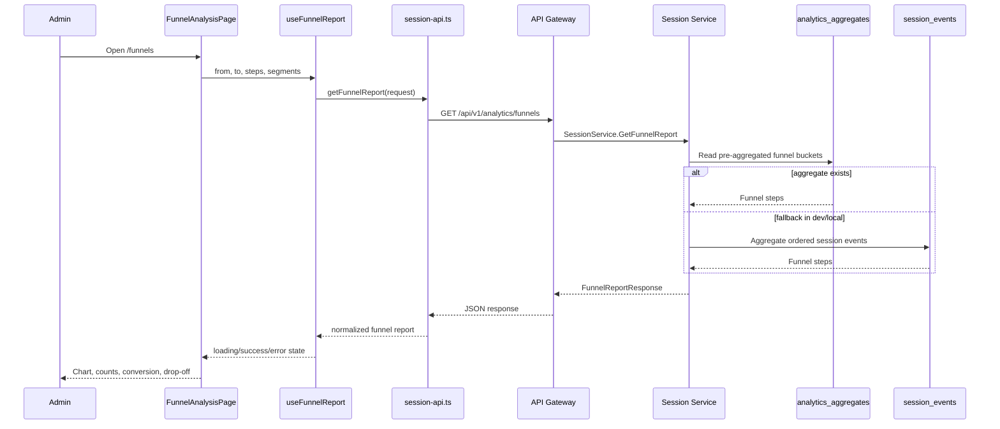
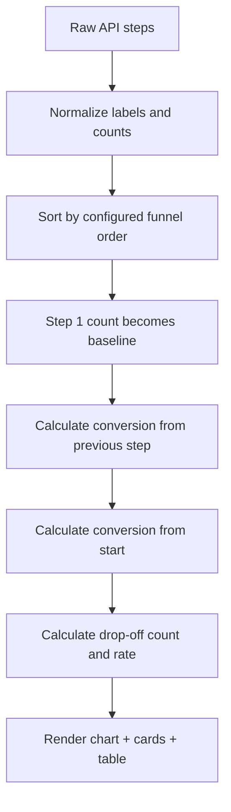

# 📊 Session Analytics Dashboard Service - Task 4: Funnel Analysis


## 📌 Task Summary

| Field | Detail |
|---|---|
| Task Name | Funnel analysis |
| Source | `docs/01-micro-tasks.md` → `Session Analytics Dashboard` → Task 4 |
| Priority | `P2` analytics capability |
| Dependency | Aggregation APIs |
| Main Goal | Product view → cart → checkout → paid funnel chart banana |
| Output Type | Structured implementation guide |
| Not Included | Heatmap view, cohort retention, CSV export, scheduled reports, privacy controls full page, backend aggregation code implementation |

> **Simple Hinglish goal:** Is task ka kaam Session Analytics Dashboard me ek **Funnel Analysis** page banana hai jahan admin clearly dekh sake ki product view se cart, checkout, aur paid conversion tak users/session kitne drop ho rahe hain. Ye page conversion debugging ke liye hai, marketing landing page nahi.

---

## ✅ Final Output Created

```text
TaskImplementation/
└── Session Analytics Dashboard Service/
    ├── task1.md
    ├── task2.md
    ├── task3.md
    └── task4.md
```

### Why this structure?

- `TaskImplementation/` task-wise implementation guides ka central folder hai.
- `Session Analytics Dashboard Service/` folder already exist karta tha, isliye usko keep kiya gaya.
- `task4.md` sirf **Session Analytics Dashboard Service - Task 4** ka guide hai.
- Actual frontend/backend source files create nahi kiye gaye, kyunki requested output only folder structure aur markdown guide hai.
- Task 4 ke beyond Heatmap, Retention, Export, Privacy Controls ka implementation intentionally include nahi kiya gaya.

---

## 🧭 Documentation Sources Studied

| Document | Kya use kiya gaya |
|---|---|
| `docs/01-micro-tasks.md` | Task 4 ka exact scope: Product view to cart to checkout to paid funnel chart |
| `docs/03-folder-structure.md` | `frontend/session-analytics-dashboard/features/funnels/` folder recommendation |
| `docs/08-session-management-system.md` | Funnel report concept, event types, analytics metrics, dashboard APIs |
| `docs/10-frontend-implementation.md` | Data-heavy dashboard direction, readable/exportable charts |
| `docs/04-microservice-design.md` | Session Service ownership and `GetFunnelReport` method |
| `database/mongodb-schema-design.md` | `session_events` and `analytics_aggregates` storage/index references |
| `api/master-api.json` | `GET /api/v1/analytics/funnels` route and `FunnelReportRequest/Response` mapping |

---

## 🧱 Task Boundary

### ✅ Included in Task 4

- Funnel Analysis page
- `/funnels` dashboard route
- Sidebar navigation item
- Date range and segment filter usage
- Default e-commerce funnel steps:
  - Product viewed
  - Added to cart
  - Checkout started
  - Paid
- Funnel chart using chart library
- Step cards with counts and conversion rates
- Drop-off table between steps
- Conversion summary strip
- API client for `GET /api/v1/analytics/funnels`
- React Query hook for aggregation API
- Loading, error, empty, and partial-data states
- Privacy-safe aggregate display rules
- Beginner-friendly tests with MSW
- Mermaid architecture and flow diagrams

### ❌ Not Included in Task 4

- Heatmap overlay or click/scroll canvas
- Retention/cohort reports
- CSV download and scheduled report options
- Backend MongoDB aggregation implementation files
- Kafka/RabbitMQ aggregation worker implementation
- Payment Service internals
- Exact session replay
- Raw event payload detail panel
- User-level or session-level drilldown table

> 🟢 **Rule:** Task 4 ka focus sirf aggregate funnel visualization hai. Individual session investigation Task 3 me covered hai, aur heatmap Task 5 ka area hai.

---

## 🧩 Funnel Definition

Task 4 ka default funnel ecommerce conversion path ko represent karta hai.

| Order | Step Key | UI Label | Source Event Mapping | Meaning |
|---:|---|---|---|---|
| 1 | `product_view` | Product viewed | `event_type = product_view` | User/session ne product page dekha |
| 2 | `add_to_cart` | Added to cart | `event_type = add_to_cart` | Product cart me add hua |
| 3 | `checkout_started` | Checkout started | `event_type = checkout_step` with `step_name = start` or `checkout_started` | Checkout flow start hua |
| 4 | `paid` | Paid | `event_type = payment_result` with `status = paid/succeeded` | Payment successful hua |

### Counting Rules

| Rule | Explanation |
|---|---|
| Count unique sessions | Same session ne ek product 5 baar view kiya ho, funnel me session once count hoga. |
| Preserve order | `add_to_cart` tabhi valid hai jab session me pehle `product_view` hua ho. |
| Use date range | `from` and `to` filter dashboard se API request me jayenge. |
| Segment-safe | Device/source/channel/user type filters aggregate level par apply honge. |
| No raw PII | Funnel page direct `user_id`, email, phone, raw IP, ya keystroke data nahi dikhayega. |
| Small count protection | Very small segments, example `< 5`, ko backend ya UI me suppress/mask karna recommended hai. |

### Funnel Metrics

| Metric | Formula |
|---|---|
| Step count | Unique sessions/users that reached the step |
| Previous-step conversion | `current_step_count / previous_step_count * 100` |
| Start conversion | `current_step_count / first_step_count * 100` |
| Drop-off count | `previous_step_count - current_step_count` |
| Drop-off rate | `drop_off_count / previous_step_count * 100` |

---

## 🗂️ Clean Folder Structure

Task 1 shell, Task 2 live sessions, and Task 3 journey module ke upar Task 4 me `features/funnels/` module add hoga.

```text
frontend/session-analytics-dashboard/
├── package.json
├── vite.config.ts
├── tailwind.config.ts
├── index.html
└── src/
    ├── main.tsx
    ├── app.tsx
    ├── layout/
    │   ├── analytics-layout.tsx
    │   └── filters-bar.tsx
    ├── features/
    │   ├── shell/
    │   │   └── pages/
    │   │       └── analytics-overview-page.tsx
    │   ├── live/
    │   │   └── pages/
    │   │       └── live-sessions-page.tsx
    │   ├── journey/
    │   │   └── pages/
    │   │       └── journey-explorer-page.tsx
    │   └── funnels/
    │       ├── pages/
    │       │   └── funnel-analysis-page.tsx
    │       ├── components/
    │       │   ├── conversion-summary-strip.tsx
    │       │   ├── funnel-chart.tsx
    │       │   ├── funnel-dropoff-table.tsx
    │       │   ├── funnel-empty-state.tsx
    │       │   ├── funnel-filters.tsx
    │       │   ├── funnel-insight-panel.tsx
    │       │   ├── funnel-step-card.tsx
    │       │   └── funnel-step-list.tsx
    │       ├── hooks/
    │       │   └── use-funnel-report.ts
    │       └── lib/
    │           ├── funnel-format.ts
    │           └── funnel-math.ts
    ├── api/
    │   └── session-api.ts
    ├── lib/
    │   ├── chart-theme.ts
    │   ├── date-range.ts
    │   ├── format.ts
    │   └── session-view.ts
    └── styles/
        └── globals.css
```

### Folder Responsibility

| Path | Responsibility |
|---|---|
| `src/features/funnels/pages/funnel-analysis-page.tsx` | Funnel Analysis ka main page |
| `src/features/funnels/components/funnel-filters.tsx` | Funnel type, segment, and date controls |
| `src/features/funnels/components/funnel-chart.tsx` | Product view → cart → checkout → paid visual chart |
| `src/features/funnels/components/funnel-step-list.tsx` | Step-by-step count cards list |
| `src/features/funnels/components/funnel-step-card.tsx` | Single funnel step card |
| `src/features/funnels/components/funnel-dropoff-table.tsx` | Previous step se next step tak drop-off table |
| `src/features/funnels/components/conversion-summary-strip.tsx` | Overall conversion, biggest drop, total sessions summary |
| `src/features/funnels/components/funnel-insight-panel.tsx` | Short actionable insights panel |
| `src/features/funnels/components/funnel-empty-state.tsx` | No data state |
| `src/features/funnels/hooks/use-funnel-report.ts` | React Query hook for funnel report |
| `src/features/funnels/lib/funnel-math.ts` | Conversion and drop-off calculations |
| `src/features/funnels/lib/funnel-format.ts` | Funnel labels, colors, and display formatting |
| `src/api/session-api.ts` | `getFunnelReport` API method |
| `src/lib/chart-theme.ts` | Shared chart colors/tokens |

---

## 🧩 High-Level Architecture

```mermaid
flowchart LR
    Admin[Admin User] --> Browser[Session Analytics Dashboard]
    Browser --> Route[/funnels route]
    Route --> Page[FunnelAnalysisPage]
    Page --> Filters[FunnelFilters]
    Page --> Summary[ConversionSummaryStrip]
    Page --> Chart[FunnelChart]
    Page --> Cards[FunnelStepList]
    Page --> Dropoff[FunnelDropoffTable]
    Filters --> Hook[useFunnelReport]
    Summary --> Hook
    Chart --> Hook
    Cards --> Hook
    Dropoff --> Hook
    Hook --> API[session-api.ts]
    API --> Gateway[API Gateway]
    Gateway --> Session[Session Service]
    Session --> Aggregates[(analytics_aggregates)]
    Session --> Events[(session_events fallback)]
```

**Hinglish explanation:**  
Admin `/funnels` page open karta hai. Page date range, steps, aur segments ko maintain karta hai. `useFunnelReport` hook aggregation API call karta hai. Session Service pehle pre-aggregated `analytics_aggregates` se report de sakta hai; agar dev/local mode me aggregate missing ho, raw `session_events` se fallback aggregation possible hai.

---

## 🔄 Funnel Data Flow



---

## 🧮 Funnel Math Flow



**Hinglish explanation:**  
API se steps array aata hai. Frontend usko predictable order me normalize karta hai. First step baseline hota hai. Har next step ke liye conversion aur drop-off calculate hota hai, phir same data chart, cards, aur table me use hota hai.

---

## 🔌 API Contract

Docs ke according Task 4 ka endpoint:

```http
GET /api/v1/analytics/funnels
Authorization: Bearer <admin_access_token>
```

### API Mapping

| Layer | Detail |
|---|---|
| REST Route | `GET /api/v1/analytics/funnels` |
| Gateway Mapping | `analytics.funnels` |
| Service | `session-service` |
| gRPC Method | `SessionService.GetFunnelReport` |
| Auth | `admin` |
| Request Schema | `FunnelReportRequest` |
| Response Schema | `FunnelReportResponse` |

### Request Query Example

```http
GET /api/v1/analytics/funnels?from=2026-05-01T00%3A00%3A00.000Z&to=2026-05-28T23%3A59%3A59.999Z&steps=product_view,add_to_cart,checkout_started,paid&device_type=all&channel=all&source=all&user_type=all
```

> 🟡 **Serializer note:** `api/master-api.json` me `steps` array defined hai. REST gateway agar repeated query format prefer kare, to serializer `steps=product_view&steps=add_to_cart` use kar sakta hai. Is guide me comma-separated format simple example ke liye use hua hai.

### Recommended Response Shape

`api/master-api.json` me `FunnelReportResponse.steps` generic object array hai. Frontend ko robust banane ke liye response ko normalize karna chahiye.

```json
{
  "steps": [
    {
      "key": "product_view",
      "label": "Product viewed",
      "count": 12000
    },
    {
      "key": "add_to_cart",
      "label": "Added to cart",
      "count": 4200
    },
    {
      "key": "checkout_started",
      "label": "Checkout started",
      "count": 2100
    },
    {
      "key": "paid",
      "label": "Paid",
      "count": 1260
    }
  ]
}
```

### Frontend Normalized Shape

```ts
export type FunnelStepKey =
  | "product_view"
  | "add_to_cart"
  | "checkout_started"
  | "paid";

export type FunnelStep = {
  key: FunnelStepKey;
  label: string;
  count: number;
  conversionFromPrevious: number | null;
  conversionFromStart: number;
  dropoffFromPrevious: number | null;
  dropoffRateFromPrevious: number | null;
};

export type FunnelReport = {
  steps: FunnelStep[];
  totalStarted: number;
  totalCompleted: number;
  overallConversionRate: number;
  biggestDropoffStepKey: FunnelStepKey | null;
};
```

---

## 🪜 Step-by-Step Implementation

## Step 1: Chart library install karo

Task 1, 2, and 3 me chart library required nahi thi. Task 4 me funnel chart banana hai, isliye `recharts` add karna recommended hai.

```bash
cd frontend/session-analytics-dashboard
npm install recharts
```

**Explanation:**  
`recharts` React-friendly chart library hai. Isme `ResponsiveContainer`, `Tooltip`, aur `FunnelChart` support milta hai. Dashboard charts ko responsive banane ke liye ye useful hai.

---

## Step 2: `/funnels` route add karo

```tsx
// src/app.tsx
import { Navigate, Route, Routes } from "react-router-dom";
import { AnalyticsLayout } from "./layout/analytics-layout";
import { AnalyticsOverviewPage } from "./features/shell/pages/analytics-overview-page";
import { LiveSessionsPage } from "./features/live/pages/live-sessions-page";
import { JourneyExplorerPage } from "./features/journey/pages/journey-explorer-page";
import { FunnelAnalysisPage } from "./features/funnels/pages/funnel-analysis-page";

export function App() {
  return (
    <Routes>
      <Route element={<AnalyticsLayout />}>
        <Route index element={<AnalyticsOverviewPage />} />
        <Route path="/live" element={<LiveSessionsPage />} />
        <Route path="/journey" element={<JourneyExplorerPage />} />
        <Route path="/journey/:sessionId" element={<JourneyExplorerPage />} />
        <Route path="/funnels" element={<FunnelAnalysisPage />} />
        <Route path="*" element={<Navigate to="/" replace />} />
      </Route>
    </Routes>
  );
}
```

**Explanation:**  
Funnel page same dashboard shell ke andar render hoga. Sidebar/topbar consistent rahega, and admin ko modules ke beech switch karna easy hoga.

---

## Step 3: Sidebar navigation me Funnels item add karo

```tsx
// src/layout/analytics-layout.tsx
import { Activity, Filter, Gauge, Route } from "lucide-react";

const navItems = [
  { label: "Overview", href: "/", icon: Gauge },
  { label: "Live Sessions", href: "/live", icon: Activity },
  { label: "Journey", href: "/journey", icon: Route },
  { label: "Funnels", href: "/funnels", icon: Filter },
];
```

**Explanation:**  
`Filter` icon funnel/step filtering concept ko represent karta hai. Navigation label short rakha gaya hai, kyunki operational dashboards me compact labels scan karna easy hota hai.

---

## Step 4: Chart theme define karo

```ts
// src/lib/chart-theme.ts
export const funnelColors = {
  productView: "#2563eb",
  addToCart: "#0891b2",
  checkoutStarted: "#16a34a",
  paid: "#f59e0b",
  danger: "#dc2626",
  muted: "#64748b",
};

export const funnelStepColors = [
  funnelColors.productView,
  funnelColors.addToCart,
  funnelColors.checkoutStarted,
  funnelColors.paid,
];
```

**Explanation:**  
Palette ek hi hue family me locked nahi hai. Blue, cyan, green, and amber steps ko visually separate banate hain. Ye readable chart ke liye important hai.

---

## Step 5: Funnel labels and formatting helpers banao

```ts
// src/features/funnels/lib/funnel-format.ts
import type { FunnelStepKey } from "../../../api/session-api";

export const defaultFunnelSteps: FunnelStepKey[] = [
  "product_view",
  "add_to_cart",
  "checkout_started",
  "paid",
];

export const funnelStepLabels: Record<FunnelStepKey, string> = {
  product_view: "Product viewed",
  add_to_cart: "Added to cart",
  checkout_started: "Checkout started",
  paid: "Paid",
};

export function formatPercent(value: number | null) {
  if (value === null || Number.isNaN(value)) return "—";
  return `${value.toFixed(1)}%`;
}

export function formatCount(value: number) {
  return new Intl.NumberFormat("en-IN").format(value);
}
```

**Explanation:**  
Labels central place par rakhne se chart, cards, and table same wording use karenge. Formatting helper dashboard ko consistent banata hai.

---

## Step 6: API types and client method add karo

```ts
// src/api/session-api.ts
export type FunnelStepKey =
  | "product_view"
  | "add_to_cart"
  | "checkout_started"
  | "paid";

export type FunnelReportRequest = {
  from: string;
  to: string;
  steps?: FunnelStepKey[];
  deviceType?: string;
  channel?: string;
  source?: string;
  userType?: string;
};

export type RawFunnelStep = {
  key?: string;
  step?: string;
  label?: string;
  count?: number;
  sessions?: number;
  unique_sessions?: number;
};

export type RawFunnelReportResponse = {
  steps: RawFunnelStep[];
};

export async function getFunnelReport(
  request: FunnelReportRequest,
  signal?: AbortSignal,
): Promise<RawFunnelReportResponse> {
  const params = new URLSearchParams();

  params.set("from", request.from);
  params.set("to", request.to);

  if (request.steps?.length) {
    params.set("steps", request.steps.join(","));
  }

  if (request.deviceType && request.deviceType !== "all") {
    params.set("device_type", request.deviceType);
  }

  if (request.channel && request.channel !== "all") {
    params.set("channel", request.channel);
  }

  if (request.source && request.source !== "all") {
    params.set("source", request.source);
  }

  if (request.userType && request.userType !== "all") {
    params.set("user_type", request.userType);
  }

  const response = await fetch(`/api/v1/analytics/funnels?${params.toString()}`, {
    headers: {
      Accept: "application/json",
    },
    signal,
  });

  if (!response.ok) {
    throw new Error("Funnel report load nahi ho paya.");
  }

  return response.json();
}
```

**Explanation:**  
API client raw response return karta hai. Backend schema generic hai, isliye normalization hook/lib layer me karna safer hai. `AbortSignal` route change ya filter change par old request cancel karne me help karta hai.

---

## Step 7: Funnel math normalize karo

```ts
// src/features/funnels/lib/funnel-math.ts
import type {
  FunnelStepKey,
  RawFunnelReportResponse,
} from "../../../api/session-api";
import {
  defaultFunnelSteps,
  funnelStepLabels,
} from "./funnel-format";

export type FunnelStep = {
  key: FunnelStepKey;
  label: string;
  count: number;
  conversionFromPrevious: number | null;
  conversionFromStart: number;
  dropoffFromPrevious: number | null;
  dropoffRateFromPrevious: number | null;
};

export type FunnelReport = {
  steps: FunnelStep[];
  totalStarted: number;
  totalCompleted: number;
  overallConversionRate: number;
  biggestDropoffStepKey: FunnelStepKey | null;
};

function safePercent(part: number, total: number) {
  if (total <= 0) return 0;
  return (part / total) * 100;
}

function readStepKey(rawKey: unknown): FunnelStepKey | null {
  if (
    rawKey === "product_view" ||
    rawKey === "add_to_cart" ||
    rawKey === "checkout_started" ||
    rawKey === "paid"
  ) {
    return rawKey;
  }

  return null;
}

export function normalizeFunnelReport(
  response: RawFunnelReportResponse,
): FunnelReport {
  const countByStep = new Map<FunnelStepKey, number>();

  for (const item of response.steps ?? []) {
    const key = readStepKey(item.key ?? item.step);
    if (!key) continue;

    const count =
      item.count ??
      item.sessions ??
      item.unique_sessions ??
      0;

    countByStep.set(key, Math.max(0, Number(count)));
  }

  const firstCount = countByStep.get(defaultFunnelSteps[0]) ?? 0;

  const steps = defaultFunnelSteps.map((key, index) => {
    const count = countByStep.get(key) ?? 0;
    const previousKey = defaultFunnelSteps[index - 1];
    const previousCount = previousKey ? countByStep.get(previousKey) ?? 0 : null;
    const dropoff =
      previousCount === null ? null : Math.max(0, previousCount - count);

    return {
      key,
      label: funnelStepLabels[key],
      count,
      conversionFromPrevious:
        previousCount === null ? null : safePercent(count, previousCount),
      conversionFromStart: safePercent(count, firstCount),
      dropoffFromPrevious: dropoff,
      dropoffRateFromPrevious:
        previousCount === null || dropoff === null
          ? null
          : safePercent(dropoff, previousCount),
    };
  });

  const biggestDrop = steps
    .filter((step) => step.dropoffFromPrevious !== null)
    .sort(
      (a, b) =>
        (b.dropoffFromPrevious ?? 0) - (a.dropoffFromPrevious ?? 0),
    )[0];

  const totalCompleted = steps[steps.length - 1]?.count ?? 0;

  return {
    steps,
    totalStarted: firstCount,
    totalCompleted,
    overallConversionRate: safePercent(totalCompleted, firstCount),
    biggestDropoffStepKey: biggestDrop?.key ?? null,
  };
}
```

**Explanation:**  
Ye helper raw backend response ko UI-ready data me convert karta hai. Agar backend field `count`, `sessions`, ya `unique_sessions` me value bheje, UI still work karega. Conversion and drop-off calculation ek central helper me hai, taaki chart/table/cards me duplicate logic na aaye.

---

## Step 8: React Query hook banao

```ts
// src/features/funnels/hooks/use-funnel-report.ts
import { useQuery } from "@tanstack/react-query";
import {
  getFunnelReport,
  type FunnelReportRequest,
} from "../../../api/session-api";
import { normalizeFunnelReport } from "../lib/funnel-math";

export function useFunnelReport(request: FunnelReportRequest) {
  return useQuery({
    queryKey: ["analytics", "funnel-report", request],
    queryFn: ({ signal }) =>
      getFunnelReport(request, signal).then(normalizeFunnelReport),
    staleTime: 60_000,
    refetchOnWindowFocus: false,
  });
}
```

**Explanation:**  
Funnel report real-time active sessions jaisa every few seconds refresh nahi hota. `staleTime` 60 seconds enough hai. Date/filter change hote hi `queryKey` change hoga and new data fetch hoga.

---

## Step 9: Funnel filters component banao

```tsx
// src/features/funnels/components/funnel-filters.tsx
import type { FunnelStepKey } from "../../../api/session-api";

type FunnelFiltersValue = {
  steps: FunnelStepKey[];
  deviceType: string;
  channel: string;
  source: string;
  userType: string;
};

type FunnelFiltersProps = {
  value: FunnelFiltersValue;
  onChange: (value: FunnelFiltersValue) => void;
};

const deviceOptions = ["all", "desktop", "mobile", "tablet"];
const userTypeOptions = ["all", "guest", "logged_in"];

export function FunnelFilters({ value, onChange }: FunnelFiltersProps) {
  return (
    <div className="grid gap-3 border-b border-slate-800 bg-slate-950 px-4 py-3 md:grid-cols-4">
      <label className="grid gap-1 text-xs text-slate-400">
        Device
        <select
          className="h-9 rounded-md border border-slate-700 bg-slate-900 px-2 text-sm text-slate-100"
          value={value.deviceType}
          onChange={(event) =>
            onChange({ ...value, deviceType: event.target.value })
          }
        >
          {deviceOptions.map((option) => (
            <option key={option} value={option}>
              {option === "all" ? "All devices" : option}
            </option>
          ))}
        </select>
      </label>

      <label className="grid gap-1 text-xs text-slate-400">
        Channel
        <select
          className="h-9 rounded-md border border-slate-700 bg-slate-900 px-2 text-sm text-slate-100"
          value={value.channel}
          onChange={(event) =>
            onChange({ ...value, channel: event.target.value })
          }
        >
          <option value="all">All channels</option>
          <option value="organic">Organic</option>
          <option value="paid">Paid</option>
          <option value="direct">Direct</option>
          <option value="referral">Referral</option>
        </select>
      </label>

      <label className="grid gap-1 text-xs text-slate-400">
        Source
        <input
          className="h-9 rounded-md border border-slate-700 bg-slate-900 px-2 text-sm text-slate-100"
          placeholder="utm_source or all"
          value={value.source}
          onChange={(event) =>
            onChange({ ...value, source: event.target.value || "all" })
          }
        />
      </label>

      <label className="grid gap-1 text-xs text-slate-400">
        User type
        <select
          className="h-9 rounded-md border border-slate-700 bg-slate-900 px-2 text-sm text-slate-100"
          value={value.userType}
          onChange={(event) =>
            onChange({ ...value, userType: event.target.value })
          }
        >
          {userTypeOptions.map((option) => (
            <option key={option} value={option}>
              {option === "all" ? "All users" : option.replace("_", " ")}
            </option>
          ))}
        </select>
      </label>
    </div>
  );
}
```

**Explanation:**  
Filters compact grid me hain. Dashboard user quick slicing kar sakta hai: mobile conversion, paid traffic conversion, guest vs logged-in conversion etc. Date range Task 1 ke shared `filters-bar.tsx` se reuse hoga.

---

## Step 10: Funnel chart component banao

```tsx
// src/features/funnels/components/funnel-chart.tsx
import {
  Cell,
  Funnel,
  FunnelChart as RechartsFunnelChart,
  LabelList,
  ResponsiveContainer,
  Tooltip,
} from "recharts";
import { funnelStepColors } from "../../../lib/chart-theme";
import type { FunnelReport } from "../lib/funnel-math";
import { formatCount } from "../lib/funnel-format";

type FunnelChartProps = {
  report: FunnelReport;
};

export function FunnelChart({ report }: FunnelChartProps) {
  const data = report.steps.map((step) => ({
    name: step.label,
    value: step.count,
    conversion: step.conversionFromStart,
  }));

  return (
    <section className="min-h-[360px] border border-slate-800 bg-slate-950 p-4">
      <div className="mb-4 flex items-center justify-between gap-3">
        <div>
          <h2 className="text-sm font-semibold text-slate-100">
            Conversion funnel
          </h2>
          <p className="text-xs text-slate-400">
            Unique sessions by ordered funnel step
          </p>
        </div>
        <div className="text-right">
          <p className="text-xs text-slate-400">Overall conversion</p>
          <p className="text-lg font-semibold text-amber-300">
            {report.overallConversionRate.toFixed(1)}%
          </p>
        </div>
      </div>

      <div className="h-[280px] w-full">
        <ResponsiveContainer width="100%" height="100%">
          <RechartsFunnelChart>
            <Tooltip
              formatter={(value) => formatCount(Number(value))}
              contentStyle={{
                background: "#020617",
                border: "1px solid #334155",
                borderRadius: 8,
                color: "#e2e8f0",
              }}
            />
            <Funnel dataKey="value" data={data} isAnimationActive>
              <LabelList
                dataKey="name"
                position="right"
                fill="#e2e8f0"
                stroke="none"
              />
              {data.map((entry, index) => (
                <Cell
                  key={entry.name}
                  fill={funnelStepColors[index % funnelStepColors.length]}
                />
              ))}
            </Funnel>
          </RechartsFunnelChart>
        </ResponsiveContainer>
      </div>
    </section>
  );
}
```

**Explanation:**  
`ResponsiveContainer` chart ko desktop/mobile widths me fit rakhta hai. Funnel chart ke saath summary cards/table bhi honge, because chart alone exact numbers compare karne ke liye enough nahi hota.

---

## Step 11: Step cards banao

```tsx
// src/features/funnels/components/funnel-step-card.tsx
import type { FunnelStep } from "../lib/funnel-math";
import { formatCount, formatPercent } from "../lib/funnel-format";

type FunnelStepCardProps = {
  step: FunnelStep;
  index: number;
};

export function FunnelStepCard({ step, index }: FunnelStepCardProps) {
  return (
    <article className="border border-slate-800 bg-slate-950 p-4">
      <div className="flex items-start justify-between gap-3">
        <div>
          <p className="text-xs text-slate-500">Step {index + 1}</p>
          <h3 className="mt-1 text-sm font-semibold text-slate-100">
            {step.label}
          </h3>
        </div>
        <span className="rounded bg-slate-800 px-2 py-1 text-xs text-slate-300">
          {formatPercent(step.conversionFromStart)}
        </span>
      </div>

      <p className="mt-4 text-2xl font-semibold text-slate-50">
        {formatCount(step.count)}
      </p>

      <div className="mt-3 grid grid-cols-2 gap-3 text-xs">
        <div>
          <p className="text-slate-500">From previous</p>
          <p className="font-medium text-slate-200">
            {formatPercent(step.conversionFromPrevious)}
          </p>
        </div>
        <div>
          <p className="text-slate-500">Drop-off</p>
          <p className="font-medium text-red-300">
            {formatPercent(step.dropoffRateFromPrevious)}
          </p>
        </div>
      </div>
    </article>
  );
}
```

```tsx
// src/features/funnels/components/funnel-step-list.tsx
import type { FunnelReport } from "../lib/funnel-math";
import { FunnelStepCard } from "./funnel-step-card";

type FunnelStepListProps = {
  report: FunnelReport;
};

export function FunnelStepList({ report }: FunnelStepListProps) {
  return (
    <div className="grid gap-3 md:grid-cols-2 xl:grid-cols-4">
      {report.steps.map((step, index) => (
        <FunnelStepCard key={step.key} step={step} index={index} />
      ))}
    </div>
  );
}
```

**Explanation:**  
Cards quick scanning ke liye hain. Admin chart dekhe bina bhi each step ka count, previous conversion, aur drop-off samajh sakta hai.

---

## Step 12: Drop-off table banao

```tsx
// src/features/funnels/components/funnel-dropoff-table.tsx
import type { FunnelReport } from "../lib/funnel-math";
import { formatCount, formatPercent } from "../lib/funnel-format";

type FunnelDropoffTableProps = {
  report: FunnelReport;
};

export function FunnelDropoffTable({ report }: FunnelDropoffTableProps) {
  const rows = report.steps.slice(1).map((step, index) => ({
    from: report.steps[index],
    to: step,
  }));

  return (
    <section className="border border-slate-800 bg-slate-950">
      <div className="border-b border-slate-800 px-4 py-3">
        <h2 className="text-sm font-semibold text-slate-100">
          Step drop-off
        </h2>
        <p className="text-xs text-slate-400">
          Previous step se next step tak loss
        </p>
      </div>

      <div className="overflow-x-auto">
        <table className="min-w-full text-left text-sm">
          <thead className="bg-slate-900 text-xs uppercase text-slate-500">
            <tr>
              <th className="px-4 py-3 font-medium">From</th>
              <th className="px-4 py-3 font-medium">To</th>
              <th className="px-4 py-3 font-medium">Lost</th>
              <th className="px-4 py-3 font-medium">Drop-off rate</th>
              <th className="px-4 py-3 font-medium">Conversion</th>
            </tr>
          </thead>
          <tbody className="divide-y divide-slate-800">
            {rows.map(({ from, to }) => (
              <tr key={`${from.key}-${to.key}`}>
                <td className="px-4 py-3 text-slate-300">{from.label}</td>
                <td className="px-4 py-3 text-slate-300">{to.label}</td>
                <td className="px-4 py-3 text-red-300">
                  {formatCount(to.dropoffFromPrevious ?? 0)}
                </td>
                <td className="px-4 py-3 text-red-300">
                  {formatPercent(to.dropoffRateFromPrevious)}
                </td>
                <td className="px-4 py-3 text-emerald-300">
                  {formatPercent(to.conversionFromPrevious)}
                </td>
              </tr>
            ))}
          </tbody>
        </table>
      </div>
    </section>
  );
}
```

**Explanation:**  
Operational analytics me exact drop-off table very useful hota hai. Funnel chart visually trend batata hai; table specific debugging point batata hai.

---

## Step 13: Conversion summary strip banao

```tsx
// src/features/funnels/components/conversion-summary-strip.tsx
import type { FunnelReport } from "../lib/funnel-math";
import { funnelStepLabels } from "../lib/funnel-format";
import { formatCount, formatPercent } from "../lib/funnel-format";

type ConversionSummaryStripProps = {
  report: FunnelReport;
};

export function ConversionSummaryStrip({ report }: ConversionSummaryStripProps) {
  const biggestDropLabel = report.biggestDropoffStepKey
    ? funnelStepLabels[report.biggestDropoffStepKey]
    : "No drop-off";

  return (
    <div className="grid gap-3 md:grid-cols-3">
      <div className="border border-slate-800 bg-slate-950 p-4">
        <p className="text-xs text-slate-500">Started funnel</p>
        <p className="mt-1 text-xl font-semibold text-slate-50">
          {formatCount(report.totalStarted)}
        </p>
      </div>
      <div className="border border-slate-800 bg-slate-950 p-4">
        <p className="text-xs text-slate-500">Paid conversion</p>
        <p className="mt-1 text-xl font-semibold text-amber-300">
          {formatPercent(report.overallConversionRate)}
        </p>
      </div>
      <div className="border border-slate-800 bg-slate-950 p-4">
        <p className="text-xs text-slate-500">Biggest drop</p>
        <p className="mt-1 text-xl font-semibold text-red-300">
          {biggestDropLabel}
        </p>
      </div>
    </div>
  );
}
```

**Explanation:**  
Summary strip page ke top area me quick answer deta hai: funnel start kitna hua, paid conversion kya hai, aur sabse bada loss kahan hai.

---

## Step 14: Empty state banao

```tsx
// src/features/funnels/components/funnel-empty-state.tsx
export function FunnelEmptyState() {
  return (
    <div className="border border-dashed border-slate-700 bg-slate-950 px-4 py-10 text-center">
      <h2 className="text-sm font-semibold text-slate-100">
        Funnel data available nahi hai
      </h2>
      <p className="mx-auto mt-2 max-w-md text-sm text-slate-400">
        Selected date range ya segment me product view se paid tak enough
        aggregate events nahi mile.
      </p>
    </div>
  );
}
```

**Explanation:**  
Empty state short and useful hai. Isme tutorial jaisa long explanation nahi diya gaya, kyunki dashboard me user ko quickly next action samajhna hota hai: date range/segment change karo.

---

## Step 15: Funnel insights panel banao

```tsx
// src/features/funnels/components/funnel-insight-panel.tsx
import type { FunnelReport } from "../lib/funnel-math";
import { funnelStepLabels } from "../lib/funnel-format";
import { formatPercent } from "../lib/funnel-format";

type FunnelInsightPanelProps = {
  report: FunnelReport;
};

export function FunnelInsightPanel({ report }: FunnelInsightPanelProps) {
  const biggestDrop = report.steps.find(
    (step) => step.key === report.biggestDropoffStepKey,
  );

  return (
    <aside className="border border-slate-800 bg-slate-950 p-4">
      <h2 className="text-sm font-semibold text-slate-100">
        Readout
      </h2>
      <div className="mt-3 space-y-3 text-sm text-slate-300">
        <p>
          Overall paid conversion{" "}
          <span className="font-semibold text-amber-300">
            {formatPercent(report.overallConversionRate)}
          </span>{" "}
          hai.
        </p>
        {biggestDrop ? (
          <p>
            Sabse bada drop{" "}
            <span className="font-semibold text-red-300">
              {funnelStepLabels[biggestDrop.key]}
            </span>{" "}
            step par dikh raha hai.
          </p>
        ) : (
          <p>Selected segment me drop-off signal clear nahi hai.</p>
        )}
      </div>
    </aside>
  );
}
```

**Explanation:**  
Insight panel raw AI/ML recommendation nahi hai. Ye deterministic readout hai jo same calculated funnel data ko simple language me summarize karta hai.

---

## Step 16: Funnel Analysis page compose karo

```tsx
// src/features/funnels/pages/funnel-analysis-page.tsx
import { useMemo, useState } from "react";
import type { FunnelReportRequest } from "../../../api/session-api";
import { defaultFunnelSteps } from "../lib/funnel-format";
import { useFunnelReport } from "../hooks/use-funnel-report";
import { ConversionSummaryStrip } from "../components/conversion-summary-strip";
import { FunnelChart } from "../components/funnel-chart";
import { FunnelDropoffTable } from "../components/funnel-dropoff-table";
import { FunnelEmptyState } from "../components/funnel-empty-state";
import { FunnelFilters } from "../components/funnel-filters";
import { FunnelInsightPanel } from "../components/funnel-insight-panel";
import { FunnelStepList } from "../components/funnel-step-list";

function getLastSevenDaysRange() {
  const to = new Date();
  const from = new Date(to);
  from.setDate(to.getDate() - 7);

  return {
    from: from.toISOString(),
    to: to.toISOString(),
  };
}

export function FunnelAnalysisPage() {
  const [filters, setFilters] = useState({
    steps: defaultFunnelSteps,
    deviceType: "all",
    channel: "all",
    source: "all",
    userType: "all",
  });

  const range = useMemo(() => getLastSevenDaysRange(), []);

  const request: FunnelReportRequest = {
    from: range.from,
    to: range.to,
    steps: filters.steps,
    deviceType: filters.deviceType,
    channel: filters.channel,
    source: filters.source,
    userType: filters.userType,
  };

  const { data, isLoading, isError, refetch, isFetching } =
    useFunnelReport(request);

  const hasData = data ? data.totalStarted > 0 : false;

  return (
    <main className="min-h-screen bg-slate-950 text-slate-100">
      <div className="border-b border-slate-800 px-4 py-4">
        <div className="flex flex-wrap items-center justify-between gap-3">
          <div>
            <h1 className="text-lg font-semibold">Funnel Analysis</h1>
            <p className="text-sm text-slate-400">
              Product view se paid conversion tak aggregate drop-off.
            </p>
          </div>
          <button
            className="h-9 rounded-md border border-slate-700 px-3 text-sm text-slate-200 hover:bg-slate-900"
            onClick={() => refetch()}
            type="button"
          >
            {isFetching ? "Refreshing" : "Refresh"}
          </button>
        </div>
      </div>

      <FunnelFilters value={filters} onChange={setFilters} />

      <div className="grid gap-4 p-4">
        {isLoading ? (
          <div className="border border-slate-800 bg-slate-950 p-6 text-sm text-slate-400">
            Funnel report load ho raha hai...
          </div>
        ) : null}

        {isError ? (
          <div className="border border-red-900 bg-red-950/40 p-6 text-sm text-red-200">
            Funnel report load nahi ho paya. Retry karo ya date range check karo.
          </div>
        ) : null}

        {data && !hasData ? <FunnelEmptyState /> : null}

        {data && hasData ? (
          <>
            <ConversionSummaryStrip report={data} />
            <div className="grid gap-4 xl:grid-cols-[minmax(0,1fr)_320px]">
              <FunnelChart report={data} />
              <FunnelInsightPanel report={data} />
            </div>
            <FunnelStepList report={data} />
            <FunnelDropoffTable report={data} />
          </>
        ) : null}
      </div>
    </main>
  );
}
```

**Explanation:**  
Page structure dense and operational hai. Top header, filters, summary, chart, cards, aur table ek logical flow me arranged hain. `Refresh` manual control hai; aggressive polling nahi use kiya kyunki funnel aggregates usually minute/hour bucketed hote hain.

---

## Step 17: Backend aggregation expectation document karo

Task 4 me backend source code implement nahi karna, but frontend ko correct report tabhi milega jab aggregation API ordered unique session funnel return kare.

### Conceptual MongoDB Aggregation Logic

```javascript
// Reference only: Session Service aggregation concept
db.session_events.aggregate([
  {
    $match: {
      occurred_at: { $gte: fromDate, $lte: toDate },
      event_type: {
        $in: ["product_view", "add_to_cart", "checkout_step", "payment_result"]
      }
    }
  },
  {
    $group: {
      _id: "$session_id",
      events: {
        $push: {
          type: "$event_type",
          properties: "$properties",
          occurred_at: "$occurred_at"
        }
      }
    }
  },
  {
    $project: {
      reached_product_view: true,
      reached_add_to_cart: true,
      reached_checkout_started: true,
      reached_paid: true
    }
  }
]);
```

### Production Recommendation

| Approach | Use Case |
|---|---|
| `analytics_aggregates` precomputed buckets | Production dashboards, fast reads |
| Raw `session_events` aggregation | Local/dev fallback or backfill jobs |
| Message queue worker | Async aggregation from event ingestion |
| Redis counters | Very recent/live rolling windows |

**Explanation:**  
Large traffic me raw events par every dashboard request aggregation expensive ho sakti hai. Production me scheduled/streaming worker aggregate buckets maintain karega, and API fast read model se response dega.

---

## 🧪 Testing Plan

### Unit Test: Funnel math

```ts
// src/features/funnels/lib/funnel-math.test.ts
import { describe, expect, it } from "vitest";
import { normalizeFunnelReport } from "./funnel-math";

describe("normalizeFunnelReport", () => {
  it("calculates conversion and drop-off", () => {
    const report = normalizeFunnelReport({
      steps: [
        { key: "product_view", count: 100 },
        { key: "add_to_cart", count: 40 },
        { key: "checkout_started", count: 20 },
        { key: "paid", count: 10 },
      ],
    });

    expect(report.totalStarted).toBe(100);
    expect(report.totalCompleted).toBe(10);
    expect(report.overallConversionRate).toBe(10);
    expect(report.steps[1].dropoffFromPrevious).toBe(60);
    expect(report.steps[1].conversionFromPrevious).toBe(40);
  });
});
```

### Component Test with MSW

```tsx
// src/features/funnels/pages/funnel-analysis-page.test.tsx
import { render, screen } from "@testing-library/react";
import { http, HttpResponse } from "msw";
import { setupServer } from "msw/node";
import { QueryClient, QueryClientProvider } from "@tanstack/react-query";
import { FunnelAnalysisPage } from "./funnel-analysis-page";

const server = setupServer(
  http.get("/api/v1/analytics/funnels", () =>
    HttpResponse.json({
      steps: [
        { key: "product_view", count: 1000 },
        { key: "add_to_cart", count: 320 },
        { key: "checkout_started", count: 180 },
        { key: "paid", count: 90 },
      ],
    }),
  ),
);

function renderPage() {
  const queryClient = new QueryClient();

  return render(
    <QueryClientProvider client={queryClient}>
      <FunnelAnalysisPage />
    </QueryClientProvider>,
  );
}

beforeAll(() => server.listen());
afterEach(() => server.resetHandlers());
afterAll(() => server.close());

it("renders funnel report", async () => {
  renderPage();

  expect(await screen.findByText("Funnel Analysis")).toBeInTheDocument();
  expect(await screen.findByText("Product viewed")).toBeInTheDocument();
  expect(await screen.findByText("Paid")).toBeInTheDocument();
});
```

### Manual Verification

```bash
cd frontend/session-analytics-dashboard
npm run test
npm run dev
```

Then browser me verify karo:

```text
http://localhost:5173/funnels
```

### Verification Checklist

- [ ] `/funnels` route dashboard shell ke andar open hota hai
- [ ] Sidebar me `Funnels` nav item visible hai
- [ ] API call `GET /api/v1/analytics/funnels` par ja rahi hai
- [ ] Product viewed, Added to cart, Checkout started, Paid steps correct order me hain
- [ ] Overall conversion correct calculate ho raha hai
- [ ] Drop-off table previous step se next step tak accurate hai
- [ ] Empty state no data par visible hai
- [ ] Error state API failure par visible hai
- [ ] Mobile viewport me chart/table overlap nahi karte
- [ ] Raw user identifiers page par show nahi hote
- [ ] Heatmap/cohort/export/privacy-control code add nahi hua

---

## 🧰 External Libraries / Tools Used

| Library/Tool | What it is | Why used | Install | Usage |
|---|---|---|---|---|
| React | UI library | Component-based dashboard screens banane ke liye | Vite template se included | `function FunnelAnalysisPage()` |
| TypeScript | Static typing | API response, filters, and chart props safe rakhne ke liye | Vite React TS template | `.ts` and `.tsx` files |
| Vite | Frontend build tool | Fast dev server and production build | `npm create vite@latest ... -- --template react-ts` | `npm run dev`, `npm run build` |
| Tailwind CSS | Utility CSS framework | Dense operational dashboard layout quickly style karne ke liye | `npm install -D tailwindcss postcss autoprefixer` | `className="grid gap-4"` |
| React Router | Client-side routing | `/funnels` route add karne ke liye | `npm install react-router-dom` | `<Route path="/funnels" ... />` |
| TanStack Query | Server-state library | Loading, cache, retry, and refetch states manage karne ke liye | `npm install @tanstack/react-query` | `useQuery` |
| Recharts | React chart library | Funnel chart and responsive chart container ke liye | `npm install recharts` | `<FunnelChart>`, `<ResponsiveContainer>` |
| lucide-react | Icon library | Sidebar and action icons ke liye | `npm install lucide-react` | `import { Filter } from "lucide-react"` |
| date-fns | Date utility | Date range helpers and formatting ke liye | `npm install date-fns` | `format`, `subDays` |
| Vitest | Test runner | Unit/component tests ke liye | `npm install -D vitest` | `npm run test` |
| Testing Library | React test utilities | UI behavior assert karne ke liye | `npm install -D @testing-library/react @testing-library/jest-dom` | `screen.findByText` |
| MSW | API mocking | Tests me fake funnel API response dene ke liye | `npm install -D msw` | `http.get("/api/v1/analytics/funnels", ...)` |

> 🟢 **New for Task 4:** `recharts` charting ke liye add hota hai. Baaki libraries Task 1 shell setup me already recommended thi.

---

## 🎨 UI/UX Guidelines

| Area | Guideline |
|---|---|
| Layout | Dense dashboard layout rakho, landing-page hero style avoid karo |
| Cards | Cards individual metrics ke liye use karo, nested cards avoid karo |
| Chart | Chart ke saath numeric table/cards zarur do, sirf visual shape par depend mat karo |
| Color | Mixed blue/cyan/green/amber palette use karo, one-note palette avoid karo |
| Filters | Date range and segment filters visible rakho |
| Buttons | Refresh/export jaise actions me clear labels/icons use karo |
| Mobile | Chart height fixed responsive rakho and table horizontal scroll allow karo |
| Copy | Short operational text use karo; long tutorial text in-app me avoid karo |
| Accessibility | Selects labelled, chart data cards/table me also available |

---

## 🔐 Privacy & Security Rules

| Rule | Implementation Direction |
|---|---|
| Admin only | `GET /api/v1/analytics/funnels` auth `admin` hai |
| Aggregate only | Funnel page user/session-level detail expose nahi karega |
| No PII | Email, phone, raw IP, exact address, keystrokes display nahi honge |
| Small segment safety | Low-count buckets mask/suppress karna recommended hai |
| Retention aware | Raw events TTL expire ho sakte hain; long-term dashboards aggregates use karein |
| Consent aware | Consent-disabled events funnel counts me include nahi hone chahiye |

**Hinglish explanation:**  
Funnel powerful analytics view hai, but ye aggregate level par rehna chahiye. Agar admin ko specific session debug karna hai, woh Task 3 Journey Explorer me masked/session-safe view use karega.

---

## ⚙️ Performance Notes

| Concern | Recommendation |
|---|---|
| Heavy raw aggregation | Production me `analytics_aggregates` use karo |
| Frequent refetch | Funnel report ko aggressive polling mat do |
| Large date range | Backend max range limit enforce kare |
| Slow response | UI me loading skeleton/compact loading state show karo |
| Chart resize | `ResponsiveContainer` use karo with stable parent height |
| Query cache | React Query `staleTime` 60 seconds rakho |

---

## 🚦 Error and Edge States

| State | UI Behavior |
|---|---|
| Loading | Existing page shell visible, compact loading block show |
| Fetching after data | Refresh button text `Refreshing` ho sakta hai |
| API error | Red-tinted error block with retry action |
| Empty data | Empty state with date/segment adjustment hint |
| Partial steps | Missing steps ko `0` count treat karo |
| First step zero | All conversion values `0` ya `—`, divide-by-zero avoid |
| Small sample | Backend/UI small count warning show kar sakta hai |

---

## ✅ Definition of Done

- [x] `TaskImplementation/Session Analytics Dashboard Service/task4.md` created
- [x] Task 4 scope clearly documented
- [x] Step-by-step implementation Hinglish me written
- [x] Folder structure included
- [x] External libraries/tools explained with install/use
- [x] API endpoint and request/response examples included
- [x] Mermaid architecture and sequence diagrams included
- [x] Funnel math and conversion/drop-off formulas included
- [x] React + TypeScript code examples included
- [x] Testing plan included
- [x] Privacy/security rules included
- [x] No implementation beyond Session Analytics Dashboard Service Task 4 added

---

## 🧾 Final Notes

Task 4 ke baad Session Analytics Dashboard me conversion funnel analysis ka clear implementation path ready hai. Admin product view se paid tak drop-off identify kar sakta hai, segment filters se issue isolate kar sakta hai, aur chart/table/cards ke through exact conversion numbers compare kar sakta hai.

> ✅ **Task 4 complete:** Documentation-level implementation guide ready hai. Actual frontend/backend files intentionally create nahi kiye gaye, kyunki current requested output sirf required folder structure aur `task4.md` content hai.
