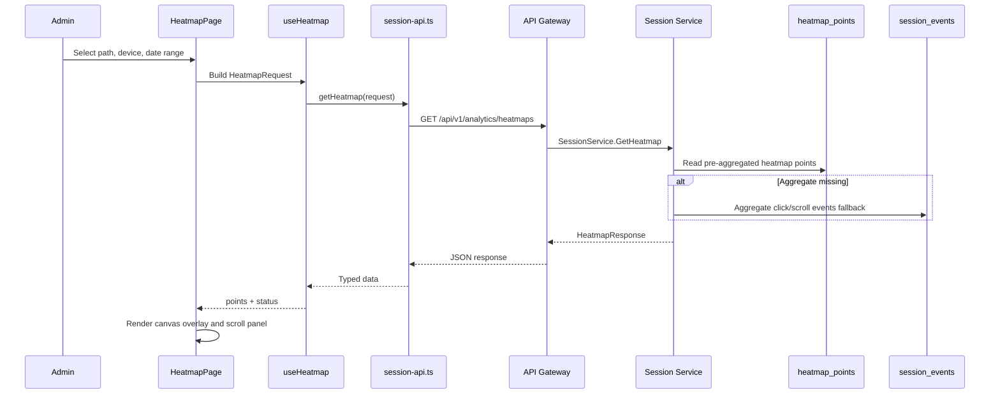

# 📊 Session Analytics Dashboard Service - Task 5: Heatmap View


## 📌 Task Summary

| Field | Detail |
|---|---|
| Task Name | Heatmap view |
| Source | `docs/01-micro-tasks.md` → `Session Analytics Dashboard` → Task 5 |
| Priority | `P2` analytics capability |
| Dependency | Heatmap APIs |
| Main Goal | Conceptual click/scroll heatmap overlay render karna |
| Output Type | Structured implementation guide |
| Not Included | Exact replay, session recording, retention reports, CSV/scheduled exports, privacy controls full page, backend service source code |

> **Simple Hinglish goal:** Is task ka kaam Session Analytics Dashboard me ek **Heatmap View** banana hai jahan admin page-wise click intensity aur scroll depth visually inspect kar sake. Ye exact user replay nahi hai; ye aggregate UX insight view hai.

---

## ✅ Final Output Created

```text
TaskImplementation/
└── Session Analytics Dashboard Service/
    ├── task1.md
    ├── task2.md
    ├── task3.md
    ├── task4.md
    └── task5.md
```

### Why this structure?

- `TaskImplementation/` implementation guides ka central folder hai.
- `Session Analytics Dashboard Service/` folder already exist karta tha, isliye usko keep kiya gaya.
- `task5.md` sirf **Session Analytics Dashboard Service - Task 5** ka guide hai.
- Actual frontend/backend source files create nahi kiye gaye, kyunki requested output only folder structure aur markdown guide hai.
- Task 5 ke beyond Retention, Export Reports, and Privacy Controls ka implementation intentionally include nahi kiya gaya.

---

## 🧭 Documentation Sources Studied

| Document | Kya use kiya gaya |
|---|---|
| `docs/01-micro-tasks.md` | Task 5 ka exact scope: conceptual click/scroll heatmap overlay |
| `docs/03-folder-structure.md` | `frontend/session-analytics-dashboard/features/heatmaps/` folder recommendation |
| `docs/08-session-management-system.md` | Heatmap concept, click/scroll tracking, privacy rules |
| `docs/10-frontend-implementation.md` | Data-heavy dashboard direction, readable/exportable charts |
| `docs/04-microservice-design.md` | Session Service ownership and `GetHeatmap` method |
| `database/mongodb-schema-design.md` | `session_events`, `heatmap_points`, and index references |
| `api/master-api.json` | `GET /api/v1/analytics/heatmaps` route and `HeatmapRequest/Response` mapping |

---

## 🧱 Task Boundary

### ✅ Included in Task 5

- Heatmap page
- `/heatmaps` dashboard route
- Sidebar navigation item
- Date range, page path, device type, and heatmap mode controls
- Click heatmap overlay using aggregate points
- Scroll depth visualization using aggregate buckets/points
- Canvas-based rendering over a page preview frame
- API client for `GET /api/v1/analytics/heatmaps`
- React Query hook for heatmap data
- Loading, error, empty, and partial-data states
- Privacy-safe aggregate-only display rules
- Beginner-friendly tests with MSW
- Mermaid architecture and flow diagrams

### ❌ Not Included in Task 5

- Exact session replay
- Video recording or DOM snapshot playback
- Keystroke capture
- Raw user/session drilldown table
- Retention/cohort reports
- CSV download and scheduled report options
- Full privacy controls settings page
- Backend MongoDB aggregation implementation files
- Kafka/RabbitMQ aggregation worker source code

> 🟢 **Rule:** Task 5 ka focus sirf aggregate heatmap visualization hai. Individual session sequence Task 3 Journey Explorer me covered hai, aur conversion funnel Task 4 me covered hai.

---

## 🔥 Heatmap Concept

Heatmap page admin ko batata hai ki kisi page par users zyada kahan click kar rahe hain aur kitna scroll kar rahe hain.

| Heatmap Type | Input Event | UI Output | Use Case |
|---|---|---|---|
| Click heatmap | `click` events with `x`, `y`, viewport | Colored blobs/points over preview | CTA, product image, filters, buttons par attention samajhna |
| Scroll heatmap | `scroll` events with `depth_percent` | Vertical depth rail or gradient overlay | Page content below fold ignore ho raha hai ya nahi |

### Coordinate Rule

| Field | Meaning |
|---|---|
| `x` | Horizontal position as percent, `0` left and `100` right |
| `y` | Vertical position as percent, `0` top and `100` bottom |
| `weight` | Same bucket me clicks/scroll events ka count/intensity |
| `device_type` | `desktop`, `tablet`, or `mobile` layout bucket |
| `path` | Page route, example `/products/prod_123` |

> 🟡 **Important:** Coordinates percentage me store karna better hai, kyunki mobile, tablet, and desktop screens ka size different hota hai. UI render ke time percentage ko current preview width/height me convert karte hain.

---

## 🗂️ Clean Folder Structure

Task 1 shell, Task 2 live sessions, Task 3 journey explorer, and Task 4 funnels ke upar Task 5 me `features/heatmaps/` module add hoga.

```text
frontend/session-analytics-dashboard/
├── package.json
├── vite.config.ts
├── tailwind.config.ts
├── index.html
└── src/
    ├── main.tsx
    ├── app.tsx
    ├── layout/
    │   ├── analytics-layout.tsx
    │   └── filters-bar.tsx
    ├── features/
    │   ├── shell/
    │   │   └── pages/
    │   │       └── analytics-overview-page.tsx
    │   ├── live/
    │   │   └── pages/
    │   │       └── live-sessions-page.tsx
    │   ├── journey/
    │   │   └── pages/
    │   │       └── journey-explorer-page.tsx
    │   ├── funnels/
    │   │   └── pages/
    │   │       └── funnel-analysis-page.tsx
    │   └── heatmaps/
    │       ├── pages/
    │       │   └── heatmap-page.tsx
    │       ├── components/
    │       │   ├── heatmap-canvas.tsx
    │       │   ├── heatmap-controls.tsx
    │       │   ├── heatmap-empty-state.tsx
    │       │   ├── heatmap-legend.tsx
    │       │   ├── heatmap-summary-strip.tsx
    │       │   ├── page-preview-frame.tsx
    │       │   └── scroll-depth-panel.tsx
    │       ├── hooks/
    │       │   └── use-heatmap.ts
    │       └── lib/
    │           ├── heatmap-colors.ts
    │           ├── heatmap-normalize.ts
    │           └── heatmap-stats.ts
    ├── api/
    │   └── session-api.ts
    ├── lib/
    │   ├── chart-theme.ts
    │   ├── date-range.ts
    │   ├── format.ts
    │   └── session-view.ts
    └── styles/
        └── globals.css
```

### Folder Responsibility

| Path | Responsibility |
|---|---|
| `src/features/heatmaps/pages/heatmap-page.tsx` | Heatmap View ka main page |
| `src/features/heatmaps/components/heatmap-controls.tsx` | Page path, device, mode, and date controls |
| `src/features/heatmaps/components/page-preview-frame.tsx` | Selected page ka safe conceptual preview frame |
| `src/features/heatmaps/components/heatmap-canvas.tsx` | Click intensity canvas overlay |
| `src/features/heatmaps/components/scroll-depth-panel.tsx` | Scroll depth buckets visual summary |
| `src/features/heatmaps/components/heatmap-summary-strip.tsx` | Total points, max intensity, average depth summary |
| `src/features/heatmaps/components/heatmap-legend.tsx` | Low/medium/high intensity color legend |
| `src/features/heatmaps/components/heatmap-empty-state.tsx` | No data state |
| `src/features/heatmaps/hooks/use-heatmap.ts` | React Query hook for Heatmap API |
| `src/features/heatmaps/lib/heatmap-normalize.ts` | API points ko canvas-ready points me convert karna |
| `src/features/heatmaps/lib/heatmap-colors.ts` | Heat intensity color scale |
| `src/features/heatmaps/lib/heatmap-stats.ts` | Summary metrics calculate karna |
| `src/api/session-api.ts` | `getHeatmap` API method |

---

## 🧩 High-Level Architecture

```mermaid
flowchart LR
    Admin[Admin User] --> Browser[Session Analytics Dashboard]
    Browser --> Route[/heatmaps route]
    Route --> Page[HeatmapPage]
    Page --> Controls[HeatmapControls]
    Page --> Preview[PagePreviewFrame]
    Preview --> Canvas[HeatmapCanvas]
    Page --> Scroll[ScrollDepthPanel]
    Page --> Summary[HeatmapSummaryStrip]
    Controls --> Hook[useHeatmap]
    Summary --> Hook
    Canvas --> Hook
    Scroll --> Hook
    Hook --> API[session-api.ts]
    API --> Gateway[API Gateway]
    Gateway --> Session[Session Service]
    Session --> HeatmapPoints[(heatmap_points)]
    Session --> RawEvents[(session_events fallback)]
```

**Hinglish explanation:**  
Admin `/heatmaps` page open karta hai. Page path, device type, date range, and mode select karta hai. `useHeatmap` hook Session API ko call karta hai. Response me aggregate points aate hain. UI un points ko canvas par colored intensity blobs ke form me render karta hai.

---

## 🔄 Heatmap Data Flow



---

## 🧾 API Contract

Docs ke according Heatmap API:

| Field | Value |
|---|---|
| Endpoint | `GET /api/v1/analytics/heatmaps` |
| Service | `session-service` |
| gRPC | `SessionService.GetHeatmap` |
| Auth | `admin` |
| Request schema | `HeatmapRequest` |
| Response schema | `HeatmapResponse` |

### Request Example

```http
GET /api/v1/analytics/heatmaps?path=%2Fproducts%2Fprod_123&device_type=mobile&from=2026-05-01T00%3A00%3A00Z&to=2026-05-28T23%3A59%3A59Z
Authorization: Bearer <admin_access_token>
```

### Response Example

```json
{
  "points": [
    { "x": 48.2, "y": 22.4, "weight": 132 },
    { "x": 61.8, "y": 39.9, "weight": 86 },
    { "x": 44.5, "y": 72.1, "weight": 41 }
  ]
}
```

### Frontend Request Type

```ts
// src/api/session-api.ts
export type HeatmapDeviceType = "desktop" | "tablet" | "mobile";
export type HeatmapMode = "click" | "scroll";

export type HeatmapRequest = {
  path: string;
  deviceType: HeatmapDeviceType;
  from: string;
  to: string;
  mode?: HeatmapMode;
};

export type HeatmapPoint = {
  x: number;
  y: number;
  weight: number;
};

export type HeatmapResponse = {
  points: HeatmapPoint[];
  totalEvents?: number;
  maxWeight?: number;
  averageScrollDepth?: number;
};
```

**Explanation:**  
`api/master-api.json` me required fields `path`, `device_type`, `from`, `to`, and `points` defined hain. Frontend type me `mode`, `totalEvents`, `maxWeight`, and `averageScrollDepth` optional rakhe gaye hain, taaki API future me richer response de to UI break na ho.

---

## 🪜 Step-by-Step Implementation

## Step 1: Folder create/verify karo

User requirement ke according folder path:

```text
TaskImplementation/Session Analytics Dashboard Service/task5.md
```

Implementation guide ke liye actual command:

```bash
mkdir -p "TaskImplementation/Session Analytics Dashboard Service"
touch "TaskImplementation/Session Analytics Dashboard Service/task5.md"
```

**Explanation:**  
`TaskImplementation/` already project me available tha. `Session Analytics Dashboard Service/` bhi existing tha, isliye folder keep karke sirf `task5.md` add kiya gaya.

---

## Step 2: Route add karo

Heatmap page same dashboard shell ke andar render hoga.

```tsx
// src/app.tsx
import { Route, Routes } from "react-router-dom";
import { AnalyticsLayout } from "./layout/analytics-layout";
import { AnalyticsOverviewPage } from "./features/shell/pages/analytics-overview-page";
import { LiveSessionsPage } from "./features/live/pages/live-sessions-page";
import { JourneyExplorerPage } from "./features/journey/pages/journey-explorer-page";
import { FunnelAnalysisPage } from "./features/funnels/pages/funnel-analysis-page";
import { HeatmapPage } from "./features/heatmaps/pages/heatmap-page";

export function App() {
  return (
    <Routes>
      <Route element={<AnalyticsLayout />}>
        <Route index element={<AnalyticsOverviewPage />} />
        <Route path="/live" element={<LiveSessionsPage />} />
        <Route path="/journey/:sessionId?" element={<JourneyExplorerPage />} />
        <Route path="/funnels" element={<FunnelAnalysisPage />} />
        <Route path="/heatmaps" element={<HeatmapPage />} />
      </Route>
    </Routes>
  );
}
```

**Explanation:**  
`/heatmaps` route Task 5 ka entry point hai. Isse existing analytics shell, filters, and admin layout reuse hota hai.

---

## Step 3: Sidebar navigation item add karo

```tsx
// src/layout/analytics-layout.tsx
import {
  Activity,
  Filter,
  LineChart,
  MousePointerClick,
  Route,
} from "lucide-react";

const navigation = [
  { label: "Overview", href: "/", icon: LineChart },
  { label: "Live", href: "/live", icon: Activity },
  { label: "Journey", href: "/journey", icon: Route },
  { label: "Funnels", href: "/funnels", icon: Filter },
  { label: "Heatmaps", href: "/heatmaps", icon: MousePointerClick },
];
```

**Explanation:**  
`MousePointerClick` icon heatmap ke click behavior ko clearly represent karta hai. Label short rakha gaya hai, kyunki dashboard navigation compact aur scan-friendly honi chahiye.

---

## Step 4: API client method banao

```ts
// src/api/session-api.ts
const API_BASE_URL = import.meta.env.VITE_API_BASE_URL ?? "";

function buildQuery(params: Record<string, string | undefined>) {
  const searchParams = new URLSearchParams();

  Object.entries(params).forEach(([key, value]) => {
    if (value) {
      searchParams.set(key, value);
    }
  });

  return searchParams.toString();
}

export async function getHeatmap(
  request: HeatmapRequest,
  signal?: AbortSignal,
): Promise<HeatmapResponse> {
  const query = buildQuery({
    path: request.path,
    device_type: request.deviceType,
    from: request.from,
    to: request.to,
    mode: request.mode,
  });

  const response = await fetch(`${API_BASE_URL}/api/v1/analytics/heatmaps?${query}`, {
    method: "GET",
    headers: {
      Accept: "application/json",
    },
    signal,
  });

  if (!response.ok) {
    throw new Error("Heatmap data load nahi ho paya.");
  }

  return response.json();
}
```

**Explanation:**  
API request me `device_type` backend naming use karta hai, but frontend state me `deviceType` camelCase rakha gaya hai. Ye frontend code ko TypeScript-friendly rakhta hai while backend contract match hota hai.

---

## Step 5: Heatmap filter model define karo

```ts
// src/features/heatmaps/lib/heatmap-normalize.ts
import type { HeatmapDeviceType, HeatmapMode } from "../../../api/session-api";

export type HeatmapFilters = {
  path: string;
  deviceType: HeatmapDeviceType;
  mode: HeatmapMode;
};

export const defaultHeatmapFilters: HeatmapFilters = {
  path: "/products/prod_123",
  deviceType: "desktop",
  mode: "click",
};

export const pagePathOptions = [
  { label: "Home", value: "/" },
  { label: "Product detail", value: "/products/prod_123" },
  { label: "Search results", value: "/search" },
  { label: "Cart", value: "/cart" },
  { label: "Checkout", value: "/checkout" },
];
```

**Explanation:**  
MVP me page path options fixed rakhe ja sakte hain. Later backend se top pages list aa sakti hai, but Task 5 me heatmap view ka core overlay banana hai.

---

## Step 6: React Query hook banao

```ts
// src/features/heatmaps/hooks/use-heatmap.ts
import { useQuery } from "@tanstack/react-query";
import {
  getHeatmap,
  type HeatmapRequest,
} from "../../../api/session-api";

export function useHeatmap(request: HeatmapRequest) {
  return useQuery({
    queryKey: ["heatmap", request],
    queryFn: ({ signal }) => getHeatmap(request, signal),
    staleTime: 60_000,
    refetchOnWindowFocus: false,
    enabled: Boolean(request.path && request.from && request.to),
  });
}
```

**Explanation:**  
Heatmap aggregates live sessions jaisa every few seconds refresh nahi karte. `staleTime` 60 seconds enough hai. Filter/date change hote hi `queryKey` change hota hai and fresh API call hoti hai.

---

## Step 7: Points normalize karo

```ts
// src/features/heatmaps/lib/heatmap-normalize.ts
import type { HeatmapPoint } from "../../../api/session-api";

export type CanvasHeatmapPoint = HeatmapPoint & {
  intensity: number;
};

function clampPercent(value: number) {
  if (Number.isNaN(value)) return 0;
  return Math.min(100, Math.max(0, value));
}

export function normalizeHeatmapPoints(points: HeatmapPoint[]): CanvasHeatmapPoint[] {
  const maxWeight = Math.max(...points.map((point) => point.weight), 1);

  return points.map((point) => ({
    x: clampPercent(point.x),
    y: clampPercent(point.y),
    weight: Math.max(0, point.weight),
    intensity: Math.max(0.08, point.weight / maxWeight),
  }));
}
```

**Explanation:**  
Backend se bad/edge values aa sakti hain. `clampPercent` ensure karta hai ki canvas ke bahar point draw na ho. `intensity` 0 to 1 scale me convert hota hai, jisse color/opacity easy calculate hoti hai.

---

## Step 8: Heatmap color scale banao

```ts
// src/features/heatmaps/lib/heatmap-colors.ts
export function getHeatColor(intensity: number) {
  if (intensity >= 0.75) {
    return "rgba(239, 68, 68, 0.82)";
  }

  if (intensity >= 0.45) {
    return "rgba(245, 158, 11, 0.72)";
  }

  if (intensity >= 0.2) {
    return "rgba(34, 197, 94, 0.58)";
  }

  return "rgba(14, 165, 233, 0.42)";
}

export function getHeatOuterColor(intensity: number) {
  if (intensity >= 0.75) {
    return "rgba(239, 68, 68, 0)";
  }

  if (intensity >= 0.45) {
    return "rgba(245, 158, 11, 0)";
  }

  if (intensity >= 0.2) {
    return "rgba(34, 197, 94, 0)";
  }

  return "rgba(14, 165, 233, 0)";
}
```

**Explanation:**  
Palette me blue, green, amber, red use hua hai. Low intensity cool color, high intensity warm red. One-note single-color UI avoid hota hai, aur admin quickly hotspots identify kar sakta hai.

---

## Step 9: Canvas overlay render karo

```tsx
// src/features/heatmaps/components/heatmap-canvas.tsx
import { useEffect, useMemo, useRef } from "react";
import type { HeatmapPoint } from "../../../api/session-api";
import { getHeatColor, getHeatOuterColor } from "../lib/heatmap-colors";
import { normalizeHeatmapPoints } from "../lib/heatmap-normalize";

type HeatmapCanvasProps = {
  points: HeatmapPoint[];
  width: number;
  height: number;
};

export function HeatmapCanvas({ points, width, height }: HeatmapCanvasProps) {
  const canvasRef = useRef<HTMLCanvasElement | null>(null);
  const normalizedPoints = useMemo(() => normalizeHeatmapPoints(points), [points]);

  useEffect(() => {
    const canvas = canvasRef.current;
    const context = canvas?.getContext("2d");

    if (!canvas || !context) {
      return;
    }

    const pixelRatio = window.devicePixelRatio || 1;
    canvas.width = width * pixelRatio;
    canvas.height = height * pixelRatio;
    canvas.style.width = `${width}px`;
    canvas.style.height = `${height}px`;
    context.setTransform(pixelRatio, 0, 0, pixelRatio, 0, 0);
    context.clearRect(0, 0, width, height);

    normalizedPoints.forEach((point) => {
      const centerX = (point.x / 100) * width;
      const centerY = (point.y / 100) * height;
      const radius = 24 + point.intensity * 48;
      const gradient = context.createRadialGradient(
        centerX,
        centerY,
        0,
        centerX,
        centerY,
        radius,
      );

      gradient.addColorStop(0, getHeatColor(point.intensity));
      gradient.addColorStop(1, getHeatOuterColor(point.intensity));

      context.fillStyle = gradient;
      context.beginPath();
      context.arc(centerX, centerY, radius, 0, Math.PI * 2);
      context.fill();
    });
  }, [height, normalizedPoints, width]);

  return (
    <canvas
      ref={canvasRef}
      aria-label="Click heatmap overlay"
      className="pointer-events-none absolute inset-0"
    />
  );
}
```

**Explanation:**  
Canvas browser ka native API hai, isliye heatmap blobs ke liye extra rendering library mandatory nahi hai. `devicePixelRatio` high-DPI screens par blurry canvas avoid karta hai. `pointer-events-none` se overlay UI interactions block nahi karta.

---

## Step 10: Page preview frame banao

```tsx
// src/features/heatmaps/components/page-preview-frame.tsx
import type { HeatmapDeviceType, HeatmapPoint } from "../../../api/session-api";
import { HeatmapCanvas } from "./heatmap-canvas";

type PagePreviewFrameProps = {
  path: string;
  deviceType: HeatmapDeviceType;
  points: HeatmapPoint[];
};

const previewSizes = {
  desktop: { width: 960, height: 720 },
  tablet: { width: 720, height: 840 },
  mobile: { width: 390, height: 844 },
};

export function PagePreviewFrame({ path, deviceType, points }: PagePreviewFrameProps) {
  const size = previewSizes[deviceType];

  return (
    <section className="min-w-0 rounded-lg border border-slate-800 bg-slate-950 p-4">
      <div className="mb-3 flex items-center justify-between gap-3">
        <div>
          <h2 className="text-sm font-semibold text-slate-100">Page preview</h2>
          <p className="text-xs text-slate-500">{path}</p>
        </div>
        <span className="rounded border border-slate-700 px-2 py-1 text-xs text-slate-300">
          {deviceType}
        </span>
      </div>

      <div className="overflow-auto">
        <div
          className="relative mx-auto overflow-hidden rounded border border-slate-800 bg-slate-900"
          style={{ width: size.width, height: size.height }}
        >
          <div className="border-b border-slate-800 bg-slate-950 px-4 py-3">
            <div className="h-3 w-40 rounded bg-slate-700" />
          </div>
          <main className="space-y-4 p-4">
            <div className="h-24 rounded bg-slate-800" />
            <div className="grid grid-cols-3 gap-3">
              <div className="h-28 rounded bg-slate-800" />
              <div className="h-28 rounded bg-slate-800" />
              <div className="h-28 rounded bg-slate-800" />
            </div>
            <div className="h-56 rounded bg-slate-800" />
            <div className="h-40 rounded bg-slate-800" />
          </main>
          <HeatmapCanvas points={points} width={size.width} height={size.height} />
        </div>
      </div>
    </section>
  );
}
```

**Explanation:**  
Task 5 conceptual overlay hai, exact DOM replay nahi. Isliye preview frame ek safe schematic page layout dikha sakta hai. Production me screenshot/template image available ho to same canvas overlay us image ke upar render ho sakta hai.

---

## Step 11: Heatmap controls banao

```tsx
// src/features/heatmaps/components/heatmap-controls.tsx
import type { HeatmapDeviceType, HeatmapMode } from "../../../api/session-api";
import { pagePathOptions } from "../lib/heatmap-normalize";

type HeatmapControlsProps = {
  path: string;
  deviceType: HeatmapDeviceType;
  mode: HeatmapMode;
  onPathChange: (path: string) => void;
  onDeviceTypeChange: (deviceType: HeatmapDeviceType) => void;
  onModeChange: (mode: HeatmapMode) => void;
};

export function HeatmapControls({
  path,
  deviceType,
  mode,
  onPathChange,
  onDeviceTypeChange,
  onModeChange,
}: HeatmapControlsProps) {
  return (
    <section className="grid gap-3 rounded-lg border border-slate-800 bg-slate-900 p-4 md:grid-cols-3">
      <label className="grid gap-1 text-xs font-medium text-slate-400">
        Page
        <select
          value={path}
          onChange={(event) => onPathChange(event.target.value)}
          className="h-9 rounded border border-slate-700 bg-slate-950 px-3 text-sm text-slate-100"
        >
          {pagePathOptions.map((option) => (
            <option key={option.value} value={option.value}>
              {option.label}
            </option>
          ))}
        </select>
      </label>

      <label className="grid gap-1 text-xs font-medium text-slate-400">
        Device
        <select
          value={deviceType}
          onChange={(event) => onDeviceTypeChange(event.target.value as HeatmapDeviceType)}
          className="h-9 rounded border border-slate-700 bg-slate-950 px-3 text-sm text-slate-100"
        >
          <option value="desktop">Desktop</option>
          <option value="tablet">Tablet</option>
          <option value="mobile">Mobile</option>
        </select>
      </label>

      <div className="grid gap-1 text-xs font-medium text-slate-400">
        Mode
        <div className="grid h-9 grid-cols-2 rounded border border-slate-700 bg-slate-950 p-1">
          {(["click", "scroll"] as HeatmapMode[]).map((item) => (
            <button
              key={item}
              type="button"
              onClick={() => onModeChange(item)}
              className={
                item === mode
                  ? "rounded bg-cyan-500 px-3 text-xs font-semibold text-slate-950"
                  : "rounded px-3 text-xs text-slate-300"
              }
            >
              {item === "click" ? "Clicks" : "Scroll"}
            </button>
          ))}
        </div>
      </div>
    </section>
  );
}
```

**Explanation:**  
Controls compact hain. Page, device, and mode Task 5 ke primary filters hain. Date range common dashboard filter Task 1 shell se reuse hoga.

---

## Step 12: Summary strip banao

```tsx
// src/features/heatmaps/lib/heatmap-stats.ts
import type { HeatmapPoint } from "../../../api/session-api";

export function getHeatmapStats(points: HeatmapPoint[]) {
  const totalWeight = points.reduce((sum, point) => sum + point.weight, 0);
  const maxWeight = points.reduce((max, point) => Math.max(max, point.weight), 0);
  const hottestPoint = points.find((point) => point.weight === maxWeight);

  return {
    totalWeight,
    maxWeight,
    pointCount: points.length,
    hottestPoint,
  };
}
```

```tsx
// src/features/heatmaps/components/heatmap-summary-strip.tsx
import type { HeatmapPoint } from "../../../api/session-api";
import { getHeatmapStats } from "../lib/heatmap-stats";

type HeatmapSummaryStripProps = {
  points: HeatmapPoint[];
};

export function HeatmapSummaryStrip({ points }: HeatmapSummaryStripProps) {
  const stats = getHeatmapStats(points);

  return (
    <section className="grid gap-3 md:grid-cols-3">
      <div className="rounded-lg border border-slate-800 bg-slate-900 p-4">
        <p className="text-xs text-slate-500">Total intensity</p>
        <p className="mt-1 text-2xl font-semibold text-slate-100">{stats.totalWeight}</p>
      </div>
      <div className="rounded-lg border border-slate-800 bg-slate-900 p-4">
        <p className="text-xs text-slate-500">Heat buckets</p>
        <p className="mt-1 text-2xl font-semibold text-slate-100">{stats.pointCount}</p>
      </div>
      <div className="rounded-lg border border-slate-800 bg-slate-900 p-4">
        <p className="text-xs text-slate-500">Hottest point</p>
        <p className="mt-1 text-sm font-semibold text-slate-100">
          {stats.hottestPoint
            ? `${stats.hottestPoint.x.toFixed(1)}%, ${stats.hottestPoint.y.toFixed(1)}%`
            : "No data"}
        </p>
      </div>
    </section>
  );
}
```

**Explanation:**  
Visual heatmap ke saath numeric summary zaruri hai. Sirf colors par depend karna accessible nahi hota, aur admin ko compare karne ke liye numbers chahiye.

---

## Step 13: Scroll depth panel banao

```tsx
// src/features/heatmaps/components/scroll-depth-panel.tsx
import type { HeatmapPoint } from "../../../api/session-api";

type ScrollDepthPanelProps = {
  points: HeatmapPoint[];
};

const buckets = [25, 50, 75, 90, 100];

export function ScrollDepthPanel({ points }: ScrollDepthPanelProps) {
  const total = points.reduce((sum, point) => sum + point.weight, 0) || 1;

  return (
    <section className="rounded-lg border border-slate-800 bg-slate-900 p-4">
      <h2 className="text-sm font-semibold text-slate-100">Scroll depth</h2>
      <div className="mt-4 grid gap-3">
        {buckets.map((bucket) => {
          const bucketWeight = points
            .filter((point) => point.y <= bucket)
            .reduce((sum, point) => sum + point.weight, 0);
          const percent = Math.round((bucketWeight / total) * 100);

          return (
            <div key={bucket} className="grid gap-1">
              <div className="flex justify-between text-xs text-slate-400">
                <span>{bucket}% depth</span>
                <span>{percent}%</span>
              </div>
              <div className="h-2 overflow-hidden rounded bg-slate-800">
                <div
                  className="h-full rounded bg-emerald-400"
                  style={{ width: `${percent}%` }}
                />
              </div>
            </div>
          );
        })}
      </div>
    </section>
  );
}
```

**Explanation:**  
Scroll heatmap me vertical percentage important hai. Ye panel quickly batata hai ki users 25%, 50%, 75%, 90%, 100% depth tak pahunch rahe hain ya nahi.

---

## Step 14: Empty state banao

```tsx
// src/features/heatmaps/components/heatmap-empty-state.tsx
import { MousePointerClick } from "lucide-react";

export function HeatmapEmptyState() {
  return (
    <section className="rounded-lg border border-dashed border-slate-700 bg-slate-900 p-8 text-center">
      <MousePointerClick className="mx-auto h-8 w-8 text-slate-500" aria-hidden="true" />
      <h2 className="mt-3 text-sm font-semibold text-slate-100">No heatmap data</h2>
      <p className="mt-1 text-sm text-slate-500">
        Date range, page, ya device filter change karke dobara try karo.
      </p>
    </section>
  );
}
```

**Explanation:**  
Empty state short aur actionable hai. In-app long tutorial text avoid kiya gaya, kyunki dashboard user ko quickly next action chahiye.

---

## Step 15: Heatmap page compose karo

```tsx
// src/features/heatmaps/pages/heatmap-page.tsx
import { useMemo, useState } from "react";
import { FiltersBar } from "../../../layout/filters-bar";
import { getDefaultDateRange } from "../../../lib/date-range";
import type { SegmentFilters } from "../../shell/components/segment-filter-panel";
import { HeatmapControls } from "../components/heatmap-controls";
import { HeatmapEmptyState } from "../components/heatmap-empty-state";
import { HeatmapSummaryStrip } from "../components/heatmap-summary-strip";
import { PagePreviewFrame } from "../components/page-preview-frame";
import { ScrollDepthPanel } from "../components/scroll-depth-panel";
import { useHeatmap } from "../hooks/use-heatmap";
import { defaultHeatmapFilters } from "../lib/heatmap-normalize";

const defaultSegmentFilters: SegmentFilters = {
  deviceType: "all",
  channel: "all",
  source: "all",
  userType: "all",
};

export function HeatmapPage() {
  const [dateRange, setDateRange] = useState(getDefaultDateRange);
  const [segmentFilters, setSegmentFilters] = useState<SegmentFilters>(defaultSegmentFilters);
  const [filters, setFilters] = useState(defaultHeatmapFilters);

  const request = useMemo(
    () => ({
      path: filters.path,
      deviceType: filters.deviceType,
      mode: filters.mode,
      from: dateRange.from,
      to: dateRange.to,
    }),
    [dateRange.from, dateRange.to, filters],
  );

  const heatmapQuery = useHeatmap(request);
  const points = heatmapQuery.data?.points ?? [];

  return (
    <main className="grid gap-4">
      <div className="flex flex-wrap items-end justify-between gap-3">
        <div>
          <h1 className="text-xl font-semibold text-slate-100">Heatmaps</h1>
          <p className="text-sm text-slate-500">
            Aggregate click and scroll behavior by page and device.
          </p>
        </div>
      </div>

      <FiltersBar
        dateRange={dateRange}
        filters={segmentFilters}
        onDateRangeChange={setDateRange}
        onFiltersChange={setSegmentFilters}
      />

      <HeatmapControls
        path={filters.path}
        deviceType={filters.deviceType}
        mode={filters.mode}
        onPathChange={(path) => setFilters((current) => ({ ...current, path }))}
        onDeviceTypeChange={(deviceType) =>
          setFilters((current) => ({ ...current, deviceType }))
        }
        onModeChange={(mode) => setFilters((current) => ({ ...current, mode }))}
      />

      {heatmapQuery.isLoading ? (
        <section className="rounded-lg border border-slate-800 bg-slate-900 p-6 text-sm text-slate-400">
          Loading heatmap data...
        </section>
      ) : null}

      {heatmapQuery.isError ? (
        <section className="rounded-lg border border-red-500/30 bg-red-500/10 p-4 text-sm text-red-100">
          Heatmap data load nahi ho paya. Retry ya filters adjust karo.
        </section>
      ) : null}

      {!heatmapQuery.isLoading && !heatmapQuery.isError && points.length === 0 ? (
        <HeatmapEmptyState />
      ) : null}

      {points.length > 0 ? (
        <>
          <HeatmapSummaryStrip points={points} />
          <div className="grid gap-4 xl:grid-cols-[minmax(0,1fr)_320px]">
            <PagePreviewFrame
              path={filters.path}
              deviceType={filters.deviceType}
              points={points}
            />
            <ScrollDepthPanel points={points} />
          </div>
        </>
      ) : null}
    </main>
  );
}
```

**Explanation:**  
Page layout dense and operational hai. Top me title + controls, phir states, phir summary + visual preview. `xl:grid-cols` desktop par preview aur scroll panel side-by-side dikhata hai; smaller screens par stack hota hai.

---

## Step 16: Backend aggregation expectation samjho

Task 5 me backend source code implement nahi karna, but frontend ko correct data tabhi milega jab Session Service heatmap points aggregate kare.

### Raw click event shape

```json
{
  "_id": "evt_123",
  "session_id": "sess_123",
  "anonymous_id": "anon_123",
  "user_id": "user_123",
  "event_type": "click",
  "path": "/products/prod_123",
  "properties": {
    "element_id": "add-to-cart",
    "x": 42.5,
    "y": 71.2,
    "viewport_width": 390,
    "viewport_height": 844
  },
  "occurred_at": "2026-05-18T00:10:00Z",
  "received_at": "2026-05-18T00:10:01Z"
}
```

### MongoDB aggregation example

```javascript
db.session_events.aggregate([
  {
    $match: {
      event_type: "click",
      path: "/products/prod_123",
      occurred_at: {
        $gte: ISODate("2026-05-01T00:00:00Z"),
        $lte: ISODate("2026-05-28T23:59:59Z")
      }
    }
  },
  {
    $project: {
      x_bucket: { $round: ["$properties.x", 0] },
      y_bucket: { $round: ["$properties.y", 0] }
    }
  },
  {
    $group: {
      _id: { x: "$x_bucket", y: "$y_bucket" },
      weight: { $sum: 1 }
    }
  },
  {
    $project: {
      _id: 0,
      x: "$_id.x",
      y: "$_id.y",
      weight: 1
    }
  },
  { $sort: { weight: -1 } },
  { $limit: 1000 }
])
```

**Explanation:**  
Raw `click` events se `x` and `y` percent buckets banaye jaate hain. Same bucket ke events count karke `weight` milta hai. Production me ye aggregation request-time par repeatedly chalana expensive ho sakta hai, isliye `heatmap_points` pre-aggregated collection recommended hai.

---

## Step 17: Storage design note

| Collection | Purpose |
|---|---|
| `session_events` | Raw click/scroll events, TTL ke saath |
| `heatmap_points` | Path/device/day level pre-aggregated points |
| `analytics_aggregates` | Broader dashboard metrics and long-term aggregates |

### Indexes

```javascript
db.session_events.createIndex({ session_id: 1, occurred_at: 1 })
db.session_events.createIndex({ event_type: 1, occurred_at: -1 })
db.session_events.createIndex({ occurred_at: 1 }, { expireAfterSeconds: 7776000 })
db.heatmap_points.createIndex({ path: 1, device_type: 1, day: 1 })
```

**Explanation:**  
Raw events high volume hote hain, isliye TTL se cost control hota hai. Heatmap points aggregate form me longer-term useful ho sakte hain.

---

## Step 18: Test examples add karo

### MSW mock

```ts
// src/features/heatmaps/heatmap-page.test.tsx
import { http, HttpResponse } from "msw";

export const handlers = [
  http.get("/api/v1/analytics/heatmaps", () => {
    return HttpResponse.json({
      points: [
        { x: 40, y: 20, weight: 15 },
        { x: 52, y: 44, weight: 30 },
      ],
    });
  }),
];
```

### Component test

```tsx
// src/features/heatmaps/heatmap-page.test.tsx
import { screen } from "@testing-library/react";
import { renderWithProviders } from "../../test/render-with-providers";
import { HeatmapPage } from "./pages/heatmap-page";

it("renders heatmap summary after data loads", async () => {
  renderWithProviders(<HeatmapPage />);

  expect(await screen.findByText("Heatmaps")).toBeInTheDocument();
  expect(await screen.findByText("Total intensity")).toBeInTheDocument();
  expect(await screen.findByText("45")).toBeInTheDocument();
});
```

### Helper test

```ts
// src/features/heatmaps/lib/heatmap-normalize.test.ts
import { normalizeHeatmapPoints } from "./heatmap-normalize";

it("clamps percentage coordinates", () => {
  const result = normalizeHeatmapPoints([
    { x: -10, y: 140, weight: 5 },
  ]);

  expect(result[0].x).toBe(0);
  expect(result[0].y).toBe(100);
});
```

**Explanation:**  
Tests teen important cheezein cover karte hain: API data render hota hai, summary correct hai, and bad coordinates canvas ke bahar nahi jaate.

---

## 🧰 External Libraries / Tools Used

| Library/Tool | What it is | Why used | Install | Usage |
|---|---|---|---|---|
| React | UI library | Component-based dashboard screens banane ke liye | Vite template se included | `function HeatmapPage()` |
| TypeScript | Static typing | API response, filters, and canvas props safe rakhne ke liye | Vite React TS template | `.ts` and `.tsx` files |
| Vite | Frontend build tool | Fast dev server and production build | `npm create vite@latest ... -- --template react-ts` | `npm run dev`, `npm run build` |
| Tailwind CSS | Utility CSS framework | Dense operational dashboard layout quickly style karne ke liye | `npm install -D tailwindcss postcss autoprefixer` | `className="grid gap-4"` |
| React Router | Client-side routing | `/heatmaps` route add karne ke liye | `npm install react-router-dom` | `<Route path="/heatmaps" ... />` |
| TanStack Query | Server-state library | Loading, cache, retry, and fetch states manage karne ke liye | `npm install @tanstack/react-query` | `useQuery` |
| lucide-react | Icon library | Sidebar and state icons ke liye | `npm install lucide-react` | `import { MousePointerClick } from "lucide-react"` |
| date-fns | Date utility | Date range helpers and formatting ke liye | `npm install date-fns` | `format`, `subDays` |
| Canvas 2D API | Browser native drawing API | Heatmap blobs draw karne ke liye, extra library avoid karne ke liye | No install required | `canvas.getContext("2d")` |
| Vitest | Test runner | Unit/component tests ke liye | `npm install -D vitest` | `npm run test` |
| Testing Library | React test utilities | UI behavior assert karne ke liye | `npm install -D @testing-library/react @testing-library/jest-dom` | `screen.findByText` |
| MSW | API mocking | Tests me fake Heatmap API response dene ke liye | `npm install -D msw` | `http.get("/api/v1/analytics/heatmaps", ...)` |

> 🟢 **New for Task 5:** Heatmap rendering ke liye koi external chart library required nahi. Browser Canvas 2D API enough hai for conceptual aggregate overlay.

---

## 🎨 UI/UX Guidelines

| Area | Guideline |
|---|---|
| Layout | Dense dashboard layout rakho, landing-page hero style avoid karo |
| Preview | Stable width/height use karo so canvas shift na kare |
| Controls | Page, device, mode, and date range visible rakho |
| Mode switch | Segmented control use karo: `Clicks` and `Scroll` |
| Colors | Blue/green/amber/red intensity scale use karo |
| Legend | Color scale explain karne ke liye compact legend do |
| Cards | Cards individual metrics ke liye use karo, nested cards avoid karo |
| Mobile | Preview horizontal scroll allow karo, controls stack karo |
| Text | Compact operational copy use karo; long tutorial text in-app me avoid karo |
| Accessibility | Numeric summary and scroll panel provide karo, sirf color par depend mat karo |

---

## 🔐 Privacy & Security Rules

| Rule | Implementation Direction |
|---|---|
| Admin only | `GET /api/v1/analytics/heatmaps` auth `admin` hai |
| Aggregate only | Heatmap page direct user/session list expose nahi karega |
| No PII | Email, phone, raw IP, exact address, keystrokes display nahi honge |
| No sensitive fields | Password, OTP, card fields, private text inputs track/render nahi honge |
| Consent aware | Consent-disabled sessions heatmap aggregates me include nahi hone chahiye |
| Small count safety | Low-count buckets suppress/mask karna recommended hai |
| Retention aware | Raw events TTL expire ho sakte hain; long-term heatmap aggregates use karein |

**Hinglish explanation:**  
Heatmap powerful UX insight hai, but privacy risk bhi ho sakta hai. Isliye Task 5 aggregate view tak limited hai. Admin ko pattern dikhna chahiye, individual user ka private behavior nahi.

---

## ⚙️ Performance Notes

| Concern | Recommendation |
|---|---|
| Heavy raw aggregation | Production me `heatmap_points` pre-aggregated collection use karo |
| Too many points | API top weighted buckets return kare, example max `1000` |
| Canvas redraw cost | Points normalize memoize karo and canvas redraw only when size/data change |
| High-DPI blur | `devicePixelRatio` use karo |
| Large date range | Backend max range limit enforce kare |
| Frequent refresh | Heatmap ko aggressive polling mat do |
| Mobile layout | Preview ko stable dimensions do and horizontal scroll allow karo |

---

## 🚦 Error and Edge States

| State | UI Behavior |
|---|---|
| Loading | Existing page shell visible, compact loading block show |
| API error | Red-tinted error block with retry/filter adjustment hint |
| Empty data | Empty state with date/page/device adjustment hint |
| Invalid path | API validation error show karo |
| No scroll data | Scroll panel me zero/empty buckets show karo |
| Very low sample | Small sample warning show kar sakte hain |
| Huge point set | Backend/client top points cap use kare |
| Bad coordinates | Clamp to `0..100` before rendering |

---

## ✅ Manual QA Checklist

- [ ] `/heatmaps` route dashboard shell ke andar open hota hai
- [ ] Sidebar me `Heatmaps` navigation visible hai
- [ ] Page path filter kaam karta hai
- [ ] Device filter desktop/tablet/mobile switch karta hai
- [ ] Click mode canvas overlay render karta hai
- [ ] Scroll mode scroll-depth panel useful values dikhata hai
- [ ] API call `GET /api/v1/analytics/heatmaps` par ja rahi hai
- [ ] Request me `path`, `device_type`, `from`, and `to` params hain
- [ ] Empty state no data par visible hai
- [ ] Error state API failure par visible hai
- [ ] Mobile viewport me controls overlap nahi karte
- [ ] Preview horizontal scroll clean kaam karta hai
- [ ] Canvas overlay preview ke upar align hota hai
- [ ] Raw user identifiers page par show nahi hote
- [ ] Exact replay/cohort/export/privacy-control code add nahi hua

---

## 🚦 Implementation Order

| Order | Work | Why |
|---:|---|---|
| 1 | Route and nav add karo | Page reachable hona chahiye |
| 2 | API types and `getHeatmap` method add karo | Data contract stable hota hai |
| 3 | `useHeatmap` hook banao | Server state centralize hota hai |
| 4 | Filters and controls banao | Admin path/device/mode choose kar sake |
| 5 | Normalize/color helper banao | Canvas rendering predictable hoti hai |
| 6 | `HeatmapCanvas` banao | Main visual output ready hota hai |
| 7 | Preview frame banao | Overlay ke liye stable surface milta hai |
| 8 | Summary and scroll panel add karo | Visual + numeric insight complete hota hai |
| 9 | Loading/error/empty states polish karo | Production UX reliable hota hai |
| 10 | Tests add karo | Regression risk kam hota hai |

---

## ✅ Definition of Done

- [x] `TaskImplementation/Session Analytics Dashboard Service/task5.md` created
- [x] Task 5 scope clearly documented
- [x] Step-by-step implementation Hinglish me written
- [x] Folder structure included
- [x] External libraries/tools explained with install/use
- [x] API endpoint and request/response examples included
- [x] Mermaid architecture and sequence diagrams included
- [x] Click and scroll heatmap concepts explained
- [x] React + TypeScript code examples included
- [x] Canvas rendering example included
- [x] Testing plan included
- [x] Privacy/security rules included
- [x] No implementation beyond Session Analytics Dashboard Service Task 5 added

---

## 🧾 Final Notes

Task 5 ke baad Session Analytics Dashboard me page-level UX heatmap ka clear implementation path ready hai. Admin page, device, and date range ke basis par click hotspots aur scroll depth inspect kar sakta hai. Ye view aggregate and privacy-safe rahega; exact replay later phase ke liye intentionally out of scope hai.

> ✅ **Task 5 complete:** Documentation-level implementation guide ready hai. Actual frontend/backend files intentionally create nahi kiye gaye, kyunki current requested output sirf required folder structure aur `task5.md` content hai.
