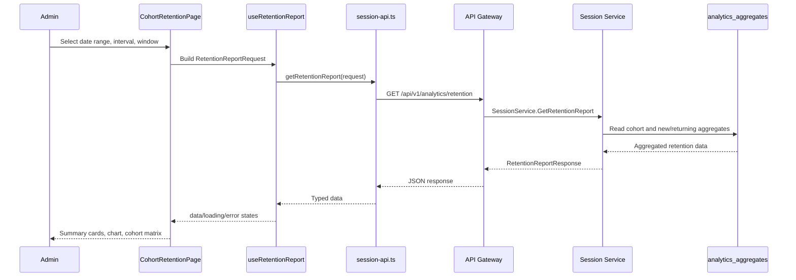

# 📊 Session Analytics Dashboard Service - Task 6: Retention Reports


## 📌 Task Summary

| Field | Detail |
|---|---|
| Task Name | Retention reports |
| Source | `docs/01-micro-tasks.md` → `Session Analytics Dashboard` → Task 6 |
| Priority | `P2` analytics capability |
| Dependency | Aggregates |
| Main Goal | New vs returning users aur cohort retention charts banana |
| Output Type | Structured implementation guide |
| Not Included | CSV export, scheduled reports, privacy controls full page, raw session replay, backend worker source code |

> **Simple Hinglish goal:** Is task ka kaam Session Analytics Dashboard me **Retention Reports** page banana hai jahan admin dekh sake ki kitne users first-time aa rahe hain, kitne users wapas aa rahe hain, aur weekly/daily cohorts me users ka retention kaisa behave kar raha hai.

---

## ✅ Final Output Created

```text
TaskImplementation/
└── Session Analytics Dashboard Service/
    ├── task1.md
    ├── task2.md
    ├── task3.md
    ├── task4.md
    ├── task5.md
    └── task6.md
```

### Why this structure?

- `TaskImplementation/` task-wise implementation guides ka central folder hai.
- `Session Analytics Dashboard Service/` folder already exist karta tha, isliye usko keep kiya gaya.
- `task6.md` sirf **Session Analytics Dashboard Service - Task 6** ka guide hai.
- Actual frontend/backend source files create nahi kiye gaye, kyunki requested output only folder structure aur markdown guide hai.
- Task 6 ke beyond CSV export, scheduled reports, and privacy controls intentionally include nahi kiye gaye.

---

## 🧭 Documentation Sources Studied

| Document | Kya use kiya gaya |
|---|---|
| `docs/01-micro-tasks.md` | Task 6 ka exact scope: new vs returning, cohort retention charts |
| `docs/03-folder-structure.md` | `frontend/session-analytics-dashboard/features/cohorts/` folder recommendation |
| `docs/08-session-management-system.md` | Retention/cohort report dashboard view and analytics metrics context |
| `docs/10-frontend-implementation.md` | Data-heavy dashboard direction, filters visible, charts readable/exportable |
| `docs/04-microservice-design.md` | Session Service responsibility: funnel and cohort analytics, aggregates, retention |
| `database/mongodb-schema-design.md` | `sessions`, `session_events`, and `analytics_aggregates` collection/index references |
| `api/master-api.json` | Existing analytics routes studied; retention endpoint is not present yet, so Task 6 guide proposes a Task-specific aggregate endpoint |

> 🟡 **API note:** Current API catalog me live, sessions, journey, funnels, and heatmaps endpoints listed hain. Retention reports Task 6 ka scope hai, isliye actual implementation phase me `GET /api/v1/analytics/retention` ya `GET /api/v1/analytics/cohorts` endpoint add karna hoga. Is document me recommended contract diya gaya hai, but API files modify nahi kiye gaye.

---

## 🧱 Task Boundary

### ✅ Included in Task 6

- Retention Reports page
- `/cohorts` dashboard route
- Sidebar navigation item
- Date range and segment filters reuse
- New vs returning users chart
- Cohort retention matrix/heatmap
- Summary cards:
  - New users
  - Returning users
  - Returning rate
  - Average D7/W1 retention
- Controls for interval and window:
  - `day`, `week`, `month`
  - 7/14/30 day window or 4/8/12 week window
- API client for planned aggregate endpoint
- React Query hook for retention data
- Loading, error, empty, and small-sample states
- Privacy-safe aggregate display rules
- Beginner-friendly tests with MSW
- Mermaid architecture and sequence diagrams

### ❌ Not Included in Task 6

- CSV download and scheduled reports; ye Task 7 ka scope hai
- Privacy controls full settings UI; ye Task 8 ka scope hai
- Exact session replay or DOM recording
- Raw user/session drilldown table
- Backend aggregation worker source files
- Database schema migration files
- ML churn prediction
- Marketing campaign attribution modeling
- Email/push reactivation automation

> 🟢 **Rule:** Task 6 ka focus sirf aggregate retention analytics hai. Individual journey Task 3 me covered hai, funnel conversion Task 4 me covered hai, heatmap Task 5 me covered hai.

---

## 🧩 Retention Concepts

Retention report ka purpose ye samajhna hai ki users product par wapas aa rahe hain ya nahi.

| Concept | Meaning | Example |
|---|---|---|
| New user | Selected period me pehli baar active hua identity | User first session on May 1 |
| Returning user | Is period se pehle bhi active tha aur ab wapas aaya | User visited last week and again today |
| Cohort | Same first-active period wale users ka group | Week of May 4 cohort |
| Retained user | Cohort user later period me again active hua | W0 user came back in W1 |
| Retention rate | `retained_users / cohort_size * 100` | 300 of 1000 returned = 30% |
| D7 retention | First active day ke 7 din baad return rate | Day 7 |
| W1 retention | First active week ke next week return rate | Week 1 |

### Identity Rule

| Case | Identity Key |
|---|---|
| Logged-in user | `user_id` |
| Anonymous visitor | `anonymous_id` |
| Anonymous later logs in | Backend should link anonymous activity to `user_id` and dedupe |

**Hinglish explanation:**  
Retention count karte waqt same person ko double count nahi karna chahiye. Agar user pehle anonymous tha aur baad me login hua, Session Service ka identity linking logic usko ek hi analytics identity treat karega.

---

## 📐 Counting Rules

| Rule | Explanation |
|---|---|
| Cohort start | User ka first seen date selected interval ke bucket me aata hai |
| Day/Week 0 | Cohort creation period; generally 100% baseline |
| Return count | User ne future bucket me at least one session/event kiya |
| Unique identity | Same bucket me 10 sessions bhi ho, user once count hoga |
| Date range | `from` and `to` UI filters se API request me jayenge |
| Segment filters | Device, source, channel, country, user type aggregate level par apply honge |
| Small samples | Very small cohorts, example `< 5`, suppress/mask karna recommended hai |
| Privacy safe | Email, phone, raw IP, exact address, keystrokes, personal payload display nahi honge |

### Formulas

| Metric | Formula |
|---|---|
| New users | Identities whose first active bucket is inside selected range |
| Returning users | Active identities with first active bucket before selected range |
| Returning rate | `returning_users / (new_users + returning_users) * 100` |
| Cohort retention | `retained_in_offset / cohort_size * 100` |
| Average offset retention | Average of all visible cohort rates for selected offset |
| Churn approximation | `100 - retention_rate` |

---

## 🗂️ Clean Folder Structure

Task 1 shell, Task 2 live sessions, Task 3 journey, Task 4 funnels, and Task 5 heatmaps ke upar Task 6 me `features/cohorts/` module add hoga.

```text
frontend/session-analytics-dashboard/
├── package.json
├── vite.config.ts
├── tailwind.config.ts
├── index.html
└── src/
    ├── main.tsx
    ├── app.tsx
    ├── layout/
    │   ├── analytics-layout.tsx
    │   └── filters-bar.tsx
    ├── features/
    │   ├── shell/
    │   │   └── pages/
    │   │       └── analytics-overview-page.tsx
    │   ├── live/
    │   │   └── pages/
    │   │       └── live-sessions-page.tsx
    │   ├── journey/
    │   │   └── pages/
    │   │       └── journey-explorer-page.tsx
    │   ├── funnels/
    │   │   └── pages/
    │   │       └── funnel-analysis-page.tsx
    │   ├── heatmaps/
    │   │   └── pages/
    │   │       └── heatmap-page.tsx
    │   └── cohorts/
    │       ├── pages/
    │       │   └── cohort-retention-page.tsx
    │       ├── components/
    │       │   ├── cohort-controls.tsx
    │       │   ├── cohort-empty-state.tsx
    │       │   ├── cohort-retention-matrix.tsx
    │       │   ├── cohort-summary-cards.tsx
    │       │   ├── new-returning-chart.tsx
    │       │   ├── retention-legend.tsx
    │       │   └── retention-tooltip.tsx
    │       ├── hooks/
    │       │   └── use-retention-report.ts
    │       └── lib/
    │           ├── retention-colors.ts
    │           ├── retention-format.ts
    │           └── retention-math.ts
    ├── api/
    │   └── session-api.ts
    ├── lib/
    │   ├── chart-theme.ts
    │   ├── date-range.ts
    │   ├── format.ts
    │   └── session-view.ts
    └── styles/
        └── globals.css
```

### Folder Responsibility

| Path | Responsibility |
|---|---|
| `src/features/cohorts/pages/cohort-retention-page.tsx` | Retention Reports ka main page |
| `src/features/cohorts/components/cohort-controls.tsx` | Interval, window, metric, and segment controls |
| `src/features/cohorts/components/cohort-retention-matrix.tsx` | Cohort heatmap/table matrix |
| `src/features/cohorts/components/new-returning-chart.tsx` | New vs returning stacked bar/area chart |
| `src/features/cohorts/components/cohort-summary-cards.tsx` | Top retention summary metrics |
| `src/features/cohorts/components/retention-legend.tsx` | Retention color scale |
| `src/features/cohorts/components/retention-tooltip.tsx` | Matrix cell hover details |
| `src/features/cohorts/components/cohort-empty-state.tsx` | No data state |
| `src/features/cohorts/hooks/use-retention-report.ts` | React Query hook for retention API |
| `src/features/cohorts/lib/retention-math.ts` | Percentages, averages, and safe divide helpers |
| `src/features/cohorts/lib/retention-format.ts` | Cohort labels and display formatting |
| `src/features/cohorts/lib/retention-colors.ts` | Retention heatmap color scale |
| `src/api/session-api.ts` | `getRetentionReport` API method |

---

## 🧩 High-Level Architecture

```mermaid
flowchart LR
    Admin[Admin User] --> Browser[Session Analytics Dashboard]
    Browser --> Route[/cohorts route]
    Route --> Page[CohortRetentionPage]
    Page --> Controls[CohortControls]
    Page --> Summary[CohortSummaryCards]
    Page --> Chart[NewReturningChart]
    Page --> Matrix[CohortRetentionMatrix]
    Controls --> Hook[useRetentionReport]
    Summary --> Hook
    Chart --> Hook
    Matrix --> Hook
    Hook --> API[session-api.ts]
    API --> Gateway[API Gateway]
    Gateway --> Session[Session Service]
    Session --> Aggregates[(analytics_aggregates)]
    Session --> Sessions[(sessions)]
    Session --> Events[(session_events fallback)]
```

**Hinglish explanation:**  
Admin `/cohorts` page open karta hai. UI interval/window/date/segment filters set karta hai. `useRetentionReport` hook API ko call karta hai. Session Service mostly `analytics_aggregates` se fast read karta hai. Agar aggregate missing hai, backend controlled fallback ke through sessions/events se compute kar sakta hai.

---

## 🔄 Retention Data Flow



---

## 🧮 Aggregation Design

Retention reports should prefer pre-aggregated data because raw event aggregation can be expensive.

### Recommended Aggregate Metrics

| Metric Key | Bucket | Segment | Value |
|---|---|---|---|
| `new_users` | day/week/month | device/source/channel/user_type | count |
| `returning_users` | day/week/month | device/source/channel/user_type | count |
| `cohort_size` | cohort bucket | segment | count |
| `cohort_retained` | cohort bucket + offset | segment | count |
| `active_identities` | day/week/month | segment | count |

### Suggested `analytics_aggregates` Shape

```json
{
  "_id": "agg_retention_2026-W18_week1_desktop",
  "metric": "cohort_retained",
  "bucket": "2026-W18",
  "offset": 1,
  "interval": "week",
  "segment": {
    "device_type": "desktop",
    "source": "organic",
    "channel": "web"
  },
  "value": 420,
  "cohort_size": 1250,
  "computed_at": "2026-05-28T00:00:00Z"
}
```

### Backend Aggregation Steps

| Step | Backend Work | Why |
|---:|---|---|
| 1 | Identity key derive karo: `user_id` else `anonymous_id` | Same person ko dedupe karna |
| 2 | First active bucket calculate karo | Cohort assign karna |
| 3 | Future active buckets collect karo | Retention offsets nikalna |
| 4 | Segment filters apply karo | Device/source/channel wise reports |
| 5 | Cohort size store karo | Rate denominator stable rahe |
| 6 | Retained count per offset store karo | Matrix fast render ho |
| 7 | Small-count suppression flags attach karo | Privacy safe display |

> 🟢 **Production recommendation:** Raw `session_events` TTL expire ho sakte hain, but `analytics_aggregates` long-term store hona chahiye. Retention dashboard ko mostly aggregates read karne chahiye.

---

## 🌐 Planned API Contract

Task 6 ke liye recommended endpoint:

```text
GET /api/v1/analytics/retention
```

Alternative route name:

```text
GET /api/v1/analytics/cohorts
```

### Query Params

| Param | Type | Example | Required | Meaning |
|---|---|---|---|---|
| `from` | ISO date | `2026-05-01` | Yes | Start date |
| `to` | ISO date | `2026-05-28` | Yes | End date |
| `interval` | `day` \| `week` \| `month` | `week` | Yes | Cohort bucket size |
| `window` | number | `8` | Yes | How many offsets to return |
| `device_type` | string | `mobile` | No | Segment filter |
| `source` | string | `organic` | No | Traffic source |
| `channel` | string | `web` | No | Channel |
| `user_type` | string | `guest` | No | Guest/logged-in/seller/admin segment |

### Example Request

```text
GET /api/v1/analytics/retention?from=2026-05-01&to=2026-05-28&interval=week&window=8&device_type=mobile
```

### Example Response

```json
{
  "summary": {
    "new_users": 12450,
    "returning_users": 7820,
    "returning_rate": 38.58,
    "average_retention": 26.4,
    "best_cohort": "2026-W19",
    "worst_cohort": "2026-W17"
  },
  "new_vs_returning": [
    {
      "bucket": "2026-W18",
      "new_users": 3200,
      "returning_users": 1900
    },
    {
      "bucket": "2026-W19",
      "new_users": 3450,
      "returning_users": 2100
    }
  ],
  "cohorts": [
    {
      "cohort_key": "2026-W18",
      "cohort_label": "May 4 - May 10",
      "cohort_size": 3200,
      "buckets": [
        { "offset": 0, "label": "W0", "users": 3200, "rate": 100 },
        { "offset": 1, "label": "W1", "users": 1040, "rate": 32.5 },
        { "offset": 2, "label": "W2", "users": 780, "rate": 24.38 }
      ]
    }
  ],
  "meta": {
    "interval": "week",
    "window": 8,
    "from": "2026-05-01",
    "to": "2026-05-28",
    "small_count_threshold": 5
  }
}
```

---

## 🚀 Step-by-Step Implementation

## Step 1: Documentation folder ready rakho

```bash
mkdir -p "TaskImplementation/Session Analytics Dashboard Service"
touch "TaskImplementation/Session Analytics Dashboard Service/task6.md"
```

**Explanation:**  
TaskImplementation folder me service-wise task guide store hote hain. Current request ke according sirf `task6.md` create/update karna hai.

---

## Step 2: Route and nav item add karo

Task 6 actual frontend implementation me `/cohorts` route add hoga.

```tsx
// src/app.tsx
import { Route, Routes } from "react-router-dom";
import { AnalyticsLayout } from "./layout/analytics-layout";
import { CohortRetentionPage } from "./features/cohorts/pages/cohort-retention-page";

export function App() {
  return (
    <Routes>
      <Route element={<AnalyticsLayout />}>
        <Route path="/cohorts" element={<CohortRetentionPage />} />
      </Route>
    </Routes>
  );
}
```

Sidebar me compact label use karo:

```tsx
// src/layout/analytics-layout.tsx
import { Repeat } from "lucide-react";

const navItems = [
  { label: "Overview", href: "/", icon: BarChart3 },
  { label: "Live", href: "/live", icon: Radio },
  { label: "Journeys", href: "/journeys", icon: Route },
  { label: "Funnels", href: "/funnels", icon: Filter },
  { label: "Heatmaps", href: "/heatmaps", icon: MousePointerClick },
  { label: "Cohorts", href: "/cohorts", icon: Repeat },
];
```

**Explanation:**  
`Cohorts` label short, scannable, and analytics context me common hai. `Repeat` icon returning behavior ko represent karta hai.

---

## Step 3: API types define karo

```ts
// src/api/session-api.ts
export type RetentionInterval = "day" | "week" | "month";

export type RetentionReportRequest = {
  from: string;
  to: string;
  interval: RetentionInterval;
  window: number;
  deviceType?: string;
  source?: string;
  channel?: string;
  userType?: string;
};

export type RetentionSummary = {
  newUsers: number;
  returningUsers: number;
  returningRate: number;
  averageRetention: number;
  bestCohort?: string;
  worstCohort?: string;
};

export type NewReturningBucket = {
  bucket: string;
  newUsers: number;
  returningUsers: number;
};

export type CohortBucket = {
  offset: number;
  label: string;
  users: number;
  rate: number;
  suppressed?: boolean;
};

export type RetentionCohort = {
  cohortKey: string;
  cohortLabel: string;
  cohortSize: number;
  buckets: CohortBucket[];
};

export type RetentionReportResponse = {
  summary: RetentionSummary;
  newVsReturning: NewReturningBucket[];
  cohorts: RetentionCohort[];
  meta: {
    interval: RetentionInterval;
    window: number;
    from: string;
    to: string;
    smallCountThreshold?: number;
  };
};
```

**Explanation:**  
Types API response ko predictable banate hain. Frontend chart, matrix, and summary cards same typed object use karenge.

---

## Step 4: API client method banao

```ts
// src/api/session-api.ts
const API_BASE_URL = import.meta.env.VITE_API_BASE_URL ?? "";

function appendOptionalParam(
  params: URLSearchParams,
  key: string,
  value?: string,
) {
  if (value && value !== "all") {
    params.set(key, value);
  }
}

export async function getRetentionReport(
  request: RetentionReportRequest,
): Promise<RetentionReportResponse> {
  const params = new URLSearchParams({
    from: request.from,
    to: request.to,
    interval: request.interval,
    window: String(request.window),
  });

  appendOptionalParam(params, "device_type", request.deviceType);
  appendOptionalParam(params, "source", request.source);
  appendOptionalParam(params, "channel", request.channel);
  appendOptionalParam(params, "user_type", request.userType);

  const response = await fetch(
    `${API_BASE_URL}/api/v1/analytics/retention?${params.toString()}`,
    {
      headers: {
        Accept: "application/json",
      },
    },
  );

  if (!response.ok) {
    throw new Error("Unable to load retention report");
  }

  const data = await response.json();

  return {
    summary: {
      newUsers: data.summary.new_users,
      returningUsers: data.summary.returning_users,
      returningRate: data.summary.returning_rate,
      averageRetention: data.summary.average_retention,
      bestCohort: data.summary.best_cohort,
      worstCohort: data.summary.worst_cohort,
    },
    newVsReturning: data.new_vs_returning.map((bucket: any) => ({
      bucket: bucket.bucket,
      newUsers: bucket.new_users,
      returningUsers: bucket.returning_users,
    })),
    cohorts: data.cohorts.map((cohort: any) => ({
      cohortKey: cohort.cohort_key,
      cohortLabel: cohort.cohort_label,
      cohortSize: cohort.cohort_size,
      buckets: cohort.buckets,
    })),
    meta: data.meta,
  };
}
```

**Explanation:**  
Backend snake_case return kar sakta hai, frontend camelCase prefer karta hai. Mapping API boundary par karne se components clean rehte hain.

---

## Step 5: React Query hook banao

```ts
// src/features/cohorts/hooks/use-retention-report.ts
import { useQuery } from "@tanstack/react-query";
import {
  getRetentionReport,
  type RetentionReportRequest,
} from "../../../api/session-api";

export function useRetentionReport(request: RetentionReportRequest) {
  return useQuery({
    queryKey: ["retention-report", request],
    queryFn: () => getRetentionReport(request),
    staleTime: 60_000,
    retry: 1,
  });
}
```

**Explanation:**  
Retention data live sessions jaisa second-by-second refresh nahi maangta. `staleTime` 60 seconds enough hai, jisse UI unnecessary network calls avoid karta hai.

---

## Step 6: Retention math helpers banao

```ts
// src/features/cohorts/lib/retention-math.ts
import type { RetentionCohort } from "../../../api/session-api";

export function safePercent(value: number, total: number) {
  if (total <= 0) {
    return 0;
  }

  return Number(((value / total) * 100).toFixed(2));
}

export function getAverageRetentionForOffset(
  cohorts: RetentionCohort[],
  offset: number,
) {
  const rates = cohorts
    .map((cohort) => cohort.buckets.find((bucket) => bucket.offset === offset))
    .filter((bucket): bucket is NonNullable<typeof bucket> => Boolean(bucket))
    .filter((bucket) => !bucket.suppressed)
    .map((bucket) => bucket.rate);

  if (rates.length === 0) {
    return 0;
  }

  const total = rates.reduce((sum, rate) => sum + rate, 0);
  return Number((total / rates.length).toFixed(2));
}

export function hasRetentionData(cohorts: RetentionCohort[]) {
  return cohorts.some((cohort) => cohort.cohortSize > 0);
}
```

**Explanation:**  
Divide-by-zero analytics dashboards me common bug hai. Helper functions calculations centralize karte hain, so chart/table dono same logic use karte hain.

---

## Step 7: Color scale define karo

```ts
// src/features/cohorts/lib/retention-colors.ts
export function getRetentionCellClass(rate: number, suppressed?: boolean) {
  if (suppressed) {
    return "bg-slate-100 text-slate-400";
  }

  if (rate >= 60) {
    return "bg-emerald-600 text-white";
  }

  if (rate >= 40) {
    return "bg-teal-500 text-white";
  }

  if (rate >= 20) {
    return "bg-sky-400 text-slate-950";
  }

  if (rate > 0) {
    return "bg-amber-200 text-slate-950";
  }

  return "bg-slate-50 text-slate-400";
}
```

**Explanation:**  
Retention matrix me color intensity quickly pattern dikhati hai. Green/teal/sky/amber mixed palette use kiya gaya hai, so UI ek hi hue family me flat nahi lagta.

---

## Step 8: Formatting helpers banao

```ts
// src/features/cohorts/lib/retention-format.ts
export function formatCount(value: number) {
  return new Intl.NumberFormat("en-US", {
    notation: value >= 10000 ? "compact" : "standard",
    maximumFractionDigits: 1,
  }).format(value);
}

export function formatRate(value: number) {
  return `${value.toFixed(1)}%`;
}

export function getWindowOptions(interval: "day" | "week" | "month") {
  if (interval === "day") {
    return [7, 14, 30];
  }

  if (interval === "week") {
    return [4, 8, 12];
  }

  return [3, 6, 12];
}
```

**Explanation:**  
Count and percentage formatting central place par rakho. Dashboard me same metric multiple components me dikh sakta hai, and inconsistent formatting quickly messy lagta hai.

---

## Step 9: Controls component banao

```tsx
// src/features/cohorts/components/cohort-controls.tsx
import type { RetentionInterval } from "../../../api/session-api";
import { getWindowOptions } from "../lib/retention-format";

type CohortControlsProps = {
  interval: RetentionInterval;
  window: number;
  onIntervalChange: (interval: RetentionInterval) => void;
  onWindowChange: (window: number) => void;
};

export function CohortControls({
  interval,
  window,
  onIntervalChange,
  onWindowChange,
}: CohortControlsProps) {
  const windowOptions = getWindowOptions(interval);

  return (
    <div className="flex flex-wrap items-center gap-3 rounded-lg border border-slate-200 bg-white p-3">
      <label className="flex items-center gap-2 text-sm text-slate-700">
        <span>Interval</span>
        <select
          className="h-9 rounded-md border border-slate-300 px-2 text-sm"
          value={interval}
          onChange={(event) =>
            onIntervalChange(event.target.value as RetentionInterval)
          }
        >
          <option value="day">Daily</option>
          <option value="week">Weekly</option>
          <option value="month">Monthly</option>
        </select>
      </label>

      <label className="flex items-center gap-2 text-sm text-slate-700">
        <span>Window</span>
        <select
          className="h-9 rounded-md border border-slate-300 px-2 text-sm"
          value={window}
          onChange={(event) => onWindowChange(Number(event.target.value))}
        >
          {windowOptions.map((option) => (
            <option key={option} value={option}>
              {option} periods
            </option>
          ))}
        </select>
      </label>
    </div>
  );
}
```

**Explanation:**  
Controls compact rakhe gaye hain. Date range and segment filters Task 1 shell se reuse honge, so Task 6 specific controls sirf interval/window par focus karte hain.

---

## Step 10: Summary cards banao

```tsx
// src/features/cohorts/components/cohort-summary-cards.tsx
import type { RetentionSummary } from "../../../api/session-api";
import { formatCount, formatRate } from "../lib/retention-format";

type CohortSummaryCardsProps = {
  summary: RetentionSummary;
};

export function CohortSummaryCards({ summary }: CohortSummaryCardsProps) {
  const cards = [
    {
      label: "New users",
      value: formatCount(summary.newUsers),
      tone: "border-sky-200 bg-sky-50",
    },
    {
      label: "Returning users",
      value: formatCount(summary.returningUsers),
      tone: "border-emerald-200 bg-emerald-50",
    },
    {
      label: "Returning rate",
      value: formatRate(summary.returningRate),
      tone: "border-teal-200 bg-teal-50",
    },
    {
      label: "Avg retention",
      value: formatRate(summary.averageRetention),
      tone: "border-amber-200 bg-amber-50",
    },
  ];

  return (
    <section className="grid gap-3 sm:grid-cols-2 xl:grid-cols-4">
      {cards.map((card) => (
        <article
          key={card.label}
          className={`rounded-lg border p-4 ${card.tone}`}
        >
          <p className="text-sm font-medium text-slate-600">{card.label}</p>
          <p className="mt-2 text-2xl font-semibold text-slate-950">
            {card.value}
          </p>
        </article>
      ))}
    </section>
  );
}
```

**Explanation:**  
Summary cards top-level scan ke liye hain. Admin ko pehle high-level health samajhni chahiye, phir matrix me detail inspect karna chahiye.

---

## Step 11: New vs Returning chart banao

```tsx
// src/features/cohorts/components/new-returning-chart.tsx
import {
  Bar,
  BarChart,
  CartesianGrid,
  Legend,
  ResponsiveContainer,
  Tooltip,
  XAxis,
  YAxis,
} from "recharts";
import type { NewReturningBucket } from "../../../api/session-api";

type NewReturningChartProps = {
  data: NewReturningBucket[];
};

export function NewReturningChart({ data }: NewReturningChartProps) {
  return (
    <section className="rounded-lg border border-slate-200 bg-white p-4">
      <div className="mb-4">
        <h2 className="text-base font-semibold text-slate-950">
          New vs returning
        </h2>
        <p className="text-sm text-slate-500">
          Bucket-wise active identities split
        </p>
      </div>

      <div className="h-72">
        <ResponsiveContainer width="100%" height="100%">
          <BarChart data={data}>
            <CartesianGrid strokeDasharray="3 3" vertical={false} />
            <XAxis dataKey="bucket" tickLine={false} />
            <YAxis tickLine={false} />
            <Tooltip />
            <Legend />
            <Bar dataKey="newUsers" name="New users" stackId="users" fill="#38bdf8" />
            <Bar
              dataKey="returningUsers"
              name="Returning users"
              stackId="users"
              fill="#10b981"
            />
          </BarChart>
        </ResponsiveContainer>
      </div>
    </section>
  );
}
```

**Explanation:**  
Stacked bar chart se total active users aur split dono ek saath visible hote hain. Retention page me ye matrix ke upar ya side me useful overview deta hai.

---

## Step 12: Cohort retention matrix banao

```tsx
// src/features/cohorts/components/cohort-retention-matrix.tsx
import type { RetentionCohort } from "../../../api/session-api";
import { getRetentionCellClass } from "../lib/retention-colors";
import { formatCount, formatRate } from "../lib/retention-format";

type CohortRetentionMatrixProps = {
  cohorts: RetentionCohort[];
  window: number;
};

export function CohortRetentionMatrix({
  cohorts,
  window,
}: CohortRetentionMatrixProps) {
  const offsets = Array.from({ length: window }, (_, index) => index);

  return (
    <section className="rounded-lg border border-slate-200 bg-white p-4">
      <div className="mb-4 flex flex-wrap items-start justify-between gap-3">
        <div>
          <h2 className="text-base font-semibold text-slate-950">
            Cohort retention
          </h2>
          <p className="text-sm text-slate-500">
            Rows are first-active cohorts, columns are return periods
          </p>
        </div>
      </div>

      <div className="overflow-x-auto">
        <table className="min-w-[760px] border-separate border-spacing-1">
          <thead>
            <tr>
              <th className="sticky left-0 bg-white px-2 py-2 text-left text-xs font-semibold uppercase text-slate-500">
                Cohort
              </th>
              <th className="px-2 py-2 text-right text-xs font-semibold uppercase text-slate-500">
                Users
              </th>
              {offsets.map((offset) => (
                <th
                  key={offset}
                  className="px-2 py-2 text-center text-xs font-semibold uppercase text-slate-500"
                >
                  {offset === 0 ? "Start" : `+${offset}`}
                </th>
              ))}
            </tr>
          </thead>
          <tbody>
            {cohorts.map((cohort) => (
              <tr key={cohort.cohortKey}>
                <th className="sticky left-0 bg-white px-2 py-2 text-left text-sm font-medium text-slate-800">
                  {cohort.cohortLabel}
                </th>
                <td className="px-2 py-2 text-right text-sm text-slate-600">
                  {formatCount(cohort.cohortSize)}
                </td>
                {offsets.map((offset) => {
                  const bucket = cohort.buckets.find(
                    (item) => item.offset === offset,
                  );

                  const rate = bucket?.rate ?? 0;
                  const label = bucket?.suppressed ? "Small sample" : formatRate(rate);

                  return (
                    <td key={offset} className="p-0.5">
                      <div
                        className={`flex h-10 min-w-20 items-center justify-center rounded-md text-sm font-semibold ${getRetentionCellClass(
                          rate,
                          bucket?.suppressed,
                        )}`}
                        title={`${cohort.cohortLabel}, period ${offset}: ${label}`}
                      >
                        {label}
                      </div>
                    </td>
                  );
                })}
              </tr>
            ))}
          </tbody>
        </table>
      </div>
    </section>
  );
}
```

**Explanation:**  
Matrix retention analysis ka main visual hai. Row cohort hota hai, column future period. Color intensity se quickly pata chalta hai kaunse cohorts strong ya weak hain.

---

## Step 13: Legend component banao

```tsx
// src/features/cohorts/components/retention-legend.tsx
const items = [
  { label: "0%", className: "bg-slate-50 border-slate-200" },
  { label: "1-19%", className: "bg-amber-200 border-amber-300" },
  { label: "20-39%", className: "bg-sky-400 border-sky-500" },
  { label: "40-59%", className: "bg-teal-500 border-teal-600" },
  { label: "60%+", className: "bg-emerald-600 border-emerald-700" },
];

export function RetentionLegend() {
  return (
    <div className="flex flex-wrap items-center gap-2 text-xs text-slate-600">
      <span className="font-medium">Retention scale</span>
      {items.map((item) => (
        <span key={item.label} className="inline-flex items-center gap-1">
          <span className={`h-3 w-5 rounded border ${item.className}`} />
          {item.label}
        </span>
      ))}
    </div>
  );
}
```

**Explanation:**  
Color-only UI accessible nahi hota. Legend admin ko exact buckets samjhata hai, aur table me rate text bhi visible hai.

---

## Step 14: Empty, loading, and error states add karo

```tsx
// src/features/cohorts/components/cohort-empty-state.tsx
import { Repeat } from "lucide-react";

export function CohortEmptyState() {
  return (
    <div className="rounded-lg border border-dashed border-slate-300 bg-white p-8 text-center">
      <Repeat className="mx-auto h-8 w-8 text-slate-400" aria-hidden="true" />
      <h2 className="mt-3 text-base font-semibold text-slate-950">
        No retention data
      </h2>
      <p className="mt-1 text-sm text-slate-500">
        Try a wider date range or fewer segment filters.
      </p>
    </div>
  );
}
```

**Explanation:**  
Empty state short and actionable hai. In-app long tutorial text avoid kiya gaya, kyunki dashboard user ko quickly next action chahiye.

---

## Step 15: Page compose karo

```tsx
// src/features/cohorts/pages/cohort-retention-page.tsx
import { useMemo, useState } from "react";
import { useDashboardFilters } from "../../../layout/filters-bar";
import type { RetentionInterval } from "../../../api/session-api";
import { CohortControls } from "../components/cohort-controls";
import { CohortEmptyState } from "../components/cohort-empty-state";
import { CohortRetentionMatrix } from "../components/cohort-retention-matrix";
import { CohortSummaryCards } from "../components/cohort-summary-cards";
import { NewReturningChart } from "../components/new-returning-chart";
import { RetentionLegend } from "../components/retention-legend";
import { useRetentionReport } from "../hooks/use-retention-report";
import { hasRetentionData } from "../lib/retention-math";

export function CohortRetentionPage() {
  const dashboardFilters = useDashboardFilters();
  const [interval, setInterval] = useState<RetentionInterval>("week");
  const [window, setWindow] = useState(8);

  const request = useMemo(
    () => ({
      from: dashboardFilters.dateRange.from,
      to: dashboardFilters.dateRange.to,
      interval,
      window,
      deviceType: dashboardFilters.deviceType,
      source: dashboardFilters.source,
      channel: dashboardFilters.channel,
      userType: dashboardFilters.userType,
    }),
    [dashboardFilters, interval, window],
  );

  const retentionQuery = useRetentionReport(request);

  return (
    <main className="space-y-4">
      <div className="flex flex-wrap items-start justify-between gap-3">
        <div>
          <h1 className="text-xl font-semibold text-slate-950">
            Retention Reports
          </h1>
          <p className="text-sm text-slate-500">
            Cohorts, repeat activity, and return behavior
          </p>
        </div>

        <CohortControls
          interval={interval}
          window={window}
          onIntervalChange={setInterval}
          onWindowChange={setWindow}
        />
      </div>

      {retentionQuery.isLoading ? (
        <div className="rounded-lg border border-slate-200 bg-white p-6 text-sm text-slate-500">
          Loading retention report...
        </div>
      ) : null}

      {retentionQuery.isError ? (
        <div className="rounded-lg border border-red-200 bg-red-50 p-4 text-sm text-red-700">
          Retention report load nahi ho paaya. Filters adjust karke retry karo.
        </div>
      ) : null}

      {retentionQuery.data && !hasRetentionData(retentionQuery.data.cohorts) ? (
        <CohortEmptyState />
      ) : null}

      {retentionQuery.data && hasRetentionData(retentionQuery.data.cohorts) ? (
        <>
          <CohortSummaryCards summary={retentionQuery.data.summary} />
          <NewReturningChart data={retentionQuery.data.newVsReturning} />
          <div className="flex justify-end">
            <RetentionLegend />
          </div>
          <CohortRetentionMatrix
            cohorts={retentionQuery.data.cohorts}
            window={window}
          />
        </>
      ) : null}
    </main>
  );
}
```

**Explanation:**  
Page composition predictable hai: header + controls, then states, then summary/chart/matrix. Operational dashboard me same shell and filters reuse karna important hai.

---

## Step 16: Backend aggregate read model ka plan

Actual backend files create nahi karne, but implementation team ke liye logic clear hona chahiye.

```go
// Pseudocode only: SessionService.GetRetentionReport
func (s *SessionService) GetRetentionReport(ctx context.Context, req RetentionRequest) (*RetentionReport, error) {
    if err := validateRetentionRequest(req); err != nil {
        return nil, err
    }

    segment := normalizeSegment(req.DeviceType, req.Source, req.Channel, req.UserType)

    newReturning := s.aggregateRepo.ListNewReturning(ctx, req.From, req.To, req.Interval, segment)
    cohorts := s.aggregateRepo.ListCohortRetention(ctx, req.From, req.To, req.Interval, req.Window, segment)
    summary := buildRetentionSummary(newReturning, cohorts)

    return &RetentionReport{
        Summary: summary,
        NewVsReturning: newReturning,
        Cohorts: cohorts,
        Meta: buildRetentionMeta(req),
    }, nil
}
```

**Explanation:**  
Task 6 API ko raw events scan nahi karna chahiye for every dashboard request. `analytics_aggregates` repository fast read model provide karega.

---

## Step 17: Storage and indexes verify karo

Existing docs ke according Session Service MongoDB collections:

```javascript
db.sessions.createIndex({ anonymous_id: 1, started_at: -1 })
db.sessions.createIndex({ user_id: 1, started_at: -1 })
db.sessions.createIndex({ status: 1, last_seen_at: -1 })
db.session_events.createIndex({ session_id: 1, occurred_at: 1 })
db.session_events.createIndex({ event_type: 1, occurred_at: -1 })
db.session_events.createIndex({ occurred_at: 1 }, { expireAfterSeconds: 7776000 })
db.analytics_aggregates.createIndex(
  { metric: 1, bucket: 1, segment: 1 },
  { unique: true }
)
```

Retention-specific future index recommendation:

```javascript
db.analytics_aggregates.createIndex({
  metric: 1,
  interval: 1,
  bucket: 1,
  offset: 1,
  segment_hash: 1
})
```

**Explanation:**  
`segment` object directly unique key me use karna risky ho sakta hai because object field order matter kar sakta hai. Production me normalized `segment_hash` useful rahega.

---

## Step 18: Test examples add karo

### MSW mock

```ts
// src/features/cohorts/cohort-retention-page.test.tsx
import { http, HttpResponse } from "msw";

export const handlers = [
  http.get("/api/v1/analytics/retention", () => {
    return HttpResponse.json({
      summary: {
        new_users: 1200,
        returning_users: 800,
        returning_rate: 40,
        average_retention: 28.5,
        best_cohort: "2026-W19",
        worst_cohort: "2026-W17",
      },
      new_vs_returning: [
        { bucket: "2026-W18", new_users: 600, returning_users: 300 },
        { bucket: "2026-W19", new_users: 600, returning_users: 500 },
      ],
      cohorts: [
        {
          cohort_key: "2026-W18",
          cohort_label: "May 4 - May 10",
          cohort_size: 600,
          buckets: [
            { offset: 0, label: "W0", users: 600, rate: 100 },
            { offset: 1, label: "W1", users: 210, rate: 35 },
          ],
        },
      ],
      meta: {
        interval: "week",
        window: 8,
        from: "2026-05-01",
        to: "2026-05-28",
      },
    });
  }),
];
```

### Component test

```tsx
// src/features/cohorts/cohort-retention-page.test.tsx
import { screen } from "@testing-library/react";
import { renderWithProviders } from "../../test/render-with-providers";
import { CohortRetentionPage } from "./pages/cohort-retention-page";

it("renders retention report", async () => {
  renderWithProviders(<CohortRetentionPage />);

  expect(await screen.findByText("Retention Reports")).toBeInTheDocument();
  expect(await screen.findByText("New users")).toBeInTheDocument();
  expect(await screen.findByText("Returning users")).toBeInTheDocument();
  expect(await screen.findByText("Cohort retention")).toBeInTheDocument();
});
```

### Helper test

```ts
// src/features/cohorts/lib/retention-math.test.ts
import { safePercent } from "./retention-math";

it("returns zero for empty denominator", () => {
  expect(safePercent(5, 0)).toBe(0);
});

it("calculates percentage", () => {
  expect(safePercent(25, 100)).toBe(25);
});
```

**Explanation:**  
Tests API rendering, important labels, and math edge cases cover karte hain. Retention UI me divide-by-zero and empty cohorts common failure points hain.

---

## 🧰 External Libraries / Tools Used

| Library/Tool | What it is | Why used | Install | Usage |
|---|---|---|---|---|
| React | UI library | Component-based dashboard screens banane ke liye | Vite template se included | `function CohortRetentionPage()` |
| TypeScript | Static typing | API response, cohort rows, and chart props safe rakhne ke liye | Vite React TS template | `.ts` and `.tsx` files |
| Vite | Frontend build tool | Fast dev server and production build | `npm create vite@latest ... -- --template react-ts` | `npm run dev`, `npm run build` |
| Tailwind CSS | Utility CSS framework | Dense operational dashboard layout quickly style karne ke liye | `npm install -D tailwindcss postcss autoprefixer` | `className="grid gap-4"` |
| React Router | Client-side routing | `/cohorts` route add karne ke liye | `npm install react-router-dom` | `<Route path="/cohorts" ... />` |
| TanStack Query | Server-state library | Loading, cache, retry, and refetch states manage karne ke liye | `npm install @tanstack/react-query` | `useQuery` |
| Recharts | React chart library | New vs returning stacked chart ke liye | `npm install recharts` | `<BarChart>`, `<ResponsiveContainer>` |
| lucide-react | Icon library | Sidebar and empty state icons ke liye | `npm install lucide-react` | `import { Repeat } from "lucide-react"` |
| date-fns | Date utility | Date range helpers and bucket labels ke liye | `npm install date-fns` | `format`, `startOfWeek` |
| Vitest | Test runner | Unit/component tests ke liye | `npm install -D vitest` | `npm run test` |
| Testing Library | React test utilities | UI behavior assert karne ke liye | `npm install -D @testing-library/react @testing-library/jest-dom` | `screen.findByText` |
| MSW | API mocking | Tests me fake Retention API response dene ke liye | `npm install -D msw` | `http.get("/api/v1/analytics/retention", ...)` |

### Install commands

```bash
cd frontend/session-analytics-dashboard
npm install react-router-dom @tanstack/react-query recharts lucide-react date-fns
npm install -D vitest @testing-library/react @testing-library/jest-dom msw
```

> 🟢 **New for Task 6:** Cohort matrix CSS grid/table se ban sakti hai. New vs returning chart ke liye `recharts` useful hai; agar Task 4 me already install ho chuka hai, dobara install ki zarurat nahi.

---

## 🎨 UI/UX Guidelines

| Area | Guideline |
|---|---|
| Layout | Dense dashboard layout rakho, landing-page hero style avoid karo |
| Route | `/cohorts` short and memorable route use karo |
| Matrix | Sticky first column and horizontal scroll use karo |
| Cards | Summary cards individual metrics ke liye use karo, nested cards avoid karo |
| Color | Mixed emerald/teal/sky/amber scale use karo, one-note palette avoid karo |
| Text | Compact operational copy use karo; long tutorial text in-app me avoid karo |
| Controls | Interval and window controls visible rakho |
| Mobile | Matrix horizontal scroll allow karo; controls wrap hone chahiye |
| Accessibility | Cell values text me bhi show karo, sirf color par depend mat karo |
| Empty state | Short actionable message: wider range/fewer filters |

---

## 🔐 Privacy & Security Rules

| Rule | Implementation Direction |
|---|---|
| Admin only | Retention endpoint auth `admin` hona chahiye |
| Aggregate only | Page direct user/session list expose nahi karega |
| No PII | Email, phone, raw IP, exact address, keystrokes display nahi honge |
| Identity dedupe | `user_id` and `anonymous_id` linking backend me privacy-safe way se ho |
| Small count safety | Low-count cohorts suppress/mask karna recommended hai |
| Consent aware | Consent-disabled identities retention aggregates me include nahi hone chahiye |
| Deletion aware | User deletion request aggregates policy ke according handle honi chahiye |
| Retention aware | Raw events TTL expire ho sakte hain; long-term aggregate policy define karo |

**Hinglish explanation:**  
Retention analytics me individual behavior infer ho sakta hai if sample size bahut chhota hai. Isliye Task 6 aggregate-level display, small-count suppression, and masked identities par rely karta hai.

---

## ⚙️ Performance Notes

| Concern | Recommendation |
|---|---|
| Heavy raw scans | Dashboard request me raw `session_events` scan avoid karo |
| Large cohorts | API max `window` limit enforce kare |
| Segment explosion | Normalized segment hash use karo |
| Matrix size | UI initial max 12 columns rakhe |
| Caching | React Query `staleTime` 60 seconds enough hai |
| Slow aggregates | Backend precompute daily/weekly jobs run kare |
| Raw event TTL | Retention long-term ke liye aggregates durable rakho |
| Rendering | Table rows virtualize tabhi karo jab cohorts bahut zyada hon |

---

## 🚦 Error and Edge States

| State | UI Behavior |
|---|---|
| Loading | Existing page shell visible, compact loading block show |
| API error | Red-tinted error block with retry/filter adjustment hint |
| Empty cohorts | Empty state with wider date range/fewer filters hint |
| First bucket zero | Rates `0%` show karo, divide-by-zero avoid |
| Suppressed cohort | Cell me `Small sample` ya `—` show karo |
| Partial aggregate | Missing offset cells blank/zero state me dikhao |
| Too wide matrix | Horizontal scroll use karo |
| Unsupported interval | Validation error show karo |

---

## ✅ Manual QA Checklist

- [ ] `/cohorts` route dashboard shell ke andar open hota hai
- [ ] Sidebar me `Cohorts` navigation visible hai
- [ ] Date range filters existing shell se apply hote hain
- [ ] Interval selector daily/weekly/monthly switch karta hai
- [ ] Window selector selected interval ke options update karta hai
- [ ] API call planned `GET /api/v1/analytics/retention` par ja rahi hai
- [ ] Request me `from`, `to`, `interval`, and `window` params hain
- [ ] Segment filters request me optional params ke form me ja rahe hain
- [ ] New vs returning chart render hota hai
- [ ] Cohort matrix rows/columns correct hain
- [ ] Summary cards correct values show karte hain
- [ ] Empty state no data par visible hai
- [ ] Error state API failure par visible hai
- [ ] Matrix mobile viewport me overlap nahi karti
- [ ] Raw user identifiers page par show nahi hote
- [ ] CSV export/scheduled report/privacy controls code add nahi hua

---

## 🚦 Implementation Order

| Order | Work | Why |
|---:|---|---|
| 1 | Route and nav add karo | Page reachable hona chahiye |
| 2 | API contract finalize karo | Frontend/backend same shape agree karein |
| 3 | API client and types add karo | Typed data boundary ready hoti hai |
| 4 | `useRetentionReport` hook banao | Server state centralize hota hai |
| 5 | Retention math/format/color helpers banao | UI calculations consistent hoti hain |
| 6 | Controls add karo | Admin interval/window choose kar sake |
| 7 | Summary cards add karo | High-level metrics visible hote hain |
| 8 | New vs returning chart add karo | Acquisition vs repeat activity compare hoti hai |
| 9 | Cohort matrix add karo | Main retention insight ready hota hai |
| 10 | Loading/error/empty/suppressed states polish karo | Production UX reliable hota hai |
| 11 | Tests add karo | Regression risk kam hota hai |
| 12 | Manual QA karo | Layout, filters, API, privacy verify hota hai |

---

## ✅ Definition of Done

- [x] `TaskImplementation/Session Analytics Dashboard Service/task6.md` created
- [x] Task 6 scope clearly documented
- [x] Step-by-step implementation Hinglish me written
- [x] Folder structure included
- [x] External libraries/tools explained with install/use
- [x] Planned API endpoint and request/response examples included
- [x] Mermaid architecture and sequence diagrams included
- [x] New vs returning user report explained
- [x] Cohort retention matrix explained
- [x] Retention formulas included
- [x] React + TypeScript code examples included
- [x] Testing plan included
- [x] Privacy/security rules included
- [x] No implementation beyond Session Analytics Dashboard Service Task 6 added

---

## 🧾 Final Notes

Task 6 ke baad Session Analytics Dashboard me retention analysis ka clear implementation path ready hai. Admin new vs returning activity compare kar sakta hai, cohorts ka return behavior matrix me inspect kar sakta hai, aur weak retention periods quickly identify kar sakta hai.

> ✅ **Task 6 complete:** Documentation-level implementation guide ready hai. Actual frontend/backend files intentionally create nahi kiye gaye, kyunki current requested output sirf required folder structure aur `task6.md` content hai.
