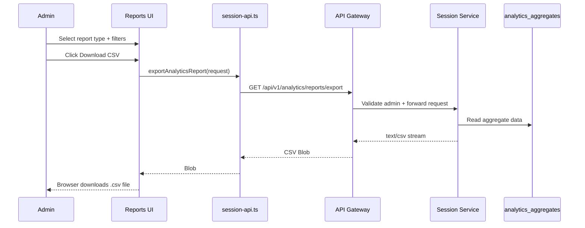
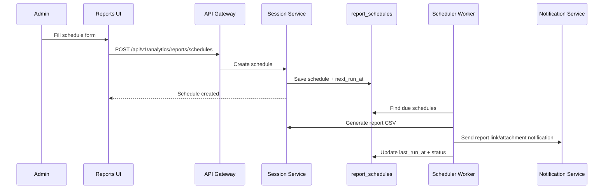

# 📊 Session Analytics Dashboard Service - Task 7: Export Reports


## 📌 Task Summary

| Field | Detail |
|---|---|
| Task Name | Export reports |
| Source | `docs/01-micro-tasks.md` → `Session Analytics Dashboard` → Task 7 |
| Priority | `P2` analytics/advanced capability |
| Dependency | Analytics APIs |
| Main Goal | CSV download aur scheduled report option banana |
| Output Type | Structured implementation guide |
| Not Included | PDF/XLSX export, privacy controls full page, raw event dump, backend cron source code, Notification Service implementation |

> **Simple Hinglish goal:** Is task ka kaam Session Analytics Dashboard me ek **Reports Export** experience banana hai jahan admin analytics data ko CSV me download kar sake, aur daily/weekly/monthly scheduled reports configure kar sake.

---

## ✅ Final Output Created

```text
TaskImplementation/
└── Session Analytics Dashboard Service/
    ├── task1.md
    ├── task2.md
    ├── task3.md
    ├── task4.md
    ├── task5.md
    ├── task6.md
    └── task7.md
```

### Why this structure?

- `TaskImplementation/` task-wise implementation guides ka central folder hai.
- `Session Analytics Dashboard Service/` folder already exist karta tha, isliye usko keep kiya gaya.
- `task7.md` sirf **Session Analytics Dashboard Service - Task 7** ka guide hai.
- Actual frontend/backend source files create nahi kiye gaye, kyunki requested output only folder structure aur markdown guide hai.
- Task 7 ke beyond privacy controls, XLSX/PDF, and raw session exports intentionally include nahi kiye gaye.

---

## 🧭 Documentation Sources Studied

| Document | Kya use kiya gaya |
|---|---|
| `docs/01-micro-tasks.md` | Task 7 ka exact scope: CSV download and scheduled report option |
| `docs/03-folder-structure.md` | `frontend/session-analytics-dashboard/` recommended app structure |
| `docs/08-session-management-system.md` | Dashboard analytics views, dashboard APIs, aggregate-first session data approach |
| `docs/10-frontend-implementation.md` | Data-heavy dashboard direction and charts readable/exportable requirement |
| `docs/04-microservice-design.md` | Session Service responsibilities: analytics, aggregates, privacy and retention |
| `database/mongodb-schema-design.md` | `sessions`, `session_events`, `journey_summaries`, `heatmap_points`, `analytics_aggregates` references |
| `api/master-api.json` | Existing analytics route catalog studied; export/schedule endpoints are not present yet, so Task 7 guide proposes task-specific endpoints |

> 🟡 **API note:** Current API catalog me `live`, `sessions`, `journey`, `funnels`, and `heatmaps` endpoints listed hain. Task 7 ke liye export and schedule endpoints add karne honge, but is guide me sirf contract and implementation direction diya gaya hai.

---

## 🧱 Task Boundary

### ✅ Included in Task 7

- Reports/export dashboard route, recommended path: `/reports`
- CSV download for analytics report types:
  - Overview metrics
  - Active sessions summary
  - Journey summary export
  - Funnel report
  - Heatmap aggregate report
  - Retention/cohort report
- Report type selector
- Date range and segment filters reuse
- CSV download button with loading/error states
- Scheduled report creation option:
  - daily
  - weekly
  - monthly
- Scheduled reports list
- Pause/resume/delete schedule actions
- Planned API contracts for export and schedules
- Backend export flow explanation
- Privacy-safe export rules
- Tests and QA checklist
- Mermaid architecture and sequence diagrams

### ❌ Not Included in Task 7

- PDF export
- XLSX export
- Raw `session_events` dump
- Exact session replay export
- PII-heavy exports like email, phone, raw IP, address, OTP, payment/card fields
- Task 8 privacy controls UI
- Backend scheduler worker source code
- Notification Service templates/source code
- Object storage infrastructure setup
- Superadmin audit log viewer

> 🟢 **Rule:** Task 7 ka focus sirf **analytics reports ko CSV me export karna** and **scheduled report option expose karna** hai. Data privacy and deletion policy settings Task 8 me aayengi.

---

## 🧩 Export Concepts

| Concept | Meaning | Example |
|---|---|---|
| Immediate export | Admin button click karta hai and CSV file browser me download hoti hai | `funnel_2026-05-01_2026-05-28.csv` |
| Scheduled report | Admin daily/weekly/monthly automatic report configure karta hai | Every Monday 09:00 retention CSV |
| Report type | Kis analytics module ka data export hoga | `funnel`, `retention`, `heatmap` |
| Format | File type | Task 7 me only `csv` |
| Filters snapshot | Export ke time selected filters freeze hote hain | date range, device, source, country |
| Recipients | Scheduled report ka result kisko notify/email hoga | admin email list |
| Last run | Schedule last time kab execute hua | `2026-05-28T09:00:00Z` |

### CSV Strategy

| Area | Decision |
|---|---|
| CSV generation | Backend generated CSV recommended |
| Browser handling | Native `Blob` + temporary `<a>` download |
| Huge reports | Backend should stream response or generate async file |
| Encoding | `text/csv; charset=utf-8` |
| Filename | Report type + date range + timestamp |
| Timezone | UI sends timezone; backend formats timestamps consistently |
| Security | Admin-only endpoint, no raw PII fields |

**Hinglish explanation:**  
CSV ko frontend me manually raw data se banana possible hai, but production me backend-generated CSV better hai. Reason simple hai: backend same aggregation logic use karega, large data stream kar sakta hai, auth/privacy checks enforce karega, and UI lightweight rahegi.

---

## 📐 Report Types

| Report Type | Source Data | CSV Rows | Notes |
|---|---|---|---|
| `overview` | live metrics / aggregates | Metric name + value rows | Task 1 shell metrics |
| `active_sessions` | active sessions summary | Session-safe active rows | Task 2 summary export, not raw PII |
| `journey_summary` | journey summaries | One row per session summary | Task 3 aggregate/session-safe summary |
| `funnel` | funnel aggregates | One row per funnel step | Task 4 funnel export |
| `heatmap` | heatmap aggregates | One row per path/device/bucket | Task 5 aggregate export |
| `retention` | cohort aggregates | One row per cohort offset | Task 6 retention export |

### Recommended CSV Columns

#### `funnel` CSV

```csv
step_key,step_label,count,conversion_rate,dropoff_rate,date_from,date_to,segment
product_view,Product viewed,12000,100,0,2026-05-01,2026-05-28,device:all
add_to_cart,Added to cart,4200,35,65,2026-05-01,2026-05-28,device:all
checkout_started,Checkout started,1600,13.33,61.9,2026-05-01,2026-05-28,device:all
payment_completed,Paid,980,8.17,38.75,2026-05-01,2026-05-28,device:all
```

#### `retention` CSV

```csv
cohort_label,cohort_start,cohort_size,offset,retained_users,retention_rate
2026-W18,2026-04-27,5000,W0,5000,100
2026-W18,2026-04-27,5000,W1,1750,35
2026-W18,2026-04-27,5000,W2,1200,24
```

#### `heatmap` CSV

```csv
path,device_type,mode,bucket_x,bucket_y,intensity,unique_sessions,date_from,date_to
/products/123,mobile,click,40,70,92,814,2026-05-01,2026-05-28
/products/123,mobile,scroll,0,75,61,1080,2026-05-01,2026-05-28
```

---

## 🗂️ Clean Folder Structure

Task 1 shell, Task 2 live sessions, Task 3 journey, Task 4 funnels, Task 5 heatmaps, and Task 6 cohorts ke upar Task 7 me `features/reports/` module add hoga.

```text
frontend/session-analytics-dashboard/
├── package.json
├── vite.config.ts
├── tailwind.config.ts
├── index.html
└── src/
    ├── main.tsx
    ├── app.tsx
    ├── layout/
    │   ├── analytics-layout.tsx
    │   └── filters-bar.tsx
    ├── features/
    │   ├── shell/
    │   │   └── pages/
    │   │       └── analytics-overview-page.tsx
    │   ├── live/
    │   │   └── pages/
    │   │       └── live-sessions-page.tsx
    │   ├── journey/
    │   │   └── pages/
    │   │       └── journey-explorer-page.tsx
    │   ├── funnels/
    │   │   └── pages/
    │   │       └── funnel-analysis-page.tsx
    │   ├── heatmaps/
    │   │   └── pages/
    │   │       └── heatmap-page.tsx
    │   ├── cohorts/
    │   │   └── pages/
    │   │       └── cohort-retention-page.tsx
    │   └── reports/
    │       ├── pages/
    │       │   └── reports-export-page.tsx
    │       ├── components/
    │       │   ├── export-report-panel.tsx
    │       │   ├── report-type-select.tsx
    │       │   ├── report-format-badge.tsx
    │       │   ├── schedule-report-form.tsx
    │       │   ├── scheduled-reports-table.tsx
    │       │   ├── schedule-status-badge.tsx
    │       │   └── report-empty-state.tsx
    │       ├── hooks/
    │       │   ├── use-export-report.ts
    │       │   └── use-report-schedules.ts
    │       └── lib/
    │           ├── report-filenames.ts
    │           ├── report-labels.ts
    │           └── save-csv-blob.ts
    ├── api/
    │   └── session-api.ts
    ├── lib/
    │   ├── date-range.ts
    │   ├── format.ts
    │   └── session-view.ts
    └── styles/
        └── globals.css
```

### Folder Responsibility

| Path | Responsibility |
|---|---|
| `src/features/reports/pages/reports-export-page.tsx` | Export Reports ka main page |
| `src/features/reports/components/export-report-panel.tsx` | Immediate CSV export controls |
| `src/features/reports/components/report-type-select.tsx` | Report type dropdown/segmented select |
| `src/features/reports/components/report-format-badge.tsx` | CSV-only format indicator |
| `src/features/reports/components/schedule-report-form.tsx` | Schedule create/edit form |
| `src/features/reports/components/scheduled-reports-table.tsx` | Existing schedules list |
| `src/features/reports/components/schedule-status-badge.tsx` | Active/paused/failed status badge |
| `src/features/reports/components/report-empty-state.tsx` | No schedules/no export state |
| `src/features/reports/hooks/use-export-report.ts` | CSV export mutation |
| `src/features/reports/hooks/use-report-schedules.ts` | Schedule list/create/update/delete hooks |
| `src/features/reports/lib/report-filenames.ts` | Safe CSV filename builder |
| `src/features/reports/lib/report-labels.ts` | Report type labels and descriptions |
| `src/features/reports/lib/save-csv-blob.ts` | Browser download helper |
| `src/api/session-api.ts` | Export and schedule API methods |

---

## 🧩 High-Level Architecture

```mermaid
flowchart LR
    Admin[Admin User] --> Browser[Session Analytics Dashboard]
    Browser --> Route[/reports route]
    Route --> Page[ReportsExportPage]
    Page --> ExportPanel[ExportReportPanel]
    Page --> ScheduleForm[ScheduleReportForm]
    Page --> ScheduleTable[ScheduledReportsTable]
    ExportPanel --> ExportHook[useExportReport]
    ScheduleForm --> ScheduleHook[useReportSchedules]
    ScheduleTable --> ScheduleHook
    ExportHook --> API[session-api.ts]
    ScheduleHook --> API
    API --> Gateway[API Gateway]
    Gateway --> Session[Session Service]
    Session --> Aggregates[(analytics_aggregates)]
    Session --> Summaries[(journey_summaries)]
    Session --> Heatmap[(heatmap_points)]
    Session --> Schedules[(report_schedules)]
```

**Hinglish explanation:**  
Admin `/reports` page open karta hai. Immediate export ke liye UI `GET /analytics/reports/export` call karta hai and CSV Blob download kar deta hai. Scheduled reports ke liye UI schedule config save karta hai. Backend schedule ko later worker/job ke through run karega.

---

## ⚡ Immediate CSV Export Flow



### Kya important hai?

- Export button double-click pe duplicate request avoid kare.
- UI loading state show kare: `Preparing CSV...`
- Backend `Content-Disposition` header me filename bhej sakta hai.
- Agar backend filename na bheje, frontend local filename builder use kare.
- Error me user ko short message mile: `Report export nahi ho paayi. Filters adjust karke retry karo.`

---

## 🗓️ Scheduled Report Flow



> 🟡 **Implementation note:** Task 7 UI scheduled report option ko configure karega. Actual worker/cron implementation backend phase me hoga. UI ko schedule status and last run clearly dikhana chahiye.

---

## 🔌 Planned API Contracts

### 1. Immediate CSV Export

| Field | Detail |
|---|---|
| Method | `GET` |
| Path | `/api/v1/analytics/reports/export` |
| Auth | `admin` |
| Response | `text/csv; charset=utf-8` |
| Purpose | Selected analytics report ka CSV download |

#### Query Params

| Param | Type | Required | Example |
|---|---|---:|---|
| `report_type` | string | Yes | `funnel` |
| `format` | string | Yes | `csv` |
| `from` | date | Yes | `2026-05-01` |
| `to` | date | Yes | `2026-05-28` |
| `timezone` | string | Yes | `UTC` |
| `device` | string | No | `mobile` |
| `source` | string | No | `organic` |
| `country` | string | No | `IN` |
| `user_type` | string | No | `guest` |

#### Example Request

```http
GET /api/v1/analytics/reports/export?report_type=funnel&format=csv&from=2026-05-01&to=2026-05-28&timezone=UTC&device=mobile HTTP/1.1
Accept: text/csv
```

#### Example Response Headers

```http
HTTP/1.1 200 OK
Content-Type: text/csv; charset=utf-8
Content-Disposition: attachment; filename="funnel_2026-05-01_2026-05-28.csv"
Cache-Control: no-store
```

---

### 2. List Report Schedules

| Field | Detail |
|---|---|
| Method | `GET` |
| Path | `/api/v1/analytics/reports/schedules` |
| Auth | `admin` |
| Response | JSON |

```json
{
  "items": [
    {
      "id": "rpt_sch_123",
      "name": "Weekly funnel report",
      "report_type": "funnel",
      "format": "csv",
      "frequency": "weekly",
      "timezone": "UTC",
      "time_of_day": "09:00",
      "day_of_week": "monday",
      "status": "active",
      "recipients": ["ops@example.com"],
      "filters": {
        "device": "all",
        "source": "all"
      },
      "last_run_at": "2026-05-25T09:00:00Z",
      "next_run_at": "2026-06-01T09:00:00Z",
      "created_at": "2026-05-18T12:00:00Z"
    }
  ]
}
```

---

### 3. Create Report Schedule

| Field | Detail |
|---|---|
| Method | `POST` |
| Path | `/api/v1/analytics/reports/schedules` |
| Auth | `admin` |
| Response | Created schedule JSON |

```json
{
  "name": "Weekly retention report",
  "report_type": "retention",
  "format": "csv",
  "frequency": "weekly",
  "timezone": "UTC",
  "time_of_day": "09:00",
  "day_of_week": "monday",
  "recipients": ["analytics@example.com"],
  "filters": {
    "device": "all",
    "source": "all",
    "country": "all"
  }
}
```

---

### 4. Update/Pause/Delete Schedule

| Action | Method | Path |
|---|---|---|
| Update schedule | `PATCH` | `/api/v1/analytics/reports/schedules/{schedule_id}` |
| Pause schedule | `PATCH` | `/api/v1/analytics/reports/schedules/{schedule_id}` with `status: "paused"` |
| Resume schedule | `PATCH` | `/api/v1/analytics/reports/schedules/{schedule_id}` with `status: "active"` |
| Delete schedule | `DELETE` | `/api/v1/analytics/reports/schedules/{schedule_id}` |

> 🟢 **Beginner tip:** Schedule delete destructive hai, UI me confirmation dialog rakho. Pause safer action hai because history/config preserve hoti hai.

---

## 🧪 External Libraries / Tools

### Existing Frontend Stack

| Tool/Library | Why used | Install |
|---|---|---|
| React | Dashboard UI components banane ke liye | `npm install react react-dom` |
| TypeScript | API contracts and report types strongly typed rakhne ke liye | Vite React TS template me included |
| Vite | Fast dev server/build tool | `npm create vite@latest frontend/session-analytics-dashboard -- --template react-ts` |
| React Router | `/reports` route add karne ke liye | `npm install react-router-dom` |
| TanStack React Query | Export mutation and schedules server-state cache ke liye | `npm install @tanstack/react-query` |
| Tailwind CSS | Compact dashboard styling ke liye | `npm install -D tailwindcss postcss autoprefixer` |
| lucide-react | Download, calendar, pause, play, trash icons ke liye | `npm install lucide-react` |
| MSW | Tests me fake export/schedule APIs mock karne ke liye | `npm install -D msw` |
| Vitest + Testing Library | Unit/component tests ke liye | `npm install -D vitest @testing-library/react @testing-library/jest-dom` |

### CSV-specific Library Decision

| Option | Decision | Reason |
|---|---|---|
| Native Blob download | ✅ Recommended | Backend CSV stream ko directly browser me save karna simple and reliable hai |
| Papa Parse | Optional, not required | Agar future me client-side CSV parsing/generation chahiye tab useful |
| FileSaver.js | Optional, not required | Native `<a download>` enough hai for modern browsers |

#### Optional Papa Parse Install

```bash
npm install papaparse
npm install -D @types/papaparse
```

**Use kab karna hai?**  
Agar frontend ko local JSON data ko CSV me convert karna pade, tab Papa Parse ka `unparse` useful hoga. Task 7 recommended flow me backend CSV generate karega, isliye Papa Parse mandatory nahi hai.

---

## 🚦 Step-by-Step Implementation

## Step 1: Reports route add karo

Task 7 ke liye dashboard me ek dedicated route recommended hai: `/reports`.

```tsx
// src/app.tsx
import { createBrowserRouter, RouterProvider } from "react-router-dom";
import { AnalyticsLayout } from "./layout/analytics-layout";
import { AnalyticsOverviewPage } from "./features/shell/pages/analytics-overview-page";
import { LiveSessionsPage } from "./features/live/pages/live-sessions-page";
import { JourneyExplorerPage } from "./features/journey/pages/journey-explorer-page";
import { FunnelAnalysisPage } from "./features/funnels/pages/funnel-analysis-page";
import { HeatmapPage } from "./features/heatmaps/pages/heatmap-page";
import { CohortRetentionPage } from "./features/cohorts/pages/cohort-retention-page";
import { ReportsExportPage } from "./features/reports/pages/reports-export-page";

const router = createBrowserRouter([
  {
    element: <AnalyticsLayout />,
    children: [
      { path: "/", element: <AnalyticsOverviewPage /> },
      { path: "/live", element: <LiveSessionsPage /> },
      { path: "/journey/:sessionId?", element: <JourneyExplorerPage /> },
      { path: "/funnels", element: <FunnelAnalysisPage /> },
      { path: "/heatmaps", element: <HeatmapPage /> },
      { path: "/cohorts", element: <CohortRetentionPage /> },
      { path: "/reports", element: <ReportsExportPage /> },
    ],
  },
]);

export function App() {
  return <RouterProvider router={router} />;
}
```

**Explanation:**  
Route shell ke andar hi add hota hai, taaki date filters, nav, auth layout, and dashboard styling consistent rahe.

---

## Step 2: Sidebar/nav item add karo

Reports nav item data-heavy dashboard me secondary action hai, but visible hona chahiye.

```tsx
// src/layout/analytics-layout.tsx
import {
  Activity,
  Download,
  Flame,
  GitBranch,
  LayoutDashboard,
  Radio,
  Repeat,
} from "lucide-react";

const navItems = [
  { label: "Overview", href: "/", icon: LayoutDashboard },
  { label: "Live", href: "/live", icon: Radio },
  { label: "Journey", href: "/journey", icon: GitBranch },
  { label: "Funnels", href: "/funnels", icon: Activity },
  { label: "Heatmaps", href: "/heatmaps", icon: Flame },
  { label: "Cohorts", href: "/cohorts", icon: Repeat },
  { label: "Reports", href: "/reports", icon: Download },
];
```

**Explanation:**  
`Download` icon familiar hai and button/nav me text ke saath clear command banata hai.

---

## Step 3: API types define karo

```ts
// src/api/session-api.ts
export type AnalyticsReportType =
  | "overview"
  | "active_sessions"
  | "journey_summary"
  | "funnel"
  | "heatmap"
  | "retention";

export type ReportFormat = "csv";

export type ReportFrequency = "daily" | "weekly" | "monthly";

export type ReportScheduleStatus = "active" | "paused" | "failed";

export interface ReportFilters {
  from: string;
  to: string;
  timezone: string;
  device?: string;
  source?: string;
  country?: string;
  userType?: string;
}

export interface ExportReportRequest extends ReportFilters {
  reportType: AnalyticsReportType;
  format: ReportFormat;
}

export interface ReportSchedule {
  id: string;
  name: string;
  reportType: AnalyticsReportType;
  format: ReportFormat;
  frequency: ReportFrequency;
  timezone: string;
  timeOfDay: string;
  dayOfWeek?: string;
  dayOfMonth?: number;
  status: ReportScheduleStatus;
  recipients: string[];
  filters: Partial<ReportFilters>;
  lastRunAt?: string;
  nextRunAt?: string;
  createdAt: string;
}

export interface CreateReportScheduleInput {
  name: string;
  reportType: AnalyticsReportType;
  format: ReportFormat;
  frequency: ReportFrequency;
  timezone: string;
  timeOfDay: string;
  dayOfWeek?: string;
  dayOfMonth?: number;
  recipients: string[];
  filters: Partial<ReportFilters>;
}
```

**Explanation:**  
Types ek central boundary create karte hain. UI components random strings use nahi karenge, so typo risk kam hota hai.

---

## Step 4: Query params helper banao

```ts
// src/api/session-api.ts
function buildReportQuery(request: ExportReportRequest) {
  const params = new URLSearchParams();

  params.set("report_type", request.reportType);
  params.set("format", request.format);
  params.set("from", request.from);
  params.set("to", request.to);
  params.set("timezone", request.timezone);

  if (request.device && request.device !== "all") {
    params.set("device", request.device);
  }

  if (request.source && request.source !== "all") {
    params.set("source", request.source);
  }

  if (request.country && request.country !== "all") {
    params.set("country", request.country);
  }

  if (request.userType && request.userType !== "all") {
    params.set("user_type", request.userType);
  }

  return params;
}
```

**Explanation:**  
Filter params central helper me rakhe gaye hain. `all` values backend ko bhejne ki zarurat nahi, warna backend ko unnecessary branching karni padegi.

---

## Step 5: CSV export API method banao

```ts
// src/api/session-api.ts
const API_BASE_URL = import.meta.env.VITE_API_BASE_URL ?? "";

export async function exportAnalyticsReport(
  request: ExportReportRequest,
): Promise<Blob> {
  const params = buildReportQuery(request);

  const response = await fetch(
    `${API_BASE_URL}/api/v1/analytics/reports/export?${params.toString()}`,
    {
      method: "GET",
      credentials: "include",
      headers: {
        Accept: "text/csv",
      },
    },
  );

  if (!response.ok) {
    throw new Error("Report export nahi ho paayi.");
  }

  return response.blob();
}
```

**Explanation:**  
`Blob` response use hota hai because CSV file text hai, but browser download ke liye file-like object chahiye. `credentials: "include"` existing admin session/cookie auth flow ke saath align karta hai.

---

## Step 6: CSV save helper banao

```ts
// src/features/reports/lib/save-csv-blob.ts
export function saveCsvBlob(blob: Blob, filename: string) {
  const url = URL.createObjectURL(blob);
  const link = document.createElement("a");

  link.href = url;
  link.download = filename;
  document.body.appendChild(link);
  link.click();
  link.remove();

  URL.revokeObjectURL(url);
}
```

**Explanation:**  
Ye helper external `file-saver` library ke bina browser download trigger karta hai. Object URL revoke karna important hai, warna memory leak ho sakta hai.

---

## Step 7: Safe filename helper banao

```ts
// src/features/reports/lib/report-filenames.ts
import type { AnalyticsReportType } from "../../../api/session-api";

const reportFilePrefix: Record<AnalyticsReportType, string> = {
  overview: "overview",
  active_sessions: "active_sessions",
  journey_summary: "journey_summary",
  funnel: "funnel",
  heatmap: "heatmap",
  retention: "retention",
};

export function buildCsvFilename(params: {
  reportType: AnalyticsReportType;
  from: string;
  to: string;
}) {
  const prefix = reportFilePrefix[params.reportType];
  const timestamp = new Date().toISOString().slice(0, 19).replace(/[:T]/g, "-");

  return `${prefix}_${params.from}_${params.to}_${timestamp}.csv`;
}
```

**Explanation:**  
Filename predictable and safe hota hai. Colon `:` Windows filenames me issue create kar sakta hai, isliye timestamp me replace kar diya.

---

## Step 8: Export mutation hook banao

```ts
// src/features/reports/hooks/use-export-report.ts
import { useMutation } from "@tanstack/react-query";
import {
  exportAnalyticsReport,
  type ExportReportRequest,
} from "../../../api/session-api";
import { buildCsvFilename } from "../lib/report-filenames";
import { saveCsvBlob } from "../lib/save-csv-blob";

export function useExportReport() {
  return useMutation({
    mutationFn: exportAnalyticsReport,
    onSuccess: (blob, variables: ExportReportRequest) => {
      saveCsvBlob(
        blob,
        buildCsvFilename({
          reportType: variables.reportType,
          from: variables.from,
          to: variables.to,
        }),
      );
    },
  });
}
```

**Explanation:**  
React Query mutation loading, success, and error state handle karti hai. Download success pe automatic save trigger hota hai.

---

## Step 9: Report labels define karo

```ts
// src/features/reports/lib/report-labels.ts
import type { AnalyticsReportType } from "../../../api/session-api";

export const reportLabels: Record<AnalyticsReportType, string> = {
  overview: "Overview metrics",
  active_sessions: "Active sessions",
  journey_summary: "Journey summaries",
  funnel: "Funnel report",
  heatmap: "Heatmap aggregates",
  retention: "Retention cohorts",
};

export const reportDescriptions: Record<AnalyticsReportType, string> = {
  overview: "High-level dashboard metrics for the selected date range.",
  active_sessions: "Session-safe active traffic summary.",
  journey_summary: "One row per journey summary, without sensitive payloads.",
  funnel: "Step counts, conversion rates, and drop-off rates.",
  heatmap: "Aggregate click/scroll buckets by page and device.",
  retention: "Cohort sizes and retention by offset.",
};
```

**Explanation:**  
Labels central file me rakhne se UI consistent rahega. Same report names export panel, schedule form, and table me reuse honge.

---

## Step 10: Report type select component banao

```tsx
// src/features/reports/components/report-type-select.tsx
import type { AnalyticsReportType } from "../../../api/session-api";
import { reportDescriptions, reportLabels } from "../lib/report-labels";

const reportTypes: AnalyticsReportType[] = [
  "overview",
  "active_sessions",
  "journey_summary",
  "funnel",
  "heatmap",
  "retention",
];

interface ReportTypeSelectProps {
  value: AnalyticsReportType;
  onChange: (value: AnalyticsReportType) => void;
}

export function ReportTypeSelect({ value, onChange }: ReportTypeSelectProps) {
  return (
    <label className="grid gap-2">
      <span className="text-sm font-medium text-slate-700">Report type</span>
      <select
        value={value}
        onChange={(event) => onChange(event.target.value as AnalyticsReportType)}
        className="h-10 rounded-md border border-slate-300 bg-white px-3 text-sm"
      >
        {reportTypes.map((reportType) => (
          <option key={reportType} value={reportType}>
            {reportLabels[reportType]}
          </option>
        ))}
      </select>
      <span className="text-xs text-slate-500">{reportDescriptions[value]}</span>
    </label>
  );
}
```

**Explanation:**  
Dropdown compact admin UI ke liye best hai. Description short rakha gaya hai, long tutorial text in-app avoid karna hai.

---

## Step 11: Export report panel banao

```tsx
// src/features/reports/components/export-report-panel.tsx
import { Download } from "lucide-react";
import { useState } from "react";
import type {
  AnalyticsReportType,
  ReportFilters,
} from "../../../api/session-api";
import { useExportReport } from "../hooks/use-export-report";
import { ReportTypeSelect } from "./report-type-select";

interface ExportReportPanelProps {
  filters: ReportFilters;
}

export function ExportReportPanel({ filters }: ExportReportPanelProps) {
  const [reportType, setReportType] =
    useState<AnalyticsReportType>("funnel");
  const exportReport = useExportReport();

  return (
    <section className="grid gap-4 rounded-lg border border-slate-200 bg-white p-4">
      <div className="flex flex-wrap items-start justify-between gap-3">
        <div>
          <h2 className="text-base font-semibold text-slate-950">
            Download CSV
          </h2>
          <p className="text-sm text-slate-500">
            Selected filters ke basis par analytics report export hoga.
          </p>
        </div>
        <span className="rounded-full bg-emerald-50 px-2.5 py-1 text-xs font-medium text-emerald-700">
          CSV only
        </span>
      </div>

      <div className="grid gap-4 md:grid-cols-[1fr_auto] md:items-end">
        <ReportTypeSelect value={reportType} onChange={setReportType} />
        <button
          type="button"
          disabled={exportReport.isPending}
          onClick={() =>
            exportReport.mutate({
              ...filters,
              reportType,
              format: "csv",
            })
          }
          className="inline-flex h-10 items-center justify-center gap-2 rounded-md bg-slate-950 px-4 text-sm font-medium text-white disabled:cursor-not-allowed disabled:bg-slate-400"
        >
          <Download className="h-4 w-4" aria-hidden="true" />
          {exportReport.isPending ? "Preparing..." : "Download"}
        </button>
      </div>

      {exportReport.isError ? (
        <p className="rounded-md border border-red-200 bg-red-50 px-3 py-2 text-sm text-red-700">
          Report export nahi ho paayi. Date range ya filters adjust karke retry
          karo.
        </p>
      ) : null}
    </section>
  );
}
```

**Explanation:**  
Panel me sirf essential controls hain: report type and download. Date/segment filters existing dashboard filter bar se reuse honge, duplicate UI avoid hota hai.

---

## Step 12: Schedule API methods add karo

```ts
// src/api/session-api.ts
export async function getReportSchedules(): Promise<{ items: ReportSchedule[] }> {
  const response = await fetch(
    `${API_BASE_URL}/api/v1/analytics/reports/schedules`,
    {
      credentials: "include",
    },
  );

  if (!response.ok) {
    throw new Error("Report schedules load nahi ho paaye.");
  }

  return response.json();
}

export async function createReportSchedule(
  input: CreateReportScheduleInput,
): Promise<ReportSchedule> {
  const response = await fetch(
    `${API_BASE_URL}/api/v1/analytics/reports/schedules`,
    {
      method: "POST",
      credentials: "include",
      headers: {
        "Content-Type": "application/json",
      },
      body: JSON.stringify(input),
    },
  );

  if (!response.ok) {
    throw new Error("Report schedule create nahi ho paaya.");
  }

  return response.json();
}

export async function updateReportScheduleStatus(input: {
  id: string;
  status: ReportScheduleStatus;
}): Promise<ReportSchedule> {
  const response = await fetch(
    `${API_BASE_URL}/api/v1/analytics/reports/schedules/${input.id}`,
    {
      method: "PATCH",
      credentials: "include",
      headers: {
        "Content-Type": "application/json",
      },
      body: JSON.stringify({ status: input.status }),
    },
  );

  if (!response.ok) {
    throw new Error("Report schedule update nahi ho paaya.");
  }

  return response.json();
}

export async function deleteReportSchedule(id: string): Promise<void> {
  const response = await fetch(
    `${API_BASE_URL}/api/v1/analytics/reports/schedules/${id}`,
    {
      method: "DELETE",
      credentials: "include",
    },
  );

  if (!response.ok) {
    throw new Error("Report schedule delete nahi ho paaya.");
  }
}
```

**Explanation:**  
Schedule APIs JSON use karte hain because ye config data hai. Export endpoint CSV Blob return karta hai, schedule endpoints normal JSON return karte hain.

---

## Step 13: Schedule hooks banao

```ts
// src/features/reports/hooks/use-report-schedules.ts
import { useMutation, useQuery, useQueryClient } from "@tanstack/react-query";
import {
  createReportSchedule,
  deleteReportSchedule,
  getReportSchedules,
  updateReportScheduleStatus,
} from "../../../api/session-api";

const scheduleQueryKey = ["analytics", "report-schedules"];

export function useReportSchedules() {
  return useQuery({
    queryKey: scheduleQueryKey,
    queryFn: getReportSchedules,
    staleTime: 30_000,
  });
}

export function useCreateReportSchedule() {
  const queryClient = useQueryClient();

  return useMutation({
    mutationFn: createReportSchedule,
    onSuccess: () => {
      queryClient.invalidateQueries({ queryKey: scheduleQueryKey });
    },
  });
}

export function useUpdateReportScheduleStatus() {
  const queryClient = useQueryClient();

  return useMutation({
    mutationFn: updateReportScheduleStatus,
    onSuccess: () => {
      queryClient.invalidateQueries({ queryKey: scheduleQueryKey });
    },
  });
}

export function useDeleteReportSchedule() {
  const queryClient = useQueryClient();

  return useMutation({
    mutationFn: deleteReportSchedule,
    onSuccess: () => {
      queryClient.invalidateQueries({ queryKey: scheduleQueryKey });
    },
  });
}
```

**Explanation:**  
Create/update/delete ke baad schedule table automatically refresh hoti hai. `staleTime` short rakha because schedules zyada frequently change nahi honge.

---

## Step 14: Schedule form banao

```tsx
// src/features/reports/components/schedule-report-form.tsx
import { CalendarClock } from "lucide-react";
import { useState } from "react";
import type {
  AnalyticsReportType,
  ReportFilters,
  ReportFrequency,
} from "../../../api/session-api";
import { useCreateReportSchedule } from "../hooks/use-report-schedules";
import { ReportTypeSelect } from "./report-type-select";

interface ScheduleReportFormProps {
  filters: ReportFilters;
}

export function ScheduleReportForm({ filters }: ScheduleReportFormProps) {
  const [name, setName] = useState("Weekly analytics report");
  const [reportType, setReportType] =
    useState<AnalyticsReportType>("retention");
  const [frequency, setFrequency] = useState<ReportFrequency>("weekly");
  const [timeOfDay, setTimeOfDay] = useState("09:00");
  const [recipient, setRecipient] = useState("");
  const createSchedule = useCreateReportSchedule();

  return (
    <section className="grid gap-4 rounded-lg border border-slate-200 bg-white p-4">
      <div>
        <h2 className="text-base font-semibold text-slate-950">
          Schedule report
        </h2>
        <p className="text-sm text-slate-500">
          Automatic CSV report ke liye frequency and recipient set karo.
        </p>
      </div>

      <div className="grid gap-4 md:grid-cols-2">
        <label className="grid gap-2">
          <span className="text-sm font-medium text-slate-700">Name</span>
          <input
            value={name}
            onChange={(event) => setName(event.target.value)}
            className="h-10 rounded-md border border-slate-300 px-3 text-sm"
          />
        </label>

        <ReportTypeSelect value={reportType} onChange={setReportType} />

        <label className="grid gap-2">
          <span className="text-sm font-medium text-slate-700">Frequency</span>
          <select
            value={frequency}
            onChange={(event) =>
              setFrequency(event.target.value as ReportFrequency)
            }
            className="h-10 rounded-md border border-slate-300 bg-white px-3 text-sm"
          >
            <option value="daily">Daily</option>
            <option value="weekly">Weekly</option>
            <option value="monthly">Monthly</option>
          </select>
        </label>

        <label className="grid gap-2">
          <span className="text-sm font-medium text-slate-700">Time</span>
          <input
            type="time"
            value={timeOfDay}
            onChange={(event) => setTimeOfDay(event.target.value)}
            className="h-10 rounded-md border border-slate-300 px-3 text-sm"
          />
        </label>

        <label className="grid gap-2 md:col-span-2">
          <span className="text-sm font-medium text-slate-700">Recipient</span>
          <input
            type="email"
            value={recipient}
            onChange={(event) => setRecipient(event.target.value)}
            placeholder="analytics@example.com"
            className="h-10 rounded-md border border-slate-300 px-3 text-sm"
          />
        </label>
      </div>

      <button
        type="button"
        disabled={createSchedule.isPending || !recipient}
        onClick={() =>
          createSchedule.mutate({
            name,
            reportType,
            format: "csv",
            frequency,
            timezone: filters.timezone,
            timeOfDay,
            recipients: [recipient],
            filters: {
              device: filters.device,
              source: filters.source,
              country: filters.country,
              userType: filters.userType,
            },
          })
        }
        className="inline-flex h-10 w-fit items-center gap-2 rounded-md bg-slate-950 px-4 text-sm font-medium text-white disabled:cursor-not-allowed disabled:bg-slate-400"
      >
        <CalendarClock className="h-4 w-4" aria-hidden="true" />
        {createSchedule.isPending ? "Saving..." : "Create schedule"}
      </button>

      {createSchedule.isError ? (
        <p className="rounded-md border border-red-200 bg-red-50 px-3 py-2 text-sm text-red-700">
          Schedule save nahi ho paaya. Recipient and frequency verify karo.
        </p>
      ) : null}
    </section>
  );
}
```

**Explanation:**  
Schedule form current segment filters ko snapshot karta hai. Date range scheduled report me usually dynamic hota hai, example weekly report last 7 days ke liye generate ho sakta hai; backend contract me ye behavior define karna chahiye.

---

## Step 15: Schedule status badge banao

```tsx
// src/features/reports/components/schedule-status-badge.tsx
import type { ReportScheduleStatus } from "../../../api/session-api";

const statusClassName: Record<ReportScheduleStatus, string> = {
  active: "bg-emerald-50 text-emerald-700 ring-emerald-200",
  paused: "bg-slate-100 text-slate-700 ring-slate-200",
  failed: "bg-red-50 text-red-700 ring-red-200",
};

export function ScheduleStatusBadge({
  status,
}: {
  status: ReportScheduleStatus;
}) {
  return (
    <span
      className={`inline-flex rounded-full px-2 py-1 text-xs font-medium ring-1 ${statusClassName[status]}`}
    >
      {status}
    </span>
  );
}
```

**Explanation:**  
Badges table scan karna easy banate hain. Color ke saath text bhi hai, so accessibility better hai.

---

## Step 16: Scheduled reports table banao

```tsx
// src/features/reports/components/scheduled-reports-table.tsx
import { Pause, Play, Trash2 } from "lucide-react";
import {
  useDeleteReportSchedule,
  useReportSchedules,
  useUpdateReportScheduleStatus,
} from "../hooks/use-report-schedules";
import { reportLabels } from "../lib/report-labels";
import { ScheduleStatusBadge } from "./schedule-status-badge";

export function ScheduledReportsTable() {
  const schedules = useReportSchedules();
  const updateStatus = useUpdateReportScheduleStatus();
  const deleteSchedule = useDeleteReportSchedule();

  if (schedules.isLoading) {
    return <p className="text-sm text-slate-500">Schedules load ho rahe hain...</p>;
  }

  if (schedules.isError) {
    return (
      <p className="rounded-md border border-red-200 bg-red-50 px-3 py-2 text-sm text-red-700">
        Scheduled reports load nahi ho paaye.
      </p>
    );
  }

  if (!schedules.data.items.length) {
    return (
      <div className="rounded-lg border border-dashed border-slate-300 p-6 text-sm text-slate-500">
        Abhi koi scheduled report nahi hai.
      </div>
    );
  }

  return (
    <section className="overflow-hidden rounded-lg border border-slate-200 bg-white">
      <div className="border-b border-slate-200 px-4 py-3">
        <h2 className="text-base font-semibold text-slate-950">
          Scheduled reports
        </h2>
      </div>

      <div className="overflow-x-auto">
        <table className="min-w-full divide-y divide-slate-200 text-sm">
          <thead className="bg-slate-50 text-left text-xs font-semibold uppercase text-slate-500">
            <tr>
              <th className="px-4 py-3">Name</th>
              <th className="px-4 py-3">Report</th>
              <th className="px-4 py-3">Frequency</th>
              <th className="px-4 py-3">Next run</th>
              <th className="px-4 py-3">Status</th>
              <th className="px-4 py-3 text-right">Actions</th>
            </tr>
          </thead>
          <tbody className="divide-y divide-slate-100">
            {schedules.data.items.map((schedule) => (
              <tr key={schedule.id}>
                <td className="px-4 py-3 font-medium text-slate-950">
                  {schedule.name}
                </td>
                <td className="px-4 py-3 text-slate-600">
                  {reportLabels[schedule.reportType]}
                </td>
                <td className="px-4 py-3 text-slate-600">
                  {schedule.frequency}
                </td>
                <td className="px-4 py-3 text-slate-600">
                  {schedule.nextRunAt ?? "-"}
                </td>
                <td className="px-4 py-3">
                  <ScheduleStatusBadge status={schedule.status} />
                </td>
                <td className="px-4 py-3">
                  <div className="flex justify-end gap-2">
                    <button
                      type="button"
                      className="inline-flex h-8 w-8 items-center justify-center rounded-md border border-slate-300 text-slate-700"
                      onClick={() =>
                        updateStatus.mutate({
                          id: schedule.id,
                          status:
                            schedule.status === "active" ? "paused" : "active",
                        })
                      }
                      aria-label={
                        schedule.status === "active"
                          ? "Pause schedule"
                          : "Resume schedule"
                      }
                    >
                      {schedule.status === "active" ? (
                        <Pause className="h-4 w-4" aria-hidden="true" />
                      ) : (
                        <Play className="h-4 w-4" aria-hidden="true" />
                      )}
                    </button>
                    <button
                      type="button"
                      className="inline-flex h-8 w-8 items-center justify-center rounded-md border border-red-200 text-red-700"
                      onClick={() => deleteSchedule.mutate(schedule.id)}
                      aria-label="Delete schedule"
                    >
                      <Trash2 className="h-4 w-4" aria-hidden="true" />
                    </button>
                  </div>
                </td>
              </tr>
            ))}
          </tbody>
        </table>
      </div>
    </section>
  );
}
```

**Explanation:**  
Table compact hai and horizontal scroll support karta hai. Actions icon buttons hain, jinke `aria-label` clear hain.

---

## Step 17: Reports page compose karo

```tsx
// src/features/reports/pages/reports-export-page.tsx
import { ExportReportPanel } from "../components/export-report-panel";
import { ScheduleReportForm } from "../components/schedule-report-form";
import { ScheduledReportsTable } from "../components/scheduled-reports-table";
import { useDashboardFilters } from "../../../layout/filters-bar";

export function ReportsExportPage() {
  const dashboardFilters = useDashboardFilters();

  const filters = {
    from: dashboardFilters.from,
    to: dashboardFilters.to,
    timezone: dashboardFilters.timezone ?? "UTC",
    device: dashboardFilters.device,
    source: dashboardFilters.source,
    country: dashboardFilters.country,
    userType: dashboardFilters.userType,
  };

  return (
    <main className="grid gap-4">
      <div>
        <h1 className="text-xl font-semibold text-slate-950">Reports</h1>
        <p className="text-sm text-slate-500">
          Analytics reports ko CSV me export karo ya schedule configure karo.
        </p>
      </div>

      <ExportReportPanel filters={filters} />
      <ScheduleReportForm filters={filters} />
      <ScheduledReportsTable />
    </main>
  );
}
```

**Explanation:**  
Page clean composition rakhta hai. Business logic hooks/components me hai, page sirf layout organize karta hai.

---

## Step 18: Backend export logic direction

Task 7 frontend tabhi useful hoga jab Session Service export endpoint support kare.

### Recommended backend steps

| Step | Backend Work |
|---:|---|
| 1 | Admin auth/RBAC verify karo |
| 2 | Query params validate karo: `report_type`, `from`, `to`, `format`, `timezone` |
| 3 | Report type ke basis par aggregate reader choose karo |
| 4 | Raw PII fields remove/mask karo |
| 5 | CSV headers deterministic order me write karo |
| 6 | Response stream karo with `Content-Type: text/csv` |
| 7 | `Content-Disposition` filename set karo |
| 8 | Audit event log karo: who exported what |

### Pseudo-code

```go
func ExportAnalyticsReport(ctx context.Context, req ExportReportRequest) (*CSVStream, error) {
    if !authctx.HasRole(ctx, "admin") {
        return nil, ErrForbidden
    }

    if req.Format != "csv" {
        return nil, ErrUnsupportedFormat
    }

    if err := validateDateRange(req.From, req.To); err != nil {
        return nil, err
    }

    rows, err := aggregateReader.ReadReport(ctx, req.ReportType, req.Filters)
    if err != nil {
        return nil, err
    }

    safeRows := privacy.MaskExportRows(req.ReportType, rows)
    return csvwriter.Stream(req.ReportType, safeRows), nil
}
```

**Explanation:**  
Backend ko raw event table scan avoid karna chahiye. Most exports `analytics_aggregates`, `journey_summaries`, and `heatmap_points` se aane chahiye.

---

## Step 19: Scheduled reports backend model

Existing docs me `report_schedules` collection listed nahi hai, but Task 7 ke liye recommended collection ye ho sakti hai.

```json
{
  "_id": "rpt_sch_123",
  "name": "Weekly funnel report",
  "report_type": "funnel",
  "format": "csv",
  "frequency": "weekly",
  "timezone": "UTC",
  "time_of_day": "09:00",
  "day_of_week": "monday",
  "status": "active",
  "recipients": ["ops@example.com"],
  "filters": {
    "device": "mobile",
    "source": "all",
    "country": "all"
  },
  "created_by": "admin_123",
  "last_run_at": "2026-05-25T09:00:00Z",
  "next_run_at": "2026-06-01T09:00:00Z",
  "created_at": "2026-05-18T12:00:00Z",
  "updated_at": "2026-05-20T08:30:00Z"
}
```

### Recommended indexes

```javascript
db.report_schedules.createIndex({ status: 1, next_run_at: 1 })
db.report_schedules.createIndex({ created_by: 1, created_at: -1 })
```

### Optional generated report metadata

```json
{
  "_id": "rpt_file_123",
  "schedule_id": "rpt_sch_123",
  "report_type": "funnel",
  "format": "csv",
  "storage_key": "reports/2026/05/funnel_rpt_file_123.csv",
  "status": "ready",
  "row_count": 4,
  "generated_at": "2026-05-25T09:00:06Z",
  "expires_at": "2026-06-24T09:00:06Z"
}
```

```javascript
db.report_exports.createIndex({ schedule_id: 1, generated_at: -1 })
db.report_exports.createIndex({ expires_at: 1 }, { expireAfterSeconds: 0 })
```

**Hinglish explanation:**  
Schedule config long-term reh sakti hai, but generated CSV file ko forever store karna zaruri nahi. `expires_at` based cleanup storage cost control karega.

---

## Step 20: Validation rules

| Field | Rule |
|---|---|
| `report_type` | Allowed enum only |
| `format` | Task 7 me only `csv` |
| `from` / `to` | Valid date, `from <= to` |
| Date range | Backend max range enforce kare, example 90 days |
| `timezone` | Valid IANA timezone |
| `frequency` | `daily`, `weekly`, `monthly` |
| `time_of_day` | `HH:mm` 24-hour format |
| `recipients` | Valid email list, max count limit |
| `filters` | Allowed segment keys only |
| Schedule name | Required, max length, no control characters |

---

## 🔐 Privacy & Security Rules

| Rule | Implementation Direction |
|---|---|
| Admin only | Export and schedule endpoints `admin` auth protected hon |
| RBAC | Only analytics/report permission wale admins export kar sakein |
| No raw PII | Email, phone, raw IP, address, OTP, password, card data export nahi hoga |
| Aggregate first | Funnel/retention/heatmap exports aggregate data se bane |
| Journey safe | Journey export summary-level ho, sensitive event payload nahi |
| Small-count safety | Low-count segments suppress/mask ho sakte hain |
| Audit export | Export action audit log me record ho |
| No-store cache | CSV response `Cache-Control: no-store` use kare |
| Recipient validation | Scheduled report recipients trusted domain/allowed admins tak limit ho sakte hain |
| Deletion aware | Deleted user data aggregate policy ke according handle ho |

**Hinglish explanation:**  
Export feature powerful hai because data dashboard se bahar file ban kar nikalta hai. Isliye UI simple ho sakta hai, but backend privacy checks strict hone chahiye.

---

## ⚙️ Performance Notes

| Concern | Recommendation |
|---|---|
| Large CSV | Backend stream kare, full CSV memory me na banaye |
| Slow reports | Scheduled/async generation use karo |
| Raw event scans | Dashboard export request me raw `session_events` scan avoid karo |
| Rate limit | Export endpoints admin-level rate limited hon |
| Duplicate clicks | Export button pending state me disable karo |
| Schedule volume | Per admin/org schedule limit rakho |
| Worker retries | Scheduled report failure pe retry with backoff |
| Timezone | Schedule `next_run_at` UTC me store karo, UI timezone display kare |

---

## 🚦 Error and Edge States

| State | UI Behavior |
|---|---|
| Export loading | Button disabled + `Preparing...` |
| Export failed | Compact red error block |
| Empty report | CSV still download ho sakta hai with headers only, UI warning optional |
| Unsupported report | Validation error |
| Schedule list loading | Small loading text/skeleton |
| No schedules | Dashed empty state |
| Schedule create failed | Form-level error |
| Schedule paused | Status badge + resume action |
| Schedule failed | Red badge + last error tooltip/detail |
| Recipient invalid | Inline validation |
| Mobile table overflow | Horizontal scroll |

---

## 🧪 Testing Plan

### Unit Tests

| Test | Expected |
|---|---|
| `buildCsvFilename` | Safe filename returns `.csv` and includes date range |
| `saveCsvBlob` | Creates object URL and triggers download |
| `reportLabels` | Every report type has label |
| Query helper | Skips `all` segment values |
| Schedule validation | Invalid email blocks submit |

### Component Tests

```tsx
// src/features/reports/components/export-report-panel.test.tsx
import { render, screen } from "@testing-library/react";
import userEvent from "@testing-library/user-event";
import { QueryClient, QueryClientProvider } from "@tanstack/react-query";
import { ExportReportPanel } from "./export-report-panel";

test("downloads selected report as csv", async () => {
  const queryClient = new QueryClient();

  render(
    <QueryClientProvider client={queryClient}>
      <ExportReportPanel
        filters={{
          from: "2026-05-01",
          to: "2026-05-28",
          timezone: "UTC",
          device: "all",
          source: "all",
        }}
      />
    </QueryClientProvider>,
  );

  await userEvent.click(screen.getByRole("button", { name: /download/i }));

  expect(await screen.findByText(/Preparing/i)).toBeInTheDocument();
});
```

### MSW Mock Example

```ts
// src/test/handlers.ts
import { http, HttpResponse } from "msw";

export const handlers = [
  http.get("/api/v1/analytics/reports/export", () => {
    return new HttpResponse("step,count\nproduct_view,1200\n", {
      headers: {
        "Content-Type": "text/csv; charset=utf-8",
        "Content-Disposition": "attachment; filename=\"funnel.csv\"",
      },
    });
  }),

  http.get("/api/v1/analytics/reports/schedules", () => {
    return HttpResponse.json({
      items: [
        {
          id: "rpt_sch_123",
          name: "Weekly funnel report",
          reportType: "funnel",
          format: "csv",
          frequency: "weekly",
          timezone: "UTC",
          timeOfDay: "09:00",
          status: "active",
          recipients: ["ops@example.com"],
          filters: {},
          nextRunAt: "2026-06-01T09:00:00Z",
          createdAt: "2026-05-18T12:00:00Z",
        },
      ],
    });
  }),
];
```

### E2E QA Ideas

| Flow | Check |
|---|---|
| Download funnel CSV | File download request starts and returns 200 |
| Download with filters | Query params include date/device/source |
| Create weekly schedule | Schedule appears in table |
| Pause schedule | Status changes from active to paused |
| Resume schedule | Status changes from paused to active |
| Delete schedule | Row removed after confirmation |

---

## ✅ Manual QA Checklist

- [ ] `/reports` route dashboard shell ke andar open hota hai
- [ ] Sidebar me `Reports` navigation visible hai
- [ ] Existing date range filters export request me apply hote hain
- [ ] Segment filters query params me correctly map hote hain
- [ ] Report type dropdown me allowed report types hi dikhte hain
- [ ] CSV download button loading state show karta hai
- [ ] CSV response browser download trigger karta hai
- [ ] Export failure par clear error state dikh raha hai
- [ ] Schedule form daily/weekly/monthly support karta hai
- [ ] Recipient email validation present hai
- [ ] Schedule create hone ke baad table refresh hoti hai
- [ ] Pause/resume action status update karta hai
- [ ] Delete action accidental click se protect hai
- [ ] Mobile viewport me table overlap nahi karti
- [ ] Raw PII fields CSV me include nahi hote
- [ ] PDF/XLSX/privacy controls/raw event export code add nahi hua

---

## 🚦 Implementation Order

| Order | Work | Why |
|---:|---|---|
| 1 | `/reports` route and nav add karo | Feature reachable hona chahiye |
| 2 | Report types and API contracts define karo | Frontend/backend agreement clear hota hai |
| 3 | Export API client add karo | CSV Blob fetch boundary ready hoti hai |
| 4 | CSV save and filename helpers banao | Browser download consistent hota hai |
| 5 | `useExportReport` hook banao | Loading/error state centralize hota hai |
| 6 | Export panel build karo | Immediate CSV download ready hota hai |
| 7 | Schedule API client add karo | Schedule CRUD boundary ready hoti hai |
| 8 | Schedule hooks add karo | Server cache and invalidation handle hota hai |
| 9 | Schedule form build karo | Admin automatic reports configure kar sakta hai |
| 10 | Scheduled reports table build karo | Existing schedules manage hote hain |
| 11 | Backend export/schedule contracts implement karo | UI ko real data milega |
| 12 | Tests add karo | Export/schedule regressions catch honge |
| 13 | Manual QA karo | Download, schedule, privacy, responsive behavior verify hota hai |

---

## ✅ Definition of Done

- [x] `TaskImplementation/Session Analytics Dashboard Service/task7.md` created
- [x] Task 7 scope clearly documented
- [x] Step-by-step implementation Hinglish me written
- [x] Folder structure included
- [x] External libraries/tools explained with install/use
- [x] CSV export flow explained
- [x] Scheduled report option explained
- [x] Planned API endpoint contracts included
- [x] Mermaid architecture and sequence diagrams included
- [x] React + TypeScript code examples included
- [x] Backend implementation direction included
- [x] Testing plan included
- [x] Privacy/security rules included
- [x] No implementation beyond Session Analytics Dashboard Service Task 7 added

---

## 🧾 Final Notes

Task 7 ke baad Session Analytics Dashboard me reporting workflow ka clear implementation path ready hai. Admin selected analytics reports ko CSV me download kar sakta hai, aur recurring reports schedule kar sakta hai, while backend aggregate-first and privacy-safe export rules maintain karta hai.

> ✅ **Task 7 complete:** Documentation-level implementation guide ready hai. Actual frontend/backend files intentionally create nahi kiye gaye, kyunki current requested output sirf required folder structure aur `task7.md` content hai.
