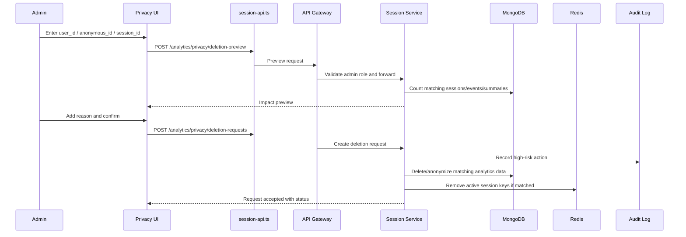
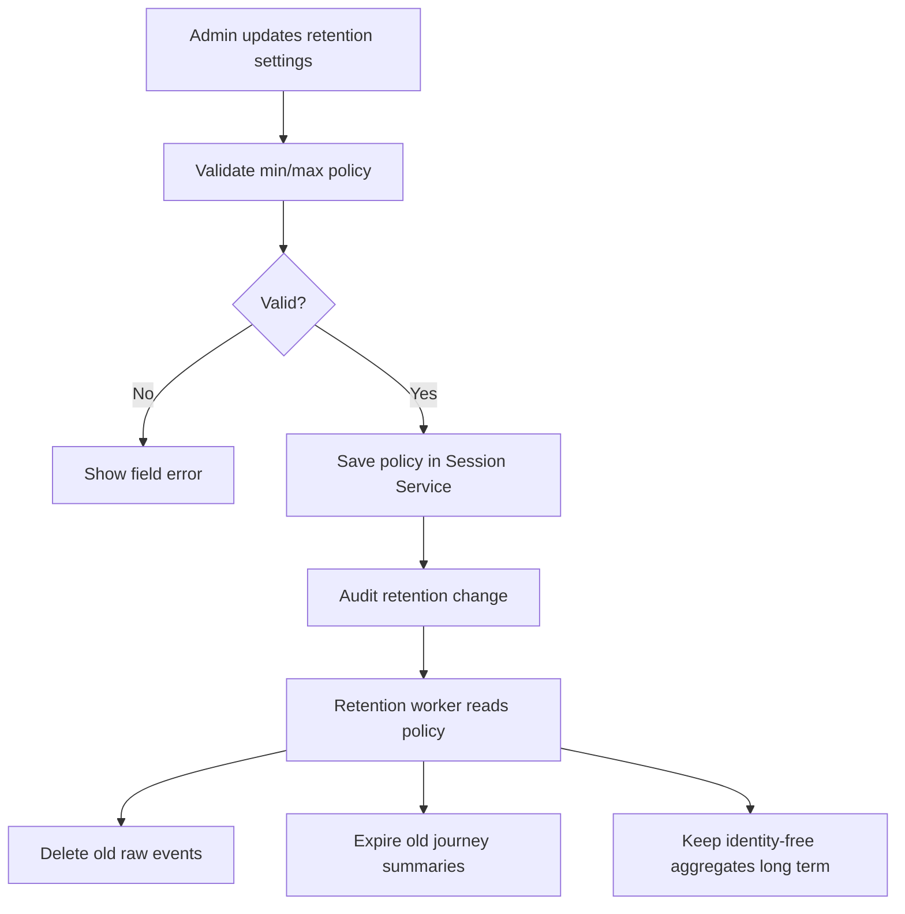
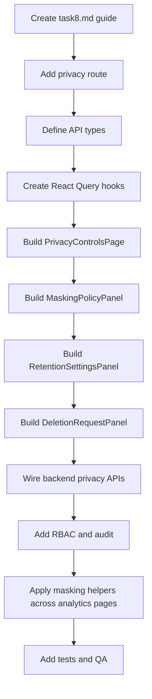

# 📊 Session Analytics Dashboard Service - Task 8: Privacy Controls


## 📌 Task Summary

| Field | Detail |
|---|---|
| Task Name | Privacy controls |
| Source | `docs/01-micro-tasks.md` → `Session Analytics Dashboard` → Task 8 |
| Priority | `P1` security and compliance capability |
| Dependency | Security policy |
| Main Goal | PII masking, user deletion, aur retention settings UI banana |
| Output Type | Structured implementation guide |
| Not Included | Consent banner SDK, legal policy pages, cross-service full account deletion, Superadmin audit viewer, exact compliance/legal advisory |

> **Simple Hinglish goal:** Is task ka kaam Session Analytics Dashboard me ek **Privacy Controls** page banana hai jahan admin PII masking policy manage kare, user/session analytics deletion request trigger kare, aur data retention settings configure kare. Ye page analytics ko useful rakhta hai, but personal data exposure ko strictly control karta hai.

---

## ✅ Final Output Created

```text
TaskImplementation/
└── Session Analytics Dashboard Service/
    ├── task1.md
    ├── task2.md
    ├── task3.md
    ├── task4.md
    ├── task5.md
    ├── task6.md
    ├── task7.md
    └── task8.md
```

### Why this structure?

- `TaskImplementation/` task-wise implementation guides ka central folder hai.
- `Session Analytics Dashboard Service/` folder already exist karta tha, isliye usko keep kiya gaya.
- `task8.md` sirf **Session Analytics Dashboard Service - Task 8** ka guide hai.
- Actual frontend/backend source files create nahi kiye gaye, kyunki requested output only folder structure aur markdown guide hai.
- Task 8 ke beyond consent banner SDK, platform-wide legal workflows, and Superadmin audit log viewer intentionally include nahi kiye gaye.

---

## 🧭 Documentation Sources Studied

| Document | Kya use kiya gaya |
|---|---|
| `docs/01-micro-tasks.md` | Task 8 ka exact scope: PII masking, user deletion, retention settings UI |
| `docs/03-folder-structure.md` | `frontend/session-analytics-dashboard/features/privacy/` recommended folder |
| `docs/04-microservice-design.md` | Session Service responsibilities: privacy, retention, `DeleteUserSessionData` direction |
| `docs/06-auth-security.md` | Admin session viewing masks PII by default; sensitive identifiers hash/minimize karne ka rule |
| `docs/08-session-management-system.md` | Raw events TTL, aggregates long-term, respect deletion requests |
| `docs/09-cms-superadmin.md` | High-risk admin controls require audit note and strict role handling |
| `docs/10-frontend-implementation.md` | Data-heavy dashboard direction and privacy controls as module |
| `database/mongodb-schema-design.md` | `sessions`, `session_events`, `heatmap_points`, `analytics_aggregates` and TTL index references |
| `api/master-api.json` | Existing analytics API catalog studied; privacy endpoints currently missing, so Task 8 proposes task-specific contracts |

> 🟡 **API note:** Current API catalog me `live`, `sessions`, `journey`, `funnels`, and `heatmaps` endpoints listed hain. `docs/04-microservice-design.md` me Session Service ke gRPC direction me `DeleteUserSessionData` mentioned hai, but `api/master-api.json` me privacy endpoints abhi expose nahi hain. Is guide me Task 8 ke liye recommended REST/gRPC contracts document kiye gaye hain.

---

## 🧱 Task Boundary

### ✅ Included in Task 8

- Privacy Controls dashboard route, recommended path: `/privacy`
- PII masking settings UI:
  - User id display mode
  - Anonymous id display mode
  - Location granularity
  - IP handling display rule
  - Sensitive payload visibility toggle rules
- User/session analytics deletion request UI:
  - User ID based deletion
  - Anonymous ID based deletion
  - Session ID based deletion
  - Dry-run count preview
  - Reason note and confirmation
  - Request status list
- Retention settings UI:
  - Raw events retention days
  - Journey summaries retention days
  - Heatmap aggregates retention days
  - Analytics aggregates retention months
  - Active session TTL minutes
- API contracts for settings, retention, deletion preview, and deletion request
- Backend flow explanation for masking, deletion, retention, and audit
- Privacy-safe display rules for Tasks 1-7 pages
- Role and permission expectations
- Beginner-friendly code examples
- Mermaid architecture and flow diagrams
- Tests and QA checklist

### ❌ Not Included in Task 8

- Public cookie consent banner or buyer-facing consent center
- Legal text generation for privacy policy or terms
- Full cross-service account deletion across User, Auth, Order, Payment, Notification, etc.
- Hard deletion of financial/order records
- Superadmin audit log viewer page
- Exact backend scheduler implementation source files
- KMS/secret manager setup
- Data warehouse governance tooling
- Vendor-specific compliance automation
- Exact legal claim like "GDPR compliant" or "DPDP compliant" without legal review

> 🟢 **Rule:** Task 8 ka focus sirf **Session Analytics Dashboard ke privacy controls** par hai. Ye guide analytics data ko mask/delete/retain karne ka implementation path deta hai, but legal compliance ka final sign-off legal/security team karegi.

---

## 🔐 Privacy Concepts

| Concept | Meaning | Example |
|---|---|---|
| PII | Personally identifiable information | email, phone, raw IP, exact address |
| Pseudonymous ID | Identity-like value, direct name nahi batata but user ko link kar sakta hai | `user_id`, `anonymous_id`, `session_id` |
| Masking | UI me sensitive value ko partially hide karna | `user_abc...789` |
| Hashing | Irreversible digest store karna | `ip_hash` instead of raw IP |
| Deletion request | Admin action jo user/session analytics data remove/anonymize kare | delete `user_123` session events |
| Retention | Data kitne time tak store hoga | raw events 90 days |
| Aggregate data | Count/rate based data jisme direct user identity nahi hoti | daily conversion rate |
| Audit note | High-risk action ka reason | "User deletion request from support ticket SUP-123" |

### Privacy Principle

| Rule | Hinglish Explanation |
|---|---|
| Minimize | Jo data dashboard ko nahi chahiye, wo collect/display mat karo |
| Mask by default | Admin ko default me safe/masked values dikhao |
| Reveal only by permission | Sensitive reveal action role + reason + audit ke bina allow nahi hoga |
| Delete raw identity data | User deletion request par directly linkable session data remove/anonymize karo |
| Keep aggregates safe | Long-term aggregates identity-free hone chahiye |
| Retain with limit | Raw analytics infinite time tak nahi rakhni |
| Audit mutations | Retention update and deletion request immutable audit event banayenge |

---

## 🧩 Data Classification

| Data Field | Classification | UI Default | Storage Rule |
|---|---|---|---|
| `email` | PII | Not shown | Session analytics me avoid karo |
| `phone` | PII | Not shown | Session analytics me avoid karo |
| `raw_ip` | PII/sensitive | Never shown | Store nahi, only `ip_hash` if required |
| `ip_hash` | Sensitive pseudonymous | Hidden by default | Hash and restrict |
| `user_id` | Pseudonymous | Masked | Allowed with admin permission |
| `anonymous_id` | Pseudonymous | Masked | Allowed but masked by default |
| `session_id` | Pseudonymous | Masked in lists, full in detail if allowed | Use for journey lookup |
| `device.type` | Low risk | Shown | Aggregate/list safe |
| `browser/os` | Low to medium | Shown | Fine for analytics |
| `geo.country` | Low risk | Shown | Recommended |
| `geo.city` | Medium | Optional/masked | Use policy setting |
| `click coordinates` | Behavioral | Aggregate only | No keystrokes/text |
| `search query` | Potentially sensitive | Mask or sample-safe | Avoid raw export if sensitive |
| `payment/card/OTP fields` | Highly sensitive | Never shown | Never collect in analytics |

> **Beginner note:** PII ka matlab sirf email/phone nahi hota. Kabhi-kabhi `user_id`, `anonymous_id`, raw search query, exact location, ya device fingerprint bhi user ko indirectly identify kar sakta hai. Isliye dashboard me default safe mode hona chahiye.

---

## 🗂️ Clean Folder Structure

Task 1 shell, Task 2 live sessions, Task 3 journey, Task 4 funnels, Task 5 heatmaps, Task 6 retention, and Task 7 reports ke upar Task 8 me `features/privacy/` module add hoga.

```text
frontend/session-analytics-dashboard/
├── package.json
├── vite.config.ts
├── tailwind.config.ts
├── index.html
└── src/
    ├── main.tsx
    ├── app.tsx
    ├── layout/
    │   ├── analytics-layout.tsx
    │   └── filters-bar.tsx
    ├── features/
    │   ├── shell/
    │   │   └── pages/
    │   │       └── analytics-overview-page.tsx
    │   ├── live/
    │   │   └── pages/
    │   │       └── live-sessions-page.tsx
    │   ├── journey/
    │   │   └── pages/
    │   │       └── journey-explorer-page.tsx
    │   ├── funnels/
    │   │   └── pages/
    │   │       └── funnel-analysis-page.tsx
    │   ├── heatmaps/
    │   │   └── pages/
    │   │       └── heatmap-page.tsx
    │   ├── cohorts/
    │   │   └── pages/
    │   │       └── cohort-retention-page.tsx
    │   ├── reports/
    │   │   └── pages/
    │   │       └── reports-export-page.tsx
    │   └── privacy/
    │       ├── pages/
    │       │   └── privacy-controls-page.tsx
    │       ├── components/
    │       │   ├── deletion-request-panel.tsx
    │       │   ├── deletion-status-table.tsx
    │       │   ├── masking-policy-panel.tsx
    │       │   ├── privacy-audit-note.tsx
    │       │   ├── privacy-summary-cards.tsx
    │       │   ├── retention-settings-panel.tsx
    │       │   └── sensitive-action-confirmation.tsx
    │       ├── hooks/
    │       │   ├── use-deletion-requests.ts
    │       │   ├── use-privacy-settings.ts
    │       │   └── use-retention-settings.ts
    │       └── lib/
    │           ├── privacy-format.ts
    │           └── privacy-validation.ts
    ├── api/
    │   └── session-api.ts
    ├── lib/
    │   ├── date-range.ts
    │   ├── format.ts
    │   └── session-view.ts
    └── styles/
        └── globals.css
```

### Folder Responsibility

| Path | Responsibility |
|---|---|
| `src/features/privacy/pages/privacy-controls-page.tsx` | Task 8 ka main page |
| `masking-policy-panel.tsx` | PII masking mode controls |
| `deletion-request-panel.tsx` | User/session deletion request form |
| `deletion-status-table.tsx` | Recent deletion jobs/status list |
| `retention-settings-panel.tsx` | TTL and retention policy controls |
| `privacy-summary-cards.tsx` | Current privacy posture summary |
| `privacy-audit-note.tsx` | High-risk action reason input |
| `sensitive-action-confirmation.tsx` | Destructive action confirmation modal |
| `use-privacy-settings.ts` | Masking settings fetch/update hook |
| `use-retention-settings.ts` | Retention settings fetch/update hook |
| `use-deletion-requests.ts` | Deletion preview/create/list hook |
| `privacy-format.ts` | Masking labels and display helpers |
| `privacy-validation.ts` | Form validation rules |
| `src/api/session-api.ts` | Privacy API methods and TypeScript contracts |

---

## 🧩 High-Level Architecture

```mermaid
flowchart LR
    Admin[Admin User] --> Browser[Session Analytics Dashboard]
    Browser --> Route[/privacy route]
    Route --> Page[PrivacyControlsPage]
    Page --> Masking[MaskingPolicyPanel]
    Page --> Deletion[DeletionRequestPanel]
    Page --> Retention[RetentionSettingsPanel]
    Masking --> API[session-api.ts]
    Deletion --> API
    Retention --> API
    API --> Gateway[API Gateway]
    Gateway --> RBAC[Admin RBAC + Audit Context]
    RBAC --> Session[Session Service]
    Session --> Mongo[(MongoDB session_db)]
    Session --> Redis[(Redis active sessions)]
    Session --> Audit[(Admin Audit Log)]
```

**Hinglish explanation:**  
Admin `/privacy` route open karta hai. Page teen primary panels render karta hai: masking, deletion, retention. UI `session-api.ts` se Gateway ko call karta hai. Gateway RBAC enforce karta hai, Session Service actual settings/deletion/retention logic execute karta hai, aur high-risk changes audit me record hote hain.

---

## 🔄 Data Deletion Flow



---

## ⏳ Retention Flow



**Important:** MongoDB TTL index collection-level hota hai. Agar per-policy value runtime me change karni ho, backend ko ya to `collMod` controlled migration se TTL update karna hoga, ya scheduled retention worker cutoff date ke basis par delete karega. UI sirf policy save karega; backend safe apply karega.

---

## 🧪 Recommended API Contracts

### REST Endpoints

| Method | Path | Purpose | Auth |
|---|---|---|---|
| `GET` | `/api/v1/analytics/privacy/settings` | Current masking/privacy settings read | `admin` |
| `PATCH` | `/api/v1/analytics/privacy/settings` | Masking/privacy settings update | `superadmin` or `operations_admin` |
| `GET` | `/api/v1/analytics/privacy/retention` | Current retention settings read | `admin` |
| `PATCH` | `/api/v1/analytics/privacy/retention` | Retention policy update | `superadmin` |
| `POST` | `/api/v1/analytics/privacy/deletion-preview` | Delete request impact preview | `operations_admin` or `superadmin` |
| `POST` | `/api/v1/analytics/privacy/deletion-requests` | Create analytics deletion request | `operations_admin` or `superadmin` |
| `GET` | `/api/v1/analytics/privacy/deletion-requests` | List recent deletion requests | `admin` |

### gRPC Mapping

| REST Action | Suggested gRPC |
|---|---|
| Get masking settings | `SessionService.GetPrivacySettings` |
| Update masking settings | `SessionService.UpdatePrivacySettings` |
| Get retention policy | `SessionService.GetRetentionPolicy` |
| Update retention policy | `SessionService.UpdateRetentionPolicy` |
| Preview deletion | `SessionService.PreviewSessionDataDeletion` |
| Create deletion request | `SessionService.DeleteUserSessionData` |
| List deletion requests | `SessionService.ListDeletionRequests` |

### Example Privacy Settings Response

```json
{
  "masking": {
    "userIdMode": "masked",
    "anonymousIdMode": "masked",
    "sessionIdMode": "masked",
    "locationGranularity": "country",
    "showSearchQueries": false,
    "showIpHash": false
  },
  "permissions": {
    "canUpdateMasking": true,
    "canRequestDeletion": true,
    "canUpdateRetention": false
  },
  "updatedAt": "2026-05-28T04:00:00Z",
  "updatedBy": "admin_123"
}
```

### Example Retention Settings Response

```json
{
  "rawEventsDays": 90,
  "journeySummariesDays": 365,
  "heatmapAggregatesDays": 365,
  "analyticsAggregatesMonths": 36,
  "activeSessionTtlMinutes": 45,
  "deletionRequestLogDays": 730,
  "updatedAt": "2026-05-28T04:00:00Z",
  "updatedBy": "admin_123"
}
```

### Example Deletion Preview Response

```json
{
  "targetType": "user_id",
  "targetValueMasked": "user_12...89",
  "matchedSessions": 18,
  "matchedEvents": 1240,
  "matchedJourneySummaries": 18,
  "matchedActiveSessions": 1,
  "aggregateImpact": "aggregates_anonymized_or_unchanged",
  "estimatedCompletionSeconds": 20
}
```

---

## 🪜 Step-by-Step Implementation

### Step 1: Task 8 markdown file create karo

```bash
mkdir -p "TaskImplementation/Session Analytics Dashboard Service"
touch "TaskImplementation/Session Analytics Dashboard Service/task8.md"
```

**Explanation:**  
Project me `TaskImplementation/Session Analytics Dashboard Service/` already available tha. Task 8 ke liye sirf `task8.md` add kiya gaya. Source app/backend files create nahi kiye gaye because current output requirement documentation guide tak limited hai.

---

### Step 2: Privacy route add karo

Task 8 implementation phase me dashboard app ke router me `/privacy` route add hoga.

```tsx
// src/app.tsx
import { createBrowserRouter, RouterProvider } from "react-router-dom";
import { AnalyticsLayout } from "./layout/analytics-layout";
import { PrivacyControlsPage } from "./features/privacy/pages/privacy-controls-page";

const router = createBrowserRouter([
  {
    path: "/",
    element: <AnalyticsLayout />,
    children: [
      { index: true, element: <AnalyticsOverviewPage /> },
      { path: "live", element: <LiveSessionsPage /> },
      { path: "journey/:sessionId?", element: <JourneyExplorerPage /> },
      { path: "funnels", element: <FunnelAnalysisPage /> },
      { path: "heatmaps", element: <HeatmapPage /> },
      { path: "cohorts", element: <CohortRetentionPage /> },
      { path: "reports", element: <ReportsExportPage /> },
      { path: "privacy", element: <PrivacyControlsPage /> }
    ]
  }
]);

export function App() {
  return <RouterProvider router={router} />;
}
```

**Explanation:**  
Privacy page same analytics shell ke andar rahega. Isse admin ko date filters, navigation, and dashboard styling consistent milti hai. Privacy page usually date range se directly driven nahi hota, but same admin layout ka part hona useful hai.

---

### Step 3: Sidebar navigation item add karo

```tsx
// src/layout/analytics-layout.tsx
import { ShieldCheck } from "lucide-react";

const navItems = [
  { label: "Overview", path: "/", icon: LayoutDashboard },
  { label: "Live", path: "/live", icon: Activity },
  { label: "Journey", path: "/journey", icon: Route },
  { label: "Funnels", path: "/funnels", icon: GitBranch },
  { label: "Heatmaps", path: "/heatmaps", icon: MousePointerClick },
  { label: "Cohorts", path: "/cohorts", icon: CalendarRange },
  { label: "Reports", path: "/reports", icon: Download },
  { label: "Privacy", path: "/privacy", icon: ShieldCheck }
];
```

**Explanation:**  
`ShieldCheck` icon privacy/security ka clear visual signal deta hai. Label short rakha gaya hai because dashboard navigation compact and scannable honi chahiye.

---

### Step 4: API types define karo

```ts
// src/api/session-api.ts
export type MaskingMode = "hidden" | "masked" | "full";
export type LocationGranularity = "none" | "country" | "city";

export interface PrivacyMaskingSettings {
  userIdMode: MaskingMode;
  anonymousIdMode: MaskingMode;
  sessionIdMode: MaskingMode;
  locationGranularity: LocationGranularity;
  showSearchQueries: boolean;
  showIpHash: boolean;
}

export interface PrivacySettingsResponse {
  masking: PrivacyMaskingSettings;
  permissions: {
    canUpdateMasking: boolean;
    canRequestDeletion: boolean;
    canUpdateRetention: boolean;
  };
  updatedAt: string;
  updatedBy: string;
}

export interface RetentionSettings {
  rawEventsDays: number;
  journeySummariesDays: number;
  heatmapAggregatesDays: number;
  analyticsAggregatesMonths: number;
  activeSessionTtlMinutes: number;
  deletionRequestLogDays: number;
}

export type DeletionTargetType = "user_id" | "anonymous_id" | "session_id";

export interface DeletionPreviewRequest {
  targetType: DeletionTargetType;
  targetValue: string;
}

export interface DeletionPreviewResponse {
  targetType: DeletionTargetType;
  targetValueMasked: string;
  matchedSessions: number;
  matchedEvents: number;
  matchedJourneySummaries: number;
  matchedActiveSessions: number;
  aggregateImpact: "unchanged" | "anonymized" | "aggregates_anonymized_or_unchanged";
  estimatedCompletionSeconds: number;
}

export interface CreateDeletionRequest {
  targetType: DeletionTargetType;
  targetValue: string;
  reason: string;
  confirmed: boolean;
}

export interface DeletionRequestStatus {
  requestId: string;
  targetType: DeletionTargetType;
  targetValueMasked: string;
  status: "queued" | "processing" | "completed" | "failed";
  requestedBy: string;
  reason: string;
  createdAt: string;
  completedAt?: string;
}
```

**Explanation:**  
Types pehle define karne se frontend and backend contract clear hota hai. `targetValue` API request me jayega, but response me `targetValueMasked` hi aayega taaki UI accidental sensitive echo na kare.

---

### Step 5: API methods add karo

```ts
// src/api/session-api.ts
async function readJson<T>(response: Response): Promise<T> {
  if (!response.ok) {
    throw new Error("Privacy API request fail ho gayi.");
  }

  return response.json() as Promise<T>;
}

export async function getPrivacySettings(): Promise<PrivacySettingsResponse> {
  const response = await fetch("/api/v1/analytics/privacy/settings", {
    credentials: "include"
  });

  return readJson<PrivacySettingsResponse>(response);
}

export async function updatePrivacySettings(
  masking: PrivacyMaskingSettings
): Promise<PrivacySettingsResponse> {
  const response = await fetch("/api/v1/analytics/privacy/settings", {
    method: "PATCH",
    credentials: "include",
    headers: { "Content-Type": "application/json" },
    body: JSON.stringify({ masking })
  });

  return readJson<PrivacySettingsResponse>(response);
}

export async function getRetentionSettings(): Promise<RetentionSettings> {
  const response = await fetch("/api/v1/analytics/privacy/retention", {
    credentials: "include"
  });

  return readJson<RetentionSettings>(response);
}

export async function updateRetentionSettings(
  settings: RetentionSettings,
  reason: string
): Promise<RetentionSettings> {
  const response = await fetch("/api/v1/analytics/privacy/retention", {
    method: "PATCH",
    credentials: "include",
    headers: { "Content-Type": "application/json" },
    body: JSON.stringify({ ...settings, reason })
  });

  return readJson<RetentionSettings>(response);
}

export async function previewDeletion(
  request: DeletionPreviewRequest
): Promise<DeletionPreviewResponse> {
  const response = await fetch("/api/v1/analytics/privacy/deletion-preview", {
    method: "POST",
    credentials: "include",
    headers: { "Content-Type": "application/json" },
    body: JSON.stringify(request)
  });

  return readJson<DeletionPreviewResponse>(response);
}

export async function createDeletionRequest(
  request: CreateDeletionRequest
): Promise<DeletionRequestStatus> {
  const response = await fetch("/api/v1/analytics/privacy/deletion-requests", {
    method: "POST",
    credentials: "include",
    headers: { "Content-Type": "application/json" },
    body: JSON.stringify(request)
  });

  return readJson<DeletionRequestStatus>(response);
}

export async function listDeletionRequests(): Promise<DeletionRequestStatus[]> {
  const response = await fetch("/api/v1/analytics/privacy/deletion-requests", {
    credentials: "include"
  });

  return readJson<DeletionRequestStatus[]>(response);
}
```

**Explanation:**  
`credentials: "include"` existing admin cookie/session flow ke saath align karta hai. Mutation endpoints `PATCH`/`POST` use karte hain because privacy settings and deletion requests state change karte hain.

---

### Step 6: React Query hooks banao

```ts
// src/features/privacy/hooks/use-privacy-settings.ts
import { useMutation, useQuery, useQueryClient } from "@tanstack/react-query";
import {
  getPrivacySettings,
  updatePrivacySettings,
  type PrivacyMaskingSettings
} from "../../../api/session-api";

export function usePrivacySettings() {
  return useQuery({
    queryKey: ["analytics", "privacy", "settings"],
    queryFn: getPrivacySettings,
    staleTime: 60_000
  });
}

export function useUpdatePrivacySettings() {
  const queryClient = useQueryClient();

  return useMutation({
    mutationFn: (masking: PrivacyMaskingSettings) =>
      updatePrivacySettings(masking),
    onSuccess: () => {
      queryClient.invalidateQueries({
        queryKey: ["analytics", "privacy", "settings"]
      });
    }
  });
}
```

```ts
// src/features/privacy/hooks/use-retention-settings.ts
import { useMutation, useQuery, useQueryClient } from "@tanstack/react-query";
import {
  getRetentionSettings,
  updateRetentionSettings,
  type RetentionSettings
} from "../../../api/session-api";

export function useRetentionSettings() {
  return useQuery({
    queryKey: ["analytics", "privacy", "retention"],
    queryFn: getRetentionSettings,
    staleTime: 60_000
  });
}

export function useUpdateRetentionSettings() {
  const queryClient = useQueryClient();

  return useMutation({
    mutationFn: ({
      settings,
      reason
    }: {
      settings: RetentionSettings;
      reason: string;
    }) => updateRetentionSettings(settings, reason),
    onSuccess: () => {
      queryClient.invalidateQueries({
        queryKey: ["analytics", "privacy", "retention"]
      });
    }
  });
}
```

```ts
// src/features/privacy/hooks/use-deletion-requests.ts
import { useMutation, useQuery, useQueryClient } from "@tanstack/react-query";
import {
  createDeletionRequest,
  listDeletionRequests,
  previewDeletion,
  type CreateDeletionRequest,
  type DeletionPreviewRequest
} from "../../../api/session-api";

export function useDeletionRequests() {
  return useQuery({
    queryKey: ["analytics", "privacy", "deletion-requests"],
    queryFn: listDeletionRequests,
    staleTime: 30_000
  });
}

export function usePreviewDeletion() {
  return useMutation({
    mutationFn: (request: DeletionPreviewRequest) => previewDeletion(request)
  });
}

export function useCreateDeletionRequest() {
  const queryClient = useQueryClient();

  return useMutation({
    mutationFn: (request: CreateDeletionRequest) =>
      createDeletionRequest(request),
    onSuccess: () => {
      queryClient.invalidateQueries({
        queryKey: ["analytics", "privacy", "deletion-requests"]
      });
    }
  });
}
```

**Explanation:**  
Privacy settings frequently change nahi hote, isliye 60 seconds stale time enough hai. Deletion list thodi more dynamic ho sakti hai, so 30 seconds stale time better hai. Mutations ke success par related queries invalidate hoti hain.

---

### Step 7: Main Privacy Controls page banao

```tsx
// src/features/privacy/pages/privacy-controls-page.tsx
import { DeletionRequestPanel } from "../components/deletion-request-panel";
import { DeletionStatusTable } from "../components/deletion-status-table";
import { MaskingPolicyPanel } from "../components/masking-policy-panel";
import { PrivacySummaryCards } from "../components/privacy-summary-cards";
import { RetentionSettingsPanel } from "../components/retention-settings-panel";
import { usePrivacySettings } from "../hooks/use-privacy-settings";
import { useRetentionSettings } from "../hooks/use-retention-settings";

export function PrivacyControlsPage() {
  const privacy = usePrivacySettings();
  const retention = useRetentionSettings();

  if (privacy.isLoading || retention.isLoading) {
    return <div className="p-6 text-sm text-slate-500">Loading privacy controls...</div>;
  }

  if (privacy.isError || retention.isError) {
    return (
      <div className="p-6 text-sm text-red-600">
        Privacy controls load nahi ho paye. Refresh karke dobara try karo.
      </div>
    );
  }

  return (
    <div className="space-y-5 p-6">
      <div>
        <h1 className="text-xl font-semibold text-slate-950">Privacy controls</h1>
        <p className="mt-1 text-sm text-slate-600">
          Masking, deletion, and retention settings for session analytics data.
        </p>
      </div>

      <PrivacySummaryCards
        privacy={privacy.data}
        retention={retention.data}
      />

      <div className="grid gap-5 xl:grid-cols-[1fr_420px]">
        <div className="space-y-5">
          <MaskingPolicyPanel settings={privacy.data} />
          <RetentionSettingsPanel
            settings={retention.data}
            canUpdate={privacy.data.permissions.canUpdateRetention}
          />
        </div>

        <div className="space-y-5">
          <DeletionRequestPanel
            canRequestDeletion={privacy.data.permissions.canRequestDeletion}
          />
          <DeletionStatusTable />
        </div>
      </div>
    </div>
  );
}
```

**Explanation:**  
Page ka layout operational dashboard jaisa dense hai. Left side policy settings, right side deletion workflow. Isse admin ek glance me policy status and high-risk actions dono manage kar sakta hai.

---

### Step 8: PII masking panel implement karo

```tsx
// src/features/privacy/components/masking-policy-panel.tsx
import { useState } from "react";
import type {
  MaskingMode,
  PrivacySettingsResponse
} from "../../../api/session-api";
import { useUpdatePrivacySettings } from "../hooks/use-privacy-settings";

const maskingModes: MaskingMode[] = ["hidden", "masked", "full"];

interface Props {
  settings: PrivacySettingsResponse;
}

export function MaskingPolicyPanel({ settings }: Props) {
  const [draft, setDraft] = useState(settings.masking);
  const update = useUpdatePrivacySettings();
  const disabled = !settings.permissions.canUpdateMasking || update.isPending;

  return (
    <section className="rounded-lg border border-slate-200 bg-white p-4">
      <div className="mb-4">
        <h2 className="text-sm font-semibold text-slate-950">PII masking policy</h2>
        <p className="mt-1 text-xs text-slate-500">
          Default dashboard visibility for identity-like analytics fields.
        </p>
      </div>

      <div className="grid gap-4 md:grid-cols-3">
        <MaskingSelect
          label="User ID"
          value={draft.userIdMode}
          disabled={disabled}
          onChange={(userIdMode) => setDraft({ ...draft, userIdMode })}
        />
        <MaskingSelect
          label="Anonymous ID"
          value={draft.anonymousIdMode}
          disabled={disabled}
          onChange={(anonymousIdMode) => setDraft({ ...draft, anonymousIdMode })}
        />
        <MaskingSelect
          label="Session ID"
          value={draft.sessionIdMode}
          disabled={disabled}
          onChange={(sessionIdMode) => setDraft({ ...draft, sessionIdMode })}
        />
      </div>

      <div className="mt-4 grid gap-3 md:grid-cols-2">
        <label className="text-sm text-slate-700">
          Location granularity
          <select
            className="mt-1 w-full rounded-md border border-slate-300 px-3 py-2 text-sm"
            value={draft.locationGranularity}
            disabled={disabled}
            onChange={(event) =>
              setDraft({
                ...draft,
                locationGranularity: event.target.value as typeof draft.locationGranularity
              })
            }
          >
            <option value="none">Hidden</option>
            <option value="country">Country only</option>
            <option value="city">City</option>
          </select>
        </label>

        <div className="space-y-2 text-sm text-slate-700">
          <label className="flex items-center gap-2">
            <input
              type="checkbox"
              checked={draft.showSearchQueries}
              disabled={disabled}
              onChange={(event) =>
                setDraft({ ...draft, showSearchQueries: event.target.checked })
              }
            />
            Show raw search queries
          </label>
          <label className="flex items-center gap-2">
            <input
              type="checkbox"
              checked={draft.showIpHash}
              disabled={disabled}
              onChange={(event) =>
                setDraft({ ...draft, showIpHash: event.target.checked })
              }
            />
            Show IP hash to privileged admins
          </label>
        </div>
      </div>

      <div className="mt-4 flex justify-end">
        <button
          className="rounded-md bg-slate-950 px-4 py-2 text-sm font-medium text-white disabled:cursor-not-allowed disabled:bg-slate-300"
          disabled={disabled}
          onClick={() => update.mutate(draft)}
        >
          Save masking policy
        </button>
      </div>
    </section>
  );
}

function MaskingSelect({
  label,
  value,
  disabled,
  onChange
}: {
  label: string;
  value: MaskingMode;
  disabled: boolean;
  onChange: (value: MaskingMode) => void;
}) {
  return (
    <label className="text-sm text-slate-700">
      {label}
      <select
        className="mt-1 w-full rounded-md border border-slate-300 px-3 py-2 text-sm"
        value={value}
        disabled={disabled}
        onChange={(event) => onChange(event.target.value as MaskingMode)}
      >
        {maskingModes.map((mode) => (
          <option key={mode} value={mode}>
            {mode}
          </option>
        ))}
      </select>
    </label>
  );
}
```

**Explanation:**  
Masking panel me segmented controls ya selects dono acceptable hain. Beginner-friendly implementation ke liye simple `select` use kiya gaya. Real production UI me destructive/sensitive modes like `full` reveal ke liye extra confirmation and audit reason add karna recommended hai.

---

### Step 9: Privacy display helper banao

```ts
// src/features/privacy/lib/privacy-format.ts
import type { MaskingMode } from "../../../api/session-api";

export function maskIdentifier(value: string | null | undefined): string {
  if (!value) return "-";
  if (value.length <= 8) return "••••";

  return `${value.slice(0, 6)}...${value.slice(-4)}`;
}

export function formatByMaskingMode(
  value: string | null | undefined,
  mode: MaskingMode
): string {
  if (mode === "hidden") return "Hidden";
  if (mode === "masked") return maskIdentifier(value);

  return value ?? "-";
}

export function formatLocation(
  geo: { country?: string; city?: string },
  granularity: "none" | "country" | "city"
): string {
  if (granularity === "none") return "Hidden";
  if (granularity === "country") return geo.country ?? "-";

  return [geo.city, geo.country].filter(Boolean).join(", ") || "-";
}
```

**Explanation:**  
Privacy helper ko shared session display helpers ke saath use karna chahiye. Tasks 2-7 pages me direct `user_id` render karne ke bajay ye helper use hoga, so central masking rule consistent rahega.

---

### Step 10: Deletion request panel banao

```tsx
// src/features/privacy/components/deletion-request-panel.tsx
import { useState } from "react";
import type { DeletionTargetType } from "../../../api/session-api";
import {
  useCreateDeletionRequest,
  usePreviewDeletion
} from "../hooks/use-deletion-requests";

interface Props {
  canRequestDeletion: boolean;
}

export function DeletionRequestPanel({ canRequestDeletion }: Props) {
  const [targetType, setTargetType] = useState<DeletionTargetType>("user_id");
  const [targetValue, setTargetValue] = useState("");
  const [reason, setReason] = useState("");
  const preview = usePreviewDeletion();
  const createRequest = useCreateDeletionRequest();

  const canPreview = canRequestDeletion && targetValue.trim().length >= 3;
  const canSubmit =
    canRequestDeletion &&
    preview.data &&
    reason.trim().length >= 10 &&
    !createRequest.isPending;

  return (
    <section className="rounded-lg border border-slate-200 bg-white p-4">
      <div className="mb-4">
        <h2 className="text-sm font-semibold text-slate-950">Deletion request</h2>
        <p className="mt-1 text-xs text-slate-500">
          Remove or anonymize matching session analytics data.
        </p>
      </div>

      <div className="space-y-3">
        <label className="text-sm text-slate-700">
          Target type
          <select
            className="mt-1 w-full rounded-md border border-slate-300 px-3 py-2 text-sm"
            value={targetType}
            disabled={!canRequestDeletion}
            onChange={(event) =>
              setTargetType(event.target.value as DeletionTargetType)
            }
          >
            <option value="user_id">User ID</option>
            <option value="anonymous_id">Anonymous ID</option>
            <option value="session_id">Session ID</option>
          </select>
        </label>

        <label className="text-sm text-slate-700">
          Target value
          <input
            className="mt-1 w-full rounded-md border border-slate-300 px-3 py-2 text-sm"
            value={targetValue}
            disabled={!canRequestDeletion}
            onChange={(event) => setTargetValue(event.target.value)}
            placeholder="user_123, anon_123, or sess_123"
          />
        </label>

        <button
          className="w-full rounded-md border border-slate-300 px-3 py-2 text-sm font-medium text-slate-800 disabled:cursor-not-allowed disabled:text-slate-400"
          disabled={!canPreview || preview.isPending}
          onClick={() => preview.mutate({ targetType, targetValue })}
        >
          Preview impact
        </button>

        {preview.data ? (
          <div className="rounded-md bg-amber-50 p-3 text-xs text-amber-900">
            <div>Matched sessions: {preview.data.matchedSessions}</div>
            <div>Matched events: {preview.data.matchedEvents}</div>
            <div>Journey summaries: {preview.data.matchedJourneySummaries}</div>
            <div>Active sessions: {preview.data.matchedActiveSessions}</div>
          </div>
        ) : null}

        <label className="text-sm text-slate-700">
          Reason note
          <textarea
            className="mt-1 min-h-24 w-full rounded-md border border-slate-300 px-3 py-2 text-sm"
            value={reason}
            disabled={!canRequestDeletion}
            onChange={(event) => setReason(event.target.value)}
            placeholder="Support ticket or compliance reason"
          />
        </label>

        <button
          className="w-full rounded-md bg-red-600 px-3 py-2 text-sm font-medium text-white disabled:cursor-not-allowed disabled:bg-slate-300"
          disabled={!canSubmit}
          onClick={() =>
            createRequest.mutate({
              targetType,
              targetValue,
              reason,
              confirmed: true
            })
          }
        >
          Submit deletion request
        </button>
      </div>
    </section>
  );
}
```

**Explanation:**  
Deletion destructive action hai. Isliye direct submit ke bajay preview first flow rakha gaya. Reason note mandatory hai. Real production me second confirmation modal bhi add karna recommended hai, especially jab matched events count high ho.

---

### Step 11: Retention settings panel banao

```tsx
// src/features/privacy/components/retention-settings-panel.tsx
import { useState } from "react";
import type { RetentionSettings } from "../../../api/session-api";
import { useUpdateRetentionSettings } from "../hooks/use-retention-settings";
import { validateRetentionSettings } from "../lib/privacy-validation";

interface Props {
  settings: RetentionSettings;
  canUpdate: boolean;
}

export function RetentionSettingsPanel({ settings, canUpdate }: Props) {
  const [draft, setDraft] = useState(settings);
  const [reason, setReason] = useState("");
  const update = useUpdateRetentionSettings();
  const errors = validateRetentionSettings(draft);
  const hasErrors = Object.keys(errors).length > 0;

  function updateNumber(key: keyof RetentionSettings, value: string) {
    setDraft({ ...draft, [key]: Number(value) });
  }

  return (
    <section className="rounded-lg border border-slate-200 bg-white p-4">
      <div className="mb-4">
        <h2 className="text-sm font-semibold text-slate-950">Retention settings</h2>
        <p className="mt-1 text-xs text-slate-500">
          Control how long session analytics data remains queryable.
        </p>
      </div>

      <div className="grid gap-4 md:grid-cols-2">
        <RetentionInput
          label="Raw events days"
          value={draft.rawEventsDays}
          error={errors.rawEventsDays}
          disabled={!canUpdate}
          onChange={(value) => updateNumber("rawEventsDays", value)}
        />
        <RetentionInput
          label="Journey summaries days"
          value={draft.journeySummariesDays}
          error={errors.journeySummariesDays}
          disabled={!canUpdate}
          onChange={(value) => updateNumber("journeySummariesDays", value)}
        />
        <RetentionInput
          label="Heatmap aggregates days"
          value={draft.heatmapAggregatesDays}
          error={errors.heatmapAggregatesDays}
          disabled={!canUpdate}
          onChange={(value) => updateNumber("heatmapAggregatesDays", value)}
        />
        <RetentionInput
          label="Analytics aggregates months"
          value={draft.analyticsAggregatesMonths}
          error={errors.analyticsAggregatesMonths}
          disabled={!canUpdate}
          onChange={(value) => updateNumber("analyticsAggregatesMonths", value)}
        />
        <RetentionInput
          label="Active session TTL minutes"
          value={draft.activeSessionTtlMinutes}
          error={errors.activeSessionTtlMinutes}
          disabled={!canUpdate}
          onChange={(value) => updateNumber("activeSessionTtlMinutes", value)}
        />
        <RetentionInput
          label="Deletion request log days"
          value={draft.deletionRequestLogDays}
          error={errors.deletionRequestLogDays}
          disabled={!canUpdate}
          onChange={(value) => updateNumber("deletionRequestLogDays", value)}
        />
      </div>

      <label className="mt-4 block text-sm text-slate-700">
        Change reason
        <textarea
          className="mt-1 min-h-20 w-full rounded-md border border-slate-300 px-3 py-2 text-sm"
          value={reason}
          disabled={!canUpdate}
          onChange={(event) => setReason(event.target.value)}
          placeholder="Why retention policy is changing"
        />
      </label>

      <div className="mt-4 flex justify-end">
        <button
          className="rounded-md bg-slate-950 px-4 py-2 text-sm font-medium text-white disabled:cursor-not-allowed disabled:bg-slate-300"
          disabled={!canUpdate || hasErrors || reason.trim().length < 10 || update.isPending}
          onClick={() => update.mutate({ settings: draft, reason })}
        >
          Save retention settings
        </button>
      </div>
    </section>
  );
}

function RetentionInput({
  label,
  value,
  error,
  disabled,
  onChange
}: {
  label: string;
  value: number;
  error?: string;
  disabled: boolean;
  onChange: (value: string) => void;
}) {
  return (
    <label className="text-sm text-slate-700">
      {label}
      <input
        type="number"
        min={1}
        className="mt-1 w-full rounded-md border border-slate-300 px-3 py-2 text-sm"
        value={value}
        disabled={disabled}
        onChange={(event) => onChange(event.target.value)}
      />
      {error ? <span className="mt-1 block text-xs text-red-600">{error}</span> : null}
    </label>
  );
}
```

**Explanation:**  
Retention settings production impact kar sakte hain, so reason note mandatory hai. Form numbers validate honge before API call. Superadmin-only update recommended hai because galat retention setting data loss ya cost spike cause kar sakti hai.

---

### Step 12: Validation helpers banao

```ts
// src/features/privacy/lib/privacy-validation.ts
import type { RetentionSettings } from "../../../api/session-api";

type RetentionErrors = Partial<Record<keyof RetentionSettings, string>>;

export function validateRetentionSettings(
  settings: RetentionSettings
): RetentionErrors {
  const errors: RetentionErrors = {};

  if (settings.rawEventsDays < 7 || settings.rawEventsDays > 180) {
    errors.rawEventsDays = "Raw events retention 7 se 180 days ke beech hona chahiye.";
  }

  if (settings.journeySummariesDays < 30 || settings.journeySummariesDays > 730) {
    errors.journeySummariesDays =
      "Journey summaries retention 30 se 730 days ke beech hona chahiye.";
  }

  if (settings.heatmapAggregatesDays < 30 || settings.heatmapAggregatesDays > 730) {
    errors.heatmapAggregatesDays =
      "Heatmap aggregates retention 30 se 730 days ke beech hona chahiye.";
  }

  if (
    settings.analyticsAggregatesMonths < 12 ||
    settings.analyticsAggregatesMonths > 84
  ) {
    errors.analyticsAggregatesMonths =
      "Analytics aggregates retention 12 se 84 months ke beech hona chahiye.";
  }

  if (
    settings.activeSessionTtlMinutes < 15 ||
    settings.activeSessionTtlMinutes > 180
  ) {
    errors.activeSessionTtlMinutes =
      "Active session TTL 15 se 180 minutes ke beech hona chahiye.";
  }

  if (
    settings.deletionRequestLogDays < 365 ||
    settings.deletionRequestLogDays > 2555
  ) {
    errors.deletionRequestLogDays =
      "Deletion request log 365 se 2555 days ke beech hona chahiye.";
  }

  return errors;
}

export function validateDeletionReason(reason: string): string | null {
  if (reason.trim().length < 10) {
    return "Reason note at least 10 characters ka hona chahiye.";
  }

  return null;
}
```

**Explanation:**  
Validation frontend me user ko fast feedback deti hai. Backend me bhi same rules enforce karna mandatory hai, kyunki frontend validation security boundary nahi hoti.

---

## 🧠 Backend Implementation Direction

### Privacy Settings Storage

Recommended collection:

```json
{
  "_id": "global",
  "masking": {
    "user_id_mode": "masked",
    "anonymous_id_mode": "masked",
    "session_id_mode": "masked",
    "location_granularity": "country",
    "show_search_queries": false,
    "show_ip_hash": false
  },
  "retention": {
    "raw_events_days": 90,
    "journey_summaries_days": 365,
    "heatmap_aggregates_days": 365,
    "analytics_aggregates_months": 36,
    "active_session_ttl_minutes": 45,
    "deletion_request_log_days": 730
  },
  "updated_at": "2026-05-28T04:00:00Z",
  "updated_by": "admin_123"
}
```

Recommended collection name: `privacy_settings`.

### Deletion Request Storage

```json
{
  "_id": "delreq_123",
  "target_type": "user_id",
  "target_hash": "sha256:...",
  "target_value_masked": "user_12...89",
  "status": "completed",
  "matched_sessions": 18,
  "matched_events": 1240,
  "reason": "Support ticket SUP-123 user analytics deletion request",
  "requested_by": "admin_123",
  "created_at": "2026-05-28T04:00:00Z",
  "completed_at": "2026-05-28T04:00:20Z",
  "error": null
}
```

Recommended collection name: `analytics_deletion_requests`.

> 🟡 **Security note:** Deletion log me raw target value store mat karo. `target_hash` and `target_value_masked` enough hai traceability ke liye.

---

## 🧹 Backend Deletion Pseudocode

```go
// internal/usecase/delete_user_session_data.go
type DeleteUserSessionDataInput struct {
	TargetType  string
	TargetValue string
	Reason      string
	ActorID     string
	RequestID   string
}

func (uc *PrivacyUsecase) DeleteUserSessionData(
	ctx context.Context,
	input DeleteUserSessionDataInput,
) (*DeletionRequest, error) {
	if !uc.policy.CanDeleteSessionAnalytics(ctx, input.ActorID) {
		return nil, ErrForbidden
	}

	if strings.TrimSpace(input.Reason) == "" {
		return nil, ErrReasonRequired
	}

	filter, err := buildDeletionFilter(input.TargetType, input.TargetValue)
	if err != nil {
		return nil, err
	}

	request := NewDeletionRequest(input, MaskIdentifier(input.TargetValue))
	if err := uc.repo.CreateDeletionRequest(ctx, request); err != nil {
		return nil, err
	}

	uc.audit.Record(ctx, AuditEvent{
		ActorID:      input.ActorID,
		Action:       "session_analytics.deletion_requested",
		ResourceType: "session_analytics",
		ResourceID:   request.ID,
		RequestID:    input.RequestID,
		Reason:       input.Reason,
	})

	if err := uc.repo.DeleteSessionEvents(ctx, filter); err != nil {
		return nil, uc.repo.MarkDeletionFailed(ctx, request.ID, err)
	}

	if err := uc.repo.AnonymizeSessions(ctx, filter); err != nil {
		return nil, uc.repo.MarkDeletionFailed(ctx, request.ID, err)
	}

	if err := uc.repo.DeleteJourneySummaries(ctx, filter); err != nil {
		return nil, uc.repo.MarkDeletionFailed(ctx, request.ID, err)
	}

	if err := uc.activeSessions.DeleteMatching(ctx, filter); err != nil {
		return nil, uc.repo.MarkDeletionFailed(ctx, request.ID, err)
	}

	return uc.repo.MarkDeletionCompleted(ctx, request.ID)
}
```

**Explanation:**  
Backend deletion flow RBAC check se start hota hai. Reason mandatory hai. Raw events delete honge, sessions anonymize ho sakte hain, journey summaries delete/anonymize honge, Redis active sessions cleanup honge. Audit event deletion se pehle write hona chahiye.

---

## 🧾 MongoDB Retention Examples

Existing docs me `session_events` TTL 90 days example diya gaya hai:

```javascript
db.session_events.createIndex(
  { occurred_at: 1 },
  { expireAfterSeconds: 7776000 }
)
```

Retention policy update ke liye backend controlled `collMod` use kar sakta hai:

```javascript
db.runCommand({
  collMod: "session_events",
  index: {
    keyPattern: { occurred_at: 1 },
    expireAfterSeconds: 7776000
  }
})
```

Scheduled worker alternative:

```javascript
db.session_events.deleteMany({
  occurred_at: {
    $lt: ISODate("2026-02-27T00:00:00Z")
  }
})
```

**Hinglish explanation:**  
TTL index simple and automatic hai, but runtime policy changes carefully karni hoti hain. Agar UI se retention days change hote hain, backend ko validation, audit, and safe application flow follow karna chahiye.

---

## 🧼 Masking Rules Across Existing Pages

| Page | Field | Task 8 Rule |
|---|---|---|
| Overview | Metrics only | No PII display |
| Live sessions | `user_id`, `anonymous_id`, `session_id` | Mask by policy |
| Live sessions | location | Country/city based on policy |
| Journey explorer | event payload | Sensitive properties removed |
| Journey explorer | session id | Mask in list, allowed detail if role permits |
| Funnel analysis | aggregate counts | No direct identity |
| Heatmap view | click/scroll points | Aggregate only, no raw session drilldown |
| Cohorts | user counts | Suppress tiny cohorts if needed |
| Reports export | CSV columns | Export masked/safe fields only |
| Privacy controls | target value | Input allowed, response masked |

### Sensitive Event Properties Blocklist

```ts
export const sensitiveEventPropertyKeys = [
  "password",
  "otp",
  "token",
  "access_token",
  "refresh_token",
  "card_number",
  "cvv",
  "upi_id",
  "email",
  "phone",
  "address",
  "pin_code"
];
```

**Explanation:**  
Frontend masking important hai, but actual sensitive data backend ingestion time par hi remove/mask hona chahiye. UI should never rely on hiding unsafe data that should not have been returned.

---

## 🛡️ Permissions Model

| Capability | Recommended Role |
|---|---|
| View privacy settings | `admin`, `operations_admin`, `superadmin` |
| Update masking settings | `operations_admin`, `superadmin` |
| Preview deletion impact | `operations_admin`, `superadmin` |
| Submit deletion request | `operations_admin`, `superadmin` |
| Update retention settings | `superadmin` |
| View deletion request status | `admin`, `operations_admin`, `superadmin` |

### UI Behavior

| Permission Missing | UI Behavior |
|---|---|
| Cannot update masking | Fields disabled, values visible read-only |
| Cannot request deletion | Form disabled and submit hidden/disabled |
| Cannot update retention | Retention inputs read-only |
| API returns 403 | Show concise permission denied state |

> 🟡 **Important:** UI permission checks convenience ke liye hain. Real security backend/Gateway RBAC se enforce hogi.

---

## 🧰 External Libraries / Tools

| Library/Tool | What it is | Why used | Install | Usage |
|---|---|---|---|---|
| React | UI library | Privacy page components banane ke liye | Vite template se included | `function PrivacyControlsPage()` |
| TypeScript | Static typing | API contracts and form state safe rakhne ke liye | Vite React TS template | `interface RetentionSettings` |
| Vite | Build/dev tool | Fast dashboard dev server and production build | `npm create vite@latest ... -- --template react-ts` | `npm run dev` |
| React Router | Client routing | `/privacy` route add karne ke liye | `npm install react-router-dom` | `createBrowserRouter` |
| TanStack Query | Server-state manager | Settings fetch, mutation, cache invalidation ke liye | `npm install @tanstack/react-query` | `useQuery`, `useMutation` |
| Tailwind CSS | Utility CSS | Dense operational dashboard styling ke liye | `npm install -D tailwindcss postcss autoprefixer` | `className="grid gap-4"` |
| lucide-react | Icon set | `ShieldCheck`, save, alert icons ke liye | `npm install lucide-react` | `<ShieldCheck />` |
| date-fns | Date helper | Updated-at timestamps format karne ke liye | `npm install date-fns` | `formatDistanceToNow` |
| Zod | Runtime validation | Form/API validation ko declarative banane ke liye | `npm install zod` | `RetentionSettingsSchema.parse()` |
| Vitest | Test runner | Unit and component tests ke liye | `npm install -D vitest` | `npm run test` |
| Testing Library | Component testing | User behavior based tests ke liye | `npm install -D @testing-library/react @testing-library/jest-dom` | `screen.getByText` |
| MSW | API mocking | Privacy API tests without backend ke liye | `npm install -D msw` | `http.get(...)` |

### Install Commands

```bash
cd frontend/session-analytics-dashboard
npm install @tanstack/react-query react-router-dom lucide-react date-fns zod
npm install -D tailwindcss postcss autoprefixer vitest @testing-library/react @testing-library/jest-dom jsdom msw
```

### Backend Go Packages

Backend likely existing shared stack use karega. Agar missing ho to Session Service me MongoDB/Redis clients install karne ke examples:

```bash
cd backend/services/session-service
go get go.mongodb.org/mongo-driver/mongo
go get github.com/redis/go-redis/v9
```

**Why used:** MongoDB session analytics store ke liye hai, Redis active sessions/TTL cleanup ke liye. Task 8 guide me backend source add nahi kiya gaya, but implementation phase me ye clients needed ho sakte hain.

---

## 🧪 Testing Strategy

### Unit Tests

| Test | Expected |
|---|---|
| `maskIdentifier("user_123456789")` | `user_1...6789` style masked value |
| `formatByMaskingMode(value, "hidden")` | `Hidden` |
| Retention below min | validation error |
| Retention above max | validation error |
| Empty deletion reason | blocked |
| Permission false | mutation controls disabled |

### Component Test Example

```tsx
// src/features/privacy/pages/privacy-controls-page.test.tsx
import { QueryClient, QueryClientProvider } from "@tanstack/react-query";
import { render, screen } from "@testing-library/react";
import { http, HttpResponse } from "msw";
import { setupServer } from "msw/node";
import { PrivacyControlsPage } from "./privacy-controls-page";

const server = setupServer(
  http.get("/api/v1/analytics/privacy/settings", () =>
    HttpResponse.json({
      masking: {
        userIdMode: "masked",
        anonymousIdMode: "masked",
        sessionIdMode: "masked",
        locationGranularity: "country",
        showSearchQueries: false,
        showIpHash: false
      },
      permissions: {
        canUpdateMasking: true,
        canRequestDeletion: true,
        canUpdateRetention: true
      },
      updatedAt: "2026-05-28T04:00:00Z",
      updatedBy: "admin_123"
    })
  ),
  http.get("/api/v1/analytics/privacy/retention", () =>
    HttpResponse.json({
      rawEventsDays: 90,
      journeySummariesDays: 365,
      heatmapAggregatesDays: 365,
      analyticsAggregatesMonths: 36,
      activeSessionTtlMinutes: 45,
      deletionRequestLogDays: 730
    })
  ),
  http.get("/api/v1/analytics/privacy/deletion-requests", () =>
    HttpResponse.json([])
  )
);

beforeAll(() => server.listen());
afterEach(() => server.resetHandlers());
afterAll(() => server.close());

it("renders privacy control panels", async () => {
  const queryClient = new QueryClient();

  render(
    <QueryClientProvider client={queryClient}>
      <PrivacyControlsPage />
    </QueryClientProvider>
  );

  expect(await screen.findByText("Privacy controls")).toBeInTheDocument();
  expect(screen.getByText("PII masking policy")).toBeInTheDocument();
  expect(screen.getByText("Retention settings")).toBeInTheDocument();
  expect(screen.getByText("Deletion request")).toBeInTheDocument();
});
```

### Backend Tests

| Backend Test | Expected |
|---|---|
| Non-admin deletion request | `permission denied` |
| Missing reason | validation error |
| Invalid target type | validation error |
| Preview user id | returns count only, no raw target echo |
| Delete user id | removes `session_events`, anonymizes `sessions`, clears Redis active key |
| Retention update | writes audit log and validates ranges |
| Masking update | writes audit log and returns masked settings |

---

## ✅ QA Checklist

- [ ] `/privacy` route dashboard shell ke andar open hota hai
- [ ] Sidebar me Privacy nav item visible hai
- [ ] Privacy settings load hone tak loading state show hoti hai
- [ ] API failure par readable error state show hota hai
- [ ] Masking policy fields current values show karte hain
- [ ] Permission missing hone par masking controls disabled hote hain
- [ ] Retention values min/max validation follow karte hain
- [ ] Retention update reason note ke bina submit nahi hota
- [ ] Deletion preview submit se pehle impact count dikhata hai
- [ ] Deletion request reason mandatory hai
- [ ] Deletion response raw target value echo nahi karta
- [ ] Deletion status table recent jobs dikhata hai
- [ ] 403 response par permission denied state show hota hai
- [ ] Existing live/journey/report pages masking helper use karte hain
- [ ] Reports export masked/safe columns hi return karta hai
- [ ] Backend mutation endpoints audit event write karte hain
- [ ] Raw events TTL policy documented and tested hai

---

## 🚦 Privacy Acceptance Criteria

| Area | Acceptance Criteria |
|---|---|
| PII masking | User/anonymous/session identifiers default masked hain |
| Search payload | Raw search query visibility policy-controlled hai |
| IP | Raw IP never shown; IP hash hidden unless privileged |
| Location | Country/city granularity policy se controlled hai |
| Deletion | Admin preview + reason + confirm ke baad deletion request create kar sakta hai |
| Retention | Superadmin retention settings update kar sakta hai with audit reason |
| Audit | Deletion and retention mutations audit trail me recorded hain |
| Security | Backend RBAC all mutation endpoints par enforce hota hai |
| UX | Page dense, readable, and beginner-friendly hai |
| Scope | No extra consent SDK/legal module/source implementation added |

---

## 🧭 Implementation Order



---

## 📦 Backend Collections and Indexes

```javascript
db.privacy_settings.createIndex({ _id: 1 }, { unique: true })

db.analytics_deletion_requests.createIndex({ status: 1, created_at: -1 })
db.analytics_deletion_requests.createIndex({ requested_by: 1, created_at: -1 })
db.analytics_deletion_requests.createIndex({ target_hash: 1, created_at: -1 })
db.analytics_deletion_requests.createIndex(
  { created_at: 1 },
  { expireAfterSeconds: 63072000 }
)
```

**Explanation:**  
`privacy_settings` me global policy store hogi. `analytics_deletion_requests` audit-adjacent operational log hai. Raw target value store nahi hogi; target hash and masked display value store honge.

---

## 🔍 Observability

| Metric/Log | Purpose |
|---|---|
| `privacy_settings_update_total` | Masking/retention updates count |
| `session_deletion_request_total` | Deletion requests count by status |
| `session_deletion_duration_seconds` | Deletion completion time |
| `retention_cleanup_deleted_events_total` | Retention worker delete volume |
| `privacy_api_forbidden_total` | Permission denied attempts |
| Structured audit logs | Actor, request id, action, reason |

### Example Audit Event

```json
{
  "actor_admin_id": "admin_123",
  "action": "session_analytics.retention_updated",
  "resource_type": "privacy_settings",
  "resource_id": "global",
  "request_id": "req_abc123",
  "ip_hash": "sha256:...",
  "reason": "Reduce raw event storage to 60 days",
  "created_at": "2026-05-28T04:00:00Z"
}
```

---

## ⚠️ Common Mistakes Avoid Karo

| Mistake | Problem | Correct Approach |
|---|---|---|
| Frontend-only masking | API response still leaks sensitive data | Backend response shaping + frontend masking |
| Raw target in deletion logs | Deletion log itself sensitive ban jata hai | Store hash + masked value |
| No preview before deletion | Admin accidental destructive action kar sakta hai | Preview count + reason + confirmation |
| No audit note | Security review impossible ho jata hai | Mutation reason mandatory |
| Raw IP store karna | High privacy risk | Store `ip_hash` only |
| Retention too high | Cost and compliance risk | Policy max limits |
| Retention too low | Analytics/debugging data loss | Policy min limits |
| Aggregates with identity | Long-term data still linkable ho sakta hai | Identity-free aggregates only |
| Export ignores masking | CSV accidental leak kar sakta hai | Task 7 export must reuse privacy policy |

---

## 🧾 Final Task 8 Summary

Task 8 ke baad Session Analytics Dashboard me privacy governance ka clear implementation path ready hai. Admin masking policy manage kar sakta hai, analytics deletion requests safely preview/submit kar sakta hai, aur retention settings control kar sakta hai. Backend side par RBAC, audit, safe deletion, and TTL/retention application mandatory hain.

```text
Task 8 outcome:
- Privacy route planned
- Masking controls documented
- Deletion request flow documented
- Retention settings flow documented
- API contracts proposed
- Backend deletion/retention direction added
- Tests and QA checklist ready
```

> ✅ **Scope confirmation:** Is file me sirf `Session Analytics Dashboard Service - Task 8` ka implementation guide generate kiya gaya hai. Koi extra frontend/backend source implementation add nahi kiya gaya.
