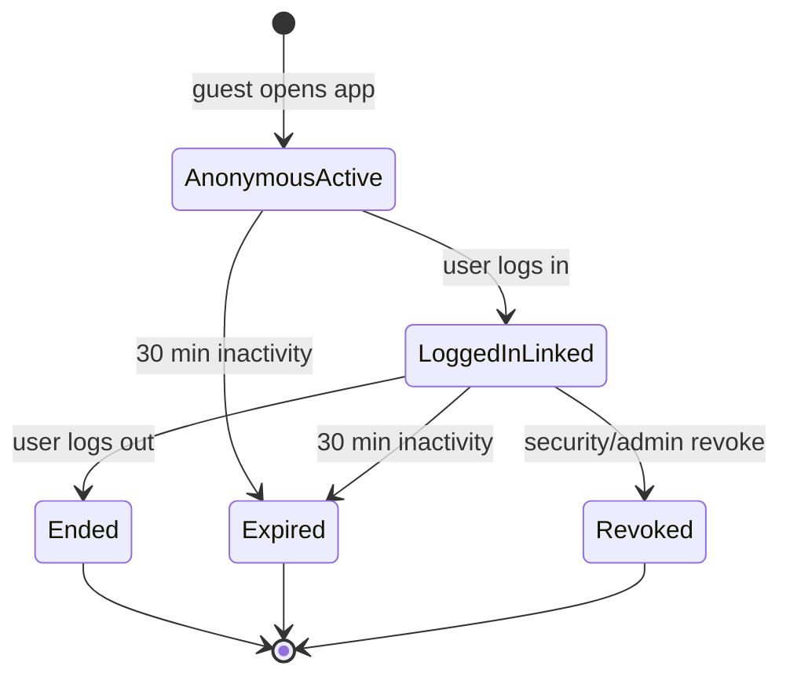
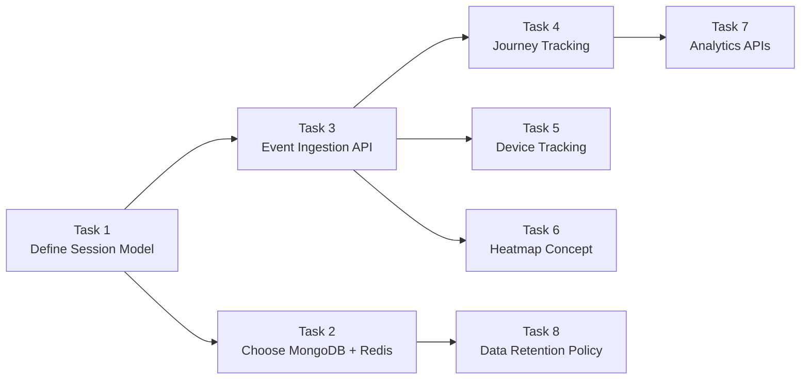

# 🧭 Session Management Service - Task 1: Define Session Model


## 📌 Task Summary

| Field | Detail |
|---|---|
| Task Name | Define session model |
| Source | `docs/01-micro-tasks.md` → `Session Management Service (Independent)` → Task 1 |
| Priority | `P0` foundation/blocker |
| Dependency | Platform foundation |
| Main Goal | Anonymous id, user id, device, IP, user agent, channel, started/ended timestamps define karna |
| Output Type | Structured implementation guide |
| Actual Files Created | `TaskImplementation/Session Management Service/task1.md` |
| Not Included | MongoDB/Redis setup, event ingestion API, analytics APIs, heatmap, journey aggregation, dashboard UI |

> **Simple Hinglish goal:** Is task ka kaam Session Management Service ka base data model define karna hai. Model clear hoga to future tasks me MongoDB collection, Redis active session cache, event ingestion, journey tracking, analytics dashboard, aur privacy controls correctly build ho payenge.

---

## ✅ Final Output Created

```text
TaskImplementation/
└── Session Management Service/
    └── task1.md
```

### Why this structure?

| Path | Purpose |
|---|---|
| `TaskImplementation/` | Project ke task-wise implementation guides ka central folder |
| `TaskImplementation/Session Management Service/` | Session Management Service ke tasks ko group karne ke liye |
| `task1.md` | Sirf **Session Management Service - Task 1** ka guide |

> 🟢 **Important boundary:** Is task me sirf model define kiya gaya hai. Runtime service, API, database migration, Redis key design, analytics worker, ya dashboard implement nahi kiya gaya.

---

## 🧭 Implementation Approach

Guide banate time ye project docs study kiye gaye:

| Document | Kya use kiya gaya |
|---|---|
| `docs/01-micro-tasks.md` | Task 1 ka exact scope identify kiya: session model fields |
| `docs/08-session-management-system.md` | Anonymous ID, Session ID, events, journey, device tracking concepts samjhe |
| `docs/04-microservice-design.md` | Session Service responsibilities, APIs, and collections ka future context samjha |
| `docs/05-database-design.md` | Session Service ka future DB direction: MongoDB + Redis |
| `database/mongodb-schema-design.md` | Future `sessions` and `session_events` document examples align kiye |
| `docs/06-auth-security.md` | Secure session fields: `session_id`, `ip_hash`, `device_fingerprint_hash`, `revoked_at` |
| `docs/02-system-architecture.md` | API Gateway, Auth, Redis, MQ, and Session Service relationship samjha |

---

## 🧱 Task Boundary

### ✅ Included in Task 1

- Session model ke core identifiers define karna
- Anonymous user aur logged-in user ka relation explain karna
- Device, IP privacy, user agent, channel, timestamps define karna
- Session lifecycle states define karna
- Model validation rules define karna
- JSON and Go-style code examples dena
- Markdown-friendly Mermaid diagrams add karna
- Beginner-friendly explanation in Hinglish

### ❌ Not Included in Task 1

| Not Included | Kyun nahi? |
|---|---|
| MongoDB + Redis choose/setup | Ye **Session Management Service - Task 2** ka scope hai |
| `POST /api/v1/sessions/events` | Ye **Task 3: Event ingestion API** ka scope hai |
| Journey tracking | Ye **Task 4** ka scope hai |
| Device parser implementation | Ye **Task 5** ka scope hai |
| Heatmap aggregation | Ye **Task 6** ka scope hai |
| Analytics APIs | Ye **Task 7** ka scope hai |
| Data retention policy | Ye **Task 8** ka scope hai |

---

## 🔤 Core Concepts

Session model samajhne ke liye ye 3 IDs sabse important hain:

| Concept | Meaning | Example | Lifetime |
|---|---|---|---|
| `anonymous_id` | Browser/device pe generated ID before login | `anon_01HX...` | Long-lived, browser storage me persist hota hai |
| `session_id` | Ek visit window ka ID | `sess_01HX...` | Usually 30 min inactivity ke baad naya session |
| `user_id` | Login ke baad actual platform user ID | `user_123` | Account lifetime |

### Simple example

| Scenario | Kya hoga |
|---|---|
| Guest website open karta hai | `anonymous_id` aur `session_id` available honge, `user_id = null` |
| Same guest login karta hai | Same session me `user_id` attach ho jayega |
| User logout karta hai | Session `ended` ya `revoked` ho sakta hai based on reason |
| 30 min inactivity ho jati hai | Old session `expired`, next activity pe new `session_id` |

> 🟡 **Rule:** `anonymous_id` user ko identify nahi karta. Ye sirf browser/device continuity ke liye hai. `user_id` sirf login ke baad set hota hai.

---

## 🧩 Session Model Overview

```mermaid
flowchart TB
    Session[Session Model]

    Session --> Identity[Identity Fields]
    Session --> Device[Device Context]
    Session --> Privacy[Network and Privacy]
    Session --> Channel[Channel and Entry Context]
    Session --> Lifecycle[Lifecycle and Timestamps]
    Session --> Security[Security Metadata]

    Identity --> SID[session_id]
    Identity --> AID[anonymous_id]
    Identity --> UID[user_id nullable]

    Device --> UA[user_agent]
    Device --> DT[device.type]
    Device --> BR[device.browser]
    Device --> OS[device.os]

    Privacy --> IPH[ip_hash]
    Privacy --> GEO[geo optional]

    Channel --> CH[channel]
    Channel --> EP[entry_page]
    Channel --> RF[referrer and utm]

    Lifecycle --> ST[status]
    Lifecycle --> SA[started_at]
    Lifecycle --> LS[last_seen_at]
    Lifecycle --> EA[ended_at nullable]

    Security --> DFH[device_fingerprint_hash optional]
    Security --> RV[revoked_at nullable]
```



**Hinglish explanation:**  
Session model ek central document/entity hai jo batata hai ki ek visitor ka visit kab start hua, kaunse device/channel se aaya, login hua ya nahi, aur session kab end hua. Events, journey, analytics, heatmap ye sab future tasks me isi model ke `session_id` ko reference karenge.

---

## 🧾 Final Session Fields

### 1. Identity fields

| Field | Type | Required | Description |
|---|---:|---:|---|
| `session_id` | string | ✅ Yes | Unique session identifier |
| `anonymous_id` | string | ✅ Yes | Browser/device anonymous identifier |
| `user_id` | string/null | ❌ No | Logged-in user ID, guest session me null |
| `schema_version` | integer | ✅ Yes | Model version, starting with `1` |

**Why needed?**  
Identity fields session ko uniquely track karte hain. `anonymous_id` pre-login journey preserve karta hai. `user_id` login ke baad same activity ko real account se link karta hai.

---

### 2. Device fields

| Field | Type | Required | Description |
|---|---:|---:|---|
| `user_agent` | string | ✅ Yes | Browser/app ka raw user-agent string |
| `device.type` | enum | ✅ Yes | `desktop`, `mobile`, `tablet`, `bot`, `unknown` |
| `device.browser` | string | ❌ No | Browser name, for example `Chrome` |
| `device.browser_version` | string | ❌ No | Browser version |
| `device.os` | string | ❌ No | Operating system, for example `Android` |
| `device.os_version` | string | ❌ No | OS version |
| `device.model` | string | ❌ No | Mobile/device model if available |

**Why needed?**  
Device fields analytics and fraud detection dono me help karte hain. Example: agar checkout failures mostly mobile Safari par aa rahe hain, dashboard se quickly detect ho sakta hai.

> 🟡 **Task 1 boundary:** Device fields define hue hain. Actual user-agent parsing implementation Task 5 me aayega.

---

### 3. Network and privacy fields

| Field | Type | Required | Description |
|---|---:|---:|---|
| `ip_hash` | string | ✅ Yes | Raw IP ka hash, raw IP store nahi karna |
| `ip_version` | enum | ❌ No | `ipv4`, `ipv6`, `unknown` |
| `geo.country` | string/null | ❌ No | Approx country, for example `IN` |
| `geo.region` | string/null | ❌ No | Approx state/region |
| `geo.city` | string/null | ❌ No | Approx city |

**Why needed?**  
IP useful hota hai rate limiting, suspicious activity, geo analytics, aur fraud signal ke liye. Lekin privacy ke liye raw IP avoid karna chahiye. Isliye model me `ip_hash` use hoga.

```text
Raw IP:      203.0.113.10
Stored data: sha256(secret_salt + "203.0.113.10")
```

> 🔴 **Privacy rule:** Password, OTP, card number, private input values, ya raw sensitive identifiers session model me store nahi honge.

---

### 4. Channel and acquisition fields

| Field | Type | Required | Description |
|---|---:|---:|---|
| `channel` | enum | ✅ Yes | Traffic source app/surface |
| `entry_page` | string | ✅ Yes | Session ki first page path |
| `exit_page` | string/null | ❌ No | Session close/expire hone par last known path |
| `referrer` | string/null | ❌ No | Previous site/page |
| `utm.source` | string/null | ❌ No | Campaign source |
| `utm.medium` | string/null | ❌ No | Campaign medium |
| `utm.campaign` | string/null | ❌ No | Campaign name |
| `utm.term` | string/null | ❌ No | Paid search term |
| `utm.content` | string/null | ❌ No | Campaign content variant |

### Allowed `channel` values

| Value | Use case |
|---|---|
| `user_app_web` | Customer-facing web app |
| `seller_dashboard_web` | Seller CMS dashboard |
| `superadmin_panel_web` | Superadmin panel |
| `session_analytics_dashboard_web` | Analytics dashboard usage |
| `mobile_web` | Mobile browser |
| `android_app` | Android app |
| `ios_app` | iOS app |
| `unknown` | Channel detect nahi hua |

**Why needed?**  
Channel and UTM fields se pata chalta hai user kaha se aaya. Later funnel reports me campaign-wise conversion calculate karna easy hoga.

---

### 5. Lifecycle and timestamp fields

| Field | Type | Required | Description |
|---|---:|---:|---|
| `status` | enum | ✅ Yes | Current session state |
| `started_at` | datetime | ✅ Yes | Session start time |
| `last_seen_at` | datetime | ✅ Yes | Last activity time |
| `ended_at` | datetime/null | ❌ No | Normal session end time |
| `revoked_at` | datetime/null | ❌ No | Security/logout revocation time |
| `end_reason` | enum/null | ❌ No | Session end ka reason |

### Allowed `status` values

| Status | Meaning |
|---|---|
| `active` | Session currently active hai |
| `ended` | Session normally end ho gaya |
| `expired` | Inactivity timeout ke baad closed |
| `revoked` | Security/logout/admin action ke reason se closed |

### Allowed `end_reason` values

| Reason | Meaning |
|---|---|
| `logout` | User ne logout kiya |
| `inactivity_timeout` | 30 min inactivity |
| `session_replaced` | New session ne old active session replace kiya |
| `security_revoke` | Suspicious activity/token reuse |
| `admin_revoke` | Admin ne session revoke kiya |
| `unknown` | Clear reason available nahi |

**Validation rule:**  
`ended_at`, `revoked_at`, and `last_seen_at` kabhi bhi `started_at` se pehle nahi hone chahiye.

---

### 6. Security metadata fields

| Field | Type | Required | Description |
|---|---:|---:|---|
| `device_fingerprint_hash` | string/null | ❌ No | Device fingerprint ka privacy-safe hash |
| `auth_session_id` | string/null | ❌ No | Auth Service token/session family reference |
| `risk_level` | enum | ✅ Yes | `low`, `medium`, `high`, `unknown` |
| `risk_reasons` | string[] | ❌ No | Suspicious signals list |

**Why needed?**  
Auth Service logout, refresh token reuse, ya suspicious activity detect kare to Session Service session ko mark/revoke kar sake. Isse fraud debugging and superadmin visibility better hoti hai.

> 🟡 **Task 1 boundary:** Security fields define hue hain. Auth integration later Auth Service session-link task me implement hogi.

---

## 🧬 Complete JSON Model Example

```json
{
  "session_id": "sess_01HX9ZK6N5M2V4B7S8T9Q0R1P2",
  "anonymous_id": "anon_01HX9ZJY35F7K2M4N6P8R0T1V2",
  "user_id": "user_123",
  "schema_version": 1,
  "status": "active",
  "channel": "user_app_web",
  "entry_page": "/",
  "exit_page": null,
  "referrer": "https://www.google.com/",
  "utm": {
    "source": "google",
    "medium": "cpc",
    "campaign": "summer-sale",
    "term": "running shoes",
    "content": "ad-a"
  },
  "user_agent": "Mozilla/5.0 (X11; Linux x86_64) AppleWebKit/537.36 Chrome/125.0 Safari/537.36",
  "device": {
    "type": "desktop",
    "browser": "Chrome",
    "browser_version": "125.0",
    "os": "Linux",
    "os_version": null,
    "model": null
  },
  "ip_hash": "sha256:example_hash_value",
  "ip_version": "ipv4",
  "geo": {
    "country": "IN",
    "region": "DL",
    "city": "Delhi"
  },
  "device_fingerprint_hash": "sha256:example_device_hash",
  "auth_session_id": "authsess_123",
  "risk_level": "low",
  "risk_reasons": [],
  "started_at": "2026-05-22T10:00:00Z",
  "last_seen_at": "2026-05-22T10:12:30Z",
  "ended_at": null,
  "revoked_at": null,
  "end_reason": null,
  "created_at": "2026-05-22T10:00:00Z",
  "updated_at": "2026-05-22T10:12:30Z"
}
```

### Field explanation in simple words

| Field group | Explanation |
|---|---|
| Identity | Session kis visitor/user se related hai |
| Device | Visitor ka browser/device context kya hai |
| Privacy | Raw IP ke badle hash store hota hai |
| Channel | User app, seller dashboard, mobile app, etc. |
| Lifecycle | Session kab start hua, last active kab tha, end hua ya nahi |
| Security | Risk/revocation metadata for fraud/security workflows |

---

## 🧑‍💻 Go Domain Model Example

> Ye code example sirf guide ke liye hai. Is task me actual Go file create nahi ki gayi.

```go
package domain

import "time"

type SessionStatus string

const (
	SessionStatusActive  SessionStatus = "active"
	SessionStatusEnded   SessionStatus = "ended"
	SessionStatusExpired SessionStatus = "expired"
	SessionStatusRevoked SessionStatus = "revoked"
)

type Session struct {
	SessionID             string        `json:"session_id"`
	AnonymousID          string        `json:"anonymous_id"`
	UserID               *string       `json:"user_id,omitempty"`
	SchemaVersion        int           `json:"schema_version"`
	Status               SessionStatus `json:"status"`
	Channel              string        `json:"channel"`
	EntryPage            string        `json:"entry_page"`
	ExitPage             *string       `json:"exit_page,omitempty"`
	Referrer             *string       `json:"referrer,omitempty"`
	UTM                  UTM           `json:"utm"`
	UserAgent            string        `json:"user_agent"`
	Device               Device        `json:"device"`
	IPHash               string        `json:"ip_hash"`
	IPVersion            string        `json:"ip_version"`
	Geo                  Geo           `json:"geo"`
	DeviceFingerprintHash *string      `json:"device_fingerprint_hash,omitempty"`
	AuthSessionID        *string       `json:"auth_session_id,omitempty"`
	RiskLevel            string        `json:"risk_level"`
	RiskReasons          []string      `json:"risk_reasons"`
	StartedAt            time.Time     `json:"started_at"`
	LastSeenAt            time.Time     `json:"last_seen_at"`
	EndedAt              *time.Time    `json:"ended_at,omitempty"`
	RevokedAt            *time.Time    `json:"revoked_at,omitempty"`
	EndReason            *string       `json:"end_reason,omitempty"`
	CreatedAt            time.Time     `json:"created_at"`
	UpdatedAt            time.Time     `json:"updated_at"`
}

type Device struct {
	Type           string  `json:"type"`
	Browser        *string `json:"browser,omitempty"`
	BrowserVersion *string `json:"browser_version,omitempty"`
	OS             *string `json:"os,omitempty"`
	OSVersion      *string `json:"os_version,omitempty"`
	Model          *string `json:"model,omitempty"`
}

type Geo struct {
	Country *string `json:"country,omitempty"`
	Region  *string `json:"region,omitempty"`
	City    *string `json:"city,omitempty"`
}

type UTM struct {
	Source   *string `json:"source,omitempty"`
	Medium   *string `json:"medium,omitempty"`
	Campaign *string `json:"campaign,omitempty"`
	Term     *string `json:"term,omitempty"`
	Content  *string `json:"content,omitempty"`
}
```

### Why pointer fields?

Go me `*string` ya `*time.Time` use karne ka reason ye hai ki optional value clearly represent ho:

- `user_id = nil` means guest session
- `ended_at = nil` means session abhi active ho sakta hai
- `exit_page = nil` means exit page abhi known nahi hai

---

## ✅ Validation Rules

### Required field validation

| Rule | Example |
|---|---|
| `session_id` empty nahi hona chahiye | ✅ `sess_01HX...` |
| `anonymous_id` empty nahi hona chahiye | ✅ `anon_01HX...` |
| `schema_version` must be `1` for current model | ✅ `1` |
| `status` allowed enum me hona chahiye | ✅ `active` |
| `channel` allowed enum me hona chahiye | ✅ `user_app_web` |
| `entry_page` valid path hona chahiye | ✅ `/products/prod_123` |
| `started_at` and `last_seen_at` required hain | ✅ RFC3339/UTC datetime |
| `ip_hash` present hona chahiye | ✅ `sha256:...` |

### Timestamp validation

```text
started_at <= last_seen_at
started_at <= ended_at      when ended_at is present
started_at <= revoked_at    when revoked_at is present
```

### Status validation

| Status | Required timestamp behavior |
|---|---|
| `active` | `ended_at = null`, `revoked_at = null` |
| `ended` | `ended_at` should be present |
| `expired` | `ended_at` should be present, `end_reason = inactivity_timeout` |
| `revoked` | `revoked_at` should be present |

---

## 🔁 Session Lifecycle



### Step-by-step lifecycle in Hinglish

1. **Guest visit start:** Frontend ek `anonymous_id` aur `session_id` use karta hai.
2. **Session create/update:** Session model me `status = active`, `started_at`, and `last_seen_at` set hote hain.
3. **User login:** Same session ke andar `user_id` attach ho jata hai.
4. **Activity continue:** Har future event `last_seen_at` update kar sakta hai.
5. **End/expire/revoke:** Logout, inactivity, ya security signal ke basis par session close hota hai.

> 🟢 **Default inactivity rule:** 30 minutes inactivity ke baad new session start ho sakta hai. Actual timeout config future implementation me environment/config se aayega.

---

## 🔗 Model Relationship With Future Tasks



### Why Task 1 is foundation?

| Future Task | Task 1 se kya dependency hai |
|---|---|
| Task 2 | DB collection fields isi model se banenge |
| Task 3 | Event ingestion payload me `session_id`, `anonymous_id`, `user_id` use honge |
| Task 4 | Journey timeline `session_id` ke around build hogi |
| Task 5 | Device parsing model ke `device` fields fill karega |
| Task 6 | Heatmap points session/channel/device context use karenge |
| Task 7 | Analytics APIs session status, channel, device, timestamps aggregate karenge |
| Task 8 | Retention policy raw sessions/events par apply hogi |

---

## 🗂️ Clean Folder Structure

### Actual structure created in this task

```text
TaskImplementation/
└── Session Management Service/
    └── task1.md
```

### Future service structure reference only

> Ye future implementation reference hai. Is task me ye files create nahi ki gayi.

```text
backend/
└── services/
    └── session-service/
        ├── cmd/
        │   └── server/
        │       └── main.go
        ├── internal/
        │   ├── domain/
        │   │   └── session.go
        │   ├── usecase/
        │   │   └── define_session.go
        │   ├── repository/
        │   │   ├── mongo_session_repository.go
        │   │   └── redis_active_session_repository.go
        │   ├── transport/
        │   │   └── grpc/
        │   ├── events/
        │   └── config/
        └── deploy/
```

---

## 🧰 External Libraries and Tools Used

### Tools actually used in this documentation task

| Tool | What it is | Why used | Install/Use |
|---|---|---|---|
| Markdown | Documentation format | Beginner-friendly guide likhne ke liye | GitHub/GitLab/VS Code me directly open hota hai |
| Mermaid | Markdown-friendly diagram syntax | Architecture/lifecycle flow diagrams ke liye | GitHub supports Mermaid. VS Code me "Markdown Preview Mermaid Support" extension optional hai |
| Shields.io badges | Badge image service | Status, priority, dependency ko visual banane ke liye | Markdown image URL use hota hai, local install nahi chahiye |

### Runtime libraries used?

| Library | Used in Task 1? | Reason |
|---|---:|---|
| MongoDB driver | ❌ No | DB implementation Task 2 ke baad aayega |
| Redis client | ❌ No | Active session cache Task 2 ke baad aayega |
| User-agent parser | ❌ No | Device parsing Task 5 ka scope hai |
| Kafka/RabbitMQ client | ❌ No | Event publish/consume future tasks ka scope hai |

> 🟢 **Conclusion:** Task 1 me koi external runtime library install nahi ki gayi. Sirf documentation and model definition create hua.

---

## 🧪 Beginner-Friendly Test Checklist

Ye checklist future implementation ke time confirm karegi ki model correct bana hai:

| Check | Expected |
|---|---|
| Guest session create hota hai | `anonymous_id` present, `user_id = null` |
| Login ke baad same session link hota hai | `user_id` set ho jata hai |
| Active session valid hai | `status = active`, `ended_at = null`, `revoked_at = null` |
| Logout session close karta hai | `status = ended`, `end_reason = logout` |
| Inactivity expire karta hai | `status = expired`, `end_reason = inactivity_timeout` |
| Security revoke supported hai | `status = revoked`, `revoked_at` present |
| Raw IP store nahi hota | Sirf `ip_hash` stored |
| Timestamp order valid hai | `started_at <= last_seen_at <= ended_at` where applicable |

---

## 🚫 Common Mistakes Avoid Karne Hain

| Mistake | Correct approach |
|---|---|
| `anonymous_id` ko `user_id` samajhna | Anonymous ID browser/device continuity ke liye hai, account identity ke liye nahi |
| Raw IP store karna | Hash store karo: `ip_hash` |
| Session aur event ko same document banana | Session model separate rakho, events future `session_events` me jayenge |
| Har page view pe new session banana | Inactivity timeout ke andar same session continue karo |
| Login ke baad old anonymous data lose karna | Same session me `user_id` link karo |
| Analytics ke liye password/card/OTP fields capture karna | Sensitive fields kabhi capture/store nahi karne |

---

## ✅ Definition of Done

Task 1 complete tab maana jayega jab:

- `TaskImplementation/Session Management Service/task1.md` created ho
- Session model ke required fields documented hon
- Anonymous vs logged-in behavior clear ho
- Device, IP hash, user agent, channel, timestamps documented hon
- Lifecycle states and validation rules defined hon
- Code examples and Mermaid diagrams included hon
- External tools/libraries ka clear mention ho
- Scope Task 1 tak limited ho

---

## 🧾 Final Notes

Session Management Service ka model deliberately privacy-aware design kiya gaya hai:

- Raw IP avoid
- Optional user linking
- Clear lifecycle status
- Security revoke support
- Future analytics/event tracking ke liye stable identifiers

> **Final Hinglish summary:** Pehle model strong banao, phir storage/API/analytics build karo. Agar model vague hoga to later journey tracking, heatmap, funnel reports, aur fraud analysis messy ho jayenge. Isliye Task 1 me sirf domain shape ko clean and stable define kiya gaya hai.
