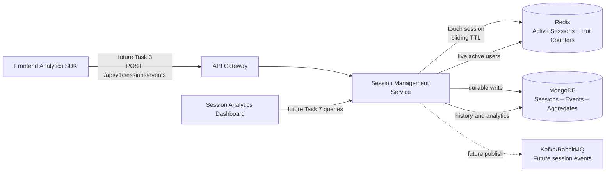
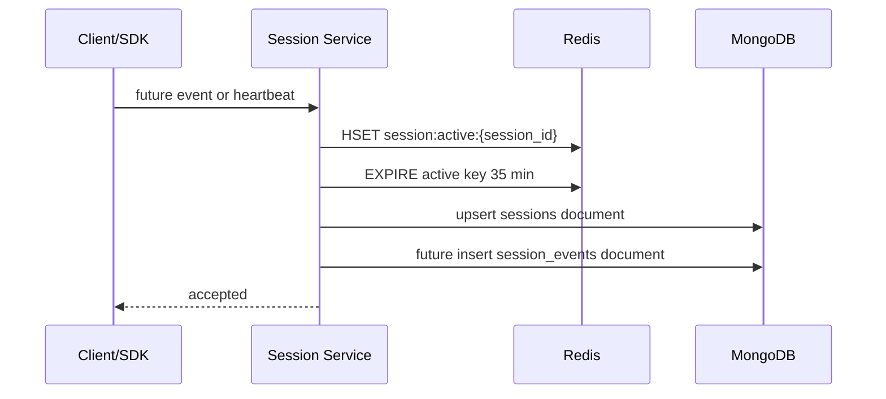
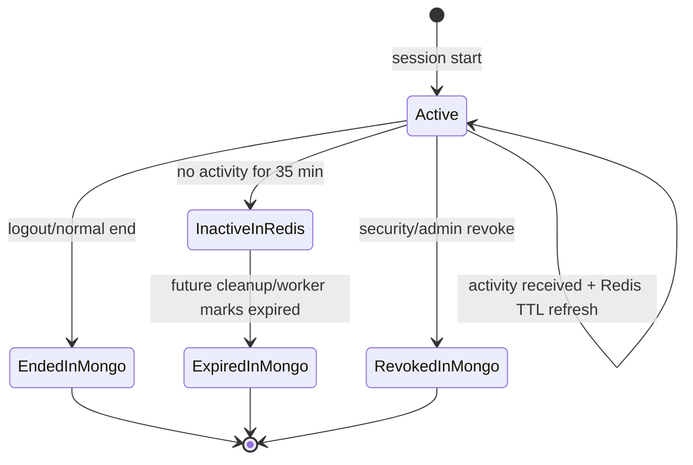
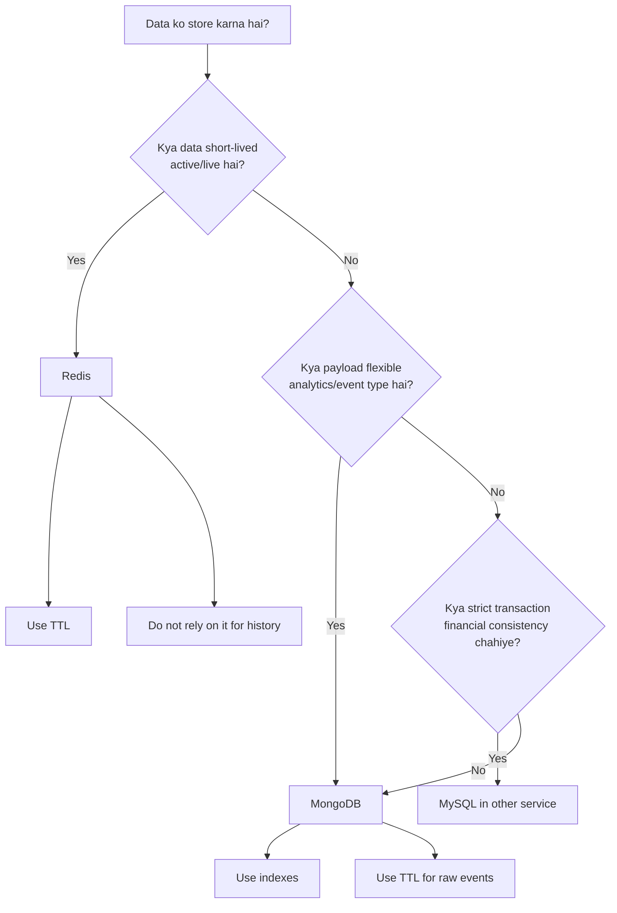

# 🧠 Session Management Service - Task 2: Choose MongoDB plus Redis


## 📌 Task Summary

| Field | Detail |
|---|---|
| Task Name | Choose MongoDB plus Redis |
| Source | `docs/01-micro-tasks.md` → `Session Management Service (Independent)` → Task 2 |
| Priority | `P0` foundation/blocker |
| Dependency | Session model |
| Main Goal | Events high-volume flexible hote hain. MongoDB durable event/session store ke liye, Redis active sessions ke liye choose karna |
| Output Type | Structured implementation guide |
| Actual Files Created | `TaskImplementation/Session Management Service/task2.md` |
| Not Included | Event ingestion API, journey tracking implementation, device parser, heatmap aggregation, analytics APIs, production provisioning |

> **Simple Hinglish goal:** Is task ka kaam Session Management Service ke liye storage decision clear karna hai: **MongoDB** long-term/flexible session data ke liye aur **Redis** fast active-session lookup ke liye. Ye guide future implementation ko predictable banata hai, but is task me runtime backend code create nahi kiya gaya.

---

## ✅ Final Output Created

```text
TaskImplementation/
└── Session Management Service/
    ├── task1.md
    └── task2.md
```

### Why this structure?

| Path | Purpose |
|---|---|
| `TaskImplementation/` | Project ke task-wise implementation guides ka central folder |
| `TaskImplementation/Session Management Service/` | Session Management Service ke tasks ko group karne ke liye |
| `task2.md` | Sirf **Session Management Service - Task 2** ka guide |

> 🟢 **Important boundary:** Is task me sirf storage choice, collection/key strategy, indexes, and future setup commands document kiye gaye hain. `backend/services/session-service/` me koi runtime implementation create nahi ki gayi.

---

## 🧭 Implementation Approach

Guide banate time ye project docs study kiye gaye:

| Document | Kya use kiya gaya |
|---|---|
| `docs/01-micro-tasks.md` | Task 2 ka exact scope identify kiya: MongoDB plus Redis choose karna |
| `TaskImplementation/Session Management Service/task1.md` | Task 1 session model fields ko storage strategy se align kiya |
| `docs/08-session-management-system.md` | Event ingestion, active session, journey, analytics, heatmap concepts samjhe |
| `docs/04-microservice-design.md` | Session Service responsibilities and collection list confirm ki |
| `docs/05-database-design.md` | Database strategy confirm ki: Session = MongoDB + Redis |
| `database/mongodb-schema-design.md` | `sessions`, `session_events`, indexes, TTL direction align ki |
| `docs/06-auth-security.md` | Secure session fields and privacy rules include kiye |
| `docs/11-devops-external-services.md` | Redis use cases and queue topic context samjha |
| `docs/12-logging-monitoring-scalability.md` | Failure mode: Session Service down ho to app still works |

---

## 🧱 Task Boundary

### ✅ Included in Task 2

- MongoDB + Redis storage decision explain karna
- MongoDB database and collection strategy define karna
- Redis active session key strategy define karna
- Indexing and TTL direction document karna
- Future Go libraries/tools mention karna
- Install/use commands document karna
- Storage flow diagrams add karna
- Beginner-friendly Hinglish explanation dena

### ❌ Not Included in Task 2

| Not Included | Kyun nahi? |
|---|---|
| `POST /api/v1/sessions/events` implementation | Ye **Task 3: Event ingestion API** ka scope hai |
| Journey timeline generation | Ye **Task 4: Journey tracking** ka scope hai |
| User-agent/device parser | Ye **Task 5: Device tracking** ka scope hai |
| Heatmap coordinate aggregation | Ye **Task 6: Heatmap concept** ka scope hai |
| Analytics dashboard APIs | Ye **Task 7: Analytics APIs** ka scope hai |
| Final data retention policy | Ye **Task 8: Data retention policy** ka scope hai |
| Docker Compose/Kubernetes infra changes | Platform/DevOps tasks me handle hoga |

---

## 🏗️ High-Level Storage Decision

Session Management Service ka data 2 tarah ka hai:

| Data Type | Nature | Best Store | Reason |
|---|---|---|---|
| Session metadata | Durable, queryable, user/admin analytics me use hoga | MongoDB | Flexible document model, indexes, TTL support |
| Raw session events | High-volume, event type ke hisaab se flexible payload | MongoDB | Schemaless properties, append-heavy writes, TTL cleanup |
| Active sessions | Fast lookup, frequently updated, short-lived | Redis | In-memory speed, key expiry, sliding TTL |
| Live counters | Hot data, dashboard me quick numbers | Redis first, Mongo aggregate later | Low latency reads |
| Journey summaries | Derived/aggregated durable data | MongoDB | Dashboard queries ke liye stable document |
| Heatmap aggregates | Route/device/date wise aggregated data | MongoDB | Flexible buckets and analytics queries |

> 🟣 **Decision:** MongoDB source-of-truth hoga for durable session/event analytics data. Redis source-of-speed hoga for currently active sessions. Redis ko durable database treat nahi karna.

---

## 🧩 Architecture Diagram



**Hinglish explanation:**  
Frontend future me event bhejega. Session Service Redis me active session update karega taaki live users quickly mil sakein. Same time MongoDB me durable session/event data store hoga taaki history, analytics, journey, and heatmap reports ban sakein.

---

## 🟢 Why MongoDB?

MongoDB Session Service ke liye fit hai because session events flexible hote hain. `page_view`, `click`, `scroll`, `search`, `product_view`, `add_to_cart` sabka payload same shape ka nahi hota.

### MongoDB ke benefits

| Benefit | Session Service me use |
|---|---|
| Flexible documents | Har event type apni `properties` object store kar sakta hai |
| Append-heavy writes | Raw events high volume me insert ho sakte hain |
| Index support | `session_id`, `user_id`, `anonymous_id`, `occurred_at` queries fast hongi |
| TTL indexes | Raw events old hone par auto cleanup ho sakta hai |
| Aggregation support | Funnels, device reports, source reports future me build ho sakte hain |
| Separate collections | Sessions aur events ko separate rakhkar unbounded array problem avoid hoti hai |

### Why not MySQL for raw session events?

| Concern | MySQL issue | MongoDB advantage |
|---|---|---|
| Event payloads vary | Har new event type pe columns/JSON handling messy ho sakta hai | `properties` flexible document rahega |
| Very high write volume | Relational constraints unnecessary overhead ban sakte hain | Append-like event documents natural fit hain |
| Analytics shape evolves | Schema migrations zyada frequent hongi | Document schema versioning easier hai |

> 🟡 **Rule:** Session events ko `sessions` document ke andar array me embed nahi karna. High-volume events unbounded array bana denge. Isliye `session_events` separate collection hogi.

---

## 🔴 Why Redis?

Redis active sessions ke liye fit hai because active session data fast read/update hota hai and short-lived hota hai.

### Redis ke benefits

| Benefit | Session Service me use |
|---|---|
| In-memory speed | Live active users/dashboard fast respond karega |
| TTL/expiry | Inactivity ke baad active session auto expire ho sakta hai |
| Hash data type | Session ka compact active snapshot store ho sakta hai |
| Sets | User/anonymous ID ke active session IDs track ho sakte hain |
| Counters | Live metrics and recent event counters fast maintain ho sakte hain |

### Redis me kya store hoga?

Redis me sirf hot/temporary data store hoga:

- Active session snapshot
- Last seen timestamp
- User → active sessions mapping
- Anonymous ID → active sessions mapping
- Short-lived live counters

### Redis me kya store nahi hoga?

- Complete raw event history
- Permanent journey timeline
- Long-term analytics reports
- Compliance/audit source of truth

> 🔴 **Important:** Redis key expire hone ka matlab data loss nahi hona chahiye. Durable data MongoDB me already stored hona chahiye.

---

## 🗃️ MongoDB Database Design

### Database name

```text
session_db
```

### Collections

| Collection | Purpose | Task 2 Status |
|---|---|---|
| `sessions` | One document per session, metadata and lifecycle | Strategy defined |
| `session_events` | One document per tracked event | Strategy defined |
| `journey_summaries` | Derived journey summary per session | Reserved for Task 4 |
| `heatmap_points` | Aggregated click/scroll points | Reserved for Task 6 |
| `analytics_aggregates` | Precomputed metrics for dashboard | Reserved for Task 7 |

---

## 📄 Collection 1: `sessions`

`sessions` collection ek visit window ka durable summary store karegi. Ye Task 1 session model se directly aligned hai.

### Example document

```json
{
  "_id": "sess_01HX9ZK6N5M2V4B7S8T9Q0R1P2",
  "session_id": "sess_01HX9ZK6N5M2V4B7S8T9Q0R1P2",
  "anonymous_id": "anon_01HX9ZG9GY7V2XJ7E6BNP3K0CA",
  "user_id": "user_123",
  "schema_version": 1,
  "status": "active",
  "entry_page": "/",
  "exit_page": null,
  "channel": "user_app_web",
  "referrer": "https://example.com",
  "utm": {
    "source": "google",
    "medium": "cpc",
    "campaign": "summer_sale"
  },
  "device": {
    "type": "mobile",
    "browser": "Chrome",
    "os": "Android"
  },
  "ip_hash": "sha256_salted_hash_here",
  "geo": {
    "country": "IN",
    "city": "Delhi"
  },
  "started_at": "2026-05-22T07:00:00Z",
  "last_seen_at": "2026-05-22T07:20:00Z",
  "ended_at": null,
  "revoked_at": null,
  "end_reason": null
}
```

### Recommended indexes

```javascript
use session_db

db.sessions.createIndex(
  { session_id: 1 },
  { unique: true, name: "uniq_session_id" }
)

db.sessions.createIndex(
  { anonymous_id: 1, started_at: -1 },
  { name: "idx_anonymous_sessions" }
)

db.sessions.createIndex(
  { user_id: 1, started_at: -1 },
  {
    name: "idx_user_sessions",
    partialFilterExpression: { user_id: { $type: "string" } }
  }
)

db.sessions.createIndex(
  { status: 1, last_seen_at: -1 },
  { name: "idx_status_last_seen" }
)
```

### Why these indexes?

| Index | Use case |
|---|---|
| `session_id` unique | Ek session ko direct fetch/update karna |
| `anonymous_id + started_at` | Guest journey history dekhna |
| `user_id + started_at` | Logged-in user ke sessions list karna |
| `status + last_seen_at` | Active/stale sessions identify karna |

---

## 📄 Collection 2: `session_events`

`session_events` raw analytics events store karegi. Har event alag document hoga.

### Example document

```json
{
  "_id": "evt_01HX9ZPHVZV7M8B8QX5Y6Z1K2A",
  "session_id": "sess_01HX9ZK6N5M2V4B7S8T9Q0R1P2",
  "anonymous_id": "anon_01HX9ZG9GY7V2XJ7E6BNP3K0CA",
  "user_id": "user_123",
  "event_type": "click",
  "path": "/products/prod_123",
  "properties": {
    "element_id": "add-to-cart",
    "x": 42.5,
    "y": 71.2,
    "viewport_width": 390,
    "viewport_height": 844
  },
  "occurred_at": "2026-05-22T07:10:00Z",
  "received_at": "2026-05-22T07:10:01Z",
  "schema_version": 1
}
```

### Recommended indexes

```javascript
use session_db

db.session_events.createIndex(
  { session_id: 1, occurred_at: 1 },
  { name: "idx_session_timeline" }
)

db.session_events.createIndex(
  { user_id: 1, occurred_at: -1 },
  {
    name: "idx_user_event_history",
    partialFilterExpression: { user_id: { $type: "string" } }
  }
)

db.session_events.createIndex(
  { event_type: 1, occurred_at: -1 },
  { name: "idx_event_type_time" }
)

db.session_events.createIndex(
  { occurred_at: 1 },
  {
    name: "ttl_raw_events_90_days",
    expireAfterSeconds: 7776000
  }
)
```

### TTL note

`7776000` seconds = 90 days. Ye value final nahi hai. Task 8 me final retention policy define hogi.

> 🟡 **MongoDB TTL rule:** TTL index single date field par hota hai. Compound TTL index use nahi hota. Isliye raw events ke cleanup ke liye `{ occurred_at: 1 }` single-field TTL index recommended hai.

---

## 📄 Future Collections Reserved

Task 2 me in collections ka runtime implementation nahi hoga, but storage strategy clear rakhna useful hai.

| Collection | Future Task | Purpose |
|---|---|---|
| `journey_summaries` | Task 4 | Session timeline ka compact summary |
| `heatmap_points` | Task 6 | Click/scroll aggregate buckets |
| `analytics_aggregates` | Task 7 | Active users, funnels, retention, device/source metrics |

### Future index examples

```javascript
db.journey_summaries.createIndex(
  { session_id: 1 },
  { unique: true, name: "uniq_journey_session" }
)

db.heatmap_points.createIndex(
  { path: 1, device_type: 1, day: 1 },
  { name: "idx_heatmap_route_device_day" }
)

db.analytics_aggregates.createIndex(
  { metric: 1, bucket: 1, segment: 1 },
  { unique: true, name: "uniq_metric_bucket_segment" }
)
```

> 🟣 **Boundary:** Ye indexes future-ready examples hain. Task 2 me actual DB migration/script create nahi ki gayi.

---

## ⚡ Redis Active Session Design

Redis ka role hai active sessions ko fast track karna. Jab bhi event/heartbeat aaye, Redis key update hogi and TTL refresh hoga.

### Active session TTL

| Setting | Recommended value | Meaning |
|---|---:|---|
| Inactivity timeout | 30 minutes | Itni der activity nahi to session inactive maana ja sakta hai |
| Redis TTL | 35 minutes | 30 min timeout + 5 min grace |
| Counter TTL | 24-48 hours | Live/recent metrics ke liye short window |

> 🟢 **Sliding TTL:** Har valid activity par same Redis key ka TTL refresh hoga.

### Redis key pattern

| Key | Type | Example | Purpose |
|---|---|---|---|
| `session:active:{session_id}` | Hash | `session:active:sess_123` | Active session snapshot |
| `session:user:{user_id}` | Set | `session:user:user_123` | User ke active session IDs |
| `session:anon:{anonymous_id}` | Set | `session:anon:anon_123` | Anonymous visitor ke active session IDs |
| `session:last_seen:{session_id}` | String | `session:last_seen:sess_123` | Last heartbeat timestamp |
| `session:counter:active:{bucket}` | String counter | `session:counter:active:2026052207` | Time-bucketed live activity counter |

### Active session hash fields

```text
session:active:sess_123
├── session_id = sess_123
├── anonymous_id = anon_123
├── user_id = user_123
├── status = active
├── entry_page = /
├── current_page = /products/prod_123
├── device_type = mobile
├── channel = user_app_web
├── ip_hash = sha256_salted_hash_here
├── started_at = 2026-05-22T07:00:00Z
└── last_seen_at = 2026-05-22T07:20:00Z
```

### Redis write example

```redis
HSET session:active:sess_123 session_id sess_123 anonymous_id anon_123 status active last_seen_at 2026-05-22T07:20:00Z
EXPIRE session:active:sess_123 2100
SADD session:user:user_123 sess_123
EXPIRE session:user:user_123 2100
```

`2100` seconds = 35 minutes.

---

## 🔁 Storage Flow



**Hinglish explanation:**  
Active session fast Redis me update hota hai. MongoDB me durable record upsert hota hai. Future Task 3 me actual event ingestion API banega jo event document insert karega.

---

## ⏳ Expiry Flow



> 🟡 **Important:** Redis expiry alone session lifecycle final nahi karega. Future cleanup worker MongoDB me `status = expired` mark karega.

---

## 🧪 Repository Boundary Design

Future Go code me repository interfaces storage implementation ko business logic se separate rakhenge.

```go
package session

import (
	"context"
	"time"
)

type SessionRepository interface {
	UpsertSession(ctx context.Context, session Session) error
	FindSessionByID(ctx context.Context, sessionID string) (*Session, error)
	ListUserSessions(ctx context.Context, userID string, limit int) ([]Session, error)
	MarkEnded(ctx context.Context, sessionID string, endedAt time.Time, reason string) error
}

type EventRepository interface {
	InsertEvent(ctx context.Context, event SessionEvent) error
	ListEventsBySession(ctx context.Context, sessionID string, limit int) ([]SessionEvent, error)
}

type ActiveSessionStore interface {
	Touch(ctx context.Context, snapshot ActiveSessionSnapshot, ttl time.Duration) error
	Get(ctx context.Context, sessionID string) (*ActiveSessionSnapshot, error)
	Delete(ctx context.Context, sessionID string) error
	ListByUser(ctx context.Context, userID string) ([]string, error)
}
```

### Why interfaces?

| Interface | Backing store | Reason |
|---|---|---|
| `SessionRepository` | MongoDB | Durable session metadata |
| `EventRepository` | MongoDB | Raw event writes and timeline reads |
| `ActiveSessionStore` | Redis | Fast active session reads/writes |

> 🟢 **Beginner note:** Business logic ko ye pata nahi hona chahiye ki data MongoDB me hai ya Redis me. Isse testing and future replacement easy hota hai.

---

## ⚙️ Config Plan

Future runtime service me config environment variables se aayega.

### Environment variables

```env
SESSION_MONGO_URI=mongodb://localhost:27017
SESSION_MONGO_DATABASE=session_db
SESSION_REDIS_ADDR=localhost:6379
SESSION_REDIS_DB=2
SESSION_ACTIVE_TTL_SECONDS=2100
SESSION_RAW_EVENT_TTL_DAYS=90
```

### Go config example

```go
type StorageConfig struct {
	MongoURI          string
	MongoDatabase     string
	RedisAddr         string
	RedisDB           int
	ActiveSessionTTL  time.Duration
	RawEventTTLDays   int
}
```

> 🔴 **Security rule:** MongoDB URI and Redis password/config secrets `.env` ya secret manager me rahenge. Git me real credentials commit nahi honge.

---

## 🔌 External Libraries / Tools

Task 2 documentation-only hai, isliye current repo me koi package install nahi kiya gaya. Future runtime implementation ke liye ye tools/libraries use honge.

| Tool/Library | What it is | Why used | Install command |
|---|---|---|---|
| MongoDB | Document database | Durable sessions, raw events, journey summaries, aggregates | Local Docker/Compose ya MongoDB Atlas |
| Redis | In-memory data store | Active sessions, TTL, hot counters | Local Docker/Compose ya managed Redis |
| MongoDB Go Driver | Official Go client for MongoDB | Go service se MongoDB connect/query/insert karne ke liye | `go get go.mongodb.org/mongo-driver/v2/mongo` |
| go-redis/v9 | Go client for Redis | Go service se Redis keys/hash/set/TTL use karne ke liye | `go get github.com/redis/go-redis/v9` |
| mongosh | MongoDB shell | Indexes inspect/create/debug karne ke liye | MongoDB tools install ke saath |
| redis-cli | Redis CLI | Keys, TTL, memory, connectivity debug karne ke liye | Redis tools install ke saath |

### Future Go install commands

Run only when `backend/services/session-service` Go module is created:

```bash
cd backend/services/session-service
go get go.mongodb.org/mongo-driver/v2/mongo
go get github.com/redis/go-redis/v9
```

### Future MongoDB connection example

```go
package repository

import (
	"context"

	"go.mongodb.org/mongo-driver/v2/mongo"
	"go.mongodb.org/mongo-driver/v2/mongo/options"
)

func NewMongoClient(uri string) (*mongo.Client, error) {
	client, err := mongo.Connect(options.Client().ApplyURI(uri))
	if err != nil {
		return nil, err
	}

	if err := client.Ping(context.Background(), nil); err != nil {
		return nil, err
	}

	return client, nil
}
```

### Future Redis connection example

```go
package repository

import (
	"context"
	"time"

	"github.com/redis/go-redis/v9"
)

func TouchActiveSession(ctx context.Context, rdb *redis.Client, sessionID string, ttl time.Duration) error {
	key := "session:active:" + sessionID

	if err := rdb.HSet(ctx, key,
		"session_id", sessionID,
		"status", "active",
		"last_seen_at", time.Now().UTC().Format(time.RFC3339),
	).Err(); err != nil {
		return err
	}

	return rdb.Expire(ctx, key, ttl).Err()
}
```

> 🟣 **Note:** Ye code snippets example ke liye hain. Task 2 me actual Go files create nahi kiye gaye.

---

## 🐳 Optional Local Setup Reference

Platform Foundation Task 4 Docker Compose local stack ka owner hai. Session Task 2 sirf reference deta hai ki MongoDB and Redis local me kaise run ho sakte hain.

```yaml
services:
  mongo:
    image: mongo:7
    ports:
      - "27017:27017"
    volumes:
      - mongo_data:/data/db

  redis:
    image: redis:7-alpine
    ports:
      - "6379:6379"
    command: ["redis-server", "--appendonly", "yes"]

volumes:
  mongo_data:
```

### Basic checks

```bash
mongosh "mongodb://localhost:27017/session_db"
redis-cli -h localhost -p 6379 PING
```

Expected Redis output:

```text
PONG
```

---

## 🔎 Read/Write Path Design

### Write path

| Step | Store | Operation | Reason |
|---:|---|---|---|
| 1 | Redis | `HSET session:active:{session_id}` | Active snapshot update |
| 2 | Redis | `EXPIRE ... 2100` | Sliding inactivity TTL |
| 3 | MongoDB | Upsert `sessions` | Durable session metadata |
| 4 | MongoDB | Insert `session_events` | Future Task 3 raw event write |
| 5 | Queue | Publish `session.events` | Future downstream analytics/recommendation |

### Read path

| Query | Primary store | Fallback |
|---|---|---|
| Live active users | Redis | MongoDB recent active sessions if needed |
| Session detail | MongoDB | Redis can enrich current state |
| User session history | MongoDB | None |
| Session journey timeline | MongoDB `session_events` | Future `journey_summaries` |
| Heatmap report | MongoDB aggregates | Raw events only for rebuild |

---

## 🧯 Failure Handling

| Failure | Expected behavior |
|---|---|
| Redis down | Event ingestion should still write MongoDB if possible. Live active counters may degrade. |
| MongoDB down | Event ingestion should fail/defer because durable write unavailable. Future queue buffer can help. |
| Session Service down | User app still works; SDK can buffer/drop analytics based on policy. |
| TTL cleanup delayed | MongoDB TTL deletion is eventually applied, so dashboard should filter by time/status too. |
| Duplicate event retry | Future Task 3 should use event id/idempotency to avoid duplicates where needed. |

> 🟢 **Product behavior:** Session analytics must not block buyer checkout/product browsing. Analytics failures should be isolated from core ecommerce flows.

---

## 🔐 Privacy and Security Rules

| Rule | Storage decision |
|---|---|
| Raw IP store nahi karna | Store `ip_hash` only |
| Password/OTP/card/private input capture nahi karna | Event sanitization future Task 3 me enforce hogi |
| Admin UI me PII mask karna | Future dashboard/API layer me masking |
| Redis durable source nahi hai | MongoDB remains source of truth |
| Secrets commit nahi karne | Use env/secret manager |
| Deletion request support | MongoDB collections user/session IDs se queryable rahenge |

### Sensitive data blacklist

```text
password
otp
card_number
cvv
pin
token
authorization
cookie
private_message
raw_ip
```

---

## 🧠 Decision Cheat Sheet



---

## 🧾 Clean Future Folder Structure

### Actual Task 2 output

```text
TaskImplementation/
└── Session Management Service/
    ├── task1.md
    └── task2.md
```

### Future runtime structure reference only

```text
backend/
└── services/
    └── session-service/
        ├── cmd/
        │   └── server/
        │       └── main.go
        ├── internal/
        │   ├── config/
        │   │   └── config.go
        │   ├── domain/
        │   │   ├── session.go
        │   │   ├── event.go
        │   │   ├── journey.go
        │   │   └── heatmap.go
        │   ├── repository/
        │   │   ├── mongo_session_repository.go
        │   │   ├── mongo_event_repository.go
        │   │   └── redis_active_session_repository.go
        │   ├── ingest/
        │   │   └── event_ingestor.go
        │   └── transport/
        │       ├── grpc/
        │       └── http/
        │           └── ingest_handler.go
        └── deploy/
```

> 🟡 **Boundary:** Ye future runtime folder structure docs se aligned hai. Task 2 ne in files/folders ko create nahi kiya.

---

## ✅ Acceptance Checklist

| Check | Status |
|---|---|
| `TaskImplementation/` folder exists | ✅ Done |
| `TaskImplementation/Session Management Service/` folder exists | ✅ Done |
| `task2.md` created | ✅ Done |
| MongoDB + Redis decision clearly documented | ✅ Done |
| MongoDB collections and indexes explained | ✅ Done |
| Redis key patterns and TTL explained | ✅ Done |
| External tools/libraries mentioned with install/use notes | ✅ Done |
| Mermaid diagrams added | ✅ Done |
| Hinglish beginner-friendly explanation added | ✅ Done |
| No implementation beyond Task 2 | ✅ Done |

---

## ⚠️ Common Mistakes Avoid Karna

| Mistake | Better approach |
|---|---|
| Raw events `sessions` document ke andar array me store karna | `session_events` separate collection use karo |
| Redis ko permanent history banana | Redis sirf active/hot state ke liye use karo |
| Raw IP store karna | Salted `ip_hash` store karo |
| Har event ke liye rigid SQL columns banana | MongoDB `properties` flexible object use karo |
| TTL policy ko hardcode final maan lena | Task 8 me final retention policy define hogi |
| Analytics failure se ecommerce flow block karna | Analytics ingestion async/degradable rakho |

---

## 📚 Official References

| Reference | Use |
|---|---|
| [MongoDB Go Driver docs](https://www.mongodb.com/docs/drivers/go/current/get-started/) | Official Go driver install/import/connect pattern |
| [MongoDB TTL index docs](https://www.mongodb.com/docs/manual/core/index-ttl/) | TTL index behavior and restrictions |
| [Redis go-redis guide](https://redis.io/docs/latest/develop/clients/go/) | Official Go Redis client install/connect pattern |
| [Redis EXPIRE command docs](https://redis.io/docs/latest/commands/expire/) | Redis key expiry behavior |

---

## 🏁 Final Summary

Session Management Service - Task 2 ka implementation guide complete hai:

- MongoDB durable session/event store ke liye choose kiya gaya.
- Redis active sessions and live hot state ke liye choose kiya gaya.
- `sessions`, `session_events`, future aggregates, indexes, TTL, and key patterns document ho gaye.
- External tools/libraries ke install/use notes add ho gaye.
- No runtime implementation beyond Task 2 create ki gayi.

> 🟢 **Next logical task:** Task 3 me Event Ingestion API build hogi, jo is storage strategy ko actual API write path me use karegi.
