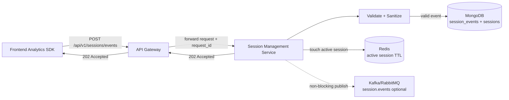
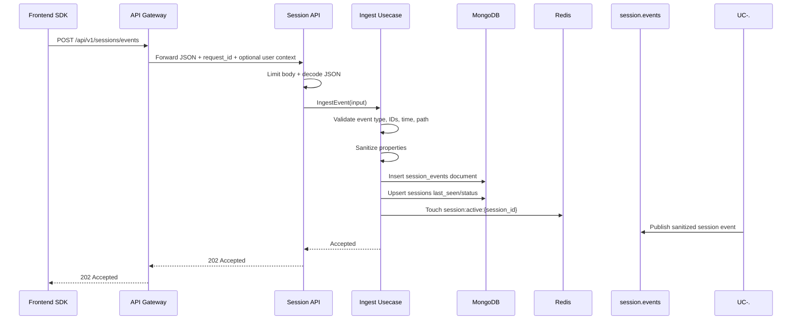
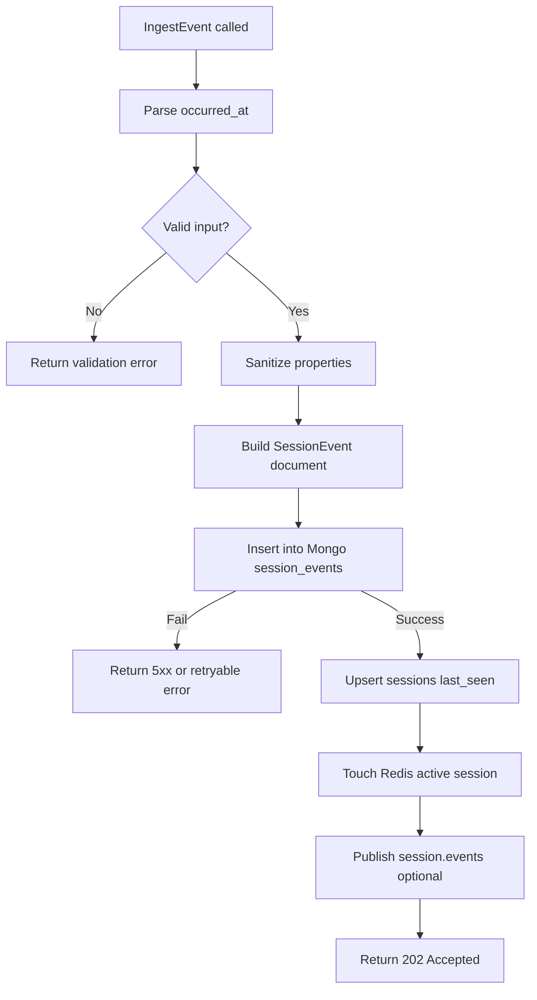

# 📥 Session Management Service - Task 3: Event Ingestion API


## 📌 Task Summary

| Field | Detail |
|---|---|
| Task Name | Event ingestion API |
| Source | `docs/01-micro-tasks.md` → `Session Management Service (Independent)` → Task 3 |
| Priority | `P0` foundation/blocker |
| Dependency | API Gateway |
| Main Goal | Frontend SDK page view, click, scroll, product/cart/checkout activity events bhej sake |
| Public REST API | `POST /api/v1/sessions/events` |
| Internal gRPC Method | `SessionService.IngestEvent` |
| Request Schema | `SessionEventInput` |
| Response Schema | `AcceptedResponse` |
| Output Type | Structured implementation guide |
| Actual Files Created | `TaskImplementation/Session Management Service/task3.md` |
| Not Included | Journey tracking, device parser, heatmap aggregation, analytics dashboard APIs, retention policy |

> **Simple Hinglish goal:** Is task ka kaam ek safe, fast, public event ingestion API design karna hai jahan frontend analytics SDK events bhej sake. API event ko validate karegi, sensitive data clean karegi, MongoDB me raw event store karegi, Redis me active session touch karegi, aur client ko quickly `202 Accepted` return karegi.

---

## ✅ Final Output Created

```text
TaskImplementation/
└── Session Management Service/
    ├── task1.md
    ├── task2.md
    └── task3.md
```

### Why this structure?

| Path | Purpose |
|---|---|
| `TaskImplementation/` | Project ke task-wise implementation guides ka central folder |
| `TaskImplementation/Session Management Service/` | Session Management Service ke tasks ko group karne ke liye |
| `task3.md` | Sirf **Session Management Service - Task 3** ka guide |

> 🟢 **Important boundary:** Is task me runtime backend code create nahi kiya gaya. Ye guide batata hai ki Event Ingestion API kaise implement hogi. Journey, device tracking, heatmap, analytics APIs, and retention policy future tasks me aayenge.

---

## 🧭 Implementation Approach

Guide banate time ye project docs study kiye gaye:

| Document | Kya use kiya gaya |
|---|---|
| `docs/01-micro-tasks.md` | Task 3 ka exact scope identify kiya: Event ingestion API |
| `TaskImplementation/Session Management Service/task1.md` | `session_id`, `anonymous_id`, `user_id`, timestamps, privacy model align kiya |
| `TaskImplementation/Session Management Service/task2.md` | MongoDB + Redis write path align kiya |
| `docs/08-session-management-system.md` | Event types, SDK responsibilities, ingestion flow, privacy rules samjhe |
| `docs/04-microservice-design.md` | Session Service REST/gRPC methods and collection list confirm ki |
| `docs/05-database-design.md` | Session DB choice: MongoDB + Redis confirm ki |
| `database/mongodb-schema-design.md` | `session_events` document and indexes align kiye |
| `api/master-api.json` | API route, gRPC method, request/response schemas confirm kiye |
| `docs/12-logging-monitoring-scalability.md` | Graceful degradation rule samjha: analytics failure checkout ko block nahi karega |

---

## 🧱 Task Boundary

### ✅ Included in Task 3

- `POST /api/v1/sessions/events` API contract define karna
- `SessionEventInput` request shape explain karna
- Supported event types define karna
- Validation, sanitization, privacy rules define karna
- MongoDB raw event insert flow explain karna
- Redis active-session touch flow explain karna
- Optional non-blocking `session.events` publish direction document karna
- Frontend SDK request examples dena
- Go-style handler/usecase/repository code examples dena
- Mermaid architecture and flow diagrams add karna

### ❌ Not Included in Task 3

| Not Included | Kyun nahi? |
|---|---|
| Journey tracking timeline | Ye **Task 4** ka scope hai |
| User-agent/device parser | Ye **Task 5** ka scope hai |
| Heatmap aggregation/dashboard | Ye **Task 6** ka scope hai |
| Analytics APIs like live/funnel/sessions | Ye **Task 7** ka scope hai |
| Data retention final policy | Ye **Task 8** ka scope hai |
| Full frontend SDK package | Task 3 API ko consume karne ke examples deta hai, SDK package implementation nahi |
| Production Kafka/RabbitMQ consumers | Event publish direction documented hai, consumers future tasks me |

---

## 🏗️ High-Level Architecture



**Hinglish explanation:**  
Frontend SDK event bhejta hai. API Gateway request ko Session Service tak forward karta hai. Session Service input validate/sanitize karti hai. Phir raw event MongoDB me durable store hota hai, active session Redis me refresh hota hai, aur client ko `202 Accepted` milta hai.

---

## 🔌 API Contract

### Endpoint

```http
POST /api/v1/sessions/events
Content-Type: application/json
```

### Auth level

| Field | Value |
|---|---|
| API auth | Public |
| Optional identity | Gateway JWT present ho to user context inject kar sakta hai |
| Important rule | Client-provided `user_id` blindly trust nahi karna |

> 🔴 **Security rule:** Agar request authenticated hai, `user_id` Gateway/Auth claims se aana chahiye. Body ka `user_id` sirf trusted/internal context me use karo, warna ignore ya verify karo.

### Request schema from `api/master-api.json`

```json
{
  "event_type": "page_view",
  "anonymous_id": "anon_01HX9ZG9GY7V2XJ7E6BNP3K0CA",
  "session_id": "sess_01HX9ZK6N5M2V4B7S8T9Q0R1P2",
  "user_id": "user_123",
  "occurred_at": "2026-05-22T10:15:30Z",
  "path": "/products/prod_123",
  "properties": {
    "title": "Running Shoes",
    "referrer": "https://example.com",
    "utm_source": "google"
  }
}
```

### Required fields

| Field | Type | Required | Rule |
|---|---:|---:|---|
| `event_type` | string | ✅ Yes | Allowed event type enum me hona chahiye |
| `anonymous_id` | string | ✅ Yes | Empty nahi, expected prefix `anon_` |
| `session_id` | string | ✅ Yes | Empty nahi, expected prefix `sess_` |
| `occurred_at` | datetime | ✅ Yes | RFC3339 UTC datetime |
| `user_id` | string | ❌ No | Auth context se verify/derive karna better |
| `path` | string | ❌ No | Web path, for example `/products/prod_123` |
| `properties` | object | ❌ No | Event-specific flexible payload |

### Response

```http
HTTP/1.1 202 Accepted
Content-Type: application/json
```

```json
{
  "accepted": true,
  "request_id": "req_01HX9ZV8J9E4C7N2W1A0B6Q5P3"
}
```

> 🟢 **Why 202?** Event ingestion async/analytics style API hai. Client ko yeh confirm karna hai ki event accept ho gaya. Dashboard aggregations ya recommendation updates immediately complete hona zaruri nahi.

---

## 🧾 Supported Event Types

Docs ke hisaab se Task 3 MVP me ye events accept karne chahiye:

| Event Type | Use Case | Important Properties |
|---|---|---|
| `page_view` | User ne page open/view kiya | `title`, `referrer`, `utm` |
| `product_view` | Product detail dekha | `product_id`, `category_id`, `seller_id` |
| `search` | Search query perform hui | `query`, `filters`, `result_count` |
| `click` | UI element click hua | `element_id`, `x`, `y`, `viewport_width`, `viewport_height` |
| `scroll` | Page scroll depth track hua | `depth_percent`, `viewport_height` |
| `add_to_cart` | Product cart me add hua | `product_id`, `variant_id`, `quantity` |
| `checkout_step` | Checkout journey step complete hua | `step_name`, `order_id` |
| `payment_result` | Payment success/failure result | `order_id`, `status` |

### Event type enum example

```go
type EventType string

const (
	EventPageView     EventType = "page_view"
	EventProductView  EventType = "product_view"
	EventSearch       EventType = "search"
	EventClick        EventType = "click"
	EventScroll       EventType = "scroll"
	EventAddToCart    EventType = "add_to_cart"
	EventCheckoutStep EventType = "checkout_step"
	EventPaymentResult EventType = "payment_result"
)
```

> 🟡 **Cart note:** Current docs explicitly mention `add_to_cart`. Future cart events like `remove_from_cart` or `cart_quantity_changed` additive event types ke roop me add ho sakte hain, but Task 3 MVP docs-aligned list par focused rahega.

---

## 📦 Example Events

### 1. Page view

```json
{
  "event_type": "page_view",
  "anonymous_id": "anon_01HX9ZG9GY7V2XJ7E6BNP3K0CA",
  "session_id": "sess_01HX9ZK6N5M2V4B7S8T9Q0R1P2",
  "occurred_at": "2026-05-22T10:15:30Z",
  "path": "/",
  "properties": {
    "title": "Home",
    "referrer": "https://www.google.com/",
    "utm_source": "google",
    "utm_medium": "cpc",
    "utm_campaign": "summer_sale"
  }
}
```

### 2. Click

```json
{
  "event_type": "click",
  "anonymous_id": "anon_01HX9ZG9GY7V2XJ7E6BNP3K0CA",
  "session_id": "sess_01HX9ZK6N5M2V4B7S8T9Q0R1P2",
  "occurred_at": "2026-05-22T10:16:10Z",
  "path": "/products/prod_123",
  "properties": {
    "element_id": "add-to-cart",
    "x": 42.5,
    "y": 71.2,
    "viewport_width": 390,
    "viewport_height": 844
  }
}
```

### 3. Add to cart

```json
{
  "event_type": "add_to_cart",
  "anonymous_id": "anon_01HX9ZG9GY7V2XJ7E6BNP3K0CA",
  "session_id": "sess_01HX9ZK6N5M2V4B7S8T9Q0R1P2",
  "user_id": "user_123",
  "occurred_at": "2026-05-22T10:18:00Z",
  "path": "/products/prod_123",
  "properties": {
    "product_id": "prod_123",
    "variant_id": "var_456",
    "quantity": 1
  }
}
```

---

## 🔁 Ingestion Sequence



**Hinglish explanation:**  
API ka main kaam hai request ko safe shape me convert karna. Business logic usecase me rahegi. MongoDB durable write hai, Redis active-session speed layer hai, MQ downstream analytics/recommendation ke liye optional non-blocking publish hai.

---

## 🪜 Step-by-Step Implementation

### Step 1: Route define karo

Session Service me public route add hoga:

```go
func (h *Handler) RegisterRoutes(mux *http.ServeMux) {
	mux.HandleFunc("/api/v1/sessions/events", h.handleIngestEvent)
}
```

**Why?**  
Existing auth service pattern `net/http` + `http.ServeMux` use karta hai. Isliye Session Service bhi simple standard library route se start kar sakta hai. Extra router library zaruri nahi.

---

### Step 2: Request DTO banao

```go
type ingestEventRequest struct {
	EventType   string         `json:"event_type"`
	AnonymousID string         `json:"anonymous_id"`
	SessionID   string         `json:"session_id"`
	UserID      *string        `json:"user_id,omitempty"`
	OccurredAt string         `json:"occurred_at"`
	Path        *string        `json:"path,omitempty"`
	Properties  map[string]any `json:"properties,omitempty"`
}
```

**Why?**  
Transport DTO JSON request ko represent karta hai. `properties` flexible hai because event payload har type ke liye same nahi hota.

---

### Step 3: Request size limit and JSON decode

```go
const maxEventBodyBytes = 64 << 10 // 64 KiB

func decodeEventJSON(w http.ResponseWriter, r *http.Request, dst any) error {
	r.Body = http.MaxBytesReader(w, r.Body, maxEventBodyBytes)
	decoder := json.NewDecoder(r.Body)
	decoder.DisallowUnknownFields()
	return decoder.Decode(dst)
}
```

**Why?**  
Public endpoint hai, isliye large payload abuse avoid karna important hai. `64 KiB` single event ke liye enough hai. Batch ingestion future extension ho sakta hai.

---

### Step 4: Handler request ko usecase input me map kare

```go
func (h *Handler) handleIngestEvent(w http.ResponseWriter, r *http.Request) {
	if r.Method != http.MethodPost {
		writeAPIError(w, http.StatusMethodNotAllowed, "METHOD_NOT_ALLOWED", "Only POST is allowed")
		return
	}

	var req ingestEventRequest
	if err := decodeEventJSON(w, r, &req); err != nil {
		writeAPIError(w, http.StatusBadRequest, "INVALID_REQUEST", err.Error())
		return
	}

	out, err := h.ingestUsecase.IngestEvent(r.Context(), IngestEventInput{
		EventType:   req.EventType,
		AnonymousID: req.AnonymousID,
		SessionID:   req.SessionID,
		UserID:      trustedUserIDFromRequest(r, req.UserID),
		OccurredAt: req.OccurredAt,
		Path:        req.Path,
		Properties:  req.Properties,
		RequestID:   requestID(r),
		UserAgent:   r.UserAgent(),
		RemoteIP:    clientIP(r),
	})
	if err != nil {
		writeUsecaseError(w, err)
		return
	}

	writeJSON(w, http.StatusAccepted, map[string]any{
		"accepted":   true,
		"request_id": out.RequestID,
	})
}
```

**Why?**  
Handler lightweight hona chahiye. Ye sirf HTTP details handle kare: method, decode, headers, response. Real validation and storage usecase layer karegi.

---

### Step 5: Client `user_id` blindly trust mat karo

```go
func trustedUserIDFromRequest(r *http.Request, bodyUserID *string) *string {
	userID := r.Header.Get("X-User-ID")
	if userID != "" {
		return &userID
	}

	// Public guest events me user_id nil rahega.
	// Body user_id sirf trusted gateway/internal path me allow karna.
	return nil
}
```

**Why?**  
Event ingestion public hai. Agar client body me random `user_id` bhej de aur service usko trust kare, analytics/fraud data corrupt ho sakta hai. Logged-in identity Gateway/Auth claims se derive honi chahiye.

---

### Step 6: Validation rules implement karo

```go
func ValidateIngestInput(input IngestEventInput, now time.Time) error {
	if input.EventType == "" {
		return ErrValidation("event_type is required")
	}
	if !allowedEventTypes[input.EventType] {
		return ErrValidation("event_type is not supported")
	}
	if input.AnonymousID == "" {
		return ErrValidation("anonymous_id is required")
	}
	if input.SessionID == "" {
		return ErrValidation("session_id is required")
	}
	if input.OccurredAt.IsZero() {
		return ErrValidation("occurred_at is required")
	}
	if input.OccurredAt.After(now.Add(5 * time.Minute)) {
		return ErrValidation("occurred_at is too far in future")
	}
	if input.OccurredAt.Before(now.Add(-24 * time.Hour)) {
		return ErrValidation("occurred_at is too old")
	}
	return nil
}
```

### Recommended validation table

| Validation | Rule | Error |
|---|---|---|
| Body size | Max `64 KiB` per event | `PAYLOAD_TOO_LARGE` |
| Content type | `application/json` | `UNSUPPORTED_MEDIA_TYPE` |
| Event type | Must be allowed enum | `VALIDATION_ERROR` |
| `anonymous_id` | Required | `VALIDATION_ERROR` |
| `session_id` | Required | `VALIDATION_ERROR` |
| `occurred_at` | RFC3339 | `VALIDATION_ERROR` |
| Future clock skew | Max `+5 minutes` | `VALIDATION_ERROR` |
| Old event window | Max `24 hours` old for direct ingestion | `VALIDATION_ERROR` |
| Properties size | Keep compact, no huge nested objects | `VALIDATION_ERROR` |

> 🟡 **Why old event limit?** SDK retry useful hai, but bahut purane events direct ingest karne se analytics inaccurate ho sakti hai. Offline/batch import future separate endpoint ho sakta hai.

---

### Step 7: Sensitive fields sanitize karo

```go
var sensitiveKeys = map[string]struct{}{
	"password":      {},
	"otp":           {},
	"card_number":   {},
	"cvv":           {},
	"pin":           {},
	"token":         {},
	"authorization": {},
	"cookie":        {},
	"raw_ip":        {},
}

func sanitizeProperties(input map[string]any) map[string]any {
	clean := make(map[string]any, len(input))
	for key, value := range input {
		normalizedKey := strings.ToLower(strings.TrimSpace(key))
		if _, blocked := sensitiveKeys[normalizedKey]; blocked {
			continue
		}
		clean[key] = value
	}
	return clean
}
```

**Why?**  
Analytics me password, OTP, card data, auth token, cookie, raw IP kabhi store nahi hona chahiye. Sanitization ingestion boundary par hi karni chahiye.

> 🔴 **Important:** Task 3 ke ingestion me keystroke recording, form field text capture, password/OTP/card capture allowed nahi hai.

---

### Step 8: Raw event document create karo

MongoDB `session_events` document:

```json
{
  "_id": "evt_01HX9ZPHVZV7M8B8QX5Y6Z1K2A",
  "session_id": "sess_01HX9ZK6N5M2V4B7S8T9Q0R1P2",
  "anonymous_id": "anon_01HX9ZG9GY7V2XJ7E6BNP3K0CA",
  "user_id": "user_123",
  "event_type": "click",
  "path": "/products/prod_123",
  "properties": {
    "element_id": "add-to-cart",
    "x": 42.5,
    "y": 71.2,
    "viewport_width": 390,
    "viewport_height": 844
  },
  "occurred_at": "2026-05-22T10:16:10Z",
  "received_at": "2026-05-22T10:16:11Z",
  "schema_version": 1,
  "request_id": "req_01HX9ZV8J9E4C7N2W1A0B6Q5P3"
}
```

**Why?**  
`occurred_at` client event time hai. `received_at` server receive time hai. Dono useful hain because SDK retry/offline delay ho sakta hai.

---

### Step 9: MongoDB insert + session upsert karo

```go
type EventRepository interface {
	InsertEvent(ctx context.Context, event SessionEvent) error
}

type SessionRepository interface {
	TouchSession(ctx context.Context, touch SessionTouch) error
}
```

Mongo write intent:

```javascript
db.session_events.insertOne({
  _id: "evt_01HX9ZPHVZV7M8B8QX5Y6Z1K2A",
  session_id: "sess_01HX9ZK6N5M2V4B7S8T9Q0R1P2",
  anonymous_id: "anon_01HX9ZG9GY7V2XJ7E6BNP3K0CA",
  user_id: "user_123",
  event_type: "page_view",
  path: "/",
  properties: {},
  occurred_at: ISODate("2026-05-22T10:15:30Z"),
  received_at: ISODate("2026-05-22T10:15:31Z"),
  schema_version: 1
})

db.sessions.updateOne(
  { session_id: "sess_01HX9ZK6N5M2V4B7S8T9Q0R1P2" },
  {
    $setOnInsert: {
      session_id: "sess_01HX9ZK6N5M2V4B7S8T9Q0R1P2",
      anonymous_id: "anon_01HX9ZG9GY7V2XJ7E6BNP3K0CA",
      started_at: ISODate("2026-05-22T10:15:30Z"),
      status: "active",
      schema_version: 1
    },
    $set: {
      user_id: "user_123",
      last_seen_at: ISODate("2026-05-22T10:15:30Z"),
      exit_page: "/",
      updated_at: ISODate("2026-05-22T10:15:31Z")
    }
  },
  { upsert: true }
)
```

**Why?**  
Raw event alag collection me store hota hai. `sessions` document compact summary hai jisme `last_seen_at` update hota hai. Events ko session ke andar array me store nahi karna, warna unbounded document ban jayega.

---

### Step 10: Redis active session touch karo

```go
type ActiveSessionStore interface {
	Touch(ctx context.Context, snapshot ActiveSessionSnapshot, ttl time.Duration) error
}
```

Redis write example:

```redis
HSET session:active:sess_01HX9ZK6N5M2V4B7S8T9Q0R1P2 \
  session_id sess_01HX9ZK6N5M2V4B7S8T9Q0R1P2 \
  anonymous_id anon_01HX9ZG9GY7V2XJ7E6BNP3K0CA \
  user_id user_123 \
  status active \
  current_page /products/prod_123 \
  last_event_type click \
  last_seen_at 2026-05-22T10:16:10Z

EXPIRE session:active:sess_01HX9ZK6N5M2V4B7S8T9Q0R1P2 2100
```

`2100` seconds = 35 minutes.

**Why?**  
Redis dashboard/live active session ke liye fast hot state rakhta hai. Har event par sliding TTL refresh hota hai.

---

### Step 11: Optional `session.events` publish karo

```go
type EventPublisher interface {
	PublishSessionEvent(ctx context.Context, event SessionEvent) error
}
```

Publish payload:

```json
{
  "event_id": "evt_01HX9ZPHVZV7M8B8QX5Y6Z1K2A",
  "session_id": "sess_01HX9ZK6N5M2V4B7S8T9Q0R1P2",
  "anonymous_id": "anon_01HX9ZG9GY7V2XJ7E6BNP3K0CA",
  "user_id": "user_123",
  "event_type": "product_view",
  "path": "/products/prod_123",
  "occurred_at": "2026-05-22T10:16:10Z",
  "received_at": "2026-05-22T10:16:11Z"
}
```

**Why?**  
Recommendation Service, analytics aggregation workers, or future fraud checks downstream consume kar sakte hain.

> 🟡 **Failure rule:** MQ publish fail ho to API ko necessarily fail mat karo if MongoDB durable write already successful hai. Error log/metric emit karo and retry/outbox design future hardening me add karo.

---

### Step 12: Return `202 Accepted`

```go
type AcceptedResponse struct {
	Accepted  bool   `json:"accepted"`
	RequestID string `json:"request_id"`
}
```

```json
{
  "accepted": true,
  "request_id": "req_01HX9ZV8J9E4C7N2W1A0B6Q5P3"
}
```

**Why?**  
Client ko sirf itna know karna hai ki event accepted ho gaya. Analytics reporting immediately updated hone ki guarantee nahi hoti.

---

## 🧠 Usecase Flow



### Suggested usecase code

```go
func (u *IngestUsecase) IngestEvent(ctx context.Context, input IngestEventInput) (IngestEventOutput, error) {
	now := u.clock.Now().UTC()

	normalized, err := NormalizeInput(input, now)
	if err != nil {
		return IngestEventOutput{}, err
	}

	if err := ValidateIngestInput(normalized, now); err != nil {
		return IngestEventOutput{}, err
	}

	event := SessionEvent{
		EventID:       u.idGenerator.New("evt"),
		SessionID:     normalized.SessionID,
		AnonymousID:   normalized.AnonymousID,
		UserID:        normalized.UserID,
		EventType:     normalized.EventType,
		Path:          normalized.Path,
		Properties:    sanitizeProperties(normalized.Properties),
		OccurredAt:    normalized.OccurredAt,
		ReceivedAt:    now,
		SchemaVersion: 1,
		RequestID:     normalized.RequestID,
	}

	if err := u.events.InsertEvent(ctx, event); err != nil {
		return IngestEventOutput{}, err
	}

	if err := u.sessions.TouchSession(ctx, SessionTouchFromEvent(event)); err != nil {
		return IngestEventOutput{}, err
	}

	if err := u.active.Touch(ctx, ActiveSnapshotFromEvent(event), u.activeTTL); err != nil {
		u.logger.WarnContext(ctx, "active session touch failed", "session_id", event.SessionID, "error", err)
	}

	if u.publisher != nil {
		if err := u.publisher.PublishSessionEvent(ctx, event); err != nil {
			u.logger.WarnContext(ctx, "session event publish failed", "event_id", event.EventID, "error", err)
		}
	}

	return IngestEventOutput{
		Accepted:  true,
		RequestID: event.RequestID,
		EventID:   event.EventID,
	}, nil
}
```

### Failure behavior

| Failure | API behavior | Reason |
|---|---|---|
| Invalid request | `400 Bad Request` | Client data wrong hai |
| Unsupported content type | `415 Unsupported Media Type` | JSON required hai |
| Body too large | `413 Payload Too Large` | Abuse/accidental huge payload |
| MongoDB insert fail | `503 Service Unavailable` or `500` | Durable write unavailable hai |
| Redis touch fail | Still `202` after Mongo success | Live tracking degrade ho sakta hai |
| MQ publish fail | Still `202` after Mongo success | Downstream async update later retry ho sakta hai |

---

## 🔐 Privacy and Security Rules

| Rule | Implementation |
|---|---|
| Raw IP store nahi karna | Hash IP before storing in session metadata |
| Body `user_id` blindly trust nahi karna | Gateway/Auth claims se derive karo |
| Sensitive fields block karo | Sanitizer blacklist at ingestion boundary |
| Keystroke/form text capture nahi | SDK and API dono enforce karein |
| Request size limit rakho | `64 KiB` per event |
| Rate limiting | API Gateway Redis-based IP/session rate limit |
| CORS controlled rakho | Sirf known frontend origins allow karo |
| Request ID log karo | Debugging and traceability |
| PII masking | Dashboard/API layers me default masking future tasks me |

### Sensitive data blacklist

```text
password
otp
card_number
cvv
pin
token
authorization
cookie
raw_ip
private_message
```

---

## 🚦 Rate Limiting and Abuse Protection

Task 3 public endpoint hai, so API Gateway level par rate limit important hai.

| Limit Type | Suggested Rule | Why |
|---|---:|---|
| Per IP | 300 events/min | Bot/spam control |
| Per anonymous ID | 120 events/min | Broken SDK loop avoid |
| Per session ID | 120 events/min | Click/scroll noise control |
| Max payload | 64 KiB/event | Storage and CPU safety |
| Max properties keys | 50 keys | Payload shape controlled rahe |

> 🟡 **Scroll event note:** SDK ko scroll event throttle karna chahiye. Har pixel scroll event API ko nahi bhejna.

---

## 🧑‍💻 Frontend SDK Usage Example

Task 3 me full SDK package create nahi hota, but frontend ko API consume karne ka shape clear hona chahiye.

```ts
type SessionEventInput = {
  event_type: string;
  anonymous_id: string;
  session_id: string;
  user_id?: string;
  occurred_at: string;
  path?: string;
  properties?: Record<string, unknown>;
};

export async function trackEvent(event: SessionEventInput) {
  await fetch("/api/v1/sessions/events", {
    method: "POST",
    headers: {
      "content-type": "application/json"
    },
    body: JSON.stringify(event),
    keepalive: true
  });
}
```

### Page view example

```ts
trackEvent({
  event_type: "page_view",
  anonymous_id: localStorage.getItem("anonymous_id") ?? "",
  session_id: sessionStorage.getItem("session_id") ?? "",
  occurred_at: new Date().toISOString(),
  path: window.location.pathname,
  properties: {
    title: document.title,
    referrer: document.referrer
  }
});
```

### Click example

```ts
document.addEventListener("click", (event) => {
  const target = event.target as HTMLElement;

  trackEvent({
    event_type: "click",
    anonymous_id: localStorage.getItem("anonymous_id") ?? "",
    session_id: sessionStorage.getItem("session_id") ?? "",
    occurred_at: new Date().toISOString(),
    path: window.location.pathname,
    properties: {
      element_id: target.id || target.dataset.analyticsId,
      x: event.clientX,
      y: event.clientY,
      viewport_width: window.innerWidth,
      viewport_height: window.innerHeight
    }
  });
});
```

> 🔴 **SDK privacy rule:** Password fields, OTP inputs, card fields, private textareas, and hidden auth tokens capture nahi karne.

---

## 🧪 Test Plan

### Manual curl test

```bash
curl -i -X POST http://localhost:8080/api/v1/sessions/events \
  -H "Content-Type: application/json" \
  -d '{
    "event_type": "page_view",
    "anonymous_id": "anon_01HX9ZG9GY7V2XJ7E6BNP3K0CA",
    "session_id": "sess_01HX9ZK6N5M2V4B7S8T9Q0R1P2",
    "occurred_at": "2026-05-22T10:15:30Z",
    "path": "/",
    "properties": {
      "title": "Home"
    }
  }'
```

Expected response:

```http
HTTP/1.1 202 Accepted
```

```json
{
  "accepted": true,
  "request_id": "req_..."
}
```

### MongoDB verification

```javascript
use session_db

db.session_events.find({
  session_id: "sess_01HX9ZK6N5M2V4B7S8T9Q0R1P2"
}).sort({ occurred_at: 1 })

db.sessions.findOne({
  session_id: "sess_01HX9ZK6N5M2V4B7S8T9Q0R1P2"
})
```

### Redis verification

```bash
redis-cli HGETALL session:active:sess_01HX9ZK6N5M2V4B7S8T9Q0R1P2
redis-cli TTL session:active:sess_01HX9ZK6N5M2V4B7S8T9Q0R1P2
```

### Test cases

| Test | Expected |
|---|---|
| Valid `page_view` | `202 Accepted`, event stored |
| Valid `click` | `202 Accepted`, coordinates stored |
| Missing `event_type` | `400 VALIDATION_ERROR` |
| Unsupported event type | `400 VALIDATION_ERROR` |
| Missing `anonymous_id` | `400 VALIDATION_ERROR` |
| Bad datetime | `400 VALIDATION_ERROR` |
| Future `occurred_at` too far | `400 VALIDATION_ERROR` |
| Sensitive property `password` | Key removed before store |
| Redis unavailable | Mongo write succeeds, API still `202` |
| Mongo unavailable | API returns retryable error |

---

## 📊 Observability

### Logs

```json
{
  "level": "info",
  "message": "session event accepted",
  "request_id": "req_01HX9ZV8J9E4C7N2W1A0B6Q5P3",
  "event_type": "page_view",
  "session_id": "sess_01HX9ZK6N5M2V4B7S8T9Q0R1P2",
  "duration_ms": 12
}
```

### Metrics

| Metric | Type | Meaning |
|---|---|---|
| `session_ingest_requests_total` | Counter | Total ingest API requests |
| `session_ingest_accepted_total` | Counter | Accepted events |
| `session_ingest_rejected_total` | Counter | Validation/security rejected events |
| `session_ingest_duration_ms` | Histogram | API latency |
| `session_ingest_mongo_errors_total` | Counter | Mongo write failures |
| `session_ingest_redis_errors_total` | Counter | Redis touch failures |
| `session_ingest_events_by_type_total` | Counter | Event type wise volume |

### Trace spans

```text
HTTP POST /api/v1/sessions/events
└── session.ingest.validate
└── session.ingest.mongo.insert_event
└── session.ingest.mongo.touch_session
└── session.ingest.redis.touch_active
└── session.ingest.publish
```

---

## 🗃️ Clean Folder Structure

### Actual Task 3 output

```text
TaskImplementation/
└── Session Management Service/
    ├── task1.md
    ├── task2.md
    └── task3.md
```

### Future runtime structure reference only

> Ye future implementation reference hai. Is task me ye files/folders create nahi kiye gaye.

```text
backend/
└── services/
    └── session-service/
        ├── cmd/
        │   └── server/
        │       └── main.go
        ├── internal/
        │   ├── config/
        │   │   └── config.go
        │   ├── domain/
        │   │   ├── event.go
        │   │   └── session.go
        │   ├── usecase/
        │   │   ├── ingest_event.go
        │   │   └── ingest_event_test.go
        │   ├── repository/
        │   │   ├── mongo_event_repository.go
        │   │   ├── mongo_session_repository.go
        │   │   └── redis_active_session_repository.go
        │   ├── transport/
        │   │   └── http/
        │   │       ├── handler.go
        │   │       ├── dto.go
        │   │       └── routes.go
        │   └── events/
        │       └── publisher.go
        └── migrations/
            └── mongo_indexes.md
```

---

## 🧰 External Libraries and Tools

### Tools actually used in this documentation task

| Tool | What it is | Why used | Install/Use |
|---|---|---|---|
| Markdown | Documentation format | Beginner-friendly implementation guide likhne ke liye | GitHub/GitLab/VS Code me directly preview hota hai |
| Mermaid | Markdown-friendly diagram syntax | Architecture, sequence, and validation flow diagrams ke liye | GitHub supports Mermaid. VS Code extension optional hai |
| Shields.io badges | Badge image service | Priority/status/scope ko visually readable banane ke liye | Markdown image URL use hota hai, local install nahi chahiye |

### Future runtime libraries/tools

Task 3 guide ke hisaab se actual service banate time ye use ho sakte hain:

| Tool/Library | What it is | Why used | Install command |
|---|---|---|---|
| Go `net/http` | Standard HTTP server package | Existing service style se aligned simple route/handler ke liye | Built-in, install nahi chahiye |
| Go `encoding/json` | Standard JSON package | Request decode and response encode ke liye | Built-in, install nahi chahiye |
| MongoDB Go Driver | Official MongoDB Go client | `session_events` insert and `sessions` upsert ke liye | `go get go.mongodb.org/mongo-driver/v2/mongo` |
| go-redis/v9 | Redis Go client | Active session hash/TTL update ke liye | `go get github.com/redis/go-redis/v9` |
| mongosh | MongoDB shell | Ingested event verify/index debug karne ke liye | MongoDB tools ke saath install |
| redis-cli | Redis CLI | Active session key and TTL verify karne ke liye | Redis tools ke saath install |
| Kafka/RabbitMQ client | Message queue client | Optional `session.events` publish ke liye | Provider choose hone ke baad install |

### Future Go install commands

Run only when `backend/services/session-service` Go module is created:

```bash
cd backend/services/session-service
go get go.mongodb.org/mongo-driver/v2/mongo
go get github.com/redis/go-redis/v9
```

> 🟢 **Current task status:** Koi runtime package install nahi kiya gaya. Sirf Task 3 documentation file create hui.

---

## ⚙️ Config Plan

Future implementation me config env vars se aayega:

```env
SESSION_MONGO_URI=mongodb://localhost:27017
SESSION_MONGO_DATABASE=session_db
SESSION_REDIS_ADDR=localhost:6379
SESSION_REDIS_DB=2
SESSION_ACTIVE_TTL_SECONDS=2100
SESSION_INGEST_MAX_BODY_BYTES=65536
SESSION_ALLOWED_CLOCK_SKEW_SECONDS=300
SESSION_MAX_EVENT_AGE_HOURS=24
SESSION_EVENTS_TOPIC=session.events
```

### Config explanation

| Config | Meaning |
|---|---|
| `SESSION_MONGO_URI` | MongoDB connection string |
| `SESSION_MONGO_DATABASE` | Database name, docs me `session_db` |
| `SESSION_REDIS_ADDR` | Redis host/port |
| `SESSION_ACTIVE_TTL_SECONDS` | Active session TTL, 35 minutes |
| `SESSION_INGEST_MAX_BODY_BYTES` | Max request body per event |
| `SESSION_ALLOWED_CLOCK_SKEW_SECONDS` | Future timestamp tolerance |
| `SESSION_MAX_EVENT_AGE_HOURS` | Old retry event acceptance window |
| `SESSION_EVENTS_TOPIC` | Optional MQ topic |

---

## ✅ Acceptance Checklist

| Check | Status |
|---|---|
| `TaskImplementation/` folder exists | ✅ Done |
| `TaskImplementation/Session Management Service/` folder exists | ✅ Done |
| `task3.md` created | ✅ Done |
| Event ingestion endpoint documented | ✅ Done |
| Request and response examples added | ✅ Done |
| Supported event types listed | ✅ Done |
| Validation and privacy rules documented | ✅ Done |
| MongoDB raw event insert flow explained | ✅ Done |
| Redis active session touch flow explained | ✅ Done |
| Optional `session.events` publish documented | ✅ Done |
| External tools/libraries mentioned with install/use notes | ✅ Done |
| Mermaid diagrams added | ✅ Done |
| Hinglish beginner-friendly explanation added | ✅ Done |
| No implementation beyond Task 3 | ✅ Done |

---

## ⚠️ Common Mistakes Avoid Karna

| Mistake | Better approach |
|---|---|
| Body ka `user_id` directly trust karna | Gateway/Auth context se derive karo |
| Password/OTP/card fields analytics me store karna | Ingestion sanitizer se block karo |
| Har click/scroll raw spam bhejna | SDK throttle/debounce use kare |
| Event ko `sessions` array me embed karna | `session_events` separate collection use karo |
| Redis fail hone par event reject karna | Mongo durable write ke baad Redis failure degrade karo |
| Mongo fail hone par `202` dena | Durable write fail ho to retryable error return karo |
| Journey summary isi task me banana | Journey tracking Task 4 ka scope hai |
| Heatmap aggregation isi task me banana | Heatmap Task 6 ka scope hai |

---

## 🏁 Final Summary

Session Management Service - Task 3 ka implementation guide complete hai:

- `POST /api/v1/sessions/events` ingestion API ka contract define ho gaya.
- Frontend SDK ke page view, click, scroll, product/cart/checkout events ka payload clear ho gaya.
- Validation, sanitization, privacy, and identity trust rules documented ho gaye.
- MongoDB `session_events` write and `sessions` touch flow explain ho gaya.
- Redis active session TTL touch flow explain ho gaya.
- Optional `session.events` publish direction documented hai.
- No runtime code or future task implementation create ki gayi.

> 🟢 **Next logical task:** Task 4 me Journey Tracking build hoga, jo `session_events` ko ordered timeline ke roop me reconstruct karega.
