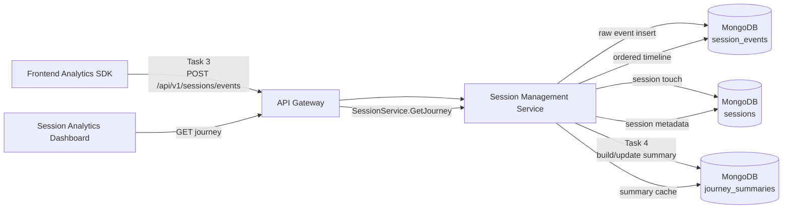
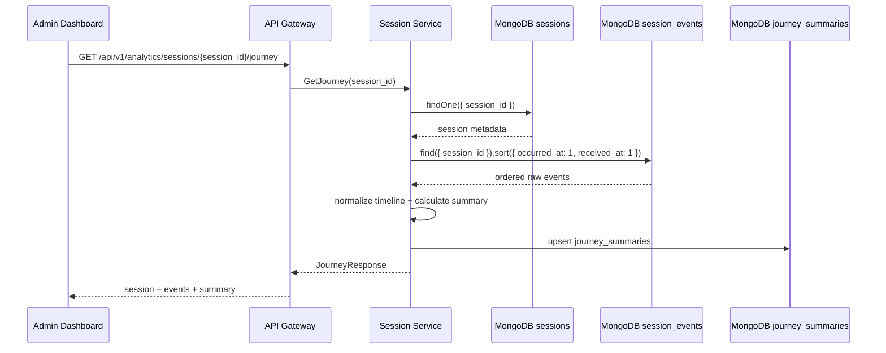
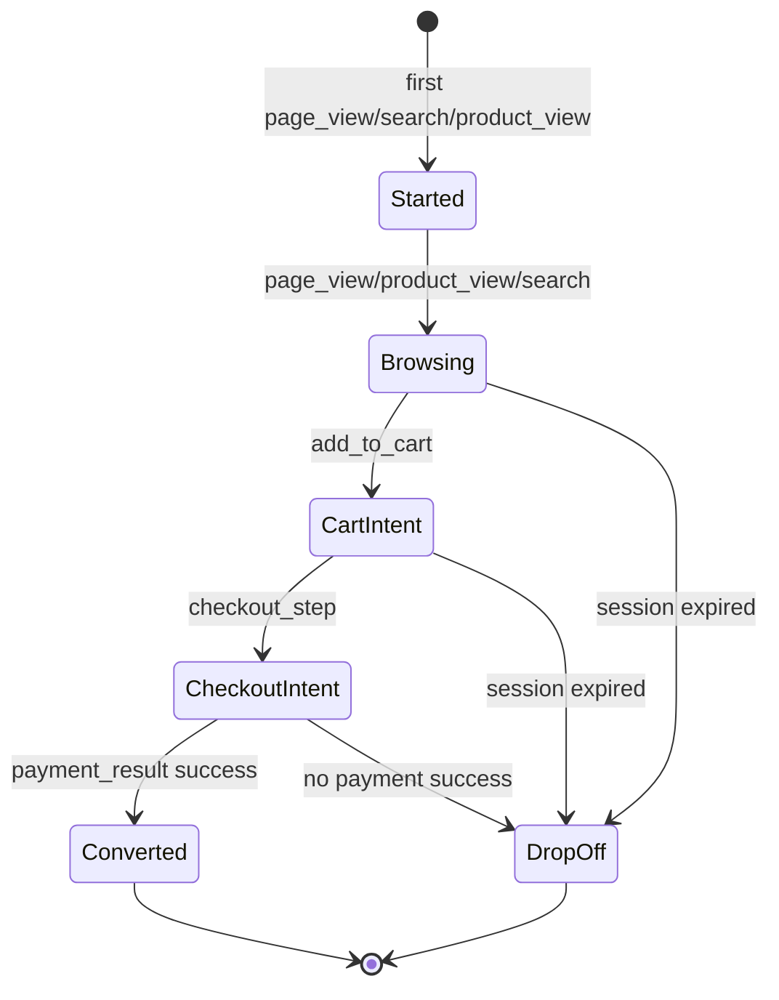

# 🧭 Session Management Service - Task 4: Journey Tracking


## 📌 Task Summary

| Field | Detail |
|---|---|
| Task Name | Journey tracking |
| Source | `docs/01-micro-tasks.md` → `Session Management Service (Independent)` → Task 4 |
| Priority | `P1` |
| Dependency | Event API |
| Main Goal | Session ke events ko ordered timeline me reconstruct karna, taaki user journey samajh aaye |
| Dashboard API Context | `GET /api/v1/analytics/sessions/{session_id}/journey` |
| Internal gRPC Context | `SessionService.GetJourney` |
| Output Type | Structured implementation guide |
| Actual Files Created | `TaskImplementation/Session Management Service/task4.md` |
| Not Included | Device parser, heatmap aggregation, full analytics dashboard APIs, retention policy, production worker deployment |

> **Simple Hinglish goal:** Is task ka kaam hai ek user session ke andar kya-kya hua usko time order me dikhana. Example: user home page par aaya, product dekha, search kiya, add to cart kiya, checkout start kiya, payment complete kiya. Ye sab `session_events` se sorted timeline banega, aur optional compact summary `journey_summaries` me store hogi.

---

## ✅ Final Output Created

```text
TaskImplementation/
└── Session Management Service/
    ├── task1.md
    ├── task2.md
    ├── task3.md
    └── task4.md
```

### Why this structure?

| Path | Purpose |
|---|---|
| `TaskImplementation/` | Project ke task-wise implementation guides ka central folder |
| `TaskImplementation/Session Management Service/` | Session Management Service ke tasks ko group karne ke liye |
| `task4.md` | Sirf **Session Management Service - Task 4** ka guide |

> 🟢 **Important boundary:** Is task me backend runtime code, database migration, worker, ya API route implement nahi kiya gaya. Ye guide batata hai ki Journey Tracking kaise implement hoga, based on Task 1-3 ke model, storage, and event ingestion design.

---

## 🧭 Implementation Approach

Guide banate time ye project docs study kiye gaye:

| Document | Kya use kiya gaya |
|---|---|
| `docs/01-micro-tasks.md` | Task 4 ka exact scope identify kiya: Journey tracking |
| `TaskImplementation/Session Management Service/task1.md` | Session identity, timestamps, lifecycle, privacy fields align kiye |
| `TaskImplementation/Session Management Service/task2.md` | MongoDB `session_events`, future `journey_summaries`, indexes, Redis role align kiya |
| `TaskImplementation/Session Management Service/task3.md` | Event ingestion schema, event types, validation, sanitization, raw event storage flow reuse kiya |
| `docs/08-session-management-system.md` | Journey summary fields and dashboard use cases samjhe |
| `docs/04-microservice-design.md` | `GetJourney`, collections, REST/gRPC API context confirm kiya |
| `database/mongodb-schema-design.md` | `sessions` and `session_events` documents/indexes align kiye |
| `api/master-api.json` | `GET /api/v1/analytics/sessions/{session_id}/journey` and `JourneyResponse` contract confirm kiya |

---

## 🧱 Task Boundary

### ✅ Included in Task 4

- Session ke raw events ko ordered timeline me reconstruct karna
- `journey_summaries` document ka design define karna
- `GET /api/v1/analytics/sessions/{session_id}/journey` ka behavior explain karna
- `SessionService.GetJourney` read flow define karna
- Event ordering, deduplication, summary counters, and milestone detection explain karna
- MongoDB query and index examples dena
- Go-style domain/usecase/repository code examples dena
- Mermaid architecture, sequence, and state diagrams add karna
- Beginner-friendly Hinglish explanation dena

### ❌ Not Included in Task 4

| Not Included | Kyun nahi? |
|---|---|
| New event ingestion API | Ye already **Task 3** ka scope hai |
| Device/browser/OS parser | Ye **Task 5: Device tracking** ka scope hai |
| Heatmap coordinate aggregation | Ye **Task 6: Heatmap concept** ka scope hai |
| Full analytics APIs like live/funnels/sessions list | Ye **Task 7: Analytics APIs** ka scope hai |
| Final data retention TTL policy | Ye **Task 8: Data retention policy** ka scope hai |
| Events ko `sessions` document ke andar array me embed karna | High-volume events ke liye unsafe hai; `session_events` separate collection rahegi |

> 🟡 **Clarification:** Requirement me "Session ke andar ordered events store karo" ka practical implementation ye hoga ki har event me `session_id` rahega, aur journey read time par `session_events` ko `{ session_id, occurred_at }` se sort karke reconstruct kiya jayega. Events ko `sessions` document ke andar unbounded array me store nahi karna.

---

## 🏗️ High-Level Architecture



**Hinglish explanation:**  
Task 3 event receive karke `session_events` me raw data store karta hai. Task 4 usi data ko session-wise ordered timeline me convert karta hai. Dashboard jab journey maangega, Session Service session metadata, sorted events, and optional summary return karega.

---

## 🔤 Core Concepts

| Concept | Meaning | Example |
|---|---|---|
| Raw event | Frontend se aaya single activity record | `page_view`, `click`, `product_view` |
| Journey timeline | Same session ke events sorted by time | Home → Product → Cart → Checkout |
| Journey summary | Timeline ka compact calculated result | total events, duration, products viewed |
| Milestone | Important conversion step | checkout started, payment completed |
| Reconstruction | Existing raw events se timeline banana | Mongo query + sort |

### Journey ka simple example

```text
10:00 page_view       /
10:01 search          "running shoes"
10:03 product_view    prod_123
10:04 add_to_cart     prod_123
10:06 checkout_step   shipping
10:08 payment_result  success
```

Isse dashboard me clearly dikhega ki user ka path kya tha aur conversion kaha tak complete hua.

---

## 🗃️ Data Source

Task 4 ka primary source `session_events` collection hai.

### Existing raw event document

```json
{
  "_id": "evt_01HX9ZPHVZV7M8B8QX5Y6Z1K2A",
  "session_id": "sess_01HX9ZK6N5M2V4B7S8T9Q0R1P2",
  "anonymous_id": "anon_01HX9ZG9GY7V2XJ7E6BNP3K0CA",
  "user_id": "user_123",
  "event_type": "product_view",
  "path": "/products/prod_123",
  "properties": {
    "product_id": "prod_123",
    "category_id": "cat_shoes",
    "seller_id": "seller_456"
  },
  "occurred_at": "2026-05-22T10:03:00Z",
  "received_at": "2026-05-22T10:03:01Z",
  "schema_version": 1,
  "request_id": "req_01HX9ZV8J9E4C7N2W1A0B6Q5P3"
}
```

### Existing index needed for journey

```javascript
use session_db

db.session_events.createIndex(
  { session_id: 1, occurred_at: 1 },
  { name: "idx_session_timeline" }
)
```

**Why?**  
Journey endpoint ka sabse common query pattern hai: "is `session_id` ke saare events time order me do." Ye index exactly us query ko fast banata hai.

---

## 📄 New Derived Collection: `journey_summaries`

`journey_summaries` ek derived/read-optimized collection hogi. Ye raw events ka replacement nahi hai. Ye sirf dashboard ke liye compact summary store karegi.

### Recommended document

```json
{
  "_id": "journey_sess_01HX9ZK6N5M2V4B7S8T9Q0R1P2",
  "session_id": "sess_01HX9ZK6N5M2V4B7S8T9Q0R1P2",
  "anonymous_id": "anon_01HX9ZG9GY7V2XJ7E6BNP3K0CA",
  "user_id": "user_123",
  "entry_page": "/",
  "exit_page": "/checkout/success",
  "first_event_at": "2026-05-22T10:00:00Z",
  "last_event_at": "2026-05-22T10:08:00Z",
  "duration_seconds": 480,
  "total_events": 6,
  "products_viewed": 1,
  "searches": 1,
  "cart_actions": 1,
  "checkout_started": true,
  "payment_completed": true,
  "milestones": [
    {
      "name": "first_page_view",
      "event_id": "evt_01HX9Z...",
      "path": "/",
      "occurred_at": "2026-05-22T10:00:00Z"
    },
    {
      "name": "first_product_view",
      "event_id": "evt_01HXA0...",
      "path": "/products/prod_123",
      "occurred_at": "2026-05-22T10:03:00Z"
    },
    {
      "name": "payment_completed",
      "event_id": "evt_01HXA2...",
      "path": "/checkout/success",
      "occurred_at": "2026-05-22T10:08:00Z"
    }
  ],
  "top_paths": [
    { "path": "/", "count": 1 },
    { "path": "/products/prod_123", "count": 1 },
    { "path": "/checkout/success", "count": 1 }
  ],
  "schema_version": 1,
  "calculated_at": "2026-05-22T10:08:05Z",
  "updated_at": "2026-05-22T10:08:05Z"
}
```

### Recommended indexes

```javascript
use session_db

db.journey_summaries.createIndex(
  { session_id: 1 },
  { unique: true, name: "uniq_journey_session" }
)

db.journey_summaries.createIndex(
  { user_id: 1, last_event_at: -1 },
  {
    name: "idx_journey_user_recent",
    partialFilterExpression: { user_id: { $type: "string" } }
  }
)

db.journey_summaries.createIndex(
  { last_event_at: -1 },
  { name: "idx_journey_recent" }
)
```

**Hinglish explanation:**  
`journey_summaries` dashboard ko fast high-level answer deta hai. Agar admin sirf dekhna chahta hai ki session converted hua ya nahi, summary enough hai. Agar full timeline chahiye, raw `session_events` sorted order me fetch honge.

---

## 🔁 Journey Build Strategy

Task 4 me journey 2 tareeke se build ho sakti hai:

| Strategy | Kab use karein | Pros | Cons |
|---|---|---|---|
| Read-time reconstruction | MVP ke liye best | Simple, no background worker needed | Heavy sessions me query cost zyada ho sakti hai |
| Incremental summary update | Scale ke liye better | Dashboard fast, summary always ready | Worker/upsert logic maintain karna padega |

> 🟢 **Recommended MVP:** Read-time reconstruction implement karo, and same logic se optional `journey_summaries` upsert karo. Isse correctness simple rahegi and future worker easily add ho jayega.

---

## 🧩 Journey Reconstruction Flow



**Why sorted by `occurred_at` and `received_at`?**  
`occurred_at` actual client-side activity time hai. `received_at` tie-breaker hai, because kabhi-kabhi two events same second me aa sakte hain ya offline retry ke baad late arrive ho sakte hain.

---

## 🧾 Response Shape

`api/master-api.json` me `JourneyResponse` simple shape define hai:

```json
{
  "session": {
    "session_id": "sess_01HX9ZK6N5M2V4B7S8T9Q0R1P2",
    "anonymous_id": "anon_01HX9ZG9GY7V2XJ7E6BNP3K0CA",
    "user_id": "user_123",
    "started_at": "2026-05-22T10:00:00Z",
    "last_seen_at": "2026-05-22T10:08:00Z",
    "device": {
      "type": "mobile",
      "browser": "Chrome",
      "os": "Android"
    }
  },
  "events": [
    {
      "event_type": "page_view",
      "anonymous_id": "anon_01HX9ZG9GY7V2XJ7E6BNP3K0CA",
      "session_id": "sess_01HX9ZK6N5M2V4B7S8T9Q0R1P2",
      "occurred_at": "2026-05-22T10:00:00Z",
      "path": "/",
      "properties": {
        "title": "Home"
      }
    }
  ]
}
```

### Recommended extended internal response

Implementation me dashboard ko summary dena useful hoga. Agar API contract extend karna allowed ho, ye shape future-friendly hai:

```json
{
  "session": {
    "session_id": "sess_01HX9ZK6N5M2V4B7S8T9Q0R1P2",
    "anonymous_id": "anon_01HX9ZG9GY7V2XJ7E6BNP3K0CA",
    "user_id": "user_123",
    "started_at": "2026-05-22T10:00:00Z",
    "last_seen_at": "2026-05-22T10:08:00Z",
    "device": { "type": "mobile" }
  },
  "summary": {
    "duration_seconds": 480,
    "total_events": 6,
    "products_viewed": 1,
    "searches": 1,
    "cart_actions": 1,
    "checkout_started": true,
    "payment_completed": true
  },
  "events": [
    {
      "event_id": "evt_01HX9Z...",
      "event_type": "page_view",
      "path": "/",
      "occurred_at": "2026-05-22T10:00:00Z",
      "properties": { "title": "Home" }
    }
  ]
}
```

> 🟡 **API compatibility rule:** Current `master-api.json` me `summary` field nahi hai. Isliye initial implementation strict contract follow kare, aur summary ko internal/repository level par maintain kare. Public schema extension future API version me add ho sakta hai.

---

## 🧮 Summary Calculation Rules

### Event type to summary mapping

| Event Type | Summary Impact |
|---|---|
| `page_view` | entry/exit path update, top paths count |
| `product_view` | `products_viewed += 1`, first product milestone |
| `search` | `searches += 1`, search query count |
| `click` | timeline me show, heatmap aggregation Task 6 me |
| `scroll` | timeline me optional compact view, heatmap/scroll analytics Task 6 me |
| `add_to_cart` | `cart_actions += 1`, cart milestone |
| `checkout_step` | `checkout_started = true` when first checkout step appears |
| `payment_result` | `payment_completed = true` when status success/paid/completed |

### Duration rule

```text
duration_seconds = last_event_at - first_event_at
```

If only one event exists:

```text
duration_seconds = 0
```

### Entry and exit page rule

| Field | Source |
|---|---|
| `entry_page` | first event with non-empty `path`, usually first `page_view` |
| `exit_page` | last event with non-empty `path` |

### Payment completed rule

```text
event_type == "payment_result"
AND properties.status IN ["success", "paid", "completed"]
```

> 🔴 **Privacy rule:** Summary me sensitive properties copy nahi karni. Password, OTP, card, token, cookie, raw IP, form text values kabhi journey output me expose nahi hone chahiye.

---

## 🧹 Ordering and Deduplication Rules

Journey tracking me duplicate ya late events aa sakte hain, because frontend SDK retry/backoff use karega. Isliye timeline builder ko deterministic and idempotent behavior follow karna chahiye.

### Recommended ordering

```javascript
db.session_events
  .find({ session_id: "sess_01HX9ZK6N5M2V4B7S8T9Q0R1P2" })
  .sort({ occurred_at: 1, received_at: 1, _id: 1 })
```

| Sort Field | Why |
|---|---|
| `occurred_at` | Actual user activity time |
| `received_at` | Same activity time ya retry case me server receive order |
| `_id` | Final stable tie-breaker |

### Recommended dedup key

```text
dedup_key = session_id + event_type + occurred_at + path + request_id
```

If frontend can send a stable `event_id`, then best dedup key is:

```text
dedup_key = event_id
```

### Dedup behavior

| Scenario | Behavior |
|---|---|
| Same `event_id` twice | First event keep karo, duplicate ignore karo |
| Same retry request with same `request_id` | Duplicate ignore karo |
| Same timestamp but different event type | Dono keep karo |
| Late event arrives for old session | Timeline rebuild/upsert summary karo |

> 🟡 **MVP note:** Agar Task 3 me stable client-side `event_id` nahi hai, then exact dedup hard hoga. MVP read-time journey me duplicates visible reh sakte hain, but future ingestion improvement me `event_id` required/optional add karna recommended hai.

---

## 🪜 Step-by-Step Implementation

### Step 1: Task 3 event contract reuse karo

Journey tracking ke liye naye public tracking event ki zarurat nahi hai. Task 3 ke `POST /api/v1/sessions/events` se events already MongoDB me ja rahe hain.

```go
type SessionEvent struct {
	EventID     string
	SessionID   string
	AnonymousID string
	UserID      *string
	EventType   string
	Path        string
	Properties  map[string]any
	OccurredAt  time.Time
	ReceivedAt  time.Time
}
```

**Why?**  
Journey ka base raw events hain. Agar event schema stable rahega to timeline, summary, analytics, funnel, heatmap sab future tasks me consistent rahenge.

---

### Step 2: Timeline query repository define karo

Repository ka kaam MongoDB se session ke events ordered form me lana hai.

```go
type EventRepository interface {
	ListBySessionTimeline(ctx context.Context, sessionID string, limit int) ([]SessionEvent, error)
}
```

MongoDB query:

```javascript
db.session_events
  .find({ session_id: "sess_01HX9ZK6N5M2V4B7S8T9Q0R1P2" })
  .sort({ occurred_at: 1, received_at: 1, _id: 1 })
  .limit(1000)
```

**Why?**  
Timeline hamesha oldest to newest honi chahiye. `_id` final tie-breaker hai, taaki same timestamp wale events ka order deterministic rahe.

---

### Step 3: Session metadata fetch karo

Journey response me raw events ke saath session metadata bhi chahiye.

```go
type SessionRepository interface {
	FindSessionByID(ctx context.Context, sessionID string) (*Session, error)
}
```

MongoDB query:

```javascript
db.sessions.findOne({
  session_id: "sess_01HX9ZK6N5M2V4B7S8T9Q0R1P2"
})
```

**Why?**  
Dashboard ko device, anonymous/user identity, start time, last seen, status jaise fields chahiye. Events se timeline milti hai, session document se context milta hai.

---

### Step 4: Timeline items normalize karo

Raw event properties flexible hoti hain. Dashboard timeline ke liye compact and safe item shape banana better hai.

```go
type JourneyEvent struct {
	EventID    string         `json:"event_id"`
	EventType  string         `json:"event_type"`
	Label      string         `json:"label"`
	Path       string         `json:"path,omitempty"`
	OccurredAt time.Time      `json:"occurred_at"`
	Properties map[string]any `json:"properties,omitempty"`
}
```

Example labels:

| Event Type | Label |
|---|---|
| `page_view` | Viewed page `/products/prod_123` |
| `search` | Searched "running shoes" |
| `product_view` | Viewed product `prod_123` |
| `add_to_cart` | Added product to cart |
| `checkout_step` | Checkout step `shipping` |
| `payment_result` | Payment `success` |

**Why?**  
Raw data machine-friendly hota hai. Timeline UI ko human-friendly labels chahiye. Labels backend ya frontend me ban sakte hain, but backend normalized event type and safe properties dega.

---

### Step 5: Summary calculator banao

Summary calculator ordered events consume karega and compact counters output karega.

```go
type JourneySummary struct {
	SessionID        string
	AnonymousID      string
	UserID           *string
	EntryPage        string
	ExitPage         string
	FirstEventAt     time.Time
	LastEventAt      time.Time
	DurationSeconds  int64
	TotalEvents      int
	ProductsViewed   int
	Searches         int
	CartActions      int
	CheckoutStarted  bool
	PaymentCompleted bool
}
```

Calculation example:

```go
func BuildJourneySummary(session Session, events []SessionEvent) JourneySummary {
	summary := JourneySummary{
		SessionID:   session.SessionID,
		AnonymousID: session.AnonymousID,
		UserID:      session.UserID,
		TotalEvents: len(events),
	}

	if len(events) == 0 {
		return summary
	}

	summary.FirstEventAt = events[0].OccurredAt
	summary.LastEventAt = events[len(events)-1].OccurredAt
	summary.DurationSeconds = int64(summary.LastEventAt.Sub(summary.FirstEventAt).Seconds())

	for _, event := range events {
		if event.Path != "" {
			if summary.EntryPage == "" {
				summary.EntryPage = event.Path
			}
			summary.ExitPage = event.Path
		}

		switch event.EventType {
		case "product_view":
			summary.ProductsViewed++
		case "search":
			summary.Searches++
		case "add_to_cart":
			summary.CartActions++
		case "checkout_step":
			summary.CheckoutStarted = true
		case "payment_result":
			if isPaymentCompleted(event.Properties["status"]) {
				summary.PaymentCompleted = true
			}
		}
	}

	return summary
}
```

**Why?**  
Summary raw event list ko quick insight me convert karta hai. Admin ko immediately pata chalega session converted hua, checkout start hua, products kitne dekhe, total journey duration kya thi.

---

### Step 6: Summary upsert repository define karo

```go
type JourneySummaryRepository interface {
	Upsert(ctx context.Context, summary JourneySummary) error
	FindBySessionID(ctx context.Context, sessionID string) (*JourneySummary, error)
}
```

MongoDB upsert:

```javascript
db.journey_summaries.updateOne(
  { session_id: "sess_01HX9ZK6N5M2V4B7S8T9Q0R1P2" },
  {
    $set: {
      anonymous_id: "anon_01HX9ZG9GY7V2XJ7E6BNP3K0CA",
      user_id: "user_123",
      entry_page: "/",
      exit_page: "/checkout/success",
      first_event_at: ISODate("2026-05-22T10:00:00Z"),
      last_event_at: ISODate("2026-05-22T10:08:00Z"),
      duration_seconds: 480,
      total_events: 6,
      products_viewed: 1,
      searches: 1,
      cart_actions: 1,
      checkout_started: true,
      payment_completed: true,
      schema_version: 1,
      calculated_at: ISODate("2026-05-22T10:08:05Z"),
      updated_at: ISODate("2026-05-22T10:08:05Z")
    },
    $setOnInsert: {
      _id: "journey_sess_01HX9ZK6N5M2V4B7S8T9Q0R1P2",
      session_id: "sess_01HX9ZK6N5M2V4B7S8T9Q0R1P2",
      created_at: ISODate("2026-05-22T10:08:05Z")
    }
  },
  { upsert: true }
)
```

**Why?**  
Same session par multiple events aayenge. Upsert se summary repeat safely update hoti rahegi. Unique `session_id` index duplicate summaries prevent karega.

---

### Step 7: GetJourney usecase banao

```go
type GetJourneyUsecase struct {
	Sessions SessionRepository
	Events   EventRepository
	Summaries JourneySummaryRepository
}

func (uc GetJourneyUsecase) Execute(ctx context.Context, sessionID string) (*JourneyResponse, error) {
	session, err := uc.Sessions.FindSessionByID(ctx, sessionID)
	if err != nil {
		return nil, err
	}
	if session == nil {
		return nil, ErrSessionNotFound
	}

	events, err := uc.Events.ListBySessionTimeline(ctx, sessionID, 1000)
	if err != nil {
		return nil, err
	}

	summary := BuildJourneySummary(*session, events)
	_ = uc.Summaries.Upsert(ctx, summary)

	return &JourneyResponse{
		Session: *session,
		Events:  events,
	}, nil
}
```

**Why?**  
Usecase business flow ko simple rakhta hai: session fetch → events fetch → summary calculate → response return. Summary write agar fail ho jaye to read response fail karna zaruri nahi, kyunki raw events source-of-truth hain.

> 🟡 **Degradation rule:** `journey_summaries` upsert fail ho to log/metric emit karo, but `GetJourney` raw timeline return kar sakta hai.

---

### Step 8: Admin journey endpoint connect karo

REST API context:

```http
GET /api/v1/analytics/sessions/{session_id}/journey
Authorization: Bearer <admin-jwt>
```

Expected success:

```http
HTTP/1.1 200 OK
Content-Type: application/json
```

Expected error cases:

| Case | Status | Reason |
|---|---:|---|
| Missing/invalid admin JWT | `401` | Gateway auth failed |
| User lacks admin role | `403` | RBAC failed |
| `session_id` not found | `404` | No session exists |
| Too many events requested | `400` | Pagination/limit required |
| MongoDB unavailable | `503` | Dependency unavailable |

**Why?**  
Journey is admin/dashboard API, public user API nahi. User activity timeline privacy-sensitive hoti hai, isliye admin auth required hai.

---

### Step 9: Pagination and heavy session safety add karo

MVP me `limit = 1000` use kar sakte hain. Long sessions ke liye cursor-based pagination add karna better hoga.

```http
GET /api/v1/analytics/sessions/{session_id}/journey?limit=200&cursor=2026-05-22T10:03:00Z
```

MongoDB query:

```javascript
db.session_events
  .find({
    session_id: "sess_01HX9ZK6N5M2V4B7S8T9Q0R1P2",
    occurred_at: { $gt: ISODate("2026-05-22T10:03:00Z") }
  })
  .sort({ occurred_at: 1, received_at: 1, _id: 1 })
  .limit(200)
```

**Why?**  
Kabhi-kabhi session me hundreds/thousands events ho sakte hain, especially click/scroll tracking ke saath. Pagination API ko stable rakhta hai.

---

### Step 10: Privacy-safe timeline output ensure karo

Timeline output me sensitive keys remove honi chahiye. Task 3 sanitization already boundary par hoti hai, but read side par defensive filtering useful hai.

```go
var blockedJourneyKeys = map[string]struct{}{
	"password": {},
	"otp": {},
	"token": {},
	"authorization": {},
	"cookie": {},
	"card_number": {},
	"cvv": {},
	"raw_ip": {},
}
```

**Why?**  
Analytics UI me sensitive customer data accidentally show hona high-risk issue hai. Read side filtering second safety layer hai.

---

## 🧠 Journey State Diagram



**Hinglish explanation:**  
Journey state dashboard ko help karta hai identify karne me ki session kaha drop hua. Agar user product view ke baad chala gaya, browsing drop-off. Agar checkout start kiya but payment nahi hua, checkout drop-off.

---

## 📊 Journey Timeline Diagram

```mermaid
timeline
    title Example E-commerce User Journey
    10:00 : page_view "/"
    10:01 : search "running shoes"
    10:03 : product_view "prod_123"
    10:04 : add_to_cart "prod_123"
    10:06 : checkout_step "shipping"
    10:08 : payment_result "success"
```

---

## 📦 Recommended Runtime Folder Structure

Task 4 ka actual runtime implementation future me `backend/services/session-service` ke andar is tarah place ho sakta hai:

```text
backend/
└── services/
    └── session-service/
        └── internal/
            ├── domain/
            │   ├── session.go
            │   ├── event.go
            │   └── journey.go
            ├── usecase/
            │   └── get_journey.go
            ├── repository/
            │   ├── mongo_event_repository.go
            │   ├── mongo_session_repository.go
            │   └── mongo_journey_summary_repository.go
            └── transport/
                ├── grpc/
                │   └── journey_handler.go
                └── http/
                    └── journey_handler.go
```

> 🟢 **Current task output:** Is guide ne above runtime files create nahi kiye. Ye sirf implementation direction hai, taaki Task 4 clear rahe.

---

## 🧰 External Libraries and Tools

### Libraries/tools used or needed for actual implementation

| Tool/Library | What it is | Why used | Install/Use |
|---|---|---|---|
| MongoDB | Document database | `session_events`, `sessions`, `journey_summaries` store karne ke liye | Docker Compose local stack ya MongoDB Atlas |
| MongoDB Go Driver | Official Go MongoDB client | Session events query, summary upsert, indexes create karne ke liye | `go get go.mongodb.org/mongo-driver/v2/mongo` |
| Redis | In-memory store | Task 4 read flow me primary nahi, but active session context Task 2/3 se connected hai | Docker Compose local stack |
| go-redis/v9 | Go Redis client | Active session lookup/touch future integration ke liye | `go get github.com/redis/go-redis/v9` |
| Mermaid | Markdown diagram syntax | Architecture, sequence, state, timeline diagrams readable banane ke liye | GitHub/GitLab/Markdown viewer me built-in render hota hai |
| curl | CLI HTTP client | Journey endpoint manually test karne ke liye | Usually preinstalled; otherwise OS package manager se install |
| mongosh | MongoDB shell | Journey queries and indexes verify karne ke liye | MongoDB tools install ke saath |

### Go dependency install commands

Run only when `backend/services/session-service` Go module exists:

```bash
cd backend/services/session-service
go get go.mongodb.org/mongo-driver/v2/mongo
go get github.com/redis/go-redis/v9
go mod tidy
```

### Local verification tools

```bash
mongosh "mongodb://localhost:27017/session_db"
redis-cli ping
curl -i http://localhost:8080/api/v1/analytics/sessions/sess_123/journey
```

> 🟡 **Note:** Task 4 ke journey query ke liye MongoDB most important dependency hai. Redis active-session context ke liye useful hai, but journey timeline raw MongoDB events se reconstruct hogi.

---

## 🔐 Security and Privacy Rules

| Rule | Why important |
|---|---|
| Journey endpoint admin-only rahe | User behavior timeline sensitive hoti hai |
| Full JWT logs me print nahi karna | Token leakage prevent hota hai |
| Raw IP expose nahi karna | Privacy and compliance |
| Sensitive properties mask/drop karna | Password/OTP/card data dashboard me nahi dikhna chahiye |
| `user_id` body se blindly trust nahi karna | Auth context Gateway se derive hona chahiye |
| Deletion request support future me maintain karna | User privacy and compliance |

### Safe journey log example

```json
{
  "level": "info",
  "message": "journey fetched",
  "request_id": "req_01HX9ZV8J9E4C7N2W1A0B6Q5P3",
  "session_id": "sess_01HX9ZK6N5M2V4B7S8T9Q0R1P2",
  "events_count": 6,
  "duration_ms": 18
}
```

### Unsafe log example

```json
{
  "authorization": "Bearer full.jwt.token",
  "password": "secret",
  "card_number": "4111111111111111"
}
```

> 🔴 **Never log:** passwords, OTPs, auth tokens, refresh tokens, cookies, card data, CVV, raw IP, private form values.

---

## 🧪 Test Plan

### 1. Seed sample session

```javascript
use session_db

db.sessions.insertOne({
  _id: "sess_01HX9ZK6N5M2V4B7S8T9Q0R1P2",
  session_id: "sess_01HX9ZK6N5M2V4B7S8T9Q0R1P2",
  anonymous_id: "anon_01HX9ZG9GY7V2XJ7E6BNP3K0CA",
  user_id: "user_123",
  status: "active",
  entry_page: "/",
  last_seen_at: ISODate("2026-05-22T10:08:00Z"),
  started_at: ISODate("2026-05-22T10:00:00Z"),
  device: { "type": "mobile", "browser": "Chrome", "os": "Android" }
})
```

### 2. Seed ordered events

```javascript
db.session_events.insertMany([
  {
    _id: "evt_001",
    session_id: "sess_01HX9ZK6N5M2V4B7S8T9Q0R1P2",
    anonymous_id: "anon_01HX9ZG9GY7V2XJ7E6BNP3K0CA",
    user_id: "user_123",
    event_type: "page_view",
    path: "/",
    properties: { title: "Home" },
    occurred_at: ISODate("2026-05-22T10:00:00Z"),
    received_at: ISODate("2026-05-22T10:00:01Z")
  },
  {
    _id: "evt_002",
    session_id: "sess_01HX9ZK6N5M2V4B7S8T9Q0R1P2",
    anonymous_id: "anon_01HX9ZG9GY7V2XJ7E6BNP3K0CA",
    user_id: "user_123",
    event_type: "product_view",
    path: "/products/prod_123",
    properties: { product_id: "prod_123" },
    occurred_at: ISODate("2026-05-22T10:03:00Z"),
    received_at: ISODate("2026-05-22T10:03:01Z")
  },
  {
    _id: "evt_003",
    session_id: "sess_01HX9ZK6N5M2V4B7S8T9Q0R1P2",
    anonymous_id: "anon_01HX9ZG9GY7V2XJ7E6BNP3K0CA",
    user_id: "user_123",
    event_type: "add_to_cart",
    path: "/products/prod_123",
    properties: { product_id: "prod_123", quantity: 1 },
    occurred_at: ISODate("2026-05-22T10:04:00Z"),
    received_at: ISODate("2026-05-22T10:04:01Z")
  },
  {
    _id: "evt_004",
    session_id: "sess_01HX9ZK6N5M2V4B7S8T9Q0R1P2",
    anonymous_id: "anon_01HX9ZG9GY7V2XJ7E6BNP3K0CA",
    user_id: "user_123",
    event_type: "payment_result",
    path: "/checkout/success",
    properties: { order_id: "order_123", status: "success" },
    occurred_at: ISODate("2026-05-22T10:08:00Z"),
    received_at: ISODate("2026-05-22T10:08:01Z")
  }
])
```

### 3. Verify timeline query

```javascript
db.session_events
  .find({ session_id: "sess_01HX9ZK6N5M2V4B7S8T9Q0R1P2" })
  .sort({ occurred_at: 1, received_at: 1, _id: 1 })
```

Expected order:

```text
evt_001 page_view
evt_002 product_view
evt_003 add_to_cart
evt_004 payment_result
```

### 4. Manual API test

```bash
curl -i \
  -H "Authorization: Bearer <admin-jwt>" \
  http://localhost:8080/api/v1/analytics/sessions/sess_01HX9ZK6N5M2V4B7S8T9Q0R1P2/journey
```

Expected response:

```http
HTTP/1.1 200 OK
Content-Type: application/json
```

### 5. Test cases

| Test | Expected |
|---|---|
| Session has 4 events | Response events sorted oldest to newest |
| Two events same `occurred_at` | `received_at` and `_id` tie-break deterministic order |
| Session exists but no events | Empty `events`, summary `total_events = 0` |
| Session not found | `404 NOT_FOUND` |
| Non-admin request | `403 FORBIDDEN` |
| Sensitive property exists accidentally | Property hidden/removed from journey output |
| Summary upsert fails | Timeline still returned, error logged/metric emitted |
| More than limit events | Pagination or limit applied |

---

## 📈 Observability

### Metrics

| Metric | Type | Meaning |
|---|---|---|
| `session_journey_requests_total` | Counter | Total journey API requests |
| `session_journey_errors_total` | Counter | Journey request failures |
| `session_journey_events_returned` | Histogram | Per request returned events count |
| `session_journey_query_duration_seconds` | Histogram | MongoDB timeline query latency |
| `session_journey_summary_upsert_errors_total` | Counter | Summary update failures |

### Logs

Log fields:

| Field | Include? | Notes |
|---|---|---|
| `request_id` | ✅ Yes | Trace request |
| `session_id` | ✅ Yes | Journey lookup target |
| `user_id` | ⚠️ Optional | Mask/hash if needed |
| `events_count` | ✅ Yes | Debug performance |
| `duration_ms` | ✅ Yes | Latency tracking |
| full event properties | ❌ No | Sensitive data risk |

---

## ⚠️ Common Pitfalls

| Mistake | Better approach |
|---|---|
| Events ko `sessions.events[]` array me embed karna | `session_events` separate collection use karo |
| Sirf `received_at` se sort karna | `occurred_at`, then `received_at`, then `_id` use karo |
| Dashboard me sensitive properties expose karna | Sanitization + read-side filtering dono lagao |
| Huge session events bina limit ke return karna | Limit/pagination use karo |
| Summary ko source-of-truth treat karna | Raw `session_events` source-of-truth rahega |
| Public access dena | Admin auth/RBAC required rakho |
| Late arriving event ignore karna | Rebuild/upsert summary idempotently karo |

---

## ✅ Completion Checklist

| Requirement | Status |
|---|---|
| `TaskImplementation/` folder exists | ✅ Done |
| `TaskImplementation/Session Management Service/` folder exists | ✅ Done |
| `task4.md` created | ✅ Done |
| Step-by-step Hinglish guide included | ✅ Done |
| Journey architecture explained | ✅ Done |
| MongoDB collections and indexes explained | ✅ Done |
| Code examples included | ✅ Done |
| Mermaid diagrams included | ✅ Done |
| External tools/libraries documented | ✅ Done |
| Scope limited to Session Management Service Task 4 | ✅ Done |

---

## 🧾 Final Notes

- Journey timeline raw `session_events` se reconstruct hogi.
- `journey_summaries` compact derived collection hogi, source-of-truth nahi.
- Timeline order deterministic hoga: `occurred_at`, `received_at`, `_id`.
- Admin journey API privacy-sensitive hai, isliye auth/RBAC required rahega.
- Device tracking, heatmap, analytics APIs, and retention policy future tasks me handle honge.

> 🟢 **Next logical task:** Task 5 me Device Tracking build hoga, jahan browser, OS, device type, and approximate location parse karke sessions/events ko richer analytics context diya jayega.
