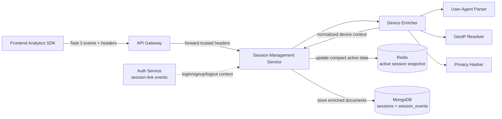
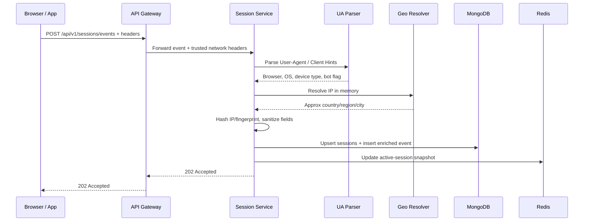
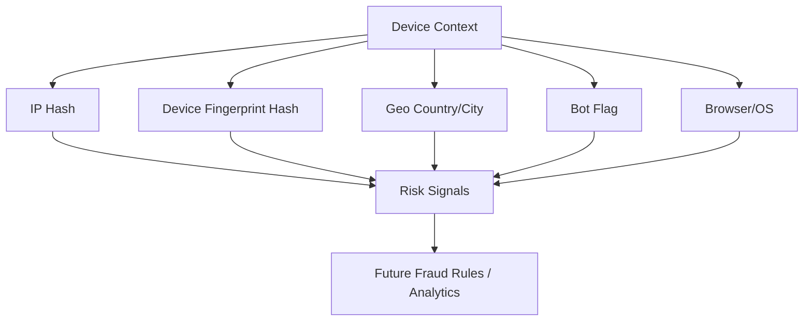

# 📱 Session Management Service - Task 5: Device Tracking


## 📌 Task Summary

| Field | Detail |
|---|---|
| Task Name | Device tracking |
| Source | `docs/01-micro-tasks.md` → `Session Management Service (Independent)` → Task 5 |
| Priority | `P1` |
| Dependency | Event API |
| Main Goal | Browser, OS, device type, and approximate location parse karna for fraud signals and analytics context |
| Input Context | Event ingestion request headers, frontend event properties, Auth session-link events |
| Output Context | Enriched `sessions`, `session_events`, and Redis active-session snapshot |
| Output Type | Structured implementation guide |
| Actual Files Created | `TaskImplementation/Session Management Service/task5.md` |
| Not Included | Heatmap aggregation, analytics API reports, full dashboard UI, retention policy, production GeoIP database provisioning |

> **Simple Hinglish goal:** Is task ka kaam hai user ke request context se device details nikalna: browser kaunsa hai, OS kya hai, desktop/mobile/tablet/bot hai ya nahi, language/screen context kya hai, aur IP se approximate country/city kya aa sakta hai. Ye data analytics, debugging, fraud detection, and future dashboard filters ke kaam aayega.

---

## ✅ Final Output Created

```text
TaskImplementation/
└── Session Management Service/
    ├── task1.md
    ├── task2.md
    ├── task3.md
    ├── task4.md
    └── task5.md
```

### Why this structure?

| Path | Purpose |
|---|---|
| `TaskImplementation/` | Project ke task-wise implementation guides ka central folder |
| `TaskImplementation/Session Management Service/` | Session Management Service ke tasks ko group karne ke liye |
| `task5.md` | Sirf **Session Management Service - Task 5** ka guide |

> 🟢 **Important boundary:** Is task me backend runtime files, database migration files, dashboard screen, ya analytics APIs create nahi kiye gaye. Ye guide batata hai ki Device Tracking kaise implement hoga based on Task 1-4 ke model, storage, event ingestion, and journey tracking design.

---

## 🧭 Implementation Approach

Guide banate time ye project docs and existing implementation notes study kiye gaye:

| Document / File | Kya use kiya gaya |
|---|---|
| `docs/01-micro-tasks.md` | Task 5 ka exact scope identify kiya: browser, OS, device, location approximation parse karna |
| `docs/08-session-management-system.md` | Device/session tracking fields, privacy rules, and dashboard context samjha |
| `TaskImplementation/Session Management Service/task1.md` | Device fields, `ip_hash`, `geo`, and privacy-aware session model align kiya |
| `TaskImplementation/Session Management Service/task2.md` | MongoDB + Redis storage strategy align ki |
| `TaskImplementation/Session Management Service/task3.md` | Event ingestion boundary and request context reuse kiya |
| `TaskImplementation/Session Management Service/task4.md` | Journey response me device context ka role samjha |
| `docs/04-microservice-design.md` | Session Service responsibilities and collection list confirm ki |
| `docs/06-auth-security.md` | Secure session fields: `device_fingerprint_hash`, `ip_hash`, `user_agent`, `last_seen_at` |
| `database/mongodb-schema-design.md` | `sessions` device/geo document shape and indexes align kiye |
| `docs/03-folder-structure.md` | Future `session-service/internal/ingest/user_agent_parser.go` location confirm ki |
| `backend/services/auth-service/internal/sessionlink/*` | Auth login/signup/logout session-link events me `DeviceInfo` and `NetworkInfo` ka current shape samjha |

---

## 🧱 Task Boundary

### ✅ Included in Task 5

- User-agent se browser, browser version, OS, OS version parse karna
- Device type normalize karna: `desktop`, `mobile`, `tablet`, `bot`, `unknown`
- Optional Client Hints headers support karna
- IP se approximate geo resolve karna: country, region, city, timezone
- Raw IP avoid karke only `ip_hash` and coarse geo store karna
- Device fingerprint ko raw form me store na karke `device_fingerprint_hash` use karna
- Event ingestion and Auth session-link flow me device enrichment attach karna
- MongoDB `sessions` and `session_events` enrichment fields explain karna
- Redis active-session snapshot me compact device/geo fields explain karna
- Fraud and analytics use-cases document karna
- Go-style code examples, Mongo indexes, and Mermaid diagrams add karna
- External libraries/tools ka what/why/install/use explain karna

### ❌ Not Included in Task 5

| Not Included | Kyun nahi? |
|---|---|
| `POST /api/v1/sessions/events` API banana | Ye already **Task 3** ka scope hai |
| Journey timeline banana | Ye already **Task 4** ka scope hai |
| Heatmap coordinate aggregation | Ye **Task 6: Heatmap concept** ka scope hai |
| `GET /api/v1/analytics/devices` report API | Ye **Task 7: Analytics APIs** ka scope hai |
| Raw event TTL and retention policy final karna | Ye **Task 8: Data retention policy** ka scope hai |
| Production MaxMind/GeoIP license automation | DevOps/external-service setup me handle hoga |
| Browser fingerprinting script banana | Privacy-sensitive hai; sirf existing hash accept/store direction documented hai |

> 🟡 **Clarification:** Device tracking ka matlab hidden invasive fingerprinting nahi hai. Is task ka focus server-side request context, user-agent parsing, coarse geo approximation, and privacy-safe hashes par hai.

---

## 🔤 Core Concepts

| Concept | Meaning | Example |
|---|---|---|
| User-Agent | Browser/app request header jo client software describe karta hai | `Mozilla/5.0 ... Chrome/125.0 ...` |
| Client Hints | Browser-provided structured headers for platform/browser hints | `Sec-CH-UA-Platform: "Android"` |
| Device Type | Normalized category | `mobile`, `desktop`, `tablet`, `bot`, `unknown` |
| Browser | Parsed browser family and version | `Chrome 125.0` |
| OS | Parsed operating system | `Android 14`, `Windows 11`, `iOS 17` |
| Geo Approximation | IP se approximate country/region/city | `IN`, `Delhi`, `Delhi` |
| IP Hash | Raw IP ka HMAC/SHA hash | `a7f...` |
| Device Fingerprint Hash | Raw fingerprint ka privacy-safe hash | `dfh_...` |
| Bot Detection | Known crawler/bot user-agent detect karna | `Googlebot`, `bingbot` |

### Simple example

```text
Request User-Agent:
Mozilla/5.0 (Linux; Android 14; Pixel 7) AppleWebKit/537.36 Chrome/125.0 Mobile Safari/537.36

Parsed context:
device.type       = mobile
device.browser    = Chrome
device.os         = Android
device.model      = Pixel 7
geo.country       = IN
ip_hash           = hmac_sha256(...)
```

**Hinglish explanation:**  
Frontend ya browser raw headers bhejta hai. Session Service direct raw data ko blindly store nahi karegi. Pehle parse + normalize karegi, sensitive fields hash karegi, aur sirf analytics-safe context MongoDB/Redis me save karegi.

---

## 🏗️ High-Level Architecture



**Hinglish explanation:**  
Device enrichment Session Service ke andar ek small component hoga. Ye request headers, event properties, and Auth session-link event context leta hai. Phir user-agent parser, GeoIP resolver, and privacy hasher use karke normalized context banata hai. Final context MongoDB and Redis me attach hota hai.

---

## 🔄 Device Enrichment Flow



**Important:** Geo resolver raw IP use karega, but sirf request memory me. Persistent storage me raw IP nahi jayega.

---

## 🧩 Data Sources

Device tracking ke liye data multiple places se aa sakta hai. Trust level har source ka same nahi hota.

| Source | Example Fields | Trust Level | Use |
|---|---|---:|---|
| HTTP request headers | `User-Agent`, `Accept-Language`, `Sec-CH-UA-*` | Medium | Browser/OS/language parse |
| Gateway trusted headers | `X-Forwarded-For`, `X-Real-IP`, `X-IP-Hash` | High if gateway-controlled | IP hash and geo |
| Frontend event properties | viewport, screen size, timezone, language | Low/Medium | UX analytics context |
| Auth session-link event | `user_agent`, `channel`, `locale`, `ip_hash`, `device_fingerprint_hash` | High internal | Login/session association |
| Existing session document | previous device snapshot | High stored context | Keep session consistent |

### Trusted header rule

```text
Browser -> API Gateway -> Session Service
```

Session Service ko `X-Forwarded-For` directly public internet se trust nahi karna chahiye. Gateway ko trusted proxy boundary treat karo. Gateway sanitize karke internal call me trusted client IP ya already computed `X-IP-Hash` bhej sakta hai.

---

## 🧾 Final Device Context Shape

Task 1 me basic `device` fields define hue the. Task 5 me un fields ko fill karne ka practical enrichment shape define hota hai.

### `device` object

| Field | Type | Required | Description |
|---|---:|---:|---|
| `type` | string | ✅ Yes | `desktop`, `mobile`, `tablet`, `bot`, `unknown` |
| `browser` | string/null | ❌ No | Browser family, example `Chrome` |
| `browser_version` | string/null | ❌ No | Browser version, example `125.0` |
| `os` | string/null | ❌ No | OS family, example `Android` |
| `os_version` | string/null | ❌ No | OS version, example `14` |
| `model` | string/null | ❌ No | Device model if safely parsed, example `Pixel 7` |
| `vendor` | string/null | ❌ No | Device vendor if known |
| `is_bot` | boolean | ✅ Yes | Bot/crawler detection result |

### `client` object

| Field | Type | Required | Description |
|---|---:|---:|---|
| `channel` | string | ✅ Yes | `user_app_web`, `seller_dashboard_web`, etc. |
| `locale` | string/null | ❌ No | First preferred language, example `en-US` |
| `timezone` | string/null | ❌ No | Client timezone if provided, example `Asia/Kolkata` |
| `screen_width` | integer/null | ❌ No | Physical screen width |
| `screen_height` | integer/null | ❌ No | Physical screen height |
| `viewport_width` | integer/null | ❌ No | Browser viewport width |
| `viewport_height` | integer/null | ❌ No | Browser viewport height |

### `geo` object

| Field | Type | Required | Description |
|---|---:|---:|---|
| `country` | string/null | ❌ No | ISO country code, example `IN` |
| `region` | string/null | ❌ No | State/region, example `DL` |
| `city` | string/null | ❌ No | Approx city |
| `timezone` | string/null | ❌ No | Geo timezone if available |
| `source` | string | ✅ Yes | `geoip`, `unknown`, `disabled` |

### Privacy/security fields

| Field | Type | Required | Description |
|---|---:|---:|---|
| `user_agent` | string | ✅ Yes | Trimmed raw user-agent, max length enforced |
| `user_agent_hash` | string/null | ❌ No | Optional hash for grouping without full UA |
| `ip_hash` | string | ✅ Yes | HMAC/SHA hash, raw IP stored nahi hota |
| `ip_version` | string | ❌ No | `ipv4`, `ipv6`, `unknown` |
| `device_fingerprint_hash` | string/null | ❌ No | Raw fingerprint never stored |

---

## 🪜 Step-by-Step Implementation

### Step 1: Enrichment input contract define karo

Device tracking ka input ek common struct me normalize karo. Isse event ingestion and Auth session-link dono same enrichment code reuse kar sakte hain.

```go
package ingest

import "time"

type DeviceEnrichmentInput struct {
	SessionID             string
	AnonymousID           string
	UserID                string
	UserAgent             string
	ClientIP              string
	IPHash                string
	DeviceFingerprint     string
	DeviceFingerprintHash string
	Channel               string
	Locale                string
	Timezone              string
	ScreenWidth           int
	ScreenHeight          int
	ViewportWidth         int
	ViewportHeight        int
	OccurredAt            time.Time
}
```

**Kaise build hua:**  
Task 3 event ingestion se `session_id`, `anonymous_id`, request headers, and event properties milte hain. Auth Service ke session-link events se `user_agent`, `channel`, `locale`, `ip_hash`, and `device_fingerprint_hash` mil sakte hain. Dono ko ek input struct me laane se duplicate parsing logic avoid hota hai.

---

### Step 2: Domain model add karo

Future runtime implementation me `internal/domain/device.go` style model useful rahega.

```go
package domain

type DeviceContext struct {
	Type           string `json:"type"`
	Browser        string `json:"browser,omitempty"`
	BrowserVersion string `json:"browser_version,omitempty"`
	OS             string `json:"os,omitempty"`
	OSVersion      string `json:"os_version,omitempty"`
	Model          string `json:"model,omitempty"`
	Vendor         string `json:"vendor,omitempty"`
	IsBot          bool   `json:"is_bot"`
}

type ClientContext struct {
	Channel        string `json:"channel"`
	Locale         string `json:"locale,omitempty"`
	Timezone       string `json:"timezone,omitempty"`
	ScreenWidth    int    `json:"screen_width,omitempty"`
	ScreenHeight   int    `json:"screen_height,omitempty"`
	ViewportWidth  int    `json:"viewport_width,omitempty"`
	ViewportHeight int    `json:"viewport_height,omitempty"`
}

type GeoContext struct {
	Country  string `json:"country,omitempty"`
	Region   string `json:"region,omitempty"`
	City     string `json:"city,omitempty"`
	Timezone string `json:"timezone,omitempty"`
	Source   string `json:"source"`
}

type EnrichedDeviceContext struct {
	UserAgent             string        `json:"user_agent"`
	UserAgentHash         string        `json:"user_agent_hash,omitempty"`
	IPHash                string        `json:"ip_hash"`
	IPVersion             string        `json:"ip_version,omitempty"`
	DeviceFingerprintHash string        `json:"device_fingerprint_hash,omitempty"`
	Device                DeviceContext `json:"device"`
	Client                ClientContext `json:"client"`
	Geo                   GeoContext    `json:"geo"`
}
```

**Kaise build hua:**  
Model ko 3 parts me split kiya: `device` technical hardware/browser info, `client` frontend/browser context, and `geo` approximate location. Privacy fields top-level rakhe taaki fraud/risk queries simple rahen.

---

### Step 3: User-Agent parser adapter banao

Direct library calls poore codebase me spread mat karo. Ek adapter/interface rakho, taaki future me parser library change karna easy ho.

```go
package ingest

import "context"

type ParsedUserAgent struct {
	Browser        string
	BrowserVersion string
	OS             string
	OSVersion      string
	DeviceType     string
	Model          string
	Vendor         string
	IsBot          bool
}

type UserAgentParser interface {
	Parse(ctx context.Context, userAgent string) ParsedUserAgent
}
```

Example adapter shape:

```go
package ingest

import (
	"context"
	"strings"
)

type LibraryUserAgentParser struct{}

func (p LibraryUserAgentParser) Parse(ctx context.Context, raw string) ParsedUserAgent {
	raw = strings.TrimSpace(raw)
	if raw == "" {
		return ParsedUserAgent{DeviceType: "unknown"}
	}

	// Actual parser library call yahan wrap hoga.
	// Example libraries: mileusna/useragent or ua-parser/uap-go.
	parsed := parseWithSelectedLibrary(raw)

	return ParsedUserAgent{
		Browser:        parsed.Browser,
		BrowserVersion: parsed.BrowserVersion,
		OS:             parsed.OS,
		OSVersion:      parsed.OSVersion,
		DeviceType:     normalizeDeviceType(parsed),
		Model:          parsed.Model,
		Vendor:         parsed.Vendor,
		IsBot:          parsed.IsBot,
	}
}
```

**Kaise build hua:**  
Parser ko interface ke peeche rakha gaya because user-agent parsing libraries ke APIs different hote hain. Service ka business logic sirf normalized `ParsedUserAgent` samjhega.

---

### Step 4: Device type normalize karo

Different parsers different labels de sakte hain. Analytics ke liye fixed enum zaruri hai.

```go
func normalizeDeviceType(parsed parserResult) string {
	if parsed.IsBot {
		return "bot"
	}
	if parsed.IsTablet {
		return "tablet"
	}
	if parsed.IsMobile {
		return "mobile"
	}
	if parsed.IsDesktop {
		return "desktop"
	}
	return "unknown"
}
```

Allowed values:

| Value | Meaning |
|---|---|
| `desktop` | Laptop/desktop browser |
| `mobile` | Phone browser/app webview |
| `tablet` | Tablet browser/app webview |
| `bot` | Bot/crawler/automation user-agent |
| `unknown` | Parser confidently identify nahi kar paya |

> 🟡 **Rule:** Unknown ko error mat banao. Analytics enrichment best-effort hai. Event ingestion fail nahi hona chahiye only because parser unsure hai.

---

### Step 5: Geo resolver define karo

Geo resolver raw IP ko in-memory read karega and approximate location return karega. Raw IP MongoDB/Redis/logs me persist nahi hogi.

```go
package ingest

import "context"

type GeoResult struct {
	Country  string
	Region   string
	City     string
	Timezone string
	Source   string
}

type GeoResolver interface {
	Resolve(ctx context.Context, clientIP string) GeoResult
}
```

Safe fallback:

```go
type DisabledGeoResolver struct{}

func (DisabledGeoResolver) Resolve(ctx context.Context, clientIP string) GeoResult {
	return GeoResult{Source: "disabled"}
}
```

**Kaise build hua:**  
GeoIP optional rakha gaya because local/dev environment me database missing ho sakti hai. Resolver fail ho to session event accept hoga with `geo.source = "unknown"` or `"disabled"`.

---

### Step 6: Privacy hasher use karo

Auth Service me already privacy-aware HMAC/SHA pattern present hai. Session Service ko bhi same style follow karna chahiye.

```go
package privacy

import (
	"crypto/hmac"
	"crypto/sha256"
	"encoding/hex"
	"strings"
)

type Hasher struct {
	pepper []byte
}

func NewHasher(pepper string) Hasher {
	return Hasher{pepper: []byte(strings.TrimSpace(pepper))}
}

func (h Hasher) Hash(value string) string {
	value = strings.TrimSpace(value)
	if value == "" || len(h.pepper) == 0 {
		return ""
	}
	mac := hmac.New(sha256.New, h.pepper)
	_, _ = mac.Write([]byte(value))
	return hex.EncodeToString(mac.Sum(nil))
}
```

Use:

```go
ipHash := input.IPHash
if ipHash == "" {
	ipHash = hasher.Hash(input.ClientIP)
}

fingerprintHash := input.DeviceFingerprintHash
if fingerprintHash == "" {
	fingerprintHash = hasher.Hash(input.DeviceFingerprint)
}
```

**Privacy reason:**  
Raw IP and raw device fingerprint high-risk personal data ho sakte hain. Hashing with secret pepper same value ko group karne deta hai, but raw value expose nahi karta.

---

### Step 7: Device enricher service banao

Yahi core component hai jo parser, geo resolver, and privacy hasher ko combine karega.

```go
package ingest

import (
	"context"
	"strings"
	"time"
)

type DeviceEnricher struct {
	parser     UserAgentParser
	geo        GeoResolver
	hasher     PrivacyHasher
	maxUALen   int
	geoTimeout time.Duration
}

type PrivacyHasher interface {
	Hash(value string) string
}

func (e DeviceEnricher) Enrich(ctx context.Context, input DeviceEnrichmentInput) EnrichedDeviceContext {
	ua := trimMax(input.UserAgent, e.maxUALen)
	parsed := e.parser.Parse(ctx, ua)

	geoCtx, cancel := context.WithTimeout(ctx, e.geoTimeout)
	defer cancel()
	geo := e.geo.Resolve(geoCtx, input.ClientIP)

	ipHash := strings.TrimSpace(input.IPHash)
	if ipHash == "" {
		ipHash = e.hasher.Hash(input.ClientIP)
	}

	deviceHash := strings.TrimSpace(input.DeviceFingerprintHash)
	if deviceHash == "" {
		deviceHash = e.hasher.Hash(input.DeviceFingerprint)
	}

	return EnrichedDeviceContext{
		UserAgent:             ua,
		UserAgentHash:         e.hasher.Hash(ua),
		IPHash:                ipHash,
		IPVersion:             detectIPVersion(input.ClientIP),
		DeviceFingerprintHash: deviceHash,
		Device: DeviceContext{
			Type:           parsed.DeviceType,
			Browser:        parsed.Browser,
			BrowserVersion: parsed.BrowserVersion,
			OS:             parsed.OS,
			OSVersion:      parsed.OSVersion,
			Model:          parsed.Model,
			Vendor:         parsed.Vendor,
			IsBot:          parsed.IsBot,
		},
		Client: ClientContext{
			Channel:        normalizeChannel(input.Channel),
			Locale:         normalizeLocale(input.Locale),
			Timezone:       normalizeTimezone(input.Timezone),
			ScreenWidth:    normalizeDimension(input.ScreenWidth),
			ScreenHeight:   normalizeDimension(input.ScreenHeight),
			ViewportWidth:  normalizeDimension(input.ViewportWidth),
			ViewportHeight: normalizeDimension(input.ViewportHeight),
		},
		Geo: GeoContext{
			Country:  geo.Country,
			Region:   geo.Region,
			City:     geo.City,
			Timezone: geo.Timezone,
			Source:   geo.Source,
		},
	}
}
```

Helper examples:

```go
func trimMax(value string, max int) string {
	value = strings.TrimSpace(value)
	if max <= 0 || len(value) <= max {
		return value
	}
	return value[:max]
}

func normalizeDimension(value int) int {
	if value <= 0 || value > 10000 {
		return 0
	}
	return value
}
```

**Kaise build hua:**  
Enricher best-effort hai. Parser failure, GeoIP timeout, missing headers, ya invalid screen size event ko reject nahi karte. Sirf enrichment fields `unknown`/empty ho jate hain.

---

### Step 8: Event ingestion me attach karo

Task 3 ke ingestion flow me validation/sanitization ke baad enrichment add hoga.

```go
func (u *IngestEventUsecase) Ingest(ctx context.Context, input SessionEventInput, req RequestContext) error {
	if err := validateEvent(input); err != nil {
		return err
	}

	cleanProps := sanitizeProperties(input.Properties)

	device := u.deviceEnricher.Enrich(ctx, DeviceEnrichmentInput{
		SessionID:             input.SessionID,
		AnonymousID:           input.AnonymousID,
		UserID:                input.UserID,
		UserAgent:             req.UserAgent,
		ClientIP:              req.ClientIP,
		IPHash:                req.IPHash,
		DeviceFingerprintHash: req.DeviceFingerprintHash,
		Channel:               req.Channel,
		Locale:                req.Locale,
		Timezone:              stringFromProps(cleanProps, "timezone"),
		ScreenWidth:           intFromProps(cleanProps, "screen_width"),
		ScreenHeight:          intFromProps(cleanProps, "screen_height"),
		ViewportWidth:         intFromProps(cleanProps, "viewport_width"),
		ViewportHeight:        intFromProps(cleanProps, "viewport_height"),
		OccurredAt:            input.OccurredAt,
	})

	event := SessionEventDocument{
		EventType:   input.EventType,
		SessionID:   input.SessionID,
		AnonymousID: input.AnonymousID,
		UserID:      input.UserID,
		Path:        input.Path,
		Properties:  cleanProps,
		Device:      device.Device,
		Client:      device.Client,
		Geo:         device.Geo,
		OccurredAt:  input.OccurredAt,
		ReceivedAt:  u.clock.Now(),
	}

	return u.repository.InsertEventAndTouchSession(ctx, event, device)
}
```

**Kaise build hua:**  
Device enrichment ingestion path me add hua, lekin public API contract same raha. Frontend ko extra required fields nahi diye gaye. Server request headers and optional safe properties se context banata hai.

---

### Step 9: Auth session-link events me reuse karo

Auth login/signup events already `DeviceInfo` and `NetworkInfo` bhej sakte hain:

```json
{
  "session_id": "sess_01HX9ZK6N5M2V4B7S8T9Q0R1P2",
  "anonymous_id": "anon_01HX9ZG9GY7V2XJ7E6BNP3K0CA",
  "user_id": "user_123",
  "device": {
    "user_agent": "Mozilla/5.0 ...",
    "channel": "user_app_web",
    "locale": "en-US",
    "device_fingerprint_hash": "hashed_device"
  },
  "network": {
    "ip_hash": "hashed_ip"
  }
}
```

Session Service consumer can enrich:

```go
func (c *AuthSessionLinkConsumer) HandleLoginSucceeded(ctx context.Context, evt LoginSucceededEvent) error {
	device := c.enricher.Enrich(ctx, DeviceEnrichmentInput{
		SessionID:             evt.SessionID,
		AnonymousID:           evt.AnonymousID,
		UserID:                evt.UserID,
		UserAgent:             evt.Device.UserAgent,
		IPHash:                evt.Network.IPHash,
		DeviceFingerprintHash: evt.Device.DeviceFingerprintHash,
		Channel:               evt.Device.Channel,
		Locale:                evt.Device.Locale,
		OccurredAt:            evt.OccurredAt,
	})

	return c.sessions.UpsertLoginContext(ctx, evt.SessionID, evt.UserID, device)
}
```

**Kaise build hua:**  
Auth flow and analytics event flow dono same enrichment logic use karte hain. Isse login session metadata and event metadata consistent rahte hain.

---

### Step 10: MongoDB documents update karo

#### `sessions` document enriched example

```json
{
  "_id": "sess_01HX9ZK6N5M2V4B7S8T9Q0R1P2",
  "session_id": "sess_01HX9ZK6N5M2V4B7S8T9Q0R1P2",
  "anonymous_id": "anon_01HX9ZG9GY7V2XJ7E6BNP3K0CA",
  "user_id": "user_123",
  "status": "active",
  "channel": "user_app_web",
  "user_agent": "Mozilla/5.0 (Linux; Android 14; Pixel 7) AppleWebKit/537.36 Chrome/125.0 Mobile Safari/537.36",
  "user_agent_hash": "f1c2a3...",
  "ip_hash": "a8b7c6...",
  "ip_version": "ipv4",
  "device_fingerprint_hash": "df9e8a...",
  "device": {
    "type": "mobile",
    "browser": "Chrome",
    "browser_version": "125.0",
    "os": "Android",
    "os_version": "14",
    "model": "Pixel 7",
    "is_bot": false
  },
  "client": {
    "channel": "user_app_web",
    "locale": "en-US",
    "timezone": "Asia/Kolkata",
    "screen_width": 1080,
    "screen_height": 2400,
    "viewport_width": 390,
    "viewport_height": 844
  },
  "geo": {
    "country": "IN",
    "region": "DL",
    "city": "Delhi",
    "timezone": "Asia/Kolkata",
    "source": "geoip"
  },
  "started_at": "2026-05-22T10:00:00Z",
  "last_seen_at": "2026-05-22T10:10:00Z",
  "ended_at": null
}
```

#### `session_events` document enriched example

```json
{
  "_id": "evt_01HX9ZPHVZV7M8B8QX5Y6Z1K2A",
  "session_id": "sess_01HX9ZK6N5M2V4B7S8T9Q0R1P2",
  "anonymous_id": "anon_01HX9ZG9GY7V2XJ7E6BNP3K0CA",
  "user_id": "user_123",
  "event_type": "product_view",
  "path": "/products/prod_123",
  "properties": {
    "product_id": "prod_123",
    "viewport_width": 390,
    "viewport_height": 844
  },
  "device": {
    "type": "mobile",
    "browser": "Chrome",
    "os": "Android",
    "is_bot": false
  },
  "client": {
    "channel": "user_app_web",
    "locale": "en-US",
    "viewport_width": 390,
    "viewport_height": 844
  },
  "geo": {
    "country": "IN",
    "city": "Delhi",
    "source": "geoip"
  },
  "occurred_at": "2026-05-22T10:03:00Z",
  "received_at": "2026-05-22T10:03:01Z"
}
```

**Storage rule:**  
`sessions` me full current device snapshot rahega. `session_events` me compact denormalized snapshot ho sakta hai taaki future device/browser analytics fast ho. Raw IP dono me nahi store hoga.

---

### Step 11: Redis active session snapshot update karo

Redis me compact fields store karo. Full user-agent optional hai; better hai browser/device/geo summary rakhna.

```text
Key:
active_session:sess_01HX9ZK6N5M2V4B7S8T9Q0R1P2

Hash fields:
anonymous_id = anon_01HX9ZG9GY7V2XJ7E6BNP3K0CA
user_id = user_123
device_type = mobile
browser = Chrome
os = Android
country = IN
city = Delhi
channel = user_app_web
last_seen_at = 2026-05-22T10:10:00Z
```

Example Go-style update:

```go
func (r RedisActiveSessionRepository) TouchDevice(ctx context.Context, sessionID string, device EnrichedDeviceContext, lastSeen time.Time) error {
	key := "active_session:" + sessionID
	values := map[string]any{
		"device_type":  device.Device.Type,
		"browser":      device.Device.Browser,
		"os":           device.Device.OS,
		"country":      device.Geo.Country,
		"city":         device.Geo.City,
		"channel":      device.Client.Channel,
		"last_seen_at": lastSeen.UTC().Format(time.RFC3339),
	}

	if err := r.client.HSet(ctx, key, values).Err(); err != nil {
		return err
	}
	return r.client.Expire(ctx, key, r.activeTTL).Err()
}
```

**Kaise build hua:**  
Redis active sessions dashboard ke live data ke liye hai. Isliye compact snapshot enough hai. Durable full context MongoDB me rahega.

---

### Step 12: MongoDB indexes add karo

Device reports and fraud signals ke liye future-friendly indexes:

```javascript
use session_db

db.sessions.createIndex(
  { "device.type": 1, started_at: -1 },
  { name: "idx_sessions_device_type_started" }
)

db.sessions.createIndex(
  { "device.browser": 1, "device.os": 1, started_at: -1 },
  { name: "idx_sessions_browser_os_started" }
)

db.sessions.createIndex(
  { "geo.country": 1, started_at: -1 },
  { name: "idx_sessions_country_started" }
)

db.sessions.createIndex(
  { ip_hash: 1, last_seen_at: -1 },
  { name: "idx_sessions_ip_hash_last_seen" }
)

db.sessions.createIndex(
  { device_fingerprint_hash: 1, last_seen_at: -1 },
  {
    name: "idx_sessions_device_fingerprint_last_seen",
    partialFilterExpression: { device_fingerprint_hash: { $exists: true, $ne: "" } }
  }
)

db.session_events.createIndex(
  { "device.type": 1, event_type: 1, occurred_at: -1 },
  { name: "idx_events_device_event_time" }
)
```

**Kaise build hua:**  
Indexes future analytics ke common filters ko support karte hain: mobile vs desktop, browser/OS breakdown, country filters, same IP hash/fingerprint suspicious patterns. Ye Task 7 API ka implementation nahi hai, sirf Task 5 ke storage-readiness indexes hain.

---

## 📂 Clean Future Folder Structure

Current requested output me only documentation file create hui:

```text
TaskImplementation/
└── Session Management Service/
    └── task5.md
```

Future actual runtime implementation ke liye recommended structure:

```text
backend/
└── services/
    └── session-service/
        ├── cmd/
        │   └── server/
        │       └── main.go
        ├── internal/
        │   ├── domain/
        │   │   ├── session.go
        │   │   ├── event.go
        │   │   └── device.go
        │   ├── ingest/
        │   │   ├── event_ingestor.go
        │   │   ├── device_enricher.go
        │   │   ├── user_agent_parser.go
        │   │   ├── geo_resolver.go
        │   │   └── request_context.go
        │   ├── privacy/
        │   │   └── hasher.go
        │   ├── repository/
        │   │   ├── mongo_session_repository.go
        │   │   └── redis_active_session_repository.go
        │   └── transport/
        │       ├── grpc/
        │       └── http/
        │           └── ingest_handler.go
        └── deploy/
```

### Folder explanation

| Folder/File | Purpose |
|---|---|
| `domain/device.go` | Device, client, geo structs |
| `ingest/device_enricher.go` | Parser + GeoIP + hashing combine karta hai |
| `ingest/user_agent_parser.go` | External user-agent parser adapter |
| `ingest/geo_resolver.go` | IP to coarse geo resolver |
| `ingest/request_context.go` | Headers and trusted gateway context extract karta hai |
| `privacy/hasher.go` | IP/fingerprint/user-agent hash helper |
| `mongo_session_repository.go` | Enriched session/event writes |
| `redis_active_session_repository.go` | Active session compact snapshot |

> 🟢 **Current task status:** Ye future structure document kiya gaya hai. Is turn me `backend/services/session-service/` create nahi kiya gaya.

---

## 🧰 External Libraries and Tools

### Tools actually used in this documentation task

| Tool | What it is | Why used | Install/Use |
|---|---|---|---|
| Markdown | Documentation format | Beginner-friendly implementation guide likhne ke liye | GitHub/GitLab/VS Code me directly preview hota hai |
| Mermaid | Markdown-friendly diagram syntax | Architecture and flow diagrams ke liye | GitHub supports Mermaid. VS Code extension optional hai |
| Shields.io badges | Badge image service | Priority/status/scope ko visually readable banane ke liye | Markdown image URL use hota hai, local install nahi chahiye |

### Future runtime libraries/tools

Actual Session Service runtime banate time ye libraries useful hongi:

| Tool/Library | What it is | Why used | Install command |
|---|---|---|---|
| Go `net/http` | Standard HTTP server/request package | Headers, remote address, and request context read karne ke liye | Built-in, install nahi chahiye |
| Go `net/netip` | Standard IP parsing package | IPv4/IPv6 detect and private IP handle karne ke liye | Built-in, install nahi chahiye |
| Go `crypto/hmac` + `crypto/sha256` | Standard crypto packages | IP/fingerprint/user-agent HMAC hash ke liye | Built-in, install nahi chahiye |
| User-agent parser | Browser/OS/device parsing library | Raw UA string ko normalized fields me convert karne ke liye | Example: `go get github.com/mileusna/useragent` |
| GeoIP2 Go reader | MaxMind `.mmdb` database reader | IP se approximate country/city resolve karne ke liye | Example: `go get github.com/oschwald/geoip2-golang` |
| MongoDB Go Driver | Official MongoDB Go client | Enriched `sessions` and `session_events` writes ke liye | `go get go.mongodb.org/mongo-driver/v2/mongo` |
| go-redis/v9 | Redis Go client | Active session snapshot update ke liye | `go get github.com/redis/go-redis/v9` |
| mongosh | MongoDB shell | Indexes and enriched docs verify karne ke liye | MongoDB tools ke saath install |
| redis-cli | Redis CLI | Active session snapshot and TTL verify karne ke liye | Redis tools ke saath install |

### Future install commands

Run only when `backend/services/session-service` Go module is created:

```bash
cd backend/services/session-service
go get github.com/mileusna/useragent
go get github.com/oschwald/geoip2-golang
go get go.mongodb.org/mongo-driver/v2/mongo
go get github.com/redis/go-redis/v9
```

### How these libraries will be used

| Library | Use pattern |
|---|---|
| User-agent parser | `UserAgentParser` adapter ke andar raw UA parse karega |
| GeoIP2 reader | `GeoResolver` adapter ke andar `ClientIP` se coarse geo return karega |
| MongoDB driver | `sessions` upsert and `session_events` insert karega |
| go-redis | `active_session:{session_id}` hash update karega |
| HMAC/SHA256 | Raw IP/fingerprint ko privacy-safe hash me convert karega |

> 🟢 **Current task status:** Koi runtime package install nahi kiya gaya. Sirf Task 5 documentation file create hui.

---

## ⚙️ Config Plan

Future implementation me config env vars se control hoga:

```env
SESSION_DEVICE_TRACKING_ENABLED=true
SESSION_USER_AGENT_MAX_LENGTH=1024
SESSION_GEOIP_ENABLED=true
SESSION_GEOIP_DB_PATH=/data/GeoLite2-City.mmdb
SESSION_GEOIP_TIMEOUT_MS=20
SESSION_PRIVACY_HASH_PEPPER=change-me-in-secret-store
SESSION_TRUSTED_PROXY_CIDRS=10.0.0.0/8,172.16.0.0/12
SESSION_ACTIVE_TTL_SECONDS=2100
SESSION_STORE_USER_AGENT=true
```

### Config explanation

| Config | Meaning |
|---|---|
| `SESSION_DEVICE_TRACKING_ENABLED` | Device enrichment on/off switch |
| `SESSION_USER_AGENT_MAX_LENGTH` | User-agent max stored length |
| `SESSION_GEOIP_ENABLED` | Geo resolver enable/disable |
| `SESSION_GEOIP_DB_PATH` | Local `.mmdb` path |
| `SESSION_GEOIP_TIMEOUT_MS` | Geo lookup max latency budget |
| `SESSION_PRIVACY_HASH_PEPPER` | HMAC pepper secret, source control me commit nahi karna |
| `SESSION_TRUSTED_PROXY_CIDRS` | Trusted gateway/proxy network |
| `SESSION_ACTIVE_TTL_SECONDS` | Redis active session expiry |
| `SESSION_STORE_USER_AGENT` | Raw user-agent store karna hai ya sirf hash, policy dependent |

---

## 🔐 Privacy and Security Rules

| Rule | Explanation |
|---|---|
| Raw IP persist nahi karni | Only `ip_hash` and coarse geo store karo |
| Raw device fingerprint persist nahi karna | Only `device_fingerprint_hash` store karo |
| Geo coarse rakho | Exact lat/long avoid karo unless explicit legal/business requirement ho |
| Client-provided fields blindly trust nahi karna | Browser properties spoof ho sakti hain |
| Gateway forwarded headers validate karo | Public request ka `X-Forwarded-For` directly trust mat karo |
| Sensitive event props remove karo | Password, OTP, token, cookie, card data analytics me nahi jayega |
| Admin UI me PII mask karo | IP hash/fingerprint hash bhi limited roles ko dikhao |
| Consent respect karo | Tracking disabled ho to minimal session health fields only |

### Sensitive fields blocklist example

```go
var sensitiveKeys = map[string]struct{}{
	"password":      {},
	"otp":           {},
	"token":         {},
	"access_token":  {},
	"refresh_token": {},
	"cookie":        {},
	"card_number":   {},
	"cvv":           {},
	"pin":           {},
}
```

> 🔴 **Never log:** raw IP, raw device fingerprint, cookies, auth tokens, OTPs, passwords, card details, or full private form values.

---

## 🧪 Testing Strategy

### Unit tests

| Test | Expected |
|---|---|
| Chrome Android UA parse | `device.type = mobile`, browser `Chrome`, OS `Android` |
| Safari iPhone UA parse | `device.type = mobile`, browser `Safari`, OS `iOS` |
| Desktop Chrome UA parse | `device.type = desktop`, browser `Chrome` |
| Tablet UA parse | `device.type = tablet` |
| Bot UA parse | `device.type = bot`, `is_bot = true` |
| Empty UA | `device.type = unknown`, no panic |
| Very long UA | Trimmed to configured max length |
| Missing IP | `ip_hash = ""`, `geo.source = unknown/disabled` |
| Private IP | Geo should return `unknown`, not fake public city |
| Raw fingerprint input | Only hash stored |
| Bad dimensions | Negative or huge screen values become `0` |

### Integration tests

| Test | Expected |
|---|---|
| Event ingestion with mobile UA | Mongo event and session contain mobile device snapshot |
| Redis touch after event | Active session hash contains device type/browser/country |
| Geo resolver timeout | Event still accepted; geo fallback used |
| Mongo write succeeds, Redis fails | Durable event remains; Redis error logged/metric emitted |
| Auth login event consumed | Existing session gets enriched device context |
| Same IP many sessions | Query by `ip_hash` works via index |

### Example test snippet

```go
func TestDeviceEnricherUnknownUserAgent(t *testing.T) {
	enricher := DeviceEnricher{
		parser:     fakeParser{},
		geo:        DisabledGeoResolver{},
		hasher:     fakeHasher{},
		maxUALen:   1024,
		geoTimeout: 20 * time.Millisecond,
	}

	got := enricher.Enrich(context.Background(), DeviceEnrichmentInput{})

	if got.Device.Type != "unknown" {
		t.Fatalf("device type = %q, want unknown", got.Device.Type)
	}
	if got.Geo.Source != "disabled" {
		t.Fatalf("geo source = %q, want disabled", got.Geo.Source)
	}
}
```

---

## 📊 Fraud and Analytics Use-Cases

Task 5 ka output future Task 7 analytics APIs and fraud checks ko context dega.

| Use-Case | Device fields used | Example |
|---|---|---|
| Browser report | `device.browser`, `device.os` | Checkout failures mostly iOS Safari par ho rahe hain |
| Mobile vs desktop conversion | `device.type` | Mobile product-view to cart conversion lower hai |
| Bot filtering | `device.is_bot` | Known bots analytics funnels se exclude ho sakte hain |
| Suspicious login | `ip_hash`, `device_fingerprint_hash`, `geo.country` | Same account sudden country/device switch |
| Abuse detection | `ip_hash`, `anonymous_id`, event frequency | Same IP hash se many anonymous sessions |
| UX debugging | viewport/screen dimensions | Small viewport pe add-to-cart clicks fail |
| Localization analytics | `client.locale`, `geo.country` | Country/locale mismatch detect |

> 🟡 **Boundary:** Task 5 sirf signals collect/enrich karta hai. Actual blocking rules, fraud scoring engine, and dashboard reports future tasks/services me aayenge.

---

## 🧮 Device Risk Signal Examples

Device tracking fraud detection me useful hai, but final decision engine nahi hai.



Example signals:

| Signal | Possible meaning | Action now |
|---|---|---|
| `is_bot = true` with high event rate | Bot/crawler traffic | Mark/filter in analytics |
| Same `device_fingerprint_hash` across many users | Shared device or abuse | Flag for future risk scoring |
| Same `ip_hash` creates many sessions quickly | Possible spam/proxy | Feed rate-limit/fraud metrics |
| Country changes between consecutive sessions | Travel, VPN, or account sharing | Future suspicious-login signal |
| Old browser with high checkout failure | UX/browser compatibility issue | Future analytics report |

---

## 🚦 Validation Rules

| Field | Rule |
|---|---|
| `user_agent` | Trim, max 1024 chars, empty allowed as unknown |
| `locale` | Use first valid language token, max 32 chars |
| `timezone` | Max 64 chars, prefer known IANA style if supplied |
| `channel` | Must map to allowed channel enum or `unknown` |
| `screen_width/height` | 1 to 10000 only, else store `0` |
| `viewport_width/height` | 1 to 10000 only, else store `0` |
| `device.type` | Must be fixed enum |
| `geo.country` | ISO-like uppercase country code if available |
| `ip_hash` | Empty only allowed when IP unavailable and trusted hash absent |
| `device_fingerprint_hash` | Optional, but raw fingerprint never persists |

---

## 🧭 Header Extraction Rules

Future `request_context.go` should be careful about proxy headers.

```go
type RequestContext struct {
	UserAgent             string
	ClientIP              string
	IPHash                string
	DeviceFingerprintHash string
	Channel               string
	Locale                string
}

func BuildRequestContext(r *http.Request, trustedProxy bool) RequestContext {
	clientIP := ""
	if trustedProxy {
		clientIP = firstForwardedIP(r.Header.Get("X-Forwarded-For"))
		if clientIP == "" {
			clientIP = strings.TrimSpace(r.Header.Get("X-Real-IP"))
		}
	}
	if clientIP == "" {
		clientIP = remoteAddrIP(r.RemoteAddr)
	}

	return RequestContext{
		UserAgent:             r.UserAgent(),
		ClientIP:              clientIP,
		IPHash:                strings.TrimSpace(r.Header.Get("X-IP-Hash")),
		DeviceFingerprintHash: strings.TrimSpace(r.Header.Get("X-Device-Fingerprint-Hash")),
		Channel:               strings.TrimSpace(r.Header.Get("X-Client-Channel")),
		Locale:                firstLanguage(r.Header.Get("Accept-Language")),
	}
}
```

**Kaise build hua:**  
Public clients headers spoof kar sakte hain. Isliye forwarded IP only trusted proxy boundary ke baad accept hoga.

---

## 🔎 Query Examples

### Sessions by device type

```javascript
db.sessions.find({
  "device.type": "mobile",
  started_at: {
    $gte: ISODate("2026-05-22T00:00:00Z"),
    $lt: ISODate("2026-05-23T00:00:00Z")
  }
})
```

### Browser/OS breakdown

```javascript
db.sessions.aggregate([
  {
    $match: {
      started_at: {
        $gte: ISODate("2026-05-22T00:00:00Z"),
        $lt: ISODate("2026-05-23T00:00:00Z")
      }
    }
  },
  {
    $group: {
      _id: {
        browser: "$device.browser",
        os: "$device.os",
        type: "$device.type"
      },
      sessions: { $sum: 1 }
    }
  },
  { $sort: { sessions: -1 } }
])
```

### Possible suspicious same IP hash

```javascript
db.sessions.aggregate([
  {
    $match: {
      started_at: { $gte: ISODate("2026-05-22T00:00:00Z") },
      ip_hash: { $exists: true, $ne: "" }
    }
  },
  {
    $group: {
      _id: "$ip_hash",
      sessions: { $sum: 1 },
      users: { $addToSet: "$user_id" },
      countries: { $addToSet: "$geo.country" }
    }
  },
  {
    $match: { sessions: { $gte: 50 } }
  }
])
```

> 🔴 **Privacy note:** Query result me `ip_hash` bhi sensitive-ish identifier treat karo. Dashboard me masked display better hai.

---

## 📈 Observability

### Metrics

| Metric | Type | Meaning |
|---|---|---|
| `session_device_enrichment_total` | Counter | Total enrichment attempts |
| `session_device_parse_errors_total` | Counter | Parser failures or unknown parsing |
| `session_device_geo_lookup_total` | Counter | Geo lookup attempts |
| `session_device_geo_lookup_errors_total` | Counter | Geo resolver errors/timeouts |
| `session_device_geo_lookup_duration_seconds` | Histogram | Geo resolver latency |
| `session_device_unknown_type_total` | Counter | Unknown device type count |
| `session_device_bot_events_total` | Counter | Bot-classified events |

### Logs

Log safe fields:

| Field | Include? | Notes |
|---|---|---|
| `request_id` | ✅ Yes | Trace request |
| `session_id` | ✅ Yes | Session lookup |
| `device_type` | ✅ Yes | Safe enum |
| `browser` | ✅ Yes | Safe normalized value |
| `os` | ✅ Yes | Safe normalized value |
| `geo_country` | ✅ Yes | Coarse value |
| `ip_hash` | ⚠️ Masked | Only first/last few chars if needed |
| `raw_ip` | ❌ No | Never log |
| `raw_fingerprint` | ❌ No | Never log |
| full `user_agent` | ⚠️ Avoid by default | Can be long/privacy-sensitive |

---

## 🧯 Failure Handling

| Failure | Behavior |
|---|---|
| User-agent parser error | Set `device.type = unknown`, continue |
| Geo DB missing | Set `geo.source = disabled`, continue |
| Geo lookup timeout | Set `geo.source = unknown`, continue |
| Hash pepper missing | Service should fail startup in production; dev may disable intentionally |
| Redis update fails | Log/metric; Mongo durable event/session write remains source |
| Mongo write fails | Event ingestion should return retryable error, not fake success |
| Client hints missing | Use user-agent fallback |
| Private/local IP | Geo unknown; still hash if policy allows |

**Rule:** Device enrichment failure should not block valid event ingestion unless privacy hashing/config is critically unsafe in production.

---

## 🧪 Manual Verification Commands

### 1. Check Mongo indexes

```bash
mongosh session_db --eval 'db.sessions.getIndexes()'
```

Expected: indexes for `device.type`, `device.browser + device.os`, `geo.country`, `ip_hash`, and `device_fingerprint_hash`.

### 2. Seed an enriched session

```javascript
use session_db

db.sessions.insertOne({
  _id: "sess_device_test",
  session_id: "sess_device_test",
  anonymous_id: "anon_device_test",
  user_id: "user_123",
  status: "active",
  channel: "user_app_web",
  user_agent: "Mozilla/5.0 (Linux; Android 14; Pixel 7) AppleWebKit/537.36 Chrome/125.0 Mobile Safari/537.36",
  ip_hash: "hashed_ip_example",
  device_fingerprint_hash: "hashed_device_example",
  device: {
    type: "mobile",
    browser: "Chrome",
    browser_version: "125.0",
    os: "Android",
    os_version: "14",
    model: "Pixel 7",
    is_bot: false
  },
  client: {
    channel: "user_app_web",
    locale: "en-US",
    timezone: "Asia/Kolkata",
    viewport_width: 390,
    viewport_height: 844
  },
  geo: {
    country: "IN",
    region: "DL",
    city: "Delhi",
    source: "geoip"
  },
  started_at: ISODate("2026-05-22T10:00:00Z"),
  last_seen_at: ISODate("2026-05-22T10:10:00Z")
})
```

### 3. Query mobile sessions

```javascript
db.sessions.find({ "device.type": "mobile" })
```

### 4. Verify Redis active snapshot

```bash
redis-cli HGETALL active_session:sess_device_test
redis-cli TTL active_session:sess_device_test
```

Expected fields:

```text
device_type mobile
browser Chrome
os Android
country IN
channel user_app_web
```

---

## ⚠️ Common Pitfalls

| Mistake | Better approach |
|---|---|
| Raw IP MongoDB me store karna | `ip_hash` + coarse `geo` store karo |
| User-agent parser output directly trust karna | Normalize fixed enums me convert karo |
| Missing parser result pe event reject karna | `unknown` set karke continue karo |
| `X-Forwarded-For` public client se trust karna | Only trusted gateway/proxy se accept karo |
| Full precise location store karna | Country/region/city enough hai |
| Browser fingerprinting bina consent | Avoid invasive fingerprinting; only hash if already consented/allowed |
| Bot traffic ko normal user funnel me count karna | `is_bot` flag future analytics filters me use karo |
| Device context sirf events me store karna | `sessions` document me summary snapshot bhi rakho |
| Redis ko source-of-truth treat karna | Redis hot cache hai; Mongo durable source hai |
| External GeoIP outage se ingestion fail karna | Fallback `geo.source = unknown` use karo |

---

## ✅ Completion Checklist

| Requirement | Status |
|---|---|
| `TaskImplementation/` folder exists | ✅ Done |
| `TaskImplementation/Session Management Service/` folder exists | ✅ Done |
| `task5.md` created | ✅ Done |
| Step-by-step Hinglish guide included | ✅ Done |
| Device/browser/OS parsing explained | ✅ Done |
| Approx location parsing explained | ✅ Done |
| Privacy-safe IP/fingerprint handling explained | ✅ Done |
| MongoDB and Redis storage impact documented | ✅ Done |
| Code examples included | ✅ Done |
| Mermaid diagrams included | ✅ Done |
| External tools/libraries documented | ✅ Done |
| Clean folder structure included | ✅ Done |
| Scope limited to Session Management Service Task 5 | ✅ Done |

---

## 🏁 Final Summary

Session Management Service - Task 5 ka implementation guide complete hai:

- Device tracking ka purpose and scope clear ho gaya.
- Browser, OS, device type, bot flag, client context, and approximate geo fields define ho gaye.
- Privacy rules set ho gaye: raw IP and raw device fingerprint persist nahi honge.
- Event ingestion and Auth session-link flows me device enrichment ka integration path explain ho gaya.
- MongoDB `sessions`/`session_events` and Redis active-session snapshot updates documented ho gaye.
- External libraries/tools ka what, why, install, and use plan documented hai.
- No runtime backend files or future task implementation create ki gayi.

> 🟢 **Next logical task:** Task 6 me Heatmap Concept handle hoga, jahan click/scroll coordinates ko aggregate karke UI optimization ke liye use kiya jayega.
