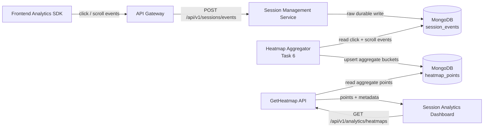
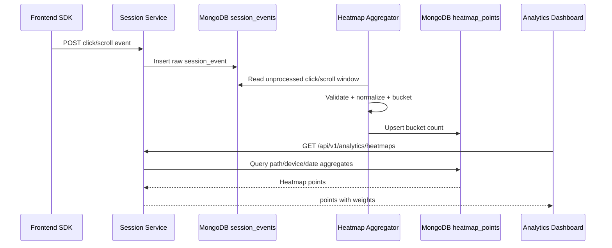
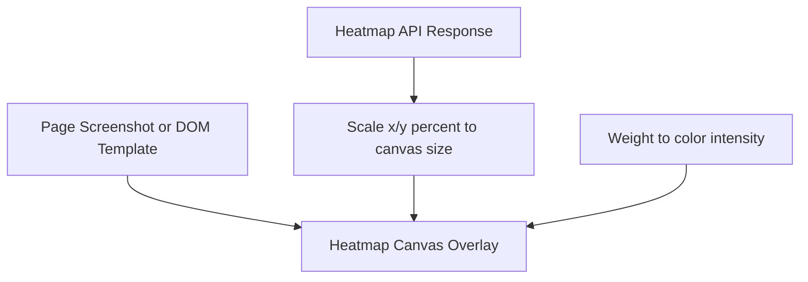

# 🔥 Session Management Service - Task 6: Heatmap Concept


## 📌 Task Summary

| Field | Detail |
|---|---|
| Task Name | Heatmap concept |
| Source | `docs/01-micro-tasks.md` → `Session Management Service (Independent)` → Task 6 |
| Priority | `P2` |
| Dependency | Event ingestion |
| Main Goal | Click and scroll coordinates aggregate karna so dashboard UI optimization ke liye heatmap show kar sake |
| Input Context | Task 3 ke `click` and `scroll` events from `session_events` |
| Output Context | Aggregated `heatmap_points` collection and dashboard read contract |
| Public Dashboard API | `GET /api/v1/analytics/heatmaps` |
| Internal gRPC Method | `SessionService.GetHeatmap` |
| Output Type | Structured implementation guide |
| Actual Files Created | `TaskImplementation/Session Management Service/task6.md` |
| Not Included | Full dashboard UI, exact session replay, screenshot capture, retention policy, production worker deployment |

> **Simple Hinglish goal:** Is task ka kaam hai raw `click` aur `scroll` events ko useful heatmap data me convert karna. Frontend se x/y coordinate, viewport size, path, device type jaise fields aate hain. Session Service in events ko normalize karke route + device + date + bucket wise aggregate karega. Dashboard baad me in points ko page overlay par render karega.

---

## ✅ Final Output Created

```text
TaskImplementation/
└── Session Management Service/
    ├── task1.md
    ├── task2.md
    ├── task3.md
    ├── task4.md
    ├── task5.md
    └── task6.md
```

### Why this structure?

| Path | Purpose |
|---|---|
| `TaskImplementation/` | Project ke task-wise implementation guides ka central folder |
| `TaskImplementation/Session Management Service/` | Session Management Service ke tasks ko group karne ke liye |
| `task6.md` | Sirf **Session Management Service - Task 6** ka guide |

> 🟢 **Important boundary:** Is task me runtime backend files, frontend dashboard files, database migrations, ya worker deployment files create nahi kiye gaye. Ye guide explain karta hai ki Heatmap Concept kaise implement hoga based on Task 1-5 ke model, storage, event ingestion, journey, and device tracking design.

---

## 🧭 Implementation Approach

Guide banate time ye project docs and existing implementation notes study kiye gaye:

| Document / File | Kya use kiya gaya |
|---|---|
| `docs/01-micro-tasks.md` | Task 6 ka exact scope identify kiya: click and scroll coordinates aggregate karna |
| `docs/08-session-management-system.md` | Heatmap conceptual design: click x/y, scroll depth, route/device/date aggregation |
| `docs/04-microservice-design.md` | Session Service responsibilities and collections confirm kiye |
| `docs/03-folder-structure.md` | Future runtime location `internal/domain/heatmap.go` and `internal/aggregation/heatmap.go` align ki |
| `database/mongodb-schema-design.md` | `session_events` and `heatmap_points` collection/index direction align ki |
| `api/master-api.json` | `GET /api/v1/analytics/heatmaps`, `HeatmapRequest`, and `HeatmapResponse` contract confirm kiya |
| `TaskImplementation/Session Management Service/task1.md` | Session identity and privacy boundary align kiya |
| `TaskImplementation/Session Management Service/task2.md` | MongoDB + Redis strategy and reserved `heatmap_points` collection align ki |
| `TaskImplementation/Session Management Service/task3.md` | `click`/`scroll` ingestion payload reuse kiya |
| `TaskImplementation/Session Management Service/task4.md` | Journey timeline ke saath heatmap boundary separate rakhi |
| `TaskImplementation/Session Management Service/task5.md` | Device type/browser/geo enrichment ko heatmap segmentation ke liye reuse kiya |

---

## 🧱 Task Boundary

### ✅ Included in Task 6

- `click` events se coordinate heatmap aggregate karna
- `scroll` events se scroll-depth heatmap aggregate karna
- Raw pixel coordinates ko normalized percentage/bucket me convert karna
- Route/path, device type, viewport bucket, date bucket ke hisaab se grouping define karna
- MongoDB `heatmap_points` collection ka recommended document shape explain karna
- `GET /api/v1/analytics/heatmaps` response shape align karna
- Aggregation worker/usecase ka step-by-step flow document karna
- Dashboard overlay ke liye read-friendly response design karna
- Privacy and safety rules define karna: no keystrokes, no password/card/private field capture
- External libraries/tools ka what/why/install/use explain karna
- Mermaid architecture and flow diagrams add karna
- Beginner-friendly Hinglish guide with code examples provide karna

### ❌ Not Included in Task 6

| Not Included | Kyun nahi? |
|---|---|
| Event ingestion endpoint banana | Ye **Task 3** me documented hai |
| Journey timeline banana | Ye **Task 4** ka scope hai |
| Device parser banana | Ye **Task 5** ka scope hai |
| Full analytics APIs like funnels/live/sessions list | Ye **Task 7** ka scope hai |
| Raw event TTL and aggregate retention final karna | Ye **Task 8** ka scope hai |
| Real screenshot capture/session replay | Docs me current task conceptual heatmap bolta hai, exact replay later phase me |
| Frontend heatmap dashboard page implement karna | Session Analytics Dashboard Task 5 ka UI scope hai |
| Production scheduler/Kubernetes cron setup | DevOps/deployment scope me aayega |

> 🟡 **Clarification:** Heatmap ka matlab user ka screen recording ya private text capture nahi hai. Task 6 sirf aggregated coordinates/depths store karega. Personal user activity ko expose karne ke bajay route/device-level aggregate insight provide hoga.

---

## 🔤 Core Concepts

| Concept | Meaning | Example |
|---|---|---|
| Click heatmap | Users ne page par kaha click kiya uska aggregated view | Add-to-cart button par high clicks |
| Scroll heatmap | Users page kitna neeche tak scroll kar rahe hain | 75% users product images tak scroll karte hain |
| Raw coordinate | Browser event ka pixel x/y | `x=210`, `y=600` |
| Normalized coordinate | Viewport ke percentage me coordinate | `x_pct=53.85`, `y_pct=71.09` |
| Bucket | Coordinates ko grouped grid cell me convert karna | `x_bucket=55`, `y_bucket=70` |
| Weight | Same bucket me total events/count | `weight=42` |
| Route/path | Page jiske liye heatmap ban raha hai | `/products/prod_123` |
| Device segment | Desktop/mobile/tablet ke separate heatmap | `mobile` |
| Viewport bucket | Similar screen sizes group karna | `mobile_360_480`, `desktop_1280_1440` |

### Simple example

```text
Raw click:
path = /products/prod_123
x = 210
y = 600
viewport_width = 390
viewport_height = 844

Normalized:
x_pct = 210 / 390 * 100 = 53.85
y_pct = 600 / 844 * 100 = 71.09

Bucketed:
x_bucket = 55
y_bucket = 70
weight += 1
```

**Hinglish explanation:**  
Raw pixel values har device par alag hote hain. Mobile 390px wide ho sakta hai, desktop 1440px. Agar hum raw pixels directly aggregate karenge to heatmap galat dikhega. Isliye coordinates ko percentage aur bucket me convert karte hain.

---

## 🏗️ High-Level Architecture



**Kaise build hua:**  
Task 3 already raw `click` and `scroll` events store karta hai. Task 6 raw events ko source-of-truth treat karega, phir aggregator worker/usecase `heatmap_points` me compact aggregate data write karega. Dashboard direct raw events nahi padhega; dashboard aggregate endpoint use karega.

---

## 🔄 Heatmap Aggregation Flow



**Hinglish explanation:**  
Ingestion path fast rehna chahiye, isliye har click par expensive aggregation sync nahi karni. Raw event save karo, client ko `202 Accepted` do, aur background/periodic aggregator aggregate collection update kare.

---

## 📥 Input Events

Task 6 ka input Task 3 ke `session_events` collection se aata hai.

### Click event input

```json
{
  "_id": "evt_click_123",
  "session_id": "sess_01HX9ZK6N5M2V4B7S8T9Q0R1P2",
  "anonymous_id": "anon_01HX9ZG9GY7V2XJ7E6BNP3K0CA",
  "user_id": "user_123",
  "event_type": "click",
  "path": "/products/prod_123",
  "properties": {
    "element_id": "add-to-cart",
    "x": 210,
    "y": 600,
    "viewport_width": 390,
    "viewport_height": 844
  },
  "device": {
    "type": "mobile",
    "browser": "Chrome",
    "os": "Android"
  },
  "occurred_at": "2026-05-22T10:16:10Z",
  "received_at": "2026-05-22T10:16:11Z"
}
```

### Scroll event input

```json
{
  "_id": "evt_scroll_123",
  "session_id": "sess_01HX9ZK6N5M2V4B7S8T9Q0R1P2",
  "anonymous_id": "anon_01HX9ZG9GY7V2XJ7E6BNP3K0CA",
  "event_type": "scroll",
  "path": "/products/prod_123",
  "properties": {
    "depth_percent": 75,
    "viewport_height": 844,
    "document_height": 2200
  },
  "device": {
    "type": "mobile"
  },
  "occurred_at": "2026-05-22T10:16:45Z",
  "received_at": "2026-05-22T10:16:46Z"
}
```

### Required properties

| Event Type | Required Properties | Optional Properties |
|---|---|---|
| `click` | `x`, `y`, `viewport_width`, `viewport_height`, `path` | `element_id`, `component`, `text_hash` |
| `scroll` | `depth_percent`, `path` | `viewport_height`, `document_height` |

> 🔴 **Privacy rule:** `text`, input values, passwords, OTP, card number, email, phone, address, search suggestions, or private form content ko heatmap properties me store nahi karna.

---

## 📦 Output Collection: `heatmap_points`

MongoDB schema docs me `heatmap_points` reserved hai. Task 6 ke liye recommended document shape:

```json
{
  "_id": "hm_click_products_prod_123_mobile_2026-05-22_55_70",
  "heatmap_type": "click",
  "path": "/products/prod_123",
  "normalized_path": "/products/:product_id",
  "device_type": "mobile",
  "viewport_bucket": "mobile_360_480",
  "day": "2026-05-22",
  "x_bucket": 55,
  "y_bucket": 70,
  "x": 55,
  "y": 70,
  "weight": 42,
  "unique_sessions": 28,
  "sample_events": 42,
  "first_seen_at": "2026-05-22T00:00:10Z",
  "last_seen_at": "2026-05-22T23:59:40Z",
  "updated_at": "2026-05-22T23:59:50Z"
}
```

Scroll aggregate example:

```json
{
  "_id": "hm_scroll_products_prod_123_mobile_2026-05-22_75",
  "heatmap_type": "scroll",
  "path": "/products/prod_123",
  "normalized_path": "/products/:product_id",
  "device_type": "mobile",
  "viewport_bucket": "mobile_360_480",
  "day": "2026-05-22",
  "depth_bucket": 75,
  "x": 50,
  "y": 75,
  "weight": 310,
  "unique_sessions": 240,
  "sample_events": 310,
  "updated_at": "2026-05-22T23:59:50Z"
}
```

### Field explanation

| Field | Meaning |
|---|---|
| `heatmap_type` | `click` or `scroll` |
| `path` | Exact page path for dashboard filtering |
| `normalized_path` | Dynamic route grouping, e.g. `/products/:product_id` |
| `device_type` | `desktop`, `mobile`, `tablet`, `bot`, `unknown` |
| `viewport_bucket` | Similar viewport widths grouped together |
| `day` | Daily aggregation bucket |
| `x_bucket`, `y_bucket` | Click coordinate buckets in percentage scale |
| `depth_bucket` | Scroll percentage bucket |
| `x`, `y` | API-friendly point coordinate |
| `weight` | Total count in bucket |
| `unique_sessions` | Approx or exact count of sessions in bucket |
| `sample_events` | Number of raw events represented |
| `updated_at` | Last aggregation update time |

---

## 🧮 Step-by-Step Implementation

### Step 1: Heatmap event types identify karo

Task 6 sirf do event types process karega:

```go
const (
	EventClick  = "click"
	EventScroll = "scroll"
)
```

**Kaise build hua:**  
Task 3 ke supported events me `click` and `scroll` already defined hain. Heatmap ko product view, search, cart, checkout events process karne ki zarurat nahi. Ye events journey/funnel me useful hain, heatmap coordinates ke liye nahi.

---

### Step 2: Click payload validate karo

Click event aggregation se pehle minimum fields validate honi chahiye.

```go
type ClickProperties struct {
	ElementID      string  `bson:"element_id" json:"element_id"`
	X              float64 `bson:"x" json:"x"`
	Y              float64 `bson:"y" json:"y"`
	ViewportWidth  float64 `bson:"viewport_width" json:"viewport_width"`
	ViewportHeight float64 `bson:"viewport_height" json:"viewport_height"`
}

func ValidateClick(p ClickProperties) error {
	if p.ViewportWidth <= 0 || p.ViewportHeight <= 0 {
		return errors.New("viewport dimensions are required")
	}
	if p.X < 0 || p.Y < 0 {
		return errors.New("coordinates cannot be negative")
	}
	if p.X > p.ViewportWidth || p.Y > p.ViewportHeight {
		return errors.New("coordinates outside viewport")
	}
	return nil
}
```

**Kaise build hua:**  
Garbage coordinates heatmap ko distort kar sakte hain. Agar `x=99999` ya viewport missing hai, us event ko aggregate nahi karna chahiye. Raw event optionally store reh sakta hai, but aggregate pipeline skip karegi.

---

### Step 3: Scroll payload validate karo

Scroll heatmap ke liye `depth_percent` 0 se 100 ke beech hona chahiye.

```go
type ScrollProperties struct {
	DepthPercent  float64 `bson:"depth_percent" json:"depth_percent"`
	ViewportHeight float64 `bson:"viewport_height" json:"viewport_height"`
	DocumentHeight float64 `bson:"document_height" json:"document_height"`
}

func ValidateScroll(p ScrollProperties) error {
	if p.DepthPercent < 0 || p.DepthPercent > 100 {
		return errors.New("depth_percent must be between 0 and 100")
	}
	return nil
}
```

**Kaise build hua:**  
Scroll event raw movement nahi hona chahiye. SDK ko max depth track karke throttled event bhejna chahiye. Backend aggregation sirf valid percent buckets update karega.

---

### Step 4: Coordinates normalize karo

Raw click ko percentage coordinate me convert karo:

```go
type NormalizedClick struct {
	XPercent float64
	YPercent float64
}

func NormalizeClick(p ClickProperties) NormalizedClick {
	return NormalizedClick{
		XPercent: (p.X / p.ViewportWidth) * 100,
		YPercent: (p.Y / p.ViewportHeight) * 100,
	}
}
```

Example:

```text
x = 210
viewport_width = 390
x_percent = 53.85

y = 600
viewport_height = 844
y_percent = 71.09
```

**Kaise build hua:**  
Percentage scale heatmap ko responsive banata hai. Dashboard mobile screenshot/template par same percentage point place kar sakta hai.

---

### Step 5: Bucket size decide karo

Recommended MVP:

| Heatmap Type | Bucket Size | Reason |
|---|---:|---|
| Click | 5% grid | Enough detail without too many Mongo docs |
| Scroll | Standard depth buckets | `25`, `50`, `75`, `90`, `100` easy dashboard use |

Click bucket function:

```go
func BucketPercent(value float64, bucketSize int) int {
	if value < 0 {
		value = 0
	}
	if value > 100 {
		value = 100
	}

	bucket := int(value/float64(bucketSize)) * bucketSize
	if bucket > 100 {
		return 100
	}
	return bucket
}
```

Scroll bucket function:

```go
func BucketScrollDepth(depth float64) int {
	switch {
	case depth >= 100:
		return 100
	case depth >= 90:
		return 90
	case depth >= 75:
		return 75
	case depth >= 50:
		return 50
	case depth >= 25:
		return 25
	default:
		return 0
	}
}
```

**Kaise build hua:**  
Har exact pixel/percentage point ke liye separate document banana high cardinality create karega. Bucket grouping se data compact, query fast, and dashboard stable rahta hai.

---

### Step 6: Viewport bucket create karo

Same route ka desktop and mobile layout different ho sakta hai. Isliye viewport grouping important hai.

```go
func ViewportBucket(deviceType string, width float64) string {
	switch deviceType {
	case "mobile":
		if width <= 360 {
			return "mobile_0_360"
		}
		if width <= 480 {
			return "mobile_360_480"
		}
		return "mobile_480_plus"
	case "tablet":
		return "tablet_768_1024"
	case "desktop":
		if width <= 1440 {
			return "desktop_1024_1440"
		}
		return "desktop_1440_plus"
	default:
		return "unknown"
	}
}
```

**Kaise build hua:**  
Product page mobile layout me button lower area me ho sakta hai, desktop layout me side column me. Agar sab viewports ek heatmap me mix honge to result confusing hoga.

---

### Step 7: Route normalize karo

Exact path aur normalized route dono store karna useful hai.

```go
func NormalizePath(path string) string {
	if strings.HasPrefix(path, "/products/") {
		return "/products/:product_id"
	}
	if strings.HasPrefix(path, "/categories/") {
		return "/categories/:category_id"
	}
	return path
}
```

**Kaise build hua:**  
`/products/prod_123` exact product page ka heatmap de sakta hai. `/products/:product_id` all product pages ka combined pattern de sakta hai. Dono options dashboard ko flexible banate hain.

---

### Step 8: Aggregate key design karo

Click aggregate key:

```text
heatmap_type + path + device_type + viewport_bucket + day + x_bucket + y_bucket
```

Scroll aggregate key:

```text
heatmap_type + path + device_type + viewport_bucket + day + depth_bucket
```

Example unique key document fields:

```javascript
{
  heatmap_type: "click",
  path: "/products/prod_123",
  device_type: "mobile",
  viewport_bucket: "mobile_360_480",
  day: "2026-05-22",
  x_bucket: 55,
  y_bucket: 70
}
```

**Kaise build hua:**  
Unique key repeat events ko same bucket me increment karne ke liye chahiye. Isse idempotent-ish upsert possible hota hai and duplicate documents avoid hote hain.

---

### Step 9: MongoDB indexes define karo

Required indexes:

```javascript
use session_db

db.heatmap_points.createIndex(
  { path: 1, device_type: 1, day: 1 },
  { name: "idx_heatmap_route_device_day" }
)

db.heatmap_points.createIndex(
  {
    heatmap_type: 1,
    path: 1,
    device_type: 1,
    viewport_bucket: 1,
    day: 1,
    x_bucket: 1,
    y_bucket: 1
  },
  {
    unique: true,
    name: "uniq_heatmap_click_bucket",
    partialFilterExpression: { heatmap_type: "click" }
  }
)

db.heatmap_points.createIndex(
  {
    heatmap_type: 1,
    path: 1,
    device_type: 1,
    viewport_bucket: 1,
    day: 1,
    depth_bucket: 1
  },
  {
    unique: true,
    name: "uniq_heatmap_scroll_bucket",
    partialFilterExpression: { heatmap_type: "scroll" }
  }
)
```

Raw events query index for aggregation:

```javascript
db.session_events.createIndex(
  { event_type: 1, occurred_at: 1, path: 1 },
  { name: "idx_events_heatmap_scan" }
)
```

**Kaise build hua:**  
Dashboard common query route + device + date range par hogi. Aggregator common scan event type + time window par karega. Unique bucket indexes duplicate aggregate rows prevent karte hain.

---

### Step 10: Click aggregate upsert karo

```go
type HeatmapPoint struct {
	HeatmapType    string    `bson:"heatmap_type"`
	Path           string    `bson:"path"`
	NormalizedPath string    `bson:"normalized_path"`
	DeviceType     string    `bson:"device_type"`
	ViewportBucket string    `bson:"viewport_bucket"`
	Day            string    `bson:"day"`
	XBucket        int       `bson:"x_bucket,omitempty"`
	YBucket        int       `bson:"y_bucket,omitempty"`
	X              int       `bson:"x"`
	Y              int       `bson:"y"`
	Weight         int       `bson:"weight"`
	UpdatedAt      time.Time `bson:"updated_at"`
}
```

MongoDB upsert:

```go
filter := bson.M{
	"heatmap_type":    "click",
	"path":            event.Path,
	"device_type":     deviceType,
	"viewport_bucket": viewportBucket,
	"day":             day,
	"x_bucket":        xBucket,
	"y_bucket":        yBucket,
}

update := bson.M{
	"$setOnInsert": bson.M{
		"normalized_path": normalizedPath,
		"x":               xBucket,
		"y":               yBucket,
		"first_seen_at":   event.OccurredAt,
	},
	"$inc": bson.M{
		"weight":        1,
		"sample_events": 1,
	},
	"$max": bson.M{
		"last_seen_at": event.OccurredAt,
	},
	"$set": bson.M{
		"updated_at": time.Now().UTC(),
	},
}

_, err := collection.UpdateOne(ctx, filter, update, options.UpdateOne().SetUpsert(true))
```

**Kaise build hua:**  
Same bucket me multiple clicks aayenge. Insert karne ke bajay upsert + `$inc` use karna better hai. Ye aggregate collection ko compact rakhta hai.

---

### Step 11: Scroll aggregate upsert karo

```go
filter := bson.M{
	"heatmap_type":    "scroll",
	"path":            event.Path,
	"device_type":     deviceType,
	"viewport_bucket": viewportBucket,
	"day":             day,
	"depth_bucket":    depthBucket,
}

update := bson.M{
	"$setOnInsert": bson.M{
		"normalized_path": normalizedPath,
		"x":               50,
		"y":               depthBucket,
		"first_seen_at":   event.OccurredAt,
	},
	"$inc": bson.M{
		"weight":        1,
		"sample_events": 1,
	},
	"$max": bson.M{
		"last_seen_at": event.OccurredAt,
	},
	"$set": bson.M{
		"updated_at": time.Now().UTC(),
	},
}
```

**Kaise build hua:**  
Scroll heatmap me x coordinate usually center `50` rakha ja sakta hai because depth vertical metric hai. Dashboard y axis par scroll depth bands show karega.

---

### Step 12: Aggregator checkpoint maintain karo

Aggregator ko pata hona chahiye last processed timestamp kya tha.

Recommended collection:

```json
{
  "_id": "heatmap_aggregator",
  "worker_name": "heatmap_aggregator",
  "last_processed_at": "2026-05-22T10:30:00Z",
  "updated_at": "2026-05-22T10:31:00Z"
}
```

Pseudo flow:

```go
func RunHeatmapAggregation(ctx context.Context, from, to time.Time) error {
	events, err := eventRepo.ListHeatmapEvents(ctx, from, to, 1000)
	if err != nil {
		return err
	}

	for _, event := range events {
		switch event.EventType {
		case "click":
			aggregateClick(ctx, event)
		case "scroll":
			aggregateScroll(ctx, event)
		}
	}

	return checkpointRepo.Save(ctx, "heatmap_aggregator", to)
}
```

**Kaise build hua:**  
Background worker repeated windows process karega. Checkpoint se worker restart ke baad bhi wahi se continue kar sakta hai. Production me idempotency ke liye event IDs processed marker ya deterministic aggregate increments strategy carefully design karni hogi.

---

### Step 13: Dashboard read API implement karo

Docs ke according public dashboard API:

```http
GET /api/v1/analytics/heatmaps?path=/products/prod_123&device_type=mobile&from=2026-05-22&to=2026-05-22
Authorization: Bearer <admin-token>
```

`api/master-api.json` me response shape:

```json
{
  "points": [
    {
      "x": 55,
      "y": 70,
      "weight": 42
    }
  ]
}
```

Recommended expanded response:

```json
{
  "path": "/products/prod_123",
  "device_type": "mobile",
  "from": "2026-05-22",
  "to": "2026-05-22",
  "heatmap_type": "click",
  "points": [
    { "x": 55, "y": 70, "weight": 42 },
    { "x": 35, "y": 82, "weight": 18 }
  ],
  "max_weight": 42,
  "total_events": 60
}
```

**Kaise build hua:**  
Existing API contract minimal `points` array define karta hai. Implementation internally extra metadata calculate kar sakti hai, but public contract stable rakhna better hai. Additive fields future-safe hain.

---

### Step 14: Query repository create karo

Future runtime example:

```go
type HeatmapRepository interface {
	UpsertClickPoint(ctx context.Context, point HeatmapPoint) error
	UpsertScrollPoint(ctx context.Context, point HeatmapPoint) error
	ListPoints(ctx context.Context, filter HeatmapFilter) ([]HeatmapPoint, error)
}

type HeatmapFilter struct {
	HeatmapType string
	Path        string
	DeviceType  string
	From        time.Time
	To          time.Time
}
```

Mongo query example:

```go
filter := bson.M{
	"path":        req.Path,
	"device_type": req.DeviceType,
	"day": bson.M{
		"$gte": req.From.Format("2006-01-02"),
		"$lte": req.To.Format("2006-01-02"),
	},
}

if req.HeatmapType != "" {
	filter["heatmap_type"] = req.HeatmapType
}

cursor, err := collection.Find(ctx, filter)
```

**Kaise build hua:**  
Repository MongoDB query details hide karega. Usecase sirf business request validate karega and response shape banayega.

---

### Step 15: Usecase response build karo

```go
type HeatmapPointDTO struct {
	X      float64 `json:"x"`
	Y      float64 `json:"y"`
	Weight int     `json:"weight"`
}

type HeatmapResponse struct {
	Points []HeatmapPointDTO `json:"points"`
}

func BuildHeatmapResponse(points []HeatmapPoint) HeatmapResponse {
	out := HeatmapResponse{Points: make([]HeatmapPointDTO, 0, len(points))}

	for _, p := range points {
		out.Points = append(out.Points, HeatmapPointDTO{
			X:      float64(p.X),
			Y:      float64(p.Y),
			Weight: p.Weight,
		})
	}

	return out
}
```

**Kaise build hua:**  
API response frontend-friendly rakha gaya: simple x/y/weight. Dashboard ko Mongo internal fields jaise `_id`, `first_seen_at`, `sample_events` expose karna zaruri nahi.

---

## 🧭 API Behavior

### Endpoint

```http
GET /api/v1/analytics/heatmaps
```

### Query parameters

| Parameter | Required | Example | Notes |
|---|---:|---|---|
| `path` | ✅ Yes | `/products/prod_123` | Exact page route |
| `device_type` | ✅ Yes | `mobile` | `desktop`, `mobile`, `tablet`, `unknown` |
| `from` | ✅ Yes | `2026-05-22` | Start day |
| `to` | ✅ Yes | `2026-05-22` | End day |
| `heatmap_type` | Optional | `click` | Default can be `click`; `scroll` supported |
| `viewport_bucket` | Optional | `mobile_360_480` | More precise dashboard filtering |

### Success response

```json
{
  "points": [
    { "x": 55, "y": 70, "weight": 42 },
    { "x": 35, "y": 82, "weight": 18 },
    { "x": 80, "y": 24, "weight": 9 }
  ]
}
```

### Empty response

```json
{
  "points": []
}
```

### Error behavior

| Case | HTTP Status | Response Code |
|---|---:|---|
| Missing `path` | `400` | `VALIDATION_ERROR` |
| Invalid date range | `400` | `VALIDATION_ERROR` |
| `from` after `to` | `400` | `VALIDATION_ERROR` |
| Unauthorized admin | `401` | `UNAUTHORIZED` |
| Non-admin role | `403` | `FORBIDDEN` |
| Mongo query failure | `500` | `INTERNAL_ERROR` |

---

## 🧰 Frontend SDK Event Guidance

Task 6 backend aggregation tabhi useful hogi jab frontend clean events bhejega.

### Click event capture

```ts
document.addEventListener("click", (event) => {
  const target = event.target as HTMLElement;

  trackEvent({
    event_type: "click",
    anonymous_id: localStorage.getItem("anonymous_id") ?? "",
    session_id: sessionStorage.getItem("session_id") ?? "",
    occurred_at: new Date().toISOString(),
    path: window.location.pathname,
    properties: {
      element_id: target.id || target.dataset.analyticsId,
      x: event.clientX,
      y: event.clientY,
      viewport_width: window.innerWidth,
      viewport_height: window.innerHeight
    }
  });
});
```

### Scroll event capture with throttle

```ts
let maxDepth = 0;
let lastSentAt = 0;

window.addEventListener("scroll", () => {
  const scrollTop = window.scrollY;
  const viewportHeight = window.innerHeight;
  const documentHeight = document.documentElement.scrollHeight;
  const depth = ((scrollTop + viewportHeight) / documentHeight) * 100;

  maxDepth = Math.max(maxDepth, Math.min(100, depth));

  const now = Date.now();
  if (now - lastSentAt < 5000) {
    return;
  }

  lastSentAt = now;

  trackEvent({
    event_type: "scroll",
    anonymous_id: localStorage.getItem("anonymous_id") ?? "",
    session_id: sessionStorage.getItem("session_id") ?? "",
    occurred_at: new Date().toISOString(),
    path: window.location.pathname,
    properties: {
      depth_percent: Math.round(maxDepth),
      viewport_height: viewportHeight,
      document_height: documentHeight
    }
  });
});
```

**Kaise build hua:**  
Scroll events noisy hote hain. Har pixel scroll send karna expensive hai. SDK should throttle/debounce and only max depth send kare.

---

## 🎛️ Dashboard Rendering Concept

Dashboard ka actual UI Task 6 me implement nahi karna, but data ka use aise hoga:



### Rendering rules

| Rule | Detail |
|---|---|
| Coordinate unit | `x` and `y` percentage scale |
| Color intensity | Higher `weight` = stronger red/orange color |
| Device layout | Mobile heatmap mobile template par render hoga |
| Scroll heatmap | Vertical bands from top to bottom |
| Empty state | No points means no heatmap data for selected filters |

### Example frontend mapping

```ts
type HeatmapPoint = {
  x: number;
  y: number;
  weight: number;
};

function toCanvasPoint(point: HeatmapPoint, width: number, height: number) {
  return {
    x: (point.x / 100) * width,
    y: (point.y / 100) * height,
    radius: Math.max(8, Math.min(40, point.weight)),
    opacity: Math.min(0.85, 0.2 + point.weight / 100)
  };
}
```

**Hinglish explanation:**  
API points percentage me dega. Dashboard canvas actual pixel size ke hisaab se point place karega. Weight color/radius decide karega.

---

## 📂 Clean Future Folder Structure

Current requested output me only documentation file create hui:

```text
TaskImplementation/
└── Session Management Service/
    └── task6.md
```

Future actual runtime implementation ke liye recommended structure:

```text
backend/
└── services/
    └── session-service/
        ├── cmd/
        │   └── server/
        │       └── main.go
        ├── internal/
        │   ├── domain/
        │   │   ├── session.go
        │   │   ├── event.go
        │   │   ├── journey.go
        │   │   └── heatmap.go
        │   ├── aggregation/
        │   │   └── heatmap.go
        │   ├── repository/
        │   │   ├── mongo_event_repository.go
        │   │   └── mongo_heatmap_repository.go
        │   ├── usecase/
        │   │   ├── aggregate_heatmap.go
        │   │   └── get_heatmap.go
        │   └── transport/
        │       ├── grpc/
        │       │   └── heatmap_handler.go
        │       └── http/
        │           └── analytics_handler.go
        └── deploy/
```

> 🟡 **Boundary:** Ye future runtime folder structure docs se aligned reference hai. Task 6 ne in backend files/folders ko create nahi kiya.

---

## 🧪 Testing Strategy

### Unit tests

| Test | Expected |
|---|---|
| Normalize click with valid viewport | Correct percentage |
| Reject negative click coordinate | Validation error |
| Reject coordinate outside viewport | Validation error |
| Bucket 53.85 with size 5 | `50` or `55` based chosen rounding rule |
| Bucket scroll depth 76 | `75` |
| Viewport width 390 mobile | `mobile_360_480` |
| Normalize product path | `/products/:product_id` |

Example table-driven test:

```go
func TestBucketScrollDepth(t *testing.T) {
	tests := []struct {
		name  string
		depth float64
		want  int
	}{
		{name: "quarter", depth: 27, want: 25},
		{name: "half", depth: 55, want: 50},
		{name: "almost full", depth: 92, want: 90},
		{name: "full", depth: 100, want: 100},
	}

	for _, tt := range tests {
		t.Run(tt.name, func(t *testing.T) {
			if got := BucketScrollDepth(tt.depth); got != tt.want {
				t.Fatalf("got %d, want %d", got, tt.want)
			}
		})
	}
}
```

### Integration tests

| Scenario | Verify |
|---|---|
| Insert click event then run aggregator | `heatmap_points.weight` increments |
| Multiple clicks same bucket | Single document with higher weight |
| Clicks different device type | Separate documents |
| Scroll 75 and 90 depth | Separate `depth_bucket` docs |
| Heatmap API path/device/date query | Returns only matching points |

### Manual verification with MongoDB

```javascript
use session_db

db.session_events.insertOne({
  _id: "evt_click_manual_1",
  session_id: "sess_manual_1",
  anonymous_id: "anon_manual_1",
  event_type: "click",
  path: "/products/prod_123",
  properties: {
    x: 210,
    y: 600,
    viewport_width: 390,
    viewport_height: 844
  },
  device: { type: "mobile" },
  occurred_at: ISODate("2026-05-22T10:16:10Z"),
  received_at: ISODate("2026-05-22T10:16:11Z")
})

db.heatmap_points.find({
  path: "/products/prod_123",
  device_type: "mobile",
  day: "2026-05-22"
})
```

---

## 📊 Observability

Task 6 ko Platform Foundation observability baseline follow karna chahiye.

### Metrics

| Metric | Type | Purpose |
|---|---|---|
| `session_heatmap_aggregation_runs_total` | Counter | Aggregator runs count |
| `session_heatmap_events_scanned_total` | Counter | Raw click/scroll events scanned |
| `session_heatmap_events_skipped_total` | Counter | Invalid/privacy-skipped events |
| `session_heatmap_points_upserted_total` | Counter | Aggregate bucket upserts |
| `session_heatmap_aggregation_duration_seconds` | Histogram | Worker duration |
| `session_heatmap_api_requests_total` | Counter | Dashboard API requests |
| `session_heatmap_api_errors_total` | Counter | Dashboard API failures |
| `session_heatmap_query_duration_seconds` | Histogram | Mongo read latency |

### Logs

```json
{
  "level": "info",
  "service": "session-service",
  "component": "heatmap_aggregator",
  "request_id": "req_123",
  "from": "2026-05-22T10:00:00Z",
  "to": "2026-05-22T10:05:00Z",
  "events_scanned": 1200,
  "points_upserted": 320,
  "events_skipped": 12,
  "duration_ms": 420
}
```

### Trace spans

```text
session.heatmap.aggregate
└── session.heatmap.fetch_events
└── session.heatmap.normalize
└── session.heatmap.upsert_points

HTTP GET /api/v1/analytics/heatmaps
└── session.heatmap.validate_request
└── session.heatmap.query_points
└── session.heatmap.build_response
```

---

## 🔐 Privacy and Security Rules

| Rule | Detail |
|---|---|
| No keystrokes | Keyboard input events collect nahi karne |
| No form values | Input/select/textarea values store nahi karne |
| No sensitive fields | Password, OTP, card, CVV, email, phone, address capture nahi karna |
| No raw IP in heatmap | Heatmap aggregate me IP/user identifiers nahi hone chahiye |
| Admin-only API | `GET /api/v1/analytics/heatmaps` requires admin auth |
| Aggregate by groups | Dashboard route/device/date aggregate show kare, individual user replay nahi |
| Respect consent | User tracking consent disabled ho to events send/process na karo |
| Deletion support | User deletion request par raw user events delete/anonymize; aggregate data user-level na ho |

### Sensitive target skip example

Frontend SDK should skip private elements:

```ts
function shouldTrackClick(target: HTMLElement): boolean {
  const tag = target.tagName.toLowerCase();
  const type = target.getAttribute("type");

  if (["input", "textarea", "select"].includes(tag)) {
    return false;
  }

  if (["password", "email", "tel", "number"].includes(type ?? "")) {
    return false;
  }

  if (target.closest("[data-analytics-private='true']")) {
    return false;
  }

  return true;
}
```

**Kaise build hua:**  
Heatmap UX optimization ke liye hai, surveillance ke liye nahi. Privacy-safe aggregate design se useful insight milti hai without storing sensitive user content.

---

## 🧰 External Libraries and Tools

Task 6 ke guide me koi library install nahi ki gayi, but future implementation me ye tools useful honge:

| Tool / Library | What it is | Why used | Install |
|---|---|---|---|
| MongoDB Go Driver | Official MongoDB client for Go | `session_events` read and `heatmap_points` upsert ke liye | `go get go.mongodb.org/mongo-driver/v2/mongo` |
| `mongosh` | MongoDB shell | Indexes create and aggregate data verify karne ke liye | MongoDB tools package / Docker image |
| Prometheus client | Metrics library | Aggregator and API metrics expose karne ke liye | `go get github.com/prometheus/client_golang/prometheus` |
| OpenTelemetry Go | Distributed tracing SDK | Aggregation/API trace spans ke liye | `go get go.opentelemetry.io/otel` |
| Heatmap.js | Browser heatmap rendering library | Future dashboard overlay render karne ke liye | `npm install heatmap.js` |
| D3.js | Data visualization toolkit | Future custom heatmap/scroll bands ke liye | `npm install d3` |
| Lodash throttle/debounce | Frontend event noise control | Scroll/click batching and throttling ke liye | `npm install lodash` |

### MongoDB Go Driver usage

```bash
cd backend/services/session-service
go get go.mongodb.org/mongo-driver/v2/mongo
```

Use:

```go
client, err := mongo.Connect(options.Client().ApplyURI(os.Getenv("SESSION_MONGO_URI")))
if err != nil {
	return err
}

collection := client.Database("session_db").Collection("heatmap_points")
```

### Heatmap.js usage for future dashboard

```bash
cd frontend/session-analytics-dashboard
npm install heatmap.js
```

Use:

```ts
import h337 from "heatmap.js";

const heatmap = h337.create({
  container: document.getElementById("heatmap")!
});

heatmap.setData({
  max: 42,
  data: points.map((point) => ({
    x: point.x,
    y: point.y,
    value: point.weight
  }))
});
```

> 🟡 **Note:** Task 6 ne external dependencies install nahi ki. Ye section future implementation ke liye explains what/why/how.

---

## ⚙️ Aggregation Modes

| Mode | Use | Pros | Cons |
|---|---|---|---|
| Batch worker every 1-5 min | MVP recommended | Simple, ingestion fast | Slight delay in dashboard |
| Stream consumer from Kafka/RabbitMQ | High traffic production | Near real-time aggregates | More infra complexity |
| On-demand aggregation from raw events | Debug/admin rare use | No precompute needed | Slow for large ranges |
| Hybrid | Production mature setup | Fast dashboard + rebuild possible | More moving parts |

> 🟢 **Recommended MVP:** Batch worker. Task 3 raw events already durable MongoDB me hain. Worker small time windows process karke `heatmap_points` update kare.

---

## 🧮 MongoDB Aggregation Alternative

Application worker ke alawa MongoDB aggregation pipeline se bhi heatmap points calculate ho sakte hain.

```javascript
db.session_events.aggregate([
  {
    $match: {
      event_type: "click",
      path: "/products/prod_123",
      occurred_at: {
        $gte: ISODate("2026-05-22T00:00:00Z"),
        $lt: ISODate("2026-05-23T00:00:00Z")
      }
    }
  },
  {
    $project: {
      path: 1,
      device_type: "$device.type",
      x_pct: {
        $multiply: [
          { $divide: ["$properties.x", "$properties.viewport_width"] },
          100
        ]
      },
      y_pct: {
        $multiply: [
          { $divide: ["$properties.y", "$properties.viewport_height"] },
          100
        ]
      }
    }
  },
  {
    $project: {
      path: 1,
      device_type: 1,
      x_bucket: { $multiply: [{ $floor: { $divide: ["$x_pct", 5] } }, 5] },
      y_bucket: { $multiply: [{ $floor: { $divide: ["$y_pct", 5] } }, 5] }
    }
  },
  {
    $group: {
      _id: {
        path: "$path",
        device_type: "$device_type",
        x_bucket: "$x_bucket",
        y_bucket: "$y_bucket"
      },
      weight: { $sum: 1 }
    }
  }
])
```

**Kaise build hua:**  
Mongo aggregation quick prototype/debug ke liye useful hai. Production me app worker zyada control deta hai: privacy skip rules, checkpoints, observability, retries, and custom route normalization.

---

## 🚦 Performance and Scalability

| Concern | Recommendation |
|---|---|
| Click event volume high | SDK sampling/throttle and backend rate limits use karo |
| Scroll noise high | Max depth + throttle only |
| Too many buckets | 5% or 10% bucket size use karo |
| Dashboard slow | `heatmap_points` pre-aggregate use karo |
| Huge date ranges | Max range limit e.g. 31 days |
| Dynamic URLs explode cardinality | `normalized_path` use karo |
| Mongo write contention | Batch upserts and window processing |
| Rebuild needed | Raw events TTL tak rebuild possible rahega |

### Recommended API limits

| Limit | Value |
|---|---:|
| Max date range | 31 days |
| Max points returned | 5000 |
| Default heatmap type | `click` |
| Default bucket size | 5% |
| Worker batch size | 1000-5000 events |

---

## 🧯 Troubleshooting Guide

| Problem | Likely Cause | Fix |
|---|---|---|
| Heatmap empty | No raw click/scroll events for selected path/device/date | Check `session_events` query first |
| Points all in one corner | Raw pixel coordinates used directly | Normalize x/y by viewport |
| Mobile heatmap looks wrong | Desktop and mobile mixed | Filter by `device_type` and `viewport_bucket` |
| Too many Mongo docs | Bucket size too small or path not normalized | Use 5/10% buckets and `normalized_path` |
| Scroll heatmap too noisy | SDK sends every scroll event | Throttle and send max depth only |
| Duplicate weights after worker restart | Non-idempotent checkpoint | Add checkpoint/event marker strategy |
| Sensitive clicks captured | SDK not skipping private elements | Use `data-analytics-private="true"` and element filtering |
| API slow | Querying raw events instead of aggregate | Read from `heatmap_points` |

---

## ✅ Acceptance Checklist

| Check | Status |
|---|---|
| `TaskImplementation/` folder exists | ✅ Done |
| `TaskImplementation/Session Management Service/` folder exists | ✅ Done |
| `task6.md` created | ✅ Done |
| Scope limited to Session Management Service Task 6 | ✅ Done |
| Click heatmap aggregation explained | ✅ Done |
| Scroll heatmap aggregation explained | ✅ Done |
| Raw event input examples included | ✅ Done |
| `heatmap_points` document shape included | ✅ Done |
| MongoDB indexes included | ✅ Done |
| Dashboard API contract included | ✅ Done |
| Mermaid diagrams included | ✅ Done |
| External libraries/tools explained | ✅ Done |
| Privacy/security rules included | ✅ Done |
| No runtime backend/frontend files created | ✅ Done |

---

## 🎯 Final Summary

Session Management Service Task 6 ke liye Heatmap Concept define ho gaya:

- `click` events ko normalized x/y percentage buckets me aggregate kiya jayega.
- `scroll` events ko depth buckets like `25`, `50`, `75`, `90`, `100` me aggregate kiya jayega.
- Raw `session_events` source-of-truth rahenge; dashboard `heatmap_points` aggregate collection se read karega.
- Aggregation route/path, device type, viewport bucket, and day ke basis par hogi.
- `GET /api/v1/analytics/heatmaps` admin-only endpoint simple `points` response return karega.
- Privacy rules clearly defined hain: no keystrokes, no form values, no sensitive data, no raw IP/user identifiers in heatmap aggregates.
- Future implementation ke liye Go, MongoDB, frontend SDK, observability, and dashboard rendering examples ready hain.

> ✅ **Task 6 complete:** Documentation-level implementation guide ready hai. Actual backend service, dashboard UI, migrations, scheduler, CI, ya deployment files intentionally create nahi kiye gaye, kyunki current requested output sirf required folder structure aur `task6.md` content hai.
