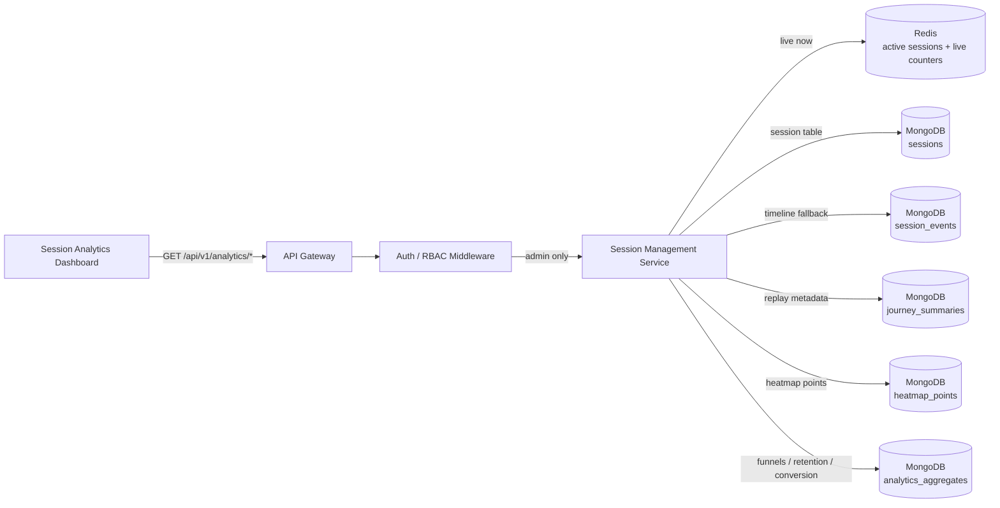
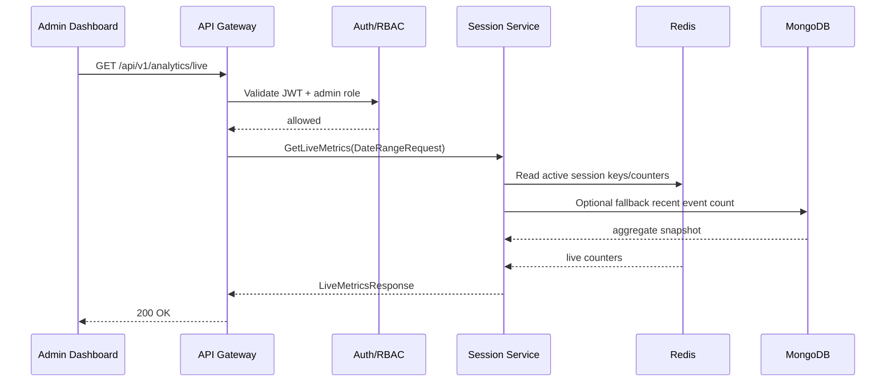
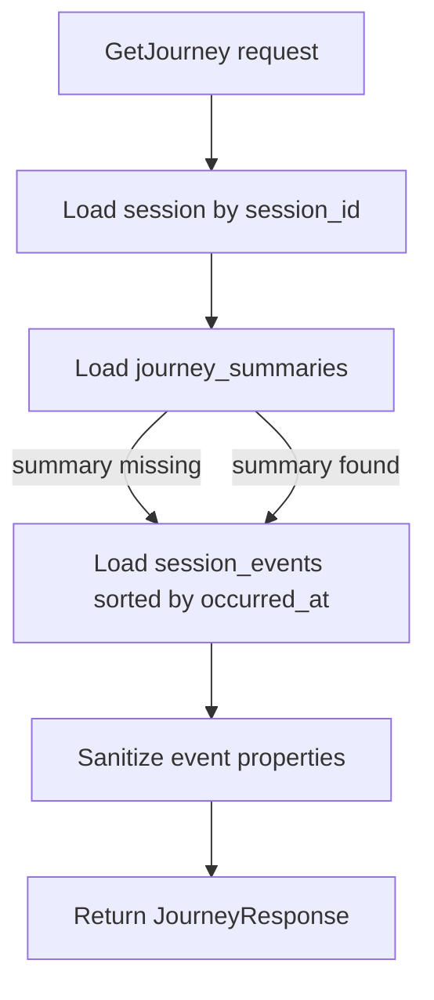
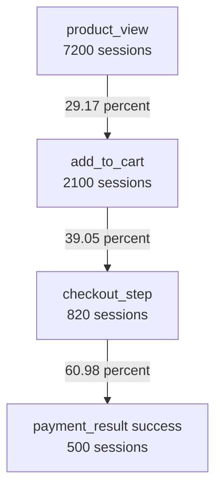
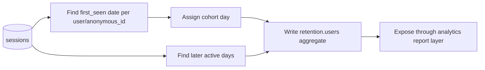
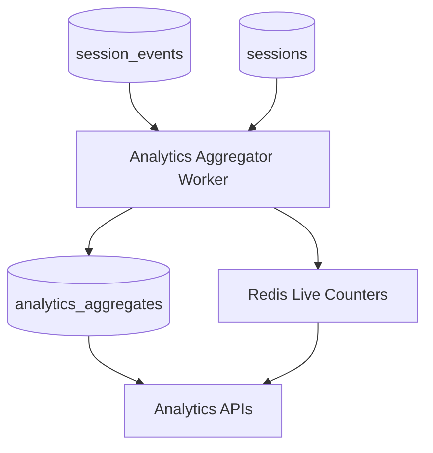

# 📊 Session Management Service - Task 7: Analytics APIs


## 📌 Task Summary

| Field | Detail |
|---|---|
| Task Name | Analytics APIs |
| Source | `docs/01-micro-tasks.md` -> `Session Management Service (Independent)` -> Task 7 |
| Priority | `P1` |
| Dependency | Aggregations |
| Main Goal | Active users, funnels, conversion, retention, and session replay metadata expose karna |
| Public Dashboard APIs | `GET /api/v1/analytics/live`, `GET /api/v1/analytics/sessions`, `GET /api/v1/analytics/sessions/{session_id}/journey`, `GET /api/v1/analytics/funnels`, `GET /api/v1/analytics/heatmaps` |
| Internal gRPC Methods | `GetLiveMetrics`, `ListSessions`, `GetJourney`, `GetFunnelReport`, `GetHeatmap` |
| Output Type | Structured implementation guide |
| Actual Files Created | `TaskImplementation/Session Management Service/task7.md` |
| Not Included | Data retention final TTL policy, dashboard UI screens, production worker deployment, exact browser screen recording |

> **Simple Hinglish goal:** Is task ka kaam Session Management Service ke analytics data ko dashboard ke liye readable APIs me expose karna hai. Events already ingest ho rahe hain, journey/device/heatmap concepts define ho chuke hain. Ab admin analytics dashboard active users, sessions list, funnel conversion, retention-style cohorts, heatmap data, aur session replay metadata APIs se read karega.

---

## ✅ Final Output Created

```text
TaskImplementation/
└── Session Management Service/
    ├── task1.md
    ├── task2.md
    ├── task3.md
    ├── task4.md
    ├── task5.md
    ├── task6.md
    └── task7.md
```

### Why this structure?

| Path | Purpose |
|---|---|
| `TaskImplementation/` | Project ke task-wise implementation guides ka central folder |
| `TaskImplementation/Session Management Service/` | Session Management Service ke independent tasks ko group karne ke liye |
| `task7.md` | Sirf **Session Management Service - Task 7** ka guide |

> 🟢 **Important boundary:** Is task me backend runtime files, frontend dashboard screens, DB migrations, ya infra changes create nahi kiye gaye. Ye guide explain karta hai ki Analytics APIs kaise implement hongi based on Task 1-6 ke session model, storage, ingestion, journey, device, and heatmap foundations.

---

## 🧭 Implementation Approach

Guide banate time ye project docs and existing implementation notes study kiye gaye:

| Document / File | Kya use kiya gaya |
|---|---|
| `docs/01-micro-tasks.md` | Task 7 ka exact scope identify kiya: active users, funnels, conversion, retention, session replay metadata |
| `docs/08-session-management-system.md` | Dashboard views, metrics, APIs, storage strategy, and scalability rules align kiye |
| `docs/04-microservice-design.md` | Session Service responsibilities, gRPC methods, REST APIs, and collection list confirm ki |
| `docs/05-database-design.md` | Session indexes and MongoDB + Redis storage strategy confirm ki |
| `database/mongodb-schema-design.md` | `sessions`, `session_events`, `heatmap_points`, `analytics_aggregates` collections and indexes align kiye |
| `api/master-api.json` | REST routes, auth level, request schemas, response schemas, and gRPC method names confirm kiye |
| `docs/06-auth-security.md` | Admin auth, PII masking, secure session fields, and privacy rules include kiye |
| `docs/12-logging-monitoring-scalability.md` | Analytics failure isolation, metrics, tracing, and graceful degradation rules include kiye |
| `TaskImplementation/Session Management Service/task1.md` | Session identity, lifecycle, channel, and privacy fields reuse kiye |
| `TaskImplementation/Session Management Service/task2.md` | MongoDB/Redis storage and `analytics_aggregates` reserved collection reuse ki |
| `TaskImplementation/Session Management Service/task3.md` | Event ingestion schema and event types reuse kiye |
| `TaskImplementation/Session Management Service/task4.md` | Journey timeline and `journey_summaries` reuse kiye |
| `TaskImplementation/Session Management Service/task5.md` | Device/browser/geo fields analytics filters me reuse kiye |
| `TaskImplementation/Session Management Service/task6.md` | Heatmap aggregate read API reuse ki |

---

## 🧱 Task Boundary

### ✅ Included in Task 7

- Analytics dashboard ke read APIs define karna
- Live active users and active sessions expose karna
- Sessions list API with filters and pagination explain karna
- Journey endpoint ko session replay metadata ke roop me expose karna
- Funnel report API define karna
- Conversion rate calculation explain karna
- Retention/cohort style aggregates ka design define karna
- Heatmap read API ko analytics API family me include karna
- `analytics_aggregates` collection ka recommended document shape define karna
- Redis live counters and MongoDB aggregate read path explain karna
- Admin authorization, PII masking, rate limiting, caching, and observability rules define karna
- Go-style domain/usecase/repository/handler code examples dena
- Mermaid architecture, sequence, data-flow, and funnel diagrams add karna
- External libraries/tools ka what/why/install/use explain karna

### ❌ Not Included in Task 7

| Not Included | Kyun nahi? |
|---|---|
| Event ingestion endpoint banana | Ye already **Task 3** me documented hai |
| Journey timeline banana from scratch | Ye already **Task 4** ka scope hai |
| Device parser banana | Ye already **Task 5** ka scope hai |
| Heatmap aggregation worker banana | Ye already **Task 6** ka scope hai |
| Raw event TTL final policy | Ye **Task 8: Data retention policy** ka scope hai |
| Session Analytics Dashboard UI | Ye separate **Session Analytics Dashboard** frontend task ka scope hai |
| Exact browser recording/session replay | Current docs metadata/timeline style replay support karte hain, video-like recording nahi |
| Production scheduler/Kubernetes CronJob | DevOps/deployment scope me handle hoga |

> 🟡 **Clarification:** "Session replay metadata" ka matlab yaha ordered timeline, entry/exit page, device, path sequence, milestones, and event summary hai. Is task me keystrokes, full DOM capture, screen video, ya private field capture bilkul nahi hai.

---

## 🔤 Core Concepts

| Concept | Meaning | Example |
|---|---|---|
| Live metrics | Abhi active users/sessions ka quick snapshot | `active_users=420` |
| Session list | Admin dashboard me sessions table | device, user, entry page, last seen |
| Funnel | Steps ke beech conversion/drop-off report | product view -> cart -> checkout -> paid |
| Conversion rate | Previous step se next step complete karne ka percentage | `add_to_cart / product_view` |
| Retention | Users/sessions ka repeat behavior over time | D0, D1, D7 returning users |
| Session replay metadata | Session journey ka safe, structured timeline summary | pages, events, milestones |
| Aggregate | Precomputed metric document | daily conversion by channel |
| Segment | Filter/group dimension | device type, channel, country, campaign |

### Simple example

```text
Raw events:
page_view -> product_view -> add_to_cart -> checkout_step -> payment_result

Analytics APIs:
live metrics      = active sessions now
sessions list     = session table for admins
journey/replay    = same events sorted in timeline
funnel report     = conversion between steps
retention report  = how many users return later
heatmap report    = click/scroll aggregate points
```

**Hinglish explanation:**  
Task 7 raw events ko directly dashboard par dump nahi karta. Pehle data ko query-friendly form me read karta hai: Redis se live counters, MongoDB se session/journey/heatmap data, aur `analytics_aggregates` se precomputed reports. Isse dashboard fast, stable, and privacy-safe rahega.

---

## 🏗️ High-Level Architecture



**Kaise build hua:**  
Dashboard public browser client hai, isliye direct MongoDB/Redis access nahi karega. API Gateway admin auth check karega, phir Session Service gRPC/REST handler relevant source se read karega. Live metrics Redis se fast milenge, historical analytics MongoDB aggregates se milenge.

---

## 🔄 Analytics Read Flow



**Hinglish explanation:**  
Analytics APIs admin-only hain. Gateway JWT/RBAC validate karega. Session Service Redis/Mongo se data read karega and clean response return karega. Sensitive fields response me masked/omitted rahenge.

---

## 🔌 API Contract Summary

`api/master-api.json` ke hisaab se Task 7 me ye APIs use hongi:

| API ID | Method | Path | gRPC Method | Auth | Purpose |
|---|---|---|---|---|---|
| `analytics.live` | `GET` | `/api/v1/analytics/live` | `SessionService.GetLiveMetrics` | `admin` | Active users/sessions and events per minute |
| `analytics.sessions` | `GET` | `/api/v1/analytics/sessions` | `SessionService.ListSessions` | `admin` | Sessions table/list with filters |
| `analytics.journey` | `GET` | `/api/v1/analytics/sessions/{session_id}/journey` | `SessionService.GetJourney` | `admin` | Session replay metadata/timeline |
| `analytics.funnels` | `GET` | `/api/v1/analytics/funnels` | `SessionService.GetFunnelReport` | `admin` | Funnel conversion and drop-off |
| `analytics.heatmaps` | `GET` | `/api/v1/analytics/heatmaps` | `SessionService.GetHeatmap` | `admin` | Click/scroll heatmap points |

### Task 7 metric coverage

| Requirement | API / Source |
|---|---|
| Active users | `GET /api/v1/analytics/live` from Redis active sessions |
| Funnels | `GET /api/v1/analytics/funnels` from `analytics_aggregates` or raw-event fallback |
| Conversion | Funnel response calculated from step counts |
| Retention | `analytics_aggregates` metric family; can be exposed through funnel/report style endpoint or future explicit route |
| Session replay metadata | `GET /api/v1/analytics/sessions/{session_id}/journey` from `journey_summaries` + `session_events` |

> 🟡 **API note:** `api/master-api.json` does not currently define a dedicated `/api/v1/analytics/retention` route. Task 7 still defines retention aggregate design because the micro-task requires it. Route addition can happen later in API contract update; this file does not modify `api/master-api.json`.

---

## 🗃️ Data Sources

| Source | Used By | Why |
|---|---|---|
| Redis active session keys | Live metrics | Fast current active user/session count |
| Redis event counters | Live `events_per_minute` | Low-latency hot metric |
| MongoDB `sessions` | Sessions list, filters, replay header | Durable session metadata |
| MongoDB `session_events` | Journey fallback, ad-hoc funnel rebuild | Source-of-truth raw analytics events |
| MongoDB `journey_summaries` | Replay metadata summary | Dashboard-friendly compact session story |
| MongoDB `heatmap_points` | Heatmap API | Pre-aggregated click/scroll points |
| MongoDB `analytics_aggregates` | Funnels, conversion, retention | Fast historical analytics reports |

### Recommended `analytics_aggregates` shape

```json
{
  "_id": "agg_funnel_checkout_daily_2026-05-22_all",
  "metric": "funnel.checkout",
  "bucket": "daily",
  "bucket_start": "2026-05-22T00:00:00Z",
  "bucket_end": "2026-05-23T00:00:00Z",
  "segment": {
    "channel": "user_app_web",
    "device_type": "mobile",
    "country": "IN",
    "campaign": "summer_sale"
  },
  "steps": [
    {
      "name": "product_view",
      "event_type": "product_view",
      "count": 10000,
      "unique_sessions": 7200,
      "unique_users": 5400,
      "conversion_from_previous": 100,
      "dropoff_from_previous": 0
    },
    {
      "name": "add_to_cart",
      "event_type": "add_to_cart",
      "count": 2400,
      "unique_sessions": 2100,
      "unique_users": 1800,
      "conversion_from_previous": 29.17,
      "dropoff_from_previous": 70.83
    },
    {
      "name": "checkout_started",
      "event_type": "checkout_step",
      "count": 900,
      "unique_sessions": 820,
      "unique_users": 760,
      "conversion_from_previous": 39.05,
      "dropoff_from_previous": 60.95
    },
    {
      "name": "payment_completed",
      "event_type": "payment_result",
      "count": 520,
      "unique_sessions": 500,
      "unique_users": 480,
      "conversion_from_previous": 60.98,
      "dropoff_from_previous": 39.02
    }
  ],
  "schema_version": 1,
  "calculated_at": "2026-05-22T23:59:50Z",
  "updated_at": "2026-05-22T23:59:50Z"
}
```

### Recommended indexes

```javascript
use session_db

db.analytics_aggregates.createIndex(
  { metric: 1, bucket: 1, segment: 1 },
  { unique: true, name: "uniq_metric_bucket_segment" }
)

db.analytics_aggregates.createIndex(
  { metric: 1, bucket_start: -1 },
  { name: "idx_metric_time" }
)

db.analytics_aggregates.createIndex(
  { "segment.channel": 1, "segment.device_type": 1, bucket_start: -1 },
  { name: "idx_segment_time" }
)
```

**Why?**  
Dashboard mostly date range, metric type, and segment filters se query karega. Ye indexes reports ko fast banate hain without scanning raw `session_events` every time.

---

## 📡 API 1: Live Metrics

### Endpoint

```http
GET /api/v1/analytics/live?from=2026-05-22T00:00:00Z&to=2026-05-22T23:59:59Z
Authorization: Bearer <admin_access_token>
```

### gRPC

```text
SessionService.GetLiveMetrics(DateRangeRequest) -> LiveMetricsResponse
```

### Response schema from `api/master-api.json`

```json
{
  "active_users": 420,
  "active_sessions": 510,
  "events_per_minute": 184.5
}
```

### How it should work

| Metric | Source | Calculation |
|---|---|---|
| `active_users` | Redis active user/session sets | Unique non-null `user_id` active in current TTL window |
| `active_sessions` | Redis active session keys | Count sessions with recent `last_seen_at` |
| `events_per_minute` | Redis rolling counter or Mongo fallback | Recent events / minutes in rolling window |

### Redis key examples

```text
session:active:sess_01HX...
session:active_users
session:counter:events:2026-05-22T10:15
```

### Go-style usecase example

```go
type LiveMetrics struct {
	ActiveUsers     int64   `json:"active_users"`
	ActiveSessions  int64   `json:"active_sessions"`
	EventsPerMinute float64 `json:"events_per_minute"`
}

type LiveMetricsRepository interface {
	CountActiveUsers(ctx context.Context) (int64, error)
	CountActiveSessions(ctx context.Context) (int64, error)
	EventsPerMinute(ctx context.Context, window time.Duration) (float64, error)
}

func (u *AnalyticsUsecase) GetLiveMetrics(ctx context.Context) (LiveMetrics, error) {
	activeUsers, err := u.liveRepo.CountActiveUsers(ctx)
	if err != nil {
		return LiveMetrics{}, err
	}

	activeSessions, err := u.liveRepo.CountActiveSessions(ctx)
	if err != nil {
		return LiveMetrics{}, err
	}

	eventsPerMinute, err := u.liveRepo.EventsPerMinute(ctx, 5*time.Minute)
	if err != nil {
		return LiveMetrics{}, err
	}

	return LiveMetrics{
		ActiveUsers:     activeUsers,
		ActiveSessions:  activeSessions,
		EventsPerMinute: eventsPerMinute,
	}, nil
}
```

> 🟢 **Performance rule:** Live endpoint ko Redis-first banana hai. MongoDB raw events scan karke live dashboard refresh nahi karna.

---

## 📋 API 2: List Sessions

### Endpoint

```http
GET /api/v1/analytics/sessions?user_id=user_123&from=2026-05-22T00:00:00Z&to=2026-05-22T23:59:59Z&page=1&page_size=50
Authorization: Bearer <admin_access_token>
```

### gRPC

```text
SessionService.ListSessions(SessionListRequest) -> SessionListResponse
```

### Request filters

| Filter | Type | Purpose |
|---|---:|---|
| `user_id` | string | Specific user ke sessions dekhna |
| `from` | datetime | Session start lower bound |
| `to` | datetime | Session start upper bound |
| `page` | integer | Offset-style pagination page |
| `page_size` | integer | Max 100 as per shared pagination schema |
| `device_type` | string | Recommended internal extension for dashboard filters |
| `channel` | string | Recommended internal extension for dashboard filters |
| `status` | string | Active/ended/revoked session filter |

### Response example

```json
{
  "sessions": [
    {
      "session_id": "sess_01HX9ZK6N5M2V4B7S8T9Q0R1P2",
      "anonymous_id": "anon_01HX9ZG9GY7V2XJ7E6BNP3K0CA",
      "user_id": "user_123",
      "started_at": "2026-05-22T10:00:00Z",
      "last_seen_at": "2026-05-22T10:28:00Z",
      "device": {
        "type": "mobile",
        "browser": "Chrome",
        "os": "Android"
      }
    }
  ]
}
```

### MongoDB query example

```javascript
use session_db

db.sessions.find({
  user_id: "user_123",
  started_at: {
    $gte: ISODate("2026-05-22T00:00:00Z"),
    $lt: ISODate("2026-05-23T00:00:00Z")
  }
})
.sort({ started_at: -1 })
.limit(50)
```

### Go-style repository example

```go
type SessionListFilter struct {
	UserID     string
	From       time.Time
	To         time.Time
	Page       int64
	PageSize   int64
	DeviceType string
	Channel    string
	Status     string
}

type SessionRepository interface {
	ListSessions(ctx context.Context, filter SessionListFilter) ([]Session, error)
}
```

### Privacy behavior

| Field | Dashboard response rule |
|---|---|
| `anonymous_id` | Show only to authorized admins; optionally partial mask |
| `user_id` | Show if admin has permission; otherwise mask |
| `ip_hash` | Do not show by default |
| `device_fingerprint_hash` | Do not show by default |
| `user_agent` | Show only in expanded technical view |

> 🔴 **Security rule:** Session list is admin-only. Seller dashboard ya normal buyer client ko platform-wide session list expose nahi karna.

---

## 🧭 API 3: Journey / Session Replay Metadata

### Endpoint

```http
GET /api/v1/analytics/sessions/sess_01HX9ZK6N5M2V4B7S8T9Q0R1P2/journey
Authorization: Bearer <admin_access_token>
```

### gRPC

```text
SessionService.GetJourney(IdPathRequest) -> JourneyResponse
```

### Response example

```json
{
  "session": {
    "session_id": "sess_01HX9ZK6N5M2V4B7S8T9Q0R1P2",
    "anonymous_id": "anon_01HX9ZG9GY7V2XJ7E6BNP3K0CA",
    "user_id": "user_123",
    "started_at": "2026-05-22T10:00:00Z",
    "last_seen_at": "2026-05-22T10:08:00Z",
    "device": {
      "type": "mobile",
      "browser": "Chrome",
      "os": "Android"
    }
  },
  "events": [
    {
      "event_type": "page_view",
      "anonymous_id": "anon_01HX9ZG9GY7V2XJ7E6BNP3K0CA",
      "session_id": "sess_01HX9ZK6N5M2V4B7S8T9Q0R1P2",
      "occurred_at": "2026-05-22T10:00:00Z",
      "path": "/",
      "properties": {
        "title": "Home"
      }
    },
    {
      "event_type": "add_to_cart",
      "anonymous_id": "anon_01HX9ZG9GY7V2XJ7E6BNP3K0CA",
      "session_id": "sess_01HX9ZK6N5M2V4B7S8T9Q0R1P2",
      "occurred_at": "2026-05-22T10:04:00Z",
      "path": "/products/prod_123",
      "properties": {
        "product_id": "prod_123",
        "variant_id": "var_456",
        "quantity": 1
      }
    }
  ]
}
```

### Replay metadata fields

| Metadata | Source | Why useful |
|---|---|---|
| Entry page | `sessions.entry_page` | Session start context |
| Exit page | `sessions.exit_page` or last event path | Drop-off debugging |
| Device/browser | `sessions.device` | Device-specific bugs |
| Timeline events | `session_events` sorted by `occurred_at` | Replay-like sequence |
| Milestones | `journey_summaries.milestones` | Important conversion steps |
| Duration | `journey_summaries.duration_seconds` | Engagement measure |
| Total events | `journey_summaries.total_events` | Activity density |

### Flow



**Hinglish explanation:**  
Journey endpoint exact user recording nahi dikhata. Ye ordered event timeline and metadata dikhata hai. Sensitive properties sanitize honi chahiye before response.

---

## 🪜 API 4: Funnel Report

### Endpoint

```http
GET /api/v1/analytics/funnels?from=2026-05-22T00:00:00Z&to=2026-05-22T23:59:59Z&steps=product_view,add_to_cart,checkout_step,payment_result
Authorization: Bearer <admin_access_token>
```

### gRPC

```text
SessionService.GetFunnelReport(FunnelReportRequest) -> FunnelReportResponse
```

### Request schema from `api/master-api.json`

```json
{
  "from": "2026-05-22T00:00:00Z",
  "to": "2026-05-22T23:59:59Z",
  "steps": ["product_view", "add_to_cart", "checkout_step", "payment_result"]
}
```

### Response example

```json
{
  "steps": [
    {
      "name": "product_view",
      "count": 10000,
      "unique_sessions": 7200,
      "conversion_from_previous": 100,
      "dropoff_from_previous": 0
    },
    {
      "name": "add_to_cart",
      "count": 2400,
      "unique_sessions": 2100,
      "conversion_from_previous": 29.17,
      "dropoff_from_previous": 70.83
    },
    {
      "name": "checkout_step",
      "count": 900,
      "unique_sessions": 820,
      "conversion_from_previous": 39.05,
      "dropoff_from_previous": 60.95
    },
    {
      "name": "payment_result",
      "count": 520,
      "unique_sessions": 500,
      "conversion_from_previous": 60.98,
      "dropoff_from_previous": 39.02
    }
  ]
}
```

### Funnel diagram



### Conversion formula

```text
conversion_from_previous = current_step_unique_sessions / previous_step_unique_sessions * 100
dropoff_from_previous = 100 - conversion_from_previous
overall_conversion = final_step_unique_sessions / first_step_unique_sessions * 100
```

### Go-style calculation example

```go
type FunnelStep struct {
	Name                   string  `json:"name"`
	Count                  int64   `json:"count"`
	UniqueSessions         int64   `json:"unique_sessions"`
	ConversionFromPrevious float64 `json:"conversion_from_previous"`
	DropoffFromPrevious    float64 `json:"dropoff_from_previous"`
}

func CalculateFunnelRates(steps []FunnelStep) []FunnelStep {
	for i := range steps {
		if i == 0 {
			steps[i].ConversionFromPrevious = 100
			steps[i].DropoffFromPrevious = 0
			continue
		}

		prev := steps[i-1].UniqueSessions
		if prev == 0 {
			steps[i].ConversionFromPrevious = 0
			steps[i].DropoffFromPrevious = 100
			continue
		}

		conversion := float64(steps[i].UniqueSessions) / float64(prev) * 100
		steps[i].ConversionFromPrevious = roundTwo(conversion)
		steps[i].DropoffFromPrevious = roundTwo(100 - conversion)
	}

	return steps
}
```

### Raw-event fallback aggregation

Precomputed aggregate missing ho to limited date range ke liye raw events se rebuild query chal sakti hai.

```javascript
use session_db

db.session_events.aggregate([
  {
    $match: {
      event_type: { $in: ["product_view", "add_to_cart", "checkout_step", "payment_result"] },
      occurred_at: {
        $gte: ISODate("2026-05-22T00:00:00Z"),
        $lt: ISODate("2026-05-23T00:00:00Z")
      }
    }
  },
  {
    $group: {
      _id: "$event_type",
      count: { $sum: 1 },
      unique_sessions: { $addToSet: "$session_id" }
    }
  },
  {
    $project: {
      event_type: "$_id",
      count: 1,
      unique_sessions: { $size: "$unique_sessions" }
    }
  }
])
```

> 🟡 **Performance rule:** Raw-event fallback ko short date ranges tak limit karo. Normal dashboard path `analytics_aggregates` se read kare.

---

## 📈 Conversion Metrics

Conversion report funnel ka hi derived view hai. Product analytics, cart analytics, checkout analytics, and campaign analytics me ye common metrics useful honge.

| Metric | Formula |
|---|---|
| Product to cart rate | `unique add_to_cart sessions / unique product_view sessions * 100` |
| Cart to checkout rate | `unique checkout_step sessions / unique add_to_cart sessions * 100` |
| Checkout to paid rate | `unique successful payment_result sessions / unique checkout_step sessions * 100` |
| Overall purchase conversion | `unique successful payment_result sessions / unique product_view sessions * 100` |
| Bounce rate | `single-page sessions / total sessions * 100` |

### Conversion aggregate example

```json
{
  "_id": "agg_conversion_daily_2026-05-22_mobile",
  "metric": "conversion.checkout",
  "bucket": "daily",
  "bucket_start": "2026-05-22T00:00:00Z",
  "bucket_end": "2026-05-23T00:00:00Z",
  "segment": {
    "device_type": "mobile",
    "channel": "user_app_web"
  },
  "values": {
    "product_to_cart_rate": 29.17,
    "cart_to_checkout_rate": 39.05,
    "checkout_to_paid_rate": 60.98,
    "overall_purchase_conversion": 6.94,
    "bounce_rate": 42.3
  },
  "calculated_at": "2026-05-22T23:59:50Z"
}
```

---

## 🔁 Retention / Cohort Aggregates

Task 7 requirement me retention expose karna included hai. Dedicated route API contract me abhi defined nahi hai, but aggregate design ready rehna chahiye.

### Retention meaning

```text
D0 = user/session first seen day
D1 = next day returned
D7 = seven days later returned
D30 = thirty days later returned
```

### Retention aggregate example

```json
{
  "_id": "agg_retention_users_daily_2026-05-01_user_app_web",
  "metric": "retention.users",
  "bucket": "daily",
  "cohort_start": "2026-05-01T00:00:00Z",
  "cohort_end": "2026-05-02T00:00:00Z",
  "segment": {
    "channel": "user_app_web",
    "device_type": "all"
  },
  "cohort_size": 10000,
  "retention": {
    "d0": 10000,
    "d1": 3200,
    "d7": 1100,
    "d30": 420
  },
  "rates": {
    "d1": 32,
    "d7": 11,
    "d30": 4.2
  },
  "calculated_at": "2026-05-22T23:59:50Z"
}
```

### Cohort calculation flow



### Identity choice

| User Type | Retention key |
|---|---|
| Logged-in user | `user_id` |
| Guest user | `anonymous_id` |
| Mixed journey | Prefer `user_id` after login, link previous `anonymous_id` session if available |

> 🔴 **Privacy rule:** Retention aggregate should store counts/rates, not user lists. User-level raw records retention policy Task 8 me define hogi.

---

## 🔥 API 5: Heatmap Analytics

### Endpoint

```http
GET /api/v1/analytics/heatmaps?path=/products/prod_123&device_type=mobile&from=2026-05-22&to=2026-05-22
Authorization: Bearer <admin_access_token>
```

### gRPC

```text
SessionService.GetHeatmap(HeatmapRequest) -> HeatmapResponse
```

### Request schema from `api/master-api.json`

```json
{
  "path": "/products/prod_123",
  "device_type": "mobile",
  "from": "2026-05-22T00:00:00Z",
  "to": "2026-05-22T23:59:59Z"
}
```

### Response schema from `api/master-api.json`

```json
{
  "points": [
    { "x": 55, "y": 70, "weight": 42 },
    { "x": 50, "y": 75, "weight": 310 }
  ]
}
```

### Source collection

```text
MongoDB: session_db.heatmap_points
```

### Query behavior

| Filter | Rule |
|---|---|
| `path` | Required for useful dashboard rendering |
| `device_type` | Optional, default `all` or dashboard-selected |
| `from/to` | Required for date range |
| `heatmap_type` | Recommended extension: `click`, `scroll`, or `all` |

> 🟢 **Reuse:** Task 6 already defined heatmap aggregation. Task 7 only exposes read API behavior.

---

## 🧮 Aggregation Worker Strategy

Task 7 depends on aggregations. Aggregates can be built by a periodic worker or event consumer.



### Worker responsibilities

| Job | Input | Output |
|---|---|---|
| Build funnel aggregates | `session_events` | `analytics_aggregates.metric = funnel.*` |
| Build conversion metrics | Funnel aggregates | `analytics_aggregates.metric = conversion.*` |
| Build retention cohorts | `sessions` | `analytics_aggregates.metric = retention.users` |
| Build device/source reports | `sessions`, `session_events` | `analytics_aggregates.metric = device.*`, `source.*` |
| Refresh live counters | Redis active keys/events | Redis counter keys |

### Recommended cadence

| Aggregate | Cadence | Reason |
|---|---:|---|
| Live metrics | 10-60 seconds | Dashboard feels current |
| Funnel hourly | 5-15 minutes lag acceptable | Fast enough for operational debugging |
| Funnel daily | Hourly or end-of-day | Stable trend reports |
| Retention daily | Once/day | Retention naturally changes slowly |
| Device/source reports | 15-60 minutes | Not every second critical |

> 🟡 **Accuracy note:** Live metrics are approximate/current. Daily aggregates should be recomputable from raw events while raw events are retained.

---

## 🪜 Step-by-Step Implementation

### Step 1: Analytics route group define karo

API Gateway me admin-only analytics routes map honge.

```go
func RegisterAnalyticsRoutes(router *gin.Engine, h *AnalyticsHandler, auth Middleware) {
	group := router.Group("/api/v1/analytics")
	group.Use(auth.RequireAdmin())

	group.GET("/live", h.GetLiveMetrics)
	group.GET("/sessions", h.ListSessions)
	group.GET("/sessions/:session_id/journey", h.GetJourney)
	group.GET("/funnels", h.GetFunnelReport)
	group.GET("/heatmaps", h.GetHeatmap)
}
```

**Kaise build hua:**  
All analytics endpoints `admin` auth require karte hain as per `api/master-api.json`. Isliye route group pe common admin middleware lagaya gaya.

---

### Step 2: Request DTOs parse and validate karo

Date range, pagination, and filters validate karne chahiye.

```go
type DateRange struct {
	From time.Time
	To   time.Time
}

func ValidateDateRange(from, to time.Time, maxRange time.Duration) error {
	if from.IsZero() || to.IsZero() {
		return errors.New("from and to are required")
	}
	if !to.After(from) {
		return errors.New("to must be after from")
	}
	if to.Sub(from) > maxRange {
		return errors.New("date range is too large")
	}
	return nil
}
```

**Why?**  
Analytics queries expensive ho sakti hain. Date range validation accidental full-history scans ko avoid karta hai.

---

### Step 3: Live metrics Redis se read karo

```go
func (r *RedisLiveMetricsRepository) CountActiveSessions(ctx context.Context) (int64, error) {
	return r.client.SCard(ctx, "session:active_sessions").Result()
}

func (r *RedisLiveMetricsRepository) CountActiveUsers(ctx context.Context) (int64, error) {
	return r.client.SCard(ctx, "session:active_users").Result()
}
```

**Kaise build hua:**  
Task 2 me Redis active session store define hua tha. Task 7 usi active data ko dashboard read model ke roop me expose karta hai.

---

### Step 4: Sessions list MongoDB se read karo

```go
func (r *MongoSessionRepository) ListSessions(ctx context.Context, filter SessionListFilter) ([]Session, error) {
	query := bson.M{}

	if filter.UserID != "" {
		query["user_id"] = filter.UserID
	}
	if !filter.From.IsZero() || !filter.To.IsZero() {
		query["started_at"] = bson.M{
			"$gte": filter.From,
			"$lt":  filter.To,
		}
	}
	if filter.DeviceType != "" {
		query["device.type"] = filter.DeviceType
	}
	if filter.Status != "" {
		query["status"] = filter.Status
	}

	opts := options.Find().
		SetSort(bson.D{{Key: "started_at", Value: -1}}).
		SetLimit(filter.PageSize).
		SetSkip((filter.Page - 1) * filter.PageSize)

	cursor, err := r.collection.Find(ctx, query, opts)
	if err != nil {
		return nil, err
	}
	defer cursor.Close(ctx)

	var sessions []Session
	return sessions, cursor.All(ctx, &sessions)
}
```

**Why?**  
Sessions list dashboard ka table view hai. Isme raw events nahi chahiye, sirf session summary fields chahiye.

---

### Step 5: Funnel report aggregate-first banao

```go
type AnalyticsAggregateRepository interface {
	GetFunnelAggregate(ctx context.Context, req FunnelReportRequest) ([]FunnelStep, error)
	BuildFunnelFromRawEvents(ctx context.Context, req FunnelReportRequest) ([]FunnelStep, error)
}

func (u *AnalyticsUsecase) GetFunnelReport(ctx context.Context, req FunnelReportRequest) ([]FunnelStep, error) {
	steps, err := u.aggregateRepo.GetFunnelAggregate(ctx, req)
	if err == nil && len(steps) > 0 {
		return CalculateFunnelRates(steps), nil
	}

	if req.To.Sub(req.From) > 24*time.Hour {
		return nil, errors.New("aggregate not ready for requested range")
	}

	steps, err = u.aggregateRepo.BuildFunnelFromRawEvents(ctx, req)
	if err != nil {
		return nil, err
	}

	return CalculateFunnelRates(steps), nil
}
```

**Kaise build hua:**  
Dashboard speed ke liye aggregate-first design hai. Raw event fallback sirf short range/debug use-case me allowed hai.

---

### Step 6: Retention aggregate design ready rakho

```go
type RetentionAggregate struct {
	Metric      string         `bson:"metric" json:"metric"`
	CohortStart time.Time      `bson:"cohort_start" json:"cohort_start"`
	Segment     map[string]any `bson:"segment" json:"segment"`
	CohortSize  int64          `bson:"cohort_size" json:"cohort_size"`
	Retention   map[string]int64 `bson:"retention" json:"retention"`
	Rates       map[string]float64 `bson:"rates" json:"rates"`
}
```

**Why?**  
Task 7 retention require karta hai, but current master API dedicated retention route define nahi karta. Isliye aggregate model ready rakha gaya hai so future endpoint or report API easily expose kar sake.

---

### Step 7: Journey endpoint me sensitive properties sanitize karo

```go
var blockedPropertyKeys = map[string]bool{
	"password": true,
	"otp":      true,
	"token":    true,
	"card":     true,
	"cvv":      true,
	"email":    true,
	"phone":    true,
}

func SanitizeEventProperties(input map[string]any) map[string]any {
	output := make(map[string]any, len(input))
	for key, value := range input {
		if blockedPropertyKeys[strings.ToLower(key)] {
			output[key] = "[redacted]"
			continue
		}
		output[key] = value
	}
	return output
}
```

**Why?**  
Even though Task 3 says sensitive data ingest nahi hona chahiye, analytics response layer me defensive sanitization zaruri hai.

---

### Step 8: Heatmap endpoint Task 6 aggregate se read karo

```go
type HeatmapRepository interface {
	ListPoints(ctx context.Context, filter HeatmapFilter) ([]HeatmapPoint, error)
}

func (u *AnalyticsUsecase) GetHeatmap(ctx context.Context, req HeatmapRequest) (HeatmapResponse, error) {
	points, err := u.heatmapRepo.ListPoints(ctx, HeatmapFilter{
		Path:       req.Path,
		DeviceType: req.DeviceType,
		From:       req.From,
		To:         req.To,
	})
	if err != nil {
		return HeatmapResponse{}, err
	}

	return BuildHeatmapResponse(points), nil
}
```

**Kaise build hua:**  
Task 6 `heatmap_points` collection define karta hai. Task 7 bas us collection ko dashboard-friendly API response me convert karta hai.

---

### Step 9: Response caching add karo

| API | Cache TTL | Reason |
|---|---:|---|
| `/analytics/live` | 5-15 seconds | Very fresh but avoid dashboard spam |
| `/analytics/sessions` | 15-60 seconds | Table filters may repeat |
| `/analytics/funnels` | 1-5 minutes | Aggregates change slowly |
| `/analytics/heatmaps` | 5-15 minutes | Heatmap aggregate heavy hota hai |
| Journey endpoint | 30-120 seconds | Same session detail repeatedly opened ho sakta hai |

```go
func CacheKey(prefix string, params map[string]string) string {
	keys := make([]string, 0, len(params))
	for key := range params {
		keys = append(keys, key)
	}
	sort.Strings(keys)

	parts := []string{prefix}
	for _, key := range keys {
		parts = append(parts, key+"="+params[key])
	}

	return strings.Join(parts, ":")
}
```

**Why?**  
Admin dashboards auto-refresh karte hain. Light caching API/database load control karta hai.

---

## 🔐 Authorization and Privacy

### Auth rules

| Endpoint | Auth | Notes |
|---|---|---|
| `/api/v1/analytics/live` | `admin` | Platform-wide metric |
| `/api/v1/analytics/sessions` | `admin` | Sensitive session metadata |
| `/api/v1/analytics/sessions/{session_id}/journey` | `admin` | Timeline can reveal behavior |
| `/api/v1/analytics/funnels` | `admin` | Business analytics |
| `/api/v1/analytics/heatmaps` | `admin` | Aggregated UX analytics |

### PII masking rules

| Data | Rule |
|---|---|
| Raw IP | Never return |
| `ip_hash` | Hidden by default |
| Device fingerprint hash | Hidden by default |
| Email/phone/address | Redact from event properties |
| User ID | Return only if admin role permits user/session investigation |
| Anonymous ID | Mask in broad lists, full value only in technical admin detail if allowed |

### Safe masking examples

```text
user_123456789 -> user_1234****
anon_01HX9ZG9GY7V2XJ7E6BNP3K0CA -> anon_01HX****
```

> 🔴 **Important:** Analytics API should never become a private data export tool. Broad reports should be aggregate-first. Session-level data should be permissioned and audited.

---

## 🚦 Rate Limiting and Query Limits

| Control | Recommended Rule |
|---|---|
| Max `page_size` | 100 |
| Max raw fallback range | 24 hours |
| Max aggregate report range | 90 days initially |
| Live endpoint refresh | Min 5 seconds per admin/dashboard |
| Funnel steps | 2 to 8 steps |
| Heatmap points limit | Cap response points, for example 5000 |

### Validation example

```go
func ValidateFunnelSteps(steps []string) error {
	if len(steps) < 2 {
		return errors.New("at least two funnel steps are required")
	}
	if len(steps) > 8 {
		return errors.New("too many funnel steps")
	}

	allowed := map[string]bool{
		"page_view":      true,
		"product_view":   true,
		"search":         true,
		"add_to_cart":    true,
		"checkout_step":  true,
		"payment_result": true,
	}

	for _, step := range steps {
		if !allowed[step] {
			return fmt.Errorf("unsupported funnel step: %s", step)
		}
	}
	return nil
}
```

---

## 📁 Clean Future Implementation Folder Structure

Task 7 me runtime files create nahi kiye gaye, but jab backend implement hoga to recommended structure ye rahega:

```text
backend/
└── services/
    └── session-service/
        ├── cmd/
        │   └── server/
        │       └── main.go
        └── internal/
            ├── domain/
            │   ├── analytics.go
            │   ├── funnel.go
            │   ├── live_metrics.go
            │   └── retention.go
            ├── usecase/
            │   ├── analytics.go
            │   ├── funnel_report.go
            │   ├── live_metrics.go
            │   ├── session_list.go
            │   └── retention_report.go
            ├── repository/
            │   ├── mongo_analytics_repository.go
            │   ├── mongo_session_repository.go
            │   ├── mongo_journey_repository.go
            │   ├── mongo_heatmap_repository.go
            │   └── redis_live_metrics_repository.go
            ├── transport/
            │   ├── grpc/
            │   │   └── analytics_handler.go
            │   └── http/
            │       └── analytics_handler.go
            ├── aggregation/
            │   ├── funnel_worker.go
            │   ├── conversion_worker.go
            │   └── retention_worker.go
            └── config/
                └── config.go
```

### File responsibility

| File | Purpose |
|---|---|
| `domain/analytics.go` | Common response/domain structs |
| `domain/funnel.go` | Funnel steps and conversion rules |
| `domain/live_metrics.go` | Live metrics model |
| `domain/retention.go` | Retention/cohort model |
| `usecase/analytics.go` | Shared analytics orchestration |
| `usecase/funnel_report.go` | Funnel report business logic |
| `usecase/live_metrics.go` | Redis-first live metrics logic |
| `repository/mongo_analytics_repository.go` | `analytics_aggregates` queries |
| `repository/redis_live_metrics_repository.go` | Redis active counters |
| `aggregation/*` | Periodic aggregate builders |
| `transport/http/analytics_handler.go` | REST handlers |
| `transport/grpc/analytics_handler.go` | Internal gRPC handlers |

---

## 🧪 Testing Strategy

### Unit tests

| Test | What to verify |
|---|---|
| Funnel conversion calculation | Percentages and zero-division handling |
| Date range validation | Invalid/too-large ranges reject |
| Funnel step validation | Unsupported events reject |
| PII sanitizer | Sensitive event properties redacted |
| Cache key builder | Stable deterministic keys |

### Repository tests

| Test | What to verify |
|---|---|
| `ListSessions` filters | User/date/device/status filters work |
| `GetFunnelAggregate` | Correct aggregate document read |
| `ListHeatmapPoints` | Path/device/date filters work |
| Redis live counters | Active users/sessions count correctly |

### API tests

| Endpoint | Expected behavior |
|---|---|
| `GET /analytics/live` without admin token | `401` or `403` |
| `GET /analytics/live` with admin token | `200` with metrics |
| `GET /analytics/sessions` huge page size | Validation error or capped page size |
| `GET /analytics/funnels` invalid step | `400` |
| `GET /analytics/heatmaps` missing path | `400` or empty safe response based on product decision |

### Example unit test

```go
func TestCalculateFunnelRates(t *testing.T) {
	steps := []FunnelStep{
		{Name: "product_view", UniqueSessions: 100},
		{Name: "add_to_cart", UniqueSessions: 25},
		{Name: "payment_result", UniqueSessions: 5},
	}

	got := CalculateFunnelRates(steps)

	if got[0].ConversionFromPrevious != 100 {
		t.Fatalf("first step conversion = %v", got[0].ConversionFromPrevious)
	}
	if got[1].ConversionFromPrevious != 25 {
		t.Fatalf("second step conversion = %v", got[1].ConversionFromPrevious)
	}
	if got[2].ConversionFromPrevious != 20 {
		t.Fatalf("third step conversion = %v", got[2].ConversionFromPrevious)
	}
}
```

---

## 📊 Observability

### Logs

Analytics API logs should include:

| Field | Example |
|---|---|
| `request_id` | `req_01HX...` |
| `admin_user_id_hash` | hashed admin ID |
| `route` | `/api/v1/analytics/funnels` |
| `date_range_days` | `7` |
| `cache_hit` | `true` |
| `source` | `redis`, `mongo_aggregate`, `raw_fallback` |
| `latency_ms` | `42` |

### Metrics

| Metric | Meaning |
|---|---|
| `analytics_api_requests_total` | Request count by endpoint/status |
| `analytics_api_latency_ms` | p50/p95/p99 latency |
| `analytics_cache_hit_ratio` | Cache effectiveness |
| `analytics_raw_fallback_total` | Raw-event fallback count |
| `analytics_aggregate_lag_seconds` | Last aggregate age |
| `redis_live_metrics_latency_ms` | Redis live counter latency |
| `mongo_analytics_query_latency_ms` | Mongo aggregate query latency |

### Tracing

```text
API Gateway -> SessionService.GetFunnelReport -> Mongo analytics_aggregates query
API Gateway -> SessionService.GetLiveMetrics -> Redis active counters
```

> 🟢 **Debugging tip:** Funnel report should log whether it used aggregate read or raw fallback. This makes slow dashboard queries easy to diagnose.

---

## 🧰 External Libraries / Tools

Task 7 mostly existing project stack use karega. No new mandatory external tool is required just to document the API, but implementation ke time ye tools useful honge:

| Tool / Library | What it is | Why used | Install |
|---|---|---|---|
| MongoDB Go Driver | Official MongoDB driver for Go | `sessions`, `session_events`, `analytics_aggregates`, `heatmap_points` query karne ke liye | `go get go.mongodb.org/mongo-driver/mongo` |
| go-redis | Redis client for Go | Active users/sessions and live counters read karne ke liye | `go get github.com/redis/go-redis/v9` |
| Gin | HTTP router framework | REST analytics handlers expose karne ke liye if gateway/service uses Gin | `go get github.com/gin-gonic/gin` |
| gRPC Go | Internal RPC framework | `SessionService.GetLiveMetrics`, `GetFunnelReport`, etc. expose karne ke liye | `go get google.golang.org/grpc` |
| Protobuf | API contract generator | Typed gRPC request/response generate karne ke liye | `go install google.golang.org/protobuf/cmd/protoc-gen-go@latest` |
| OpenTelemetry | Tracing/metrics instrumentation | Analytics query latency and distributed traces ke liye | `go get go.opentelemetry.io/otel` |
| Prometheus client | Metrics export | API latency/count/cache metrics expose karne ke liye | `go get github.com/prometheus/client_golang/prometheus` |

### MongoDB Go driver usage

```go
client, err := mongo.Connect(ctx, options.Client().ApplyURI(cfg.MongoURI))
if err != nil {
	return err
}

analyticsCollection := client.
	Database("session_db").
	Collection("analytics_aggregates")
```

### Redis usage

```go
rdb := redis.NewClient(&redis.Options{
	Addr: cfg.RedisAddr,
})

activeSessions, err := rdb.SCard(ctx, "session:active_sessions").Result()
if err != nil {
	return err
}
```

### Prometheus metric usage

```go
var analyticsRequests = prometheus.NewCounterVec(
	prometheus.CounterOpts{
		Name: "analytics_api_requests_total",
		Help: "Total analytics API requests.",
	},
	[]string{"endpoint", "status"},
)
```

---

## ⚠️ Failure Handling

| Failure | Expected behavior |
|---|---|
| Redis down | Live metrics return degraded response or fallback to recent Mongo aggregate |
| Mongo aggregate missing | For short range, raw fallback; otherwise `aggregate_not_ready` |
| Raw fallback too large | Reject with validation error |
| Heatmap no data | Return empty `points` array |
| Journey session not found | Return `404` |
| Admin lacks permission | Return `403` |

### Error response example

```json
{
  "error": {
    "code": "aggregate_not_ready",
    "message": "Analytics aggregate is not ready for the requested date range.",
    "request_id": "req_01HX9ZV8J9E4C7N2W1A0B6Q5P3"
  }
}
```

> 🟡 **Graceful degradation:** Docs ke according Session Service down hone par user app still work karna chahiye. Same principle dashboard me bhi apply hoga: one report fail ho to poora admin panel crash nahi hona chahiye.

---

## ✅ Acceptance Checklist

| Check | Status |
|---|---|
| `task7.md` created under `TaskImplementation/Session Management Service/` | ✅ Done |
| Task 7 scope limited to Analytics APIs | ✅ Done |
| Active users API explained | ✅ Done |
| Sessions list API explained | ✅ Done |
| Journey/session replay metadata API explained | ✅ Done |
| Funnel and conversion API explained | ✅ Done |
| Retention aggregate design explained | ✅ Done |
| Heatmap read API included | ✅ Done |
| MongoDB/Redis data sources documented | ✅ Done |
| External libraries/tools documented | ✅ Done |
| Folder structure included | ✅ Done |
| Code examples included | ✅ Done |
| Mermaid diagrams included | ✅ Done |
| Privacy/security rules included | ✅ Done |
| No backend runtime implementation created | ✅ Done |

---

## 🧾 Final Notes

Session Management Service Task 7 ke liye Analytics APIs ka implementation guide ready hai:

- `GET /api/v1/analytics/live` live Redis metrics ke liye.
- `GET /api/v1/analytics/sessions` admin session table ke liye.
- `GET /api/v1/analytics/sessions/{session_id}/journey` safe session replay metadata ke liye.
- `GET /api/v1/analytics/funnels` funnel/conversion report ke liye.
- `GET /api/v1/analytics/heatmaps` Task 6 heatmap aggregates expose karne ke liye.
- Retention/cohort aggregates define kiye gaye, without changing current API contract.

> 🟢 **Next logical task:** Task 8 me Data Retention Policy define hogi, jahan raw events TTL, aggregate retention duration, deletion requests, and cost-control rules finalize honge.
