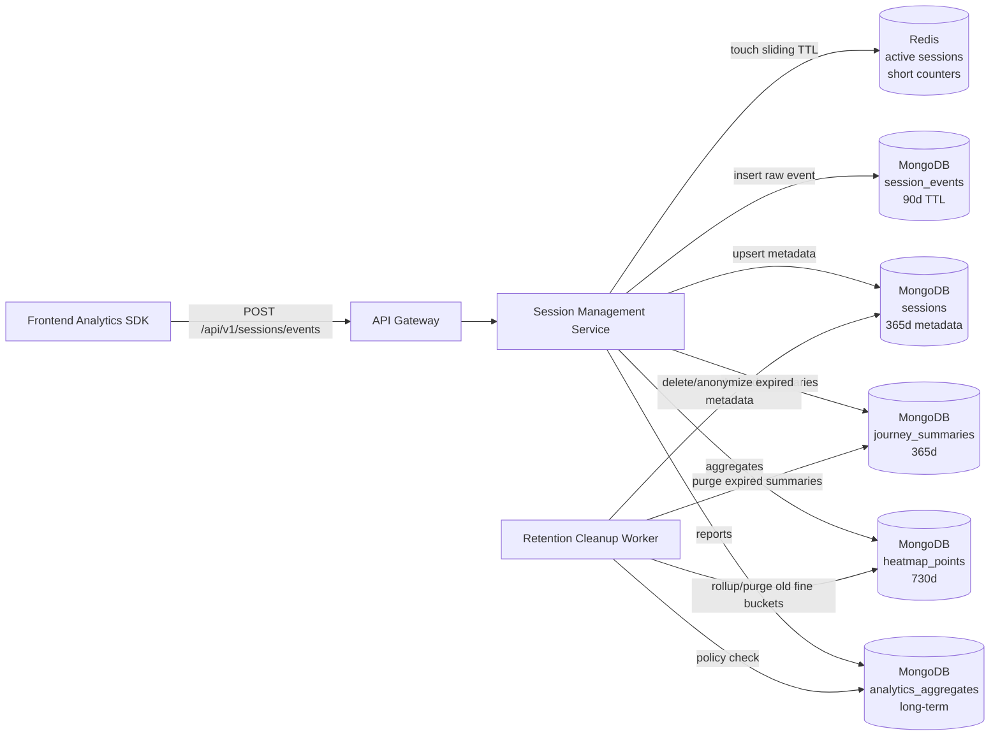
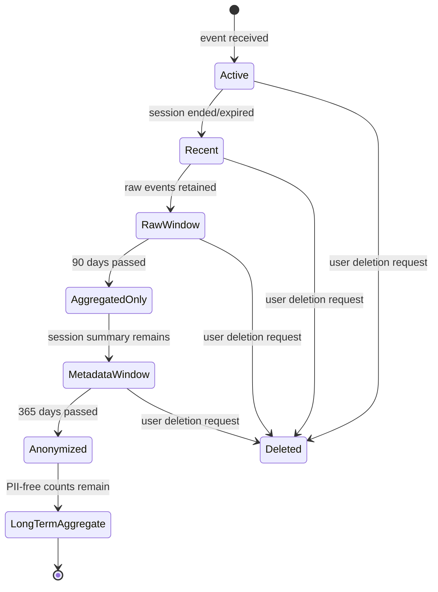
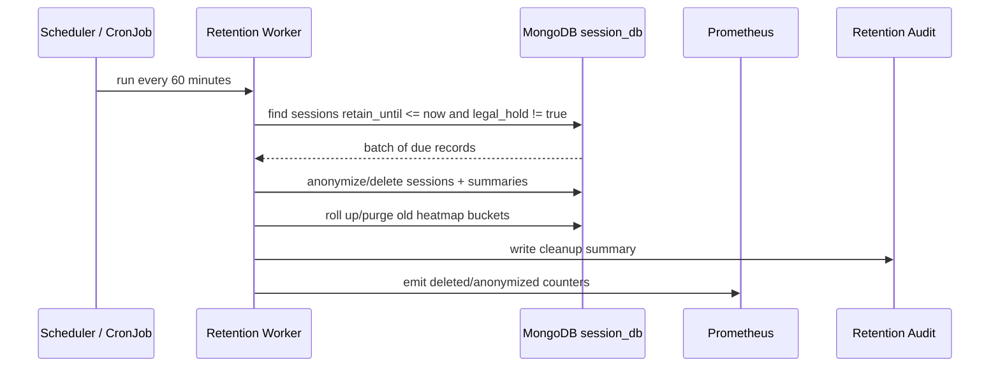
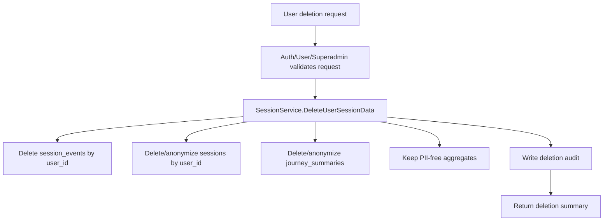

# 🗂️ Session Management Service - Task 8: Data Retention Policy


## 📌 Task Summary

| Field | Detail |
|---|---|
| Task Name | Data retention policy |
| Source | `docs/01-micro-tasks.md` -> `Session Management Service (Independent)` -> Task 8 |
| Priority | `P1` |
| Dependency | MongoDB |
| Main Goal | Raw events TTL, aggregated metrics long-term store rules, privacy deletion, and cost-control policy define karna |
| Main Collections | `sessions`, `session_events`, `journey_summaries`, `heatmap_points`, `analytics_aggregates` |
| Cache Store | Redis active sessions and short-window counters |
| Internal gRPC Context | `SessionService.DeleteUserSessionData` |
| Output Type | Structured implementation guide |
| Actual Files Created | `TaskImplementation/Session Management Service/task8.md` |
| Not Included | Runtime backend code, DB migration execution, dashboard UI, Kubernetes deployment, object-storage archive implementation |

> **Simple Hinglish goal:** Is task ka kaam ye decide karna hai ki Session Management Service ka data kitne time tak store hoga, kaunsa data auto-delete hoga, kaunsa aggregate long-term rahega, aur user deletion request aane par session data ko kaise delete/anonymize karna hai. Isse cost control, privacy, compliance, and analytics quality balance me rahenge.

---

## ✅ Final Output Created

```text
TaskImplementation/
└── Session Management Service/
    ├── task1.md
    ├── task2.md
    ├── task3.md
    ├── task4.md
    ├── task5.md
    ├── task6.md
    ├── task7.md
    └── task8.md
```

### Why this structure?

| Path | Purpose |
|---|---|
| `TaskImplementation/` | Project ke task-wise implementation guides ka central folder |
| `TaskImplementation/Session Management Service/` | Session Management Service ke independent tasks ko group karne ke liye |
| `task8.md` | Sirf **Session Management Service - Task 8** ka guide |

> 🟢 **Important boundary:** Is turn me sirf documentation file create ki gayi hai. Backend service, database migration, API contract, infra, or frontend code create/change nahi kiya gaya.

---

## 🧭 Implementation Approach

Guide banate time ye project docs and previous task notes study kiye gaye:

| Document / File | Kya use kiya gaya |
|---|---|
| `docs/01-micro-tasks.md` | Task 8 ka exact scope identify kiya: raw events TTL and aggregated metrics long-term rules |
| `docs/08-session-management-system.md` | Storage strategy confirm ki: raw events 30-90 days, journey summaries 180-365 days, aggregates long-term, Redis expiry |
| `docs/04-microservice-design.md` | Session Service responsibilities and privacy/retention requirement confirm ki |
| `docs/05-database-design.md` | Session data indexes, TTL usage, and MongoDB + Redis strategy align ki |
| `docs/06-auth-security.md` | PII deletion support, data retention policy, and logs me secrets avoid karna include kiya |
| `database/mongodb-schema-design.md` | `session_events` TTL index and session collections align ki |
| `TaskImplementation/Session Management Service/task1.md` | Session model, identity fields, lifecycle states, privacy boundary reuse ki |
| `TaskImplementation/Session Management Service/task2.md` | MongoDB/Redis storage, active TTL, raw event TTL placeholder reuse kiya |
| `TaskImplementation/Session Management Service/task3.md` | Event ingestion source-of-truth and active session touch flow reuse kiya |
| `TaskImplementation/Session Management Service/task4.md` | `journey_summaries` derived collection retention policy define ki |
| `TaskImplementation/Session Management Service/task5.md` | Device/IP hash/geo privacy-sensitive fields retention me cover kiye |
| `TaskImplementation/Session Management Service/task6.md` | `heatmap_points` aggregate retention define ki |
| `TaskImplementation/Session Management Service/task7.md` | `analytics_aggregates` long-term reporting retention define ki |

---

## 🧱 Task Boundary

### ✅ Included in Task 8

- Raw `session_events` TTL policy finalize karna
- `sessions` metadata retention and anonymization window define karna
- `journey_summaries`, `heatmap_points`, and `analytics_aggregates` retention rules define karna
- Redis active session and counter expiry policy define karna
- MongoDB TTL indexes ka recommended implementation explain karna
- Cleanup/anonymization worker ka flow document karna
- User deletion request flow define karna via `DeleteUserSessionData`
- PII minimization and aggregate safety rules explain karna
- Config/env variables define karna
- Monitoring, logging, and audit fields define karna
- Verification commands and test scenarios provide karna
- External libraries/tools ka what/why/install/use explain karna

### ❌ Not Included in Task 8

| Not Included | Kyun nahi? |
|---|---|
| Event ingestion API implement karna | Ye **Task 3** ka scope hai |
| Journey tracking build karna | Ye **Task 4** ka scope hai |
| Device parser/GeoIP resolver build karna | Ye **Task 5** ka scope hai |
| Heatmap aggregation build karna | Ye **Task 6** ka scope hai |
| Analytics API endpoints implement karna | Ye **Task 7** ka scope hai |
| Actual database migration run karna | Is task me guide create ho raha hai, runtime DB change nahi |
| Dashboard privacy controls UI banana | Ye `Session Analytics Dashboard - Task 8` ka frontend scope hai |
| Legal policy drafting | Engineering retention controls define ho rahe hain; legal text separate approval se hoga |

> 🟡 **Clarification:** Task 8 "policy + implementation guide" hai. Ye batata hai production implementation kaise hogi, but current repo me session-service runtime files create nahi kiye gaye.

---

## 🔤 Core Concepts

| Concept | Meaning | Example |
|---|---|---|
| TTL | Time-to-live; fixed duration ke baad data auto-delete | Raw events 90 days |
| Retention class | Data sensitivity/use-case ke basis par category | `raw_event`, `session_metadata`, `aggregate` |
| Anonymization | User identity remove/hash karke analytics-safe record rakhna | `user_id = null`, `anonymous_id_hash` kept |
| Purge | Data permanently delete karna | User deletion request par raw events delete |
| Aggregate | Count/rate style precomputed analytics | daily conversion rate |
| Legal hold | Special flag jisme data auto-delete temporarily pause hota hai | fraud investigation |
| Sliding TTL | Activity aate hi expiry refresh hoti hai | Redis active session key |

### Simple example

```text
Raw click event:
session_events document -> keep for 90 days -> MongoDB TTL deletes automatically

Journey summary:
journey_summaries document -> keep for 365 days -> cleanup worker purges/anonymizes

Analytics aggregate:
analytics_aggregates document -> keep for long-term -> no user-level identifiers stored
```

**Hinglish explanation:**  
Raw events sabse zyada volume and privacy-sensitive hote hain, isliye short TTL. Aggregates me user-level PII nahi hota, sirf counts/rates hote hain, isliye wo long-term store ho sakte hain. Sessions and journey summaries medium retention me rahenge because dashboard and debugging ko historical context chahiye.

---

## 🎯 Final Retention Matrix

Task 8 ke liye recommended production-friendly policy:

| Data Store | Data Type | Retention | Cleanup Method | Why |
|---|---|---:|---|---|
| Redis | Active session hash `session:active:{session_id}` | 35 minutes | Redis `EXPIRE` sliding TTL | 30 min inactivity + 5 min grace |
| Redis | Live counters / active sets | 48 hours | Redis key expiry | Live dashboard and short fallback |
| MongoDB `session_events` | Raw events | 90 days | MongoDB TTL index on `occurred_at` | Debug/rebuild window + storage control |
| MongoDB `sessions` | Session metadata | 365 days | Cleanup/anonymization worker | Admin/session history, fraud review |
| MongoDB `journey_summaries` | Derived journey summary | 365 days | Cleanup/anonymization worker or TTL via `purge_after` | Dashboard historical replay metadata |
| MongoDB `heatmap_points` | Aggregated click/scroll buckets | 730 days | Cleanup old fine-grain buckets, keep coarse summary | UX optimization trends |
| MongoDB `analytics_aggregates` | Counts/rates/cohorts | Long-term, recommended 3-5 years | Keep if PII-free; optional archival | Business reporting |
| Logs/traces | Session-service operational logs | 30 days hot, 90 days archive | Observability stack retention | Debug without storing sensitive payload |
| Deletion audit | Deletion request audit metadata | 6 years or org policy | Append-only audit store | Compliance proof, no raw analytics payload |

> 🟢 **Recommended MVP:** Start with `session_events` MongoDB TTL = **90 days**, Redis active TTL = **35 minutes**, and cleanup worker for `sessions`/derived collections. Aggregates must be PII-free so they can remain long-term.

> 🔴 **Privacy rule:** Raw IP, keystrokes, passwords, OTP, card data, and private form text must never be stored in session analytics. Agar galti se payload me aaye, ingestion sanitization should drop/mask it before MongoDB write.

---

## 🏗️ High-Level Architecture



**Kaise build hoga:**  
Ingestion path raw events and session metadata write karega. Redis hot state short-lived rahega. MongoDB TTL automatically raw events delete karega. Cleanup worker MongoDB TTL se zyada complex rules handle karega, jaise anonymization, legal hold, user deletion, aggregate rollups, and audit logging.

---

## 🔄 Retention Lifecycle Flow



**Hinglish explanation:**  
Fresh session active hota hai. 90 days tak raw event details available rahengi. Uske baad raw events delete ho jayenge, but summaries/aggregates remain. 365 days ke baad user-identifying metadata anonymize/delete hoga. Aggregates long-term tabhi rahenge jab unme user-level identity nahi hai.

---

## 🧩 Data Classification

Retention policy tabhi maintainable hoti hai jab har document ko category mile.

| Class | Examples | Sensitivity | Retention |
|---|---|---|---|
| `raw_event` | click, scroll, page_view, search, checkout_step | High | 90 days |
| `session_metadata` | session id, anonymous id, user id, device, geo, entry/exit page | Medium/High | 365 days, then anonymize/delete |
| `derived_summary` | journey summary, milestones, total events | Medium | 365 days |
| `aggregate_fine` | route/day/device heatmap buckets | Low if PII-free | 730 days |
| `aggregate_business` | conversion rate, cohort counts | Low if PII-free | 3-5 years or long-term |
| `operational_log` | request ids, error codes, timings | Medium | 30-90 days |
| `deletion_audit` | request id, user id hash, completed_at | Medium | Long-term audit policy |

### Recommended document fields

```json
{
  "retention_class": "raw_event",
  "occurred_at": "2026-05-22T10:00:00Z",
  "retain_until": "2026-08-20T10:00:00Z",
  "legal_hold": false,
  "schema_version": 1
}
```

> 🟡 **Beginner note:** MongoDB TTL index actual deletion ke liye date field use karta hai. `retention_class` dashboard/debugging ke liye useful hai, but TTL index usually single date field par lagta hai.

---

## 🪜 Step-by-Step Implementation Guide

### Step 1: Retention config define karo

Runtime service me hardcoded days avoid karo. Environment variables se policy configurable honi chahiye.

```env
SESSION_ACTIVE_TTL_SECONDS=2100
SESSION_LIVE_COUNTER_TTL_HOURS=48
SESSION_RAW_EVENT_TTL_DAYS=90
SESSION_METADATA_RETENTION_DAYS=365
SESSION_JOURNEY_RETENTION_DAYS=365
SESSION_HEATMAP_RETENTION_DAYS=730
SESSION_AGGREGATE_RETENTION_YEARS=5
SESSION_RETENTION_WORKER_BATCH_SIZE=1000
SESSION_RETENTION_WORKER_INTERVAL_MINUTES=60
SESSION_RETENTION_DRY_RUN=false
```

**Why:**  
Policy future me legal/business needs ke basis par change ho sakti hai. Config-based approach se code redeploy ke bina environment-level tuning possible hoti hai.

### Go config example

```go
package config

import "time"

type RetentionConfig struct {
	ActiveSessionTTL      time.Duration
	LiveCounterTTL        time.Duration
	RawEventTTLDays       int
	SessionMetadataDays   int
	JourneySummaryDays    int
	HeatmapDays           int
	AggregateYears        int
	WorkerBatchSize       int
	WorkerInterval        time.Duration
	DryRun                bool
}
```

---

### Step 2: Raw event TTL index create karo

`session_events` high-volume collection hai. Isme TTL index mandatory hoga.

```javascript
use session_db

db.session_events.createIndex(
  { occurred_at: 1 },
  {
    name: "ttl_raw_events_90_days",
    expireAfterSeconds: 7776000
  }
)
```

### Why `occurred_at`?

| Field | Reason |
|---|---|
| `occurred_at` | Event actual user activity ka time hai |
| `received_at` | Network delay/retry ki wajah se later ho sakta hai |
| `expireAfterSeconds` | MongoDB background TTL monitor old docs delete karega |

> 🟡 **MongoDB TTL limitation:** TTL index compound nahi hota. Single date field par TTL lagao. Agar multiple retention classes same collection me hain, `expire_at` style date field use karna better hota hai.

### Alternative: exact expiration field

Agar per-event dynamic retention chahiye, `expire_at` field add karke `expireAfterSeconds: 0` use kar sakte hain.

```javascript
db.session_events.createIndex(
  { expire_at: 1 },
  {
    name: "ttl_raw_events_expire_at",
    expireAfterSeconds: 0
  }
)
```

Example:

```json
{
  "_id": "evt_123",
  "event_type": "page_view",
  "occurred_at": "2026-05-22T10:00:00Z",
  "expire_at": "2026-08-20T10:00:00Z"
}
```

> 🟢 **Recommended MVP:** Existing schema direction already uses `{ occurred_at: 1 }` with 90 days. Start with that. Dynamic `expire_at` tab add karo jab per-event retention genuinely needed ho.

---

### Step 3: Session metadata cleanup/anonymization fields add karo

`sessions` collection ko direct TTL se delete karna risky ho sakta hai, kyunki kuch sessions fraud/audit investigation ke liye longer hold par ho sakte hain. Isliye cleanup worker controlled anonymization karega.

### Recommended `sessions` fields

```json
{
  "_id": "sess_123",
  "session_id": "sess_123",
  "anonymous_id": "anon_123",
  "user_id": "user_123",
  "status": "expired",
  "entry_page": "/",
  "exit_page": "/checkout",
  "ip_hash": "iphash_abc",
  "device": {
    "type": "mobile",
    "browser": "Chrome",
    "os": "Android"
  },
  "geo": {
    "country": "IN",
    "city": "Delhi"
  },
  "started_at": "2026-05-22T09:00:00Z",
  "last_seen_at": "2026-05-22T09:20:00Z",
  "ended_at": "2026-05-22T09:20:00Z",
  "retain_until": "2027-05-22T09:20:00Z",
  "anonymized_at": null,
  "legal_hold": false,
  "retention_class": "session_metadata"
}
```

### Recommended indexes

```javascript
db.sessions.createIndex(
  { retain_until: 1, legal_hold: 1 },
  { name: "idx_sessions_retention_due" }
)

db.sessions.createIndex(
  { user_id: 1, started_at: -1 },
  {
    name: "idx_sessions_user_history",
    partialFilterExpression: { user_id: { $type: "string" } }
  }
)
```

### Anonymization example

```javascript
db.sessions.updateMany(
  {
    retain_until: { $lte: new Date() },
    legal_hold: { $ne: true },
    anonymized_at: null
  },
  {
    $set: {
      user_id: null,
      anonymous_id: null,
      ip_hash: null,
      "geo.city": null,
      anonymized_at: new Date()
    }
  }
)
```

**Hinglish explanation:**  
Raw data delete ho chuka hoga, but session-level count/trend useful ho sakta hai. Isliye 365 days ke baad user-identifying fields remove kar do. Country/device jaise broad analytics fields keep kiye ja sakte hain if policy allows.

---

### Step 4: Journey summaries retention define karo

`journey_summaries` raw events ka compact derivative hai. Isme session journey milestones hote hain, isliye ye raw events se longer retain ho sakta hai, but user identity cleanup required hai.

### Recommended retention

| Field | Policy |
|---|---|
| Retention | 365 days |
| Cleanup action | Delete or anonymize |
| Identity fields | `user_id`, `anonymous_id`, `ip_hash` remove |
| Safe fields | `entry_page`, `exit_page`, counts, duration, conversion flags |

### Example cleanup query

```javascript
db.journey_summaries.updateMany(
  {
    retain_until: { $lte: new Date() },
    legal_hold: { $ne: true },
    anonymized_at: null
  },
  {
    $set: {
      user_id: null,
      anonymous_id: null,
      anonymized_at: new Date()
    }
  }
)
```

### Optional TTL if delete-only policy

```javascript
db.journey_summaries.createIndex(
  { purge_after: 1 },
  {
    name: "ttl_journey_summaries_purge_after",
    expireAfterSeconds: 0
  }
)
```

> 🟡 **Decision point:** Agar dashboard ko old session replay metadata nahi chahiye, `purge_after` TTL use karke delete kar sakte ho. Agar long-term counts useful hain, anonymization worker better hai.

---

### Step 5: Heatmap aggregate retention define karo

Heatmap data aggregate hai, but fine-grain route/device/day bucket storage grow kar sakta hai.

### Recommended policy

| Heatmap Data | Retention | Action |
|---|---:|---|
| Daily route/device click buckets | 730 days | Keep |
| Very old fine coordinate buckets | 730 days | Purge or roll up monthly |
| Monthly route/device summaries | 3-5 years | Keep if PII-free |

### Example rollup concept

```javascript
db.heatmap_points.aggregate([
  {
    $match: {
      day: {
        $lt: "2024-05-22"
      }
    }
  },
  {
    $group: {
      _id: {
        path: "$path",
        device_type: "$device_type",
        month: { $substr: ["$day", 0, 7] },
        kind: "$kind"
      },
      total_weight: { $sum: "$weight" },
      unique_sessions: { $sum: "$unique_sessions" }
    }
  }
])
```

**Hinglish explanation:**  
Recent heatmap ko detailed rakhna useful hai. 2 saal ke baad pixel/coordinate detail mostly kam useful hoti hai. Isliye old fine buckets ko monthly summary me roll up kar sakte hain.

---

### Step 6: Analytics aggregates long-term policy define karo

`analytics_aggregates` me counts/rates/cohort metrics honge. Is collection ka purpose long-term trend reporting hai.

### Safe aggregate rules

| Rule | Reason |
|---|---|
| User IDs store mat karo | Aggregate PII-free rahe |
| Anonymous IDs store mat karo | Re-identification risk kam |
| Raw IP/IP hash store mat karo | Privacy boundary maintain |
| Small cohorts suppress karo | Re-identification avoid |
| Metric bucket + segment use karo | Dashboard fast queries |

### Recommended aggregate document

```json
{
  "_id": "agg_funnel_daily_2026-05-22_web_all",
  "metric": "funnel.checkout",
  "bucket": "daily",
  "period_start": "2026-05-22T00:00:00Z",
  "period_end": "2026-05-23T00:00:00Z",
  "segment": {
    "channel": "web",
    "device_type": "all",
    "country": "all"
  },
  "values": {
    "product_view": 12000,
    "add_to_cart": 2600,
    "checkout_started": 900,
    "payment_completed": 620
  },
  "retention_class": "aggregate_business",
  "contains_pii": false,
  "created_at": "2026-05-23T00:10:00Z",
  "updated_at": "2026-05-23T00:10:00Z"
}
```

### Small cohort suppression

```go
func SuppressSmallCohort(count int64, minThreshold int64) (int64, bool) {
	if count > 0 && count < minThreshold {
		return 0, true
	}
	return count, false
}
```

> 🔴 **Privacy rule:** Agar segment itna narrow hai ki 1-4 users identify ho sakte hain, response me value suppress karo ya segment combine karo. Example: `country + city + device + campaign + hour` too narrow ho sakta hai.

---

### Step 7: Redis expiry policy implement karo

Redis durable source-of-truth nahi hai. Ye hot state and live counters ke liye hai.

### Key expiry table

| Redis Key Pattern | Type | TTL | Refresh |
|---|---|---:|---|
| `session:active:{session_id}` | Hash | 35 minutes | Every valid event/heartbeat |
| `session:user:{user_id}` | Set | 35 minutes | Every valid user event |
| `session:anon:{anonymous_id}` | Set | 35 minutes | Every valid anonymous event |
| `session:last_seen:{session_id}` | String | 35 minutes | Every valid event/heartbeat |
| `session:counter:active:{bucket}` | Counter | 48 hours | No sliding, fixed bucket |
| `analytics:cache:{report_hash}` | JSON/string | 5-15 minutes | On report cache set |

### Go Redis example

```go
func TouchActiveSession(ctx context.Context, rdb *redis.Client, sessionID string, ttl time.Duration) error {
	key := "session:active:" + sessionID

	pipe := rdb.TxPipeline()
	pipe.HSet(ctx, key, map[string]any{
		"session_id": sessionID,
		"last_seen_at": time.Now().UTC().Format(time.RFC3339),
	})
	pipe.Expire(ctx, key, ttl)

	_, err := pipe.Exec(ctx)
	return err
}
```

### Verify Redis TTL

```bash
redis-cli TTL session:active:sess_123
redis-cli HGETALL session:active:sess_123
```

**Hinglish explanation:**  
Redis key expire hone se permanent data delete nahi hona chahiye. Durable copy MongoDB me already honi chahiye. Redis expiry sirf "active now" dashboard and inactivity detection ke liye hai.

---

### Step 8: Cleanup worker design karo

MongoDB TTL raw events delete karega, but anonymization/rollup/legal hold jaise complex logic worker handle karega.



### Worker pseudo-code

```go
type RetentionWorker struct {
	Sessions   SessionRetentionRepository
	Journeys   JourneyRetentionRepository
	Heatmaps   HeatmapRetentionRepository
	Aggregates AggregateRetentionRepository
	Config     RetentionConfig
}

func (w RetentionWorker) RunOnce(ctx context.Context, now time.Time) error {
	if err := w.Sessions.AnonymizeExpired(ctx, now, w.Config.WorkerBatchSize); err != nil {
		return err
	}

	if err := w.Journeys.AnonymizeExpired(ctx, now, w.Config.WorkerBatchSize); err != nil {
		return err
	}

	if err := w.Heatmaps.RollupAndPurgeExpired(ctx, now); err != nil {
		return err
	}

	return w.Aggregates.VerifyPIIFree(ctx, now)
}
```

### Repository interface example

```go
type SessionRetentionRepository interface {
	AnonymizeExpired(ctx context.Context, now time.Time, limit int) error
	DeleteByUserID(ctx context.Context, userID string) error
	DeleteByAnonymousID(ctx context.Context, anonymousID string) error
	MarkLegalHold(ctx context.Context, sessionID string, hold bool, reason string) error
}
```

> 🟢 **Recommended MVP:** Worker ko hourly run karo, `batch_size=1000` se start karo, and first deployment me `SESSION_RETENTION_DRY_RUN=true` rakhkar logs/metrics verify karo.

---

### Step 9: User deletion request flow define karo

`docs/04-microservice-design.md` me Session Service gRPC method `DeleteUserSessionData` listed hai. Task 8 me is method ka retention behavior define hota hai.



### Deletion policy by collection

| Collection | User deletion action |
|---|---|
| `session_events` | Delete all docs with matching `user_id`; also delete/handle linked anonymous ids if provided |
| `sessions` | Delete or anonymize identity fields depending on product/legal policy |
| `journey_summaries` | Delete or anonymize identity fields |
| `heatmap_points` | Keep because aggregate should not contain user identity |
| `analytics_aggregates` | Keep because aggregate should not contain user identity |
| Redis active keys | Delete active keys for user/session immediately |

### gRPC-style request/response shape

```protobuf
message DeleteUserSessionDataRequest {
  string user_id = 1;
  repeated string anonymous_ids = 2;
  string reason = 3;
  bool hard_delete = 4;
}

message DeleteUserSessionDataResponse {
  string request_id = 1;
  int64 raw_events_deleted = 2;
  int64 sessions_anonymized = 3;
  int64 journeys_anonymized = 4;
  int64 redis_keys_deleted = 5;
  string completed_at = 6;
}
```

### Mongo delete example

```javascript
db.session_events.deleteMany({
  $or: [
    { user_id: "user_123" },
    { anonymous_id: { $in: ["anon_123", "anon_456"] } }
  ]
})
```

### Mongo anonymize example

```javascript
db.sessions.updateMany(
  {
    $or: [
      { user_id: "user_123" },
      { anonymous_id: { $in: ["anon_123", "anon_456"] } }
    ]
  },
  {
    $set: {
      user_id: null,
      anonymous_id: null,
      ip_hash: null,
      deletion_requested_at: new Date(),
      anonymized_at: new Date()
    }
  }
)
```

> 🔴 **Important:** Aggregates tabhi keep karna safe hai jab wo genuinely PII-free ho. Agar aggregate document me `user_id`, `anonymous_id`, raw IP, or small cohort identifying data hai, usko fix/delete karna mandatory hai.

---

### Step 10: Legal hold support add karo

Kabhi fraud, abuse, payment dispute, or legal investigation ke liye specific session data ko retention cleanup se temporarily exclude karna pad sakta hai.

### Legal hold fields

```json
{
  "legal_hold": true,
  "legal_hold_reason": "fraud_review",
  "legal_hold_set_by": "admin_123",
  "legal_hold_set_at": "2026-05-22T11:00:00Z"
}
```

### Cleanup query rule

```javascript
{
  "retain_until": { "$lte": new Date() },
  "legal_hold": { "$ne": true }
}
```

**Hinglish explanation:**  
Legal hold default false rahega. Worker sirf wahi records clean karega jahan `legal_hold != true`. Hold remove hone ke baad next worker run me normal retention apply hogi.

---

### Step 11: Dashboard/report queries ko retention-aware banao

Raw events TTL ke baad dashboard ko raw timeline available nahi milegi. APIs ko user-friendly response dena hoga.

### Journey response after raw TTL

```json
{
  "session_id": "sess_123",
  "raw_events_available": false,
  "raw_events_retained_until": "2026-08-20T10:00:00Z",
  "summary_available": true,
  "summary": {
    "entry_page": "/",
    "exit_page": "/checkout",
    "total_events": 42,
    "checkout_started": true,
    "payment_completed": false
  }
}
```

### API behavior table

| API | If raw data expired |
|---|---|
| `GET /analytics/sessions` | Show metadata/summary if still retained |
| `GET /analytics/sessions/{id}/journey` | Return summary and `raw_events_available=false` |
| `GET /analytics/funnels` | Use `analytics_aggregates` |
| `GET /analytics/heatmaps` | Use `heatmap_points` aggregates |
| `GET /analytics/live` | Unaffected, Redis current window only |

> 🟢 **Good UX rule:** Data expired hona error nahi hai. Response me clearly batao ki raw events retention window pass ho chuki hai, but summary/aggregate available ho sakta hai.

---

## 🧪 Verification Plan

### 1. Verify MongoDB TTL index

```bash
mongosh "mongodb://localhost:27017/session_db" --eval 'db.session_events.getIndexes()'
```

Expected index:

```json
{
  "name": "ttl_raw_events_90_days",
  "key": { "occurred_at": 1 },
  "expireAfterSeconds": 7776000
}
```

### 2. Insert old raw event for TTL testing

```javascript
use session_db

db.session_events.insertOne({
  _id: "evt_ttl_test_old",
  session_id: "sess_ttl_test",
  anonymous_id: "anon_ttl_test",
  event_type: "page_view",
  path: "/",
  properties: {},
  occurred_at: new Date("2025-01-01T00:00:00Z"),
  received_at: new Date("2025-01-01T00:00:01Z"),
  retention_class: "raw_event"
})
```

> 🟡 **TTL timing note:** MongoDB TTL monitor usually background interval me delete karta hai. Document immediately disappear na ho to ye normal hai.

### 3. Verify Redis active session expiry

```bash
redis-cli HSET session:active:sess_ttl_test session_id sess_ttl_test last_seen_at 2026-05-22T10:00:00Z
redis-cli EXPIRE session:active:sess_ttl_test 2100
redis-cli TTL session:active:sess_ttl_test
```

Expected:

```text
TTL should be close to 2100 seconds
```

### 4. Dry-run cleanup worker

```bash
SESSION_RETENTION_DRY_RUN=true ./session-retention-worker
```

Expected logs:

```json
{
  "event": "session.retention.dry_run",
  "sessions_due": 128,
  "journeys_due": 128,
  "heatmap_buckets_due": 3200,
  "would_delete_raw_events": 0
}
```

---

## 🧰 External Libraries / Tools

Task 8 documentation-only hai, isliye current repo me koi package install nahi kiya gaya. Future runtime implementation ke liye ye tools/libraries useful honge.

| Tool/Library | What it is | Why used | Install command |
|---|---|---|---|
| MongoDB | Document database | `session_events`, `sessions`, summaries, heatmap, aggregates store karne ke liye | Docker Compose local stack ya MongoDB Atlas |
| MongoDB TTL Index | MongoDB feature | Raw events auto-delete karne ke liye | MongoDB built-in; `createIndex` se configure |
| mongosh | MongoDB shell | TTL indexes, cleanup queries, and data verification ke liye | MongoDB tools install ke saath |
| MongoDB Go Driver | Official Go MongoDB client | Retention worker/repositories se MongoDB query/update/delete karne ke liye | `go get go.mongodb.org/mongo-driver/v2/mongo` |
| Redis | In-memory data store | Active sessions, sliding TTL, live counters, short cache ke liye | Docker Compose local stack ya managed Redis |
| go-redis/v9 | Go Redis client | Redis keys/hash/set expiry manage karne ke liye | `go get github.com/redis/go-redis/v9` |
| redis-cli | Redis CLI | Active key TTL and deletion verify karne ke liye | Redis tools install ke saath |
| Prometheus client | Metrics library | Cleanup counts, errors, duration monitor karne ke liye | `go get github.com/prometheus/client_golang/prometheus` |
| Kubernetes CronJob | K8s scheduled job | Production retention worker periodic run ke liye | Kubernetes manifests/Helm via DevOps task |

### Future Go install commands

Run only when `backend/services/session-service` Go module exists:

```bash
cd backend/services/session-service
go get go.mongodb.org/mongo-driver/v2/mongo
go get github.com/redis/go-redis/v9
go get github.com/prometheus/client_golang/prometheus
```

### Basic usage examples

```go
// MongoDB collection handle
events := mongoClient.Database("session_db").Collection("session_events")

// Redis client
rdb := redis.NewClient(&redis.Options{
	Addr: "localhost:6379",
	DB:   2,
})
```

---

## 📁 Future Runtime Folder Structure

Task 8 me runtime files create nahi kiye gaye. Future actual implementation `backend/services/session-service` ke andar roughly is tarah organize ho sakti hai:

```text
backend/
└── services/
    └── session-service/
        ├── cmd/
        │   ├── server/
        │   │   └── main.go
        │   └── retention-worker/
        │       └── main.go
        ├── internal/
        │   ├── config/
        │   │   └── retention.go
        │   ├── domain/
        │   │   ├── retention.go
        │   │   ├── session.go
        │   │   └── event.go
        │   ├── repository/
        │   │   ├── mongo_retention_repository.go
        │   │   └── redis_active_session_repository.go
        │   ├── usecase/
        │   │   ├── delete_user_session_data.go
        │   │   └── run_retention_cleanup.go
        │   └── worker/
        │       └── retention_worker.go
        └── migrations/
            └── mongo_retention_indexes.js
```

### File responsibility table

| Future File | Responsibility |
|---|---|
| `config/retention.go` | Env se retention duration load/validate karega |
| `domain/retention.go` | Retention class, policy, deletion summary structs |
| `repository/mongo_retention_repository.go` | Mongo cleanup/anonymization/delete queries |
| `usecase/delete_user_session_data.go` | User deletion request orchestration |
| `usecase/run_retention_cleanup.go` | Scheduled cleanup flow |
| `worker/retention_worker.go` | Periodic worker loop and metrics |
| `migrations/mongo_retention_indexes.js` | TTL and retention-related indexes |

> 🟣 **Boundary:** Ye future structure reference ke liye hai. Current task me sirf `task8.md` create hua hai.

---

## 🔐 Privacy & Security Rules

| Rule | Required behavior |
|---|---|
| Raw IP store nahi karna | Sirf `ip_hash` ya coarse geo fields |
| Sensitive form values drop karo | Password, OTP, card, private text fields never store |
| Logs me payload dump mat karo | Event properties logs me full print nahi karne |
| User deletion support | `DeleteUserSessionData` raw/user-level data remove kare |
| Aggregate PII-free rakho | Long-term aggregates me identity fields nahi |
| Small cohorts suppress karo | Narrow reports me re-identification avoid |
| Legal hold auditable ho | Hold set/remove actor and reason store karo |
| Admin access only | Retention settings/deletion admin/RBAC protected |

### Sanitized log example

```json
{
  "level": "info",
  "service": "session-service",
  "event": "session.retention.cleanup.completed",
  "request_id": "req_01HX9ZV8J9E4C7N2W1A0B6Q5P3",
  "sessions_anonymized": 980,
  "journeys_anonymized": 970,
  "duration_ms": 1840
}
```

> 🔴 **Never log:** raw event payloads, Authorization headers, JWTs, OTPs, card data, raw IP, or private form values.

---

## 📊 Monitoring & Alerts

### Metrics

| Metric | Type | Meaning |
|---|---|---|
| `session_retention_worker_runs_total` | Counter | Worker runs count |
| `session_retention_worker_errors_total` | Counter | Failed cleanup runs |
| `session_retention_worker_duration_seconds` | Histogram | Worker run duration |
| `session_retention_raw_events_deleted_total` | Counter | Raw events deleted by explicit deletion flow |
| `session_retention_sessions_anonymized_total` | Counter | Sessions anonymized |
| `session_retention_journeys_anonymized_total` | Counter | Journey summaries anonymized |
| `session_retention_heatmap_buckets_purged_total` | Counter | Old heatmap buckets purged/rolled up |
| `session_retention_deletion_requests_total` | Counter | User deletion requests processed |
| `session_retention_legal_hold_skipped_total` | Counter | Records skipped due to legal hold |

### Alert examples

| Alert | Condition | Reason |
|---|---|---|
| Retention worker failing | errors for 3 consecutive runs | Old data may accumulate |
| TTL index missing | `ttl_raw_events_90_days` not found | Raw event cleanup disabled |
| Raw event collection growing fast | storage growth above threshold | Cost control issue |
| Deletion request failed | any failed user deletion request | Privacy/compliance risk |
| Aggregates contain PII | validation detects identity fields | Long-term privacy risk |

---

## ⚠️ Failure Handling

| Failure | Expected behavior |
|---|---|
| MongoDB TTL deletion delayed | Dashboard queries still filter by date; monitor collection size |
| Retention worker fails mid-batch | Idempotent updates; next run resumes |
| Redis delete fails during user deletion | Log/metric and retry; Mongo deletion remains priority |
| Legal hold conflicts with deletion | Escalate to compliance/admin policy; audit decision |
| Aggregate has PII field | Stop long-term retention for that metric; delete or rebuild aggregate |
| Small cohort report requested | Suppress/round values or return privacy-safe error |
| Config invalid | Service/worker fail fast with clear error |

### Error response example

```json
{
  "error": {
    "code": "retention_policy_invalid",
    "message": "SESSION_RAW_EVENT_TTL_DAYS must be between 30 and 180.",
    "request_id": "req_01HX9ZV8J9E4C7N2W1A0B6Q5P3"
  }
}
```

---

## 🧾 Rollout Plan

| Phase | Action | Safety |
|---|---|---|
| 1 | Add retention config with defaults | No data mutation |
| 2 | Create MongoDB TTL index for raw events | Verify on staging first |
| 3 | Add `retain_until` fields on new writes | Backward compatible |
| 4 | Backfill `retain_until` for old sessions/summaries | Batch and monitor |
| 5 | Run cleanup worker in dry-run mode | Compare expected counts |
| 6 | Enable cleanup worker with small batch size | Gradual mutation |
| 7 | Enable deletion request flow | Audit every request |
| 8 | Monitor storage and privacy metrics | Tune policy safely |

### Backfill example

```javascript
db.sessions.updateMany(
  { retain_until: { $exists: false }, ended_at: { $type: "date" } },
  [
    {
      $set: {
        retain_until: {
          $dateAdd: {
            startDate: "$ended_at",
            unit: "day",
            amount: 365
          }
        },
        retention_class: "session_metadata"
      }
    }
  ]
)
```

---

## ✅ Acceptance Checklist

| Check | Status |
|---|---|
| `task8.md` created under `TaskImplementation/Session Management Service/` | ✅ Done |
| Task 8 scope limited to Data Retention Policy | ✅ Done |
| Raw event TTL policy finalized | ✅ Done |
| MongoDB TTL index strategy documented | ✅ Done |
| Redis expiry policy documented | ✅ Done |
| Session metadata retention/anonymization documented | ✅ Done |
| Journey summary retention documented | ✅ Done |
| Heatmap aggregate retention documented | ✅ Done |
| Analytics aggregate long-term rules documented | ✅ Done |
| User deletion request flow documented | ✅ Done |
| Legal hold behavior documented | ✅ Done |
| External libraries/tools documented | ✅ Done |
| Folder structure included | ✅ Done |
| Code examples included | ✅ Done |
| Mermaid diagrams included | ✅ Done |
| Privacy/security rules included | ✅ Done |
| No backend runtime implementation created | ✅ Done |

---

## 🧾 Final Notes

Session Management Service Task 8 ke liye Data Retention Policy complete hai:

- Raw `session_events` ke liye **90 days MongoDB TTL** final recommend kiya gaya.
- Redis active sessions ke liye **35 minutes sliding TTL** define hua.
- Session metadata and journey summaries ke liye **365 days retention + anonymization/delete worker** define hua.
- Heatmap aggregates ke liye **730 days fine-grain retention** and old rollup strategy define hui.
- PII-free `analytics_aggregates` ke liye **long-term reporting retention** define hua.
- `DeleteUserSessionData` user deletion flow, legal hold, monitoring, verification, and rollout plan documented ho gaya.

> 🟢 **Task 8 complete:** Ye guide cost control, privacy deletion, MongoDB TTL, Redis expiry, aggregate safety, and long-term analytics retention ko beginner-friendly implementation plan me convert karta hai.
