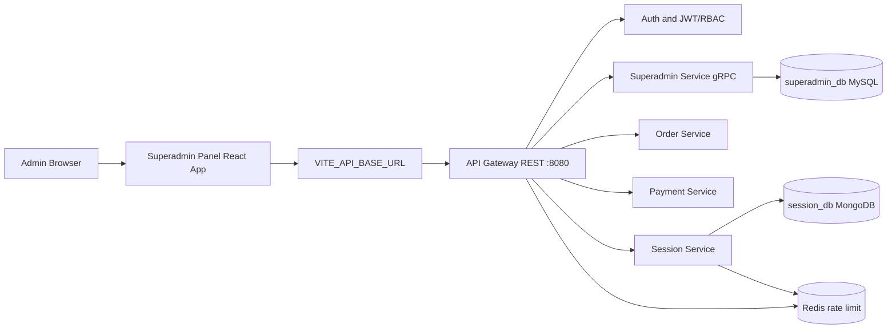
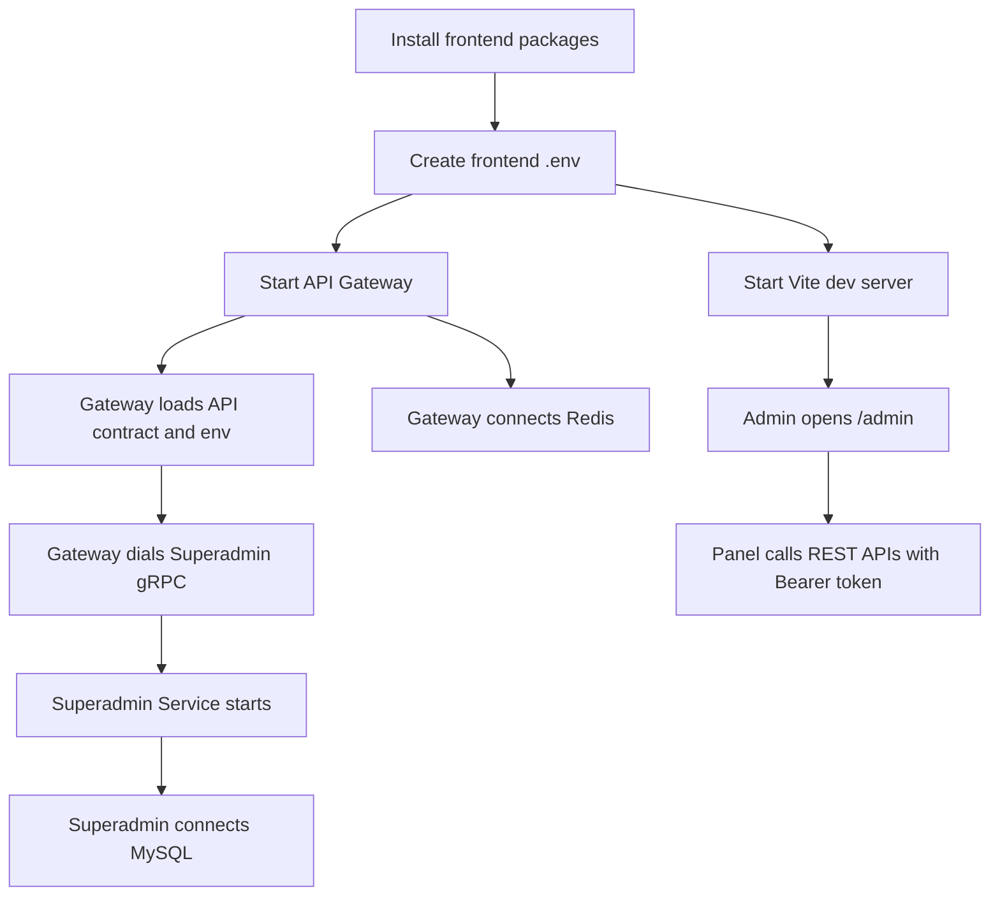
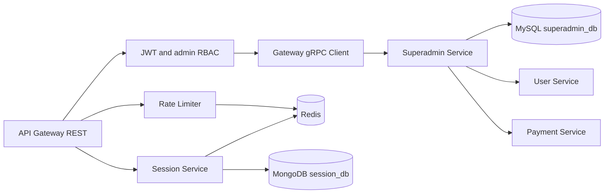

# Superadmin Panel - Main Dependency Documentation

Service Name: **Superadmin Panel**

## 1. Service overview

Superadmin Panel ek React based admin frontend hai. Actual source code clearly `frontend/superadmin-panel/` me found hua. Is app ka kaam platform admins ko users, sellers, orders, payments, sessions, platform settings, and audit logs ke screens dena hai.

Backend side par `backend/services/superadmin-service/.env` and `backend/services/api-gateway/.env` found hue, but `superadmin-service` ka Go source, `go.mod`, `main.go`, proto files, generated protobuf code, Dockerfile, and migrations folder clearly found nahi hua. Isliye backend dependency setup ko **Partial / Missing** mark kiya gaya hai.

## 2. Evidence checked

| Area | Project files checked | Result |
|------|-----------------------|--------|
| Project docs | `docs/02-system-architecture.md`, `docs/03-folder-structure.md`, `docs/04-microservice-design.md`, `docs/05-database-design.md`, `docs/09-cms-superadmin.md`, `docs/10-frontend-implementation.md`, `docs/11-devops-external-services.md`, `docs/13-developer-guide.md` | Superadmin architecture and expected backend contracts documented |
| Task notes | `TaskImplementation/Superadmin Panel/task1.md` to `task8.md` | Feature guides documented; many notes say backend code was not added |
| Frontend | `frontend/superadmin-panel/` | Actual React/Vite app found |
| Backend | `backend/services/superadmin-service/` | Only `.env` found |
| API Gateway | `backend/services/api-gateway/.env`, `api/master-api.json` | Gateway env and REST to gRPC contract found |
| Database | `database/draw.sql`, `database/mongodb-schema-design.md` | Superadmin MySQL schema and session Mongo schema documented |
| gRPC/proto | `api/master-api.json`, repo proto search | Contract found, `.proto` files not found |
| Docker | Dockerfile/compose search | Not clearly found in project files |
| Go modules | `backend/go.work`, repo `go.mod` search | `go.work` found, but Superadmin module not registered |

## 3. All detected dependencies

| Dependency | Status | Why it matters for Superadmin Panel | Separate file |
|------------|--------|--------------------------------------|---------------|
| Frontend stack | Completed | Actual app uses React, Vite, TypeScript, Tailwind, React Query, Zustand, React Router, lucide-react, Vitest | `Frontend.md` |
| Environment variables | Partial | Frontend `.env.example` exists; backend env names exist; backend implementation missing | `Environment.md` |
| API Gateway / REST API | Completed for frontend contract, Partial for backend runtime | Frontend calls `/api/v1/...` through `VITE_API_BASE_URL`; gateway env has `HTTP_ADDR=:8080` | `API_Gateway.md` |
| gRPC | Partial | API contract maps admin routes to `SuperadminService`; `SUPERADMIN_GRPC_ADDR` exists; server/client code not found | `gRPC.md` |
| Protobuf | Missing | gRPC needs proto/generated code; no `.proto` files found | `Protobuf.md` |
| MySQL | Partial | `superadmin_db` schema exists in `database/draw.sql`; backend DSN env exists; migrations/service repository not found | `MySQL.md` |
| Redis | Partial | API Gateway env uses Redis for rate limiting; session docs use Redis for live metrics; code not found | `Redis.md` |
| MongoDB | Partial / Indirect | Session oversight APIs are backed by MongoDB per docs; Superadmin Panel consumes those APIs indirectly | `MongoDB.md` |
| Go modules / workspace | Missing for Superadmin backend | `backend/go.work` only registers `./services/auth-service`; no Superadmin `go.mod` found | `Go_Modules.md` |
| Migrations | Partial | SQL schema exists in `database/draw.sql`; no service migration folder/up-down migrations found | `Migrations.md` |

Docker dependency file is not created because no actual Dockerfile or docker-compose service for this service was clearly found in project files.

## 4. Dependency flow



## 5. Setup order

1. Install frontend tooling: Node.js + pnpm.
2. Install frontend packages from `frontend/pnpm-lock.yaml`.
3. Create frontend `.env` from `frontend/superadmin-panel/.env.example`.
4. Start required backend dependencies if backend is available: MySQL, Redis, MongoDB.
5. Apply Superadmin DB schema or migrations.
6. Start API Gateway on `:8080`.
7. Start Superadmin backend service and other downstream services.
8. Start Superadmin Panel frontend.
9. Verify login and admin API calls through browser/devtools/tests.

Important: steps 4 to 7 are currently blocked/partial because backend source, service modules, proto files, and Docker Compose are not clearly found in project files.

## 6. Backend start process

Current status: **Not runnable from found files.**

Found:

- `backend/services/superadmin-service/.env`
- `backend/services/api-gateway/.env`
- `api/master-api.json`
- `database/draw.sql`

Not clearly found in project files:

- `backend/services/superadmin-service/go.mod`
- `backend/services/superadmin-service/cmd/.../main.go`
- Go handlers/repositories/usecases for Superadmin Service
- gRPC server registration
- protobuf generated code
- Dockerfile/compose service

Suggested command based on project structure:

```bash
cd backend/services/superadmin-service
go run ./cmd/superadmin-service
```

This command is only a suggestion. It will not work until backend source exists.

## 7. Frontend start process

Actual commands found in `frontend/package.json` and `frontend/superadmin-panel/package.json`:

```bash
cd frontend
pnpm install
pnpm --filter superadmin-panel dev
```

Alternative script from `frontend/package.json`:

```bash
cd frontend
pnpm run superadmin:dev
```

Build/test/typecheck:

```bash
cd frontend
pnpm run superadmin:typecheck
pnpm run superadmin:test
pnpm run superadmin:build
```

## 8. gRPC/proto setup

gRPC is expected by API contract:

- Package: `ecommerce.superadmin.v1`
- Service: `SuperadminService`
- Env: `SUPERADMIN_GRPC_ADDR`
- Gateway value found: `localhost:50062`

Methods found in `api/master-api.json`:

| Method | Auth |
|--------|------|
| `ListUsersForAdmin` | `admin` |
| `UpdateUserStatus` | `admin` |
| `ListSellersForAdmin` | `admin` |
| `UpdateSellerStatus` | `admin` |
| `ReviewRefund` | `admin` |
| `GetPlatformSettings` | `admin` |
| `UpdatePlatformSetting` | `superadmin` |
| `ListAuditLogs` | `admin` |

Missing:

- `proto/superadmin/v1/superadmin.proto`
- generated Go protobuf files
- Gateway gRPC client code
- Superadmin gRPC server registration

## 9. Docker setup

No Dockerfile or docker-compose file for Superadmin Panel / Superadmin Service was clearly found.

Suggested command based on common local setup if Docker Compose is later added:

```bash
docker compose up mysql redis mongodb api-gateway superadmin-service
```

Mark this as suggested only. Current repo files do not prove this command exists.

## 10. Database setup

MySQL schema for Superadmin is present in `database/draw.sql`:

- Database: `superadmin_db`
- Tables: `admin_users`, `admin_permissions`, `admin_role_permissions`, `platform_settings`, `admin_audit_logs`, `admin_review_tasks`

Suggested command based on project structure:

```bash
mysql -u root -p < database/draw.sql
```

Missing:

- `backend/services/superadmin-service/migrations/`
- separate up/down migration files
- rollback migration scripts
- backend repository code wiring MySQL

## 11. Environment variables

Frontend `.env.example`:

| Variable | Required | Purpose |
|----------|----------|---------|
| `VITE_API_BASE_URL` | Yes | API Gateway base URL, example `http://localhost:8080/api/v1` |
| `VITE_APP_NAME` | Optional | UI app name |
| `VITE_ADMIN_SESSION_WARNING_MINUTES` | Optional | Admin session warning timing |

Superadmin backend env names found:

| Variable group | Variables |
|----------------|-----------|
| Service basics | `SERVICE_NAME`, `APP_ENV`, `HTTP_ADDR`, `LOG_LEVEL` |
| Database | `SUPERADMIN_DATABASE_DSN`, `SUPERADMIN_DB_MAX_OPEN_CONNS`, `SUPERADMIN_DB_MAX_IDLE_CONNS`, `SUPERADMIN_DB_CONN_MAX_LIFETIME`, `SUPERADMIN_DB_PING_TIMEOUT`, `SUPERADMIN_REQUIRE_DATABASE` |
| Downstream HTTP | `USER_SERVICE_ADMIN_BASE_URL`, `ORDER_SERVICE_ADMIN_BASE_URL`, `PAYMENT_SERVICE_ADMIN_BASE_URL` |
| Timeouts/required flags | `USER_SERVICE_TIMEOUT`, `ORDER_SERVICE_TIMEOUT`, `PAYMENT_SERVICE_TIMEOUT`, `SUPERADMIN_REQUIRE_USER_SERVICE`, `SUPERADMIN_REQUIRE_ORDER_SERVICE`, `SUPERADMIN_REQUIRE_PAYMENT_SERVICE` |
| Platform/session config | `SUPERADMIN_PLATFORM_SETTINGS_CACHE_TTL`, `SUPERADMIN_PLATFORM_SETTINGS_EVENT_TOPIC`, `SUPERADMIN_SESSION_ANALYTICS_MAX_RANGE`, `SUPERADMIN_SESSION_ANALYTICS_MAX_PAGE_SIZE` |
| HTTP lifecycle | `HTTP_READ_HEADER_TIMEOUT`, `HTTP_SHUTDOWN_TIMEOUT` |

API Gateway env names found:

| Variable group | Variables |
|----------------|-----------|
| HTTP/config | `HTTP_ADDR`, `API_BASE_PATH`, `API_CONTRACT_PATH`, `LOG_LEVEL` |
| gRPC | `GRPC_TLS_ENABLED`, `GRPC_DIAL_TIMEOUT`, `SUPERADMIN_GRPC_ADDR`, plus other service gRPC addresses |
| Redis/rate limit | `RATE_LIMIT_ENABLED`, `REDIS_ADDR`, `REDIS_PASSWORD`, `REDIS_DB`, `REDIS_TLS_ENABLED`, `RATE_LIMIT_*` |
| JWT/RBAC | `JWT_ISSUER`, `JWT_AUDIENCE`, `JWT_ALLOWED_ALGS`, `JWT_JWKS_URL`, `JWT_JWKS_CACHE_TTL`, `JWT_JWKS_FETCH_TIMEOUT`, `JWT_CLOCK_SKEW` |
| Validation | `REQUEST_VALIDATION_ENABLED`, `REQUEST_VALIDATION_*` |

## 12. Ports table

| Component | Port / Address | Status | Source |
|-----------|----------------|--------|--------|
| Superadmin Panel Vite dev server | `5173` default | Suggested by Vite default | `vite --host 0.0.0.0` script |
| API Gateway HTTP | `:8080` | Found | `backend/services/api-gateway/.env` |
| API base path | `/api/v1` | Found | `backend/services/api-gateway/.env`, frontend `.env.example` |
| Superadmin backend HTTP | `:8088` | Found env only | `backend/services/superadmin-service/.env` |
| Superadmin gRPC | `localhost:50062` | Found env only | `backend/services/api-gateway/.env` |
| Redis | `localhost:6379` | Found env only | `backend/services/api-gateway/.env` |
| MySQL | `3306` | Suggested command based on common MySQL local setup | Schema found, no compose found |
| MongoDB | `27017` | Suggested command based on common Mongo local setup | Session schema docs found |

## 13. Service startup flow



Current backend boxes are partially documented but not runnable from found code.

## 14. Backend to DB/gRPC/Redis flow



## 15. Missing/incomplete implementation audit

| Area | Status | Finding | Suggested Fix |
|------|--------|---------|---------------|
| Task implementation incomplete | Partial | Frontend modules exist; task docs repeatedly say backend source was not added in guide phase | Implement backend source and wire it to the existing frontend/API contract |
| Dependency not installed | Partial | Frontend deps are in `package.json`; backend Go deps not found | Add backend `go.mod` for Superadmin Service when backend code is created |
| go.mod dependency missing | Missing | No `backend/services/superadmin-service/go.mod` found | Create service module and pin Go dependencies |
| go.sum not updated | Missing | No Superadmin backend `go.sum` found | Run `go mod tidy` after backend dependencies are added |
| Service not registered in go.work | Missing | `backend/go.work` only has `use ./services/auth-service` | Add `./services/superadmin-service` when module exists |
| Dockerfile missing | Missing | No Dockerfile found for Superadmin Panel or Superadmin Service | Add frontend/backend Dockerfiles if container deployment is required |
| docker-compose service missing | Missing | No compose file found | Add local compose for MySQL, Redis, MongoDB, gateway, and services |
| .env.example missing | Partial | Frontend `.env.example` exists; backend `.env.example` not found | Add backend `.env.example` with placeholders only |
| Environment variables missing | Partial | Env names exist in `.env`; backend config loader code not found | Implement config loader and document required vars |
| Config not loaded | Missing | No Superadmin backend source found | Add config package and startup validation |
| Migration missing | Partial | `database/draw.sql` has schema; service migration folder not found | Add versioned up migrations under service migrations folder |
| Migration rollback missing | Missing | No down migrations found | Add rollback files for every schema change |
| MySQL table/index/foreign key missing | Partial | Tables and indexes exist; foreign keys between Superadmin tables are not clearly defined | Review constraints and add only where ownership boundaries allow |
| Repository not wired | Missing | No backend repository code found | Add MySQL repository wiring |
| Usecase/service not wired | Missing | No backend usecase code found | Add Superadmin usecase/service layer |
| Handler/controller not wired | Missing | No backend HTTP/gRPC handler code found | Add gRPC server and API Gateway route handlers |
| Routes not registered | Partial | Frontend routes registered; backend gateway source not found | Register backend admin REST routes in API Gateway implementation |
| gRPC proto missing | Missing | No `.proto` files found | Add `proto/superadmin/v1/superadmin.proto` |
| Generated protobuf code missing | Missing | No generated pb files found | Generate Go protobuf code after proto is added |
| gRPC server not registered | Missing | No Superadmin server code found | Register `SuperadminService` in backend startup |
| gRPC client not configured | Partial | `SUPERADMIN_GRPC_ADDR` env exists; gateway client code not found | Add gateway gRPC client wiring |
| Frontend API integration missing | Completed | Frontend API modules call admin routes with auth headers | Keep contract tests synced with backend |
| Frontend env missing | Completed | `frontend/superadmin-panel/.env.example` exists | Copy to `.env` locally |
| Health check missing | Missing | No backend health route/source found | Add `/healthz` or gRPC health check |
| Logging missing | Partial | Env has `LOG_LEVEL`; backend logger source not found | Add structured logging with request id |
| Validation missing | Partial | Frontend has validators for settings; gateway env has validation flags; backend source not found | Enforce request validation in gateway and service |

## 16. Final checklist

- [x] `TaskImplementation/Dependency/` folder created.
- [x] `main_dependency.md` created.
- [x] Separate dependency docs created for actually detected dependency areas.
- [x] Frontend dependency setup documented.
- [x] Backend missing/incomplete areas documented clearly.
- [x] Docker marked missing instead of inventing a setup.
- [x] gRPC/protobuf gaps documented.
- [x] MySQL schema and migrations gap documented.
- [x] No business logic modified.
- [x] Documentation is service-specific to **Superadmin Panel**.
