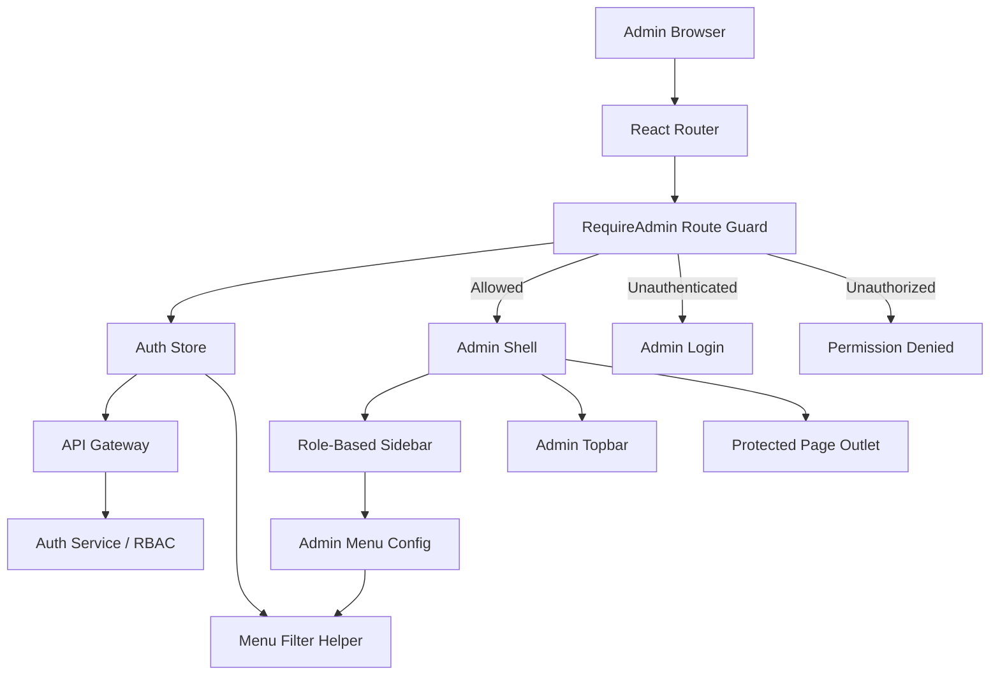
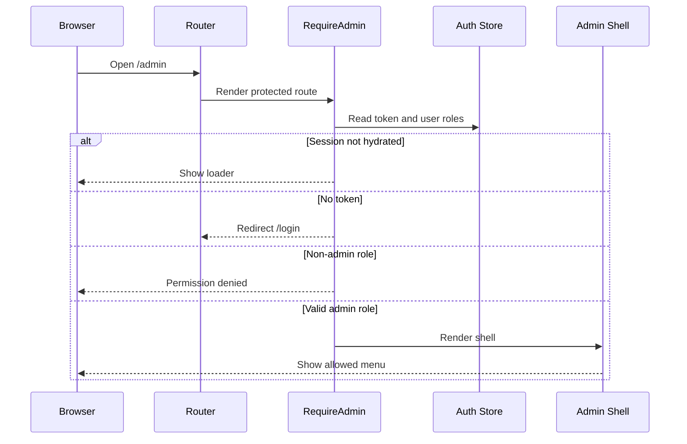
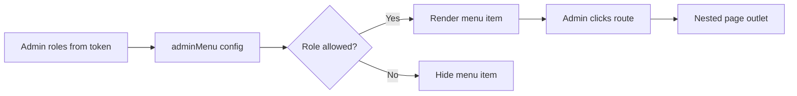

# 🛡️ Superadmin Panel - Task 1: Admin Shell


## 📌 Task Summary

| Field | Detail |
|---|---|
| Task Name | Admin shell |
| Source | `docs/01-micro-tasks.md` → `Superadmin Panel` → Task 1 |
| Priority | `P0` |
| Dependency | Auth RBAC |
| Main Goal | Secure admin layout, navigation, aur role-based menu banana |
| Output Type | Structured implementation guide |
| Not Included | User management, seller KYC, order operations, payment operations, platform settings, audit log data table |

> **Simple Hinglish goal:** Is task ka purpose Superadmin Panel ka base secure shell banana hai. Matlab admin login ke baad ek protected layout milega jisme sidebar/topbar navigation hoga, aur admin ke role ke hisaab se sirf allowed menu items visible honge.

---

## ✅ Final Output Created

```text
TaskImplementation/
└── Superadmin Panel/
    └── task1.md
```

### Why this structure?

- `TaskImplementation/` task-wise guides ke liye central folder hai.
- `Superadmin Panel/` Superadmin Panel ke saare tasks ko group karega.
- `task1.md` sirf **Superadmin Panel - Task 1** ka implementation guide hai.

> 🟢 **Note:** Is task me actual Superadmin frontend app code create nahi kiya gaya, kyunki requested output sirf required folder structure aur `task1.md` content generate karna tha. Neeche actual implementation ke liye complete step-by-step guide diya gaya hai.

---

## 🧭 Implementation Approach

Is guide ko banate time project ke existing documentation ko base banaya gaya:

| Document | Kya use kiya gaya |
|---|---|
| `docs/01-micro-tasks.md` | Task 1 ka exact scope: secure admin layout, navigation, role-based menu |
| `docs/02-system-architecture.md` | Superadmin Panel → API Gateway → Auth/Superadmin services flow |
| `docs/03-folder-structure.md` | `frontend/superadmin-panel/` target folder structure |
| `docs/06-auth-security.md` | JWT claims, admin roles, RBAC, short admin sessions, audit security |
| `docs/09-cms-superadmin.md` | Superadmin modules and permission model |
| `docs/10-frontend-implementation.md` | React + TypeScript + Tailwind, protected routes, role-based menu |
| `docs/13-developer-guide.md` | TypeScript strict mode, testing, frontend development standards |

---

## 🧱 Task Boundary

### Included in Task 1

- Superadmin app shell structure
- Protected route guard
- Admin layout with sidebar and topbar
- Role-based navigation config
- Menu visibility helper
- Permission denied and loading states
- Basic responsive shell behavior
- Beginner-friendly code examples
- Architecture and flow diagrams
- Testing checklist for shell/RBAC behavior

### Not Included in Task 1

- User list/search/block UI
- Seller KYC approval screen
- Order dispute/manual review screen
- Payment refund/reconciliation screen
- Session analytics screens
- Platform settings forms
- Audit log viewer table/export
- Backend Superadmin Service implementation
- Auth Service implementation

> 🔴 **Rule:** Task 1 sirf shell banata hai. Actual modules ka data, tables, filters, forms, mutations, aur APIs next Superadmin Panel tasks me aayenge.

---

## 🗂️ Clean Target Folder Structure

Actual Superadmin frontend implement karte time recommended structure:

```text
frontend/
└── superadmin-panel/
    ├── index.html
    ├── package.json
    ├── vite.config.ts
    ├── tsconfig.json
    ├── tailwind.config.ts
    ├── src/
    │   ├── main.tsx
    │   ├── app/
    │   │   ├── app.tsx
    │   │   ├── providers.tsx
    │   │   └── router.tsx
    │   ├── components/
    │   │   ├── layout/
    │   │   │   ├── admin-shell.tsx
    │   │   │   ├── admin-sidebar.tsx
    │   │   │   └── admin-topbar.tsx
    │   │   └── ui/
    │   │       ├── permission-denied.tsx
    │   │       └── route-loader.tsx
    │   ├── config/
    │   │   └── admin-menu.ts
    │   ├── features/
    │   │   ├── auth/
    │   │   │   └── pages/
    │   │   │       └── admin-login-page.tsx
    │   │   └── shell/
    │   │       └── pages/
    │   │           └── admin-home-page.tsx
    │   ├── lib/
    │   │   ├── admin-rbac.ts
    │   │   └── http.ts
    │   ├── routes/
    │   │   └── require-admin.tsx
    │   ├── stores/
    │   │   └── auth-store.ts
    │   └── styles/
    │       └── index.css
    └── tests/
        └── admin-rbac.test.ts
```

### Folder Responsibility

| Path | Responsibility |
|---|---|
| `app/` | Providers, router, app bootstrap |
| `components/layout/` | Sidebar, topbar, shell layout |
| `components/ui/` | Shared shell UI states |
| `config/admin-menu.ts` | Menu config with allowed roles |
| `features/auth/` | Admin login page only |
| `features/shell/` | Shell dashboard/home placeholder |
| `lib/admin-rbac.ts` | Role checking and menu filtering logic |
| `routes/require-admin.tsx` | Protected route guard |
| `stores/auth-store.ts` | Admin auth session state |
| `tests/` | Shell/RBAC tests |

> 🟡 **Important:** Future module folders like `features/users`, `features/sellers`, `features/payments` Task 1 me full implement nahi honge. Task 1 me sirf menu item and placeholder route allowed hai, taaki shell navigation test ho sake.

---

## 🧩 Architecture Diagram



**Hinglish explanation:**  
Admin browser React app open karta hai. Router pehle `RequireAdmin` guard run karta hai. Guard auth state and roles check karta hai. Agar admin authorized hai to `AdminShell` render hota hai. Shell ke andar sidebar menu RBAC helper se filter hota hai, isliye admin ko sirf apne role wale modules dikhte hain.

---

## 🔐 Admin Role Model

Project docs ke according Superadmin Panel roles:

| Role | Scope |
|---|---|
| `superadmin` | Full platform access |
| `operations_admin` | Users, sellers, orders, support actions |
| `finance_admin` | Payments, refunds, reconciliation |
| `catalog_admin` | Product moderation, categories, search/search synonyms |
| `readonly_admin` | Read-only operational view |

### Menu Visibility Matrix

| Menu Item | superadmin | operations_admin | finance_admin | catalog_admin | readonly_admin |
|---|---:|---:|---:|---:|---:|
| Overview | ✅ | ✅ | ✅ | ✅ | ✅ |
| Users | ✅ | ✅ | ❌ | ❌ | ✅ |
| Sellers | ✅ | ✅ | ❌ | ✅ | ✅ |
| Orders | ✅ | ✅ | ❌ | ❌ | ✅ |
| Payments | ✅ | ❌ | ✅ | ❌ | ✅ |
| Sessions | ✅ | ✅ | ❌ | ❌ | ✅ |
| Search | ✅ | ❌ | ❌ | ✅ | ✅ |
| Platform Settings | ✅ | ❌ | ❌ | ❌ | ❌ |
| Audit Logs | ✅ | ✅ | ✅ | ✅ | ✅ |

> 🟢 **Readonly rule:** `readonly_admin` ko risky mutation pages nahi milenge. Shell level pe read-only modules visible ho sakte hain, but action buttons future tasks me hidden/disabled rahenge.

---

## 🔌 External Libraries and Tools

Task 1 ke actual frontend implementation me ye tools/libraries recommended hain:

| Tool/Library | What it is | Why used | Install/Use |
|---|---|---|---|
| Node.js 22+ | JavaScript runtime | React/Vite development ke liye | `node --version` |
| pnpm | Package manager | Fast monorepo-friendly installs | `corepack enable` then `pnpm --version` |
| Vite | Frontend build tool | React TS app fast dev server/build ke liye | `pnpm create vite superadmin-panel --template react-ts` |
| React | UI library | Admin shell components banane ke liye | Vite React template me included |
| TypeScript | Static typing | Roles, routes, menu config safe banane ke liye | Vite React TS template me included |
| Tailwind CSS | Utility CSS framework | Dense admin UI quickly style karne ke liye | `pnpm add -D tailwindcss postcss autoprefixer` |
| React Router DOM | Client-side routing | Protected routes and nested shell layout ke liye | `pnpm add react-router-dom` |
| Zustand | Lightweight state store | Auth/session UI state ke liye | `pnpm add zustand` |
| TanStack React Query | Server state library | Future admin APIs cache/retry ke liye | `pnpm add @tanstack/react-query` |
| lucide-react | Icon library | Sidebar/topbar icons ke liye | `pnpm add lucide-react` |
| clsx | Conditional class helper | Active nav and responsive classes clean rakhne ke liye | `pnpm add clsx` |
| Vitest | Test runner | RBAC helper and shell logic tests ke liye | `pnpm add -D vitest` |
| Testing Library | React component testing | Sidebar/guard behavior test karne ke liye | `pnpm add -D @testing-library/react @testing-library/user-event @testing-library/jest-dom` |

### Setup Commands

```bash
# from repository root
mkdir -p frontend
cd frontend

# create app
pnpm create vite superadmin-panel --template react-ts
cd superadmin-panel

# runtime dependencies
pnpm add react-router-dom zustand @tanstack/react-query lucide-react clsx

# dev/test dependencies
pnpm add -D tailwindcss postcss autoprefixer vitest @testing-library/react @testing-library/user-event @testing-library/jest-dom
```

### Basic Usage Commands

```bash
# install dependencies
pnpm install

# start local dev server
pnpm dev

# run tests
pnpm test

# production build
pnpm build
```

> 🟡 **Note:** Is guide me dependencies recommended hain. Actual install tab karna hai jab Superadmin frontend app code implement kiya jaye.

---

## 🪜 Step-by-Step Implementation

## Step 1: Task scope confirm karo

Source task:

```text
Superadmin Panel → Task 1
Admin shell: Secure admin layout, navigation, role-based menu banao.
Sirf allowed modules visible honge.
Dependency: Auth RBAC
Priority: P0
```

**Implementation meaning:**

- Login ke baad admin protected layout me enter karega.
- Unauthorized user ko shell access nahi milega.
- Sidebar menu admin roles ke basis pe filter hoga.
- Topbar me admin identity, role badge, and logout control hoga.
- Page content ke liye nested route outlet rahega.

**Boundary:**

- Task 1 me module data fetch nahi hoga.
- Users/sellers/orders/payments pages ka actual business UI nahi banega.
- Sirf shell and navigation foundation ready hogi.

---

## Step 2: Superadmin frontend app initialize karo

Recommended target path:

```text
frontend/superadmin-panel/
```

Create command:

```bash
cd frontend
pnpm create vite superadmin-panel --template react-ts
```

**Explanation:**  
Vite React TypeScript template fast setup deta hai. TypeScript roles and menu config me mistakes pakadta hai. Superadmin app ko separate frontend app rakhna better hai, kyunki admin security, routing, and UI normal user app se different hoti hai.

---

## Step 3: Environment variables define karo

Create:

```text
frontend/superadmin-panel/.env.example
```

Example:

```env
VITE_API_BASE_URL=http://localhost:8080/api/v1
VITE_APP_NAME=Superadmin Panel
VITE_ADMIN_SESSION_WARNING_MINUTES=2
```

**Explanation:**  
API base URL env se aayega, hardcode nahi hoga. Admin session short TTL docs me recommended hai, isliye warning threshold bhi config driven rakha ja sakta hai.

---

## Step 4: Admin role types banao

Create:

```text
src/lib/admin-rbac.ts
```

Code example:

```ts
export type AdminRole =
  | "superadmin"
  | "operations_admin"
  | "finance_admin"
  | "catalog_admin"
  | "readonly_admin";

export type AdminMenuItem = {
  id: string;
  label: string;
  path: string;
  roles: AdminRole[];
};

export const ADMIN_ROLES: AdminRole[] = [
  "superadmin",
  "operations_admin",
  "finance_admin",
  "catalog_admin",
  "readonly_admin",
];

export function hasAnyRole(userRoles: string[], allowedRoles: AdminRole[]) {
  return allowedRoles.some((role) => userRoles.includes(role));
}

export function isAdminUser(userRoles: string[]) {
  return hasAnyRole(userRoles, ADMIN_ROLES);
}

export function canViewMenuItem(userRoles: string[], item: AdminMenuItem) {
  return hasAnyRole(userRoles, item.roles);
}
```

**Explanation:**  
RBAC logic ek helper file me rakha gaya hai. Isse sidebar, route guard, tests, aur future action buttons same rule use kar sakte hain. Duplicate role checks avoid honge.

---

## Step 5: Role-based menu config banao

Create:

```text
src/config/admin-menu.ts
```

Code example:

```ts
import {
  Activity,
  CreditCard,
  ClipboardList,
  LayoutDashboard,
  Search,
  Settings,
  ShieldCheck,
  Store,
  Users,
} from "lucide-react";
import type { ComponentType } from "react";

import type { AdminMenuItem } from "../lib/admin-rbac";

export const adminMenu: Array<AdminMenuItem & { icon: ComponentType<{ size?: number }> }> = [
  {
    id: "overview",
    label: "Overview",
    path: "/admin",
    icon: LayoutDashboard,
    roles: ["superadmin", "operations_admin", "finance_admin", "catalog_admin", "readonly_admin"],
  },
  {
    id: "users",
    label: "Users",
    path: "/admin/users",
    icon: Users,
    roles: ["superadmin", "operations_admin", "readonly_admin"],
  },
  {
    id: "sellers",
    label: "Sellers",
    path: "/admin/sellers",
    icon: Store,
    roles: ["superadmin", "operations_admin", "catalog_admin", "readonly_admin"],
  },
  {
    id: "orders",
    label: "Orders",
    path: "/admin/orders",
    icon: ClipboardList,
    roles: ["superadmin", "operations_admin", "readonly_admin"],
  },
  {
    id: "payments",
    label: "Payments",
    path: "/admin/payments",
    icon: CreditCard,
    roles: ["superadmin", "finance_admin", "readonly_admin"],
  },
  {
    id: "sessions",
    label: "Sessions",
    path: "/admin/sessions",
    icon: Activity,
    roles: ["superadmin", "operations_admin", "readonly_admin"],
  },
  {
    id: "search",
    label: "Search",
    path: "/admin/search",
    icon: Search,
    roles: ["superadmin", "catalog_admin", "readonly_admin"],
  },
  {
    id: "settings",
    label: "Settings",
    path: "/admin/settings",
    icon: Settings,
    roles: ["superadmin"],
  },
  {
    id: "audit-logs",
    label: "Audit Logs",
    path: "/admin/audit-logs",
    icon: ShieldCheck,
    roles: ["superadmin", "operations_admin", "finance_admin", "catalog_admin", "readonly_admin"],
  },
];
```

**Explanation:**  
Menu item ke andar path, label, icon, and allowed roles stored hain. Sidebar ko hardcoded `if/else` nahi likhna padega. Future me role update karna ho to config update enough hoga.

> 🟡 **Task 1 boundary:** Ye menu future modules ka navigation foundation hai. Is task me in modules ke actual pages/tables/forms implement nahi honge.

---

## Step 6: Auth session store banao

Create:

```text
src/stores/auth-store.ts
```

Code example:

```ts
import { create } from "zustand";

export type AdminUser = {
  id: string;
  email: string;
  name: string;
  roles: string[];
};

type AuthState = {
  accessToken: string | null;
  user: AdminUser | null;
  isHydrated: boolean;
  setSession: (token: string, user: AdminUser) => void;
  clearSession: () => void;
  markHydrated: () => void;
};

export const useAuthStore = create<AuthState>((set) => ({
  accessToken: null,
  user: null,
  isHydrated: false,
  setSession: (accessToken, user) => set({ accessToken, user }),
  clearSession: () => set({ accessToken: null, user: null }),
  markHydrated: () => set({ isHydrated: true }),
}));
```

**Explanation:**  
Auth state centralized rahega. Route guard and topbar same state consume karenge. `isHydrated` initial loading ke liye useful hai, taaki page refresh pe guard jaldi redirect na kare.

> 🔐 **Security note:** Access token ko localStorage me long-term store karna risky ho sakta hai. Production me secure cookie/short-lived token/refresh rotation strategy Auth Service ke design ke saath align karni hogi.

---

## Step 7: HTTP client me token attach karo

Create:

```text
src/lib/http.ts
```

Code example:

```ts
import { useAuthStore } from "../stores/auth-store";

const API_BASE_URL = import.meta.env.VITE_API_BASE_URL;

export async function apiFetch<T>(path: string, init: RequestInit = {}): Promise<T> {
  const token = useAuthStore.getState().accessToken;

  const response = await fetch(`${API_BASE_URL}${path}`, {
    ...init,
    headers: {
      "Content-Type": "application/json",
      ...(token ? { Authorization: `Bearer ${token}` } : {}),
      ...init.headers,
    },
  });

  if (!response.ok) {
    throw new Error(`API request failed with status ${response.status}`);
  }

  return response.json() as Promise<T>;
}
```

**Explanation:**  
Shell me future auth verification ya logout endpoint call karne ke liye common HTTP helper useful hai. Request me token attach hota hai. Production version me request id, timeout, error normalization, and refresh retry add karna hoga.

---

## Step 8: Protected route guard banao

Create:

```text
src/routes/require-admin.tsx
```

Code example:

```tsx
import { Navigate, Outlet, useLocation } from "react-router-dom";

import { PermissionDenied } from "../components/ui/permission-denied";
import { RouteLoader } from "../components/ui/route-loader";
import { isAdminUser } from "../lib/admin-rbac";
import { useAuthStore } from "../stores/auth-store";

export function RequireAdmin() {
  const location = useLocation();
  const { accessToken, user, isHydrated } = useAuthStore();

  if (!isHydrated) {
    return <RouteLoader label="Checking admin session" />;
  }

  if (!accessToken || !user) {
    return <Navigate to="/login" replace state={{ from: location }} />;
  }

  if (!isAdminUser(user.roles)) {
    return <PermissionDenied />;
  }

  return <Outlet />;
}
```

**Explanation:**  
Route guard shell ka security gate hai. Pehle session load check hota hai. Phir token/user check hota hai. Phir role check hota hai. Agar admin role valid hai tabhi nested admin routes render hote hain.

---

## Step 9: Admin sidebar banao

Create:

```text
src/components/layout/admin-sidebar.tsx
```

Code example:

```tsx
import { NavLink } from "react-router-dom";
import clsx from "clsx";

import { adminMenu } from "../../config/admin-menu";
import { canViewMenuItem } from "../../lib/admin-rbac";
import { useAuthStore } from "../../stores/auth-store";

export function AdminSidebar() {
  const roles = useAuthStore((state) => state.user?.roles ?? []);
  const visibleMenu = adminMenu.filter((item) => canViewMenuItem(roles, item));

  return (
    <aside className="hidden w-64 shrink-0 border-r border-slate-200 bg-white lg:block">
      <div className="border-b border-slate-200 px-5 py-4">
        <p className="text-sm font-semibold text-slate-950">Superadmin</p>
        <p className="text-xs text-slate-500">Platform Control</p>
      </div>

      <nav className="space-y-1 px-3 py-4">
        {visibleMenu.map((item) => {
          const Icon = item.icon;

          return (
            <NavLink
              key={item.id}
              to={item.path}
              end={item.path === "/admin"}
              className={({ isActive }) =>
                clsx(
                  "flex h-10 items-center gap-3 rounded-md px-3 text-sm font-medium",
                  isActive
                    ? "bg-slate-950 text-white"
                    : "text-slate-600 hover:bg-slate-100 hover:text-slate-950"
                )
              }
            >
              <Icon size={18} />
              <span>{item.label}</span>
            </NavLink>
          );
        })}
      </nav>
    </aside>
  );
}
```

**Explanation:**  
Sidebar `adminMenu` config ko role ke basis pe filter karta hai. Jo menu item allowed nahi hai wo DOM me render hi nahi hota. Active route clearly highlight hota hai. UI dense, clean, and operational rakha gaya hai.

---

## Step 10: Admin topbar banao

Create:

```text
src/components/layout/admin-topbar.tsx
```

Code example:

```tsx
import { LogOut, Shield } from "lucide-react";

import { useAuthStore } from "../../stores/auth-store";

export function AdminTopbar() {
  const user = useAuthStore((state) => state.user);
  const clearSession = useAuthStore((state) => state.clearSession);

  return (
    <header className="flex h-14 items-center justify-between border-b border-slate-200 bg-white px-4">
      <div className="flex items-center gap-2 text-sm font-medium text-slate-700">
        <Shield size={18} />
        <span>Secure Admin Console</span>
      </div>

      <div className="flex items-center gap-3">
        <div className="text-right">
          <p className="text-sm font-medium text-slate-950">{user?.name}</p>
          <p className="text-xs text-slate-500">{user?.roles.join(", ")}</p>
        </div>

        <button
          type="button"
          onClick={clearSession}
          className="inline-flex h-9 w-9 items-center justify-center rounded-md border border-slate-200 text-slate-600 hover:bg-slate-100"
          aria-label="Logout"
        >
          <LogOut size={17} />
        </button>
      </div>
    </header>
  );
}
```

**Explanation:**  
Topbar admin identity show karta hai. Logout icon button familiar action hai. Production me logout click Auth Service ko refresh token/session revoke request bhejega, phir local session clear karega.

---

## Step 11: Admin shell layout banao

Create:

```text
src/components/layout/admin-shell.tsx
```

Code example:

```tsx
import { Outlet } from "react-router-dom";

import { AdminSidebar } from "./admin-sidebar";
import { AdminTopbar } from "./admin-topbar";

export function AdminShell() {
  return (
    <div className="min-h-screen bg-slate-50 text-slate-950">
      <div className="flex min-h-screen">
        <AdminSidebar />

        <div className="flex min-w-0 flex-1 flex-col">
          <AdminTopbar />

          <main className="flex-1 px-4 py-4 lg:px-6">
            <Outlet />
          </main>
        </div>
      </div>
    </div>
  );
}
```

**Explanation:**  
`AdminShell` app ka protected frame hai. Sidebar and topbar fixed shell components hain. `Outlet` ke andar current route ka page render hota hai. Ye nested routing ke liye clean pattern hai.

---

## Step 12: Router wire karo

Create:

```text
src/app/router.tsx
```

Code example:

```tsx
import { createBrowserRouter } from "react-router-dom";

import { AdminShell } from "../components/layout/admin-shell";
import { AdminLoginPage } from "../features/auth/pages/admin-login-page";
import { AdminHomePage } from "../features/shell/pages/admin-home-page";
import { RequireAdmin } from "../routes/require-admin";

function PlaceholderPage({ title }: { title: string }) {
  return (
    <section>
      <h1 className="text-xl font-semibold text-slate-950">{title}</h1>
      <p className="mt-1 text-sm text-slate-500">This module will be implemented in a later task.</p>
    </section>
  );
}

export const router = createBrowserRouter([
  {
    path: "/login",
    element: <AdminLoginPage />,
  },
  {
    element: <RequireAdmin />,
    children: [
      {
        path: "/admin",
        element: <AdminShell />,
        children: [
          { index: true, element: <AdminHomePage /> },
          { path: "users", element: <PlaceholderPage title="Users" /> },
          { path: "sellers", element: <PlaceholderPage title="Sellers" /> },
          { path: "orders", element: <PlaceholderPage title="Orders" /> },
          { path: "payments", element: <PlaceholderPage title="Payments" /> },
          { path: "sessions", element: <PlaceholderPage title="Sessions" /> },
          { path: "search", element: <PlaceholderPage title="Search" /> },
          { path: "settings", element: <PlaceholderPage title="Settings" /> },
          { path: "audit-logs", element: <PlaceholderPage title="Audit Logs" /> },
        ],
      },
    ],
  },
]);
```

**Explanation:**  
`RequireAdmin` guard ke andar hi `/admin` routes rakhe gaye hain. Admin shell nested route hai. Placeholder pages sirf navigation test ke liye hain; actual module implementation Task 2 onwards me hoga.

---

## Step 13: Providers setup karo

Create:

```text
src/app/providers.tsx
```

Code example:

```tsx
import { QueryClient, QueryClientProvider } from "@tanstack/react-query";
import { RouterProvider } from "react-router-dom";

import { router } from "./router";

const queryClient = new QueryClient({
  defaultOptions: {
    queries: {
      staleTime: 30_000,
      retry: 1,
    },
  },
});

export function AppProviders() {
  return (
    <QueryClientProvider client={queryClient}>
      <RouterProvider router={router} />
    </QueryClientProvider>
  );
}
```

**Explanation:**  
React Query future admin APIs ke liye ready rahega. Task 1 me heavy data fetching nahi hai, but provider setup future tasks ko clean entry point deta hai.

---

## Step 14: App entry point connect karo

Create:

```text
src/main.tsx
```

Code example:

```tsx
import React from "react";
import ReactDOM from "react-dom/client";

import { AppProviders } from "./app/providers";
import "./styles/index.css";

ReactDOM.createRoot(document.getElementById("root")!).render(
  <React.StrictMode>
    <AppProviders />
  </React.StrictMode>
);
```

**Explanation:**  
Entry point sirf providers mount karta hai. App bootstrap simple rakha gaya hai.

---

## Step 15: Shell home page banao

Create:

```text
src/features/shell/pages/admin-home-page.tsx
```

Code example:

```tsx
export function AdminHomePage() {
  return (
    <section>
      <div className="mb-4">
        <h1 className="text-xl font-semibold text-slate-950">Overview</h1>
        <p className="mt-1 text-sm text-slate-500">Secure platform control shell is ready.</p>
      </div>

      <div className="grid gap-3 md:grid-cols-3">
        <div className="rounded-md border border-slate-200 bg-white p-4">
          <p className="text-xs font-medium uppercase text-slate-500">Shell</p>
          <p className="mt-2 text-lg font-semibold text-slate-950">Protected</p>
        </div>
        <div className="rounded-md border border-slate-200 bg-white p-4">
          <p className="text-xs font-medium uppercase text-slate-500">Navigation</p>
          <p className="mt-2 text-lg font-semibold text-slate-950">Role-based</p>
        </div>
        <div className="rounded-md border border-slate-200 bg-white p-4">
          <p className="text-xs font-medium uppercase text-slate-500">Scope</p>
          <p className="mt-2 text-lg font-semibold text-slate-950">Task 1 only</p>
        </div>
      </div>
    </section>
  );
}
```

**Explanation:**  
Home page shell status dikhata hai. Ye real analytics dashboard nahi hai. Iska purpose sirf confirm karna hai ki protected shell successfully load ho raha hai.

---

## Step 16: Login page ka minimal placeholder banao

Create:

```text
src/features/auth/pages/admin-login-page.tsx
```

Code example:

```tsx
export function AdminLoginPage() {
  return (
    <main className="flex min-h-screen items-center justify-center bg-slate-50 px-4">
      <section className="w-full max-w-sm rounded-md border border-slate-200 bg-white p-5">
        <h1 className="text-lg font-semibold text-slate-950">Admin Login</h1>
        <p className="mt-1 text-sm text-slate-500">Auth flow will connect to Auth Service RBAC.</p>

        <button
          type="button"
          className="mt-5 h-10 w-full rounded-md bg-slate-950 text-sm font-medium text-white"
        >
          Continue
        </button>
      </section>
    </main>
  );
}
```

**Explanation:**  
Task 1 me complete login flow implement nahi hai, kyunki Auth Service dependency separate hai. Ye page shell routing ke liye placeholder hai. Actual login, MFA, refresh token, logout revoke flow Auth tasks ke saath integrate hoga.

---

## Step 17: Permission denied and loader states banao

Create:

```text
src/components/ui/permission-denied.tsx
src/components/ui/route-loader.tsx
```

Code example:

```tsx
export function PermissionDenied() {
  return (
    <main className="flex min-h-screen items-center justify-center bg-slate-50 px-4">
      <section className="w-full max-w-md rounded-md border border-red-200 bg-white p-5">
        <p className="text-sm font-semibold text-red-700">Permission denied</p>
        <h1 className="mt-2 text-lg font-semibold text-slate-950">Admin access required</h1>
        <p className="mt-1 text-sm text-slate-500">
          Your account does not have a valid admin role for this panel.
        </p>
      </section>
    </main>
  );
}

export function RouteLoader({ label }: { label: string }) {
  return (
    <main className="flex min-h-screen items-center justify-center bg-slate-50">
      <p className="text-sm font-medium text-slate-600">{label}...</p>
    </main>
  );
}
```

**Explanation:**  
Security UX clear hona chahiye. Unauthorized admin ko blank screen nahi dikhni chahiye. Loader session hydration ke time flicker avoid karta hai.

---

## Step 18: Menu filtering test karo

Create:

```text
tests/admin-rbac.test.ts
```

Code example:

```ts
import { describe, expect, it } from "vitest";

import { canViewMenuItem, isAdminUser } from "../src/lib/admin-rbac";

describe("admin RBAC", () => {
  it("allows superadmin as admin user", () => {
    expect(isAdminUser(["superadmin"])).toBe(true);
  });

  it("blocks buyer from admin access", () => {
    expect(isAdminUser(["buyer"])).toBe(false);
  });

  it("shows finance menu item to finance admin", () => {
    expect(
      canViewMenuItem(["finance_admin"], {
        id: "payments",
        label: "Payments",
        path: "/admin/payments",
        roles: ["superadmin", "finance_admin"],
      })
    ).toBe(true);
  });

  it("hides finance menu item from operations admin", () => {
    expect(
      canViewMenuItem(["operations_admin"], {
        id: "payments",
        label: "Payments",
        path: "/admin/payments",
        roles: ["superadmin", "finance_admin"],
      })
    ).toBe(false);
  });
});
```

**Explanation:**  
RBAC helper pure function hai, isliye unit test easy hai. Ye ensure karta hai ki buyer/seller jaise non-admin roles shell access nahi kar sakte aur menu filtering expected hai.

---

## Step 19: Admin shell security checklist apply karo

| Check | Expected Result |
|---|---|
| No token/user | `/admin` → `/login` redirect |
| Buyer role | Permission denied |
| Seller role | Permission denied |
| `finance_admin` | Payments and audit visible, user/seller/order hidden as per matrix |
| `operations_admin` | Users, sellers, orders, sessions visible |
| `catalog_admin` | Sellers/search/audit visible |
| `superadmin` | All menu items visible |
| Unknown role | No admin shell access |
| Refresh loading | Route loader visible |

**Explanation:**  
Task 1 ka main success criteria security and role-based visibility hai. Agar menu hidden hai but route manually open ho sakta hai, to future step me route-level permission map bhi add karna hoga. Shell level me at minimum valid admin guard required hai.

---

## Step 20: Responsive layout polish karo

Task 1 layout desktop admin use ke liye dense hona chahiye. Mobile pe sidebar drawer pattern use kar sakte hain:

- Desktop: fixed left sidebar
- Tablet/mobile: menu button + drawer
- Topbar: admin identity and logout always visible
- Main content: full width, no marketing hero
- Cards: compact, radius `8px` ya less

**Hinglish explanation:**  
Superadmin panel operational tool hai, marketing page nahi. Isliye layout calm, compact, readable, and fast scanning friendly hona chahiye.

---

## 🔄 Route Guard Flow



---

## 🧠 Menu Filtering Flow



**Hinglish explanation:**  
Menu filtering frontend UX ke liye hai. Real security backend/API Gateway/Auth Service me bhi enforce honi chahiye. Frontend hidden menu ko security ka only layer nahi maana jayega.

---

## 🎨 UI Design Notes


### Visual rules

- Sidebar compact rakho.
- Topbar simple rakho.
- Navigation active state clear rakho.
- Permission denied state obvious but calm rakho.
- Buttons me icons use karo where possible.
- Superadmin app ko landing page jaisa design mat karo.
- Large hero, decorative gradients, and marketing copy avoid karo.

### Suggested color usage

| Purpose | Color direction |
|---|---|
| Primary shell | Neutral white/slate |
| Active nav | Dark neutral |
| Risk/error | Red |
| Success | Green |
| Warning | Amber |
| Info | Blue |

> 🟢 **Reason:** Admin tools me readability and trust zyada important hai. One-note bright theme avoid karna chahiye.

---

## 🧪 Testing Strategy

### Unit tests

- `isAdminUser(["superadmin"])` true
- `isAdminUser(["buyer"])` false
- `canViewMenuItem` correct role matrix follow kare
- Unknown role no access

### Component tests

- Sidebar only allowed menu items render kare
- Topbar admin name and role show kare
- Logout button session clear kare
- Permission denied component unauthorized role pe show ho

### Route tests

- `/admin` without session redirects to `/login`
- `/admin` with buyer role shows permission denied
- `/admin` with `superadmin` renders shell
- `/admin/payments` menu finance admin ko visible ho

### Manual verification

```bash
pnpm test
pnpm dev
```

Then browser me check:

```text
http://localhost:5173/login
http://localhost:5173/admin
```

---

## 🔒 Security Notes

| Area | Rule |
|---|---|
| Token TTL | Admin access token short-lived hona chahiye |
| MFA | Admin login ke liye MFA recommended |
| RBAC | Frontend + API Gateway + service level enforcement |
| Logout | Refresh token/session revoke hona chahiye |
| Audit | Risky future admin actions audit log me jayenge |
| PII | Admin views me PII masking by default |
| Unknown roles | Access deny by default |

> 🔴 **Important:** Frontend menu hiding sirf UX control hai. Real authorization API Gateway/Auth Service/Superadmin Service me enforce karni mandatory hai.

---

## ✅ Completion Checklist

| Item | Status |
|---|---|
| Task source identified | ✅ |
| Dependency identified as Auth RBAC | ✅ |
| Target Superadmin folder structure defined | ✅ |
| External tools/libraries documented | ✅ |
| Role model documented | ✅ |
| Role-based menu matrix documented | ✅ |
| Protected route guard example added | ✅ |
| Admin shell layout example added | ✅ |
| Sidebar/topbar examples added | ✅ |
| Mermaid architecture diagram added | ✅ |
| Mermaid route guard flow added | ✅ |
| Testing checklist added | ✅ |
| Scope limited to Task 1 only | ✅ |

---

## 🚫 What To Avoid In Task 1

- Users table implement mat karo.
- Seller approval workflow implement mat karo.
- Refund review screen implement mat karo.
- Search synonym manager implement mat karo.
- Platform setting mutation forms implement mat karo.
- Audit log export implement mat karo.
- Backend service APIs implement mat karo.
- Non-admin roles ko shell access mat do.

> 🟢 **Next task handoff:** Task 2 me `User management` aayega. Task 1 ka shell uske liye base route/layout/RBAC foundation provide karega.
