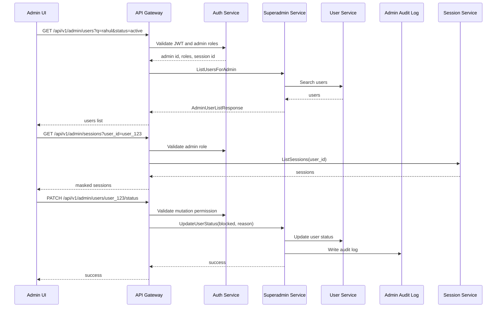
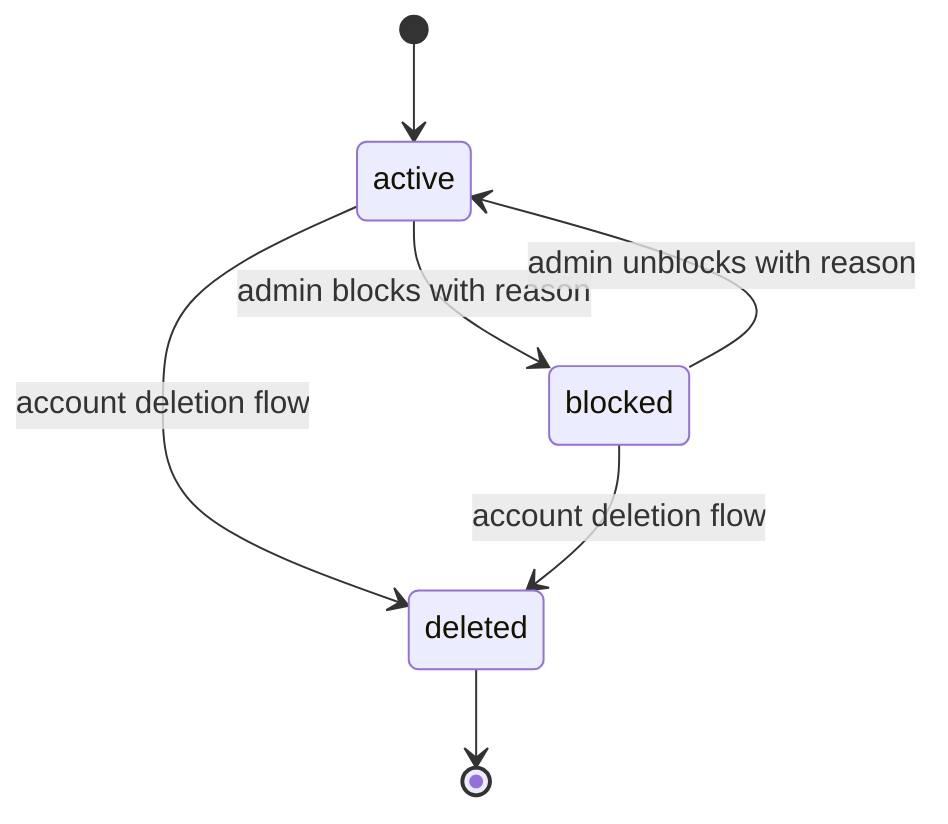

# 👥 Superadmin Panel - Task 2: User Management


## 📌 Task Summary

| Field | Detail |
|---|---|
| Task Name | User management |
| Source | `docs/01-micro-tasks.md` → `Superadmin Panel` → Task 2 |
| Priority | `P1` |
| Dependency | User/Superadmin APIs |
| Main Goal | User search, block/unblock, profile view, aur session view banana |
| Output Type | Structured implementation guide |
| Not Included | Seller KYC approval, order operations, payment operations, platform settings, audit log table/export |

> **Simple Hinglish goal:** Is task ka purpose Superadmin Panel ke andar ek **Users module** banana hai jahan admin users ko search/filter kar sake, profile details dekh sake, user ko block/unblock kar sake, aur us user ke sessions/journey ka limited admin view dekh sake.

---

## ✅ Final Output Created

```text
TaskImplementation/
└── Superadmin Panel/
    ├── task1.md
    └── task2.md
```

### Why this structure?

- `TaskImplementation/` task-wise guides ka central folder hai.
- `Superadmin Panel/` Superadmin Panel ke saare implementation notes ko group karta hai.
- `task2.md` sirf **Superadmin Panel - Task 2: User Management** ka guide hai.

> 🟢 **Note:** Is file me Task 2 ka complete step-by-step implementation guide diya gaya hai. Actual production code future implementation phase me isi guide ko follow karke add hoga.

---

## 🧭 Implementation Approach

Is guide ko project ke existing docs ke basis par design kiya gaya:

| Document | Kya use kiya gaya |
|---|---|
| `docs/01-micro-tasks.md` | Task 2 ka exact scope: user search, block/unblock, profile view, session view |
| `docs/02-system-architecture.md` | Superadmin Panel → API Gateway → Superadmin/User/Session services ka flow |
| `docs/03-folder-structure.md` | `frontend/superadmin-panel/` ke andar users feature folder |
| `docs/04-microservice-design.md` | Superadmin Service APIs: `ListUsersForAdmin`, `UpdateUserStatus` |
| `docs/05-database-design.md` | Superadmin audit/log tables and relationships |
| `docs/06-auth-security.md` | JWT, RBAC, admin mutation rate limit, PII masking, audit logging |
| `docs/08-session-management-system.md` | User session, device, journey, events model |
| `docs/09-cms-superadmin.md` | Superadmin modules, permissions, high-risk controls |
| `docs/10-frontend-implementation.md` | React Query, Zustand, protected routes, admin UI standards |
| `api/master-api.json` | Actual REST endpoints and schemas for admin users and sessions |

---

## 🧱 Task Boundary

### Included in Task 2

- Users route inside existing Superadmin shell
- User list page
- Search input with debounce
- Status filter
- Pagination
- User table with status badges
- User profile detail page
- User sessions panel
- User journey drawer/detail view
- Block/unblock action with required audit reason
- React Query hooks for list/detail/action calls
- Optimistic or post-success query refresh
- Permission checks for view vs mutation
- Loading, empty, error, and permission-denied states
- Code examples and diagrams

### Not Included in Task 2

- Seller management or KYC review
- Seller suspension flow
- Order search/detail/dispute UI
- Payment refund/reconciliation UI
- Platform settings UI
- Search synonym management
- Full audit log viewer page
- Backend service implementation
- Database migration implementation
- Session heatmap/funnel analytics pages

> 🔴 **Rule:** Task 2 sirf **Users module** cover karega. Agar user profile page par order/payment/seller data ka link dikhana ho, to sirf navigation placeholder rakho; actual screens next tasks me aayenge.

---

## 🗂️ Clean Target Folder Structure

Task 1 ne Superadmin shell ka base diya. Task 2 us shell ke andar `users` feature add karega.

```text
frontend/
└── superadmin-panel/
    ├── src/
    │   ├── app/
    │   │   └── router.tsx
    │   ├── components/
    │   │   └── ui/
    │   │       ├── confirm-dialog.tsx
    │   │       ├── data-state.tsx
    │   │       ├── status-badge.tsx
    │   │       └── table-pagination.tsx
    │   ├── features/
    │   │   └── users/
    │   │       ├── api/
    │   │       │   └── users-api.ts
    │   │       ├── components/
    │   │       │   ├── user-action-dialog.tsx
    │   │       │   ├── user-filter-bar.tsx
    │   │       │   ├── user-profile-panel.tsx
    │   │       │   ├── user-session-list.tsx
    │   │       │   ├── user-session-timeline.tsx
    │   │       │   └── user-table.tsx
    │   │       ├── hooks/
    │   │       │   ├── use-admin-user.ts
    │   │       │   ├── use-admin-users.ts
    │   │       │   ├── use-user-sessions.ts
    │   │       │   └── use-update-user-status.ts
    │   │       ├── pages/
    │   │       │   ├── user-detail-page.tsx
    │   │       │   └── user-list-page.tsx
    │   │       └── types.ts
    │   ├── lib/
    │   │   ├── admin-permissions.ts
    │   │   ├── format.ts
    │   │   └── http.ts
    │   └── routes/
    │       └── require-admin.tsx
    └── tests/
        └── users/
            ├── user-permissions.test.ts
            ├── user-status-action.test.tsx
            └── users-api.test.ts
```

### Folder Responsibility

| Path | Responsibility |
|---|---|
| `features/users/api/` | Superadmin user REST calls |
| `features/users/hooks/` | React Query hooks for users and sessions |
| `features/users/components/` | Table, filters, profile panel, session timeline |
| `features/users/pages/` | Route-level list and detail pages |
| `features/users/types.ts` | User/session TypeScript types |
| `components/ui/` | Shared UI states/dialogs/badges |
| `lib/admin-permissions.ts` | Role and permission helper |
| `tests/users/` | User module unit/component tests |

> 🟡 **Important:** `features/sellers`, `features/orders`, `features/payments` Task 2 me create ya implement nahi karne. Users module ko focused rakho.

---

## 🔌 External Libraries and Tools

Task 2 ke implementation me Task 1 ke same frontend stack ka use hoga. Naye heavy tools add karne ki zarurat nahi hai.

| Tool/Library | What it is | Why used | Install/Use |
|---|---|---|---|
| React | UI library | User list/detail components banane ke liye | Vite React app me included |
| TypeScript | Static typing | API response, filters, roles safe banane ke liye | Vite React TS app me included |
| React Router DOM | Client routing | `/admin/users` and `/admin/users/:userId` routes ke liye | `pnpm add react-router-dom` |
| TanStack React Query | Server state | User list, sessions, status mutation cache handle karne ke liye | `pnpm add @tanstack/react-query` |
| Zustand | Local UI/session state | Auth/admin state Task 1 se reuse karne ke liye | `pnpm add zustand` |
| lucide-react | Icons | Search, filter, lock/unlock, session icons ke liye | `pnpm add lucide-react` |
| clsx | Class helper | Status badge and active state classes clean rakhne ke liye | `pnpm add clsx` |
| Vitest | Unit test runner | Permission and API helper tests ke liye | `pnpm add -D vitest` |
| Testing Library | Component tests | Dialog/table interactions test karne ke liye | `pnpm add -D @testing-library/react @testing-library/user-event @testing-library/jest-dom` |
| MSW | API mocking | User list/status/session API test mocks ke liye | `pnpm add -D msw` |

### Install Commands

```bash
# from frontend/superadmin-panel
pnpm add react-router-dom @tanstack/react-query zustand lucide-react clsx
pnpm add -D vitest @testing-library/react @testing-library/user-event @testing-library/jest-dom msw
```

### Why MSW?

MSW yani **Mock Service Worker** frontend tests me fake API responses provide karta hai. Isse user list, block/unblock, and sessions flow backend ke bina test ho sakta hai.

```bash
# test run
pnpm vitest run
```

---

## 🧩 Architecture Diagram

```mermaid
flowchart TB
    Admin[Admin Browser] --> Shell[Superadmin Shell]
    Shell --> UsersRoute[/admin/users]
    Shell --> UserDetailRoute[/admin/users/:userId]

    UsersRoute --> UserListPage[User List Page]
    UserDetailRoute --> DetailPage[User Detail Page]

    UserListPage --> UserHooks[React Query Hooks]
    DetailPage --> UserHooks
    DetailPage --> SessionHooks[Session Query Hooks]

    UserHooks --> HTTP[Admin HTTP Client]
    SessionHooks --> HTTP

    HTTP --> Gateway[API Gateway]
    Gateway --> Auth[Auth RBAC Check]
    Gateway --> Superadmin[Superadmin Service]
    Gateway --> Session[Session Management Service]

    Superadmin --> UserService[User Service]
    Superadmin --> Audit[(Admin Audit Logs)]
    Session --> SessionDB[(Mongo Session DB)]
```

**Hinglish explanation:**  
Admin browser Superadmin shell open karta hai. Users page React Query hooks se API Gateway ko call karta hai. Gateway JWT/RBAC validate karta hai. User listing and status update Superadmin Service se aata hai. User-specific session view Session Management Service se aata hai. Block/unblock action ke time audit log mandatory hai.

---

## 🔄 User Management Flow



---

## 🔐 Role and Permission Rules

Task 2 me user data sensitive hai, isliye role checks clearly define hone chahiye.

| Role | View Users | View Profile | View Sessions | Block/Unblock |
|---|---:|---:|---:|---:|
| `superadmin` | ✅ | ✅ | ✅ | ✅ |
| `operations_admin` | ✅ | ✅ | ✅ | ✅ |
| `readonly_admin` | ✅ | ✅ | ✅ | ❌ |
| `finance_admin` | ❌ | ❌ | ❌ | ❌ |
| `catalog_admin` | ❌ | ❌ | ❌ | ❌ |

### Why this permission model?

- `superadmin` full platform owner hai, so all access allowed.
- `operations_admin` support/user operations handle karta hai, so user block/unblock allowed.
- `readonly_admin` operational data dekh sakta hai, but mutation nahi karega.
- `finance_admin` payment/refund module ke liye hai, user management nahi.
- `catalog_admin` product/catalog moderation ke liye hai, user management nahi.

### Permission Constants Example

```ts
export const USER_MANAGEMENT_ROLES = [
  "superadmin",
  "operations_admin",
  "readonly_admin",
] as const;

export const USER_STATUS_MUTATION_ROLES = [
  "superadmin",
  "operations_admin",
] as const;
```

> 🔴 **Important:** Frontend role checks sirf UX layer hain. Real authorization API Gateway and Superadmin Service level par enforce hona mandatory hai.

---

## 🌐 API Contract Used

### 1. User Search/List

| Field | Detail |
|---|---|
| Method | `GET` |
| Path | `/api/v1/admin/users` |
| Service | `superadmin-service` |
| gRPC | `SuperadminService.ListUsersForAdmin` |
| Auth | `admin` |
| Request Schema | `AdminUserListRequest` |
| Response Schema | `AdminUserListResponse` |

Query params:

| Param | Type | Example | Purpose |
|---|---|---|---|
| `q` | string | `rahul` | Name/email/phone/id search |
| `status` | string | `active` | `active`, `blocked`, `deleted` filter |
| `page` | number | `1` | Pagination |
| `limit` | number | `25` | Rows per page |

Example request:

```http
GET /api/v1/admin/users?q=rahul&status=active&page=1&limit=25
Authorization: Bearer <access_token>
```

Example response:

```json
{
  "users": [
    {
      "user_id": "user_123",
      "email": "rahul@example.com",
      "phone": "+919999999999",
      "full_name": "Rahul Sharma",
      "status": "active",
      "roles": ["buyer"]
    }
  ]
}
```

### 2. User Block/Unblock

| Field | Detail |
|---|---|
| Method | `PATCH` |
| Path | `/api/v1/admin/users/{user_id}/status` |
| Service | `superadmin-service` |
| gRPC | `SuperadminService.UpdateUserStatus` |
| Auth | `admin` |
| Request Schema | `StatusUpdateRequest` |
| Response Schema | `SuccessResponse` |

Example request:

```http
PATCH /api/v1/admin/users/user_123/status
Authorization: Bearer <access_token>
Content-Type: application/json
```

```json
{
  "status": "blocked",
  "reason": "Repeated suspicious checkout attempts"
}
```

Example response:

```json
{
  "success": true
}
```

### 3. User Sessions

Task 2 me profile detail page par user sessions view chahiye. Session contract Session Management Service se aayega.

| Field | Detail |
|---|---|
| Method | `GET` |
| Suggested Path | `/api/v1/admin/sessions?user_id={user_id}` |
| Service | `session-management-service` |
| gRPC | `SessionService.ListSessions` |
| Auth | `admin` |
| Request Schema | `SessionListRequest` |
| Response Schema | `SessionListResponse` |

Example response:

```json
{
  "sessions": [
    {
      "session_id": "sess_123",
      "anonymous_id": "anon_456",
      "user_id": "user_123",
      "started_at": "2026-06-01T10:00:00Z",
      "last_seen_at": "2026-06-01T10:42:00Z",
      "device": {
        "browser": "Chrome",
        "os": "Windows",
        "device_type": "desktop"
      }
    }
  ]
}
```

### 4. Session Journey

| Field | Detail |
|---|---|
| Method | `GET` |
| Suggested Path | `/api/v1/admin/sessions/{session_id}/journey` |
| Service | `session-management-service` |
| gRPC | `SessionService.GetJourney` |
| Auth | `admin` |
| Response Schema | `JourneyResponse` |

> 🟡 **Privacy rule:** Admin session view me PII mask karni hai. Raw IP, full token, OTP, password, payment data kabhi render nahi karna.

---

## 🧪 Data Types

`features/users/types.ts`

```ts
export type UserStatus = "active" | "blocked" | "deleted";

export type AdminUser = {
  user_id: string;
  email?: string;
  phone?: string;
  full_name?: string;
  status: UserStatus;
  roles: string[];
};

export type AdminUserFilters = {
  q?: string;
  status?: UserStatus | "all";
  page: number;
  limit: number;
};

export type AdminUserListResponse = {
  users: AdminUser[];
};

export type UpdateUserStatusInput = {
  userId: string;
  status: Extract<UserStatus, "active" | "blocked">;
  reason: string;
};

export type UserSession = {
  session_id: string;
  anonymous_id: string;
  user_id?: string;
  started_at: string;
  last_seen_at: string;
  device?: {
    browser?: string;
    os?: string;
    device_type?: string;
  };
};

export type UserSessionListResponse = {
  sessions: UserSession[];
};

export type SessionEvent = {
  event_type: string;
  anonymous_id: string;
  session_id: string;
  user_id?: string;
  occurred_at: string;
  path?: string;
  properties?: Record<string, unknown>;
};

export type JourneyResponse = {
  session: UserSession;
  events: SessionEvent[];
};
```

**Explanation:**  
Types simple rakhe gaye hain. `AdminUser` API response se match karta hai. `UpdateUserStatusInput` me `reason` required hai kyunki docs ke according user block ke liye audit note mandatory hai.

---

## 🧰 Step-by-Step Implementation

## Step 1: Route Add Karo

Task 1 ke shell router me users routes add honge.

```tsx
import { createBrowserRouter } from "react-router-dom";
import { RequireAdmin } from "../routes/require-admin";
import { AdminShell } from "../components/layout/admin-shell";
import { UserListPage } from "../features/users/pages/user-list-page";
import { UserDetailPage } from "../features/users/pages/user-detail-page";

export const router = createBrowserRouter([
  {
    path: "/admin",
    element: (
      <RequireAdmin allowedRoles={["superadmin", "operations_admin", "readonly_admin"]}>
        <AdminShell />
      </RequireAdmin>
    ),
    children: [
      {
        path: "users",
        element: <UserListPage />,
      },
      {
        path: "users/:userId",
        element: <UserDetailPage />,
      },
    ],
  },
]);
```

### Kya build hua?

- `/admin/users` user list ke liye route.
- `/admin/users/:userId` user detail ke liye route.
- Route guard allowed roles check karta hai.

> 🟢 Beginner tip: Route guard page render hone se pehle role check karta hai. Agar role allowed nahi hai to page load hi nahi hoga.

---

## Step 2: Sidebar Menu Item Add Karo

Task 1 ke `admin-menu.ts` me Users menu item already placeholder ho sakta hai. Agar nahi hai, add karo:

```ts
import { Users } from "lucide-react";

export const adminMenu = [
  {
    label: "Users",
    path: "/admin/users",
    icon: Users,
    allowedRoles: ["superadmin", "operations_admin", "readonly_admin"],
  },
];
```

### Kya build hua?

- Sidebar me Users module visible hoga.
- Finance/catalog admin ko menu item nahi dikhega.
- Readonly admin ko menu visible rahega, but mutation buttons hidden rahenge.

---

## Step 3: API Client Functions Banao

`features/users/api/users-api.ts`

```ts
import { http } from "../../../lib/http";
import type {
  AdminUser,
  AdminUserFilters,
  AdminUserListResponse,
  JourneyResponse,
  UpdateUserStatusInput,
  UserSessionListResponse,
} from "../types";

const toQueryString = (filters: AdminUserFilters) => {
  const params = new URLSearchParams();

  if (filters.q) params.set("q", filters.q);
  if (filters.status && filters.status !== "all") {
    params.set("status", filters.status);
  }

  params.set("page", String(filters.page));
  params.set("limit", String(filters.limit));

  return params.toString();
};

export async function listAdminUsers(filters: AdminUserFilters) {
  const query = toQueryString(filters);
  return http.get<AdminUserListResponse>(`/api/v1/admin/users?${query}`);
}

export async function getAdminUser(userId: string) {
  const response = await http.get<AdminUserListResponse>(
    `/api/v1/admin/users?q=${encodeURIComponent(userId)}&limit=1&page=1`,
  );

  return response.users.find((user) => user.user_id === userId) ?? null;
}

export async function updateUserStatus(input: UpdateUserStatusInput) {
  return http.patch<{ success: boolean }>(
    `/api/v1/admin/users/${input.userId}/status`,
    {
      status: input.status,
      reason: input.reason,
    },
  );
}

export async function listUserSessions(userId: string) {
  return http.get<UserSessionListResponse>(
    `/api/v1/admin/sessions?user_id=${encodeURIComponent(userId)}&limit=20&page=1`,
  );
}

export async function getSessionJourney(sessionId: string) {
  return http.get<JourneyResponse>(
    `/api/v1/admin/sessions/${encodeURIComponent(sessionId)}/journey`,
  );
}
```

### Kya build hua?

- `listAdminUsers`: search/filter/pagination ke saath users lata hai.
- `getAdminUser`: detail page ke liye user data fetch karta hai.
- `updateUserStatus`: block/unblock action call karta hai.
- `listUserSessions`: selected user ke sessions lata hai.
- `getSessionJourney`: selected session ke events timeline lata hai.

> 🟡 Note: Agar backend future me `GET /api/v1/admin/users/{user_id}` endpoint add karta hai, to `getAdminUser` ko direct detail endpoint par shift karna better hoga.

---

## Step 4: React Query Hooks Banao

`features/users/hooks/use-admin-users.ts`

```ts
import { useQuery } from "@tanstack/react-query";
import { listAdminUsers } from "../api/users-api";
import type { AdminUserFilters } from "../types";

export function useAdminUsers(filters: AdminUserFilters) {
  return useQuery({
    queryKey: ["admin-users", filters],
    queryFn: () => listAdminUsers(filters),
    staleTime: 30_000,
  });
}
```

`features/users/hooks/use-admin-user.ts`

```ts
import { useQuery } from "@tanstack/react-query";
import { getAdminUser } from "../api/users-api";

export function useAdminUser(userId: string) {
  return useQuery({
    queryKey: ["admin-user", userId],
    queryFn: () => getAdminUser(userId),
    enabled: Boolean(userId),
  });
}
```

`features/users/hooks/use-user-sessions.ts`

```ts
import { useQuery } from "@tanstack/react-query";
import { listUserSessions } from "../api/users-api";

export function useUserSessions(userId: string) {
  return useQuery({
    queryKey: ["admin-user-sessions", userId],
    queryFn: () => listUserSessions(userId),
    enabled: Boolean(userId),
    staleTime: 15_000,
  });
}
```

`features/users/hooks/use-update-user-status.ts`

```ts
import { useMutation, useQueryClient } from "@tanstack/react-query";
import { updateUserStatus } from "../api/users-api";

export function useUpdateUserStatus() {
  const queryClient = useQueryClient();

  return useMutation({
    mutationFn: updateUserStatus,
    onSuccess: (_data, input) => {
      queryClient.invalidateQueries({ queryKey: ["admin-users"] });
      queryClient.invalidateQueries({ queryKey: ["admin-user", input.userId] });
    },
  });
}
```

### Kya build hua?

- Server data React Query cache me manage hoga.
- Status update ke baad list and detail dono refresh honge.
- `staleTime` short rakha gaya hai kyunki admin data operational hai.

---

## Step 5: Filters and Search UI Banao

`features/users/components/user-filter-bar.tsx`

```tsx
import { Search } from "lucide-react";
import type { UserStatus } from "../types";

type Props = {
  query: string;
  status: UserStatus | "all";
  onQueryChange: (query: string) => void;
  onStatusChange: (status: UserStatus | "all") => void;
};

export function UserFilterBar({
  query,
  status,
  onQueryChange,
  onStatusChange,
}: Props) {
  return (
    <div className="flex flex-col gap-3 border-b border-slate-200 bg-white px-4 py-3 md:flex-row md:items-center md:justify-between">
      <label className="flex min-h-10 w-full items-center gap-2 rounded-md border border-slate-300 px-3 md:max-w-md">
        <Search className="h-4 w-4 text-slate-500" aria-hidden="true" />
        <input
          value={query}
          onChange={(event) => onQueryChange(event.target.value)}
          placeholder="Search by name, email, phone, or user id"
          className="min-w-0 flex-1 text-sm outline-none"
        />
      </label>

      <select
        value={status}
        onChange={(event) => onStatusChange(event.target.value as UserStatus | "all")}
        className="h-10 rounded-md border border-slate-300 bg-white px-3 text-sm"
      >
        <option value="all">All statuses</option>
        <option value="active">Active</option>
        <option value="blocked">Blocked</option>
        <option value="deleted">Deleted</option>
      </select>
    </div>
  );
}
```

### Kya build hua?

- Search bar compact and table-friendly hai.
- Status dropdown admin ko quick filtering deta hai.
- Search input ko later debounce hook ke saath connect karenge.

---

## Step 6: Debounced Search Use Karo

`features/users/pages/user-list-page.tsx`

```tsx
import { useEffect, useState } from "react";
import { UserFilterBar } from "../components/user-filter-bar";
import { UserTable } from "../components/user-table";
import { useAdminUsers } from "../hooks/use-admin-users";
import type { UserStatus } from "../types";

function useDebouncedValue<T>(value: T, delayMs: number) {
  const [debouncedValue, setDebouncedValue] = useState(value);

  useEffect(() => {
    const timer = window.setTimeout(() => setDebouncedValue(value), delayMs);
    return () => window.clearTimeout(timer);
  }, [value, delayMs]);

  return debouncedValue;
}

export function UserListPage() {
  const [query, setQuery] = useState("");
  const [status, setStatus] = useState<UserStatus | "all">("all");
  const [page, setPage] = useState(1);

  const debouncedQuery = useDebouncedValue(query.trim(), 350);

  const filters = {
    q: debouncedQuery,
    status,
    page,
    limit: 25,
  };

  const usersQuery = useAdminUsers(filters);

  return (
    <section className="flex min-h-0 flex-1 flex-col bg-slate-50">
      <header className="border-b border-slate-200 bg-white px-4 py-4">
        <h1 className="text-lg font-semibold text-slate-950">Users</h1>
        <p className="mt-1 text-sm text-slate-600">
          Search users, review profile status, and manage account access.
        </p>
      </header>

      <UserFilterBar
        query={query}
        status={status}
        onQueryChange={(nextQuery) => {
          setQuery(nextQuery);
          setPage(1);
        }}
        onStatusChange={(nextStatus) => {
          setStatus(nextStatus);
          setPage(1);
        }}
      />

      <UserTable
        users={usersQuery.data?.users ?? []}
        isLoading={usersQuery.isLoading}
        error={usersQuery.error}
        page={page}
        onPageChange={setPage}
      />
    </section>
  );
}
```

### Kya build hua?

- Admin fast typing kare to har keypress pe API call nahi hogi.
- 350ms ke baad stable query API ko jayegi.
- Filter change hone par page reset to 1 hoga.

---

## Step 7: User Table Banao

`features/users/components/user-table.tsx`

```tsx
import { Link } from "react-router-dom";
import { Lock, Unlock } from "lucide-react";
import type { AdminUser } from "../types";
import { StatusBadge } from "../../../components/ui/status-badge";

type Props = {
  users: AdminUser[];
  isLoading: boolean;
  error: unknown;
  page: number;
  onPageChange: (page: number) => void;
};

export function UserTable({ users, isLoading, error, page, onPageChange }: Props) {
  if (isLoading) {
    return <div className="p-4 text-sm text-slate-600">Loading users...</div>;
  }

  if (error) {
    return <div className="p-4 text-sm text-red-700">Unable to load users.</div>;
  }

  if (users.length === 0) {
    return <div className="p-4 text-sm text-slate-600">No users found.</div>;
  }

  return (
    <div className="min-h-0 flex-1 overflow-auto">
      <table className="min-w-full border-separate border-spacing-0 text-left text-sm">
        <thead className="sticky top-0 bg-slate-100 text-xs uppercase text-slate-600">
          <tr>
            <th className="border-b border-slate-200 px-4 py-3">User</th>
            <th className="border-b border-slate-200 px-4 py-3">Contact</th>
            <th className="border-b border-slate-200 px-4 py-3">Roles</th>
            <th className="border-b border-slate-200 px-4 py-3">Status</th>
            <th className="border-b border-slate-200 px-4 py-3 text-right">Action</th>
          </tr>
        </thead>
        <tbody className="bg-white">
          {users.map((user) => (
            <tr key={user.user_id} className="hover:bg-slate-50">
              <td className="border-b border-slate-100 px-4 py-3">
                <Link
                  to={`/admin/users/${user.user_id}`}
                  className="font-medium text-slate-950 hover:text-blue-700"
                >
                  {user.full_name || "Unnamed user"}
                </Link>
                <div className="text-xs text-slate-500">{user.user_id}</div>
              </td>
              <td className="border-b border-slate-100 px-4 py-3">
                <div>{user.email || "No email"}</div>
                <div className="text-xs text-slate-500">{user.phone || "No phone"}</div>
              </td>
              <td className="border-b border-slate-100 px-4 py-3">
                {user.roles.join(", ") || "buyer"}
              </td>
              <td className="border-b border-slate-100 px-4 py-3">
                <StatusBadge status={user.status} />
              </td>
              <td className="border-b border-slate-100 px-4 py-3 text-right">
                {user.status === "blocked" ? (
                  <Unlock className="ml-auto h-4 w-4 text-slate-500" aria-label="Blocked" />
                ) : (
                  <Lock className="ml-auto h-4 w-4 text-slate-500" aria-label="Active" />
                )}
              </td>
            </tr>
          ))}
        </tbody>
      </table>

      <div className="flex items-center justify-end gap-2 border-t border-slate-200 bg-white px-4 py-3">
        <button
          type="button"
          disabled={page <= 1}
          onClick={() => onPageChange(page - 1)}
          className="rounded-md border border-slate-300 px-3 py-2 text-sm disabled:opacity-50"
        >
          Previous
        </button>
        <button
          type="button"
          onClick={() => onPageChange(page + 1)}
          className="rounded-md border border-slate-300 px-3 py-2 text-sm"
        >
          Next
        </button>
      </div>
    </div>
  );
}
```

### Kya build hua?

- Dense operational table.
- User name click se detail page open hota hai.
- Status badge se active/blocked/deleted clear dikhta hai.
- Pagination simple rakhi gayi hai.

---

## Step 8: Status Badge Component Banao

`components/ui/status-badge.tsx`

```tsx
import clsx from "clsx";

type Props = {
  status: string;
};

const statusClassName: Record<string, string> = {
  active: "border-emerald-200 bg-emerald-50 text-emerald-700",
  blocked: "border-red-200 bg-red-50 text-red-700",
  deleted: "border-slate-300 bg-slate-100 text-slate-600",
};

export function StatusBadge({ status }: Props) {
  return (
    <span
      className={clsx(
        "inline-flex h-6 items-center rounded-md border px-2 text-xs font-medium capitalize",
        statusClassName[status] ?? "border-slate-300 bg-white text-slate-700",
      )}
    >
      {status}
    </span>
  );
}
```

### Kya build hua?

- Reusable status badge.
- Green/red/neutral visual states.
- Tables and profile panel dono me use ho sakta hai.

---

## Step 9: User Detail Page Banao

`features/users/pages/user-detail-page.tsx`

```tsx
import { useParams } from "react-router-dom";
import { UserProfilePanel } from "../components/user-profile-panel";
import { UserSessionList } from "../components/user-session-list";
import { useAdminUser } from "../hooks/use-admin-user";
import { useUserSessions } from "../hooks/use-user-sessions";

export function UserDetailPage() {
  const { userId = "" } = useParams();
  const userQuery = useAdminUser(userId);
  const sessionsQuery = useUserSessions(userId);

  if (userQuery.isLoading) {
    return <div className="p-4 text-sm text-slate-600">Loading profile...</div>;
  }

  if (userQuery.error || !userQuery.data) {
    return <div className="p-4 text-sm text-red-700">User profile not found.</div>;
  }

  return (
    <section className="min-h-0 flex-1 overflow-auto bg-slate-50">
      <header className="border-b border-slate-200 bg-white px-4 py-4">
        <h1 className="text-lg font-semibold text-slate-950">
          {userQuery.data.full_name || "Unnamed user"}
        </h1>
        <p className="mt-1 text-sm text-slate-600">{userQuery.data.user_id}</p>
      </header>

      <div className="grid gap-4 p-4 xl:grid-cols-[360px_minmax(0,1fr)]">
        <UserProfilePanel user={userQuery.data} />
        <UserSessionList
          sessions={sessionsQuery.data?.sessions ?? []}
          isLoading={sessionsQuery.isLoading}
          error={sessionsQuery.error}
        />
      </div>
    </section>
  );
}
```

### Kya build hua?

- Detail page user profile and sessions ko side-by-side show karta hai.
- Desktop par profile narrow panel, sessions wide panel.
- Mobile par grid naturally stack ho jayega.

---

## Step 10: Profile Panel Banao

`features/users/components/user-profile-panel.tsx`

```tsx
import type { AdminUser } from "../types";
import { StatusBadge } from "../../../components/ui/status-badge";
import { UserActionDialog } from "./user-action-dialog";
import { useCanMutateUserStatus } from "../../../lib/admin-permissions";

type Props = {
  user: AdminUser;
};

export function UserProfilePanel({ user }: Props) {
  const canMutateStatus = useCanMutateUserStatus();
  const nextStatus = user.status === "blocked" ? "active" : "blocked";

  return (
    <aside className="rounded-md border border-slate-200 bg-white p-4">
      <div className="flex items-start justify-between gap-3">
        <div>
          <h2 className="text-base font-semibold text-slate-950">Profile</h2>
          <p className="text-sm text-slate-600">{user.email || "No email"}</p>
        </div>
        <StatusBadge status={user.status} />
      </div>

      <dl className="mt-4 space-y-3 text-sm">
        <div>
          <dt className="text-xs uppercase text-slate-500">User ID</dt>
          <dd className="break-all text-slate-950">{user.user_id}</dd>
        </div>
        <div>
          <dt className="text-xs uppercase text-slate-500">Phone</dt>
          <dd className="text-slate-950">{user.phone || "Not added"}</dd>
        </div>
        <div>
          <dt className="text-xs uppercase text-slate-500">Roles</dt>
          <dd className="text-slate-950">{user.roles.join(", ") || "buyer"}</dd>
        </div>
      </dl>

      {canMutateStatus && user.status !== "deleted" ? (
        <div className="mt-5 border-t border-slate-200 pt-4">
          <UserActionDialog user={user} nextStatus={nextStatus} />
        </div>
      ) : null}
    </aside>
  );
}
```

### Kya build hua?

- User ka core profile summary.
- Status badge.
- Role list.
- Block/unblock action sirf authorized admins ko dikhega.
- Deleted user par mutation button hidden hai.

---

## Step 11: Block/Unblock Dialog Banao

`features/users/components/user-action-dialog.tsx`

```tsx
import { useState } from "react";
import { Lock, Unlock } from "lucide-react";
import type { AdminUser, UserStatus } from "../types";
import { useUpdateUserStatus } from "../hooks/use-update-user-status";

type Props = {
  user: AdminUser;
  nextStatus: Extract<UserStatus, "active" | "blocked">;
};

export function UserActionDialog({ user, nextStatus }: Props) {
  const [isOpen, setIsOpen] = useState(false);
  const [reason, setReason] = useState("");
  const mutation = useUpdateUserStatus();
  const isBlocking = nextStatus === "blocked";

  async function submit() {
    if (reason.trim().length < 10) return;

    await mutation.mutateAsync({
      userId: user.user_id,
      status: nextStatus,
      reason: reason.trim(),
    });

    setReason("");
    setIsOpen(false);
  }

  return (
    <>
      <button
        type="button"
        onClick={() => setIsOpen(true)}
        className="inline-flex h-10 w-full items-center justify-center gap-2 rounded-md border border-slate-300 bg-white px-3 text-sm font-medium text-slate-900 hover:bg-slate-50"
      >
        {isBlocking ? <Lock className="h-4 w-4" /> : <Unlock className="h-4 w-4" />}
        {isBlocking ? "Block user" : "Unblock user"}
      </button>

      {isOpen ? (
        <div className="fixed inset-0 z-50 grid place-items-center bg-slate-950/40 p-4">
          <div className="w-full max-w-md rounded-md bg-white p-4 shadow-xl">
            <h3 className="text-base font-semibold text-slate-950">
              {isBlocking ? "Block user" : "Unblock user"}
            </h3>
            <p className="mt-1 text-sm text-slate-600">
              Add an audit reason. Ye note admin audit log me store hoga.
            </p>

            <textarea
              value={reason}
              onChange={(event) => setReason(event.target.value)}
              rows={4}
              className="mt-4 w-full rounded-md border border-slate-300 p-3 text-sm outline-none focus:border-blue-500"
              placeholder="Reason for this action"
            />

            <div className="mt-4 flex justify-end gap-2">
              <button
                type="button"
                onClick={() => setIsOpen(false)}
                className="h-10 rounded-md border border-slate-300 px-3 text-sm"
              >
                Cancel
              </button>
              <button
                type="button"
                disabled={reason.trim().length < 10 || mutation.isPending}
                onClick={submit}
                className="h-10 rounded-md bg-slate-950 px-3 text-sm font-medium text-white disabled:opacity-50"
              >
                Confirm
              </button>
            </div>
          </div>
        </div>
      ) : null}
    </>
  );
}
```

### Kya build hua?

- Block/unblock action deliberate banaya gaya hai.
- Audit reason minimum 10 characters.
- Accidental click se user block nahi hoga.
- Mutation success ke baad cache refresh hook se ho jayega.

> 🔴 Security note: Backend me bhi `reason` required validate karo. Frontend validation bypass ho sakti hai.

---

## Step 12: Session List Banao

`features/users/components/user-session-list.tsx`

```tsx
import { Monitor, Smartphone } from "lucide-react";
import type { UserSession } from "../types";

type Props = {
  sessions: UserSession[];
  isLoading: boolean;
  error: unknown;
};

export function UserSessionList({ sessions, isLoading, error }: Props) {
  if (isLoading) {
    return <div className="rounded-md border border-slate-200 bg-white p-4 text-sm">Loading sessions...</div>;
  }

  if (error) {
    return <div className="rounded-md border border-red-200 bg-red-50 p-4 text-sm text-red-700">Unable to load sessions.</div>;
  }

  if (sessions.length === 0) {
    return <div className="rounded-md border border-slate-200 bg-white p-4 text-sm text-slate-600">No sessions found for this user.</div>;
  }

  return (
    <section className="rounded-md border border-slate-200 bg-white">
      <header className="border-b border-slate-200 px-4 py-3">
        <h2 className="text-base font-semibold text-slate-950">Sessions</h2>
        <p className="text-sm text-slate-600">Recent user sessions with masked device data.</p>
      </header>

      <div className="divide-y divide-slate-100">
        {sessions.map((session) => {
          const isMobile = session.device?.device_type === "mobile";
          const Icon = isMobile ? Smartphone : Monitor;

          return (
            <button
              type="button"
              key={session.session_id}
              className="flex w-full items-start gap-3 px-4 py-3 text-left hover:bg-slate-50"
            >
              <Icon className="mt-0.5 h-4 w-4 text-slate-500" />
              <span className="min-w-0 flex-1">
                <span className="block truncate text-sm font-medium text-slate-950">
                  {session.session_id}
                </span>
                <span className="block text-xs text-slate-500">
                  {session.device?.browser || "Unknown browser"} · {session.device?.os || "Unknown OS"}
                </span>
                <span className="block text-xs text-slate-500">
                  Last seen: {session.last_seen_at}
                </span>
              </span>
            </button>
          );
        })}
      </div>
    </section>
  );
}
```

### Kya build hua?

- User ke recent sessions visible hain.
- Device/browser/OS overview milta hai.
- Raw IP or fingerprint show nahi ho raha.
- Session click future me journey drawer open kar sakta hai.

---

## Step 13: Session Timeline/Journey Banao

`features/users/components/user-session-timeline.tsx`

```tsx
import type { SessionEvent } from "../types";

type Props = {
  events: SessionEvent[];
};

export function UserSessionTimeline({ events }: Props) {
  if (events.length === 0) {
    return <div className="text-sm text-slate-600">No journey events found.</div>;
  }

  return (
    <ol className="space-y-3">
      {events.map((event, index) => (
        <li key={`${event.session_id}-${event.occurred_at}-${index}`} className="flex gap-3">
          <span className="mt-1 h-2 w-2 rounded-full bg-blue-600" />
          <div className="min-w-0">
            <div className="text-sm font-medium text-slate-950">{event.event_type}</div>
            <div className="text-xs text-slate-500">{event.occurred_at}</div>
            {event.path ? (
              <div className="mt-1 truncate text-xs text-slate-600">{event.path}</div>
            ) : null}
          </div>
        </li>
      ))}
    </ol>
  );
}
```

### Kya build hua?

- Session events ordered timeline me show hote hain.
- Page path visible hai.
- Sensitive event properties default hidden rakhe gaye hain.

> 🟡 Task 2 me timeline simple rakho. Heatmap, funnel, full replay Session Analytics Dashboard ke tasks me aayenge.

---

## Step 14: Permission Helper Banao

`lib/admin-permissions.ts`

```ts
import { useAuthStore } from "../stores/auth-store";

const userManagementRoles = new Set([
  "superadmin",
  "operations_admin",
  "readonly_admin",
]);

const userStatusMutationRoles = new Set([
  "superadmin",
  "operations_admin",
]);

export function canViewUserManagement(roles: string[]) {
  return roles.some((role) => userManagementRoles.has(role));
}

export function canMutateUserStatus(roles: string[]) {
  return roles.some((role) => userStatusMutationRoles.has(role));
}

export function useCanMutateUserStatus() {
  const roles = useAuthStore((state) => state.admin?.roles ?? []);
  return canMutateUserStatus(roles);
}
```

### Kya build hua?

- Permission logic pure function me hai, isliye unit test easy hai.
- Component hook auth store se current roles read karta hai.
- Mutation buttons finance/catalog/readonly admins ke liye hidden rahenge.

---

## Step 15: Loading, Empty, Error States Polish Karo

Task 2 operational UI hai. Har data state clear hona chahiye.

| State | UI Behavior |
|---|---|
| Loading users | Table area me compact loader |
| Empty result | `No users found` with filters visible |
| API error | Red bordered error state and retry button |
| Permission denied | Task 1 ka `PermissionDenied` component |
| Mutation pending | Confirm button disabled, loading text |
| Mutation success | Dialog close, user list/detail refresh |
| Mutation failed | Dialog open rahe, error message show ho |

Example reusable state:

```tsx
type DataStateProps = {
  title: string;
  description?: string;
  tone?: "neutral" | "danger";
};

export function DataState({ title, description, tone = "neutral" }: DataStateProps) {
  const className =
    tone === "danger"
      ? "border-red-200 bg-red-50 text-red-800"
      : "border-slate-200 bg-white text-slate-700";

  return (
    <div className={`rounded-md border p-4 text-sm ${className}`}>
      <div className="font-medium">{title}</div>
      {description ? <div className="mt-1 opacity-80">{description}</div> : null}
    </div>
  );
}
```

---

## Step 16: Audit Behavior Define Karo

Block/unblock action high-risk hai. Backend should audit, but frontend ko reason collect karna hoga.

### Audit Fields

| Field | Source |
|---|---|
| `actor_admin_id` | JWT/Auth context |
| `actor_role` | JWT/Auth context |
| `action` | `user.status.update` |
| `resource_type` | `user` |
| `resource_id` | `user_id` |
| `before_summary` | Existing status |
| `after_summary` | New status |
| `reason` | Admin dialog input |
| `request_id` | Gateway/header |
| `ip_hash` | Gateway/security layer |
| `created_at` | Server timestamp |

### Frontend rules

- Reason required.
- Reason min length 10 characters.
- Confirm action modal required.
- Button hidden for readonly admin.
- Deleted user cannot be reactivated from Task 2 UI.

---

## Step 17: Privacy Rules Apply Karo

User management page sensitive hai.

| Data | UI Rule |
|---|---|
| Email | Show only to allowed user-management roles |
| Phone | Show only masked or exact as API policy allows |
| IP address | Do not show raw IP |
| Device fingerprint | Do not show |
| JWT/session tokens | Never show |
| OTP/password/payment data | Never show |
| Session event properties | Show limited safe fields only |

Example mask helper:

```ts
export function maskPhone(phone?: string) {
  if (!phone || phone.length < 4) return "Not added";
  return `${"*".repeat(Math.max(phone.length - 4, 0))}${phone.slice(-4)}`;
}
```

> 🟢 Best practice: Backend should return already-masked admin session data. Frontend masking extra safety layer hai.

---

## 🎨 UI Design Guidelines

Superadmin Panel operational tool hai, landing page nahi.

### Layout Rules

- Compact table layout.
- Filters top sticky/visible.
- Sidebar Task 1 shell se reuse.
- Detail page split layout: profile left, sessions right.
- Status colors consistent.
- Action buttons clear but not flashy.
- No hero section.
- No decorative gradients/orbs.

### Button/Icon Rules

| Action | Icon |
|---|---|
| Search | `Search` |
| Block user | `Lock` |
| Unblock user | `Unlock` |
| Sessions | `Monitor` / `Smartphone` |
| Back | `ArrowLeft` |
| Retry | `RefreshCw` |

### Status Colors

| Status | Badge Color |
|---|---|
| `active` | Green/emerald |
| `blocked` | Red |
| `deleted` | Neutral slate |

---

## 🧾 API Error Handling

Admin APIs should normalize errors.

```ts
export type ApiError = {
  code: string;
  message: string;
  request_id?: string;
  details?: unknown;
};
```

Common cases:

| Error | UI Message |
|---|---|
| `401 Unauthorized` | Redirect to login |
| `403 Forbidden` | Permission denied |
| `404 User not found` | User profile not found |
| `409 Status conflict` | User status changed, refresh page |
| `429 Rate limited` | Too many admin actions, wait and retry |
| `500 Server error` | Unable to complete action |

---

## 🧪 Testing Plan

### Unit Tests

| Test | Expected Result |
|---|---|
| `canViewUserManagement(["operations_admin"])` | `true` |
| `canViewUserManagement(["finance_admin"])` | `false` |
| `canMutateUserStatus(["readonly_admin"])` | `false` |
| `canMutateUserStatus(["superadmin"])` | `true` |
| `maskPhone("+919999999999")` | `********9999` or agreed mask format |

Example:

```ts
import { describe, expect, it } from "vitest";
import { canMutateUserStatus, canViewUserManagement } from "../../src/lib/admin-permissions";

describe("user management permissions", () => {
  it("allows operations admins to manage users", () => {
    expect(canViewUserManagement(["operations_admin"])).toBe(true);
    expect(canMutateUserStatus(["operations_admin"])).toBe(true);
  });

  it("keeps finance admins out of user management", () => {
    expect(canViewUserManagement(["finance_admin"])).toBe(false);
    expect(canMutateUserStatus(["finance_admin"])).toBe(false);
  });
});
```

### Component Tests

| Scenario | Expected Result |
|---|---|
| User list loading | Loading state visible |
| Empty API response | Empty state visible |
| Search input typed | API query receives debounced q |
| Block button clicked | Reason dialog opens |
| Reason below min length | Confirm disabled |
| Successful block | Dialog closes and queries invalidate |
| Readonly admin profile | Block/unblock button hidden |

### API Mock Tests with MSW

Mock handlers:

```ts
import { http, HttpResponse } from "msw";

export const userHandlers = [
  http.get("/api/v1/admin/users", ({ request }) => {
    const url = new URL(request.url);
    const q = url.searchParams.get("q");

    return HttpResponse.json({
      users: [
        {
          user_id: "user_123",
          email: q ? `${q}@example.com` : "rahul@example.com",
          phone: "+919999999999",
          full_name: "Rahul Sharma",
          status: "active",
          roles: ["buyer"],
        },
      ],
    });
  }),

  http.patch("/api/v1/admin/users/:userId/status", async () => {
    return HttpResponse.json({ success: true });
  }),
];
```

---

## ✅ Manual QA Checklist

| Check | Expected |
|---|---|
| `/admin/users` opens for `superadmin` | Users table visible |
| `/admin/users` opens for `operations_admin` | Users table visible |
| `/admin/users` opens for `readonly_admin` | Users table visible, no mutation button |
| `/admin/users` for `finance_admin` | Permission denied |
| Search by name/email | Filtered users returned |
| Status filter active | Only active users visible |
| Status filter blocked | Only blocked users visible |
| User name click | Detail page opens |
| Detail page | Profile and sessions visible |
| Block active user | Reason dialog required |
| Unblock blocked user | Reason dialog required |
| Deleted user | No block/unblock action |
| Session list | Raw IP/token not visible |
| API failure | Error state visible |

---

## 📊 User Status State Diagram



**Hinglish explanation:**  
Task 2 UI sirf `active` ↔ `blocked` transition handle karega. `deleted` state irreversible ya separate compliance flow ho sakta hai, isliye Task 2 se reactivate nahi karna.

---

## 🧭 Page Flow Diagram

```mermaid
flowchart LR
    A[/admin/users] --> B[Search and Filters]
    B --> C[Users Table]
    C --> D[/admin/users/:userId]
    D --> E[Profile Panel]
    D --> F[Sessions Panel]
    E --> G{Can mutate status?}
    G -->|Yes| H[Block/Unblock Dialog]
    G -->|No| I[Read-only Profile]
    H --> J[PATCH Status API]
    J --> K[Refresh User Queries]
```

---

## 🧱 Backend Dependency Notes

Task 2 frontend depends on these backend capabilities:

| Capability | Owner |
|---|---|
| Admin JWT validation | Auth Service + API Gateway |
| Admin user list/search | Superadmin Service → User Service |
| User status update | Superadmin Service → User Service |
| Mutation audit log | Superadmin Service |
| User sessions | Session Management Service |
| PII masking | Session Service/API Gateway policy |

### Backend validation expected

- Admin role check.
- Mutation permission check.
- `user_id` format validation.
- `status` allowed values validation.
- `reason` required for block/unblock.
- Audit log write.
- Rate limit admin mutations.

---

## 🚫 What Not To Do in Task 2

- Seller KYC approval UI mat banao.
- Order/payment tabs implement mat karo.
- Refund review button mat add karo.
- Platform settings access mat add karo.
- Full audit log table mat banao.
- User deletion action mat add karo.
- Raw session IP/device fingerprint show mat karo.
- Frontend-only permission ko final security mat samjho.
- Huge charting library add mat karo.

---

## 🧩 Final Task 2 Implementation Summary

| Area | Completed in Guide |
|---|---:|
| Users route design | ✅ |
| User search/filter/pagination | ✅ |
| User table UI | ✅ |
| User detail page | ✅ |
| Block/unblock dialog | ✅ |
| Audit reason behavior | ✅ |
| Session list and journey concept | ✅ |
| RBAC matrix | ✅ |
| API contracts | ✅ |
| Folder structure | ✅ |
| External libraries/tools | ✅ |
| Testing and QA checklist | ✅ |
| Mermaid diagrams | ✅ |

> 🟢 **Scope close:** Is guide me sirf Task 2 ka Users module cover hua hai. Koi bhi additional Superadmin Panel task implement nahi kiya gaya.
